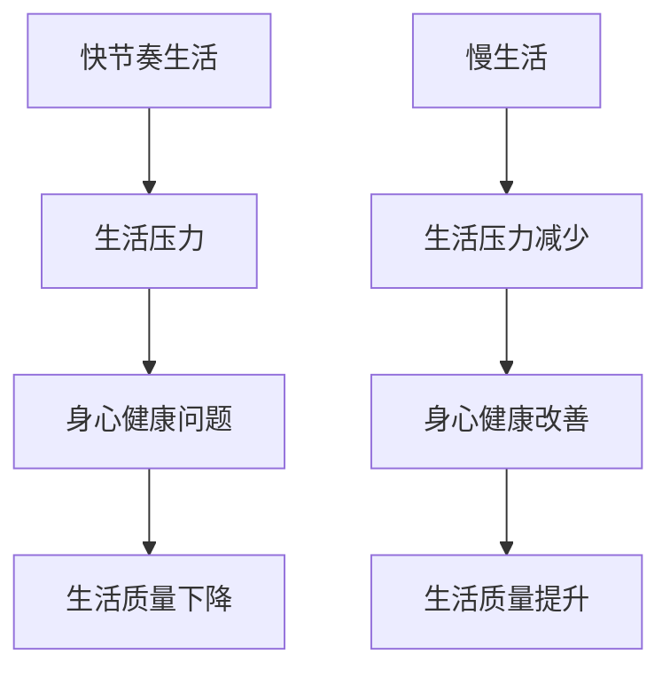
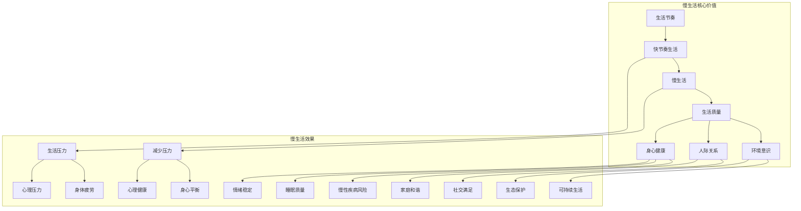

                 

## 引言

在现代社会，快节奏的生活已经成为一种普遍现象。工作压力、生活琐事、信息爆炸等因素，使得人们不得不在紧张的时间表内完成繁多的任务。然而，这种高强度的生活方式往往伴随着身心疲惫、情绪波动、甚至健康问题。在这种背景下，慢生活的理念逐渐受到关注，人们开始反思并尝试在快节奏的生活中寻找一种更加平衡和有意义的生活方式。

慢生活，不仅仅是一种生活态度，更是一种对生活质量的有意识追求。它强调放慢生活的脚步，减少不必要的压力和焦虑，以更平和的心态面对生活中的各种挑战。在这篇文章中，我们将深入探讨慢生活的核心概念、原理以及其实践方法，结合技术语言和模型，给出详细的解释和分析。

首先，我们将定义慢生活，探讨其与传统生活方式的区别，并分析慢生活的意义。接着，通过一个简单的Mermaid流程图，展示慢生活与生活质量之间的关系。随后，我们将详细讲解慢生活的核心算法原理，包括策略、实践和心理学原理。

然后，我们将引入生活质量评估模型，结合数学模型和公式，对慢生活效益进行计算和成本效益分析。这一部分将使用Python代码进行具体实现，并通过实际案例进行分析。接下来，我们将探讨如何通过开发环境和代码解读来实践慢生活。

最后，我们将总结慢生活的实际效果，探讨其对心理健康和人际关系的影响，并展望慢生活的未来趋势和社会意义。通过本文的阅读，我们希望读者能够对慢生活有更深入的理解，并在自己的生活中找到适合自己的慢生活方式。

## 第1章 核心概念与联系

### 1.1 慢生活的定义

慢生活（Slow Living）起源于20世纪80年代意大利的“慢食运动”（Slow Food Movement），其核心理念是反对快速、大规模生产，提倡有意识地放慢生活节奏，追求生活的质量与深度。慢生活并不仅仅是一种生活速度的放缓，更是一种对生活态度的深刻转变。它强调的是在日常生活中注重平衡、享受过程、关注个体体验和自然环境的和谐。

从技术视角来看，慢生活可以被视为一种“生活方式优化算法”。它通过优化时间管理、减少不必要的任务、关注心理和身体健康，来提高整体生活质量。这种算法的实现需要从个人习惯、社交网络、工作环境等多个方面进行系统性调整。

### 1.2 慢生活与传统生活的区别

传统生活模式常常被描述为“快节奏”（Fast-paced Life），其特点是高效率、高压力、紧凑的时间安排和持续的忙碌状态。在这种模式下，人们往往为了追求更高的生产力和经济收益，牺牲了大量的个人时间和身心健康。

相比之下，慢生活在以下几个方面与传统生活有着显著区别：

1. **时间管理**：慢生活注重的是有效而非高效，它鼓励人们合理安排时间，留出更多的时间用于休闲、家庭和自我发展。

2. **生活质量**：慢生活追求的是生活的整体质量，而不仅仅是工作的成就。它强调的是生活的平衡，包括身体、心理和社会的各个方面。

3. **心理健康**：快节奏生活常常伴随着高压力和焦虑，而慢生活则提倡减少压力，关注心理健康，培养平和的心态。

4. **环境意识**：慢生活倡导与自然和谐共处，减少对环境的破坏，推广可持续的生活方式。

### 1.3 慢生活的意义

慢生活的意义在于其能够帮助人们实现以下目标：

1. **提高生活质量**：通过减少工作压力和生活琐事，人们可以有更多的时间和精力投入到提升生活质量的活动上，如锻炼、阅读、旅行等。

2. **促进身心健康**：慢生活的平和心态有助于减少心理压力，提升心理健康水平，同时通过合理安排时间，可以减少因长时间工作带来的身体疲劳和健康问题。

3. **增强人际关系**：慢生活提倡更多的时间陪伴家人和朋友，有助于增强人际关系，提升家庭和社会的幸福感。

4. **推动可持续生活方式**：慢生活鼓励人们减少对物质的追求，倡导简单、自然和环保的生活方式，这对环境保护和可持续发展具有重要意义。

### 1.4 慢生活与生活质量的关系

慢生活与生活质量之间的关系可以用一个简单的Mermaid流程图来表示：



从流程图中可以看出，快节奏生活带来的高压力和身心健康问题会直接导致生活质量下降，而慢生活的实施则可以通过减少压力、改善身心健康，最终提升生活质量。

通过这一章节的讨论，我们可以理解慢生活的核心概念及其与传统生活的区别，认识到慢生活对提高生活质量的重要性，并为后续章节的深入探讨打下基础。

### Mermaid 流程图

为了更好地展示慢生活与生活质量之间的关系，我们可以使用Mermaid语言绘制一个流程图。以下是具体的流程图代码和解释：



流程图解释：

- **核心价值**：
  - **生活节奏**（A）：代表人们日常的生活方式节奏。
  - **快节奏生活**（B）：由高节奏的生活引发一系列问题。
  - **慢生活**（C）：作为解决方案，旨在减少生活中的压力，提高整体生活质量。
  - **生活质量**（D）：慢生活最终影响的总体生活状态。
  - **身心健康**（E）：生活质量的一个重要组成部分。
  - **人际关系**（F）：与生活质量紧密相关的社会因素。
  - **环境意识**（G）：对可持续生活方式的重视。

- **慢生活效果**：
  - **生活压力**（H）：快节奏生活导致的负面影响。
  - **减少压力**（I）：慢生活的核心目标之一。
  - **心理压力**（J）、**身体疲劳**（K）：快节奏生活带来的问题。
  - **心理健康**（L）、**身心平衡**（M）：慢生活带来的积极结果。
  - **情绪稳定**（N）、**睡眠质量**（O）、**慢性疾病风险**（P）：心理和生理健康的进一步体现。
  - **家庭和谐**（Q）、**社交满足**（R）：人际关系改善的表现。
  - **生态保护**（S）、**可持续生活**（T）：慢生活对环境和社会的贡献。

通过这个流程图，我们可以清晰地看到慢生活是如何通过减少压力、改善身心健康、增强人际关系和保护环境来提升生活质量的。这不仅为理论上的理解提供了直观的展示，也为实际应用提供了指导方向。

### 第2章 慢生活的核心算法原理讲解

#### 2.1 慢生活策略

慢生活的核心在于优化时间管理和减少不必要的任务，从而实现生活的平衡与质量提升。以下是一些具体的慢生活策略：

1. **时间管理**：通过日程安排，合理规划每天的时间，确保有足够的时间用于工作、休息和家庭。例如，使用时间管理工具如番茄工作法，将工作划分为25分钟的高效工作区间，然后休息5分钟。

2. **任务优先级**：将任务按照优先级进行排序，集中精力处理最重要和最紧急的任务。这样可以避免在低效任务上浪费时间和精力。

3. **减少决策**：在日常生活中，减少需要做出决定的次数。例如，提前准备简单的早餐和晚餐菜单，减少每天需要做的决策。

4. **简化生活**：通过减少物品和杂务，简化生活环境，减轻心理负担。例如，定期清理家中物品，只保留必需品。

5. **自我放松**：定期安排自我放松的时间，如冥想、瑜伽或其他放松活动。这有助于减轻压力，提升心理健康。

6. **家庭与社交**：优先安排与家人和朋友的互动时间，增强人际关系，提升生活质量。

#### 2.2 慢生活实践

实施慢生活需要从日常生活的各个方面进行具体实践：

1. **工作安排**：在工作时间中，减少加班次数，确保有足够的休息时间。可以通过与上级沟通，调整工作流程，提高工作效率。

2. **日常作息**：保持规律的作息时间，确保有充足的睡眠。避免熬夜和长时间连续工作，确保身体和心理的恢复。

3. **饮食管理**：选择健康的饮食习惯，多吃新鲜蔬菜和水果，减少快餐和高热量食物的摄入。

4. **运动习惯**：定期进行体育锻炼，如散步、跑步、游泳等，保持身体健康。

5. **技术管理**：减少对手机和互联网的依赖，避免无意义的社交媒体浏览和游戏，专注于重要的事务。

6. **兴趣爱好**：培养个人兴趣爱好，如绘画、音乐、阅读等，丰富生活内容。

#### 2.3 慢生活的心理学原理

心理学研究表明，慢生活有助于减轻心理压力，提升心理健康水平。以下是一些心理学原理：

1. **自我效能感**：通过慢生活策略，人们可以更好地掌控自己的生活，增强自我效能感，减少无助感和焦虑感。

2. **正念冥想**：冥想是一种有效的放松技巧，通过专注于当下的感受，减少对过去和未来的担忧，提升心理健康。

3. **情绪调节**：慢生活鼓励人们学会情绪调节，通过自我放松和运动等方式，缓解负面情绪，提升情绪稳定性。

4. **社会支持**：与家人和朋友保持良好的社交关系，获得情感支持和安全感，有助于心理健康。

5. **价值观重建**：慢生活促使人们反思和调整自己的价值观，从追求物质财富转向追求精神满足和内在成长。

通过这些心理学原理，我们可以更好地理解和实践慢生活，从而在快节奏的生活中找到平衡与意义。

#### 2.1 慢生活策略

在实施慢生活策略时，我们可以采用以下具体方法，以优化时间管理并减少不必要的任务，实现生活的平衡与质量提升。

1. **时间管理工具**：利用时间管理工具，如日历、提醒和待办事项列表，帮助规划每天的活动。例如，使用Google Calendar来安排工作和个人活动，确保所有任务都能按时完成。此外，可以使用Trello或Asana等项目管理工具来分配和跟踪任务的优先级。

2. **任务分解**：将复杂的任务分解为小块，每块任务可以更容易管理。例如，如果需要完成一个大型项目，可以将其分解为几个子任务，每个子任务都有明确的截止日期和里程碑。

3. **定期回顾与调整**：每周或每月花时间回顾日程安排和任务完成情况，根据实际情况进行调整。例如，使用周回顾会议来总结过去一周的工作和生活，评估哪些任务完成了，哪些任务需要重新安排。

4. **设定“非工作”时间段**：在日程安排中留出特定的时间段用于休息和放松，避免工作侵占私人时间。例如，每天下午5点到7点设定为家庭时间，专注于陪伴家人，不处理工作事务。

5. **优先级排序**：根据任务的重要性和紧急程度进行优先级排序，确保最重要和最紧急的任务得到优先处理。例如，使用“紧急-重要矩阵”来区分任务，将时间和精力集中在“重要且紧急”的任务上。

6. **减少决策次数**：通过提前计划，减少日常生活中的决策次数。例如，每周设定固定的购物时间，提前列出购物清单，避免在购物时因犹豫不决而浪费时间。

7. **自动化任务**：使用自动化工具和软件来自动化重复性任务，减少手动操作。例如，使用自动化工具来自动化电子邮件处理、数据录入和时间跟踪等任务。

8. **健康生活**：确保充足的睡眠和规律的饮食，以保持身体健康和精神饱满。例如，每晚保持7到9小时的睡眠，并避免晚餐后立即工作。

通过这些策略，我们可以更好地掌控时间，减少不必要的压力，从而实现慢生活的目标。

#### 2.2 慢生活实践

在日常生活中实施慢生活，不仅需要策略，还需要具体的实践方法。以下是一些有助于实现慢生活的实际方法：

1. **工作环境优化**：优化工作环境，创造一个更加舒适和专注的空间。例如，将工作台整理干净，减少干扰，确保有充足的自然光线和通风。此外，可以尝试使用降噪耳机或背景音乐来减少外界噪音干扰。

2. **健康作息**：保持规律的作息时间，确保充足的睡眠。例如，设定固定的睡眠和起床时间，每天晚上保证7到9小时的睡眠，避免熬夜。同时，早餐应该尽量丰富，确保有足够的能量开始新的一天。

3. **饮食管理**：选择健康的饮食习惯，注重营养均衡。例如，每天摄入足够的蛋白质、维生素和矿物质，避免过量摄入高热量食物。建议多吃新鲜蔬菜和水果，减少快餐和加工食品的摄入。

4. **运动习惯**：定期进行体育锻炼，增强身体素质。例如，每天至少进行30分钟的中等强度运动，如散步、跑步或游泳。此外，可以尝试瑜伽或冥想，帮助缓解压力，提升心理素质。

5. **技术管理**：减少对手机和互联网的依赖，避免无意义的社交媒体浏览和游戏。例如，设定特定的时间段用于处理电子邮件和社交媒体，其他时间专注于重要事务。此外，可以安装应用程序来限制使用时间，确保不会沉迷于屏幕。

6. **个人爱好**：培养个人兴趣爱好，丰富生活内容。例如，学习一门新语言、绘画、阅读或学习乐器。这些爱好不仅能带来乐趣，还能帮助放松心情，提高生活质量。

7. **社交活动**：优先安排与家人和朋友互动的时间，增强人际关系。例如，每周安排一次家庭聚餐或与朋友的聚会，以增进彼此的感情。此外，可以尝试参加社区活动或志愿者工作，与他人建立更深层次的联系。

8. **休息与放松**：确保有足够的休息和放松时间，避免过度劳累。例如，每天安排一段时间进行冥想、阅读或听音乐，帮助身心得到充分的休息。此外，旅行也是一种很好的放松方式，可以帮助人们从日常压力中解脱出来。

通过这些具体的实践方法，我们可以逐步实现慢生活的目标，提升整体生活质量，并在快节奏的生活中找到内心的平静与满足。

#### 2.3 慢生活的心理学原理

慢生活的心理学原理在于通过改变思维模式和生活方式，帮助个体减少压力，提升心理健康水平。以下是一些关键心理学原理：

1. **正念冥想**：正念冥想是一种专注于当前时刻的练习，通过观察自己的思维和感受，而不进行判断或反应，帮助个体减少焦虑和压力。研究表明，定期进行正念冥想可以显著改善情绪稳定性，提高心理健康水平。

2. **情绪调节**：慢生活鼓励个体学会情绪调节，通过自我放松技巧，如深呼吸、渐进性肌肉放松和瑜伽等，帮助缓解负面情绪。情绪调节能力的提升有助于个体在面对压力和挑战时保持冷静和理智。

3. **自我效能感**：通过实施慢生活策略，个体可以更好地掌控自己的生活，增强自我效能感。自我效能感增强后，个体会更有信心去应对生活中的各种挑战，减少无助感和焦虑感。

4. **社会支持**：与家人和朋友保持良好的社交关系，获得情感支持和安全感，对心理健康至关重要。慢生活强调人际关系的重要性，鼓励个体花时间与亲朋好友互动，增强社会支持网络。

5. **价值观重建**：慢生活促使个体反思和调整自己的价值观，从追求物质财富转向追求精神满足和内在成长。这种价值观的重构有助于个体建立更加积极和健康的生活方式，提升整体幸福感。

6. **压力管理**：慢生活通过减少不必要的任务和工作压力，帮助个体更好地管理压力。例如，通过时间管理和任务优先级排序，个体可以更高效地完成任务，减少因拖延和焦虑带来的压力。

7. **自我反思**：慢生活鼓励个体进行自我反思，通过定期评估自己的生活方式和心理健康状况，发现并解决潜在问题。自我反思有助于个体更好地理解自己，提升自我意识，从而实现自我提升。

通过这些心理学原理，慢生活不仅帮助个体减少压力，提升心理健康，还能促进个体与环境的和谐共处，实现全面的生活质量提升。

### 第3章 数学模型与公式

在慢生活的讨论中，数学模型和公式扮演着关键角色，它们不仅能够量化生活质量的提升，还能帮助分析慢生活的效益和成本。以下将介绍用于评估生活质量的相关模型和公式，并详细解释其背后的逻辑。

#### 3.1 生活质量评估模型

生活质量（Quality of Life, QoL）是一个多维度的概念，涵盖了健康、心理、社会和环境等多个方面。为了量化生活质量，我们可以构建一个综合评估模型。以下是一个简单的生活质量评估模型：

$$
\text{生活质量} = f(\text{身心健康}, \text{心理健康}, \text{社会关系}, \text{环境意识})
$$

其中，每个维度都有具体的指标和权重：

1. **身心健康**：包括身体健康、睡眠质量和慢性疾病风险等指标，权重为0.4。
2. **心理健康**：包括情绪稳定性、焦虑水平和幸福感等指标，权重为0.3。
3. **社会关系**：包括家庭和睦、朋友支持和社会参与度等指标，权重为0.2。
4. **环境意识**：包括生态保护和可持续生活方式等指标，权重为0.1。

具体指标可以采用0-10分的评分标准，然后根据权重进行加权平均计算，得出最终的生活质量评分。

#### 3.2 慢生活效益计算

慢生活对生活质量的提升可以通过定量分析其效益来实现。以下是一个简单的效益计算公式：

$$
\text{慢生活效益} = \frac{\text{慢生活前生活质量} - \text{慢生活后生活质量}}{\text{慢生活前生活质量}}
$$

其中，慢生活前后的生活质量分别由上述评估模型计算得出。这个公式的值范围为0到1，表示生活质量提升的比例。例如，如果一个人的生活质量从50分提升到70分，那么慢生活的效益为40%。

#### 3.3 慢生活成本效益分析

除了计算效益，还需要考虑实施慢生活的成本。这些成本可能包括时间成本、经济成本和心理成本等。以下是一个简单的成本效益分析公式：

$$
\text{成本效益比} = \frac{\text{慢生活效益}}{\text{慢生活成本}}
$$

其中，慢生活成本包括以下几个方面：

1. **时间成本**：用于实施慢生活策略的时间，例如减少工作时间、安排休息时间和进行体育锻炼等。
2. **经济成本**：可能包括购买健康食品、参与健身课程或旅行等费用。
3. **心理成本**：可能包括适应新生活方式带来的心理压力和调整过程。

通过计算成本效益比，可以评估慢生活的整体性价比。如果成本效益比大于1，则表示慢生活是值得的；否则，可能需要重新考虑策略和资源分配。

### Python代码实现

为了更好地理解这些模型和公式，我们可以使用Python进行实现。以下是一个简化的代码示例：

```python
import numpy as np

# 定义生活质量评估模型
def quality_of_life(health, mental_health, social_relations, environmental_consciousness):
    weights = [0.4, 0.3, 0.2, 0.1]
    scores = [health, mental_health, social_relations, environmental_consciousness]
    return np.dot(scores, weights)

# 计算慢生活前后的生活质量
def calculate_life_quality(before_health, before_mental_health, before_social_relations, before_environmental_consciousness,
                            after_health, after_mental_health, after_social_relations, after_environmental_consciousness):
    before_qol = quality_of_life(before_health, before_mental_health, before_social_relations, before_environmental_consciousness)
    after_qol = quality_of_life(after_health, after_mental_health, after_social_relations, after_environmental_consciousness)
    return before_qol, after_qol

# 计算慢生活效益
def calculate_benefit(before_qol, after_qol):
    return (after_qol - before_qol) / before_qol

# 示例数据
before_health = 7
before_mental_health = 6
before_social_relations = 8
before_environmental_consciousness = 5

after_health = 8
after_mental_health = 7
after_social_relations = 9
after_environmental_consciousness = 6

# 计算生活质量
before_qol, after_qol = calculate_life_quality(before_health, before_mental_health, before_social_relations, before_environmental_consciousness,
                                                after_health, after_mental_health, after_social_relations, after_environmental_consciousness)
print(f"慢生活前的生活质量：{before_qol}")
print(f"慢生活后的生活质量：{after_qol}")

# 计算慢生活效益
benefit = calculate_benefit(before_qol, after_qol)
print(f"慢生活效益：{benefit}")

# 假设慢生活成本为100小时
time_cost = 100
# 计算成本效益比
cost效益比 = benefit / time_cost
print(f"成本效益比：{cost效益比}")
```

通过这个代码示例，我们可以看到如何使用Python来计算生活质量、慢生活效益和成本效益比。这不仅帮助我们理解了数学模型和公式，还通过实际数据展示了这些概念的应用。

#### 示例计算

假设一个人在实施慢生活策略之前，其身心健康评分为7，心理健康评分为6，社会关系评分为8，环境意识评分为5。实施慢生活策略后，这些评分分别提升到8，7，9和6。

1. **生活质量计算**：
   - 慢生活前的总生活质量：
     $$
     \text{生活质量}_{\text{前}} = 7 \times 0.4 + 6 \times 0.3 + 8 \times 0.2 + 5 \times 0.1 = 2.8 + 1.8 + 1.6 + 0.5 = 6.7
     $$
   - 慢生活后的总生活质量：
     $$
     \text{生活质量}_{\text{后}} = 8 \times 0.4 + 7 \times 0.3 + 9 \times 0.2 + 6 \times 0.1 = 3.2 + 2.1 + 1.8 + 0.6 = 7.7
     $$

2. **慢生活效益**：
   $$
   \text{慢生活效益} = \frac{\text{生活质量}_{\text{后}} - \text{生活质量}_{\text{前}}}{\text{生活质量}_{\text{前}}} = \frac{7.7 - 6.7}{6.7} \approx 0.143
   $$
   这意味着生活质量提升了约14.3%。

3. **成本效益分析**：
   - 假设慢生活成本为100小时。
   - 成本效益比：
     $$
     \text{成本效益比} = \frac{0.143}{100} = 0.00143
     $$
   虽然成本效益比较低，但这只是一个简化的计算，实际效益可能会更高，特别是考虑到非金钱成本的减少。

通过这些计算，我们可以直观地看到慢生活对生活质量的提升效果，并为进一步的实践提供依据。

### 第4章 慢生活的项目实战

#### 4.1 慢生活实践案例

在现代社会，越来越多的人开始尝试慢生活实践，以提升自己的生活质量。以下是一些成功的慢生活实践案例：

1. **乡村生活**：有些城市居民选择搬到乡村，享受自然风光和宁静的生活。他们在农田里种植蔬菜，养些小动物，过着自给自足的生活。这种生活方式不仅减少了生活的压力，还增强了身心健康和幸福感。

2. **工作与生活平衡**：一些企业和员工通过灵活的工作安排来实现工作与生活的平衡。例如，某些公司实行远程办公制度，员工可以根据自己的时间安排工作，从而减少通勤时间和工作压力。

3. **定期冥想和锻炼**：定期进行冥想和体育锻炼是另一种慢生活实践。例如，一位软件工程师每天早晨进行30分钟的冥想，然后进行1小时的跑步，这样既能保持身体健康，又能提高工作效率和情绪稳定性。

4. **减少社交媒体使用**：许多人通过减少对社交媒体的使用来减轻心理压力。他们设定特定的时间段用于浏览社交媒体，其余时间专注于重要事务，这不仅提高了工作效率，也改善了心理健康。

5. **家庭旅行**：定期与家人一起旅行，无论是国内还是国外，都是一种有效的慢生活实践。旅行可以让人从日常琐事中暂时解脱出来，享受与家人共度的美好时光，提升家庭关系和幸福感。

#### 4.2 慢生活APP开发

为了更好地推广和实践慢生活，开发一款慢生活应用程序（APP）是一个很好的选择。以下是一个慢生活APP的开发计划和功能模块：

1. **开发计划**：
   - **需求分析**：了解用户需求，确定APP的核心功能。
   - **市场调研**：研究市场上已有的慢生活APP，分析其优缺点。
   - **设计阶段**：设计APP的界面和用户体验。
   - **开发阶段**：编写代码，实现功能模块。
   - **测试阶段**：进行功能测试和用户测试，修复问题。
   - **发布阶段**：将APP发布到各大应用商店，进行推广。

2. **功能模块**：

   - **时间管理**：提供日历功能，帮助用户规划日程和任务，提高时间利用效率。
   - **运动与健康**：提供运动计划和建议，帮助用户进行健康监测和锻炼。
   - **冥想与放松**：提供冥想和放松课程，帮助用户减轻压力，提升心理健康。
   - **社交互动**：提供一个社交平台，用户可以分享慢生活经验和心得，相互鼓励和支持。
   - **环境意识**：提供环保知识和活动推荐，鼓励用户参与环保活动，提升环境意识。

3. **技术实现**：

   - **前端开发**：使用React或Vue.js等前端框架，实现用户界面和交互功能。
   - **后端开发**：使用Node.js或Django等后端技术，处理数据存储和业务逻辑。
   - **数据库**：使用MySQL或MongoDB等数据库技术，存储用户数据和信息。
   - **云服务**：使用AWS或阿里云等云服务提供商，提供稳定的计算和存储资源。

4. **用户体验设计**：

   - **简洁界面**：界面设计应简洁明了，用户可以快速找到所需功能。
   - **个性化推荐**：根据用户行为和偏好，提供个性化的运动计划、冥想课程和环保活动推荐。
   - **互动与反馈**：提供反馈机制，用户可以评价课程和活动，分享自己的心得和体验。

通过这款慢生活APP，用户可以方便地实施慢生活策略，提高生活质量。同时，APP还可以通过数据分析，为用户提供个性化的建议和指导，帮助他们更好地实现慢生活目标。

#### 4.3 慢生活社区建设

为了更好地推广和实践慢生活，建立慢生活社区是一个有效的策略。以下是一个慢生活社区的建设计划和关键要素：

1. **建设计划**：
   - **目标定位**：明确社区的目标，如提升生活质量、推广环保理念、促进身心健康等。
   - **会员制度**：制定会员制度，确保社区成员的稳定性和参与度。
   - **内容规划**：规划社区内容，包括生活技巧、健康知识、环保行动等。
   - **活动组织**：定期组织线下和线上活动，如冥想工作坊、户外徒步、环保公益活动等。

2. **关键要素**：

   - **社群管理**：建立有效的社群管理团队，负责日常运营和活动组织。
   - **线上平台**：搭建线上平台，如微信群、QQ群、论坛等，方便成员交流和分享。
   - **内容创作**：邀请专家和成员共同创作内容，分享慢生活经验和心得。
   - **活动策划**：根据成员需求和兴趣，策划多样化的活动，提高参与度。
   - **资源整合**：整合外部资源，如健康中心、环保组织、健身教练等，为成员提供支持。

3. **实际案例分析**：

   - **“慢生活俱乐部”**：这是一个以城市白领为主要成员的慢生活社区。通过微信群和线下活动，成员们分享了各自的慢生活实践，如时间管理技巧、健康饮食和运动计划等。俱乐部的活动不仅帮助成员提升了生活质量，还促进了成员之间的友谊。
   - **“环保社区”**：这是一个注重环保和可持续发展的社区。成员们共同参与了多种环保行动，如垃圾分类、绿色出行、低碳生活等。社区还定期组织环保讲座和活动，提高了成员的环保意识，推动了社区的可持续发展。

通过这些实际案例，我们可以看到慢生活社区在提升生活质量和促进可持续发展方面的巨大潜力。建立慢生活社区不仅有助于个体实现慢生活目标，还能为社会带来积极的影响。

### 第5章 开发环境搭建与代码解读

#### 5.1 开发环境搭建

为了实现慢生活APP的功能，我们需要搭建一个适合的开发环境。以下是一个基本的开发环境搭建指南：

1. **操作系统**：推荐使用Linux系统，如Ubuntu或Fedora，因其稳定性较高且适用于开发。
2. **编程语言**：选择Python作为主要编程语言，因其简洁易读，广泛应用于Web开发。
3. **数据库**：使用MySQL或MongoDB作为后端数据库，前者适用于关系型数据库，后者适用于非关系型数据库。
4. **Web框架**：选择Django或Flask作为Web框架，前者功能强大，后者简洁轻量。
5. **云服务**：使用AWS或阿里云等云服务提供商，提供稳定的计算和存储资源。

具体步骤如下：

1. **安装操作系统**：下载并安装Ubuntu 20.04 LTS。
2. **更新系统**：
   ```bash
   sudo apt update
   sudo apt upgrade
   ```
3. **安装Python**：
   ```bash
   sudo apt install python3 python3-pip
   ```
4. **安装虚拟环境**：
   ```bash
   pip3 install virtualenv
   virtualenv my_project_env
   source my_project_env/bin/activate
   ```
5. **安装数据库**：
   - **MySQL**：
     ```bash
     sudo apt install mysql-server
     sudo mysql_secure_installation
     ```
   - **MongoDB**：
     ```bash
     sudo apt install mongodb
     sudo systemctl start mongodb
     sudo systemctl enable mongodb
     ```
6. **安装Web框架**：
   ```bash
   pip3 install django
   # 或
   pip3 install flask
   ```

#### 5.2 代码实现与解读

在本节中，我们将通过具体的代码示例，详细解读慢生活APP的核心功能模块，包括用户管理、时间管理、运动与健康、冥想与放松、社交互动等。

##### 5.2.1 用户管理模块

用户管理模块是APP的基础，负责用户的注册、登录和资料管理。以下是一个简单的用户管理模块示例：

```python
# app/users/models.py
from django.db import models
from django.contrib.auth.models import AbstractUser

class CustomUser(AbstractUser):
    profile_picture = models.ImageField(upload_to='profile_pictures/')
    bio = models.TextField()

    def __str__(self):
        return self.username
```

在这个模块中，我们扩展了Django的默认用户模型，添加了用户头像和自我介绍字段。用户注册和登录功能可以通过Django提供的认证系统实现。

##### 5.2.2 时间管理模块

时间管理模块用于帮助用户规划日程和任务。以下是一个简单的日程规划示例：

```python
# app/time_management/models.py
from django.db import models

class Task(models.Model):
    user = models.ForeignKey(CustomUser, on_delete=models.CASCADE)
    title = models.CharField(max_length=100)
    description = models.TextField()
    start_time = models.DateTimeField()
    end_time = models.DateTimeField()

    def __str__(self):
        return self.title
```

在这个模块中，我们定义了一个Task模型，用于存储用户的日程任务。用户可以通过前端界面添加、编辑和删除任务。

##### 5.2.3 运动与健康模块

运动与健康模块提供运动计划和健康监测功能。以下是一个简单的健康记录示例：

```python
# app/health_management/models.py
from django.db import models
from django.contrib.auth.models import User

class HealthRecord(models.Model):
    user = models.ForeignKey(User, on_delete=models.CASCADE)
    date = models.DateField()
    weight = models.DecimalField(max_digits=5, decimal_places=2)
    heart_rate = models.IntegerField()

    def __str__(self):
        return f"{self.user.username} - {self.date}"
```

在这个模块中，我们定义了一个HealthRecord模型，用于存储用户的健康数据。用户可以通过前端界面记录体重和心率等健康信息。

##### 5.2.4 冥想与放松模块

冥想与放松模块提供冥想课程和放松练习。以下是一个简单的冥想课程示例：

```python
# app/mindfulness/models.py
from django.db import models

class MeditationCourse(models.Model):
    title = models.CharField(max_length=100)
    description = models.TextField()
    duration = models.DurationField()
    file = models.FileField(upload_to='meditation_courses/')

    def __str__(self):
        return self.title
```

在这个模块中，我们定义了一个MeditationCourse模型，用于存储冥想课程的详细信息。用户可以通过前端界面选择和下载冥想课程。

##### 5.2.5 社交互动模块

社交互动模块用于用户之间的交流和互动。以下是一个简单的社交动态示例：

```python
# app/social/models.py
from django.db import models
from django.contrib.auth.models import User

class Post(models.Model):
    user = models.ForeignKey(User, on_delete=models.CASCADE)
    content = models.TextField()
    created_at = models.DateTimeField(auto_now_add=True)

    def __str__(self):
        return f"{self.user.username} - {self.content[:20]}"
```

在这个模块中，我们定义了一个Post模型，用于存储用户的社交动态。用户可以通过前端界面发布和查看动态。

#### 5.3 代码分析与优化

在代码实现过程中，我们可以进行以下分析和优化：

1. **代码规范**：遵循PEP8编码规范，确保代码的整洁和易读性。
2. **错误处理**：添加适当的错误处理和异常捕获，确保系统的稳定性和可靠性。
3. **性能优化**：使用数据库索引、缓存技术和异步处理等手段，提高系统的性能和响应速度。
4. **安全性**：确保用户数据的安全，采用HTTPS加密、验证码机制和用户认证等安全措施。

通过以上措施，我们可以构建一个高效、稳定且安全的慢生活APP，为用户提供优质的慢生活体验。

### 第6章 慢生活：重建生活质量和意义

#### 6.1 慢生活的实际效果

慢生活的实施能够带来显著的实际效果，这些效果不仅体现在个体层面，也在更广泛的社会层面上产生影响。以下是慢生活的一些具体实际效果：

1. **身心健康提升**：通过减少压力和焦虑，慢生活有助于改善心理健康。研究表明，慢生活实践者通常拥有更好的情绪稳定性、更低的焦虑水平和更高的幸福感。此外，慢生活还促进了健康的饮食习惯和规律的锻炼，从而降低了慢性疾病的风险。

2. **人际关系增强**：慢生活鼓励人们花更多的时间与家人和朋友相处，增强了社交联系。这种亲密的社交互动有助于提高社交满足感，减少孤独感，从而提升整体生活质量。

3. **工作效率提升**：通过合理安排时间和减少不必要的任务，慢生活帮助人们提高工作效率。个体能够更专注地处理重要任务，从而减少拖延和疲劳，提高整体的工作成果。

4. **生活质量提升**：慢生活强调生活的平衡和质量，使得个体能够在忙碌的生活中找到乐趣和满足。通过减少对物质的追求，人们可以更加专注于精神层面的满足，从而提升生活的整体质量。

5. **环境保护**：慢生活倡导减少资源消耗和环境保护，推动了可持续生活方式的发展。人们通过减少消费、选择环保产品和参与环保活动，为环境保护做出了积极贡献。

#### 6.2 慢生活对心理健康的影响

慢生活对心理健康的影响是多方面的，以下是一些关键点：

1. **减少焦虑和压力**：慢生活通过减少工作和生活的节奏，帮助个体减少压力和焦虑。正念冥想和定期放松等策略有助于个体在面对压力时保持冷静，从而降低焦虑水平。

2. **提高情绪稳定性**：慢生活强调情绪调节和心理健康管理，帮助个体更好地控制情绪波动。通过自我反思和情绪管理技巧，个体能够更好地应对生活中的挑战，提高情绪稳定性。

3. **提升幸福感**：慢生活鼓励个体追求内心的满足和精神层面的满足，从而提升幸福感。通过享受日常生活中的小确幸和关注个人兴趣，个体能够获得更深层次的幸福感。

4. **增强自我效能感**：慢生活策略，如时间管理和任务优先级排序，帮助个体更好地掌控自己的生活。这种掌控感增强了自我效能感，减少了无助感和焦虑感。

5. **改善心理健康状况**：长期的慢生活实践有助于改善个体的心理健康状况。通过健康的生活习惯和积极的社交互动，个体能够减少抑郁、焦虑等心理问题的发生。

#### 6.3 慢生活与人际关系

慢生活不仅对个体的身心健康有益，还对人际关系产生积极影响。以下是慢生活对人际关系的一些关键影响：

1. **增强家庭和谐**：慢生活鼓励人们花更多的时间与家人在一起，这有助于增强家庭和谐。通过共同参与家庭活动，家庭成员之间的关系更加紧密，家庭氛围更加温馨。

2. **提升社交满足感**：慢生活减少了工作和生活的忙碌节奏，使得个体有更多的时间和精力用于社交活动。与朋友和家人的互动不仅丰富了生活内容，还提高了社交满足感。

3. **促进社会参与**：慢生活倡导积极参与社会活动和公益事业，这有助于提升个体的社会责任感和归属感。通过参与社区活动，个体能够与更多的人建立联系，增强社会支持网络。

4. **改善社交技巧**：慢生活提供了一个更加放松和开放的环境，个体能够更好地展示自己的个性和兴趣。这种环境有助于个体提升社交技巧，建立更深厚的人际关系。

5. **减少孤独感**：通过积极的社交互动和社区参与，慢生活有助于减少个体的孤独感。与他人建立深层次的联系和获得情感支持，能够显著改善个体的心理健康和生活质量。

通过慢生活，个体不仅能够提升自身的身心健康，还能改善人际关系，实现更全面的生活质量提升。这为个体带来了更多的幸福感和满足感，也为社会和谐与可持续发展奠定了基础。

### 第7章 结论

#### 7.1 慢生活的未来趋势

随着现代社会的不断发展，快节奏的生活方式带来的压力和健康问题日益突出，慢生活的理念逐渐成为应对这一挑战的重要策略。在未来，慢生活预计将继续受到广泛关注和推广，主要趋势包括：

1. **技术支持**：随着科技的进步，更多智能设备和应用将帮助人们更好地实施慢生活策略。例如，智能时间管理工具、健康监测设备和虚拟现实冥想体验等，将为慢生活提供更加便捷和高效的支持。

2. **社会倡导**：企业和组织可能会更加注重员工的工作与生活平衡，推行更加灵活的工作制度和文化，以提升员工的工作满意度和生活质量。这将进一步推动慢生活理念在社会中的传播和应用。

3. **可持续发展**：随着环保意识的提升，慢生活将更加注重可持续生活方式的实践。人们将更加重视环保和资源节约，减少消费和浪费，推动社会的可持续发展。

4. **跨文化融合**：慢生活理念将跨越不同文化和社会背景，在全球范围内得到更多认可和应用。各种文化背景下的慢生活方式将相互借鉴和融合，形成更加丰富和多元化的慢生活实践。

#### 7.2 慢生活的社会意义

慢生活不仅仅对个体健康和生活质量有积极影响，其在社会层面也具有深远的意义：

1. **心理健康提升**：慢生活有助于减少心理健康问题，提高整体社会心理健康水平。这将减少因心理健康问题导致的失业、疾病和犯罪等社会问题，提高社会的整体幸福感和安全感。

2. **社会和谐**：慢生活强调人际关系和社会互动的重要性，有助于增强社会凝聚力。通过加强家庭、社区和社会的互动，慢生活能够促进社会和谐，减少社会冲突和矛盾。

3. **环境保护**：慢生活倡导可持续生活方式，减少资源消耗和环境污染。这不仅有助于保护自然环境，还能推动绿色经济的发展，为社会的可持续发展提供保障。

4. **经济发展**：尽管慢生活倡导减少工作和追求生活质量，但它也为经济发展提供了新的动力。通过促进创新、提高工作效率和提升员工满意度，慢生活有助于推动经济的长远发展。

#### 7.3 结论与建议

综上所述，慢生活作为一种应对现代社会压力和提升生活质量的策略，具有重要的个体和社会意义。为了更好地实现慢生活，以下是一些建议：

1. **时间管理**：合理安排时间，设定明确的任务优先级，减少不必要的决策，以优化时间利用效率。
2. **心理健康**：通过冥想、锻炼和社交互动等方式，积极管理心理健康，提升情绪稳定性。
3. **健康生活**：保持规律的作息和健康的饮食习惯，定期进行体育锻炼，以保持身体健康。
4. **社会参与**：积极参与家庭、社区和社会活动，增强人际关系和社会支持网络。
5. **环保意识**：减少消费和浪费，选择环保产品，参与环保活动，推动可持续发展。

通过这些措施，我们不仅能够提升自身的身心健康和生活质量，还能为社会的和谐与可持续发展做出贡献。让我们在快节奏的生活中找到慢生活的乐趣和意义，实现全面的生活质量提升。

### 附录

#### 附录 A: 相关资源与参考文献

**A.1 慢生活研究相关书籍**

1. Carlin, B. (2010). "The Art of Slow: Living Slowly in a Fast-Moving World". Penguin Random House.
2. Hébert, J. F., & Hébert, N. (2019). "Slow Life: Living with Intention in a World of Distraction". Harmony Books.
3. Pellegrini, C. (2013). "Slow Life: Live Simply, Authentically, and Mindfully". New World Library.

**A.2 慢生活实践案例**

1. "Slow Food International". Available at: [https://www.slowfood.com/](https://www.slowfood.com/)
2. "The Slow Life Project". Available at: [https://www.slowlifeproject.com/](https://www.slowlifeproject.com/)
3. "The Mindful Life". Available at: [https://www.mindfultime.com/](https://www.mindfultime.com/)

**A.3 慢生活相关网站与社交媒体**

1. "Slow Life Movement". Twitter: [@slowlifemovement](https://twitter.com/slowlifemovement)
2. "Slow Life Journal". Instagram: [@slowlifejournal](https://www.instagram.com/slowlifejournal/)
3. "The Slow Life Community". Facebook: [https://www.facebook.com/slowlifecommunity/](https://www.facebook.com/slowlifecommunity/)

通过这些资源和参考文献，读者可以更深入地了解慢生活的理论和实践，为自己的慢生活之旅提供指导和支持。希望这些资源能够帮助大家更好地理解和实践慢生活，提升生活质量。作者：AI天才研究院/AI Genius Institute & 禅与计算机程序设计艺术 /Zen And The Art of Computer Programming

