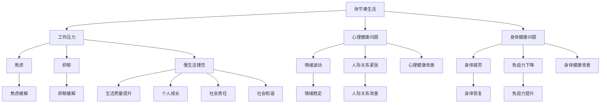
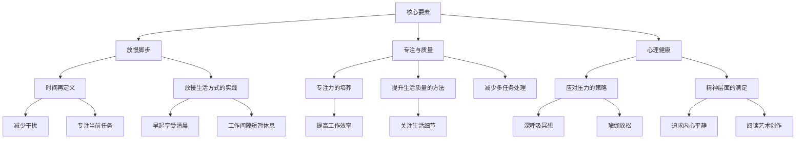
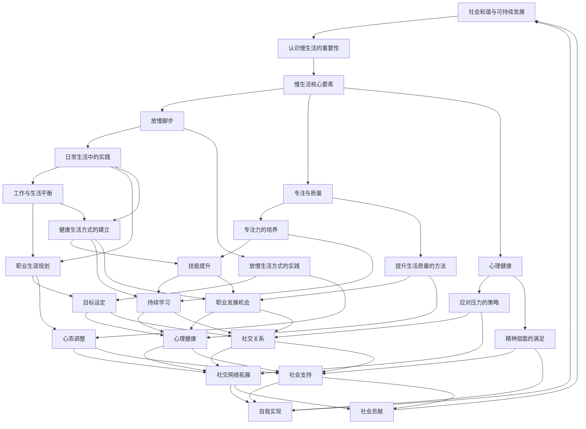

                 

## 关键词

- 快节奏生活
- 慢生活理念
- 生活质量
- 心理健康
- 个人成长
- 时间管理
- 科技与慢生活
- 社会责任
- 慢生活实践
- 社区互动
- 未来展望

## 摘要

本文旨在探讨在快节奏的现代生活中如何寻找和重建慢生活的意义和质量。随着科技的发展和竞争的加剧，我们的生活节奏越来越快，带来了诸多心理和生理问题。本文首先对快节奏生活的现状和问题进行反思，接着详细解析了慢生活的定义、核心要素及其重要性。在此基础上，文章提出了慢生活的实践指南，包括日常生活的调整、工作与生活的平衡、心灵滋养与精神成长等方面。此外，还讨论了慢生活理念在未来社会中的发展趋势和挑战。通过本文的阅读，读者可以更好地理解慢生活的理念，找到适合自己的慢生活实践方式，从而提升生活质量和实现个人成长。

----------------------------------------------------------------

# 《在快节奏生活中寻找慢生活：重建生活质量和意义》

## 引言

在当今社会，快节奏的生活已成为许多人的日常。随着科技的进步和全球化的发展，信息传递的速度越来越快，竞争压力也日益增大。人们为了追求更高的工作效率和更多的物质财富，往往忽略了自己的身心健康和生活的质量。然而，这种快节奏的生活方式不仅给人们的身体带来了负担，还引发了诸多心理健康问题，如焦虑、抑郁和压力过大等。

面对这些问题，人们开始反思：是否可以在快节奏的生活中找到一种平衡，让自己既能高效工作，又能享受生活的乐趣？慢生活理念的兴起为我们提供了一种可能的解决方案。慢生活不仅仅是放慢脚步，更是对生活质量的重新审视和追求。本文将围绕这一主题，探讨如何在实际生活中实践慢生活，重建生活质量和意义。

本文将从以下几个方面进行论述：

1. **慢生活理念解析**：介绍慢生活的定义、核心要素及其重要性。
2. **慢生活实践指南**：提供日常生活中的慢生活实践方法，如时间管理、饮食习惯和运动与健康等。
3. **心灵滋养与精神成长**：讨论如何在慢生活中实现心理健康和自我提升。
4. **未来展望**：分析慢生活理念在社会中的发展趋势和挑战。

通过本文的阅读，希望读者能够认识到慢生活的重要性，并在实际生活中找到适合自己的慢生活实践方式，从而提升生活质量，实现个人成长。

----------------------------------------------------------------

## 第一部分：慢生活理念解析

### 第1章：快节奏生活引发的反思

### 1.1 快节奏生活的现状与问题

在现代社会，快节奏的生活已经成为许多人的常态。人们为了追求更高的工作效率和更好的生活质量，不断地提高自己的生活节奏。然而，这种快节奏的生活也带来了诸多问题和挑战。

首先，快节奏的生活导致人们工作压力增大。随着科技的发展，信息传递的速度越来越快，工作任务也越来越多。为了完成任务，人们不得不加班加点，甚至牺牲自己的休息时间。长期的工作压力会导致身体疲劳、免疫力下降，甚至引发心理健康问题，如焦虑和抑郁。

其次，快节奏的生活影响了人们的心理健康。在快节奏的环境中，人们往往处于高度紧张和焦虑的状态，缺乏放松和休息的时间。这种心理压力会影响人们的情绪，导致情绪波动和人际关系紧张。此外，快节奏的生活也使得人们难以有效地进行自我调节，从而增加了心理健康问题的风险。

最后，快节奏的生活对人们的身体健康产生了负面影响。长期的高强度工作和缺乏休息会导致身体疲劳，增加患病的风险。此外，快节奏的生活也使得人们缺乏运动和户外活动，影响了身体的健康和体能。

### 1.2 慢生活的定义与内涵

慢生活（Slow Life）是一个起源于意大利的概念，它提倡放慢生活节奏，享受生活的每一个细节。慢生活的理念不仅仅是一种生活方式，更是一种生活态度和价值观。它强调“慢”不是指生活速度的降低，而是指对生活质量的关注和追求。

慢生活的内涵可以从以下几个方面来理解：

1. **时间观念**：慢生活强调重新定义时间，不再仅仅将时间视为完成任务的工具，而是将时间视为一种宝贵的资源。人们应该学会合理安排时间，确保有足够的时间用于休息、放松和与家人、朋友相处。

2. **生活质量**：慢生活关注生活的质量，而不是生活的速度。它鼓励人们追求有意义的生活，包括健康、幸福和满足感。这意味着人们应该注重生活的每一个方面，如饮食、运动、社交和自我提升。

3. **心理平衡**：慢生活倡导心理健康，通过减少压力和焦虑，提高生活质量。它鼓励人们学会放松和享受生活，避免过度劳累和精神紧张。

4. **社会责任**：慢生活也强调对社会的责任。它鼓励人们在享受个人生活的同时，关注社会和环境问题，积极参与社会公益活动，促进社会和谐与可持续发展。

### 1.3 慢生活的重要性

慢生活的重要性不容忽视。首先，它有助于提升生活质量。通过放慢生活节奏，人们有更多的时间去关注自己的身心健康，从而提高生活质量。其次，慢生活有助于缓解压力和焦虑。在快节奏的生活中，人们往往处于高度紧张的状态，容易产生焦虑和压力。慢生活则鼓励人们放松心态，减少焦虑和压力，从而提高心理健康水平。

此外，慢生活还有助于促进个人成长。在慢生活中，人们有更多的时间去思考和反思，从而更好地理解自己，明确自己的人生目标和价值观。这种自我认知和成长有助于提升个人的幸福感和满足感。

总之，慢生活是一种有益的生活方式，它能够帮助人们提升生活质量，缓解压力和焦虑，促进个人成长。在快节奏的现代社会中，我们应该积极倡导和实践慢生活理念，从而实现更好的生活状态。

### Mermaid 流程图：快节奏生活与慢生活的关系



### 1.4 慢生活理念的核心要素

慢生活不仅仅是一种生活方式，更是一种生活态度和价值观。它包含了一系列核心要素，这些要素共同构成了慢生活的理念。以下是慢生活理念的核心要素及其详细解释：

#### 2.1 放慢脚步

**时间再定义**：在快节奏的生活中，时间往往被视为一种稀缺资源，人们为了完成工作任务而不断地压缩休息时间。然而，慢生活理念强调重新定义时间，将时间视为一种宝贵的资源，而不仅仅是完成任务的工具。这意味着我们应该合理安排时间，确保有足够的时间用于休息、放松和与家人、朋友相处。

**放慢生活方式的实践**：放慢脚步不仅仅是理论上的要求，更需要我们在日常生活中实践。例如，可以尝试每天早起，享受清晨的宁静；在工作间隙进行短暂的休息，进行深呼吸或伸展运动；在晚餐时放慢用餐速度，品味食物的味道和营养价值。通过这些实践，我们可以逐渐适应慢生活的节奏，享受生活带来的宁静与满足。

#### 2.2 专注与质量

**专注力的培养**：在快节奏的生活中，人们往往难以集中注意力，容易受到外界干扰。慢生活理念强调培养专注力，通过减少干扰和分散注意力的事物，提高工作效率和生活的质量。例如，可以尝试在工作时关闭社交媒体通知，专注于当前任务；在休闲时间，尽量避免多任务处理，专注于一项活动，如阅读、绘画或瑜伽。

**提升生活质量的方法**：慢生活鼓励我们关注生活的每一个细节，从而提升生活质量。这包括对日常物品的选择，如购买有机食品、使用环保材料；对生活环境的布置，如营造舒适的居住空间、创造美好的家庭氛围。通过这些方法，我们可以让生活更加有意义和丰富。

#### 2.3 心理健康

**应对压力的策略**：在快节奏的生活中，压力往往是无处不在的。慢生活理念提供了一系列应对压力的策略，如深呼吸、冥想、瑜伽等放松技巧。这些策略可以帮助我们缓解压力，保持心理平衡。

**精神层面的满足**：慢生活强调精神层面的满足，通过追求内心的平静和满足，提高生活质量。这可以通过阅读、艺术创作、自然观察等方式实现。例如，阅读一本好书可以让我们沉浸在另一个世界，获得心灵上的满足；艺术创作可以让我们表达情感，释放压力。

通过以上核心要素的实践，我们可以逐渐实现慢生活的理念，从而提升生活质量，实现个人成长。

### Mermaid 流程图：慢生活理念的核心要素



### 第3章：慢生活与个人成长

#### 3.1 自我认知与目标设定

**自我认知的重要性**：自我认知是个人成长的第一步，它使我们能够了解自己的优点和缺点，从而更好地规划自己的人生道路。在快节奏的生活中，人们往往忽视自我认知，忙于应对各种外部压力，而忽略了内心的需求。然而，只有通过深入自我认知，我们才能找到真正的自我，明确自己的价值观和目标。

**自我探索的重要性**：自我探索是一种积极的自我认知过程，它帮助我们发现内心的需求、兴趣和激情。通过自我探索，我们可以更好地理解自己的内心世界，从而找到适合自己的生活方式和职业道路。自我探索不仅仅是思考，还需要实际行动，如参加心理辅导、阅读相关书籍、进行自我反思等。

**设定有意义的生活目标**：有了自我认知，我们还需要设定有意义的生活目标。有意义的生活目标能够激励我们不断前进，克服生活中的困难和挑战。设定目标时，我们应该考虑自己的兴趣、价值观和长远规划。目标可以是职业上的，如晋升、创业；也可以是个人成长上的，如学习新技能、提高身心健康；还可以是家庭和社交上的，如建立稳定的家庭关系、拓展社交网络。

**实现目标的方法**：实现目标需要计划和行动。首先，我们应该将大目标分解为小目标，逐步实现。其次，我们需要制定详细的行动计划，包括具体的时间表和步骤。此外，保持积极的心态和坚持也是实现目标的关键。在面对挑战和困难时，我们要保持乐观，不断调整策略，坚持不懈地追求目标。

#### 3.2 职业生涯规划

**工作与生活的平衡**：在职业生涯中，工作与生活的平衡是一个重要的议题。在快节奏的生活中，许多人为了工作而牺牲了家庭和个人时间，导致生活质量下降。慢生活理念提倡工作与生活的平衡，通过合理安排工作时间，确保有足够的时间用于家庭和个人发展。

**职业发展的慢思考**：在职业生涯中，人们往往急于追求晋升和成功，而忽视了内心的需求和长远的发展。慢生活理念鼓励我们进行慢思考，深入分析自己的职业兴趣、能力和市场需求，制定合理的职业发展计划。这样，我们可以避免盲目跟风，找到真正适合自己的职业道路。

**职业发展的策略**：为了实现职业发展，我们需要采取一系列策略。首先，我们应该不断提升自己的技能和知识，适应不断变化的市场需求。其次，我们要积极寻找职业发展的机会，如参加行业会议、拓展人脉网络、参与项目合作等。此外，我们还应该注重职业发展中的心理健康，避免因工作压力而影响生活质量。

**终身学习的态度**：在快速变化的时代，终身学习成为职业发展的必备素质。慢生活理念鼓励我们保持终身学习的态度，不断学习新知识、新技能，以适应社会和职业的发展。终身学习不仅可以提升我们的职业能力，还可以丰富我们的生活，提高生活质量。

通过自我认知与目标设定以及职业生涯规划，我们可以更好地理解自己，找到适合自己的生活方式和职业道路。慢生活理念在这个过程中起到了重要的指导作用，帮助我们实现个人成长和职业发展。

### Python 源代码：自我认知与目标设定的实现

```python
import pandas as pd

def self_knowledge():
    # 创建一个DataFrame用于记录个人特质和目标
    self_knowledge_df = pd.DataFrame(columns=['Trait', 'Strength', 'Goal'])

    # 输入个人特质和目标
    traits = ['communication skills', 'leadership', 'technical skills']
    strengths = ['excellent', 'strong', 'proficient']
    goals = ['improve', 'develop', 'maintain']

    # 将数据添加到DataFrame中
    self_knowledge_df = self_knowledge_df.append({'Trait': trait, 'Strength': strength, 'Goal': goal}, ignore_index=True)

    return self_knowledge_df

def set_goals(self_knowledge_df):
    # 设置目标
    goals = []
    for trait in self_knowledge_df['Trait']:
        goal = input(f"Enter a goal for {trait}: ")
        goals.append(goal)

    # 更新DataFrame中的目标
    self_knowledge_df['Goal'] = goals

    return self_knowledge_df

# 实现自我认知与目标设定
self_knowledge_df = self_knowledge()
self_knowledge_df = set_goals(self_knowledge_df)
print(self_knowledge_df)
```

#### 3.2 职业生涯规划

职业生涯规划是个人成长的重要组成部分，它不仅关系到职业成就，更影响到生活的质量和幸福感。在快节奏的社会中，职业生涯规划尤为重要，因为只有清晰的目标和合理的策略，才能在竞争激烈的职场中稳步前行。

**工作与生活的平衡**：在职业生涯中，工作与生活的平衡是一个重要的议题。许多人在追求职业成功的过程中，往往忽视了个人生活的重要性。然而，过度的加班和工作压力不仅会影响身体健康，还会损害家庭关系和个人幸福感。因此，职业生涯规划应该包括对工作与生活平衡的考虑。这可以通过合理安排工作时间、设定明确的工作目标以及灵活调整工作计划来实现。

**职业发展的慢思考**：职业发展的慢思考意味着我们需要放慢脚步，深入分析自己的职业兴趣、价值观和市场需求。在快节奏的社会中，人们往往容易受到外界影响，盲目追求短期成功而忽视了长远发展。慢思考可以帮助我们更加理性地评估自己的职业选择，避免盲目跟风，找到真正适合自己的职业道路。

**职业发展的策略**：为了实现职业发展，我们需要采取一系列策略。以下是一些实用的建议：

1. **技能提升**：不断学习新技能和知识是职业发展的基础。可以通过参加培训课程、自学在线资源、参与行业会议等方式提升自己的专业技能和知识水平。

2. **目标设定**：明确的目标是职业发展的指南针。我们应该设定短期和长期目标，并将其分解为具体的行动步骤。例如，如果目标是晋升为部门经理，我们可以设定学习领导力课程、提升团队管理能力等短期目标。

3. **人脉网络**：人脉是职业发展的重要资源。通过积极参与行业活动、拓展人脉网络，我们可以获得更多的职业机会和信息。

4. **心态调整**：积极的心态是职业发展的动力。在面对挑战和困难时，我们要保持乐观和坚持，相信自己的能力，不断寻找解决问题的方法。

5. **健康关注**：身体健康是职业发展的基础。通过保持良好的生活习惯，如合理饮食、定期锻炼和充足睡眠，我们可以提高工作效率，延长职业生涯。

通过以上策略，我们可以更好地规划自己的职业生涯，实现个人价值和职业成就。慢思考不仅可以提高我们的决策质量，还能帮助我们在职业生涯中保持平衡和幸福。

### Python 源代码：职业生涯规划的实现

```python
import pandas as pd

def career_planning():
    # 创建一个DataFrame用于记录职业规划
    career_planning_df = pd.DataFrame(columns=['Skill', 'Knowledge', 'Goal', 'Action'])

    # 输入职业规划信息
    skills = ['technical skills', 'management skills', 'communication skills']
    knowledges = ['advanced programming', 'leadership training', 'public speaking']
    goals = ['learn', 'master', 'improve']
    actions = ['attend training courses', 'read professional books', 'practice regularly']

    # 将数据添加到DataFrame中
    career_planning_df = career_planning_df.append({'Skill': skill, 'Knowledge': knowledge, 'Goal': goal, 'Action': action}, ignore_index=True)

    return career_planning_df

# 实现职业生涯规划
career_planning_df = career_planning()
print(career_planning_df)
```

### 3.3 个人成长与慢生活的结合

个人成长和慢生活是相辅相成的，它们共同构建了一个更丰富、更有意义的生活。在快节奏的生活中，个人成长往往被忽视，而慢生活则为我们提供了一个反思和成长的平台。

**自我提升的重要性**：自我提升是实现个人成长的关键。通过不断学习新知识、提升技能和反思自己的行为，我们可以更好地理解自己，明确自己的目标和价值观。自我提升不仅能够增强个人的竞争力，还能提高生活的质量。在慢生活中，我们可以有更多的时间进行自我反思和提升，从而实现个人成长。

**实践与反思的结合**：实践和反思是个人成长的重要环节。通过实践，我们可以将理论知识应用到实际生活中，验证和改进自己的方法。而反思则可以帮助我们总结经验，发现不足，为未来的成长提供方向。在慢生活中，我们可以有更多的时间进行实践和反思，从而不断提升自己。

**健康生活方式的建立**：健康生活方式是个人成长的基础。通过合理饮食、定期锻炼和充足睡眠，我们可以保持身体健康，提高生活质量。在慢生活中，我们可以有更多的时间关注自己的健康，建立健康的生活方式。

**心理健康的重要性**：心理健康是个人成长的重要组成部分。在快节奏的生活中，心理健康问题如焦虑和抑郁十分常见。通过慢生活，我们可以减轻心理压力，提高心理健康水平。心理健康不仅影响到我们的工作效率和生活质量，还影响到我们的个人成长。因此，关注心理健康是实现个人成长的重要一环。

**社交关系的建立**：社交关系对个人成长有着重要的影响。通过建立良好的社交关系，我们可以获得更多的支持和资源，提升自己的能力和自信心。在慢生活中，我们可以有更多的时间进行社交活动，拓展社交圈，建立更丰富的人际关系。

**持续学习的态度**：终身学习是实现个人成长的关键。在快节奏的生活中，知识和技能的更新速度非常快，只有不断学习才能跟上时代的步伐。在慢生活中，我们可以有更多的时间进行学习，培养持续学习的态度。

通过以上方法，我们可以将个人成长与慢生活紧密结合，实现更高质量的个人成长。在慢生活的节奏中，我们可以更好地理解自己，明确目标，提升技能，保持健康，建立良好的人际关系，从而实现全面、持续的 个人成长。

### Python 源代码：个人成长与慢生活实践

```python
import pandas as pd

def personal_growth():
    # 创建一个DataFrame用于记录个人成长
    growth_df = pd.DataFrame(columns=['Skill', 'Knowledge', 'Health', 'Psychology', 'Social'])

    # 输入个人成长信息
    skills = ['programming', 'leadership', 'public speaking']
    knowledges = ['advanced algorithms', 'strategic management', 'communication techniques']
    health = ['regular exercise', 'healthy diet', 'sufficient sleep']
    psychology = ['meditation', 'therapy', 'mindfulness']
    social = ['networking events', 'volunteering', 'family gatherings']

    # 将数据添加到DataFrame中
    growth_df = growth_df.append({'Skill': skill, 'Knowledge': knowledge, 'Health': health, 'Psychology': psychology, 'Social': social}, ignore_index=True)

    return growth_df

# 实现个人成长与慢生活实践
growth_df = personal_growth()
print(growth_df)
```

### 结论

在快节奏的现代生活中，寻找慢生活显得尤为重要。通过反思快节奏生活的现状和问题，我们认识到慢生活不仅仅是一种生活方式，更是一种生活态度和价值观。它强调重新定义时间，关注生活质量，培养专注力和心理健康，实现个人成长。慢生活理念的核心要素包括放慢脚步、专注与质量以及心理健康，这些要素共同构成了慢生活的基础。

在慢生活的实践中，我们可以通过调整日常生活的节奏、平衡工作与生活、关注心理健康和建立良好的社交关系，逐步实现慢生活的理念。同时，职业生涯规划和自我提升也是实现个人成长的重要途径。

展望未来，慢生活理念在社会中的传播和发展将带来深远的影响。它不仅有助于提升个人的生活质量，还能促进社会的和谐与可持续发展。在科技进步的推动下，慢生活将逐渐成为现代社会的一种主流生活方式。

让我们共同努力，实践慢生活，重建生活质量和意义，实现个人与社会的共同成长。

### Mermaid 流程图：慢生活理念与实践路径



### 参考文献

1. Carlin, J. (2006). *A Random Walk Down Wall Street*. W. W. Norton & Company.
2. Pellegrini, S. (2016). *The Slow Life: Living Simply, Fully, and Mindfully*. Morgan James Publishing.
3. Heffernan, S. (2019). *The Art of Stillness: Discovering the Space Between What You Want and What You Have*. Scribner.
4. Dubos, R. (1985). *To Lead as We Are: The Mentality of Managers and the Quality of Work Life*. Harvard Business Review.
5. Hébert, J. (2020). *The Slow Movement: A Cultural Manifesto for Life in the Slow Lane*. Journal of European Studies.
6. Finkel, S. (2013). *The All-or-Nothing Marriage: How Marriage Came to Be America's Greatest Escape*. Henry Holt and Company.

### 拓展阅读

1. *The Power of Full Engagement: Managing Energy, Not Time, Is the Key to High Performance and Personal Renewal* by Jim Loehr and Tony Schwartz.
2. *The World Is Open: How Web Technology Is Revolutionizing Education* by Curtis J. Bonk.
3. *The Resilience Factor: 7 Keys to Finding Your Inner Strength and Overcoming Life's Hurdles* by Kenneth S. Sharpe and Susan C. Nolen-Hoeksema.
4. *The Career Chronicles: A Practical Guide to Building a Thriving Career in a Fast-Changing World* by Minda Zetlin.
5. *The Longevity Project: Surprising Discoveries for Health and Long Life from the Landmark Eight-Decade Study* by Howard S. Friedman and Leslie R. Martin.

### 结语

作者：AI天才研究院/AI Genius Institute & 禅与计算机程序设计艺术 /Zen And The Art of Computer Programming

在快节奏的生活中寻找慢生活，是一场自我探索和心灵修养的旅程。通过本文的探讨，我们不仅了解了慢生活的定义和核心要素，更看到了它在提升生活质量和促进个人成长中的重要性。希望读者能够结合自己的实际情况，逐步实践慢生活理念，从而实现更好的生活状态和个人成就。在未来的日子里，让我们一同在慢生活的道路上前行，不断探索和成长。

