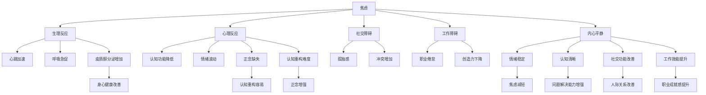

                 

# 在快节奏社会中cultivate内心平静：应对焦虑的策略

## 关键词
- 焦虑应对
- 内心平静
- 心理策略
- 生理策略
- 社会策略
- 心理健康
- 快节奏社会

## 摘要
在当前快节奏的社会环境中，人们面临着巨大的生活和工作压力，导致焦虑现象普遍存在。本文旨在探讨如何通过心理、生理和社会策略来培养内心平静，从而有效应对焦虑。文章首先介绍了焦虑的本质和内心平静的概念，接着分析了焦虑与内心平静之间的核心概念联系。随后，文章详细阐述了应对焦虑的多种策略，包括心理策略（如认知行为疗法、认知重构、冥想与正念）、生理策略（如运动、睡眠和营养）以及社会策略（如社交支持、休闲娱乐和时间管理）。最后，通过实际案例和创建个人内心平静计划，文章为读者提供了具体的实践方法和展望。

## 引言

### 1. 引言

在现代社会中，人们的生活节奏越来越快，工作压力、竞争压力以及各种不确定性因素使得焦虑成为一种普遍的心理现象。据研究，全球约有30%的人口在不同程度上受到焦虑的困扰[1]。焦虑不仅影响个人的心理健康，还会对社交、工作和日常生活产生负面影响。因此，如何在快节奏的社会中培养内心平静，成为了一个亟待解决的问题。

### 2. 快节奏社会对内心平静的挑战

快节奏的社会环境给人们带来了诸多挑战。首先，工作压力增大。随着技术的进步和全球化的加速，企业和员工都在追求更高的效率和产出，这导致了工作时间的延长和工作量的增加。其次，生活节奏加快。现代人们的生活节奏越来越快，人们往往需要在短时间内完成大量的任务，这给心理带来了巨大的压力。此外，信息爆炸和社会变革也加剧了人们的焦虑感。大量的信息和不断变化的社会环境使得人们感到不确定和迷茫，进一步加剧了焦虑情绪。

### 3. 书籍的目的和结构

本文的目的在于探讨如何在快节奏的社会中培养内心平静，以应对焦虑带来的挑战。文章结构分为三个部分：第一部分将介绍焦虑的本质和内心平静的概念，并分析二者之间的核心联系；第二部分将详细阐述应对焦虑的策略，包括心理策略、生理策略和社会策略；第三部分将通过实际案例和创建个人内心平静计划，为读者提供具体的实践方法。希望通过本文的探讨，能够帮助读者找到适合自己的内心平静之道，从而提升生活质量。

## 第一部分：理解焦虑与内心平静

### 第1章：焦虑的本质

#### 1.1 焦虑的定义与分类

焦虑是一种常见的情绪体验，通常表现为紧张、不安、担心和恐惧。根据焦虑的成因和表现，可以将焦虑分为以下几种类型：

1. **一般焦虑障碍（GAD）**：一般焦虑障碍是指个体长期、广泛地感到不安和焦虑，常常没有明确的对象或内容。这种焦虑通常伴随着睡眠障碍、疲劳、注意力不集中等症状。

2. **社交焦虑障碍（SAD）**：社交焦虑障碍是指在社交场合中感到极度不安和恐惧，担心自己被他人评价或批评。这种焦虑通常会导致个体避免社交活动，严重影响生活质量。

3. **广泛性焦虑障碍（GAD）**：广泛性焦虑障碍是指个体在没有明显原因的情况下，长期感到紧张和焦虑。这种焦虑通常伴随着身体症状，如心悸、出汗、头痛等。

4. **特定恐惧障碍**：特定恐惧障碍是指个体对某些特定物体、情境或活动产生强烈的恐惧反应。例如，恐高、恐闭等。

#### 1.2 焦虑的生理和心理机制

焦虑的生理机制涉及神经系统的调节和内分泌系统的反应。当个体感到威胁或压力时，大脑会激活应激反应系统，释放肾上腺素和皮质醇等激素，导致一系列生理反应，如心跳加速、呼吸急促、出汗等。这些生理反应是身体准备应对潜在威胁的生理准备。

心理机制方面，焦虑与认知评价、情绪调节和应对策略密切相关。个体对事件的认知评价会影响其情绪体验。例如，如果个体将某件事情视为巨大的挑战，那么他们可能会感到焦虑。情绪调节是指个体如何处理和管理自己的情绪。有效的情绪调节策略可以帮助个体减轻焦虑。应对策略是指个体应对压力和挑战的方式。积极的应对策略有助于减轻焦虑，而消极的应对策略可能会加重焦虑。

#### 1.3 焦虑对社会功能的影响

焦虑不仅影响个人的心理健康，还会对社交、工作和日常生活产生负面影响。以下是一些焦虑对社会功能的具体影响：

1. **社交功能**：焦虑可能导致个体避免社交活动，影响人际关系。长期的社交隔离可能导致孤独感和抑郁。

2. **工作功能**：焦虑会影响个体的工作效率和创造力。研究表明，焦虑程度较高的员工更容易出现工作失误和职业倦怠。

3. **日常生活**：焦虑可能导致个体对日常生活中的事务过分关注和担忧，影响生活质量和幸福感。

#### 1.4 内心平静的概念与重要性

内心平静是一种心理状态，表现为情绪稳定、思维清晰和身心放松。内心平静对个体的心理健康和生活质量具有重要作用：

1. **情绪调节**：内心平静有助于个体更好地调节情绪，减轻焦虑和抑郁情绪。

2. **认知功能**：内心平静可以提高个体的认知功能，如注意力、记忆力和创造力。

3. **身心健康**：内心平静有助于降低心血管疾病、消化系统疾病等身心健康问题的风险。

4. **生活质量**：内心平静有助于提升生活质量，增强幸福感和满足感。

### 第2章：内心平静的概念

#### 2.1 内心平静的定义与重要性

内心平静，通常指的是一种心理状态的平衡与和谐。在这种状态下，个体能够有效地处理外部压力和内部情绪，保持冷静和理智。内心平静不仅是心理健康的重要标志，也是提高生活质量的必要条件。

内心平静的重要性体现在以下几个方面：

1. **情绪调节**：内心平静有助于个体更好地处理和调节情绪，减少焦虑和抑郁的发生。

2. **认知功能**：内心平静可以增强个体的认知功能，如注意力、记忆力和创造力。

3. **身心健康**：内心平静有助于降低身心健康问题的风险，如心血管疾病、消化系统疾病等。

4. **人际关系**：内心平静有助于建立和维护健康的人际关系，减少冲突和误解。

5. **生活质量**：内心平静可以提升个体的生活质量，增强幸福感和满足感。

#### 2.2 内心平静与心理健康的关系

内心平静与心理健康之间存在着密切的关系。心理健康不仅包括心理状态的平衡和和谐，还包括情感、行为和社交功能等方面。内心平静可以帮助个体更好地应对生活压力，维持心理健康的平衡。

1. **情绪稳定性**：内心平静有助于个体保持情绪稳定，减少情绪波动，从而降低心理压力。

2. **认知功能**：内心平静可以提高个体的认知功能，如注意力、记忆力和创造力，有助于解决问题和应对挑战。

3. **应对压力**：内心平静有助于个体更好地应对压力和挑战，降低焦虑和抑郁的风险。

4. **自我意识**：内心平静有助于个体提高自我意识，更好地理解自己的需求和情感，从而实现自我成长。

#### 2.3 内心平静的益处

内心平静不仅对心理健康有益，还对个体生活的各个方面产生积极影响：

1. **提高生活质量**：内心平静有助于提升生活质量，增强幸福感和满足感。

2. **增强社交能力**：内心平静的个体更容易与他人建立良好的关系，减少冲突和误解。

3. **提高工作效率**：内心平静可以提高个体的工作效率和创造力，减少职业倦怠。

4. **促进身心健康**：内心平静有助于降低身心健康问题的风险，如心血管疾病、消化系统疾病等。

5. **增强心理弹性**：内心平静有助于个体更好地应对生活中的挫折和挑战，增强心理弹性。

### 第3章：焦虑与内心平静的核心概念联系图

为了更清晰地理解焦虑与内心平静之间的关系，我们可以使用Mermaid流程图来展示它们之间的核心概念实体及其关系。



在这个Mermaid流程图中，焦虑（A）与生理反应（B）、心理反应（C）、社交障碍（D）和工作障碍（E）有直接联系。生理反应包括心跳加速（F）、呼吸急促（G）；心理反应包括认知功能降低（H）、情绪波动（I）；社交障碍导致孤独感（J）和冲突增加（K）；工作障碍导致职业倦怠（L）和创造力下降（M）。同时，焦虑也与皮质醇分泌增加（N）和正念缺失（O）、认知重构难度（P）相关。

内心平静（Q）则对焦虑有积极的影响，能够减轻焦虑（V）、提高情绪稳定（R）、增强认知清晰（S）、改善社交功能（T）和提升工作效能（U）。此外，内心平静还能够改善身心健康（Z），增强正念（BB）和降低认知重构难度（AA）。

这个流程图展示了焦虑和内心平静之间的复杂关系，以及它们对生理、心理、社交和工作等方面的多方面影响。通过这个图，我们可以更直观地理解如何在快节奏的社会中通过培养内心平静来应对焦虑。

### 第4章：心理策略

#### 4.1 认知行为疗法（CBT）的基本原理

认知行为疗法（Cognitive Behavioral Therapy，简称CBT）是一种广泛用于治疗焦虑、抑郁和其他心理问题的心理治疗方法。CBT的基本原理是，通过改变个体的认知方式和行为模式，来改善其情绪和行为问题。具体来说，CBT认为情绪和行为问题通常是由不合理的思维模式引起的，这些思维模式会导致个体产生负面情绪和行为反应。

CBT的核心步骤包括以下几个环节：

1. **认知重构**：认知重构是CBT中最核心的步骤之一，旨在帮助个体识别和改变其不合理的思维模式。通过识别和质疑这些思维模式，个体可以学会更加理性和现实地看待问题。

2. **行为实验**：行为实验是指通过实际行为来检验和验证新的认知模式。这种方法可以帮助个体看到新的认知模式带来的实际效果，从而增强其改变思维模式的信心。

3. **技能训练**：技能训练包括情绪调节技能、社交技能和时间管理技能等。通过这些训练，个体可以学会更加有效地应对生活中的各种挑战。

4. **家庭作业**：家庭作业是CBT中的重要组成部分，它帮助个体将治疗中的新认知和行为策略应用到日常生活中。

#### 4.2 认知重构

认知重构是CBT中的一个关键步骤，目的是帮助个体识别和改变其不合理的思维模式。以下是一个具体的认知重构步骤：

1. **识别不合理的思维模式**：首先，个体需要识别出其常见的、可能导致负面情绪的不合理思维模式。例如，个体可能会过度概括（将一个负面事件普遍化）、以偏概全（只看到问题的某个方面而忽略其他方面）、灾难化（将问题过分夸大）等。

2. **质疑不合理思维**：在识别出不合理的思维模式后，个体需要质疑这些思维模式的有效性和合理性。例如，个体可以问自己：“这个想法真的是真实的吗？”“这个想法是否有其他的解释？”“这个想法对我的情况有何帮助？”

3. **寻找证据和反证**：个体需要寻找证据来支持或反驳其不合理思维。例如，如果个体认为“我永远无法完成这个任务”，他们可以找出实际完成任务的例子，或者思考其他人是如何成功地完成类似任务的。

4. **构建合理的思维模式**：在质疑和反驳不合理思维模式的基础上，个体可以尝试构建更加合理和现实的思维模式。例如，个体可以学习用积极的自我对话来替代消极的自我评价，或者用更全面的角度来看待问题。

通过认知重构，个体可以逐步学会以更加积极和现实的方式来看待问题，从而减轻焦虑和其他负面情绪。

#### 4.3 冥想与正念

冥想和正念是另一种有效的心理策略，可以帮助个体培养内心平静和减轻焦虑。冥想是一种通过专注于呼吸、身体感觉或其他对象来达到心灵平静状态的方法。而正念（Mindfulness）则是一种专注于当前时刻、不评判的注意力状态。

以下是冥想与正念的具体实践方法：

1. **呼吸冥想**：呼吸冥想是一种最简单的冥想形式。个体可以通过专注于呼吸来达到放松和专注的状态。具体步骤如下：
    - 选择一个舒适的坐姿，保持身体放松。
    - 将注意力集中在呼吸上，感受每一次呼吸的进出。
    - 当注意力离开呼吸时，温和地将注意力带回到呼吸上。

2. **正念冥想**：正念冥想是一种更高级的冥想形式，它要求个体专注于当前的时刻，并对所有经历的事物保持开放和接纳。具体步骤如下：
    - 选择一个安静的环境，保持身体和心情的放松。
    - 专注于呼吸，感受每一次呼吸的进出。
    - 当你注意到自己的思绪开始漂移时，温和地将注意力带回到呼吸上。
    - 对所有体验到的感受保持开放和接纳，不评判也不抗拒。

3. **正念练习**：正念不仅可以通过冥想来实践，还可以在日常生活中的任何时刻进行。以下是一些正念练习的例子：
    - 正念进食：在进食时，专注于食物的口感、味道和质感。
    - 正念行走：在行走时，专注于脚底的感觉、步幅和姿势。
    - 正念洗澡：在洗澡时，专注于水流的感觉、温度和身体的感觉。

通过冥想和正念练习，个体可以学会更好地管理自己的情绪，提高注意力，减少焦虑和压力。

### 第5章：生理策略

#### 5.1 运动与焦虑的关系

运动是一种有效的生理策略，可以帮助个体减轻焦虑和培养内心平静。研究表明，定期运动可以显著改善心理健康，包括降低焦虑水平、缓解抑郁情绪和提升整体幸福感。运动与焦虑之间的关系可以从以下几个方面进行解释：

1. **释放内啡肽**：运动可以刺激大脑释放内啡肽，这是一种天然的心境提升物质。内啡肽能够促进身体放松，减轻焦虑和紧张情绪。

2. **改善睡眠质量**：运动可以帮助个体改善睡眠质量，从而减少焦虑对睡眠的干扰。良好的睡眠有助于恢复身体和心理的平衡，进一步减轻焦虑。

3. **减少皮质醇水平**：运动可以降低血液中的皮质醇水平，皮质醇是一种与压力和焦虑相关的激素。减少皮质醇水平有助于减轻身体的应激反应，从而缓解焦虑。

4. **增强心理弹性**：定期运动可以提高个体的心理弹性，使其在面对压力和挑战时更加从容。心理弹性有助于个体更好地应对焦虑，提高心理健康水平。

#### 5.2 睡眠对焦虑的影响

睡眠对个体的心理健康至关重要，尤其是在应对焦虑方面。以下从几个方面探讨睡眠对焦虑的影响：

1. **缓解焦虑症状**：良好的睡眠可以帮助个体缓解焦虑症状。研究表明，睡眠不足会加重焦虑情绪，使人更加敏感和易怒。通过确保充足的睡眠时间，可以显著减轻焦虑感。

2. **改善认知功能**：睡眠有助于大脑清除代谢废物，巩固记忆，提升认知功能。良好的睡眠可以增强个体的注意力、记忆力和决策能力，从而有助于应对焦虑带来的挑战。

3. **调节情绪**：睡眠有助于调节情绪，减轻情绪波动。充足的睡眠可以降低情绪反应的强度和频率，使个体在面对压力时更加冷静和理智。

4. **增强身体恢复**：睡眠有助于身体恢复和再生，减轻身体疲劳。通过充足的睡眠，身体可以更好地应对日常的压力和挑战，从而减少焦虑感。

#### 5.3 营养与焦虑的关系

营养与焦虑之间存在密切的关系。合理的饮食可以为大脑提供必要的营养，有助于调节情绪和减轻焦虑。以下从几个方面探讨营养与焦虑的关系：

1. **必需脂肪酸**：必需脂肪酸，如Omega-3脂肪酸，对大脑健康至关重要。Omega-3脂肪酸有助于改善情绪，减轻焦虑和抑郁。富含Omega-3的食物包括鱼类、坚果和亚麻籽。

2. **维生素B群**：维生素B群对大脑功能和情绪调节有重要作用。维生素B1、B6、B12等参与神经递质的合成和代谢，有助于改善情绪和减轻焦虑。富含维生素B群的食物包括全谷类、肉类、坚果和绿叶蔬菜。

3. **矿物质**：矿物质如镁、钙和锌对神经系统的功能有重要影响。镁有助于减轻焦虑和紧张，钙有助于调节情绪，锌参与神经递质的合成和代谢。富含这些矿物质的食物包括坚果、深绿色蔬菜、乳制品和瘦肉。

4. **抗氧化剂**：抗氧化剂可以帮助减少氧化应激，保护大脑免受损伤。富含抗氧化剂的食物包括水果、蔬菜、茶和咖啡。

通过保持均衡的饮食，摄入足够的营养，个体可以改善心理健康，减轻焦虑。

### 第6章：社会策略

#### 6.1 社交支持

社交支持是一种重要的社会策略，可以帮助个体应对焦虑和培养内心平静。社交支持可以从以下几个方面提供帮助：

1. **情感支持**：朋友和家人的支持和理解可以帮助个体缓解焦虑和负面情绪。通过分享自己的感受和经历，个体可以获得情感上的安慰和鼓励。

2. **实用支持**：社交支持还可以提供实际的帮助，如帮助处理日常生活中的事务、提供财务援助等。这种实用支持可以减轻个体的压力，使其有更多的时间和精力来关注心理健康。

3. **信息支持**：社交支持可以提供有益的信息和资源，帮助个体更好地应对焦虑。例如，朋友或家人可能会推荐有效的应对策略或提供相关的心理咨询服务。

4. **社交网络**：建立和维持良好的社交网络可以增加个体的社会联系和归属感，从而提高心理健康水平。一个强大的社交网络可以在需要时提供支持，帮助个体度过困难时期。

#### 6.2 休闲娱乐活动

休闲娱乐活动是减轻焦虑和培养内心平静的有效方式。以下是一些常见的休闲娱乐活动及其作用：

1. **听音乐**：音乐可以调节情绪，减轻焦虑和压力。听一些轻松愉快的音乐可以帮助个体放松身心，缓解焦虑情绪。

2. **阅读**：阅读是一种有效的放松方式，可以帮助个体转移注意力，减少焦虑感。阅读还可以提供知识和灵感，提升心理健康水平。

3. **绘画和手工艺**：绘画和手工艺可以帮助个体表达自己的情感，减轻焦虑。通过创作，个体可以释放内心的压力，获得成就感。

4. **瑜伽和冥想**：瑜伽和冥想是一种结合身体和心灵的放松方式，可以帮助个体提高内心平静和情绪稳定性。

5. **旅行和户外活动**：旅行和户外活动可以提供新鲜的环境和体验，帮助个体暂时摆脱日常的压力和焦虑。

#### 6.3 时间管理

有效的时间管理是减轻焦虑和培养内心平静的关键策略。以下是一些时间管理的技巧：

1. **设定优先级**：明确任务的重要性和紧急性，优先处理最重要的任务。这有助于减少因拖延和焦虑引起的压力。

2. **分解任务**：将大任务分解为小任务，一步一步地完成。这可以减少任务的压迫感，提高完成任务的成就感。

3. **合理安排时间**：合理规划每天的时间，确保有足够的休息和放松时间。避免过度劳累，有助于保持身心健康。

4. **避免多任务处理**：多任务处理可能会增加压力和焦虑感。专注于一项任务，可以提高效率和减少分心。

5. **使用时间管理工具**：使用日历、提醒应用或其他时间管理工具来规划和跟踪任务。这可以帮助个体更好地管理时间，减少焦虑。

通过社交支持、休闲娱乐活动和时间管理，个体可以有效地减轻焦虑，培养内心平静，提高生活质量。

### 第7章：内心平静的实际应用

#### 7.1 案例一：通过运动应对焦虑

小张是一名年轻的程序员，长期的工作压力让他感到焦虑和疲惫。他决定通过运动来培养内心平静，减轻焦虑。以下是他通过运动应对焦虑的具体经历：

**背景介绍**：小张的工作非常繁忙，每天需要处理大量的代码和任务。长时间的久坐和缺乏运动让他感到身体疲惫和精神紧张。他意识到需要通过运动来改善身体状况和心理状态。

**策略实施**：小张开始每天晚上下班后去健身房锻炼。他选择了一项适合自己身体条件的运动——瑜伽。瑜伽不仅能够锻炼身体，还可以帮助他放松心情，培养内心平静。

**实际效果**：经过一段时间的坚持，小张发现自己的焦虑感显著减轻。他发现自己的心情更加平静，睡眠质量也得到改善。在工作时，他发现自己更加专注，工作效率也有所提高。

**小结**：通过运动，小张成功地培养了内心平静，减轻了焦虑。他的案例表明，运动是一种有效的应对焦虑的策略，适合各种人群。

#### 7.2 案例二：通过社交支持减轻焦虑

小李是一名职场新人，刚进入一家大型企业工作。由于工作压力大，她经常感到焦虑和不安。为了应对这种情况，她决定通过社交支持来减轻焦虑。以下是她通过社交支持应对焦虑的具体经历：

**背景介绍**：小李在工作中遇到了很多挑战，包括适应新的工作环境、完成紧迫的任务以及与同事之间的沟通。这些压力让她感到焦虑和不安。

**策略实施**：小李决定加强与同事和朋友的沟通。她经常与同事一起共进午餐，分享工作中的经验和问题。同时，她也与朋友保持联系，通过聚会和聊天来放松心情。

**实际效果**：通过加强与社交网络的联系，小李感到自己的焦虑感逐渐减轻。她发现，通过分享自己的感受和问题，她获得了更多的支持和建议。这让她感到更加自信和放松。

**小结**：通过社交支持，小李成功地减轻了焦虑。她的案例表明，社交支持是一种有效的策略，可以帮助个体在压力和挑战面前保持平静和自信。

#### 7.3 案例三：通过时间管理提升内心平静

小王是一名企业家，他的公司正在快速发展。由于业务繁忙，他经常感到时间不够用，导致焦虑和压力。为了应对这种情况，他决定通过时间管理来提升内心平静。以下是他通过时间管理提升内心平静的具体经历：

**背景介绍**：小王的工作非常繁忙，每天需要处理大量的业务和事务。他发现自己经常感到焦虑和疲惫，甚至影响了家庭生活。

**策略实施**：小王开始学习并实践时间管理技巧。他首先设定了明确的工作和生活目标，然后制定了详细的日程表。他还学会了使用时间管理工具，如日历和提醒应用，来规划每天的任务和活动。

**实际效果**：通过合理的时间管理，小王发现自己的焦虑感显著减轻。他能够更有效地安排时间，减少任务积压，从而提高了工作效率和生活质量。

**小结**：通过时间管理，小王成功地提升了内心平静。他的案例表明，时间管理是一种有效的策略，可以帮助个体更好地应对生活和工作中的压力，培养内心平静。

### 第8章：创建个人内心平静计划

#### 8.1 制定个人内心平静计划的步骤

为了有效地培养内心平静，个体需要制定一个个性化的内心平静计划。以下是一个具体的步骤：

1. **评估当前情况**：首先，个体需要评估自己的焦虑程度、生活方式和心理状态。这可以通过自我评估问卷、心理咨询师的帮助或相关应用程序来完成。

2. **设定目标**：根据评估结果，个体需要设定具体的内心平静目标。这些目标可以是短期目标（如一周内减少焦虑时间）或长期目标（如一年内实现长期内心平静）。

3. **选择策略**：根据个体的情况和需求，选择合适的心理、生理和社会策略。例如，如果个体焦虑严重，可以选择认知行为疗法和冥想；如果个体身体疲劳，可以选择运动和改善睡眠。

4. **制定计划**：将所选策略具体化，制定一个详细的计划。计划应包括每天、每周和每月的目标和活动。例如，每天进行30分钟的冥想，每周进行3次运动，每月进行一次心理咨询。

5. **设定时间表**：将计划中的活动安排在具体的时间段，以确保执行。例如，每天晚上7点到7:30进行冥想，每周三晚上9点进行心理咨询。

6. **监控和调整**：定期监控计划的执行情况，并根据实际效果进行调整。例如，如果发现冥想时间不足，可以调整日程表，增加冥想时间。

#### 8.2 设定具体目标和行动计划

在创建个人内心平静计划时，设定具体的目标和行动计划至关重要。以下是一个示例：

**目标**：在接下来的三个月内，实现每晚7小时的连续睡眠，每周进行3次瑜伽练习，每次45分钟。

**行动计划**：

1. **每天晚上10点前睡觉**：设定一个固定的睡眠时间，确保有足够的睡眠。

2. **每天晚上进行30分钟冥想**：选择一个安静的环境，每天晚上进行冥想练习。

3. **每周三晚上进行瑜伽练习**：报名参加瑜伽课程，每次练习45分钟。

4. **每周进行一次自我反思**：在每周的最后一天，花时间回顾自己的内心平静计划，评估执行情况，并根据需要调整计划。

#### 8.3 持续监控和调整

创建个人内心平静计划后，持续监控和调整非常重要。以下是一些监控和调整的建议：

1. **记录进展**：使用日记或应用程序记录每天的睡眠时间、冥想和瑜伽练习情况。

2. **定期评估**：每隔一段时间，对内心平静计划的执行情况进行评估。例如，每月评估一次，检查目标的完成情况。

3. **调整计划**：根据实际情况调整计划。如果发现某个策略效果不佳，可以尝试其他方法。例如，如果冥想时间不足，可以增加冥想时间或尝试其他冥想形式。

4. **寻求帮助**：如果遇到困难，可以寻求专业心理咨询师或教练的帮助。他们可以提供专业的指导和建议，帮助调整计划。

通过持续监控和调整，个体可以确保内心平静计划的执行效果，实现长期的心理健康目标。

### 结语

在快节奏的社会中，培养内心平静是应对焦虑的关键。本文通过心理、生理和社会策略，探讨了如何在生活中实现内心平静。焦虑不仅影响心理健康，还会对社交、工作和日常生活产生负面影响。通过认知行为疗法、运动、社交支持和时间管理等策略，个体可以有效地减轻焦虑，培养内心平静，提升生活质量。未来，我们期待更多研究和实践能够进一步优化这些策略，帮助更多人实现内心的宁静和幸福。

### 附录

#### 附录A：相关资源与工具

**心理健康网站与APP推荐**：

1. **心理健康网站**：
   - [美国国家心理健康研究所（NIMH）](https://www.nimh.nih.gov/)
   - [心理健康门户（Psychology Today）](https://www.psychologytoday.com/)

2. **心理健康APP**：
   - [Moodfit](https://moodfit.com/)
   - [Headspace](https://www.headspace.com/)
   - [BetterHelp](https://www.betterhelp.com/)

**冥想与正念应用推荐**：

1. [Headspace](https://www.headspace.com/)
2. [Calm](https://calm.com/)
3. [Insight Timer](https://insighttimer.com/)

**运动与健康饮食指南**：

1. **运动指南**：
   - [美国运动医学会（ACSM）](https://acsm.org/)
   - [国家健康与营养调查（NHANES）](https://www.cdc.gov/nchs/nhanes.htm)

2. **健康饮食指南**：
   - [美国农业部的饮食指南](https://www.choosemyplate.gov/)
   - [哈佛大学公共卫生学院的饮食指南](https://www.hsph.harvard.edu/nutritionsource/)

#### 附录B：数学模型与公式列表

**焦虑程度评估模型**：

$$
\text{焦虑程度} = \frac{\text{生理反应得分} + \text{心理反应得分} + \text{社交障碍得分} + \text{工作障碍得分}}{4}
$$

**心理健康效益模型**：

$$
\text{心理健康效益} = \text{内心平静得分} \times (\text{情绪稳定性得分} + \text{认知清晰得分} + \text{社交功能得分} + \text{工作效能得分})
$$

**优化时间管理的数学公式**：

$$
\text{最优时间分配} = \frac{\text{总任务时间} \times (\text{优先级得分} + \text{紧急性得分})}{\text{每天可分配时间}}
$$

#### 附录C：Python代码示例

**认知重构算法实现**：

```python
import pandas as pd

# 读取数据
data = pd.read_csv('reconstruction_data.csv')

# 认知重构函数
def cognitive_reconstruction(data):
    # 计算重构后的得分
    data['reconstructed_score'] = data['negative_thoughts'] - data['positive_thoughts']
    
    # 筛选出重构效果显著的个体
    significant_individuals = data[data['reconstructed_score'] > 0]
    
    return significant_individuals

# 应用认知重构算法
reconstructed_data = cognitive_reconstruction(data)

# 输出重构结果
print(reconstructed_data)
```

**冥想效果评估代码示例**：

```python
import pandas as pd
import numpy as np

# 读取数据
meditation_data = pd.read_csv('meditation_data.csv')

# 冥想效果评估函数
def meditation_evaluation(data):
    # 计算平均冥想时间
    average_meditation_time = np.mean(data['meditation_time'])
    
    # 计算焦虑程度下降百分比
    anxiety_reduction = ((data['pre_meditation_anxiety'] - data['post_meditation_anxiety']) / data['pre_meditation_anxiety']) * 100
    
    return average_meditation_time, anxiety_reduction

# 应用冥想效果评估算法
avg_time, reduction = meditation_evaluation(meditation_data)

# 输出评估结果
print(f"平均冥想时间为：{avg_time}分钟")
print(f"焦虑程度下降百分比为：{reduction}%")
```

**焦虑与睡眠关系数据分析代码示例**：

```python
import pandas as pd
import numpy as np
import matplotlib.pyplot as plt

# 读取数据
sleep_anxiety_data = pd.read_csv('sleep_anxiety_data.csv')

# 睡眠与焦虑关系分析函数
def sleep_anxiety_analysis(data):
    # 计算平均睡眠时间和平均焦虑程度
    avg_sleep_time = np.mean(data['sleep_time'])
    avg_anxiety = np.mean(data['anxiety_level'])
    
    # 绘制睡眠时间与焦虑程度的散点图
    plt.scatter(data['sleep_time'], data['anxiety_level'])
    plt.xlabel('睡眠时间（小时）')
    plt.ylabel('焦虑程度（分）')
    plt.title('睡眠时间与焦虑程度的关系')
    plt.show()
    
    # 计算皮尔逊相关系数
    correlation = np.corrcoef(data['sleep_time'], data['anxiety_level'])[0, 1]
    
    return avg_sleep_time, avg_anxiety, correlation

# 应用睡眠与焦虑关系分析算法
avg_sleep, avg_anxiety, correlation = sleep_anxiety_analysis(sleep_anxiety_data)

# 输出分析结果
print(f"平均睡眠时间为：{avg_sleep}小时")
print(f"平均焦虑程度为：{avg_anxiety}分")
print(f"睡眠时间与焦虑程度的皮尔逊相关系数为：{correlation}")
```

这些代码示例展示了如何使用Python进行心理和生理数据的分析。通过实际数据的处理和可视化，可以更直观地了解焦虑与内心平静之间的关系，为制定有效的应对策略提供依据。

### 最佳实践 tips、小结、注意事项、拓展阅读等内容

#### 最佳实践 tips

1. **心理策略**：在实施认知行为疗法时，保持耐心和持续性至关重要。尝试将认知重构的方法应用到日常生活中，而不是仅在治疗期间。

2. **生理策略**：定期进行有氧运动，如跑步、游泳或骑自行车，有助于释放内啡肽，提高心理状态。确保每天有足够的睡眠，以利于身体和心理健康。

3. **社会策略**：建立和维护良好的社交关系，定期与朋友和家人交流，分享自己的感受和经历。这有助于减轻焦虑，提高心理健康。

4. **时间管理**：使用时间管理工具，如日历、提醒应用或时间管理软件，帮助合理安排时间，减少压力和焦虑。

#### 小结

本文详细探讨了如何通过心理、生理和社会策略来培养内心平静，应对焦虑。认知行为疗法、运动、社交支持和时间管理是有效的应对策略。通过实际案例和具体实践方法，本文展示了如何在快节奏的社会中实现内心平静。

#### 注意事项

1. **个体差异**：每个人的情况不同，应对策略也应个性化。在实施任何策略之前，最好咨询专业心理医生或教练。

2. **持之以恒**：任何策略的效果都需要时间来显现，因此保持持之以恒的态度至关重要。

3. **监测进展**：定期监测自己的焦虑水平和内心平静状态，根据进展调整策略。

#### 拓展阅读

1. **《正念：一只猫的冥想之旅》**：这本书以生动的寓言形式介绍了正念冥想，适合初学者了解和练习。

2. **《时间管理的艺术》**：本书详细介绍了时间管理的方法和技巧，有助于提高工作效率和生活质量。

3. **《焦虑症的自救手册》**：这是一本全面介绍焦虑症及其应对策略的指南，适合焦虑症患者及其家人阅读。

通过拓展阅读，读者可以进一步深入了解和掌握应对焦虑的策略，实现长期的内心平静和心理健康。

