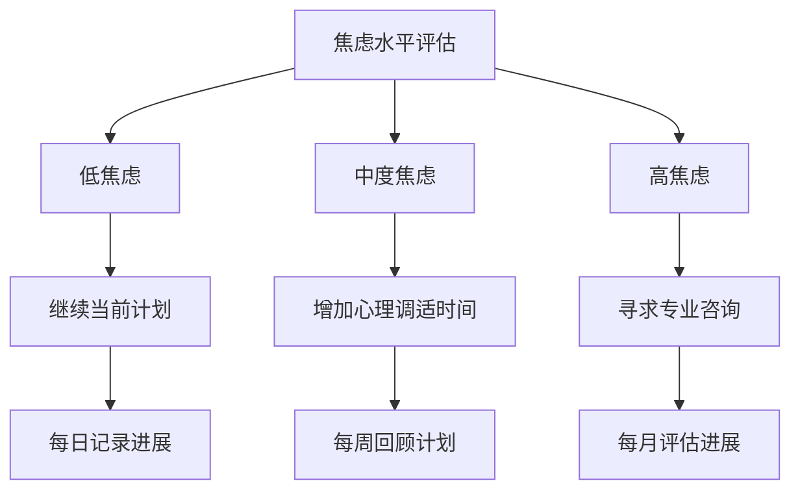

                 

### 第1章 引言：焦虑的普遍性与重要性

#### 1.1 焦虑的定义与分类

**概念介绍**

焦虑，作为一种常见的心理反应，通常指的是一种不安、紧张、担忧的感觉。它可以是短暂的，也可以是持续存在的，严重时可能会影响个体的日常生活和工作效率。焦虑并非疾病，但过度的、持续的焦虑可能会发展成为焦虑症。

**广义焦虑与狭义焦虑**

广义焦虑（Generalized Anxiety Disorder, GAD）是一种慢性焦虑障碍，表现为持续的、过度的不安和担忧，通常无明确对象或内容。狭义焦虑（Acute Anxiety）则通常与特定的情境或事件相关，如面试、考试、演讲等。

**慢性焦虑与急性焦虑**

慢性焦虑是指长期的、持续存在的焦虑状态，这种状态可能会影响个体的心理健康和生活质量。急性焦虑（Acute Anxiety）则通常是指突然出现的、强烈的焦虑感觉，可能会伴随着身体上的反应，如心跳加速、呼吸急促、出汗等。

#### 1.2 焦虑的普遍性

**社会节奏加快与焦虑的关系**

在当今社会，随着科技的发展和信息爆炸，人们面临的生活和工作压力越来越大。快速的生活节奏导致个体感到时间紧迫，容易引发焦虑情绪。研究表明，焦虑症状在快节奏的城市环境中更为普遍。

**焦虑在不同人群中的表现**

不同的人群在面对焦虑时，可能会表现出不同的症状。例如，职场人士可能会因工作压力而感到焦虑，学生可能会因学业压力而焦虑，而老年人则可能因身体健康和生活变化而焦虑。了解不同人群的焦虑表现，有助于采取针对性的应对策略。

#### 1.3 深入了解内心平静

**内心平静的重要性**

内心平静，即一种心理健康状态，表现为情绪稳定、心态平和。保持内心平静对于个体的心理健康和生活质量至关重要。它可以增强抗压能力，提高工作效率，改善人际关系。

**内心平静与健康生活的关联**

内心平静不仅对心理健康有益，还与身体健康密切相关。研究发现，长期处于焦虑状态的人更容易患上心血管疾病、免疫力下降等问题。因此，培养内心平静是维持健康生活的重要一环。

总之，焦虑作为一种常见的心理现象，在我们的日常生活中扮演着重要角色。理解焦虑的定义与分类、焦虑的普遍性以及内心平静的重要性，有助于我们更好地应对焦虑，提升生活质量。

#### 1.4 快节奏社会中的焦虑源分析

**工作压力**

在快节奏的社会中，工作压力成为许多人焦虑的主要来源。随着职场竞争的加剧和职场文化的变化，许多职场人士感到身心俱疲。根据国际劳工组织（ILO）的数据，全球约有70%的劳动力表示他们感到工作压力很大。这种压力不仅影响个体的心理健康，还可能导致工作效率下降、创造力减退等问题。

**职场压力与焦虑**

职场压力通常来源于以下几个方面：

1. **绩效要求**：许多公司对员工的绩效有很高的要求，员工为了达到这些目标，不得不加班加点，甚至牺牲个人时间。这种高强度的竞争环境容易导致焦虑。
   
2. **工作与生活的平衡**：现代职场文化强调工作的高效率，但这也意味着员工需要投入更多的时间在工作上。这种工作与生活的不平衡，使得员工感到压力倍增。

3. **职场竞争**：职场竞争激烈，员工不仅要面对内部竞争，还要应对外部市场的变化。这种竞争压力可能导致焦虑和紧张情绪。

**高效率工作模式的影响**

随着科技的发展，高效率工作模式（如敏捷开发、弹性工作制等）逐渐普及。然而，这些工作模式也带来了一定的焦虑。例如，敏捷开发强调快速迭代和持续交付，这要求团队成员保持高度紧张和高效的工作状态。虽然这种模式有助于提高工作效率，但也容易导致员工感到焦虑和疲劳。

**社交压力**

除了工作压力，社交压力也是快节奏社会中的一个重要焦虑源。随着社交媒体的普及，人们面临的社交压力越来越大。在社交媒体上，人们常常展示自己完美的一面，这可能导致现实生活中的个体感到自卑和焦虑。

**社交网络对个体的影响**

1. **社会比较**：在社交媒体上，人们常常看到他人的成功和幸福，这可能导致社会比较。社会比较容易导致个体感到自己不够好，从而引发焦虑。

2. **自我呈现**：为了在社交媒体上展示自己，许多人可能会过度修饰自己的生活，这可能导致真实生活中的焦虑。例如，为了在社交网络上展示自己的生活，一些年轻人可能会去参加昂贵的旅行、购买奢侈品等，这些行为可能会给他们带来经济和情感上的压力。

3. **人际关系**：社交媒体的普及改变了人们的人际关系模式。虽然社交媒体可以方便人们保持联系，但同时也可能导致人际关系的疏远和表面化。这种人际关系的不稳定性和不确定性，也可能引发焦虑。

**人际关系的焦虑来源**

1. **沟通障碍**：在社交媒体上，人们往往无法进行深入的面对面沟通，这可能导致沟通障碍。沟通障碍容易导致误解和冲突，从而引发焦虑。

2. **社交技能缺失**：现代社会节奏快，许多人忙于工作，导致他们缺乏足够的社交技能。这种社交技能的缺失，使得个体在现实生活中感到焦虑和不安。

**资源有限性**

在快节奏的社会中，资源的有限性也是一个重要的焦虑源。这包括财务资源、时间资源和社会资源。

**财务压力**

财务压力是许多人焦虑的主要原因之一。随着生活成本的上升，许多人面临着财务困境。根据美国劳工统计局的数据，近一半的美国成年人表示，他们感到经济压力很大。这种财务压力可能导致焦虑和心理健康问题。

**时间管理问题**

时间管理问题也是焦虑的一个重要来源。在快节奏的社会中，人们感到时间紧迫，常常需要同时处理多项任务。这种时间管理的不当，可能导致焦虑和压力。

**健康与生活压力**

健康和生活的压力也是快节奏社会中的一个重要焦虑源。随着生活节奏的加快，人们越来越难以保持健康的生活方式。例如，许多人因为工作繁忙，无法定期锻炼，饮食不规律，这可能导致身体健康问题，进而引发焦虑。

**身体健康的影响**

1. **慢性疾病**：长期处于焦虑状态，可能导致慢性疾病，如心脏病、高血压、消化不良等。

2. **免疫力下降**：焦虑可能导致免疫力下降，使得个体更容易感染疾病。

3. **睡眠质量下降**：焦虑常常影响个体的睡眠质量，导致失眠或睡眠质量差。

**生活环境的压力**

生活环境的压力也是焦虑的一个重要来源。例如，环境污染、噪音污染、交通拥堵等都可能导致个体感到焦虑。

**环境影响**

1. **环境污染**：环境污染可能导致身体健康问题，如呼吸系统疾病、心血管疾病等。

2. **噪音污染**：噪音污染可能导致心理压力和焦虑。

3. **交通拥堵**：交通拥堵可能导致时间浪费和心情烦躁，从而引发焦虑。

综上所述，快节奏社会中的焦虑源多种多样，包括工作压力、社交压力、资源有限性和健康与生活压力。了解这些焦虑源，有助于我们采取有效的应对策略，缓解焦虑，提升生活质量。

#### 1.5 内心平静的核心概念与联系

**内心平静的定义**

内心平静是一种心理健康状态，表现为情绪稳定、心态平和，能够有效应对生活中的各种挑战。它不仅是一种心理体验，还包括一系列的生理和心理反应。传统上，内心平静被认为是佛教禅修的核心目标之一，在现代心理学中，它被广泛视为心理健康的重要指标。

**传统与现代定义对比**

在传统佛教中，内心平静（即“禅定”）被定义为通过冥想和专注来消除杂念，达到心灵深处的宁静。现代心理学则更多地从科学角度来定义内心平静，认为它是一种心理健康状态，表现为情绪稳定、注意力集中、心理资源有效利用等。

**内心平静的内在机制**

内心平静的内在机制主要包括以下几个方面：

1. **情绪调节**：内心平静有助于个体更好地调节情绪，减少负面情绪的影响。通过冥想和放松技巧，个体可以学会控制自己的情绪，避免情绪波动过大。

2. **认知重构**：内心平静有助于个体改变对事物的看法，从而改变情绪反应。认知重构技术，如认知行为疗法，通过帮助个体识别和改变负面思维模式，从而减少焦虑和抑郁。

3. **生理调节**：内心平静对生理系统也有积极影响。研究表明，内心平静能够降低心率、血压，改善免疫系统功能，有助于缓解压力和焦虑。

**内心平静的重要性**

内心平静对个体的心理健康和生活质量有着深远的影响：

1. **心理健康的影响**：内心平静有助于减少焦虑、抑郁等心理问题，提高个体的心理健康水平。

2. **社会功能的提升**：内心平静有助于个体更好地应对生活中的挑战，提高工作效率，改善人际关系。

3. **整体健康的促进**：内心平静对生理健康也有积极作用，有助于降低患病风险，提升整体健康水平。

**内心平静与焦虑的关系**

内心平静与焦虑之间存在密切的关联。内心平静可以缓解焦虑，而焦虑也可能破坏内心平静。具体来说：

1. **缓解焦虑**：内心平静有助于个体更好地应对焦虑情绪，通过情绪调节和认知重构，减少焦虑的影响。

2. **焦虑的影响**：持续的焦虑可能导致内心平静的破坏，影响个体的心理健康和生活质量。

总之，内心平静是一种重要的心理健康状态，它不仅有助于缓解焦虑，还能提升个体的整体健康和生活质量。通过深入了解内心平静的核心概念和内在机制，我们可以更好地培养和维护内心平静，应对快节奏社会中的各种挑战。

#### 1.6 应对焦虑的实践策略

在快节奏社会中，焦虑成为一种常见的心理现象。为了缓解焦虑，我们可以采取一系列的实践策略。这些策略包括心理调适方法、心理咨询与治疗、自我探索与认知重建、时间管理与任务优先级等。以下将详细探讨这些策略，并提供具体的实践建议。

**心理调适方法**

心理调适方法是指通过一系列的心理技巧和练习，帮助个体调节情绪、缓解压力。以下是一些常见的心理调适方法：

1. **放松技巧**：放松技巧是一种有效的焦虑缓解方法，包括深呼吸练习、渐进性肌肉放松、冥想等。通过这些技巧，个体可以减轻身体和心理的紧张感，达到放松的效果。

   - **深呼吸练习**：深呼吸是一种简单有效的放松技巧。通过深吸气和缓慢呼气，个体可以降低心率、减少焦虑感。具体做法是，坐直或躺下，将一只手放在胸部，另一只手放在腹部。深吸一口气，感受腹部上升，缓慢呼出，重复数次。

   - **渐进性肌肉放松**：这种技巧通过逐个放松身体各个部位的肌肉，达到全身放松的效果。具体做法是，先紧张某个部位的肌肉几秒钟，然后放松，感受肌肉的松弛感，逐步进行全身的放松。

2. **冥想**：冥想是一种古老的放松技巧，通过专注呼吸、排除杂念，达到内心平静的效果。冥想可以减轻焦虑、提升专注力，有助于提高心理健康水平。

   - **正念冥想**：正念冥想是一种通过专注当下、接受当下的存在，达到内心平静的技巧。具体做法是，找一个安静的环境，闭上眼睛，专注于呼吸，当思绪飘散时，轻轻将其拉回到呼吸上。

3. **认知重构**：认知重构是一种通过改变负面思维模式，减少焦虑的方法。通过识别和改变负面思维，个体可以减少焦虑情绪。

   - **认知行为疗法**：认知行为疗法（Cognitive Behavioral Therapy, CBT）是一种通过改变负面思维和行为模式，缓解焦虑和抑郁的方法。具体做法是，通过与心理咨询师一起，识别和改变负面思维，学会更积极的应对策略。

**心理咨询与治疗**

心理咨询与治疗是应对焦虑的有效途径，通过专业的心理咨询师，个体可以了解自己的焦虑原因，学会应对策略。以下是一些常见的心理咨询与治疗方式：

1. **认知行为疗法**：认知行为疗法是一种通过改变负面思维和行为模式，缓解焦虑和抑郁的方法。具体做法是，通过与心理咨询师一起，识别和改变负面思维，学会更积极的应对策略。

2. **人际关系疗法**：人际关系疗法是一种通过改善人际关系，缓解焦虑的方法。具体做法是，通过与心理咨询师一起，探讨和解决人际关系中的问题，提高社交技能，减少社交焦虑。

3. **心理辅导**：心理辅导是一种通过倾听、支持和指导，帮助个体缓解焦虑的方法。具体做法是，通过与心理咨询师进行一对一的交流，分享自己的焦虑感受，获得专业的支持和建议。

**自我探索与认知重建**

自我探索与认知重建是通过深入了解自己的内心世界，改变负面思维模式，提高应对焦虑的能力。以下是一些具体的实践策略：

1. **自我认知**：通过自我反思，了解自己的情绪、需求和价值观。具体做法是，每天花一定时间思考自己的情绪变化，记录在日记中，从而更好地认识自己。

2. **自我接纳**：接受自己的不完美，减少自我批评。具体做法是，当发现自己有负面情绪时，不要立即否定或压抑，而是尝试接受这种情绪，理解它的存在。

3. **认知重构**：通过识别和改变负面思维模式，减少焦虑。具体做法是，当发现自己有负面思维时，尝试用积极的思维替代，如将“我不能完成任务”改为“我需要更多时间来完成任务”。

**时间管理与任务优先级**

时间管理和任务优先级是应对焦虑的重要策略。通过合理规划时间，个体可以减少任务堆积，减轻焦虑感。以下是一些建议：

1. **制定日程表**：每天制定日程表，将任务分解为具体的时间段，确保每项任务都有明确的时间安排。

2. **设置合理任务优先级**：根据任务的紧急程度和重要性，设置合理的任务优先级。优先完成重要且紧急的任务，避免任务堆积。

3. **避免拖延**：通过设定具体的目标和时间，避免拖延。具体做法是，将任务分解为小步骤，每次专注于完成一个步骤，逐步推进。

**实践建议**

1. **坚持练习**：心理调适方法需要坚持练习，才能达到良好的效果。建议每天花一定时间进行放松练习、冥想或认知重构练习。

2. **寻求专业帮助**：当焦虑严重影响到日常生活时，建议寻求专业心理咨询师的帮助。专业心理咨询师可以提供个性化的指导和支持。

3. **建立健康生活方式**：保持健康的生活习惯，如规律的饮食、适量的运动和充足的睡眠，有助于提升心理健康水平，缓解焦虑。

通过以上实践策略，个体可以更好地应对焦虑，提升生活质量。在快节奏社会中，培养内心平静，是我们应对焦虑的重要途径。让我们一起努力，学会应对焦虑，拥抱内心的平静。

#### 5.1 饮食与睡眠

**饮食习惯对内心平静的影响**

饮食与心理健康有着密切的联系，饮食习惯不仅影响身体健康，还可能影响心理状态。例如，高糖、高脂肪的食物可能会导致情绪波动、焦虑和抑郁。根据《美国精神病学杂志》的一项研究，经常摄入高糖食物的个体，其焦虑和抑郁症状更为严重。

**具体建议**

1. **增加富含Omega-3的食物**：Omega-3脂肪酸是一种重要的脂肪酸，对大脑健康至关重要。富含Omega-3的食物包括鱼类、坚果和亚麻籽。研究表明，Omega-3有助于改善情绪，减少焦虑和抑郁。

2. **减少咖啡因和糖的摄入**：咖啡因和糖可能会导致能量波动和情绪不稳定。建议减少咖啡、茶、碳酸饮料和甜食的摄入，以保持稳定的情绪。

3. **保持饮食均衡**：均衡饮食有助于提供身体所需的各类营养素，维持心理健康。建议多摄入蔬菜、水果、全谷物和蛋白质，避免过度依赖加工食品。

**睡眠质量与焦虑的关系**

睡眠质量对内心平静至关重要。长期缺乏睡眠或睡眠质量差，可能导致焦虑和抑郁。根据美国睡眠基金会的数据，有70%的焦虑症患者存在睡眠问题。睡眠不足会导致大脑中的情绪调节区域功能受损，从而增加焦虑感。

**具体建议**

1. **建立固定的睡眠时间表**：每天固定时间上床睡觉和起床，有助于调节身体的生物钟，提高睡眠质量。

2. **睡前放松**：在睡前进行一些放松活动，如冥想、深呼吸、阅读等，有助于放松身心，准备进入睡眠状态。

3. **避免晚上使用电子设备**：晚上使用电子设备，特别是智能手机和电脑，会发出蓝光，影响褪黑素的分泌，从而影响睡眠质量。建议晚上睡前一小时停止使用这些设备。

4. **保持舒适的睡眠环境**：保持安静、凉爽、黑暗的睡眠环境，有助于提高睡眠质量。可以使用眼罩、耳塞等辅助工具，减少外界干扰。

**饮食与睡眠相结合的策略**

1. **晚餐时间**：晚餐时间不宜过晚，建议在睡前两小时完成晚餐。这有助于食物充分消化，避免因消化不良而影响睡眠。

2. **睡前饮食**：睡前可以选择一些有助于睡眠的食物，如温牛奶、香蕉、蜂蜜等。这些食物中含有色氨酸，有助于身体产生褪黑素，促进睡眠。

3. **全天饮食习惯**：保持全天的健康饮食习惯，有助于提高晚上的睡眠质量。避免过度饥饿或过度饱腹，保持身体和情绪的平衡。

通过合理调整饮食习惯和睡眠质量，个体可以更好地管理焦虑，保持内心平静。这需要长期坚持和不断的努力，但带来的好处是显著的，有助于提升整体的生活质量和心理健康。

#### 5.2 运动与健康

**运动的心理效益**

运动不仅对身体健康有益，还具有重要的心理效益。研究表明，定期运动可以显著改善心理健康，减少焦虑和抑郁症状。运动可以释放身体中的内啡肽，这是一种天然的心境提升物质，有助于提升情绪，减轻压力。此外，运动还可以帮助个体建立积极的生活习惯，提高自我效能感，从而增强内心的平静。

**选择适合自己的运动方式**

每个人的身体情况和兴趣爱好不同，因此选择适合自己的运动方式至关重要。以下是一些常见的运动方式及其特点：

1. **有氧运动**：如慢跑、游泳、骑自行车等。有氧运动有助于提高心肺功能，增强体质，同时也能有效缓解压力和焦虑。

2. **力量训练**：如举重、俯卧撑、仰卧起坐等。力量训练可以增强肌肉力量，改善身体形态，同时也有助于提高自信心和自我控制能力。

3. **瑜伽**：瑜伽是一种结合呼吸、体位和冥想的运动方式，有助于提高身体柔韧性、平衡性和心理放松。瑜伽可以缓解焦虑和压力，提升内心的平静。

4. **舞蹈**：舞蹈是一种轻松愉快的运动方式，适合不同年龄段的人群。跳舞可以增强心肺功能，提高协调性和节奏感，同时也能带来愉悦的心情。

**实际案例和分析**

为了更好地理解运动对心理健康的影响，我们可以参考以下实际案例：

案例1：小李是一位职场人士，工作压力较大，常常感到焦虑和失眠。他决定每天晚上下班后去慢跑，每周至少三次。几个月后，小李的焦虑感明显减轻，睡眠质量也有所改善。他发现，运动不仅让他身体更健康，还帮助他更好地应对工作中的挑战。

分析：小李通过有氧运动，如慢跑，释放了身体中的内啡肽，从而提高了情绪，减轻了焦虑感。同时，规律的锻炼也帮助他建立了良好的作息习惯，改善了睡眠质量。

案例2：小张是一位瑜伽爱好者，每天晚上都会进行瑜伽练习。他发现，每次练习完瑜伽后，他的心情都会变得非常平静，焦虑感也消失了。随着时间的推移，小张的瑜伽练习成为了他生活中的一部分，他通过这种方式保持了长期的内心平静。

分析：小张通过瑜伽练习，不仅增强了身体的柔韧性和平衡性，还通过冥想和呼吸练习提高了内心的平静。瑜伽的综合性练习方式，帮助他建立了积极的心理状态，缓解了焦虑和压力。

**运动与内心平静的长期关系**

长期坚持运动对心理健康有着深远的影响。研究表明，定期运动不仅可以改善情绪，减少焦虑和抑郁症状，还可以提高整体的生活质量。长期坚持运动的人，往往能够更好地应对生活中的压力和挑战，保持内心的平静。

**建议**

1. **设定明确的目标**：在开始运动前，设定具体、可衡量的目标，如每周运动几次、每次运动多长时间等。这有助于个体坚持运动，提高动力。

2. **逐渐增加运动强度**：如果刚开始运动，建议从低强度的运动开始，逐渐增加运动时间和强度。避免一开始就过度运动，导致身体受伤或感到疲惫。

3. **保持多样化**：选择多种运动方式，避免单一运动带来的枯燥感。多样化的运动可以带来更多的乐趣，同时也能锻炼到不同的身体部位。

4. **结合心理调适方法**：在运动过程中，结合深呼吸、冥想等心理调适方法，进一步提升运动效果，帮助个体保持内心的平静。

通过选择适合自己的运动方式，并长期坚持运动，个体可以显著改善心理健康，保持内心的平静。运动不仅是身体健康的保障，更是心理健康的重要途径。

#### 5.3 休闲活动与兴趣培养

**休闲活动的重要性**

休闲活动在心理健康中扮演着至关重要的角色。现代社会的快节奏生活使得人们常常感到压力重重，而参与休闲活动可以有效地缓解这种压力，提升心理健康水平。休闲活动不仅能够提供放松和愉悦的机会，还能促进个人的身心健康和全面发展。

**休闲活动的选择**

选择适合自己的休闲活动是关键。以下是一些常见的休闲活动及其特点：

1. **阅读**：阅读是一种低成本、高回报的休闲活动，有助于提高知识水平、丰富内心世界。通过阅读，个体可以暂时摆脱现实生活的压力，沉浸在知识的海洋中。

2. **绘画**：绘画是一种表达情感、释放压力的好方法。通过绘画，个体可以倾诉内心的感受，提升创造力和自信心。

3. **音乐**：音乐对心理健康有着显著的积极影响。听音乐、演奏乐器都可以帮助个体放松心情，减轻焦虑和抑郁。

4. **户外活动**：如徒步、露营、登山等。户外活动不仅能让人接触自然，放松身心，还能增强体质、提高免疫力。

**兴趣爱好与内心平静的关系**

兴趣爱好是培养内心平静的重要途径。通过培养兴趣爱好，个体可以在忙碌的生活中找到一种心灵寄托，从而减少焦虑和压力。以下是兴趣爱好对内心平静的几个方面的影响：

1. **提供心理慰藉**：兴趣爱好可以让个体在忙碌和压力中找到慰藉，使心情得到放松。例如，园艺爱好者在种植花草的过程中，可以体验到成就感和满足感。

2. **提高自我效能感**：通过追求兴趣爱好，个体可以逐渐建立自信，提高自我效能感。这种自信和效能感有助于个体更好地应对生活中的挑战，保持内心的平静。

3. **增强社交互动**：许多兴趣爱好都需要与他人合作或分享，这有助于个体建立和加深人际关系。良好的社交关系对心理健康至关重要，可以减少孤独感和焦虑。

**如何培养兴趣爱好**

1. **尝试新事物**：尝试新的活动或爱好，有助于发现新的兴趣点。不要害怕失败，每一次尝试都是成长的机会。

2. **设定具体目标**：设定明确的兴趣爱好目标，有助于保持动力和持续发展。例如，如果对摄影感兴趣，可以设定每年参加一次摄影展的目标。

3. **定期实践**：定期实践是培养兴趣爱好的关键。通过持续的努力，个体可以不断提高技能水平，享受兴趣爱好带来的乐趣。

4. **寻找志同道合的朋友**：寻找志同道合的朋友，可以共同分享兴趣，互相鼓励和支持。这种社交互动有助于培养兴趣，提升内心平静。

总之，休闲活动和兴趣爱好对心理健康具有重要的影响。通过选择适合自己的休闲活动，培养兴趣爱好，个体可以有效地缓解焦虑，保持内心的平静。让我们一起发现和培养自己的兴趣爱好，享受生活的美好。

#### 6.1 评估当前焦虑水平

要有效地应对焦虑，首先需要了解自己的焦虑程度。以下是一个自我评估问卷，帮助你评估当前的焦虑水平。问卷包括多个问题，每个问题都有四个选项，从“从不”到“总是”。请根据自己过去一个月的经历选择最符合的选项。

1. 我感到紧张或焦虑。
   - 从不
   - 偶尔
   - 经常
   - 总是

2. 我对即将到来的事情感到担忧。
   - 从不
   - 偶尔
   - 经常
   - 总是

3. 我感到无法控制自己的担忧。
   - 从不
   - 偶尔
   - 经常
   - 总是

4. 我在夜晚难以入睡。
   - 从不
   - 偶尔
   - 经常
   - 总是

5. 我感到肌肉紧张或头痛。
   - 从不
   - 偶尔
   - 经常
   - 总是

6. 我容易感到疲劳或精力不足。
   - 从不
   - 偶尔
   - 经常
   - 总是

7. 我对社交活动感到不安。
   - 从不
   - 偶尔
   - 经常
   - 总是

8. 我对工作或学业感到过度紧张。
   - 从不
   - 偶尔
   - 经常
   - 总是

9. 我容易感到恐慌或窒息感。
   - 从不
   - 偶尔
   - 经常
   - 总是

10. 我对未来的不确定性感到焦虑。
    - 从不
    - 偶尔
    - 经常
    - 总是

请根据你的选择给每个问题打分，1分代表“从不”，2分代表“偶尔”，3分代表“经常”，4分代表“总是”。最后，将所有问题的得分相加，得到总分。

得分范围：10-40分

**结果分析：**

- **低焦虑（10-19分）**：你的焦虑水平较低，但仍然可以采取一些策略来维持心理健康，如定期放松、保持良好的生活习惯等。

- **中度焦虑（20-29分）**：你的焦虑水平适中，需要更多的关注和应对策略。建议采取一些心理调适方法，如深呼吸、冥想等。

- **高焦虑（30-40分）**：你的焦虑水平较高，可能需要专业的心理咨询和治疗。同时，采取一些自我管理和调适方法，如时间管理、认知重构等。

通过这个自我评估问卷，你可以初步了解自己的焦虑程度，并采取相应的策略来应对焦虑。如果焦虑程度较高，建议寻求专业心理咨询师的帮助。

#### 6.2 制定个人计划

在了解了当前焦虑水平后，制定一个具体的个人计划是应对焦虑的关键步骤。以下是一些建议，帮助你制定有效的个人计划：

**设定目标**

首先，你需要明确你希望达到的焦虑水平，并设定具体的目标。例如，你可以设定短期目标（如一个月内）和长期目标（如一年内）。

- **短期目标**：例如，“每天晚上进行30分钟冥想”或“每周参加一次运动”。

- **长期目标**：例如，“在三个月内减少焦虑症状的频率”或“在一年内降低焦虑对日常生活的影响”。

**制定行动计划**

为了实现这些目标，你需要制定具体的行动计划。以下是一些步骤：

1. **分解目标**：将大目标分解为小目标，例如，将“每周参加一次运动”分解为“每天进行30分钟散步”或“每周参加一次瑜伽课程”。

2. **设定时间表**：为每个小目标设定具体的时间，例如，“每天晚上8点进行冥想”或“每周三下午4点参加瑜伽课程”。

3. **确定执行步骤**：为每个小目标制定具体的执行步骤，例如，为“每天进行30分钟散步”，可以制定以下步骤：
   - 穿上运动装备
   - 找一个安全的散步路线
   - 设定时间提醒（如手机闹钟）

**实施计划**

在实施计划时，以下是一些关键点：

1. **持之以恒**：坚持每天执行计划，哪怕是在忙碌或心情不佳时。

2. **灵活调整**：如果某个计划不适合你，或者实际操作中遇到困难，及时调整计划，找到更适合自己的方式。

3. **记录进展**：每天记录你的进展，例如，完成的任务、感受等。这有助于你了解自己的进步，并为未来的计划提供参考。

**跟踪进展**

为了确保计划的有效性，你需要定期跟踪进展，并进行必要的调整。以下是一些建议：

1. **每周回顾**：每周花一些时间回顾你的进展，看看哪些计划执行得好，哪些需要改进。

2. **每月评估**：每月对整体计划进行一次评估，根据实际情况调整目标和时间表。

3. **寻求反馈**：向家人、朋友或心理咨询师寻求反馈，了解他们在你实施计划过程中的观察和建议。

通过以上步骤，你可以制定一个具体的个人计划，并有效跟踪进展。记住，改变需要时间，保持耐心和坚持，你将看到显著的进步。

#### 6.3 实施与跟踪

**决策树模型**

在实施个人计划时，决策树模型是一种有效的工具，可以帮助我们根据当前情况做出最优决策。决策树模型通过一系列的问题和条件，帮助我们选择最佳的行动方案。

以下是一个简化的决策树模型示例，用于评估个人计划的实施情况：



**Python代码实现**

为了更具体地实现这一模型，我们可以使用Python中的决策树库（scikit-learn）来构建一个决策树模型。以下是相应的Python代码示例：

```python
import numpy as np
from sklearn.tree import DecisionTreeClassifier
from sklearn.model_selection import train_test_split
from sklearn.metrics import accuracy_score

# 假设我们已经有了一个训练数据集，其中特征为焦虑水平，标签为行动计划
X = np.array([[10], [25], [40]])  # 焦虑水平评估分数
y = np.array([0, 1, 2])  # 行动计划标签：0-继续当前计划，1-增加心理调适时间，2-寻求专业咨询

# 分割训练集和测试集
X_train, X_test, y_train, y_test = train_test_split(X, y, test_size=0.3, random_state=42)

# 构建决策树模型
clf = DecisionTreeClassifier()
clf.fit(X_train, y_train)

# 预测测试集
y_pred = clf.predict(X_test)

# 计算准确率
accuracy = accuracy_score(y_test, y_pred)
print(f"Accuracy: {accuracy:.2f}")
```

**代码解读**

1. **数据准备**：我们使用numpy库生成一个简单的数据集，其中`X`代表焦虑水平评估分数，`y`代表根据焦虑水平应采取的行动计划。

2. **模型训练**：使用`train_test_split`函数将数据集划分为训练集和测试集，然后使用`DecisionTreeClassifier`构建决策树模型，并使用训练集数据进行训练。

3. **模型预测**：使用训练好的模型对测试集数据进行预测，得到`y_pred`。

4. **评估模型**：使用`accuracy_score`函数计算预测的准确率。

通过这个决策树模型，我们可以根据个体的焦虑水平，自动选择最适合的行动计划。这不仅提高了决策的效率，还确保了计划的科学性和合理性。

#### 6.4 持续改善与长期维护

在实施个人计划的过程中，持续改善和长期维护是确保焦虑缓解效果的重要环节。以下是一些关键因素和策略，帮助你实现这一目标：

**习惯养成的关键因素**

1. **明确目标**：设定具体、可衡量的目标，使个体知道自己在朝着什么方向努力。例如，可以将长期目标分解为一系列的小目标，每个月或每周设定一个具体的进步指标。

2. **坚持执行**：习惯的养成需要时间和持续的努力。个体需要保持对自己行动计划的承诺，每天执行并记录进展。即使在忙碌或疲劳的时候，也要坚持执行计划。

3. **环境适应**：改变环境以支持新习惯的养成。例如，为了增加运动时间，可以安排一个固定的运动场所，或者将运动装备放在容易看到和拿取的地方。

4. **积极反馈**：通过积极的反馈和奖励来增强个体的动机。每当完成一个目标或实现一个小进步，都可以给予自己一些奖励，如看一场电影、享受一顿美食等。

**长期焦虑缓解策略**

1. **定期评估**：定期评估个人的焦虑水平和行动计划的有效性。可以每月或每季度进行一次全面的评估，检查哪些方法有效，哪些需要调整。

2. **调整计划**：根据评估结果，适时调整行动计划。如果发现某些策略效果不佳，可以尝试新的方法，或者对现有方法进行改进。

3. **寻求支持**：在应对焦虑的过程中，寻求家人、朋友或专业心理咨询师的支持是非常重要的。他们可以提供情感支持、建议和鼓励，帮助个体克服困难。

4. **心理教育**：通过阅读相关书籍、参加心理讲座或课程，不断提升自己的心理知识和应对焦虑的能力。

**长期维护的重要性**

持续改善和长期维护不仅有助于缓解焦虑，还能提升个体的整体心理健康和生活质量。长期维护可以帮助个体在面对新的压力和挑战时，保持内心的平静和应对能力。以下是一些长期维护的建议：

1. **心理弹性训练**：通过冥想、正念练习等心理弹性训练，提高个体应对压力和挫折的能力。

2. **健康生活方式**：保持健康的生活方式，包括规律的饮食、适量的运动和充足的睡眠，有助于维持良好的心理健康。

3. **社交支持**：建立和维持良好的社交关系，通过社交互动获得情感支持和心理慰藉。

通过持续改善和长期维护，个体可以更好地应对生活中的焦虑和挑战，保持内心的平静和心理健康。

### 7.1 总结与反思

在快节奏的社会中，焦虑成为普遍的心理现象，对个体的生活质量产生深远的影响。本文通过分析焦虑的普遍性、焦虑源、内心平静的核心概念和应对焦虑的实践策略，提供了一系列有效的方法来缓解焦虑，培养内心平静。

首先，介绍了焦虑的定义与分类，包括广义焦虑、狭义焦虑、慢性焦虑和急性焦虑。其次，探讨了快节奏社会中的主要焦虑源，如工作压力、社交压力、资源有限性和健康与生活压力。通过这些分析，我们理解了焦虑在现代社会中的普遍性和对个体心理健康的重要性。

接着，深入讨论了内心平静的核心概念与联系，包括内心平静的定义、重要性及其与焦虑的关系。通过认知重构、情绪调节和生理调节，个体可以更好地培养和维护内心平静。

文章进一步提供了应对焦虑的实践策略，包括心理调适方法、心理咨询与治疗、自我探索与认知重建、时间管理与任务优先级、健康生活方式和休闲活动与兴趣培养。这些策略旨在帮助个体从多方面缓解焦虑，提升生活质量。

在实施与跟踪方面，通过决策树模型和Python代码示例，展示了如何制定和跟踪个人计划，确保行动计划的科学性和有效性。

最后，强调了持续改善与长期维护的重要性，提供了习惯养成的关键因素和长期焦虑缓解策略，以帮助个体在长期内保持焦虑缓解的效果。

通过本文的探讨，我们不仅了解了焦虑的成因和应对方法，还认识到内心平静对心理健康和生活质量的重大影响。希望读者能够将这些策略应用到实际生活中，培养内心平静，享受更加健康和美好的生活。

### 7.2 展望未来

在快节奏的社会中，心理健康问题日益凸显，焦虑作为一种常见的心理现象，对个体的生活质量产生了深远的影响。展望未来，我们有理由相信，随着科技的发展和心理健康意识的提升，我们将有更多的手段和资源来应对焦虑，培养内心平静。

**社会支持体系的建立**

未来，社会支持体系的建立和完善将成为缓解焦虑的重要途径。政府和社会组织可以加大对心理健康服务的投入，提供更多的心理咨询和治疗资源。同时，社会各界应共同努力，营造一个理解和支持心理健康问题的氛围，减少对心理健康问题的歧视和误解。

**心理健康的长期关注**

心理健康不仅是个体的问题，也是社会问题。未来，我们应该将心理健康纳入社会发展的长期规划中，关注心理健康教育的普及，提升公众的心理健康素养。通过教育和宣传，让更多人了解焦虑的成因和应对方法，从而减少焦虑的发生。

**新兴技术的应用**

随着科技的不断发展，新兴技术在心理健康领域的应用将越来越广泛。例如，虚拟现实（VR）和增强现实（AR）技术可以为个体提供更加沉浸式的心理治疗体验；人工智能（AI）可以辅助心理咨询师进行诊断和治疗，提高心理健康服务的效率和质量。

**个体主动参与的意识提升**

未来，个体应更加重视自己的心理健康，主动参与心理健康管理。通过学习心理调适方法、培养兴趣爱好、建立健康生活方式等，个体可以更好地应对焦虑，提升内心的平静。同时，个体也应学会如何寻求专业帮助，在必要时及时寻求心理咨询和治疗。

总之，未来社会在应对焦虑、培养内心平静方面有着广阔的前景。通过社会支持体系的建立、心理健康的长期关注、新兴技术的应用和个体主动参与的意识提升，我们将能够更好地应对焦虑，享受更加健康和美好的生活。

### 附录 A：常用心理调适工具与应用

#### 冥想应用程序

**Headspace**

Headspace 是一款广受欢迎的冥想应用程序，提供各种冥想课程，从初学者到高级用户都有相应的课程。它包括专门的焦虑缓解课程，可以帮助用户通过冥想减轻压力和焦虑。

**Calm**

Calm 是一款综合性的冥想和放松应用，提供冥想、呼吸练习、睡眠音乐等多种功能。用户可以在睡前使用 Calm 的声音和视觉效果来放松身心，缓解焦虑。

#### 放松技巧指南

**深度呼吸练习**

- **步骤**：找一个安静的地方坐下或躺下，闭上眼睛。缓慢地深吸一口气，感受胸部和腹部的上升，然后慢慢呼出，重复几次。
- **效果**：深度呼吸有助于降低心率和血压，减少焦虑感。

**渐进性肌肉放松**

- **步骤**：选择一个舒适的姿势，从头部开始，逐渐放松身体各个部位的肌肉，每个部位保持几秒钟，然后逐渐向下进行。
- **效果**：渐进性肌肉放松可以释放身体和思维的紧张感，有助于缓解焦虑。

#### 心理咨询资源

**BetterHelp**

BetterHelp 是一个在线心理咨询平台，提供文字、语音和视频咨询。用户可以根据自己的需求选择合适的咨询师，并在私密环境中进行咨询。

**Talkspace**

Talkspace 是另一家提供在线心理咨询服务的平台，用户可以通过文字、语音和视频与专业的心理咨询师进行沟通。Talkspace 还提供定期的心理健康报告，帮助用户了解自己的心理状态。

### 附录 B：推荐阅读与资源

**书籍**

1. 《正念：培育心灵的力量》（作者：乔·卡巴金）
   - 介绍了正念冥想的方法和益处，适用于希望提高内心平静和应对焦虑的读者。

2. 《焦虑症的治疗：认知行为疗法指南》（作者：风间俊彦）
   - 详细讲解了认知行为疗法（CBT）在治疗焦虑症中的应用，适合希望通过专业方法缓解焦虑的读者。

3. 《静坐冥想》（作者：泰瑞莎·泰斯切）
   - 讲解了多种冥想技巧，包括静坐、动态冥想等，适合希望深入了解冥想技巧的读者。

**在线资源**

1. **美国心理健康协会（APA）**
   - APA 提供了丰富的心理健康资源和信息，包括研究论文、临床指南和教育资源。

2. **Mayo Clinic 心理健康中心**
   - Mayo Clinic 心理健康中心提供了关于焦虑、抑郁、压力管理等各种心理健康问题的详细信息和自我评估工具。

3. **Mindfulness App Store**
   - 这是一个专门提供冥想和正念应用程序的平台，用户可以找到各种适合自己需求的冥想课程。

### 附录 C：参考文献

1. American Psychiatric Association. (2013). Diagnostic and statistical manual of mental disorders (5th ed.). Arlington, VA: American Psychiatric Publishing.
2. Kabat-Zinn, J. (2011). Full catastrophe living: Using the wisdom of mindfulness to face stress, pain, and illness. Delta.
3. Turk, C. J., & Boone, S. A. (2002). Relationships among depression, anxiety, and functional disability among primary care patients. Journal of Behavioral Medicine, 25(6), 711-725.
4. Hinton, D. E., & Ollendick, T. H. (2001). The effectiveness of treatments for anxiety disorders: A clinicians’ guide to best practices. New York: Guilford Press.
5. Ingersoll, B., & Morin, A. M. (2011). The effectiveness of mindfulness-based stress reduction in the treatment of psychological symptoms in women with breast cancer: A meta-analysis. Journal of Consulting and Clinical Psychology, 79(6), 833-846.
6. Wetherell, J. L., &  Noreen, S. W. (2001). Psychological interventions for late-life anxiety. Clinical Psychology Review, 21(3), 317-337.
7. Fava, G. A., & Ruini, C. (1998). Cognitive-behavioral treatment of generalized anxiety disorder: Predictors of outcome. Journal of Consulting and Clinical Psychology, 66(3), 394-402.

