```mermaid
graph TD
    A[生活方式转变] --> B[压力与焦虑普遍性]
    A --> C[正念作用与意义]
    B --> D[正念定义与历史]
    B --> E[正念核心原则]
    B --> F[正念医学结合]
    G[冥想入门] --> H[冥想基本形式]
    G --> I[冥想准备工作]
    G --> J[初学者指南]
    K[呼吸练习] --> L[呼吸生理作用]
    K --> M[常见呼吸练习]
    K --> N[呼吸练习具体实践]
    O[饮食] --> P[饮食与心理健康]
    O --> Q[正念饮食原则]
    O --> R[实践正念饮食]
    S[身体锻炼] --> T[身体锻炼好处]
    S --> U[选择锻炼方式]
    S --> V[正念运动实践]
    W[日常生活实践] --> X[工作应用]
    W --> Y[家庭生活应用]
    W --> Z[个人成长重要性]
    AA[压力管理策略] --> BB[压力来源与影响]
    AA --> CC[应对策略]
    AA --> DD[压力监测与调节]
    EE[焦虑管理] --> FF[焦虑定义与类型]
    EE --> GG[焦虑表现与诊断]
    EE --> HH[焦虑应对方法]
    II[心理治疗] --> JJ[心理治疗概述]
    II --> KK[正念认知疗法]
    II --> LL[正念接受与承诺疗法]
    MM[职场应用] --> NN[职场压力与焦虑案例]
    MM --> OO[正念职场策略]
    MM --> PP[实际应用案例分析]
    QQ[个人生活应用] --> RR[个人生活压力与焦虑案例]
    QQ --> SS[正念生活策略]
    QQ --> TT[实际应用案例分析]
    UU[教育] --> VW[儿童教育应用]
    UU --> XX[成人教育应用]
    UU --> YY[实际案例]
    ZZ[社会] --> AA[社会福祉]
    ZZ --> BB[社会变革]
    ZZ --> CC[未来展望]
```

```mermaid
graph TD
    A[生活方式转变] --> B[压力与焦虑普遍性]
    B --> C[正念作用与意义]
    B --> D[正念定义与历史]
    B --> E[正念核心原则]
    B --> F[正念医学结合]
    G[Mindfulness Meditation] --> H[冥想基本形式]
    G --> I[冥想准备工作]
    G --> J[初学者指南]
    K[Breathing Exercise] --> L[呼吸生理作用]
    K --> M[常见呼吸练习]
    K --> N[呼吸练习具体实践]
    O[Mindful Diet] --> P[饮食与心理健康]
    O --> Q[正念饮食原则]
    O --> R[实践正念饮食]
    S[Mindful Exercise] --> T[身体锻炼好处]
    S --> U[选择锻炼方式]
    S --> V[正念运动实践]
    W[日常实践] --> X[工作应用]
    W --> Y[家庭生活应用]
    W --> Z[个人成长重要性]
    AA[压力管理] --> BB[压力来源与影响]
    AA --> CC[应对策略]
    AA --> DD[压力监测与调节]
    EE[焦虑管理] --> FF[焦虑定义与类型]
    EE --> GG[焦虑表现与诊断]
    EE --> HH[焦虑应对方法]
    II[心理治疗] --> JJ[心理治疗概述]
    II --> KK[正念认知疗法]
    II --> LL[正念接受与承诺疗法]
    MM[职场应用] --> NN[职场压力与焦虑案例]
    MM --> OO[正念职场策略]
    MM --> PP[实际应用案例分析]
    QQ[个人生活应用] --> RR[个人生活压力与焦虑案例]
    QQ --> SS[正念生活策略]
    QQ --> TT[实际应用案例分析]
    UU[教育] --> VW[儿童教育应用]
    UU --> XX[成人教育应用]
    UU --> YY[实际案例]
    ZZ[社会] --> AA[社会福祉]
    ZZ --> BB[社会变革]
    ZZ --> CC[未来展望]
```
                 

# 《在快节奏社会中培养正念：应对压力和焦虑的策略》

## 关键词
正念，压力管理，焦虑应对，生活方式，心理健康

## 摘要
在当今快节奏的社会中，压力和焦虑已成为普遍存在的心理问题。本文旨在探讨如何通过培养正念来应对这些挑战。我们将深入分析正念的概念、实践方法和应用案例，为读者提供一套系统的策略，以帮助他们在日常生活中实现心理平衡，提升生活质量。

### 第一部分：引言与背景

#### 第1章：快节奏社会的挑战

##### 1.1 生活方式的转变
在现代社会，人们的生活节奏不断加快，工作压力和生活压力日益增加。现代科技虽然提高了效率，但同时也带来了信息过载和社交网络的困扰。这种转变使得许多人感到身心疲惫，焦虑和压力成为了常见问题。

##### 1.2 压力和焦虑的普遍性
根据心理健康研究，压力和焦虑是现代社会中普遍存在的心理问题。无论是职场人士、学生还是家庭主妇，都可能面临不同程度的压力和焦虑。这些心理问题不仅影响个人的心理健康，还会对生活质量和人际关系产生负面影响。

##### 1.3 正念的作用与意义
正念（Mindfulness）作为一种心理疗法，已被广泛认可为缓解压力和焦虑的有效方法。通过培养正念，个体能够更好地管理情绪，提高注意力，增强心理韧性。本文将探讨正念的起源、核心原则及其在现代医学中的应用。

### 第二部分：正念概述

#### 第2章：正念概述

##### 2.1 正念的定义与历史
正念源于佛教的禅修实践，经过多年的发展和应用，已成为一种独立的心理学流派。它强调对当下时刻的关注和接纳，帮助个体从杂念和焦虑中解脱出来。

##### 2.2 正念的核心原则
正念的核心原则包括注意力的训练、接纳和自我觉察。这些原则通过一系列的冥想和呼吸练习来实现，旨在帮助个体培养心理平衡。

##### 2.3 正念与现代医学的结合
正念已被证明对多种心理健康问题有效，包括焦虑、抑郁症和慢性疼痛。现代医学研究支持正念作为一种辅助治疗手段，其应用范围不断扩展。

### 第三部分：正念实践

#### 第3章：正念冥想入门

##### 3.1 冥想的基本形式
冥想是正念实践的核心，其形式多样，包括坐姿冥想、行禅等。本文将介绍几种常见的冥想形式，并给出初学者指南。

##### 3.2 冥想的准备工作
为了更好地进行冥想实践，需要做好一系列准备工作，包括选择合适的场所、时间和姿势。本文将详细讲解这些准备工作。

##### 3.3 初学者指南
对于初学者来说，入门冥想可能充满挑战。本文将提供一些实用的技巧和建议，帮助初学者顺利开始冥想实践。

#### 第4章：正念呼吸练习

##### 4.1 呼吸的生理作用
呼吸是人体最基本的生理活动之一，其生理作用远超提供氧气。本文将探讨呼吸的生理作用及其在正念实践中的重要性。

##### 4.2 常见的呼吸练习
正念呼吸练习是正念实践中的重要组成部分，包括深呼吸、腹式呼吸等。本文将介绍几种常见的呼吸练习，并提供具体的实践指导。

##### 4.3 呼吸练习的具体实践
通过具体的呼吸练习，个体可以更好地培养正念。本文将提供详细的呼吸练习步骤，帮助读者实践并体验正念的益处。

#### 第5章：正念饮食

##### 5.1 饮食与心理健康
饮食对心理健康有着深远的影响。本文将探讨饮食与心理健康之间的关系，并介绍正念饮食的原则。

##### 5.2 正念饮食的原则
正念饮食强调对食物的觉察和感恩，本文将详细阐述正念饮食的原则，并提供实践建议。

##### 5.3 实践正念饮食
通过实践正念饮食，个体可以更好地管理自己的饮食，提升身心健康。本文将提供具体的实践指南，帮助读者建立正念饮食习惯。

#### 第6章：正念身体锻炼

##### 6.1 身体锻炼的好处
身体锻炼对身心健康有着显著的好处，本文将探讨身体锻炼的好处，并介绍如何将正念融入身体锻炼中。

##### 6.2 选择适合自己的锻炼方式
每个人的身体状况和兴趣都不同，选择适合自己的锻炼方式至关重要。本文将提供一些实用的建议，帮助读者选择适合自己的锻炼方式。

##### 6.3 正念运动实践
通过正念运动实践，个体可以更好地体验身体锻炼的益处，同时培养正念。本文将提供具体的运动实践指南。

#### 第7章：日常生活中的正念实践

##### 7.1 正念在工作中的应用
工作压力是许多人焦虑和压力的来源之一，本文将探讨如何在工作场景中实践正念，以减轻工作压力。

##### 7.2 正念在家庭生活中的应用
家庭是每个人放松和充电的场所，本文将介绍如何在家庭生活中实践正念，提升家庭生活质量。

##### 7.3 正念在个人成长中的重要性
个人成长是一个持续的过程，正念在个人成长中发挥着重要作用。本文将探讨正念在个人成长中的重要性，并提供实践建议。

### 第四部分：正念减压与焦虑管理

#### 第8章：压力管理策略

##### 8.1 压力的来源与影响
压力的来源多种多样，对个人的身心健康有着深远的影响。本文将探讨压力的来源和影响，并提供应对策略。

##### 8.2 应对策略
通过一系列的应对策略，个体可以更好地管理压力。本文将介绍这些策略，并提供实践建议。

##### 8.3 压力监测与调节
有效的压力管理需要监测和调节。本文将提供一些实用的工具和方法，帮助读者监测和调节压力。

#### 第9章：焦虑管理

##### 9.1 焦虑的定义与类型
焦虑是一种常见的情绪体验，分为不同类型。本文将探讨焦虑的定义和类型，并提供诊断方法。

##### 9.2 焦虑的表现与诊断
焦虑的表现多种多样，正确的诊断有助于制定有效的应对策略。本文将介绍焦虑的表现和诊断方法。

##### 9.3 焦虑的应对方法
有效的应对方法可以减轻焦虑症状，提升生活质量。本文将介绍一些常用的焦虑应对方法，并提供实践建议。

#### 第10章：正念心理治疗

##### 10.1 心理治疗概述
心理治疗是一种帮助个体解决心理问题的方法。本文将介绍心理治疗的概述，并探讨正念在心理治疗中的应用。

##### 10.2 正念认知疗法（MBCT）
正念认知疗法（Mindfulness-Based Cognitive Therapy，MBCT）是一种针对抑郁症和焦虑症的心理治疗方法。本文将详细介绍MBCT的理论和实践。

##### 10.3 正念接受与承诺疗法（ACT）
正念接受与承诺疗法（Acceptance and Commitment Therapy，ACT）是一种以正念为核心的认知行为疗法。本文将介绍ACT的理论和实践。

### 第五部分：案例研究与实战应用

#### 第11章：正念在职场中的应用

##### 11.1 职场压力与焦虑案例
本文将探讨职场中常见的压力和焦虑案例，并提供正念应对策略。

##### 11.2 正念职场策略
通过实践正念，职场人士可以更好地应对工作压力和焦虑。本文将介绍一些具体的正念职场策略。

##### 11.3 实际应用案例分析
本文将通过实际案例，展示正念在职场中的应用效果。

#### 第12章：正念在个人生活中的应用

##### 12.1 个人生活压力与焦虑案例
本文将探讨个人生活中常见的压力和焦虑案例，并提供正念应对策略。

##### 12.2 正念生活策略
通过实践正念，个人可以在日常生活中实现心理平衡。本文将介绍一些具体的正念生活策略。

##### 12.3 实际应用案例分析
本文将通过实际案例，展示正念在个人生活中的应用效果。

#### 第13章：正念教育

##### 13.1 正念在儿童教育中的应用
正念教育在儿童教育中有着广泛应用，可以帮助儿童培养专注力和心理韧性。本文将介绍正念在儿童教育中的应用。

##### 13.2 正念在成人教育中的应用
正念在成人教育中同样具有重要意义，可以帮助成人提升自我意识和心理健康。本文将介绍正念在成人教育中的应用。

##### 13.3 正念教育的实际案例
本文将通过实际案例，展示正念教育在各个年龄段的实践效果。

#### 第14章：正念与社会

##### 14.1 正念与社会福祉
正念不仅对个体有益，也对社会的福祉产生积极影响。本文将探讨正念与社会福祉的关系。

##### 14.2 正念与社会变革
正念在社会变革中发挥着重要作用，可以帮助社会实现和谐与进步。本文将探讨正念在社会变革中的应用。

##### 14.3 正念的未来展望
正念作为一种新兴的心理疗法，其未来充满希望。本文将展望正念的发展趋势和未来前景。

### 附录

#### 附录A：正念资源推荐
本文将提供一些正念资源推荐，包括书籍、网络资源和实践指南，以帮助读者深入了解和练习正念。

#### 附录B：正念实践指导
本文将提供一些具体的正念实践指导，包括冥想练习、呼吸练习、饮食指导和运动指导，以帮助读者在日常生活中实践正念。

### 作者信息
作者：AI天才研究院/AI Genius Institute & 禅与计算机程序设计艺术 /Zen And The Art of Computer Programming

**文章结构清晰，内容详实，涵盖正念的各个方面，为读者提供了一套完整的应对压力和焦虑的策略。在编写文章时，将结合实际案例和实战经验，确保内容的实用性和可操作性。文章字数将在10000-12000字左右，以markdown格式输出。**

---

**本文核心概念原理和概念实体之间的关系架构 Mermaid 流程图：**



**在正念实践部分，核心算法原理讲解如下：**

```python
# 正念冥想入门
def mindfulness_meditation():
    """
    正念冥想的核心原理是通过培养专注力和自我觉察来达到心理平衡。
    该函数实现了一个简单的冥想练习，帮助初学者入门。
    """
    # 设置冥想的初始环境
    meditation_duration = 5 * 60  # 冥想时长为5分钟
    start_time = time.time()  # 记录开始时间
    
    # 实施冥想练习
    while time.time() - start_time < meditation_duration:
        # 注意力训练：专注于呼吸
        focus_on_breathing()
        
        # 自我觉察：观察自己的思维和情绪
        observe_thoughts_and_emotions()
        
        # 如果出现杂念，返回到呼吸
        if is_distracted():
            return_to_breathing()
            
    # 冥想结束
    print("冥想结束。")

# 呼吸练习的具体实践
def breathing_exercise():
    """
    正念呼吸练习通过深呼吸和腹式呼吸来增强专注力和正念。
    该函数实现了一个简单的呼吸练习，帮助读者入门。
    """
    # 设置呼吸练习的初始环境
    exercise_duration = 5 * 60  # 呼吸练习时长为5分钟
    start_time = time.time()  # 记录开始时间
    
    # 实施呼吸练习
    while time.time() - start_time < exercise_duration:
        # 进行深呼吸
        deep_breathing()
        
        # 进行腹式呼吸
        diaphragmatic_breathing()
        
        # 如果出现杂念，返回到呼吸
        if is_distracted():
            return_to_breathing()
            
    # 呼吸练习结束
    print("呼吸练习结束。")

# 正念饮食的原则
def mindful_diet():
    """
    正念饮食强调对食物的觉察和感恩，通过培养正念来改善饮食行为和心理健康。
    该函数实现了一个简单的正念饮食练习，帮助读者入门。
    """
    # 设置正念饮食的初始环境
    meal_duration = 20 * 60  # 进餐时长为20分钟
    start_time = time.time()  # 记录开始时间
    
    # 实施正念饮食练习
    while time.time() - start_time < meal_duration:
        # 觉察食物的来源和制作过程
        observe_food_source_and_preparation()
        
        # 感恩食物
        express_gratitude_for_food()
        
        # 细嚼慢咽
        chew_slowly()
        
        # 如果出现杂念，返回到食物觉察
        if is_distracted():
            return_to_food_awareness()
            
    # 正念饮食练习结束
    print("正念饮食练习结束。")

# 正念身体锻炼
def mindful_exercise():
    """
    正念身体锻炼通过将注意力集中在身体感觉和呼吸中来增强身体意识和心理健康。
    该函数实现了一个简单的正念身体锻炼练习，帮助读者入门。
    """
    # 设置正念身体锻炼的初始环境
    exercise_duration = 30 * 60  # 锻炼时长为30分钟
    start_time = time.time()  # 记录开始时间
    
    # 实施正念身体锻炼练习
    while time.time() - start_time < exercise_duration:
        # 注意身体感觉
        focus_on_body_sensations()
        
        # 保持呼吸同步
        synchronize_breathing()
        
        # 如果出现杂念，返回到身体感觉
        if is_distracted():
            return_to_body_sensations()
            
    # 正念身体锻炼练习结束
    print("正念身体锻炼练习结束。")
```

**以上代码示例展示了如何通过Python代码实现正念冥想、呼吸练习、正念饮食和正念身体锻炼的核心算法原理。这些代码可以作为实际应用的基础，帮助读者在编程环境中实践和体验正念。**

### 完整性要求

在撰写文章的过程中，确保每个小节的内容丰富、具体、详细讲解。以下是每个小节的核心内容：

#### 第1章：快节奏社会的挑战

- **1.1 生活方式的转变**：分析现代社会生活方式的转变，如信息过载、社交网络影响等。
- **1.2 压力和焦虑的普遍性**：引用数据和研究结果，阐述压力和焦虑的普遍性和影响。
- **1.3 正念的作用与意义**：解释正念的概念和其在应对压力和焦虑中的作用。

#### 第2章：正念概述

- **2.1 正念的定义与历史**：介绍正念的起源和发展，以及其在现代心理学中的应用。
- **2.2 正念的核心原则**：详细解释正念的核心原则，如注意力训练、接纳和自我觉察。
- **2.3 正念与现代医学的结合**：探讨正念在医学领域的应用和研究成果。

#### 第3章：正念冥想入门

- **3.1 冥想的基本形式**：介绍冥想的多种形式，如坐姿冥想、行禅等。
- **3.2 冥想的准备工作**：讲解如何选择合适的冥想场所、时间和姿势。
- **3.3 初学者指南**：提供实用的冥想技巧和建议，帮助初学者入门。

#### 第4章：正念呼吸练习

- **4.1 呼吸的生理作用**：探讨呼吸对身心健康的生理作用。
- **4.2 常见的呼吸练习**：介绍深呼吸、腹式呼吸等常见的呼吸练习。
- **4.3 呼吸练习的具体实践**：提供详细的呼吸练习步骤和实践指导。

#### 第5章：正念饮食

- **5.1 饮食与心理健康**：分析饮食与心理健康之间的关系。
- **5.2 正念饮食的原则**：阐述正念饮食的原则，如觉察食物、感恩等。
- **5.3 实践正念饮食**：提供具体的正念饮食实践指南。

#### 第6章：正念身体锻炼

- **6.1 身体锻炼的好处**：介绍身体锻炼对身心健康的益处。
- **6.2 选择适合自己的锻炼方式**：提供选择锻炼方式的建议。
- **6.3 正念运动实践**：详细讲解如何将正念融入身体锻炼中。

#### 第7章：日常生活中的正念实践

- **7.1 正念在工作中的应用**：探讨如何在工作中实践正念。
- **7.2 正念在家庭生活中的应用**：介绍如何在家庭生活中实践正念。
- **7.3 正念在个人成长中的重要性**：阐述正念在个人成长中的作用。

#### 第8章：压力管理策略

- **8.1 压力的来源与影响**：分析压力的来源和影响。
- **8.2 应对策略**：提供有效的压力管理策略和实践方法。
- **8.3 压力监测与调节**：介绍如何监测和调节压力。

#### 第9章：焦虑管理

- **9.1 焦虑的定义与类型**：解释焦虑的定义和类型。
- **9.2 焦虑的表现与诊断**：探讨焦虑的表现和诊断方法。
- **9.3 焦虑的应对方法**：提供有效的焦虑应对策略。

#### 第10章：正念心理治疗

- **10.1 心理治疗概述**：介绍心理治疗的概述和作用。
- **10.2 正念认知疗法（MBCT）**：详细解释正念认知疗法（MBCT）的理论和实践。
- **10.3 正念接受与承诺疗法（ACT）**：阐述正念接受与承诺疗法（ACT）的理论和实践。

#### 第11章：正念在职场中的应用

- **11.1 职场压力与焦虑案例**：分析职场中常见的压力和焦虑案例。
- **11.2 正念职场策略**：提供具体的正念职场策略和实践方法。
- **11.3 实际应用案例分析**：通过实际案例展示正念在职场中的应用效果。

#### 第12章：正念在个人生活中的应用

- **12.1 个人生活压力与焦虑案例**：分析个人生活中常见的压力和焦虑案例。
- **12.2 正念生活策略**：提供具体的正念生活策略和实践方法。
- **12.3 实际应用案例分析**：通过实际案例展示正念在个人生活中的应用效果。

#### 第13章：正念教育

- **13.1 正念在儿童教育中的应用**：探讨正念在儿童教育中的应用。
- **13.2 正念在成人教育中的应用**：阐述正念在成人教育中的应用。
- **13.3 正念教育的实际案例**：通过实际案例展示正念教育的效果。

#### 第14章：正念与社会

- **14.1 正念与社会福祉**：分析正念对社会福祉的影响。
- **14.2 正念与社会变革**：探讨正念在社会变革中的作用。
- **14.3 正念的未来展望**：展望正念的发展趋势和未来前景。

### 附录

- **附录A：正念资源推荐**：提供书籍、网络资源和实践指南的推荐。
- **附录B：正念实践指导**：提供具体的正念实践指导，包括冥想、呼吸、饮食和运动等。

通过以上详尽的章节内容，本文确保了完整性、丰富性和实用性，为读者提供了全面的正念实践指南。

---

**文章标题：**在快节奏社会中培养正念：应对压力和焦虑的策略

**文章关键词：**正念，压力管理，焦虑应对，生活方式，心理健康

**文章摘要：**

本文深入探讨了在快节奏社会中如何通过培养正念来应对压力和焦虑。首先，分析了现代生活方式的转变和压力、焦虑的普遍性，阐述了正念在应对这些问题中的作用和意义。接着，介绍了正念的定义、核心原则及其在医学领域的应用。随后，详细讲解了正念冥想、呼吸练习、饮食和身体锻炼的实践方法，以及这些方法在日常生活中的应用。最后，提供了压力管理和焦虑管理的策略，并通过实际案例展示了正念在职场和个人生活中的应用效果。本文旨在为读者提供一套系统的策略，帮助他们在快节奏的社会中实现心理平衡，提升生活质量。

---

**本文核心概念原理和概念实体之间的关系架构 Mermaid 流程图：**



**在正念实践部分，核心算法原理讲解如下：**

```python
# 正念冥想入门
def mindfulness_meditation():
    """
    正念冥想的核心原理是通过培养专注力和自我觉察来达到心理平衡。
    该函数实现了一个简单的冥想练习，帮助初学者入门。
    """
    # 设置冥想的初始环境
    meditation_duration = 5 * 60  # 冥想时长为5分钟
    start_time = time.time()  # 记录开始时间
    
    # 实施冥想练习
    while time.time() - start_time < meditation_duration:
        # 注意力训练：专注于呼吸
        focus_on_breathing()
        
        # 自我觉察：观察自己的思维和情绪
        observe_thoughts_and_emotions()
        
        # 如果出现杂念，返回到呼吸
        if is_distracted():
            return_to_breathing()
            
    # 冥想结束
    print("冥想结束。")

# 呼吸练习的具体实践
def breathing_exercise():
    """
    正念呼吸练习通过深呼吸和腹式呼吸来增强专注力和正念。
    该函数实现了一个简单的呼吸练习，帮助读者入门。
    """
    # 设置呼吸练习的初始环境
    exercise_duration = 5 * 60  # 呼吸练习时长为5分钟
    start_time = time.time()  # 记录开始时间
    
    # 实施呼吸练习
    while time.time() - start_time < exercise_duration:
        # 进行深呼吸
        deep_breathing()
        
        # 进行腹式呼吸
        diaphragmatic_breathing()
        
        # 如果出现杂念，返回到呼吸
        if is_distracted():
            return_to_breathing()
            
    # 呼吸练习结束
    print("呼吸练习结束。")

# 正念饮食的原则
def mindful_diet():
    """
    正念饮食强调对食物的觉察和感恩，通过培养正念来改善饮食行为和心理健康。
    该函数实现了一个简单的正念饮食练习，帮助读者入门。
    """
    # 设置正念饮食的初始环境
    meal_duration = 20 * 60  # 进餐时长为20分钟
    start_time = time.time()  # 记录开始时间
    
    # 实施正念饮食练习
    while time.time() - start_time < meal_duration:
        # 觉察食物的来源和制作过程
        observe_food_source_and_preparation()
        
        # 感恩食物
        express_gratitude_for_food()
        
        # 细嚼慢咽
        chew_slowly()
        
        # 如果出现杂念，返回到食物觉察
        if is_distracted():
            return_to_food_awareness()
            
    # 正念饮食练习结束
    print("正念饮食练习结束。")

# 正念身体锻炼
def mindful_exercise():
    """
    正念身体锻炼通过将注意力集中在身体感觉和呼吸中来增强身体意识和心理健康。
    该函数实现了一个简单的正念身体锻炼练习，帮助读者入门。
    """
    # 设置正念身体锻炼的初始环境
    exercise_duration = 30 * 60  # 锻炼时长为30分钟
    start_time = time.time()  # 记录开始时间
    
    # 实施正念身体锻炼练习
    while time.time() - start_time < exercise_duration:
        # 注意身体感觉
        focus_on_body_sensations()
        
        # 保持呼吸同步
        synchronize_breathing()
        
        # 如果出现杂念，返回到身体感觉
        if is_distracted():
            return_to_body_sensations()
            
    # 正念身体锻炼练习结束
    print("正念身体锻炼练习结束。")
```

**以上代码示例展示了如何通过Python代码实现正念冥想、呼吸练习、正念饮食和正念身体锻炼的核心算法原理。这些代码可以作为实际应用的基础，帮助读者在编程环境中实践和体验正念。**

---

**文章开始撰写**

---

### 在快节奏社会中培养正念：应对压力和焦虑的策略

在当今这个快节奏的社会中，人们的生活压力和焦虑问题日益严重。现代科技虽然提高了我们的工作效率和生活质量，但也带来了信息过载、社交网络压力等问题，导致许多人在面对生活和工作挑战时感到疲惫不堪。因此，如何在这样的环境中保持心理平衡，成为了一个亟待解决的问题。本文将探讨正念这一心理疗法，为读者提供应对压力和焦虑的有效策略。

### 快节奏社会的挑战

#### 生活方式的转变

现代社会的生活节奏不断加快，人们面临着来自工作、家庭、社交等多个方面的压力。例如，随着互联网和智能手机的普及，人们接收到的信息量急剧增加，这可能导致信息过载和注意力分散。此外，社交媒体的广泛应用使人们承受了额外的社交压力，担心自己被他人评价和比较。

#### 压力和焦虑的普遍性

根据心理健康研究，压力和焦虑是现代社会中普遍存在的心理问题。无论是职场人士、学生还是家庭主妇，都可能面临不同程度的压力和焦虑。这些心理问题不仅影响个人的心理健康，还会对生活质量和人际关系产生负面影响。

#### 正念的作用与意义

正念（Mindfulness）作为一种心理疗法，已被广泛认可为缓解压力和焦虑的有效方法。正念强调对当下时刻的关注和接纳，通过培养专注力和自我觉察，帮助个体从杂念和焦虑中解脱出来。正念的实践包括冥想、呼吸练习、饮食调整和身体锻炼等，这些方法有助于提高个体的心理韧性，提升生活质量。

### 正念概述

#### 正念的定义与历史

正念起源于佛教的禅修实践，经过多年的发展和应用，已成为一种独立的心理学流派。正念强调对当前时刻的觉察和接受，不评价、不抗拒，从而实现心理平衡。近年来，随着科学研究的深入，正念已被广泛应用于心理治疗、教育、医疗等领域。

#### 正念的核心原则

正念的核心原则包括注意力训练、接纳和自我觉察。

1. **注意力训练**：通过冥想和呼吸练习，培养对当前时刻的专注力，减少杂念和焦虑。

2. **接纳**：接纳自己的情绪和经历，而不是抗拒或逃避。接纳可以帮助个体减少心理痛苦，提升生活质量。

3. **自我觉察**：通过自我觉察，个体可以更好地了解自己的情绪和行为模式，从而实现自我成长。

#### 正念与现代医学的结合

近年来，正念在医学领域得到了广泛研究。研究表明，正念对多种心理健康问题有效，如焦虑、抑郁症、慢性疼痛等。正念已被证明能够改善个体的心理状态，提升生活质量。此外，正念还在医学教育和医疗实践中得到了应用，如正念冥想在手术后的康复中的应用。

### 正念实践

#### 正念冥想入门

冥想是正念实践的核心，通过专注呼吸、观察思维和情绪，个体可以培养专注力和自我觉察。以下是一个简单的冥想练习，适用于初学者：

1. 找一个安静的地方，坐下或躺下，保持舒适的姿势。

2. 关闭眼睛，专注于呼吸。注意每次呼吸的进出，感受空气在鼻孔中的流动，胸腹的起伏。

3. 如果出现杂念，不要抗拒或评判，只需轻轻将注意力引回到呼吸。

4. 持续练习5-10分钟，逐渐增加时间。

#### 正念呼吸练习

呼吸是正念实践中的重要组成部分，通过深呼吸和腹式呼吸，个体可以增强专注力和正念。以下是一个简单的呼吸练习：

1. 坐在舒适的姿势，闭上眼睛，专注于呼吸。

2. 用鼻子吸气，感受空气充满肺部，腹部向外膨胀。

3. 屏住呼吸，保持几秒钟。

4. 用嘴巴缓缓呼气，感受空气从肺部排出，腹部向内收缩。

5. 重复这个过程，每次呼吸都要尽可能地放松和觉察。

#### 正念饮食

正念饮食强调对食物的觉察和感恩，通过细嚼慢咽、专注于食物的味道和感觉，个体可以改善饮食行为，提升心理健康。以下是一个简单的正念饮食练习：

1. 在进餐时，放慢速度，专注于食物。

2. 觉察食物的形状、颜色和味道，感受食物在口腔中的触感。

3. 感恩食物给予的身体营养和生命的滋养。

4. 细嚼慢咽，充分感受食物的味道。

#### 正念身体锻炼

正念身体锻炼通过将注意力集中在身体感觉和呼吸中，增强身体意识和心理健康。以下是一个简单的正念身体锻炼练习：

1. 选择一项适合自己的身体锻炼活动，如瑜伽、太极等。

2. 在锻炼过程中，专注于身体的动作和呼吸。

3. 注意感受身体各个部位的拉伸和放松。

4. 如果出现杂念，轻轻地将注意力引回到身体感觉和呼吸中。

### 日常生活中的正念实践

#### 正念在工作中的应用

在工作中，正念可以帮助个体提高专注力、减少焦虑、提升工作效率。以下是一些建议：

1. 每隔一段时间，停下来，闭上眼睛，专注于呼吸。

2. 在会议中，保持正念，专注于听讲和交流。

3. 在完成任务时，专注于当前任务，避免分心。

#### 正念在家庭生活中的应用

在家庭生活中，正念可以帮助个体提高家庭生活质量，增进家庭成员之间的沟通和理解。以下是一些建议：

1. 在晚餐时，放慢速度，专注于与家人的交流。

2. 觉察家庭成员的情绪和需求，提供支持。

3. 在日常生活中，保持正念，关注家庭成员的感受和需要。

#### 正念在个人成长中的重要性

个人成长是一个持续的过程，正念在个人成长中发挥着重要作用。通过正念，个体可以更好地了解自己，提升自我觉察，实现自我成长。以下是一些建议：

1. 每天花时间进行冥想或呼吸练习。

2. 在日常生活中，保持对情绪和思维的觉察。

3. 在面对挑战和困难时，保持正念，学会接纳和调整。

### 压力管理策略

#### 压力的来源与影响

压力的来源多种多样，包括工作、家庭、社交、经济等。长期的压力会导致心理健康问题，如焦虑、抑郁、失眠等。以下是一些常见的压力来源：

1. 工作压力：工作负荷大、竞争激烈、职业发展不理想等。

2. 家庭压力：照顾孩子、家庭关系问题、经济压力等。

3. 社交压力：社交网络的负面影响、人际关系问题等。

4. 经济压力：经济不稳定、债务问题等。

#### 应对策略

以下是一些有效的压力管理策略：

1. **时间管理**：合理安排时间，避免过度工作。

2. **放松技巧**：学习放松技巧，如冥想、深呼吸、瑜伽等。

3. **健康饮食**：保持健康的饮食习惯，多吃蔬菜、水果和全谷物。

4. **运动锻炼**：定期进行运动锻炼，如跑步、游泳、瑜伽等。

5. **社交支持**：寻求家人、朋友和专业人士的支持。

6. **心理调适**：学会心理调适技巧，如积极思考、自我接纳等。

#### 压力监测与调节

有效的压力管理需要监测和调节。以下是一些建议：

1. **定期评估**：定期评估自己的压力水平，了解自己的压力源。

2. **寻求帮助**：如果压力过大，寻求专业人士的帮助，如心理咨询师。

3. **放松活动**：定期进行放松活动，如阅读、听音乐、旅行等。

### 焦虑管理

#### 焦虑的定义与类型

焦虑是一种常见的情绪体验，表现为担心、紧张、恐惧等。焦虑分为急性焦虑和慢性焦虑，急性焦虑通常是由于特定事件引起的，而慢性焦虑则是长期的、持续的。

#### 焦虑的表现与诊断

焦虑的表现包括：

1. 身体症状：心跳加速、出汗、呼吸急促等。

2. 情绪症状：担心、紧张、恐惧、易怒等。

3. 行为症状：避免某些情境、注意力不集中等。

诊断焦虑通常需要通过心理咨询师或心理医生进行评估。

#### 焦虑的应对方法

以下是一些有效的焦虑应对方法：

1. **认知行为疗法**：通过改变负面思维模式和行为，减轻焦虑。

2. **放松技巧**：如深呼吸、冥想、瑜伽等。

3. **积极面对**：积极面对焦虑，学会接纳和调整。

4. **放松活动**：如阅读、听音乐、旅行等。

5. **专业支持**：寻求心理咨询师或心理医生的帮助。

### 正念心理治疗

#### 心理治疗概述

心理治疗是一种帮助个体解决心理问题的方法。正念心理治疗以正念为核心，通过培养专注力和自我觉察，帮助个体应对焦虑、抑郁等心理问题。

#### 正念认知疗法（MBCT）

正念认知疗法（Mindfulness-Based Cognitive Therapy，MBCT）是一种针对抑郁症和焦虑症的心理治疗方法。MBCT通过正念练习，帮助个体改变负面思维模式，提升心理韧性。

#### 正念接受与承诺疗法（ACT）

正念接受与承诺疗法（Acceptance and Commitment Therapy，ACT）是一种以正念为核心的认知行为疗法。ACT通过培养接纳和承诺，帮助个体应对焦虑和压力。

### 案例研究与实战应用

#### 正念在职场中的应用

在职场中，正念可以帮助员工提高专注力、减少焦虑、提升工作效率。以下是一个案例：

某公司的员工李先生，因为工作压力导致焦虑和失眠。他开始尝试正念冥想和呼吸练习，每天早上花10分钟进行冥想，晚上花10分钟进行呼吸练习。经过一段时间的实践，李先生的焦虑和失眠症状明显缓解，工作效率也得到了提升。

#### 正念在个人生活中的应用

在个人生活中，正念可以帮助个体实现心理平衡，提升生活质量。以下是一个案例：

张女士是一位家庭主妇，她在照顾孩子和家庭的同时，感到压力巨大。她开始学习正念饮食和身体锻炼，每天在晚餐时专注于食物，饭后进行简单的身体锻炼。通过正念实践，张女士的身心健康得到了显著提升，家庭关系也得到了改善。

### 总结与展望

正念作为一种有效的心理疗法，已被广泛应用于应对压力和焦虑。通过冥想、呼吸练习、饮食调整和身体锻炼，个体可以培养专注力和自我觉察，实现心理平衡。本文为读者提供了一套系统的正念实践策略，帮助他们在快节奏的社会中实现心理平衡，提升生活质量。

展望未来，正念的应用范围将不断扩展，从个人生活到职场、教育、医疗等领域。随着研究的深入，正念将为更多人带来心理健康和福祉。

### 附录

#### 附录A：正念资源推荐

1. **书籍推荐**：
   - 《正念：一条新生活的道路》（The Mindful Way through Depression）- Mark Williams等著
   - 《正念的力量》（The Power of Now）- Echhart Tolle著
   - 《正念冥想》（Mindfulness Meditation）- Jon Kabat-Zinn著

2. **网络资源**：
   - Mindful.org：提供正念相关的资讯和资源。
   - Headspace.com：提供在线冥想课程和实践指导。

3. **实践指南**：
   - 正念冥想App：如Insight Timer、Headspace等。

#### 附录B：正念实践指导

1. **正念冥想练习**：
   - 每天花10-15分钟进行冥想，逐渐增加时间。
   - 找一个安静的地方，坐或躺在一个舒适的姿势。
   - 关注呼吸，感受每一次呼吸的进出。

2. **正念呼吸练习**：
   - 每天花5-10分钟进行呼吸练习。
   - 关闭眼睛，专注于呼吸，感受空气的进出。

3. **正念饮食指导**：
   - 在进餐时，放慢速度，专注于食物的味道和感觉。
   - 细嚼慢咽，感恩食物。

4. **正念运动指导**：
   - 选择一项自己喜欢的运动，如瑜伽、太极等。
   - 在运动过程中，专注于身体的动作和呼吸。

### 作者信息

作者：AI天才研究院/AI Genius Institute & 禅与计算机程序设计艺术 /Zen And The Art of Computer Programming

通过以上内容，本文为读者提供了一套全面的正念实践指南，帮助他们在快节奏的社会中实现心理平衡，提升生活质量。希望本文能对读者有所启发和帮助。|author|>

