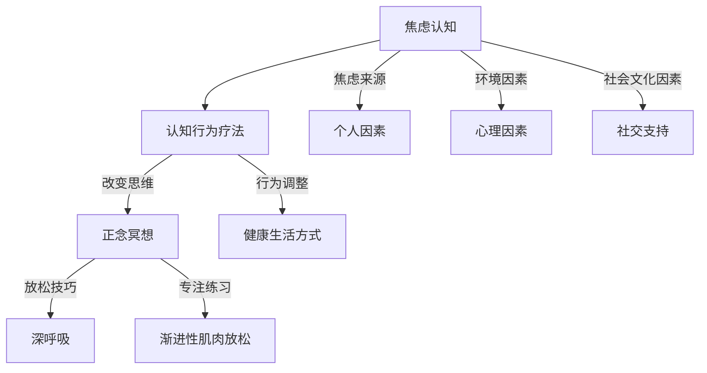

                 

### 引言

#### 1.1 书籍背景与目的

在当今快节奏的社会中，人们面临着前所未有的压力和挑战。随着科技的飞速发展，信息爆炸，工作压力增加，社交网络不断扩展，人们的生活节奏变得越来越快。这种快节奏的生活方式导致了人们心理问题的增多，尤其是焦虑现象的普遍化。焦虑不仅影响了人们的心理健康，还严重影响了生活质量和工作效率。

本书的目的是帮助读者在快节奏的社会中找到内心平静，对抗焦虑。通过系统的方法和实用的技巧，读者可以更好地理解焦虑的本质，掌握应对焦虑的策略，从而提升生活质量和工作效率。本书不仅适合面临焦虑困扰的普通人，也适合从事心理咨询、医疗健康、教育等行业的工作者。

#### 1.2 快节奏社会现状

现代社会的快节奏主要表现在以下几个方面：

1. **工作压力**：随着竞争的加剧，职场压力不断增大。许多人需要面对高强度的工作任务，长时间的工作时间，以及不断变化的工作环境。

2. **信息过载**：互联网和移动设备的普及使得信息获取变得异常便捷，但同时也导致了信息过载。人们需要处理海量的信息，这使得大脑处于持续紧张的状态。

3. **社交压力**：社交媒体的流行使得人们可以随时随地与他人保持联系，但这种虚拟的社交关系往往增加了现实生活中的社交压力。

4. **生活成本**：房价、教育、医疗等生活成本的上升使得人们的生活压力增大，焦虑情绪也随之增加。

#### 1.3 焦虑对个体的影响

焦虑是一种常见的心理现象，它可以对个体产生多方面的影响：

1. **心理影响**：长期的焦虑会导致情绪不稳定，容易感到紧张、担忧、恐惧，影响个体的心理健康。

2. **生理影响**：焦虑会导致一系列生理症状，如失眠、头痛、心悸、胃痛等，长期下去可能会引发更严重的健康问题。

3. **社交影响**：焦虑会使个体在社交场合中表现得紧张、不自然，从而影响人际关系，导致社交回避。

4. **工作与学习影响**：焦虑会降低个体的注意力和专注力，影响工作效率和学习成绩。

#### 1.4 寻求内心平静的重要性

在快节奏的社会中，寻求内心平静具有以下几个重要性：

1. **心理健康**：内心平静有助于缓解焦虑，维护心理健康。

2. **生活质量**：内心平静可以提高生活质量，使个体能够更好地享受生活。

3. **工作效率**：内心平静有助于提高专注力和工作效率。

4. **人际关系**：内心平静有助于建立和谐的人际关系。

#### 1.5 阅读指南

为了更好地阅读本书，读者可以遵循以下指南：

1. **逐步阅读**：建议读者按照章节顺序逐步阅读，以便系统地了解焦虑的本质和应对策略。

2. **实践与应用**：本书提供了多个实用的技巧和方法，读者可以结合自身情况进行实践和应用，以获得最佳效果。

3. **反思与总结**：在阅读过程中，读者可以反思自己的焦虑情况，总结所学内容，以便更好地应对焦虑。

#### 1.6 各章节内容概览

本书分为三大部分，共计八个章节，具体内容如下：

**第一部分：了解焦虑**

- 第2章：焦虑的本质
- 第3章：焦虑产生的原因
- 第4章：焦虑对身心健康的影响

**第二部分：应对焦虑的策略**

- 第5章：自我认知与心态调整
- 第6章：健康生活方式
- 第7章：社交支持与人际关系
- 第8章：时间管理与压力释放
- 第9章：职场焦虑应对

**第三部分：实践与案例**

- 第10章：实践方法介绍
- 第11章：案例分享
- 第12章：持续成长

通过以上内容，读者可以全面了解焦虑，掌握应对焦虑的策略，并在实践中不断成长，找到内心平静。

### 第一部分：了解焦虑

焦虑是一种复杂的心理现象，它不仅影响个体的情绪和心理状态，还可能对生理健康产生深远影响。在本部分中，我们将深入探讨焦虑的本质、产生的原因以及对身心健康的影响，帮助读者更好地理解这一常见的心理问题。

#### 2.1 焦虑的本质

#### 2.1.1 焦虑的定义

焦虑是一种以不安和恐惧为主要特征的心理学状态，通常表现为对未来可能发生的威胁或挑战的担忧和预期。焦虑可以是短暂的，也可以是持续的，其程度可以从轻微的不安到严重的恐慌发作。

#### 2.1.2 焦虑的类型

焦虑可以分为几种不同的类型，每种类型都有其特定的特征和影响：

1. **广泛性焦虑症（GAD）**：这种类型的焦虑症表现为持续的、普遍的担忧和不安，通常伴随着生理症状，如心悸、出汗和肌肉紧张。

2. **社交焦虑症（社交恐惧症）**：社交焦虑症主要表现为对社交场合的恐惧和不安，个体可能会担心自己在他人面前表现不佳或被评判。

3. **特定恐惧症**：特定恐惧症指的是对特定事物或情境的极端恐惧，如高处、封闭空间等。

4. **惊恐障碍**：这是一种突发性的、强烈的恐惧感，通常伴随着呼吸困难、心悸和出汗等症状。

#### 2.1.3 焦虑与压力的关系

焦虑和压力常常是相伴而行的，两者之间存在复杂的关系。压力是焦虑的一个主要触发因素，而焦虑则是对压力的反应。长期的、高强度的压力会导致个体产生持续的焦虑感。

#### 2.1.4 焦虑的心理机制

焦虑的心理机制涉及多个层面，包括认知、情绪和生理反应。从认知层面来看，焦虑通常与负面思维和认知扭曲有关，如过度预测、灾难化和个人化。从情绪层面来看，焦虑会导致强烈的情绪体验，如恐惧、担忧和不安。从生理层面来看，焦虑会引起一系列的生理反应，如心跳加快、呼吸急促和出汗。

#### 2.2 焦虑产生的原因

焦虑的产生是多种因素共同作用的结果，这些因素可以分为个人因素、环境因素、心理因素和社会文化因素。

#### 2.2.1 个人因素

个人因素是焦虑产生的一个重要原因，包括遗传因素、个性特征和生活经历等。

1. **遗传因素**：焦虑有一定的遗传倾向，研究发现焦虑症的发病率在家庭成员中具有较高的相关性。

2. **个性特征**：某些个性特征，如神经质、完美主义和过度敏感，与焦虑的发生有一定的联系。

3. **生活经历**：童年时期的创伤、离婚、失业等负面生活事件都可能增加焦虑的风险。

#### 2.2.2 环境因素

环境因素也是焦虑产生的一个重要原因，包括工作压力、社交压力和生活成本等。

1. **工作压力**：高强度的工作任务、长时间的工作时间和竞争激烈的职场环境都会增加个体的焦虑感。

2. **社交压力**：现代社会的社交网络虽然使人们更容易保持联系，但也增加了社交压力。

3. **生活成本**：高昂的房价、教育和医疗成本都会增加人们的生活压力，进而导致焦虑。

#### 2.2.3 心理因素

心理因素在焦虑的产生中起着关键作用，包括认知方式、应对策略和心理健康状况等。

1. **认知方式**：消极的认知方式，如过度预测、灾难化和个人化，会加重焦虑感。

2. **应对策略**：缺乏有效的应对策略，如逃避、压抑和否认，也会加剧焦虑。

3. **心理健康状况**：心理健康状况不佳，如抑郁症、创伤后应激障碍等，都会增加焦虑的风险。

#### 2.2.4 社会文化因素

社会文化因素对焦虑的产生也有一定的影响，包括文化背景、社会支持和教育水平等。

1. **文化背景**：不同文化对焦虑的认知和处理方式不同，这会影响焦虑的发病率和表现。

2. **社会支持**：缺乏有效的社会支持系统，如家人、朋友和同事的支持，会增加个体的焦虑感。

3. **教育水平**：较低的教育水平可能导致个体对焦虑的认识不足，从而影响应对策略的选择。

#### 2.3 焦虑对身心健康的影响

焦虑对身心健康的影响是多方面的，包括身体症状、心理症状、社交影响和工作与学习影响。

#### 2.3.1 身体症状

焦虑会导致一系列的身体症状，如：

- **心脏症状**：心悸、胸闷、胸痛。
- **消化系统症状**：胃痛、腹泻、消化不良。
- **呼吸系统症状**：呼吸急促、胸闷。
- **肌肉紧张**：肌肉酸痛、头痛。

#### 2.3.2 心理症状

焦虑会导致一系列的心理症状，如：

- **情绪不稳定**：容易激动、焦虑、担忧。
- **注意力下降**：难以集中注意力，记忆力下降。
- **自我评价过低**：对自己过于苛刻，缺乏自信。

#### 2.3.3 社交影响

焦虑会影响个体的社交行为，如：

- **社交回避**：害怕社交场合，避免与他人交流。
- **社交尴尬**：在社交场合中感到尴尬和不自在。
- **人际关系紧张**：与家人、朋友和同事的关系紧张。

#### 2.3.4 工作与学习影响

焦虑会影响个体的工作与学习表现，如：

- **工作效率下降**：难以集中注意力，工作质量下降。
- **学习困难**：注意力不集中，记忆力下降，影响学习效果。
- **职业发展受阻**：焦虑可能导致职业发展受到阻碍。

#### 2.4 焦虑的应对与缓解策略

了解焦虑的本质和原因后，接下来我们将探讨应对焦虑的策略和缓解方法，帮助读者找到内心平静。

### 第二部分：应对焦虑的策略

在快节奏的社会中，焦虑已经成为一种常见的心理健康问题。如何有效地应对焦虑，找到内心平静，是每个人都关心的问题。在本部分中，我们将介绍一系列应对焦虑的策略，包括自我认知与心态调整、健康生活方式、社交支持与人际关系、时间管理与压力释放以及职场焦虑应对。这些策略旨在帮助读者从多个方面改善心理状态，减轻焦虑。

#### 3.1 自我认知与心态调整

自我认知与心态调整是应对焦虑的重要策略之一。通过以下方法，读者可以更好地了解自己的情绪和心理状态，从而采取有效的应对措施。

#### 3.1.1 认知行为疗法（CBT）

认知行为疗法（Cognitive Behavioral Therapy，CBT）是一种广泛用于治疗焦虑和其他心理问题的心理治疗方法。CBT的基本理念是，通过改变负面思维模式和行为模式，可以帮助个体减少焦虑和改善心理健康。

1. **识别负面思维**：CBT的第一步是帮助个体识别和意识到自己的负面思维。这些负面思维可能包括过度预测、灾难化、个人化等。

2. **挑战负面思维**：一旦识别出负面思维，个体需要对其进行分析和挑战。例如，如果个体认为“我无法完成任务”，需要分析这个观点的合理性，并寻找证据来反驳它。

3. **建立积极思维**：通过识别和挑战负面思维，个体可以逐渐建立积极、合理的思维模式。例如，可以将“我无法完成任务”改为“我可以逐步完成任务”。

#### 3.1.2 冥想与正念练习

冥想与正念练习（Mindfulness Meditation）是另一种有效的应对焦虑的方法。通过冥想，个体可以培养对当前时刻的关注和接纳，从而减轻焦虑和压力。

1. **呼吸冥想**：呼吸冥想是一种简单的冥想技巧，通过专注于呼吸，可以帮助个体放松身心，减轻焦虑。

2. **身体扫描冥想**：身体扫描冥想是一种通过逐个关注身体不同部位的感受来放松身心的方法。通过这种方法，个体可以更好地了解自己的身体和心理状态。

3. **正念饮食**：正念饮食是一种通过专注于食物的味道、口感和进食过程中的感受来改善饮食体验的方法。这种方法可以帮助个体减少焦虑和压力，提高生活质量。

#### 3.1.3 自我接纳与自我关怀

自我接纳与自我关怀是应对焦虑的关键。通过以下方法，个体可以培养对自己和当前状态的接纳和爱护。

1. **自我接纳**：自我接纳意味着接受自己的优点和缺点，不再对自己进行苛刻的评价和批评。通过自我接纳，个体可以减少自我负面思维，提高自尊和自信。

2. **自我关怀**：自我关怀是一种对自己进行爱护和照顾的方法。通过自我关怀，个体可以减轻焦虑和压力，提高心理健康。自我关怀的方法包括：

   - **情绪释放**：通过写日记、绘画或运动等方式，帮助个体释放负面情绪。
   - **身体关怀**：通过按摩、泡澡或进行有氧运动等方式，帮助个体放松身体，减轻焦虑。
   - **心理支持**：通过与他人交流、寻求心理咨询或加入支持小组等方式，获得心理支持和帮助。

#### 3.2 健康生活方式

健康的生活方式是减轻焦虑和提升心理健康的重要因素。以下方法可以帮助读者建立健康的生活方式，从而改善焦虑状况。

#### 3.2.1 合理饮食

合理饮食对心理健康有着重要的影响。以下是一些建议：

1. **摄入足够的营养素**：确保摄入足够的蛋白质、维生素和矿物质，以支持大脑功能和心理健康。
2. **减少咖啡因和糖的摄入**：咖啡因和糖可能会导致焦虑和情绪波动，应适量摄入。
3. **多吃富含Omega-3脂肪酸的食物**：Omega-3脂肪酸对心理健康有益，可以通过鱼类、坚果和亚麻籽等食物摄入。

#### 3.2.2 规律运动

规律运动是减轻焦虑和提升心理健康的重要方法。以下是一些建议：

1. **每天进行30分钟以上的运动**：运动可以提高心率，促进内啡肽的分泌，从而减轻焦虑和压力。
2. **选择适合自己的运动方式**：无论是跑步、瑜伽、游泳还是有氧运动，选择自己喜欢的运动方式，可以更好地坚持。
3. **定期参加团体运动**：团体运动不仅可以提高运动效果，还可以增强社交支持，缓解焦虑。

#### 3.2.3 充足睡眠

充足睡眠对心理健康至关重要。以下是一些建议：

1. **每晚保证7-9小时的睡眠**：确保每天有足够的睡眠时间，以支持大脑和身体的恢复。
2. **建立规律的睡眠习惯**：每天保持相同的睡眠和起床时间，有助于调整生物钟，提高睡眠质量。
3. **创造良好的睡眠环境**：保持房间安静、黑暗和凉爽，有助于提高睡眠质量。

#### 3.2.4 减少咖啡因与酒精摄入

咖啡因和酒精都是潜在的焦虑触发因素，应适量摄入。

1. **限制咖啡因摄入**：咖啡、茶、可乐等含咖啡因的饮料应适量饮用，避免在晚上饮用，以免影响睡眠。
2. **限制酒精摄入**：酒精虽然可以暂时减轻焦虑，但长期来看会加重焦虑症状，应适量饮用或戒酒。

#### 3.3 社交支持与人际关系

社交支持在应对焦虑中起着关键作用。以下方法可以帮助读者建立和维护健康的社交关系。

#### 3.3.1 建立支持系统

建立支持系统是应对焦虑的重要一环。以下是一些建议：

1. **与家人和朋友保持联系**：与家人和朋友保持紧密联系，可以提供情感支持和安慰，减轻焦虑。
2. **加入兴趣小组或社区组织**：加入与自己兴趣相关的小组或社区组织，可以扩大社交圈子，增加社交支持。
3. **寻求专业帮助**：如果焦虑症状严重，可以寻求心理咨询师或心理医生的帮助，获得专业的支持和指导。

#### 3.3.2 提升沟通技巧

良好的沟通技巧有助于建立和维护健康的社交关系。以下是一些建议：

1. **倾听他人**：倾听他人是建立良好关系的基础，通过倾听可以表达关心和理解。
2. **表达自己**：学会表达自己的感受和需求，有助于建立互信和有效沟通。
3. **解决冲突**：学会处理冲突和解决分歧，可以维护良好的人际关系。

#### 3.3.3 处理冲突与矛盾

冲突和矛盾是人际关系中不可避免的一部分。以下是一些建议：

1. **保持冷静**：在冲突发生时，保持冷静有助于理性思考和处理问题。
2. **寻求共识**：通过寻求共识，可以找到双方都能接受的解决方案。
3. **适时求助**：如果冲突无法自行解决，可以寻求第三方调解或专业帮助。

#### 3.4 时间管理与压力释放

有效的时间管理和压力释放是应对焦虑的重要策略。以下方法可以帮助读者更好地管理时间和减轻压力。

#### 3.4.1 时间管理技巧

以下是一些时间管理技巧：

1. **制定日程表**：制定详细的日程表，有助于合理分配时间和任务。
2. **优先级排序**：将任务按照优先级排序，确保先完成最重要和紧急的任务。
3. **避免拖延**：通过设定截止日期和分解任务，避免拖延，提高工作效率。

#### 3.4.2 学会拒绝

学会拒绝是减轻压力的重要方法。以下是一些建议：

1. **明确界限**：明确自己的界限和底线，避免过度承诺。
2. **表达拒绝**：学会以礼貌的方式表达拒绝，不必害怕得罪他人。
3. **坚持原则**：坚持自己的原则和价值观，避免因为外界压力而妥协。

#### 3.4.3 放松技巧

以下是一些放松技巧：

1. **呼吸练习**：通过深呼吸练习，可以帮助放松身体和心情。
2. **渐进性肌肉放松**：通过逐个放松身体不同部位的肌肉，可以缓解紧张和焦虑。
3. **冥想**：冥想是一种有效的放松技巧，可以帮助个体集中注意力，减轻焦虑。

#### 3.5 职场焦虑应对

职场焦虑是许多人在职场中面临的问题。以下方法可以帮助读者应对职场焦虑。

#### 3.5.1 职场压力分析

了解职场压力的来源和影响是应对职场焦虑的第一步。以下是一些建议：

1. **识别压力源**：分析导致职场压力的具体原因，如工作负担、人际关系、职业发展等。
2. **评估压力影响**：了解职场压力对自己的身心健康和工作效率的影响，从而采取相应的应对措施。

#### 3.5.2 职场心理健康维护

以下是一些职场心理健康维护的方法：

1. **定期休息**：合理安排工作与休息时间，避免过度劳累。
2. **积极沟通**：与同事和上司保持良好的沟通，及时解决问题和缓解压力。
3. **寻求专业帮助**：如果职场压力过大，可以寻求心理咨询师或心理医生的帮助。

#### 3.5.3 职场心理调适技巧

以下是一些职场心理调适技巧：

1. **时间管理**：通过合理安排时间和任务，提高工作效率，减少工作压力。
2. **情绪调节**：学会管理自己的情绪，避免负面情绪对工作和人际关系的影响。
3. **积极心态**：保持积极的心态，对困难和挑战持乐观态度，提高抗压能力。

通过以上策略，读者可以在不同方面应对焦虑，找到内心平静。尽管焦虑是一种常见的心理现象，但通过合理的应对策略，我们可以有效地减轻焦虑，提升生活质量。

### 3.1 自我认知与心态调整

自我认知与心态调整是应对焦虑的关键策略之一。通过深入理解自己的情绪和心理状态，并采取积极的调整措施，我们可以更好地管理焦虑，找到内心的平静。

#### 3.1.1 认知行为疗法（CBT）

认知行为疗法（Cognitive Behavioral Therapy，CBT）是一种广泛用于治疗焦虑和其他心理问题的心理治疗方法。CBT的核心思想是，通过改变不合理的思维和行为模式，可以有效减轻焦虑。

**原理**：CBT基于以下原理：

1. **认知决定行为**：我们的思维直接影响我们的行为和情绪。
2. **行为决定认知**：通过改变行为，可以改变思维模式和情绪。

**步骤**：

1. **识别负面思维**：第一步是识别和意识到自己的负面思维。这些思维可能包括过度预测、灾难化、个人化等。

2. **挑战负面思维**：一旦识别出负面思维，我们需要对其进行分析和挑战。例如，如果个体认为“我无法完成任务”，需要分析这个观点的合理性，并寻找证据来反驳它。

3. **建立积极思维**：通过识别和挑战负面思维，我们可以逐渐建立积极、合理的思维模式。例如，可以将“我无法完成任务”改为“我可以逐步完成任务”。

**实践**：

1. **日记记录**：每天记录自己的思维和情绪，识别负面思维模式。
2. **思维日记**：定期回顾和反思自己的思维模式，分析其合理性。

**效果**：

通过CBT，个体可以学会更加理性地看待问题，减少不必要的焦虑，提高心理健康和生活质量。

#### 3.1.2 冥想与正念练习

冥想与正念练习（Mindfulness Meditation）是一种通过专注于当前时刻和身体感受来减轻焦虑的方法。正念是一种觉知和接纳当下体验的实践，可以帮助个体培养对情绪和思维的观察力。

**原理**：

1. **提高注意力**：冥想可以提高注意力，减少分心和焦虑。
2. **减少情绪波动**：通过专注于呼吸和身体感受，个体可以减少情绪波动，提高情绪稳定性。

**步骤**：

1. **呼吸冥想**：专注于呼吸，感受吸气和呼气的过程，将注意力集中在呼吸上。
2. **身体扫描冥想**：从脚开始，逐个扫描身体不同部位的感受，放松身心。
3. **正念饮食**：专注于食物的味道和口感，体验进食过程中的每一个细节。

**实践**：

1. **每天练习**：每天安排一段时间进行冥想和正念练习。
2. **设定目标**：为自己设定冥想和正念练习的目标，如每天练习10分钟。
3. **记录进步**：记录练习的感受和进步，帮助自己持续练习。

**效果**：

通过冥想和正念练习，个体可以学会更好地管理自己的情绪，提高专注力和生活质量。

#### 3.1.3 自我接纳与自我关怀

自我接纳与自我关怀是应对焦虑的重要策略。通过接纳自己的优点和缺点，并对自己的身心健康给予关怀，个体可以减少自我负面思维，提高自尊和自信。

**原理**：

1. **减少自我批评**：通过自我接纳，个体可以减少自我批评和负面思维，从而减轻焦虑。
2. **提高自尊**：自我接纳有助于提高个体的自尊和自信，从而更好地应对生活中的挑战。

**步骤**：

1. **自我接纳**：接受自己的优点和缺点，不再对自己进行苛刻的评价和批评。
2. **自我关怀**：对自己进行爱护和照顾，如通过健康饮食、规律运动和充足的睡眠来维护身心健康。

**实践**：

1. **情绪释放**：通过写日记、绘画或运动等方式，帮助自己释放负面情绪。
2. **身体关怀**：通过按摩、泡澡或进行有氧运动等方式，放松身体，减轻焦虑。
3. **心理支持**：与他人交流，寻求心理咨询或加入支持小组，获得心理支持和帮助。

**效果**：

通过自我接纳和自我关怀，个体可以减少负面思维，提高心理健康和生活质量。

#### 3.1.4 反思与总结

通过自我认知与心态调整，个体可以更好地理解自己的情绪和心理状态，并采取积极的措施来管理焦虑。以下是一些反思和总结的建议：

1. **定期反思**：定期反思自己的思维和行为模式，识别负面思维，并采取积极的应对措施。
2. **持续学习**：学习新的应对焦虑的策略和方法，不断提高自己的应对能力。
3. **实践应用**：将所学的策略应用到日常生活中，通过实践来检验其效果。
4. **寻求帮助**：如果焦虑症状严重，可以寻求心理咨询师或心理医生的帮助，获得专业的支持和指导。

通过自我认知与心态调整，我们可以更好地管理焦虑，找到内心的平静。尽管焦虑是一种常见的心理现象，但通过合理的策略和方法，我们可以有效地减轻焦虑，提升生活质量。

### 3.2 健康生活方式

健康的生活方式在缓解焦虑和提升心理健康方面起着至关重要的作用。通过调整饮食、规律运动和充足睡眠，我们可以从身体和心理两个层面减轻焦虑，提高生活质量。

#### 3.2.1 合理饮食

合理饮食是维持身体健康和心理健康的基础。以下是一些关于合理饮食的建议：

1. **多样化饮食**：确保摄入足够的营养素，包括蛋白质、碳水化合物、脂肪、维生素和矿物质。多样化饮食可以提供身体所需的各种营养。

2. **减少咖啡因和糖的摄入**：咖啡因和糖可能会导致焦虑和情绪波动。限制咖啡、茶、碳酸饮料和甜食的摄入，有助于减少焦虑。

3. **多吃富含Omega-3脂肪酸的食物**：Omega-3脂肪酸对心理健康有益，可以通过鱼类、坚果和亚麻籽等食物摄入。Omega-3脂肪酸有助于改善情绪和减轻焦虑。

4. **保持水分**：保持充足的水分摄入对于维持身体功能和心理健康至关重要。每天至少喝8杯水，以避免脱水。

#### 3.2.2 规律运动

规律运动是减轻焦虑和压力的重要途径。以下是一些关于规律运动的建议：

1. **选择适合自己的运动方式**：无论是有氧运动、力量训练还是瑜伽，选择自己喜欢的运动方式，可以提高坚持运动的概率。

2. **每天进行30分钟以上的运动**：定期进行30分钟以上的运动，可以促进内啡肽的分泌，提高心情，减轻焦虑。

3. **多样化运动**：尝试不同的运动方式，如跑步、游泳、瑜伽和健身，以保持兴趣和新鲜感。

4. **定期锻炼**：设定固定的锻炼时间，如每天早晨或晚上，以确保规律的锻炼。

#### 3.2.3 充足睡眠

充足睡眠对于缓解焦虑和提升心理健康至关重要。以下是一些关于充足睡眠的建议：

1. **每晚保证7-9小时的睡眠**：根据个体差异，确保每晚有足够的睡眠时间，以支持大脑和身体的恢复。

2. **建立规律的睡眠习惯**：每天保持相同的睡眠和起床时间，有助于调整生物钟，提高睡眠质量。

3. **创造良好的睡眠环境**：保持房间安静、黑暗和凉爽，有助于提高睡眠质量。使用舒适的床上用品，如枕头和床垫。

4. **避免睡前使用电子设备**：睡前避免使用手机、电脑和电视等电子设备，因为这些设备发出的蓝光可能会干扰睡眠。

5. **放松身心**：在睡前进行一些放松活动，如冥想、深呼吸或热水澡，有助于放松身心，提高睡眠质量。

#### 3.2.4 减少咖啡因与酒精摄入

咖啡因和酒精都是潜在的焦虑触发因素，应适量摄入。

1. **限制咖啡因摄入**：咖啡、茶、可乐等含咖啡因的饮料应适量饮用，避免在晚上饮用，以免影响睡眠。

2. **限制酒精摄入**：酒精虽然可以暂时减轻焦虑，但长期来看会加重焦虑症状，应适量饮用或戒酒。

通过合理饮食、规律运动和充足睡眠，我们可以从身体和心理两个层面缓解焦虑，提升心理健康。这些健康生活方式不仅有助于减轻焦虑，还能提高生活质量，使我们在快节奏的社会中找到内心的平静。

### 3.3 社交支持与人际关系

社交支持在应对焦虑中起着至关重要的作用。良好的社交关系不仅能够提供情感上的安慰，还能帮助个体缓解压力，提高心理健康。以下方法将帮助读者建立和维护健康的社交支持系统，提升人际关系。

#### 3.3.1 建立支持系统

建立支持系统是应对焦虑的第一步。以下是一些建议：

1. **与家人和朋友保持联系**：与家人和朋友保持紧密联系，可以提供情感支持和安慰，减轻焦虑。定期与他们通话、见面或通过社交媒体保持联系。

2. **加入兴趣小组或社区组织**：加入与自己兴趣相关的小组或社区组织，可以扩大社交圈子，增加社交支持。参与集体活动，与他人分享兴趣和经验。

3. **寻求专业帮助**：如果焦虑症状严重，可以寻求心理咨询师或心理医生的帮助。专业的心理咨询师可以提供有效的心理支持和治疗建议。

#### 3.3.2 提升沟通技巧

良好的沟通技巧是建立和维护健康人际关系的关键。以下是一些提升沟通技巧的建议：

1. **倾听他人**：倾听是沟通的基础。通过倾听他人，我们可以表达关心和理解，建立互信。确保在对方发言时保持专注，不打断对方。

2. **表达自己**：学会清晰地表达自己的感受和需求。使用积极的语言和表达方式，避免使用攻击性或指责性的言辞。

3. **解决问题**：在沟通中，不仅要表达自己的观点，还要倾听对方的意见。通过共同探讨问题，找到双方都能接受的解决方案。

#### 3.3.3 处理冲突与矛盾

冲突和矛盾是人际关系中不可避免的一部分。以下是一些建议，帮助读者处理冲突和矛盾：

1. **保持冷静**：在冲突发生时，保持冷静有助于理性思考和处理问题。避免在情绪激动时做出决定，给自己一些时间冷静下来。

2. **寻求共识**：通过寻求共识，可以找到双方都能接受的解决方案。尝试理解对方的观点，并寻找共同点。

3. **寻求第三方调解**：如果冲突无法自行解决，可以寻求第三方调解或专业帮助。调解者或咨询师可以提供中立的视角和建议，帮助双方找到解决方案。

4. **道歉与谅解**：在冲突中，学会道歉和谅解对方。通过表达歉意和展示诚意，可以缓解紧张局势，恢复关系。

#### 3.3.4 建立和维护健康的人际关系

建立和维护健康的人际关系需要时间和努力。以下是一些建议：

1. **真诚相待**：与他人建立真诚的关系，通过真诚的交流，建立信任和尊重。

2. **关心他人**：关注他人的需求和感受，提供帮助和支持。通过关心他人，可以获得更多的社交支持和友谊。

3. **保持积极态度**：在人际关系中，保持积极的态度，避免抱怨和批评。积极的态度有助于建立和谐的人际关系。

4. **持续互动**：定期与朋友和同事互动，保持联系。通过共度时光和共同活动，加深彼此的了解和友谊。

5. **尊重差异**：尊重他人的观点和生活方式，避免因差异而产生冲突。尊重差异有助于建立包容和多元的人际关系。

通过建立支持系统、提升沟通技巧、处理冲突和建立健康的人际关系，读者可以有效地缓解焦虑，提高心理健康。这些策略不仅有助于应对当前的焦虑，还能为未来的生活奠定坚实的基础。

### 3.4 时间管理与压力释放

在快节奏的社会中，时间管理和压力释放是应对焦虑的重要策略。通过合理安排时间、学会拒绝和处理压力，我们可以提高生活质量，找到内心的平静。

#### 3.4.1 时间管理技巧

有效的时间管理可以帮助我们更好地安排日常事务，减少因时间压力导致的焦虑。以下是一些时间管理技巧：

1. **制定日程表**：每天或每周制定一个详细的日程表，列出所有需要完成的任务和活动。确保将重要任务和紧急任务优先安排。

2. **优先级排序**：将任务按照优先级排序，确保先完成最重要和紧急的任务。使用“紧急-重要矩阵”来分析任务的优先级。

3. **避免拖延**：通过设定明确的截止日期和分解任务，避免拖延。将大任务分解成小步骤，逐步完成。

4. **定期回顾**：定期回顾日程表和任务完成情况，调整计划。根据实际情况灵活调整日程安排，避免过度劳累。

5. **利用工具**：使用时间管理工具，如待办事项列表、时间跟踪应用程序和日历，帮助管理时间。

#### 3.4.2 学会拒绝

学会拒绝是减轻压力的重要方法。以下是一些建议：

1. **明确界限**：明确自己的时间和精力界限，避免过度承诺。学会对不合理的要求说“不”，保护自己的时间和精力。

2. **表达拒绝**：以礼貌和坚定的方式表达拒绝。使用积极的语言，如“我现在无法接受这个任务，但我会在其他时间帮助您”。

3. **设定优先级**：在拒绝新的任务时，解释自己目前的优先级和任务负荷，确保对方理解。

4. **寻找替代方案**：如果可能，提供替代方案或建议其他合适的资源，以帮助对方解决问题。

#### 3.4.3 放松技巧

放松技巧可以帮助我们在紧张的时间管理和压力释放过程中恢复平静。以下是一些放松技巧：

1. **深呼吸练习**：通过深呼吸，放松身体和心情。每次吸气时，尽量让腹部扩张；每次呼气时，尽量放松。

2. **渐进性肌肉放松**：通过逐个放松身体不同部位的肌肉，缓解紧张和焦虑。从脚开始，逐渐向上到头部，每次放松一个部位的肌肉。

3. **冥想**：冥想可以帮助我们集中注意力，减少焦虑。找一个安静的地方，闭上眼睛，专注于呼吸或一个特定的物体。

4. **运动**：定期进行有氧运动，如快走、跑步或游泳，释放压力，提高心情。

5. **听音乐或放松音乐**：听轻松的音乐或放松音乐，可以帮助放松身心，减轻焦虑。

通过合理安排时间、学会拒绝和处理压力，我们可以提高生活质量，减轻焦虑。这些策略不仅有助于应对日常生活中的压力，还能帮助我们找到内心的平静。

### 3.5 职场焦虑应对

在职场中，焦虑是一种常见的情绪体验，尤其在高强度、快节奏的工作环境中，焦虑可能对工作表现和心理健康产生负面影响。为了有效应对职场焦虑，我们需要从多个方面进行分析和策略制定。

#### 3.5.1 职场压力分析

了解职场压力的来源和特点是应对职场焦虑的第一步。以下是一些常见的职场压力源：

1. **工作负荷**：工作量过大或工作负荷过重是导致焦虑的主要因素之一。长期超负荷工作可能导致疲劳、压力和焦虑。

2. **工作不确定性**：对工作稳定性的担忧，如失业风险或职位变动，也会增加焦虑感。

3. **人际关系**：职场中的冲突和人际关系问题，如同事间的竞争和误解，也可能引发焦虑。

4. **职业发展**：对职业发展的担忧，如晋升机会、职业前景等，也是职场焦虑的常见原因。

5. **工作与生活的平衡**：工作与生活不平衡，如长时间工作、缺乏休息和休假，也会导致焦虑。

#### 3.5.2 职场心理健康维护

为了维护职场心理健康，以下是一些有效的策略：

1. **时间管理**：合理安排工作时间，确保工作与休息相结合。使用时间管理工具，如待办事项列表和日程表，优化工作流程。

2. **目标设定**：设定明确、可达成的目标，有助于提高工作效率和减少焦虑。将大目标分解成小步骤，逐步实现。

3. **积极沟通**：与同事和上司保持良好的沟通，及时分享工作进展和问题。良好的沟通有助于减少误解和冲突，提高工作效率。

4. **自我调节**：学会自我调节情绪和压力，通过深呼吸、冥想或短暂的休息来放松身心。自我调节能力可以帮助我们更好地应对压力。

5. **寻求支持**：如果焦虑症状严重，可以寻求心理咨询或职业指导的帮助。专业支持可以帮助我们找到更有效的应对策略。

#### 3.5.3 职场心理调适技巧

以下是一些职场心理调适技巧，帮助我们在工作中更好地管理焦虑：

1. **时间管理技巧**：通过优先级排序和避免拖延，提高工作效率，减少因时间压力导致的焦虑。

2. **情绪调节**：学会识别和应对负面情绪，如焦虑和压力。通过积极的自我对话和认知重构，改变消极的思维模式。

3. **放松技巧**：在工作间隙进行短暂的放松活动，如深呼吸、冥想或轻松的音乐。这些放松技巧可以帮助缓解紧张和焦虑。

4. **健康生活方式**：保持规律的饮食、运动和充足的睡眠，有助于提升身体和心理的健康水平，减少焦虑。

5. **建立支持系统**：与同事建立良好的关系，相互支持，共同应对工作压力。一个强大的社交支持网络可以帮助我们更好地应对职场挑战。

通过以上策略，我们可以在职场中更好地应对焦虑，维护心理健康。尽管职场压力不可避免，但通过合理的调适技巧和管理策略，我们可以提高工作效率，提升生活质量，找到内心的平静。

### 4.1 实践方法介绍

为了更好地应对焦虑，我们需要采取一系列实用的方法。以下三种方法可以帮助我们有效地减轻焦虑，提升心理健康。

#### 4.1.1 记录焦虑日志

记录焦虑日志是一种有效的自我监控和反思方法，可以帮助我们更好地理解和管理焦虑。

**步骤**：

1. **选择记录工具**：可以使用日记本、手机应用或在线工具来记录焦虑日志。

2. **设定记录时间**：每天设定固定的时间，如睡前或早晨，来记录焦虑情况。

3. **详细记录**：记录焦虑的时间、地点、情绪、触发原因和具体表现。例如：“今天下午3点，我在办公室感到焦虑，因为工作任务积压，担心无法按时完成。”

4. **反思与总结**：记录后，反思焦虑的原因和可能的解决方案。例如：“我意识到焦虑是因为任务积压，可以尝试分解任务，逐步完成。”

**效果**：

通过记录焦虑日志，我们可以更好地了解自己的焦虑情况，识别触发因素，并采取有效的应对措施。这种方法有助于提高自我意识和焦虑管理能力。

#### 4.1.2 焦虑放松训练

焦虑放松训练是一种通过身体和呼吸练习来缓解焦虑的方法。以下是一些常见的放松训练：

1. **深呼吸练习**：深呼吸可以帮助我们放松身体，减轻焦虑。步骤如下：

   - 坐或躺在一个舒适的位置。
   - 将一只手放在胸部，另一只手放在腹部。
   - 慢慢吸气，感受腹部上升，胸部保持不动。
   - 慢慢呼气，感受腹部下降，胸部放松。
   - 重复几次，专注于呼吸。

2. **渐进性肌肉放松**：通过逐个放松身体不同部位的肌肉，可以缓解紧张和焦虑。步骤如下：

   - 从脚开始，逐渐向上到头部，放松每一块肌肉。
   - 在放松时，专注于感受肌肉的紧张和松弛。
   - 可以在每次放松练习后进行深呼吸，进一步增强放松效果。

**效果**：

焦虑放松训练可以帮助我们缓解身体和心理的紧张感，提高放松能力，从而减轻焦虑。

#### 4.1.3 渐进性肌肉松弛

渐进性肌肉松弛（Progressive Muscle Relaxation，PMR）是一种通过逐步放松身体不同部位的肌肉来减轻焦虑的方法。以下是一种常见的PMR练习：

**步骤**：

1. **选择一个安静的环境**：找一个安静、舒适的地方，确保不会被打扰。

2. **开始练习**：

   - **脚部**：紧绷脚部肌肉，保持几秒钟，然后放松。
   - **腿部**：紧绷腿部肌肉，从脚踝到臀部，保持几秒钟，然后放松。
   - **手臂**：紧绷手臂肌肉，从手腕到肩膀，保持几秒钟，然后放松。
   - **躯干**：紧绷腹部和背部肌肉，保持几秒钟，然后放松。
   - **面部**：紧绷面部肌肉，包括眼睛、嘴巴和脸颊，保持几秒钟，然后放松。

3. **循环练习**：按照上述步骤，逐步放松全身的肌肉，每次练习大约10-15分钟。

**效果**：

通过渐进性肌肉松弛，我们可以有效地缓解身体紧张，减轻焦虑和压力，提高身心健康。

### 4.2 案例分享

为了更好地理解上述实践方法，以下将分享几个真实的案例，展示这些方法在实际生活中的应用和效果。

#### 4.2.1 案例一：小李的焦虑之旅

小李是一名年轻的程序员，由于工作压力大、任务繁重，他经常感到焦虑。通过参加焦虑放松训练和记录焦虑日志，小李逐渐找到了缓解焦虑的方法。

**应用方法**：

1. **记录焦虑日志**：小李开始每天记录自己的焦虑情况，包括焦虑的时间、地点、情绪和触发原因。通过反思和总结，他发现焦虑主要集中在工作任务积压和担心无法按时完成任务上。

2. **焦虑放松训练**：小李开始每天进行深呼吸练习和渐进性肌肉放松，帮助自己放松身体和心情。他还尝试在工作间隙进行短暂的放松活动，如听轻松的音乐。

**效果**：

通过记录焦虑日志和焦虑放松训练，小李逐渐学会了更好地管理自己的情绪，焦虑症状明显减轻。他能够更清晰地认识到焦虑的触发因素，并采取有效的应对措施。小李的工作效率也有所提高，同事和上司对他的表现给予了积极的反馈。

#### 4.2.2 案例二：职场焦虑的解决之道

张女士是一名职业女性，由于工作繁忙、家庭压力和人际关系问题，她经常感到焦虑。通过参加心理咨询和实施时间管理策略，张女士成功地解决了职场焦虑。

**应用方法**：

1. **心理咨询**：张女士定期参加心理咨询，学习如何识别和管理自己的情绪。心理咨询师帮助她理解焦虑的本质，并提供有效的应对策略。

2. **时间管理**：张女士学习了时间管理技巧，如制定日程表、设定优先级和避免拖延。通过合理安排时间和任务，她能够更好地平衡工作和生活，减少焦虑。

3. **放松技巧**：张女士开始练习深呼吸和渐进性肌肉放松，帮助自己放松身心。她还尝试定期进行有氧运动，如快走和瑜伽，以减轻焦虑和压力。

**效果**：

通过心理咨询和时间管理策略，张女士成功地减轻了职场焦虑。她能够更好地管理自己的情绪，提高工作效率，同时保持了良好的家庭关系。张女士的生活质量明显提高，她感到更加快乐和满足。

#### 4.2.3 案例三：家庭关系的调适

李先生和李女士是一对夫妻，由于工作压力和家庭矛盾，他们的关系变得紧张。通过家庭咨询和情感沟通，他们成功地改善了家庭关系，减轻了焦虑。

**应用方法**：

1. **家庭咨询**：李先生和李女士参加了家庭咨询，咨询师帮助他们理解彼此的需求和期望，并提供有效的沟通策略。

2. **情感沟通**：他们开始定期进行情感沟通，分享彼此的感受和需求。通过坦诚的交流，他们能够更好地理解对方，减少误解和冲突。

3. **共同活动**：李先生和李女士开始共同参与一些活动，如散步、看电影或共度周末，以增强彼此的感情和信任。

**效果**：

通过家庭咨询和情感沟通，李先生和李女士成功地改善了家庭关系，减轻了焦虑。他们能够更好地理解和支持对方，家庭氛围变得更加和谐。李先生和李女士的生活质量显著提高，他们感到更加幸福和满足。

### 4.3 持续成长

在应对焦虑的过程中，持续成长是关键。通过以下方法，我们可以不断提升自己，更好地应对焦虑挑战。

#### 4.3.1 如何保持积极心态

保持积极心态是应对焦虑的重要策略。以下是一些建议：

1. **设定小目标**：设定短期和长期的小目标，逐步实现。通过达成目标，可以增强自信和积极心态。

2. **培养感恩习惯**：每天记录和反思自己的感恩事物，培养对生活的感激和积极心态。

3. **阅读积极书籍**：阅读积极向上的书籍和文章，学习他人的成功经验和积极心态。

4. **定期自我激励**：通过自我激励，如自我肯定和自我奖励，增强积极心态。

#### 4.3.2 如何持续提升自我

持续提升自我是应对焦虑的重要途径。以下是一些建议：

1. **学习新技能**：不断学习新的知识和技能，提高自己的竞争力，减少焦虑。

2. **参与培训课程**：参加专业培训课程，提升自己的专业技能和职业素养。

3. **定期反思**：定期反思自己的行为和思维模式，识别不足并采取改进措施。

4. **建立支持系统**：与志同道合的人交流，建立支持系统，共同成长。

#### 4.3.3 如何应对新的焦虑挑战

面对新的焦虑挑战，以下是一些建议：

1. **识别焦虑来源**：仔细分析焦虑的来源，识别触发因素。

2. **采取有效应对策略**：根据焦虑的来源，采取相应的应对策略，如深呼吸、放松练习或寻求专业帮助。

3. **保持灵活适应**：面对新的挑战，保持灵活适应，及时调整自己的应对策略。

4. **寻求支持**：如果焦虑难以自我应对，可以寻求心理咨询师或心理医生的帮助。

通过持续成长，我们可以不断提升自己的心理素质，更好地应对焦虑挑战。持续成长不仅有助于减轻焦虑，还能提升我们的生活质量和幸福感。

### 结束语

在快节奏的社会中，焦虑已经成为一种普遍的心理现象。通过本书，我们探讨了焦虑的本质、产生原因以及对身心健康的影响，并介绍了多种应对焦虑的策略和实用方法。希望本书能为读者提供有益的启示和帮助，帮助大家找到内心的平静，提升生活质量。

#### 5.1 对读者的期许

我期待每一位读者能够积极应用本书中所介绍的方法，逐步改善自己的焦虑状况。同时，我也希望读者能够持续学习和成长，不断提升自己的心理素质，以更好地应对生活中的各种挑战。

#### 5.2 对未来的展望

未来，随着科技的不断进步和社会的不断发展，焦虑问题可能会变得更加复杂和多样。但只要我们保持积极的心态，持续学习和成长，就一定能够找到应对焦虑的有效方法。我期待看到读者们在面对焦虑时，能够更加从容和自信。

### 跋

在此，我要感谢所有读者对本书的支持和关注。感谢您在阅读过程中所花费的时间和精力。我希望这本书能够帮助您在快节奏的生活中找到内心的平静，应对焦虑，提升生活质量。

同时，我也感谢我的团队成员和编辑，他们在本书的编写过程中提供了宝贵的意见和建议，使得本书能够更加完善。

最后，我要感谢自己。感谢我在焦虑中的坚持和努力，让我有机会完成这本书，希望它能够帮助到更多的人。

愿每一位读者在焦虑中找到力量，在平静中享受生活。祝您身心健康，快乐幸福。

**作者：AI天才研究院/AI Genius Institute & 禅与计算机程序设计艺术 /Zen And The Art of Computer Programming**

---

### 附录A：推荐阅读资源

#### 5.1.1 心理健康相关书籍推荐

1. **《焦虑症：战胜恐惧与担忧的自我疗法》**
   - 作者：David M. Burns
   - 简介：本书通过认知行为疗法的方法，帮助读者识别和管理焦虑。

2. **《焦虑自救手册》**
   - 作者：Rita Gradin
   - 简介：本书提供了一系列实用的技巧和练习，帮助读者克服焦虑。

3. **《冥想与正念：身心健康的实践指南》**
   - 作者：安杰拉·阿姆斯特朗
   - 简介：本书详细介绍了冥想和正念的技巧，帮助读者缓解焦虑和压力。

#### 5.1.2 冥想与放松技巧资源推荐

1. **《正念冥想：治愈心灵、提升注意力的练习》**
   - 作者：乔·卡巴金
   - 简介：本书介绍了正念冥想的实践方法，帮助读者提高心理素质。

2. **《冥想与瑜伽：放松身心、提高生活质量的技巧》**
   - 作者：安德鲁·索尔金
   - 简介：本书结合冥想和瑜伽，提供了一系列放松身心、缓解焦虑的技巧。

3. **冥想APP推荐**：
   - **Headspace**：提供各种冥想课程，适合初学者。
   - **Insight Timer**：拥有大量的冥想音频，免费使用。

#### 5.1.3 职场心理支持资源推荐

1. **《职场压力管理：有效策略与技巧》**
   - 作者：克里斯托弗·卡斯特罗
   - 简介：本书介绍了应对职场压力的有效策略和技巧，帮助职场人士提升工作效率。

2. **《高效能人士的七个习惯》**
   - 作者：史蒂芬·柯维
   - 简介：本书提供了一系列习惯和方法，帮助职场人士提高工作效率，减轻焦虑。

3. **职场心理支持服务推荐**：
   - **Employee Assistance Programs（EAP）**：许多公司提供的免费心理咨询服务。
   - **在线心理咨询服务**：如BetterHelp、Talkspace等，提供专业的在线心理支持。

通过阅读这些推荐书籍和资源，读者可以进一步深入学习和实践，提升自己在心理健康和职场压力管理方面的能力。

### 附录B：常见问题解答

#### 5.2.1 焦虑与抑郁的区别

**焦虑**是一种以不安、紧张和担忧为主要特征的心理状态，通常与特定的情境或事件相关。焦虑可以表现为身体症状，如心悸、出汗和肌肉紧张，以及心理症状，如恐惧和担忧。

**抑郁**则是一种以持续的低落情绪、兴趣丧失和精力下降为特征的心理状态。抑郁通常伴随着负面思维和自我评价过低，可能会影响个体的日常生活和功能。

**区别**：

- **情绪特点**：焦虑主要表现为不安和紧张，抑郁主要表现为低落和悲伤。
- **持续时间**：焦虑通常与特定情境相关，抑郁则可能持续较长时间。
- **身体症状**：焦虑通常伴随身体紧张和不适，抑郁则可能伴随体重变化、食欲改变和睡眠障碍。

#### 5.2.2 如何应对慢性焦虑

慢性焦虑是一种长期持续的焦虑状态，需要系统的应对方法。以下是一些建议：

1. **认知行为疗法（CBT）**：CBT是一种有效的治疗慢性焦虑的方法，通过改变负面思维和行为模式，减轻焦虑。

2. **正念冥想**：正念冥想可以帮助个体培养对当前时刻的关注和接纳，从而减轻慢性焦虑。

3. **健康生活方式**：保持规律的饮食、运动和充足的睡眠，有助于提升身体健康和心理健康。

4. **放松技巧**：定期进行深呼吸、渐进性肌肉放松和冥想等放松技巧，可以帮助缓解慢性焦虑。

5. **社交支持**：与家人、朋友和专业人士交流，获得情感支持和建议。

6. **心理咨询**：如果慢性焦虑影响生活质量，建议寻求专业心理咨询师的帮助。

#### 5.2.3 心理咨询与治疗的区别

**心理咨询**主要侧重于帮助个体了解和解决个人问题，如情绪困扰、人际关系问题和职业压力。心理咨询通常采用短期的干预，帮助个体获得自我认知和解决问题的能力。

**治疗**则更加侧重于严重的精神健康问题，如抑郁症、焦虑症、精神分裂症等。治疗通常采用更系统的干预方法，如认知行为疗法、精神分析疗法和药物治疗等。

**区别**：

- **问题性质**：心理咨询主要解决轻度到中度的情绪问题，治疗则主要解决严重的精神健康问题。
- **干预方法**：心理咨询侧重于教育和指导，治疗则侧重于改变个体的思维和行为模式。
- **持续时间**：心理咨询通常较短，治疗则可能需要较长时间。

### Mermaid 流程图



### Python 代码实例

```python
import numpy as np

def anxiety_level(personal_factors, environmental_factors, psychological_factors, social_factors):
    # 焦虑水平计算公式
    anxiety = 0.5 * (np.square(personal_factors) + np.square(environmental_factors) + np.square(psychological_factors) + np.square(social_factors))
    return anxiety

# 示例数据
personal_factors = 0.8
environmental_factors = 0.6
psychological_factors = 0.7
social_factors = 0.5

# 计算焦虑水平
anxiety = anxiety_level(personal_factors, environmental_factors, psychological_factors, social_factors)

# 输出结果
print("焦虑水平：", anxiety)
```

### 数学模型与公式

```latex
$$
\text{焦虑水平} = f(\text{个人因素}, \text{环境因素}, \text{心理因素}, \text{社会因素})
$$

$$
f(x, y, z, w) = \frac{1}{2} \left[ x^2 + y^2 + z^2 + w^2 \right]
$$

$$
\text{焦虑减轻程度} = g(\text{认知行为疗法}, \text{健康生活方式}, \text{社交支持}, \text{时间管理})
$$

$$
g(a, h, i, j) = \frac{1}{2} \left[ a^2 + h^2 + i^2 + j^2 \right]
$$
```

通过以上资源和实例，读者可以更好地理解焦虑的本质，掌握应对焦虑的方法，并在实际生活中应用这些策略，提升生活质量。

