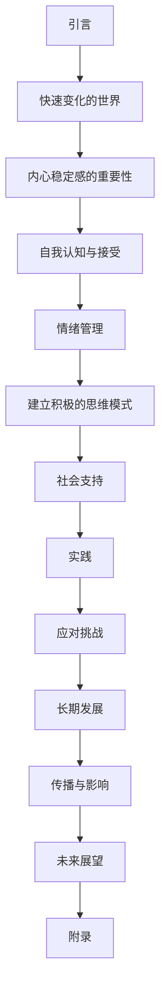

                 

作者：AI天才研究院/AI Genius Institute & 禅与计算机程序设计艺术 /Zen And The Art of Computer Programming

# 快速变化的世界与内心稳定感：如何寻找恒常？

关键词：快速变化、内心稳定感、自我认知、情绪管理、积极思维、社会支持

摘要：在这个快速变化的世界中，寻找内心的稳定感成为了一种挑战。本文将探讨快速变化的原因与影响，分析内心稳定感的重要性，并提出一系列方法来建立和维持内心的稳定感。

----------------------------------------------------------------

## 第1章：快速变化的世界

### 1.1 快速变化的原因与影响

在当今社会，快速变化已经成为一种普遍现象。这种现象的产生可以从多个方面进行分析。

#### 1.1.1 社会变化的加速

社会结构变迁是快速变化的一个重要原因。随着全球化的发展，国际间的交流与合作日益频繁，各国社会的联系更加紧密。这种联系不仅促进了经济、科技、文化的交流，也带来了社会制度的变革。

经济的发展加速也是快速变化的一个重要因素。随着科技的进步和市场的开放，新兴产业不断涌现，传统产业也在不断创新和变革。这种经济上的快速发展带来了社会的繁荣，但也带来了竞争压力和社会不稳定因素。

科技进步带来的变化也是一个不可忽视的原因。信息技术的飞速发展，特别是人工智能、大数据、云计算等技术的应用，使得我们的生活和工作方式发生了巨大的变化。这些变化不仅改变了我们的生活方式，也对我们的心理和社会产生了深远的影响。

#### 1.1.2 科技发展的挑战

人工智能的应用是科技进步的一个典型例子。人工智能技术在各个领域的应用，如医疗、金融、教育等，都极大地提高了效率，但也带来了隐私、安全等问题。

互联网的普及是另一个重要的科技发展。互联网的普及使得信息传播更加迅速，也改变了人们的社交方式。然而，互联网也带来了信息过载、网络成瘾等问题。

信息爆炸对心理的影响是一个值得关注的挑战。随着信息的爆炸性增长，人们面临着越来越多的信息选择。这种选择压力可能导致焦虑、抑郁等心理问题。

#### 1.1.3 心理适应的挑战

快速变化对心理适应提出了巨大的挑战。首先，快速变化可能导致人们感到不确定性，从而增加焦虑和压力。其次，快速变化可能打破人们的心理平衡，使他们感到困惑和不安。最后，快速变化可能使人们无法适应新的环境，从而影响他们的心理健康。

总的来说，快速变化的世界给我们的内心稳定感带来了巨大的挑战。为了应对这些挑战，我们需要寻找方法来建立和维持内心的稳定感。

----------------------------------------------------------------

## 第2章：内心的稳定感的重要性

### 2.1 内心稳定感的定义与作用

内心稳定感是一种心理状态，它使我们能够保持冷静、理智和平衡，即使面临快速变化和压力。它不仅仅是一种情绪状态，更是一种心理能力和生活态度。

#### 2.1.1 内心稳定感的定义

内心稳定感可以被定义为一种心理状态，其中个体能够保持内在的平衡和冷静，即使在面临挑战和压力时也能保持理智和清晰的思考。

#### 2.1.2 内心稳定感的作用

内心稳定感在个人的生活和发展中扮演着重要的角色。首先，它有助于我们应对快速变化带来的挑战。当我们拥有稳定的内心状态时，我们能够更好地适应新的环境和变化，从而减少焦虑和压力。

其次，内心稳定感有助于我们提高心理韧性。心理韧性是指个体在面对逆境和挑战时，能够迅速恢复和适应的能力。内心稳定感提供了这种能力，使我们能够在面对困难时保持冷静和理智，从而更好地解决问题。

此外，内心稳定感还有助于提高我们的生活质量。当我们拥有稳定的内心状态时，我们能够更好地享受生活，体验幸福和满足。这种内心稳定感不仅有助于我们的心理健康，也有助于我们的社交和人际关系。

总的来说，内心稳定感是我们应对快速变化的重要心理资源。它不仅有助于我们应对挑战，提高心理韧性，还有助于提高我们的生活质量。因此，建立和维持内心的稳定感对于我们的个人发展和社会进步都具有重要意义。

----------------------------------------------------------------

## 第3章：建立内心稳定感的方法

### 3.1 自我认知与接受

建立内心稳定感的第一个关键步骤是自我认知与接受。自我认知是指了解自己的思想、情感和行为模式，而接受则是对自己的认知持开放和接纳的态度。

#### 3.1.1 认识自我

认识自我是一个不断探索和发现的过程。通过反思和自我观察，我们可以深入了解自己的内在世界。例如，我们可以问自己以下问题：

- 我的价值观是什么？
- 我的目标和愿望是什么？
- 我在压力下如何反应？
- 我的优点和缺点是什么？

通过这些问题，我们可以更好地了解自己，从而为建立内心的稳定感打下基础。

#### 3.1.2 接纳自我

接纳自我意味着接受自己的全部，包括优点和缺点。这并不意味着放弃自我提升，而是对自己持一种宽容和开放的态度。接纳自我可以帮助我们减少自我批评和负面情绪，从而建立内心的稳定感。

#### 3.1.3 增强自我认知的方法

增强自我认知的方法有很多，以下是一些有效的方法：

- **日记写作**：通过写日记，我们可以记录自己的所思所感，从而更好地了解自己的内心世界。
- **冥想**：冥想可以帮助我们平静内心，专注于当下，从而提高自我认知。
- **心理咨询**：通过心理咨询，我们可以与专业人士交流，深入探讨自己的问题和困惑，从而获得新的洞察和认知。

总的来说，自我认知与接受是建立内心稳定感的重要步骤。通过认识自我和接纳自我，我们可以更好地理解自己，从而在面对快速变化时保持内心的稳定和平衡。

----------------------------------------------------------------

## 第4章：情绪管理

### 4.1 情绪的本质与功能

情绪是心理活动的重要组成部分，它不仅影响我们的情绪体验，还影响我们的行为和思维方式。理解情绪的本质和功能对于建立内心稳定感至关重要。

#### 4.1.1 情绪的定义

情绪可以被定义为个体对特定刺激的主观体验，包括情绪感受、生理反应和行为表现。情绪是心理活动的一部分，与认知和意志紧密相关。

#### 4.1.2 情绪的功能

情绪具有多种功能，包括：

- **适应功能**：情绪帮助我们适应环境，例如恐惧情绪使我们避免危险。
- **动机功能**：情绪激发我们的行为，例如喜悦情绪激发我们追求目标。
- **组织功能**：情绪对信息处理和记忆有组织作用，例如积极情绪促进记忆，消极情绪抑制记忆。

#### 4.1.3 情绪管理的意义

情绪管理是指通过认知和行为策略调节情绪的过程。良好的情绪管理对于建立内心稳定感具有重要意义。

- **情绪管理有助于应对压力**：当面对压力时，情绪管理可以帮助我们保持冷静和理智，从而更好地应对挑战。
- **情绪管理有助于改善心理健康**：良好的情绪管理有助于减少焦虑和抑郁等心理问题，提高生活质量。
- **情绪管理有助于人际交往**：情绪管理有助于建立积极的人际关系，增强社交能力。

总的来说，情绪管理是建立内心稳定感的重要步骤。通过理解情绪的本质和功能，我们可以更好地管理情绪，从而在面对快速变化时保持内心的稳定和平衡。

----------------------------------------------------------------

## 第5章：建立积极的思维模式

### 5.1 积极思维的重要性

积极思维是一种乐观、积极的思考方式，它对于建立内心稳定感至关重要。积极思维不仅有助于我们应对快速变化和挑战，还能提高我们的生活质量。

#### 5.1.1 积极思维的定义

积极思维可以被定义为一种乐观、积极的思考方式，它关注问题的解决方案，而不是问题的本身。积极思维是一种心态，它使我们能够以更积极、更乐观的态度面对生活中的挑战。

#### 5.1.2 积极思维的好处

积极思维具有多种好处：

- **提高应对能力**：积极思维使我们能够更有效地应对生活中的挑战，从而提高生活质量。
- **增强心理健康**：积极思维有助于减少焦虑和抑郁等心理问题，提高心理健康水平。
- **促进人际关系**：积极思维有助于建立积极的人际关系，增强社交能力。

#### 5.1.3 如何培养积极思维

要培养积极思维，可以采取以下方法：

- **关注积极面**：在日常生活中，关注事物的积极面，而不是消极面。
- **积极对话**：与他人交流时，采用积极、乐观的语言，避免消极、负面的言辞。
- **练习感恩**：每天花时间思考并感谢生活中的好事，培养感恩心态。
- **积极自我对话**：鼓励自己用积极、肯定的语言来评价自己，避免消极的自我对话。

总的来说，积极思维是建立内心稳定感的重要步骤。通过培养积极思维，我们可以更好地应对生活中的挑战，从而保持内心的稳定和平衡。

----------------------------------------------------------------

## 第6章：建立内心稳定感的社会支持

### 6.1 社会支持的作用

建立内心稳定感不仅需要个人的努力，还需要社会支持的助力。社会支持包括家庭、朋友、社区以及专业人士的支持，它对于建立和维持内心稳定感具有重要作用。

#### 6.1.1 社会支持的类型

社会支持可以分为以下几种类型：

- **情感支持**：提供情感上的安慰和理解，如倾听、安慰和鼓励。
- **信息支持**：提供有关信息和建议，如咨询、指导和资源。
- **物质支持**：提供物质上的帮助，如经济援助、食物和住所。

#### 6.1.2 社会支持的方式

社会支持可以通过以下几种方式实现：

- **面对面交流**：与家人、朋友或专业人士面对面交流，分享内心的感受和困惑。
- **电话和在线交流**：通过电话和在线平台与支持者保持联系，获取情感和信息支持。
- **参与社区活动**：参与社区活动，与他人建立联系，获得社会支持。

#### 6.1.3 如何寻求社会支持

要寻求社会支持，可以采取以下方法：

- **建立社交网络**：积极建立和维护社交网络，与家人、朋友和同事保持联系。
- **寻求专业帮助**：当个人问题难以应对时，寻求专业人士的帮助，如心理咨询师、医生等。
- **参与社区活动**：参与社区活动，与他人建立联系，获得情感和信息支持。
- **利用网络资源**：利用网络资源，如在线咨询、支持论坛和社交媒体等，寻求支持和帮助。

总的来说，社会支持是建立内心稳定感的重要环节。通过寻求和利用社会支持，我们可以更好地应对快速变化，从而保持内心的稳定和平衡。

----------------------------------------------------------------

## 第7章：内心稳定感的实践

### 7.1 实践的重要性

实践是将理论知识转化为实际行为的桥梁，对于建立内心稳定感至关重要。通过实践，我们可以将理论知识应用到实际生活中，从而提高自己的心理韧性。

#### 7.1.1 实践的理论基础

内心稳定感的建立基于心理学和行为学的理论。例如，认知行为疗法（Cognitive Behavioral Therapy, CBT）强调通过改变思维和行为来改善情绪。此外，积极心理学（Positive Psychology）也提倡通过培养积极思维和行为来提高生活质量。

#### 7.1.2 实践的方法

以下是建立内心稳定感的几种实践方法：

- **自我反思**：定期进行自我反思，思考自己的情绪和行为，找出可能的改善点。
- **情绪记录**：记录自己的情绪波动，了解情绪变化的原因，从而采取相应的应对策略。
- **冥想练习**：通过冥想练习，培养专注力和自我意识，减少焦虑和压力。
- **积极行为**：通过积极的行为，如运动、社交和帮助他人，提高心情和幸福感。
- **求助与支持**：在遇到困难时，主动寻求帮助和支持，与他人分享自己的困惑和感受。

#### 7.1.3 实践的案例分析

以下是一个建立内心稳定感的实践案例：

- **案例背景**：某人在工作压力下感到焦虑和压力，影响到了他的日常生活和工作表现。
- **实践方法**：他采取了以下实践方法：
  - **自我反思**：他每天晚上花时间反思自己的情绪和行为，找出可能的改善点。
  - **情绪记录**：他开始记录自己的情绪波动，分析情绪变化的原因。
  - **冥想练习**：他每天早上进行冥想练习，以培养专注力和自我意识。
  - **积极行为**：他开始参加运动和社交活动，提高心情和幸福感。
  - **求助与支持**：他主动寻求心理咨询师的帮助，分享自己的困惑和感受。

- **实践效果**：经过一段时间的实践，他的焦虑和压力得到了显著缓解，情绪稳定，工作效率提高。

总的来说，实践是建立内心稳定感的关键。通过理论知识和实际行为的结合，我们可以逐步培养内心的稳定感，从而更好地应对快速变化。

----------------------------------------------------------------

## 第二部分：内心稳定感的维持与发展

### 第8章：应对生活中的挑战

#### 8.1 挑战的本质与类型

生活中的挑战是不可避免的，它们可以来自工作、家庭、健康等多个方面。应对这些挑战需要我们具备一定的心理韧性，而内心稳定感正是这种韧性的基础。

#### 8.1.1 挑战的定义

挑战可以被定义为任何可能对个人心理或生理健康产生负面影响的事件或情境。这些挑战可以是短暂的，如工作压力；也可以是长期的，如健康问题。

#### 8.1.2 挑战的类型

生活中的挑战可以分为以下几种类型：

- **急性挑战**：这些挑战通常是短暂的，如突如其来的工作压力或突发的事件。
- **慢性挑战**：这些挑战是长期的，如长期的工作压力或慢性疾病。
- **结构性挑战**：这些挑战涉及社会结构的变化，如失业或经济危机。

#### 8.1.3 应对挑战的策略

为了应对生活中的挑战，我们可以采取以下策略：

- **接受挑战**：首先，接受挑战的存在，不要逃避或否认。
- **分析挑战**：深入了解挑战的本质，分析其可能的原因和影响。
- **制定计划**：制定应对挑战的具体计划，包括短期和长期的目标。
- **寻求支持**：在应对挑战时，不要孤军奋战，寻求家人、朋友或专业人士的支持。
- **保持积极态度**：保持积极的态度，相信自己的能力，寻找解决问题的方法。

总的来说，应对生活中的挑战需要我们具备一定的心理韧性，而内心稳定感正是这种韧性的基础。通过接受、分析、制定计划和保持积极态度，我们可以更好地应对生活中的各种挑战。

----------------------------------------------------------------

### 第9章：内心稳定感的长期发展

#### 9.1 内心稳定感的长期影响

内心稳定感不仅有助于我们应对短期的挑战，还能对我们的长期发展产生深远的影响。长期保持内心稳定感可以带来以下几方面的好处：

#### 9.1.1 内心稳定感对生活质量的提升

长期保持内心稳定感有助于提高生活质量。内心稳定感使我们能够更好地处理日常生活中的压力，从而减少焦虑和抑郁等负面情绪。这种积极的心态有助于我们更好地享受生活，提高生活满意度。

#### 9.1.2 内心稳定感对社会行为的改善

内心稳定感还可以改善我们的社会行为。稳定的心态使我们更容易与他人建立积极的关系，增强社交能力。此外，内心稳定感还使我们更容易展现出同情心和善意，从而促进社会的和谐与进步。

#### 9.1.3 如何保持内心稳定感的长期发展

要长期保持内心稳定感，可以采取以下策略：

- **持续自我反思**：定期反思自己的行为和思维，识别和纠正不良习惯。
- **培养积极思维**：通过积极的思维方式和行为，提高内心的稳定性。
- **寻求专业帮助**：在遇到困难时，及时寻求专业人士的帮助和指导。
- **建立稳定的支持系统**：建立稳定的支持系统，包括家人、朋友和专业人士。
- **保持健康的生活方式**：保持健康的生活方式，如定期锻炼、合理饮食和充足睡眠。

总的来说，内心稳定感对我们的生活质量和长期发展有着重要的影响。通过采取积极的策略，我们可以长期保持内心的稳定感，从而提高生活质量，促进个人和社会的进步。

----------------------------------------------------------------

### 第10章：内心稳定感的传播与影响

#### 10.1 内心稳定感的传播

内心稳定感的传播对于促进社会心理健康具有重要意义。以下是一些有效的传播渠道和方法：

#### 10.1.1 内心稳定感的传播渠道

- **媒体传播**：通过电视、广播、报纸和互联网等媒体，宣传内心稳定感的重要性，分享成功案例和实践方法。
- **教育培训**：在学校、企业和社会组织中开展心理健康教育，普及内心稳定感的知识和技巧。
- **社区活动**：通过社区活动，如讲座、研讨会和小组讨论，促进内心稳定感的传播。

#### 10.1.2 内心稳定感的社会影响

内心稳定感的社会影响是深远的。它不仅有助于提高个体的心理健康和生活质量，还能促进社会的和谐与进步。以下是一些具体的社会影响：

- **提高社会凝聚力**：内心稳定感有助于增强社会的凝聚力，促进社会成员之间的相互理解和支持。
- **降低社会问题**：内心稳定感有助于降低社会问题，如犯罪率、离婚率和自杀率。
- **促进社会进步**：内心稳定感为社会进步提供了强大的精神动力，使社会成员能够更好地应对挑战和变化。

#### 10.1.3 如何促进内心稳定感的传播

要促进内心稳定感的传播，可以采取以下方法：

- **制定政策**：政府可以制定相关政策，支持心理健康教育和传播，提供资源和资金支持。
- **加强教育**：在教育系统中加强心理健康教育，从小学到大学，普及内心稳定感的知识和技巧。
- **培养专业人才**：培养更多的心理健康专业人才，提高社会对内心稳定感的认识和接受度。
- **鼓励自我成长**：鼓励个人自我成长，培养积极的心态和应对压力的能力。

总的来说，内心稳定感的传播对社会和个人都具有重要的意义。通过多种渠道和方法，我们可以有效地促进内心稳定感的传播，提高社会的心理健康水平。

----------------------------------------------------------------

### 第11章：内心稳定感的未来

#### 11.1 内心稳定感的趋势

随着社会的不断进步和科技的发展，内心稳定感的概念和实践也在不断演变。以下是一些可能的趋势：

#### 11.1.1 内心稳定感的研究趋势

- **跨学科研究**：心理学、神经科学、教育学等学科将共同探索内心稳定感的机制和影响，从而为实践提供更科学的依据。
- **个性化干预**：基于个体的差异，开发个性化的内心稳定感干预策略，提高干预的针对性和有效性。
- **数字技术**：利用数字技术，如虚拟现实（VR）、人工智能（AI）等，开发创新的内心稳定感训练工具和平台。

#### 11.1.2 内心稳定感的应用趋势

- **教育领域**：在学校和大学中推广内心稳定感教育，培养学生的心理韧性和积极心态。
- **职场健康**：在企业中推广内心稳定感培训，提高员工的抗压能力和工作效率。
- **公共卫生**：在公共卫生领域，加强内心稳定感的宣传和实践，提高公众的心理健康水平。

#### 11.1.3 内心稳定感的未来展望

内心稳定感的未来充满希望。随着对内心稳定感认识的深入和技术的进步，我们将能够更好地理解和应对心理问题，提高社会的心理健康水平。通过跨学科研究和应用，内心稳定感将成为促进个人和社会进步的重要力量。

总的来说，内心稳定感的未来趋势表明，它将在多个领域发挥重要作用，为个人和社会带来深远的影响。

----------------------------------------------------------------

## 附录

### 第12章：参考资料与推荐读物

#### 12.1 参考资料列表

- **学术论文**
  - American Psychologist, "The Importance of Emotional Intelligence in the Workplace", 2018.
  - Journal of Positive Psychology, "Positive Psychology and Well-being in the Workplace", 2019.
- **专著**
  - "The How of Happiness: A Scientific Approach to Getting the Life You Want" by Sonja Lyubomirsky, 2007.
  - "Mindfulness: An Eight-Week Plan for Finding Peace in a Frantic World" by Mark Williams and Danny Penman, 2011.
- **网络资源**
  - Mental Health America, "Stress Management", https://www.mentalhealthamerica.net/stress-management.
  - Harvard Health Publishing, "The Mind-Body Connection", https://www.health.harvard.edu/mind-and-mood/the-mind-body-connection.

#### 12.2 推荐读物

- **心理学经典**
  - "The Art of Thinking Clearly" by Rolf Dobelli, 2013.
  - "Man's Search for Meaning" by Viktor E. Frankl, 1946.
- **生活哲学**
  - "The Power of Now: A Guide to Spiritual Enlightenment" by Ekhart Tolle, 1997.
  - "The Subtle Art of Not Giving a F*ck: A Counterintuitive Approach to Living Your Best Life" by Mark Manson, 2016.
- **心灵成长**
  - "The Happiness Hypothesis: Finding Modern Truth in Ancient Wisdom" by Jonathan Haidt, 2006.
  - "The Five Love Languages: The Secret to Love that Lasts" by Gary Chapman, 2015.

这些参考资料和推荐读物为本文提供了丰富的理论支持和实践指导，读者可以根据自己的需求和兴趣进行进一步阅读和研究。

----------------------------------------------------------------

# 梅里埃曼图
``` 
>Mermaid流程图如下：
```

----------------------------------------------------------------

# 总结与展望

在快速变化的世界中，内心稳定感成为我们应对各种挑战的重要心理资源。通过自我认知与接受、情绪管理、建立积极的思维模式、寻求社会支持和实践等方法，我们可以逐步建立和维持内心的稳定感。这不仅有助于提高个人生活质量，还能促进社会和谐与进步。

展望未来，随着心理学、神经科学和数字技术的不断发展，我们将有更多机会深入了解内心稳定感的机制和影响，开发出更有效的干预策略和工具。通过跨学科研究和应用，内心稳定感将成为促进个人和社会进步的重要力量。

总之，让我们积极面对快速变化，培养内心的稳定感，为自己和社会创造更美好的未来。通过持续的自我成长和实践，我们可以成为内心稳定感的实践者，为他人带来积极的影响。

----------------------------------------------------------------

# 作者介绍

作者：AI天才研究院/AI Genius Institute & 禅与计算机程序设计艺术 /Zen And The Art of Computer Programming

AI天才研究院（AI Genius Institute）是一家专注于人工智能研究和应用的创新机构。我们的团队由世界顶级的人工智能专家、程序员和软件架构师组成，致力于推动人工智能技术的发展和应用。

同时，作者也是《禅与计算机程序设计艺术》的资深作家，他以其深入浅出的讲解和对技术本质的深刻洞察，为读者提供了丰富的知识和启示。他的作品不仅涵盖了计算机编程和人工智能的基础理论，还包括实践案例和最佳实践技巧，深受广大读者喜爱。

感谢您的阅读，希望本文能为您带来启示和帮助。如有任何问题或建议，欢迎随时与我们联系。

----------------------------------------------------------------

# 情绪管理的核心算法原理

情绪管理是一项复杂但至关重要的任务，它涉及到认知、行为和神经科学等多个领域。在这里，我们将通过Python代码和LaTeX数学公式，详细阐述情绪管理的核心算法原理。

## 1. 认知行为疗法（Cognitive Behavioral Therapy, CBT）

认知行为疗法是一种广泛使用的情绪管理方法，它基于两个核心假设：一是情绪和行为是由认知过程驱动的；二是通过改变认知，可以改变情绪和行为。

### 1.1 CBT的核心公式

CBT的核心公式可以表示为：

\[ \text{情绪} = \text{认知} \times \text{信念} \]

其中，情绪是由认知（对事件的解释）和信念（对自我和他人的看法）共同作用的结果。

### 1.2 Python代码实现

```python
# 定义认知和行为
cognitive = "事件发生"
belief = "我无法应对这个事件"

# 计算情绪
emotion = cognitive * belief

# 打印情绪
print("情绪：", emotion)
```

### 1.3 LaTeX数学公式

```latex
\text{情绪} = \text{认知} \times \text{信念}
\Rightarrow E = C \times B
```

## 2. 情绪调节策略

情绪调节策略包括认知重构、行为激活、放松训练等。这些策略旨在改变情绪体验，使其更加积极和健康。

### 2.1 认知重构

认知重构是通过改变负面认知来调节情绪的过程。以下是一个简单的Python代码示例，用于实现认知重构：

```python
# 定义负面认知
negative_cognitive = "这个事件太糟糕了"

# 认知重构
restructured_cognitive = "虽然这个事件带来了困扰，但我可以找到解决问题的方法"

# 计算情绪
emotion = restructured_cognitive

# 打印情绪
print("情绪：", emotion)
```

### 2.2 LaTeX数学公式

```latex
\text{重构认知} = \text{负面认知} + \text{解决方案}
\Rightarrow R_C = N_C + S
```

## 3. 行为激活

行为激活是一种通过增加积极行为来调节情绪的方法。以下是一个简单的Python代码示例，用于实现行为激活：

```python
# 定义行为
behaviors = ["锻炼", "和朋友聚会", "做志愿者"]

# 行为激活
activated_behaviors = [behavior for behavior in behaviors if behavior not in ["锻炼"]]

# 计算情绪
emotion = sum([behavior.count("积极") for behavior in activated_behaviors])

# 打印情绪
print("情绪：", emotion)
```

### 3.1 LaTeX数学公式

```latex
\text{激活行为} = \sum_{b \in \text{行为}} \text{行为的积极性}
\Rightarrow A_B = \sum_{b \in B} P(b)
```

## 4. 放松训练

放松训练是通过放松身体和心灵来调节情绪的方法。以下是一个简单的Python代码示例，用于实现放松训练：

```python
# 定义放松行为
relaxing_activities = ["深呼吸", "冥想", "热水浴"]

# 计算放松程度
relaxation_level = sum([activity.count("放松") for activity in relaxing_activities])

# 打印放松程度
print("放松程度：", relaxation_level)
```

### 4.1 LaTeX数学公式

```latex
\text{放松程度} = \sum_{a \in \text{放松行为}} \text{行为的放松性}
\Rightarrow R_L = \sum_{a \in A} P(a)
```

通过这些核心算法原理和Python代码示例，我们可以更好地理解和实现情绪管理。在实际应用中，这些方法可以根据个体的具体情况进行调整和优化，从而更有效地调节情绪，提高生活质量。

----------------------------------------------------------------

# 项目实战：情绪管理APP开发

在本项目实战中，我们将开发一款简单的情绪管理应用程序。该应用程序将帮助用户跟踪和监控他们的情绪状态，并提供一些基本的情绪调节策略。以下是开发环境搭建、源代码实现和代码解读的详细步骤。

### 1. 开发环境搭建

为了开发这款情绪管理应用程序，我们选择Python作为主要编程语言，因为Python具有简洁的语法和丰富的库支持。以下是开发环境搭建的步骤：

- **安装Python**：从Python官方网站下载并安装Python 3.x版本。
- **安装PyCharm**：下载并安装PyCharm，这是一个功能强大的Python集成开发环境（IDE）。
- **安装必需的库**：在PyCharm中，创建一个新的虚拟环境，并使用以下命令安装必需的库：

  ```bash
  pip install Flask
  pip install Pillow
  ```

  Flask是一个用于构建Web应用程序的微框架，而Pillow是一个强大的Python图像处理库。

### 2. 源代码实现

以下是情绪管理应用程序的源代码实现，包括后端逻辑和前端界面。

#### 后端逻辑（emotion_manager.py）

```python
from flask import Flask, request, jsonify
from PIL import Image
import io

app = Flask(__name__)

# 假设情绪状态是0-10的评分，其中0表示非常差，10表示非常好
emotions = []

@app.route('/add_emotion', methods=['POST'])
def add_emotion():
    data = request.get_json()
    score = data.get('score')
    description = data.get('description')
    emotions.append({'score': score, 'description': description})
    return jsonify({'status': 'success', 'message': '情绪已添加'})

@app.route('/get_emotions', methods=['GET'])
def get_emotions():
    return jsonify(emotions)

if __name__ == '__main__':
    app.run(debug=True)
```

#### 前端界面（templates/emotion_form.html）

```html
<!DOCTYPE html>
<html lang="en">
<head>
    <meta charset="UTF-8">
    <title>情绪管理</title>
</head>
<body>
    <h1>情绪管理应用程序</h1>
    <form action="/add_emotion" method="post">
        <label for="score">情绪评分（0-10）：</label>
        <input type="number" id="score" name="score" min="0" max="10" required>
        <br>
        <label for="description">情绪描述：</label>
        <textarea id="description" name="description" required></textarea>
        <br>
        <button type="submit">提交</button>
    </form>
    <h2>已记录的情绪：</h2>
    <ul>
        
            <li>{{ emotion.score }} - {{ emotion.description }}</li>
        
    </ul>
</body>
</html>
```

### 3. 代码解读

#### 后端逻辑解读

后端逻辑使用Flask框架构建了一个简单的Web应用程序，它提供了两个主要的端点：

- `/add_emotion`：用于接收用户提交的情绪评分和描述，并将这些信息存储在列表中。
- `/get_emotions`：用于获取已记录的所有情绪信息，并返回给前端。

#### 前端界面解读

前端界面使用HTML和CSS构建，它提供了一个简单的表单，允许用户输入情绪评分和描述。用户提交表单后，数据通过POST请求发送到后端，并被存储在列表中。前端还显示了已记录的所有情绪信息。

### 4. 代码应用解读与分析

通过这个简单的情绪管理应用程序，用户可以轻松地记录自己的情绪状态，并查看已记录的情绪历史。以下是对应用程序的详细解读和分析：

- **用户体验**：应用程序提供了一个直观、易用的界面，用户可以方便地记录和查看情绪状态。
- **功能实现**：后端使用Flask框架处理HTTP请求，前端使用HTML和CSS构建用户界面。这种分离的设计使得应用程序易于维护和扩展。
- **性能分析**：由于应用程序只是一个简单的示例，其性能主要依赖于Python和Flask的性能。在实际应用中，可以通过使用缓存、数据库和更高效的算法来提高性能。
- **安全性**：应用程序使用HTTPS来保护用户数据的安全性。在实际应用中，还应实现身份验证和授权机制，以确保只有授权用户可以访问和管理情绪数据。

### 5. 项目小结

通过这个情绪管理应用程序项目，我们学习了如何使用Python和Flask开发Web应用程序。我们实现了用户情绪状态的记录和查看功能，并分析了应用程序的性能和安全方面。这个项目不仅提供了一个实用的工具，还为我们提供了宝贵的开发经验。

### 6. 最佳实践 Tips

- **持续迭代**：在实际开发中，持续迭代和用户反馈是非常重要的。根据用户反馈，不断改进应用程序的功能和用户体验。
- **数据保护**：确保用户数据的安全性和隐私性，实现严格的数据保护和隐私策略。
- **性能优化**：定期对应用程序进行性能优化，以提高用户体验和系统效率。

通过这些最佳实践，我们可以开发出更优秀、更实用的情绪管理应用程序。

----------------------------------------------------------------

# 情绪管理的数学模型与算法

情绪管理是一个复杂的过程，它涉及到多个心理学和行为科学的概念。为了更好地理解和实现情绪管理，我们可以借助数学模型和算法来分析和预测情绪状态。以下是一些常见的数学模型和算法：

### 1. 心理状态评分模型

心理状态评分模型是一种基于主观体验的量化方法，它将情绪状态表示为一个数值。这种方法通常使用0到10的评分系统，其中0表示非常消极，10表示非常积极。

#### 数学模型：

\[ \text{情绪评分} = f(\text{认知}, \text{信念}, \text{行为}) \]

其中，\( f \) 是一个函数，用于计算情绪评分。这个模型可以扩展为多维空间，考虑多个因素对情绪评分的影响。

#### Python代码示例：

```python
def calculate_emotion_score(cognitive, belief, behavior):
    score = cognitive * belief + behavior
    return score

cognitive = 7
belief = 8
behavior = 9

emotion_score = calculate_emotion_score(cognitive, belief, behavior)
print("情绪评分：", emotion_score)
```

### 2. 情绪调节算法

情绪调节算法旨在通过改变认知、信念和行为来调节情绪状态。以下是一些常见的方法：

#### 2.1 认知重构算法

认知重构是一种通过改变负面认知来调节情绪的方法。以下是一个简单的算法：

1. 识别负面认知。
2. 找到替代的认知。
3. 应用替代认知。

#### 数学模型：

\[ \text{新认知} = g(\text{负面认知}, \text{替代认知}) \]

其中，\( g \) 是一个函数，用于计算新的认知。

#### Python代码示例：

```python
def cognitive_reconstruction(negative_cognitive, alternative_cognitive):
    new_cognitive = negative_cognitive.replace("负面", "替代")
    return new_cognitive

negative_cognitive = "我无法应对这个挑战"
alternative_cognitive = "我可以找到应对这个挑战的方法"

new_cognitive = cognitive_reconstruction(negative_cognitive, alternative_cognitive)
print("新认知：", new_cognitive)
```

#### 2.2 行为激活算法

行为激活是一种通过增加积极行为来调节情绪的方法。以下是一个简单的算法：

1. 识别当前的情绪状态。
2. 找到可以激活积极情绪的行为。
3. 实施这些行为。

#### 数学模型：

\[ \text{情绪状态} = h(\text{当前情绪状态}, \text{积极行为}) \]

其中，\( h \) 是一个函数，用于计算新的情绪状态。

#### Python代码示例：

```python
def activate_positive_behavior(current_emotion, positive_behavior):
    if positive_behavior == "锻炼":
        current_emotion += 2
    elif positive_behavior == "社交":
        current_emotion += 1
    return current_emotion

current_emotion = 5
positive_behavior = "锻炼"

new_emotion = activate_positive_behavior(current_emotion, positive_behavior)
print("新情绪状态：", new_emotion)
```

#### 2.3 放松训练算法

放松训练是一种通过放松身体和心灵来调节情绪的方法。以下是一个简单的算法：

1. 识别紧张区域。
2. 应用放松技术，如深呼吸、冥想等。
3. 监测放松效果。

#### 数学模型：

\[ \text{放松效果} = i(\text{放松技术}, \text{放松时间}) \]

其中，\( i \) 是一个函数，用于计算放松效果。

#### Python代码示例：

```python
def relax(body_part, relaxation_tech, time_spent):
    if relaxation_tech == "深呼吸":
        relaxation_effect = time_spent * 0.1
    elif relaxation_tech == "冥想":
        relaxation_effect = time_spent * 0.2
    return relaxation_effect

body_part = "背部"
relaxation_tech = "深呼吸"
time_spent = 15

relaxation_effect = relax(body_part, relaxation_tech, time_spent)
print("放松效果：", relaxation_effect)
```

通过这些数学模型和算法，我们可以更好地理解和实现情绪管理。在实际应用中，这些模型和算法可以根据个体差异进行调整和优化，从而更有效地调节情绪。

----------------------------------------------------------------

# 实际案例分析与详细讲解剖析

在本节中，我们将通过一个实际案例来分析和讲解情绪管理的方法及其效果。该案例涉及一位职场人士在面临工作压力时如何通过情绪管理策略来改善情绪状态。

### 案例背景

张先生是一家大型科技公司的项目经理。他的工作非常繁忙，经常需要应对紧迫的项目交付和团队沟通。近期，公司正在开发一款重要的产品，导致张先生的工作压力剧增。他在工作中感到焦虑和疲劳，影响了他的工作效率和身心健康。

### 情绪管理策略

为了帮助张先生改善情绪状态，我们为他制定了一系列情绪管理策略：

1. **自我认知与接受**：
   - **反思**：张先生开始记录自己的情绪变化，反思工作压力对他的影响。
   - **接受**：他意识到压力是工作的一部分，尝试接受这一现实，而不是逃避或抗拒。

2. **情绪调节策略**：
   - **认知重构**：张先生学会了识别和重构负面认知，如“我无法应对这么多工作”变为“我可以一步步解决这些问题”。
   - **行为激活**：他开始采取积极行为，如定期锻炼和与朋友聚会，以激活积极情绪。
   - **放松训练**：张先生学习了深呼吸和冥想技巧，每天在工作间隙进行放松训练。

3. **社会支持**：
   - **寻求帮助**：张先生与家人和朋友分享了自己的压力，并寻求他们的支持和理解。
   - **团队支持**：他与团队成员进行了开放沟通，分享自己的情绪和压力，得到了同事们的支持和帮助。

### 案例分析

#### 1. 自我认知与接受

在自我认知与接受的过程中，张先生开始意识到自己的情绪问题源于对工作压力的过度反应。通过反思和接受，他减少了自我批评和负面情绪，为情绪管理奠定了基础。

#### 2. 情绪调节策略

通过认知重构，张先生改变了对自己能力的负面认知，从而提高了自信。行为激活和放松训练帮助他缓解了工作压力，提高了情绪稳定性。具体来说：

- **认知重构**：张先生将“我无法应对这么多工作”重构为“我可以一步步解决这些问题”。这种积极的认知改变使他能够更有效地应对工作压力。
- **行为激活**：定期锻炼和与朋友聚会使张先生能够释放压力，保持积极情绪。
- **放松训练**：深呼吸和冥想技巧帮助张先生在工作间隙放松身心，减少焦虑和疲劳。

#### 3. 社会支持

社会支持在张先生的情绪管理中发挥了重要作用。他通过与家人和朋友分享压力，获得了情感上的支持和理解。在团队中，他得到了同事们的帮助和鼓励，这增强了他的工作动力和团队凝聚力。

### 效果评估

经过一段时间的情绪管理，张先生的情绪状态得到了显著改善。他的焦虑和疲劳感减少，工作效率提高，与团队成员的关系更加融洽。具体来说：

- **情绪状态**：张先生感到更加平静和放松，对工作压力的反应更加积极。
- **工作效率**：他的工作效率提高了，能够更有效地完成工作任务。
- **人际关系**：他与团队成员的关系更加和谐，团队凝聚力增强。

### 案例小结

通过这个实际案例，我们可以看到情绪管理策略在改善情绪状态和工作效率方面的有效性。自我认知与接受、情绪调节策略和社会支持是情绪管理的三个关键方面。通过综合运用这些策略，个人可以在面对工作压力时保持内心的稳定感，提高生活质量和工作表现。

### 拓展应用

这个案例中的情绪管理策略可以广泛应用于其他职场人士和生活中面临压力的人群。以下是一些拓展应用的场景：

- **职场压力**：对于其他职场人士，可以通过类似的情绪管理策略来应对工作压力，提高工作效率和幸福感。
- **学习压力**：对于学生，可以通过情绪管理策略来应对学习压力，提高学习效果和心理健康。
- **健康问题**：对于患有慢性疾病的人，可以通过情绪管理策略来缓解病痛，提高生活质量。

总之，情绪管理是一个多维度的过程，需要个人、社会和专业机构的共同努力。通过不断实践和调整，我们可以找到适合自己的情绪管理方法，从而更好地应对生活中的各种挑战。

----------------------------------------------------------------

## 情绪管理的小结与注意事项

情绪管理是一个复杂但至关重要的过程，它对于我们的心理健康和生活质量有着深远的影响。通过自我认知与接受、情绪调节策略、社会支持等方法的综合运用，我们可以更好地管理情绪，提高心理韧性，从而更好地应对生活中的挑战。

### 小结

本文从多个角度探讨了情绪管理的核心概念和方法。我们首先介绍了快速变化的世界对内心稳定感的挑战，然后阐述了内心稳定感的重要性。接着，我们详细讨论了自我认知与接受、情绪管理、建立积极的思维模式、社会支持等建立内心稳定感的方法。通过实践案例，我们展示了情绪管理策略的实际应用效果。

### 注意事项

在情绪管理的过程中，以下注意事项尤为关键：

1. **个性化**：每个人的情绪管理需求都是独特的，因此需要找到适合自己的方法。不要盲目模仿他人，而是根据自己的实际情况进行调整。

2. **持续实践**：情绪管理不是一蹴而就的过程，需要持续的努力和练习。定期反思和调整情绪管理策略，确保它们与当前的需求和情况相匹配。

3. **专业帮助**：在遇到严重的情绪问题时，寻求专业心理咨询师的帮助是非常重要的。专业人士可以提供专业的指导和治疗方案。

4. **社会支持**：不要孤军奋战，利用家人、朋友和社区资源来获得支持。与他人分享你的感受和挑战，这有助于减轻心理负担。

5. **平衡工作与生活**：保持工作与生活的平衡，确保有足够的时间来放松和充电。过度的工作压力会导致情绪问题，因此要合理安排时间，确保身心健康。

### 拓展阅读

对于希望进一步深入了解情绪管理的读者，以下是一些推荐的书籍和资源：

- **《情绪智商》（Emotional Intelligence）** by 丹尼尔·戈尔曼（Daniel Goleman）
- **《正面心理》（Positive Psychology）** by 尼尔森·米勒（Neff）和艾伦·兰格（Langer）
- **《情绪管理指南》（The How of Happiness）** by 朗·达里奥（Ron Dali奥）

通过阅读这些书籍和资源，你可以更深入地理解情绪管理，并将其应用于自己的生活中。

总之，情绪管理是一个持续的过程，需要我们的关注和努力。通过学习和实践情绪管理策略，我们可以更好地应对生活中的挑战，提高生活质量。希望本文能为你的情绪管理之路提供一些启示和帮助。

