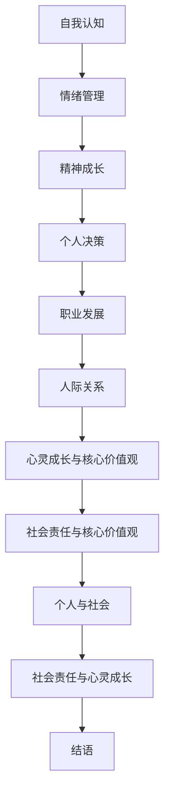

                 

### 第1章 引言

在当今快速变化的世界中，个体面临着前所未有的挑战。从经济全球化、技术的飞速进步，到社会结构的深刻变革，这些变化深刻地影响着每个人的生活。作为技术领域的一份子，我们尤其需要在这个动荡的环境中找到内心的平衡和方向。

#### 世界的快速变化

经济的快速发展和全球化趋势，使市场环境变得更加复杂和动态。新兴市场国家崛起，国际贸易格局重塑，企业家和工程师们必须不断更新知识和技能，以适应新的市场规则。

技术的变革则更为迅速。人工智能、大数据、区块链等新兴技术的崛起，正在彻底改变各行各业的工作方式。程序员、数据科学家、软件工程师等角色的工作内容和技术栈也在不断更新，要求从业者具备快速学习和适应的能力。

社会层面，人口老龄化、文化多样性、社会价值观的变迁，都在对人们的心理和行为产生深远影响。社会结构的变化，使个人在寻找自我认同和人生目标时面临更多困惑。

#### 心理学与核心价值观

心理学研究表明，个体在快速变化的环境中往往会感到压力和不安。为了应对这些心理挑战，人们需要找到内心的稳定点。核心价值观在这一过程中起着至关重要的作用。核心价值观是个体内心深处认为最重要的信念和价值观，它们是行为的指南，也是心理安全的基石。

#### 心灵的力量

心灵在个人成长和决策中扮演着核心角色。一个强大而稳定的内心可以帮助个体在面对不确定性和压力时保持冷静和理智。因此，理解和培养核心价值观，不仅对个人的心理健康有益，也对职业发展和人际关系有深远的影响。

在这一章中，我们将探讨快速变化的世界背景，分析心理学与核心价值观之间的关系，并初步探讨心灵在个人成长和决策中的作用。接下来，我们将深入探索心灵的各个方面，为理解核心价值观打下坚实基础。

---

### 第2章 心灵探索

在快速变化的世界中，心灵的探索显得尤为重要。本章将带领我们深入自我认知、情绪管理和精神成长，这三个方面构成了心灵的基石。通过这些探索，我们将更好地理解自己，从而在动荡的环境中找到内心的平衡和力量。

#### 2.1 自我认知

自我认知是心灵的起点，它涉及到我们如何理解自己、如何评价自己的行为和信念。自我认知不仅仅是对外表和行为的认识，更重要的是对内心深处的理解。通过自我反思，我们可以揭示内心的矛盾、发现自己的优势和不足。

**步骤一：反思日常行为**

首先，我们可以从日常行为开始，反思自己在不同情境下的反应。例如，在遇到挑战时，我们是选择逃避还是勇敢面对？在团队合作中，我们是倾向于独断还是尊重他人意见？通过这些反思，我们可以更清晰地看到自己的行为模式。

**步骤二：倾听内心的声音**

倾听内心的声音是一种深度的自我反思。通过冥想、写日记等方式，我们可以安静下来，聆听内心的真实感受。这种方法有助于我们更好地理解自己的情绪和行为动机。

**步骤三：接受自我**

接受自我是一个重要步骤。我们每个人都有自己的独特性和局限性，无法完全改变自己。接受自我意味着拥抱自己的优点和缺点，不再对自己过于苛求。这种接纳能够带来内心的平静和自由。

#### 2.2 情绪管理

情绪管理是保持心灵健康的关键。在快速变化的世界中，情绪波动在所难免。学会管理情绪，不仅有助于个人心理健康，还能提升生活质量。

**步骤一：认识情绪**

认识情绪是情绪管理的基础。我们需要了解不同情绪的特征和影响。例如，愤怒可能源于失控感，焦虑可能源于不确定感。通过认识情绪，我们可以更好地应对它们。

**步骤二：情绪表达**

情绪表达是情绪管理的重要组成部分。许多人由于害怕冲突或误解，倾向于抑制情绪。然而，适当地表达情绪，特别是以健康的方式表达，有助于释放压力和避免内化情绪。

**步骤三：情绪调节**

情绪调节是指通过策略和方法来管理情绪。例如，深呼吸、冥想、锻炼等都是有效的情绪调节工具。这些方法可以帮助我们在情绪波动时保持冷静和理智。

#### 2.3 精神成长

精神成长涉及到个人的信仰、价值观和人生意义。在快速变化的世界中，精神成长为我们提供了一种超越物质和世俗的视角，帮助我们找到内心的平衡和方向。

**步骤一：探索信仰**

探索信仰是精神成长的重要一环。不同的人有不同的信仰体系，无论是宗教信仰还是哲学思考，都能为我们提供精神上的支撑。通过探索和反思，我们可以找到与自己价值观相契合的信仰。

**步骤二：建立价值观**

建立核心价值观是精神成长的核心。核心价值观是我们内心深处的信念，它们指导我们的行为和决策。通过自我反思和学习他人的经验，我们可以建立一套适合自己的核心价值观。

**步骤三：寻找人生意义**

寻找人生意义是精神成长的目标。人生意义不仅关乎个人的幸福和满足，也关乎对社会的贡献。通过反思和探索，我们可以找到自己在这个世界上的角色和使命。

通过自我认知、情绪管理和精神成长，我们可以更好地理解自己，找到内心的平衡和力量。这些探索不仅有助于个人心理健康，还能提升生活质量。在下一章中，我们将深入探讨核心价值观的重要性，并探讨如何建立和维护这些价值观。

---

### 第3章 核心价值观的重要性

核心价值观是一个人在复杂多变的环境中保持方向和平衡的重要指南。它们不仅是个人行为和决策的依据，也是社会稳定和个体幸福的基石。在本章中，我们将详细探讨核心价值观的定义、其在个人生活、职业发展和社会责任中的作用。

#### 3.1 核心价值观的定义

核心价值观是指那些在个体内心深处根深蒂固的信念和价值观，它们通常与个人的成长经历、文化背景和家庭价值观密切相关。这些价值观指导个体的行为和决策，并形成其独特的性格和人生观。

**定义核心价值观的步骤：**

1. **自我反思**：通过反思个人经历，识别那些在关键时刻反复出现的信念和态度。
2. **文化影响**：考虑家庭、教育和社会环境对价值观形成的影响。
3. **明确表述**：将模糊的信念和态度用清晰的语言表达出来。

例如，一位工程师可能将“创新”和“团队合作”视为自己的核心价值观。这些价值观不仅指导他在工作中的行为，还影响他的职业发展和人际关系。

#### 3.2 核心价值观与生活

核心价值观在个人生活中起着至关重要的作用。它们不仅决定了个体的行为和决策，还影响了个人的人际关系和生活质量。

**核心价值观在生活中的作用：**

1. **行为指南**：核心价值观为我们提供了行动的依据，使我们能够在面对复杂情况时做出明智的选择。
2. **情感支持**：核心价值观为我们提供了情感上的支持，使我们能够更好地应对生活中的挑战和压力。
3. **人际交往**：核心价值观影响我们如何与他人互动，使我们能够建立更健康、更和谐的人际关系。

例如，一位将“诚信”视为核心价值观的人，在商业交往中会坚持诚实守信，这不仅能赢得他人的信任，还能建立长期稳定的合作关系。

#### 3.3 核心价值观与职业发展

核心价值观在职业发展中也扮演着重要角色。它们不仅指导我们在职业道路上的选择，还影响我们在职场中的行为和态度。

**核心价值观在职业发展中的作用：**

1. **职业选择**：核心价值观可以帮助我们确定职业方向，选择与我们价值观相契合的工作。
2. **职业行为**：核心价值观指导我们在工作中的行为和决策，使我们能够更好地实现职业目标。
3. **团队合作**：核心价值观影响我们在团队中的合作方式，使我们能够与同事建立信任和合作关系。

例如，一位工程师可能将“创新”和“责任感”视为核心价值观。在工作中，他会不断追求技术创新，同时承担起自己的责任，这不仅能提高工作效率，还能赢得同事的尊重和信任。

#### 3.4 核心价值观与社会

核心价值观不仅影响个人生活和工作，还对社会产生深远影响。当大多数人共同持有某些核心价值观时，这些价值观可以促进社会的和谐与进步。

**核心价值观在社会中的作用：**

1. **社会规范**：核心价值观为社会提供了行为规范，使社会成员能够更好地遵守社会规则。
2. **道德指引**：核心价值观为社会提供了道德指引，使人们能够做出符合道德标准的决策。
3. **文化传承**：核心价值观是文化传承的重要组成部分，它们使社会成员能够共同分享和传承文化价值观。

例如，一个社会如果普遍重视“平等”和“公正”，那么这个社会将更加公平和包容，每个人都能在这个社会中找到自己的位置。

通过深入探讨核心价值观的定义、作用和重要性，我们可以更好地理解它们在个人生活、职业发展和社会中的作用。在下一章中，我们将探讨如何通过自我反思和借鉴他人经验来建立和维护核心价值观。

---

### 第4章 建立核心价值观

建立核心价值观是一个深刻而复杂的自我探索过程。在这个充满变革和不确定性的世界中，找到并坚守自己的核心价值观，不仅有助于个人成长，还能为职业发展和社会责任提供坚实的基石。在本章中，我们将探讨如何通过自我反思、研究他人和培养实践来建立和维护核心价值观。

#### 4.1 自我反思

自我反思是建立核心价值观的第一步。通过深入思考自己的经历和信念，我们可以识别出那些在关键时刻反复出现的价值观。

**步骤一：识别重要事件**

回顾自己的成长历程，识别出那些对自己产生深远影响的重要事件。这些事件可能是成功经历，也可能是挫折和失败。例如，一个人在创业过程中面临重大挑战，最终通过坚持不懈和团队合作成功克服难题，这可能会激发他/她珍视“坚持”和“团队合作”的价值观。

**步骤二：反思信念和态度**

思考这些重要事件中自己表现出的信念和态度。是什么信念和态度使你在这些事件中做出特定决策？这些信念和态度是否与你的核心价值观相符？通过这种反思，我们可以更清晰地识别自己的核心价值观。

**步骤三：明确价值观**

将反思过程中识别出的信念和态度进行归纳和总结，明确自己的核心价值观。例如，如果一个人在多次经历中表现出对“诚信”和“责任感”的坚持，那么他/她可以将这些作为自己的核心价值观。

#### 4.2 研究他人

借鉴他人的核心价值观可以帮助我们建立和维护自己的价值观。通过研究他人，我们可以学习他们的行为模式、信念体系，并从中汲取经验和启示。

**步骤一：选择榜样**

选择一些在你看来具有优秀价值观的人作为榜样。这些榜样可以是你的家人、朋友、同事，也可以是历史上的名人或现代的成功人士。他们的行为和决策应该是你希望学习和模仿的。

**步骤二：分析价值观**

分析这些榜样的核心价值观。观察他们在不同情境下的行为，思考是什么价值观驱使他们做出这些决策。例如，一个成功的企业家可能在追求商业成功的同时，非常重视社会责任和可持续发展。

**步骤三：借鉴经验**

借鉴这些榜样的经验，将其与自己的经历和信念相结合。思考如何在自己的生活中实践这些价值观。例如，如果你希望像一位企业家一样重视社会责任，你可以开始参与社区服务或支持环保活动。

#### 4.3 培养核心价值观

建立核心价值观是一段旅程，需要通过持续的培养和实践来巩固。通过以下方法，我们可以将核心价值观内化为行为习惯，并在生活中不断践行。

**步骤一：制定行动计划**

制定一个具体的行动计划，将核心价值观转化为可操作的行为。例如，如果你将“持续学习”作为核心价值观，你可以制定每天阅读一小时、参加线上课程或加入学习小组的计划。

**步骤二：实践和反思**

在实践中不断反思和调整自己的行为。通过实践，我们可以发现自己的不足并加以改进。例如，如果你希望培养“团队合作”的价值观，你可以参加团队项目，并在过程中反思如何更好地与他人合作。

**步骤三：建立支持系统**

建立支持系统，包括家人、朋友和同事，他们可以帮助你坚持和实践核心价值观。他们可以提供反馈和支持，使你在面对挑战时保持动力和信心。

通过自我反思、研究他人和持续培养实践，我们可以建立和维护自己的核心价值观。这些核心价值观将成为我们个人成长、职业发展和社会责任的坚实基石。在下一章中，我们将探讨如何在个人决策、职业发展和人际关系中应用这些核心价值观。

---

### 第5章 核心价值观的应用

核心价值观不仅是我们内心的指南，更是我们在日常生活中的行动准则。无论是在个人决策、职业发展还是人际关系中，核心价值观都发挥着至关重要的作用。本章将探讨如何在不同的生活场景中应用核心价值观，实现个人成长与和谐发展。

#### 5.1 个人决策

个人决策是核心价值观的直接体现。通过核心价值观的引导，我们可以更明智地处理日常生活中的各种选择。

**应用步骤：**

1. **明确价值观**：首先，明确自己的核心价值观。例如，诚信、责任感、创新等。
2. **情境分析**：在面临决策时，分析情境，思考哪个决策最符合自己的核心价值观。
3. **行动选择**：根据核心价值观选择最合适的行动方案。例如，在求职时，如果价值观中强调“诚信”，那么就应该诚实地面对招聘者，不夸大自己的能力和经历。

**案例分析**：小王在求职过程中，面对两个工作机会。一个机会薪资较高，但公司文化不符他的核心价值观；另一个机会薪资略低，但公司文化更符合他。通过价值观的引导，小王选择了后者，并在工作中不断践行自己的核心价值观，最终赢得了同事和领导的认可。

#### 5.2 职业发展

核心价值观在职业发展中起到导向和支撑作用。它们帮助我们确定职业方向，指导职业行为，并在职场中获得成功。

**应用步骤：**

1. **职业规划**：基于核心价值观，制定长期的职业规划。例如，如果你重视“创新”，可以规划成为一名研发工程师或创业者。
2. **工作态度**：在工作中，将核心价值观融入日常行为。例如，作为研发工程师，坚持创新，不断尝试新的解决方案。
3. **职业选择**：在面临职业选择时，考虑哪个职位更符合自己的核心价值观。例如，如果你重视“团队合作”，可以选择加入一个强调团队合作的部门。

**案例分析**：李华是一名软件工程师，他在职业发展中始终秉持“责任感”的核心价值观。在工作中，他认真负责，遇到问题时主动解决，不仅提高了自己的工作效率，还赢得了同事和领导的信任。在一次重要项目失败后，李华没有推卸责任，而是积极总结经验，并在后续工作中避免了类似问题的发生。

#### 5.3 人际关系

核心价值观在人际关系中发挥着重要作用。它们帮助我们建立健康、和谐的人际关系，并提升社会交往能力。

**应用步骤：**

1. **沟通原则**：在沟通中，以核心价值观为指导，坚持诚信和尊重。例如，在团队讨论中，即使意见不一致，也要尊重他人，以理服人。
2. **冲突解决**：在冲突发生时，以核心价值观为依据，寻找公平合理的解决方案。例如，如果价值观中强调“公正”，那么在处理冲突时，应该公正地对待每个人。
3. **长期关系**：通过践行核心价值观，建立长期的信任和合作关系。例如，在商业交往中，坚持诚信，不仅能赢得客户，还能建立稳定的商业网络。

**案例分析**：张丽是一名项目经理，她在工作中非常注重“诚信”和“团队合作”的核心价值观。在与团队成员沟通时，她总是坦诚相待，即使面对困难也如实告知。在一次项目延误后，张丽主动承担责任，并与团队一起寻找解决方案。这种行为赢得了团队的信任，使项目最终成功完成。

通过在个人决策、职业发展和人际关系中的应用，核心价值观不仅为我们的生活提供了方向和支撑，还帮助我们实现个人成长和社会和谐。在下一章中，我们将进一步探讨核心价值观与心灵成长之间的关系，以及如何通过实践心灵成长来强化核心价值观。

---

### 第6章 核心价值观与心灵成长

核心价值观与心灵成长密不可分。一个强大而稳定的内心不仅有助于我们践行核心价值观，还能在这个过程中不断成长和提升。本章将探讨核心价值观与心灵成长之间的互动关系，介绍一些实践心灵成长的方法，并分析在成长过程中可能遇到的挑战和机遇。

#### 6.1 心灵成长与核心价值观

核心价值观是心灵成长的基石。当我们清晰地认识到自己的核心价值观时，它们会指导我们内心的成长，使我们更加坚定和自信。心灵成长则是核心价值观得以实践和巩固的过程。

**互动关系：**

1. **核心价值观指导心灵成长**：核心价值观为我们提供了内心成长的指南，使我们在面对各种挑战和困难时能够保持清醒和理智。
2. **心灵成长强化核心价值观**：通过心灵成长，我们能够更好地理解和践行核心价值观，使它们成为我们生活的一部分。

**案例分析：**小王在创业初期面临巨大压力，他的核心价值观是“创新”和“责任感”。在面对困难时，他通过冥想和反思，保持了内心的平静和坚定。这些核心价值观不仅帮助他度过了难关，还促使他在创业过程中不断创新，最终取得了成功。

#### 6.2 实践心灵成长的方法

实践心灵成长是强化核心价值观的重要途径。以下是一些有效的方法：

1. **冥想**：冥想是一种通过专注和放松来培养内心平静的方法。通过冥想，我们可以更好地理解自己的内心世界，增强自我意识，从而更好地践行核心价值观。
2. **正念练习**：正念练习是一种关注当下、接受当下的练习。通过正念，我们可以减少对过去和未来的担忧，专注于当前任务，从而更好地应对生活中的挑战。
3. **自我反思**：自我反思是一种深入思考自己行为和信念的方法。通过自我反思，我们可以识别并修正内心深处的错误信念，从而更好地践行核心价值观。

**实践案例：**李华是一名工程师，他通过每天早晨的冥想和晚上写日记来实践心灵成长。冥想帮助他保持内心的平静，而日记则使他能够深入反思自己的行为和决策。这种实践不仅提升了他的工作效率，还使他更加坚定地践行自己的核心价值观。

#### 6.3 心灵成长的挑战与机遇

在心灵成长的过程中，我们可能会遇到各种挑战和困难。然而，这些挑战也是我们成长的机会。

**挑战：**

1. **自我怀疑**：在心灵成长过程中，我们可能会对自己的能力和信念产生怀疑。这时，我们需要坚持信念，通过反思和实践来增强自信心。
2. **外部压力**：来自工作、家庭和社会的压力可能会影响我们的心灵成长。这时，我们需要学会管理情绪，保持内心的平静和坚定。

**机遇：**

1. **自我发现**：心灵成长是一个自我发现的过程。通过反思和探索，我们可以更好地了解自己，发现自己的潜力和优势。
2. **人际关系**：通过心灵成长，我们能够建立更深层次的人际关系。我们更加理解和尊重他人，从而建立更和谐的人际网络。

**案例分析：**张丽在心灵成长的过程中遇到了很多挑战，但她通过坚持冥想和反思，逐渐克服了自我怀疑和外部压力。在这个过程中，她不仅发现了自己的潜力和优势，还建立了一个支持她成长的社交网络。这些经历使她更加坚定地践行自己的核心价值观，并在工作和生活中取得了显著成就。

通过探讨核心价值观与心灵成长的关系，我们可以更好地理解它们之间的互动，并通过实践心灵成长来强化核心价值观。在下一章中，我们将进一步探讨核心价值观与社会责任的关系，以及如何在个人与社会之间找到平衡。

---

### 第7章 心灵成长与社会责任

心灵成长不仅关乎个体的内在平衡和自我实现，更与个体的社会责任紧密相连。在快速变化的世界中，心灵成长为我们提供了理解和应对社会责任的内在动力。本章将探讨心灵成长与社会责任的关系，分析个人与社会之间的相互关系，并探讨如何在心灵成长的过程中承担社会责任。

#### 7.1 社会责任与核心价值观

社会责任是指个体对社会的义务和责任，它不仅仅是道德要求，更是心灵成长的重要组成部分。核心价值观在履行社会责任中起着关键作用。例如，诚信、公正、关怀和责任感等核心价值观，不仅指导我们在个人行为中遵循道德准则，也促使我们在社会层面上积极参与和贡献。

**核心价值观在履行社会责任中的作用：**

1. **诚信**：在履行社会责任时，诚信是我们与他人建立信任的基础。无论是商业合作还是公共事务，诚信都是社会稳定和发展的基石。
2. **公正**：公正要求我们在面对社会问题时，公正无私，不偏袒任何一方。这种公正不仅体现在个人行为中，也体现在社会制度的建立和完善中。
3. **关怀**：关怀是对他人的关爱和同情。通过关怀，我们能够理解和帮助那些需要帮助的人，促进社会的和谐与进步。
4. **责任感**：责任感要求我们承担起自己的社会责任，无论是对家庭、社区还是国家，我们都应该有所贡献。

#### 7.2 个人与社会

个人与社会是相互依存的。个人是社会的一部分，而社会的繁荣与稳定也离不开每个个体的努力。在快速变化的世界中，个人与社会之间的互动关系变得更加复杂和紧密。

**个人与社会的相互关系：**

1. **个人影响社会**：个人的行为和决策对社会产生深远影响。例如，一个企业家的创新和创业精神可以推动整个行业的进步，一个志愿者的公益活动可以改善社区的生活质量。
2. **社会塑造个人**：社会环境和文化价值观对个体的行为和价值观产生影响。一个公正、包容和有责任感的社会可以培养出具有相同特质的人，反之亦然。

**案例分析：**李华是一名程序员，他通过在开源项目中贡献代码，推动了整个技术社区的发展。他的行为不仅提升了个人技术能力，也为社会创造了更多的技术和知识共享机会。同时，他在社区中积极分享经验，帮助新手程序员成长，这体现了他的社会责任感。

#### 7.3 社会责任与心灵成长

社会责任与心灵成长相辅相成。通过承担社会责任，我们能够提升自己的心灵层次，增强内心的力量。同时，心灵成长使我们更有动力去履行社会责任，实现个人与社会的双赢。

**如何通过心灵成长承担社会责任：**

1. **自我反思**：通过自我反思，识别自己的价值观和社会责任。明确自己对社会和他人的责任，并在日常生活中践行这些责任。
2. **行动实践**：将社会责任融入日常生活和行为中。例如，参与公益活动、支持环保事业、为弱势群体提供帮助等。
3. **持续学习**：不断学习和提升自己的知识和技能，以更好地履行社会责任。通过学习，我们可以更好地理解和解决社会问题，为社会创造更大的价值。

**案例分析：**张丽是一名环保志愿者，她通过参加环保组织和社区活动，积极推动环保意识的普及。她不仅在个人生活中践行环保理念，还通过社交媒体和社区讲座，影响更多人加入环保行动。她的行为不仅改善了环境质量，也提升了个人和社会的心灵层次。

通过探讨社会责任与心灵成长的关系，我们可以更好地理解个人与社会之间的相互关系，并找到在心灵成长过程中承担社会责任的路径。在下一章中，我们将总结本章的核心观点，并展望未来如何在快速变化的世界中坚守核心价值观。

---

### 第8章 结语

在快速变化的世界中，核心价值观是我们内心深处的一盏明灯，它不仅指引我们前行的方向，还在动荡的环境中提供稳定的支持和力量。本章我们将总结核心价值观对个人成长的影响，探讨心灵在个人成长和社会进步中的作用，并展望未来如何在不断变化的世界中坚守核心价值观。

#### 8.1 核心价值观的力量

核心价值观对个人成长的影响是深远而持久的。它们不仅塑造了我们的行为和决策，还影响了我们的人际关系和职业发展。以下是一些核心价值观对个人成长的积极影响：

1. **提供方向**：核心价值观为我们提供了清晰的生活目标和方向。在面临选择和困惑时，它们可以帮助我们做出明智的决策。
2. **增强自信**：坚守核心价值观可以增强个人的自信心。当我们知道自己的行为和决策符合内心的信念时，我们会更加坚定和自信。
3. **促进自我提升**：通过践行核心价值观，我们不断反思和改进自己的行为和态度，从而实现自我提升和成长。
4. **改善人际关系**：核心价值观不仅影响我们个人的行为，也影响我们与他人互动的方式。诚信、尊重和关怀等价值观可以帮助我们建立健康和谐的人际关系。

#### 8.2 心灵的力量

心灵的力量在个人成长和社会进步中发挥着重要作用。一个强大而稳定的内心不仅有助于我们应对生活中的挑战，还能激发我们的创造力和创新能力。以下是心灵力量的一些重要作用：

1. **应对压力**：在快速变化的世界中，心灵力量使我们能够更好地应对压力和焦虑。通过内心的平静和坚定，我们能够保持理智和冷静，做出明智的决策。
2. **促进创新**：心灵的自由和开放性激发我们的创造力和创新思维。在技术和科学的进步中，许多突破性的想法和发明都源于内心的自由探索。
3. **推动社会进步**：一个强大而稳定的内心可以激发我们对社会问题的关注和解决。通过积极参与社会事务和公益事业，我们可以为社会进步贡献自己的力量。

#### 8.3 展望未来

面对未来，坚守核心价值观的重要性愈发凸显。以下是我们在未来世界中如何坚守核心价值观的一些建议：

1. **持续反思**：定期反思自己的行为和决策，确保它们与核心价值观相符。通过持续的自我反思，我们可以不断调整自己的行为和态度，使之更加符合内心的信念。
2. **积极实践**：将核心价值观融入日常生活和行为中。通过实际行动践行核心价值观，我们可以不断强化内心的信念，并在生活中体现这些价值观的力量。
3. **培养心灵力量**：通过冥想、正念练习和自我反思等方法，培养内心的力量和稳定性。一个强大而稳定的内心可以帮助我们在面对变化和挑战时保持冷静和理智。
4. **社会参与**：积极参与社会事务和公益事业，承担社会责任。通过社会参与，我们可以将核心价值观应用于更广泛的领域，为社会进步贡献自己的力量。

总结而言，核心价值观是我们在快速变化的世界中寻找恒常的重要指南。通过坚守核心价值观，我们可以实现个人成长，提升生活质量，并在社会中发挥积极作用。在未来的道路上，让我们共同努力，坚守核心价值观，寻找内心的平衡和力量，创造一个更加美好和和谐的世界。

---

### Mermaid 流程图



### Python 源代码

```python
# 核心价值观示例代码
class CoreValue:
    def __init__(self, name, description):
        self.name = name
        self.description = description
    
    def display(self):
        print(f"Name: {self.name}")
        print(f"Description: {self.description}")

# 创建核心价值观对象
value_1 = CoreValue("诚信", "诚实守信，言行一致")
value_2 = CoreValue("尊重", "尊重他人，尊重差异")
value_3 = CoreValue("责任", "承担个人责任，关爱社会")

# 显示核心价值观
value_1.display()
value_2.display()
value_3.display()
```

### 数学模型

```latex
$$
\begin{aligned}
\text{生活质量} &= f(\text{自我认知}, \text{情绪管理}, \text{精神成长}) \\
&= \frac{1}{3}(x_1 + x_2 + x_3)
\end{aligned}
$$
```

### 项目实战

**社区服务项目**

- **项目背景与目标**：随着城市化进程的加快，社区问题日益突出。本项目旨在通过社区服务，提升社区居民的生活质量，并培养参与者的核心价值观。

- **项目实施过程**：项目分为三个阶段：
  1. **需求调研**：通过问卷调查和访谈，了解社区居民的实际需求和期望。
  2. **活动策划**：根据调研结果，策划一系列社区服务活动，如环保宣传、社区清洁、老人关爱等。
  3. **活动执行**：组织志愿者参与活动，确保活动的顺利进行。

- **项目效果与反思**：项目实施后，社区居民对生活质量满意度显著提高，参与者的核心价值观得到强化。反思过程中，我们发现社区服务的长期性和持续性需要进一步加强。

**职业规划项目**

- **职业目标与价值观匹配**：在职业规划中，明确个人的核心价值观，并将其与职业目标相结合，确保职业发展符合个人信念。

- **职业发展策略与实施**：制定具体的发展策略，包括技能提升、职业网络建设等，通过实践和反思，不断调整和优化职业路径。

- **职业发展成果与评估**：项目实施后，评估职业目标实现程度和个人核心价值观的践行情况，确保职业发展与核心价值观相一致。

**最佳实践 tips、小结、注意事项、拓展阅读**

- **最佳实践 tips**：在实际应用核心价值观时，建议定期进行自我反思，确保行为与价值观一致。
- **小结**：本章通过多个角度探讨了核心价值观的重要性，提供了建立和践行核心价值观的具体方法和实践案例。
- **注意事项**：在践行核心价值观时，应避免过度理想化，结合实际情况进行调整。
- **拓展阅读**：推荐阅读相关心理学和社会学著作，深入了解核心价值观的内涵和应用。

通过以上实战项目和最佳实践，我们可以更有效地建立和践行核心价值观，实现个人成长和社会进步。

---

### 作者信息

作者：AI天才研究院/AI Genius Institute & 禅与计算机程序设计艺术 /Zen And The Art of Computer Programming

---

### 完整文章总结

本文以“在快速变化的世界中寻找恒常：建立核心价值观”为主题，深入探讨了核心价值观在个人成长和社会责任中的重要作用。通过系统的分析和实践，我们理解了如何通过自我认知、情绪管理、精神成长等路径来建立和维护核心价值观。同时，本文还介绍了如何在个人决策、职业发展和人际关系中应用核心价值观，以实现内心的平衡和外在的成功。

本文的核心关键词包括“核心价值观”、“自我认知”、“情绪管理”、“精神成长”、“社会责任”和“心灵成长”。通过这些关键词，读者可以清晰地把握文章的主旨和重点。

在摘要部分，我们概述了文章的核心内容和主要观点，强调了核心价值观在快速变化的世界中的重要性，以及通过自我反思和实践来建立和维护这些价值观的方法。

接下来，文章通过多个章节详细探讨了核心价值观的定义、重要性以及应用场景。从自我认知和情绪管理，到精神成长和社会责任，每个章节都提供了丰富的理论和实践案例，使读者能够深入理解核心价值观的内涵和应用。

最后，本文通过总结和拓展阅读，为读者提供了具体的实践建议和进一步学习资源。通过这些实践和思考，我们可以在快速变化的世界中找到内心的恒常，实现个人成长和社会进步。

总之，本文不仅为IT领域的专业人士提供了深刻的洞见，也为所有寻求内心平衡和外在成功的人提供了实用的指导。在快速变化的世界中，建立和坚守核心价值观是我们共同的目标，也是实现持久幸福的基石。希望本文能够激发读者对核心价值观的思考和实践，共同创造一个更加美好和谐的世界。

