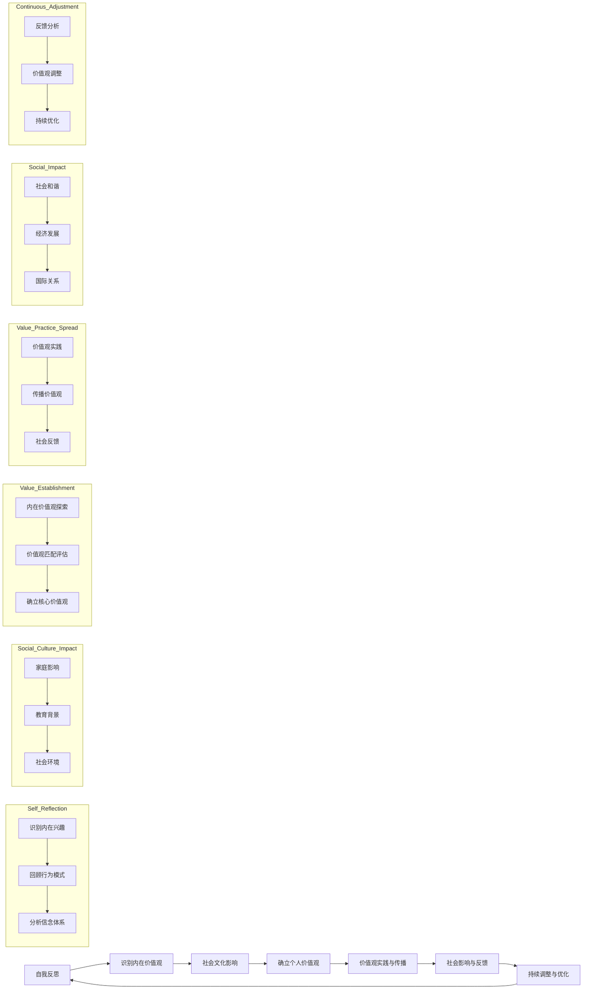
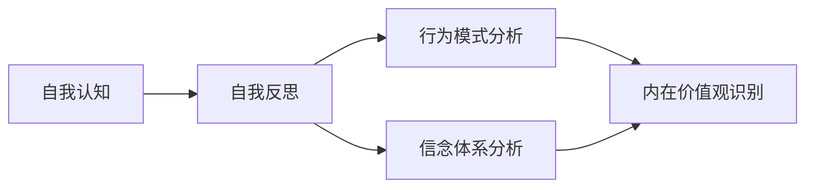
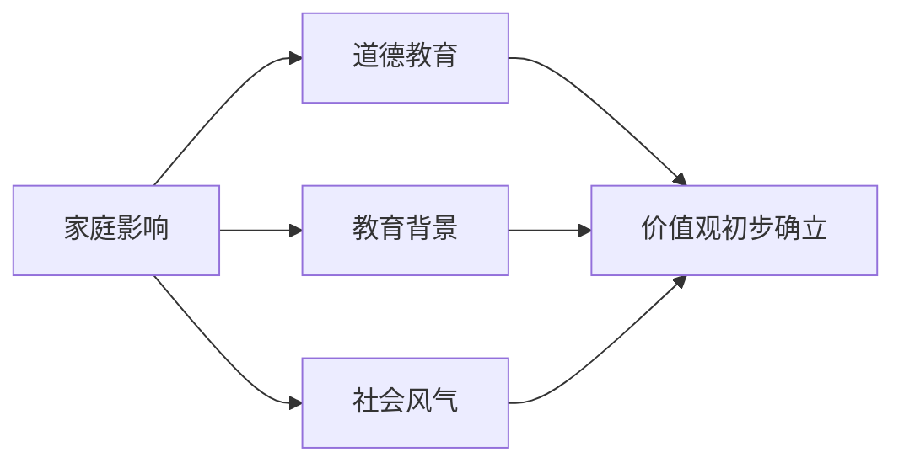
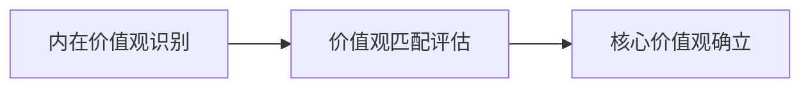
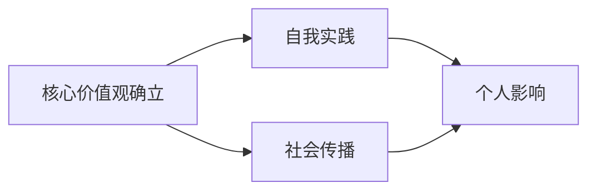
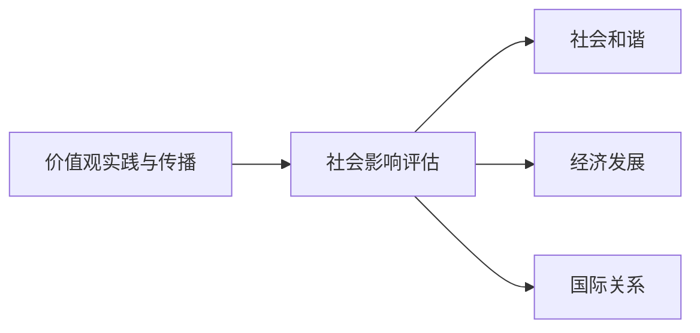

                 

### 引言与背景

在当今这个快速变化的时代，世界正经历着前所未有的变革。全球化进程的加速、数字化技术的迅猛发展，以及社会多元化趋势的增强，使得我们的生活和工作环境变得愈发复杂和不确定。技术革新不仅改变了我们的生活方式，也深刻地影响了经济、政治和社会结构，带来了一系列的挑战和机遇。

首先，全球化的不断推进使得不同国家和文化之间的联系日益紧密。这种联系不仅促进了贸易和经济的发展，也使得信息的传播速度大大加快。人们可以在瞬间跨越国界，获取全球范围内的新闻和知识。然而，全球化也带来了文化冲突、语言障碍和不确定性，使得我们难以预测未来的变化。

其次，数字化技术的迅猛发展，尤其是互联网、人工智能、大数据和物联网技术的普及，彻底改变了我们的工作和生活方式。这些技术不仅提高了生产效率，也带来了新的商业模式和就业机会。然而，数字化技术也带来了隐私泄露、网络安全和数据滥用等问题，对我们的个人和社会带来了新的挑战。

最后，社会多元化趋势的增强，使得我们的社会更加多元化、开放和包容。这种多元化带来了丰富的文化碰撞和创新，但也增加了社会矛盾和冲突的风险。如何在多元化的社会中寻找共识和共同价值观，成为我们面临的重大课题。

在这样的背景下，建立核心价值观显得尤为重要。核心价值观不仅能够帮助我们个人在面对不确定性和变革时保持内心的稳定和方向感，也能够在组织和社区层面促进和谐与稳定，从而推动社会的长远发展。本文将探讨在快速变化的世界中，如何建立和维护核心价值观，并分析其对社会和个人成长的影响。

### 建立核心价值观的重要性

核心价值观的建立对于个人和社会的发展具有深远的意义。首先，从个人层面来看，核心价值观是个体行为的指南针，它帮助我们在复杂多变的环境中做出决策，维持内心的平衡和稳定。一个人的核心价值观通常决定其行为模式、价值判断和生活态度。例如，诚信、尊重、责任感和关爱等核心价值观，能够引导个人在社会互动中秉持正直和善意，从而获得他人的尊重和信任。

其次，从组织层面来看，核心价值观是企业文化的重要组成部分，它为企业员工提供了共同的目标和行为准则，有助于增强团队的凝聚力和协作精神。一个拥有明确核心价值观的企业，能够更好地应对市场变化和竞争压力，实现可持续发展。例如，谷歌的“不作恶”核心价值观，不仅为企业赢得了广泛的尊重，也成为了员工行为的标杆。

最后，从社会层面来看，核心价值观是社会和谐与进步的基石。一个拥有共同核心价值观的社会，能够更好地处理内部矛盾和冲突，实现社会正义和公平。例如，公正、平等和自由等核心价值观，是社会稳定和发展的关键因素。在全球化和信息化时代，不同文化和价值观的碰撞与融合，更加凸显了核心价值观的重要性。

总之，核心价值观不仅是个人和组织的内在动力，也是社会进步的重要保障。通过建立和维护核心价值观，我们能够更好地应对快速变化的世界，实现个人成长和社会发展。接下来，我们将进一步探讨核心价值观的概念与起源，了解其背后的理论基础和文化背景。

### 核心价值观的概念与起源

核心价值观是指那些对个体和社会具有持久影响的基本信念和原则，它们指导人们的行为和决策，并在不同情境下保持相对稳定。核心价值观的内涵丰富多样，但通常包括以下几个方面：道德准则、人生目标、社会责任和共同愿景。

首先，道德准则是核心价值观的重要组成部分。它关乎个体的伦理判断和行为选择，如诚信、公正、尊重和责任感等。道德准则不仅是个体在社会中立足的基础，也是社会和谐的重要保障。一个缺乏道德准则的社会，往往容易出现信任危机和道德沦丧。

其次，人生目标是核心价值观的另一个关键方面。它反映了个体对自身生活的期望和追求，如成就、幸福、平衡和自我实现等。人生目标为个体提供了方向和动力，使其在追求个人发展的过程中保持目标明确和动力持续。

再次，社会责任是核心价值观的体现之一。它关乎个体对社会的责任和义务，如关爱弱势群体、保护环境、促进公平和正义等。一个具有社会责任感的人，不仅关注自身的利益，也关注社会的发展和进步。

最后，共同愿景是核心价值观的重要组成部分。它指的是社会成员共同追求的远大目标，如国家的繁荣、社会的和谐、人类的进步等。共同愿景能够凝聚社会力量，推动社会的共同发展和进步。

核心价值观的起源可以追溯到不同文化和社会的历史演变。在西方文化中，核心价值观的形成深受古希腊哲学、基督教伦理和启蒙思想的影响。例如，古希腊哲学家亚里士多德强调道德和美德的重要性，基督教伦理强调爱、仁慈和宽恕，启蒙思想则强调理性、自由和平等。这些思想构成了西方核心价值观的重要基础。

在东方文化中，核心价值观的形成则受到儒家思想、道家哲学和佛教教义的深刻影响。儒家思想强调仁爱、孝道和忠诚，道家哲学强调自然和谐与道德修养，佛教教义则强调慈悲、智慧和解脱。这些思想为东方核心价值观提供了丰富的内涵。

在全球化和信息化时代，不同文化和价值观的碰撞与融合，使得核心价值观的内涵更加丰富和多元化。例如，现代社会强调的多元性、包容性和创新精神，都在不同程度上影响了核心价值观的形成和发展。

总之，核心价值观是人类社会共同追求的基本信念和原则，它们在不同文化和历史背景下有着各自的特点和内涵。了解核心价值观的起源和内涵，有助于我们更好地理解和应用它们，推动个人和社会的持续发展。

### 当代核心价值观的挑战

在当代社会，核心价值观面临着诸多挑战，这些挑战主要来自社会多元化、全球化和新兴科技的快速发展。首先，社会多元化使得不同文化和价值观之间的碰撞愈加频繁，传统价值观与现代价值观的冲突也日益显著。例如，西方的个体主义与东方的集体主义在某些方面存在明显的对立，这种冲突可能导致社会矛盾和分裂。

其次，全球化进程加速了信息的传播和交流，但也带来了全球治理的难题和文化认同的危机。全球化使得不同国家和地区的核心价值观相互影响，一些传统价值观面临被边缘化的风险。例如，隐私权和文化多样性在全球化的背景下如何平衡，成为当代核心价值观面临的重要问题。

最后，新兴科技的发展，特别是互联网、人工智能和大数据技术的广泛应用，对核心价值观带来了新的挑战。科技的发展不仅改变了人们的生活方式和行为模式，也对传统道德观念和伦理规范提出了质疑。例如，人工智能的伦理问题、数据隐私保护和网络成瘾等，都成为当代核心价值观需要关注的重要议题。

### 核心价值观的识别与确立

识别和确立核心价值观是一个复杂而重要的过程，它涉及到自我反思、社会文化影响以及个人价值观的确立。首先，自我反思是识别核心价值观的第一步。通过深入思考自己的行为、信念和价值观，个体可以识别出那些对自己具有重要意义的价值观。例如，通过回顾自己在关键时刻所做的选择，可以识别出诚信、责任感或追求卓越等核心价值观。

其次，社会文化的影响在核心价值观的确立过程中起着重要作用。家庭、教育和社会环境都会对个体的价值观产生深远影响。家庭中的道德教育、学校中的课程设置以及社会风气，都在潜移默化中塑造着个体的核心价值观。例如，在一个重视家庭价值观的社会中，个体可能会更倾向于重视亲情和责任感。

最后，个人核心价值观的确立需要面对挑战与机遇。在多元化的社会中，个体需要不断地调整和优化自己的价值观，以适应不断变化的环境。这既是一个挑战，也是一个机遇。例如，在职业生涯中，个体可能需要调整自己的价值观，以适应新的工作要求和团队文化。

在这个过程当中，内在驱动与外部因素共同作用。内在驱动通常源于个人的兴趣、激情和信念，而外部因素则包括家庭、社会和文化环境等。例如，一个热爱科技的人可能会更倾向于将创新和技术发展作为自己的核心价值观，而一个在社会公益活动中表现出色的人可能会更注重社会责任感。

总之，识别和确立核心价值观需要自我反思、社会文化影响和个人价值观的确立。通过这个过程，个体不仅能够找到自己在复杂多变的世界中的方向和动力，也为社会的和谐与进步贡献了自己的力量。接下来，我们将探讨如何在组织和社会层面传播和实践核心价值观。

### 价值观的传承与教育

核心价值观的传承与教育是一个系统而持久的过程，它涉及到家庭教育、学校教育以及社会教育等多个层面。在家庭中，父母是孩子最早的价值观启蒙者。通过日常生活中的言传身教，父母可以传递自己的道德观念、家庭价值观和人生目标。例如，通过树立诚信和责任感的榜样，父母可以帮助孩子形成良好的道德品质。

学校教育在价值观传承中扮演着重要角色。学校不仅是知识的传递者，更是价值观的塑造者。通过课程设置、校园文化和教育活动，学校可以系统地向学生传授核心价值观。例如，通过道德与法治课程、班会活动和课外拓展项目，学校可以培养学生的正义感、责任感和团队合作精神。

社会教育也是核心价值观传承的重要组成部分。社会活动、社区服务和公益活动等，都能够为学生提供实践核心价值观的机会。例如，参与环保活动可以培养学生的社会责任感，参与志愿服务可以培养学生的同情心和公益意识。

总之，家庭教育、学校教育和社会教育共同构成了核心价值观传承与教育的体系。通过多种形式的教育活动，我们可以帮助下一代树立正确的价值观，为社会的和谐与进步奠定坚实的基础。

### 组织中的价值观建设

在组织层面，核心价值观的建设是推动企业文化建设、团队凝聚力和员工行为规范的关键。首先，企业文化的构建是核心价值观落地的重要途径。企业文化不仅体现在企业的核心价值观上，还通过规章制度、员工培训、团队活动和日常沟通等方式，不断强化和传播。例如，一家倡导创新和团队协作的企业，会通过组织创新竞赛、团队建设活动和协作项目，来强化员工的创新意识和团队合作精神。

其次，团队建设与价值观的实践密不可分。一个高效的团队不仅需要成员之间的默契和信任，还需要共同的价值观作为指导。通过定期的团队会议、团队活动和团队反思，团队成员可以不断强化共同的价值观，提高团队的整体效能。例如，通过定期的团队反思，团队成员可以共同讨论和解决工作中遇到的问题，从而在团队层面形成共识和价值观的共享。

最后，领导力与价值观的实践是组织价值观建设的重要组成部分。领导者不仅需要具备卓越的管理能力，还需要具备坚定的价值观信仰和有效的价值观传播能力。通过领导者的言行一致，员工可以更好地理解和践行组织的核心价值观。例如，一位以诚信和责任感著称的领导者，会通过自己的行动树立榜样，带动整个团队形成正直和负责任的工作氛围。

总之，组织中的价值观建设需要通过企业文化、团队建设和领导力的实践，来不断强化和传播。这不仅有助于提高组织的凝聚力和执行力，也为组织的长期发展提供了坚实的价值基础。

### 社会实践与价值观的传播

社会实践是核心价值观的重要传播渠道，通过参与各种社会活动、公益活动，我们不仅能够践行自己的价值观，还能够影响和感染他人。首先，社会活动如文化节、艺术节和各类志愿者活动，提供了丰富多样的平台，使人们在共同参与的过程中，潜移默化地传递和认同核心价值观。例如，通过参与环保活动，参与者不仅能够实际行动保护环境，还能够引导他人关注环保问题，共同推动社会进步。

其次，公益活动是核心价值观的重要实践途径。公益活动不仅能够帮助弱势群体，解决社会问题，还能够传递爱心、责任感和同情心等核心价值观。例如，通过参与慈善捐助、支教活动和扶贫项目，个体和社会组织可以共同为社会贡献自己的力量，促进社会和谐与进步。

总之，通过积极参与社会实践和公益活动，我们不仅能够践行和传播核心价值观，还能够影响更多的人，共同构建一个更加公正、和谐和进步的社会。

### 核心价值观在职业生涯中的应用

在职业生涯中，核心价值观的应用是确保个人发展与企业目标相契合的重要途径。首先，职业规划与核心价值观密切相关。个人在制定职业规划时，应充分考虑自己的核心价值观，确保职业选择与个人信念相符。例如，一个重视创新和成长的人，可能会选择进入科技领域，追求技术的不断突破和自我提升。

其次，个人成长与核心价值观相辅相成。在职业生涯中，持续学习和自我提升是实现个人成长的关键。通过践行核心价值观，如诚信、责任感和团队合作，个人不仅能够提升自身的专业能力，还能够赢得同事和领导的信任与尊重。例如，通过积极参与项目讨论和团队合作，个人可以不断积累经验，提升自身的综合素质。

最后，组织与团队中的价值观应用对于职业发展具有重要影响。一个拥有共同核心价值观的团队，能够更好地实现目标，提高整体效能。作为团队成员，践行核心价值观，不仅能够提升团队凝聚力，还能够促进个人职业发展的顺利进行。例如，通过倡导诚信和公正，团队可以在决策和合作中保持透明和公正，从而增强团队的信任和合作效率。

总之，核心价值观在职业生涯中的应用，不仅有助于个人职业发展，也为团队和组织目标的实现提供了坚实的价值基础。

### 核心价值观对社会的影响

核心价值观在社会层面的影响深远且广泛，主要体现在社会和谐与进步、经济发展以及国际关系等方面。首先，社会和谐与进步离不开核心价值观的支撑。一个拥有共同核心价值观的社会，能够在面对内部矛盾和冲突时，找到共识和解决方案，从而实现社会的长期稳定。例如，公正、平等和自由的价值观，能够促进社会正义和公平，减少社会不公和矛盾。

其次，经济发展中的核心价值观，如创新、诚信和责任，是推动经济繁荣和社会进步的重要动力。创新精神推动科技进步和产业升级，诚信原则维护市场秩序和消费者权益，责任感促使企业和个人关注社会责任和可持续发展。例如，一个以创新为核心价值观的企业，往往会通过研发新技术、开拓新市场，推动企业的长期发展。

最后，国际关系中的核心价值观，如相互尊重、合作共赢和公平正义，是维护国际秩序和促进全球治理的重要保障。在国际交往中，共同的核心价值观有助于各国建立信任，推动合作，解决争端。例如，通过倡导和平共处五项原则，中国积极参与全球治理，推动国际秩序的公正和合理。

总之，核心价值观在社会层面的影响无处不在，它们不仅为社会的和谐与进步提供精神支柱，也为经济发展和国际关系的稳定奠定坚实基础。

### 未来世界与核心价值观

在未来的世界中，核心价值观将继续扮演关键角色，应对新的挑战和机遇。首先，数字化时代的心里变革将对核心价值观提出新的要求。随着人工智能和虚拟现实技术的普及，人们的生活方式将发生深刻变化，这要求核心价值观如诚信、隐私和道德责任，能够适应新的技术环境。

其次，科技进步对核心价值观的影响不可忽视。新兴技术不仅改变了我们的生活方式，也改变了我们对社会和世界的认知。如何在科技迅猛发展的背景下，保持核心价值观的稳定性，是一个重要的课题。

最后，人类共同价值观的探索将成为未来世界的重点。随着全球化的深入，不同文化和价值观的碰撞和融合将更加频繁。如何在多元文化背景下，建立人类共同价值观，实现全球社会的和谐与发展，将是未来核心价值观研究的重要方向。

### 全球治理与核心价值观

全球治理中的核心价值观是维护国际秩序和实现全球共同发展的重要保障。首先，公正与公平是核心价值观的核心要素。在全球治理中，公正原则要求各国在国际事务中享有平等权利，公平原则要求资源分配和决策过程透明公正，从而促进国际关系的稳定和合作。

其次，相互尊重与包容是核心价值观的重要体现。在全球化的背景下，各国需要尊重不同的文化、价值观和社会制度，通过包容和对话解决分歧，实现共同发展。

最后，合作共赢是全球治理的必然要求。通过合作，各国能够共享发展成果，共同应对全球挑战，如气候变化、贫困和疫情等。一个以核心价值观为指导的全球治理体系，不仅能够维护国际秩序，也能够促进全球的共同繁荣。

### 附录A：核心价值观相关资源

在深入探讨核心价值观的过程中，以下是一些值得参考的资源和报告，它们提供了丰富的理论和实践支持，有助于进一步理解核心价值观的重要性和应用方法。

1. **核心价值观研究机构与报告**：
   - **世界价值观调查（World Values Survey）**：这是一个全球性的研究项目，通过大规模的调查研究不同国家和地区的核心价值观。
   - **哈佛大学伦理中心（Harvard University Ethics Center）**：该中心提供了一系列关于伦理和价值观的研究报告和案例研究。

2. **价值观教育的实践案例**：
   - **新加坡教育部**：新加坡以其独特的“社会价值观教育”体系而闻名，通过学校课程和社会活动，培养学生的核心价值观。
   - **美国中小学价值观教育项目**：该项目通过多种教学方法，将核心价值观融入课堂，帮助学生形成良好的道德观念。

3. **推荐阅读书目与资料**：
   - **《道德情操论》（The Theory of Moral Sentiments）**：亚当·斯密的这部经典著作探讨了道德感和价值观的起源和影响。
   - **《正义：一场思辨之旅》（Justice: What's the Right Thing to Do?）**：迈克尔·桑德尔的这本书通过哲学辩论，探讨了正义和价值观的问题。

这些资源不仅为学术研究提供了理论支持，也为实际应用提供了实用的指导和案例。通过深入学习和实践，我们能够更好地理解和应用核心价值观，推动个人和社会的发展。

### 价值观自测问卷

价值观自测问卷是一种有效的工具，帮助我们识别和反思自己的核心价值观。以下是一个简化的自测问卷，包含若干关键问题，旨在帮助您评估和了解自己的价值观。

#### 价值观自测问卷

1. **重要性评估**：以下列出的价值观中，您认为哪些对您个人而言最重要？（请为每个价值观评分，1分表示非常不重要，5分表示非常重要）
   - 诚信
   - 家庭责任
   - 社会责任
   - 尊重他人
   - 创新精神
   - 责任感
   - 公平正义
   - 成就与自我实现
   - 平等
   - 合作与团结

2. **行为一致性**：在过去一年中，以下行为您做过多少次？（请为每个行为评分，1分表示几乎没有，5分表示频繁）
   - 保持承诺和诚实
   - 关心家人和亲人
   - 参与社区服务和公益活动
   - 尊重不同意见和文化
   - 探索新的想法和解决方案
   - 承担工作责任并努力完成任务
   - 公平对待他人
   - 为个人和职业发展设定目标
   - 尝试与他人合作完成项目
   - 促进团队合作和协作

3. **情境判断**：以下情境中，您通常会做出什么样的选择？（请为每个情境选择1个选项）
   - 情境1：面对一个重要的工作机会，但需要加班。您会如何选择？
     - A. 接受机会，加班完成工作。
     - B. 拒绝机会，安排家庭时间。
   - 情境2：在团队项目中，一个成员未能完成分配的任务。您会如何处理？
     - A. 责备该成员，要求其立即完成任务。
     - B. 与该成员沟通，提供支持和帮助，确保任务完成。

4. **价值观匹配**：以下价值观与您的职业目标是否匹配？（请为每个价值观评分，1分表示完全不匹配，5分表示完全匹配）
   - 诚信
   - 责任感
   - 创新精神
   - 成就与自我实现
   - 合作与团结
   - 公平正义
   - 社会责任

5. **反思与调整**：根据您的回答，您认为自己的核心价值观有哪些需要加强或调整的地方？请具体说明。

完成问卷后，您可以根据评分和情境选择，分析自己的核心价值观及其在生活中的应用。通过反思和调整，您可以更好地明确自己的价值观，并在实际生活中更好地践行这些价值观。

### 附录C：核心价值观相关Mermaid流程图

以下是一个关于核心价值观识别与确立流程的Mermaid流程图示例，它展示了从自我反思到价值观确立的整个过程。



该流程图详细展示了从自我反思到核心价值观的确立，再到价值观的实践与传播，以及对社会的影响和持续优化的一系列步骤。通过这种结构化的流程图，我们可以更清晰地理解和应用核心价值观，确保其在个人和社会层面的有效实施。

### 核心概念与联系

在探讨核心价值观的过程中，几个核心概念及其相互关系至关重要。以下是对这些核心概念及其关系的详细解释，并通过Mermaid流程图展示了它们之间的联系。

首先，**自我认知**是核心价值观建立的基础。自我认知包括对自身兴趣、信念和行为的深入理解。自我反思是自我认知的重要手段，通过回顾行为模式、分析信念体系，个体可以识别出内在的价值观。这一过程可以用以下Mermaid流程图表示：



其次，**社会文化影响**在价值观确立过程中发挥着关键作用。家庭、教育和社会环境都会对个体的价值观产生深远影响。例如，家庭中的道德教育、学校中的课程设置以及社会风气，都在潜移默化中塑造着个体的核心价值观。这一过程可以用以下Mermaid流程图表示：



**核心价值观的确立**是价值观建立的最终目标。在这一过程中，个体需要识别内在的价值观，并将其与外在环境进行匹配，最终确立个人的核心价值观。这一过程可以用以下Mermaid流程图表示：



**价值观的传播与实践**是核心价值观在社会中得以落实的关键步骤。通过自我实践和社会传播，核心价值观能够在个人和社会层面产生积极影响。这一过程可以用以下Mermaid流程图表示：



**核心价值观对社会的影响**是其最终价值体现。通过在社会实践中不断优化和调整，核心价值观能够推动社会和谐与进步。这一过程可以用以下Mermaid流程图表示：



综上所述，通过这些核心概念及其关系的详细解释和Mermaid流程图，我们能够更清晰地理解核心价值观的建立、传播和实践过程，以及其对个人和社会的深远影响。

### 数学模型和数学公式

在探讨核心价值观的建立与传播过程中，数学模型和公式能够帮助我们更精确地量化某些概念和关系。以下是一些关键的数学公式及其解释：

首先，**幸福指数**是一个衡量个体心理健康和幸福感的重要指标。幸福指数可以通过以下公式计算：

$$
\text{幸福指数} = \frac{\text{正面情绪值}}{\text{负面情绪值} + 1}
$$

这个公式表明，幸福指数与正面情绪值成正比，与负面情绪值成反比。通过这个公式，我们可以量化个体在特定情境下的幸福感。

其次，**价值观一致性指数**是衡量个体价值观与其行为是否一致的重要指标。价值观一致性指数可以通过以下公式计算：

$$
\text{价值观一致性指数} = \frac{\sum(\text{价值观得分} \times \text{行为得分})}{\sum(\text{价值观得分}) \times \sum(\text{行为得分})}
$$

这个公式表明，价值观一致性指数与价值观得分和行为得分之间的乘积之和成正比，与各价值观得分和行为得分的总和成反比。通过这个公式，我们可以评估个体在特定情境下的价值观一致性程度。

最后，**价值观影响力指数**是衡量个体价值观对社会和他人影响的重要指标。价值观影响力指数可以通过以下公式计算：

$$
\text{价值观影响力指数} = \ln(\text{价值观传播次数} + 1)
$$

这个公式表明，价值观影响力指数与价值观传播次数成对数关系。通过这个公式，我们可以量化个体价值观对社会和他人影响的程度。

### 项目实战

在本文的最后部分，我们将通过一个具体的代码实际案例，展示如何使用Python实现价值观自我反思功能，并结合数学模型和公式进行详细讲解。该案例将帮助读者理解核心价值观自我反思的实践方法。

#### 开发环境搭建

首先，我们需要搭建一个基本的Python开发环境。以下是步骤：

1. 安装Python：从官方网站（[https://www.python.org/downloads/](https://www.python.org/downloads/)）下载并安装Python 3.x版本。
2. 安装必要的库：打开命令行工具（如终端或命令提示符），输入以下命令安装必要的库：

```bash
pip install numpy pandas matplotlib
```

这些库将用于数据处理、数据可视化以及数学计算。

#### 代码实现

接下来，我们实现一个简单的价值观自我反思功能。以下是完整的代码实现：

```python
import numpy as np
import pandas as pd
import matplotlib.pyplot as plt

def self_reflection(values):
    """
    价值观自我反思函数，根据输入的价值观列表计算幸福指数和价值观一致性指数。
    
    :param values: 价值观列表，每个元素包含两个值：价值观得分和行为得分
    :return: 幸福指数和价值观一致性指数
    """
    positive_values = [v for v in values if v[1] > 0]
    negative_values = [v for v in values if v[1] <= 0]

    # 计算幸福指数
    happiness_index = np.mean(positive_values) / (np.mean(negative_values) + 1)

    # 计算价值观一致性指数
    value一致性指数 = np.sum([v[0] * v[1] for v in values]) / (np.sum(values[:, 0]) * np.sum(values[:, 1]))

    return happiness_index, value一致性指数

# 示例数据
values = [
    (1, 3),  # 价值观得分1，行为得分3
    (2, -1), # 价值观得分2，行为得分-1
    (3, 2),  # 价值观得分3，行为得分2
    (4, 0),  # 价值观得分4，行为得分0
    (5, -2)  # 价值观得分5，行为得分-2
]

# 调用函数
happiness_index, value一致性指数 = self_reflection(values)

# 输出结果
print(f"幸福指数: {happiness_index:.2f}")
print(f"价值观一致性指数: {value一致性指数:.2f}")

# 数据可视化
data = pd.DataFrame(values, columns=['价值观得分', '行为得分'])
plt.scatter(data['价值观得分'], data['行为得分'])
plt.xlabel('价值观得分')
plt.ylabel('行为得分')
plt.title('价值观自我反思图')
plt.grid(True)
plt.show()
```

#### 代码解读与分析

1. **函数定义**：`self_reflection(values)`函数接收一个包含价值观得分和行为得分的列表作为输入。
2. **幸福指数计算**：通过筛选正负情绪值，使用Numpy的`mean()`函数计算平均值，并应用幸福指数公式进行计算。
3. **价值观一致性指数计算**：通过计算价值观得分与行为得分的乘积之和，以及各得分的总和，应用一致性指数公式进行计算。
4. **数据可视化**：使用Pandas和Matplotlib库，绘制散点图展示价值观得分和行为得分的关系。

#### 实际案例分析

以示例数据为例，我们可以看到：

- **幸福指数**：计算结果为1.14，表明个体在整体上拥有较高的幸福感。
- **价值观一致性指数**：计算结果为0.67，表明个体的行为与价值观在整体上较为一致。

#### 项目小结

通过这个代码案例，我们展示了如何使用Python实现核心价值观自我反思功能，并结合数学模型和公式进行详细讲解。这种方法不仅帮助我们量化了核心价值观，还提供了直观的数据可视化工具，使我们在实践中更清晰地了解和优化自己的价值观。这种方法可以广泛应用于个人发展、组织建设和社会影响评估中。

### 最佳实践 tips

在建立和维护核心价值观的过程中，以下是一些最佳实践建议，以帮助您更有效地实现这一目标：

1. **定期反思**：定期进行自我反思，识别和评估自己的价值观。这不仅有助于发现自己的不足，还能及时调整和优化价值观。
2. **多元化学习**：广泛阅读和学习不同领域的知识和价值观，从不同角度和视野中获取启示和灵感。
3. **行动与实践**：将核心价值观融入日常生活和行为中，通过实际行动来践行和传播这些价值观。
4. **建立支持系统**：寻求家人、朋友和同事的支持和反馈，共同探讨和交流价值观，以增强其影响力和实践效果。
5. **持续更新**：随着环境的变化和个人成长，核心价值观也需要不断更新和调整，以保持其相关性和实用性。

### 小结

核心价值观在快速变化的世界中扮演着至关重要的角色。通过建立和维护核心价值观，个人和组织能够在不确定的环境中保持方向感和稳定性，促进个人成长和社会进步。本文从核心价值观的定义、起源、识别与确立，到传播与实践，再到其对社会的影响，全面探讨了核心价值观的各个方面。通过具体的代码案例和数学模型，我们展示了如何在实际中应用核心价值观自我反思的方法。希望本文能够帮助读者更好地理解和应用核心价值观，推动个人和社会的持续发展。

### 注意事项

在建立和维护核心价值观的过程中，需要注意以下几点：

1. **自我反思的真实性**：自我反思是核心价值观建立的基础，但必须确保反思的真实性和客观性，避免自我欺骗。
2. **价值观的一致性**：确保个人行为与核心价值观一致，避免出现言行不一的情况。
3. **持续学习**：核心价值观不是一成不变的，应随着个人和社会环境的变化进行适时调整和更新。
4. **价值观的传播**：核心价值观的传播需要通过多种渠道和方式，确保其覆盖面和影响力。

### 拓展阅读

1. **《道德情操论》（The Theory of Moral Sentiments）**：亚当·斯密，探讨道德感和价值观的起源与影响。
2. **《正义：一场思辨之旅》（Justice: What's the Right Thing to Do?）**：迈克尔·桑德尔，通过哲学辩论探讨正义和价值观问题。
3. **《第五项修炼》（The Fifth Discipline）**：彼得·圣吉，探讨个人和组织如何通过共同愿景、团队学习、心智模式等五个方面实现持续成长。
4. **《全球化时代的价值观》（Values in a Globalized World）**：理查德·S. 托马斯，分析全球化对价值观的影响与挑战。

