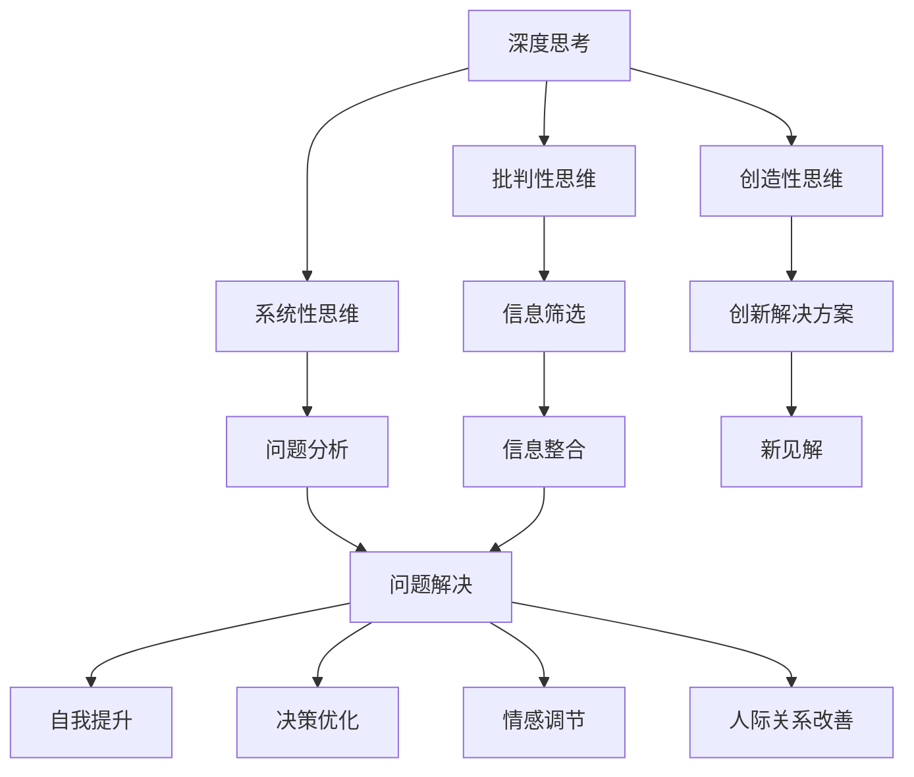

                 

### 在快餐文化中寻找深度：重建思考和反省的能力

> 关键词：快餐文化、深度思考、反省能力、人工智能、个人成长

> 摘要：本文将探讨在快餐文化盛行的情况下，如何重建深度思考和反省的能力。通过分析快餐文化的特点及其影响，我们提出了培养深度思考和反省能力的策略，并结合具体案例和实践步骤，旨在帮助读者在快节奏的生活中实现个人成长。

## 引言

在当今社会，信息爆炸和技术飞速发展，快餐文化逐渐成为主流。人们倾向于追求快速、简洁和高效的信息消费方式，这种文化现象在互联网、社交媒体和快节奏的工作生活中尤为明显。然而，快餐文化带来的便利和效率同时也对个人的思考和反省能力构成了挑战。在这种环境下，如何重建深度思考和反省的能力，成为一个亟待解决的问题。

本文将首先探讨快餐文化的现状及其对个人思考方式的影响，接着介绍深度思考和反省能力的重要性，并通过Mermaid流程图展示这些概念之间的关系。随后，我们将详细阐述培养深度思考和反省能力的具体方法，结合案例分析，给出实用的策略和实践步骤。最后，本文将总结全文，强调深度思考和反省能力的重要性，并提供进一步阅读的建议。

## 1. 快餐文化的现状与影响

### 1.1 快餐文化的定义与特点

快餐文化是一种强调快速、便捷和高效的信息消费方式。它起源于20世纪中叶的美国，随着快餐行业的兴起而迅速蔓延。在数字化的今天，这种文化进一步扩展到互联网、社交媒体等各个领域。快餐文化的特点主要包括：

- **内容简洁**：信息以简短、直接的方式呈现，避免冗长和复杂的论述。
- **传播快速**：信息传播速度极快，几乎在瞬间就能传达到广泛的受众。
- **消费便捷**：用户可以随时随地获取所需信息，无需花费太多时间和精力。
- **娱乐性**：快餐文化往往具有娱乐性，旨在提供轻松愉快的阅读体验。

### 1.2 快餐文化对个人思考方式的冲击

快餐文化的流行对个人思考方式产生了深远的影响：

- **注意力分散**：由于信息量庞大，人们容易在短时间内转移注意力，导致深度思考的难度增加。
- **理解浅薄**：快餐文化倾向于提供表层信息，难以激发读者进行深入理解和分析。
- **缺乏批判性思维**：快餐文化的消费方式容易导致读者产生盲目接受信息的态度，缺乏批判性思维。
- **影响心理健康**：快餐文化可能导致焦虑和压力增加，影响个人的心理健康。

### 1.3 快餐文化对社会的潜在危害

快餐文化不仅对个人产生了负面影响，也对整个社会产生了潜在危害：

- **文化多样性的削弱**：快餐文化倾向于统一和同质化的信息，可能导致文化多样性的丧失。
- **价值观的扭曲**：快餐文化可能传递出短视和功利主义的价值观，影响社会的长远发展。
- **创新能力下降**：缺乏深度思考和批判性思维，可能导致社会整体创新能力的下降。

## 2. 核心概念与联系

### 2.1 深度思考的概念与特征

深度思考是指对问题进行深入、系统性的分析和推理，以获得深刻的见解和解决方案。深度思考具有以下几个特征：

- **全面性**：深度思考涉及多个角度和层面，力求全面理解问题。
- **批判性**：深度思考强调对信息的批判性和反思性，不盲目接受表面信息。
- **系统性**：深度思考关注问题之间的关联和整体性，追求系统的解决方案。
- **创造性**：深度思考能够激发创新思维，产生新的见解和解决方案。

### 2.2 反省能力的定义与作用

反省能力是指对自身行为、思维和情感进行深刻反思和自我评价的能力。反省能力具有以下几个作用：

- **自我提升**：通过反省，个体能够发现自己的不足和错误，从而进行自我提升。
- **决策优化**：反省能力有助于个体从过去的经验中学习，优化决策过程。
- **情感调节**：反省能力能够帮助个体调节情绪，缓解焦虑和压力。
- **人际关系**：反省能力有助于改善人际关系，建立更加和谐的人际环境。

### 2.3 Mermaid流程图：深度思考与反省能力的关系架构

以下是一个使用Mermaid绘制的流程图，展示了深度思考与反省能力之间的关系：

这个流程图展示了深度思考如何通过批判性思维、系统性思维和创造性思维引导信息筛选、问题分析、创新解决方案等信息处理过程，进而实现自我提升、决策优化、情感调节和人际关系改善等目标。通过这个流程图，我们可以更加清晰地理解深度思考和反省能力之间的关系和作用。

## 3. 培养深度思考与反省的方法

### 3.1 培养深度思考的方法

#### 3.1.1 阅读深度文本

阅读是培养深度思考的重要途径。深度文本通常具有以下几个特点：

- **复杂性**：深度文本涉及多个学科和领域，需要读者具备一定的知识储备。
- **抽象性**：深度文本往往使用抽象概念和理论进行论述，需要读者进行深入理解和分析。
- **逻辑性**：深度文本具有较强的逻辑结构，读者需要跟随作者的思路进行思考。

为了有效阅读深度文本，可以采用以下策略：

- **预习**：在阅读前，先对文本的主题和结构进行预习，了解作者的论述逻辑。
- **标记和注释**：在阅读过程中，使用标记和注释记录关键观点和疑问，以便后续思考和总结。
- **主动思考**：在阅读时，不断提出问题和假设，尝试从不同角度进行思考和解答。

#### 3.1.2 讨论与辩论

讨论和辩论是培养批判性思维和深度思考的有效方法。通过与他人交流，可以拓展自己的视野，发现新的问题和解决方案。

- **积极参与**：在讨论和辩论中，积极表达自己的观点，倾听他人的意见，尝试从不同角度进行思考。
- **逻辑论证**：在辩论时，注重逻辑论证和证据支持，避免情绪化的表达。
- **反思总结**：辩论后，进行反思和总结，分析自己的观点和论据，以及他人的反驳和观点。

#### 3.1.3 持续学习

持续学习是培养深度思考的重要手段。通过不断学习新知识和技能，可以提高自己的知识储备和思维深度。

- **设定学习目标**：根据自己的兴趣和需求，设定明确的学习目标。
- **多样化学习资源**：利用书籍、在线课程、讲座等多种学习资源，丰富自己的知识体系。
- **实践与应用**：将所学知识应用于实际问题和项目中，通过实践加深理解和思考。

### 3.2 培养反省能力的方法

#### 3.2.1 自我反思的技巧

自我反思是培养反省能力的关键。以下是一些自我反思的技巧：

- **定期回顾**：定期回顾自己的行为和思维，分析成功和失败的原因，总结经验教训。
- **记录反思日记**：每天或每周记录反思日记，记录自己的思考和感受，进行自我反思。
- **心理调适**：在面对挫折和困难时，学会心理调适，保持积极的心态，从失败中汲取经验。

#### 3.2.2 反思日记的实践

反思日记是一种有效的自我反思方法。以下是一些实践反思日记的步骤：

- **设定反思目标**：明确反思日记的目标，如分析某一次失败的原因、总结某一项任务的执行情况等。
- **记录真实感受**：在日记中记录自己的真实感受和思考，避免刻意掩饰或美化。
- **分析问题**：对记录的内容进行深入分析，寻找问题的根本原因。
- **制定改进计划**：根据分析结果，制定改进计划，明确下一步的行动方向。

#### 3.2.3 反思性写作

反思性写作是将自我反思转化为文字的过程。以下是一些反思性写作的步骤：

- **选定主题**：选择一个具体主题，如一次会议、一项工作、一次旅行等。
- **描述经历**：详细描述经历的过程，包括感受、思考和行为。
- **反思总结**：对经历进行反思和总结，分析成功和失败的原因，提炼经验教训。
- **提出改进措施**：根据反思结果，提出改进措施，为未来的行动提供指导。

### 3.3 其他培养深度思考与反省能力的方法

除了上述具体方法，还有一些其他的方法可以培养深度思考和反省能力：

- **练习冥想**：冥想可以帮助个体静心思考，提高自我意识和反省能力。
- **培养好奇心**：好奇心是激发深度思考的源泉，培养好奇心可以帮助个体持续探索和反思。
- **接受挑战**：面对挑战和困难时，保持积极的心态，通过思考和反省找到解决方案。

## 4. 案例分析

### 4.1 案例一：从新闻事件中培养深度思考

新闻事件是培养深度思考的绝佳素材。以下是一个案例：

**案例**：某城市发生了一起重大交通事故，导致多人伤亡。部分媒体仅报道了事故的经过，而未深入探讨事故的原因和影响。

**深度思考**：如何从这起事故中培养深度思考？

- **分析事故原因**：通过对事故的详细分析，寻找事故的根本原因，如交通管理、道路设计、车辆安全等。
- **探讨社会影响**：分析事故对当地社会的影响，如交通安全意识的提升、交通法规的完善等。
- **思考预防措施**：从事故中总结经验教训，提出预防措施，以减少类似事故的再次发生。

### 4.2 案例二：在工作场景中运用反省能力

在工作场景中，反省能力有助于提高工作效率和团队协作。以下是一个案例：

**案例**：某项目团队在执行任务时，出现了进度延误和质量问题。

**反省能力**：如何运用反省能力解决这个问题？

- **回顾任务执行过程**：回顾任务的执行过程，分析各个环节的不足和错误。
- **反思个人行为**：团队成员进行自我反思，找出自己在任务执行中的问题和不足。
- **提出改进措施**：根据反思结果，提出改进措施，如调整工作计划、优化团队协作等。
- **持续跟踪和改进**：在后续工作中，持续跟踪和改进，确保问题得到解决。

### 4.3 案例三：在人际关系中实践深度思考与反省

在人际关系中，深度思考与反省能力有助于建立和谐的人际关系。以下是一个案例：

**案例**：某员工在工作中与同事产生了冲突。

**深度思考与反省能力**：如何通过深度思考和反省能力解决冲突？

- **反思自身行为**：反思自己在冲突中的言行，找出可能导致冲突的原因。
- **理解对方立场**：尝试理解同事的立场和感受，寻找共同点和解决冲突的方法。
- **沟通交流**：与同事进行沟通交流，表达自己的观点和感受，听取对方的意见。
- **寻求妥协和解决方案**：在沟通中寻求妥协和解决方案，以解决冲突并建立和谐的人际关系。

## 5. 策略与实践

### 5.1 制定个人深度思考与反省计划

为了培养深度思考和反省能力，可以制定以下个人计划：

- **设定目标**：明确深度思考和反省的能力提升目标，如提高批判性思维、优化决策过程等。
- **安排时间**：为深度思考和反省安排固定的时间，如每天晚上的两个小时。
- **选择素材**：选择适合自己阅读的深度文本、参加讨论和辩论等活动。
- **记录反思**：记录每天的反思日记，分析自己的行为和思维，提出改进措施。

### 5.2 实践深度思考与反省的技巧

以下是一些实践深度思考和反省的技巧：

- **主动提问**：在阅读、学习和工作中，主动提问，激发深度思考。
- **思维导图**：使用思维导图记录思考过程，整理思路，提高思考的系统性。
- **实践反馈**：将反思和实践相结合，通过反馈不断调整和改进自己的行为和思维。

### 5.3 持续学习和反思

- **定期复习**：定期复习所学知识和反思日记，巩固深度思考和反省能力。
- **分享经验**：与他人分享自己的经验和思考，通过交流学习，不断提升能力。
- **持续挑战**：面对新的挑战和困难，保持积极的心态，通过深度思考和反省找到解决方案。

## 6. 总结与反思

深度思考和反省能力是个人成长和发展的重要基石。在快餐文化盛行的时代，重建这些能力显得尤为重要。通过本文的讨论，我们了解了快餐文化的现状和影响，认识到深度思考和反省能力的重要性，并学习了一系列培养这些能力的策略和实践方法。

总结如下：

- **快餐文化对个人思考方式的影响**：快餐文化容易导致注意力分散、理解浅薄、缺乏批判性思维和影响心理健康。
- **深度思考和反省能力的重要性**：深度思考和反省能力有助于自我提升、决策优化、情感调节和人际关系改善。
- **培养深度思考和反省能力的方法**：阅读深度文本、参与讨论与辩论、持续学习、自我反思和记录反思日记等。
- **实践与案例**：通过具体案例展示了如何在不同情境下运用深度思考和反省能力。

为了在快餐文化中实现个人成长，建议读者：

- **坚持学习和反思**：将深度思考和反省能力培养融入日常生活，持续学习和反思。
- **实践策略和方法**：将本文提出的策略和方法付诸实践，不断调整和优化自己的思考和行动。
- **与他人交流**：与他人分享经验和思考，通过交流学习，不断提升能力。

最后，鼓励读者在快节奏的生活中，不断寻找深度，重建思考和反省的能力，实现个人成长和进步。

## 附录：拓展阅读

为了进一步深入了解快餐文化、深度思考和反省能力，以下是几本推荐阅读的书籍：

1. 《深度工作：如何有效利用每一点脑力》（Cal Newport）
2. 《思考，快与慢》（Daniel Kahneman）
3. 《如何赢得朋友与影响他人》（Dale Carnegie）
4. 《有效沟通》（Robert H. Schuller）
5. 《自控力》（Kathryn Zeiger）
6. 《非暴力沟通》（Marshall B. Rosenberg）

通过阅读这些书籍，读者可以更深入地理解相关概念，并从中获得更多的启示和指导。

### 参考文献

[1] Newport, C. (2016). Deep Work: Rules for Focused Success in a Distracted World. Grand Central Publishing.
[2] Kahneman, D. (2011). Thinking, Fast and Slow. Farrar, Straus and Giroux.
[3] Carnegie, D. (1936). How to Win Friends and Influence People. Simon & Schuster.
[4] Schuller, R. H. (2006). Effective Communication: Purposes and Principles. Pearson Education.
[5] Zeiger, K. (2015). Willpower: Rediscovering the Greatest Human Strength. Random House.
[6] Rosenberg, M. B. (2003). Nonviolent Communication: A Language of Compassion. PuddleDancer Press.

