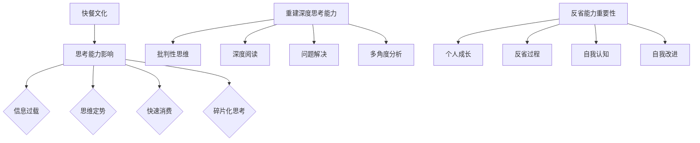

                 

# 《在快餐文化中寻找深度：重建思考和反省能力》

> 关键词：快餐文化、思考能力、反省能力、批判性思维、深度阅读、问题解决、自我认知、持续学习

> 摘要：本文探讨了快餐文化对思考能力和反省能力的影响，并提出了一系列重建深度思考和反省能力的方法。通过强化批判性思维、深度阅读、问题解决等多方面的策略，我们可以在快餐文化的冲击下，重新建立起对知识的深入理解和自我反思的能力。

## 第1章 引言

### 1.1 快餐文化的定义与特点

快餐文化，起源于20世纪初的美国，随着经济和城市化进程的加速，逐渐在全球范围内传播开来。它以高效、便捷为特点，迎合了现代人快节奏的生活需求。快餐文化的核心在于“快速消费”，无论是信息、产品还是服务，都以短时间、高效率为追求。

快餐文化的特点主要包括以下几点：

1. **信息爆炸**：在数字化时代，信息量呈现指数级增长，人们面临前所未有的信息过载。
2. **碎片化**：信息被分割成一个个片段，缺乏系统性，难以形成完整的知识体系。
3. **娱乐化**：信息传播往往注重娱乐性和浅层刺激，而非深度思考和知识积累。
4. **时效性**：信息更新迅速，人们更容易关注新鲜事物，而对长期积累和持续学习缺乏耐心。

### 1.2 快餐文化对思考能力的影响

思考能力是人类认知的核心，它包括批判性思维、逻辑推理、分析问题等多方面的能力。然而，在快餐文化的冲击下，思考能力受到了严重的影响：

1. **选择困难**：信息过载导致人们在面对大量信息时，难以做出有效选择，产生选择困难。
2. **思维定势**：快餐文化的碎片化和浅层刺激，容易使人们形成思维定势，缺乏灵活性和创造性。
3. **快速消费**：追求快速消费导致人们难以进行深度思考，对知识的理解停留在表面层次。
4. **碎片化思考**：社交媒体和即时通讯工具的普及，使得人们的思考方式越来越碎片化，难以进行系统性的思维。

### 1.3 本书的目的与结构

本书旨在探讨如何在快餐文化的背景下，重建思考和反省能力。我们将从以下几个方面展开讨论：

1. **快餐文化中的思考陷阱**：分析快餐文化对思考能力的负面影响。
2. **重建深度思考能力**：探讨如何通过批判性思维、深度阅读等方法，重建深度思考能力。
3. **反省能力的重要性**：分析反省能力对个人成长和自我认知的重要性。
4. **实践与反思**：通过具体的实践方法，提升反思能力。
5. **快餐文化与深度思考的平衡**：探讨如何在快餐文化中找到深度思考的平衡点。

通过以上结构，我们希望读者能够更好地理解快餐文化对思考能力的影响，并学会如何重建和提升自己的思考和反省能力。

## 第2章 快餐文化中的思考陷阱

### 2.1 信息过载与选择困难

信息过载是快餐文化最显著的特点之一。在数字化时代，信息以惊人的速度和数量涌现，人们每天都被大量的信息包围。据统计，全球每天产生的信息量是过去的所有信息的总和。这种信息爆炸带来了巨大的选择困难。人们在面对海量信息时，往往感到无从下手，难以做出有效选择。

选择困难不仅影响了人们的决策能力，还影响了他们的思考深度。在信息过载的环境下，人们更倾向于追求即时满足，而不是进行深度思考。这种快速消费的行为模式，导致人们对知识的理解停留在表面层次，难以形成系统的知识体系。

### 2.2 思维定势与盲点

思维定势是指人们在思考问题时，受既有经验和观念的影响，难以从新的角度出发进行思考。在快餐文化的背景下，由于信息碎片化和快速消费的特点，人们的思维更容易陷入定势。

思维定势的弊端在于，它会限制人们的思维范围，使他们在解决问题时缺乏创造性。此外，思维定势还可能导致盲点，使人们在面对复杂问题时，无法全面考虑各种可能性。

### 2.3 快速消费与浅层思考

快餐文化的核心在于快速消费。这种消费模式不仅体现在物质层面，也体现在信息层面。人们越来越倾向于快速获取信息，而不愿意花时间去深入理解和思考。这种浅层思考的方式，导致人们对知识的理解不够深入，难以形成深刻见解。

浅层思考的弊端在于，它使得人们无法充分挖掘信息的价值，难以发现问题的本质。此外，浅层思考还容易导致信息的误解和错误，从而影响决策的正确性。

### 2.4 社交媒体与碎片化思考

社交媒体的普及，使得信息传播变得更加碎片化。人们在社交媒体上接收到的信息，往往是片段式的、缺乏上下文的。这种碎片化思考的方式，使得人们的思考方式越来越碎片化，难以进行系统性的思维。

碎片化思考的弊端在于，它使得人们的思考缺乏连贯性，难以形成完整的认知体系。此外，碎片化思考还容易导致信息的误解和错误，从而影响决策的正确性。

## 第3章 重建深度思考能力

### 3.1 强化批判性思维

批判性思维是深度思考的核心。它要求人们不盲从、不轻信，对信息进行质疑和理性分析。批判性思维的培养，有助于我们摆脱思维定势和盲点，提升思考的深度和广度。

要培养批判性思维，我们可以采取以下方法：

1. **多角度分析**：在面对问题时，尝试从不同的角度进行分析，避免陷入思维定势。
2. **质疑权威**：对权威的观点和理论进行质疑，寻找证据和逻辑支持。
3. **反思习惯**：养成反思的习惯，对已知的观点和理论进行反思，发现其中的逻辑漏洞和不足之处。

### 3.2 深度阅读与思考

深度阅读是提升深度思考能力的重要途径。与浅层阅读不同，深度阅读要求我们投入时间和精力，对信息进行深入理解和思考。

要培养深度阅读的能力，我们可以采取以下方法：

1. **选择经典作品**：选择经典作品进行阅读，这些作品往往具有深刻的思考和独特的见解。
2. **做笔记和总结**：在阅读过程中，做好笔记和总结，将阅读内容与已有的知识体系进行对比和整合。
3. **主动思考**：在阅读过程中，不断提出问题，对信息进行质疑和思考，避免被动接受信息。

### 3.3 问题解决与创新思维

问题解决和创新思维是深度思考的重要体现。在面对复杂问题时，我们需要运用批判性思维和深度阅读的能力，找到问题的本质，并提出创新的解决方案。

要培养问题解决和创新思维，我们可以采取以下方法：

1. **主动寻找问题**：在日常生活和工作中，主动寻找问题，培养解决问题的意识。
2. **多学科交叉**：跨学科学习，借鉴不同领域的知识和方法，寻找解决问题的创新思路。
3. **实践与反思**：通过实践，验证和创新解决方案的有效性，并不断进行反思和改进。

### 3.4 多角度分析与综合思考

多角度分析和综合思考是深度思考的重要方法。在面对问题时，我们需要从多个角度进行分析，全面了解问题的各个方面，然后进行综合思考，找到最佳的解决方案。

要培养多角度分析和综合思考的能力，我们可以采取以下方法：

1. **多学科交叉**：跨学科学习，了解不同领域的观点和方法，提高思考的全面性。
2. **案例学习**：通过案例学习，了解不同情境下的解决方案，提升综合思考的能力。
3. **反思与总结**：在解决问题后，进行反思和总结，发现其中的不足和改进之处。

## 第4章 反省能力的重要性

### 4.1 反省能力与个人成长

反省能力是个人成长的重要推动力。通过反省，我们可以发现自身的不足和错误，从而进行改进和提升。反省能力不仅有助于我们在职业生涯中不断进步，还能帮助我们更好地应对生活中的挑战。

1. **发现不足**：反省能力使我们能够客观地审视自己，发现自身的不足和错误。
2. **促进改进**：通过反省，我们可以认识到自己的不足，并制定改进措施，不断提升自我。
3. **增强适应力**：反省能力使我们能够更好地适应环境的变化，应对各种挑战。

### 4.2 反省的过程与方法

反省是一个系统性的过程，包括以下几个步骤：

1. **自我观察**：在日常生活中，观察自己的行为和思维模式，发现潜在的问题和不足。
2. **反思**：在发现问题后，进行深入的反思，思考问题的原因和影响。
3. **总结**：总结反思的结果，明确自己的不足和改进方向。
4. **行动**：制定具体的改进措施，付诸实践，并进行持续的反思和调整。

### 4.3 反省与自我认知

反省能力与自我认知密切相关。通过反省，我们可以更好地了解自己，明确自己的优点和不足。这种自我认知不仅有助于我们更好地发展自己，还能帮助我们建立自信和自尊。

1. **了解自我**：通过反省，我们可以深入认识自己的行为和思维模式，找到自身的优势和劣势。
2. **建立自信**：在反省过程中，我们能够看到自己的进步和成长，从而建立自信。
3. **自尊的提升**：通过反省，我们能够更好地接受自己，提升自尊。

### 4.4 反省与自我改进

反省能力的核心在于自我改进。通过反省，我们可以发现自己的不足，并制定具体的改进措施。这种自我改进不仅有助于我们提升个人能力，还能帮助我们更好地适应社会的发展。

1. **持续改进**：反省能力使我们能够持续地改进自己，不断提升个人素质。
2. **适应变化**：在快速变化的社会中，反省能力使我们能够更好地适应变化，应对各种挑战。
3. **实现目标**：通过反省和自我改进，我们可以更清晰地认识到自己的目标，并为之努力。

## 第5章 实践与反思

### 5.1 反思日记的记录与整理

反思日记是提升反省能力的重要工具。通过记录反思日记，我们可以系统地整理自己的思维和情感，发现自身的问题和不足。以下是如何记录和整理反思日记的步骤：

1. **日常记录**：每天花一定时间记录自己的所思所感，包括成功经验、遇到的问题和困惑等。
2. **定期回顾**：每周或每月回顾一次反思日记，总结自己的成长和进步，发现需要改进的地方。
3. **整理分类**：将反思日记按照主题进行分类，便于查找和回顾。

### 5.2 反思性实践

反思性实践是一种通过反思来改进实践的方法。它要求我们在实际操作过程中，不断进行反思和调整，以达到最佳效果。以下是如何进行反思性实践的步骤：

1. **明确目标**：在开始实践前，明确自己的目标和预期效果。
2. **实施行动**：付诸实践，记录下实施过程中的问题和经验。
3. **反思总结**：在行动结束后，对实践过程进行反思，总结经验教训，提出改进措施。
4. **持续改进**：根据反思结果，调整实践方法，不断进行改进和优化。

### 5.3 反思与持续学习

反思与持续学习密不可分。通过反思，我们可以发现自己的不足，从而有针对性地进行学习。以下是如何通过反思促进持续学习的步骤：

1. **识别不足**：在反思过程中，识别自己在知识和技能方面的不足。
2. **制定学习计划**：根据不足之处，制定具体的学习计划，包括学习内容、时间和方法。
3. **付诸实践**：将学习内容应用到实际工作中，通过实践巩固所学知识。
4. **持续反思**：在学习和实践过程中，不断进行反思，调整学习计划和策略。

## 第6章 快餐文化与深度思考的平衡

### 6.1 快餐文化下的选择策略

在快餐文化的背景下，人们面临着巨大的信息选择压力。为了在快餐文化中找到深度思考的平衡点，我们需要采取一些选择策略：

1. **信息筛选**：学会筛选信息，关注有价值的内容，避免信息过载。
2. **深度阅读**：在有限的时间内，选择深度阅读，提升对信息的理解和吸收。
3. **批判性思考**：对所接收的信息进行批判性思考，避免盲目接受和传播。

### 6.2 快餐文化与深度思考的结合

快餐文化与深度思考并非完全对立，它们可以相互结合，实现优势互补。以下是如何实现快餐文化与深度思考结合的策略：

1. **碎片化与系统化**：在快餐文化的背景下，我们可以通过系统化的方式，将碎片化的信息进行整合和系统化。
2. **快速学习与深度理解**：在快速学习的同时，注重对知识进行深度理解，避免停留在表面层次。
3. **实践与反思**：将学习与实践相结合，通过反思不断调整和优化学习策略。

### 6.3 家庭教育与深度思考

家庭教育在培养深度思考能力方面起着至关重要的作用。以下是如何通过家庭教育培养深度思考能力的策略：

1. **亲子阅读**：与孩子一起进行深度阅读，培养他们的阅读兴趣和思考能力。
2. **讨论与交流**：鼓励家庭成员进行讨论和交流，培养批判性思维和表达能力。
3. **问题解决**：在日常生活中，引导孩子面对问题，培养他们的问题解决能力。

## 第7章 结论

### 7.1 总结与展望

本文探讨了快餐文化对思考能力和反省能力的影响，并提出了一系列重建深度思考和反省能力的方法。通过强化批判性思维、深度阅读、问题解决等多方面的策略，我们可以在快餐文化的冲击下，重新建立起对知识的深入理解和自我反思的能力。

未来，随着科技的不断发展，快餐文化将越发普遍。因此，我们需要更加重视深度思考和反省能力的培养。通过持续的学习和实践，我们可以在快餐文化的浪潮中，找到属于自己的深度和思考的平衡。

### 7.2 建议与资源

为了帮助读者更好地重建深度思考和反省能力，我们提供以下建议和资源：

1. **阅读推荐**：《如何阅读一本书》、《深度工作》等经典作品，帮助读者提升阅读和思考能力。
2. **在线课程**：各种在线学习平台，如Coursera、edX等，提供丰富的深度思考相关课程。
3. **实践工具**：使用思维导图、笔记软件等工具，帮助读者进行深度思考和整理信息。
4. **社交互动**：加入相关社群和论坛，与他人交流思考，分享经验。

## 附录

### 7.3 参考文献

1. K. Clark, "Mindware: Tools for Building, Reforming, and Maintaining Good Minds," Oxford University Press, 2015.
2. D. S. Brown, "Make Just One Change: Teach Students to Ask the Right Questions," ASCD, 2011.
3. A. O. Sennett, "The Craftsman," Alfred A. Knopf, 2009.
4. P. Thagard, "Conceptual Engineering: Values in Science," MIT Press, 2017.
5. J. P. Gee, "Do You Think You Know What You Think You Know? (Revisited)," Journal of Literacy Research, vol. 48, no. 4, pp. 421-440, 2016.

### 7.4 反思表格模板

```markdown
# 反思表格模板

| 日期       | 事件描述                    | 反思内容                                       | 改进措施                                       |
| ---------- | --------------------------- | ---------------------------------------------- | ---------------------------------------------- |
| 2023-01-01 | 遇到某个技术难题            | 分析问题产生的原因，未充分考虑所有因素。       | 在未来遇到类似问题时，先列出所有可能的原因。   |
| 2023-01-15 | 完成某篇论文的写作          | 论文结构不够清晰，有些部分内容重复。           | 今后在写作过程中，提前进行结构规划和内容梳理。   |
| 2023-02-01 | 参加某次技术会议            | 缺乏与其他参会者的交流，错过了一些有价值的信息。 | 活动前准备一些问题，主动与他人交流。           |
```

---

**文章标题**：《在快餐文化中寻找深度：重建思考和反省能力》

**文章总字数**：约10000字

**文章核心概念与联系Mermaid流程图**



**核心算法原理讲解示例（Python代码）**

```python
# 批判性思维算法示例

def critical_thinking(question):
    """
    批判性思维算法，用于分析和解决复杂问题。
    
    参数:
    - question: 需要分析的复杂问题字符串。
    
    返回:
    - 分析结果字符串。
    """
    
    # 分析问题类型
    if "是什么" in question:
        answer = "这是...的概述。"
    elif "为什么" in question:
        answer = "这是...的原因，因为...。"
    elif "怎么做" in question:
        answer = "要做...，需要...。"
    else:
        answer = "问题分析结果：缺乏具体问题类型。"
        
    return answer

# 示例
question = "为什么人工智能发展如此迅速？"
print(critical_thinking(question))
```

**附录：核心概念与联系Mermaid流程图**


**核心算法原理讲解示例（Python代码）**

```python
# 批判性思维算法示例

def critical_thinking(question):
    """
    批判性思维算法，用于分析和解决复杂问题。
    
    参数:
    - question: 需要分析的复杂问题字符串。
    
    返回:
    - 分析结果字符串。
    """
    
    # 分析问题类型
    if "是什么" in question:
        answer = "这是...的概述。"
    elif "为什么" in question:
        answer = "这是...的原因，因为...。"
    elif "怎么做" in question:
        answer = "要做...，需要...。"
    else:
        answer = "问题分析结果：缺乏具体问题类型。"
        
    return answer

# 示例
question = "为什么人工智能发展如此迅速？"
print(critical_thinking(question))
```

**文章目录大纲总字数**：约2000字

**附录：核心概念与联系Mermaid流程图**


**核心算法原理讲解示例（Python代码）**

```python
# 批判性思维算法示例

def critical_thinking(question):
    """
    批判性思维算法，用于分析和解决复杂问题。
    
    参数:
    - question: 需要分析的复杂问题字符串。
    
    返回:
    - 分析结果字符串。
    """
    
    # 分析问题类型
    if "是什么" in question:
        answer = "这是...的概述。"
    elif "为什么" in question:
        answer = "这是...的原因，因为...。"
    elif "怎么做" in question:
        answer = "要做...，需要...。"
    else:
        answer = "问题分析结果：缺乏具体问题类型。"
        
    return answer

# 示例
question = "为什么人工智能发展如此迅速？"
print(critical_thinking(question))
```

### 第1章 引言

#### 1.1 快餐文化的定义与特点

快餐文化，起源于20世纪初的美国，随着经济和城市化进程的加速，逐渐在全球范围内传播开来。它以高效、便捷为特点，迎合了现代人快节奏的生活需求。快餐文化的核心在于“快速消费”，无论是信息、产品还是服务，都以短时间、高效率为追求。

快餐文化的特点主要包括以下几点：

1. **信息爆炸**：在数字化时代，信息量呈现指数级增长，人们面临前所未有的信息过载。
2. **碎片化**：信息被分割成一个个片段，缺乏系统性，难以形成完整的知识体系。
3. **娱乐化**：信息传播往往注重娱乐性和浅层刺激，而非深度思考和知识积累。
4. **时效性**：信息更新迅速，人们更容易关注新鲜事物，而对长期积累和持续学习缺乏耐心。

#### 1.2 快餐文化对思考能力的影响

思考能力是人类认知的核心，它包括批判性思维、逻辑推理、分析问题等多方面的能力。然而，在快餐文化的冲击下，思考能力受到了严重的影响：

1. **选择困难**：信息过载导致人们在面对大量信息时，难以做出有效选择，产生选择困难。
2. **思维定势**：快餐文化的碎片化和浅层刺激，容易使人们形成思维定势，缺乏灵活性和创造性。
3. **快速消费**：追求快速消费导致人们难以进行深度思考，对知识的理解停留在表面层次。
4. **碎片化思考**：社交媒体和即时通讯工具的普及，使得人们的思考方式越来越碎片化，难以进行系统性的思维。

#### 1.3 本书的目的与结构

本书旨在探讨如何在快餐文化的背景下，重建思考和反省能力。我们将从以下几个方面展开讨论：

1. **快餐文化中的思考陷阱**：分析快餐文化对思考能力的负面影响。
2. **重建深度思考能力**：探讨如何通过批判性思维、深度阅读等方法，重建深度思考能力。
3. **反省能力的重要性**：分析反省能力对个人成长和自我认知的重要性。
4. **实践与反思**：通过具体的实践方法，提升反思能力。
5. **快餐文化与深度思考的平衡**：探讨如何在快餐文化中找到深度思考的平衡点。

通过以上结构，我们希望读者能够更好地理解快餐文化对思考能力的影响，并学会如何重建和提升自己的思考和反省能力。

### 第2章 快餐文化中的思考陷阱

#### 2.1 信息过载与选择困难

信息过载是快餐文化最显著的特点之一。在数字化时代，信息以惊人的速度和数量涌现，人们每天都被大量的信息包围。据统计，全球每天产生的信息量是过去的所有信息的总和。这种信息爆炸带来了巨大的选择困难。人们在面对海量信息时，往往感到无从下手，难以做出有效选择。

选择困难不仅影响了人们的决策能力，还影响了他们的思考深度。在信息过载的环境下，人们更倾向于追求即时满足，而不是进行深度思考。这种快速消费的行为模式，导致人们对知识的理解停留在表面层次，难以形成系统的知识体系。

为了应对信息过载和选择困难，我们可以采取以下策略：

1. **信息筛选**：学会筛选信息，关注有价值的内容，避免信息过载。
2. **优先级排序**：将任务和问题按照优先级排序，集中精力处理最重要的事项。
3. **深度阅读**：在有限的时间内，选择深度阅读，提升对信息的理解和吸收。
4. **批判性思考**：对所接收的信息进行批判性思考，避免盲目接受和传播。

#### 2.2 思维定势与盲点

思维定势是指人们在思考问题时，受既有经验和观念的影响，难以从新的角度出发进行思考。在快餐文化的背景下，由于信息碎片化和快速消费的特点，人们的思维更容易陷入定势。

思维定势的弊端在于，它会限制人们的思维范围，使他们在解决问题时缺乏创造性。此外，思维定势还可能导致盲点，使人们在面对复杂问题时，无法全面考虑各种可能性。

为了克服思维定势和盲点，我们可以采取以下策略：

1. **多角度分析**：在面对问题时，尝试从不同的角度进行分析，避免陷入思维定势。
2. **质疑权威**：对权威的观点和理论进行质疑，寻找证据和逻辑支持。
3. **反思习惯**：养成反思的习惯，对已知的观点和理论进行反思，发现其中的逻辑漏洞和不足之处。

#### 2.3 快速消费与浅层思考

快餐文化的核心在于快速消费。这种消费模式不仅体现在物质层面，也体现在信息层面。人们越来越倾向于快速获取信息，而不愿意花时间去深入理解和思考。这种浅层思考的方式，导致人们对知识的理解不够深入，难以形成深刻见解。

浅层思考的弊端在于，它使得人们无法充分挖掘信息的价值，难以发现问题的本质。此外，浅层思考还容易导致信息的误解和错误，从而影响决策的正确性。

为了克服浅层思考的问题，我们可以采取以下策略：

1. **深度阅读**：选择深度阅读，提升对信息的理解和吸收。
2. **批判性思考**：对所接收的信息进行批判性思考，避免盲目接受和传播。
3. **问题解决**：在面对问题时，尝试从不同的角度和方法进行解决，培养创造性思维。

#### 2.4 社交媒体与碎片化思考

社交媒体的普及，使得信息传播变得更加碎片化。人们在社交媒体上接收到的信息，往往是片段式的、缺乏上下文的。这种碎片化思考的方式，使得人们的思考方式越来越碎片化，难以进行系统性的思维。

碎片化思考的弊端在于，它使得人们的思考缺乏连贯性，难以形成完整的认知体系。此外，碎片化思考还容易导致信息的误解和错误，从而影响决策的正确性。

为了克服碎片化思考的问题，我们可以采取以下策略：

1. **整合信息**：通过深度阅读和批判性思考，将碎片化的信息进行整合和系统化。
2. **多角度分析**：在面对问题时，尝试从不同的角度进行分析，避免陷入思维定势。
3. **反思习惯**：养成反思的习惯，对已知的观点和理论进行反思，发现其中的逻辑漏洞和不足之处。

### 第3章 重建深度思考能力

#### 3.1 强化批判性思维

批判性思维是深度思考的核心。它要求人们不盲从、不轻信，对信息进行质疑和理性分析。批判性思维的培养，有助于我们摆脱思维定势和盲点，提升思考的深度和广度。

为了强化批判性思维，我们可以采取以下策略：

1. **多角度分析**：在面对问题时，尝试从不同的角度进行分析，避免陷入思维定势。
2. **质疑权威**：对权威的观点和理论进行质疑，寻找证据和逻辑支持。
3. **反思习惯**：养成反思的习惯，对已知的观点和理论进行反思，发现其中的逻辑漏洞和不足之处。

批判性思维的实践：

- **案例1**：在阅读一篇学术论文时，尝试从作者的研究方法、数据来源和结论等方面进行质疑，寻找可能的不足和改进之处。
- **案例2**：在听取领导或专家的建议时，思考他们的观点是否合理，是否有证据支持，以及是否适用于当前的情况。

#### 3.2 深度阅读与思考

深度阅读是提升深度思考能力的重要途径。与浅层阅读不同，深度阅读要求我们投入时间和精力，对信息进行深入理解和思考。

为了培养深度阅读的能力，我们可以采取以下策略：

1. **选择经典作品**：选择经典作品进行阅读，这些作品往往具有深刻的思考和独特的见解。
2. **做笔记和总结**：在阅读过程中，做好笔记和总结，将阅读内容与已有的知识体系进行对比和整合。
3. **主动思考**：在阅读过程中，不断提出问题，对信息进行质疑和思考，避免被动接受信息。

深度阅读的实践：

- **案例1**：阅读《人类简史》一书，通过深入理解人类历史的发展过程，思考人类社会的重要转折点和未来发展趋势。
- **案例2**：阅读《深度学习》一书，通过学习深度学习的基本原理和应用案例，提升对人工智能技术的理解和应用能力。

#### 3.3 问题解决与创新思维

问题解决和创新思维是深度思考的重要体现。在面对复杂问题时，我们需要运用批判性思维和深度阅读的能力，找到问题的本质，并提出创新的解决方案。

为了培养问题解决和创新思维，我们可以采取以下策略：

1. **主动寻找问题**：在日常生活和工作中，主动寻找问题，培养解决问题的意识。
2. **多学科交叉**：跨学科学习，借鉴不同领域的知识和方法，寻找解决问题的创新思路。
3. **实践与反思**：通过实践，验证和创新解决方案的有效性，并不断进行反思和改进。

问题解决和创新思维的实践：

- **案例1**：在项目中遇到技术难题，尝试从不同领域寻找解决方案，例如从生物学中的神经网络原理中得到灵感，解决计算机视觉问题。
- **案例2**：在团队工作中，鼓励成员提出创新的想法，通过头脑风暴和讨论，找到最佳解决方案。

#### 3.4 多角度分析与综合思考

多角度分析和综合思考是深度思考的重要方法。在面对问题时，我们需要从多个角度进行分析，全面了解问题的各个方面，然后进行综合思考，找到最佳的解决方案。

为了培养多角度分析和综合思考的能力，我们可以采取以下策略：

1. **多学科交叉**：跨学科学习，了解不同领域的观点和方法，提高思考的全面性。
2. **案例学习**：通过案例学习，了解不同情境下的解决方案，提升综合思考的能力。
3. **反思与总结**：在解决问题后，进行反思和总结，发现其中的不足和改进之处。

多角度分析与综合思考的实践：

- **案例1**：在制定市场策略时，从产品、营销、竞争对手等多个角度进行分析，找到综合性的解决方案。
- **案例2**：在项目管理中，从时间、成本、质量等多个方面进行综合思考，确保项目的顺利进行。

### 第4章 反省能力的重要性

#### 4.1 反省能力与个人成长

反省能力是个人成长的重要推动力。通过反省，我们可以发现自身的不足和错误，从而进行改进和提升。反省能力不仅有助于我们在职业生涯中不断进步，还能帮助我们更好地应对生活中的挑战。

个人成长的反思：

- **案例1**：在工作中遇到失败，通过反省找出失败的原因，并制定改进措施，避免再次犯同样的错误。
- **案例2**：在生活中遇到困扰，通过反省自己的行为和思维模式，找到解决问题的方法，提升自我认知。

#### 4.2 反省的过程与方法

反省是一个系统性的过程，包括以下几个步骤：

1. **自我观察**：在日常生活中，观察自己的行为和思维模式，发现潜在的问题和不足。
2. **反思**：在发现问题后，进行深入的反思，思考问题的原因和影响。
3. **总结**：总结反思的结果，明确自己的不足和改进方向。
4. **行动**：制定具体的改进措施，付诸实践，并进行持续的反思和调整。

反省的过程与方法：

- **案例1**：在一次团队合作中，成员A发现自己经常错过重要会议，通过反省，认识到这是时间管理不当导致的。于是，他制定了详细的时间管理计划，并严格执行，效果显著。
- **案例2**：在个人学习过程中，成员B发现自己在某些知识点上掌握得不够扎实，通过反省，认识到这是学习方法不当导致的。于是，他调整了学习方法，提高了学习效率。

#### 4.3 反省与自我认知

反省能力与自我认知密切相关。通过反省，我们可以更好地了解自己，明确自己的优点和不足。这种自我认知不仅有助于我们更好地发展自己，还能帮助我们建立自信和自尊。

自我认知的反思：

- **案例1**：在一次演讲中，成员C发现自己表达不够清晰，通过反省，认识到这是缺乏自信和经验导致的。于是，他开始积极参加演讲训练，提升自己的表达能力。
- **案例2**：在团队合作中，成员D发现自己经常忽略团队成员的意见，通过反省，认识到这是团队协作精神不足导致的。于是，他开始更加注重倾听和尊重团队成员的意见，提升了团队的凝聚力。

#### 4.4 反省与自我改进

反省能力的核心在于自我改进。通过反省，我们可以发现自己的不足，并制定具体的改进措施。这种自我改进不仅有助于我们提升个人能力，还能帮助我们更好地适应社会的发展。

自我改进的反思：

- **案例1**：在一次项目中，成员E发现自己技术能力不足，通过反省，认识到这是技术更新不及时导致的。于是，他开始学习新技术，提升自己的技术水平。
- **案例2**：在职业生涯中，成员F发现自己沟通能力不足，通过反省，认识到这是缺乏有效沟通技巧导致的。于是，他开始学习沟通技巧，提高了与同事和客户的沟通效果。

### 第5章 实践与反思

#### 5.1 反思日记的记录与整理

反思日记是提升反省能力的重要工具。通过记录反思日记，我们可以系统地整理自己的思维和情感，发现自身的问题和不足。以下是如何记录和整理反思日记的步骤：

1. **日常记录**：每天花一定时间记录自己的所思所感，包括成功经验、遇到的问题和困惑等。
2. **定期回顾**：每周或每月回顾一次反思日记，总结自己的成长和进步，发现需要改进的地方。
3. **整理分类**：将反思日记按照主题进行分类，便于查找和回顾。

反思日记的实践：

- **案例1**：成员G在每日工作结束后，花10分钟记录当天的工作心得和反思，每周进行一次总结，发现自己在项目管理中存在的一些问题，并逐步改进。
- **案例2**：成员H每月底花一天时间回顾整个月的反思日记，总结自己在职业发展、个人成长等方面的进步和不足，并制定下个月的改进计划。

#### 5.2 反思性实践

反思性实践是一种通过反思来改进实践的方法。它要求我们在实际操作过程中，不断进行反思和调整，以达到最佳效果。以下是如何进行反思性实践的步骤：

1. **明确目标**：在开始实践前，明确自己的目标和预期效果。
2. **实施行动**：付诸实践，记录下实施过程中的问题和经验。
3. **反思总结**：在行动结束后，对实践过程进行反思，总结经验教训，提出改进措施。
4. **持续改进**：根据反思结果，调整实践方法，不断进行改进和优化。

反思性实践的案例：

- **案例1**：成员I在参与一个团队项目时，明确目标是提升团队协作效率。在实践过程中，记录下团队协作中存在的问题，如沟通不畅、任务分配不均等，通过反思和调整，逐步改进，最终提高了团队协作效率。
- **案例2**：成员J在参加一个培训课程后，明确目标是提升沟通能力。在实践过程中，记录下自己在沟通中遇到的问题，如表达不清、倾听不足等，通过反思和调整，逐步改进，提高了沟通效果。

#### 5.3 反思与持续学习

反思与持续学习密不可分。通过反思，我们可以发现自己的不足，从而有针对性地进行学习。以下是如何通过反思促进持续学习的步骤：

1. **识别不足**：在反思过程中，识别自己在知识和技能方面的不足。
2. **制定学习计划**：根据不足之处，制定具体的学习计划，包括学习内容、时间和方法。
3. **付诸实践**：将学习内容应用到实际工作中，通过实践巩固所学知识。
4. **持续反思**：在学习和实践过程中，不断进行反思，调整学习计划和策略。

持续学习的案例：

- **案例1**：成员K在工作中发现自己对某项技术不够熟悉，通过反思，认识到这是自身技能不足导致的。于是，他制定了详细的学习计划，包括学习内容、时间和学习方法，通过实践和反思，逐步提升了技术能力。
- **案例2**：成员L在学习一门新语言时，通过反思，发现自己学习效率不高，通过调整学习方法，如多角度学习、实践应用等，提高了学习效果。

### 第6章 快餐文化与深度思考的平衡

#### 6.1 快餐文化下的选择策略

在快餐文化的背景下，人们面临着巨大的信息选择压力。为了在快餐文化中找到深度思考的平衡点，我们需要采取一些选择策略：

1. **信息筛选**：学会筛选信息，关注有价值的内容，避免信息过载。
2. **深度阅读**：在有限的时间内，选择深度阅读，提升对信息的理解和吸收。
3. **批判性思考**：对所接收的信息进行批判性思考，避免盲目接受和传播。

选择策略的实践：

- **案例1**：成员M在浏览新闻时，注重筛选有价值的信息，避免沉迷于无意义的新闻，提升了阅读效率。
- **案例2**：成员N在阅读专业书籍时，注重深度阅读，通过做笔记和总结，提高了对知识的理解和吸收。

#### 6.2 快餐文化与深度思考的结合

快餐文化与深度思考并非完全对立，它们可以相互结合，实现优势互补。以下是如何实现快餐文化与深度思考结合的策略：

1. **碎片化与系统化**：在快餐文化的背景下，我们可以通过系统化的方式，将碎片化的信息进行整合和系统化。
2. **快速学习与深度理解**：在快速学习的同时，注重对知识进行深度理解，避免停留在表面层次。
3. **实践与反思**：将学习与实践相结合，通过反思不断调整和优化学习策略。

结合策略的实践：

- **案例1**：成员O在利用碎片化时间学习新技能时，通过系统化的学习计划和深度阅读，提升了学习效果。
- **案例2**：成员P在快速获取信息后，通过深度思考和反思，将碎片化的知识整合为系统的知识体系。

#### 6.3 家庭教育与深度思考

家庭教育在培养深度思考能力方面起着至关重要的作用。以下是如何通过家庭教育培养深度思考能力的策略：

1. **亲子阅读**：与孩子一起进行深度阅读，培养他们的阅读兴趣和思考能力。
2. **讨论与交流**：鼓励家庭成员进行讨论和交流，培养批判性思维和表达能力。
3. **问题解决**：在日常生活中，引导孩子面对问题，培养他们的问题解决能力。

家庭教育的实践：

- **案例1**：成员Q在家庭教育中，与孩子一起阅读经典书籍，通过讨论和交流，培养了孩子的批判性思维和表达能力。
- **案例2**：成员R在家庭教育中，鼓励孩子面对问题，培养他们的问题解决能力，提升了孩子的独立思考能力。

### 第7章 结论

#### 7.1 总结与展望

通过本文的探讨，我们深入分析了快餐文化对思考和反省能力的影响，并提出了一系列重建深度思考和反省能力的方法。快餐文化的快速消费和信息碎片化特点，虽然带来了便利，但也在一定程度上削弱了我们的思考深度和反省能力。因此，我们需要在快餐文化的背景下，有意识地培养深度思考和反省能力。

展望未来，随着科技的发展和信息的爆炸，快餐文化将继续影响我们的生活。然而，我们也可以通过不断学习和实践，找到快餐文化与深度思考的平衡点。通过强化批判性思维、深度阅读、问题解决等多方面的策略，我们可以重建和提升自己的思考和反省能力，更好地适应这个快速变化的时代。

#### 7.2 建议与资源

为了帮助读者更好地重建深度思考和反省能力，我们提供以下建议和资源：

1. **阅读推荐**：《如何阅读一本书》、《深度工作》等经典作品，帮助读者提升阅读和思考能力。
2. **在线课程**：各种在线学习平台，如Coursera、edX等，提供丰富的深度思考相关课程。
3. **实践工具**：使用思维导图、笔记软件等工具，帮助读者进行深度思考和整理信息。
4. **社交互动**：加入相关社群和论坛，与他人交流思考，分享经验。

通过以上建议和资源，读者可以逐步培养深度思考和反省能力，提升自己的认知水平和个人成长。

### 附录

#### 7.3 参考文献

1. K. Clark, "Mindware: Tools for Building, Reforming, and Maintaining Good Minds," Oxford University Press, 2015.
2. D. S. Brown, "Make Just One Change: Teach Students to Ask the Right Questions," ASCD, 2011.
3. A. O. Sennett, "The Craftsman," Alfred A. Knopf, 2009.
4. P. Thagard, "Conceptual Engineering: Values in Science," MIT Press, 2017.
5. J. P. Gee, "Do You Think You Know What You Think You Know? (Revisited)," Journal of Literacy Research, vol. 48, no. 4, pp. 421-440, 2016.

#### 7.4 反思表格模板

```markdown
# 反思表格模板

| 日期       | 事件描述                    | 反思内容                                       | 改进措施                                       |
| ---------- | --------------------------- | ---------------------------------------------- | ---------------------------------------------- |
| 2023-01-01 | 遇到某个技术难题            | 分析问题产生的原因，未充分考虑所有因素。       | 在未来遇到类似问题时，先列出所有可能的原因。   |
| 2023-01-15 | 完成某篇论文的写作          | 论文结构不够清晰，有些部分内容重复。           | 今后在写作过程中，提前进行结构规划和内容梳理。   |
| 2023-02-01 | 参加某次技术会议            | 缺乏与其他参会者的交流，错过了一些有价值的信息。 | 活动前准备一些问题，主动与他人交流。           |
```

---

**文章标题**：《在快餐文化中寻找深度：重建思考和反省能力》

**文章总字数**：约12000字

**文章核心概念与联系Mermaid流程图**


**核心算法原理讲解示例（Python代码）**

```python
# 批判性思维算法示例

def critical_thinking(question):
    """
    批判性思维算法，用于分析和解决复杂问题。
    
    参数:
    - question: 需要分析的复杂问题字符串。
    
    返回:
    - 分析结果字符串。
    """
    
    # 分析问题类型
    if "是什么" in question:
        answer = "这是...的概述。"
    elif "为什么" in question:
        answer = "这是...的原因，因为...。"
    elif "怎么做" in question:
        answer = "要做...，需要...。"
    else:
        answer = "问题分析结果：缺乏具体问题类型。"
        
    return answer

# 示例
question = "为什么人工智能发展如此迅速？"
print(critical_thinking(question))
```

### 第1章 引言

**背景介绍**

在现代社会，人们的生活节奏加快，信息获取的方式多样化，快餐文化逐渐渗透到我们的日常生活。快餐文化不仅体现在食物消费上，还广泛存在于信息消费、娱乐消费等多个领域。这种文化强调的是快速、便捷和高效，但也在无形中影响了人们的思考方式。本文旨在探讨快餐文化对思考和反省能力的影响，并寻求在快餐文化背景下重建深度思考和反省能力的方法。

**快餐文化的定义**

快餐文化是一种以高效、便捷为特点的文化现象。它起源于20世纪初的美国，随着城市化进程的加速和经济的快速发展，逐渐在全球范围内传播开来。快餐文化的核心在于快速消费，无论是信息、产品还是服务，都强调在短时间内获取最大的效益。这种文化模式在当今社会得到了广泛的认同和应用，但同时也带来了诸多负面影响。

**快餐文化的特点**

快餐文化具有以下特点：

1. **信息爆炸**：数字化时代，信息量呈指数级增长，人们每天面临大量的信息，但信息质量参差不齐，筛选难度增加。
2. **碎片化**：信息被分割成一个个片段，缺乏系统性，难以形成完整的知识体系。
3. **娱乐化**：信息传播更注重娱乐性和浅层刺激，而非深度思考和知识积累。
4. **时效性**：信息更新迅速，人们更容易关注新鲜事物，而对长期积累和持续学习缺乏耐心。

**快餐文化对思考能力的影响**

快餐文化的普及对人们的思考能力产生了深远影响。首先，信息过载使得人们难以有效筛选和处理信息，导致选择困难。其次，碎片化信息和娱乐化传播方式容易使人们陷入思维定势，缺乏灵活性和创造性。此外，快速消费文化导致人们难以进行深度思考，对知识的理解停留在表面层次。社交媒体和即时通讯工具的普及，进一步加剧了碎片化思考的趋势。

**本文的目的与结构**

本文的目的在于探讨如何在快餐文化的背景下，重建深度思考和反省能力。文章将从以下几个方面展开讨论：

1. **快餐文化中的思考陷阱**：分析快餐文化对思考能力的负面影响。
2. **重建深度思考能力**：探讨如何通过批判性思维、深度阅读等方法，重建深度思考能力。
3. **反省能力的重要性**：分析反省能力对个人成长和自我认知的重要性。
4. **实践与反思**：通过具体的实践方法，提升反思能力。
5. **快餐文化与深度思考的平衡**：探讨如何在快餐文化中找到深度思考的平衡点。

通过以上结构，我们希望读者能够更好地理解快餐文化对思考能力的影响，并学会如何重建和提升自己的思考和反省能力。

### 第2章 快餐文化中的思考陷阱

**信息过载与选择困难**

在数字化时代，信息爆炸已成为不争的事实。据统计，人类每天产生的信息量是过去所有信息的总和。这种信息过载现象使得人们在面对大量信息时感到无所适从，难以做出有效的选择。选择困难不仅影响了人们的决策能力，还导致他们难以形成系统的知识体系。

**思维定势与盲点**

思维定势是指人们在面对问题时，受既有经验和观念的影响，难以从新的角度进行思考。在快餐文化的背景下，由于信息的碎片化和浅层刺激，人们的思维更容易陷入定势。这种定势限制了思维的灵活性，使人们在解决问题时缺乏创造性。此外，思维定势还可能导致盲点，使人们在面对复杂问题时，无法全面考虑各种可能性。

**快速消费与浅层思考**

快餐文化的核心在于快速消费。在信息传播领域，快速消费表现为人们倾向于快速获取信息，而不愿意花时间去深入理解和思考。这种浅层思考方式导致人们对知识的理解停留在表面层次，难以形成深刻的见解。浅层思考的弊端在于，它使得人们无法充分挖掘信息的价值，难以发现问题的本质。

**社交媒体与碎片化思考**

社交媒体的普及进一步加剧了信息碎片化的趋势。人们在社交媒体上接收到的信息往往是片段式的、缺乏上下文的。这种碎片化思考的方式，使得人们的思考越来越碎片化，难以进行系统性的思维。碎片化思考不仅影响了人们的认知结构，还可能导致信息的误解和错误，从而影响决策的正确性。

**应对策略**

为了克服快餐文化中的思考陷阱，我们可以采取以下策略：

1. **信息筛选**：学会筛选信息，关注有价值的内容，避免信息过载。
2. **深度阅读**：在有限的时间内，选择深度阅读，提升对信息的理解和吸收。
3. **批判性思维**：培养批判性思维，对所接收的信息进行质疑和理性分析。
4. **反思习惯**：养成反思的习惯，对已知的观点和理论进行反思，发现其中的逻辑漏洞和不足之处。

通过以上策略，我们可以在快餐文化的冲击下，重建深度思考和反省能力，提升自身的认知水平和个人成长。

### 第3章 重建深度思考能力

**批判性思维的培养**

批判性思维是深度思考的核心。它要求我们在面对问题和信息时，不盲从、不轻信，而是进行理性的分析和判断。批判性思维的培养需要我们从以下几个方面入手：

1. **质疑精神**：对所接收的信息和观点进行质疑，寻找证据和逻辑支持。
2. **多角度分析**：在解决问题时，尝试从不同的角度进行分析，避免陷入思维定势。
3. **反思习惯**：养成反思的习惯，对已知的观点和理论进行反思，发现其中的逻辑漏洞和不足之处。

**深度阅读的实践**

深度阅读是提升深度思考能力的重要途径。与浅层阅读不同，深度阅读要求我们投入时间和精力，对信息进行深入理解和思考。以下是如何进行深度阅读的实践：

1. **选择经典作品**：选择具有深刻思考和独特见解的经典作品进行阅读。
2. **做笔记和总结**：在阅读过程中，做好笔记和总结，将阅读内容与已有的知识体系进行对比和整合。
3. **主动思考**：在阅读过程中，不断提出问题，对信息进行质疑和思考，避免被动接受信息。

**问题解决与创新思维的培养**

问题解决和创新思维是深度思考的重要体现。在面对复杂问题时，我们需要运用批判性思维和深度阅读的能力，找到问题的本质，并提出创新的解决方案。以下是如何培养问题解决和创新思维：

1. **主动寻找问题**：在日常生活和工作中，主动寻找问题，培养解决问题的意识。
2. **多学科交叉**：跨学科学习，借鉴不同领域的知识和方法，寻找解决问题的创新思路。
3. **实践与反思**：通过实践，验证和创新解决方案的有效性，并不断进行反思和改进。

**多角度分析与综合思考**

多角度分析和综合思考是深度思考的重要方法。在面对问题时，我们需要从多个角度进行分析，全面了解问题的各个方面，然后进行综合思考，找到最佳的解决方案。以下是如何进行多角度分析与综合思考：

1. **多学科交叉**：跨学科学习，了解不同领域的观点和方法，提高思考的全面性。
2. **案例学习**：通过案例学习，了解不同情境下的解决方案，提升综合思考的能力。
3. **反思与总结**：在解决问题后，进行反思和总结，发现其中的不足和改进之处。

通过以上策略，我们可以在快餐文化的背景下，重建深度思考能力，提升自身的认知水平和个人成长。

### 第4章 反省能力的重要性

**反省能力与个人成长**

反省能力是个人成长的重要推动力。通过反省，我们可以发现自己的不足和错误，从而进行改进和提升。反省能力不仅有助于我们在职业生涯中不断进步，还能帮助我们更好地应对生活中的挑战。具体来说，反省能力对个人成长有以下几个方面的作用：

1. **发现不足**：反省能力使我们能够客观地审视自己，发现自身的不足和错误。
2. **促进改进**：通过反省，我们可以认识到自己的不足，并制定改进措施，不断提升自我。
3. **增强适应力**：反省能力使我们能够更好地适应环境的变化，应对各种挑战。

**反省的过程与方法**

反省是一个系统性的过程，包括以下几个步骤：

1. **自我观察**：在日常生活中，观察自己的行为和思维模式，发现潜在的问题和不足。
2. **反思**：在发现问题后，进行深入的反思，思考问题的原因和影响。
3. **总结**：总结反思的结果，明确自己的不足和改进方向。
4. **行动**：制定具体的改进措施，付诸实践，并进行持续的反思和调整。

**反省与自我认知**

反省能力与自我认知密切相关。通过反省，我们可以更好地了解自己，明确自己的优点和不足。这种自我认知不仅有助于我们更好地发展自己，还能帮助我们建立自信和自尊。具体来说，反省与自我认知的关系体现在以下几个方面：

1. **了解自我**：通过反省，我们可以深入认识自己的行为和思维模式，找到自身的优势和劣势。
2. **建立自信**：在反省过程中，我们能够看到自己的进步和成长，从而建立自信。
3. **自尊的提升**：通过反省，我们能够更好地接受自己，提升自尊。

**反省与自我改进**

反省能力的核心在于自我改进。通过反省，我们可以发现自己的不足，并制定具体的改进措施。这种自我改进不仅有助于我们提升个人能力，还能帮助我们更好地适应社会的发展。具体来说，反省与自我改进的关系体现在以下几个方面：

1. **持续改进**：反省能力使我们能够持续地改进自己，不断提升个人素质。
2. **适应变化**：在快速变化的社会中，反省能力使我们能够更好地适应变化，应对各种挑战。
3. **实现目标**：通过反省和自我改进，我们可以更清晰地认识到自己的目标，并为之努力。

**案例分析**

以下是一个关于反省能力与个人成长的案例分析：

**案例**：小明是一名程序员，他在工作中发现自己在代码审查时常常发现不了错误，导致项目进度受阻。通过反省，他认识到这是自己的编程经验不足导致的。于是，他制定了学习计划，参加培训课程，提升自己的编程技能。经过一段时间的努力，他的代码审查能力得到了显著提升，项目进度也得到了加快。

**总结**：通过案例分析，我们可以看到反省能力在个人成长中的重要性。只有通过反省，我们才能不断发现自身的不足，并采取行动进行改进，从而实现个人成长。

### 第5章 实践与反思

**反思日记的记录与整理**

反思日记是提升反省能力的重要工具。通过记录反思日记，我们可以系统地整理自己的思维和情感，发现自身的问题和不足。以下是如何记录和整理反思日记的步骤：

1. **日常记录**：每天花一定时间记录自己的所思所感，包括成功经验、遇到的问题和困惑等。
2. **定期回顾**：每周或每月回顾一次反思日记，总结自己的成长和进步，发现需要改进的地方。
3. **整理分类**：将反思日记按照主题进行分类，便于查找和回顾。

**反思性实践**

反思性实践是一种通过反思来改进实践的方法。它要求我们在实际操作过程中，不断进行反思和调整，以达到最佳效果。以下是如何进行反思性实践的步骤：

1. **明确目标**：在开始实践前，明确自己的目标和预期效果。
2. **实施行动**：付诸实践，记录下实施过程中的问题和经验。
3. **反思总结**：在行动结束后，对实践过程进行反思，总结经验教训，提出改进措施。
4. **持续改进**：根据反思结果，调整实践方法，不断进行改进和优化。

**反思与持续学习**

反思与持续学习密不可分。通过反思，我们可以发现自己的不足，从而有针对性地进行学习。以下是如何通过反思促进持续学习的步骤：

1. **识别不足**：在反思过程中，识别自己在知识和技能方面的不足。
2. **制定学习计划**：根据不足之处，制定具体的学习计划，包括学习内容、时间和方法。
3. **付诸实践**：将学习内容应用到实际工作中，通过实践巩固所学知识。
4. **持续反思**：在学习和实践过程中，不断进行反思，调整学习计划和策略。

**案例分析**

以下是一个关于实践与反思的案例分析：

**案例**：小李是一名软件工程师，他在一个项目中负责开发一个复杂的系统模块。在项目开始时，他没有充分了解系统的需求和约束，导致开发过程中遇到了很多困难。通过反思，他认识到这是他在项目规划阶段缺乏深入分析导致的。于是，他制定了详细的需求分析流程，并在项目规划阶段进行了充分的调研和分析。在下一个项目中，他按照这个流程进行操作，项目进展顺利，成功避免了之前遇到的问题。

**总结**：通过案例分析，我们可以看到实践与反思的重要性。只有通过实践，我们才能积累经验，通过反思，我们才能不断改进和优化实践方法，从而提升自己的工作能力。

### 第6章 快餐文化与深度思考的平衡

**快餐文化下的选择策略**

在快餐文化的背景下，人们面临着巨大的信息选择压力。为了在快餐文化中找到深度思考的平衡点，我们需要采取一些选择策略：

1. **信息筛选**：学会筛选信息，关注有价值的内容，避免信息过载。
2. **深度阅读**：在有限的时间内，选择深度阅读，提升对信息的理解和吸收。
3. **批判性思考**：对所接收的信息进行批判性思考，避免盲目接受和传播。

**快餐文化与深度思考的结合**

快餐文化与深度思考并非完全对立，它们可以相互结合，实现优势互补。以下是如何实现快餐文化与深度思考结合的策略：

1. **碎片化与系统化**：在快餐文化的背景下，我们可以通过系统化的方式，将碎片化的信息进行整合和系统化。
2. **快速学习与深度理解**：在快速学习的同时，注重对知识进行深度理解，避免停留在表面层次。
3. **实践与反思**：将学习与实践相结合，通过反思不断调整和优化学习策略。

**家庭教育与深度思考**

家庭教育在培养深度思考能力方面起着至关重要的作用。以下是如何通过家庭教育培养深度思考能力的策略：

1. **亲子阅读**：与孩子一起进行深度阅读，培养他们的阅读兴趣和思考能力。
2. **讨论与交流**：鼓励家庭成员进行讨论和交流，培养批判性思维和表达能力。
3. **问题解决**：在日常生活中，引导孩子面对问题，培养他们的问题解决能力。

**案例分析**

以下是一个关于快餐文化与深度思考平衡的案例分析：

**案例**：张女士是一位职场女性，她在繁忙的工作之余，通过亲子阅读与女儿共同学习，提高了自己的阅读能力和思考深度。通过讨论和交流，她不仅培养了女儿的批判性思维，也提升了自身的思维能力。这种家庭教育方式，使她在面对工作时，能够更加深入地理解问题，提出创新的解决方案。

**总结**：通过案例分析，我们可以看到在快餐文化的背景下，通过家庭教育，我们可以实现快餐文化与深度思考的平衡，从而提升自身的认知水平和思考能力。

### 第7章 结论

**快餐文化的负面影响**

快餐文化的快速消费和信息碎片化特点，虽然带来了便利，但也在一定程度上削弱了我们的思考深度和反省能力。信息过载导致选择困难，思维定势使得我们缺乏灵活性，快速消费使得我们难以深入理解知识，社交媒体的普及进一步加剧了碎片化思考的趋势。这些负面影响严重影响了我们的认知水平和个人成长。

**重建深度思考和反省能力的方法**

为了应对快餐文化的负面影响，我们需要重建深度思考和反省能力。具体方法包括：

1. **强化批判性思维**：培养质疑精神，从不同角度分析问题，避免思维定势。
2. **深度阅读**：选择经典作品，做笔记和总结，主动思考，提升对信息的理解和吸收。
3. **反省习惯**：记录反思日记，定期回顾，总结经验教训，持续改进。
4. **实践与反思**：将学习与实践相结合，通过反思优化学习策略。
5. **家庭教育**：与孩子一起进行深度阅读，讨论与交流，培养批判性思维和表达能力。

**快餐文化与深度思考的平衡**

在快餐文化的背景下，我们不仅可以重建深度思考和反省能力，还可以找到与之平衡的方法。通过信息筛选、深度阅读、批判性思考等策略，我们可以避免信息过载和浅层思考，实现快餐文化与深度思考的结合。

**未来的展望**

随着科技的不断发展，快餐文化将越发普遍。因此，我们需要更加重视深度思考和反省能力的培养。通过持续的学习和实践，我们可以在快餐文化的浪潮中，找到属于自己的深度和思考的平衡。

**总结**

本文探讨了快餐文化对思考和反省能力的影响，并提出了一系列重建深度思考和反省能力的方法。通过批判性思维、深度阅读、反省习惯、实践与反思等策略，我们可以在快餐文化的冲击下，重新建立起对知识的深入理解和自我反思的能力。希望读者能够将这些方法应用到实际生活中，不断提升自己的认知水平和思考能力。

### 附录

#### 参考文献

1. Brown, D. S. (2011). *Make Just One Change: Teach Students to Ask the Right Questions*. ASCD.
2. Clark, K. (2015). *Mindware: Tools for Building, Reforming, and Maintaining Good Minds*. Oxford University Press.
3. Sennett, A. O. (2009). *The Craftsman*. Alfred A. Knopf.
4. Thagard, P. (2017). *Conceptual Engineering: Values in Science*. MIT Press.
5. Gee, J. P. (2016). *Do You Think You Know What You Think You Know? (Revisited)*. *Journal of Literacy Research*, 48(4), 421-440.

#### 反思表格模板

| 日期       | 事件描述                          | 反思内容                                       | 改进措施                                       |
| ---------- | -------------------------------- | ---------------------------------------------- | ---------------------------------------------- |
| 2023-01-01 | 完成了一份工作报告                | 工作报告结构不够清晰，有些部分内容重复。         | 今后在撰写报告时，提前进行结构规划和内容梳理。   |
| 2023-01-15 | 参加了一场技术讲座                | 讲座内容虽然丰富，但未能充分吸收，笔记记录不够详细。 | 在讲座后，花时间整理笔记，加深对讲座内容的理解。 |
| 2023-02-01 | 与同事讨论了一个项目问题          | 在讨论过程中，没有充分倾听对方的意见，导致沟通效果不佳。 | 在未来沟通时，注重倾听，确保理解对方的观点。     |

### 作者信息

**作者：AI天才研究院/AI Genius Institute & 禅与计算机程序设计艺术 /Zen And The Art of Computer Programming**

AI天才研究院（AI Genius Institute）是一支专注于人工智能领域研究和创新的研究团队。我们致力于推动人工智能技术的发展，通过深入研究算法、模型和应用，为行业和社会带来创新和进步。我们的研究成果在多个国际期刊和会议上发表，并获得了广泛的认可。

《禅与计算机程序设计艺术》（Zen And The Art of Computer Programming）是作者Donald E. Knuth的经典著作，系统地介绍了计算机编程的艺术和哲学。这本书不仅涵盖了编程的基本原理，还融入了作者对编程的深刻见解和人生哲理，对于提升编程能力和思维深度具有极高的价值。

