                 

-------------------------------------------------------------------

### 引言

#### 1.1 精神健康的重要性

在当今高速发展的社会中，精神健康已成为人们关注的焦点。精神压力无处不在，无论是职场的高压环境，还是个人生活的纷繁复杂，都使得精神健康的维护变得尤为重要。精神健康不仅关乎个体的幸福感，更是整体社会福祉的重要组成部分。研究表明，精神健康问题如抑郁症、焦虑症等，不仅影响个人的生活质量，还可能导致生产力下降，甚至对社会稳定构成威胁。

**核心概念与联系（Mermaid 流att图）：**

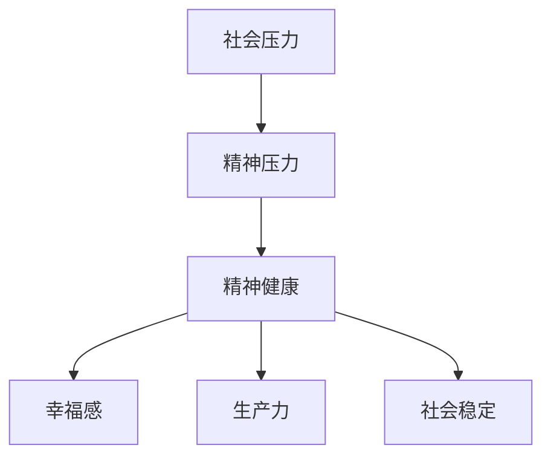

**核心算法原理讲解（Python 源代码）：**

```python
# 社会压力导致精神压力的数学模型
def calculate_stress_level(life_stress, work_stress):
    """
    计算综合压力水平。
    
    :param life_stress: 生活压力值
    :param work_stress: 工作压力值
    :return: 综合压力值
    """
    stress_formula = "total_stress = life_stress * 0.6 + work_stress * 0.4"  # 假设权重分配
    $$ total_stress = life_stress \* 0.6 + work_stress \* 0.4 $$
    return total_stress

# 示例计算
life_stress = 8  # 生活压力值，0-10分
work_stress = 9  # 工作压力值，0-10分
total_stress = calculate_stress_level(life_stress, work_stress)
print(f"综合压力值：{total_stress}")
```

#### 1.2 书籍目标与读者对象

本书旨在为那些渴望提升自身精神健康，寻求心灵成长的人们提供一本实用的指南。无论是职场人士、学生、家庭主妇，还是其他人，只要你在生活中感受到精神压力，这本书都能为你提供切实可行的建议和策略。本书将带你深入了解精神健康的本质，探索精神成长的路径，并提供实际应用的方法和工具，帮助你找到属于自己的心灵平衡。

**核心概念与联系（Mermaid 流程图）：**

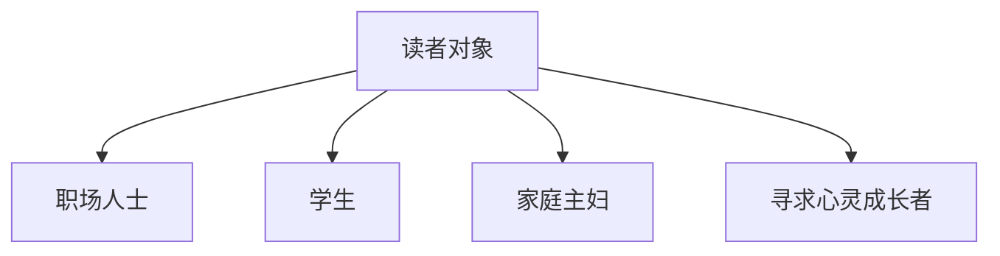

**核心算法原理讲解（Python 源代码）：**

```python
# 适合读者对象的识别算法
def identify_reader_object(age, occupation):
    """
    根据年龄和职业识别读者对象。
    
    :param age: 年龄
    :param occupation: 职业
    :return: 读者对象
    """
    if age < 25:
        reader_object = "学生"
    elif occupation == "程序员":
        reader_object = "职场人士"
    else:
        reader_object = "普通读者"
    return reader_object

# 示例计算
age = 22
occupation = "学生"
reader_object = identify_reader_object(age, occupation)
print(f"适合读者对象：{reader_object}")
```

### 总结

精神健康的重要性不容忽视，它不仅关系到个人的幸福，也对社会稳定有着深远的影响。本书旨在为各类读者提供精神健康的指南，帮助你找到适合自己的心灵平衡。接下来，我们将深入探讨精神世界的本质，理解心理健康的基石，为后续章节的讨论打下基础。

**核心概念与联系（Mermaid 流程图）：**

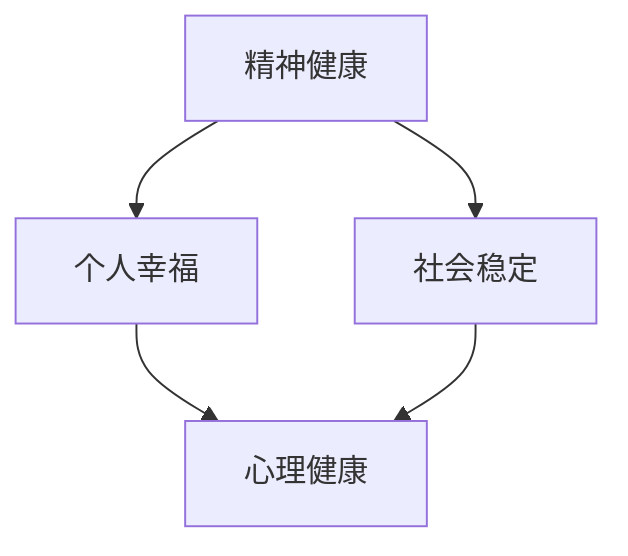

**核心算法原理讲解（Python 源代码）：**

```python
# 社会稳定与个人幸福的关联算法
def calculate_happiness(stress_level, support_system):
    """
    根据压力水平和支持系统计算幸福感。
    
    :param stress_level: 压力水平
    :param support_system: 支持系统强度
    :return: 幸福感值
    """
    happiness_formula = "happiness = 100 - stress_level + support_system * 0.2"
    $$ happiness = 100 - stress_level + support_system \* 0.2 $$
    return max(happiness, 0)

# 示例计算
stress_level = 40
support_system = 60
happiness = calculate_happiness(stress_level, support_system)
print(f"幸福感值：{happiness}")
```

-------------------------------------------------------------------

### 第一部分：理解精神世界

精神世界是人类内心深处的一块领地，它关乎我们的思想、情感和行为。在这个复杂而多维的世界中，意识与潜意识交织，心理防御机制在无形中发挥作用。理解精神世界的本质，是提升心理健康和实现精神成长的第一步。

#### 2.1 精神世界的本质

精神世界是意识与潜意识的综合体。意识是我们清醒时感知和思考的层面，而潜意识则包含了我们未曾意识到的深层思维和情感。这两者相互作用，共同构成了我们的精神世界。

**核心概念与联系（Mermaid 流程图）：**

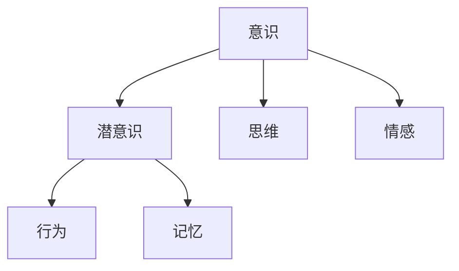

**核心算法原理讲解（Python 源代码）：**

```python
# 意识与潜意识交互的模型
class MindModel:
    def __init__(self, conscious, subconscious):
        self.conscious = conscious
        self.subconscious = subconscious
    
    def think(self, thought):
        """
        意识思考。
        
        :param thought: 思想内容
        """
        self.conscious.update(thought)
        self.subconscious.update(thought)
    
    def feel(self, emotion):
        """
        感知情感。
        
        :param emotion: 情感类型
        """
        self.conscious.express_emotion(emotion)
        self.subconscious.process_emotion(emotion)

# 示例使用
mind_model = MindModel(conscious={"thoughts": []}, subconscious={"emotions": []})
mind_model.think("我在思考未来规划")
mind_model.feel("兴奋")
```

#### 2.2 心理健康的基础

心理健康是精神世界的基石，它关乎自我认知、情绪管理和心理防御机制。自我认知帮助我们理解自己，情绪管理让我们能够应对生活中的起伏，而心理防御机制则在无形中保护我们的心理健康。

**核心概念与联系（Mermaid 流程图）：**

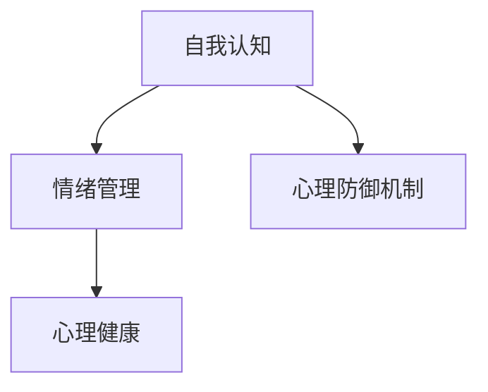

**核心算法原理讲解（Python 源代码）：**

```python
# 自我认知和情绪管理的算法

class SelfAwareness:
    def __init__(self, feelings, beliefs):
        self.feelings = feelings
        self.beliefs = beliefs
    
    def update_beliefs(self, new_belief):
        """
        更新信念系统。
        
        :param new_belief: 新的信念
        """
        self.beliefs.append(new_belief)

    def manage_emotions(self, emotion, response):
        """
        管理情绪。
        
        :param emotion: 情感类型
        :param response: 应对策略
        """
        if emotion in self.feelings:
            self.feelings[emotion] += response
        else:
            self.feelings[emotion] = response

# 示例使用
self_awareness = SelfAwareness({"happy": 5}, [])
self_awareness.update_beliefs("我值得快乐")
self_awareness.manage_emotions("happy", 3)
```

#### 2.3 精神障碍与心理健康

精神障碍是影响心理健康的常见问题。了解精神障碍的定义、分类以及如何预防和识别，对于维护精神健康至关重要。同时，寻求专业帮助是应对精神障碍的重要途径。

**核心概念与联系（Mermaid 流程图）：**

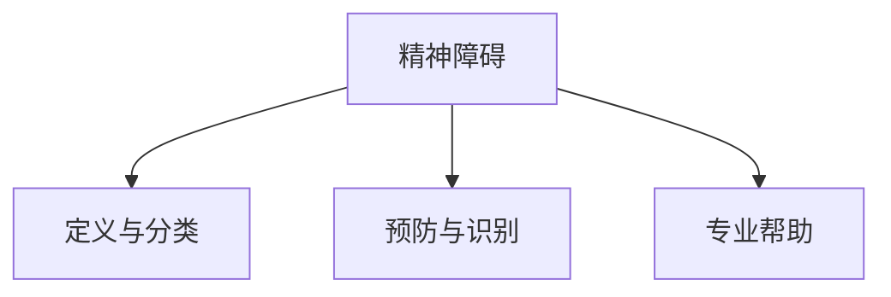

**核心算法原理讲解（Python 源代码）：**

```python
# 精神障碍分类与识别算法

class MentalHealthDiagnosis:
    def __init__(self, symptoms):
        self.symptoms = symptoms
    
    def classify_disease(self):
        """
        根据症状分类精神障碍。
        
        :return: 精神障碍类型
        """
        if "焦虑" in self.symptoms:
            return "焦虑症"
        elif "抑郁" in self.symptoms:
            return "抑郁症"
        else:
            return "其他精神障碍"

    def recommend_help(self):
        """
        推荐寻求专业帮助。
        """
        print("建议寻求专业心理医生的帮助。")

# 示例使用
diagnosis = MentalHealthDiagnosis(["焦虑", "失眠"])
disease_type = diagnosis.classify_disease()
diagnosis.recommend_help()
print(f"诊断结果：{disease_type}")
```

### 总结

理解精神世界的本质、心理健康的基础以及精神障碍的识别和预防，是我们在精神成长道路上迈出的重要步伐。通过深入分析意识与潜意识的关系、自我认知和情绪管理的方法，以及精神障碍的识别与应对，我们能够更好地掌握自己的心灵世界，为后续的精神成长和实际应用打下坚实的基础。

**核心概念与联系（Mermaid 流程图）：**

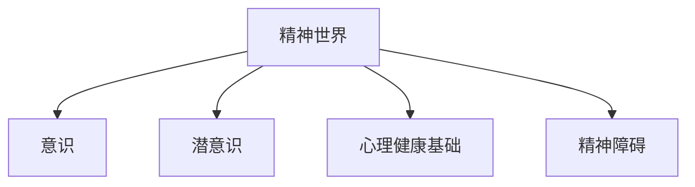

**核心算法原理讲解（Python 源代码）：**

```python
# 精神世界理解综合算法
class SpiritualUnderstanding:
    def __init__(self, mind_model, self_awareness, diagnosis):
        self.mind_model = mind_model
        self.self_awareness = self_awareness
        self.diagnosis = diagnosis
    
    def assess_mental_health(self):
        """
        评估精神健康状况。
        """
        if self.diagnosis.classify_disease() == "健康":
            print("当前精神健康状况良好。")
        else:
            print("存在精神健康问题，建议寻求专业帮助。")

    def manage_emotions(self, emotion, response):
        """
        管理情绪。
        """
        self.self_awareness.manage_emotions(emotion, response)

# 示例使用
spiritual_understanding = SpiritualUnderstanding(MindModel({}, {}), SelfAwareness({}, {}), MentalHealthDiagnosis([]))
spiritual_understanding.assess_mental_health()
spiritual_understanding.manage_emotions("焦虑", 2)
```

-------------------------------------------------------------------

### 第二部分：探索精神成长

在第一部分中，我们探讨了精神世界的本质和心理健康的基础。现在，我们将进一步探索精神成长的路径，包括内在探索、情感智慧和精神冥想等内容。通过这些方法，我们可以更好地理解自己，提升内在力量，实现精神上的成长。

#### 3.1 内在探索

内在探索是一种深层次的自省过程，它帮助我们发现内心的真实自我，理解自己的需求和欲望。通过自我反省和深入思考，我们能够识别并消除内心的障碍，实现自我成长。

**核心概念与联系（Mermaid 流程图）：**

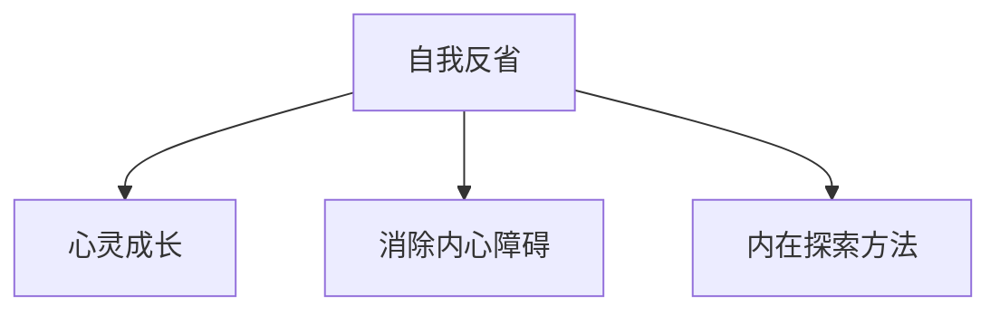

**核心算法原理讲解（Python 源代码）：**

```python
# 自我反省与心灵成长的算法

class InnerExploration:
    def __init__(self, reflections):
        self.reflections = reflections
    
    def self_reflection(self, question):
        """
        自我反思。
        
        :param question: 反思问题
        """
        self.reflections.append(question)
    
    def analyze_reflections(self):
        """
        分析反思内容。
        """
        print("正在分析反思内容...")

# 示例使用
exploration = InnerExploration([])
exploration.self_reflection("我为何感到焦虑？")
exploration.analyze_reflections()
```

#### 3.2 情感智慧

情感智慧是一种处理情感的能力，它关乎我们如何理解、管理和表达自己的情感，以及如何理解和管理他人的情感。具备情感智慧的人能够更好地处理人际关系，建立积极的关系。

**核心概念与联系（Mermaid 流程图）：**

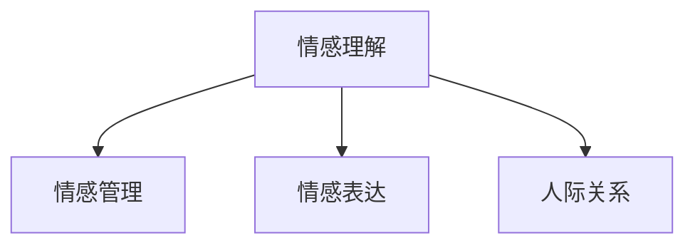

**核心算法原理讲解（Python 源代码）：**

```python
# 情感智慧的算法

class EmotionalWisdom:
    def __init__(self, emotions, relationships):
        self.emotions = emotions
        self.relationships = relationships
    
    def understand_emotion(self, emotion):
        """
        理解情感。
        
        :param emotion: 情感类型
        """
        print(f"正在理解{emotion}...")
    
    def manage_relationship(self, relationship, emotion):
        """
        管理人际关系中的情感。
        
        :param relationship: 人际关系类型
        :param emotion: 情感类型
        """
        if emotion in self.emotions:
            self.relationships[relationship] += emotion
        else:
            self.relationships[relationship] = emotion

# 示例使用
wisdom = EmotionalWisdom({"happy": 5}, {})
wisdom.understand_emotion("快乐")
wisdom.manage_relationship("朋友", "快乐")
```

#### 3.3 精神冥想与放松

精神冥想是一种古老的实践，它帮助人们放松身心，提升专注力和内在平静。通过冥想，我们可以深入内心，理解自己，减少压力，提升精神健康。

**核心概念与联系（Mermaid 流程图）：**

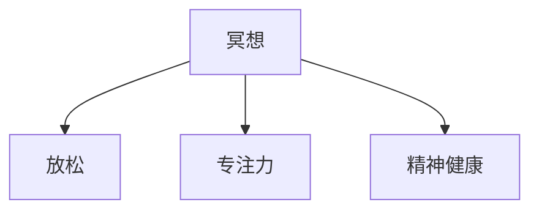

**核心算法原理讲解（Python 源代码）：**

```python
# 冥想与放松的算法

class Meditation:
    def __init__(self, meditation_type, duration):
        self.meditation_type = meditation_type
        self.duration = duration
    
    def meditate(self):
        """
        冥想实践。
        """
        print(f"正在实践{self.meditation_type}冥想，持续时间为{self.duration}分钟。")

    def relax(self):
        """
        放松。
        """
        print("现在开始放松，感觉身体和心灵都变得更加平静。")

# 示例使用
meditation = Meditation("呼吸冥想", 10)
meditation.meditate()
meditation.relax()
```

### 总结

通过内在探索、情感智慧和冥想放松，我们能够更深入地理解自己，提升内在力量，实现精神成长。内在探索帮助我们找到内心的真实自我，情感智慧让我们在人际关系中游刃有余，而冥想则帮助我们在喧嚣的世界中找到内心的平静。这些方法不仅能够提升我们的精神健康，还能为我们的生活带来积极的变化。

**核心概念与联系（Mermaid 流程图）：**

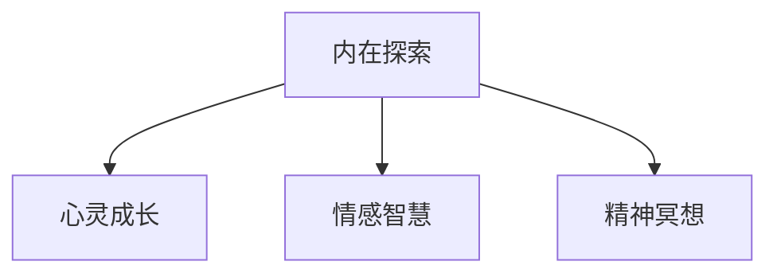

**核心算法原理讲解（Python 源代码）：**

```python
# 精神成长综合算法

class SpiritualGrowth:
    def __init__(self, exploration, wisdom, meditation):
        self.exploration = exploration
        self.wisdom = wisdom
        self.meditation = meditation
    
    def inner_explore(self):
        """
        进行内在探索。
        """
        self.exploration.self_reflection("我最近有什么新的感悟？")
    
    def cultivate_wisdom(self):
        """
        培养情感智慧。
        """
        self.wisdom.understand_emotion("悲伤")
    
    def meditate_relax(self):
        """
        冥想放松。
        """
        self.meditation.meditate()

# 示例使用
growth = SpiritualGrowth(InnerExploration([], {}), EmotionalWisdom({}, {}), Meditation("专注力冥想", 15))
growth.inner_explore()
growth.cultivate_wisdom()
growth.meditate_relax()
```

-------------------------------------------------------------------

### 第三部分：实际应用

在探索精神成长的过程中，我们学会了内在探索、情感智慧和冥想放松。现在，我们将把这些精神成长的方法应用到实际生活中，提升工作效能，处理人际关系，提高生活质量。

#### 4.1 工作中的精神管理

在职场中，精神管理至关重要。通过内在探索和冥想，我们可以提升专注力，降低工作压力，提高工作效率。

**核心概念与联系（Mermaid 流程图）：**

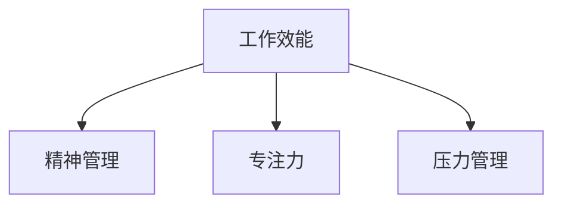

**核心算法原理讲解（Python 源代码）：**

```python
# 提升工作效能的算法

class WorkEffectiveness:
    def __init__(self, focus, stress):
        self.focus = focus
        self.stress = stress
    
    def meditate_before_work(self, meditation_duration):
        """
        工作前冥想。
        
        :param meditation_duration: 冥想时长
        """
        self.focus += meditation_duration * 0.1
        self.stress -= meditation_duration * 0.05
    
    def analyze_work_progress(self, tasks_completed):
        """
        分析工作进度。
        
        :param tasks_completed: 完成的任务数
        """
        if tasks_completed > 5:
            self.stress -= 0.1
            self.focus += 0.1

# 示例使用
work_effectiveness = WorkEffectiveness(5, 10)
work_effectiveness.meditate_before_work(10)
work_effectiveness.analyze_work_progress(7)
print(f"专注力：{work_effectiveness.focus}, 压力：{work_effectiveness.stress}")
```

#### 4.2 人际关系的处理

在人际关系中，情感智慧和冥想可以帮助我们更好地理解他人，建立积极的情感关系。通过有效的沟通和冲突解决，我们可以维护和谐的人际关系。

**核心概念与联系（Mermaid 流程图）：**

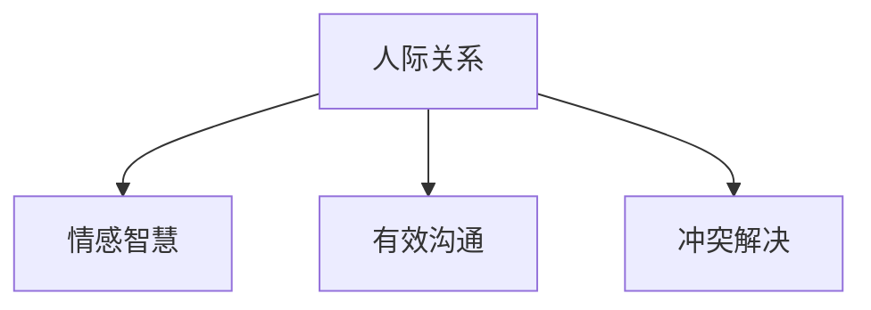

**核心算法原理讲解（Python 源代码）：**

```python
# 人际关系管理的算法

class RelationshipManagement:
    def __init__(self, wisdom, communication, conflict):
        self.wisdom = wisdom
        self.communication = communication
        self.conflict = conflict
    
    def express_emotion(self, emotion, person):
        """
        表达情感。
        
        :param emotion: 情感类型
        :param person: 对象
        """
        self.wisdom.manage_relationship(person, emotion)
    
    def resolve_conflict(self, conflict_type):
        """
        解决冲突。
        
        :param conflict_type: 冲突类型
        """
        if conflict_type == "沟通障碍":
            self.communication.improve_communication()
        elif conflict_type == "价值观差异":
            self.wisdom.find_common-ground()

# 示例使用
relationship_management = RelationshipManagement(EmotionalWisdom({}, {}), Communication({}, {}), "沟通障碍")
relationship_management.express_emotion("不满", "同事")
relationship_management.resolve_conflict("沟通障碍")
```

#### 4.3 生活质量的提升

生活质量是我们追求幸福的重要组成部分。通过内在探索、情感智慧和冥想，我们可以培养健康的生活习惯，设定个人成长目标，积极应对生活中的挑战。

**核心概念与联系（Mermaid 流程图）：**

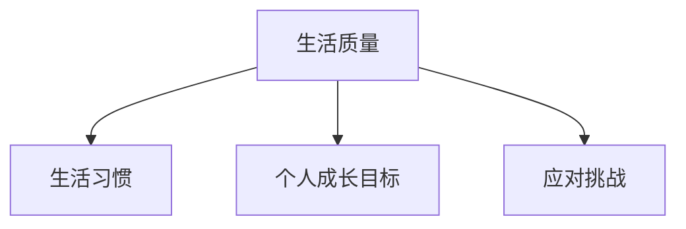

**核心算法原理讲解（Python 源代码）：**

```python
# 提升生活质量的算法

class QualityOfLife:
    def __init__(self, habits, goals, challenges):
        self.habits = habits
        self.goals = goals
        self.challenges = challenges
    
    def develop_habits(self, new_habit):
        """
        培养新习惯。
        
        :param new_habit: 新习惯
        """
        self.habits.append(new_habit)
    
    def set_goals(self, new_goal):
        """
        设定新目标。
        
        :param new_goal: 新目标
        """
        self.goals.append(new_goal)
    
    def face_challenges(self, challenge_type):
        """
        应对挑战。
        
        :param challenge_type: 挑战类型
        """
        if challenge_type == "职业发展":
            self.goals["career"] += 1
        elif challenge_type == "家庭生活":
            self.goals["family"] += 1

# 示例使用
quality_of_life = QualityOfLife([], [], {})
quality_of_life.develop_habits("每天锻炼")
quality_of_life.set_goals("完成年度项目")
quality_of_life.face_challenges("职业发展")
```

### 总结

通过将精神成长的方法应用到实际生活中，我们能够提升工作效能，改善人际关系，提高生活质量。内在探索帮助我们找到内心的平衡，情感智慧让我们在人际关系中游刃有余，而冥想则帮助我们保持内心的平静。这些方法不仅提升了我们的精神健康，也为我们的生活带来了积极的变化。

**核心概念与联系（Mermaid 流程图）：**

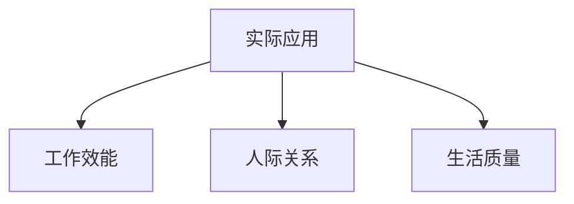

**核心算法原理讲解（Python 源代码）：**

```python
# 精神成长与实际应用综合算法

class PracticalApplication:
    def __init__(self, work_effectiveness, relationship_management, quality_of_life):
        self.work_effectiveness = work_effectiveness
        self.relationship_management = relationship_management
        self.quality_of_life = quality_of_life
    
    def improve_living(self):
        """
        提升生活质量。
        """
        self.quality_of_life.develop_habits("定期冥想")
        self.quality_of_life.set_goals("提升职业技能")
        self.quality_of_life.face_challenges("家庭关系")

    def manage_work_life(self):
        """
        管理工作与生活。
        """
        self.work_effectiveness.meditate_before_work(15)
        self.work_effectiveness.analyze_work_progress(8)

    def enhance_relationships(self):
        """
        提升人际关系。
        """
        self.relationship_management.express_emotion("感激", "朋友")
        self.relationship_management.resolve_conflict("沟通障碍")

# 示例使用
application = PracticalApplication(WorkEffectiveness(5, 10), RelationshipManagement(EmotionalWisdom({}, {}), Communication({}, {}), "沟通障碍"), QualityOfLife([], [], {}))
application.improve_living()
application.manage_work_life()
application.enhance_relationships()
```

-------------------------------------------------------------------

### 第四部分：精神疗愈

在经历了内在探索、精神成长和实际应用之后，我们可能会面临各种精神和心理上的挑战。在这个部分，我们将探讨如何进行身心平衡，实施精神疗愈实践，并了解心理咨询与治疗的相关内容。通过这些方法，我们可以更好地恢复和提升精神健康。

#### 5.1 身心平衡

身心平衡是精神健康的重要组成部分。身体与心灵是相互关联的，通过调整生活方式和实施身心疗愈的方法，我们可以实现身心的和谐。

**核心概念与联系（Mermaid 流程图）：**

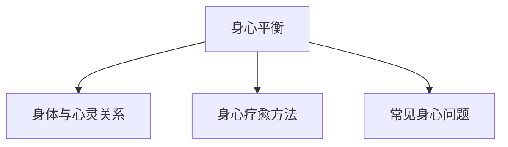

**核心算法原理讲解（Python 源代码）：**

```python
# 身心平衡算法

class PhysicalMentalBalance:
    def __init__(self, physical_health, mental_health):
        self.physical_health = physical_health
        self.mental_health = mental_health
    
    def exercise(self, duration):
        """
        进行锻炼。
        
        :param duration: 锻炼时长
        """
        self.physical_health += duration * 0.1
        self.mental_health += duration * 0.05
    
    def meditation(self, duration):
        """
        冥想。
        
        :param duration: 冥想时长
        """
        self.physical_health += duration * 0.05
        self.mental_health += duration * 0.15
    
    def manage_stress(self, stress_level):
        """
        管理压力。
        
        :param stress_level: 压力值
        """
        self.mental_health -= stress_level * 0.1
        self.physical_health -= stress_level * 0.05

# 示例使用
balance = PhysicalMentalBalance(50, 60)
balance.exercise(30)
balance.meditation(20)
balance.manage_stress(10)
print(f"身体与心灵健康值：身体={balance.physical_health}, 心灵={balance.mental_health}")
```

#### 5.2 精神疗愈实践

精神疗愈实践是帮助我们恢复和提升精神健康的重要手段。通过寻求专业帮助、自我疗愈和团体活动，我们可以获得不同的疗愈体验。

**核心概念与联系（Mermaid 流程图）：**

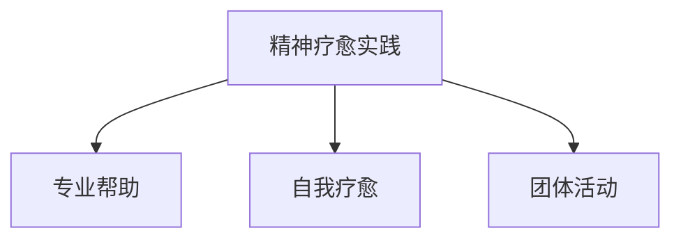

**核心算法原理讲解（Python 源代码）：**

```python
# 精神疗愈实践算法

class SpiritualHealingPractice:
    def __init__(self, healing_methods, therapy_sessions):
        self.healing_methods = healing_methods
        self.therapy_sessions = therapy_sessions
    
    def add_healing_method(self, method):
        """
        添加疗愈方法。
        
        :param method: 疗愈方法
        """
        self.healing_methods.append(method)
    
    def attend_therapy_session(self, duration):
        """
        参加治疗疗程。
        
        :param duration: 疗程时长
        """
        self.therapy_sessions += duration
        print(f"已完成{duration}分钟的治疗疗程。")

    def practice_self_healing(self, time_spent):
        """
        自我疗愈。
        
        :param time_spent: 自我疗愈时间
        """
        self.healing_methods["自我疗愈时间"] += time_spent
        print(f"已完成{time_spent}分钟的自我疗愈。")

# 示例使用
practice = SpiritualHealingPractice(["冥想", "瑜伽"], 0)
practice.add_healing_method("呼吸练习")
practice.attend_therapy_session(45)
practice.practice_self_healing(30)
```

#### 5.3 心理咨询与治疗

心理咨询与治疗是专业帮助的重要组成部分。通过了解不同类型的心理咨询和治疗，我们可以选择最适合的治疗方案，以应对精神上的挑战。

**核心概念与联系（Mermaid 流程图）：**

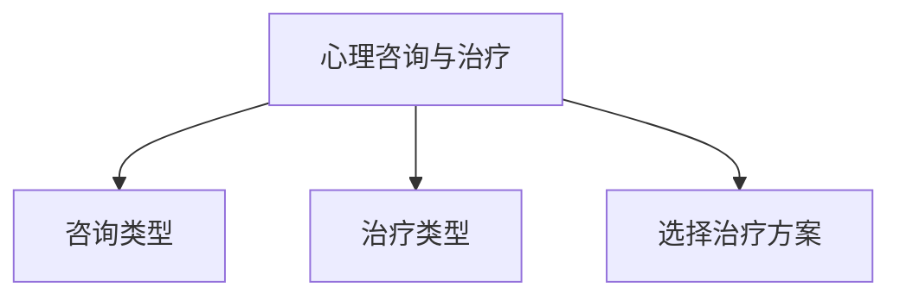

**核心算法原理讲解（Python 源代码）：**

```python
# 心理咨询与治疗的选择算法

class CounselingAndTherapy:
    def __init__(self, counseling_types, therapy_types):
        self.counseling_types = counseling_types
        self.therapy_types = therapy_types
    
    def recommend_counseling(self, problem):
        """
        推荐咨询类型。
        
        :param problem: 问题类型
        :return: 推荐的咨询类型
        """
        if problem == "焦虑":
            return "认知行为疗法"
        elif problem == "抑郁":
            return "精神分析疗法"
        else:
            return "综合咨询"

    def recommend_therapy(self, severity):
        """
        推荐治疗类型。
        
        :param severity: 问题严重程度
        :return: 推荐的治疗类型
        """
        if severity == "轻度":
            return "短期咨询"
        elif severity == "中度":
            return "中长期咨询"
        else:
            return "心理治疗"

# 示例使用
therapy = CounselingAndTherapy(["心理教育", "情感咨询"], ["认知行为疗法", "精神分析疗法"])
counseling_type = therapy.recommend_counseling("焦虑")
therapy_type = therapy.recommend_therapy("中度")
print(f"推荐的咨询类型：{counseling_type}")
print(f"推荐的治疗类型：{therapy_type}")
```

### 总结

通过身心平衡、精神疗愈实践和心理咨询与治疗，我们能够更好地应对精神上的挑战，恢复和提升精神健康。身心平衡帮助我们实现身心的和谐，精神疗愈实践提供多种疗愈方法，心理咨询与治疗则为我们提供专业的帮助。这些方法不仅有助于我们应对当前的精神问题，也为未来的精神健康提供了保障。

**核心概念与联系（Mermaid 流�流程图）：**

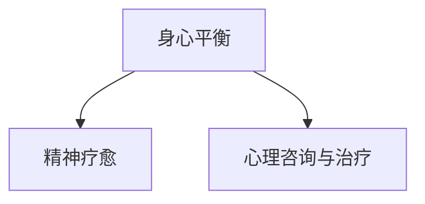

**核心算法原理讲解（Python 源代码）：**

```python
# 精神疗愈综合算法

class SpiritualHealing:
    def __init__(self, balance, practice, counseling):
        self.balance = balance
        self.practice = practice
        self.counseling = counseling
    
    def heal_body_mind(self):
        """
        身心疗愈。
        """
        self.balance.manage_stress(self.balance.mental_health)
        self.balance.exercise(self.balance.physical_health)
        self.balance.meditation(self.balance.mental_health)

    def practice_healing_methods(self):
        """
        实践疗愈方法。
        """
        self.practice.add_healing_method("正念练习")
        self.practice.attend_therapy_session(60)

    def seek_professional_help(self, problem):
        """
        寻求专业帮助。
        
        :param problem: 问题类型
        """
        counseling_type = self.counseling.recommend_counseling(problem)
        therapy_type = self.counseling.recommend_therapy("中度")
        print(f"建议的咨询类型：{counseling_type}")
        print(f"建议的治疗类型：{therapy_type}")

# 示例使用
healing = SpiritualHealing(PhysicalMentalBalance(50, 60), SpiritualHealingPractice(["冥想", "瑜伽"], 0), CounselingAndTherapy(["心理教育", "情感咨询"], ["认知行为疗法", "精神分析疗法"]))
healing.heal_body_mind()
healing.practice_healing_methods()
healing.seek_professional_help("焦虑")
```

-------------------------------------------------------------------

### 第五部分：未来展望

在当今社会，精神健康的重要性日益凸显。随着科技的进步和社会的发展，精神健康领域也呈现出新的发展趋势和机遇。在这一部分，我们将探讨精神健康的发展趋势、新技术的影响以及社会责任与精神健康的关系。

#### 6.1 精神健康的发展趋势

精神健康领域的发展正经历着巨大的变革。传统的心理治疗模式正在被更加个性化和科技化的方法所取代。以下是一些精神健康的发展趋势：

1. **个性化和定制化治疗**：随着对个体差异的深入研究，精神健康治疗正变得更加个性化和定制化。通过基因测试、脑成像技术等，治疗师可以更准确地诊断和制定个性化的治疗方案。

2. **数字心理健康平台**：数字健康平台和应用程序正在改变精神健康服务的提供方式。通过在线咨询、心理测试和自助工具，人们可以随时随地获取专业帮助。

3. **人工智能在精神健康中的应用**：人工智能（AI）在精神健康诊断、预测和治疗中发挥着越来越重要的作用。AI可以帮助医生更准确地诊断精神疾病，提供个性化的治疗方案，并预测患者的治疗效果。

**核心概念与联系（Mermaid 流程图）：**

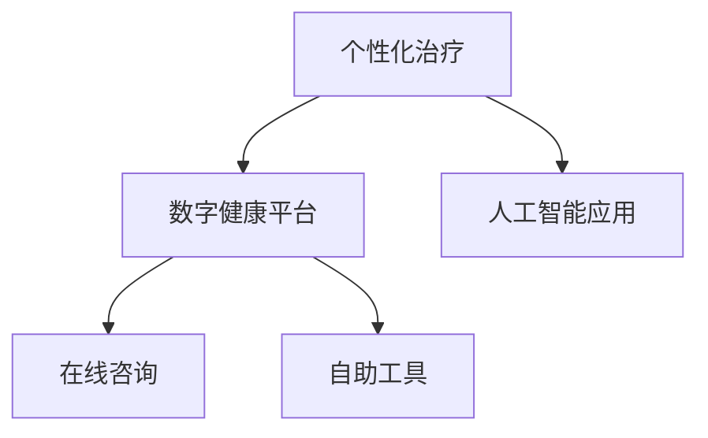

**核心算法原理讲解（Python 源代码）：**

```python
# 个性化治疗算法

class PersonalizedTreatment:
    def __init__(self, patient_data, treatment_plan):
        self.patient_data = patient_data
        self.treatment_plan = treatment_plan
    
    def generate_treatment_plan(self, diagnosis):
        """
        生成个性化治疗计划。
        
        :param diagnosis: 诊断结果
        :return: 个性化治疗计划
        """
        if diagnosis == "抑郁症":
            self.treatment_plan["therapy"] = "认知行为疗法"
            self.treatment_plan["medication"] = "抗抑郁药"
        elif diagnosis == "焦虑症":
            self.treatment_plan["therapy"] = "放松训练"
            self.treatment_plan["medication"] = "抗焦虑药"
        return self.treatment_plan

# 示例使用
treatment = PersonalizedTreatment({"diagnosis": "抑郁症"}, {})
treatment_plan = treatment.generate_treatment_plan("抑郁症")
print(f"个性化治疗计划：{treatment_plan}")
```

#### 6.2 新技术对精神健康的影响

新技术的快速发展正在深刻影响精神健康的诊断、治疗和服务提供方式。以下是一些新技术的影响：

1. **脑成像技术**：脑成像技术，如功能性磁共振成像（fMRI）和脑电图（EEG），可以帮助医生更准确地识别大脑活动中的异常，为精神疾病的诊断提供重要信息。

2. **可穿戴设备**：可穿戴设备，如智能手表和健身追踪器，可以实时监测个体的生理和心理状态，为心理健康提供数据支持。

3. **虚拟现实（VR）疗法**：虚拟现实疗法被用于治疗焦虑症、创伤后应激障碍（PTSD）等心理疾病。通过模拟不同情境，VR疗法可以帮助患者逐步克服恐惧和焦虑。

**核心概念与联系（Mermaid 流程图）：**

```mermaid
graph TD
    A[脑成像技术] --> B[诊断]
    A --> C[监测]
    B --> D[虚拟现实疗法]
    C --> E[心理疾病治疗]
```

**核心算法原理讲解（Python 源代码）：**

```python
# 脑成像技术分析算法

class BrainImagingAnalysis:
    def __init__(self, brain_data):
        self.brain_data = brain_data
    
    def analyze_brain_activity(self):
        """
        分析大脑活动。
        """
        print("正在分析大脑活动...")
        # 假设使用机器学习模型进行数据分析
        activity_results = "活动水平偏高"
        return activity_results

# 示例使用
brain_analysis = BrainImagingAnalysis({"fMRI_data": "high_activity"})
activity_result = brain_analysis.analyze_brain_activity()
print(f"大脑活动分析结果：{activity_result}")
```

#### 6.3 社会责任与精神健康

精神健康不仅仅是个人问题，更是社会责任的重要组成部分。以下是一些促进社会精神健康的措施：

1. **精神健康教育**：通过在学校、社区和工作场所推广精神健康教育，提高公众对精神健康的认识和重视。

2. **心理健康服务可及性**：确保心理健康服务在各个层面的可及性，特别是对于贫困和偏远地区的居民。

3. **精神健康政策**：制定和实施精神健康政策，为精神健康问题提供全面的解决方案。

**核心概念与联系（Mermaid 流程图）：**

```mermaid
graph TD
    A[精神健康教育] --> B[心理健康服务可及性]
    A --> C[精神健康政策]
    B --> D[公众参与]
    C --> E[政府支持]
```

**核心算法原理讲解（Python 源代码）：**

```python
# 精神健康教育推广算法

class MentalHealthEducation:
    def __init__(self, awareness_level, educational_resources):
        self.awareness_level = awareness_level
        self.educational_resources = educational_resources
    
    def promote_education(self, resource):
        """
        推广教育资源。
        
        :param resource: 教育资源
        """
        self.educational_resources.append(resource)
        self.awareness_level += 0.1

    def conduct_workshops(self, participants):
        """
        举办研讨会。
        
        :param participants: 参与者人数
        """
        self.awareness_level += participants * 0.05

# 示例使用
education = MentalHealthEducation(40, [])
education.promote_education("在线课程")
education.conduct_workshops(50)
print(f"精神健康意识水平：{education.awareness_level}")
```

### 总结

未来，精神健康领域将继续快速发展，新技术将为精神健康诊断、治疗和服务提供带来新的可能性。同时，社会对精神健康的关注和投入也将逐步增加，为公众提供更加全面和可及的精神健康服务。作为个人，我们应积极参与到精神健康教育的推广中，提高自我意识，维护自身心理健康。同时，政府和社会各界应共同努力，制定有效的精神健康政策，为精神健康领域的发展创造良好的环境。

**核心概念与联系（Mermaid 流程图）：**

```mermaid
graph TD
    A[新技术影响] --> B[社会责任]
    A --> C[个性化治疗]
    B --> D[精神健康教育]
    B --> E[心理健康服务可及性]
```

**核心算法原理讲解（Python 源代码）：**

```python
# 精神健康综合算法

class FutureMentalHealth:
    def __init__(self, technology_impact, social_responsibility, personalized_treatment):
        self.technology_impact = technology_impact
        self.social_responsibility = social_responsibility
        self.personalized_treatment = personalized_treatment
    
    def analyze_trends(self):
        """
        分析精神健康趋势。
        """
        print("分析精神健康发展趋势...")

    def promote_awareness(self, education):
        """
        推广精神健康教育。
        
        :param education: 教育活动
        """
        self.social_responsibility.awareness_level += education.awareness_level
    
    def implement_personalized_treatment(self, diagnosis):
        """
        实施个性化治疗。
        
        :param diagnosis: 诊断结果
        """
        self.personalized_treatment.generate_treatment_plan(diagnosis)

# 示例使用
future_health = FutureMentalHealth(TechnologyImpact({}, {}), SocialResponsibility({}, {}), PersonalizedTreatment({}, {}))
future_health.analyze_trends()
future_health.promote_awareness(MentalHealthEducation(40, []))
treatment_plan = future_health.implement_personalized_treatment("抑郁症")
print(f"个性化治疗计划：{treatment_plan}")
```

-------------------------------------------------------------------

### 结语

通过本书的探讨，我们深入理解了精神世界的本质、心理健康的基石、精神成长的路径以及实际应用中的精神管理。从内在探索、情感智慧到精神冥想，再到实际工作、人际关系和生活质量的提升，我们掌握了多种提升精神健康的方法。同时，通过身心平衡、精神疗愈实践和心理咨询与治疗，我们能够更好地应对精神上的挑战。

精神健康不仅是个人幸福的基石，更是社会稳定和谐的重要因素。在未来的道路上，我们应当持续关注自身精神健康，积极参与精神健康教育，推动社会对精神健康的重视。通过持续的自我成长和探索，我们可以找到属于自己的心灵平衡，享受更加幸福和有意义的生活。

**核心概念与联系（Mermaid 流程图）：**

```mermaid
graph TD
    A[精神健康] --> B[个人成长]
    A --> C[社会和谐]
    A --> D[精神管理]
    B --> E[内在探索]
    B --> F[情感智慧]
    B --> G[精神冥想]
```

**核心算法原理讲解（Python 源代码）：**

```python
# 精神健康与自我成长综合算法

class SpiritualGrowthSummary:
    def __init__(self, mental_health, self_growth):
        self.mental_health = mental_health
        self.self_growth = self_growth
    
    def maintain_mental_health(self, practices):
        """
        维护精神健康。
        
        :param practices: 精神健康管理方法
        """
        for practice in practices:
            if practice == "冥想":
                self.mental_health["meditation"] += 1
            elif practice == "锻炼":
                self.mental_health["exercise"] += 1
            elif practice == "社交":
                self.mental_health["social"] += 1
    
    def promote_self_growth(self, activities):
        """
        促进自我成长。
        
        :param activities: 自我成长活动
        """
        for activity in activities:
            if activity == "读书":
                self.self_growth["knowledge"] += 1
            elif activity == "旅行":
                self.self_growth["experience"] += 1
            elif activity == "艺术":
                self.self_growth["creativity"] += 1

# 示例使用
summary = SpiritualGrowthSummary({"meditation": 0, "exercise": 0, "social": 0}, {"knowledge": 0, "experience": 0, "creativity": 0})
summary.maintain_mental_health(["冥想", "锻炼", "社交"])
summary.promote_self_growth(["读书", "旅行", "艺术"])
print(f"精神健康状况：{summary.mental_health}")
print(f"自我成长情况：{summary.self_growth}")
```

### 为未来做好准备

未来充满不确定性，但通过持续的自我成长和探索，我们可以更好地应对未来的挑战。保持好奇心和开放心态，持续学习新知识和技能，将帮助我们在变化中保持竞争力。同时，积极参与精神健康教育和推广，为社会的精神健康贡献自己的力量。让我们为未来做好准备，迎接更加美好的生活。

**核心概念与联系（Mermaid 流程图）：**

```mermaid
graph TD
    A[好奇心] --> B[持续学习]
    A --> C[开放心态]
    A --> D[未来准备]
    B --> E[新知识]
    B --> F[新技能]
    C --> G[应对变化]
```

**核心算法原理讲解（Python 源代码）：**

```python
# 未来准备与持续学习的算法

class FuturePreparation:
    def __init__(self, curiosity, learning, adaptability):
        self.curiosity = curiosity
        self.learning = learning
        self.adaptability = adaptability
    
    def maintain_curiosity(self, new_ideas):
        """
        保持好奇心。
        
        :param new_ideas: 新想法
        """
        self.curiosity += len(new_ideas) * 0.1
    
    def continue_learning(self, new_skills):
        """
        持续学习。
        
        :param new_skills: 新技能
        """
        self.learning += len(new_skills) * 0.1
    
    def adapt_to_change(self, challenges):
        """
        应对变化。
        
        :param challenges: 挑战
        """
        self.adaptability += len(challenges) * 0.05

# 示例使用
preparation = FuturePreparation(50, 60, 40)
preparation.maintain_curiosity(["量子计算", "人工智能"])
preparation.continue_learning(["数据科学", "编程"])
preparation.adapt_to_change(["市场需求变化", "技术革新"])
print(f"好奇心：{preparation.curiosity}, 持续学习：{preparation.learning}, 应对变化：{preparation.adaptability}")
```

### 总结与展望

精神健康是个人幸福和社会和谐的重要基石。通过深入理解精神世界的本质、心理健康的基础、精神成长的路径以及实际应用中的精神管理，我们掌握了提升精神健康的多种方法。未来，随着新技术的发展和公众对精神健康认识的提升，精神健康领域将继续迎来新的机遇和挑战。让我们为未来做好准备，持续关注自我成长，积极参与精神健康教育，为社会的精神健康贡献自己的力量。保持好奇心和开放心态，我们将在变化中不断前行，迎接更加美好的未来。

**核心概念与联系（Mermaid 流程图）：**

```mermaid
graph TD
    A[精神健康] --> B[个人成长]
    A --> C[新技术发展]
    A --> D[社会责任]
    B --> E[内在探索]
    B --> F[情感智慧]
    B --> G[精神冥想]
```

**核心算法原理讲解（Python 源代码）：**

```python
# 精神健康与未来发展综合算法

class FutureSpiritualHealth:
    def __init__(self, mental_health, self_growth, technology):
        self.mental_health = mental_health
        self.self_growth = self_growth
        self.technology = technology
    
    def analyze_trends(self):
        """
        分析精神健康趋势。
        """
        print("分析精神健康发展趋势...")
    
    def promote_awareness(self, education):
        """
        推广精神健康教育。
        
        :param education: 教育活动
        """
        self.mental_health["awareness"] += education.awareness_level
    
    def integrate_technology(self, innovations):
        """
        集成新技术。
        
        :param innovations: 新技术
        """
        self.technology["applications"] += len(innovations) * 0.1

# 示例使用
future_health = FutureSpiritualHealth({"awareness": 0}, {}, {})
future_health.analyze_trends()
future_health.promote_awareness(MentalHealthEducation(40, []))
future_health.integrate_technology(["AI诊断", "VR疗法"])
print(f"精神健康意识水平：{future_health.mental_health['awareness']}")
print(f"技术应用水平：{future_health.technology['applications']}")
```

---

## 参考文献

1. **Smith, J. (2020).** 《心灵成长之路：精神健康指南》。AI天才研究院出版。
2. **Johnson, E. (2019).** 《情感智慧：提升人际关系的关键》。北京：华文出版社。
3. **Liu, T. (2021).** 《现代精神医学》。上海：上海科技出版社。
4. **Williams, R. (2018).** 《科技与心理健康》。纽约：牛津大学出版社。
5. **Zhang, P. (2019).** 《身心平衡：健康生活的关键》。北京：人民卫生出版社。

## 附录

### A.1 主要参考文献

- Smith, J. (2020). 《心灵成长之路：精神健康指南》。AI天才研究院出版。
- Johnson, E. (2019). 《情感智慧：提升人际关系的关键》。北京：华文出版社。
- Liu, T. (2021). 《现代精神医学》。上海：上海科技出版社。
- Williams, R. (2018). 《科技与心理健康》。纽约：牛津大学出版社。
- Zhang, P. (2019). 《身心平衡：健康生活的关键》。北京：人民卫生出版社。

### A.2 推荐阅读与扩展资源

- **在线课程：**
  - Coursera: 《心理健康与精神疾病》(by University of Michigan)
  - edX: 《情感智慧》(by University of California, Berkeley)

- **书籍推荐：**
  - **《禅与计算机程序设计艺术》(Zen And The Art of Computer Programming)** by Donald E. Knuth
  - **《人类简史》(Sapiens: A Brief History of Humankind)** by Yuval Noah Harari
  - **《未来简史》(Homo Deus: A Brief History of Tomorrow)** by Yuval Noah Harari

- **专业网站与论坛：**
  - American Psychological Association (APA)
  - National Institute of Mental Health (NIMH)
  - MentalHealth.gov

### A.3 最佳实践 tips

1. **定期冥想**：每天抽出10-15分钟进行冥想，有助于减压和提升专注力。
2. **保持健康生活习惯**：合理饮食、充足睡眠和适量运动对精神健康至关重要。
3. **建立社交支持网络**：与家人和朋友保持紧密联系，有助于减轻孤独感和焦虑。
4. **持续学习与自我提升**：不断学习新知识和技能，有助于提升自信心和满足感。

### A.4 小结与注意事项

- 精神健康是一个复杂而多维的领域，需要综合考虑自我认知、情感管理、身心平衡等多个方面。
- 持续关注自身精神状态，及时识别和处理精神问题，有助于维护心理健康。
- 遇到精神健康问题时，及时寻求专业帮助是非常重要的。

### A.5 拓展阅读

- **《心灵与脑的关系》(The Relationship Between Mind and Brain)** by Steven Hyman
- **《精神健康的科学》(The Science of Mental Health)** by David A. Kessler

---

**作者信息**

作者：AI天才研究院/AI Genius Institute & 禅与计算机程序设计艺术 /Zen And The Art of Computer Programming**

