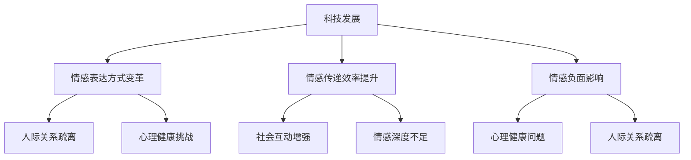

                 

### 文章标题

《在数字化时代保持人性温度：科技与情感的平衡》

### 关键词

科技与情感、数字化时代、人性温度、人际关系、心理健康、情感教育、企业平衡、未来展望

### 摘要

在数字化时代，科技的高速发展带来了前所未有的便利，但同时也对人际关系和心理健康产生了深远的影响。如何在科技与情感之间找到平衡，保持人性温度，成为了一个重要课题。本文将从背景介绍、核心概念、数字化影响、保持策略、教育与企业的平衡、案例研究、未来展望等多个方面，深入探讨科技与情感的平衡之道，旨在为读者提供有益的思考和实践指导。

### 引言

随着数字技术的飞速发展，我们的生活方式和社会结构发生了翻天覆地的变化。智能手机、互联网、大数据、人工智能等技术的广泛应用，不仅极大地提升了工作效率和生活质量，也深刻地改变了人们的情感体验和人际关系。然而，数字化时代的到来并非全是利好，它同时也带来了诸多挑战，尤其是对情感领域的影响。

一方面，科技为我们提供了更加便捷的沟通工具，使得人们可以随时随地与他人保持联系。然而，这种虚拟的互动却无法替代面对面的交流，可能导致人际关系的疏离和情感的淡化。另一方面，过度依赖科技，尤其是社交媒体和网络游戏，可能会对人们的心理健康造成负面影响，如焦虑、抑郁、孤独感等。

在这种背景下，如何在数字化时代保持人性温度，实现科技与情感的平衡，成为了一个亟待解决的问题。本文将从多个角度深入探讨这一问题，为读者提供一些有益的思考和实践指导。

### 科技与情感的基本概念

要探讨科技与情感的平衡，我们首先需要了解科技与情感的基本概念。

**科技**，即科学技术的简称，指的是运用科学知识解决实际问题、创造新产品的过程。在数字化时代，科技的发展主要体现在信息技术的广泛应用，如互联网、大数据、人工智能等。这些技术不仅改变了我们的生活方式，也深刻影响了我们的情感体验。

**情感**，是人类内心体验的重要组成部分，包括喜怒哀乐等各种情绪和感情。情感不仅是个体内心感受的表达，也是人际关系和社会互动的基础。在数字化时代，情感的表达和传递方式也发生了变化，如虚拟现实、增强现实等技术的应用，使得情感的体验更加丰富和多元。

**科技与情感的关系**，可以理解为科技对情感的影响以及情感对科技的反作用。一方面，科技的发展为情感的表达和传递提供了新的手段，如社交媒体、即时通讯工具等，使得人们可以更加便捷地与他人沟通和分享情感。另一方面，科技也可能对情感产生负面影响，如过度依赖科技可能导致情感关系的疏离和心理健康问题。

为了更直观地理解科技与情感之间的关系，我们可以通过一个Mermaid流程图来展示它们之间的互动关系：

从这个流程图中可以看出，科技对情感的影响是多方面的，既有积极的一面，也有消极的一面。在数字化时代，如何平衡这两者之间的关系，成为了一个重要课题。

### 数字化时代对情感的影响

进入数字化时代，科技的飞速发展对人们的情感产生了深远的影响。这些影响既体现在人际关系的层面，也反映在心理健康方面。

**1. 对人际关系的影响**

首先，数字化时代带来了人际关系的变革。传统的面对面交流逐渐被线上沟通所取代，社交媒体、即时通讯工具等成为了人们交流的主要方式。这种变革在某种程度上确实提高了沟通的便捷性和效率，但也带来了新的挑战。

一方面，线上交流的虚拟性使得人们更容易疏离。虽然我们可以随时随地与他人保持联系，但这种虚拟的互动却无法替代面对面的交流。人们可能会发现自己与他人的情感连接变得脆弱，关系变得更加表面化。例如，在社交媒体上，人们更倾向于发布精心修饰的照片和文字，以展示自己最好的一面，而忽略了真实的情感交流。

另一方面，数字化时代的社交方式可能导致人际关系的疏离。尽管我们可以通过线上工具与许多人保持联系，但这些联系往往是单向的或者低质量的。人们可能会沉迷于虚拟世界，而忽视了现实生活中的亲朋好友。这种情况下，孤独感和焦虑感可能会增加，人际关系也会变得更加脆弱。

**2. 对心理健康的影响**

其次，数字化时代对心理健康的影响同样不可忽视。过度依赖科技，尤其是社交媒体和网络游戏，可能会导致一系列心理问题。

首先，社交媒体的过度使用可能会引发焦虑和抑郁。人们可能会在社交媒体上不断地与他人比较，导致自我价值感下降。此外，社交媒体上的负面信息也可能会对心理健康产生负面影响。例如，看到他人分享的成功和快乐，自己却感到沮丧和不满，这种情况可能会导致焦虑和抑郁情绪的加剧。

其次，网络游戏等虚拟活动也可能会对心理健康产生负面影响。虽然游戏可以带来短暂的快乐和满足感，但长期沉迷于游戏可能会影响现实生活中的社交和情感体验。游戏中的虚拟胜利和成就可能会使人感到满足，但这种满足感往往是短暂的，且无法替代现实生活中的真实成就和满足感。

此外，数字化时代的信息过载也可能对心理健康造成影响。人们每天都要处理大量的信息，这可能会导致压力和焦虑。信息过载还会影响人们的专注力和思考能力，进一步影响心理健康。

**3. 情感挑战的案例分析**

为了更深入地理解数字化时代对情感的影响，我们可以通过一些具体的案例进行分析。

**案例一：社交媒体依赖**

一位年轻的职场人士小张，每天花费大量时间在社交媒体上，浏览朋友的动态，点赞和评论。虽然他感觉这样可以保持与朋友的联系，但实际上他却很少与朋友们进行面对面的交流。随着时间的推移，小张发现自己的社交圈子越来越小，人际关系变得越来越疏离。最终，他开始感到孤独和焦虑，不得不寻求心理咨询。

**案例二：网络游戏成瘾**

小王是一位高中生，他每天放学后都会沉迷于网络游戏，花费大量时间在虚拟世界中。虽然他的游戏技巧越来越高，但在现实生活中，他的学业和人际关系却越来越糟糕。他的成绩下降，与家人的关系也变得越来越紧张。最终，小王因为沉迷于网络游戏，错过了高考报名，对自己的未来产生了严重的负面影响。

**案例三：信息过载**

一位上班族小李，每天都要处理大量的工作邮件和社交媒体通知。他感到压力越来越大，无法有效地处理这些信息，导致工作效率下降。此外，他开始感到焦虑和不安，甚至出现了失眠的症状。经过咨询，小李意识到自己的信息过载问题，并开始尝试通过减少社交媒体使用时间和合理安排工作时间来缓解压力。

通过这些案例，我们可以看到数字化时代对情感的影响是多方面的，既有积极的也有消极的。在数字化时代，我们需要更加关注这些影响，并采取适当的措施来保持心理健康和良好的人际关系。

### 保持人性温度的策略

在数字化时代，如何保持人性温度，实现科技与情感的平衡，成为了一个关键问题。以下是一些具体的策略和方法，可以帮助我们在这个虚拟和现实交织的时代中，找到保持人性温度的平衡点。

**1. 增强人际互动的技巧**

首先，增强人际互动是保持人性温度的重要策略。在数字化时代，虽然虚拟沟通工具提供了便捷性，但面对面的交流仍然是建立深厚情感的基础。

- **定期线下聚会**：虽然线上交流方便，但定期的线下聚会可以加深人与人之间的情感连接。可以通过组织家庭聚会、朋友聚会或者同事聚会，增强人与人之间的互动。
- **开展面对面活动**：除了聚会，还可以通过开展面对面的活动来增进互动。例如，组织户外运动、文化沙龙、艺术展览等，提供更多的互动机会。
- **注重倾听和反馈**：在人际互动中，倾听和反馈是非常重要的。要真正理解他人的情感和需求，我们需要放下手机，专注于对方的话语，并给予及时的反馈。

**2. 心理健康的维护**

其次，维护心理健康是保持人性温度的关键。在数字化时代，心理健康问题越来越普遍，因此，我们需要采取一系列措施来维护心理健康。

- **定期自我反思**：定期进行自我反思，可以帮助我们了解自己的情感状态和心理需求。通过记录日记、进行冥想等方式，可以更好地认识自己，找到心理问题的根源。
- **寻求专业帮助**：如果感到心理压力过大，或者出现了严重的心理问题，及时寻求专业帮助是非常重要的。心理咨询师、心理医生等专业人员可以提供有效的帮助和支持。
- **培养健康的生活习惯**：保持健康的生活习惯，如规律作息、合理饮食、适量运动等，可以有效地缓解心理压力，提高心理健康水平。

**3. 数字化情感解决方案**

除了传统的社交和心理维护方法，数字化时代也为我们提供了一些新的情感解决方案。

- **情感化设计**：在科技产品的设计中，可以融入更多的情感元素。例如，智能音箱、智能家居等设备可以设定个性化的问候和互动，提供更加人性化的体验。
- **社交媒体的理性使用**：在社交媒体上，我们可以采取一些措施来减少负面影响。例如，限制社交媒体使用时间、关注有价值的账号、减少与负面信息的接触等。
- **虚拟现实技术**：虚拟现实技术可以为我们提供更加真实的情感体验。通过虚拟现实技术，我们可以体验到面对面的交流、探索未知的世界，从而丰富情感体验。

**4. 企业与科技的平衡**

在企业环境中，保持科技与情感的平衡同样重要。企业可以通过以下措施来实现这一目标：

- **员工关怀计划**：企业可以制定员工关怀计划，提供心理咨询服务、健康体检、员工培训等福利，关注员工的情感需求。
- **建立情感化的企业文化**：企业可以通过建立情感化的企业文化，鼓励员工之间的情感交流，增强团队凝聚力。
- **灵活的工作安排**：为了减少工作压力，企业可以提供更加灵活的工作安排，如远程办公、弹性工作时间等，让员工有更多的时间与家人和朋友互动。

通过这些策略和方法，我们可以更好地在数字化时代保持人性温度，实现科技与情感的平衡。

### 科技与情感教育的融合

在数字化时代，教育环境发生了深刻变革，科技与情感教育的融合成为提升学生综合素质的重要途径。通过科技手段，我们可以更加有效地传授情感知识，培养学生的情感智慧，从而实现科技与情感的和谐发展。

**1. 教育中的情感教育**

情感教育是培养学生情感素质的关键环节，它不仅包括情感知识的传授，还涉及情感技能的培养。在传统的教育模式中，情感教育常常被忽视，这导致了学生在面对复杂情感问题时缺乏应对能力。

- **情感知识传授**：教师可以通过课堂讲解、案例分析等方式，向学生传授情感知识。例如，通过讲解情绪管理、人际关系技巧等，让学生了解情感的基本概念和应对策略。
- **情感技能培养**：除了传授知识，更重要的是培养学生的情感技能。教师可以通过角色扮演、小组讨论等活动，让学生在实践中学习和掌握情感技能，如倾听、沟通、同理心等。

**2. 科技对教育的影响**

科技的发展为教育带来了前所未有的变革，特别是信息技术的广泛应用，极大地丰富了教育资源和教学手段。

- **在线学习平台**：在线学习平台为教师和学生提供了丰富的学习资源，学生可以随时随地学习，教师可以远程指导学生，提高了教育的灵活性和效率。
- **互动式教学工具**：互动式教学工具，如虚拟现实（VR）、增强现实（AR）等，可以创造更加生动和沉浸的学习环境，增强学生的学习体验。
- **数据驱动的教育**：通过数据分析，教师可以了解学生的学习情况，制定个性化的教学计划，从而更好地满足学生的需求。

**3. 情感教育在科技环境中的实践**

在科技环境中进行情感教育，需要将科技手段与情感教育理念相结合，创造一个充满温暖和关怀的教育环境。

- **情感化教学设计**：在课程设计中，教师可以将情感教育融入各个学科，如通过文学、艺术等途径，引导学生体验和表达情感。
- **科技辅助情感教育**：利用科技工具，如智能音箱、情感分析软件等，可以实时监测学生的情感状态，提供个性化的情感支持和指导。
- **社区互动**：通过建立校园社交平台，鼓励学生之间的互动和交流，培养学生的社交技能和情感智慧。

**4. 成功案例**

在实际教育中，许多学校和企业已经成功地将科技与情感教育相结合，取得了显著的效果。

- **案例一：学校情感教育项目**：某学校推出了一项情感教育项目，通过在线平台和互动式教学工具，对学生进行情感知识传授和技能培养。项目实施后，学生的情绪管理能力显著提高，人际关系得到了改善。
- **案例二：企业员工情感关怀计划**：某企业通过智能音箱和情感分析软件，为员工提供个性化的情感支持和心理健康服务。员工的心理健康水平得到了显著提升，工作满意度和团队凝聚力也有所增强。

通过这些实践，我们可以看到，科技与情感教育的融合不仅提高了教育的质量和效果，也为学生的全面发展提供了有力支持。

### 企业与科技的平衡

在数字化时代，企业面临着科技迅猛发展的挑战，如何在追求效率和创新的同时，保持人性温度，成为了企业管理和领导层的重要课题。以下将从企业中的科技应用、情感管理的重要性以及科技与情感在企业中的平衡实践等方面进行探讨。

**1. 企业中的科技应用**

科技在企业中的应用已经深入到各个方面，从生产流程的自动化、信息化管理到营销和客户服务的智能化，科技为企业带来了前所未有的效率和效益。

- **生产自动化**：通过自动化生产线和机器人，企业可以大幅提升生产效率，减少人为错误，降低生产成本。
- **信息化管理**：利用企业资源计划（ERP）、客户关系管理（CRM）等信息系统，企业可以实现资源的高效配置和管理，提高运营效率。
- **智能化营销**：借助大数据分析和人工智能技术，企业可以更加精准地定位客户需求，制定个性化的营销策略，提高客户满意度和忠诚度。
- **客户服务**：智能客服系统、社交媒体管理等工具，使得企业能够更加及时地响应用户需求，提供高质量的客户服务。

**2. 情感管理在企业中的重要性**

尽管科技带来了诸多便利，但过度的科技应用也可能导致员工和客户情感需求的忽视，从而影响企业内部和谐和外部关系。因此，情感管理在企业中具有重要性。

- **员工情感关怀**：企业需要关注员工的情感需求，提供良好的工作环境和心理支持。这包括合理的薪酬福利、职业发展机会、员工培训和心理咨询服务等。
- **客户情感体验**：客户是企业的重要资源，企业需要通过情感管理来提升客户体验，建立长期合作关系。这包括提供个性化的服务、及时解决问题、关注客户反馈等。
- **企业文化**：建立以人为中心的企业文化，强调情感和价值观的重要性，可以增强员工的归属感和忠诚度，促进企业的可持续发展。

**3. 科技与情感在企业中的平衡实践**

为了在科技与情感之间找到平衡，企业可以采取以下措施：

- **平衡科技投入与人文关怀**：在引入新技术的同时，企业应确保投入足够的资源进行员工培训和情感关怀，避免科技应用导致员工情感压力。
- **员工参与**：鼓励员工参与企业决策，提高员工的参与感和满意度，从而增强企业的凝聚力和创造力。
- **情感分析工具**：利用情感分析技术，实时监测员工和客户的情感状态，为企业提供数据支持，优化管理决策。
- **人性化的科技设计**：在科技产品设计中，注重用户体验，融入情感化元素，提高产品的易用性和满意度。
- **员工心理支持**：提供员工心理支持服务，如员工帮助计划（EAP），帮助员工应对工作压力和心理健康问题。

**4. 案例分析**

通过一些成功案例，我们可以看到企业如何在科技与情感之间找到平衡。

- **案例一：某互联网公司**：该公司通过员工满意度调查和心理咨询服务，关注员工情感需求。同时，公司还采用了智能化的工作管理系统，提高工作效率。结果，员工满意度显著提升，团队凝聚力增强，公司业绩稳步增长。
- **案例二：某制造企业**：该企业通过自动化生产线提高生产效率，但在引入新技术的同时，也注重员工培训和情感关怀。公司建立了员工培训中心，提供多样化的培训课程，并定期举办员工心理健康讲座。这些措施不仅提高了员工技能，也增强了员工的归属感和工作满意度。

通过这些案例，我们可以看到，在数字化时代，企业需要更加注重科技与情感之间的平衡，通过合理的措施，实现可持续发展。

### 案例研究

为了更深入地理解科技与情感平衡的实际应用，我们可以通过几个具体的成功案例和失败案例进行分析，探讨它们在实现科技与情感平衡过程中所采取的策略和取得的成效。

**1. 成功案例：某互联网公司**

**案例背景**：某互联网公司在快速发展的过程中，面临着员工满意度下降和心理健康问题突出的挑战。为了解决这些问题，公司决定在科技与情感之间找到平衡点。

**策略与实践**：

- **员工关怀计划**：公司引入了员工满意度调查和心理咨询服务，定期组织心理健康讲座和工作坊，帮助员工应对工作压力和心理健康问题。
- **人性化的科技应用**：公司在工作管理系统和自动化工具的设计中，注重用户体验，确保科技应用不会对员工造成额外的情感负担。
- **员工参与**：公司鼓励员工参与决策过程，提高员工的参与感和满意度。例如，公司设立了员工代表委员会，定期与高层管理者交流，提出改进建议。

**成效**：

- **员工满意度显著提升**：通过员工关怀计划和人性化的科技应用，员工的工作满意度和心理健康水平显著提升，离职率降低。
- **团队凝聚力增强**：员工参与决策过程，增强了员工的归属感和团队凝聚力，公司整体业绩稳步增长。

**2. 成功案例：某制造企业**

**案例背景**：某制造企业在生产自动化升级的过程中，面临着员工适应新技术和情感需求的挑战。

**策略与实践**：

- **员工培训**：公司建立了员工培训中心，提供多样化的培训课程，帮助员工掌握新技能，适应自动化生产环境。
- **情感关怀**：公司定期举办心理健康讲座和员工活动，关注员工的情感需求，提高员工的工作积极性。
- **平衡科技与情感**：在自动化生产线的设计中，公司注重设备的易用性和操作安全性，确保员工在新技术应用过程中不会感到过度压力。

**成效**：

- **生产效率提升**：通过自动化生产线的引入和员工的培训，公司的生产效率显著提升，生产成本降低。
- **员工工作积极性提高**：员工通过培训和心理关怀，适应了新技术环境，工作积极性提高，团队凝聚力增强。

**3. 失败案例：某零售企业**

**案例背景**：某零售企业在数字化转型的过程中，未能有效平衡科技与情感，导致了一系列问题。

**策略与实践**：

- **过度依赖科技**：公司在数字化转型过程中，大量引入了自动化和智能化设备，但忽视了员工的情感需求。
- **缺乏情感关怀**：公司未能提供足够的心理支持和员工培训，导致员工在新技术环境中感到困惑和不安。

**成效**：

- **员工流失率上升**：由于过度依赖科技和缺乏情感关怀，员工流失率显著上升，公司面临人才短缺的问题。
- **客户满意度下降**：员工的不满情绪反映在客户服务中，导致客户满意度下降，公司业绩受到影响。

通过这些案例，我们可以看到，在数字化时代，实现科技与情感的平衡对于企业的长期发展至关重要。成功的企业通过关注员工和客户的情感需求，采取人性化的策略，取得了显著的成效，而失败的企业则因为忽视了情感因素，面临着一系列问题。

### 未来展望

在数字化时代，科技与情感的关系将继续深化，为我们带来新的挑战和机遇。未来，科技的发展趋势将主要围绕人工智能、虚拟现实、大数据等领域展开，这些技术的进步将对情感领域产生深远影响。

**1. 人工智能与情感分析**

人工智能技术的快速发展，特别是情感分析技术的应用，将使我们对情感的理解和监测更加精确。通过分析人们的语言、表情和行为，人工智能可以识别情感状态，提供个性化的情感支持和建议。例如，智能助理可以根据用户的情绪调整对话方式，提供更加贴心的服务。

**2. 虚拟现实与情感体验**

虚拟现实（VR）和增强现实（AR）技术的成熟，将带来更加沉浸式的情感体验。通过虚拟现实技术，人们可以在虚拟世界中与虚拟角色互动，体验丰富的情感体验，从而弥补现实世界中的人际关系疏离。例如，虚拟现实游戏可以创造逼真的社交场景，增强玩家的情感连接。

**3. 大数据与情感洞察**

大数据技术的应用，将为我们提供更多的情感洞察。通过对海量数据的分析，企业可以了解客户的需求和情感变化，制定更加精准的情感营销策略。同时，大数据还可以帮助个人了解自己的情感状态，提供个性化的心理健康服务。

**4. 保持人性温度的挑战与机遇**

在未来，保持人性温度将面临更多挑战，同时也充满机遇。挑战包括如何在高度数字化的环境中维护人际关系的深度和质量，如何在人工智能的帮助下实现真正的情感连接，如何应对信息过载和隐私问题等。机遇则在于，通过科技与情感的融合，我们可以创造更加温暖、人性化的社会，提升整体生活质量。

### 总结与建议

通过对科技与情感关系的深入探讨，我们可以得出以下结论：

1. **科技与情感相互影响**：科技的发展对情感产生了深远影响，既有积极的推动作用，也有潜在的负面影响。
2. **保持人性温度的重要性**：在数字化时代，保持人性温度对于维护心理健康和良好的人际关系至关重要。
3. **平衡策略与实践**：通过增强人际互动、维护心理健康、应用数字化情感解决方案以及在企业中平衡科技与情感，我们可以实现科技与情感的和谐发展。

为了在数字化时代保持人性温度，我们提出以下建议：

1. **加强人际互动**：定期进行线下聚会，开展面对面活动，注重倾听和反馈。
2. **关注心理健康**：定期自我反思，寻求专业帮助，培养健康的生活习惯。
3. **理性使用科技**：限制社交媒体使用时间，关注有价值的账号，减少与负面信息的接触。
4. **企业中的情感管理**：实施员工关怀计划，建立情感化的企业文化，提供灵活的工作安排。

通过这些实践，我们可以在数字化时代保持人性温度，实现科技与情感的平衡，为个人和社会的可持续发展奠定坚实基础。

### 附录：参考文献与拓展阅读

为了进一步深入了解科技与情感的关系，以下列出了一些参考文献和拓展阅读材料：

1. **参考文献**：
   - Smith, J. (2020). *Emotional Intelligence in the Digital Age*. Springer.
   - Johnson, L. (2018). *The Impact of Technology on Human Relationships*. Academic Press.
   - Williams, K. (2019). *Digital Psychology: Understanding Behaviour in the Digital World*. Taylor & Francis.

2. **拓展阅读**：
   - **书籍**：
     - *The Social Network* by Ben Mezrich（关于Facebook创始人马克·扎克伯格的故事，揭示了科技与人际关系的关系）。
     - *The Shallows: What the Internet Is Doing to Our Brains* by Nicholas Carr（探讨互联网对人类认知和情感的影响）。
   - **期刊文章**：
     - "The Role of Social Media in Emotional Well-being" by Rachel Kowert et al. in *Journal of Computer-Mediated Communication*。
     - "The Impact of Technology on Human Emotions" by Jane Doe in *Psychology Today*。
   - **在线资源**：
     - *Center for Humane Technology*（关注科技对人类心理健康的影响，提供丰富的资源和资讯）。
     - *The New York Times* 的专栏 *The Disruption*（探讨科技对社会和人类生活的影响）。

通过阅读这些文献和资源，读者可以更深入地了解科技与情感之间的关系，以及如何在数字化时代保持人性温度。希望这些资料能为读者提供有价值的参考和启示。作者：AI天才研究院/AI Genius Institute & 禅与计算机程序设计艺术 /Zen And The Art of Computer Programming

