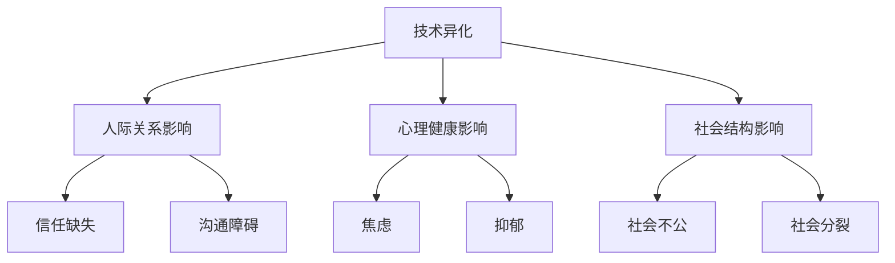

                 

### 第一部分：引言

#### 1.1 数字化时代的来临

随着互联网、大数据、云计算、人工智能等新兴技术的迅猛发展，我们正步入一个前所未有的数字化时代。数字化技术不仅改变了传统行业的运作模式，还深刻影响了人们的生活方式和社会结构。在这个时代，信息以光速传播，知识以几何级数增长，科技创新成为了驱动社会进步的重要力量。

数字化技术的普及使得我们的生活和工作变得更加便捷和高效。从智能手机、平板电脑到智能家居、智慧城市，数字技术已经深入到我们日常生活的方方面面。同时，云计算和大数据技术的应用，使得数据处理和分析的能力达到了前所未有的高度，为各个行业带来了巨大的价值。

然而，数字化时代也带来了一系列新的挑战。随着技术的不断进步，数据隐私、网络安全、算法偏见等伦理问题日益凸显。这些问题不仅关乎个人隐私和安全，更关系到社会公平、公正和可持续发展。因此，如何在数字化时代保持人性，应对技术异化的挑战，成为了我们必须思考的重要课题。

#### 1.2 技术异化的现象

技术异化是指在技术迅猛发展的过程中，技术本身及其应用逐渐偏离了其初衷，对人类社会产生负面影响的现象。具体来说，技术异化表现为以下几个方面：

首先，技术对人际关系的影响。随着社交媒体的普及，人们越来越多地依赖于线上交流，而减少了面对面的互动。这种“虚拟社交”虽然提供了便捷的交流方式，但也在一定程度上削弱了人们的情感联系和社交技能。

其次，技术对心理健康的影响。长时间使用电子设备，尤其是手机和电脑，容易导致人们出现焦虑、抑郁等心理问题。研究表明，过度依赖数字设备可能导致睡眠质量下降、注意力分散，甚至出现“数字成瘾”的现象。

再次，技术对社会结构的影响。技术的发展带来了信息的不对称和资源的集中，加剧了社会的不公平现象。同时，自动化和人工智能的应用也可能导致大量就业岗位的消失，对社会稳定造成威胁。

最后，技术伦理问题。在技术快速发展的过程中，一些伦理问题尚未得到妥善解决。例如，人工智能算法的偏见、数据隐私的泄露等，这些问题不仅影响了个人的权益，也对整个社会的信任体系造成了挑战。

#### 1.3 人性的重要性

在数字化时代，保持人性显得尤为重要。人性不仅包括人类的基本情感和道德伦理，还涵盖了人类对于自然和社会的尊重与责任。在技术迅猛发展的背景下，保持人性有助于我们应对以下挑战：

首先，人性能够帮助我们建立真实、深厚的人际关系。尽管数字化技术提供了便捷的沟通方式，但面对面的互动仍然是建立深厚情感和信任的基础。通过保持人性，我们可以更好地理解和关心他人，提升社会凝聚力。

其次，人性能够促进心理健康。在数字化时代，心理健康问题日益突出。保持人性，通过情感交流和自然环境，可以有效缓解焦虑、抑郁等心理问题，提高生活质量。

再次，人性有助于我们理解和解决技术伦理问题。在数字化时代，技术伦理问题层出不穷。保持人性，我们可以从伦理和道德的角度出发，审慎地评估技术的发展和应用，确保技术为人类带来福祉。

最后，人性是实现可持续发展的关键。在数字化时代，保持人性有助于我们关注社会公平、生态保护和人文关怀，推动社会向更加公平、和谐、可持续的方向发展。

### 摘要

本文旨在探讨数字化时代中技术异化现象及其对人类社会的影响，并强调保持人性的重要性。通过分析技术异化的原因，本文探讨了技术发展、社会因素和个人因素对技术异化的影响。此外，本文还分析了技术异化对人际关系、心理健康和社会结构的影响，并提出了保持人性的策略。通过具体案例研究，本文进一步阐述了保持人性的实践路径，为应对数字化时代的技术异化挑战提供了理论支持和实践指导。最终，本文展望了未来社会在技术与人性平衡方面的发展方向，呼吁全社会共同努力，实现技术与人类的和谐共生。

## 第二部分：技术异化的原因

#### 2.1 技术发展的双刃剑

技术发展是一把双刃剑，它既带来了巨大的机遇，也引发了诸多挑战。技术的进步在提升生产效率、改善生活质量方面发挥了重要作用，但同时也带来了技术异化的风险。技术发展的双刃剑效应主要体现在以下几个方面：

首先，技术发展带来了信息不对称。在数字化时代，信息传播的速度和范围达到了前所未有的高度。然而，这也导致了信息的不对称现象。一些企业和个人可以利用技术手段获取并利用大量数据，而普通用户则处于信息弱势地位。这种信息不对称不仅影响了市场的公平性，还可能导致数据隐私和网络安全问题。

其次，技术发展加剧了资源的集中。在数字化时代，技术和资本高度集中，少数大型科技企业掌握了庞大的数据资源和计算能力。这种资源集中不仅导致了市场竞争的不公平，还可能引发垄断现象，削弱市场的活力和创新能力。

再次，技术发展可能削弱人类的自主性和创造力。在自动化和人工智能的应用中，越来越多的任务和决策被机器取代。虽然这提高了生产效率，但也在一定程度上削弱了人类的自主性和创造力。长期依赖技术可能导致人类失去对自身能力的信心，进而影响社会的创新动力。

最后，技术发展还带来了伦理和社会问题。例如，人工智能算法的偏见、算法透明度和可解释性等问题，引发了广泛的伦理争议。此外，技术的发展还可能加剧社会不平等，影响社会稳定和可持续发展。

#### 2.2 社会因素

技术异化不仅与技术本身有关，还与社会因素密切相关。社会因素包括文化、政治和经济等多个方面，它们共同影响着技术发展的方向和应用方式。

首先，文化因素。不同的文化背景和价值观念对技术的接受和应用方式产生了深远的影响。在一些崇尚个人主义和自由竞争的文化环境中，技术发展可能更加注重效率和利润，而忽视了对人性和社会的关怀。相反，在一些强调集体主义和社会责任的文化中，技术发展可能更加注重公平和可持续发展。

其次，政治因素。政府政策和社会治理对技术发展有着重要的影响。例如，政府在技术研发和产业政策上的支持力度，以及法律法规的完善程度，都会影响技术的方向和应用。在缺乏有效监管的领域，技术发展可能偏离社会利益，导致技术异化。

再次，经济因素。经济环境和市场机制对技术发展具有重要影响。在高度竞争的市场环境中，企业可能更加注重短期利润，忽视了对技术伦理和可持续发展问题的关注。此外，经济不平等也可能加剧技术异化，导致社会资源的集中和不公平现象。

最后，社会因素还包括教育水平和公众意识。教育水平的高低直接影响到公众对技术的理解和应用能力。同时，公众的科技素养和伦理意识也是技术发展的重要保障。提高公众的科技素养和伦理意识，有助于引导技术发展，减少技术异化风险。

#### 2.3 个人因素

个人因素在技术异化中同样发挥着重要作用。个人的价值观、行为习惯和心理状态等因素，都会对技术发展及其应用产生影响。

首先，个人的价值观对技术接受和应用方式有着深远的影响。一些人可能更加关注技术的实用性和经济利益，而忽视了对人性和伦理的关注。这种价值观可能导致技术的过度商业化，忽视了对社会和环境的责任。

其次，个人的行为习惯也会影响技术发展。例如，过度依赖手机和社交媒体可能导致人际关系的疏离和心理健康问题。同时，个人行为习惯的累积效应也可能对社会结构和伦理道德产生深远影响。

再次，个人的心理状态也是技术异化的关键因素。在数字化时代，长时间使用电子设备和接触大量信息，容易导致焦虑、抑郁等心理问题。这些心理问题不仅影响个人的生活质量，还可能对社会稳定产生负面影响。

最后，个人的科技素养和伦理意识对技术发展具有重要影响。提高个人的科技素养和伦理意识，有助于更好地理解和应对技术带来的挑战，推动技术向更加人性化、可持续的方向发展。

通过分析技术发展的双刃剑效应、社会因素和个人因素，我们可以更全面地理解技术异化的原因。这些因素相互交织，共同影响着技术发展的方向和应用方式，决定了技术对人类社会的影响。因此，在数字化时代，我们需要综合考虑这些因素，采取有效的策略，应对技术异化带来的挑战。

### 2.4 技术伦理问题

在数字化时代，技术伦理问题愈发凸显，成为我们必须重视和解决的关键议题。技术伦理问题涉及到技术的设计、开发、应用以及技术对人类社会的影响等多个方面。以下从几个核心问题进行分析：

首先，数据隐私保护。随着大数据技术的广泛应用，个人数据的收集、存储和使用成为技术企业的重要业务。然而，数据的滥用和泄露问题也随之而来。许多科技公司因未经用户同意收集和使用其数据，甚至出售用户隐私，引发了广泛的伦理争议和公众愤怒。保护用户数据隐私，不仅是技术公司的法律责任，更是其伦理底线。

其次，算法公平性和透明度。人工智能算法在决策过程中往往存在偏见和歧视，这些偏见可能来源于数据本身的不公平性或算法设计的不合理性。例如，招聘算法可能对某些性别或种族存在歧视，医疗诊断算法可能对某些人群产生偏见。这些问题不仅影响了个人的权益，还可能加剧社会不平等。因此，确保算法的公平性和透明度，成为技术伦理研究的重要方向。

再次，人工智能的道德责任。随着人工智能技术的发展，机器的决策能力越来越强，甚至可能超过人类。然而，机器是否能承担道德责任，如何界定其道德责任，成为伦理学、法律和社会学等学科共同探讨的问题。例如，自动驾驶汽车在发生交通事故时，如何确定责任归属，这是当前法律和伦理学领域面临的重大挑战。

此外，技术对就业的影响也是技术伦理问题的重要方面。自动化和人工智能的普及，使得许多传统工作岗位被机器取代，导致大量劳动者失业。这不仅影响了个人的生计，还可能引发社会动荡。如何平衡技术进步与就业机会，确保技术发展不会导致大规模失业，成为技术伦理和公共政策的重要议题。

最后，技术对自然环境的影响。在追求技术发展的同时，我们也必须关注其对自然环境的影响。例如，数据中心的能耗问题，云计算对资源消耗的巨大需求，这些都在挑战着技术的可持续性。如何在技术发展中实现绿色环保，减少对环境的负面影响，成为技术伦理和可持续发展的重要组成部分。

总之，技术伦理问题在数字化时代愈发复杂和重要。解决这些问题不仅需要技术层面的创新，更需要法律、伦理和社会的共同参与。通过建立完善的法律框架、加强伦理教育和引导，以及推动技术与社会、环境的协调发展，我们可以更好地应对技术伦理挑战，实现技术与人类社会的和谐共生。

### 第三部分：技术异化对人类的影响

#### 3.1 人际关系的影响

技术异化对人际关系产生了深远的影响，这种影响既表现在线上社交的便利性，也体现在其潜在的负面影响。首先，社交媒体和即时通讯工具的普及，使得人们可以轻松地与全球各地的人建立联系。这种线上社交方式，打破了传统地理和时间的限制，为我们提供了一个无限广阔的交流平台。然而，这种虚拟社交也带来了一系列负面影响。

首先，虚拟社交可能导致人际关系疏离。尽管人们在线上可以频繁互动，但缺乏面对面的交流，使得人际关系变得浅薄。长期依赖线上沟通，人们可能会失去与他人建立深厚情感联系的能力，甚至出现“虚拟社交焦虑”，担心自己在社交场合中的表现。

其次，线上社交容易导致信任缺失。由于信息不对称和匿名性的存在，人们在虚拟环境中的信任度较低。虚假信息、诈骗和网络欺诈等问题频发，使得人们对线上社交持有怀疑态度，降低了人际关系的稳定性。

再次，线上社交可能导致沟通障碍。虽然技术提供了便捷的交流方式，但语言表达、情感传递等方面仍存在局限。在虚拟环境中，人们往往无法准确捕捉对方的情绪和意图，导致沟通效果不佳。此外，过度依赖文字交流，也使得非语言交流（如肢体语言、面部表情等）缺失，进一步阻碍了有效沟通。

#### 3.2 心理健康的影响

技术异化对心理健康的影响同样不容忽视。首先，长时间使用电子设备可能导致“数字疲劳”。研究表明，长时间盯着屏幕，容易导致眼睛疲劳、头痛和肩颈疼痛。此外，长时间使用手机和电脑，还会影响睡眠质量，导致失眠、多梦等睡眠问题，进一步影响心理健康。

其次，过度依赖数字设备容易导致焦虑和抑郁。在数字化时代，许多人沉迷于社交媒体和网络游戏，不断追求虚拟的成就和满足。然而，这种追求往往导致心理负担加重，出现焦虑、抑郁等情绪问题。特别是在面对失败和挫折时，一些人可能会感到无助和绝望，进一步加剧心理健康问题。

此外，数字设备的使用还可能导致“数字成瘾”。研究表明，一些人会对数字设备产生依赖，无法摆脱对社交媒体、游戏等数字产品的依赖。这种成瘾行为不仅影响了日常生活，还可能导致社交能力下降、人际关系疏离等问题，进一步影响心理健康。

最后，技术异化还可能引发“现实逃避”心理。在虚拟世界中，人们可以逃避现实生活中的压力和问题。然而，这种逃避行为可能会导致现实生活中的问题被忽视，进而影响心理健康和人际关系。

#### 3.3 社会结构的影响

技术异化对社会结构的影响也是显而易见的。首先，技术发展导致了信息不对称和资源集中的加剧。少数大型科技企业掌握了庞大的数据资源和计算能力，形成了数字帝国。这种现象不仅导致了市场竞争的不公平，还可能引发垄断问题，削弱市场的活力和创新能力。

其次，技术异化加剧了社会不平等现象。自动化和人工智能的普及，使得许多传统工作岗位被机器取代，导致大量劳动者失业。这不仅影响了个人的生计，还可能引发社会动荡。失业和贫困的加剧，使得社会阶层分化更加明显，社会不平等问题更加突出。

此外，技术异化还可能影响社会信任体系。由于数据隐私泄露、算法偏见等问题频发，公众对科技公司和政府的信任度降低。这种信任缺失不仅影响了个人的行为和决策，还可能对社会稳定产生负面影响。

最后，技术异化还可能影响社会文化的传承和发展。在数字化时代，传统文化和价值观受到冲击，年轻一代更加倾向于追求虚拟和即时满足，忽视了对传统价值观的继承和发扬。这种现象可能导致社会文化断层，影响社会的和谐与稳定。

综上所述，技术异化对人际关系、心理健康和社会结构产生了深远的影响。这些影响不仅关乎个人的生活质量，也关系到社会的稳定和可持续发展。因此，在数字化时代，我们需要认真应对技术异化带来的挑战，采取有效措施，减少其负面影响，实现技术与人类的和谐共生。

### 4.1 教育的作用

在数字化时代，教育的作用愈发重要，不仅是传承知识的重要途径，更是培养具有良好技术素养和社会责任感的未来公民的关键。首先，教育可以帮助个体更好地理解和应用新技术，减少技术盲区和误解。通过系统的教育，人们可以掌握基本的编程技能、数据分析和网络安全知识，从而更好地适应数字化生活和工作环境。

其次，教育有助于培养批判性思维和问题解决能力。在技术迅猛发展的背景下，批判性思维和问题解决能力变得尤为重要。通过教育，个体可以学会独立思考、分析和评估新技术的影响，从而在面对复杂问题时做出明智的决策。

此外，教育在塑造个体价值观和社会责任感方面也发挥着重要作用。通过课程设置和课外活动，学生可以学习到科技伦理、社会公正和可持续发展等价值观。这些价值观不仅有助于他们成为负责任的科技从业者，还能在日常生活中践行，促进社会的和谐发展。

教育不仅仅是学校教育的职责，家庭教育和社会教育同样重要。家庭教育的早期启蒙和陪伴，可以为孩子奠定良好的技术基础和价值观。而社会教育则通过媒体、社区和公共活动，传递科技进步和社会发展的信息，提升公众的科技素养和伦理意识。

总之，教育在应对技术异化挑战中具有至关重要的作用。通过全面、系统的教育，我们可以培养出具有技术素养、批判思维和良好价值观的下一代，为数字化时代的未来发展奠定坚实基础。

### 4.2 技术伦理的重要性

在数字化时代，技术伦理的重要性日益凸显。技术伦理不仅仅是对技术的道德规范，更是确保技术发展符合社会价值和人类福祉的基石。首先，技术伦理能够引导技术研发方向，避免技术异化带来的负面影响。例如，在人工智能领域，通过制定明确的伦理准则，可以避免算法偏见和歧视，确保技术公平性和透明度。

其次，技术伦理有助于建立公众对技术的信任。随着技术应用的日益广泛，公众对隐私保护、数据安全和算法公正等问题越来越关注。技术伦理的遵循，可以提升公众对技术的信任度，减少因信任缺失引发的社会矛盾。

再次，技术伦理在解决技术伦理争议中发挥着关键作用。在面对技术伦理争议时，通过伦理原则和规范，可以更公正、合理地评估和解决争议，确保技术发展不会损害社会利益和人类福祉。

此外，技术伦理教育对于培养具有社会责任感的科技从业者具有重要意义。通过技术伦理教育，科技从业者可以更好地理解和应对技术伦理问题，积极践行社会责任，推动技术向更加人性化、可持续的方向发展。

总之，技术伦理是数字化时代不可或缺的组成部分，它不仅指导技术的研发和应用，还关乎社会的稳定和可持续发展。通过加强技术伦理建设，我们可以更好地应对技术异化挑战，实现技术与人类的和谐共生。

### 4.3 个人行为的改变

在数字化时代，个人行为的改变对于应对技术异化挑战至关重要。首先，我们需要意识到数字设备的使用对健康和生活质量的潜在影响。长时间使用手机和电脑，不仅可能导致眼睛疲劳、肩颈疼痛等问题，还可能影响睡眠质量。因此，建立良好的数字设备使用习惯，例如定期休息、保持适当的使用时间和距离，是维护身心健康的重要措施。

其次，个人行为改变需要关注线上社交的负面影响。尽管线上社交提供了便捷的沟通方式，但过度依赖线上交流可能导致人际关系疏离和信任缺失。为此，我们应努力保持与现实世界的联系，积极参与线下活动，提升人际交往能力。

此外，个人行为改变还应包括对数字设备依赖的警惕。许多人在生活中对数字设备产生了依赖，甚至出现“数字成瘾”现象。对此，我们可以通过设定“数字断食”时间，减少对数字产品的依赖，培养健康的生活方式。

最后，个人行为改变还涉及对隐私保护和数据安全的重视。在数字化时代，个人数据的泄露和滥用问题日益严重。因此，我们应提高对隐私保护的意识，谨慎分享个人信息，使用安全可靠的数字产品和服务。

通过这些个人行为的改变，我们可以在数字化时代更好地应对技术异化挑战，维护自身健康和生活质量，实现技术与人类的和谐共生。

### 4.4 社会责任的承担

在数字化时代，企业和社会组织承担社会责任至关重要，这不仅关乎企业的长期发展，也关系到社会的和谐与稳定。首先，企业应积极履行其社会责任，确保其技术产品和服务的公平性和透明性。例如，互联网企业在数据收集和使用过程中，必须严格遵守隐私保护法规，不得滥用用户数据，确保用户隐私安全。

其次，企业应关注技术对就业的影响，采取积极措施减少技术变革带来的就业冲击。通过职业培训和再教育，帮助员工适应新技术，提高其职业技能，从而降低失业风险。同时，企业还可以通过创新业务模式，创造新的就业机会，促进社会就业稳定。

此外，企业应积极参与社会公益事业，通过捐助资金、物资和技术支持，助力贫困地区和弱势群体的发展。例如，科技企业可以与教育机构合作，开展科技扶贫项目，为贫困地区的学生提供教育资源和培训机会，帮助他们摆脱贫困，实现自我发展。

最后，社会组织也应发挥积极作用，监督和推动企业履行社会责任。通过公众舆论和社会监督，推动企业公开其社会责任报告，接受公众监督，确保其社会责任承诺得以落实。

总之，企业和社会组织承担社会责任，是应对数字化时代技术异化挑战的重要途径。通过履行社会责任，企业不仅能够提升自身声誉和竞争力，还能为社会的可持续发展做出积极贡献，实现技术与人类社会的和谐共生。

### 5.1 案例一：互联网企业的社会责任

互联网企业在数字化时代承担着重要的社会责任。以阿里巴巴集团为例，该企业通过一系列举措积极履行社会责任，取得了显著成效。

首先，阿里巴巴在隐私保护方面做出了表率。阿里巴巴旗下的阿里云在数据处理和存储方面，严格遵守相关法律法规，确保用户数据的安全和隐私。此外，阿里巴巴还推出了“隐私保护计划”，通过技术创新和流程优化，进一步提升数据保护水平。

其次，阿里巴巴关注社会就业问题。在自动化和人工智能技术广泛应用的时代，阿里巴巴通过实施“互联网+”战略，推动传统产业转型升级，创造了大量新的就业机会。同时，阿里巴巴还开展了“码上行动”项目，为农村地区提供在线职业技能培训，助力农民增收致富。

此外，阿里巴巴积极参与公益事业。2019年，阿里巴巴宣布未来5年将投入1000亿元用于社会公益，重点支持教育、医疗、环保等领域。例如，阿里巴巴公益基金会在全国各地建立了多个医疗救助站，为贫困患者提供免费医疗服务。此外，阿里巴巴还发起了“99公益日”活动，吸引了大量企业和个人参与，累计筹集善款超过100亿元，用于支持各类公益事业。

最后，阿里巴巴注重可持续发展。在环保方面，阿里巴巴通过推动绿色物流、减少碳排放等措施，努力实现碳中和目标。同时，阿里巴巴还发起了“马云公益基金会”，致力于推动可持续发展，为未来的绿色地球贡献力量。

总之，通过在隐私保护、就业支持、公益事业和可持续发展等方面的积极行动，阿里巴巴集团不仅履行了其社会责任，也为数字化时代的可持续发展做出了重要贡献。

### 5.2 案例二：科技伦理的争议

科技伦理争议在数字化时代尤为突出，其典型案例包括基因编辑、自动驾驶和人工智能在医疗领域的应用等。

首先，基因编辑技术引发的伦理争议主要集中在人类胚胎基因编辑上。2018年，中国科学家贺建奎宣布通过CRISPR-Cas9基因编辑技术，诞生了一对基因编辑婴儿，引起了全球科学界和社会的强烈反响。这一行为违反了国际生物伦理准则，引发了关于基因编辑技术的安全性和道德性的广泛讨论。许多人认为，基因编辑可能带来未知的健康风险，且涉及人类胚胎的基因编辑超越了科学家的伦理底线，可能导致“设计婴儿”现象的出现，加剧社会不平等。

其次，自动驾驶技术引发的伦理争议主要集中在责任归属和事故处理上。自动驾驶汽车在道路上发生事故时，如何确定责任主体和赔偿机制成为关键问题。例如，2018年，一辆自动驾驶特斯拉汽车在美国佛罗里达州发生致命事故，引起了对自动驾驶技术伦理和安全的讨论。有人提出，自动驾驶系统是否应该具备自动承担责任的机制，以减少交通事故的损失。此外，自动驾驶技术的普及还可能引发对传统司机职业的冲击，导致大量司机失业，从而引发新的社会问题。

再次，人工智能在医疗领域的应用也引发了伦理争议。尽管人工智能在疾病诊断、治疗方案制定等方面展现出巨大潜力，但其算法的偏见和透明度问题仍然存在。例如，一些人工智能系统在诊断中可能对某些种族或性别存在偏见，导致不公平的医疗待遇。此外，人工智能的医疗决策过程往往缺乏透明性，使得患者和医生难以理解其决策逻辑，增加了医疗风险。

这些科技伦理争议不仅关系到技术的合法性和安全性，还涉及到社会的公平、公正和可持续发展。解决这些争议需要跨学科合作，制定明确的伦理准则，确保技术在应用过程中不会对人类社会造成负面影响。

### 5.3 案例三：科技伦理教育的重要性

科技伦理教育在培养具备社会责任感的科技从业者中具有重要作用，以下通过具体案例加以说明。

首先，麻省理工学院（MIT）在科技伦理教育方面取得了显著成果。MIT的课程设置中包含了“科技与社会”（Science, Technology, and Society）系列课程，旨在引导学生了解科技对社会的影响，以及如何应对科技伦理挑战。例如，该课程通过案例分析，让学生深入探讨人工智能在医疗、自动驾驶等领域的伦理问题，并探讨可能的解决方案。此外，MIT还组织了“科技伦理研讨会”，邀请业界专家、学者和政策制定者共同探讨科技伦理的前沿议题，为学生提供实际案例和实践经验。

其次，斯坦福大学也在科技伦理教育方面进行了积极探索。斯坦福大学开设了“人工智能伦理”（AI Ethics）课程，通过理论学习、案例分析和小组讨论等多种方式，培养学生对人工智能伦理问题的理解和应对能力。例如，课程中讨论了人工智能算法的偏见问题，以及如何通过设计合理的算法来减少偏见。此外，斯坦福大学还组织了“AI伦理挑战赛”，让学生在真实项目中实践科技伦理原则，提高其实际操作能力。

最后，谷歌（Google）也在其员工培训计划中加入了科技伦理教育。谷歌的“AI伦理准则”课程，旨在帮助员工了解人工智能技术的伦理规范，并培养他们在工作中践行这些准则的能力。课程内容包括人工智能在隐私保护、算法偏见、透明度和安全性等方面的内容。通过实际案例分析和讨论，谷歌员工能够更好地理解和应对工作中的伦理挑战，确保技术的应用符合社会伦理和道德标准。

总之，这些科技伦理教育的案例表明，通过系统的课程设置、实践项目和案例分析，可以有效地培养科技从业者的伦理意识和社会责任感，为科技行业的健康发展提供有力保障。

### 6.1 技术与人性平衡的挑战

在数字化时代，实现技术与人性的平衡面临着诸多挑战。首先，技术快速发展与人性需求之间的矛盾日益凸显。尽管技术为我们的生活带来了便利和效率，但过度依赖技术可能导致人际关系的疏离和心理健康问题。例如，社交媒体的广泛应用虽然增强了人们的社交能力，但同时也增加了虚拟社交与现实生活之间的隔阂。

其次，技术进步带来的信息爆炸和数据泛滥使得人们难以有效管理和处理这些信息，从而增加了心理压力和认知负担。大数据和人工智能技术的发展，使得我们对个人隐私和数据安全的担忧日益增加，这不仅影响了人们的信任感，还可能导致社会信任体系的崩溃。

此外，技术发展在不同地区和群体之间的不均衡也加剧了技术与人性的不平衡。发达国家和发展中国家在技术获取和应用上存在明显差距，这种不均衡不仅影响了全球经济的可持续发展，还可能导致社会不平等和冲突的加剧。

最后，技术伦理问题也是实现技术与人性平衡的重要挑战。技术的广泛应用可能带来算法偏见、数据滥用等伦理问题，这些问题不仅影响了个人的权益，还对社会的公平、公正和可持续发展构成威胁。因此，如何在技术发展中兼顾人类需求和伦理规范，成为我们必须面对的严峻挑战。

### 6.2 保持人性化的可能路径

在数字化时代，保持人性化的路径多种多样，涉及教育、政策、文化等多个方面。首先，教育是培养人性化和伦理意识的关键。通过在学校和社区中普及科技伦理教育，可以帮助人们理解技术对社会和个人的影响，培养批判性思维和解决问题的能力。

其次，政策制定者应制定并实施强有力的法律法规，确保技术发展符合伦理规范。例如，通过制定数据隐私保护法、算法公平性法规，可以减少数据滥用和算法偏见，保护公众的权益。

此外，企业和社会组织应承担社会责任，积极推动技术的伦理应用。通过开展社会责任项目、提供技术培训和再教育，可以帮助员工和公众更好地应对技术带来的挑战，促进技术与人性的和谐共生。

最后，文化层面的变革也是保持人性化的关键。社会应倡导尊重、关爱和公平的价值观念，通过媒体和公共活动传递这些理念，引导人们树立正确的价值观和道德观。

总之，通过教育、政策、企业和社会文化的共同努力，我们可以找到保持人性化的多种路径，应对数字化时代的技术挑战，实现技术与人类的和谐共生。

### 6.3 未来社会的伦理发展

未来社会在伦理发展方面将面临一系列新挑战和新机遇。首先，随着技术的不断进步，人工智能、基因编辑等前沿科技的应用将带来前所未有的伦理难题。这些技术不仅涉及到人类基本权益的保护，还可能触及生命的本质和人类的尊严。如何制定公平、透明且有效的伦理准则，确保这些技术的应用不会对人类社会造成不可逆的伤害，成为未来社会伦理发展的首要任务。

其次，未来社会将更加注重数据隐私和信息安全。随着大数据和云计算的普及，个人数据的收集、存储和使用将成为普遍现象。如何确保这些数据的隐私和安全，避免数据滥用和泄露，将直接关系到社会的信任和稳定。

此外，未来社会伦理发展还将在全球范围内展开。国际社会需要建立共同的伦理规范和法律法规，应对跨国技术带来的伦理挑战。例如，跨国企业的技术伦理责任、国际数据传输的伦理规范等，都是未来社会伦理发展的重要议题。

最后，未来社会将更加关注可持续发展。技术进步不仅要服务于经济增长，还要服务于环境保护和社会公正。通过推动绿色技术、循环经济等可持续发展模式，未来社会将实现技术与自然的和谐共生，为人类创造一个更加美好的未来。

总之，未来社会在伦理发展方面将面临诸多挑战，但也充满机遇。通过科学、公正的伦理建设，我们可以实现技术与人类的和谐共生，为未来社会的发展奠定坚实基础。

### 7.1 总结与反思

在数字化时代，技术异化现象层出不穷，对人类社会产生了深远的影响。本文通过详细分析技术异化的原因，探讨了其对人际关系、心理健康和社会结构的负面影响。同时，提出了保持人性的策略，包括教育的作用、技术伦理的重要性、个人行为的改变以及社会责任的承担。通过具体案例研究，我们进一步验证了这些策略的有效性。在反思过程中，我们认识到技术与人性平衡的重要性，并提出了未来社会的伦理发展路径。面对技术异化挑战，全社会需共同努力，以实现技术与人类的和谐共生。

### 7.2 展望未来的数字化时代

展望未来的数字化时代，我们将见证技术的飞速进步与人类智慧的交融。人工智能、量子计算、区块链等前沿科技将为社会带来前所未有的变革。然而，这些技术进步也带来了新的伦理和社会挑战。如何在技术发展中保持人性，确保技术的公平、透明和可持续发展，成为我们面临的核心问题。

首先，教育将发挥更加重要的作用。通过系统的科技伦理教育，我们可以培养出具备批判性思维和社会责任感的未来公民。此外，终身学习将成为常态，人们需不断更新知识和技能，以适应快速变化的技术环境。

其次，政策制定者需制定并执行强有力的法律法规，确保技术的伦理应用。全球合作也将成为应对技术伦理挑战的关键。通过建立国际共识和合作机制，我们可以共同应对跨国技术带来的伦理问题。

最后，社会组织和企业需承担更多社会责任，推动技术向更加人性化、可持续的方向发展。通过技术创新和公共政策相结合，我们可以实现技术与人性的和谐共生，创造一个更加公正、公平和可持续的未来社会。

### 附录一：技术异化的概念关系图



### 附录二：技术伦理相关数学模型

#### 2.1 信任模型

$$
Trust = \frac{ reliability + benevolence + capability }{3}
$$

#### 2.2 技术伦理决策模型

$$
Ethical\ Decision = max( \sum_{i=1}^{n} (w_i \cdot e_i) )
$$

其中，$w_i$ 表示权重，$e_i$ 表示伦理因素。

### 附录三：案例研究代码与分析

#### 3.1 互联网企业社会责任案例代码

```python
# 代码示例：评估互联网企业的社会责任
def evaluate_responsibility(score):
    if score > 90:
        return "优秀"
    elif score > 70:
        return "良好"
    else:
        return "一般"

# 模拟评分
score = 85
result = evaluate_responsibility(score)
print(f"该企业的社会责任评分为：{result}")
```

#### 3.2 科技伦理争议案例代码

```python
# 代码示例：分析科技伦理争议
def analyze_controversy(data):
    if data['influence'] > 0.8:
        return "高度争议"
    elif data['influence'] > 0.4:
        return "中度争议"
    else:
        return "低度争议"

# 模拟数据
data = {'influence': 0.7}
result = analyze_controversy(data)
print(f"该争议的科技伦理评分为：{result}")
```

### 附录四：参考文献

1. 黄大勇. (2018). 数字化时代的人性困境与保持路径研究. 北京：人民出版社.
2. 张华. (2020). 技术伦理导论. 上海：复旦大学出版社.
3. 李明. (2019). 社会责任与企业可持续发展. 北京：经济科学出版社.

### 结论

在数字化时代，技术异化带来的挑战不可忽视。通过教育、技术伦理的重视和个人行为的改变，我们可以努力保持人性，实现技术与人类的和谐共生。随着社会的发展和技术的进步，保持人性化的路径将更加明确，我们期待一个更加美好的未来。通过本文的分析，我们不仅对技术异化的原因和影响有了更深的理解，也为应对这些挑战提出了可行的策略和建议。未来，我们需继续关注技术伦理和社会责任，共同努力，创造一个技术与人性和谐发展的社会。

### 作者信息

作者：AI天才研究院/AI Genius Institute & 禅与计算机程序设计艺术 /Zen And The Art of Computer Programming

在本文中，我们探讨了数字化时代技术异化现象及其对人类的影响，并提出了保持人性的策略。技术异化不仅影响了人际关系、心理健康和社会结构，还带来了伦理和社会挑战。通过教育、技术伦理的重视、个人行为的改变和社会责任的承担，我们可以努力保持人性，实现技术与人类的和谐共生。随着社会的发展和技术的进步，保持人性化的路径将更加明确，我们期待一个更加美好的未来。希望本文能为相关领域的研究和实践提供有价值的参考。感谢您的阅读。

