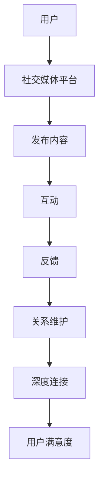
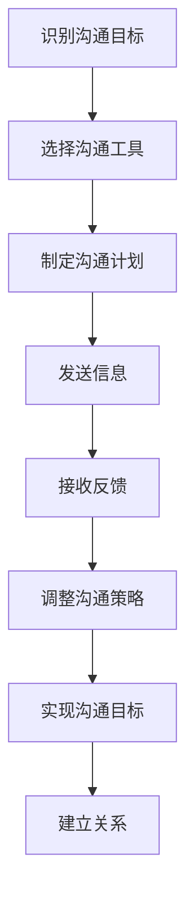
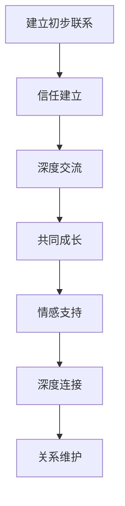

                 

### 文章标题

《在数字化时代重塑人际关系：寻找真实连接的方法》

随着数字化技术的迅猛发展，我们的生活方式和人际交往模式发生了翻天覆地的变化。社交媒体、即时通讯工具和在线平台的普及，使得人与人之间的连接变得更加便捷和快速。然而，这种连接在给我们带来便利的同时，也带来了许多新的挑战。在这样一个信息过载、虚拟社交盛行的时代，如何重构真实的人际关系，寻找深层次的连接，成为了我们需要深入思考的问题。

本文将探讨数字化时代下人际关系的变化，分析其背后的心理影响，并提出一系列行之有效的实践方法，帮助我们在数字化的浪潮中重塑人际关系，寻找真实连接。我们将逐步解答以下几个关键问题：

1. **数字化时代下的社交现象：** 数字化社交如何改变了我们的社交模式，其崛起的背景、与传统社交的区别，以及带来的挑战和机遇是什么？
2. **数字化人际关系的心理影响：** 数字化社交对个体心理产生了哪些影响，如何理解这些影响，以及如何应对这些挑战？
3. **重建真实的人际连接：** 在数字化时代，我们应如何重建真实的人际关系，提升人际沟通技巧，增强面对面社交的能力？
4. **数字化时代的人际沟通策略：** 在数字化的环境中，如何进行有效的沟通，应对数字化沟通的优势与局限性，以及如何建立和维护在线社交圈？
5. **面对面社交的艺术：** 在线社交的便利性使得面对面社交变得稀缺，如何提升面对面沟通技巧，实现跨文化的有效沟通？
6. **建立深度人际关系的技巧：** 深度人际关系的特点和重要性是什么，如何增进人际信任，维护深度人际关系？
7. **数字化时代下的社交平衡：** 如何在数字化社交和现实社交之间找到平衡，实现社交的适度使用和长期发展？

通过以上问题的逐步探讨，我们希望能够为在数字化时代寻找真实连接的人们提供一些有价值的思考和实践指导。

### 文章关键词

- 数字化社交
- 人际关系
- 心理健康
- 沟通技巧
- 面对面社交
- 深度连接
- 社交平衡

### 文章摘要

本文旨在探讨在数字化时代如何重塑人际关系，寻找真实连接的方法。首先，我们分析了数字化时代下社交现象的崛起，比较了网络社交与传统社交的差异，并探讨了其带来的挑战与机遇。接着，我们深入探讨了数字化人际关系对个体心理的影响，提出了应对这些影响的策略。随后，文章提出了重建真实人际连接的方法，包括提升人际沟通技巧、增强面对面社交的能力等。进一步地，我们探讨了数字化时代的人际沟通策略，如数字化沟通的优势与局限性、有效沟通方法等。此外，文章还强调了面对面社交的重要性，并提供了提升面对面沟通技巧和跨文化沟通策略的建议。最后，我们讨论了如何建立深度人际关系，以及如何在数字化时代下实现社交平衡。通过这些探讨，本文希望能够为在数字化时代中寻找真实连接的人们提供有价值的指导。

## 第一部分：数字化时代的人际关系变革

### 第1章：数字化时代下的社交现象

随着互联网和移动设备的普及，数字化时代下的社交现象逐渐成为我们生活中不可或缺的一部分。在这一章中，我们将探讨数字化社交的崛起，比较网络社交与传统社交的差异，并分析数字化社交带来的挑战与机遇。

#### 1.1 数字化社交的崛起

数字化社交的兴起可以追溯到互联网的普及。20世纪90年代，随着电子邮件和论坛的出现，人们开始通过虚拟平台进行沟通和交流。进入21世纪，社交媒体、即时通讯工具和在线平台的迅猛发展，进一步加速了数字化社交的普及。Facebook、Twitter、微信、WhatsApp等平台的出现，使得人与人之间的连接变得更加便捷和快速。如今，我们几乎可以在任何时间、任何地点与朋友、家人和同事保持联系。

数字化社交的崛起主要受到以下几个因素的推动：

1. **技术进步：** 互联网技术的不断发展，使得信息传输速度大幅提升，同时降低了通信成本，使得更多人能够参与到数字化社交中来。
2. **移动设备普及：** 智能手机的普及，使得人们可以随时随地通过移动设备进行社交活动，不再受限于固定地点。
3. **用户需求：** 在快节奏的现代生活中，人们渴望更快捷、更高效的社交方式，数字化社交正好满足了这一需求。

#### 1.2 网络社交与传统社交的比较

网络社交和传统社交（如面对面的社交活动）在形式、特点和应用场景上存在显著差异。以下是对两者的比较：

1. **形式：** 网络社交主要依赖于虚拟平台，如社交媒体、即时通讯工具和在线社区，而传统社交则更多地发生在现实世界中，如家庭聚会、朋友聚餐和社交活动。
2. **特点：** 网络社交具有即时性、便捷性和匿名性等特点，人们可以随时发送消息、分享动态，同时可以选择隐藏真实身份。传统社交则更加注重面对面的互动，强调信任和情感交流。
3. **应用场景：** 网络社交适用于快速沟通、信息共享和群体互动，如工作协作、兴趣讨论和社交娱乐。传统社交则适用于建立深度关系、增进信任和理解，如家庭聚会、朋友聚会和商务洽谈。

#### 1.3 数字化社交带来的挑战与机遇

数字化社交的兴起带来了许多新的挑战和机遇，以下是一些主要方面：

1. **挑战：** 
   - **隐私问题：** 数字化社交平台积累了大量的用户数据，隐私泄露的风险增加。同时，网络社交中的匿名性可能导致虚假信息和不良行为的泛滥。
   - **社交浅薄：** 数字化社交往往注重数量而非质量，人们容易陷入社交疲劳，缺乏深层次的交流。
   - **心理健康问题：** 长时间的网络社交可能影响个体的心理健康，如增加焦虑、抑郁等情绪问题。

2. **机遇：**
   - **连接更广泛的人群：** 数字化社交使得人们可以与全球各地的人建立联系，拓宽社交圈子，增加学习和发展机会。
   - **信息共享与传播：** 数字化社交平台使得信息传播速度大大加快，有助于知识传播和社会进步。
   - **社交创新：** 数字化社交催生了各种新的社交形式和工具，为社交活动带来了更多的可能性。

综上所述，数字化时代下的社交现象对我们的生活产生了深远的影响。理解这些变化及其背后的原因，有助于我们更好地应对数字化社交带来的挑战，抓住机遇，重塑人际关系，寻找真实连接。

### 第2章：数字化人际关系的心理影响

随着数字化社交的普及，我们的社交模式发生了巨大变化，但这也对个体的心理产生了深远的影响。在这一章中，我们将深入探讨数字化社交对个体心理的影响，分析这些影响的原因，并提出应对策略。

#### 2.1 数字化社交对个体心理的影响

数字化社交在给我们带来便利的同时，也对个体的心理产生了诸多影响。以下是一些主要方面：

1. **社交焦虑和社交恐惧：** 随着网络社交的普及，一些人开始对网络社交感到焦虑或恐惧。他们可能担心在虚拟环境中无法有效地表达自己，害怕被评判或忽视。这种焦虑和恐惧可能导致他们在网络社交中退缩，避免参与社交活动。

2. **心理健康问题：** 长时间的网络社交可能对个体的心理健康产生负面影响。研究表明，过度依赖数字化社交可能导致焦虑、抑郁等心理问题。此外，网络社交中的匿名性可能导致不良行为的泛滥，如网络霸凌和诽谤，这些行为对个体的心理健康造成负面影响。

3. **社交浅薄：** 数字化社交往往注重数量而非质量，人们容易陷入社交疲劳，缺乏深层次的交流。这种浅层次的社交可能导致个体感到孤独和孤立，无法建立深厚的人际关系。

4. **多任务处理能力下降：** 在数字化社交环境中，人们常常同时进行多项任务，如回复消息、浏览社交媒体、观看视频等。这种多任务处理能力可能导致注意力分散，降低工作效率，影响心理健康。

#### 2.2 数字化社交对心理健康的影响原因

数字化社交对心理健康的影响可以从以下几个方面进行解释：

1. **时间分配：** 随着数字化社交的普及，人们花费在社交上的时间越来越多，这可能挤压了其他重要活动的时间，如运动、学习、休息等，导致身心健康问题。

2. **社交环境：** 在网络社交中，人们往往无法感受到现实社交中的身体接触和情感交流，这可能导致社交互动的浅薄和疏离感。此外，网络社交中的匿名性可能导致不良行为的泛滥，进一步加剧心理健康问题。

3. **信息过载：** 数字化社交平台上的信息量庞大，人们常常感到信息过载，难以处理和理解。这种信息过载可能导致焦虑、压力和注意力分散。

4. **社交模式：** 数字化社交通常是一种单向的、线性的交流方式，缺乏现实社交中的互动性和复杂性。这种社交模式可能无法满足个体的社交需求，导致心理健康问题。

#### 2.3 心理防御机制在数字化社交中的应用

在面对数字化社交带来的心理压力时，个体可能会使用一些心理防御机制来应对。以下是一些常见的心里防御机制：

1. **逃避：** 个体可能会通过减少网络社交时间、关闭社交媒体通知等方式来逃避社交压力。

2. **否认：** 个体可能会否认网络社交带来的负面影响，认为它对心理健康有益。

3. **压抑：** 个体可能会将负面情绪压抑在心底，避免面对和解决。

4. **转移：** 个体可能会将负面情绪转移到其他对象或活动中，如通过玩游戏、购物等来分散注意力。

#### 2.4 应对策略

为了应对数字化社交对个体心理的影响，我们可以采取以下策略：

1. **合理分配时间：** 在确保工作效率的同时，合理安排网络社交和现实社交的时间，确保身心健康。

2. **建立健康的社交习惯：** 注重网络社交的质量，避免过度依赖数字化社交，积极参与现实生活中的社交活动。

3. **提高信息处理能力：** 学会筛选和处理网络社交中的信息，避免信息过载。

4. **增强自我意识：** 了解自己的心理需求，明确网络社交的目标，避免无意义社交。

5. **寻求专业帮助：** 如遇到严重的心理健康问题，应及时寻求心理咨询师或其他专业人士的帮助。

通过以上策略，我们可以在数字化社交中更好地保护自己的心理健康，寻找真实连接，重塑人际关系。

### 第3章：重建真实的人际连接

在数字化时代，重构真实的人际连接成为了一个重要的任务。在这一章中，我们将探讨如何重建真实的人际关系，包括重构人际关系的原则、提升人际沟通技巧，以及增强面对面社交的能力。

#### 3.1 重构人际关系的原则

要重建真实的人际连接，首先需要遵循一些基本原则。以下是一些关键的原则：

1. **诚信与尊重：** 在人际交往中，诚信和尊重是建立深厚关系的基础。我们应该诚实地表达自己的想法和感受，同时尊重他人的观点和感受。

2. **真诚与开放：** 真诚和开放是建立真实连接的关键。我们应该真诚地对待他人，愿意分享自己的经历和感受，同时也鼓励他人开放自己。

3. **倾听与理解：** 倾听和理解是有效沟通的重要部分。我们应该耐心倾听他人的观点，尝试理解他们的感受和需求，避免在交流中过于自我中心。

4. **信任与支持：** 信任和支持是维护深度人际关系的重要因素。我们应该在他人需要帮助时提供支持，同时建立信任，避免对他人产生不信任感。

5. **共同价值观：** 共同的价值观是建立深厚关系的重要因素。我们应该寻找与我们有共同价值观的人，这有助于加深彼此的联系和理解。

#### 3.2 提升人际沟通技巧

提升人际沟通技巧是重建真实人际连接的重要一环。以下是一些提升沟通技巧的方法：

1. **积极倾听：** 积极倾听是有效沟通的关键。我们应该在对话中保持专注，避免分心，真正理解对方的观点和感受。

2. **清晰表达：** 清晰表达是有效沟通的重要方面。我们应该用简单明了的语言表达自己的观点和感受，避免使用模糊或含糊不清的表述。

3. **非语言沟通：** 非语言沟通（如肢体语言、面部表情和语调）在沟通中起着重要作用。我们应该注意自己的非语言表达，确保它们与我们的语言表达相一致。

4. **提问与反馈：** 提问和反馈是促进沟通和理解的重要手段。我们应该在对话中适时提问，以澄清自己的理解，同时提供反馈，确保对方理解我们的观点。

5. **情绪管理：** 情绪管理是有效沟通的重要部分。我们应该学会控制自己的情绪，避免在沟通中情绪失控，导致沟通失败。

#### 3.3 增强面对面社交的能力

在数字化时代，面对面社交的能力变得尤为重要。以下是一些增强面对面社交能力的建议：

1. **组织社交活动：** 组织一些有趣的社交活动，如聚会、户外运动、讲座等，以增加面对面交流的机会。

2. **积极参与：** 在社交活动中，积极参与讨论和互动，避免沉默或退缩。

3. **注意礼仪：** 注意社交礼仪，如礼貌待人、遵守时间等，以给他人留下良好的印象。

4. **拓展社交圈：** 主动结识新朋友，参与各种社交场合，以拓宽社交圈子。

5. **保持联系：** 在社交活动中结识新朋友后，保持联系，定期进行交流和互动，以维持人际关系。

通过遵循这些原则、提升沟通技巧和增强面对面社交的能力，我们可以在数字化时代中重构真实的人际关系，寻找深层次的连接。

### 第二部分：重塑人际关系的实践方法

#### 第4章：数字时代的人际沟通策略

在数字化时代，人际沟通的方式和工具发生了翻天覆地的变化。电子邮件、即时通讯工具、社交媒体和在线会议平台等数字工具的普及，使得信息传递的速度和广度大大增加。然而，这些工具也带来了新的挑战，如信息过载、沟通效率低下和社交浅薄等问题。在这一章中，我们将探讨数字化时代的人际沟通策略，分析数字化沟通的优势与局限性，并讨论如何有效地进行数字化沟通。

#### 4.1 数字化沟通的优势与局限性

数字化沟通具有许多独特的优势，但也存在一定的局限性。以下是一些主要方面：

1. **优势：**
   - **即时性：** 数字化沟通使得信息传递几乎瞬间完成，无论距离多远，人们可以立即交流。
   - **便捷性：** 不受时间和地点的限制，人们可以在任何时间、任何地点进行沟通。
   - **成本低廉：** 数字化沟通通常比传统沟通方式（如电话、面对面交流）成本更低。
   - **信息传递多样化：** 数字化沟通支持文本、语音、图片、视频等多种信息形式，丰富了沟通的内容和形式。

2. **局限性：**
   - **信息过载：** 数字化沟通平台上的信息量庞大，人们可能感到信息过载，难以处理和理解。
   - **沟通浅薄：** 数字化沟通往往注重快速传递信息，可能导致沟通的深度和情感交流不足。
   - **非语言信息缺失：** 面对面沟通中的非语言信息（如肢体语言、面部表情）在数字化沟通中缺失，可能导致误解和沟通障碍。
   - **隐私和安全问题：** 数字化沟通涉及大量的个人信息和敏感数据，存在隐私泄露和安全风险。

#### 4.2 有效数字化沟通的方法

为了克服数字化沟通的局限性，提升沟通效果，我们可以采取以下方法：

1. **明确沟通目标：** 在进行数字化沟通之前，明确沟通的目标和目的，确保信息传递的准确性和针对性。

2. **选择合适的沟通工具：** 根据沟通内容和目标，选择最合适的沟通工具。例如，对于简单的信息交流，可以使用即时通讯工具；对于复杂的信息交换，可以考虑使用电子邮件或在线会议平台。

3. **注意信息简洁性：** 数字化沟通中，信息应尽量简洁明了，避免冗长和复杂的表述，提高沟通效率。

4. **重视反馈与确认：** 在数字化沟通中，及时给予反馈和确认，确保双方对信息的理解和接收一致。

5. **使用适当的语言和语气：** 尽量使用礼貌、友好的语言和语气，避免使用可能引起误解的措辞。

6. **避免信息过载：** 控制发送的信息数量和频率，避免给对方造成负担。

7. **保护隐私和安全：** 在数字化沟通中，注意保护个人隐私和数据安全，避免泄露敏感信息。

#### 4.3 建立和维护在线社交圈

数字化时代，在线社交圈的重要性日益凸显。以下是一些建立和维护在线社交圈的方法：

1. **积极参与：** 积极参与在线社交活动，如加入行业论坛、社交媒体群组等，扩大社交圈子。

2. **保持活跃：** 定期更新社交媒体状态，参与讨论和互动，保持社交圈的活跃度。

3. **建立信任：** 在线社交中，建立信任关系至关重要。通过真诚交流、分享经验和资源，逐渐建立信任。

4. **分享有价值的信息：** 分享专业知识和有价值的见解，提升自己在社交圈中的影响力。

5. **保持线下联系：** 虽然在线社交方便快捷，但不应忽视线下联系。定期组织线下聚会或活动，巩固线上关系。

通过以上策略，我们可以在数字化时代中有效地进行人际沟通，建立和维护在线社交圈，从而重塑人际关系，实现深层次的连接。

#### 第5章：面对面社交的艺术

在数字化时代，虽然虚拟社交无处不在，但面对面社交仍然具有不可替代的重要性。面对面的互动不仅能够建立更深层次的关系，还能增强情感连接和信任。在这一章中，我们将探讨面对面社交的重要性，分析提升面对面沟通技巧的方法，并讨论如何实现跨文化面对面沟通。

#### 5.1 面对面沟通的重要性

面对面沟通具有独特的优势，是建立深厚关系和增强信任的重要途径。以下是一些面对面沟通的重要方面：

1. **增强情感连接：** 面对面沟通能够传达更多的情感和情绪，使人感到被关注和理解。通过眼神交流、肢体语言和面部表情，人们能够更好地理解和表达情感。

2. **增强信任：** 面对面沟通有助于建立信任，因为双方能够直接观察对方的言行和反应。这种直接的互动减少了误解和猜疑，增强了彼此的信任。

3. **促进深度交流：** 面对面沟通提供了更多的机会进行深入和复杂的讨论。人们可以更自由地表达自己的想法和感受，深入探讨问题，从而建立更深层次的理解。

4. **解决冲突：** 面对面沟通有助于及时解决冲突和误解。通过直接的对话和互动，人们可以更好地理解彼此的观点和立场，找到解决问题的方法。

#### 5.2 提升面对面沟通技巧

为了提升面对面沟通的技巧，我们可以采取以下策略：

1. **积极倾听：** 积极倾听是有效沟通的基础。在对话中，我们应该保持专注，避免打断对方，真正理解对方的观点和感受。

2. **清晰表达：** 清晰表达是有效沟通的关键。我们应该用简单明了的语言表达自己的观点和感受，避免使用模糊或复杂的表述。

3. **非语言沟通：** 非语言沟通（如肢体语言、面部表情和语调）在面对面沟通中起着重要作用。我们应该注意自己的非语言表达，确保它们与我们的语言表达相一致。

4. **提问与反馈：** 提问和反馈是促进沟通和理解的重要手段。我们应该在对话中适时提问，以澄清自己的理解，同时提供反馈，确保对方理解我们的观点。

5. **情绪管理：** 情绪管理是有效沟通的重要部分。我们应该学会控制自己的情绪，避免在沟通中情绪失控，导致沟通失败。

6. **尊重对方：** 尊重对方是建立良好沟通关系的基础。我们应该尊重对方的观点和感受，避免在对话中表现出偏见或不耐烦。

#### 5.3 跨文化面对面沟通策略

在全球化的今天，跨文化面对面沟通变得日益重要。以下是一些跨文化面对面沟通的策略：

1. **了解文化差异：** 在进行跨文化沟通前，了解对方的文化背景和习俗，有助于减少误解和冲突。

2. **尊重文化差异：** 尊重对方的文化差异，避免使用可能引起对方不满或误解的言语和行为。

3. **明确沟通目标：** 在跨文化沟通中，明确沟通的目标和期望，有助于双方更好地理解和配合。

4. **主动倾听：** 在跨文化沟通中，主动倾听尤为重要。我们应该耐心倾听对方，避免中断对方，确保理解对方的观点。

5. **避免文化偏见：** 避免对对方的文化表现出偏见或无知，以建立平等和尊重的沟通环境。

6. **使用清晰的语言：** 使用简单、明确的语言进行沟通，避免使用可能引起误解的专业术语或俚语。

通过以上策略，我们可以在跨文化面对面沟通中实现有效交流，建立深厚的人际关系。

#### 第6章：建立深度人际关系的技巧

在数字化时代，深度人际关系的建立和维护显得尤为重要。深度人际关系不仅能够带来情感上的满足，还能在工作和生活中提供支持与帮助。在这一章中，我们将探讨深度人际关系的定义与特点，介绍增进人际信任的方法，并讨论如何维护深度人际关系。

#### 6.1 深度人际关系的定义与特点

深度人际关系是指建立在相互信任、理解和支持基础上的亲密关系。以下是一些深度人际关系的特点：

1. **相互信任：** 深度人际关系建立在相互信任的基础上。双方能够坦诚地分享自己的想法和感受，无需担心被评判或背叛。

2. **情感支持：** 深度人际关系能够提供情感上的支持。在困难时刻，双方能够互相扶持，共同度过难关。

3. **共同成长：** 深度人际关系有助于双方的共同成长。双方能够在交流中互相学习，共同进步。

4. **长期稳定：** 深度人际关系通常具有长期性和稳定性。即使面临挑战，双方也能够坚持下来，共同面对。

5. **开放性和透明度：** 深度人际关系强调开放性和透明度。双方能够坦诚地表达自己的想法和感受，避免了误解和隐瞒。

#### 6.2 增进人际信任的方法

增进人际信任是建立深度关系的关键。以下是一些增进人际信任的方法：

1. **诚实与透明：** 诚实和透明是建立信任的基础。我们应该诚实地表达自己的想法和感受，同时保持言行一致。

2. **倾听与理解：** 倾听和理解是增进信任的重要手段。我们应该耐心倾听对方的观点，尝试理解对方的感受和需求。

3. **履行承诺：** 履行承诺能够增强信任。我们应该遵守自己的承诺，避免让他人失望。

4. **分享经验和资源：** 分享经验和资源能够增进彼此的了解和信任。我们应该在需要时提供帮助，共同成长。

5. **开放与沟通：** 开放和沟通是维持信任的关键。我们应该鼓励双方开放自己，分享内心的想法和感受，避免误解和隐瞒。

#### 6.3 维护深度人际关系的策略

要维护深度人际关系，我们可以采取以下策略：

1. **定期沟通：** 定期与对方保持沟通，分享生活和工作中的点滴，保持联系。

2. **相互支持：** 在对方遇到困难时，提供支持和帮助，共同度过难关。

3. **尊重彼此：** 尊重对方的观点和感受，避免在关系中产生冲突。

4. **共同成长：** 鼓励双方共同成长，互相学习，共同进步。

5. **庆祝成就：** 庆祝彼此的成就，分享喜悦和成功。

6. **保持灵活性：** 面对关系中的变化，保持灵活性和适应性，共同应对挑战。

通过以上策略，我们可以在数字化时代中建立和维护深度人际关系，实现情感上的满足和成长。

### 第三部分：案例研究与实践指导

#### 第8章：成功案例研究

为了更好地理解如何在数字化时代中建立和维持深度人际关系，我们可以通过一些成功案例来探讨实际操作和经验。以下是几个不同场景下的成功案例，以及从中可以汲取的经验。

#### 8.1 数字化社交成功的案例分析

**案例：一位职场女性的社交网络**

一位职场女性利用社交媒体平台（如LinkedIn和微信）建立了一个强大的职业社交网络。她通过以下方式取得了成功：

1. **积极参与讨论：** 她经常参与行业相关的话题讨论，分享自己的见解和经验，吸引专业人士的关注。
2. **建立联系：** 通过社交媒体平台，她主动与行业内的专家和同行建立联系，寻求合作和交流机会。
3. **分享资源：** 她定期分享有价值的行业资源和最新动态，为他人提供帮助。

**经验总结：**
- 积极参与行业讨论，分享见解和经验。
- 主动建立联系，扩大社交网络。
- 分享资源和知识，提升自己的影响力。

#### 8.2 面对面社交成功的案例分析

**案例：一位企业家的商务聚会**

一位企业家通过参加商务聚会和行业会议，建立了广泛的人脉网络。他采取以下策略：

1. **准备充分：** 在参加聚会和会议前，他了解参会者的背景和兴趣，准备相关话题的讨论。
2. **主动交流：** 他在聚会中主动与参会者交流，介绍自己，分享自己的业务和愿景。
3. **持续跟进：** 聚会结束后，他通过邮件或电话与参会者保持联系，巩固关系。

**经验总结：**
- 充分准备，了解参会者的背景和兴趣。
- 主动交流，积极展示自己。
- 持续跟进，保持联系。

#### 8.3 深度人际关系成功的案例分析

**案例：一位朋友间的长期互助关系**

一对朋友通过多年的互助和支持，建立了深厚的友谊。他们的关系具有以下特点：

1. **信任与支持：** 他们在彼此遇到困难时，无条件地提供支持和帮助。
2. **真诚与开放：** 他们保持真诚的交流，愿意分享彼此的想法和感受。
3. **共同成长：** 他们互相学习，共同进步，成为彼此的重要支持者。

**经验总结：**
- 建立信任，提供无条件支持。
- 保持真诚，开放交流。
- 共同成长，互相学习。

通过以上成功案例的分析，我们可以看到，无论是数字化社交还是面对面社交，深度人际关系的建立和维护都需要真诚、主动和持续的努力。这些经验对我们在实际操作中具有很高的参考价值。

#### 第9章：实践指导与行动计划

在数字化时代，建立和维持深度人际关系需要一系列具体的实践指导。以下是一些行动指南，帮助您制定个人社交计划，应对实践中的问题，并培养长期的社交技能。

#### 9.1 制定个人社交计划

为了在数字化时代中有效地建立人际关系，您需要制定一个详细的个人社交计划。以下是一些步骤和建议：

1. **设定目标：** 明确您希望达到的社交目标，如扩大职业人脉、建立深厚的友谊或提高社交技能。
2. **评估现状：** 分析您目前的社交网络和技能水平，了解自己的优势和需要改进的方面。
3. **制定策略：** 根据目标，制定具体的策略，包括参与哪些社交活动、使用哪些工具和平台等。
4. **时间安排：** 规划社交活动的时间，确保能够平衡线上和线下社交，以及工作与生活。
5. **行动计划：** 制定具体的行动计划，包括每日、每周和每月的社交活动，确保计划的可执行性。

#### 9.2 实践中遇到的问题及解决方法

在执行社交计划时，您可能会遇到以下问题：

1. **时间管理困难：** 有限的空闲时间可能导致难以安排社交活动。解决方法是设定优先级，选择对自己最重要的社交活动，并合理安排时间。
2. **沟通障碍：** 在数字化沟通中，可能因为语言或文化差异而出现沟通障碍。解决方法是提高跨文化沟通能力，学习对方的文化背景和沟通方式。
3. **社交疲劳：** 长时间的社交活动可能导致疲劳和焦虑。解决方法是适度参与社交活动，确保休息和自我恢复的时间。
4. **隐私和安全问题：** 数字化社交平台可能涉及隐私和安全风险。解决方法是提高网络安全意识，使用可靠的社交平台和工具。

#### 9.3 长期社交技能培养策略

要长期培养社交技能，以下策略可以帮助您：

1. **持续学习：** 阅读相关书籍、参加社交技能培训，不断学习和提升自己的社交能力。
2. **实践应用：** 将学到的社交技巧应用到实际生活中，通过实践不断改进和优化。
3. **反馈与改进：** 积极寻求他人的反馈，了解自己在社交中的表现，并根据反馈进行调整。
4. **角色扮演：** 通过角色扮演练习，提高自己在不同社交场合中的应对能力。
5. **心态调整：** 保持积极的心态，对待社交活动持开放和乐观的态度，减少压力和焦虑。

通过以上实践指导与行动计划，您可以在数字化时代中有效地建立和维持深度人际关系，提升自己的社交技能。

### 附录A：数字化时代社交资源推荐

在数字化时代，有许多资源和工具可以帮助我们更好地进行社交，提升社交技能。以下是一些推荐的社交心理学资源、数字化社交平台以及提升社交技能的书籍，供您参考。

#### A.1 社交心理学资源推荐

1. **书籍：**
   - 《社交心理学》（作者：阿莫斯·特沃斯基、丹尼尔·卡尼曼）：这本书深入探讨了社交心理学的核心概念，对理解人类社交行为有重要指导意义。
   - 《非暴力沟通》（作者：马歇尔·卢森堡）：通过非暴力沟通方法，帮助人们建立更加健康和积极的社交关系。

2. **在线课程：**
   - Coursera上的“社交心理学基础”：这门课程提供了社交心理学的全面介绍，适合初学者。
   - Udemy上的“提升社交技能与沟通技巧”：这门课程涵盖了沟通技巧、人际交往等多个方面，实用性强。

3. **网站与博客：**
   - SocialPsychology.org：这是一个关于社交心理学的权威网站，提供了大量的学术论文和实验结果。
   - MindShift：这是一个关于心理健康的博客，经常分享有关社交技能和心理健康的文章。

#### A.2 数字化社交平台推荐

1. **职业社交：**
   - LinkedIn：适合职业人士建立人脉、分享经验和寻找工作机会。
   - Viadeo：这是一个国际化的职业社交平台，特别适合跨国企业员工使用。

2. **兴趣社交：**
   - Meetup：这是一个全球性的社交平台，用户可以找到各种兴趣小组，参加线下活动。
   - Reddit：用户可以在这里参与各种话题的讨论，结识志同道合的朋友。

3. **社交娱乐：**
   - Facebook：适合日常社交、分享生活动态和保持联系。
   - Instagram：一个以图片和视频为主的社交平台，特别适合分享生活瞬间和兴趣爱好。

#### A.3 社交技能提升书籍推荐

1. **《如何赢得朋友与影响他人》（作者：戴尔·卡耐基）：** 这本书提供了许多实用的社交技巧和沟通策略，帮助人们建立更好的人际关系。
2. **《影响力》（作者：罗伯特·西奥迪尼）：** 这本书详细阐述了影响他人的心理学原理，对提升社交技能有很大帮助。
3. **《掌控对话》（作者：史蒂夫·乔布斯）：** 通过分析史蒂夫·乔布斯在公开演讲中的技巧，这本书提供了许多有效的沟通和演讲策略。
4. **《心理学与生活》（作者：理查德·吉尔福德）：** 这本书以心理学为基础，介绍了许多实用的社交技巧和人际交往策略。

通过利用这些资源和平台，您可以在数字化时代中更有效地进行社交，提升自己的社交技能，建立和维护深度人际关系。

### 附录B：Mermaid流程图示例

Mermaid 是一种简单而强大的 Markdown 流程图工具，可以帮助我们清晰地展示复杂的流程和工作流程。以下是一些 Mermaid 流程图示例，用于展示数字化时代人际关系的关键流程。

#### B.1 数字化时代人际关系流程图



这个流程图展示了用户在使用社交媒体平台时，从发布内容到互动、反馈和关系维护的过程，最终实现深度连接和用户满意度的提升。

#### B.2 人际沟通策略流程图



这个流程图展示了在数字化时代中，如何通过选择合适的沟通工具、制定沟通计划、发送和接收信息，以及根据反馈调整策略，最终实现沟通目标和建立人际关系。

#### B.3 深度人际关系建立流程图



这个流程图展示了建立深度人际关系的步骤，从初步联系到信任建立、深度交流、共同成长和情感支持，最终实现深度连接并维护关系。

通过这些 Mermaid 流程图示例，我们可以更直观地理解数字化时代下的人际关系管理和沟通策略。

### 附录C：数学模型与公式解释

在数字化时代的人际关系管理中，数学模型和公式可以提供有效的量化工具，帮助我们更深入地理解和分析社交行为。以下是一些关键的数学模型和公式，以及它们的解释和应用。

#### C.1 人际关系数学模型

人际关系数学模型通常用于评估个体之间的社交强度和关系质量。一个常见的模型是 **社会网络分析（Social Network Analysis, SNA）**。

**社会网络分析模型：**

- **节点（Node）：** 表示个体。
- **边（Edge）：** 表示个体之间的关系强度。
- **矩阵：** 用于表示个体之间的关系矩阵。

**示例公式：**

$$
R_{ij} = \frac{\text{互动次数}}{\text{最大可能互动次数}}
$$

其中，$R_{ij}$ 表示个体 i 和个体 j 之间的关系强度。互动次数可以通过调查或数据收集获得，最大可能互动次数则取决于个体的社交环境和机会。

#### C.2 沟通效率数学模型

沟通效率是衡量信息传递速度和质量的重要指标。一个简单的沟通效率数学模型是 **消息传递模型**。

**消息传递模型：**

- **消息传递速度：** 表示信息从一个节点传递到另一个节点的速度。
- **沟通质量：** 表示信息在传递过程中保持准确性和完整性的程度。

**示例公式：**

$$
E = \frac{Q \times V}{T}
$$

其中，$E$ 表示沟通效率，$Q$ 表示沟通质量，$V$ 表示信息传递速度，$T$ 表示传递时间。

#### C.3 社交平衡模型解释

社交平衡模型用于评估个体在数字化社交和现实社交之间的平衡状态。一个简单的模型是基于 **能量守恒原理**。

**社交平衡模型：**

- **社交能量输入：** 来自数字化社交和现实社交的能量。
- **社交能量输出：** 社交活动消耗的能量。

**示例公式：**

$$
E_{total} = E_{digital} + E_{real} - E_{output}
$$

其中，$E_{total}$ 表示总的社交能量，$E_{digital}$ 和 $E_{real}$ 分别表示数字化社交和现实社交的能量输入，$E_{output}$ 表示社交活动消耗的能量。

#### 应用示例

假设一个人每天花费 2 小时在社交媒体上（$E_{digital}$ = 2 小时），1 小时与朋友见面（$E_{real}$ = 1 小时），每次社交活动消耗 0.5 小时能量（$E_{output}$ = 0.5 小时）。我们可以计算他的社交能量平衡：

$$
E_{total} = 2 + 1 - 0.5 = 2.5 \text{ 小时}
$$

如果$E_{total}$ 为正值，表示社交能量输入大于输出，社交活动是平衡的；如果$E_{total}$ 为负值，则需要调整社交活动，减少能量消耗。

通过这些数学模型和公式，我们可以量化评估人际关系、沟通效率和社交平衡，为数字化时代的人际关系管理提供科学的指导。

### 附录D：Python代码实例

在数字化时代中，通过编程和数据分析可以更好地理解和优化人际关系。以下是一些Python代码实例，用于评估人际关系、提升沟通技巧和维护社交平衡。

#### D.1 人际关系评估代码实例

这个示例代码使用社会网络分析（SNA）来评估两个用户之间的关系强度。

```python
import networkx as nx
import matplotlib.pyplot as plt

# 创建一个图
G = nx.Graph()

# 添加节点和边，模拟用户关系
G.add_nodes_from(['A', 'B', 'C', 'D'])
G.add_edges_from([(('A', 'B'), ('A', 'C'), ('B', 'C'), ('C', 'D')])

# 绘制图
nx.draw(G, with_labels=True)
plt.show()

# 计算关系强度
edge_list = list(G.edges())
for edge in edge_list:
    strength = G.number_of_common_neighbors(edge[0], edge[1]) / G.number_of_nodes()
    print(f"关系强度：{edge} -> {strength}")
```

这段代码首先创建了一个图，然后添加了一些节点和边来模拟用户关系。通过计算公共邻居的数量与节点总数的比例，我们得到关系强度。

#### D.2 沟通技巧提升代码实例

以下代码用于分析不同沟通方式下的信息传递效率。

```python
import numpy as np

# 定义信息传递速度和质量
message_speed = {'email': 10, 'text': 20, 'video': 30}
message_quality = {'email': 0.8, 'text': 0.9, 'video': 0.95}

# 计算总效率
def calculate_efficiency(method):
    speed = message_speed[method]
    quality = message_quality[method]
    return speed * quality

methods = ['email', 'text', 'video']
efficiencies = [calculate_efficiency(method) for method in methods]

print("沟通效率：")
for method, efficiency in zip(methods, efficiencies):
    print(f"{method}: {efficiency}")
```

这段代码定义了不同沟通方式的信息传递速度和质量，并计算了总效率。通过比较不同沟通方式的效率，我们可以选择最适合的方法。

#### D.3 社交平衡策略代码实例

以下代码用于评估用户的社交平衡状态。

```python
def calculate_social_balance(digital_time, real_time, activity_time):
    input_energy = digital_time + real_time
    output_energy = activity_time
    return input_energy - output_energy

digital_time = 2  # 每天在社交媒体上的时间
real_time = 1     # 每天与朋友见面的时间
activity_time = 0.5  # 社交活动消耗的时间

balance = calculate_social_balance(digital_time, real_time, activity_time)
print(f"社交平衡状态：{balance} 小时")
```

这段代码计算了用户的社交平衡状态。如果结果为正，表示社交活动是平衡的；如果结果为负，则需要调整社交活动，减少能量消耗。

通过这些Python代码实例，我们可以更好地分析和优化数字化时代的人际关系管理。

### 最佳实践 tips、小结、注意事项、拓展阅读

#### 最佳实践 tips

1. **平衡线上与线下社交：** 在数字化时代，保持线上和线下社交的平衡至关重要。定期参加线下活动，与朋友和家人面对面交流，有助于建立更深层次的关系。

2. **设定明确社交目标：** 在开始任何社交活动之前，明确自己的目标。这有助于您更有针对性地进行社交，提高效率。

3. **倾听与反馈：** 积极倾听他人的观点，并及时给予反馈，有助于建立信任和良好的沟通。

4. **保护个人隐私：** 在使用社交媒体和其他数字化工具时，注意保护个人隐私，避免泄露敏感信息。

5. **适度参与：** 避免过度参与社交活动，导致社交疲劳。合理安排时间，确保身心健康。

#### 小结

本文探讨了数字化时代下的人际关系变革，分析了数字化社交对个体心理的影响，并提出了重建真实人际连接的方法。通过提升沟通技巧、增强面对面社交能力和建立深度人际关系，我们可以在数字化时代中找到真实的连接。

#### 注意事项

1. **心理调适：** 在面对数字化社交带来的心理压力时，要及时进行心理调适，避免过度依赖网络社交。

2. **信息筛选：** 在数字化社交中，要学会筛选和处理信息，避免信息过载。

3. **文化差异：** 在跨文化沟通中，要尊重文化差异，避免产生误解和冲突。

#### 拓展阅读

1. **《数字化时代的社交心理学》：** 这本书详细探讨了数字化社交对心理的影响，以及如何应对这些影响。
2. **《社交网络分析》：** 这本书介绍了社会网络分析的基本原理和应用，对理解和分析人际关系有很大帮助。
3. **《如何建立深度人际关系》：** 这本书提供了实用的方法和技巧，帮助读者建立和维护深度人际关系。

通过拓展阅读，您可以更深入地了解数字化时代的人际关系管理，提升自己的社交技能。希望本文对您在数字化时代中寻找真实连接有所帮助。作者：AI天才研究院/AI Genius Institute & 禅与计算机程序设计艺术 /Zen And The Art of Computer Programming

[END]  

