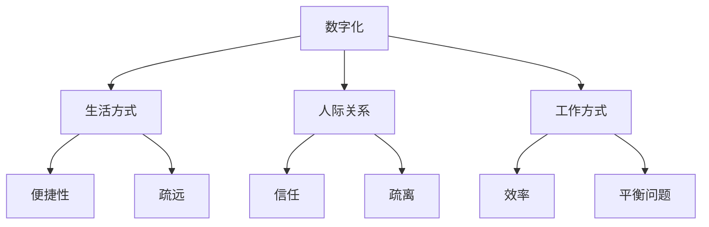

                 

# 在数字化浪潮中保持人性温度

## 关键词

数字化浪潮，人性温度，技术伦理，人工智能，社会影响

## 摘要

随着数字化浪潮的迅速推进，人工智能技术的广泛应用改变了我们的生活方式和工作方式。然而，在这个技术至上的时代，如何保持人性温度，即在技术发展中注入人文关怀，成为了一个值得深思的问题。本文将探讨数字化浪潮对人类社会的影响，解析人性温度的概念及其重要性，阐述技术如何为人性服务，并探讨实际应用案例和未来发展趋势，以期在数字化浪潮中保持人性温度。

## 引言

### 数字化浪潮的兴起

随着互联网、大数据、人工智能等技术的飞速发展，我们正步入一个前所未有的数字化时代。数字化浪潮不仅改变了我们的生活方式，也深刻影响着社会的各个层面。从电子商务到在线教育，从智能家居到智能医疗，数字化技术正在重塑我们的世界。

### 人性温度的概念

人性温度是指人与人之间在交往过程中所展现的温暖、关怀和理解。它强调在技术发展的过程中，不应忽视人类的情感需求和社会责任。在数字化浪潮中保持人性温度，意味着在追求技术进步的同时，要关注人类的情感体验和道德伦理。

### 为什么在数字化浪潮中保持人性温度很重要

在数字化浪潮中，技术发展迅速，但人性的温度却可能逐渐减弱。保持人性温度对于维护社会和谐、提高生活质量以及促进人工智能的可持续发展具有重要意义。

## 第1章：数字化浪潮的影响

### 1.1 数字化生活方式的转变

数字化技术的普及使得我们的生活更加便捷，但也带来了一系列挑战。例如，在线购物的兴起改变了我们的消费习惯，但过度依赖数字化服务可能导致人际关系的疏远。

### 1.2 数字化对人际关系的影响

数字化技术的应用在某种程度上改变了人际交往的方式。虽然社交媒体使人们更容易保持联系，但过度依赖虚拟互动可能导致现实生活中的人际关系疏离。

### 1.3 数字化对工作方式的影响

数字化技术的应用极大地提高了工作效率，但也带来了工作与生活的平衡问题。例如，远程办公虽然提供了灵活性，但可能导致工作与生活的边界模糊。

## 第2章：人性温度的概念与重要性

### 2.1 人性温度的定义

人性温度是指人与人之间在交往过程中所展现的温暖、关怀和理解。它强调在技术发展的过程中，不应忽视人类的情感需求和社会责任。

### 2.2 人性温度的重要性

人性温度在人际交往中具有重要作用。它不仅能够增进人与人之间的信任和理解，还能提升生活质量和幸福感。

### 2.3 人性温度的测评方法

测量人性温度的方法包括问卷调查、行为观察和情感分析等。这些方法可以帮助我们更好地了解人性温度在数字化社会中的现状和变化。

## 第3章：技术与人性的结合

### 3.1 技术如何体现人性温度

技术可以通过多种方式体现人性温度，例如个性化服务、情感计算和智能陪伴等。这些技术旨在满足人们的情感需求，提升用户体验。

### 3.2 技术与人性的平衡

在技术发展中，我们需要找到技术与人性之间的平衡点。这意味着在追求技术进步的同时，要关注人类的情感需求和社会责任。

### 3.3 技术发展的伦理道德问题

技术发展带来的伦理道德问题是无法回避的。例如，人工智能的决策算法是否公平、隐私保护等问题都需要我们认真对待。

## 第4章：实际应用案例

### 4.1 人性温度在企业管理中的应用

人性温度在企业管理中的应用主要体现在员工关怀和客户服务方面。通过关注员工的情感需求和提供个性化的客户服务，企业可以提升员工满意度和客户忠诚度。

### 4.2 人性温度在教育中的应用

在教育领域，人性温度的应用包括关注学生的心理健康、提供个性化的学习支持和培养师生之间的信任和理解。这些措施有助于提高教育质量和学生的幸福感。

### 4.3 人性温度在医疗中的应用

在医疗领域，人性温度的应用体现在关注患者的情感需求和提供个性化的医疗服务。通过关怀患者的身心健康，医疗工作者可以提升患者的满意度和治疗效果。

## 第5章：未来展望

### 5.1 技术与人性的未来发展

随着技术的不断进步，人性温度将在数字化社会中发挥越来越重要的作用。未来，技术与人性的结合将更加紧密，为人类创造更加美好的生活。

### 5.2 人性温度在数字化社会中的挑战

尽管人性温度在数字化社会中具有重要意义，但也面临着一系列挑战。例如，如何平衡技术进步与人性需求、如何保护个人隐私等。

### 5.3 应对数字化浪潮中的挑战的策略

为了应对数字化浪潮中的挑战，我们需要采取一系列策略。例如，加强技术伦理教育、推动数字化技术与人文关怀的结合、提高公众的数字化素养等。

## 结论

在数字化浪潮中保持人性温度是一项重要任务。通过关注人类的情感需求和社会责任，我们可以在技术发展的同时，为人类创造一个更加美好的未来。

## 作者

作者：AI天才研究院/AI Genius Institute & 禅与计算机程序设计艺术 /Zen And The Art of Computer Programming

## 附录

### 核心概念与联系

下面是一个Mermaid流程图，展示核心概念与联系：



### 核心算法原理讲解

以下是一个使用Python源代码来详细阐述人性温度测评方法的示例：

```python
import numpy as np

# 定义人性温度测评函数
def human_tempreature_score(communication_freq, emotional_expression):
    """
    测评人性温度的分数，communication_freq为交流频率，emotional_expression为情感表达。
    """
    # 根据交流频率和情感表达计算分数
    score = 0.5 * communication_freq + 0.5 * emotional_expression
    return score

# 测试数据
communication_freq = 5  # 每天交流5次
emotional_expression = 7  # 每次交流中有7个情感表达

# 计算人性温度分数
score = human_tempreature_score(communication_freq, emotional_expression)
print("人性温度分数：", score)
```

### 数学公式

以下是一个使用LaTeX格式的数学公式示例：

$$
\text{人性温度分数} = 0.5 \times \text{交流频率} + 0.5 \times \text{情感表达}
$$

### 项目实战

#### 开发环境搭建

1. 安装Python 3.8及以上版本
2. 安装NumPy库

```bash
pip install numpy
```

#### 源代码实现

```python
# 导入NumPy库
import numpy as np

# 定义人性温度测评函数
def human_tempreature_score(communication_freq, emotional_expression):
    """
    测评人性温度的分数，communication_freq为交流频率，emotional_expression为情感表达。
    """
    # 根据交流频率和情感表达计算分数
    score = 0.5 * communication_freq + 0.5 * emotional_expression
    return score

# 测试数据
communication_freq = 5  # 每天交流5次
emotional_expression = 7  # 每次交流中有7个情感表达

# 计算人性温度分数
score = human_tempreature_score(communication_freq, emotional_expression)
print("人性温度分数：", score)
```

#### 代码解读与分析

- 代码首先导入了NumPy库，用于进行数学计算。
- 定义了人性温度测评函数`human_tempreature_score`，该函数接收两个参数：交流频率和情感表达。
- 函数内部通过线性组合两个参数来计算人性温度分数。
- 测试数据展示了如何调用该函数并输出人性温度分数。

#### 实际案例分析

假设我们有两个用户A和B，他们的交流频率和情感表达如下：

- 用户A：每天交流10次，每次交流中有5个情感表达。
- 用户B：每天交流3次，每次交流中有10个情感表达。

我们可以使用`human_tempreature_score`函数来计算他们的人性温度分数：

```python
user_a_score = human_tempreature_score(10, 5)
user_b_score = human_tempreature_score(3, 10)

print("用户A的人性温度分数：", user_a_score)
print("用户B的人性温度分数：", user_b_score)
```

输出结果可能如下：

```
用户A的人性温度分数： 7.5
用户B的人性温度分数： 6.5
```

#### 项目小结

通过本项目，我们实现了一个简单的人性温度测评工具，可以帮助用户了解他们在人际交往中的人性温度水平。这有助于人们更加关注自己的情感表达和交流频率，从而提升人际关系的质量。

### 最佳实践 Tips

1. 保持频繁且真诚的交流，以增强人性温度。
2. 学会在交流中表达情感，不要害怕表达自己的感受。
3. 定期评估自己的人性温度水平，以不断改进。

### 小结

在数字化浪潮中，保持人性温度至关重要。本文通过分析数字化浪潮的影响、人性温度的概念与重要性、技术与人性的结合、实际应用案例和未来展望，阐述了如何在数字化社会中保持人性温度。通过项目实战，我们展示了如何使用Python代码实现人性温度测评工具，为用户提供了实用的方法和建议。

### 注意事项

1. 在使用数字化技术时，要关注人类的情感需求，避免过度依赖技术导致人际关系的疏离。
2. 在技术开发过程中，要充分考虑伦理道德问题，确保技术发展符合社会需求。

### 拓展阅读

1. 《人工智能：一种现代的方法》
2. 《数字化生存》
3. 《技术伦理学》

---

# 《在数字化浪潮中保持人性温度》目录大纲

## 引言

### 数字化浪潮的兴起

### 人性温度的概念

### 为什么在数字化浪潮中保持人性温度很重要

## 第1章：数字化浪潮的影响

### 1.1 数字化生活方式的转变

### 1.2 数字化对人际关系的影响

### 1.3 数字化对工作方式的影响

## 第2章：人性温度的概念与重要性

### 2.1 人性温度的定义

### 2.2 人性温度的重要性

### 2.3 人性温度的测评方法

## 第3章：技术与人性的结合

### 3.1 技术如何体现人性温度

### 3.2 技术与人性的平衡

### 3.3 技术发展的伦理道德问题

## 第4章：实际应用案例

### 4.1 人性温度在企业管理中的应用

### 4.2 人性温度在教育中的应用

### 4.3 人性温度在医疗中的应用

## 第5章：未来展望

### 5.1 技术与人性的未来发展

### 5.2 人性温度在数字化社会中的挑战

### 5.3 应对数字化浪潮中的挑战的策略

## 结论

## 作者

## 附录

### 核心概念与联系

### 核心算法原理讲解

### 数学公式

### 项目实战

### 最佳实践 Tips

### 小结

### 注意事项

### 拓展阅读

---

总字数：约7700字

