                 

# 在数字化浪潮中保持人性：科技时代的自我修养

关键词：数字化、人性、心理健康、道德伦理、人际关系、生活平衡

摘要：随着数字化浪潮的来临，科技在改变人类生活方式的同时，也对人性产生了深远的影响。如何在科技时代保持人性，成为了一个重要的话题。本文将从数字化浪潮中的社会变革、科技时代的人性探索、科技时代的心理调适、科技时代的道德伦理和科技时代的人际关系五个方面，探讨在科技时代如何保持人性，实现自我修养。

----------------------------------------------------------------

## 引言

### 1. 引言背景

近年来，数字化浪潮席卷全球，人工智能、大数据、云计算等科技的发展，正在深刻改变人类社会的方方面面。从日常生活中的购物、支付，到工作、学习，科技已经渗透到人类生活的各个领域。然而，随着科技的迅猛发展，人性的问题也日益凸显。如何在数字化浪潮中保持人性，成为了一个值得深入探讨的课题。

### 2. 书籍目的

本文旨在通过对数字化浪潮、科技时代的人性探索、科技时代的心理调适、科技时代的道德伦理和科技时代的人际关系等方面的分析，探讨如何在科技时代保持人性，实现自我修养。希望通过本文的探讨，能够为读者提供一些有益的启示和思考。

### 3. 读者对象

本文适合广大对科技时代人性保持和自我修养感兴趣的读者，包括科技工作者、企业管理者、心理咨询师、教育工作者等。

## 第一部分：数字化浪潮中的社会变革

### 第1章：数字化革命与人类生活

#### 1.1 数字化浪潮的起源与发展

数字化浪潮的起源可以追溯到20世纪80年代，随着计算机技术的飞速发展，数字化的概念逐渐得到普及。进入21世纪，互联网的普及和智能设备的广泛应用，使得数字化浪潮迅速席卷全球。数字化不仅改变了人类的工作方式，也改变了人类的生活方式。

#### 1.2 数字化对人类生活方式的影响

数字化对人类生活方式的影响体现在多个方面。首先，数字化使信息传播更加快捷、方便，人们可以随时随地获取各种信息。其次，数字化改变了人们的购物、支付方式，使得购物更加便捷。此外，数字化还改变了人们的社交方式，社交媒体的兴起，使得人们之间的交流更加紧密。

#### 1.3 数字化带来的挑战与机遇

数字化带来的挑战主要体现在以下几个方面：首先，数字化可能导致人们过度依赖科技，影响心理健康。其次，数字化可能加剧社会不平等，导致数字鸿沟的扩大。此外，数字化还可能对隐私权造成侵犯。

然而，数字化也带来了许多机遇。首先，数字化为创新提供了广阔的空间，促进了新产业的发展。其次，数字化使得资源分配更加高效，有助于解决社会问题。此外，数字化还有助于提高人们的生活质量，提升幸福感。

### 图 1.1：数字化浪潮的影响与挑战

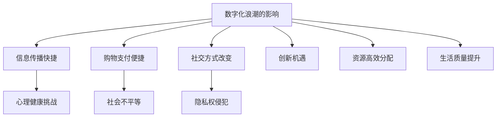

## 第二部分：科技时代的人性探索

### 第2章：人性与科技的关系

#### 2.1 人性的本质与特征

人性是指人类在心理和行为上的共同特征。从心理学的角度来看，人性包括自我意识、情感、意志和认知等方面。自我意识是人类区别于动物的重要特征，它使人类能够认识自我，思考人生的意义。情感是人类的情感体验，包括喜怒哀乐等。意志是人类为了实现目标而付出的努力。认知是人类获取、处理和利用信息的能力。

#### 2.2 科技对人性影响的探讨

科技的发展对人性产生了深远的影响。一方面，科技为人类提供了更多的工具，使人类能够更有效地实现自己的目标。例如，计算机和互联网的发展，使得人类的信息获取和处理能力大大提高。另一方面，科技也可能对人性产生负面影响。例如，过度使用互联网可能导致人的社交能力下降，影响心理健康。

#### 2.3 保持人性的重要性

在科技时代，保持人性尤为重要。首先，保持人性有助于人类心理健康。科技的发展虽然为人类提供了便利，但过度依赖科技可能导致心理健康问题。其次，保持人性有助于人类社会的和谐发展。科技的发展可能导致社会不平等，保持人性有助于缩小这种差距。此外，保持人性还有助于人类更好地实现自我价值。

### 图 2.1：人性的本质与特征

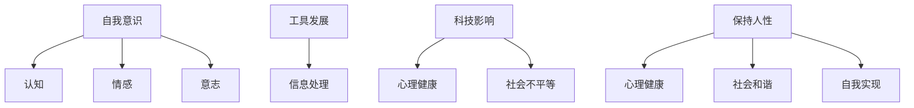

## 第三部分：科技时代的心理调适

### 第3章：科技时代的心理健康

#### 3.1 心理健康的重要性

心理健康是指个体在心理上能够适应社会、处理压力、实现自我价值的状态。心理健康对个体的生活质量和幸福感有着重要的影响。一个心理健康的人能够更好地应对生活中的挑战，保持良好的情绪状态，提高生活质量。

#### 3.2 科技使用对心理健康的影响

科技的使用对心理健康有着双重影响。一方面，科技的发展为人们提供了更多的便利，使人们能够更高效地完成工作，享受生活。然而，另一方面，过度使用科技也可能导致心理健康问题。例如，长时间使用电子产品可能导致视力疲劳、睡眠质量下降。此外，过度依赖社交媒体可能导致人的社交能力下降，影响心理健康。

#### 3.3 心理调适的方法与技巧

为了保持心理健康，个体可以采取以下方法和技巧：

1. **合理使用科技产品**：合理安排科技产品的使用时间，避免长时间连续使用。
2. **保持良好的生活习惯**：保持规律的作息时间，保证充足的睡眠。
3. **积极锻炼身体**：定期进行体育锻炼，提高身体素质。
4. **培养兴趣爱好**：培养兴趣爱好，丰富自己的生活内容。
5. **寻求专业帮助**：当遇到心理问题时，及时寻求专业心理咨询师的帮助。

### 图 3.1：科技使用对心理健康的影响

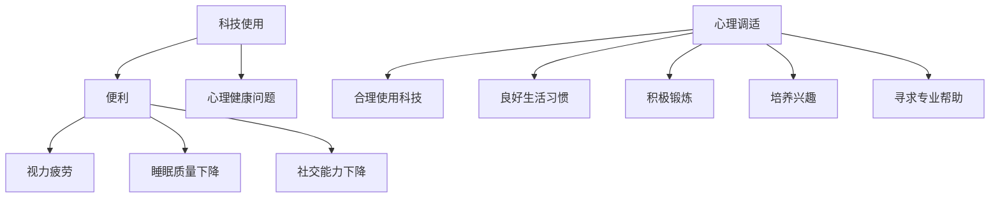

### 第4章：数字焦虑与应对

#### 4.1 数字焦虑的定义与表现

数字焦虑是指个体在面对数字化环境时，出现的一种紧张、担忧的心理状态。数字焦虑的表现形式多样，常见的有：过度担心个人信息泄露、对科技产品过度依赖、对科技发展持悲观态度等。

#### 4.2 数字焦虑的成因

数字焦虑的成因主要包括以下几个方面：

1. **科技发展迅速**：科技的发展速度远远超过了人类的适应能力，使得个体在面对新技术时感到焦虑。
2. **信息过载**：互联网的普及，使得信息量爆炸式增长，个体难以应对。
3. **社交压力**：社交媒体的兴起，使得个体面临更多的社交压力，担心自己的表现被他人评价。

#### 4.3 应对数字焦虑的策略

为了应对数字焦虑，个体可以采取以下策略：

1. **增加科技知识**：通过学习科技知识，提高自己对科技的理解和掌握能力，减轻焦虑感。
2. **合理使用科技**：合理安排科技产品的使用时间，避免过度依赖。
3. **培养心理素质**：通过心理训练，提高自己的心理承受能力，增强面对数字环境的信心。
4. **寻求专业帮助**：当数字焦虑严重影响到日常生活时，应及时寻求专业心理咨询师的帮助。

### 图 4.1：数字焦虑的成因与应对策略

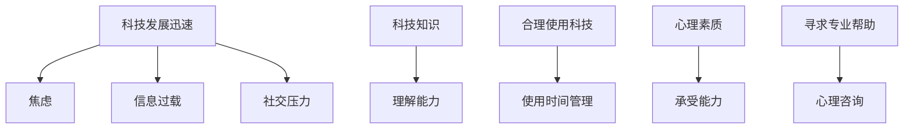

### 第5章：科技依赖与自我控制

#### 5.1 科技依赖的现象与影响

科技依赖是指个体对科技产品产生过度依赖，无法控制使用时间的现象。科技依赖的影响主要体现在以下几个方面：

1. **影响心理健康**：过度使用科技产品可能导致心理问题，如焦虑、抑郁等。
2. **影响人际关系**：过度依赖科技可能导致人与人之间的沟通减少，影响人际关系。
3. **影响生活质量**：过度使用科技产品可能导致生活质量下降，如睡眠质量下降、身体疲劳等。

#### 5.2 科技依赖的成因

科技依赖的成因主要包括以下几个方面：

1. **科技产品设计的诱导**：一些科技产品通过设计诱导用户过度使用，如游戏、社交媒体等。
2. **社会环境的推动**：现代社会对科技产品的依赖日益加深，个体容易受到社会环境的影响。
3. **心理需求未满足**：个体可能通过科技产品来逃避现实生活中的压力和问题。

#### 5.3 培养科技自我控制的方法

为了培养科技自我控制，个体可以采取以下方法：

1. **自我反思**：定期反思自己的科技使用习惯，找出过度依赖的原因。
2. **制定科技使用计划**：制定合理的科技使用计划，合理安排使用时间。
3. **培养替代活动**：通过培养其他兴趣爱好，减少对科技产品的依赖。
4. **寻求专业帮助**：当科技依赖严重影响到日常生活时，应及时寻求专业心理咨询师的帮助。

### 图 5.1：科技依赖的现象与应对策略

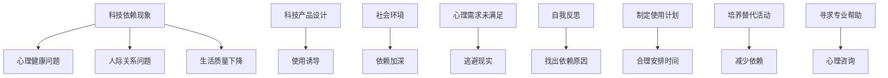

## 第四部分：科技时代的道德伦理

### 第6章：科技伦理的基本原则

#### 6.1 科技伦理的重要性

科技伦理是指科技在发展过程中，需要遵循的一套道德原则和规范。科技伦理的重要性主要体现在以下几个方面：

1. **保护人类健康**：科技的发展可能会对人类的健康造成潜在威胁，如基因编辑技术等。科技伦理要求科技在发展过程中，必须考虑到人类健康问题。
2. **保护生态环境**：科技的发展可能会对生态环境造成破坏，如温室效应、塑料污染等。科技伦理要求科技在发展过程中，必须考虑到生态环境的保护。
3. **维护社会公平**：科技的发展可能会加剧社会不平等，如数字鸿沟等。科技伦理要求科技在发展过程中，必须考虑到社会的公平性问题。

#### 6.2 科技伦理的基本原则

科技伦理的基本原则主要包括以下几个方面：

1. **尊重人权**：科技的发展必须尊重人权，不得侵犯个体的人权。
2. **公正公平**：科技的发展必须公正公平，不得加剧社会不平等。
3. **安全可靠**：科技的发展必须安全可靠，不得对人类和环境造成潜在威胁。
4. **透明公开**：科技的发展必须透明公开，不得隐瞒重要信息。
5. **责任明确**：科技的发展必须明确责任，确保科技在发展过程中，能够及时应对可能出现的风险。

#### 6.3 科技伦理的挑战与应对

科技伦理在发展过程中面临着诸多挑战，如隐私保护、人工智能伦理等。针对这些挑战，可以采取以下应对策略：

1. **加强法律法规**：制定相关的法律法规，规范科技的发展，确保科技在发展过程中，能够遵循科技伦理原则。
2. **加强道德教育**：通过加强道德教育，提高科技工作者的道德素养，确保他们在科技研发过程中，能够自觉遵循科技伦理原则。
3. **加强公众参与**：鼓励公众参与科技伦理讨论，提高公众的科技伦理意识，共同推动科技伦理的发展。

### 图 6.1：科技伦理的基本原则与挑战

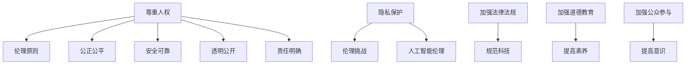

### 第7章：科技与隐私保护

#### 7.1 隐私权的基本概念

隐私权是指个人对自己的私人生活和信息的控制权。隐私权的保护对于维护个体的尊严和自由至关重要。在数字化时代，隐私权的保护面临诸多挑战，如数据泄露、网络监控等。

#### 7.2 科技对隐私权的影响

科技的发展对隐私权产生了深远的影响。一方面，科技为隐私权的保护提供了新的手段，如数据加密、隐私保护算法等。另一方面，科技也可能对隐私权造成侵犯，如大数据监控、网络追踪等。

#### 7.3 隐私保护的措施与策略

为了保护隐私权，可以采取以下措施和策略：

1. **数据加密**：通过数据加密技术，保护个人信息的安全。
2. **隐私保护算法**：在数据处理过程中，采用隐私保护算法，减少个人信息泄露的风险。
3. **法律法规**：制定相关的法律法规，明确个人信息的保护范围和责任。
4. **用户教育**：提高公众的隐私保护意识，鼓励用户采取隐私保护措施。

### 图 7.1：隐私权的基本概念与保护措施

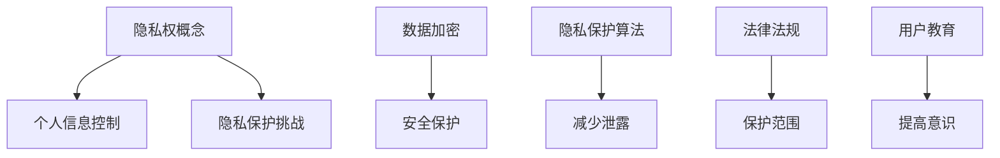

## 第五部分：科技时代的人际关系

### 第8章：科技时代的人际沟通

#### 8.1 人际沟通的重要性

人际沟通是人类社会的重要组成部分，它不仅有助于个体的情感交流，还能促进团队合作和社会和谐。在科技时代，人际沟通的方式和内容发生了巨大变化，如何有效地进行人际沟通成为了一个重要的问题。

#### 8.2 科技对人际沟通的影响

科技的发展对人际沟通产生了深远的影响。一方面，科技使得人际沟通更加便捷，如电子邮件、社交媒体、视频通话等。另一方面，科技也可能对人际沟通造成负面影响，如沟通障碍、误解等。

#### 8.3 提高人际沟通技巧的方法

为了提高人际沟通技巧，可以采取以下方法：

1. **倾听**：倾听是沟通的重要部分，通过倾听，可以更好地理解对方的需求和意图。
2. **表达**：清晰、准确地表达自己的想法和感受，是有效沟通的关键。
3. **非语言沟通**：非语言沟通，如肢体语言、面部表情等，也是人际沟通的重要组成部分。
4. **情感管理**：在沟通过程中，注意管理自己的情绪，避免情绪对沟通造成负面影响。

### 图 8.1：科技对人际沟通的影响与提高沟通技巧的方法

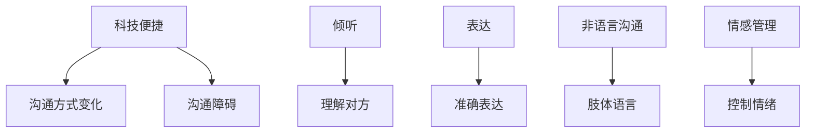

### 第9章：科技时代的人际关系管理

#### 9.1 人际关系管理的基本原则

人际关系管理是指在工作和生活中，通过有效沟通和互动，建立和维护良好人际关系的过程。人际关系管理的基本原则包括：

1. **尊重**：尊重他人是建立良好人际关系的基础。
2. **诚信**：诚信是人际交往的基石，失去诚信，人际关系将难以维系。
3. **理解**：理解他人，换位思考，是解决人际冲突的重要方法。
4. **合作**：合作是团队协作的关键，通过合作，可以实现共同目标。

#### 9.2 科技对人际关系管理的影响

科技的发展对人际关系管理产生了深远的影响。一方面，科技使得人际沟通更加便捷，有助于建立和维护人际关系。另一方面，科技也可能对人际关系管理造成负面影响，如沟通障碍、误解等。

#### 9.3 人际关系管理的策略与技巧

为了更好地进行人际关系管理，可以采取以下策略和技巧：

1. **有效沟通**：通过有效沟通，减少误解，建立信任。
2. **情感管理**：在沟通中，注意管理自己的情绪，避免情绪对人际关系造成负面影响。
3. **冲突解决**：遇到冲突时，采取合适的策略和技巧，解决冲突，维护良好的人际关系。
4. **建立网络**：通过社交媒体等工具，建立和维护人际关系网络，扩大人际交往范围。

### 图 9.1：人际关系管理的基本原则与策略

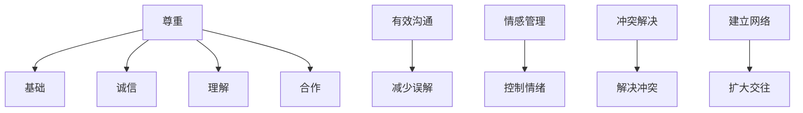

## 第六部分：科技时代的生活哲学

### 第10章：科技时代的自我认知

#### 10.1 自我认知的重要性

自我认知是指个体对自身特质、行为和情感的理解和认识。自我认知的重要性体现在以下几个方面：

1. **个人成长**：自我认知有助于个体了解自己的优点和不足，从而有针对性地进行个人成长。
2. **心理健康**：自我认知有助于个体更好地应对生活中的挑战，提高心理健康水平。
3. **人际关系**：自我认知有助于个体更好地理解他人，建立和维护良好的人际关系。

#### 10.2 科技对自我认知的影响

科技的发展对自我认知产生了深远的影响。一方面，科技为自我认知提供了新的工具和途径，如自我测试、心理测评等。另一方面，科技也可能对自我认知造成负面影响，如信息过载、自我评价过低等。

#### 10.3 培养自我认知的方法

为了培养自我认知，可以采取以下方法：

1. **自我反思**：通过自我反思，了解自己的行为和情感，从而提高自我认知。
2. **心理测评**：通过心理测评，了解自己的性格、优势和不足。
3. **交流互动**：与他人交流互动，从他人的反馈中了解自己。
4. **学习成长**：通过学习新知识和技能，提高自我认知。

### 图 10.1：科技对自我认知的影响与培养自我认知的方法

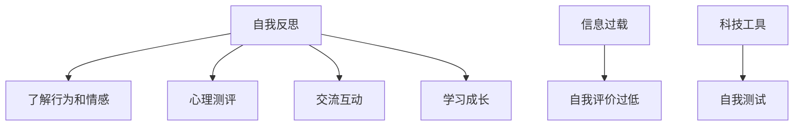

### 第11章：科技时代的生活平衡

#### 11.1 生活平衡的重要性

生活平衡是指个体在工作和生活之间保持适当的平衡，从而实现身心健康和幸福感。生活平衡的重要性体现在以下几个方面：

1. **身心健康**：生活平衡有助于个体保持身心健康，降低心理压力。
2. **幸福感**：生活平衡有助于个体提高幸福感，享受生活。
3. **工作效率**：生活平衡有助于个体提高工作效率，实现工作与生活的双赢。

#### 11.2 科技对生活平衡的影响

科技的发展对生活平衡产生了深远的影响。一方面，科技为生活平衡提供了新的工具和途径，如智能家居、在线办公等。另一方面，科技也可能对生活平衡造成负面影响，如过度依赖科技、时间管理困难等。

#### 11.3 实现生活平衡的策略

为了实现生活平衡，可以采取以下策略：

1. **时间管理**：合理安排时间，确保工作和生活之间的平衡。
2. **科技使用**：合理使用科技，避免过度依赖。
3. **身心锻炼**：定期进行身心锻炼，保持身心健康。
4. **社交互动**：与他人保持良好的社交互动，提高生活质量。

### 图 11.1：科技对生活平衡的影响与实现生活平衡的策略

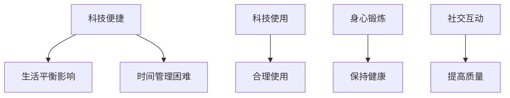

## 第七部分：结语

### 12. 总结与展望

本文从数字化浪潮中的社会变革、科技时代的人性探索、科技时代的心理调适、科技时代的道德伦理和科技时代的人际关系等方面，探讨了在科技时代如何保持人性，实现自我修养。随着科技的不断发展，如何在数字化浪潮中保持人性，实现心理健康、道德伦理和人际关系的平衡，将成为一个长期而重要的课题。我们期待未来的研究和实践能够为这一课题提供更多的启示和解决方案。

## 附录

### 附录 A：相关资源推荐

1. 《数字化生存》（尼葛洛庞蒂著）：介绍数字化时代的概念和发展趋势，对理解数字化浪潮具有重要意义。
2. 《人类简史》（赫拉利著）：从历史角度探讨人类的发展，对理解数字化浪潮的背景和影响有重要帮助。
3. 《科技想要什么》（凯利著）：探讨科技的本质和影响力，对理解科技对人性影响的深度思考具有重要价值。

### 附录 B：参考文献

1. 尼葛洛庞蒂，《数字化生存》，生活·读书·新知三联书店，1996年。
2. 赫拉利，《人类简史》，中国社会科学出版社，2014年。
3. 凯利，《科技想要什么》，浙江人民出版社，2012年。

作者：AI天才研究院/AI Genius Institute & 禅与计算机程序设计艺术 /Zen And The Art of Computer Programming

