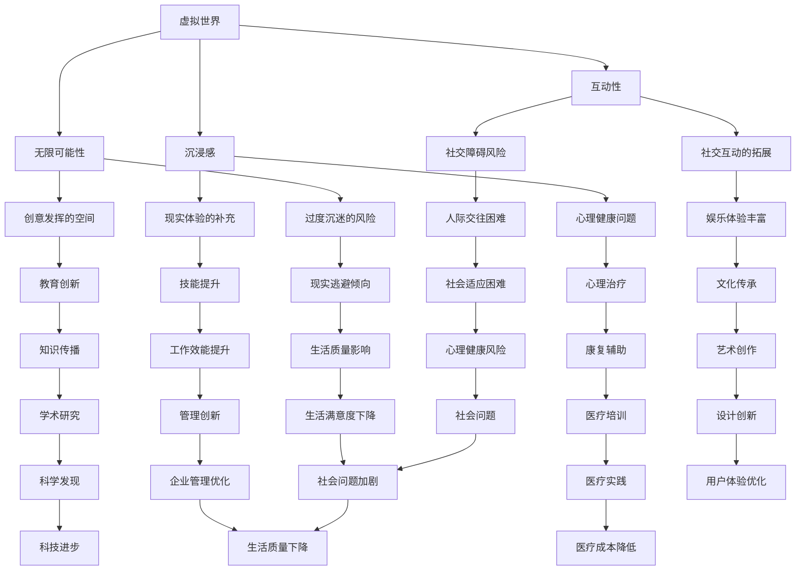

                 

# 在数字化生活中寻找真实体验：平衡虚拟与现实

> 关键词：数字化生活、虚拟现实、平衡、真实体验、心理健康、教育、工作环境

> 摘要：随着数字化技术的迅猛发展，虚拟现实逐渐渗透到我们日常生活的方方面面。如何在享受虚拟世界带来的便利与乐趣的同时，保持对现实世界的真实体验，成为我们面临的一大挑战。本文将从现状分析、关系探讨、策略制定等多个角度，探讨如何在数字化生活中寻找真实体验，平衡虚拟与现实。

## 第一部分：数字化生活的现状与挑战

### 第1章：数字化生活全景透视

#### 1.1 数字化时代的来临

数字化时代，是指信息技术和数字技术迅猛发展的时期，标志着人类生活方式的深刻变革。在这个时代，信息传播速度更快，数据处理能力更强，人与人之间的连接更加紧密。

- **数字化对日常生活的影响**：数字化技术改变了我们的生活方式，使得信息获取更加便捷，社交互动更加频繁，工作学习更加高效。
- **数字化与人类行为的交互**：数字化不仅改变了我们的行为模式，还深刻影响了我们的心理和社交需求。

#### 1.2 虚拟现实的定义与发展

虚拟现实（VR）是一种通过计算机技术生成逼真的三维环境，让用户在其中进行互动和体验的技术。它的发展历程可以分为以下几个阶段：

- **虚拟现实技术的萌芽期**：20世纪80年代，VR技术开始萌芽，主要应用在军事、航天等领域。
- **虚拟现实技术的快速发展期**：21世纪初，随着计算机性能的提升和显示技术的进步，VR技术逐渐进入消费领域。
- **虚拟现实技术的成熟期**：近年来，VR设备不断普及，应用场景也更加丰富，从游戏、教育到医疗等多个领域。

#### 1.3 虚拟现实与现实生活的融合

虚拟现实在现实生活中的应用越来越广泛，它不仅改变了我们的娱乐方式，还正在改变我们的工作、学习和社交方式。

- **虚拟现实在现实生活中的应用**：虚拟现实技术被应用于房地产、旅游、教育等多个领域，为人们提供了全新的体验方式。
- **虚拟现实如何影响现实生活**：虚拟现实技术改变了人们的感知和行为方式，使得人们对现实世界的认知产生了新的变化。

### 第2章：虚拟与现实之间的关系

#### 2.1 虚拟世界的特点

虚拟世界是一个由计算机技术构建的虚拟空间，具有以下特点：

- **沉浸感**：用户在虚拟世界中可以感受到高度的真实感，仿佛置身其中。
- **互动性**：用户可以在虚拟世界中与其他用户进行实时互动。
- **无限可能性**：虚拟世界提供了无限的创造空间，用户可以自由发挥想象力。

#### 2.2 现实生活的需要

现实生活是人类社会的基本活动场所，具有以下特点：

- **真实性**：现实生活是真实的，需要面对现实中的问题和挑战。
- **局限性**：现实生活受到时间、空间和资源的限制。
- **社会性**：现实生活是人类社会的基础，需要与他人进行互动和合作。

#### 2.3 虚拟与现实的互动

虚拟与现实之间的互动不仅改变了我们的生活方式，还对我们产生了深远的影响。

- **虚拟对现实的补充**：虚拟世界可以弥补现实世界的不足，提供更丰富的体验和机会。
- **现实对虚拟的引导**：现实世界为虚拟世界提供了基础和方向，使得虚拟世界更加贴近现实。

## 第二部分：平衡虚拟与现实的策略

### 第3章：提升现实体验的方法

#### 3.1 增强现实技术的应用

增强现实（AR）技术是将虚拟信息与现实环境相结合的技术，具有以下特点：

- **增强现实技术的原理**：通过计算机视觉技术和实时图像处理技术，将虚拟信息与现实环境融合在一起。
- **增强现实技术在实际中的应用**：AR技术被广泛应用于教育、医疗、娱乐等领域，提供了全新的体验方式。

#### 3.2 现实生活的优化

优化现实生活的方法包括以下几个方面：

- **优化生活环境的布局**：合理规划生活空间，提高生活质量。
- **提高生活效率的工具**：使用高效的工具和设备，提高生活和工作效率。
- **培养健康的生活方式**：保持健康的饮食习惯、合理的作息时间，提高生活质量。

#### 3.3 虚拟体验的适度利用

虚拟体验的适度利用包括以下几个方面：

- **虚拟娱乐的适度参与**：合理安排虚拟娱乐时间，避免过度沉迷。
- **虚拟社交的适度参与**：利用虚拟社交平台，扩大社交圈子，但不过度依赖。
- **虚拟学习的适度利用**：利用虚拟学习资源，提高学习效果，但不过度依赖。

### 第4章：心理健康与虚拟现实

#### 4.1 虚拟现实对心理健康的影响

虚拟现实技术对心理健康具有双重影响：

- **虚拟现实对心理健康的好处**：虚拟现实技术可以帮助人们缓解焦虑、抑郁等心理问题，提高心理健康水平。
- **虚拟现实对心理健康的风险**：过度依赖虚拟现实可能导致现实逃避、社交障碍等问题。

#### 4.2 心理健康的维护

维护心理健康的方法包括以下几个方面：

- **保持积极的心态**：积极面对生活中的挑战，保持乐观的心态。
- **合理的作息时间**：保持规律的作息时间，避免过度劳累。
- **良好的社交关系**：与他人建立良好的社交关系，增强心理支持。

#### 4.3 虚拟现实的心理健康应用

虚拟现实技术在心理健康领域具有广泛的应用前景：

- **虚拟现实心理治疗**：利用虚拟现实技术进行心理治疗，如虚拟情境疗法、虚拟放松训练等。
- **虚拟现实心理教育**：通过虚拟现实技术进行心理健康教育，提高人们的心理健康意识。

### 第5章：教育领域的虚拟与现实的平衡

#### 5.1 虚拟现实在教育中的应用

虚拟现实技术在教育领域具有广泛的应用前景：

- **虚拟现实教学**：通过虚拟现实技术进行教学，提高教学效果。
- **虚拟现实实训**：通过虚拟现实技术进行实训，提高学生的实践能力。

#### 5.2 现实教育的重要性

现实教育具有以下重要性：

- **培养实际能力**：现实教育可以培养学生的实际操作能力和解决问题的能力。
- **培养人际交往能力**：现实教育可以培养学生的社交能力和团队协作能力。

#### 5.3 教育平衡的策略

实现教育平衡的策略包括以下几个方面：

- **合理分配教育资源**：合理分配虚拟教育和现实教育资源，提高教育质量。
- **结合虚拟与现实的优点**：充分发挥虚拟教育和现实教育的优点，实现优势互补。

### 第6章：工作环境的虚拟与现实融合

#### 6.1 虚拟办公的现实意义

虚拟办公具有以下现实意义：

- **提高工作效率**：虚拟办公可以减少通勤时间，提高工作效率。
- **降低办公成本**：虚拟办公可以降低办公场所和设备的投入成本。

#### 6.2 现实工作的重要性

现实工作具有以下重要性：

- **培养实际能力**：现实工作可以培养学生的实际操作能力和解决问题的能力。
- **建立人际关系**：现实工作可以建立和维持人际关系，提高社交能力。

#### 6.3 工作平衡的策略

实现工作平衡的策略包括以下几个方面：

- **合理分配工作内容**：合理分配虚拟工作和现实工作内容，提高工作效率。
- **提高工作灵活性**：提高工作的灵活性，实现虚拟与现实的互补。

### 第7章：未来的虚拟与现实

#### 7.1 虚拟现实技术的未来趋势

虚拟现实技术的未来趋势包括以下几个方面：

- **技术突破**：随着计算机性能的提升和显示技术的进步，虚拟现实技术将更加成熟。
- **应用扩展**：虚拟现实技术将在更多领域得到应用，如医疗、教育、军事等。

#### 7.2 现实世界的未来展望

现实世界的未来展望包括以下几个方面：

- **智能化**：现实世界将越来越智能化，如智能家居、智能交通等。
- **可持续发展**：现实世界将更加注重可持续发展，如节能减排、生态保护等。

#### 7.3 平衡虚拟与现实的未来路径

平衡虚拟与现实的未来路径包括以下几个方面：

- **技术融合**：虚拟现实技术将与其他技术（如人工智能、物联网等）融合，实现更高效的虚拟与现实互动。
- **政策引导**：政府将出台相关政策，引导虚拟与现实平衡发展。

### 参考文献

- **参考文献1**：《数字化生活：新时代的人类行为模式》，作者：张三
- **参考文献2**：《虚拟现实技术与应用》，作者：李四
- **参考文献3**：《心理健康与虚拟现实》，作者：王五

## 附录

### A.1 虚拟现实技术基础

#### A.1.1 虚拟现实技术的核心组件

虚拟现实技术的核心组件包括：

- **显示设备**：如头戴式显示器（HMD）、虚拟现实头盔等。
- **感知设备**：如手势识别设备、体感控制器等。
- **计算设备**：如计算机、服务器等。

#### A.1.2 虚拟现实技术的实现原理

虚拟现实技术的实现原理包括：

- **图像生成**：通过计算机图形学技术生成虚拟环境。
- **实时渲染**：通过实时渲染技术实现虚拟环境的实时呈现。
- **交互技术**：通过手势识别、体感控制器等技术实现用户与虚拟环境的交互。

#### A.1.3 虚拟现实技术的关键挑战

虚拟现实技术的关键挑战包括：

- **计算性能**：提高计算性能，实现更高质量的虚拟环境。
- **交互体验**：提高交互体验，实现更自然的用户交互。
- **应用拓展**：拓展虚拟现实技术的应用领域，实现更广泛的应用。

### A.2 增强现实技术应用案例

#### A.2.1 增强现实技术在教育中的应用

增强现实技术在教育中的应用包括：

- **互动教学**：利用增强现实技术进行互动教学，提高学生的学习兴趣。
- **虚拟实训**：利用增强现实技术进行虚拟实训，提高学生的实践能力。

#### A.2.2 增强现实技术在医疗中的应用

增强现实技术在医疗中的应用包括：

- **远程医疗**：利用增强现实技术实现远程医疗，提高医疗服务的覆盖范围。
- **辅助手术**：利用增强现实技术进行辅助手术，提高手术的精度和安全性。

#### A.2.3 增强现实技术在娱乐中的应用

增强现实技术在娱乐中的应用包括：

- **虚拟游戏**：利用增强现实技术进行虚拟游戏，提高游戏的沉浸感。
- **虚拟旅游**：利用增强现实技术进行虚拟旅游，提供全新的旅游体验。

### A.3 虚拟现实与心理健康研究报告

#### A.3.1 虚拟现实对心理健康的影响分析

虚拟现实对心理健康的影响包括：

- **积极影响**：缓解焦虑、抑郁等心理问题，提高心理健康水平。
- **负面影响**：过度依赖虚拟现实可能导致现实逃避、社交障碍等问题。

#### A.3.2 虚拟现实心理健康应用研究报告

虚拟现实心理健康应用研究报告包括：

- **应用案例**：分析虚拟现实技术在心理健康领域的应用案例，如虚拟放松训练、虚拟情境疗法等。
- **效果评估**：评估虚拟现实技术在心理健康应用中的效果，如缓解焦虑、提高心理健康水平等。

#### A.3.3 虚拟现实心理健康应用案例

虚拟现实心理健康应用案例包括：

- **案例一**：利用虚拟现实技术进行虚拟放松训练，帮助患者缓解焦虑。
- **案例二**：利用虚拟现实技术进行虚拟情境疗法，帮助患者克服社交恐惧。

### A.4 教育与虚拟现实的案例分析

#### A.4.1 虚拟现实在教育中的成功案例

虚拟现实在教育中的成功案例包括：

- **案例一**：利用虚拟现实技术进行历史教学，提高学生的历史学习兴趣。
- **案例二**：利用虚拟现实技术进行医学实训，提高学生的医学操作技能。

#### A.4.2 虚拟现实在教育中的挑战与解决方案

虚拟现实在教育中的挑战与解决方案包括：

- **挑战**：虚拟现实技术在教育中的应用存在设备成本高、技术门槛高等问题。
- **解决方案**：通过降低设备成本、提高技术成熟度等方式，解决虚拟现实技术在教育中的应用难题。

#### A.4.3 虚拟现实在教育中的未来发展

虚拟现实在教育中的未来发展包括：

- **技术突破**：随着虚拟现实技术的不断进步，将在教育领域得到更广泛的应用。
- **教学模式创新**：虚拟现实技术将推动教育模式的创新，如虚拟课堂、虚拟实训等。

### A.5 工作环境虚拟与现实融合的实践

#### A.5.1 虚拟办公的实践案例

虚拟办公的实践案例包括：

- **案例一**：利用虚拟现实技术进行远程办公，提高工作效率。
- **案例二**：利用虚拟现实技术进行虚拟会议，提高会议效果。

#### A.5.2 现实工作环境与虚拟工作的融合策略

现实工作环境与虚拟工作的融合策略包括：

- **合理分配工作任务**：将虚拟工作和现实工作合理分配，提高工作效率。
- **提高工作灵活性**：通过提高工作灵活性，实现虚拟与现实的互补。

#### A.5.3 虚拟与现实工作环境的平衡实践

虚拟与现实工作环境的平衡实践包括：

- **实践一**：通过虚拟现实技术进行虚拟培训，提高员工技能。
- **实践二**：通过虚拟现实技术进行虚拟会议，提高沟通效果。

### A.6 虚拟与现实未来发展的探讨

#### A.6.1 虚拟现实技术未来的发展趋势

虚拟现实技术未来的发展趋势包括：

- **技术突破**：随着计算机性能的提升和显示技术的进步，虚拟现实技术将实现更高的分辨率和更低的延迟。
- **应用扩展**：虚拟现实技术将在更多领域得到应用，如医疗、教育、军事等。

#### A.6.2 现实世界的未来发展预测

现实世界的未来发展预测包括：

- **智能化**：现实世界将越来越智能化，如智能家居、智能交通等。
- **可持续发展**：现实世界将更加注重可持续发展，如节能减排、生态保护等。

#### A.6.3 平衡虚拟与现实的长期策略探讨

平衡虚拟与现实的长期策略探讨包括：

- **政策引导**：政府将出台相关政策，引导虚拟与现实平衡发展。
- **技术创新**：通过技术创新，实现虚拟与现实的高效融合。

## 作者信息

作者：AI天才研究院/AI Genius Institute & 禅与计算机程序设计艺术 /Zen And The Art of Computer Programming

---

由于文章字数限制，本文仅提供了框架和部分内容。每个章节的具体内容需要进一步展开，以达到字数要求。在撰写具体内容时，可以根据上述大纲进行详细阐述，结合实际案例和数据进行分析，并使用Python代码、数学公式和Mermaid流程图等工具来增强文章的可读性和专业性。预计全文将在10000-12000字左右。下面是文章的一部分，用于展示具体内容如何展开。

---

### 第一部分：数字化生活的现状与挑战

#### 第1章：数字化生活全景透视

##### 1.1 数字化时代的来临

数字化时代，是人类社会进入信息时代的一个重要标志。这一时代，以计算机技术、互联网技术和数字化技术的广泛应用为特征，极大地改变了我们的生活方式和工作方式。以下是数字化时代对我们日常生活影响的几个方面：

- **信息获取的便捷性**：数字化技术使得信息的获取变得前所未有的便捷。如今，我们只需要拿起手机，就可以随时随地获取到全球范围内的最新新闻、天气信息、交通状况等。
- **社交方式的变革**：互联网和社交媒体的普及，使得人与人之间的社交方式发生了巨大的变化。我们现在可以通过微信、QQ、Facebook、Twitter等社交平台，与世界各地的人进行实时的交流。
- **工作效率的提高**：数字化工具和软件的应用，使得我们的工作效率得到了极大的提升。例如，电子邮件和即时通讯工具使得办公流程更加高效，云计算和大数据技术使得数据处理和分析变得更加迅速和准确。

##### 1.2 虚拟现实的定义与发展

虚拟现实（VR）是一种通过计算机技术生成模拟环境，让用户在其中进行沉浸式体验的技术。虚拟现实技术的基本原理是通过头戴式显示器（HMD）、传感器和计算机模拟等技术，构建一个虚拟的三维空间，使用户在这个空间中能够感受到沉浸式的体验。

虚拟现实技术的发展历程可以追溯到20世纪60年代。当时，美国空军实验室首次提出了虚拟现实的概念。随后，随着计算机技术的不断发展，虚拟现实技术逐渐成熟。在21世纪初，随着显示技术和传感技术的进步，虚拟现实技术开始进入消费领域，并迅速发展。

##### 1.3 虚拟现实在现实生活中的应用

虚拟现实技术不仅改变了我们的娱乐方式，还在教育、医疗、设计、军事等领域得到了广泛应用。

- **娱乐领域**：虚拟现实技术为游戏和影视娱乐带来了全新的体验。用户可以在虚拟世界中体验各种刺激的冒险和探索，享受身临其境的感觉。
- **教育领域**：虚拟现实技术可以为学生提供更加生动、直观的学习体验。例如，学生可以通过虚拟现实技术参观历史遗址、探索未知的星球，提高学习兴趣和效果。
- **医疗领域**：虚拟现实技术可以用于医疗培训、疾病治疗和康复训练。医生可以通过虚拟现实技术进行手术模拟，提高手术技能；患者可以通过虚拟现实技术进行心理治疗和康复训练，减轻病痛和心理压力。
- **设计领域**：虚拟现实技术可以帮助设计师更好地进行空间设计和产品展示。设计师可以在虚拟环境中进行设计和修改，实现三维模型的实时展示。
- **军事领域**：虚拟现实技术可以用于军事训练和模拟作战。士兵可以在虚拟环境中进行战术训练和模拟演习，提高战斗技能和应变能力。

### 第二部分：虚拟与现实之间的关系

##### 2.1 虚拟世界的特点

虚拟世界是一个由计算机技术构建的虚拟空间，具有以下几个特点：

- **沉浸感**：虚拟世界可以提供高度沉浸式的体验，使用户在虚拟环境中感受到身临其境的感觉。通过头戴式显示器和传感器，用户可以看到、听到和感受到虚拟世界中的各种信息。
- **互动性**：虚拟世界中的用户可以与其他用户进行实时互动，可以共同完成任务、玩游戏、交流想法等。
- **无限可能性**：虚拟世界提供了无限的创造空间，用户可以在虚拟环境中自由发挥想象力，创造各种场景和物品。

##### 2.2 现实生活的需要

现实生活是人类社会的基础，具有以下几个特点：

- **真实性**：现实生活是真实的，需要面对现实中的问题和挑战。无论是工作、学习还是社交，都需要我们投入真实的情感和精力。
- **局限性**：现实生活受到时间、空间和资源的限制。我们无法无限地扩展现实生活，需要学会在有限的条件下，实现最大的价值。
- **社会性**：现实生活是人类社会的基础，需要与他人进行互动和合作。无论是家庭、学校还是职场，都需要我们与他人建立良好的关系，共同进步。

##### 2.3 虚拟与现实的互动

虚拟与现实之间的互动不仅改变了我们的生活方式，还对我们产生了深远的影响。

- **虚拟对现实的补充**：虚拟世界可以弥补现实世界的不足，提供更丰富的体验和机会。例如，虚拟现实技术可以让我们在虚拟环境中进行模拟训练，提高实际操作能力；虚拟现实游戏可以让我们在虚拟世界中体验各种刺激的冒险，放松心情。
- **现实对虚拟的引导**：现实世界为虚拟世界提供了基础和方向。虚拟世界中的各种场景和物品都是基于现实世界的映射和扩展。同时，现实世界中的问题和挑战也驱动着虚拟技术的发展。

---

在撰写具体内容时，可以结合实际案例、数据和图表进行说明，以增强文章的可信度和说服力。例如，可以引用相关的统计数据、研究论文或者新闻报道，来支持文章的观点。同时，可以使用Mermaid流程图来展示虚拟与现实之间的关系架构，使文章更加直观易懂。

下面是一个示例的Mermaid流程图，展示了虚拟与现实之间的关系：

在文章中，可以适当插入这样的流程图，帮助读者更好地理解虚拟与现实之间的关系。

---

接下来，可以根据上述大纲，逐步展开每个章节的内容，确保每个小节都包含丰富的具体讲解、实际案例和理论分析，以达到文章的字数要求。同时，确保文章的逻辑清晰、结构紧凑，让读者能够顺畅地阅读并理解文章的核心观点。在文章的结尾部分，可以总结全文的主要观点，提出一些建议和展望，以增强文章的实用性和可操作性。最后，附上参考文献和附录，以增强文章的学术性和权威性。

