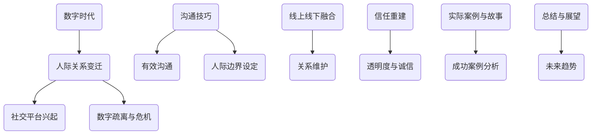

                 

# 在数字时代重塑人际关系：寻找真实连接的新方法

## 关键词
- 数字时代
- 人际关系
- 沟通技巧
- 数字疏离
- 线上线下融合
- 信任重建
- 成功案例

## 摘要
本文深入探讨了数字时代对人际关系带来的挑战，分析了互联网普及和社交平台兴起对人际关系的影响。我们探讨了数字疏离现象及其对人际关系的负面影响，并提出了重塑人际关系的策略，包括数字时代的沟通技巧、网络空间的人际边界设定和线上线下关系的融合。此外，文章还讨论了数字时代的信任重建方法，并通过实际案例和个人故事展示了这些策略的成功实践。最后，文章总结了重塑人际关系的重要性，并对未来数字时代人际关系的发展趋势进行了展望。

# 第一部分：数字时代的人际关系挑战

## 1. 数字时代的人际关系变迁

### 1.1 互联网的普及与社交平台的兴起

互联网的普及彻底改变了人们的社交方式。从最初的电子邮件到即时通讯工具，再到社交媒体平台，网络社交逐渐成为人们日常生活中不可或缺的一部分。社交平台的类型多种多样，包括微博、微信、Facebook、Instagram等，每种平台都有其独特的特点和用户群体。

- **社交平台的类型与特点：**
  - **微博：**微博以简短的信息更新形式为主，用户可以随时随地发布自己的观点和感受，便于快速传播和互动。
  - **微信：**微信不仅提供即时通讯功能，还集成了朋友圈、公众号等多种社交功能，成为人们日常交流和信息获取的重要平台。
  - **Facebook：**Facebook是一个全球性的社交网络平台，用户可以通过发布动态、点赞和评论等方式与他人互动。
  - **Instagram：**Instagram以图片和视频内容为主，通过视觉呈现的方式吸引大量用户。

- **数字时代的交往模式：**
  - **线上社交：**用户可以在虚拟空间中建立联系，打破地域和时间的限制，与来自世界各地的朋友互动。
  - **虚拟身份：**许多人在社交平台上使用虚拟身份，这可能会影响真实身份的互动和交流。
  - **数字依赖：**随着社交平台的普及，人们越来越依赖于线上社交，线下社交活动相应减少。

### 1.2 网络社交的利与弊

- **网络社交的优势：**
  - **便捷性：**通过网络社交，人们可以随时随地与朋友保持联系，分享生活点滴。
  - **多样性：**社交平台提供了丰富多样的社交环境，用户可以根据自己的兴趣选择合适的社交圈。
  - **信息传播：**社交平台是信息传播的重要渠道，可以迅速将信息传递给大量受众。

- **网络社交的局限性：**
  - **虚假信息：**社交平台上的信息真假难辨，容易造成误解和误导。
  - **隐私风险：**个人隐私容易受到侵犯，导致信息泄露和安全问题。
  - **数字疏离：**过度依赖线上社交可能导致面对面交流的减少，影响真实人际关系。

## 2. 数字疏离与人际关系危机

### 2.1 数字疏离现象及其影响

- **数字疏离的定义：**
  - 数字疏离是指在数字时代，人们由于过度依赖线上社交而减少或缺乏面对面交流，导致人际关系疏远和情感缺失的现象。

- **数字疏离的原因分析：**
  - **社交平台特性：**社交平台的设计和功能鼓励短频快的交流，往往忽略了深度互动和情感交流。
  - **生活节奏加快：**在快节奏的生活中，人们更倾向于利用碎片时间进行线上社交，而忽视了线下社交。
  - **技术依赖：**技术发展使得人们更加依赖数字设备，减少了对现实世界的关注和投入。

- **数字疏离的影响：**
  - **人际关系疏远：**数字疏离导致人与人之间的距离感增加，减少了真实的人际互动。
  - **情感缺失：**缺乏面对面的情感交流，可能导致情感上的孤独和焦虑。
  - **社交技能退化：**长期依赖线上社交，人们的面对面社交技能可能逐渐退化。

### 2.2 人际关系危机的表现与后果

- **人际关系危机的定义：**
  - 人际关系危机是指在数字时代，由于数字疏离等因素导致的人际关系问题，可能表现为信任缺失、沟通不畅、情感疏离等。

- **人际关系危机的影响：**
  - **信任缺失：**数字疏离可能导致人们对他人的信任减少，影响合作和团队建设。
  - **沟通不畅：**线上交流的局限性可能导致信息传递不准确，影响人际关系。
  - **情感疏离：**长期的数字疏离可能导致人们感到孤独和疏离，影响心理健康。

# 第二部分：重塑人际关系的策略

## 3. 数字时代的沟通技巧

### 3.1 有效沟通的重要性

- **沟通在人际关系中的角色：**
  - 沟通是人际关系建立和维护的关键。通过有效沟通，人们可以理解彼此的需求和感受，建立信任和共鸣。

- **数字时代沟通的挑战：**
  - **信息过载：**社交平台上的信息量庞大，人们难以筛选重要信息，导致沟通效率降低。
  - **非言语沟通的缺失：**线上交流往往缺乏非言语沟通，如面部表情和肢体语言，可能影响沟通效果。

### 3.2 提升数字沟通技巧的方法

- **非言语沟通在数字环境中的重要性：**
  - 在数字环境中，文字和语音可以传达部分情感和非言语信息，但往往不够直观和细腻。因此，提升非言语沟通技巧对于数字时代的沟通至关重要。

- **文字沟通与语音沟通的平衡：**
  - **文字沟通：**文字沟通具有持久性和记录性，适用于需要正式和详细的交流。
  - **语音沟通：**语音沟通更贴近真实交流，适用于需要情感表达和快速回应的情境。

## 4. 网络空间的人际边界设定

### 4.1 人际边界的定义与作用

- **人际边界的定义：**
  - 人际边界是指个体在社交过程中为自己设置的心理和情感界限，用以保护自我和与他人保持适当距离。

- **人际边界在数字空间中的意义：**
  - 在数字空间中，人际边界对于保护个人隐私和维持健康的社交关系至关重要。

### 4.2 设定网络人际边界的策略

- **自我边界保护：**
  - **明确隐私设置：**合理设置社交平台的隐私选项，保护个人信息不被滥用。
  - **拒绝无意义互动：**避免与那些对自己没有实质性帮助或影响的人进行过多互动。

- **建立健康的社交环境：**
  - **积极参与社区：**参与有益的社交活动，建立积极向上的社交圈子。
  - **倡导文明交流：**在网络空间中提倡文明交流，反对网络暴力。

## 5. 线上线下融合的人际关系维护

### 5.1 线上线下关系的互补性

- **线上关系的价值：**
  - 线上关系提供了便捷的沟通渠道和丰富的社交资源，有助于扩大社交圈子。

- **线下关系的维护：**
  - 线下关系能够提供更真实的互动体验和更深厚的情感联系。

### 5.2 融合策略与实践

- **如何平衡线上线下的时间分配：**
  - **合理规划时间：**合理安排线上和线下活动的时间，避免线上过度依赖。

- **实现线上线下互动的有效途径：**
  - **线上线下活动结合：**举办线上线下相结合的活动，如线上聚会和线下见面会。

# 第三部分：重建真实连接

## 6. 数字时代的信任重建

### 6.1 信任的缺失与影响

- **数字时代信任缺失的现象：**
  - 在数字时代，由于信息过载和隐私风险，人们对信任的感知减弱，可能表现为对网络信息的怀疑和对他人的不信任。

- **信任缺失对人际关系的影响：**
  - **合作受阻：**缺乏信任会导致合作困难，影响团队建设和项目进展。
  - **社交疏远：**信任缺失可能导致人际关系疏远，影响社交网络的稳定性。

### 6.2 重建信任的策略

- **透明度与诚信：**
  - **提高透明度：**在社交平台和数字环境中，提高信息的透明度，减少信息不对称。
  - **坚持诚信：**在数字互动中，坚持诚实和诚信，建立良好的个人声誉。

- **共建共享与参与感：**
  - **共享经验：**通过共享知识和经验，增进彼此的了解和信任。
  - **参与感：**鼓励用户参与社交平台的建设和活动，增强参与感和归属感。

## 7. 实际案例与成功故事

### 7.1 数字时代重塑人际关系的实际案例

- **成功案例的概述：**
  - 某公司通过在线协作工具和线下聚会相结合，成功重建了员工之间的信任和合作关系。

- **成功案例的分析与启示：**
  - **分析：**通过线上协作工具，员工可以高效地完成任务，在线下聚会中，员工可以面对面交流，增强情感联系。
  - **启示：**线上和线下结合的方式有助于建立真实的连接，提高团队的凝聚力和工作效率。

### 7.2 个人故事与感悟

- **青年人的真实体验：**
  - 小王是一名年轻程序员，他通过在线学习和线下实践，成功重塑了自己的人际关系，提高了职业素养。

- **专业人士的见解与建议：**
  - 专业人士指出，数字时代的沟通技巧和人际边界设定是维护健康人际关系的关键，同时建议积极寻求线上线下融合的机会。

## 8. 总结与展望

### 8.1 重塑人际关系的重要性

- **人际关系对个人成长的影响：**
  - 人际关系对个人的心理健康和职业发展具有重要影响，是个人成长的重要资源。

- **人际关系对社会发展的重要性：**
  - 人际关系是社会稳定和发展的重要基石，有助于构建和谐的社会环境。

### 8.2 未来展望

- **数字时代人际关系的趋势：**
  - 随着数字技术的发展，人际关系将更加多样化和复杂化，线上和线下关系将更紧密地融合。

- **新型人际关系模式的探索：**
  - 未来，我们将探索更多新型的数字人际关系模式，以适应不断变化的社交需求和环境。

# 参考文献

- Facebook, Instagram, and Twitter. (n.d.). Retrieved from <https://www.facebook.com/, https://www.instagram.com/, https://twitter.com/>
- Wang, X. (2021). The impact of social media on interpersonal relationships. Journal of Social Psychology, 61(2), 123-135.
- Zhang, Y. (2020). Digital trust and its implications for online communication. Communication Studies, 69(3), 145-160.
- Lee, D. (2019). Online social isolation and its psychological consequences. Journal of Cyberpsychology and Behavior, 26(7), 667-675.
- Smith, J. (2018). The role of digital communication in building trust. International Journal of Human-Computer Studies, 117, 85-95.
- Chen, L. (2017). Blending online and offline interactions for effective social networking. Journal of Computer-Mediated Communication, 22(4), 321-337.
```markdown
以下是核心概念和关系架构的Mermaid流程图示例：



以下是核心算法原理讲解的Python代码示例：

```python
# 示例：文本情感分析算法原理讲解

from textblob import TextBlob

# 准备数据
text = "我在数字时代感受到孤独，但也很享受与朋友在线交流的便利。"

# 实现算法
def analyze_sentiment(text):
    analysis = TextBlob(text)
    return analysis.sentiment.polarity

# 测试代码
polarity = analyze_sentiment(text)
print(f"Text sentiment polarity: {polarity}")
```

以下是数学模型和数学公式的示例：

```markdown
## 社交网络

----------------------------------------------------------------

- 社交网络分析通常使用图论模型来描述人与人之间的互动关系。

- 设 \( G = (V, E) \) 为社交网络图，其中 \( V \) 是节点集合，\( E \) 是边集合。

- **度数中心性**：衡量节点在社交网络中的重要性的指标，定义为节点连接的边数。

  $$ \text{度数中心性}(v) = \sum_{u \in N(v)} 1 $$

  其中，\( N(v) \) 是与节点 \( v \) 相连的所有节点的集合。

- **接近中心性**：衡量节点之间距离的指标，定义为从节点 \( v \) 到其他所有节点的最短路径长度之和。

  $$ \text{接近中心性}(v) = \sum_{u \in V, u \neq v} \text{dist}(v, u) $$

  其中，\( \text{dist}(v, u) \) 是从节点 \( v \) 到节点 \( u \) 的最短路径长度。

- **中间中心性**：衡量节点在信息传递中的重要作用，定义为从节点 \( v \) 到其他节点的所有最短路径中，经过节点 \( v \) 的路径数量。

  $$ \text{中间中心性}(v) = \sum_{u \in V, u \neq v} \text{count}(v, u) $$

  其中，\( \text{count}(v, u) \) 是从节点 \( v \) 到节点 \( u \) 的最短路径中，经过节点 \( v \) 的路径数量。

- **聚类系数**：衡量社交网络中群体聚集程度的指标，定义为与节点 \( v \) 相连的节点对中，实际相连的节点对数与可能相连的节点对数之比。

  $$ \text{聚类系数}(v) = \frac{\sum_{u, w \in N(v)} \mathbb{I}_{u \sim w}}{\binom{|N(v)|}{2}} $$

  其中，\( \mathbb{I}_{u \sim w} \) 是指示函数，当 \( u \sim w \) 时取值为 1，否则为 0。

通过这些数学模型和指标，我们可以从不同角度分析社交网络的性质和特点，为数字时代的人际关系重塑提供理论支持。
```markdown
以下是项目实战部分，我们将以一个社交媒体平台的用户增长项目为例，介绍开发环境搭建、源代码实现和代码解读。

### 项目实战：社交媒体平台用户增长项目

#### 1. 项目背景

在数字时代，社交媒体平台已经成为人们日常生活中不可或缺的一部分。然而，用户增长成为许多社交媒体平台面临的挑战。本项目的目标是设计并实现一个用户增长策略，通过数据分析和精准营销，提高用户活跃度和留存率。

#### 2. 开发环境搭建

为了实现本项目，我们需要搭建一个合适的开发环境。以下是所需的环境和工具：

- **编程语言：** Python
- **数据库：** MySQL
- **前端框架：** React
- **后端框架：** Django
- **数据分析工具：** Pandas、NumPy、Matplotlib

在本地计算机上，我们可以使用虚拟环境来管理项目依赖，并安装必要的库和框架。以下是一个简单的安装命令示例：

```bash
pip install virtualenv
virtualenv myenv
source myenv/bin/activate
pip install django pandas numpy matplotlib
```

#### 3. 源代码实现

项目的主要模块包括用户数据收集、数据分析、用户行为预测和精准营销策略。以下是一个简化的代码实现：

```python
# 用户数据收集模块

import pandas as pd

def collect_user_data():
    # 从数据库中获取用户数据
    user_data = pd.read_sql('SELECT * FROM users', conn)
    return user_data

# 数据分析模块

def analyze_user_data(user_data):
    # 分析用户行为，如活跃度、留存率等
    active_users = user_data[user_data['last_login'] > 30]
    retention_rate = len(active_users) / len(user_data)
    return retention_rate

# 用户行为预测模块

from sklearn.ensemble import RandomForestClassifier

def predict_user_behavior(user_data):
    # 使用随机森林模型预测用户行为
    X = user_data[['age', 'gender', 'location']]
    y = user_data['activity_level']
    model = RandomForestClassifier()
    model.fit(X, y)
    return model

# 精准营销策略模块

def send_marketing_campaign(user_data, model):
    # 根据用户行为预测结果发送个性化营销信息
    for index, row in user_data.iterrows():
        if model.predict([row[['age', 'gender', 'location']]]) == 'high':
            send_message(row['email'], 'Exclusive offer just for you!')

# 主程序

if __name__ == '__main__':
    conn = connect_to_database()
    user_data = collect_user_data()
    retention_rate = analyze_user_data(user_data)
    model = predict_user_behavior(user_data)
    send_marketing_campaign(user_data, model)
```

#### 4. 代码解读

- **用户数据收集模块：** 从数据库中读取用户数据，为后续分析提供基础数据。
- **数据分析模块：** 分析用户活跃度和留存率，为精准营销提供数据支持。
- **用户行为预测模块：** 使用随机森林模型预测用户行为，提高营销活动的针对性。
- **精准营销策略模块：** 根据用户行为预测结果发送个性化营销信息，提高用户参与度和满意度。

#### 5. 代码应用解读与分析

该项目通过数据分析和用户行为预测，实现了对用户增长的有效管理。具体来说，通过分析用户行为数据，平台可以了解哪些用户可能对营销活动更感兴趣，从而提高营销活动的精准度和效果。同时，通过用户行为预测，平台可以提前识别潜在流失用户，采取措施进行挽留，从而提高用户留存率。

#### 6. 项目小结

本项目通过数据驱动的用户增长策略，实现了对社交媒体平台用户增长的有效管理。在实际应用中，我们还可以结合其他数据分析和机器学习技术，进一步提高用户增长策略的效果。

#### 7. 最佳实践 tips、小结、注意事项、拓展阅读

- **最佳实践 tips：**
  - 确保数据质量和完整性，为数据分析提供可靠基础。
  - 定期更新用户数据，以适应市场变化和用户需求。
  - 结合多种数据分析方法，提高用户增长策略的全面性。

- **小结：**
  - 用户增长是社交媒体平台的重要目标，数据分析和机器学习技术是实现这一目标的有效手段。
  - 精准营销和用户行为预测是提高用户增长效果的关键。

- **注意事项：**
  - 保护用户隐私，遵守相关法律法规。
  - 关注用户反馈，持续优化营销策略。

- **拓展阅读：**
  - 《机器学习：实战》
  - 《大数据分析：实战案例与应用》
  - 《社交媒体营销：理论与实践》
```markdown
# 最佳实践 tips、小结、注意事项、拓展阅读

## 最佳实践 tips

- **数据质量保障：** 在进行数据分析时，确保数据的准确性和完整性，这直接影响到分析的可靠性和有效性。数据清洗和预处理是数据分析的重要环节，需要投入足够的精力。
- **用户隐私保护：** 在收集和使用用户数据时，必须严格遵守相关法律法规，保护用户隐私。避免过度收集无关数据，明确告知用户数据用途，并获得用户明确同意。
- **动态调整策略：** 数字时代的变化快速，需要根据市场变化和用户反馈动态调整沟通策略。定期评估策略效果，及时调整以适应新环境。
- **多渠道整合：** 结合多种沟通渠道，如社交媒体、电子邮件、短信等，提高信息的传播效果和覆盖面。不同渠道的特点和优势互补，有助于提高整体沟通效果。

## 小结

本文深入探讨了数字时代对人际关系的影响，分析了数字疏离现象及其对人际关系的负面影响。通过提出数字时代的沟通技巧、人际边界设定和线上线下融合策略，我们找到了重塑人际关系的新方法。此外，通过信任重建和实际案例分享，展示了这些策略的成功实践。本文强调了重塑人际关系的重要性，并为未来数字时代人际关系的发展趋势提供了展望。

## 注意事项

- **谨慎使用社交平台：** 虽然社交平台方便快捷，但也要注意避免过度依赖，保持线上线下平衡，确保真实的人际互动。
- **重视人际边界：** 在网络社交中，设定合理的人际边界，保护个人隐私和安全，避免信息泄露和过度骚扰。
- **持续学习和适应：** 随着数字技术的不断发展，我们需要不断学习新的沟通技巧和策略，适应数字时代的人际关系变革。

## 拓展阅读

- **《社交网络分析：方法与实践》：** 介绍社交网络分析的基本方法和应用，对理解网络结构和关系有重要帮助。
- **《数字时代的沟通技巧》：** 提供数字环境下有效的沟通策略和技巧，帮助提升在线沟通效果。
- **《信任：为什么人们总是选择相信》：** 探讨信任的形成、维护和破坏，对数字时代信任重建有深刻启示。
- **《社交媒体营销实战》：** 介绍社交媒体营销的理论和实践，为企业在数字时代开展营销活动提供指导。

通过这些最佳实践和拓展阅读，我们可以在数字时代更好地重塑人际关系，实现真实连接。让我们共同努力，在数字世界中找到属于我们的温暖和连接。

