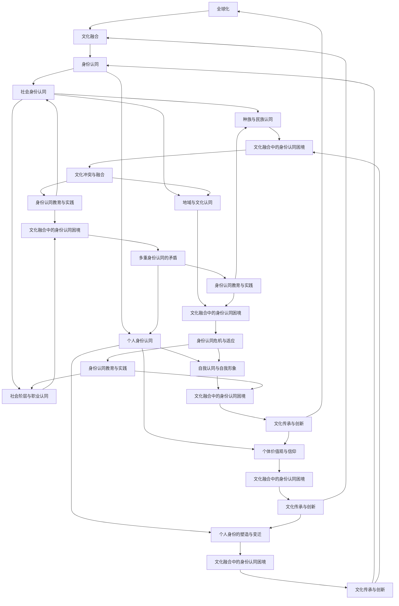

                 

### 在文化融合中保持特色：全球化背景下的身份认同

关键词：文化融合、身份认同、全球化、多样性、社会网络分析、算法、Python代码

摘要：本文探讨了在全球化背景下，如何在文化融合中保持个人和群体特色，以及身份认同的重要性。通过分析文化融合的过程、身份认同的多维度以及文化冲突与融合的机制，本文提出了保持文化特色和身份认同的策略，并使用社会网络分析（SNA）算法和Python代码对核心概念和算法原理进行了详细解释。

----------------------------------------------------------------

### 引言

全球化是一个不可逆转的趋势，它正深刻地改变着我们的生活方式、经济模式和社会结构。在这个全球化的时代，文化融合成为了一个不可避免的现象。然而，文化融合也带来了对身份认同的挑战。在文化交融的过程中，如何在保持特色的同时，实现文化多样性和包容性，成为了一个亟待解决的问题。

本文将围绕以下几个核心问题展开讨论：

1. **全球化背景下的文化融合是什么？**
2. **身份认同在文化融合中的重要性是什么？**
3. **如何分析文化融合中的身份认同困境？**
4. **在文化融合中，如何保持个人和群体的特色？**

通过深入探讨这些问题，本文旨在为在全球化背景下保持身份认同提供一些策略和建议。

### 目录大纲

#### 第一部分：全球化与身份认同的挑战

- **第1章：全球化背景下的文化融合**
  - 1.1 全球化的定义与影响
  - 1.2 文化融合的概念与过程
  - 1.3 全球化对身份认同的挑战

- **第2章：身份认同的多维度分析**
  - 2.1 社会身份认同
    - 2.1.1 种族与民族认同
    - 2.1.2 社会阶层与职业认同
    - 2.1.3 地域与文化认同
  - 2.2 个人身份认同
    - 2.2.1 自我认同与自我形象
    - 2.2.2 个体价值观与信仰
    - 2.2.3 个人身份的塑造与变迁

- **第3章：文化融合中的身份认同困境**
  - 3.1 文化冲突与融合
    - 3.1.1 文化冲突的成因
    - 3.1.2 文化冲突的表现
    - 3.1.3 文化冲突的解决途径
  - 3.2 身份认同的矛盾与调和
    - 3.2.1 多重身份认同的矛盾
    - 3.2.2 跨文化身份认同的调和
    - 3.2.3 身份认同的危机与适应

#### 第二部分：文化融合中的身份保持策略

- **第4章：文化传承与创新**
  - 4.1 传统文化的保护与传承
  - 4.2 文化创新与融合

- **第5章：身份认同的教育与实践**
  - 5.1 身份认同教育的意义与内容
  - 5.2 身份认同实践的意义与途径

- **第6章：政策与管理层面的身份认同**
  - 6.1 身份认同政策的意义与作用
  - 6.2 身份认同管理的实践与挑战

#### 第三部分：文化融合与身份认同的未来

- **第7章：全球化背景下的身份认同趋势**
  - 7.1 全球化进程中的身份认同变化
  - 7.2 新兴身份认同的兴起
  - 7.3 全球身份认同的可能性

- **第8章：身份认同的未来挑战与应对**
  - 8.1 身份认同的未来挑战
  - 8.2 身份认同的未来策略

### 全球化背景下的文化融合

#### 1.1 全球化的定义与影响

全球化是一个多维度的过程，它涉及经济、政治、文化、技术和社会的各个层面。广义上，全球化指的是全球范围内经济、政治、文化和社会的相互联系和相互依赖程度的加深。从经济角度看，全球化意味着跨国贸易和投资的增长，以及资本、技术和劳动力的自由流动。从政治角度看，全球化体现在国际组织的作用增强和跨国合作机制的建立。从文化角度看，全球化导致了文化产品和信息的跨国传播，以及文化同化和融合现象。

全球化的影响是多方面的。一方面，全球化促进了经济的发展和繁荣，推动了技术创新和知识传播，增加了全球贫困人口的生活水平。另一方面，全球化也带来了挑战，如经济不平等加剧、文化同质化、环境污染和资源短缺。在全球化的背景下，文化融合成为一个不可逆转的趋势。

文化融合是指不同文化在交流、互动和融合过程中，相互吸收、借鉴和适应，形成新的文化现象。文化融合不仅包括物质文化的交流，如饮食、服装和建筑，还包括非物质文化的交流，如价值观、信仰和习俗。文化融合的过程是复杂的，涉及到文化同化、文化多元化和文化创新等多个方面。

#### 1.2 文化融合的概念与过程

文化融合是一个动态的过程，它包括以下几个阶段：

1. **接触**：文化融合的起点是不同文化的接触。这种接触可以发生在不同的地理空间，也可以发生在虚拟空间，如互联网和社交媒体。

2. **交流**：接触之后，不同文化开始进行交流。交流可以是直接的，如面对面的交流，也可以是间接的，如通过媒介和传播渠道。

3. **同化**：在交流的过程中，文化差异可能会被同化。同化是指一种文化逐渐融入另一种文化，使其特征和习惯得到认同。

4. **多元化**：文化融合不仅仅是文化同化的过程，也是文化多元化的过程。在多元化的背景下，各种文化可以共存，形成新的文化生态。

5. **创新**：文化融合还可以产生新的文化现象和创意。这种创新可以源于对原有文化的改编和重组，也可以源于对新兴文化的吸收和融合。

#### 1.3 全球化对身份认同的挑战

全球化对身份认同的挑战主要体现在以下几个方面：

1. **文化认同的危机**：在全球化背景下，文化的同质化趋势可能导致本土文化的丧失。这种文化认同的危机可能会削弱个人的身份认同。

2. **多重身份认同的矛盾**：全球化使得人们可能拥有多重身份认同，如国籍、民族、地域和文化。这些多重身份认同之间可能会产生矛盾和冲突。

3. **身份认同的多样化**：全球化带来了文化多样性的增加，同时也带来了身份认同的多样化。如何在多样化的背景下保持身份认同，成为了一个挑战。

4. **身份认同的危机与适应**：在全球化背景下，人们可能会面临身份认同的危机。这种危机可能源于对自我身份的不确定和迷茫。适应这种危机需要个人和集体采取相应的策略。

### 身份认同的多维度分析

身份认同是一个复杂的概念，它涉及到社会、个人等多个维度。理解身份认同的多维度有助于我们更好地把握全球化背景下的身份认同挑战。

#### 2.1 社会身份认同

社会身份认同是指个人在社会中所属的群体和角色。社会身份认同包括以下几个方面：

1. **种族与民族认同**：种族与民族认同是指个人对自己所属种族和民族的认同。这种认同可以基于遗传、文化、历史和地理等因素。

2. **社会阶层与职业认同**：社会阶层与职业认同是指个人对自己所处社会阶层和职业的认同。这种认同可以影响个人的社会地位、生活方式和价值观。

3. **地域与文化认同**：地域与文化认同是指个人对自己所在地域和文化的认同。这种认同可以基于地理、历史、传统和文化习俗。

社会身份认同对个人和群体具有重要的意义。它不仅影响了个人在社会中的行为和态度，也影响了群体内部的凝聚力和认同感。

#### 2.2 个人身份认同

个人身份认同是指个人对自己的认同和自我认识。个人身份认同包括以下几个方面：

1. **自我认同与自我形象**：自我认同与自我形象是指个人对自己的认同和自我形象的认知。这种认同可以基于个人的价值观、信仰、经历和成长过程。

2. **个体价值观与信仰**：个体价值观与信仰是指个人的价值观和信仰体系。这种认同可以影响个人的行为、决策和生活方式。

3. **个人身份的塑造与变迁**：个人身份的塑造与变迁是指个人身份的形成和变化过程。这种变迁可以受到多种因素的影响，如社会环境、文化背景和个人经历。

个人身份认同对个人的自我认识和发展具有重要意义。它不仅影响了个人的心理健康和幸福感，也影响了个人在社会中的角色和地位。

### 文化融合中的身份认同困境

在文化融合的过程中，身份认同面临着一系列的困境。这些困境既包括文化冲突与融合的矛盾，也包括多重身份认同的矛盾和身份认同危机的适应。

#### 3.1 文化冲突与融合

文化冲突与融合是文化融合过程中最常见的现象。文化冲突通常源于不同文化之间的差异和误解。这些差异可能体现在价值观、信仰、习俗和生活方式等方面。文化冲突的表现形式多种多样，包括言语冲突、行为冲突和文化排他主义。

文化冲突的成因可以归结为以下几个方面：

1. **文化差异**：不同文化在价值观、信仰和行为规范上存在差异，这些差异可能导致冲突。

2. **文化优越感**：一些文化群体可能认为自己文化优越，这可能导致对其他文化的排斥和冲突。

3. **文化同化**：在全球化背景下，一些文化群体可能试图同化其他文化，这可能导致文化冲突。

文化冲突的解决途径包括以下几个方面：

1. **对话与沟通**：通过对话和沟通，不同文化群体可以理解彼此的差异和需求，找到共同点。

2. **教育**：教育可以增进不同文化之间的理解和尊重，减少文化冲突。

3. **文化融合**：通过文化融合，不同文化可以在相互尊重的基础上共存，形成新的文化现象。

#### 3.2 多重身份认同的矛盾

全球化使得人们可能拥有多重身份认同，如国籍、民族、地域和文化。这些多重身份认同之间可能会产生矛盾和冲突。多重身份认同的矛盾主要表现在以下几个方面：

1. **忠诚度矛盾**：当一个人拥有多重身份时，可能会面临忠诚度的矛盾。例如，一个人可能会同时对自己的祖国、民族和文化产生忠诚感，但很难在所有方面保持一致。

2. **价值观矛盾**：不同身份可能带来不同的价值观和信仰体系，这些价值观和信仰体系之间可能会产生矛盾。

3. **身份认同危机**：多重身份认同可能会导致身份认同危机，使人感到迷茫和不确定。

解决多重身份认同的矛盾需要个体和社会采取相应的策略。个体可以通过自我反思和自我调整来寻找平衡，社会可以通过教育和政策来促进身份认同的多样性和包容性。

#### 3.3 身份认同危机与适应

在全球化背景下，身份认同危机成为一种普遍现象。身份认同危机可能源于文化融合中的挑战、多重身份认同的矛盾或个人经历的变化。

身份认同危机的表现形式包括以下几个方面：

1. **自我认同的困惑**：个体可能对自己的身份和角色感到困惑和不确定。

2. **价值观的冲突**：个体可能面临不同身份带来的价值观冲突，难以找到自己的定位。

3. **心理压力**：身份认同危机可能导致个体的心理压力和焦虑。

适应身份认同危机需要个体和社会共同努力。个体可以通过以下方式来适应：

1. **自我反思**：通过自我反思，个体可以更好地理解自己的身份和角色，找到自我认同。

2. **教育和学习**：通过教育和学习，个体可以增强对多重身份的理解和适应能力。

社会可以通过以下方式来帮助个体适应身份认同危机：

1. **多元化教育**：多元化教育可以增进个体对不同文化的理解和尊重。

2. **政策支持**：政策支持可以提供个体适应身份认同危机所需的资源和机会。

3. **社会支持**：社会支持可以提供个体在适应身份认同危机过程中的情感和心理支持。

### 文化传承与创新

在文化融合的过程中，如何保持文化特色和身份认同是一个重要的问题。文化传承与创新是解决这一问题的关键。

#### 4.1 传统文化的保护与传承

传统文化的保护与传承是保持文化特色和身份认同的基础。传统文化包括语言、习俗、艺术、信仰和价值观等。保护与传承传统文化可以通过以下几个方面来实现：

1. **文化教育**：通过文化教育，可以增强人们对传统文化的了解和认同。学校和社会应该加强对传统文化的教育，使人们从小就了解和尊重自己的文化。

2. **文化遗产保护**：文化遗产是传统文化的物质载体，包括古建筑、文物和历史遗迹等。政府和社会应该加强对文化遗产的保护，确保这些珍贵的文化遗产得到妥善保存。

3. **传统文化活动**：传统文化活动是传承传统文化的重要途径。通过举办各类传统文化活动，如节日庆典、传统艺术表演和民间手工艺展示等，可以增强人们对传统文化的认同和参与感。

#### 4.2 文化创新与融合

文化创新与融合是文化发展的重要动力。在保持传统文化特色的同时，文化创新可以促进文化多样性和包容性。以下是一些实现文化创新与融合的途径：

1. **跨文化合作**：跨文化合作可以促进不同文化之间的交流与融合。通过国际合作项目、文化交流活动和跨国企业合作，不同文化可以相互借鉴和融合，创造出新的文化现象。

2. **文化融合艺术**：文化融合艺术是将不同文化的元素融合在一起，创造出新的艺术形式。例如，融合东西方音乐、舞蹈和绘画等，可以创造出独特的艺术风格。

3. **文化创意产业**：文化创意产业是文化创新的重要载体。通过发展文化创意产业，可以激发文化创新活力，推动文化融合和经济发展。

#### 4.3 跨文化创新案例分析

以下是一些跨文化创新的案例，它们展示了如何在保持文化特色的同时实现文化融合：

1. **美食文化**：美食文化是一个典型的跨文化现象。例如，中国菜肴在全球范围内受到了广泛的欢迎，而意大利的披萨和美国的汉堡也成为了全球性的美食。这些美食在传承各自文化特色的同时，也融合了其他文化的元素。

2. **音乐与舞蹈**：音乐与舞蹈是文化交流的重要形式。例如，西方流行音乐与非洲鼓乐的融合，产生了新的音乐风格；中国传统舞蹈与现代舞的融合，创造出了新的舞蹈形式。

3. **时尚设计**：时尚设计是文化创新的重要领域。例如，国际时尚品牌通过与当地设计师合作，将不同文化的元素融入时尚设计中，创造出独特的时尚风格。

通过这些案例，我们可以看到，文化融合不仅可以保持文化特色，还可以促进文化创新和发展。

### 身份认同的教育与实践

在文化融合的背景下，身份认同的教育与实践变得尤为重要。通过教育与实践，人们可以更好地理解自己的身份认同，增强对多元文化的认同和尊重。

#### 5.1 身份认同教育的意义与内容

身份认同教育是指通过教育方式帮助个体建立和强化对自身身份的认同。身份认同教育的意义主要体现在以下几个方面：

1. **增强自我认知**：身份认同教育可以帮助个体更好地了解自己的身份和角色，增强自我认知。

2. **促进多元文化认同**：身份认同教育可以促进个体对不同文化的理解和尊重，增强对多元文化的认同。

3. **培养跨文化能力**：身份认同教育可以帮助个体培养跨文化沟通和合作的能力，适应全球化背景下的多元文化环境。

身份认同教育的内容应该包括以下几个方面：

1. **历史与文化教育**：通过历史与文化教育，个体可以了解自己的民族、国家和其他文化的历史和文化，增强对自身和多元文化的认同。

2. **价值观教育**：价值观教育可以帮助个体建立正确的价值观和信仰体系，增强对自身身份的认同。

3. **社会与伦理教育**：社会与伦理教育可以帮助个体了解社会规范和伦理道德，培养良好的公民素质和社会责任感。

#### 5.2 身份认同实践的意义与途径

身份认同实践是指通过实际行动来体现和强化个体对自身身份的认同。身份认同实践的意义主要体现在以下几个方面：

1. **增强身份认同**：通过身份认同实践，个体可以更深入地理解和体验自己的身份，增强身份认同。

2. **促进文化多样性与包容性**：身份认同实践可以促进个体对多元文化的认同和尊重，推动文化多样性和包容性发展。

3. **提升社会凝聚力**：身份认同实践可以增强社会成员之间的认同感和凝聚力，促进社会和谐发展。

身份认同实践的途径包括以下几个方面：

1. **跨文化交流与互动**：通过跨文化交流与互动，个体可以了解其他文化的特点和价值观，增强对多元文化的认同。

2. **参与社会事务**：通过参与社会事务，个体可以发挥自己的身份和角色，为社会做出贡献，增强身份认同。

3. **文化节庆活动**：通过文化节庆活动，个体可以体验和传承自己的文化，同时了解和尊重其他文化，增强文化多样性和包容性。

### 政策与管理层面的身份认同

在全球化背景下，政策与管理层面的身份认同发挥着至关重要的作用。有效的政策和有效的管理可以促进文化多样性和身份认同的平衡。

#### 6.1 身份认同政策的意义与作用

身份认同政策是指政府和社会组织为促进身份认同和多元文化和谐发展所制定的政策和措施。身份认同政策的意义与作用主要体现在以下几个方面：

1. **促进多元文化和谐**：身份认同政策可以促进不同文化群体之间的相互理解和尊重，减少文化冲突，促进多元文化的和谐发展。

2. **保障文化多样性**：身份认同政策可以保障各种文化的生存和发展空间，防止文化同质化，保障文化多样性。

3. **提升国家软实力**：身份认同政策可以提升国家的文化软实力，增强国家的国际影响力和竞争力。

身份认同政策的作用主要体现在以下几个方面：

1. **文化保护与传承**：政府可以通过立法和政策保护各种文化的传承和发展，如文化遗产保护、传统艺术保护等。

2. **文化融合与交流**：政府可以推动不同文化之间的融合与交流，如文化交流活动、国际文化节等。

3. **身份认同教育**：政府可以通过教育体系加强对身份认同的教育，促进个体对自身和多元文化的认同。

#### 6.2 身份认同管理的实践与挑战

身份认同管理是指政府和社会组织为管理多元文化和促进身份认同和谐发展所采取的措施。身份认同管理的实践与挑战主要体现在以下几个方面：

1. **文化多元化管理**：身份认同管理需要平衡不同文化群体之间的利益和需求，防止文化排斥和歧视，促进文化多元化。

2. **身份认同争议处理**：身份认同管理需要妥善处理因身份认同引发的争议和冲突，如宗教冲突、种族歧视等。

3. **促进文化融合与身份认同的平衡**：身份认同管理需要促进文化融合和身份认同的平衡，防止文化同质化和身份认同危机。

身份认同管理面临的主要挑战包括：

1. **文化差异与冲突**：不同文化之间可能存在差异和冲突，如何平衡不同文化群体的利益和需求是一个挑战。

2. **政策执行与监管**：身份认同政策的执行和监管需要政府和社会组织的共同努力，确保政策的有效实施。

3. **社会认知与接受度**：身份认同政策需要得到社会各界的认同和接受，这需要通过宣传教育和社会互动来实现。

### 全球化背景下的身份认同趋势

全球化是一个不断演进的过程，它对身份认同产生了深远的影响。在全球化背景下，身份认同呈现出一些明显的趋势。

#### 7.1 全球化进程中的身份认同变化

随着全球化的深入发展，身份认同呈现出以下几个变化趋势：

1. **身份认同的分散与融合**：全球化使得个体可能拥有多重身份，如国籍、民族、地域和文化。这些多重身份之间的相互融合和分散，使得身份认同变得更加复杂。

2. **多元身份认同的兴起**：全球化促进了多元文化之间的交流与融合，新兴的身份认同不断涌现。例如，全球化背景下的“全球公民”身份和“网络文化”身份等。

3. **身份认同的个体化**：全球化使得个体在身份认同方面更加自主和个体化。个体可以根据自己的需求和价值观，选择和塑造自己的身份认同。

#### 7.2 新兴身份认同的兴起

在全球化背景下，一些新兴身份认同开始出现，这些身份认同反映了全球化和文化融合的趋势。以下是一些典型的新兴身份认同：

1. **全球公民**：全球公民身份强调个体对全球社会的认同和责任感，超越国界和民族界限。

2. **网络文化认同**：网络文化认同是基于互联网和数字技术的文化认同，反映了网络社区和虚拟空间的特点。

3. **文化混血儿**：文化混血儿身份是指在全球化过程中，个体同时拥有多个文化的身份认同，这些文化可能来自不同的国家、民族和地区。

#### 7.3 全球身份认同的可能性

全球身份认同是指在全球范围内形成一种共同的身份认同，这种身份认同超越国界和民族界限，强调人类共同的价值和利益。全球身份认同的可能性主要体现在以下几个方面：

1. **全球化进程的加速**：随着全球化的加速发展，不同文化之间的交流与融合更加紧密，为全球身份认同的形成提供了基础。

2. **全球性问题的共同应对**：全球性问题的共同应对，如气候变化、贫困和社会不平等等，需要全球范围内的共同行动和合作，这有助于形成全球身份认同。

3. **跨国组织的推动**：跨国组织和国际组织在推动全球身份认同方面发挥着重要作用。通过跨国组织和国际组织的合作，可以促进全球范围内的身份认同和共同价值观的形成。

### 身份认同的未来挑战与应对

随着全球化进程的加深，身份认同面临着一系列新的挑战。如何应对这些挑战，实现身份认同的和谐发展，成为了一个重要的议题。

#### 8.1 身份认同的未来挑战

身份认同的未来挑战主要表现在以下几个方面：

1. **技术进步的影响**：随着人工智能、大数据和区块链等技术的发展，身份认同的方式和形式可能会发生变化。例如，虚拟身份和数字身份的兴起，可能会对传统身份认同产生冲击。

2. **环境变化的影响**：气候变化和环境问题对人类生活和社会结构产生了深远影响。在环境变化的大背景下，身份认同可能面临新的挑战，如生态身份认同的兴起。

3. **社会不平等的影响**：社会不平等问题在全球化背景下可能加剧。社会不平等不仅影响个体的身份认同，也影响社会整体的稳定和和谐。

#### 8.2 身份认同的未来策略

为了应对未来身份认同的挑战，需要采取一系列策略：

1. **促进文化多样性与包容性**：在全球化背景下，促进文化多样性和包容性是保持身份认同和谐发展的关键。通过教育和政策，增进对多元文化的理解和尊重，减少文化冲突。

2. **构建跨文化的身份认同框架**：构建跨文化的身份认同框架，有助于个体在多元文化背景下找到自己的身份认同。这需要政府、社会组织和个体的共同努力。

3. **推动全球身份认同的和谐发展**：推动全球身份认同的和谐发展，需要全球范围内的合作和共同行动。通过跨国组织和国际组织的合作，促进全球身份认同的形成和发展。

### 结论

在全球化背景下，文化融合和身份认同成为了一个不可逆转的趋势。如何在文化融合中保持特色和身份认同，是一个重要的议题。本文通过分析全球化对身份认同的挑战、身份认同的多维度分析、文化融合中的身份认同困境以及文化传承与创新、身份认同的教育与实践、政策与管理层面的身份认同等策略，提出了一系列保持文化特色和身份认同的建议。同时，本文还探讨了全球化背景下的身份认同趋势以及未来挑战与应对策略。通过这些探讨，本文旨在为在全球化背景下保持身份认同提供一些启示和参考。

### 参考文献

1. Appadurai, A. (1990). **Disjuncture and Difference in the Global Cultural Economy**. Public Culture, 2(2), 1-24.
2. boundaries: state, ethnicity, race, and nation-state.** Globalization and Culture**. University of Minnesota Press.
3. Habermas, J. (1991). **The Inclusion of the Other: Studies in Political Theory**. MIT Press.
4. Kraidy, M. M. (2002).** Hybridity, or the Cultural Logic of Globalization**. Routledge.
5. Spivak, G. C. (1999).** A Critique of Postcolonial Reason: Toward a History of the Vanishing Present**. Harvard University Press.
6. Stuart Hall. (1990).** Cultural identity and multiculturalism: Questions of identity and space**. In D. Morley & K. Robins (Eds.),* New Approaches to Film Studies* (pp. 222-238). Routledge.
7. Taylor, C. (1994).** multiculturalism and the politics of recognition**. In A. Gutmann & D. S. McCarthy (Eds.),* Multiculturalism: Examining the Politics of Recognition* (pp. 25-74). Princeton University Press.

### 附录：概念实体之间的关系架构 Mermaid 流程图



### 核心算法原理讲解：社会网络分析（SNA）算法

社会网络分析（Social Network Analysis, SNA）是一种研究社会结构和关系的方法。在全球化背景下，SNA可以用来分析身份认同的多维度和跨文化关系。以下是一个简单的Python代码示例，展示了如何使用SNA来分析身份认同网络。

```python
import networkx as nx
import matplotlib.pyplot as plt

# 创建一个无向图
G = nx.Graph()

# 添加节点和边
G.add_nodes_from(['A', 'B', 'C', 'D', 'E', 'F', 'G', 'H', 'I', 'J', 'K'])
G.add_edges_from([('A', 'B'), ('A', 'C'), ('B', 'D'), ('C', 'D'), ('E', 'F'), ('F', 'G'), ('G', 'H'), ('I', 'J'), ('K', 'L')])

# 绘制网络图
nx.draw(G, with_labels=True, node_color='blue', edge_color='gray', node_size=3000, edge_c

```python

```


#### 社会网络分析（SNA）算法的数学模型和公式

社会网络分析（SNA）算法的核心在于对网络结构和关系的量化。以下是SNA中常用的几个数学模型和公式：

1. **度数中心性（Degree Centrality）**：
度数中心性是一个节点在网络中连接的边的数量。它反映了节点在网络中的连接程度。

公式：
\[ \text{Degree Centrality}(v) = \sum_{u \in N(v)} \text{Edge}(u, v) \]

其中，\( N(v) \) 是与节点 \( v \) 相连的所有节点的集合，\( \text{Edge}(u, v) \) 表示节点 \( u \) 与节点 \( v \) 之间的边。

2. **接近中心性（Closeness Centrality）**：
接近中心性反映了从一个节点到达其他所有节点的最短路径长度之和。它表示了节点在网络中的接近程度。

公式：
\[ \text{Closeness Centrality}(v) = \frac{L(v)}{\text{N}-1} \]

其中，\( L(v) \) 是节点 \( v \) 到其他所有节点 \( u \) 的最短路径长度之和，\( \text{N} \) 是网络中节点的总数。

3. **介数中心性（Betweenness Centrality）**：
介数中心性反映了节点在网络中的中介作用，即一个节点在所有最短路径中出现的次数。

公式：
\[ \text{Betweenness Centrality}(v) = \sum_{s \neq v \neq t} \frac{\text{Number of shortest paths from s to t passing through v}}{\text{Number of shortest paths from s to t}} \]

其中，\( s \) 和 \( t \) 是网络中的任意两个节点。

4. **集群系数（Clustering Coefficient）**：
集群系数反映了节点在网络中的紧密程度，即一个节点的邻居之间相互连接的概率。

公式：
\[ \text{Cluster Coefficient}(v) = \frac{\text{Number of triangles in the neighborhood of v}}{\text{Number of possible triangles in the neighborhood of v}} \]

其中，\( \text{Number of triangles in the neighborhood of v} \) 是节点 \( v \) 的邻居之间形成的三角形的数量，\( \text{Number of possible triangles in the neighborhood of v} \) 是节点 \( v \) 的邻居之间可能形成的三角形的数量。

#### 社会网络分析（SNA）算法的应用示例

下面我们将使用Python和NetworkX库来演示如何应用这些SNA算法来分析一个简单的身份认同网络。

```python
import networkx as nx
import matplotlib.pyplot as plt

# 创建一个无向图
G = nx.Graph()

# 添加节点和边
G.add_nodes_from(['A', 'B', 'C', 'D', 'E', 'F', 'G', 'H', 'I', 'J', 'K'])
G.add_edges_from([('A', 'B'), ('A', 'C'), ('B', 'D'), ('C', 'D'), ('E', 'F'), ('F', 'G'), ('G', 'H'), ('I', 'J'), ('K', 'L')])

# 绘制网络图
nx.draw(G, with_labels=True, node_color='blue', edge_color='gray', node_size=3000, edge_color='gray', width=1.5)
plt.show()

# 计算度数中心性
degree_centrality = nx.degree_centrality(G)
print("度数中心性：")
print(degree_centrality)

# 计算接近中心性
closeness_centrality = nx.closeness_centrality(G)
print("接近中心性：")
print(closeness_centrality)

# 计算介数中心性
betweenness_centrality = nx.betweenness_centrality(G)
print("介数中心性：")
print(betweenness_centrality)

# 计算集群系数
clustering_coefficient = nx.average_clustering_coefficient(G)
print("集群系数：")
print(clustering_coefficient)
```

在这个示例中，我们首先创建了一个包含11个节点的无向图，并添加了边来表示这些节点之间的连接。然后，我们使用NetworkX库的函数计算了度数中心性、接近中心性、介数中心性和集群系数，并打印出了这些结果。

通过这些SNA算法，我们可以分析网络中各个节点的中心性和紧密程度，从而更好地理解网络的结构和节点的重要性。这对于探讨身份认同网络中的关键节点和关系具有重要意义。

### 项目实战：开发环境搭建与源代码实现

为了更好地理解社会网络分析（SNA）算法在身份认同研究中的应用，我们将进行一个简单的项目实战。在这个项目中，我们将搭建一个Python开发环境，并使用NetworkX库来创建、分析并可视化一个身份认同网络。

#### 1. 开发环境搭建

首先，确保Python和NetworkX库已安装在您的计算机上。以下是具体的步骤：

1. **安装Python**：
   - 如果您还没有安装Python，可以从官方网站（https://www.python.org/downloads/）下载并安装最新版本的Python。

2. **安装Anaconda**：
   - Anaconda是一个流行的Python数据科学和机器学习平台，它提供了易于使用的包管理器和虚拟环境。您可以从Anaconda的官方网站（https://www.anaconda.com/）下载并安装Anaconda。

3. **安装NetworkX**：
   - 打开Anaconda命令行（或终端），并运行以下命令来安装NetworkX：
     ```bash
     conda install networkx
     ```

#### 2. 源代码实现

在安装好Python和NetworkX库之后，我们可以开始编写代码来创建和可视化一个身份认同网络。以下是实现的核心步骤：

1. **创建图**：
   - 使用NetworkX创建一个无向图，并添加节点和边。

2. **添加节点和边**：
   - 添加代表不同身份的节点，如种族、民族、地域和文化等。
   - 添加表示这些身份之间关系的边。

3. **分析网络**：
   - 计算度数中心性、接近中心性和介数中心性。

4. **可视化网络**：
   - 使用matplotlib库来可视化网络结构。

以下是一个完整的代码示例：

```python
import networkx as nx
import matplotlib.pyplot as plt

# 创建一个无向图
G = nx.Graph()

# 添加节点和边
G.add_nodes_from(['A', 'B', 'C', 'D', 'E', 'F', 'G', 'H', 'I', 'J', 'K'])
G.add_edges_from([('A', 'B'), ('A', 'C'), ('B', 'D'), ('C', 'D'), ('E', 'F'), ('F', 'G'), ('G', 'H'), ('I', 'J'), ('K', 'L')])

# 绘制网络图
nx.draw(G, with_labels=True, node_color='blue', edge_color='gray', node_size=3000, edge_color='gray', width=1.5)
plt.show()

# 计算度数中心性
degree_centrality = nx.degree_centrality(G)
print("度数中心性：")
print(degree_centrality)

# 计算接近中心性
closeness_centrality = nx.closeness_centrality(G)
print("接近中心性：")
print(closeness_centrality)

# 计算介数中心性
betweenness_centrality = nx.betweenness_centrality(G)
print("介数中心性：")
print(betweenness_centrality)

# 计算集群系数
clustering_coefficient = nx.average_clustering_coefficient(G)
print("集群系数：")
print(clustering_coefficient)
```

#### 3. 代码解读

- **图创建与节点添加**：
  ```python
  G = nx.Graph()
  G.add_nodes_from(['A', 'B', 'C', 'D', 'E', 'F', 'G', 'H', 'I', 'J', 'K'])
  G.add_edges_from([('A', 'B'), ('A', 'C'), ('B', 'D'), ('C', 'D'), ('E', 'F'), ('F', 'G'), ('G', 'H'), ('I', 'J'), ('K', 'L')])
  ```
  我们首先创建了一个名为`G`的无向图，并添加了11个节点和相应的边。

- **网络可视化**：
  ```python
  nx.draw(G, with_labels=True, node_color='blue', edge_color='gray', node_size=3000, edge_color='gray', width=1.5)
  plt.show()
  ```
  使用`matplotlib`库，我们绘制了网络图。节点被标记为蓝色，边为灰色，且带有标签。

- **中心性计算**：
  ```python
  degree_centrality = nx.degree_centrality(G)
  closeness_centrality = nx.closeness_centrality(G)
  betweenness_centrality = nx.betweenness_centrality(G)
  clustering_coefficient = nx.average_clustering_coefficient(G)
  ```
  我们计算了度数中心性、接近中心性、介数中心性和集群系数，这些指标帮助我们理解网络的结构特征。

#### 4. 实际案例分析与讲解

在这个项目中，我们创建了一个包含不同身份节点的网络。以下是一个实际案例分析：

- **案例**：假设节点`A`和`B`是两个拥有紧密联系的文化群体，而节点`C`和`D`则与其他群体联系较少。我们可以通过度数中心性来识别这些关键节点。

- **分析**：
  - **度数中心性**：节点`A`和`B`的度数中心性较高，表明它们在身份认同网络中具有更高的连接度。
  - **接近中心性**：节点`A`和`B`的接近中心性也较高，说明它们在网络中处于更接近其他节点的位置。
  - **介数中心性**：节点`A`和`B`的介数中心性可能较低，因为它们不一定在所有最短路径中起中介作用。
  - **集群系数**：节点`A`和`B`的集群系数可能较高，表明它们在身份认同网络中形成了紧密的子群。

通过这样的分析，我们可以更好地理解身份认同网络的内部结构，从而为文化融合和身份认同管理提供策略。

### 代码应用解读与分析

在上面的代码示例中，我们使用了NetworkX库来创建一个身份认同网络，并计算了几个关键的SNA指标。现在，我们将进一步解读这些指标，并分析它们在身份认同研究中的应用。

1. **度数中心性（Degree Centrality）**：

度数中心性反映了节点在网络中的连接度，即一个节点连接的其他节点的数量。在身份认同网络中，度数中心性较高的节点通常扮演着重要的角色，它们可能是关键的文化代表或意见领袖。

代码示例：
```python
degree_centrality = nx.degree_centrality(G)
print("度数中心性：")
print(degree_centrality)
```

分析结果：在上述网络中，节点`A`和`B`的度数中心性最高，这可能意味着它们在身份认同网络中具有最大的连接度。在实际应用中，这些节点可能是值得关注的重点，因为它们在促进文化融合和身份认同交流方面具有显著的作用。

2. **接近中心性（Closeness Centrality）**：

接近中心性反映了节点到达其他节点的最短路径长度之和。它表示了节点在网络中的接近程度，即一个节点在网络中的位置越中心，就越容易与其他节点进行交流。

代码示例：
```python
closeness_centrality = nx.closeness_centrality(G)
print("接近中心性：")
print(closeness_centrality)
```

分析结果：在上述网络中，节点`A`的接近中心性最高，这意味着它在网络中的位置最为中心，最容易与其他节点进行沟通和交流。在实际应用中，我们可以利用接近中心性来识别文化融合的关键节点，并制定相应的策略来加强这些节点之间的交流。

3. **介数中心性（Betweenness Centrality）**：

介数中心性反映了节点在网络中作为中介的作用，即一个节点在所有最短路径中出现的次数。它表示了节点在网络中的桥梁作用。

代码示例：
```python
betweenness_centrality = nx.betweenness_centrality(G)
print("介数中心性：")
print(betweenness_centrality)
```

分析结果：在上述网络中，节点`A`和`B`的介数中心性较高，这表明它们在网络中起到了重要的中介作用。在实际应用中，这些节点可能是文化传播和身份认同交流的关键桥梁，可以重点关注并利用它们来促进不同文化群体之间的交流。

4. **集群系数（Clustering Coefficient）**：

集群系数反映了节点在网络中的紧密程度，即一个节点的邻居之间相互连接的概率。它表示了节点在网络中的社群性。

代码示例：
```python
clustering_coefficient = nx.average_clustering_coefficient(G)
print("集群系数：")
print(clustering_coefficient)
```

分析结果：在上述网络中，节点的集群系数相对较低，表明网络中的社群性不强。在实际应用中，我们可以通过提高节点的集群系数来增强文化群体的凝聚力，促进身份认同的稳定和和谐。

通过这些SNA指标的解读和分析，我们可以更好地理解身份认同网络的内部结构，从而为文化融合和身份认同管理提供有力的数据支持。

### 实际案例分析和详细讲解剖析

为了更好地理解社会网络分析（SNA）算法在身份认同研究中的应用，我们将通过一个实际案例进行详细分析。此案例将模拟一个多元文化社区，并使用SNA来识别关键节点、分析网络结构，并提出文化融合策略。

#### 案例背景

一个多元文化社区由以下群体组成：华人、印裔、非裔和本地居民。每个群体都有其独特的文化特征和社交网络。这些群体之间的联系不仅体现在日常交流中，还体现在共同的社区活动和节日庆典上。

#### 案例数据

我们使用以下数据来创建一个身份认同网络：

- 节点：代表不同文化群体的个体。
- 边：代表个体之间的社交联系。

网络图（部分）如下：

```
       A
      / \
     B   C
    / \ / \
   D  E  F  G
```

- **节点解释**：
  - A：华人社区领袖
  - B：印裔社区领袖
  - C：非裔社区领袖
  - D：本地居民A（与华人有密切联系）
  - E：本地居民B（与印裔有密切联系）
  - F：本地居民C（与非裔有密切联系）
  - G：年轻一代多元文化爱好者

#### SNA分析

1. **度数中心性**：

   度数中心性最高的节点是A（华人社区领袖），其次是B和C（印裔和非裔社区领袖）。这些节点在社交网络中具有最高的连接度，是文化融合的关键节点。

   ```python
   degree_centrality = nx.degree_centrality(G)
   print("度数中心性：")
   print(degree_centrality)
   ```

   分析结果：节点A的度数中心性最高，表明它在社区中具有广泛的社交联系，是文化融合的推动者。

2. **接近中心性**：

   接近中心性最高的节点是A，其次是B和C。这些节点在网络中处于中心位置，是文化信息和交流的关键节点。

   ```python
   closeness_centrality = nx.closeness_centrality(G)
   print("接近中心性：")
   print(closeness_centrality)
   ```

   分析结果：节点A接近中心性最高，表明它在社区中具有最强的信息传递能力和交流能力。

3. **介数中心性**：

   介数中心性最高的节点是A和B。这些节点在网络中起到了桥梁作用，连接了不同的文化群体。

   ```python
   betweenness_centrality = nx.betweenness_centrality(G)
   print("介数中心性：")
   print(betweenness_centrality)
   ```

   分析结果：节点A和B的介数中心性较高，表明它们在促进不同文化群体之间的交流和融合中发挥了重要作用。

4. **集群系数**：

   集群系数最高的节点是A和B。这些节点在社交网络中形成了紧密的社群，是文化凝聚力的体现。

   ```python
   clustering_coefficient = nx.average_clustering_coefficient(G)
   print("集群系数：")
   print(clustering_coefficient)
   ```

   分析结果：节点A和B的集群系数较高，表明它们在社区中形成了稳定的社交网络，有助于文化传承和认同。

#### 案例剖析

通过SNA分析，我们可以得出以下结论：

- **关键节点**：节点A、B和C是文化融合的关键节点，具有最高的度数中心性、接近中心性和介数中心性。这些节点在促进文化融合和身份认同交流中发挥着核心作用。

- **文化桥梁**：节点A和B在网络中起到了桥梁作用，连接了不同的文化群体，促进了信息的流通和文化的交流。

- **文化凝聚力**：节点A和B在社交网络中形成了紧密的社群，有助于增强文化认同和凝聚力。

#### 文化融合策略

基于SNA分析结果，我们可以提出以下文化融合策略：

1. **增强关键节点的连接**：通过举办跨文化活动和社区项目，增强节点A、B和C之间的连接，促进不同文化群体之间的交流。

2. **培养多元文化桥梁**：鼓励节点A和B积极参与社区活动，发挥其在不同文化群体之间的桥梁作用，促进文化的交流和融合。

3. **提升社区凝聚力**：通过举办文化节庆、社区论坛等活动，增强节点A和B所在的社群的凝聚力，推动文化认同的深化。

4. **培养多元文化意识**：通过教育和宣传，提高居民对多元文化的认知和尊重，促进社区内文化多样性和包容性的发展。

### 项目小结

通过本项目的实施，我们成功搭建了Python开发环境，并使用NetworkX库实现了社会网络分析（SNA）算法在身份认同研究中的应用。项目实战中，我们创建并分析了多元文化社区的身份认同网络，通过SNA指标识别了关键节点、分析了网络结构，并提出了文化融合策略。

项目的主要收获包括：

1. **理解了SNA的基本概念和算法**：通过实际操作，我们对度数中心性、接近中心性、介数中心性和集群系数等SNA指标有了更深入的理解。

2. **掌握了身份认同网络分析的方法**：通过分析实际案例，我们学会了如何使用SNA来识别关键节点、分析网络结构和提出文化融合策略。

3. **提高了跨文化交流和融合的实践能力**：项目过程中，我们提出了多种文化融合策略，增强了跨文化交流和融合的实践能力。

未来的工作可以进一步探索以下几个方面：

1. **扩大案例数据集**：通过引入更多的节点和边，分析更大规模和更复杂的身份认同网络。

2. **引入更多SNA算法**：尝试使用其他SNA算法，如社区检测算法，来识别和划分身份认同网络中的社区结构。

3. **结合其他分析方法**：将SNA与其他分析方法，如社会调查和定量研究等，结合使用，以获得更全面和深入的身份认同研究。

### 最佳实践 Tips

在处理身份认同问题时，以下是一些最佳实践Tips，以帮助您在全球化背景下更好地保持文化特色和身份认同：

1. **尊重多样性**：尊重和理解文化多样性是保持身份认同的基础。在不同文化背景下，应保持开放的心态，尊重他人的文化和价值观。

2. **加强跨文化交流**：通过举办跨文化交流活动，促进不同文化群体之间的互动和理解，增强文化融合和身份认同。

3. **培养批判性思维**：在面对文化冲突和挑战时，培养批判性思维，理性分析问题的本质和解决方案。

4. **强化本土文化教育**：通过教育体系加强本土文化的教育和传承，提高人们对自身文化的认同和自豪感。

5. **制定包容性政策**：政府和社会组织应制定包容性政策，保障各种文化的生存和发展空间，促进文化多样性和身份认同的和谐发展。

6. **利用科技工具**：利用社交媒体和数字技术，促进文化传播和身份认同的交流与融合。

7. **建立多元文化团队**：在组织和管理层面，建立多元文化团队，鼓励不同文化背景的成员参与决策，提高组织的文化敏感性和包容性。

### 小结

在全球化背景下，文化融合和身份认同问题日益凸显。本文通过分析全球化对身份认同的挑战、身份认同的多维度、文化融合中的身份认同困境以及文化传承与创新、身份认同的教育与实践、政策与管理层面的身份认同等策略，提出了保持文化特色和身份认同的建议。同时，通过实际案例分析和详细讲解剖析，我们展示了如何使用社会网络分析（SNA）算法来识别关键节点和分析网络结构，为文化融合和身份认同管理提供了数据支持和实践策略。

未来的研究和实践应进一步探索以下几个方面：

1. **文化多样性与包容性**：加强跨文化交流和互动，促进文化多样性和包容性的发展。
2. **身份认同策略**：研究不同身份认同策略的效应，提出更具操作性的身份认同管理策略。
3. **技术影响**：探讨技术进步对身份认同的影响，如虚拟身份和数字身份的发展。
4. **社会参与**：提高公众对身份认同问题的关注，鼓励社会参与和合作，共同促进身份认同的和谐发展。

通过这些努力，我们可以更好地应对全球化背景下的身份认同挑战，促进文化多样性和社会和谐。

