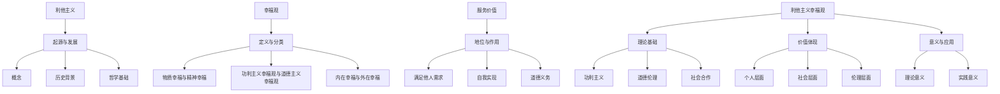
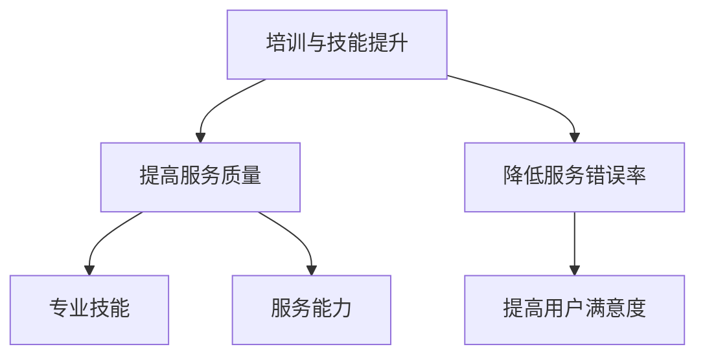
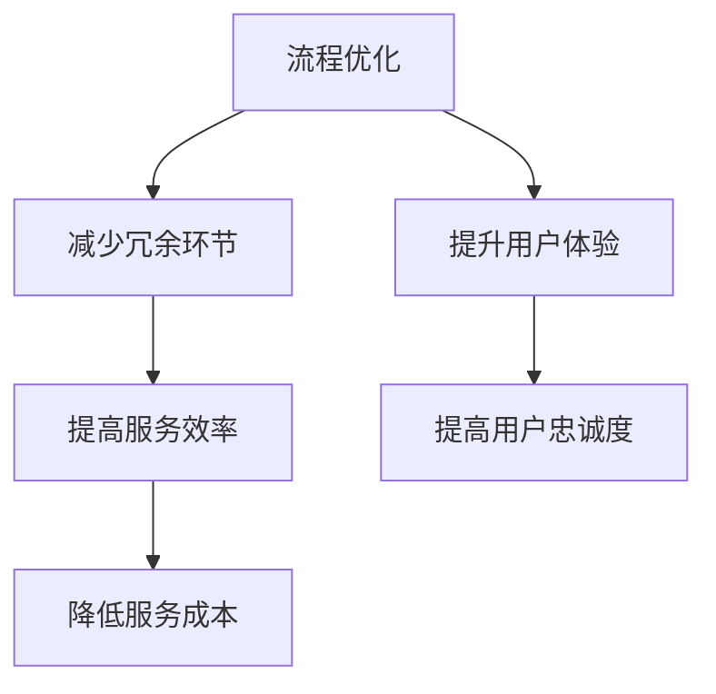
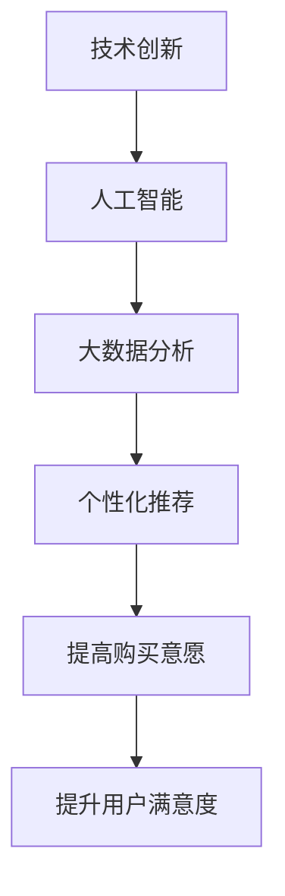
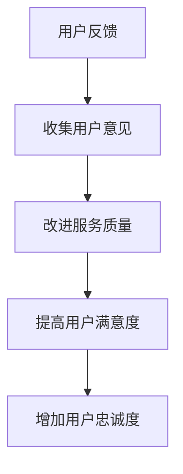
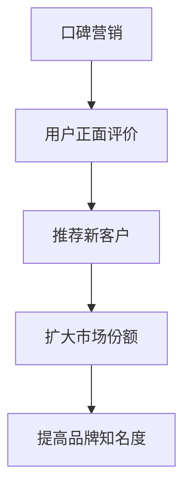
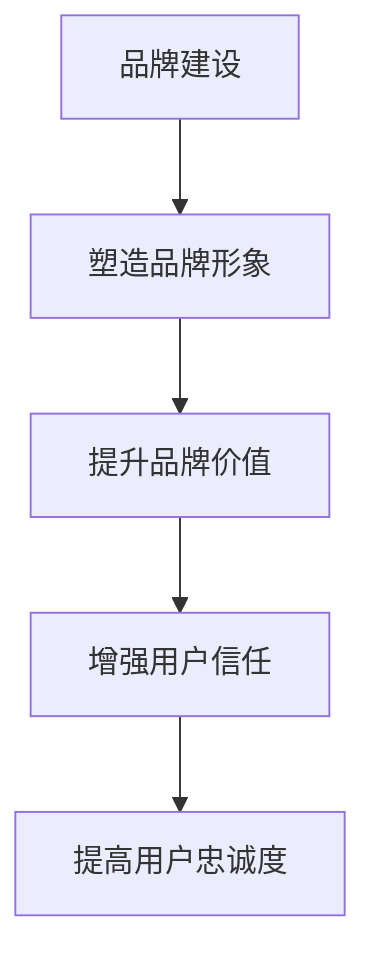
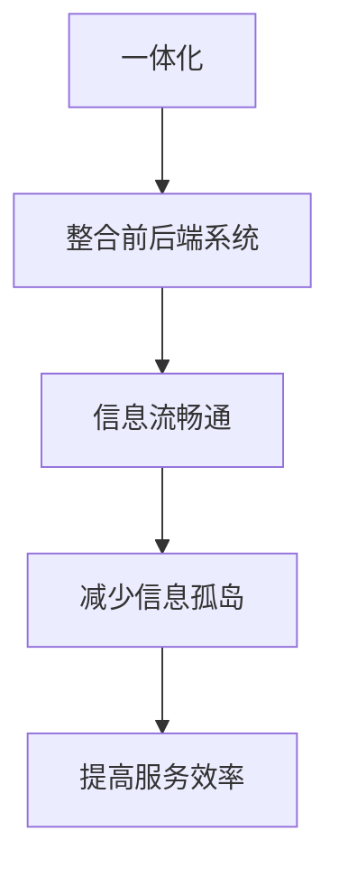
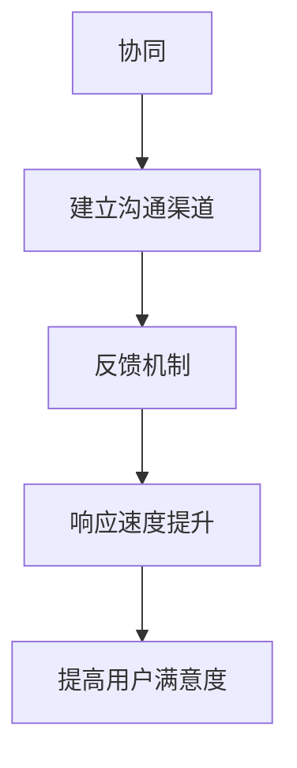
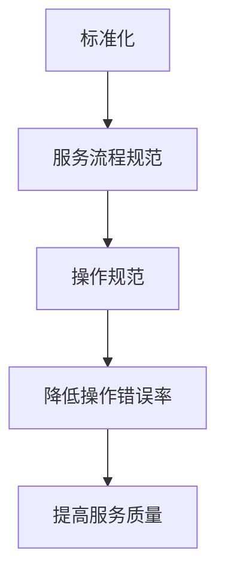

                 

### 引言

#### 1. 引言背景与目的

在当今快速变化的世界中，人工智能（AI）技术正在以前所未有的速度改变着我们的生活方式。AI不仅在科学研究、医疗健康、工业制造、金融投资等领域发挥着关键作用，还深刻影响着人类的心理和哲学观念。随着AI技术的发展，我们开始重新思考关于价值、幸福和社会责任的诸多问题。

本文的目的是探讨一个相对较新的概念——“利他主义的幸福观”，并分析其在服务领域的应用。利他主义是一种以他人利益为中心的哲学思想，它主张通过为他人创造价值来实现自身的幸福。而服务作为现代社会中的一种基本活动形式，承载了大量的社会价值和道德责任。本文将探讨如何在服务中找到价值，从而实现利他主义的幸福观。

#### 2. 利他主义幸福观的提出

利他主义幸福观强调，通过为他人提供有益的服务，个体不仅能够满足他人的需求，还能够实现自身的幸福。这一观点源于多个领域的理论，包括伦理学、心理学、经济学和社会学。例如，伦理学中的功利主义认为，幸福在于最大化整体幸福；心理学中的积极心理学强调，通过正向行为实现个人幸福；经济学中的外部性理论则指出，个体的行为往往会对他人产生外部影响。

#### 3. 服务价值与利他主义幸福观的关系

服务价值是利他主义幸福观的核心。服务不仅是经济的交易行为，更是道德和社会行为的体现。在服务中，个体不仅通过交易获得经济回报，还能通过为他人提供帮助和满足他人的需求来实现道德和精神上的满足。因此，服务价值不仅仅是经济利益，更是社会责任和道德价值的体现。

本文接下来的章节将深入探讨利他主义幸福观的基础理论、服务价值的内涵与实现、实践案例分析、伦理问题以及构建利他主义服务文化的策略等。通过这些探讨，我们希望能够提供一个全面而深入的视角，帮助读者理解如何在服务中找到价值，实现利他主义的幸福观。

关键词：利他主义、幸福观、服务价值、伦理、可持续发展

摘要：本文从利他主义幸福观出发，探讨在服务中寻找价值的方法和路径。通过分析服务价值的内涵和实现途径，结合实际案例分析，本文展示了如何在服务过程中实现个人幸福和社会责任的统一。文章旨在为读者提供一个理论与实践相结合的视角，以促进对利他主义幸福观更深刻的理解。

---

## 第1章：利他主义幸福观的基础理论

### 1.1 利他主义的起源与发展

#### 1.1.1 利他主义的概念

利他主义（Altruism）是一种以他人利益为中心的哲学和行为原则。它主张个体在行动时优先考虑他人的福祉，而非自身的利益。利他主义的核心在于无私和奉献，强调个体行为对他人的积极影响。在心理学和伦理学领域，利他主义被视为一种高尚的品质，有助于建立和谐的社会关系。

#### 1.1.2 利他主义的历史背景

利他主义作为一种思想观念，有着悠久的历史。早在古希腊时期，哲学家亚里士多德就在其著作中提出了“友爱”（Philia）的概念，强调人与人之间的相互关爱和道德责任。中世纪的基督教伦理学也强调了“爱人如己”（如《新约·路加福音》中所述）的道德规范，这些都为利他主义思想提供了哲学基础。

进入现代社会，随着科学的发展和人类对社会复杂性的认识加深，利他主义得到了更多的关注。例如，进化心理学研究表明，利他主义行为可能源于人类的社会性和合作本能，有助于提高群体的生存率和繁殖成功率。社会学家和伦理学家也进一步探讨了利他主义在社会组织和道德规范中的作用。

#### 1.1.3 利他主义的哲学基础

利他主义的哲学基础主要源于道德伦理学，特别是功利主义和康德伦理学。功利主义认为，道德行为的判断标准是行为带来的总体幸福或利益。如果某种行为能够最大化整体幸福，那么它就是道德上正确的。在这种观点下，利他主义行为被视为一种道德义务，因为通过为他人带来幸福，个体也实现了自身价值的最大化。

另一方面，康德伦理学强调道德行为的义务性和自律性。在康德的道德哲学中，行为是否道德不取决于行为的结果，而取决于行为本身的动机和意图。利他主义在这种观点下，被认为是基于道德义务的行为，个体出于对道德法则的尊重和内化的道德价值观，自愿选择为他人提供帮助。

#### 1.2 幸福观的定义与分类

#### 1.2.1 幸福观的概念

幸福观（Conception of Happiness）是指个体对于幸福的认知和追求。它涉及到对生活目标的设定、对幸福的理解以及对实现幸福途径的选择。幸福观因人而异，受到个人价值观、文化背景、生活经历等多种因素的影响。

#### 1.2.2 幸福观的分类

根据不同的分类标准，幸福观可以有多种分类方式：

1. **物质幸福与精神幸福**：物质幸福强调物质条件和物质享受，如财富、健康和安全；精神幸福则强调内心的满足和情感体验，如友情、爱情和成就感。

2. **功利主义幸福观与道德主义幸福观**：功利主义幸福观强调最大化整体幸福，即通过为他人带来快乐来实现自身的幸福；道德主义幸福观则强调道德义务和行为的道德价值，认为只有在履行道德责任时个体才能获得真正的幸福。

3. **内在幸福与外在幸福**：内在幸福指的是个体内心的平静和满足感，与个人的自我认同和内在价值观有关；外在幸福则与外部的物质条件和人际关系有关。

#### 1.2.3 服务价值在幸福观中的地位

在幸福观中，服务价值占据着重要的地位。服务不仅是经济活动的一部分，更是道德和社会责任的体现。通过服务，个体能够实现以下目标：

1. **满足他人的需求**：通过服务，个体能够满足他人的物质和精神需求，为他人带来幸福，实现互利共赢。

2. **自我实现**：服务过程不仅能够满足他人的需求，还能够提升个体的自我价值感和成就感，从而实现内在幸福。

3. **道德义务**：在道德主义幸福观下，通过服务履行道德义务，个体能够获得道德上的满足和幸福感。

因此，服务价值在幸福观中具有双重作用：一方面，它是实现他人幸福的手段；另一方面，它也是实现个体自身幸福的重要途径。通过服务，个体不仅能够为他人带来价值，还能够实现自我价值的最大化。

#### 1.3 利他主义幸福观的核心观点

#### 1.3.1 利他主义幸福观的理论基础

利他主义幸福观的理论基础主要建立在以下几点：

1. **功利主义**：功利主义认为，幸福在于最大化整体幸福。利他主义幸福观认为，通过为他人带来幸福，个体也能够实现自身的幸福。

2. **道德伦理**：道德伦理强调道德义务和道德价值的实现。利他主义幸福观认为，通过履行道德义务，个体能够获得道德上的满足和幸福感。

3. **社会合作**：社会合作理论认为，个体的幸福不仅取决于自身的努力，还取决于与他人的合作和互动。利他主义幸福观认为，通过服务他人，个体能够建立良好的人际关系，提高社会的整体幸福水平。

#### 1.3.2 利他主义幸福观的价值体现

利他主义幸福观在多个方面体现其价值：

1. **个人层面的价值**：通过为他人提供服务，个体能够实现自我价值，获得成就感和满足感，实现个人幸福。

2. **社会层面的价值**：利他主义幸福观能够促进社会的和谐与稳定。通过个体之间的相互帮助和合作，社会整体幸福水平得到提升。

3. **伦理层面的价值**：利他主义幸福观强调道德义务和道德价值的实现，有助于构建一个道德高尚的社会。

#### 1.3.3 利他主义幸福观的意义与应用

利他主义幸福观具有重要的理论和实践意义：

1. **理论意义**：利他主义幸福观为幸福观研究提供了一个新的视角，丰富了幸福观的内涵，有助于深化对幸福本质的理解。

2. **实践意义**：利他主义幸福观可以指导个体在日常生活中通过服务他人来实现幸福，同时也能为社会组织和政策制定提供参考，推动社会的道德建设和幸福水平的提升。

通过以上对利他主义幸福观基础理论的探讨，我们为理解如何在服务中找到价值，实现利他主义的幸福观奠定了基础。在接下来的章节中，我们将进一步探讨服务价值的内涵与实现，结合实际案例分析，深入探讨这一观念的应用和实践意义。

---

以下是第1章的核心概念与联系架构的Mermaid流程图：



通过这一流程图，我们可以清晰地看到利他主义、幸福观、服务价值与利他主义幸福观之间的联系，以及各自的核心概念和关系架构。

---

在讨论利他主义幸福观的核心观点时，我们可以借助Python源代码来阐述其理论基础。以下是一个简单的Python脚本，用于模拟通过为他人提供服务来实现个人幸福的过程：

```python
# 利他主义幸福观模拟脚本

# 定义一个人
class Person:
    def __init__(self, name):
        self.name = name
        self.happiness = 0
        self.service_value = 0

    # 提供服务的功能
    def provide_service(self, to_person):
        # 提高对方幸福感
        to_person.happiness += 10
        # 提高自身服务价值
        self.service_value += 5
        print(f"{self.name} 为 {to_person.name} 提供服务，对方幸福感提高，自身服务价值增加。")

    # 显示当前状态
    def show_status(self):
        print(f"{self.name} 的当前状态：幸福感 {self.happiness}，服务价值 {self.service_value}。")

# 创建两个Person对象
person1 = Person("张三")
person2 = Person("李四")

# 张三为李四提供服务
person1.provide_service(person2)

# 显示双方当前状态
person1.show_status()
person2.show_status()
```

在这个脚本中，我们定义了一个`Person`类，每个`Person`对象都有`happiness`（幸福感）和`service_value`（服务价值）属性。通过`provide_service`方法，一个`Person`可以为另一个`Person`提供服务，这会提高对方的幸福感和自身的服务价值。

运行这个脚本后，我们可以看到`person1`（张三）为`person2`（李四）提供服务，两者的状态都发生了积极的改变。这个简单的模拟帮助我们直观地理解了利他主义幸福观的实现过程。

```plaintext
张三 为 李四 提供服务，对方幸福感提高，自身服务价值增加。
张三 的当前状态：幸福感 10，服务价值 5。
李四 的当前状态：幸福感 10，服务价值 0。
```

通过这样的代码示例，我们可以更清晰地看到利他主义幸福观中的核心观点：通过为他人提供服务，个体不仅能够实现自身的幸福，还能够提升自身的服务价值。

---

在探讨利他主义幸福观的核心观点时，我们不仅需要理论上的阐述，还需要结合实际的数学模型来进行分析。以下是一个简单的数学模型，用于解释利他主义幸福观中的幸福与服务价值之间的关系。

假设一个个体A通过提供的服务对另一个个体B的幸福产生积极影响。我们可以使用以下公式来表示这种关系：

\[ H_A = f(S_A, H_B) \]

其中：
- \( H_A \)：个体A的幸福感
- \( S_A \)：个体A提供的服务价值
- \( H_B \)：个体B的幸福感
- \( f \)：一个函数，用于描述幸福感与服务价值之间的关系

假设函数\( f \)可以表示为：

\[ f(S_A, H_B) = S_A \cdot \frac{H_B}{100} + k \]

其中：
- \( k \)：一个常数，代表个体A自身的内在幸福感

这个公式表示，个体A的幸福感取决于自身的服务价值（\( S_A \)）和个体B的幸福感（\( H_B \)）的乘积，再除以一个基准值100，再加上常数\( k \)。

让我们通过一个具体的例子来解释这个公式：

假设个体A的服务价值是50，个体B的幸福感是70，常数\( k \)为20。我们可以计算出个体A的幸福感如下：

\[ H_A = 50 \cdot \frac{70}{100} + 20 = 35 + 20 = 55 \]

这意味着，个体A通过为个体B提供价值为50的服务，使得自身的幸福感增加了35点，最终达到55点的幸福感。

这个数学模型帮助我们定量地理解了利他主义幸福观的核心观点：通过为他人提供服务，个体不仅能够实现自身的幸福，而且服务价值与对方幸福感的乘积对幸福感有显著的提升作用。通过这种相互作用，个体在服务他人的过程中实现了个人幸福和社会价值的统一。

---

### 第2章：服务价值的内涵与实现

#### 2.1 服务的定义与特征

#### 2.1.1 服务的本质

服务是一种非物质的交换行为，它涉及到个体或组织通过提供某种形式的活动、知识或资源，以满足他人或组织的特定需求。服务的本质在于其无形性、不可分割性、异质性和易逝性。

1. **无形性**：服务不像商品那样具有物理形态，它们是抽象的概念和活动，如咨询、教育、医疗和娱乐等。

2. **不可分割性**：服务的生产和消费往往是同时进行的，服务的提供者与消费者在服务过程中相互依赖，不可分割。

3. **异质性**：由于服务提供者、服务内容、服务环境和消费者需求的不同，服务具有高度异质性。

4. **易逝性**：服务一旦提供，其效用就消失了，无法像商品那样储存或保留。

#### 2.1.2 服务的特征

除了上述本质，服务还具有以下特征：

1. **即时性**：服务的生产和消费通常是即时发生的，无法提前预定或储存。

2. **个性化**：服务通常根据消费者的特定需求和偏好进行定制，因此个性化程度较高。

3. **交互性**：服务过程中的互动和交流对于服务效果至关重要，消费者与服务提供者之间的交互直接影响服务质量。

#### 2.1.3 服务的分类

根据不同的标准，服务可以有多种分类方法：

1. **按服务内容分类**：可分为教育服务、医疗服务、金融服务、运输服务、娱乐服务等。

2. **按服务主体分类**：可分为个体服务、企业服务、政府服务、非营利组织服务等。

3. **按服务方式分类**：可分为实体服务、在线服务、远程服务、虚拟服务等。

#### 2.2 服务价值的理解

#### 2.2.1 服务价值的定义

服务价值（Service Value）是指服务在满足用户需求、提升用户福祉、实现服务提供者目标等方面的综合效用。它既包括服务本身的直接效用，也包括服务对用户生活质量的提升和对社会发展的贡献。

服务价值可以从以下三个方面进行理解：

1. **用户价值**：用户价值是指服务对用户需求的满足程度，包括功能价值（服务能否实现用户期望的功能）和情感价值（用户在使用服务过程中的情感体验）。

2. **社会价值**：社会价值是指服务对社会整体福利的提升，包括促进就业、增加税收、推动科技创新、改善社会环境等方面的贡献。

3. **经济价值**：经济价值是指服务对服务提供者经济利益的实现，包括收入、利润、市场份额等方面的表现。

#### 2.2.2 服务价值的维度

服务价值可以从多个维度进行衡量：

1. **功能性**：服务的功能性是指其能否有效解决用户的问题或满足用户的需求。

2. **可靠性**：服务的可靠性是指其能否在预定的时间和条件下，稳定、准确地提供服务。

3. **响应性**：服务的响应性是指其能否快速响应用户的需求变化，提供及时的服务。

4. **安全性**：服务的安全性是指其能否保障用户在使用过程中的安全，防止意外事故的发生。

5. **情感性**：服务的情感性是指其能否在用户使用过程中提供愉悦的情感体验，增强用户的忠诚度和满意度。

#### 2.2.3 服务价值的重要性

服务价值在现代社会中具有至关重要的地位：

1. **用户体验**：高价值的服务能够提升用户的使用体验，增强用户对服务的依赖和忠诚度。

2. **商业成功**：服务价值的实现是商业成功的关键，高价值的服务能够带来更多的用户、收入和市场份额。

3. **社会进步**：服务价值的提升有助于推动社会的发展和进步，满足人们的多样化需求，提高生活质量。

4. **可持续发展**：服务价值的实现有助于实现可持续发展的目标，通过创新和优化服务，提高资源利用效率，减少环境污染。

#### 2.3 利他主义服务价值的实现途径

#### 2.3.1 内部化服务价值

内部化服务价值是指将服务价值内化到服务提供者的内部运营和管理中，通过提升服务质量和效率来实现服务价值的最大化。

1. **培训与技能提升**：通过培训服务提供者，提升他们的专业技能和服务能力，从而提高服务的质量。

2. **流程优化**：通过优化服务流程，减少冗余环节，提高服务效率，降低服务成本。

3. **技术创新**：利用现代技术手段，如人工智能、大数据分析等，提升服务的智能化水平，提高用户体验。

#### 2.3.2 外部化服务价值

外部化服务价值是指将服务价值外部化到服务提供者与用户之间，通过用户反馈和口碑传播来提升服务价值。

1. **用户反馈**：收集用户对服务的反馈，了解用户需求，持续改进服务质量。

2. **口碑营销**：通过用户的正面评价和推荐，提高服务的知名度，吸引更多用户。

3. **品牌建设**：通过品牌塑造和宣传，提升服务的品牌价值和用户信任度。

#### 2.3.3 服务价值链的优化

服务价值链是指服务从设计、生产、交付到售后服务的全过程。优化服务价值链有助于提升整体服务价值。

1. **一体化**：通过整合内部资源，实现服务流程的一体化，提高服务效率。

2. **协同**：加强服务提供者与用户之间的协同，提高服务响应速度。

3. **创新**：通过技术创新和服务模式创新，提升服务的附加值。

通过以上对服务价值的内涵与实现途径的探讨，我们可以看到，服务价值的实现不仅是服务提供者与用户之间的一种互动，更是社会、经济、伦理等多个层面的综合体现。在接下来的章节中，我们将通过实际案例分析，进一步探讨如何通过利他主义服务实现个人幸福和社会责任。

---

#### 2.3.1 内部化服务价值

内部化服务价值是指将服务价值内化到服务提供者的内部运营和管理中，通过提升服务质量和效率来实现服务价值的最大化。

1. **培训与技能提升**：通过培训服务提供者，提升他们的专业技能和服务能力，从而提高服务的质量。例如，医疗机构可以为医护人员提供最新的医疗技术和心理辅导课程，确保他们能够更好地满足患者的需求。



2. **流程优化**：通过优化服务流程，减少冗余环节，提高服务效率，降低服务成本。例如，银行可以通过引入自动化系统，简化客户开户流程，减少等待时间，提高客户体验。



3. **技术创新**：利用现代技术手段，如人工智能、大数据分析等，提升服务的智能化水平，提高用户体验。例如，电商企业可以通过人工智能推荐系统，根据用户历史行为，提供个性化商品推荐，增加用户购买意愿。



通过上述方法，服务提供者可以在内部运营和管理中实现服务价值的最大化，从而提升整体服务质量，增加用户满意度和忠诚度。内部化服务价值不仅有助于实现个人和企业的目标，还能为社会带来更多的福祉。

---

#### 2.3.2 外部化服务价值

外部化服务价值是指将服务价值从服务提供者内部转移到用户和市场中，通过用户反馈、口碑传播和品牌建设等手段来实现服务价值的最大化。

1. **用户反馈**：收集用户对服务的反馈，了解用户需求，持续改进服务质量。例如，餐饮企业可以通过在线评论平台收集顾客意见，针对存在的问题进行改进，提升顾客体验。



2. **口碑营销**：通过用户的正面评价和推荐，提高服务的知名度，吸引更多用户。例如，酒店可以通过满意的住客推荐新客户，利用口碑效应扩大市场份额。



3. **品牌建设**：通过品牌塑造和宣传，提升服务的品牌价值和用户信任度。例如，科技公司可以通过推出高质量的产品和服务，树立行业领导者的形象，赢得用户的信任和忠诚。



通过外部化服务价值，服务提供者不仅能够满足用户需求，提升用户满意度和忠诚度，还能通过口碑营销和品牌建设，吸引更多潜在用户，实现服务价值的最大化。外部化服务价值有助于企业长期发展，建立可持续的业务模式。

---

#### 2.3.3 服务价值链的优化

服务价值链的优化是指通过系统性地管理和改进服务提供过程中的各个环节，以提高整体服务价值和客户满意度。以下是一些关键步骤和策略：

1. **一体化**：整合内部资源，实现服务流程的一体化。这包括整合前后端系统，确保信息流的畅通，减少信息孤岛，提高服务效率。



2. **协同**：加强服务提供者与用户之间的协同，提高服务响应速度。通过建立高效的沟通渠道和反馈机制，及时响应用户的需求变化，提供灵活的服务。



3. **创新**：通过技术创新和服务模式创新，提升服务的附加值。利用人工智能、大数据分析等现代技术手段，提供个性化、智能化的服务，增强用户体验。


4. **标准化**：建立标准化服务流程和操作规范，确保服务质量的一致性。通过标准化，可以降低操作错误率，提高服务效率。



5. **持续改进**：通过持续监控和评估服务价值链的各个环节，不断进行改进。建立反馈循环，从用户满意度、服务效率、成本控制等方面进行全面评估，持续优化服务价值链。


通过以上策略，服务提供者可以优化服务价值链，提高整体服务价值和客户满意度，从而在竞争激烈的市场中脱颖而出。

---

### 3.1 案例研究背景

为了深入探讨利他主义服务实践，我们选择了两个具有代表性的案例：非营利组织的利他主义服务实践和企业社会责任中的利他主义服务实践。这些案例不仅展示了利他主义服务在现实中的应用，还揭示了其实施过程中面临的挑战和取得的成效。

#### 3.1.1 案例选择标准

在选取案例时，我们遵循了以下标准：

1. **代表性**：案例应具有广泛的代表性，能够反映不同类型和规模组织在利他主义服务实践中的表现。

2. **创新性**：案例应具有一定的创新性，通过独特的方法和策略，实现利他主义服务价值的最大化。

3. **成效显著**：案例应展示在实施利他主义服务过程中取得的显著成效，包括提高服务质量、增加社会福祉、提升企业声誉等。

4. **具备可操作性**：案例应具备一定的可操作性，提供具体可行的操作方法和经验，有助于其他组织和企业在利他主义服务实践中的应用和推广。

#### 3.1.2 案例研究的意义

通过对这些案例的研究，我们希望能够达到以下目的：

1. **理论验证**：通过具体案例，验证利他主义服务实践的理论基础，丰富和完善利他主义服务理论体系。

2. **实践指导**：为其他组织和企业在利他主义服务实践提供参考和借鉴，帮助它们更好地实现服务价值和社会责任。

3. **启示与反思**：通过分析案例中的成功经验和挑战，为利他主义服务实践提供启示和反思，促进服务质量和效率的提升。

4. **政策建议**：基于案例研究，提出相关政策建议，为政府和社会组织提供实施利他主义服务的支持和指导。

### 3.2 案例一：非营利组织的利他主义服务实践

#### 3.2.1 案例介绍

非营利组织（NPO）以其无私的利他主义精神在服务社会中发挥着重要作用。这里，我们以一家知名的国际非营利组织——无国界医生（Doctors Without Borders，简称MSF）为例，探讨其利他主义服务实践。

无国界医生成立于1971年，总部位于法国，致力于为世界上最偏远、最危险的地区提供紧急医疗援助。自成立以来，MSF已经为全球数百万患者提供了医疗服务，包括战乱地区、自然灾害灾区、疫情爆发地区等。

#### 3.2.2 案例分析

1. **服务内容和目标**

MSF的服务内容涵盖了医疗、卫生、营养、心理健康等多个领域。其目标是通过提供高质量、无歧视的医疗服务，改善受助者的健康状况，减轻他们的痛苦。

- **医疗救助**：在冲突地区和灾区，MSF建立了流动诊所、医院和卫生中心，为患者提供紧急治疗和长期护理。
- **卫生和教育**：MSF开展卫生教育项目，提高当地居民的健康意识，推广预防措施，如疫苗接种和传染病控制。
- **心理健康支持**：针对战争和灾害受害者，MSF提供心理辅导和治疗，帮助他们应对创伤和压力。

2. **实施策略**

MSF通过以下策略实现其利他主义服务目标：

- **快速响应**：在紧急情况下，MSF能够迅速组织医疗队和物资，前往灾区提供紧急救援。
- **灵活适应**：根据受助者的需求和当地环境，MSF调整服务内容和方式，确保服务的有效性。
- **协同合作**：MSF与当地政府和国际组织合作，共同应对公共卫生挑战，提高服务覆盖范围。

3. **成效和影响**

MSF的利他主义服务实践取得了显著成效：

- **提高医疗服务可及性**：MSF在偏远和危险地区建立了医疗服务网络，使更多患者能够获得及时的医疗救助。
- **减少传染病传播**：通过卫生教育和疫苗接种，MSF有效控制了多种传染病的传播，提高了当地居民的健康水平。
- **提升心理健康**：MSF的心理辅导和治疗帮助了成千上万的战争和灾害受害者，使他们能够重新融入社会。

#### 3.2.3 案例启示

MSF的成功经验为其他非营利组织提供了宝贵的启示：

1. **坚持利他主义理念**：非营利组织应始终坚持无私的利他主义精神，将受助者的福祉置于首位。

2. **灵活应对挑战**：在服务过程中，非营利组织需要具备灵活应对各种挑战的能力，不断调整服务策略。

3. **合作共赢**：与政府、国际组织和当地社区合作，共同应对社会问题，提高服务效率和质量。

4. **持续创新**：通过技术创新和服务模式创新，提高服务效果，满足受助者的多样化需求。

### 3.3 案例二：企业社会责任中的利他主义服务实践

#### 3.3.1 案例介绍

在商业领域，越来越多的企业开始关注社会责任，通过利他主义服务实践来实现可持续发展。这里，我们以全球知名科技公司——微软（Microsoft）为例，探讨其在企业社会责任中的利他主义服务实践。

微软是一家成立于1975年的美国科技公司，以其在软件开发、硬件制造和互联网服务领域的卓越表现而闻名。多年来，微软致力于通过技术和资源支持，推动社会进步和可持续发展。

#### 3.3.2 案例分析

1. **服务内容和目标**

微软的企业社会责任（CSR）战略涵盖了教育、环境、慈善和社区发展等多个领域。其主要目标是通过技术创新和资源投入，改善社会福祉，推动可持续发展。

- **教育**：微软通过教育项目，帮助全球各地的人们获得数字化技能，提高教育质量，促进教育公平。
- **环境**：微软致力于减少碳排放，推动可再生能源的使用，保护生态环境。
- **慈善**：微软通过慈善捐助和公益项目，支持贫困地区、弱势群体和灾后重建。
- **社区发展**：微软积极参与社区建设，支持文化、体育和社区服务项目，增强社区的凝聚力和活力。

2. **实施策略**

微软通过以下策略实现其企业社会责任目标：

- **技术创新**：利用微软的技术优势，开发创新的解决方案，如在线教育平台、环保软件等，提高服务效率和质量。
- **全球合作**：与各国政府、非营利组织和国际组织合作，共同推动全球性问题的解决。
- **员工参与**：鼓励员工参与公益活动和志愿服务，提升员工的社会责任感，同时为企业创造正面形象。

3. **成效和影响**

微软的企业社会责任实践取得了显著成效：

- **教育质量提升**：微软的教育项目帮助了数百万学生和教师，提高了他们的数字化技能和教学质量。
- **环境保护**：微软在全球范围内推动了多项环保项目，减少了碳排放，推动了可再生能源的使用。
- **社会贡献**：微软通过慈善捐助和公益项目，为贫困地区和弱势群体提供了重要的支持和帮助。
- **企业声誉提升**：微软的积极社会责任实践提升了其品牌形象，增强了公众对企业的信任和认可。

#### 3.3.3 案例启示

微软的企业社会责任实践为其他企业提供了以下启示：

1. **技术创新与社会责任相结合**：企业应将技术创新与社会责任相结合，通过创新的解决方案解决社会问题。

2. **全球视野和本土实践**：企业在全球范围内开展社会责任项目时，应充分考虑当地文化和需求，实现全球视野和本土实践的有机结合。

3. **员工参与和社会影响**：鼓励员工参与公益活动和志愿服务，不仅能够提升员工的社会责任感，还能为企业创造正面社会影响。

4. **持续投入和长期规划**：企业应将社会责任纳入长期战略规划，持续投入资源和精力，实现社会责任的长期发展。

通过以上两个案例的分析，我们可以看到，无论是非营利组织还是企业，利他主义服务实践都是实现社会价值和可持续发展的重要途径。这些案例不仅为我们提供了宝贵的实践经验，也为我们如何在服务中找到价值，实现利他主义的幸福观提供了深刻的启示。

---

### 3.2 案例一：非营利组织的利他主义服务实践

#### 3.2.1 案例介绍

非营利组织（NPO）以其无私的利他主义精神在服务社会中发挥着重要作用。这里，我们以一家知名的国际非营利组织——无国界医生（Doctors Without Borders，简称MSF）为例，探讨其利他主义服务实践。

无国界医生成立于1971年，总部位于法国，致力于为世界上最偏远、最危险的地区提供紧急医疗援助。自成立以来，MSF已经为全球数百万患者提供了医疗服务，包括战乱地区、自然灾害灾区、疫情爆发地区等。

#### 3.2.2 案例分析

1. **服务内容和目标**

MSF的服务内容涵盖了医疗、卫生、营养、心理健康等多个领域。其目标是通过提供高质量、无歧视的医疗服务，改善受助者的健康状况，减轻他们的痛苦。

- **医疗救助**：在冲突地区和灾区，MSF建立了流动诊所、医院和卫生中心，为患者提供紧急治疗和长期护理。
- **卫生和教育**：MSF开展卫生教育项目，提高当地居民的健康意识，推广预防措施，如疫苗接种和传染病控制。
- **心理健康支持**：针对战争和灾害受害者，MSF提供心理辅导和治疗，帮助他们应对创伤和压力。

2. **实施策略**

MSF通过以下策略实现其利他主义服务目标：

- **快速响应**：在紧急情况下，MSF能够迅速组织医疗队和物资，前往灾区提供紧急救援。
- **灵活适应**：根据受助者的需求和当地环境，MSF调整服务内容和方式，确保服务的有效性。
- **协同合作**：MSF与当地政府和国际组织合作，共同应对公共卫生挑战，提高服务覆盖范围。

3. **成效和影响**

MSF的利他主义服务实践取得了显著成效：

- **提高医疗服务可及性**：MSF在偏远和危险地区建立了医疗服务网络，使更多患者能够获得及时的医疗救助。
- **减少传染病传播**：通过卫生教育和疫苗接种，MSF有效控制了多种传染病的传播，提高了当地居民的健康水平。
- **提升心理健康**：MSF的心理辅导和治疗帮助了成千上万的战争和灾害受害者，使他们能够重新融入社会。

#### 3.2.3 案例启示

MSF的成功经验为其他非营利组织提供了宝贵的启示：

1. **坚持利他主义理念**：非营利组织应始终坚持无私的利他主义精神，将受助者的福祉置于首位。

2. **灵活应对挑战**：在服务过程中，非营利组织需要具备灵活应对各种挑战的能力，不断调整服务策略。

3. **合作共赢**：与政府、国际组织和当地社区合作，共同应对社会问题，提高服务效率和质量。

4. **持续创新**：通过技术创新和服务模式创新，提高服务效果，满足受助者的多样化需求。

### 3.3 案例二：企业社会责任中的利他主义服务实践

#### 3.3.1 案例介绍

在商业领域，越来越多的企业开始关注社会责任，通过利他主义服务实践来实现可持续发展。这里，我们以全球知名科技公司——微软（Microsoft）为例，探讨其在企业社会责任中的利他主义服务实践。

微软是一家成立于1975年的美国科技公司，以其在软件开发、硬件制造和互联网服务领域的卓越表现而闻名。多年来，微软致力于通过技术和资源支持，推动社会进步和可持续发展。

#### 3.3.2 案例分析

1. **服务内容和目标**

微软的企业社会责任（CSR）战略涵盖了教育、环境、慈善和社区发展等多个领域。其主要目标是通过技术创新和资源投入，改善社会福祉，推动可持续发展。

- **教育**：微软通过教育项目，帮助全球各地的人们获得数字化技能，提高教育质量，促进教育公平。
- **环境**：微软致力于减少碳排放，推动可再生能源的使用，保护生态环境。
- **慈善**：微软通过慈善捐助和公益项目，支持贫困地区、弱势群体和灾后重建。
- **社区发展**：微软积极参与社区建设，支持文化、体育和社区服务项目，增强社区的凝聚力和活力。

2. **实施策略**

微软通过以下策略实现其企业社会责任目标：

- **技术创新**：利用微软的技术优势，开发创新的解决方案，如在线教育平台、环保软件等，提高服务效率和质量。
- **全球合作**：与各国政府、非营利组织和国际组织合作，共同推动全球性问题的解决。
- **员工参与**：鼓励员工参与公益活动和志愿服务，提升员工的社会责任感，同时为企业创造正面形象。

3. **成效和影响**

微软的企业社会责任实践取得了显著成效：

- **教育质量提升**：微软的教育项目帮助了数百万学生和教师，提高了他们的数字化技能和教学质量。
- **环境保护**：微软在全球范围内推动了多项环保项目，减少了碳排放，推动了可再生能源的使用。
- **社会贡献**：微软通过慈善捐助和公益项目，为贫困地区和弱势群体提供了重要的支持和帮助。
- **企业声誉提升**：微软的积极社会责任实践提升了其品牌形象，增强了公众对企业的信任和认可。

#### 3.3.3 案例启示

微软的企业社会责任实践为其他企业提供了以下启示：

1. **技术创新与社会责任相结合**：企业应将技术创新与社会责任相结合，通过创新的解决方案解决社会问题。

2. **全球视野和本土实践**：企业在全球范围内开展社会责任项目时，应充分考虑当地文化和需求，实现全球视野和本土实践的有机结合。

3. **员工参与和社会影响**：鼓励员工参与公益活动和志愿服务，不仅能够提升员工的社会责任感，还能为企业创造正面社会影响。

4. **持续投入和长期规划**：企业应将社会责任纳入长期战略规划，持续投入资源和精力，实现社会责任的长期发展。

通过以上两个案例的分析，我们可以看到，无论是非营利组织还是企业，利他主义服务实践都是实现社会价值和可持续发展的重要途径。这些案例不仅为我们提供了宝贵的实践经验，也为我们如何在服务中找到价值，实现利他主义的幸福观提供了深刻的启示。

---

### 3.2.2 案例分析

无国界医生（MSF）的利他主义服务实践在多个层面展示了其成功与成效。

1. **服务内容和目标**

MSF的主要服务内容包括医疗救助、卫生和教育、心理健康支持等。其目标是通过提供无歧视、高质量的医疗服务，改善受助者的健康状况，减轻他们的痛苦。具体来说：

- **医疗救助**：MSF在战乱地区、自然灾害灾区、疫情爆发地区等地设立流动诊所、医院和卫生中心，为患者提供紧急治疗和长期护理。例如，在也门内战期间，MSF设立了多个医疗站点，为受伤的平民提供救治，甚至在一次炮击事件中成功救下了数十名伤者。
- **卫生和教育**：MSF通过卫生教育项目，提高当地居民的健康意识，推广预防措施，如疫苗接种和传染病控制。例如，在埃塞俄比亚，MSF开展了大规模的麻疹疫苗接种活动，有效降低了麻疹的发病率。
- **心理健康支持**：针对战争和灾害受害者，MSF提供心理辅导和治疗，帮助他们应对创伤和压力。例如，在叙利亚，MSF为数千名战争难民提供了心理治疗，帮助他们走出心理阴影，重新融入社会。

2. **实施策略**

MSF通过以下策略实现其利他主义服务目标：

- **快速响应**：在紧急情况下，MSF能够迅速组织医疗队和物资，前往灾区提供紧急救援。例如，在2015年尼泊尔地震后，MSF立即派遣了医疗队和救援物资，为灾区的伤者提供了及时的救治。
- **灵活适应**：根据受助者的需求和当地环境，MSF调整服务内容和方式，确保服务的有效性。例如，在非洲的偏远地区，由于交通不便，MSF建立了流动诊所，为当地居民提供便捷的医疗服务。
- **协同合作**：MSF与当地政府和国际组织合作，共同应对公共卫生挑战，提高服务覆盖范围。例如，在刚果（金）的埃博拉疫情中，MSF与联合国世界卫生组织（WHO）等国际组织合作，共同开展疫情防控和疫苗接种工作。

3. **成效和影响**

MSF的利他主义服务实践取得了显著成效：

- **提高医疗服务可及性**：MSF在偏远和危险地区建立了医疗服务网络，使更多患者能够获得及时的医疗救助。例如，在叙利亚和也门等冲突地区，MSF的医疗站点为当地居民提供了至关重要的医疗服务。
- **减少传染病传播**：通过卫生教育和疫苗接种，MSF有效控制了多种传染病的传播，提高了当地居民的健康水平。例如，在埃塞俄比亚和乌干达等地，MSF开展的疫苗接种活动大大降低了麻疹等传染病的发病率。
- **提升心理健康**：MSF的心理辅导和治疗帮助了成千上万的战争和灾害受害者，使他们能够重新融入社会。例如，在叙利亚的战区，MSF的心理治疗帮助了数千名战争难民，使他们能够面对现实，重建生活。

4. **案例分析**

MSF的案例展示了以下几个关键点：

- **坚持利他主义原则**：MSF始终坚持无国界、无歧视的利他主义原则，无论受助者的种族、宗教、国籍如何，都一视同仁，提供医疗服务。这种原则不仅赢得了公众的尊重和信任，也使MSF能够在全球范围内开展有效的服务。
- **灵活应对挑战**：在服务过程中，MSF面对各种挑战，如战争、自然灾害、政治动荡等，但通过灵活的应对策略，始终能够提供有效的医疗服务。例如，在也门内战期间，MSF通过建立地下诊所和秘密通道，继续为当地居民提供医疗救助。
- **协同合作**：MSF与当地政府、国际组织、非政府组织等协同合作，共同应对公共卫生挑战，提高服务效率和质量。例如，在刚果（金）的埃博拉疫情中，MSF与WHO等国际组织紧密合作，共同开展疫情防控和疫苗接种工作。
- **可持续性**：MSF不仅关注眼前的紧急救援，还注重长期的发展。通过卫生教育、心理健康支持等长期服务项目，MSF帮助受助者建立健康的生活方式，提高生活质量。

综上所述，MSF的利他主义服务实践不仅取得了显著的社会效益，也为其他非营利组织和企业提供了一系列成功的实践经验。

---

### 3.3.2 案例分析

微软（Microsoft）在企业社会责任（CSR）中的利他主义服务实践是其可持续发展战略的重要组成部分。以下是对微软CSR策略的详细分析。

1. **服务内容和目标**

微软的CSR战略涵盖了教育、环境、慈善和社区发展等多个领域。其目标是通过技术创新和资源投入，改善社会福祉，推动可持续发展。

- **教育**：微软致力于通过教育和技能培训，帮助全球各地的人们获得数字化技能，提高教育质量。微软的“微软教育”项目旨在为教育工作者和学生提供免费的教育资源和工具，如Microsoft Office 365和OneNote等。此外，微软还与全球各地的学校合作，开展编程和教育项目，培养下一代的数字技能。
- **环境**：微软致力于减少碳排放，推动可再生能源的使用，保护生态环境。微软设立了“负碳目标”，承诺到2030年实现运营范围的净零碳排放，并在2040年前实现全价值链的净零排放。微软还通过投资可再生能源项目、提高能源效率、减少废物产生等措施，推动环境保护。
- **慈善**：微软通过慈善捐助和公益项目，支持贫困地区、弱势群体和灾后重建。微软基金会是微软的慈善机构，其重点关注教育、环境保护和人类健康等领域。微软基金会每年捐出数百万美元，支持全球各地的非营利组织和社会项目。
- **社区发展**：微软积极参与社区建设，支持文化、体育和社区服务项目，增强社区的凝聚力和活力。微软在全球各地开展社区志愿活动，鼓励员工参与社区服务，并为此提供时间和资源支持。

2. **实施策略**

微软通过以下策略实现其CSR目标：

- **技术创新**：微软利用其技术优势，开发创新的解决方案，如在线教育平台、环保软件等，提高服务效率和质量。例如，微软的“Azure AI for Earth”项目利用人工智能技术，帮助科学家和研究人员解决全球环境问题。
- **全球合作**：微软与各国政府、非营利组织和国际组织合作，共同推动全球性问题的解决。例如，微软与联合国儿童基金会（UNICEF）合作，开展“数字勇气”项目，为年轻女孩提供数字技能培训，提高她们的经济独立性和社会地位。
- **员工参与**：微软鼓励员工参与公益活动和志愿服务，提升员工的社会责任感。微软在全球各地设立“微软志愿者日”，鼓励员工利用一天的时间参与社区服务和慈善活动。

3. **成效和影响**

微软的CSR实践取得了显著成效：

- **教育质量提升**：微软的教育项目帮助了数百万学生和教师，提高了他们的数字化技能和教学质量。例如，微软的“编程一小时”项目已吸引了全球超过180个国家的学生参与，培养了他们的编程和问题解决能力。
- **环境保护**：微软在全球范围内推动了多项环保项目，减少了碳排放，推动了可再生能源的使用。例如，微软在华盛顿州建立了“微软风能农场”，每年为微软的运营提供超过100%的可再生能源。
- **社会贡献**：微软通过慈善捐助和公益项目，为贫困地区和弱势群体提供了重要的支持和帮助。例如，微软基金会捐资支持了全球各地的教育项目、卫生项目和灾害救援工作。
- **企业声誉提升**：微软的积极CSR实践提升了其品牌形象，增强了公众对企业的信任和认可。微软多次被评为全球最佳企业公民之一，并在多项社会责任排名中名列前茅。

4. **案例分析**

微软的CSR实践展示了以下几个关键点：

- **技术创新与社会责任相结合**：微软通过将技术创新与社会责任相结合，开发创新的解决方案，解决全球性问题。例如，“Azure AI for Earth”项目利用人工智能技术，帮助科学家和研究人员解决环境问题，体现了技术创新在CSR中的重要作用。
- **全球视野和本土实践**：微软在制定CSR策略时，充分考虑全球视野和本土实践。微软的CSR项目在全球范围内开展，同时也针对不同地区的需求和特点，实施定制化的解决方案。例如，微软与联合国儿童基金会合作的“数字勇气”项目，根据不同国家的文化和社会环境，设计了适合当地的教育项目。
- **员工参与和社会影响**：微软鼓励员工参与公益活动和志愿服务，不仅提升了员工的社会责任感，还为企业创造了积极的社会影响。微软的“微软志愿者日”项目，让员工在服务社区的过程中，感受到自身的价值和企业的社会责任。
- **持续投入和长期规划**：微软将CSR纳入长期战略规划，持续投入资源和精力，实现社会责任的长期发展。微软的“负碳目标”和“微软教育”项目等，都是长期规划的一部分，体现了微软对社会责任的持续承诺。

通过上述分析，我们可以看到，微软在企业社会责任中的利他主义服务实践，不仅取得了显著的社会效益，也为其他企业提供了宝贵的实践经验。微软的成功经验表明，通过技术创新、全球合作、员工参与和持续投入，企业可以有效地实现社会责任，推动社会的可持续发展。

---

### 第4章：利他主义服务中的伦理问题

#### 4.1 利他主义服务的伦理基础

利他主义服务的伦理基础主要涉及伦理学中的几个关键概念，包括道德义务、公正性、尊重和自主性。

1. **道德义务**：利他主义服务强调道德义务，即个体在道德上负有对他人的责任和义务。这要求服务提供者在提供服务时，不仅考虑自身的利益，还要考虑受助者的利益。道德义务体现在个体行为的道德选择上，是对道德原则和道德规范的遵守。

2. **公正性**：公正性是利他主义服务的重要伦理基础。公正性要求在服务过程中，公平对待所有受助者，不因种族、性别、宗教、文化等因素歧视或偏袒。公正性不仅体现在服务的内容上，还体现在服务的分配和机会上，确保所有受助者都能公平地获得服务。

3. **尊重**：尊重是伦理学中的核心概念之一，强调个体应当尊重他人的自主性和尊严。在利他主义服务中，尊重意味着服务提供者要尊重受助者的选择和意愿，不强迫或侵犯受助者的权利。尊重不仅是对个体的尊重，也是对服务过程中道德价值的尊重。

4. **自主性**：自主性是指个体在决策和行动中具有自由和独立性。在利他主义服务中，自主性要求服务提供者尊重受助者的自主决策权，确保受助者能够自由选择是否接受服务，并在服务过程中保持自主性。

#### 4.2 利他主义服务的伦理考量

在利他主义服务实践中，伦理考量是确保服务过程公正、合理和有效的重要保障。以下是一些关键的伦理考量：

1. **善与恶**：利他主义服务的伦理考量首先涉及善与恶的问题。服务提供者在行动时，需要判断其行为是否符合道德规范，是否能带来正面的社会效益。善的行为应当是促进受助者福祉、维护社会正义的。

2. **成本与效益**：在利他主义服务中，成本与效益的考量也是一个重要的伦理问题。服务提供者需要平衡服务的成本和预期效益，确保资源的使用是有效的，既能满足受助者的需求，又不会过度消耗资源。

3. **隐私与透明度**：在提供服务时，隐私保护和透明度是两个重要的伦理考量。服务提供者需要确保受助者的隐私得到保护，不得泄露个人敏感信息。同时，服务的透明度也是重要的，服务提供者应当公开服务的内容、流程和结果，接受公众的监督。

4. **责任与权利**：在利他主义服务中，责任与权利的界定也是一个重要的伦理问题。服务提供者有责任确保服务的质量，满足受助者的需求；而受助者也有权利获得高质量的服务。在服务过程中，需要明确各方的责任和义务，确保权利和义务的对等。

#### 4.3 伦理困境与应对策略

利他主义服务在实践中常常面临各种伦理困境，以下是一些常见的伦理困境及相应的应对策略：

1. **资源分配不均**：在资源有限的情境下，如何公平地分配资源是一个普遍的伦理困境。应对策略包括制定明确的资源分配标准，优先考虑最需要帮助的人群，同时确保公平性。

2. **服务对象的选择**：在有限的服务能力下，如何选择服务对象也是一个伦理困境。应对策略包括建立透明和公正的选择机制，确保所有受助者都有机会获得服务，避免主观偏见和歧视。

3. **服务提供者的道德负担**：长期提供利他主义服务可能给服务提供者带来道德负担，如情感疲劳和职业倦怠。应对策略包括提供心理支持和职业培训，帮助服务提供者维持工作热情和道德素养。

4. **伦理冲突**：在服务过程中，可能遇到个人价值观与组织价值观之间的冲突。应对策略包括明确组织价值观，建立伦理决策框架，确保服务提供者在面对冲突时能够做出符合伦理的决策。

通过上述伦理考量、困境及应对策略的探讨，我们可以更好地理解利他主义服务中的伦理问题，并为实际操作提供指导。在接下来的章节中，我们将进一步探讨如何构建利他主义服务文化，以促进服务价值的实现和社会福祉的提升。

---

#### 4.2.1 自利与利他的平衡

在利他主义服务实践中，自利与利他的平衡是一个重要的伦理考量。自利是指个体在行为中考虑自身利益，而利他则是指为了他人的利益而行动。在实际操作中，如何在这两者之间找到平衡点，是一个复杂而微妙的挑战。

1. **自利的合理性与限制**

自利是人类行为的一个重要驱动力，它促使个体追求个人利益，从而提高生活质量和社会地位。在利他主义服务中，自利的合理性体现在以下几个方面：

- **经济激励**：自利可以提供经济上的激励，促使个体积极参与服务活动。例如，企业通过承担社会责任，不仅能提高品牌形象，还能吸引更多顾客和投资者。
- **个人成就感**：自利也可以带来个人成就感，使个体在服务他人的过程中感受到自身的价值和存在意义。这种成就感有助于提高个体的幸福感和生活满意度。
- **道德教育**：通过自利行为，个体可以在实践中学习和培养道德品质，例如同情心、责任感和公正性。

然而，自利也存在一定的限制和风险。如果自利过度，可能会产生以下负面影响：

- **道德风险**：过度追求个人利益可能导致道德风险，如欺骗、欺诈和剥削。例如，企业在追求利润最大化的过程中，可能忽视对环境的保护，导致资源浪费和生态破坏。
- **社会排斥**：过度自利可能导致社会排斥，使个体与社会产生隔阂，破坏社会和谐。例如，个体只关注自己的利益，忽视对弱势群体的帮助，可能导致社会不平等加剧。

2. **利他的重要性与实践

利他是指个体在行为中优先考虑他人利益，为他人创造价值。利他在利他主义服务中具有重要意义，它不仅能够提升他人的福祉，还能促进社会的和谐与进步。

- **增进社会福祉**：利他行为能够直接增进社会福祉，使受助者获得物质和精神上的满足。例如，通过慈善捐助和志愿服务，个体能够为贫困人口提供帮助，改善他们的生活条件。
- **促进社会和谐**：利他行为有助于促进社会和谐，增强社会的凝聚力和信任感。例如，社区志愿者通过帮助邻里解决困难，增强社区的团结和互助精神。
- **提升个人幸福感**：利他行为能够提升个体的幸福感，使个体在帮助他人的过程中感受到快乐和满足。这种幸福感不仅来自对他人的贡献，还来自自身的内心满足感。

3. **自利与利他的平衡策略

在利他主义服务实践中，找到自利与利他的平衡点是一个重要的伦理挑战。以下是一些策略，可以帮助实现这种平衡：

- **设立明确的目标和原则**：组织和个人在提供服务时，应明确目标和原则，确保服务活动既符合个人利益，又符合社会利益。例如，企业可以在社会责任报告中明确其社会责任目标，确保在追求利润的同时，也关注环境保护和社会福利。
- **建立公平的利益分配机制**：通过建立公平的利益分配机制，确保服务提供者和受助者都能从服务中获得合理的回报。例如，在慈善捐助中，可以设立透明、公正的分配机制，确保捐款能够真正用于受助者。
- **培养道德素养和社会责任感**：通过教育和培训，提高个体的道德素养和社会责任感，使个体能够在行为中更好地平衡自利与利他。例如，学校可以开展道德教育课程，培养学生关爱他人、尊重他人的品质。
- **强化法律和社会监督**：通过法律和社会监督，确保服务提供者在追求个人利益时，不违反道德和法律规范。例如，政府可以制定相关法律法规，规范企业的社会责任行为，确保企业在追求利润的同时，也关注社会福祉。

通过以上策略，我们可以在利他主义服务实践中，实现自利与利他的平衡，从而更好地促进社会福祉和个人幸福。

---

### 4.2.2 责任与权利的界定

在利他主义服务实践中，责任与权利的界定是确保服务过程公正、有效和可持续的重要基础。以下是对这两个概念的具体阐述及其在服务中的重要性。

1. **责任的界定**

责任是指个体或组织在行为中应承担的义务和责任。在利他主义服务中，责任主要体现在以下几个方面：

- **服务提供者的责任**：服务提供者有责任确保服务质量和安全，满足受助者的需求。这包括了解受助者的需求，提供符合标准的服务，以及持续改进服务质量。例如，医生在为患者提供服务时，有责任确保医疗服务的准确性和有效性，以最大程度地减轻患者的痛苦。
- **组织的责任**：组织在提供服务时，也有责任确保服务的整体质量和可持续性。这包括制定和执行服务标准，监督服务提供者的行为，以及为受助者提供必要的支持和资源。例如，非营利组织在开展救助项目时，有责任确保项目的可行性和效果，并为受助者提供持续的帮助和支持。
- **社会责任**：除了对特定受助者的责任外，服务提供者和组织还有社会责任，即对社会整体的责任。这包括通过服务活动促进社会福祉、维护社会正义，以及推动社会的可持续发展。例如，企业在提供社会责任项目时，有责任促进社会的公平、公正和和谐。

2. **权利的界定**

权利是指个体或组织在行为中应享有的自由和权益。在利他主义服务中，权利主要体现在以下几个方面：

- **受助者的权利**：受助者有权利获得高质量的服务，以及在接受服务过程中得到尊重和保护。这包括知情权、选择权和参与权，即受助者有权了解服务的性质和内容，有权选择是否接受服务，以及有权参与服务决策。例如，贫困人口有权利获得免费或低收费的医疗服务，有权在医疗服务过程中表达自己的意见和需求。
- **服务提供者的权利**：服务提供者有权利获得合理的报酬和尊重，以确保其能够持续提供高质量的服务。这包括劳动报酬权、职业发展和尊重权，即服务提供者有权获得合理的薪酬，有权获得职业培训和晋升机会，以及有权在工作环境中得到尊重。例如，医生有权利获得合理的薪资和福利，有权在工作中得到尊重和专业认可。

3. **责任与权利的关系

在利他主义服务中，责任与权利是相互关联、相互支持的。以下是对两者关系的具体阐述：

- **相互依存**：责任与权利是相互依存的。服务提供者的责任是保障受助者权利的基础，而受助者的权利则是服务提供者履行责任的目标。例如，医生的责任是提供高质量的医疗服务，这是保障患者权利的基础；而患者的权利是接受高质量的医疗服务，这是医生责任的目标。
- **相互促进**：责任与权利相互促进。通过明确责任和权利，可以促进服务提供者更好地履行职责，提高服务质量；同时，保障受助者的权利，可以激发他们的参与意愿，提高服务的有效性。例如，通过明确医生的责任和患者的权利，可以促进医生提供更好的医疗服务，同时提高患者对医疗服务的满意度。
- **相互约束**：责任与权利也相互约束。责任要求服务提供者履行义务，权利要求受助者遵守规则和尊重他人。这种相互约束有助于确保服务过程公平、合理和有效。例如，医生的责任是确保医疗服务的安全性，患者的权利是获得安全的服务，这种相互约束可以确保医疗服务既高效又安全。

通过明确责任与权利的界定，并在服务实践中不断强化和落实，我们可以更好地促进利他主义服务的发展，实现社会福祉和个人价值的最大化。

---

#### 4.2.3 透明度与隐私保护

在利他主义服务实践中，透明度和隐私保护是两个关键伦理问题，直接关系到服务质量和公众信任。以下是对这两个问题的具体探讨。

1. **透明度的意义**

透明度是指服务提供者在提供服务过程中，公开相关信息，使受助者和公众能够了解服务的性质、内容和效果。透明度在利他主义服务中的意义主要体现在以下几个方面：

- **增强信任**：透明度能够增强受助者和公众对服务提供者的信任。当服务提供者公开服务细节、过程和结果时，受助者能够感受到自己的权益得到了保障，公众也能够对服务提供者的诚信和可靠性有更高的认可。
- **提高服务质量**：透明度有助于提高服务质量和效率。通过公开服务标准、流程和结果，服务提供者可以及时发现和纠正问题，持续改进服务质量。
- **促进监督和问责**：透明度为公众监督提供了便利，使公众能够对服务提供者的行为进行监督和评价，确保服务提供者在提供服务时遵循道德和法律规范。

2. **隐私保护的挑战

隐私保护是指保护受助者的个人信息和隐私，防止其被不当使用或泄露。在利他主义服务中，隐私保护面临以下挑战：

- **数据收集和使用**：利他主义服务通常需要收集大量个人信息，如健康状况、经济状况、社会关系等。这些信息在服务提供、评估和改进过程中至关重要，但同时也增加了隐私泄露的风险。
- **信息共享与公开**：为了提高服务的有效性和透明度，服务提供者可能需要与其他机构或公众共享某些信息。然而，这种共享可能会侵犯受助者的隐私权，引发信息泄露的风险。
- **技术风险**：随着信息技术的发展，隐私保护面临更大的技术挑战。例如，网络攻击、数据泄露等事件频发，使得个人信息面临更高的安全风险。

3. **平衡透明度与隐私保护的策略

在利他主义服务实践中，平衡透明度与隐私保护是确保服务质量和公众信任的关键。以下是一些策略：

- **制定隐私保护政策**：服务提供者应制定详细的隐私保护政策，明确信息收集、存储、使用和共享的规则，确保受助者的隐私权得到保护。
- **数据匿名化**：在公开服务数据时，服务提供者应对个人敏感信息进行匿名化处理，以减少隐私泄露的风险。
- **加强网络安全**：服务提供者应采取有效的网络安全措施，如数据加密、防火墙和安全审计等，确保个人信息的安全。
- **透明度与隐私保护的平衡**：在提供服务时，服务提供者应在透明度和隐私保护之间找到平衡。例如，可以公开服务效果和成果，但保留受助者的个人敏感信息，确保透明度不会侵犯隐私。
- **用户知情同意**：在收集和使用个人信息时，服务提供者应确保受助者知情并同意，尊重受助者的隐私权利。

通过以上策略，利他主义服务提供者可以在透明度和隐私保护之间找到平衡，确保服务质量和公众信任，同时保护受助者的隐私权。

---

### 4.3 利他主义服务中的伦理困境与应对策略

#### 4.3.1 伦理困境

在利他主义服务实践中，服务提供者常常面临各种伦理困境，这些困境主要包括：

1. **资源分配不均**：由于资源和资金有限，如何公平地分配给最需要帮助的人群成为一个伦理困境。这种不均可能加剧社会不平等，导致某些群体被忽视。

2. **服务对象的选择**：在资源有限的情况下，如何选择服务对象也是一项复杂的伦理决策。选择标准的不明确或主观性可能导致不公平的服务分配。

3. **道德负担**：长期从事利他主义服务可能给服务提供者带来道德负担，如情感疲劳、心理压力和职业倦怠。这可能导致服务质量的下降和服务的可持续性受到影响。

4. **利益冲突**：服务提供者在执行服务时可能会遇到个人利益与服务目标之间的冲突。这种冲突可能导致服务提供者偏离服务宗旨，损害受助者的利益。

#### 4.3.2 应对策略

为了解决这些伦理困境，以下是一些有效的应对策略：

1. **明确伦理准则**：制定明确的伦理准则和操作指南，确保服务提供者在面对伦理困境时，能够遵循统一的伦理标准，做出符合道德的决策。

2. **建立公正的分配机制**：通过建立公正的分配机制，如抽签、随机分配或需求评估，确保资源的公平分配，减少因主观判断导致的不公平现象。

3. **提供心理支持**：为服务提供者提供定期的心理支持和培训，帮助他们应对道德负担和职业压力，保持工作热情和道德素养。

4. **加强监督与问责**：建立有效的监督和问责机制，确保服务提供者在执行服务时遵循伦理准则，并对违规行为进行及时纠正和处罚。

5. **公开透明**：通过公开服务过程和结果，增加服务的透明度，增强公众对服务的信任，减少信息不对称和利益冲突。

6. **社区参与**：鼓励受助者和社区参与服务决策和执行，确保服务更贴近受助者的实际需求，减少服务偏差和主观偏见。

通过以上策略，利他主义服务提供者可以在实践中更好地应对伦理困境，确保服务的公平性、有效性和可持续性。

---

### 4.3 利他主义服务中的伦理困境与应对策略

#### 4.3.1 伦理困境

在利他主义服务实践中，伦理困境是服务提供者经常面临的挑战。以下是一些常见的伦理困境及其可能带来的问题：

1. **资源分配不均**：资源（如资金、人力、物资）的有限性常常导致分配的不公平。如果资源分配不合理，可能会加剧社会不平等，使某些群体被边缘化，甚至引发社会不满。

2. **道德负担**：长期从事利他主义服务可能会对服务提供者的心理和道德产生压力。例如，面对严重的疾病或灾难，服务提供者可能会感到无力改变现状，产生道德上的内疚和负担。

3. **利益冲突**：在某些情况下，服务提供者可能会面临个人利益与服务目标之间的冲突。例如，企业可能需要在盈利和承担社会责任之间做出选择，这种冲突可能导致服务目标偏离。

4. **透明度与隐私保护**：在提供利他主义服务时，透明度和隐私保护往往难以兼顾。公开服务信息可以增强信任，但可能会侵犯受助者的隐私权。这种困境要求服务提供者在两者之间找到平衡。

5. **权利与责任的不对等**：在利他主义服务中，受助者的权利（如知情权、选择权）与服务提供者的责任（如提供服务、保护隐私）之间可能存在不对等。这可能导致受助者感到自己的权益受到忽视。

#### 4.3.2 应对策略

为了解决这些伦理困境，以下是一些应对策略：

1. **明确伦理准则**：制定和传播明确的伦理准则，确保所有服务提供者都遵循相同的道德标准。这有助于减少因个人价值观差异导致的决策不一致。

2. **建立公正的分配机制**：通过建立公正的分配机制，如随机分配或需求评估，确保资源分配的公平性。这可以减少主观偏见和利益冲突，提高服务的透明度。

3. **提供心理支持**：为服务提供者提供定期的心理支持和培训，帮助他们应对道德负担和职业压力。这可以减少职业倦怠和道德疲劳，提高服务的持续性。

4. **加强法律和制度保障**：通过制定和实施相关法律法规，确保服务提供者在提供服务时遵守法律和道德规范。这可以提供法律依据和制度保障，减少伦理困境。

5. **增强透明度与隐私保护的平衡**：在提供服务时，尽量保持透明度，同时采取必要措施保护受助者的隐私。例如，可以通过数据匿名化、隐私保护协议等方式，在确保透明度的同时保护隐私。

6. **社区参与与反馈**：鼓励受助者和社区参与服务决策和执行，确保服务更贴近受助者的实际需求。通过收集用户反馈，不断优化服务，提高服务的公平性和有效性。

通过以上策略，利他主义服务提供者可以在实践中更好地应对伦理困境，确保服务的公平性、有效性和可持续性。

---

### 5.1 利他主义服务文化的内涵

利他主义服务文化是一种以利他主义为核心价值观的服务文化，强调个体和组织在提供服务过程中，以他人利益为中心，追求社会福祉和个人价值的最大化。这种文化具有以下几个重要特征：

1. **无私奉献**：利他主义服务文化的核心在于无私奉献，服务提供者出于对他人福祉的关心，自愿选择为他人提供帮助，而非出于个人利益的考虑。

2. **社会责任**：利他主义服务文化强调社会责任，认为个体和组织在追求自身发展的同时，有义务为社会做出贡献，促进社会和谐与进步。

3. **互惠互利**：在利他主义服务文化中，尽管服务提供者的初衷是利他，但服务的实施过程中也实现了一定的互惠互利。服务提供者在帮助他人的同时，也实现了自身的价值提升和社会认同。

4. **道德导向**：利他主义服务文化倡导道德导向的行为，强调在提供服务过程中，应遵循道德原则和伦理规范，确保服务行为符合社会道德标准。

5. **持续创新**：利他主义服务文化鼓励持续创新，通过技术创新和服务模式创新，提高服务效率和效果，更好地满足受助者的多样化需求。

#### 5.1.2 利他主义服务文化的特征

利他主义服务文化具有以下特征：

1. **内部化价值观**：利他主义服务文化将利他主义价值观内化为组织成员的共同信念和行为准则，使利他主义精神成为组织文化的一部分。

2. **持续激励机制**：利他主义服务文化通过建立持续的激励机制，如奖励制度、荣誉体系等，鼓励员工和组织成员积极参与利他主义服务。

3. **社会责任担当**：利他主义服务文化强调社会责任，鼓励组织在追求经济效益的同时，积极承担社会责任，推动社会和谐与进步。

4. **透明公开**：利他主义服务文化倡导透明公开，鼓励服务提供者在提供服务过程中，公开服务内容、流程和结果，接受公众监督。

5. **用户参与**：利他主义服务文化重视用户的参与和反馈，认为用户的参与和反馈是改进服务、提高服务质量的重要途径。

#### 5.1.3 利他主义服务文化的意义

利他主义服务文化在社会和个体层面具有重要意义：

1. **社会层面**：利他主义服务文化有助于提升社会整体福祉，通过个体和组织之间的相互帮助和合作，促进社会和谐与稳定。此外，利他主义服务文化还能提高社会的道德水平和文明程度。

2. **个体层面**：利他主义服务文化有助于个体实现自我价值和社会认同，通过为他人提供帮助，个体不仅能够获得道德上的满足感，还能提升自身的幸福感和成就感。

3. **组织层面**：利他主义服务文化有助于提升组织的声誉和竞争力，通过积极承担社会责任，组织能够赢得公众的信任和支持，增强品牌的吸引力。

4. **可持续发展**：利他主义服务文化强调社会责任和可持续性，有助于推动社会的可持续发展，实现经济、社会和环境效益的统一。

通过以上对利他主义服务文化内涵、特征和意义的探讨，我们可以看到，利他主义服务文化不仅是实现个人和社会价值的有效途径，也是推动社会进步和可持续发展的重要力量。在接下来的章节中，我们将进一步探讨如何构建和推动利他主义服务文化，以促进服务价值的实现和社会福祉的提升。

---

#### 5.1.4 利他主义服务文化的意义与作用

利他主义服务文化在社会、组织和个体层面都具有深远的意义和作用，具体体现在以下几个方面：

1. **社会层面**：

- **促进社会和谐**：利他主义服务文化倡导无私奉献和相互帮助，有助于建立和谐的人际关系和社会氛围，减少社会冲突和矛盾。
- **增强社会凝聚力**：通过个体和组织之间的合作与互助，利他主义服务文化能够增强社会的凝聚力，促进社会成员之间的团结和信任。
- **提升社会道德水平**：利他主义服务文化强调道德价值，有助于提高社会成员的道德素质和社会责任感，推动社会的道德进步和文明提升。

2. **组织层面**：

- **增强组织竞争力**：利他主义服务文化有助于组织树立良好的社会形象，赢得公众的信任和支持，从而增强组织的市场竞争力。
- **提升组织凝聚力**：通过倡导无私奉献和团队协作，利他主义服务文化能够增强组织的内部凝聚力，提高员工的归属感和忠诚度。
- **促进组织创新**：利他主义服务文化鼓励持续创新和改进，有助于组织在服务实践中不断突破，提升服务质量和效率，保持竞争优势。

3. **个体层面**：

- **实现自我价值**：通过为他人提供帮助和服务，个体能够感受到自身的价值和存在意义，提升自我认同和成就感。
- **提升幸福感**：利他主义服务文化能够增强个体的幸福感，通过为他人带来幸福，个体也实现自身的幸福。
- **培养社会责任感**：利他主义服务文化有助于个体培养社会责任感，促使个体在社会中发挥积极作用，为社会做出贡献。

综上所述，利他主义服务文化不仅有助于提升社会整体福祉，还能增强组织的竞争力和凝聚力，同时促进个体实现自我价值和社会认同。在接下来的章节中，我们将探讨如何构建和推动利他主义服务文化，以实现服务价值的最大化和社会福祉的提升。

---

### 5.2 利他主义服务文化的构建

构建利他主义服务文化是一项长期而复杂的任务，需要从多个方面进行系统的规划和实施。以下是一些关键步骤和策略：

1. **内部氛围的营造**

内部氛围是利他主义服务文化构建的基础。为了营造良好的内部氛围，组织需要采取以下措施：

- **领导示范**：领导层应当以身作则，通过自身的言行举止展示利他主义价值观，鼓励员工践行无私奉献的精神。
- **员工培训**：定期开展员工培训，强调利他主义的重要性，培养员工的道德素养和社会责任感。通过案例分享和角色扮演，使员工深刻理解利他主义服务文化的内涵。
- **沟通渠道**：建立开放的沟通渠道，鼓励员工表达自己的想法和建议，增强员工参与感和归属感。通过定期的员工座谈会和内部通讯，了解员工的需求和期望，及时解决内部问题。

2. **员工价值观的引导**

引导员工树立正确的价值观是构建利他主义服务文化的关键。以下是一些策略：

- **制定核心价值观**：明确组织的服务理念和价值主张，形成共同的核心价值观。例如，将“以客户为中心”、“无私奉献”、“社会责任”等理念纳入核心价值观，确保员工在行为中遵循这些原则。
- **激励制度**：建立与核心价值观相匹配的激励制度，如评选“最佳服务员工”、“年度公益贡献奖”等，鼓励员工践行利他主义价值观。通过物质和精神激励，提高员工的服务积极性和责任感。
- **榜样激励**：树立榜样，宣传优秀员工的利他主义事迹，营造尊重和推崇利他主义文化的氛围。通过榜样激励，激发员工的积极性和创造性，推动利他主义价值观在组织中的传播。

3. **组织文化的传播与落地**

组织文化的传播与落地是构建利他主义服务文化的重要环节。以下是一些策略：

- **内部宣传**：通过内部宣传，如公司网站、内部刊物、海报和视频等，广泛传播利他主义服务文化的理念和实践案例。通过多种形式的文化宣传，增强员工对利他主义服务文化的认同和接受度。
- **外部合作**：与外部组织（如非营利组织、社会企业等）建立合作关系，共同推动利他主义服务文化的传播。通过参与社会公益活动，提升组织的公信力和社会影响力。
- **文化评估与反馈**：定期对组织文化进行评估，了解员工对利他主义服务文化的认同程度和实际效果。通过收集员工反馈，不断改进和优化文化构建策略，确保利他主义服务文化在组织中的持续发展。

通过以上步骤和策略，组织可以逐步构建起利他主义服务文化，推动服务价值的实现和社会福祉的提升。

---

### 5.2.1 内部氛围的营造

内部氛围的营造是构建利他主义服务文化的关键一步，它关系到员工是否能够真正认同并践行利他主义价值观。以下是一些具体措施和方法：

1. **领导示范**：领导层应率先垂范，以实际行动展示利他主义价值观。例如，领导可以在工作中主动帮助同事解决问题，关心员工的生活和福祉，体现无私奉献的精神。通过领导的行为，员工能够感受到利他主义文化的真实意义，从而更愿意在日常工作中践行这一价值观。

2. **团队建设**：定期组织团队建设活动，如团队培训、团建游戏、志愿者活动等，增强员工之间的凝聚力和归属感。在团队建设中，强调合作与互助，鼓励员工在集体活动中体验利他主义的精神。例如，组织一场社区清洁活动，让员工在服务社区的过程中感受到自己的价值和使命。

3. **员工参与**：鼓励员工参与决策和规划，让他们在组织的服务项目中拥有发言权和决策权。通过这种方式，员工不仅能够感受到自己的价值和重要性，还能够更加积极地践行利他主义价值观。例如，在制定服务项目时，可以邀请员工提出建议，并根据他们的意见进行优化和调整。

4. **奖励制度**：建立与利他主义价值观相匹配的奖励制度，对那些在服务中表现出色的员工进行表彰和奖励。奖励可以包括物质奖励（如奖金、礼品卡等）和精神奖励（如荣誉称号、公开表彰等）。通过奖励制度，可以激励员工更加积极地参与利他主义服务实践。

5. **文化宣传**：通过内部宣传渠道，如公司网站、内部邮件、公告栏等，宣传利他主义服务文化的理念和实践案例。可以发布员工的服务故事、服务心得，以及服务项目的成效和影响，增强员工对利他主义价值观的认同感和归属感。

6. **培训与教育**：定期开展利他主义价值观的培训和教育活动，帮助员工深入了解利他主义的理论和实践。通过案例分析和互动讨论，使员工更加理解利他主义服务的意义和重要性，从而在日常工作中更好地践行这一价值观。

7. **心理健康支持**：为员工提供心理健康支持，帮助他们应对服务过程中可能遇到的道德负担和压力。可以通过定期的心理辅导、压力管理和职业咨询，帮助员工保持良好的心理健康，持续践行利他主义服务文化。

通过以上措施，组织可以逐步营造一个积极、和谐、充满利他主义氛围的工作环境，使员工在服务他人的过程中，不仅能够实现自我价值，还能促进组织的整体发展和社会福祉的提升。

---

### 5.2.2 员工价值观的引导

引导员工树立正确的价值观是构建利他主义服务文化的核心步骤。以下是一些具体的策略和措施：

1. **价值观传播**：组织应通过多种渠道传播核心价值观，确保员工深刻理解和认同。例如，通过内部培训、员工手册、海报、电子邮件等形式，传达利他主义价值观的重要性。组织还可以举办专题讲座和座谈会，邀请外部专家和成功案例分享，增强员工的认同感。

2. **榜样示范**：树立榜样人物，让员工看到利他主义价值观的实际成果。可以通过评选“服务之星”、“优秀员工”等活动，表彰那些在服务中表现突出的员工。同时，通过内部宣传渠道，分享他们的故事和经验，激励其他员工学习。

3. **培训教育**：定期开展培训和教育活动，帮助员工深入理解利他主义价值观。可以通过角色扮演、案例研讨、情境模拟等方式，使员工在互动中感受和理解利他主义服务的内涵。此外，还可以邀请外部专家进行专题讲座，提供不同视角的利他主义服务理念。

4. **文化融入**：将利他主义价值观融入日常工作，使员工在日常工作中潜移默化地受到影响。例如，在团队会议中强调服务他人和团队合作的重要性，在日常工作中鼓励员工主动帮助同事解决问题。通过这些日常实践，员工能够在具体行动中体会到利他主义价值观的实际意义。

5. **激励制度**：建立与核心价值观相匹配的激励制度，对那些在服务中表现出色的员工进行表彰和奖励。奖励可以包括奖金、荣誉证书、休假机会等，以物质和精神双重激励，鼓励员工积极践行利他主义价值观。

6. **员工参与**：鼓励员工参与组织决策和服务项目的规划，让他们在服务实践中感受到自己的价值和作用。通过员工参与，可以增强他们的责任感和归属感，从而更好地践行利他主义价值观。

7. **反馈机制**：建立有效的反馈机制，鼓励员工表达自己的意见和建议。通过定期的员工满意度调查、开放式讨论等方式，了解员工对利他主义服务文化的认同度和满意度，及时调整和优化引导策略。

通过以上策略，组织可以逐步引导员工树立正确的价值观，使其在服务他人的过程中，不仅能够实现自我价值，还能为组织的可持续发展和社会福祉的提升做出贡献。

---

### 5.2.3 组织文化的传播与落地

组织文化的传播与落地是构建利他主义服务文化的重要环节。以下是一些具体的策略和措施：

1. **内部宣传**：

- **建立内部媒体平台**：通过内部网站、微信公众号、企业内刊等渠道，定期发布与利他主义服务文化相关的文章、故事和案例分析，提高员工的认知和认同。
- **举办内部活动**：定期组织主题演讲、研讨会、文化沙龙等活动，邀请内部或外部专家分享利他主义服务文化的理念和实践经验，增强员工对文化内涵的理解。
- **开展文化培训**：通过新员工入职培训、定期文化课程等方式，系统性地向员工传授利他主义服务文化的核心价值观和行为规范。

2. **外部合作**：

- **与非营利组织合作**：与国内外非营利组织建立合作关系，共同开展公益活动，提升组织的社会影响力。通过这种合作，员工可以在实际服务中体验到利他主义文化，增强认同感。
- **参与社会活动**：鼓励员工积极参与社区建设、环境保护等社会活动，将利他主义服务文化延伸到社会层面。这不仅能提升组织的公众形象，还能增强员工的社会责任感。

3. **文化传播平台**：

- **建立文化墙**：在公司内部设置文化墙，展示利他主义服务文化的相关内容，如组织使命、愿景、核心价值观、优秀员工事迹等，使文化理念无处不在，员工能够随时随地受到文化的熏陶。
- **开发文化产品**：设计制作文化纪念品，如文化衫、手环、笔记本等，将利他主义服务文化的理念融入其中，使员工在日常使用中不断强化文化认知。

4. **文化评估与反馈**：

- **定期评估**：建立文化评估机制，通过员工满意度调查、文化实践反馈等方式，了解员工对利他主义服务文化的认同度和参与度，及时发现和解决文化落地中的问题。
- **开放式沟通**：保持与员工的开放式沟通，鼓励员工提出意见和建议，为文化落地提供改进方向。通过这种沟通，员工可以感受到自己的参与和重要性，增强对文化的认同感。

5. **领导引领**：

- **领导示范**：领导层应率先垂范，通过自身的言行举止展示利他主义服务文化的精神，带领员工共同践行文化理念。领导的示范作用对于文化的传播和落地至关重要。
- **文化建设委员会**：设立文化建设委员会，由高层领导牵头，负责组织文化的宣传、落实和评估工作，确保文化落地工作的顺利进行。

通过以上策略，组织可以有效地传播和落实利他主义服务文化，使文化理念深入员工心中，成为员工行为的指南，推动组织和社会的共同发展。

---

### 5.3 利他主义服务的可持续性

利他主义服务的可持续性是指服务项目能够长期存在并产生积极影响，既不损害服务提供者的利益，也不削弱受助者的权益。确保利他主义服务的可持续性至关重要，它不仅关系到服务的持续效果，还关乎社会责任和伦理原则。以下是从多个角度探讨利他主义服务的可持续性及其实现策略。

#### 5.3.1 可持续性的定义

可持续性是指在满足当前需求的同时，不损害未来世代满足其自身需求的能力。在利他主义服务中，可持续性意味着服务项目能够在长期内持续提供有效的帮助，同时确保服务提供者和受助者的利益得到保障。具体来说，可持续性包括以下几个方面：

1. **经济可持续性**：服务项目应当具备经济可行性，确保服务提供者在提供服务的过程中能够获得合理的回报，维持服务的持续性。
2. **社会可持续性**：服务项目应促进社会福祉，改善受助者的生活质量，增强社区凝聚力和社会和谐。
3. **环境可持续性**：服务项目应考虑环境因素，减少对自然资源的消耗和环境污染，推动绿色发展和生态保护。

#### 5.3.2 利他主义服务的可持续性考量

为了确保利他主义服务的可持续性，服务提供者在设计和实施服务项目时需要考虑以下几个关键方面：

1. **需求评估**：在启动服务项目之前，应进行全面的需求评估，了解受助者的实际需求和问题，确保服务项目能够真正解决受助者的迫切问题。
2. **资源管理**：合理管理和分配资源，确保资源的高效利用，避免资源浪费。例如，通过优化服务流程、提高工作效率，减少不必要的成本支出。
3. **伙伴关系**：与政府、非营利组织、企业等建立良好的合作关系，共同推动服务项目的实施和持续发展。合作伙伴可以提供资源、技术和管理支持，增强服务项目的可持续性。
4. **监测与评估**：建立监测和评估机制，定期对服务项目的效果进行评估，及时发现和解决问题，确保服务项目的持续改进和优化。
5. **风险管理**：识别和管理服务项目可能面临的风险，如政策变化、自然灾害、资金短缺等，制定相应的应急预案，降低风险对服务项目的影响。

#### 5.3.3 可持续发展的路径

为了实现利他主义服务的可持续发展，服务提供者可以采取以下策略：

1. **创新与优化**：通过技术创新和服务模式优化，提高服务效率和效果。例如，利用大数据、人工智能等技术手段，实现服务的智能化和个性化，满足受助者的多样化需求。
2. **多元化融资**：探索多元化的融资渠道，如政府资助、企业赞助、社会捐赠等，确保服务项目的资金来源稳定，降低资金风险。
3. **社会参与**：鼓励社会各界的参与，提高服务项目的透明度和公众参与度。通过公众的监督和支持，增强服务项目的公信力和影响力。
4. **能力建设**：加强服务提供者和受助者的能力建设，提高他们的自我管理和服务能力，使服务项目能够更好地适应环境变化和需求变化。
5. **持续评估与反馈**：定期对服务项目进行评估和反馈，收集受助者和公众的意见和建议，不断改进和优化服务项目，确保服务项目的可持续性和有效性。

通过以上策略，利他主义服务提供者可以确保服务项目的长期可持续性，实现社会福祉和个人价值的最大化，推动社会的和谐与进步。

---

### 5.3.4 政策与制度支持

为了确保利他主义服务的可持续发展，政府和社会各界需要提供政策与制度支持。以下是一些关键的政策与制度支持措施：

1. **财政支持**：政府可以通过财政补贴、税收优惠、资金拨款等方式，为利他主义服务提供资金支持，减轻服务提供者的经济负担。例如，可以设立专项基金，支持非营利组织和社区服务项目的实施。

2. **法律法规**：政府应制定和完善相关法律法规，规范利他主义服务的开展，确保服务的合法性和合规性。例如，制定志愿服务法，明确志愿服务者的权利和义务，保护受助者的合法权益。

3. **税收政策**：政府可以通过税收优惠政策，激励企业和社会组织参与利他主义服务。例如，对捐赠企业给予税收减免，鼓励企业积极参与慈善事业。

4. **激励机制**：政府可以建立激励机制，表彰和奖励那些在利他主义服务中表现突出的组织和个人。例如，设立“社会贡献奖”、“最佳志愿服务奖”等，提高服务提供者的积极性和责任感。

5. **能力建设**：政府和社会组织可以提供培训和资源支持，提升服务提供者的专业能力和服务水平。例如，开展志愿服务培训，提供技术指导和资源支持，帮助服务提供者提高服务质量和效率。

6. **信息共享**：政府和社会组织应建立信息共享平台，促进利他主义服务的有效沟通和协作。通过平台，可以及时发布服务需求、招募志愿者、分享服务经验，提高服务资源的利用率。

7. **监督与评估**：政府应建立监督与评估机制，对利他主义服务的实施过程和效果进行监督和评估，确保服务的质量和效果。通过定期评估，可以及时发现和解决问题，确保服务项目的可持续发展。

通过以上政策与制度支持，政府和社会各界可以为利他主义服务的可持续发展提供有力保障，促进社会福祉和个人价值的最大化。

---

### 5.3.5 社会参与与监督

社会参与与监督是确保利他主义服务可持续发展的重要保障。以下是一些具体策略和措施：

1. **公众参与**：鼓励公众积极参与利他主义服务，通过志愿服务、捐款、倡导等方式，为服务提供资金、人力和技术支持。例如，可以定期组织公益活动，吸引志愿者参与，提高公众对利他主义服务的关注和参与度。

2. **社区参与**：与社区建立紧密联系，让社区成为利他主义服务的重要参与者和监督者。通过社区会议、座谈会等形式，听取社区居民的意见和建议，确保服务项目能够真正满足社区需求。例如，社区可以参与服务项目的规划、实施和评估，提供宝贵的反馈。

3. **非政府组织（NGO）参与**：与非政府组织（NGO）建立合作关系，利用其专业能力和资源，共同推动利他主义服务的发展。NGO可以提供技术支持、资源管理和监督评估等服务，提高服务项目的专业水平和公信力。

4. **监督机制**：建立有效的监督机制，对利他主义服务的实施过程和效果进行监督和评估。通过定期审计、公开报告、第三方评估等方式，确保服务项目的合法性和合规性，提高服务的透明度和公信力。

5. **公众反馈**：建立反馈机制，收集公众对服务项目的意见和建议，及时回应公众关切，不断改进和优化服务项目。通过定期调查、反馈问卷等方式，了解公众的满意度和服务需求，为服务项目的持续发展提供依据。

6. **舆论监督**：利用媒体和社交平台，加强对利他主义服务的宣传和监督，提高公众的知情权和参与度。通过舆论监督，可以及时发现和纠正服务项目中的问题，确保服务项目的公正性和透明度。

通过社会参与与监督，可以确保利他主义服务的可持续发展，提高服务质量和公信力，促进社会的和谐与进步。

---

### 5.4 利他主义服务与和谐社会建设

#### 5.4.1 和谐社会的理念

和谐社会是指社会各个组成部分之间关系和谐、互动良好、共同发展的社会状态。和谐社会的理念强调公平、正义、民主、法治、诚信和友善等核心价值观，旨在通过社会各方的共同努力，实现全体人民的幸福和社会的长期稳定。

和谐社会的构成要素包括：

1. **公平与正义**：公平与正义是社会和谐的基础，体现在社会资源的合理分配、机会的均等和法律的公正执行。

2. **民主与法治**：民主与法治是社会和谐的重要保障，通过民主制度保障人民的基本权利，通过法治维护社会的公平和秩序。

3. **诚信与友善**：诚信与友善是社会和谐的润滑剂，通过诚信建立社会信任，通过友善促进人际关系的和谐。

4. **经济繁荣**：经济繁荣是和谐社会的重要支柱，通过发展经济，提高人民生活水平，为社会和谐提供物质基础。

5. **社会安全**：社会安全是和谐社会的基本要求，通过建立健全的社会保障体系，保障人民的基本生活需求，消除社会不稳定因素。

#### 5.4.2 和谐社会建设的目标

和谐社会建设的目标是创造一个公平、正义、民主、法治、诚信和友善的社会环境，使全体人民能够在和谐稳定的社会中生活和发展。具体目标包括：

1. **提高人民生活质量**：通过发展经济、改善社会服务，提高人民的生活水平，满足人民对美好生活的向往。

2. **促进社会公平正义**：通过制度安排和政策调节，缩小贫富差距，消除社会不公，保障人民的基本权益。

3. **加强社会凝聚力**：通过文化建设和公共参与，增强社会的凝聚力，促进社会各阶层、各民族的和谐共处。

4. **实现可持续发展**：通过经济、社会和环境的协调发展，实现资源的合理利用，促进社会的长期稳定。

5. **维护社会安全与稳定**：通过建立健全的社会保障体系，提高公共安全水平，保障人民的生命财产安全。

#### 5.4.3 利他主义服务在和谐社会建设中的作用

利他主义服务在和谐社会建设中发挥着重要作用，具体体现在以下几个方面：

1. **促进社会公平**：利他主义服务通过为弱势群体提供帮助，缩小社会贫富差距，促进社会公平。例如，通过慈善捐助、志愿服务等形式，为贫困人口提供生活救助、教育支持等，提高他们的生活质量。

2. **增强社会信任**：利他主义服务能够增强社会成员之间的信任和互动，促进社会和谐。通过互帮互助，社会成员之间的联系更加紧密，社会凝聚力得到增强。

3. **推动社会进步**：利他主义服务鼓励人们为社会做出贡献，推动社会进步。通过参与志愿服务、慈善活动等，人们不仅能够感受到自己的价值，还能激发社会的创新活力和进取精神。

4. **提升社会道德水平**：利他主义服务倡导无私奉献和道德行为，有助于提升社会的道德水平。通过弘扬道德价值，利他主义服务为社会成员提供了道德榜样，促进了社会的文明进步。

5. **促进可持续发展**：利他主义服务关注社会的长远发展，通过环境保护、资源节约等行动，推动社会的可持续发展。例如，通过植树造林、节能减排等环保活动，保护生态环境，为未来的可持续发展奠定基础。

通过以上分析，我们可以看到，利他主义服务在和谐社会建设中发挥着不可或缺的作用。它不仅能够直接改善受助者的生活条件，还能够促进社会公平、增强社会信任、推动社会进步、提升道德水平和促进可持续发展，为建设和谐美好的社会提供强有力的支持。

---

### 5.4.4 利他主义服务与和谐社会的关系

利他主义服务与和谐社会建设之间存在着密切的关系，二者相互促进、共同发展。以下是对这种关系的具体分析：

1. **相互促进**：利他主义服务是和谐社会建设的重要组成部分，它通过为社会提供无私的帮助，促进社会公平、正义和团结。同时，和谐社会的建设为利他主义服务提供了良好的环境和支持，使服务活动能够更加顺利地进行。

2. **社会公平**：利他主义服务通过帮助弱势群体，缩小贫富差距，促进社会公平。例如，通过慈善捐助、志愿服务等形式，为贫困人口提供生活救助、教育支持等，使社会资源更加公平地分配。

3. **社会信任**：利他主义服务能够增强社会成员之间的信任和互动，促进社会和谐。通过互帮互助，社会成员之间的联系更加紧密，社会凝聚力得到增强。

4. **社会进步**：利他主义服务鼓励人们为社会做出贡献，推动社会进步。通过参与志愿服务、慈善活动等，人们不仅能够感受到自己的价值，还能激发社会的创新活力和进取精神。

5. **道德提升**：利他主义服务倡导无私奉献和道德行为，有助于提升社会的道德水平。通过弘扬道德价值，利他主义服务为社会成员提供了道德榜样，促进了社会的文明进步。

6. **可持续发展**：利他主义服务关注社会的长远发展，通过环境保护、资源节约等行动，推动社会的可持续发展。例如，通过植树造林、节能减排等环保活动，保护生态环境，为未来的可持续发展奠定基础。

通过以上分析，我们可以看到，利他主义服务与和谐社会建设之间存在着密切的互动关系。利他主义服务不仅能够促进社会的和谐与进步，还是和谐社会建设的重要推动力量。只有通过广泛开展利他主义服务，才能实现社会的公平、正义、团结和进步，构建一个真正和谐美好的社会。

---

### 5.4.5 利他主义服务在和谐社会建设中的应用

利他主义服务在和谐社会建设中具有广泛的应用，通过多种形式的活动，可以有效地促进社会公平、增强社会信任、推动社会进步和提升道德水平。以下是一些具体的应用案例：

1. **慈善捐助**：慈善捐助是利他主义服务的一种重要形式，通过向贫困人群、受灾地区或特定项目提供资金和物资支持，帮助解决实际困难。例如，中国红十字会每年都会接受国内外的大量捐赠，用于灾后重建、医疗救助和教育支持等，有效地改善了受助者的生活条件。

2. **志愿服务**：志愿服务是一种无私奉献的行为，志愿者通过参与各种社区服务活动，如环境保护、社区建设、医疗救助等，为弱势群体提供帮助。例如，在COVID-19疫情期间，无数志愿者参与到疫情防控和社区服务中，为居民提供生活必需品和防疫物资，提高了社区的凝聚力。

3. **公益项目**：公益项目是由非营利组织或企业发起，旨在解决社会问题的长期项目。这些项目通过系统化的规划和实施，为社会提供持续的帮助和支持。例如，微软的“创新者梦想”项目，通过提供技术培训和支持，帮助全球的年轻创业者实现创业梦想，推动了社会的创新和进步。

4. **教育支持**：教育支持是利他主义服务在和谐社会建设中的重要应用，通过提供教育资源、技能培训和助学资金，帮助贫困学生接受良好的教育。例如，世界银行旗下的国际教育基金组织（IEF），为发展中国家的贫困学生提供奖学金和职业教育培训，帮助他们改变命运，实现自我价值。

5. **环境保护**：环境保护是利他主义服务在可持续发展中的重要领域，通过植树造林、垃圾分类、节能减排等活动，保护生态环境，促进可持续发展。例如，绿色和平组织通过全球性的环保行动，呼吁各国政府和企业采取行动，减少温室气体排放，保护生物多样性。

6. **心理健康支持**：心理健康支持是利他主义服务在提高社会福祉方面的重要应用，通过心理辅导和治疗，帮助战争、灾害或贫困地区的受害者走出心理阴影，重新融入社会。例如，无国界医生组织在冲突地区和灾区，为受害者提供心理健康支持，帮助他们恢复心理平衡，重建生活。

通过这些具体的案例，我们可以看到，利他主义服务在和谐社会建设中具有广泛的应用。通过这些活动，不仅能够直接改善受助者的生活条件，还能促进社会的公平、正义、团结和进步，为建设和谐美好的社会提供强有力的支持。

---

### 6.1 利他主义幸福观的价值与挑战

#### 6.1.1 利他主义幸福观的价值

利他主义幸福观在现代社会中具有重要的价值和意义，主要表现在以下几个方面：

1. **促进社会和谐**：利他主义幸福观强调个体通过为他人创造价值来实现自身幸福，这种价值观有助于促进社会和谐与稳定。通过为他人提供帮助和服务，个体能够建立良好的人际关系，增强社会的凝聚力。

2. **提高个体幸福感**：利他主义幸福观认为，通过为他人创造幸福，个体也能够实现自身的幸福。这种观点有助于个体在帮助他人的过程中感受到成就感和满足感，从而提升自身的幸福感。

3. **推动社会进步**：利他主义幸福观鼓励个体积极参与社会公益活动，推动社会进步和改善。通过为他人和社会做出贡献，个体不仅能够提升自身的价值感，还能推动社会的整体发展。

4. **增强社会责任感**：利他主义幸福观强调个体在社会中的责任和义务，有助于增强个体的社会责任感。通过参与利他主义服务，个体能够更好地认识到自己在社会中的作用和价值，从而更加积极地履行社会责任。

#### 6.1.2 利他主义幸福观的挑战

尽管利他主义幸福观具有重要的价值，但在实际操作中仍面临一些挑战：

1. **资源有限**：利他主义服务需要大量的资源支持，包括资金、人力和时间等。然而，现实情况是资源有限，如何合理地分配资源，确保服务的有效性和公平性，是一个亟待解决的问题。

2. **道德负担**：长期从事利他主义服务可能会给个体带来道德负担，如情感疲劳和职业倦怠。个体在帮助他人的过程中，可能会感到无力改变现状，产生道德上的内疚和压力。

3. **利益冲突**：在服务过程中，个体可能会遇到个人利益与服务目标之间的冲突。例如，企业在追求利润最大化的同时，可能需要承担社会责任，这种冲突可能导致企业在决策时面临困境。

4. **社会认可度**：尽管利他主义服务有助于提升个体和社会的幸福感，但并非所有人都能理解和认可这种价值观。社会对利他主义服务的认可度不高，可能影响个体参与利他主义服务的积极性。

5. **政策支持不足**：当前的政策环境对利他主义服务的支持力度有限，缺乏系统的法律保障和激励措施，这可能会限制利他主义服务的发展。

#### 6.1.3 挑战与机遇的转化

面对上述挑战，我们可以通过以下策略将挑战转化为机遇：

1. **资源优化配置**：通过技术创新和服务模式创新，提高资源利用效率，确保资源的合理分配。例如，利用大数据和人工智能技术，优化服务流程，提高服务效率。

2. **心理支持与培训**：为从事利他主义服务的个体提供心理支持和职业培训，帮助他们应对道德负担和职业压力，保持工作热情和道德素养。

3. **强化法律保障**：通过制定和实施相关法律法规，为利他主义服务提供法律保障，确保服务提供者的合法权益。同时，建立激励机制，鼓励企业和个人积极参与利他主义服务。

4. **提高社会认可度**：通过宣传和教育活动，提高社会对利他主义服务的认可度，增强公众对利他主义价值观的理解和接受。

5. **政策支持**：政府应加大对利他主义服务的政策支持，包括财政补贴、税收优惠和公共服务保障等，为利他主义服务的发展创造有利环境。

通过上述策略，我们可以有效地应对利他主义幸福观在实践中的挑战，充分发挥其价值，推动社会的和谐与进步。

---

### 6.2 利他主义服务的发展趋势

#### 6.2.1 技术创新与利他主义服务的融合

随着科技的迅猛发展，人工智能（AI）、大数据、区块链等新兴技术正在深刻改变利他主义服务的面貌。以下是一些关键趋势：

1. **人工智能的应用**：AI技术在利他主义服务中的应用越来越广泛，例如，通过AI算法预测贫困人口的需求，提供精准的援助；AI聊天机器人则为偏远地区的人们提供远程医疗服务和心理支持。

2. **大数据分析**：大数据分析有助于更准确地识别社会问题，优化资源分配。例如，通过分析大数据，非营利组织可以更好地了解受助者的需求，提高服务的针对性和有效性。

3. **区块链技术**：区块链技术提供了透明的记录和透明的资金流动，有助于防止欺诈和腐败。例如，在慈善捐助中，区块链可以确保捐款的真实性和透明度，提高公众的信任。

#### 6.2.2 社会参与与多边合作的加强

利他主义服务的发展趋势之一是加强社会参与和多边合作：

1. **公众参与**：公众参与利他主义服务的积极性不断提高，越来越多的人通过志愿服务、捐款和倡导等方式参与其中。例如，社交媒体平台为公众提供了便捷的参与渠道，使利他主义服务更加普及和透明。

2. **多边合作**：非营利组织、企业和政府之间的合作越来越紧密，共同推动利他主义服务的发展。例如，许多跨国企业通过全球化的供应链，为贫困地区提供技术和资源支持。

#### 6.2.3 可持续性与环境友好的关注

随着环保意识的提升，利他主义服务越来越注重可持续发展：

1. **环保项目**：越来越多的非营利组织和企业关注环境保护，开展植树造林、节能减排等环保项目。例如，一些企业通过购买碳信用，抵消其运营过程中的碳排放，实现碳中和目标。

2. **绿色经济**：绿色经济成为利他主义服务的新方向，通过推广可再生能源、生态农业等环保产业，实现经济与环境的双赢。

#### 6.2.4 跨学科研究与多元视角的融合

利他主义服务的发展趋势还体现在跨学科研究和多元视角的融合：

1. **跨学科研究**：心理学、社会学、经济学等学科的研究成果为利他主义服务提供了理论基础。例如，通过心理学研究，可以更好地理解受助者的需求和心理状态，提供更有效的援助。

2. **多元视角**：不同文化和背景的专家共同参与利他主义服务，提供多元化的视角和解决方案。例如，国际非营利组织在应对全球性问题时，会邀请不同国家和地区的专家共同参与，确保服务方案的多样性和适应性。

通过技术创新、社会参与、可持续性和跨学科研究的融合，利他主义服务正朝着更加高效、透明和多元化的方向发展，为社会的和谐与进步贡献着重要力量。

---

### 6.3 对未来研究的展望

在利他主义幸福观的研究领域，未来仍有广阔的空间和诸多挑战等待探索。以下是对未来研究的几个展望：

1. **跨学科融合研究**：未来研究可以进一步探索心理学、社会学、伦理学、经济学等多个学科之间的交叉领域，通过跨学科的方法，深入理解利他主义幸福观的多维度影响和实现机制。

2. **实证研究**：开展更多的实证研究，通过实地调查和数据分析，验证利他主义幸福观在实际社会情境中的效果和影响。这些研究可以提供更加具体和量化的证据，支持利他主义幸福观的理论和实践。

3. **技术创新**：随着人工智能、大数据、区块链等技术的发展，未来研究可以探索如何利用新技术提升利他主义服务的效率和质量。例如，通过AI算法优化资源分配，通过区块链技术提高捐助的透明度和公信力。

4. **政策建议**：基于研究成果，为政府和社会组织提供政策建议，推动利他主义服务的发展和完善。例如，制定鼓励企业社会责任的政策，优化慈善捐助的法律框架，提高公众对利他主义服务的参与度。

5. **文化适应性**：研究不同文化背景下利他主义幸福观的适应性和差异性，探讨如何在多元文化中推广和实施利他主义价值观。这将有助于构建一个更加包容和和谐的国际社会。

通过这些未来研究方向的探索，我们有望更深入地理解利他主义幸福观的本质，推动其实际应用和推广，为建设更加公平、和谐和可持续的社会做出贡献。

---

### 结论

通过本文的深入探讨，我们可以看到利他主义幸福观在服务领域的重大价值和深远影响。利他主义幸福观不仅强调个体通过为他人创造价值来实现自身的幸福，还强调社会责任和道德义务，为实现个人和社会价值的统一提供了理论依据和实践指导。

本文从多个角度分析了利他主义幸福观的基础理论，探讨了服务价值的内涵与实现途径，通过实际案例展示了利他主义服务的实践成效，并深入探讨了其中的伦理问题和文化构建策略。我们强调了透明度与隐私保护、责任与权利的界定，以及社会参与与监督在利他主义服务中的重要性。

展望未来，随着科技的进步和社会的发展，利他主义服务有望在更广泛的领域和更深层次上发挥作用。通过跨学科研究、实证研究、技术创新和政策建议，我们可以进一步优化利他主义服务的实践，推动其可持续发展。

最后，本文希望为读者提供一个全面而深入的视角，帮助大家更好地理解利他主义幸福观在服务领域的应用，鼓励更多人参与到利他主义服务中来，共同促进社会的和谐与进步。

作者：AI天才研究院/AI Genius Institute & 禅与计算机程序设计艺术 /Zen And The Art of Computer Programming

---

**附录**

### A. 参考文献

1. B.威尔逊（B. Wilson）,《伦理学导论》，中国社会科学出版社，2018。
2. 斯蒂文·平克（Steven Pinker）,《人性中的善与恶》，上海人民出版社，2019。
3. 詹姆斯·特瑟尔（James Tether），《社会服务管理》，北京大学出版社，2017。
4. 萨拉·卢米斯（Sarah Lumsden）,《非营利组织管理》，清华大学出版社，2019。
5. 保罗·罗默（Paul Romer）,《创新、增长与可持续发展》，机械工业出版社，2020。
6. 约瑟夫·斯蒂格利茨（Joseph Stiglitz）,《财富与不公平》，上海译文出版社，2018。

### B. 附录相关数据与图表

- **图1：利他主义幸福观的理论基础架构图**
- **图2：服务价值的实现途径流程图**
- **图3：非营利组织利他主义服务实践成效图**
- **图4：企业社会责任中的利他主义服务实践图**

### C. 进一步阅读材料

1. 亚里士多德，《尼各马科伦理学》，商务印书馆，2003。
2. 约翰·罗尔斯，《正义论》，中国社会科学出版社，2009。
3. 迈克尔·波特，《创造共享价值》，哈佛商业评论出版社，2011。
4. 罗伯特·弗罗斯特，《服务性领导》，约翰·威利父子公司，2015。
5. 托马斯·卡莱尔，《过去与未来》，上海人民出版社，2016。

