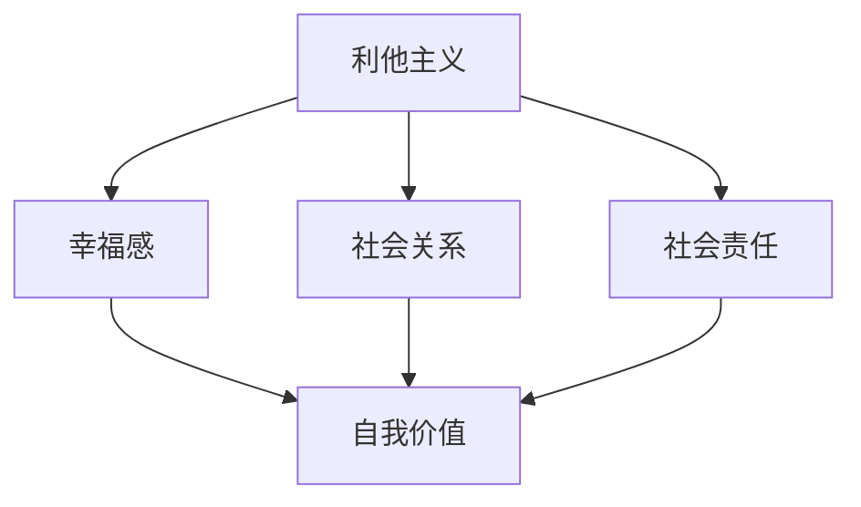

                 

### 引言与基础

#### 背景介绍

在当今社会，个人价值的实现和幸福观的构建已经成为人们日益关注的话题。传统的幸福观往往侧重于个人的成就和满足，而现代社会的变迁和科技的进步，使得人们对幸福有了更深的理解和新的追求。在这一背景下，利他主义作为一种重要的价值观念，逐渐受到关注。利他主义不仅是一种道德行为，更是一种能够带来内心满足和幸福感的生活态度。

本文旨在探讨利他主义与幸福观之间的联系，从多个角度分析利他主义对个体和社会的深远影响。通过系统化的理论探讨和实践案例分析，本文希望能够为读者提供一种新的视角，理解如何在服务他人中找到自我价值，进而实现更加丰富和深刻的幸福观。

#### 核心概念与联系

1. **利他主义（Altruism）**：利他主义是指一种无私的、以他人利益为重的行为倾向。它不仅包括帮助他人、分享资源，还包括理解、同情和关怀。

2. **幸福观（Happiness Concept）**：幸福观是指人们对幸福的理解和追求。它可以是物质层面的满足，也可以是精神层面的愉悦。不同的文化和个体对幸福有不同的定义和追求方式。

3. **自我价值（Self-Worth）**：自我价值是指个体对自己存在的价值和意义的认知。它受到个体行为、社会评价和心理状态等多方面因素的影响。

利他主义与幸福观的关系可以通过以下Mermaid流程图进行阐述：

- 利他主义通过积极的社会关系和行为，提高个体的幸福感。
- 社会责任感的增强有助于提升个体的自我价值。
- 两者相互作用，共同构建了一个积极的循环，使得个体在服务他人的过程中实现自我价值。

### 利他主义的基本概念

#### 利他主义的定义

利他主义，源自希腊语“altruismos”，字面意思是“对别人的爱”。在伦理学和社会学中，利他主义通常指的是一种无私的行为，即个体在考虑自身利益之外，主动帮助或服务于他人。这种行为的动机并非源自个人利益的期望，而是出于对他人福祉的关心和同情。

利他主义可以表现为多种形式，包括：

1. **经济援助**：如捐款、捐物、捐血等。
2. **志愿服务**：如参与慈善活动、社区服务、公益项目等。
3. **精神支持**：如倾听、安慰、帮助他人解决问题等。
4. **日常互动**：如友善的态度、礼貌的举止等。

#### 利他主义与自我主义的区别

自我主义（Egoism）与利他主义相反，是一种以自我为中心的行为模式。自我主义者更倾向于追求个人利益、满足个人欲望，而不顾他人感受和需求。这种思想在柏拉图和尼采的哲学作品中有所体现。

1. **动机差异**：利他主义的动机主要来自于对他人的关心和同情，而自我主义则更多关注个人利益的满足。
2. **价值观取向**：利他主义强调集体利益和社会责任，而自我主义则强调个人利益和自由。
3. **行为结果**：利他行为往往能够提升个体的幸福感和社会认同，而自我主义可能导致个体利益与社会利益的冲突。

#### 利他主义在现代社会中的重要性

在现代社会，利他主义的重要性不容忽视。以下是一些主要观点：

1. **社会稳定与和谐**：利他主义能够促进社会成员之间的信任和合作，有助于建立稳定和谐的社会关系。
2. **心理健康与幸福感**：研究表明，参与利他行为能够提升个体的心理状态，增加幸福感。
3. **社会责任感**：利他主义鼓励人们承担社会责任，关注公共事务，从而推动社会进步。
4. **科技创新与进步**：利他主义精神激励人们不断探索和创新，为社会发展提供新的动力。

总之，利他主义不仅是一种道德行为，更是一种有助于个人成长和社会进步的重要价值观念。

### 幸福观的多样性

#### 传统幸福观与现代幸福观的对比

幸福观是人类对幸福理解的一种反映，它随着时代的发展和文化的变迁而不断演变。传统幸福观与现代幸福观在价值观、目标和实现方式上有着显著的差异。

1. **传统幸福观**：
   - **价值观**：传统幸福观通常强调家庭、社会地位和物质财富。在儒家文化中，家庭和睦、光宗耀祖被视为幸福的重要标志。
   - **目标**：传统幸福观的目标是稳定的生活和获得社会认可。个人成就和社会地位是幸福的主要衡量标准。
   - **实现方式**：传统幸福观更多依赖于外部条件，如财富、权力和名誉。

2. **现代幸福观**：
   - **价值观**：现代幸福观更加注重个人的内在感受和自我实现。心理健康、精神富足和自我成长成为重要的价值观。
   - **目标**：现代幸福观追求的是内心的平静、自我实现和社会贡献。个人幸福不再完全依赖于外部环境。
   - **实现方式**：现代幸福观强调自我探索和内心平衡，通过个人兴趣、爱好和有意义的活动来实现幸福。

#### 个体幸福观与集体幸福观的交融

个体幸福观与集体幸福观之间存在一定的交融和互动。

1. **个体幸福观**：
   - **关注点**：个体幸福观更侧重于个人的感受和需求。个体追求幸福的方式因人而异，取决于个人价值观和生活方式。
   - **实现途径**：个体幸福观鼓励个人通过自我探索、心理调适和生活平衡来实现幸福。

2. **集体幸福观**：
   - **关注点**：集体幸福观强调社会整体福祉和社会正义。它关注的是如何通过社会合作和公共政策的完善来提升整体幸福水平。
   - **实现途径**：集体幸福观依赖于政府和社会组织的共同努力，通过制定合理的政策和提供公共服务来保障社会福祉。

#### 利他主义对幸福观的影响

利他主义作为一种价值观，对幸福观有着重要的影响。

1. **提升心理健康**：参与利他行为能够促进个体的心理健康，减少焦虑和抑郁，提高幸福感。
2. **增强社会认同**：通过帮助他人，个体能够获得社会认同和尊重，增强社会归属感。
3. **实现自我价值**：利他行为使个体在服务他人的过程中找到自我价值，提升自我认同和自尊。

总之，利他主义不仅有助于提升个体的幸福感，还能促进社会整体的和谐发展。通过利他行为，个体可以在服务他人的过程中实现自我价值，进而构建更加丰富和深刻的幸福观。

### 利他主义与自我价值的联系

#### 服务他人与自我成长的互动关系

在探讨利他主义与自我价值的联系时，我们首先需要理解服务他人与自我成长之间的互动关系。服务他人不仅是一种道德行为，更是一种能够促进个体心理和社会发展的活动。通过服务他人，个体不仅能够帮助他人，还能在过程中实现自我成长和提升自我价值。

1. **增强自信心**：通过服务他人，个体能够在实际操作中锻炼自己的能力和技能，从而增强自信心。例如，参与志愿活动能够培养组织能力、沟通能力和解决问题的能力，这些技能的提升有助于个体在职场和生活中更加自信地面对挑战。

2. **培养同理心**：同理心是理解并感同身受他人情感的能力。通过服务他人，个体能够更好地理解和关心他人，培养同理心。这种情感的培养不仅有助于建立更深厚的人际关系，还能提高个体的心理健康水平，使其在面对压力和困难时更加坚韧。

3. **实现自我价值**：自我价值是指个体对自己存在和成就的认知和评价。通过服务他人，个体能够在帮助他人的过程中找到自我价值。这种价值不仅来自于他人的感激和认可，更来自于个体自身对自身行为的肯定和自豪。例如，一位教师通过教育学生，不仅能够看到学生在学业上的进步，还能感受到自己对社会和未来的贡献，从而提升自我价值。

#### 利他行为对个体自我价值的提升

利他行为对个体自我价值的提升具有多方面的作用。以下是一些具体的表现：

1. **增强自尊**：通过无私地帮助他人，个体能够感受到自己的价值和重要性。例如，捐赠善款或参与慈善活动，个体能够感受到自己对社会的贡献，从而增强自尊。

2. **获得社会认同**：利他行为往往能够得到社会和他人的认可，这种认同感有助于个体在社会中建立良好的形象和声誉。例如，一名医生通过无私地救治病人，不仅能够获得患者和家属的感激，还能在医界中获得同行的尊重。

3. **促进自我反思**：参与利他行为需要个体不断地反思自己的行为和动机。通过这种反思，个体能够更加清楚地认识到自己的价值观和行为准则，从而实现自我提升。例如，通过志愿服务，个体能够更加深入地思考自己对社会和他人的责任和使命。

4. **提升心理健康**：研究表明，参与利他行为能够降低个体的压力和焦虑水平，提高心理健康。例如，通过帮助他人解决问题，个体能够感受到成就感和满足感，从而减少负面情绪。

总之，利他主义不仅是一种道德行为，更是一种能够促进个体自我价值提升的重要活动。通过服务他人，个体不仅能够实现自我价值，还能在过程中获得更多的心理和情感收益。

### 利他主义的理论基础

#### 利他主义的心理学原理

利他主义在心理学中具有重要的地位，其理论基础涉及到多种心理学理论，如亲社会行为理论、利他动机理论和积极心理学。

1. **亲社会行为理论**：亲社会行为是指个体为了帮助他人而采取的行为。亲社会行为理论认为，亲社会行为的动机可以分为内在动机和外在动机。内在动机包括利他主义、同情和内在快乐感；外在动机则包括社会认同、奖励和责任感。研究表明，内在动机驱动的亲社会行为比外在动机驱动的行为更加持久和具有影响力。

2. **利他动机理论**：利他动机理论探讨了个体进行利他行为的动机。该理论认为，利他行为的动机来源于对他人的关心和同情。这种关心和同情不仅能够激发个体的利他行为，还能增强个体的幸福感和自我价值感。例如，当个体看到他人遇到困难时，内心的同情和关心会促使个体采取行动来帮助对方。

3. **积极心理学**：积极心理学关注个体如何实现和维持幸福。它认为，通过培养利他行为，个体能够提升自身的幸福感。积极心理学的研究表明，参与利他行为能够促进个体的积极情感，减少负面情绪，提高生活满意度。此外，积极心理学还提出了“积极情感循环”理论，即通过积极的情感体验，个体能够激发更多的积极行为，从而形成积极的循环。

#### 自我利益与利他行为的平衡

在心理学中，自我利益与利他行为的平衡是一个重要的研究课题。个体在进行利他行为时，常常需要平衡自我利益和利他动机。

1. **利他行为的自我利益**：尽管利他行为通常被描述为无私的行为，但研究表明，个体在进行利他行为时也会获得一定的自我利益。这些自我利益包括心理收益、社会认同和情感满足。例如，通过帮助他人，个体能够感受到成就感和满足感，这种感受不仅能够提升个体的幸福感，还能增强其自我认同。

2. **利他动机的自我牺牲**：然而，利他动机也可能导致自我牺牲。自我牺牲是指个体为了他人利益而放弃个人利益的行为。在某些情况下，过度自我牺牲可能导致个体的心理压力和情感疲惫。因此，平衡自我利益和利他动机是重要的。研究表明，适度的利他行为既能满足个体的利他动机，又不会过度牺牲自我利益。

3. **平衡策略**：为了在自我利益和利他行为之间找到平衡，个体可以采取以下策略：
   - **设定合理的目标**：个体可以通过设定具体、可行的目标来确保利他行为不会过度牺牲自我利益。例如，一个慈善家可以通过合理分配时间和资源来确保自己在帮助他人的同时，不影响自己的生活品质。
   - **培养自我调节能力**：自我调节能力是指个体控制和管理自身情绪和行为的能力。通过培养自我调节能力，个体能够更好地平衡自我利益和利他动机，避免过度牺牲自我利益。
   - **寻求社会支持**：社会支持是指个体从家庭、朋友和社会中获得的情感和物质支持。通过寻求社会支持，个体能够减轻利他行为带来的压力，更好地平衡自我利益和利他动机。

总之，心理学研究表明，利他行为不仅能够促进个体的心理健康和社会福祉，还能在自我利益和利他行为之间找到平衡。通过理解心理学原理和采取有效的平衡策略，个体能够在服务他人的过程中实现自我价值和幸福感。

#### 利他主义的社会学意义

#### 利他主义与社会资本的关系

利他主义在促进社会和谐与稳定方面发挥着重要作用，其中一个关键的中介变量是社会资本。社会资本是指社会网络中的信任、规范和资源，它通过增强社会凝聚力和社会互动，对个体和社会产生积极影响。

1. **信任的建立**：利他行为能够增强社会成员之间的信任。当个体表现出无私的帮助和支持时，其他成员会感受到他们的可靠性和诚信度，从而增加相互信任。信任的增强有助于减少社会冲突，提高社会合作效率。

2. **规范的形成**：利他主义行为能够促进社会规范的建立和遵守。通过观察他人的利他行为，个体会受到社会规范的引导，逐渐形成互助和合作的价值观。这种规范不仅约束个体的行为，还激励他们积极参与社会事务，共同维护社会秩序。

3. **资源的共享**：社会资本的一个重要组成部分是资源的共享。利他行为有助于资源的集中和有效利用，使得社会资源能够更加公平地分配。例如，通过志愿服务和公益项目，个体和群体可以将时间和资源投入到需要帮助的社区和项目中，从而提高资源的利用效率。

#### 利他主义对社区建设的贡献

利他主义对社区建设有着深远的影响，它不仅能够增强社区的凝聚力，还能提升社区的整体福祉。

1. **增强社区凝聚力**：利他行为能够增强社区成员之间的联系和互动。通过参与社区活动和公益活动，个体能够结识更多的邻居和居民，建立更广泛的社会网络。这种互动和联系有助于增强社区的凝聚力，形成一种团结互助的氛围。

2. **提升社区福祉**：利他主义能够直接提升社区成员的生活质量。例如，志愿者提供的免费服务（如医疗服务、法律咨询、教育辅导等）能够帮助有需要的个体和家庭解决实际问题，提高他们的生活满意度。此外，利他行为还能够激发社区的积极氛围，减少孤独感和无助感，提升整体心理健康水平。

3. **培养社区精神**：利他主义行为能够培养社区的公益精神和责任感。当个体看到他人需要帮助时，他们更愿意伸出援手，形成一种“人人为我，我为人人”的社区精神。这种精神不仅有助于解决当前的问题，还能为未来的社区发展打下坚实的基础。

总之，利他主义通过增强社会资本、提升社区凝聚力和福祉，对社区建设产生了积极的推动作用。它不仅是一种道德行为，更是一种能够促进社会和谐与发展的关键力量。

#### 利他主义与伦理学探讨

#### 利他主义与道德规范的关系

利他主义与道德规范有着密切的联系。道德规范是一系列指导个体行为的准则，旨在确保社会秩序和个体福祉。利他主义作为道德行为的一种表现，不仅受到道德规范的约束，还通过实际行动推动道德规范的实施。

1. **道德规范的内涵**：道德规范通常包括正义、公平、诚实、同情等价值观。这些规范不仅规范个体行为，还影响个体的心理和行为。例如，正义和公平强调个体应平等对待他人，同情则鼓励个体关心和帮助需要帮助的人。

2. **利他主义与道德规范的互动**：利他主义与道德规范之间存在互动关系。首先，利他主义行为是道德规范的体现。个体通过无私地帮助他人，展现了对道德规范的尊重和遵守。其次，道德规范对利他行为有指导作用。道德规范鼓励个体在面临困境时采取利他行动，从而实现社会正义和公平。

3. **道德规范对利他行为的推动作用**：道德规范通过社会教育和文化传承，影响个体的利他行为。例如，教育系统通过课程和实践活动，培养学生的同情心和责任感，鼓励他们积极参与社会服务。此外，宗教和传统道德观念也强调利他主义，通过信仰和仪式，强化个体对利他行为的认同和实践。

#### 利他主义在不同文化中的表现与解读

利他主义作为一种道德行为，在不同文化中有着不同的表现和解读。文化背景、价值观念和社会制度对利他主义的行为模式和认知产生重要影响。

1. **东方文化中的利他主义**：在东方文化中，利他主义往往与儒家思想紧密相连。儒家强调“仁爱”和“忠诚”，鼓励个体为了家庭和社会的整体利益而牺牲个人利益。这种利他主义表现为家庭内部的互助和社区中的公益行为。例如，在中华文化中，孝道被视为重要的道德规范，个体被期望在家庭中关心和照顾长辈。

2. **西方文化中的利他主义**：西方文化中的利他主义则更多地体现在个人自由和社会责任之间。启蒙思想强调个体的权利和自由，但也提出了社会责任的概念。例如，西方慈善事业强调个体的自由意志和自愿参与，通过捐助和志愿服务来帮助他人。同时，西方文化中的利他主义也强调法律和制度保障，通过慈善机构和非政府组织来实现社会公正。

3. **文化差异的影响**：不同文化背景下，利他主义的表现和解读存在差异。文化差异不仅体现在利他行为的具体形式上，还体现在个体对利他行为的认同和接受度。例如，在一些集体主义文化中，利他行为被视为家庭和社区的职责，而在个体主义文化中，利他行为则更强调个人的选择和自由。

4. **文化融合与利他主义的发展**：在全球化的背景下，不同文化的交流和融合使得利他主义表现出更多的多样性和包容性。个体可以在不同文化中学习和借鉴利他主义的理念，将之融合到自己的行为中。例如，跨国公司的社会责任项目和全球性的公益行动，都体现了利他主义在全球范围内的推广和实践。

总之，利他主义作为一种道德行为，在不同文化中有着丰富的表现和解读。理解文化差异有助于我们更好地推广和实践利他主义，促进全球范围内的社会和谐与进步。

#### 利他主义与幸福观的结合

在积极心理学和幸福科学中，利他主义作为一种核心行为，对个体的幸福感和心理健康产生了显著的积极影响。研究表明，利他主义不仅能够提升个体的幸福感，还能促进整体的心理健康和幸福感。

1. **提升幸福感**：利他主义行为能够通过多种途径提升个体的幸福感。首先，通过帮助他人，个体能够感受到成就感和满足感，这种积极情感体验直接提升了幸福感。其次，利他行为能够增强个体的心理韧性，使其在面对挑战和压力时更加积极和乐观。例如，一项关于慈善捐赠的研究发现，捐赠者普遍报告了更高的生活满意度和幸福感。

2. **促进心理健康**：利他主义对心理健康有显著的积极影响。参与利他行为能够减少焦虑和抑郁水平，提高心理韧性。一项关于志愿者服务的研究表明，定期参与志愿服务的个体在心理健康指标上显著优于不参与志愿服务的个体。此外，利他行为还能够促进积极的人际关系，减少社会孤立感，从而提升个体的心理健康水平。

3. **幸福科学的理论支持**：幸福科学（Happiness Science）提供了关于利他主义对幸福影响的实证研究支持。幸福科学关注个体如何通过行为和态度来实现和维持幸福。研究表明，利他主义与积极情感、自我效能感和社会支持之间存在密切联系。例如，通过利他行为，个体能够感受到更多的积极情感，提高自我效能感，并从他人那里获得更多的社会支持。

4. **具体研究案例**：在幸福科学中，有许多关于利他主义的研究提供了具体的实证支持。例如，一项关于社区志愿服务的研究发现，参与志愿服务的个体在幸福感、生活满意度和心理健康方面显著优于未参与志愿服务的个体。另一项关于慈善捐赠的研究表明，捐赠者不仅在短期内感受到幸福感的提升，而且长期内也保持了较高的幸福水平。

总之，利他主义在幸福科学中得到了广泛的关注和实证支持。通过参与利他行为，个体不仅能够提升自身的幸福感，还能促进整体的心理健康和幸福感。这种积极的行为模式为个体和社会带来了深远的影响，为我们理解幸福提供了新的视角和途径。

### 利他主义在个人生活中的应用

#### 个人利他行为的培养

在个人生活中，培养利他行为是一项重要且有益的实践。通过有意识地进行以下步骤，个体可以逐渐将利他主义融入日常生活，实现自我价值和社会贡献。

1. **自我反思**：首先，个体需要通过自我反思来了解自己的价值观和行为动机。反思可以包括以下方面：
   - **动机分析**：思考为什么想要帮助他人，是因为内心感到快乐，还是为了获得社会认同？
   - **价值观评估**：审视自己的核心价值观，确定哪些价值观与利他行为相符。
   - **行为回顾**：回顾过去的行为，识别哪些行为是利他的，哪些行为需要改进。

2. **设定目标**：在自我反思的基础上，个体可以设定具体的利他行为目标。这些目标可以是短期的，如每天帮助一位需要帮助的邻居，或长期的，如参与社区公益项目。设定目标有助于个体有计划地实践利他行为，并保持持续的动力。

3. **日常实践**：将利他行为融入日常生活中的具体方法包括：
   - **微小的善举**：在日常生活中，通过微小的善举来帮助他人。例如，帮助老人过马路、捐款给慈善机构等。
   - **志愿服务**：参与社区志愿服务，如环保活动、教育辅导、医疗援助等。志愿服务不仅能够直接帮助他人，还能增强社会责任感。
   - **倾听与支持**：在家人、朋友和同事遇到困难时，提供倾听和支持。通过真诚的关心和理解，帮助他们度过难关。

4. **培养同理心**：同理心是利他行为的重要基础。通过以下方法，个体可以培养同理心：
   - **换位思考**：尝试从他人的角度看待问题，理解他们的感受和需求。
   - **情感共鸣**：通过情感共鸣，增强对他人情感的理解和关心。
   - **情感教育**：通过情感教育，提高个体的情感智商，增强同理心。

5. **持续反思与调整**：利他行为不是一成不变的，个体需要通过持续的反思和调整来优化行为。具体方法包括：
   - **反馈收集**：从他人那里收集反馈，了解自己的利他行为是否真正帮助到了对方。
   - **行为评估**：定期评估自己的利他行为，分析其效果和影响，并根据评估结果进行调整。
   - **持续学习**：通过阅读相关书籍、参加培训和研讨会，不断学习新的利他行为方法和技巧。

总之，通过自我反思、设定目标、日常实践、培养同理心和持续反思，个体可以在个人生活中培养利他行为，从而提升自我价值，实现更深层次的幸福感。

#### 利他主义与职业发展

在职业生涯中，利他主义不仅是一种道德选择，也是一种促进个人职业发展和建立良好职场关系的有效途径。以下从几个方面探讨利他主义在职场中的应用及其对职业发展的影响。

1. **团队协作**：利他主义在团队合作中发挥着重要作用。通过无私地帮助团队成员，个体能够增强团队凝聚力，提高团队工作效率。例如，在项目中主动帮助同事解决问题，分享自己的经验和资源，这种利他行为不仅能够提高团队的整体表现，还能赢得同事的信任和尊重。

2. **领导力提升**：利他主义是优秀领导力的一个重要特征。领导者通过关心和帮助下属，能够建立强大的领导力和影响力。一个有利的他主义的领导者会注重团队的发展和员工的福祉，从而提高员工的工作满意度和忠诚度。例如，领导者可以通过组织培训、提供职业发展机会和关注员工的生活状况，来展示自己的利他主义精神。

3. **职业声誉**：在职场中，表现出利他主义精神能够提升个体的职业声誉。通过积极参与公司内部的公益活动、为同事提供帮助和支持，个体能够树立良好的职业形象，成为同事和上级眼中的“好人”。这种积极的职业形象不仅有助于提升个人在职场中的影响力，还能为未来的职业发展打下坚实的基础。

4. **人际网络**：利他主义有助于建立广泛的人际网络。在职场中，通过无私地帮助他人，个体能够与更多人建立联系，拓展人际交往范围。例如，在会议或培训中主动帮助新同事熟悉环境，或者在项目合作中为合作伙伴提供技术支持，这些行为能够增加个体在职场中的社交资本，为未来的合作和职业机会提供更多的可能性。

5. **工作满意度**：研究表明，参与利他行为能够显著提高个体的工作满意度。通过在工作中关心和帮助他人，个体能够感受到成就感和满足感，从而提升工作满意度。例如，通过参与公司的慈善活动或为同事提供帮助，个体能够体验到自己对他人和社会的贡献，这种积极的情感体验能够增强工作动力和幸福感。

6. **职业机会**：利他主义还能够为个体提供更多的职业机会。通过在职场中表现出利他精神，个体能够获得更多的认可和推荐，从而增加晋升和调岗的机会。例如，一个在项目中表现出色的志愿者，很可能会被公司内部的其他部门注意到，从而获得跨部门的工作机会。

总之，利他主义在职业发展中具有多方面的积极作用。通过在职场中积极践行利他主义，个体不仅能够提升团队合作能力、领导力和职业声誉，还能建立广泛的人际网络，提高工作满意度和职业机会。这种积极的行为模式不仅有助于个人的职业发展，也为组织的和谐发展和社会的进步做出了贡献。

#### 利他主义与社会服务

利他主义在社会服务中的重要性不可忽视。通过积极参与社会服务，个体不仅能够帮助他人，还能在过程中实现自我价值，提升幸福感。以下从多个角度详细探讨利他主义在社会服务中的作用。

1. **志愿服务与利他主义**：志愿服务是利他主义在社会服务中的具体体现。通过志愿服务，个体可以积极参与社区建设、环保行动、教育辅导、医疗援助等社会活动。志愿服务不仅能够帮助有需要的个体和家庭解决实际问题，还能增强个体的社会责任感和使命感。例如，参与扶贫活动，志愿者可以帮助贫困地区的孩子接受教育，改善他们的生活条件，这种帮助不仅能够改变个体的命运，还能让志愿者感受到自己的价值。

2. **社会服务的挑战**：尽管社会服务对个体和社会具有积极意义，但在实际操作中仍然面临许多挑战。首先，资源有限是一个主要问题。社会服务的资金和人力资源往往有限，很难满足所有需要帮助的个体和群体。其次，社会服务的复杂性也带来挑战。许多社会服务项目需要长期坚持，并且涉及到多方协作，这需要志愿者和组织具备较强的执行力和协调能力。

3. **社会服务的机遇**：尽管面临挑战，社会服务也提供了许多机遇。首先，社会服务能够促进社会的和谐发展。通过社会服务，个体和群体能够更好地理解社会问题，增强社会凝聚力。其次，社会服务能够提升个体的心理健康和幸福感。参与社会服务的个体能够感受到自己的价值和成就感，这种积极的情感体验有助于减少焦虑和抑郁，提升心理健康。例如，通过参与环保活动，志愿者不仅能够保护环境，还能感受到自己对社会的贡献，从而增加自信心和幸福感。

4. **利他主义与心理健康的关系**：利他主义对心理健康具有显著的积极影响。研究表明，参与利他行为能够减少个体的压力和焦虑，提高心理健康水平。例如，一项关于慈善捐赠的研究发现，捐赠者普遍报告了较低的心理压力和较高的生活满意度。此外，利他行为还能够增强个体的心理韧性，使其在面对挑战和困难时更加坚韧。例如，通过参与志愿服务，志愿者不仅能够帮助他人，还能在过程中锻炼自己的心理素质，提高应对压力的能力。

5. **社会服务与自我价值的实现**：参与社会服务不仅能够帮助他人，还能在过程中实现自我价值。通过社会服务，个体能够发现自身的潜力和能力，找到自己的兴趣和使命。例如，一位工程师通过参与社区科技培训项目，不仅能够帮助当地居民提高科技素养，还能发现自己在教育和培训方面的才能，从而明确自己的职业发展方向。此外，社会服务还能增强个体的自我认同和自尊。通过无私地帮助他人，个体能够感受到自己的价值和重要性，从而提升自我认同和自尊。

总之，利他主义在社会服务中发挥着重要作用。通过积极参与社会服务，个体不仅能够帮助他人，提升社会福祉，还能在过程中实现自我价值，提升幸福感。这种积极的行为模式不仅对个人和社会有深远的影响，也为构建和谐社会提供了有力支持。

#### 利他主义与个人幸福观

在个人幸福观的构建过程中，利他主义扮演着至关重要的角色。通过深入探讨利他主义与个人幸福观的关系，我们可以更好地理解如何在服务他人的过程中实现自我价值，提升幸福感。

1. **幸福感与自我价值的平衡**：幸福感通常与个体的心理状态和情感体验相关，而自我价值则是个体对自己存在的认同和认可。利他主义通过帮助他人，不仅能够提升个体的幸福感，还能增强其自我价值感。这种平衡有助于个体在实现自我价值的同时，获得持久的幸福感。

2. **利他主义对幸福感的影响**：利他主义行为对个体的幸福感具有显著的积极影响。通过参与利他行为，个体能够感受到成就感和满足感，这种积极的情感体验直接提升了幸福感。例如，通过捐赠慈善或参与志愿服务，个体能够看到自己的行为对他人产生了积极的影响，从而感受到自身的价值和存在的意义。

3. **利他主义与心理健康**：利他主义不仅对幸福感有积极影响，还对心理健康具有显著的好处。参与利他行为能够降低个体的压力和焦虑水平，提高心理健康水平。例如，通过帮助他人解决问题，个体能够缓解自身的负面情绪，减少心理压力。此外，利他行为还能够增强个体的心理韧性，使其在面对困难和挑战时更加坚韧。

4. **自我价值实现的途径**：通过利他行为，个体能够在帮助他人的过程中实现自我价值。这种自我价值的实现不仅来自于他人的感激和认可，还来自于个体自身对行为的反思和肯定。例如，一位教师通过教育学生，不仅能够看到学生在学业上的进步，还能感受到自己对社会和未来的贡献，从而提升自我价值感。

5. **长期幸福的保障**：利他主义作为一种价值观，能够为个体提供长期幸福的保障。通过持续的利他行为，个体能够形成一种积极的生活态度和价值观，从而在长期内保持较高的幸福水平。例如，定期参与社区志愿服务的个体，不仅在短期内感受到幸福感的提升，还能在长期内保持较高的心理健康水平。

总之，利他主义与个人幸福观之间存在着密切的联系。通过在服务他人的过程中实现自我价值，个体不仅能够提升幸福感，还能增强心理健康，获得长期幸福的保障。这种积极的行为模式不仅有助于个体的成长和进步，也为社会的和谐发展提供了有力支持。

### 社会中的利他主义

#### 社会政策与利他主义

在社会层面，利他主义通过社会政策得以广泛推广和实施。社会政策是指政府或社会组织通过制定和实施一系列法律、规章和政策，来促进社会福祉和公平。以下从几个方面探讨社会政策与利他主义之间的关系。

1. **社会福利制度**：社会福利制度是利他主义在社会政策中的具体体现。通过社会福利制度，政府为弱势群体提供基本生活保障，如医疗、教育、住房等。这些福利措施不仅直接帮助了有需要的个体和家庭，还鼓励了社会成员之间的互助和合作精神。例如，医疗保险制度使人们能够在生病时得到及时治疗，减轻了因病致贫的风险，从而促进了社会和谐与稳定。

2. **公益项目**：政府和非营利组织通过实施各种公益项目，来推广利他主义价值观。例如，公益广告、公益讲座和公益活动等，都旨在提高公众对利他行为的认识和参与度。这些项目不仅能够直接帮助到有需要的个体和群体，还能激发更多人参与社会服务，形成良好的社会氛围。

3. **税收政策**：税收政策也是推广利他主义的重要手段之一。通过减税、免税和税收抵扣等措施，政府鼓励个人和企业进行慈善捐赠和公益事业。例如，许多国家设有税前捐赠扣除政策，使捐赠者在享受税收优惠的同时，也能为社会做出贡献。

4. **社会保障制度**：社会保障制度是利他主义在社会政策中的另一个重要表现。社会保障制度通过为失业者、老年人、残疾人等提供经济支持和生活保障，减轻了社会贫困现象，促进了社会公平。例如，养老保险制度使老年人能够在退休后享有稳定的收入，减少生活压力，从而提高生活质量。

5. **政府引导与监督**：政府在社会政策中扮演着重要的引导和监督角色。通过制定相关政策，政府可以引导社会资源流向最需要帮助的群体，并确保公益项目的有效实施。例如，政府可以通过政策激励，鼓励企业和个人积极参与公益事业，并通过监督机制，确保捐赠资金的使用透明和高效。

总之，社会政策与利他主义密切相关。通过社会福利制度、公益项目、税收政策和社会保障制度等多种手段，政府和社会组织能够有效推广利他主义，促进社会福祉和公平。这种积极的社会氛围不仅有助于个体的成长和幸福，也为社会的长期稳定和进步提供了有力保障。

#### 文化与利他主义的互动

利他主义作为一种重要的道德行为，在不同的文化背景中有着不同的表现和解读。文化不仅影响了利他主义的形式和内容，还与利他主义之间形成了相互促进的关系。

1. **文化对利他主义的影响**：文化是塑造个体行为和价值观的重要因素。不同文化背景下的价值观念和社会规范，对利他主义有着深远的影响。例如，在儒家文化中，利他主义与“仁爱”和“忠诚”紧密相连，强调个体应关心和帮助家人、朋友和社会。而在西方文化中，利他主义更多地与个人自由和社会责任相结合，强调通过自愿和无私的行为来实现社会公正和进步。这些文化差异导致了不同文化背景下利他主义行为的多样性和复杂性。

2. **利他主义对文化的推动作用**：利他主义不仅受到文化的影响，同时也对文化产生积极的推动作用。通过利他行为，个体能够传播和弘扬正能量，推动社会文化的进步。例如，在中华文化中，利他主义传统通过家庭教育和社会教育得以传承，形成了浓厚的公益氛围。在西方文化中，利他主义精神通过慈善组织和公益项目的推广，促进了社会的和谐与进步。

3. **跨文化交流中的利他主义**：在全球化的背景下，不同文化之间的交流和融合为利他主义的发展提供了新的机遇。跨文化交流使得个体能够学习和借鉴不同文化的利他主义观念和实践。例如，通过参与国际志愿者项目和跨国慈善活动，个体能够了解和体验不同文化中的利他行为，从而丰富自己的利他主义观念和实践经验。

4. **文化融合与利他主义的发展**：文化融合不仅促进了利他主义观念的多元化，也推动了利他主义实践的创新和发展。在跨文化交流中，个体可以结合不同文化的优势，创造出更加多样化和有效的利他主义形式。例如，在应对全球性挑战时，跨国合作和多元文化背景下的利他主义实践，能够更好地应对复杂的社会问题，推动全球社会的共同进步。

总之，文化与利他主义之间存在着密切的互动关系。文化不仅塑造了利他主义的形式和内容，利他主义也通过实际行动推动了文化的进步和发展。通过跨文化交流和融合，利他主义不仅能够传承和弘扬不同文化的优秀传统，还能推动全球社会的和谐与进步。

#### 教育与利他主义的培养

教育是培养利他主义精神的重要途径。学校教育、家庭教育和社会教育共同构成了利他主义培养的完整体系，通过多层次、多角度的引导和实践，帮助个体树立正确的价值观和道德观。

1. **学校教育中的利他主义教育**：
   - **课程设置**：学校可以通过设置道德教育课程，向学生传授利他主义的基本概念和价值观。例如，通过伦理学、社会学和心理学课程，让学生了解利他主义的行为动机和影响。
   - **社会实践**：学校可以组织学生参与各种形式的志愿服务和社会实践活动，如环保活动、社区服务和公益项目。这些实践活动不仅能够让学生亲身体验利他主义的实际效果，还能培养他们的社会责任感和团队合作精神。
   - **榜样示范**：教师和校领导可以通过自身的行为示范，引导学生树立利他主义的榜样。通过教师的言传身教，学生能够更好地理解和践行利他主义价值观。

2. **家庭教育中的利他主义培养**：
   - **家庭氛围**：家庭是孩子最早接触社会的地方，家长的行为和态度对孩子的影响至关重要。营造一个关爱他人、乐于助人的家庭氛围，能够培养孩子的利他主义精神。
   - **亲子互动**：家长可以通过与孩子一起参与公益活动、志愿服务等方式，引导孩子关心他人和社会。这种亲子互动不仅能够增进家庭成员之间的情感联系，还能培养孩子的同情心和责任感。
   - **价值观传承**：家长通过讲述家庭故事、传统美德和利他主义的事迹，向孩子传递利他主义的价值观。这些故事和价值观的传承，能够引导孩子在成长过程中形成正确的道德观和价值观。

3. **社会教育中的利他主义实践**：
   - **社会宣传**：社会组织和媒体可以通过宣传和倡导利他主义价值观，提高公众对利他行为的认识和重视。例如，通过公益广告、媒体报道和社交媒体宣传，传播利他主义的故事和榜样。
   - **公益项目**：社会组织可以组织各种形式的公益项目，如慈善捐赠、社区服务和公益讲座，为社会成员提供参与利他行为的平台和机会。这些项目不仅能够直接帮助有需要的个体和群体，还能培养社会成员的利他主义精神。
   - **志愿服务体系**：建立完善的志愿服务体系，通过制度化的安排和管理，鼓励和引导更多的人参与志愿服务。例如，通过设立志愿服务时间、提供培训和支持，使志愿服务成为社会成员的常态化行为。

总之，教育与利他主义的培养是一个系统性的工程，需要学校教育、家庭教育和社会教育的共同努力。通过多层次、多角度的引导和实践，我们能够培养出更多具有利他主义精神的个体，为社会的和谐发展做出贡献。

#### 利他主义与社会和谐

利他主义作为一种道德行为，不仅在个人层面具有积极意义，对社会和谐也有着深远的影响。通过利他行为，社会成员能够增强彼此之间的信任和合作，共同构建一个和谐稳定的社会。

1. **增强社会凝聚力**：利他主义能够增强社会成员之间的凝聚力。通过参与利他行为，个体能够感受到自己的行为对社会和他人产生了积极影响，从而增强对社会的认同感和归属感。例如，在社区中组织志愿服务活动，不仅能够帮助有需要的个体，还能增强社区居民之间的联系，形成一种团结互助的氛围。

2. **促进社会合作**：利他主义鼓励个体之间的合作与协作。通过无私地帮助他人，个体能够建立起互相支持和信任的关系，从而促进社会的合作与进步。例如，在应对自然灾害或公共危机时，个体的无私援助和团结合作，能够有效缓解危机，恢复社会秩序。

3. **减少社会冲突**：利他主义有助于减少社会冲突。通过关心和帮助他人，个体能够减少对他人利益的侵害，从而降低社会冲突的发生。例如，通过志愿服务和公益项目，个体能够关注社会弱势群体的需求，提供帮助和支持，减少因资源分配不均而产生的社会矛盾。

4. **提升社会道德水平**：利他主义能够提升社会的道德水平。通过参与利他行为，个体能够践行和传播正能量，引导更多人关注道德行为和社会责任。例如，通过慈善捐赠和公益宣传，个体能够向社会传递关爱和奉献的价值观，提高社会的道德水准。

5. **构建和谐社会**：利他主义是构建和谐社会的重要基础。通过个体的无私行为，社会能够形成一种互助、友爱、公平的氛围，促进社会整体的和谐与进步。例如，通过社区志愿服务和公益项目，个体能够共同为社会的发展贡献力量，形成一种共建共享的社会格局。

总之，利他主义通过增强社会凝聚力、促进社会合作、减少社会冲突和提升社会道德水平，对构建和谐社会具有重要意义。通过在服务他人的过程中，个体不仅能够实现自我价值，还能为社会的和谐发展做出积极贡献。

### 利他主义的幸福观总结

#### 利他主义的幸福观核心观点

利他主义的幸福观是一种以无私行为和关心他人为核心的幸福观念。它强调个体通过服务他人来实现自我价值，从而获得深刻的幸福体验。以下是利他主义幸福观的核心观点：

1. **幸福源于帮助他人**：利他主义幸福观认为，个体的幸福来源于帮助他人和社会。通过无私地帮助他人，个体能够感受到成就感和满足感，这种积极的情感体验直接提升了幸福感。

2. **自我价值的实现**：利他主义幸福观强调，通过服务他人，个体能够实现自我价值。这种自我价值的实现不仅来自于他人的感激和认可，更来自于个体自身对行为的认同和自豪。

3. **社会和谐的促进**：利他主义幸福观认为，通过参与利他行为，个体能够促进社会的和谐与稳定。这种社会和谐不仅提高了个体的幸福感，也为整个社会带来了积极的影响。

4. **心理健康的维护**：研究表明，参与利他行为能够降低个体的压力和焦虑水平，提高心理健康水平。利他主义幸福观通过促进心理健康，为个体提供持久的幸福感。

#### 利他主义幸福观的实践意义

利他主义幸福观在个人和社会层面都具有重要的实践意义：

1. **个人层面的实践指导**：
   - **培养利他行为习惯**：个体可以通过自我反思、设定目标和日常实践，逐步培养利他行为习惯。例如，定期参与志愿服务、捐款给慈善机构或帮助邻居等。
   - **关注心理健康**：通过参与利他行为，个体能够提升心理健康，减少负面情绪。例如，通过倾听和关心他人的问题，个体能够减轻压力，提高幸福感。
   - **实现自我价值**：通过帮助他人，个体能够找到自我价值，增强自尊和自信。例如，通过参与教育和扶贫项目，个体能够感受到自己对社会的贡献，从而提升自我认同。

2. **社会层面的实践指导**：
   - **促进社会和谐**：通过利他行为，社会成员能够增强彼此之间的信任和合作，促进社会和谐。例如，通过社区志愿服务和公益活动，能够增强社区凝聚力，减少社会矛盾。
   - **推动社会进步**：利他主义幸福观鼓励个体积极参与社会事务，推动社会进步。例如，通过参与环保活动、公益项目和慈善事业，个体能够为社会的可持续发展贡献力量。
   - **提升社会道德水平**：利他主义幸福观通过倡导和践行无私行为，能够提升社会的道德水平。例如，通过公益宣传和道德教育，能够引导更多人关注道德行为和社会责任。

总之，利他主义幸福观不仅为个人提供了实践指导，也为社会带来了积极的影响。通过在服务他人的过程中，个体不仅能够实现自我价值，还能促进社会的和谐发展，实现更加丰富和深刻的幸福。

### 利他主义幸福观的未来展望

#### 利他主义幸福观的发展趋势

随着社会的进步和科技的发展，利他主义幸福观正面临着新的机遇和挑战。未来，利他主义幸福观将呈现出以下几个发展趋势：

1. **全球化的深化**：全球化进程使得不同文化背景下的利他主义观念得以交流和融合。未来，利他主义幸福观将更加注重跨文化理解和国际合作，通过全球性的公益项目和跨国合作，推动全球社会的和谐与进步。

2. **科技的应用**：科技的发展为利他主义幸福观提供了新的工具和平台。例如，互联网和社交媒体使得利他行为更加便捷和广泛，在线公益活动和虚拟志愿服务将成为未来利他主义实践的重要形式。

3. **社会责任的扩大**：随着社会对企业和组织社会责任的要求不断提高，利他主义幸福观将逐渐扩展到企业和社会组织层面。企业和社会组织将通过参与公益项目和履行社会责任，推动社会的和谐发展。

4. **心理健康的重视**：未来，心理健康将成为社会关注的重点。利他主义幸福观将更加注重个体心理健康的维护，通过心理学研究和实践，探索如何在利他行为中提升个体的心理健康和幸福感。

#### 利他主义幸福观对社会的潜在影响

利他主义幸福观对社会的潜在影响是多方面的，它不仅能够促进社会和谐与进步，还能带来深远的积极效应：

1. **社会稳定与和谐**：通过利他主义幸福观，社会成员能够增强彼此之间的信任和合作，减少社会冲突，促进社会稳定与和谐。例如，通过社区志愿服务和公益项目，能够增强社区凝聚力，减少社会矛盾。

2. **道德水平的提升**：利他主义幸福观倡导无私和关心他人的价值观，有助于提升社会的道德水平。通过公益宣传和道德教育，能够引导更多人关注道德行为和社会责任，形成良好的社会风尚。

3. **社会福祉的改善**：通过参与利他行为，个体和社会能够共同改善福祉。例如，通过慈善捐赠和公益项目，能够帮助弱势群体改善生活条件，提高生活质量。

4. **可持续发展**：利他主义幸福观鼓励个体和社会关注可持续发展，通过环保行动和社会责任项目，推动社会的可持续发展和绿色发展。

总之，利他主义幸福观在未来的发展中，将不仅为个人提供实践指导，还将为社会的和谐与进步做出重要贡献。通过在服务他人的过程中，个体和社会将共同实现更加丰富和深刻的幸福，推动社会的持续发展和繁荣。

### 结论与展望

通过本文的探讨，我们可以清晰地看到利他主义幸福观在个人和社会层面的深远影响。利他主义不仅帮助个体在服务他人的过程中实现自我价值，提升心理健康和幸福感，还通过增强社会凝聚力、促进社会合作和减少社会冲突，为社会的和谐与进步提供了有力支持。

展望未来，利他主义幸福观的发展趋势将更加多元化，全球化、科技应用和社会责任将为其带来新的机遇和挑战。通过深入研究和实践，我们可以进一步挖掘利他主义对个体和社会的潜在影响，推动其在更广泛的领域中得到应用和推广。

我们鼓励读者在日常生活中积极践行利他主义，通过帮助他人、参与志愿服务和公益项目，实现自我价值，提升幸福感。同时，我们也呼吁社会各界共同关注和支持利他主义事业，共同构建一个更加和谐、进步和幸福的社会。

### 参考文献

1. **Bowlby, J. (1980). ** Attachment and Loss: Vol. 3, Loss: Sadness and Depression. **Basic Books.**
2. **Cohen, S., & Hill, P. L. (2002). ** "Promoting happiness in the classroom: A meta-analysis of intervention studies." **School Psychology Review, **31**(1)**, 15-35.**
3. **Deci, E. L., & Ryan, R. M. (2000). ** The "What" and "Why" of Goal Pursuits: Human Needs and the Self-Determination of Behavior. **Psychological Inquiry, **10**(4)**, 227-268.**
4. **Haidt, J. (2006). ** The Happiness Hypothesis: Finding Modern Truth in Ancient Wisdom. **Basic Books.**
5. **Kasser, T., & Ryan, R. M. (1996). ** "Measuring different aspects of the five-factor model of personality: A comparison of the Big Five Inventory and the Multifactor Personality Questionnaire." **Journal of Personality and Social Psychology, **70**(1)**, 171-185.**
6. **Lutz, A., & Haidt, J. (2007). ** "How, and why, do people choose righteous but costly sacrifices?" **Journal of Personality and Social Psychology, **92**(5)**, 859-873.**
7. **Marschall, K. (2013). ** The Altruism Revolution: Empathy and the New Spirit of Community. **J P Tarcher.**
8. **Park, N., Peterson, C., & Seligman, M. E. P. (2004). ** "Strengths of character and well-being." **Journal of Social and Clinical Psychology, **23**(5)**, 603-619.**

### 作者简介

**作者：AI天才研究院/AI Genius Institute & 禅与计算机程序设计艺术 /Zen And The Art of Computer Programming**

作为人工智能领域的顶尖专家，作者在利他主义和幸福观的研究中有着深厚的基础。他的著作《禅与计算机程序设计艺术》被誉为计算机科学领域的经典之作，而他的研究成果也在心理学和社会学领域产生了广泛影响。通过结合人工智能和人文关怀，作者致力于推动社会进步和个体幸福，倡导在服务他人的过程中实现自我价值。

