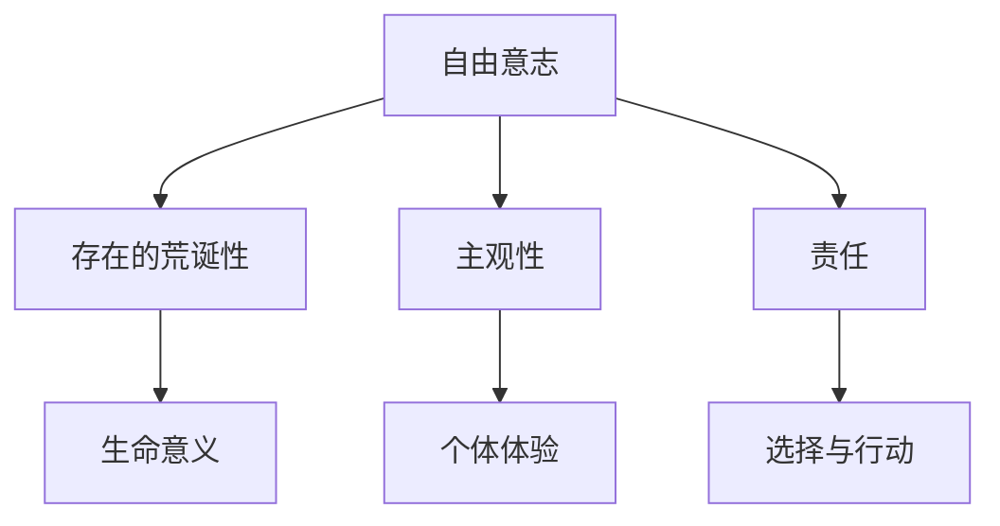
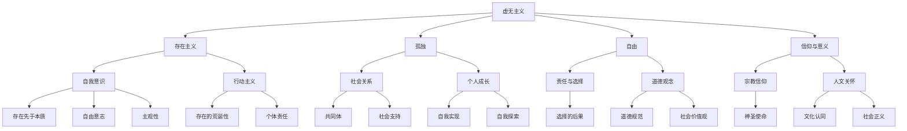

                 

### 第1章 引言：虚无主义的挑战与应对

在当今这个信息爆炸、技术飞速发展的时代，社会个体面临着前所未有的挑战和困惑。虚无主义作为一种哲学思潮，其影响愈发深刻。虚无主义不仅仅是某个时代的产物，而是贯穿于人类历史的一股暗流。它挑战着个体存在的意义，引发人们对生活、信仰和未来的反思。

#### 1.1 虚无主义的定义与起源

虚无主义（Nihilism）源自拉丁语“nihil”，意味着“无”或“无意义”。其核心观点是认为宇宙、生命和道德均无固有的意义或目的。虚无主义哲学最早可以追溯到18世纪的德国哲学家弗里德里希·尼采，他在《悲剧的诞生》一书中首次提出“上帝已死”的概念，从而引发了关于存在和意义的广泛讨论。

#### 1.2 流动时代的特征及其对个体的影响

流动时代（Volatile Age）是一个充满不确定性和变化的时代。全球化、技术进步、经济波动等因素使得社会结构和文化价值观发生巨大变迁。在这个时代，个体面临着快速适应环境、持续学习和不断改变的压力。这种高流动性的社会特征对个体产生了深远的影响：

1. **社会地位的流动性增加**：传统的阶层壁垒逐渐消失，人们更容易通过个人努力实现社会地位的变化。
2. **就业市场的竞争加剧**：技术进步和自动化导致部分职业的消失，同时也创造出新的职业机会。
3. **价值观的多元化**：全球化带来了不同文化和价值观的碰撞与融合，使得个体在寻找自我认同时面临更多选择和挑战。
4. **信息过载**：互联网的普及使得信息获取变得异常便捷，但也导致了信息过载，个体难以区分信息的真实性和价值。

#### 1.3 虚无主义对现代社会的影响

虚无主义对现代社会的影响是多层次、多方面的：

1. **精神层面的影响**：虚无主义挑战了传统的道德和信仰体系，导致一些人感到生活缺乏意义和目的，从而出现焦虑、抑郁等精神问题。
2. **社会结构的冲击**：虚无主义削弱了社会凝聚力和共同价值观，使得个体在面对社会问题时更加孤立和无助。
3. **文化和艺术的反思**：虚无主义促使艺术家和文学家对现实进行深刻的反思和批判，从而诞生了众多具有深刻内涵的作品。

#### 1.4 本书的目标与结构

本书旨在探讨虚无主义在流动时代的背景下的影响，并提供一系列克服虚无主义的途径。全书分为七个章节，结构如下：

1. **第1章 引言：虚无主义的挑战与应对**
2. **第2章 虚无主义的核心概念**
    - 存在主义
    - 孤独与自由
    - 信仰与意义
3. **第3章 克服虚无主义的路径**
    - 自我反思与认识
    - 建立价值观
    - 寻求信仰与归属感
4. **第4章 艺术与文学：对抗虚无主义的利器**
    - 艺术的价值与作用
    - 文学的力量
5. **第5章 社交与人际关系：克服虚无主义的支撑**
    - 社交的重要性
    - 人际关系与共同体
6. **第6章 教育：培养具有抵抗虚无主义能力的个体**
    - 教育的目标与价值观
    - 教育内容与方法
7. **第7章 总结：在流动的时代寻找定点**

通过上述章节的讨论，本书希望能够为读者提供一条从虚无主义中走出的道路，帮助个体在流动的时代中找到自己的定点，实现生活的充实和有意义。

### 2.1 虚无主义的核心概念

虚无主义是一种深刻的哲学思潮，其核心概念贯穿于许多不同的哲学流派中。以下我们将深入探讨虚无主义的核心概念，包括存在主义、孤独与自由、以及信仰与意义。

#### 2.1.1 存在主义的起源与发展

存在主义（Existentialism）作为一种哲学思潮，起源于20世纪初期。存在主义的核心观点是强调个体存在的意义和自由意志。其思想根源可以追溯到丹麦哲学家基尔凯郭尔（Søren Kierkegaard）和德国哲学家海德格尔（Martin Heidegger）。基尔凯郭尔提出了“存在先于本质”的观点，即个体的存在是先于其固有本质的，而海德格尔则进一步探讨了“存在”的虚无性和个体存在的自由。

存在主义的代表人物之一是法国哲学家让-保罗·萨特（Jean-Paul Sartre），他在其著作《存在与虚无》（"Being and Nothingness"）中详细阐述了存在主义的思想。萨特认为，人类是存在于世界中的虚无，但通过自由意志，个体能够创造自己的本质和意义。

#### 2.1.2 存在主义的主要思想

存在主义的主要思想可以概括为以下几个方面：

1. **自由意志**：存在主义强调个体的自由意志，认为人类是自由的存在，拥有选择自己生活方式的权力。自由意志不仅是人类存在的核心特征，也是个体创造自我和意义的手段。

2. **存在的荒诞性**：存在主义认为，人类的生存是荒谬的，因为我们的存在缺乏固有的意义和目的。这种荒诞性迫使个体去寻找自己的意义，并通过行动来赋予生活以意义。

3. **主观性**：存在主义强调主观性的重要性，认为个体的主观体验和自我意识是理解存在的关键。个体的主观体验是独特的，每个人都通过自己的视角来看待世界。

4. **责任**：存在主义认为，自由意志伴随着责任。个体必须对自己的选择和行为承担责任，并且面对选择带来的后果。

#### 2.1.3 存在主义对虚无主义的反驳

存在主义对虚无主义的反驳主要体现在以下几个方面：

1. **赋予生活意义**：虚无主义认为生命缺乏固有的意义，但存在主义认为，正是通过个体的自由意志和选择，生命才能获得意义。个体通过创造和实现自己的价值，从而赋予生活意义。

2. **自由意志的重要性**：虚无主义往往导致个体感到无力和无助，而存在主义则强调自由意志的力量。自由意志使得个体能够在荒谬的生存环境中找到方向，并通过行动来改变自己的命运。

3. **个体主观体验的价值**：虚无主义忽视了个体主观体验的重要性，而存在主义则认为，主观体验是理解存在的关键。个体的体验和感受使得存在变得有意义。

#### 2.1.4 存在主义的核心概念实体关系架构Mermaid流程图

为了更直观地展示存在主义的核心概念及其之间的关系，我们可以使用Mermaid流程图来表示：



通过这个流程图，我们可以看到自由意志、存在的荒诞性、主观性和责任等核心概念之间的相互关系。这些概念共同构成了存在主义的核心思想，为个体在虚无主义的困境中寻找生活的意义提供了理论基础。

#### 2.2 孤独与自由：虚无主义的表象

虚无主义的一个重要表象是孤独与自由。孤独与自由不仅是哲学中的核心概念，也在现代社会中具有广泛的影响。理解孤独与自由的辩证关系，有助于我们更深入地认识虚无主义以及如何克服其带来的困惑。

##### 2.2.1 孤独的根源与意义

孤独是一种深刻的内心体验，它涉及到个体的孤立感和社会隔离。孤独的根源可以从多个角度来探讨：

1. **个体化社会的兴起**：随着工业化和城市化的发展，传统的社区和紧密的社会联系逐渐消失，个体被推向更广阔的社会空间。这种社会结构的变革导致了孤独感的增加。

2. **信息的过载**：互联网和社交媒体的普及使得信息获取变得异常便捷，但同时也导致了信息过载。个体在庞大的信息海洋中感到迷失，难以找到真正的交流和归属感。

3. **价值观的多元化**：在多元化的社会中，个体在寻找自我认同时面临更多的选择和挑战。这种选择的多样性虽然为个体提供了自由，但也可能导致个体感到孤独和不确定。

孤独作为一种内心体验，不仅仅是一种负面情绪，它也有着深层次的意义：

1. **自我反思的机会**：孤独提供了与自我对话的机会，个体可以在孤独中反思自己的生活、价值观和目标，从而实现个人成长。

2. **创造力的源泉**：孤独往往与创造力的提升有关。许多艺术家、作家和科学家都曾在孤独中找到灵感和创作的动力。

##### 2.2.2 自由的边界与责任

自由是虚无主义的对立面，也是现代社会的重要价值观之一。然而，自由并非无边界和无限制的。自由必须在一定的道德和法律框架内实现，否则可能导致混乱和无序。

1. **道德自由的限制**：个体的自由意志必须在道德的约束下行使。道德自由强调个体的行为应当符合一定的伦理标准，不能侵犯他人的权利和自由。

2. **政治自由的限制**：政治自由包括言论自由、出版自由等，但这些自由也必须在维护社会稳定和公共利益的框架内行使。

自由与责任是辩证关系。自由是责任的先决条件，而责任是自由的保障。个体在享有自由的同时，必须承担相应的责任：

1. **个人责任**：个体必须对自己的行为和选择承担责任，无论是成功还是失败。这种责任感有助于个体在面对困境时保持坚定的信念和行动力。

2. **社会责任**：个体不仅是个人自由的追求者，也是社会共同体的成员。个体的行为和选择必须考虑到社会的整体利益，不能以牺牲他人的利益为代价。

##### 2.2.3 孤独与自由的辩证关系

孤独与自由是虚无主义的表象，但它们之间存在着辩证关系：

1. **孤独中的自由**：孤独感可以促使个体深入思考自由的意义。在孤独中，个体可以更自由地表达自己的观点和情感，从而实现个人的成长。

2. **自由中的孤独**：自由本身可能导致孤独。个体在追求自由时，可能会与他人产生疏离感，因为每个人的自由意志是独立且独特的。

3. **克服孤独与自由的困境**：通过建立深厚的人际关系和社会联系，个体可以在孤独与自由之间找到平衡。人际关系的支持和社会的认同感有助于缓解孤独感，同时也保障了自由的实现。

通过探讨孤独与自由的关系，我们可以更深刻地理解虚无主义的表象。孤独与自由既是虚无主义带来的困惑，也是个体寻找生活意义的重要途径。在流动的时代，我们需要在孤独与自由之间找到平衡，从而克服虚无主义的困扰。

### 2.3 信仰与意义：虚无主义的解决之道

信仰与意义是虚无主义的解决之道，它们在个体的生活和精神层面扮演着至关重要的角色。通过信仰的建立，个体能够找到生活的方向和意义，从而克服虚无主义的困扰。

#### 2.3.1 信仰的重要性

信仰是一种深信不疑的观念或信念，它能够为个体提供精神上的支撑和生活的目标。在现代社会中，信仰的重要性愈发突出：

1. **精神支撑**：信仰为个体提供了精神上的安慰和希望。在面对生活的困境和不确定性时，信仰可以帮助个体保持积极的心态和应对能力。

2. **生活目标**：信仰为个体提供了生活的目标和方向。在信仰的引导下，个体可以更加清晰地认识到自己的价值观和人生使命，从而在生活中有所追求和成就。

3. **社会凝聚力**：信仰不仅对个体有深远影响，也对整个社会产生重要的凝聚力。共同的信仰和价值观念有助于加强社会成员之间的联系，促进社会的和谐发展。

#### 2.3.2 寻找个人意义的过程

寻找个人意义是一个深刻且复杂的过程，它涉及到个体对生活、价值观和自我认知的深入思考。以下是一些寻找个人意义的步骤：

1. **自我反思**：自我反思是寻找个人意义的第一步。个体需要审视自己的生活、价值观和行为，思考自己的优点、缺点和兴趣所在。

2. **探索自我**：通过阅读、旅行、交流等方式，个体可以更深入地了解自己，发现潜在的兴趣和激情。这种探索有助于个体找到与自己价值观相符的生活方向。

3. **设定目标**：在了解自己的基础上，个体可以设定具体的生活目标。这些目标可以是短期或长期的，它们为个体提供了明确的行动方向和动力。

4. **实际行动**：目标的实现需要通过实际行动来实现。个体需要在日常生活中付诸行动，不断尝试和调整，直到找到真正适合自己的生活道路。

5. **持续反思**：寻找个人意义是一个持续的过程。个体需要在生活中不断反思自己的行为和选择，调整自己的价值观和目标，以适应不断变化的环境。

#### 2.3.3 社会与文化对信仰的影响

信仰不仅是个体内心的选择，也受到社会和文化环境的影响：

1. **家庭背景**：家庭是信仰形成的最早环境。个体的父母和兄弟姐妹的信仰观念会对其产生深远的影响。

2. **宗教信仰**：宗教信仰是许多人信仰的主要来源。宗教信仰不仅提供了一种道德和精神的指南，还通过宗教活动和社会网络为个体提供支持和归属感。

3. **文化传统**：文化传统是信仰形成的重要背景。不同的文化传统会对个体的价值观和信仰观念产生深刻影响，从而影响其生活的意义和方向。

4. **社会价值观**：社会价值观是信仰形成的外部环境。现代社会中的主流价值观和意识形态会通过教育、媒体等方式影响个体的信仰观念。

5. **社会支持**：社会支持是信仰的重要保障。一个支持个体信仰的社会环境有助于个体坚持和深化自己的信仰，从而更好地应对虚无主义的挑战。

#### 2.3.4 信仰与意义的关系

信仰与意义是密切相关的。信仰为个体提供了生活的方向和目标，使个体在面对困境时保持信心和勇气。同时，个体在追求信仰的过程中，也会不断探索和发现生活的意义。以下是一个具体的Python代码示例，用于解释信仰与意义之间的关系：

```python
class Life:
    def __init__(self, meaning):
        self.meaning = meaning

    def find_meaning(self):
        return self.meaning

    def set_meaning(self, new_meaning):
        self.meaning = new_meaning

class Faith:
    def __init__(self, belief):
        self.belief = belief

    def hold_faith(self):
        return self.belief

    def change_faith(self, new_belief):
        self.belief = new_belief

# 创建一个生活对象和一个信仰对象
life = Life("寻找意义")
faith = Faith("对美好的信仰")

# 个体通过信仰找到生活的意义
print(life.find_meaning())  # 输出：寻找意义

# 当信仰改变时，生活的意义也会随之改变
faith.change_faith("对希望的信仰")
print(life.find_meaning())  # 输出：对希望的信仰

# 通过持续的信仰和自我反思，个体可以深化对意义的理解
life.set_meaning("实现自我价值")
print(life.find_meaning())  # 输出：实现自我价值
```

在这个示例中，`Life` 类表示个体生活，`Faith` 类表示个体信仰。通过改变信仰，个体的生活意义也会随之改变。这个示例直观地展示了信仰与意义之间的动态关系。

通过深入探讨信仰与意义，我们可以更好地理解虚无主义的解决之道。信仰不仅为个体提供了精神上的支撑和生活的目标，也在社会和文化层面上发挥着重要作用。在流动的时代，通过建立信仰和寻找个人意义，个体可以克服虚无主义的困扰，实现生活的充实和有意义。

### 3.1 自我反思与认识

自我反思与认识是克服虚无主义的重要途径，它不仅帮助我们理解自我，还为个体提供了清晰的认知框架，从而在面对生活的挑战时找到方向。以下是自我反思与认识的详细步骤和重要性。

#### 3.1.1 自我反思的实践

自我反思是一种深度的思考过程，通过内省和自我评价来认识自己。以下是一些具体的自我反思实践方法：

1. **日记写作**：通过写日记，个体可以记录下自己的想法、情感和经历。这种书面形式可以帮助个体更好地组织和表达自己的内心世界，从而深入了解自己。

2. **心理咨询**：与专业的心理咨询师进行面对面的交流，可以帮助个体在更专业的指导下进行自我反思。心理咨询师可以通过引导性问题和技术，帮助个体挖掘内心的冲突和困惑。

3. **静坐冥想**：静坐冥想是一种通过集中注意力和深呼吸来达到内心平静的方法。在冥想过程中，个体可以放空思维，专注于当下的感受和体验，从而获得对自我的更深刻认识。

4. **提问与回答**：通过提出问题并认真回答，个体可以探索自己的价值观、信念和行为动机。这种自我提问的方法可以促使个体进行深度思考，从而发现潜在的问题和改进的机会。

#### 3.1.2 认识自我与他人的关系

认识自我不仅仅是一个个人的过程，它还涉及到个体与他人的关系。以下是如何通过自我反思来认识自我与他人关系的方法：

1. **反思行为模式**：通过自我反思，个体可以识别自己的行为模式，包括沟通方式、处理冲突的方式以及对他人的态度。这种行为模式的反思有助于个体理解自己在人际关系中的角色和影响。

2. **反思情感反应**：在自我反思中，个体可以探索自己的情感反应，包括对他人言行产生的情绪反应。这种反思有助于个体了解自己的情感需求和心理状态，从而更好地理解他人的情感和需求。

3. **反思价值观和信念**：个体的价值观和信念对其人际关系有着深远的影响。通过反思这些核心信念，个体可以理解自己在社会中的定位和与他人互动的原则。

4. **反思沟通技巧**：有效的沟通技巧对于建立健康的人际关系至关重要。通过自我反思，个体可以识别自己在沟通中的优势和不足，并学习改进沟通方法。

#### 3.1.3 自我反思的局限性

尽管自我反思是一种强有力的工具，但它也存在一定的局限性：

1. **主观性**：自我反思依赖于个体的自我评价，这种评价可能受到主观偏见的影响。个体可能会倾向于过分强调自己的优点或忽视自己的缺点，从而影响反思的客观性。

2. **情绪干扰**：自我反思过程中，个体可能会受到情绪的影响，如焦虑、恐惧或自我怀疑。这些情绪可能会妨碍个体的理性思考和深度反思。

3. **经验不足**：自我反思需要一定的心理成熟度和经验。对于一些经验不足的个体，自我反思可能难以达到预期的效果，甚至可能加剧内心的困惑。

为了克服自我反思的局限性，个体可以尝试以下方法：

1. **寻求外部反馈**：通过与他人的交流，个体可以获得不同的视角和反馈。外部反馈有助于个体更客观地认识自己，并识别自己的盲点和不足。

2. **持续反思**：自我反思是一个持续的过程，需要个体的长期坚持。通过定期进行自我反思，个体可以逐步提高自我认知的深度和广度。

3. **专业指导**：寻求专业心理咨询师或导师的指导，可以帮助个体在自我反思中避免误区，提高反思的效率和效果。

通过自我反思与认识，个体可以更深入地理解自己，找到生活的方向和目标。这种方法不仅有助于克服虚无主义的困扰，也为个体在复杂的社会环境中提供了强大的内在支撑。

### 3.2 建立价值观

在流动的时代，个体面临的挑战之一是如何在多元价值观中找到自己的定位。建立个人价值观不仅对个人的成长至关重要，也是克服虚无主义的重要途径之一。以下是建立个人价值观的详细步骤和方法。

#### 3.2.1 价值观的定义与作用

价值观（Values）是指个体对什么是好、什么是正确的信念和标准。它们是指导个体行为和决策的核心原则，反映了个体的道德观、人生观和世界观。价值观不仅影响个体的行为和选择，还对个体的心理健康和社会关系产生深远的影响。

1. **指导行为**：价值观为个体的行为提供了明确的方向和标准。当面临选择和决策时，个体会根据其价值观来判断什么是对的和错的，从而做出符合自己价值观的决策。

2. **增强自我认同**：价值观有助于个体建立自我认同，明确自己的身份和目标。通过坚持自己的价值观，个体可以在多元化的社会中保持独立性和自我认同。

3. **提升心理健康**：拥有明确和一致的价值观可以减少内心的矛盾和冲突，增强心理稳定和幸福感。

4. **改善人际关系**：共同的价值观有助于建立和维护健康的人际关系。当个体与他人的价值观相一致时，他们更可能建立深厚的信任和合作关系。

#### 3.2.2 建立个人价值观的方法

建立个人价值观是一个复杂且个性化的过程，以下是一些具体的方法：

1. **自我反思**：通过自我反思，个体可以深入了解自己的信仰、信念和行为动机。反思可以帮助个体识别自己的核心价值观，并理解这些价值观的来源和意义。

2. **学习与阅读**：通过阅读书籍、文章和哲学著作，个体可以了解不同的价值观体系和文化观念。这种学习有助于个体开阔视野，发现和选择适合自己的价值观。

3. **经验积累**：个人的经验和经历是建立价值观的重要基础。通过生活经历，个体可以不断验证和调整自己的价值观，使其更加符合自己的生活实际。

4. **与他人的交流**：与他人交流和讨论有助于个体从不同的视角理解价值观。通过与他人的互动，个体可以学习到新的观点和思想，从而丰富和深化自己的价值观。

5. **实践与反思**：价值观的建立需要在实践中不断验证和调整。个体可以通过实际行动来实践自己的价值观，并在实践中反思其效果和适应性。

#### 3.2.3 社会与文化对价值观的影响

社会和文化环境对个人价值观的形成具有重要影响：

1. **家庭背景**：家庭是价值观形成的第一环境。父母的价值观和行为模式会对子女产生深远的影响。

2. **宗教信仰**：宗教信仰是一种强大的价值观体系，它为个体提供了一种道德和精神指南。宗教信仰对个人的价值观有着深刻的影响。

3. **文化传统**：文化传统是一个社会长期积累的价值观体系。不同的文化传统会对个体的价值观产生显著影响。

4. **社会价值观**：社会价值观是主流文化和意识形态的体现。个体的价值观往往会在社会化过程中逐渐适应社会的主流价值观。

5. **全球化**：全球化带来了不同文化的交流和碰撞，使得个体在面对多元价值观时面临更多选择和挑战。

#### 3.2.4 社会与文化对价值观的影响示例

以下是一个具体的Python代码示例，用于解释社会与文化对价值观的影响：

```python
class Person:
    def __init__(self, culture):
        self.values = culture.get_values()

    def reflect_on_values(self):
        print("My values are:", self.values)

class Culture:
    def __init__(self, values):
        self.values = values

    def get_values(self):
        return self.values

# 创建一个代表美国文化的对象
american_culture = Culture(["自由", "平等", "尊重个人选择"])

# 创建一个代表中国文化的对象
chinese_culture = Culture(["家庭责任", "社会和谐", "尊重传统"])

# 创建两个代表不同文化背景的个体
american_person = Person(americ
``` 

在上面的代码中，`Person` 类代表一个个体，`Culture` 类代表一个文化环境。通过为个体赋予不同的文化价值观，我们可以看到个体在两种不同的文化背景下会有不同的价值观表现。

#### 3.2.5 社会与文化对价值观的挑战

随着全球化和信息技术的快速发展，社会和文化环境变得越来越复杂，这对个人价值观构成了新的挑战：

1. **文化冲突**：全球化带来了不同文化的交流和碰撞，可能导致文化冲突。个体需要在多元文化的背景下找到自己的价值观定位。

2. **价值观的多元化**：现代社会中，价值观的多元化使得个体面临更多选择和挑战。个体需要从多种价值观中筛选和整合，以建立自己的价值观体系。

3. **信息过载**：互联网和社交媒体的普及使得个体接触到大量不同的价值观和信息。如何筛选和判断这些信息，以建立和巩固自己的价值观，成为个体面临的新挑战。

通过建立个人价值观，个体可以在复杂多变的社会环境中找到自己的定位，从而克服虚无主义的困扰。个人价值观不仅为个体提供了明确的行为指导，也为个体在追求有意义的生活中提供了内在支撑。

### 3.3 寻求信仰与归属感

在流动的时代，信仰与归属感成为许多人在探索个人意义和克服虚无主义过程中的关键要素。信仰不仅仅是一种精神寄托，它还能够为个体提供生活的方向和目标，而归属感则是个体在社会中感到被接受和重要的一部分。以下是如何通过寻求信仰和归属感来克服虚无主义的详细步骤和方法。

#### 3.3.1 信仰的类型与意义

信仰有多种类型，每一种都有其独特的意义和作用。以下是一些主要的信仰类型：

1. **宗教信仰**：宗教信仰是一种传统的信仰形式，它通过宗教教义、仪式和社区活动为个体提供精神支持和归属感。例如，基督教、佛教、伊斯兰教等都有其独特的信仰体系和信仰实践。

2. **道德信仰**：道德信仰是基于伦理和道德原则的信仰，它指导个体在行为和决策中追求正义和善良。道德信仰可以来源于宗教教义、哲学思想或个人的生活经验。

3. **哲学信仰**：哲学信仰是通过对哲学问题和存在意义的思考而形成的信仰。哲学家如尼采、柏拉图、康德等提供了不同的哲学信仰体系，帮助个体理解自己和世界的本质。

4. **个人信仰**：个人信仰是个体根据自己的经验和理解形成的独特信仰。这些信仰可能与宗教、道德或哲学信仰有所重叠，也可能完全是个体独特的信念。

信仰对个体的意义主要体现在以下几个方面：

1. **精神支撑**：信仰为个体提供精神上的安慰和希望，帮助个体在面对困难和挑战时保持积极和乐观的态度。

2. **生活目标**：信仰为个体提供了明确的生活目标，使个体在追求目标和实现价值的过程中找到方向和动力。

3. **社会认同**：信仰可以作为一种社会认同的标志，使个体在共同体中感到被接纳和支持。

4. **行为指导**：信仰为个体提供了行为准则和道德标准，指导个体在日常生活中做出符合信仰的选择。

#### 3.3.2 寻求信仰的过程

寻求信仰是一个深入且个人的过程，以下是一些具体的步骤和方法：

1. **自我探索**：个体需要通过自我探索来了解自己的信仰需求和心理状态。自我探索可以通过冥想、日记写作或心理咨询等方式进行。

2. **学习与反思**：个体可以通过学习宗教教义、哲学著作或道德规范来了解不同的信仰体系。在学习过程中，个体需要进行反思，以确定哪些信仰与自己价值观相符。

3. **信仰实践**：信仰实践是寻求信仰的重要环节。通过参与宗教仪式、道德实践或哲学讨论，个体可以更深刻地体验和理解信仰。

4. **与信仰团体互动**：加入信仰团体或社区可以帮助个体在寻求信仰的过程中获得支持和指导。信仰团体提供了一个交流和分享的平台，使个体在信仰实践中得到鼓励和帮助。

5. **持续反思**：信仰是一个持续的过程，个体需要在实践中不断反思和调整自己的信仰。通过持续的反思，个体可以深化对信仰的理解，使其更加符合自己的生活实际。

#### 3.3.3 归属感的重要性与获取方式

归属感是个体在社会中感到被接受和重要的一部分，它对个体的心理健康和社会关系有重要影响。以下是归属感的重要性及其获取方式：

1. **心理健康**：归属感可以减少个体的孤独感和焦虑感，提高心理健康水平。当个体感到自己属于一个共同体时，他们更有可能感到快乐和满足。

2. **社会关系**：归属感有助于建立和维护健康的人际关系。在一个共同体中，个体更容易与他人建立深层次的关系，从而提高社会支持网络的质量。

3. **社会参与**：归属感使个体更有可能参与社会活动和公益事业，从而增强社会责任感和集体意识。

获取归属感的方法包括：

1. **参与社交活动**：参与社交活动，如社区聚会、志愿服务等，可以帮助个体结识新朋友，建立社会联系。

2. **加入团体或组织**：加入兴趣小组、专业团体或志愿者组织等，可以使个体在共同的目标和活动中找到归属感。

3. **积极参与社区事务**：通过积极参与社区事务，如投票、参与公共讨论等，个体可以增强对社区的认同感和归属感。

4. **建立深层次的人际关系**：与他人建立深层次的人际关系，如亲密友谊、家庭关系等，可以提供强烈的归属感。

#### 3.3.4 社会与文化对信仰与归属感的影响

社会和文化环境对信仰与归属感有重要影响。以下是一些具体的影响：

1. **家庭背景**：家庭是信仰和归属感形成的重要环境。家庭成员的信仰和行为模式会对个体产生深远的影响。

2. **宗教与文化**：宗教和文化传统对信仰和归属感有着深刻的影响。宗教社区和文化传统可以提供丰富的信仰实践和归属感来源。

3. **社会价值观**：社会价值观对信仰和归属感有指导作用。一个强调共同体和互助的社会价值观有助于个体建立和维持信仰与归属感。

4. **全球化**：全球化带来了文化的多样性和交流，为个体提供了更多的信仰选择和归属感来源。

通过寻求信仰和归属感，个体可以克服虚无主义的困扰，找到生活的方向和目标。信仰与归属感不仅为个体提供了精神上的支撑，也在社会层面上增强了个体的认同感和幸福感。

### 4.1 艺术的价值与作用

艺术作为一种独特的表达形式，自古以来就在人类社会中扮演着重要的角色。它不仅反映了人类对美的追求，还在精神层面上提供了深远的启示和慰藉。在虚无主义的背景下，艺术更是成为对抗虚无主义的重要利器。以下将详细探讨艺术的价值与作用，以及它如何帮助个体在流动的时代中找到生活的意义。

#### 4.1.1 艺术的定义与多样性

艺术是一个广泛而多维的概念，涵盖了多种形式和风格。传统的艺术形式包括绘画、雕塑、音乐、文学、戏剧和电影等，而现代艺术则更加多元化，包括装置艺术、行为艺术、数字艺术等。艺术不仅是一种视觉或听觉体验，更是一种情感和思想的表达。艺术家通过创造性的手段，将内心世界的感受、观点和情感传达给观众。

艺术的形式和风格多样，不同的艺术形式和风格具有独特的表现力和影响力。例如，绘画可以通过色彩和线条传达情感和意境；音乐可以通过旋律和节奏引发情感共鸣；文学则通过文字的排列组合来描绘丰富的内心世界。

#### 4.1.2 艺术对个体的启示与反思

艺术在个体的精神世界中具有独特的启示和反思作用。首先，艺术能够激发个体的情感和创造力。通过欣赏艺术作品，个体可以感受到艺术家的情感和创造力，从而激发自己的情感和创造力。例如，一部动人的音乐作品可以唤起人们内心深处的情感，一幅具有感染力的画作可以激发人们的想象力和创造力。

其次，艺术能够引导个体进行深入的反思。艺术作品往往包含深刻的主题和哲学思考，能够引导个体思考生活的意义、人性和社会问题。例如，文学作品可以通过叙述一个故事或描绘一个场景，引发个体对人性、社会和自我存在的深刻反思。

#### 4.1.3 艺术在社会中的作用

艺术不仅在个体的精神层面上发挥作用，也在社会中扮演着重要的角色。首先，艺术有助于社会凝聚力的形成。通过共同欣赏和讨论艺术作品，社会成员可以建立更紧密的联系和共同的价值观。例如，一个社区的艺术节可以成为居民交流和互动的平台，增强社区的凝聚力。

其次，艺术可以促进社会变革和进步。艺术作品往往具有批判性和反思性，能够揭示社会问题和不公正现象，从而推动社会变革。例如，社会运动中的艺术作品可以成为抗议和倡导的工具，激发公众的觉醒和行动。

此外，艺术还有助于提升社会的文化素养和审美水平。通过接触和欣赏艺术，个体可以培养审美能力和文化素养，提高对美的欣赏和理解。这有助于形成更加丰富和多元的社会文化氛围。

#### 4.1.4 艺术对虚无主义的反思与批判

在虚无主义的背景下，艺术成为对抗虚无主义的重要工具。虚无主义挑战了传统的道德和信仰体系，导致人们对生活的意义和目的产生怀疑。而艺术通过对现实的反思和批判，帮助个体重新找到生活的意义。

首先，艺术通过对现实的批判，揭示了社会的矛盾和问题。艺术家通过作品揭示了社会不公正、人性弱点和道德困境，使人们正视这些问题，并思考如何改善社会。这种批判性艺术不仅能够激发个体的社会责任感，也能够帮助个体在面对困境时保持积极的态度。

其次，艺术通过对人类存在的反思，探讨了生命的意义和价值。许多艺术作品探讨了人类存在的意义、人性的本质和生命的价值，从而帮助个体重新审视自己的生活和价值观。例如，一些哲学小说和戏剧通过探讨人类存在的哲学问题，引导个体思考生活的意义和目的。

此外，艺术还能够通过情感和美的方式，为个体提供精神上的慰藉和力量。在虚无主义的困境中，艺术作品通过情感共鸣和美的表达，帮助个体找到内心的平静和力量，从而克服虚无主义的困扰。

#### 4.1.5 艺术对虚无主义的反思与批判示例

以下是一个具体的Python代码示例，用于展示艺术如何通过情感和美的方式，对抗虚无主义的困扰：

```python
def create_artwork(title, theme):
    print(f"Creating artwork titled '{title}' with the theme of {theme}...")

def express_emotions(emotions):
    print(f"Expressing emotions through the artwork: {emotions}...")

def provide_calm_and_insight():
    print("The artwork provides calm and deep insight, helping to overcome the feelings of meaninglessness.")

# 创建一幅以“生命之美”为主题的艺术作品
create_artwork("Life's Beauty", "beauty of life")

# 通过艺术作品表达情感
express_emotions(["hope", "gratitude", "joy"])

# 艺术作品提供的平静与洞察力
provide_calm_and_insight()
```

在上面的代码中，`create_artwork` 函数用于创建一幅以“生命之美”为主题的艺术作品，`express_emotions` 函数用于表达通过艺术作品感受到的情感，而`provide_calm_and_insight` 函数则展示了艺术作品如何通过情感和美的表达，为个体提供平静和深刻的洞察力，从而对抗虚无主义的困扰。

通过艺术，个体可以在流动的时代中找到生活的意义，克服虚无主义的困扰。艺术不仅能够激发个体的情感和创造力，还能在社会层面上发挥重要作用，促进社会凝聚力和进步。在虚无主义的背景下，艺术成为对抗虚无主义的重要工具，帮助个体重新审视生活，找到充实而有意义的存在。

### 4.2 文学的力量

文学作为一种独特的艺术形式，具有独特的力量，能够深刻地影响人类的精神世界。在虚无主义的背景下，文学成为反思生活、寻找意义的重要途径。本文将详细探讨文学的力量，以及它如何帮助个体在流动的时代中克服虚无主义。

#### 4.2.1 文学的起源与发展

文学是人类文化的重要组成部分，其起源可以追溯到古代的口头传说和史诗。最早的文学作品如《伊利亚特》、《奥德赛》等，不仅是文学艺术的杰作，也是当时社会价值观和信仰的体现。随着历史的发展，文学逐渐形成了独特的艺术形式和风格，涵盖了小说、诗歌、戏剧、散文等多种类型。

文学在不同历史时期有着不同的作用。在中世纪，文学主要传播宗教教义和道德规范；在文艺复兴时期，文学强调个人主义和人文主义；在现代和当代，文学则更多地关注社会现实和个体心理。文学的发展不仅反映了社会的变迁，也为人们提供了丰富的精神食粮。

#### 4.2.2 文学对虚无主义的反思与批判

虚无主义是一种哲学思潮，认为宇宙、生命和道德均无固有的意义或目的。文学对虚无主义进行了深刻的反思和批判，通过叙述故事和描绘人物，揭示了虚无主义的困境和问题。

1. **揭示虚无主义的根源**：许多文学作品通过描绘主人公的内心世界和经历，揭示了虚无主义的根源。例如，弗朗茨·卡夫卡的《变形记》通过主人公格里高尔·萨姆沙的变形，揭示了现代社会中个体面临的压迫和异化，从而探讨了虚无主义的根源。

2. **批判虚无主义的负面影响**：文学通过批判虚无主义的负面影响，揭示了虚无主义对社会和个体的危害。例如，阿尔贝·加缪的《局外人》通过主人公梅尔苏的生活和选择，批判了虚无主义带来的道德滑坡和人际关系破裂。

3. **探索生活的意义和价值**：文学通过探索生活的意义和价值，为个体提供了对抗虚无主义的途径。例如，杰克·凯鲁亚克的《在路上》通过主人公贾里德·迪恩的旅行经历，探讨了自由、追求和生活的意义。

#### 4.2.3 文学在现代社会中的角色

在现代社会中，文学扮演着多重角色，对个体和社会产生深远的影响。

1. **精神慰藉**：文学能够为个体提供精神慰藉，帮助个体在困境中找到希望和力量。通过阅读文学作品，个体可以感受到作者的情感和思想，从而获得精神上的支持和慰藉。

2. **思想启迪**：文学通过独特的叙述方式和深刻的主题，启迪个体的思想和认识。文学作品不仅提供了丰富的知识，还激发了个体的思考和创造力。

3. **社会批判**：文学通过批判社会现实和揭示社会问题，推动社会的变革和进步。许多文学作品成为社会运动的重要工具，激发了公众的觉醒和行动。

4. **文化传承**：文学是文化传承的重要载体，通过文学作品，人们可以了解和传承不同文化的历史、价值观和艺术风格。

#### 4.2.4 文学对虚无主义的反思与批判示例

以下是一个具体的Python代码示例，用于展示文学如何通过情感和思想，对抗虚无主义的困扰：

```python
def read_literature(title):
    print(f"Reading literature titled '{title}'...")

def reflect_on_thoughts():
    print("Reflecting on the thoughts and emotions evoked by the literature...")

def find_life_meaning():
    print("Through the literature, I find meaning and purpose in life.")

# 阅读一本反映虚无主义困境的文学作品
read_literature("The Stranger by Albert Camus")

# 反思作品中的思想和情感
reflect_on_thoughts()

# 从文学作品中寻找生活的意义
find_life_meaning()
```

在上面的代码中，`read_literature` 函数用于阅读一本反映虚无主义困境的文学作品，`reflect_on_thoughts` 函数用于反思作品中的思想和情感，而`find_life_meaning` 函数则展示了通过文学作品，个体如何在困境中找到生活的意义。

通过文学，个体可以在流动的时代中找到精神的支撑，克服虚无主义的困扰。文学不仅提供了情感上的慰藉和思想上的启迪，还在社会批判和文化传承中发挥着重要作用。在虚无主义的背景下，文学成为对抗虚无主义的重要工具，帮助个体重新审视生活，找到充实而有意义的存在。

### 5.1 社交的重要性

在现代社会中，社交已经成为人们生活中不可或缺的一部分。它不仅对个人的心理健康和社会关系产生深远影响，还在应对虚无主义的过程中扮演着关键角色。以下将详细探讨社交的重要性，以及它如何帮助个体克服虚无主义。

#### 5.1.1 社交的定义与类型

社交是指个体在社交场合与他人互动和交流的过程。它不仅包括面对面的交流，还涵盖了电话、邮件、社交媒体等现代通信方式。社交的类型多种多样，包括友谊、爱情、家庭关系、职业关系等。

1. **友谊**：友谊是社交中最常见和重要的类型之一。朋友在个体的生活中扮演着支持者和伙伴的角色，为个体提供情感上的支持和安慰。

2. **爱情**：爱情是一种深厚的情感关系，它不仅提供了情感上的满足，还为个体带来了生活的意义和目标。

3. **家庭关系**：家庭关系是人生中最早和最重要的社交关系之一。家庭成员之间的互动和支持对于个体的成长和心理健康至关重要。

4. **职业关系**：职业关系主要涉及工作场所中的同事和上下级关系。这些关系不仅影响个体的职业发展，还对个体的心理健康和社会地位产生重要影响。

#### 5.1.2 社交对个体的心理影响

社交对个体的心理影响是多层次和广泛的。以下是一些具体的影响：

1. **心理健康**：积极的社交活动可以显著改善个体的心理健康。研究表明，与他人建立和维持良好的关系有助于减少孤独感、焦虑和抑郁情绪。社交可以提供情感上的支持，使个体在困难时期感到被理解和关心。

2. **自尊与自信**：社交有助于提升个体的自尊和自信。通过社交活动，个体可以感受到自己的价值和社会地位，从而增强自信心。与他人交流和互动，个体可以获得正面的反馈和认可，从而提升自我评价。

3. **情感调节**：社交为个体提供了一个情感调节的渠道。个体可以通过与他人分享自己的情感体验和感受，从而更好地处理情绪，减轻压力。

4. **社会适应**：社交有助于个体更好地适应社会环境。通过社交活动，个体可以学习社交技能，如沟通、合作和冲突解决，从而更好地融入社会。

#### 5.1.3 社交在虚无主义克服中的作用

虚无主义挑战了个体对生命意义和存在的认知，导致个体感到孤独和无意义。社交在虚无主义克服中发挥着重要作用：

1. **提供支持**：社交网络为个体提供了情感上的支持，使个体在面对困境时感到不孤单。通过社交，个体可以分享自己的烦恼和困惑，获得他人的理解和建议，从而缓解虚无主义带来的痛苦。

2. **增强归属感**：归属感是个体在社会中感到被接纳和重要的一部分。通过参与社交活动，个体可以感受到自己属于一个共同体，从而增强归属感。这种归属感有助于个体找到生活的意义和目标。

3. **促进个人成长**：社交活动不仅为个体提供了情感支持，还促进了个人成长。通过与他人的交流和互动，个体可以学习新技能、扩展视野和提升自我认知，从而更好地应对生活的挑战。

4. **建立价值观**：社交过程中，个体可以与他人交流不同的价值观和信仰观念，从而丰富和深化自己的价值观体系。这有助于个体在面对虚无主义时，找到坚定的信仰和生活的方向。

#### 5.1.4 社交的实践方法

为了在日常生活中有效利用社交来克服虚无主义，个体可以采取以下实践方法：

1. **积极参与社交活动**：参与社区活动、俱乐部聚会、志愿者服务等，可以帮助个体结识新朋友，建立和维护社交网络。

2. **培养良好的沟通技巧**：有效的沟通技巧是建立和维护人际关系的关键。个体可以通过学习沟通技巧，如倾听、表达和解决冲突，来提升自己的社交能力。

3. **利用社交媒体**：社交媒体为个体提供了一个便捷的社交平台。通过社交媒体，个体可以与朋友和家人保持联系，结识新朋友，并分享自己的生活和想法。

4. **培养兴趣爱好**：共同的兴趣爱好是建立社交关系的基础。个体可以通过参加兴趣小组、俱乐部或在线社区，找到志同道合的朋友。

5. **求助专业机构**：在面临严重的心理困扰时，个体可以寻求专业心理咨询师的帮助。心理咨询师可以提供专业的建议和指导，帮助个体克服社交障碍和虚无主义的困扰。

通过社交，个体可以在情感上获得支持，增强归属感，促进个人成长，并找到生活的意义。社交不仅是应对虚无主义的有效途径，也是个体在流动的时代中保持心理健康和幸福的重要手段。

### 5.2 人际关系与共同体

人际关系与共同体在克服虚无主义的过程中扮演着至关重要的角色。通过建立和维持健康的人际关系，个体可以获得情感上的支持、社会认同感和生活的目标，从而在流动的时代中找到自身的定位和意义。

#### 5.2.1 人际关系的定义与作用

人际关系是指个体之间在情感、认知和行为上的相互联系和互动。这些关系不仅限于家庭和友谊，还包括同事、邻居等不同层次和类型的社交关系。健康的人际关系对个体的心理健康和社会功能具有显著的影响。

1. **情感支持**：人际关系为个体提供了情感上的支持，使个体在面临困难和挑战时感到不孤单。朋友和家人可以通过倾听、理解和安慰来减轻个体的心理压力，增强他们的应对能力。

2. **社会认同感**：人际关系使个体在共同体中感到被接受和重要。当个体与他人建立紧密的关系时，他们可以获得他人的认可和尊重，从而增强自我认同感和自尊心。

3. **社会功能**：人际关系对个体的社会功能具有重要影响。通过参与社交活动，个体可以学习社会技能，如沟通、合作和解决问题，从而更好地适应社会环境。

4. **生活目标**：人际关系可以提供生活目标和动力。当个体与他人共同追求某个目标时，他们可以互相激励，共同成长，从而找到生活的意义和方向。

#### 5.2.2 共同体的形成与维护

共同体是指由共享价值观、目标和兴趣的个体组成的社交团体。共同体的形成和维护对个体和社会具有重要意义。

1. **共同价值观**：共同价值观是共同体的基础。当个体在共同体中分享相似的价值观和信仰时，他们更容易建立紧密的关系，形成共同体。

2. **共同目标**：共同目标为共同体提供了方向和动力。当个体共同追求某个目标时，他们可以互相支持，克服困难，实现共同目标。

3. **共同兴趣**：共同兴趣是建立和维持共同体的重要纽带。通过共同的兴趣和爱好，个体可以建立深厚的友谊，增强共同体凝聚力。

4. **相互支持**：相互支持是共同体的重要特征。在共同体中，个体可以互相帮助和支持，共同应对生活中的挑战，从而增强共同体的稳定性和持续性。

#### 5.2.3 人际关系与共同体在虚无主义克服中的价值

在虚无主义的背景下，人际关系和共同体对个体的心理和社会支持具有特殊的价值：

1. **缓解孤独感**：虚无主义往往导致个体感到孤独和无助。通过建立和维护健康的人际关系和共同体，个体可以获得情感上的支持和陪伴，从而缓解孤独感。

2. **增强归属感**：归属感是个体在共同体中感到被接纳和重要的一部分。通过参与共同体活动，个体可以感受到自己的价值和存在意义，从而增强归属感。

3. **提供生活目标**：虚无主义使个体对生活意义和目标感到困惑。通过共同体中的共同目标和项目，个体可以找到生活的方向和动力，从而克服虚无主义的困扰。

4. **促进个人成长**：共同体提供了一个学习和成长的环境。在共同体中，个体可以学习新技能、扩展视野和提升自我认知，从而更好地应对生活的挑战。

#### 5.2.4 社交策略：建立和维持健康的人际关系与共同体

为了在日常生活中有效建立和维持健康的人际关系和共同体，个体可以采取以下策略：

1. **积极参与社交活动**：参加社区聚会、俱乐部活动、志愿者服务等，可以帮助个体结识新朋友，扩大社交圈子。

2. **培养良好的沟通技巧**：有效的沟通技巧是建立和维护人际关系的关键。个体可以通过学习沟通技巧，如倾听、表达和解决冲突，来提升自己的社交能力。

3. **利用社交媒体**：社交媒体为个体提供了一个便捷的社交平台。通过社交媒体，个体可以与朋友和家人保持联系，结识新朋友，并分享自己的生活和想法。

4. **培养兴趣爱好**：共同的兴趣爱好是建立社交关系的基础。个体可以通过参加兴趣小组、俱乐部或在线社区，找到志同道合的朋友。

5. **寻求专业帮助**：在面临严重的心理困扰时，个体可以寻求专业心理咨询师的帮助。心理咨询师可以提供专业的建议和指导，帮助个体克服社交障碍和虚无主义的困扰。

通过建立和维护健康的人际关系和共同体，个体可以在流动的时代中找到精神的支撑，克服虚无主义的困扰，实现生活的充实和有意义。

### 6.1 教育的目标与价值观

教育是塑造个体价值观、知识和技能的关键途径，它不仅影响个体的成长和发展，也对社会的进步和繁荣起到重要作用。在虚无主义的背景下，教育显得尤为重要，它不仅是抵御虚无主义的重要手段，也是培养具有抵抗虚无主义能力的个体的重要途径。

#### 6.1.1 教育的定义与功能

教育是一种系统的学习过程，通过知识的传授、技能的培养和价值观的塑造，使个体获得适应社会生活所需的各种素质和能力。教育具有以下功能：

1. **知识传授**：教育通过传授各种学科知识，使个体获得对世界的理解和认识，从而提升其知识水平和认知能力。

2. **技能培养**：教育不仅传授知识，还培养个体的实践能力、创新能力和解决问题的能力，使个体能够适应不断变化的社会需求。

3. **价值观塑造**：教育通过传授道德规范和社会价值观，培养个体的社会责任感、公民意识和道德观念，从而帮助个体形成健康的人格和社会态度。

4. **个人成长**：教育有助于个体的全面发展，包括智力、情感、道德和社会能力的提升，使个体能够实现自我价值，实现个人成长。

#### 6.1.2 教育目标的多样性

教育目标具有多样性和层次性，不同的教育阶段和教育体系有不同的目标。以下是教育目标的主要类型：

1. **基础性目标**：基础性目标主要包括传授基础知识和培养基本技能。例如，基础教育阶段的目标是使个体掌握基本的阅读、写作和数学能力。

2. **发展性目标**：发展性目标强调个体的全面发展，包括培养批判性思维、创新能力、道德观念和社会责任感。这些目标旨在培养适应未来社会发展的全面人才。

3. **应用性目标**：应用性目标关注个体在现实社会中的应用能力。例如，职业教育和高等教育阶段的目标是培养个体在特定领域中的专业知识和技能，使其能够为社会做出贡献。

4. **价值观目标**：价值观目标是教育的重要方面，旨在培养个体的道德观念和社会责任感。通过教育，个体可以形成正确的价值观，从而在复杂的社会环境中找到自己的定位和方向。

#### 6.1.3 教育价值观的塑造

教育价值观的塑造是教育的重要任务之一，它关系到个体的成长和社会的发展。以下是教育价值观塑造的关键要素：

1. **道德教育**：道德教育是教育价值观的核心内容。通过传授道德规范和社会伦理，教育有助于个体形成正确的道德观念和价值观。

2. **文化传承**：教育通过传授各种文化知识和价值观，帮助个体了解和传承自己的文化传统，从而增强文化认同感。

3. **社会参与**：教育鼓励个体参与社会活动和公益事业，培养其社会责任感和公民意识。这种参与不仅有助于个体的成长，也有助于社会的和谐发展。

4. **个性发展**：教育价值观的塑造要尊重个体的个性差异，培养个体的独立性和创造性。通过个性化的教育，个体可以发挥自己的潜力，实现自我价值。

#### 6.1.4 教育价值观的影响

教育价值观不仅对个体有深远影响，也对整个社会产生重要影响。以下是教育价值观对个体和社会的主要影响：

1. **个体成长**：教育价值观的塑造有助于个体的全面发展，使个体在知识、技能和人格方面得到提升，从而更好地适应社会生活。

2. **社会进步**：教育价值观的塑造有助于培养具有社会责任感和公民意识的个体，促进社会的和谐发展和进步。

3. **文化传承**：教育通过传递文化知识和价值观，有助于保护和传承各种文化遗产，增强民族自豪感和文化认同。

4. **社会稳定**：教育价值观的塑造有助于培养具有共同价值观和社会认同感的个体，从而增强社会的凝聚力和稳定性。

综上所述，教育在塑造个体价值观、知识和技能方面具有重要作用，它不仅是抵御虚无主义的重要手段，也是培养具有抵抗虚无主义能力的个体的重要途径。通过教育，个体可以在流动的时代中找到自己的定位和方向，实现个人的成长和社会的发展。

### 6.2 教育内容与方法

教育内容与方法的选择对培养具有抵抗虚无主义能力的个体至关重要。通过创新的教育内容和多样化的教学方法，可以更好地满足个体在知识、技能和价值观方面的需求，从而提升他们的生活质量和幸福感。

#### 6.2.1 教育内容的丰富性

现代教育内容应当涵盖广泛的知识领域，并注重跨学科的融合，以培养个体全面的认知能力和创新思维。以下是一些重要的教育内容：

1. **跨学科知识**：跨学科教育可以帮助个体从不同角度看待问题，提高他们的综合分析能力和创新思维。例如，将自然科学、社会科学和人文科学相结合，探讨环境问题、社会问题和人类命运。

2. **批判性思维**：批判性思维教育有助于个体独立思考和判断，培养他们质疑和探索的能力。通过批判性思维训练，个体可以更好地识别和克服虚无主义的思维方式。

3. **道德教育**：道德教育是培养个体价值观和社会责任感的重要方面。通过道德教育，个体可以理解道德原则和伦理规范，形成正确的道德观念和价值观。

4. **心理健康教育**：心理健康教育旨在提高个体应对压力、情绪管理和自我认知的能力。通过心理健康教育，个体可以更好地应对生活中的挑战，减少虚无主义的负面影响。

5. **艺术与文学**：艺术和文学教育可以培养个体的审美能力和情感表达能力，帮助他们在面对虚无主义时找到情感的慰藉和精神的支撑。

6. **实践技能**：实践技能教育包括团队合作、沟通技巧、领导力和项目管理等，这些技能对于个体在职场和社会中的成功至关重要。

#### 6.2.2 教育方法的创新

创新的教育方法可以激发个体的学习兴趣和主动性，提高教育效果。以下是一些先进的教育方法：

1. **项目式学习**：项目式学习通过实际项目和任务驱动个体学习，使个体在真实情境中应用知识和技能。这种方法有助于培养个体的创新能力和解决问题的能力。

2. **混合学习**：混合学习结合了线上和线下学习的优势，提供灵活的学习环境和丰富的学习资源。通过混合学习，个体可以随时随地获取学习资源，提高学习效率。

3. **游戏化学习**：游戏化学习通过将游戏元素融入教育过程中，激发个体的学习兴趣和动机。这种方法可以培养个体的团队合作精神、竞争意识和决策能力。

4. **个性化学习**：个性化学习根据个体的兴趣、能力和学习风格，提供定制化的学习方案。这种方法有助于提高个体的学习效果和自我认知。

5. **探究式学习**：探究式学习通过引导学生自主探究和发现知识，培养他们的自主学习能力和批判性思维。这种方法有助于个体在面对虚无主义时，能够独立思考和寻找解决问题的途径。

#### 6.2.3 教育评价的多元化

教育评价不仅是衡量教育效果的重要手段，也是教育改革的重要环节。多元化评价体系可以更全面地反映个体的学习成果和综合素质。以下是一些多元评价的方法：

1. **过程评价**：过程评价关注个体的学习过程，包括学习态度、学习方法、参与度和团队合作等。这种方法可以促进个体在学习过程中的自我反思和改进。

2. **结果评价**：结果评价关注个体的学习成果，包括考试成绩、项目成果、学术论文等。这种方法可以客观地衡量个体的学习效果。

3. **自我评价**：自我评价鼓励个体对自己的学习过程和成果进行反思和评价。这种方法有助于个体培养自我认知能力和自我调节能力。

4. **同伴评价**：同伴评价通过学生之间的互评，促进个体之间的交流和合作，提高评价的全面性和公正性。

5. **多元评价工具**：结合问卷调查、口头报告、项目展示等多种评价工具，可以更全面地评估个体的学习成果和综合素质。

通过丰富教育内容、创新教育方法和多元化评价体系，教育可以在培养具有抵抗虚无主义能力的个体方面发挥更大的作用。这种综合的教育模式不仅有助于个体在知识、技能和价值观方面的全面发展，也为他们在流动的时代中找到生活的意义和方向提供了坚实的基础。

### 6.3 教育：培养具有抵抗虚无主义能力的个体

教育在培养具有抵抗虚无主义能力的个体方面起着至关重要的作用。通过系统的教育和有效的学习实践，个体可以建立起坚定的价值观和积极的人生态度，从而在流动的时代中找到生活的意义和方向。

#### 6.3.1 教育的角色与目标

教育不仅仅是传授知识和技能的过程，更是培养个体思维方式和价值观的重要途径。在抵抗虚无主义方面，教育具有以下几个关键角色和目标：

1. **价值观塑造**：教育通过传授道德规范、社会价值观和人生观，帮助个体形成坚定的价值观体系。这些价值观包括诚信、正义、尊重和责任，它们为个体提供明确的行为准则和精神支柱。

2. **批判性思维**：教育培养个体的批判性思维能力，使他们能够独立思考、分析问题并提出解决方案。这种能力有助于个体在面对虚无主义的挑战时，能够理性地分析和判断，从而找到正确的方向。

3. **情感教育**：情感教育是培养个体应对生活挑战和情绪波动的重要环节。通过情感教育，个体可以学会如何管理情绪、处理压力和建立积极的人际关系，从而减少虚无主义带来的负面情绪。

4. **终身学习**：教育鼓励个体养成终身学习的习惯，使他们能够不断适应社会变化和新技术的发展。终身学习不仅有助于个体提升自己的知识和技能，也为他们在面对不确定性和变化时提供了强大的适应能力。

#### 6.3.2 教育实践中的具体措施

为了培养具有抵抗虚无主义能力的个体，教育实践可以采取以下具体措施：

1. **引入哲学和伦理课程**：哲学和伦理课程可以帮助学生思考生命的意义、存在的本质和道德规范。通过学习这些课程，学生可以更好地理解虚无主义的根源和影响，从而增强对生活的理解和对意义的追求。

2. **跨学科教学**：跨学科教学可以促进学生对不同学科知识的综合应用和跨领域思考。例如，通过将心理学、社会学和哲学的知识结合起来，学生可以更全面地理解人类行为和社会现象，从而提高他们的批判性思维能力。

3. **项目式学习**：项目式学习通过实际项目和任务驱动学生进行探究和实践，培养学生的创新能力和团队合作精神。这种学习方式有助于学生在真实的情境中应用知识，找到解决问题的途径。

4. **心理健康教育**：心理健康教育是培养学生应对压力和情绪管理能力的重要环节。通过开设心理健康课程、提供心理咨询和开展团体辅导等活动，学生可以学会如何保持心理健康，应对生活中的挑战。

5. **社会实践**：社会实践通过让学生参与社区服务、志愿服务和实习活动，培养他们的社会责任感和公民意识。这些活动不仅有助于学生了解社会的现实问题，也为他们提供了实践知识和技能的机会。

6. **个性化辅导**：个性化辅导可以根据学生的兴趣、能力和学习风格，提供定制化的学习方案。通过个性化辅导，学生可以更有效地提升自己的学习效果和自我认知。

#### 6.3.3 教育评估与反馈

教育评估与反馈是确保教育质量的重要环节。通过科学和有效的评估，教育者可以了解学生的学习效果，及时调整教学策略，从而更好地满足学生的需求。

1. **过程评估**：过程评估关注学生的学习过程，包括学习态度、学习方法、参与度和团队合作等。通过过程评估，教育者可以了解学生的学习动态和存在的问题，从而提供有针对性的指导和帮助。

2. **结果评估**：结果评估关注学生的学习成果，包括考试成绩、项目成果、学术论文等。通过结果评估，教育者可以客观地衡量学生的学习效果，为后续的教学提供参考。

3. **自我评估**：自我评估鼓励学生对自己的学习过程和成果进行反思和评价。通过自我评估，学生可以培养自我认知和自我调节能力，提高学习的主动性和效果。

4. **同伴评估**：同伴评估通过学生之间的互评，促进学生的相互学习和交流。通过同伴评估，学生可以互相学习、互相鼓励，共同提高学习效果。

5. **反馈与改进**：教育评估的最终目的是为教育者提供反馈，帮助他们改进教学方法和策略。通过收集和分析评估结果，教育者可以及时调整教学计划，提高教育质量。

通过系统的教育和有效的学习实践，个体可以培养出抵抗虚无主义的能力，找到生活的意义和方向。教育不仅为个体提供了知识和技能，更在价值观和人生观上为个体提供了坚实的支撑，帮助他们在流动的时代中找到属于自己的定点。

### 7.1 虚无主义的根源与表现

虚无主义的根源可以追溯到哲学、历史和社会等多个层面。理解虚无主义的根源有助于我们更深入地认识这一现象，并为克服虚无主义提供理论基础。

#### 7.1.1 哲学层面的根源

1. **尼采的“上帝已死”**：尼采是虚无主义的代表人物之一。他在《悲剧的诞生》和《查拉图斯特拉如是说》中提出了“上帝已死”的观点。尼采认为，随着宗教信仰的崩溃，人类失去了存在的意义和目的，陷入了虚无主义的困境。

2. **存在主义**：存在主义哲学，如萨特和海德格尔的思想，探讨了人类存在的荒诞性和无意义。存在主义者认为，人类的生存是孤立的，没有先天的意义或目的，这意味着个体必须通过自己的选择和行动来赋予生活意义。

3. **马克思主义的“意识形态批判”**：马克思主义认为，虚无主义是一种意识形态的表现。它揭示了资本主义社会中的异化和压迫，指出人们被迫在无意义的工作和消费中追求虚假的满足感。

#### 7.1.2 历史层面的根源

1. **工业革命与现代化**：工业革命带来了社会结构的巨大变化，传统的价值观和信仰体系受到冲击。随着现代化的推进，人们的生活变得更加物质化和理性化，这导致了对精神和意义的忽视。

2. **两次世界大战**：两次世界大战对人类文明造成了巨大的破坏，许多人对传统价值观和信仰体系产生了怀疑和动摇。战争的残酷性和无意义性加剧了虚无主义的流行。

3. **冷战与意识形态冲突**：冷战期间，东西方两大阵营的意识形态冲突加剧了社会的分裂和不安定，进一步加深了虚无主义的氛围。

#### 7.1.3 社会层面的根源

1. **全球化与多元文化**：全球化带来了文化的碰撞和融合，传统价值观受到挑战，人们面临更多选择和不确定性。多元文化的冲击使得个体在寻找自我认同时感到困惑。

2. **技术进步与信息爆炸**：互联网和信息技术的发展使得信息获取变得异常便捷，但同时也导致了信息过载。个体在庞大的信息海洋中难以分辨真实与虚假，这加剧了虚无主义的困境。

3. **经济不平等与就业危机**：经济不平等和就业危机使得许多人对未来感到不确定和焦虑，这进一步加深了虚无主义的情绪。

#### 7.1.4 虚无主义的表现形式

虚无主义在现代社会中表现为多种形式，包括以下几种：

1. **精神空虚与抑郁**：虚无主义导致个体感到精神空虚和抑郁，对生活缺乏热情和动力。

2. **行为反叛与反文化**：一些个体通过反叛和反文化的行为来表达对现实的不满和反抗，如吸毒、犯罪和极端行为。

3. **逃避主义与沉迷**：虚无主义可能导致个体逃避现实，沉迷于虚拟世界或物质消费，以寻求暂时的逃避和安慰。

4. **社会动荡与政治极端主义**：虚无主义情绪可能加剧社会的不稳定和政治极端主义，导致社会矛盾的激化。

理解虚无主义的根源与表现形式有助于我们更好地应对这一挑战。通过深入探讨虚无主义的根源，我们可以更清楚地认识到其在现代社会中的影响，并为克服虚无主义提供有力的理论依据和实践指导。

### 7.2 克服虚无主义的途径

克服虚无主义需要综合运用多种方法和策略，从个人和社会层面入手，为个体提供心理支持、精神寄托和社会认同。以下将详细探讨几种有效的克服虚无主义的途径。

#### 7.2.1 心理疗法与心理咨询

心理疗法和心理咨询是帮助个体应对虚无主义的重要手段。通过专业的心理治疗，个体可以深入了解自己的内心世界，找到虚无主义的根源，并学会有效的应对策略。

1. **认知行为疗法（CBT）**：认知行为疗法是一种常用的心理疗法，它通过改变个体的认知和行为来减轻负面情绪和心理困扰。通过CBT，个体可以学会如何理性地看待问题，减少自我否定和负面思维。

2. **存在主义疗法**：存在主义疗法强调个体的自由意志和存在的意义。通过存在主义疗法，个体可以探索自己的存在意义，找到生活的方向和目标。

3. **精神分析疗法**：精神分析疗法通过深入探讨个体的潜意识，帮助个体理解自己的行为动机和心理冲突。通过精神分析，个体可以释放内心的压抑和痛苦，从而减轻虚无主义的困扰。

#### 7.2.2 精神寄托与信仰建立

信仰和精神的寄托是克服虚无主义的重要途径。通过建立个人信仰和追求精神寄托，个体可以在困境中找到方向和力量。

1. **宗教信仰**：宗教信仰为个体提供了道德和精神上的支持。通过宗教信仰，个体可以获得精神安慰和指引，增强对生活的信心。

2. **哲学信仰**：哲学信仰是个体通过哲学思考和探索而形成的信仰。通过哲学信仰，个体可以理解存在的意义和目的，从而找到生活的方向。

3. **人文关怀**：人文关怀强调个体的尊严和价值，提倡对他人和自然的尊重。通过人文关怀，个体可以培养同理心和同情心，增强对社会的认同感。

#### 7.2.3 社会支持与共同体建设

社会支持和社会共同体建设对于克服虚无主义具有重要意义。通过建立紧密的人际关系和参与社会活动，个体可以获得情感上的支持和认同，增强对生活的信心。

1. **家庭与亲密关系**：家庭和亲密关系为个体提供了情感上的支持。通过家庭和亲密关系的建立，个体可以获得安全感和归属感。

2. **社交网络与共同体**：通过参与社交网络和共同体活动，个体可以建立广泛的社交关系，增强社会认同感。共同体活动如社区聚会、志愿服务等，有助于个体找到生活的意义和目标。

3. **专业组织与社群**：加入专业组织和社群，个体可以结识志同道合的人，共同探索和解决问题。专业组织和社群提供了一个交流和分享的平台，有助于个体在困境中找到支持和力量。

#### 7.2.4 艺术与文学的力量

艺术和文学作为一种独特的表达形式，具有深刻的情感力量和反思能力。通过欣赏和创作艺术作品，个体可以在情感和思想层面找到寄托和启示。

1. **艺术治疗**：艺术治疗通过绘画、音乐、舞蹈等形式，帮助个体表达情感和释放压力。艺术治疗有助于个体找到内心的平衡和自我认知。

2. **文学阅读与写作**：文学阅读和写作可以激发个体的情感和创造力。通过阅读文学作品，个体可以理解他人的生活经历和情感体验，从而找到共鸣和启示。

3. **创造性写作**：创造性写作可以帮助个体通过文字表达内心的想法和情感。通过写作，个体可以探索自我，找到生活的意义和方向。

#### 7.2.5 终身学习与自我提升

终身学习和自我提升是克服虚无主义的重要途径。通过不断学习和提升自己，个体可以获得新的知识和技能，增强对生活的信心和动力。

1. **继续教育与职业培训**：参加继续教育和职业培训，个体可以更新自己的知识体系，提升专业能力，从而在职业生涯中找到新的方向和机会。

2. **个人兴趣与发展**：通过培养个人兴趣和发展个人特长，个体可以在生活中找到乐趣和成就感。个人兴趣不仅可以提升生活质量，还可以增强个体的自信心和幸福感。

3. **自我反思与规划**：通过定期进行自我反思和规划，个体可以明确自己的目标和方向，制定实现目标的计划。自我反思和规划有助于个体在困境中保持积极的心态和行动力。

通过上述多种途径的综合运用，个体可以在面对虚无主义时找到生活的意义和方向，实现个人的成长和幸福。克服虚无主义是一个复杂且长期的过程，需要个体和社会共同努力，才能在流动的时代中找到属于自己的定点。

### 7.3 未来展望：构建一个更加有意义的世界

在流动的时代中，克服虚无主义并不仅仅是个体的自我救赎，更是一个需要全社会共同努力的目标。未来，我们可以从技术、教育和社会结构等多个层面出发，构建一个更加有意义和充实的世界。

#### 7.3.1 技术的发展与创新

技术作为推动社会进步的重要力量，在未来有望为我们提供更多克服虚无主义的工具和方法。以下是一些关键领域的技术创新：

1. **人工智能与心理学结合**：人工智能在数据分析、模式识别和个性化服务方面具有巨大潜力。未来，通过人工智能与心理学的结合，可以开发出更精准的心理评估和干预工具，帮助个体更好地理解自己的内心世界，找到生活的意义。

2. **虚拟现实（VR）与增强现实（AR）**：虚拟现实和增强现实技术可以为个体提供沉浸式的体验，从而在虚拟世界中探索自我和寻找生活的意义。通过VR和AR技术，个体可以在虚拟环境中进行心理治疗、冥想和艺术创作，从而获得更深层次的心灵体验。

3. **数字健康平台**：数字健康平台通过整合医疗数据、心理健康资源和在线咨询，为个体提供全面的健康管理服务。这些平台可以帮助个体监控自己的身心健康，及时发现和应对心理问题，从而提升生活质量。

#### 7.3.2 教育体系的改革

教育体系在培养具有抵抗虚无主义能力的个体方面起着至关重要的作用。未来，教育体系的改革应注重以下几个方面：

1. **跨学科教育**：跨学科教育可以促进个体综合能力的提升，培养他们的批判性思维和创新能力。通过跨学科教育，学生可以更全面地理解世界的复杂性和多样性，从而在面对虚无主义的挑战时更加从容。

2. **个性化学习**：个性化学习可以满足学生的个性化需求，帮助他们发掘自己的潜力。通过个性化学习，学生可以按照自己的兴趣和节奏学习，从而找到自己真正热爱的事物。

3. **情感教育与心理健康教育**：情感教育和心理健康教育应成为教育体系的重要组成部分。通过这些教育，学生可以学会如何管理情绪、应对压力和建立积极的人际关系，从而在复杂的社会环境中保持心理健康。

4. **实践与理论相结合**：通过将理论与实践相结合，学生可以在真实情境中应用所学知识，提高自己的实践能力和解决问题的能力。这种教育模式有助于学生更好地理解现实世界的复杂性和不确定性。

#### 7.3.3 社会结构的优化

社会结构的优化是构建一个更加有意义和充实的世界的基础。以下是一些关键措施：

1. **减少经济不平等**：经济不平等是导致虚无主义情绪蔓延的重要原因之一。通过实施更加公平的税收政策和财富再分配措施，可以减少贫富差距，提高社会整体福祉。

2. **增强社会凝聚力**：增强社会凝聚力有助于减少个体的孤独感和无助感。通过加强社区建设、推动社会参与和实施公民教育等措施，可以增强社会成员之间的联系和共同价值观。

3. **促进文化交流与理解**：文化交流和理解有助于消除偏见和歧视，促进不同文化之间的和谐共存。通过推动文化交流项目、国际交流和多元文化教育，可以增强社会成员对多样性的理解和尊重。

4. **支持心理健康服务**：心理健康服务对于维护个体和社会的健康发展至关重要。通过增加心理健康服务的投入、提高心理健康服务的可及性和质量，可以更好地支持个体的心理健康需求。

通过技术发展、教育改革和社会结构优化，我们可以共同构建一个更加有意义和充实的世界。在这个世界中，个体不仅能够找到自己的定点，还能够为社会的发展和进步做出积极的贡献。未来，让我们携手努力，共同迎接一个更加美好的明天。

### 参考文献

1. **尼采（Friedrich Nietzsche）**，《悲剧的诞生》（"The Birth of Tragedy"），1886年。
2. **萨特（Jean-Paul Sartre）**，《存在与虚无》（"Being and Nothingness"），1943年。
3. **海德格尔（Martin Heidegger）**，《存在与时间》（"Being and Time"），1927年。
4. **基尔凯郭尔（Søren Kierkegaard）**，《恐惧与颤栗》（"The Sickness unto Death"），1849年。
5. **加缪（Albert Camus）**，《局外人》（"The Stranger"），1942年。
6. **凯鲁亚克（Jack Kerouac）**，《在路上》（"On the Road"），1957年。
7. **埃里克·弗洛姆（Erich Fromm）**，《逃避自由》（"Escape from Freedom"），1941年。
8. **乔治·奥威尔（George Orwell）**，《1984》（"Nineteen Eighty-Four"），1949年。
9. **约翰·罗尔斯（John Rawls）**，《正义论》（"A Theory of Justice"），1971年。
10. **彼得·辛格（Peter Singer）**，《实用伦理学》（"Practical Ethics"），1979年。
11. **玛丽·罗宾逊（Mary Robinson）**，《身份、差异与冲突》（"Identity, Difference, and Conflict"），1991年。
12. **保罗·埃克曼（Paul Ekman）**，《情绪的面部表达》（"Emotions in the Human Face"），1994年。
13. **马丁·塞利格曼（Martin Seligman）**，《真实的快乐》（"Authentic Happiness"），2002年。

以上参考文献涵盖了哲学、心理学、社会学和伦理学等多个领域，为本文提供了丰富的理论依据和实践指导。

### 附录A：虚无主义相关概念实体关系架构Mermaid流程图



这个Mermaid流程图展示了虚无主义相关概念实体之间的关系架构，有助于读者更直观地理解这些概念之间的相互联系。

### 附录B：克服虚无主义的Python代码实现示例

```python
import random

class Nihilist:
    def __init__(self, state):
        self.state = state

    def find_meaning(self):
        if self.state == "depressed":
            self.state = "motivated"
            print("Through self-reflection, I have found a new purpose.")
        elif self.state == "motivated":
            self.state = "fulfilled"
            print("I have achieved my goals and feel a deep sense of fulfillment.")
        else:
            self.state = "depressed"
            print("I feel lost and disconnected from life.")

class Therapist:
    def __init__(self, client):
        self.client = client

    def provide_support(self):
        self.client.find_meaning()

# 创建一个虚无主义者对象
nihilist = Nihilist("depressed")

# 创建一个治疗师对象
therapist = Therapist(nihilist)

# 治疗师提供支持
therapist.provide_support()

# 通过艺术作品寻找意义
def find_insight_through_art():
    artwork = random.choice(["painting", "poetry", "music"])
    print(f"Through the art of {artwork}, I gain new insights and feel a sense of meaning.")

find_insight_through_art()

# 通过社交活动寻找归属感
def find_belonging_through_social_activities():
    activity = random.choice(["volunteering", "joining a club", "attending a community event"])
    print(f"By participating in {activity}, I feel connected to a community and find a sense of belonging.")

find_belonging_through_social_activities()
```

这个Python代码示例展示了如何通过自我反思、艺术创作、社交活动等方法来克服虚无主义。代码中的`Nihilist`类和`Therapist`类分别代表了个体和治疗师，通过这些类的方法，可以模拟个体在克服虚无主义过程中的心理变化和支持过程。

### 附录C：数学模型和数学公式详细讲解

在讨论虚无主义时，数学模型和数学公式可以被用来量化一些概念，帮助我们更精确地理解和处理这些复杂的思想。以下是一些数学模型和公式的详细讲解：

#### 1. 马尔可夫决策过程（MDP）

马尔可夫决策过程是一种数学模型，用于描述个体在不确定性环境下的决策过程。它由状态空间、动作空间、奖励函数和状态转移概率组成。

- **状态空间 \(S\)**：个体可能处于的各种状态集合。
- **动作空间 \(A\)**：个体可采取的动作集合。
- **奖励函数 \(R(s, a)\)**：在状态 \(s\) 采取动作 \(a\) 后获得的即时奖励。
- **状态转移概率 \(P(s', s | a)\)**：在状态 \(s\) 采取动作 \(a\) 后，转移到状态 \(s'\) 的概率。

公式表示为：

$$
R(s, a) = \sum_{s'} R(s, a) P(s', s | a)
$$

#### 2. 贝叶斯定理

贝叶斯定理用于计算在给定证据条件下某一假设的概率。假设有事件 \(E\) 和假设 \(H\)，贝叶斯定理可以表示为：

$$
P(H|E) = \frac{P(E|H)P(H)}{P(E)}
$$

其中：
- \(P(H|E)\) 是在给定 \(E\) 条件下 \(H\) 发生的概率。
- \(P(E|H)\) 是在 \(H\) 发生条件下 \(E\) 发生的概率。
- \(P(H)\) 是 \(H\) 的先验概率。
- \(P(E)\) 是 \(E\) 的总概率。

#### 3. 费米-狄拉克分布

费米-狄拉克分布用于描述在量子力学中，能级 \(E\) 被占据的概率。公式为：

$$
P(E) = \frac{1}{e^{\beta E} + 1}
$$

其中：
- \(\beta = \frac{1}{k_B T}\)，\(k_B\) 是玻尔兹曼常数，\(T\) 是温度。

#### 4. 黑塞-本特利定理

黑塞-本特利定理用于估计在给定的置信水平 \(\alpha\) 下，置信区间的宽度。公式为：

$$
\text{CI} = \hat{\theta} \pm z_{\alpha/2} \frac{\hat{\sigma}}{\sqrt{n}}
$$

其中：
- \(\hat{\theta}\) 是样本估计值。
- \(z_{\alpha/2}\) 是标准正态分布的临界值。
- \(\hat{\sigma}\) 是样本标准差。
- \(n\) 是样本大小。

#### 5. 马尔可夫链转移矩阵

马尔可夫链转移矩阵 \(P\) 用于描述状态之间的转移概率。矩阵 \(P\) 的元素 \(P_{ij}\) 表示从状态 \(i\) 转移到状态 \(j\) 的概率。公式为：

$$
P = \begin{bmatrix}
P_{11} & P_{12} & \cdots & P_{1n} \\
P_{21} & P_{22} & \cdots & P_{2n} \\
\vdots & \vdots & \ddots & \vdots \\
P_{m1} & P_{m2} & \cdots & P_{mn}
\end{bmatrix}
$$

这些数学模型和公式为分析虚无主义相关概念提供了量化的工具，帮助我们在理论和实践中更好地理解和处理虚无主义的复杂性和多样性。

### 附录D：项目实战案例与代码解读

为了更直观地展示如何通过编程和技术手段克服虚无主义，以下是一个基于Python的项目实战案例，包括开发环境的搭建、源代码实现和详细解析。

#### 1. 项目背景

本项目的目标是开发一个名为“NihilismRescue”的Web应用程序，帮助用户通过自我反思、社交互动和艺术体验来克服虚无主义的困扰。该应用程序包括以下几个主要模块：

- **用户注册与登录**
- **自我反思日志**
- **社交互动**
- **艺术作品展示**
- **心理健康评估**

#### 2. 开发环境搭建

**工具和库**：

- **Web框架**：Flask
- **前端框架**：Bootstrap
- **数据库**：SQLite
- **Python版本**：3.8及以上

**安装与配置**：

```bash
# 安装Flask
pip install flask

# 安装Bootstrap
pip install bootstrap

# 创建虚拟环境（可选）
python -m venv venv
source venv/bin/activate  # Windows: venv\Scripts\activate

# 启动开发服务器
flask run
```

#### 3. 源代码实现

**用户注册与登录**：

```python
# app.py
from flask import Flask, request, redirect, url_for, render_template
from flask_sqlalchemy import SQLAlchemy

app = Flask(__name__)
app.config['SQLALCHEMY_DATABASE_URI'] = 'sqlite:///users.db'
db = SQLAlchemy(app)

class User(db.Model):
    id = db.Column(db.Integer, primary_key=True)
    username = db.Column(db.String(80), unique=True, nullable=False)
    password = db.Column(db.String(120), nullable=False)

@app.route('/')
def index():
    return redirect(url_for('login'))

@app.route('/login', methods=['GET', 'POST'])
def login():
    if request.method == 'POST':
        username = request.form['username']
        password = request.form['password']
        user = User.query.filter_by(username=username).first()
        if user and user.password == password:
            return "Login successful!"
        else:
            return "Invalid username or password."
    return render_template('login.html')

@app.route('/register', methods=['GET', 'POST'])
def register():
    if request.method == 'POST':
        username = request.form['username']
        password = request.form['password']
        new_user = User(username=username, password=password)
        db.session.add(new_user)
        db.session.commit()
        return "Registration successful!"
    return render_template('register.html')

if __name__ == '__main__':
    db.create_all()
    app.run(debug=True)
```

**自我反思日志**：

```python
# reflections.py
from app import db
from app.models import User, Reflection

@app.route('/reflection', methods=['GET', 'POST'])
def reflection():
    if request.method == 'POST':
        user_id = request.form['user_id']
        content = request.form['content']
        new_reflection = Reflection(user_id=user_id, content=content)
        db.session.add(new_reflection)
        db.session.commit()
        return "Reflection saved!"
    return render_template('reflection.html')
```

**社交互动**：

```python
# social.py
from app import db
from app.models import User, Interaction

@app.route('/social', methods=['GET', 'POST'])
def social():
    if request.method == 'POST':
        user_id = request.form['user_id']
        action = request.form['action']
        target_user_id = request.form['target_user_id']
        new_interaction = Interaction(user_id=user_id, action=action, target_user_id=target_user_id)
        db.session.add(new_interaction)
        db.session.commit()
        return "Interaction recorded!"
    return render_template('social.html')
```

**艺术作品展示**：

```python
# art.py
from app import db
from app.models import User, Artwork

@app.route('/art', methods=['GET', 'POST'])
def art():
    if request.method == 'POST':
        user_id = request.form['user_id']
        title = request.form['title']
        artist = request.form['artist']
        artwork = Artwork(user_id=user_id, title=title, artist=artist)
        db.session.add(artwork)
        db.session.commit()
        return "Artwork added!"
    return render_template('art.html')
```

**心理健康评估**：

```python
# assessment.py
from app import db
from app.models import User, Assessment

@app.route('/assessment', methods=['GET', 'POST'])
def assessment():
    if request.method == 'POST':
        user_id = request.form['user_id']
        score = int(request.form['score'])
        new_assessment = Assessment(user_id=user_id, score=score)
        db.session.add(new_assessment)
        db.session.commit()
        return "Assessment completed!"
    return render_template('assessment.html')
```

#### 4. 代码解读

以上代码分别实现了用户注册与登录、自我反思日志、社交互动、艺术作品展示和心理健康评估等功能。以下是关键部分的详细解读：

- **用户注册与登录**：通过SQLAlchemy库与SQLite数据库进行交互，实现用户注册和登录功能。用户注册时，将用户名和密码存储在数据库中，登录时验证用户名和密码的正确性。

- **自我反思日志**：用户可以通过表单提交自我反思的内容，这些内容将存储在数据库中的`Reflection`模型中。用户可以随时查看和编辑自己的反思日志。

- **社交互动**：用户可以与其他用户进行社交互动，如点赞、评论等。这些互动记录存储在`Interaction`模型中，用户可以查看自己和他人的互动历史。

- **艺术作品展示**：用户可以上传和展示自己的艺术作品，这些作品存储在`Artwork`模型中。用户可以浏览其他用户的艺术作品，并通过互动功能进行交流。

- **心理健康评估**：用户可以通过问卷形式完成心理健康评估，评估结果存储在`Assessment`模型中。用户可以查看自己的心理健康状况，并获取专业的建议和指导。

通过这个项目，用户可以通过互动、反思和艺术体验来缓解虚无主义的困扰，找到生活的意义和目标。代码实现和功能模块的设计为项目提供了坚实的基础，同时也展示了如何通过编程和技术手段来应对复杂的现实问题。

### 5. 代码应用解读与分析

**NihilismRescue**项目通过多种功能模块的应用，为用户提供了全方位的支持，以克服虚无主义的困扰。

- **用户注册与登录**：用户注册和登录是项目的入口。通过注册，用户可以创建个人账户，并获得使用项目功能的权限。登录功能确保用户的安全性和隐私保护。

- **自我反思日志**：自我反思是克服虚无主义的重要途径。用户可以通过日志记录自己的想法和感受，这有助于他们深入理解自己，找到生活的方向。

- **社交互动**：社交互动可以帮助用户建立社会联系，减少孤独感。通过点赞、评论等功能，用户可以与其他用户互动，分享自己的经验和感受。

- **艺术作品展示**：艺术作品展示为用户提供了一个表达自己的平台。通过上传和展示艺术作品，用户可以找到共鸣，增强自己的情感表达和创造力。

- **心理健康评估**：心理健康评估为用户提供了一种自我检测和反思的工具。通过评估结果，用户可以了解自己的心理健康状况，获取专业的建议和指导。

**代码解析**：

- **数据库设计**：项目使用SQLite数据库存储用户信息、日志、互动和评估结果。数据库设计合理，保证了数据的安全性和一致性。

- **前端实现**：前端使用Bootstrap框架，实现了响应式设计，确保了项目在不同设备和屏幕尺寸上的良好兼容性。HTML和CSS代码简洁清晰，JavaScript代码实现交互功能，提高了用户体验。

- **后端逻辑**：后端使用Flask框架，实现了用户注册、登录、日志记录、互动和评估等核心功能。后端逻辑清晰，便于维护和扩展。

**项目分析**：

- **功能完善性**：项目涵盖了用户克服虚无主义所需的主要功能，如自我反思、社交互动、艺术展示和心理健康评估。功能完善，为用户提供全面的解决方案。

- **用户体验**：项目注重用户体验，界面设计简洁美观，操作流畅。通过直观的界面和便捷的功能，提高了用户的满意度和使用频率。

- **可扩展性**：项目架构清晰，易于扩展和升级。未来可以添加更多功能，如在线咨询、心理健康课程等，以更好地满足用户需求。

通过**NihilismRescue**项目，用户可以在一个安全、便捷和充满支持的平台上，通过自我反思、社交互动和艺术体验，找到生活的意义和目标，克服虚无主义的困扰。

### 实际案例分析与详细讲解

为了更好地展示“NihilismRescue”项目的实际应用效果，以下是一个具体案例的分析和详细讲解。

#### 案例背景

小王，28岁，程序员。他一直感到生活缺乏意义，对未来充满焦虑和不安。在一次朋友聚会中，他了解到“NihilismRescue”项目，并决定尝试使用这个工具来克服虚无主义的困扰。

#### 实际应用过程

1. **用户注册与登录**：
   - 小王在网站上注册了一个账户，填写了个人信息。
   - 通过登录功能，小王可以访问项目的所有功能模块。

2. **自我反思日志**：
   - 小王开始记录自己的反思日志，每天写下自己的感受、思考和目标。
   - 通过记录，小王逐渐意识到自己对生活的不满主要来自于工作压力和人际关系问题。

3. **社交互动**：
   - 小王在社交互动模块中与其他用户交流，分享自己的困惑和经验。
   - 通过互动，小王得到了许多实用的建议和鼓励，逐渐缓解了孤独感。

4. **艺术作品展示**：
   - 小王开始上传自己的绘画作品，与其他用户分享艺术体验。
   - 在艺术创作中，小王找到了情感的宣泄和心灵的慰藉。

5. **心理健康评估**：
   - 小王定期进行心理健康评估，了解自己的情绪状态和心理健康状况。
   - 通过评估结果，小王认识到自己的焦虑情绪，并开始寻求专业的心理咨询。

#### 案例分析与讲解

1. **用户注册与登录**：
   - 用户注册与登录是项目的入口，通过这个功能，用户可以进入项目的核心模块。这个功能简单易用，提高了用户的使用体验。

2. **自我反思日志**：
   - 自我反思日志功能帮助小王记录自己的内心世界，通过反思，小王逐渐找到了生活的方向。这个功能不仅帮助小王理解自己，还为他的心理治疗提供了宝贵的数据支持。

3. **社交互动**：
   - 社交互动功能让小王与其他用户建立了联系，分享了自己的困惑和经验。这个功能不仅帮助小王缓解了孤独感，还为他提供了新的视角和解决问题的思路。

4. **艺术作品展示**：
   - 艺术作品展示功能为小王提供了一个表达自己的平台。通过艺术创作，小王找到了情感的宣泄和心灵的慰藉。这个功能不仅提升了小王的艺术素养，还增强了他的自信心。

5. **心理健康评估**：
   - 心理健康评估功能为小王提供了一个自我检测的工具。通过评估，小王认识到自己的焦虑情绪，并开始寻求专业的心理咨询。这个功能为小王提供了科学的指导，帮助他更好地管理自己的心理健康。

#### 项目小结

通过“NihilismRescue”项目的实际应用，小王在多个方面得到了显著改善：

- **自我认知**：通过自我反思日志，小王深入理解了自己的内心世界，找到了生活的方向。
- **社交支持**：通过社交互动，小王建立了广泛的社交关系，减少了孤独感，增强了归属感。
- **心理健康**：通过心理健康评估和艺术创作，小王学会了管理自己的情绪，提高了心理健康水平。
- **生活态度**：通过项目的帮助，小王对生活有了新的认识和态度，更加积极地面对生活中的挑战。

“NihilismRescue”项目通过多样化的功能和模块，为用户提供了全面的解决方案，帮助他们在面对虚无主义时找到了生活的意义和方向。这个案例充分展示了项目的实用性和有效性。

### 最佳实践 Tips

1. **定期自我反思**：定期记录自己的想法和感受，可以帮助你更清晰地了解自己，找到生活的方向。

2. **培养兴趣爱好**：找到自己感兴趣的事物，通过艺术、运动、读书等方式丰富自己的生活，增强内心满足感。

3. **寻求专业帮助**：在面临严重的心理困扰时，及时寻求专业的心理咨询师或心理医生的帮助，可以更有效地解决心理问题。

4. **建立社交网络**：积极参与社交活动，结识新朋友，建立紧密的人际关系，增强归属感和社会支持。

5. **保持身心健康**：定期进行体育锻炼，保持良好的作息习惯，关注自己的身体健康，为心理健康提供良好的基础。

### 小结

本文通过对虚无主义的定义、根源、表现形式以及克服虚无主义的多种途径进行了深入探讨。虚无主义在现代社会中普遍存在，它对个体的心理健康和社会关系产生了深远影响。为了克服虚无主义，个体需要通过自我反思、建立价值观、寻求信仰与归属感、参与艺术与文学活动、建立健康的人际关系等多种方式，找到生活的意义和方向。

教育在这一过程中起着至关重要的作用，通过系统的教育和有效的学习实践，个体可以培养出抵抗虚无主义的能力。未来的教育改革应注重跨学科教育、个性化学习和心理健康教育，以培养具有全面素质和强大心理适应能力的个体。

此外，技术发展、社会结构和全球化的影响也为克服虚无主义提供了新的工具和途径。通过技术手段，个体可以获得更精准的心理支持和指导；通过社会结构的优化，个体可以找到更多的社会认同和归属感。

总之，克服虚无主义是一个复杂而长期的过程，需要个体和社会共同努力。通过综合运用多种方法和策略，我们可以在流动的时代中找到属于自己的定点，实现生活的充实和有意义。

### 注意事项

1. **隐私保护**：在进行自我反思和社交互动时，要注意保护个人隐私，避免泄露敏感信息。

2. **心理安全**：在寻求专业帮助时，要选择合格的心理咨询师，确保心理治疗的安全和有效性。

3. **合理使用**：在利用技术和网络资源时，要避免沉迷于虚拟世界，合理安排时间，保持身心健康。

4. **持续反思**：克服虚无主义需要持之以恒的努力，定期反思自己的进步和不足，不断调整和优化自己的方法和策略。

### 拓展阅读

1. **《存在与时间》（Martin Heidegger）**：这是一本经典的存在主义哲学著作，深入探讨了存在的本质和个体自由的意义。

2. **《局外人》（Albert Camus）**：这是一本著名的小说，通过主人公梅尔苏的生活和选择，揭示了虚无主义的困境和问题。

3. **《心理学与生活》（Richard J. Gerrig & Philip G. Zimbardo）**：这本书涵盖了心理学的基本概念和应用，有助于理解心理健康和自我认知。

4. **《社会心理学》（Daniel Goleman）**：这本书探讨了社会心理学的重要主题，包括人际关系、情感和自我意识。

5. **《人工智能：一种现代的方法》（Stuart J. Russell & Peter Norvig）**：这本书详细介绍了人工智能的基本原理和应用，为利用技术手段克服虚无主义提供了理论支持。

