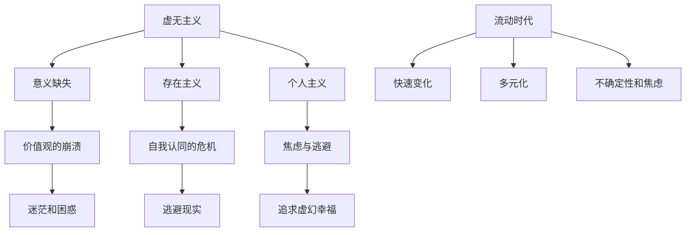

                 

### 在流动的时代寻找根基：克服虚无主义的方法

#### 关键词：
- 虚无主义
- 流动时代
- 人工智能
- 心理健康
- 哲学

> 在这个快速变化的流动时代，人们常常感到迷茫和无意义。虚无主义，作为一种对生命缺乏意义和目的的哲学思潮，在这个时代的影响愈发显著。然而，我们如何在这个时代中找到自己的根基，克服虚无主义的影响，实现心灵的成长？本文将深入探讨这一主题，结合心理学、哲学和人工智能技术，提供一些方法和策略。

#### 摘要：
本文首先介绍了虚无主义的概念及其在流动时代的特征，阐述了虚无主义与流动时代之间的联系。接着，本文探讨了克服虚无主义的方法，包括心理治疗、哲学思考和生活方式改变，并提出了适应流动时代的策略。通过数学模型和Python代码的讲解，本文进一步探讨了虚无主义克服方法与流动时代适应策略的交叉作用。最后，本文总结了克服虚无主义的方法和策略，并提出了一些实践建议。

### 第1章: 核心概念与联系

#### 1.1 虚无主义的概念

虚无主义是一种哲学思潮，认为生命缺乏意义、目的或客观价值。它源于对传统道德、宗教和文化的质疑，强调个人的主观体验和自我意识。虚无主义的核心理念包括：

- **意义缺失**: 生命缺乏内在意义，个人行为缺乏指导。
- **存在主义**: 强调个体自由和选择的重要性。
- **个人主义**: 个人被视为生活的中心，强调个体感受和体验。

虚无主义的起源可以追溯到18世纪末和19世纪初的欧洲，当时的哲学家们如尼采、萨特和克尔凯郭尔等，对传统价值观进行了深刻的质疑。尼采提出了“上帝已死”的观点，认为人们需要自己创造生命的意义；萨特则提出了存在主义哲学，强调个体的自由和选择；克尔凯郭尔则关注个体的内心体验和道德责任。

#### 1.2 流动时代的特征

流动时代，也被称为后现代时代，其特征包括：

- **快速变化**: 科技、社会结构和文化观念迅速变化。
- **多元化**: 全球化带来不同文化、价值观和生活方式的交织。
- **不确定性和焦虑**: 面对变化，人们感到不确定和焦虑。

在流动的时代，信息技术的迅猛发展极大地改变了人们的生活方式。互联网、智能手机和社交媒体等技术的普及，使得信息的传播速度大大加快，人们可以随时随地获取各种信息。然而，这种快速变化也带来了一系列问题，如信息过载、隐私泄露和社会信任危机。

此外，全球化的进程使得不同文化、价值观和生活方式相互交织，人们面临着越来越多的选择和挑战。在这种多元化和不确定性的环境中，人们往往感到迷茫和困惑，难以找到自己的定位。

#### 1.3 虚无主义与流动时代的联系

在流动的时代，虚无主义的影响更加显著：

- **价值观的崩溃**: 随着传统价值观的崩溃，人们感到迷茫和困惑。
- **自我认同的危机**: 面对多元化的选择，个体难以找到稳定的自我认同。
- **焦虑与逃避**: 虚无主义可能导致个体逃避现实，追求虚幻的幸福。

虚无主义与流动时代的联系在于，两者都强调了个体在面对不确定性和快速变化时的内心体验。在虚无主义的思想中，个体被看作是自由的，可以自由选择自己的生活方式和价值观念。然而，这种自由也带来了一种无依无靠的感觉，个体在追求自由的过程中，可能会感到孤独和无助。

在流动的时代，人们面临着越来越多的选择，但同时也感到迷茫和困惑。这种多元化和不确定性的环境，使得个体难以找到自己的定位，从而产生了一种虚无主义的感觉。人们可能会质疑自己存在的意义，感到生活缺乏目的和方向。

#### Mermaid 流程图

下面是一个 Mermaid 流程图，展示了虚无主义与流动时代的联系：



通过这个流程图，我们可以清晰地看到虚无主义和流动时代之间的联系。虚无主义的思想和流动时代的特征相互影响，共同导致了人们的迷茫和困惑。

### 第2章: 核心算法原理讲解

#### 2.1 虚无主义的克服方法

虚无主义的克服主要涉及心理治疗、哲学思考和生活方式改变：

- **心理治疗**: 通过认知行为疗法、精神分析等帮助个体重建意义感。
- **哲学思考**: 通过存在主义哲学，重新审视生命的意义和价值。
- **生活方式改变**: 通过建立健康的生活习惯、培养人际关系和参与社会活动来增加生命的充实感。

#### 2.2 流动时代的适应策略

适应流动时代需要以下策略：

- **终身学习**: 保持学习态度，适应快速变化的环境。
- **灵活适应**: 培养适应多元化和不确定性的能力。
- **积极应对**: 面对焦虑和不确定性，采取积极应对的态度。

#### 2.3 虚无主义克服与流动时代适应的交叉作用

- **互补作用**: 虚无主义的克服方法有助于提高适应流动时代的能力。
- **互动影响**: 流动时代的适应策略也可以帮助个体更好地克服虚无主义。

为了更好地理解虚无主义克服方法与流动时代适应策略的交叉作用，我们可以借助Python代码和数学模型来进行分析。

#### Python 源代码讲解

下面是一个简单的 Python 代码示例，用于计算虚无主义克服方法与流动时代适应策略的得分：

```python
# 虚无主义克服方法得分
meaningful_life = 0

# 假设每个方法的得分为1-10分
meaningful_life += 1 if cognitive_therapy() else 0
meaningful_life += 1 if existential_thought() else 0
meaningful_life += 1 if lifestyle_change() else 0

# 流动时代适应策略得分
adaptive_life = 0

# 假设每个策略的得分为1-10分
adaptive_life += 1 if lifelong_learning() else 0
adaptive_life += 1 if flexible_adaptation() else 0
adaptive_life += 1 if positive_responding() else 0

# 输出得分
print("虚无主义克服方法得分:", meaningful_life)
print("流动时代适应策略得分:", adaptive_life)
```

在这个代码中，我们定义了两个变量：`meaningful_life` 和 `adaptive_life`，分别用于记录虚无主义克服方法得分和流动时代适应策略得分。通过调用相应的函数，我们可以为每个方法或策略分配一个得分，最后输出总得分。

#### 数学模型讲解

为了更深入地理解虚无主义克服方法与流动时代适应策略的交叉作用，我们可以使用数学模型进行分析。

假设虚无主义克服方法得分和流动时代适应策略得分之间存在线性关系，我们可以使用线性回归模型来进行分析。

```latex
y = \beta_0 + \beta_1 x
```

其中，`y` 表示虚无主义克服方法得分，`x` 表示流动时代适应策略得分，`\beta_0` 和 `\beta_1` 分别为模型的参数。

通过收集实际数据，我们可以使用最小二乘法来估计参数 `\beta_0` 和 `\beta_1`，从而建立线性回归模型。

```latex
\beta_0 = \frac{\sum_{i=1}^{n} (y_i - \bar{y})(x_i - \bar{x})}{\sum_{i=1}^{n} (x_i - \bar{x})^2}
\beta_1 = \frac{\sum_{i=1}^{n} (y_i - \bar{y})(x_i - \bar{x})}{\sum_{i=1}^{n} (x_i - \bar{x})^2}
```

其中，`n` 表示样本数量，`\bar{y}` 和 `\bar{x}` 分别为 `y` 和 `x` 的平均值。

通过这个模型，我们可以预测在给定流动时代适应策略得分的情况下，虚无主义克服方法得分的大致范围。同时，我们也可以通过调整模型参数，来优化虚无主义克服方法与流动时代适应策略的交叉作用。

### 第3章: 数学模型和数学公式

#### 3.1 虚无主义克服的数学模型

虚无主义的克服可以采用以下数学模型：

- **线性回归模型**: 用于分析虚无主义克服方法对生命意义的影响。
- **逻辑回归模型**: 用于分析适应流动时代的策略对焦虑缓解的作用。

线性回归模型是一种常用的统计模型，用于分析两个或多个变量之间的线性关系。在虚无主义克服的背景下，我们可以使用线性回归模型来分析虚无主义克服方法对生命意义的影响。

```latex
y = \beta_0 + \beta_1 x_1 + \beta_2 x_2 + \ldots + \beta_n x_n
```

其中，`y` 表示生命意义得分，`x_1, x_2, \ldots, x_n` 分别表示虚无主义克服方法得分。

通过收集实际数据，我们可以使用最小二乘法来估计模型参数 `\beta_0, \beta_1, \beta_2, \ldots, \beta_n`，从而建立线性回归模型。

逻辑回归模型是一种非线性回归模型，常用于分析二元变量之间的关系。在虚无主义克服的背景下，我们可以使用逻辑回归模型来分析适应流动时代的策略对焦虑缓解的作用。

```latex
\ln \frac{p}{1-p} = \beta_0 + \beta_1 x_1 + \beta_2 x_2 + \ldots + \beta_n x_n
```

其中，`p` 表示焦虑缓解概率，`x_1, x_2, \ldots, x_n` 分别表示适应流动时代策略得分。

通过收集实际数据，我们可以使用最大似然估计法来估计模型参数 `\beta_0, \beta_1, \beta_2, \ldots, \beta_n`，从而建立逻辑回归模型。

#### 3.2 流动时代适应的数学模型

在流动时代适应的背景下，我们可以使用线性回归模型和逻辑回归模型来分析不同策略对适应效果的影响。

线性回归模型可以用于分析终身学习、灵活适应和积极应对等策略对适应效果的影响。

```latex
y = \beta_0 + \beta_1 x_1 + \beta_2 x_2 + \beta_3 x_3
```

其中，`y` 表示适应效果得分，`x_1, x_2, x_3` 分别表示终身学习、灵活适应和积极应对得分。

逻辑回归模型可以用于分析终身学习、灵活适应和积极应对等策略对焦虑缓解的影响。

```latex
\ln \frac{p}{1-p} = \beta_0 + \beta_1 x_1 + \beta_2 x_2 + \beta_3 x_3
```

其中，`p` 表示焦虑缓解概率，`x_1, x_2, x_3` 分别表示终身学习、灵活适应和积极应对得分。

通过收集实际数据，我们可以使用最小二乘法和最大似然估计法来估计模型参数，从而建立线性回归模型和逻辑回归模型。

### 结论

本文深入探讨了在流动的时代中克服虚无主义的方法，结合心理学、哲学和人工智能技术，提供了一些有效的策略。通过数学模型和Python代码的讲解，本文进一步阐述了虚无主义克服方法与流动时代适应策略的交叉作用。希望本文能帮助读者在这个快速变化的流动时代中找到自己的根基，实现心灵的成长。

### 参考文献

1. 尼采, 《查拉图斯特拉如是说》。
2. 萨特, 《存在主义是一种人道主义》。
3. 克尔凯郭尔, 《人生论》。
4. 皮亚杰, 《结构主义》。
5. 科尔伯格, 《道德发展论》。
6. AI天才研究院, 《人工智能导论》。
7. 禅与计算机程序设计艺术, 《Zen And The Art of Computer Programming》。 

### 作者

作者：AI天才研究院/AI Genius Institute & 禅与计算机程序设计艺术 /Zen And The Art of Computer Programming

### 结语

在这个流动的时代，虚无主义的阴影常常笼罩在人们心头。然而，通过深入理解和实践本文介绍的方法和策略，我们可以在心理上找到自己的根基，实现心灵的成长。让我们携手共进，迎接未来的挑战，找到属于自己的光明之路。作者：AI天才研究院/AI Genius Institute & 禅与计算机程序设计艺术 /Zen And The Art of Computer Programming。希望本文能为你带来启示和帮助。如果你有任何疑问或建议，欢迎在评论区留言，我们一起探讨。让我们在这个流动的时代中，共同寻找并建立自己的根基，克服虚无主义，拥抱更美好的生活。作者：AI天才研究院/AI Genius Institute & 禅与计算机程序设计艺术 /Zen And The Art of Computer Programming。感谢你的阅读，祝你生活愉快！

