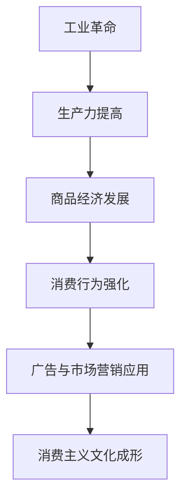
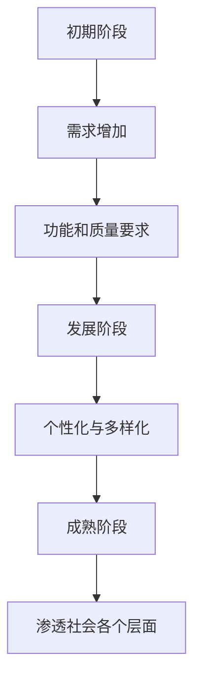
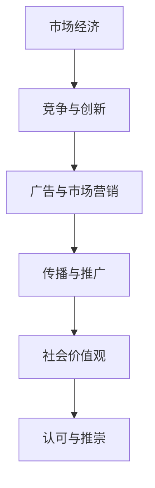
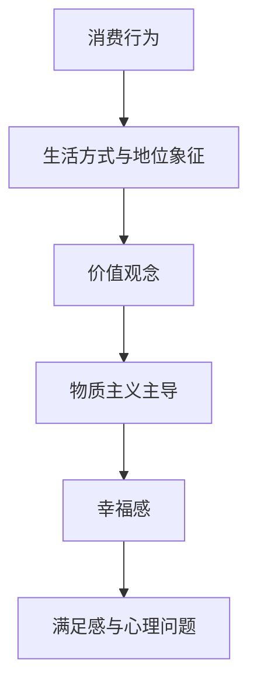
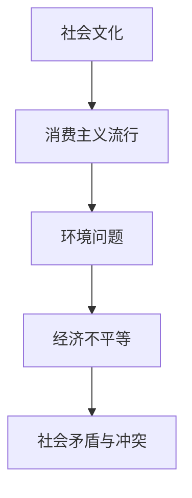
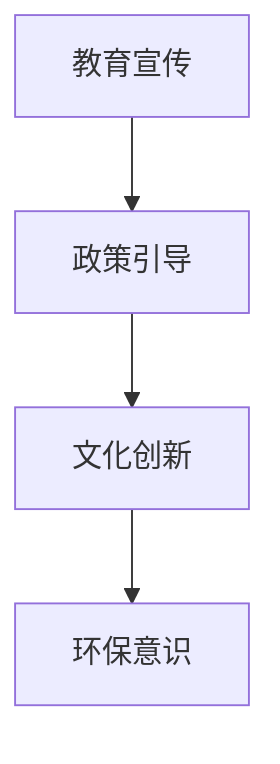

                 

## 第2章 消费主义文化的本质

### 2.1 消费主义文化的起源与发展

#### 2.1.1 消费主义文化的起源

消费主义文化起源于工业革命时期，随着生产力的提高和商品经济的迅速发展，人们逐渐开始将消费视为一种生活方式和社会地位的象征。在这一时期，广告和市场营销手段的广泛应用，使得消费行为被不断强化和推广。消费主义文化因此逐步成形。

**Mermaid流程图：**

#### 2.1.2 消费主义文化的发展历程

消费主义文化的发展历程可以分为以下几个阶段：

1. **初期阶段**：消费主义文化的初期阶段主要表现为人们对商品的需求和购买行为的增加。这一阶段的特点是消费者对商品的功能和质量有较高的要求。
   
2. **发展阶段**：随着经济的进一步发展，消费主义文化逐渐发展壮大。消费者不再仅仅关注商品的功能和质量，更注重商品的品牌、设计、外观和体验。这一阶段的特点是消费行为逐渐向个性化、多样化发展。

3. **成熟阶段**：在成熟阶段，消费主义文化已经渗透到社会各个层面。人们的生活方式、价值观念和社交行为都受到消费主义文化的影响。这一阶段的特点是消费行为趋于理性化和规范化。

**Mermaid流程图：**

#### 2.1.3 消费主义文化的主要推动力量

消费主义文化的主要推动力量包括以下几个方面：

1. **市场经济**：市场经济的发展为消费主义文化的形成提供了土壤。市场经济鼓励竞争，使得商品生产者和销售者不断创新，以吸引消费者。
   
2. **广告和市场营销**：广告和市场营销手段的不断应用，使得消费主义文化得以广泛传播和推广。广告和市场营销不仅影响消费者的购买决策，还塑造了消费者的价值观和生活方式。

3. **社会价值观**：随着社会的发展，人们逐渐将消费行为与个人价值和社会地位联系起来。消费主义文化因此得到了社会的认可和推崇。

**Mermaid流程图：**

### 2.2 消费主义文化对个人和社会的影响

#### 2.2.1 消费主义文化对个人的影响

消费主义文化对个人的影响主要体现在以下几个方面：

1. **消费行为**：消费主义文化改变了人们的消费行为，使消费成为一种生活方式和社会地位的象征。消费者在购买商品时，不仅关注商品的功能和质量，还关注商品的品牌、设计、外观和体验。

2. **价值观念**：消费主义文化影响了人们的价值观念，使物质主义成为主导价值观。人们逐渐将消费行为与个人价值和社会地位联系起来，追求物质财富和享受。

3. **幸福感**：消费主义文化对个人的幸福感产生了一定的影响。一方面，消费行为能够带来短暂的满足感和幸福感；另一方面，过度消费和物质主义价值观可能导致心理问题，如焦虑、抑郁等。

**Mermaid流程图：**

#### 2.2.2 消费主义文化对社会的影

**Mermaid流程图：**

### 2.3 消费主义文化的应对策略

面对消费主义文化的负面影响，可以采取以下策略：

1. **教育宣传**：加强对消费主义文化的教育和宣传，提高人们对消费主义文化的认识，引导人们树立正确的消费观念。

2. **政策引导**：政府可以出台相关政策，限制过度消费和广告宣传，促进可持续发展。

3. **文化创新**：推动文化创新，提倡环保、节约、互助等价值观，培养人们的环保意识和社会责任感。

**Mermaid流程图：**

### 总结

消费主义文化是一种影响广泛的文化现象，它在给个人和社会带来一定积极影响的同时，也带来了诸多负面影响。了解消费主义文化的本质、发展历程及其对个人和社会的影响，有助于我们更好地应对其负面影响，推动社会进步。在接下来的章节中，我们将进一步探讨物质主义的空虚感及其应对策略。

---

**作者：** AI天才研究院/AI Genius Institute & 禅与计算机程序设计艺术 /Zen And The Art of Computer Programming

**摘要：** 本章主要介绍了消费主义文化的起源、发展历程及其对个人和社会的影响。通过对消费主义文化的本质分析，我们认识到消费主义文化在改变个人消费行为、价值观念和幸福感的同时，也对社会产生了深远影响。接下来，我们将探讨物质主义的空虚感及其应对策略，以帮助我们在消费主义文化中寻找本真。

