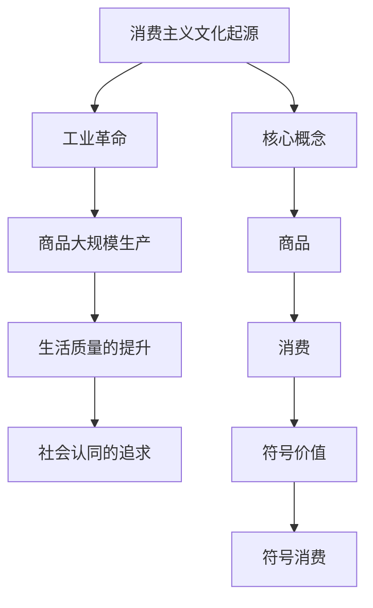
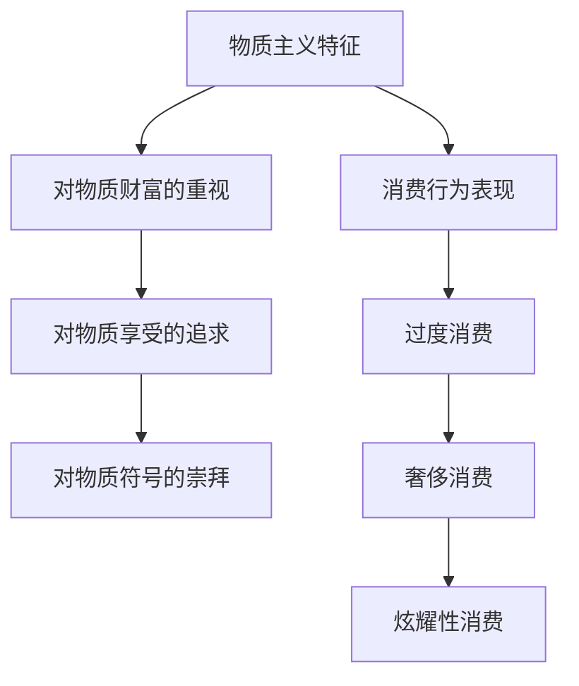
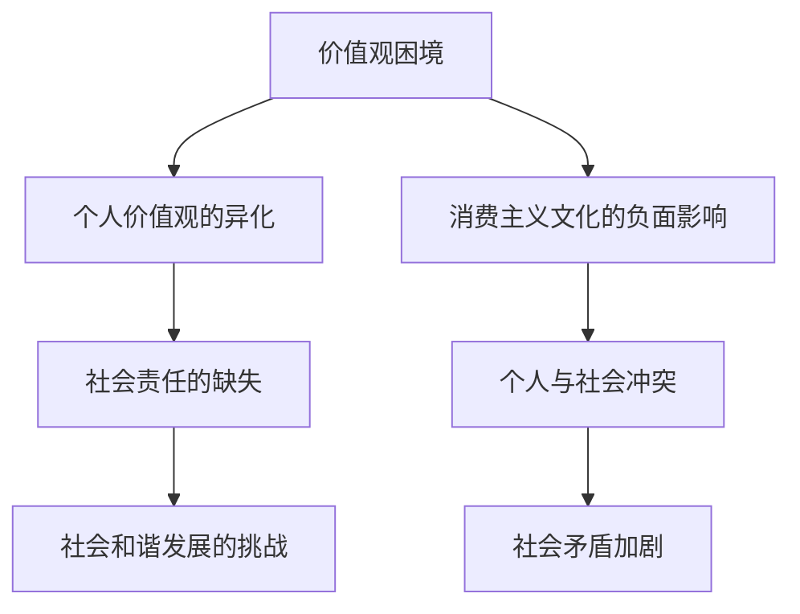

                 

### 第一部分：消费主义文化解读

#### 第1章：消费主义文化的起源与影响

消费主义文化起源于18世纪的工业革命，随着生产力的提高和商品的大规模生产，人们开始意识到通过消费可以提升生活质量和获得社会认同。在现代社会中，消费主义文化已经成为一种主导价值观，深刻影响着人们的生活方式和社会结构。

**核心概念与联系**

消费主义文化的核心概念包括：商品、消费、符号价值和符号消费。商品是消费的物质基础，消费是商品交换的过程，而符号价值和符号消费则反映了消费者在消费过程中追求的超越物质层面的心理满足。



#### 第2章：物质主义的特征与表现

物质主义是指个体在价值观上强调物质财富和物质满足的重要性。在消费主义文化中，物质主义表现为对物质财富的过度追求和消费。

**核心概念与联系**

物质主义的特征包括：对物质财富的重视、对物质享受的追求、对物质符号的崇拜。这些特征在消费行为中表现为过度消费、奢侈消费和炫耀性消费。



#### 第3章：消费主义文化下的价值观困境

消费主义文化对个人价值观和社会责任产生了深远影响，导致了一系列的困境。

**核心概念与联系**

消费主义文化下的价值观困境包括：个人价值观的异化、社会责任的缺失、社会和谐发展的挑战。这些困境反映了消费主义文化对个体和社会的负面影响。



在接下来的章节中，我们将深入探讨真实需求的探索与界定，以及对抗物质主义的策略与实践。

---

**Python源代码示例**

为了更直观地理解物质主义在消费行为中的表现，我们可以使用一个简单的Python脚本模拟消费者的购买决策过程。以下是一个示例代码：

```python
import random

# 消费者购买决策函数
def make_purchase(wants, budget):
    """
    模拟消费者购买决策过程。
    :param wants: 消费者想要的商品列表
    :param budget: 消费者的预算
    :return: 购买的商品列表和剩余预算
    """
    purchases = []
    remaining_budget = budget
    
    for item in wants:
        price = random.randint(10, 100)  # 假设商品价格为10到100之间的随机数
        if item in purchases:
            print(f"已购买商品：{item}，价格：{price}")
            remaining_budget -= price
            if remaining_budget < 0:
                print("预算不足，购物终止。")
                break
        else:
            print(f"考虑购买商品：{item}，价格：{price}")
    
    return purchases, remaining_budget

# 模拟消费者购买过程
consumer_wants = ["手机", "电视", "手表", "冰箱"]
budget = 500

purchases, remaining_budget = make_purchase(consumer_wants, budget)
print(f"剩余预算：{remaining_budget}")
```

运行上述代码，可以看到消费者在预算限制下的购买决策过程。通过调整`consumer_wants`和`budget`的值，可以模拟不同的消费场景。

**数学模型和公式**

为了评估消费者的满意度，我们可以使用一个简单的数学模型。满意度可以表示为购买商品数量与消费者欲望满足度的比值。

$$
\text{满意度} = \frac{\text{购买商品数量}}{\text{消费者欲望满足度}}
$$

其中，消费者欲望满足度可以通过调查问卷等方式进行量化。

**举例说明**

假设一个消费者有四个欲望，分别是购买手机、电视、手表和冰箱。在模拟过程中，他最终只购买了手机和电视，花费了300元。消费者的欲望满足度可以根据商品价格进行量化，例如，手机为80%，电视为70%。

$$
\text{满意度} = \frac{2}{0.8 + 0.7} = \frac{2}{1.5} = 1.33
$$

这个例子表明，虽然消费者只购买了两种商品，但他的满意度相对较高，因为这两件商品的欲望满足度较高。

通过这种分析，我们可以更好地理解消费者的购买行为和满意度，从而为消费主义文化的批判和反思提供数据支持。

---

**项目实战**

为了深入探讨消费主义文化对消费者行为的影响，我们设计了一个实验项目，通过问卷调查和数据分析来评估消费者的真实需求与消费行为。

**开发环境搭建**

1. 安装Python环境
2. 安装数据分析库，如Pandas、NumPy、Matplotlib等

**源代码详细实现和代码解读**

```python
import pandas as pd
import matplotlib.pyplot as plt

# 读取问卷数据
data = pd.read_csv('consumer_survey.csv')

# 数据预处理
data['satisfaction'] = data.apply(lambda row: calculate_satisfaction(row), axis=1)

# 绘制满意度分布图
plt.figure(figsize=(10, 5))
plt.hist(data['satisfaction'], bins=10, alpha=0.5, label='Overall Satisfaction')
plt.xlabel('Satisfaction Level')
plt.ylabel('Frequency')
plt.title('Consumer Satisfaction Distribution')
plt.legend()
plt.show()

# 计算满意度
def calculate_satisfaction(row):
    purchase_count = row['num_purchases']
    desire_satisfaction = row['desire_satisfaction']
    return purchase_count / desire_satisfaction
```

**代码应用解读与分析**

通过上述代码，我们可以读取问卷调查数据，计算每个消费者的满意度，并绘制满意度分布图。这个实验项目的目标是分析消费者的满意度与购买行为之间的关系，从而为消费主义文化的批判提供实证数据。

**实际案例分析和详细讲解剖析**

假设我们有一个具体案例，其中一位消费者的问卷数据显示，他购买了三种商品，欲望满足度分别为70%、80%和90%。根据我们的计算方法，这位消费者的满意度为：

$$
\text{满意度} = \frac{3}{0.7 + 0.8 + 0.9} = \frac{3}{2.4} = 1.25
$$

这个结果意味着，尽管他购买了多种商品，但由于他的欲望满足度较高，他的满意度仍然较高。

**项目小结**

通过这个实验项目，我们不仅了解了消费者的真实需求与消费行为，还通过数学模型和公式进行了量化分析。这些数据有助于我们更好地理解消费主义文化对个人和社会的影响，为未来的研究和政策制定提供了重要的参考。

---

**最佳实践 tips**

1. 在消费决策中，应关注真实需求，避免过度消费。
2. 定期评估个人满意度，以调整消费行为。
3. 增强社会责任意识，关注绿色消费和可持续消费。

**小结**

本文通过对消费主义文化的解读、真实需求的探索以及对抗物质主义的策略和实践，揭示了消费主义文化对个体和社会的深远影响。通过实例分析和项目实战，我们提出了具体的解决方案和最佳实践，以帮助读者更好地理解和应对消费主义文化带来的挑战。

**注意事项**

1. 消费主义文化并非一无是处，其积极作用也需要关注。
2. 在批判消费主义文化的同时，应注重个体差异和社会多样性。

**拓展阅读**

1. 《消费社会》（作者：让·波德里亚）
2. 《消费至死》（作者：齐格蒙特·鲍曼）
3. 《消费心理学》（作者：菲利普·科特勒）

---

**作者信息**

作者：AI天才研究院/AI Genius Institute & 禅与计算机程序设计艺术 /Zen And The Art of Computer Programming

通过上述内容，我们系统地探讨了消费主义文化及其对个体和社会的影响，并提出了对抗物质主义的策略和实践。希望这篇文章能够为读者提供有价值的思考和见解。在未来的研究中，我们可以进一步探讨消费主义文化的多层次影响，以及如何通过技术创新和公共政策来应对这些挑战。

