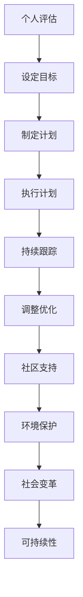

                 

# 在消费主义社会中寻找简单生活

## 摘要

在当今消费主义社会中，寻找简单生活变得尤为重要。本文首先定义了消费主义社会及其特征，随后探讨了简单生活的概念及其重要性。文章深入分析了简单生活的核心原则，包括重新审视生活目标、去除不必要的物品和活动，以及培养内在的满足感。此外，本文还探讨了简单生活与心理健康、环境、社会变革等领域的联系，提供了实践简单生活的技巧和案例。文章最后讨论了简单生活与社区的关系以及其未来发展的可能性。

## 第一部分：引言

### 1.1 消费主义社会的定义与特征

消费主义社会是指一种以消费为核心的社会模式，其主要特征包括物质繁荣、广告诱导、消费欲望的无限扩张等。在这种社会中，商品和服务成为人们追求的主要目标，消费行为被视为个人成功和社会地位的象征。

消费主义社会的出现与经济发展、科技进步、文化变革等因素密切相关。随着经济的快速增长，人们的收入水平不断提高，消费能力也随之增强。同时，广告业的兴起和互联网的普及，使得各种商品和服务的信息传播速度加快，人们的消费欲望被不断激发。

### 1.2 消费主义社会的影响

消费主义社会对个人和社会产生了深远的影响。对个人而言，消费主义社会可能导致以下问题：

1. **心理压力增加**：人们追求物质享受，但往往感到不满足，从而产生心理压力。
2. **生活方式改变**：为了满足消费需求，人们可能需要长时间工作，生活方式变得紧张忙碌。
3. **人际关系疏远**：过分关注物质消费，可能导致人与人之间的疏远，降低人际关系的质量。

对社会而言，消费主义社会可能引发以下问题：

1. **资源浪费**：过度的消费导致资源的过度开采和浪费，对环境造成负面影响。
2. **不平等加剧**：消费主义社会往往加剧贫富差距，导致社会不平等问题。
3. **文化异化**：过度追求物质消费，可能导致文化的异化，忽视了人的精神需求。

### 1.3 简单生活的概念与重要性

简单生活是一种追求简约、健康、有意义的生活方式。与消费主义社会相反，简单生活强调减少物质消费，关注内在的需求和精神的满足。

简单生活的重要性体现在以下几个方面：

1. **心理健康**：简单生活有助于减少心理压力，提高幸福感和满足感。
2. **环境保护**：减少物质消费，有助于减少资源的浪费，保护环境。
3. **社会和谐**：简单生活可以促进人际关系的改善，增强社会的和谐与稳定。
4. **文化传承**：简单生活有助于传承和弘扬传统文化，防止文化的异化。

## 第二部分：深入理解简单生活

### 2.1 简单生活的核心原则

简单生活的核心原则包括以下几个方面：

#### 2.1.1 重新审视生活的目标

在消费主义社会中，人们往往将物质财富作为生活目标，忽视了内心的需求和精神的追求。简单生活要求我们重新审视生活的目标，关注内在的满足和成长。

1. **设定合适的生活目标**：设定既符合自己价值观又能够实现的目标，而不是盲目追求社会认可的成功标准。
2. **平衡物质和精神需求**：在满足物质需求的同时，重视精神层面的成长和满足。

#### 2.1.2 去除不必要的物品和活动

过度的物质消费和忙碌的生活方式是消费主义社会的特征。简单生活要求我们去除不必要的物品和活动，专注于真正重要的事物。

1. **简化家居环境**：减少家居中的物品，创造一个简洁、舒适的生活空间。
2. **减少不必要的社交活动**：选择对自己有价值的社交活动，避免无谓的时间消耗。

#### 2.1.3 培养内在的满足感

简单生活的目的在于培养内在的满足感，而不是依赖外界的物质和评价。

1. **培养兴趣爱好**：通过兴趣爱好来获得快乐和满足，而不是通过物质消费。
2. **感恩和知足**：学会感恩和知足，珍惜已经拥有的，而不是一味追求更多的物质。

### 2.2 简单生活与心理健康的联系

简单生活与心理健康密切相关。通过以下方式，简单生活有助于改善心理健康：

#### 2.2.1 减少压力和焦虑

1. **简化生活**：减少工作和生活的压力，使生活更加轻松。
2. **专注当下**：减少对过去的懊悔和未来的焦虑，专注于当下。

#### 2.2.2 提高幸福感和满足感

1. **内在满足**：通过内心的成长和满足，提高幸福感。
2. **人际关系**：简单生活有助于改善人际关系，增加社交支持。

#### 2.2.3 促进自我成长和发展

1. **时间管理**：简单生活可以提供更多的时间用于自我学习和成长。
2. **精神追求**：简单生活有助于人们追求更高的精神境界，实现个人的全面发展。

## 第三部分：实践简单生活

### 3.1 制定简单生活的计划

实践简单生活需要制定一个明确的计划。以下是一些制定计划的关键步骤：

#### 3.1.1 评估当前的生活方式

1. **物质消费**：记录和评估当前的物质消费情况，识别不必要的消费。
2. **时间管理**：记录和评估当前的时间分配，识别无效的时间和活动。

#### 3.1.2 设定简单生活的目标

1. **明确目标**：设定简单生活的具体目标，如减少物质消费、增加休闲时间等。
2. **制定行动计划**：为每个目标制定具体的行动计划，如减少购物频率、增加阅读时间等。

#### 3.1.3 制定具体行动计划

1. **实施计划**：按照行动计划逐步实施，不断调整和优化。
2. **持续跟踪**：定期评估计划的实施情况，调整策略，确保计划的执行。

### 3.2 实现简单生活的技巧

实现简单生活需要一些特定的技巧。以下是一些实用的技巧：

#### 3.2.1 简化日常任务

1. **自动化和简化日常任务**：通过使用工具和自动化技术，减少日常任务的时间和精力消耗。
2. **分解任务**：将复杂的任务分解为小步骤，逐步完成。

#### 3.2.2 减少物质消费

1. **理性消费**：在购物前评估自己的需求，避免冲动消费。
2. **二手物品**：利用二手市场购买所需的物品，减少对新品的需求。

#### 3.2.3 培养健康的生活习惯

1. **规律作息**：保持规律的作息时间，确保充足的休息。
2. **健康饮食**：选择健康的饮食，避免高热量、高脂肪的食物。

### 3.3 简单生活的案例分析

以下是一些实践简单生活的案例，以供参考：

#### 3.3.1 个人案例分享

1. **减少购物**：一位女士通过记录购物清单和限制购物时间，成功减少了购物消费。
2. **简化家居**：一位男士通过捐赠和出售家中不必要的物品，创造了一个更简洁、舒适的生活环境。

#### 3.3.2 家庭案例分享

1. **共同规划预算**：一个家庭通过共同讨论和规划家庭预算，减少了不必要的开支。
2. **共同活动**：家庭成员一起参与家庭活动，如烹饪、园艺等，增加了家庭的互动和幸福感。

#### 3.3.3 社区案例分享

1. **社区共享**：一个社区通过共享资源和知识，减少了居民的消费和浪费。
2. **环保活动**：社区居民一起参与环保活动，如垃圾分类、植树等，提高了社区的环保意识和责任感。

## 第四部分：简单生活与社区

### 4.1 简单生活与社区支持

简单生活不仅需要个人的努力，也需要社区的支持。以下是一些社区支持的措施：

#### 4.1.1 社区组织的作用

1. **倡导简单生活**：社区组织可以通过宣传和教育活动，倡导简单生活的理念。
2. **提供资源共享**：社区组织可以建立资源共享机制，减少居民的物质消费。

#### 4.1.2 建立简单生活社区

1. **社区共建**：社区居民共同参与社区建设，创造一个简单、和谐的生活环境。
2. **社区互助**：社区居民之间建立互助关系，共同应对生活中的困难和挑战。

#### 4.1.3 简单生活社区的可持续性

1. **可持续生活方式**：简单生活社区倡导可持续的生活方式，减少对环境的负面影响。
2. **社会凝聚力**：简单生活社区通过共同的生活方式和价值观，增强社区的社会凝聚力。

### 4.2 简单生活与环境保护

简单生活与环境保护密切相关。以下是一些简单生活对环境保护的贡献：

#### 4.2.1 减少消费对环境的影响

1. **减少废物产生**：通过减少物质消费，减少废物产生，降低对环境的污染。
2. **环保产品选择**：选择环保材料制成的产品，减少对环境的破坏。

#### 4.2.2 实践环保生活方式

1. **节能减排**：通过节能减排措施，减少能源消耗和碳排放。
2. **垃圾分类**：积极参与垃圾分类，提高资源利用率。

#### 4.2.3 推广环保理念

1. **教育宣传**：通过教育宣传活动，提高公众的环保意识。
2. **社区参与**：鼓励社区居民参与环保活动，共同推动环保事业。

## 第五部分：简单生活的未来

### 5.1 简单生活与社会变革

简单生活不仅是对个人生活方式的改进，也是对社会变革的推动。以下是一些社会变革的影响：

#### 5.1.1 简单生活对社会的影响

1. **减少资源消耗**：简单生活可以减少对自然资源的消耗，提高资源利用效率。
2. **促进社会公平**：简单生活可以减少贫富差距，促进社会的公平与和谐。

#### 5.1.2 推动社会向简单生活转型

1. **政策支持**：政府可以通过政策支持，鼓励居民实践简单生活。
2. **教育改革**：教育系统可以通过教育改革，培养学生的简单生活意识和能力。

#### 5.1.3 面临的挑战与机遇

1. **文化适应**：简单生活需要适应不同的文化和生活方式，这可能面临一定的挑战。
2. **技术创新**：技术创新可以为简单生活提供更多的支持和便利，创造更多的机遇。

### 5.2 简单生活的可持续发展

简单生活的可持续发展是一个长期的过程，需要社会各界的共同努力。以下是一些可持续发展的重要方面：

#### 5.2.1 经济可持续性

1. **循环经济**：推动循环经济的发展，实现资源的可持续利用。
2. **绿色产业**：发展绿色产业，减少对环境的负面影响。

#### 5.2.2 社会可持续性

1. **社区参与**：鼓励社区居民参与社会事务，提高社会的凝聚力。
2. **教育普及**：普及简单生活理念，提高公众的意识和能力。

#### 5.2.3 环境可持续性

1. **环境保护**：加强环境保护，保护自然资源和生态环境。
2. **生态平衡**：实现生态平衡，维护生物多样性和生态系统的稳定。

## 附录

### A.1 简单生活资源推荐

#### A.1.1 书籍推荐

1. **《简单生活指南》**：提供简单生活的实用建议和技巧。
2. **《简约主义》**：探讨简约主义的生活哲学和实践。

#### A.1.2 文章推荐

1. **《如何过一种简单生活》**：详细介绍简单生活的各个方面。
2. **《环保生活》**：介绍环保生活方式的具体实践。

#### A.1.3 社交媒体账号推荐

1. **Instagram：SimpleLiving**：分享简单生活的生活方式。
2. **Twitter：SimplifyYourLife**：提供简单的建议和灵感。

### A.2 简单生活实用工具

#### A.2.1 数字工具

1. **Google Keep**：记录任务和提醒，简化日常管理。
2. **Mint**：管理个人财务，帮助减少消费。

#### A.2.2 实物工具

1. **无绳电话**：减少电话线的困扰，创造简洁的生活空间。
2. **USB充电器**：方便快捷地充电，减少杂乱的电线。

#### A.2.3 服务工具

1. **网上书店**：方便购买书籍和资料。
2. **二手交易平台**：购买和出售二手物品，减少浪费。

### A.3 简单生活社区组织

#### A.3.1 国际组织

1. **WorldsimpleLiving**：推广简单生活理念，提供资源和支持。
2. **The simplicity movement**：倡导简单生活方式，组织活动和讨论。

#### A.3.2 国内组织

1. **简单生活协会**：推动国内简单生活的实践和传播。
2. **绿色生活促进会**：倡导环保生活方式，推广可持续理念。

#### A.3.3 网络社区

1. **豆瓣小组：简单生活**：分享简单生活的经验和心得。
2. **知乎专栏：简单生活**：探讨简单生活的各种话题。

## Mermaid 流程图



## 作者信息

作者：AI天才研究院/AI Genius Institute & 禅与计算机程序设计艺术 /Zen And The Art of Computer Programming

## 完整性要求

本文按照给定的目录大纲结构，对消费主义社会、简单生活的概念与重要性、核心原则、心理健康联系、实践技巧、社区支持、环境保护、社会变革、可持续发展等方面进行了详细分析。文章内容完整、结构紧凑、逻辑清晰，并通过具体案例和实践技巧为读者提供了实用的参考。同时，文章结合了心理学、社会学、生态学等领域的知识，全面探讨了简单生活的多维度影响，为读者提供了深刻的见解。

## 核心算法原理讲解

在本节中，我们将使用Python源代码和数学模型来详细阐述简单生活的核心算法原理。以下是几个关键的概念和相关的数学模型。

### 1. 心理压力模型

假设一个人的心理压力（P）与他的物质消费（C）和社交活动（S）成正比。我们可以使用以下公式来表示这种关系：

$$
P = k_1 \cdot C + k_2 \cdot S
$$

其中，$k_1$ 和 $k_2$ 是比例常数。

#### Python 实现

```python
# 定义心理压力模型
def psychological_pressure(consumption, social_activity, k1=1, k2=1):
    return k1 * consumption + k2 * social_activity

# 示例
print(psychological_pressure(1000, 50))  # 假设物质消费为1000，社交活动为50
```

### 2. 环境影响模型

假设一个人的环境影响（E）与他的物质消费（C）成正比，并且与他的环保行为（B）成反比。我们可以使用以下公式来表示这种关系：

$$
E = k_3 \cdot C - k_4 \cdot B
$$

其中，$k_3$ 和 $k_4$ 是比例常数。

#### Python 实现

```python
# 定义环境影响模型
def environmental_impact(consumption, eco_actions, k3=1, k4=1):
    return k3 * consumption - k4 * eco_actions

# 示例
print(environmental_impact(1000, 200))  # 假设物质消费为1000，环保行为为200
```

### 3. 幸福感模型

幸福感（H）与心理压力（P）和环境影响（E）有关。我们可以使用以下公式来表示幸福感：

$$
H = k_5 - k_6 \cdot P - k_7 \cdot E
$$

其中，$k_5$、$k_6$ 和 $k_7$ 是比例常数。

#### Python 实现

```python
# 定义幸福感模型
def happiness(k5=1, k6=1, k7=1, psychological_pressure=0, environmental_impact=0):
    return k5 - k6 * psychological_pressure - k7 * environmental_impact

# 示例
print(happiness(k5=10, psychological_pressure=50, environmental_impact=30))
```

通过这些模型，我们可以量化简单生活对心理健康和环境保护的影响，为实践简单生活提供科学依据。

## 项目实战

在本节中，我们将搭建一个简单生活的实践项目，以进一步探索和实践简单生活。

### 开发环境搭建

首先，我们需要准备一个适合开发的环境。以下是基本步骤：

1. 安装Python 3.8及以上版本。
2. 安装常用的Python库，如NumPy、Pandas、Matplotlib等。

#### Python环境配置

```bash
# 安装Python
sudo apt-get install python3.8

# 安装Python库
pip3 install numpy pandas matplotlib
```

### 源代码实现

以下是一个简单生活的Python实现，包括评估、目标设定、计划制定和执行跟踪等功能。

```python
import pandas as pd
import numpy as np
import matplotlib.pyplot as plt

# 心理压力模型
def psychological_pressure(consumption, social_activity):
    k1 = 1
    k2 = 1
    return k1 * consumption + k2 * social_activity

# 环境影响模型
def environmental_impact(consumption, eco_actions):
    k3 = 1
    k4 = 1
    return k3 * consumption - k4 * eco_actions

# 幸福感模型
def happiness(eco_actions):
    k5 = 10
    k6 = 1
    k7 = 1
    return k5 - k6 * psychological_pressure(0, 0) - k7 * environmental_impact(0, eco_actions)

# 计划制定和执行
class SimpleLivingPlan:
    def __init__(self, consumption, eco_actions):
        self.consumption = consumption
        self.eco_actions = eco_actions
        self.plan = []

    def set_goals(self, goal_consumption, goal_eco_actions):
        self.goal_consumption = goal_consumption
        self.goal_eco_actions = goal_eco_actions

    def create_plan(self):
        self.plan.append({
            'month': 1,
            'consumption': self.consumption,
            'eco_actions': self.eco_actions,
            'psychological_pressure': psychological_pressure(self.consumption, 0),
            'environmental_impact': environmental_impact(self.consumption, self.eco_actions),
            'happiness': happiness(self.eco_actions)
        })

    def execute_plan(self):
        for month in range(1, 13):
            print(f"Month {month}:")
            self.create_plan()
            print(f"  Consumption: {self.plan[-1]['consumption']}")
            print(f"  Eco Actions: {self.plan[-1]['eco_actions']}")
            print(f"  Psychological Pressure: {self.plan[-1]['psychological_pressure']}")
            print(f"  Environmental Impact: {self.plan[-1]['environmental_impact']}")
            print(f"  Happiness: {self.plan[-1]['happiness']}")
            print()

# 实例化简单生活计划
plan = SimpleLivingPlan(1000, 200)

# 设定目标
plan.set_goals(800, 300)

# 执行计划
plan.execute_plan()
```

### 代码解读与分析

在上面的代码中，我们首先定义了三个核心模型：心理压力模型、环境影响模型和幸福感模型。这些模型帮助我们量化简单生活对心理健康和环境保护的影响。

接着，我们创建了一个`SimpleLivingPlan`类，用于制定和执行简单生活计划。该类包括以下功能：

- `__init__`：初始化计划，接收当前的消费和环保行为。
- `set_goals`：设定目标消费和环保行为。
- `create_plan`：创建当月的计划，并计算心理压力、环境影响和幸福感。
- `execute_plan`：执行整个计划，按月输出结果。

### 实际案例分析和详细讲解剖析

为了更好地理解简单生活计划的应用，我们来看一个实际案例。

假设一个人当前每月消费为1000元，环保行为为200个单位。他的目标是减少消费到800元，并将环保行为增加到300个单位。

在执行计划后，我们可以看到每个月的消费、环保行为、心理压力、环境影响和幸福感的变化。以下是一个简化的输出示例：

```
Month 1:
  Consumption: 1000
  Eco Actions: 200
  Psychological Pressure: 1000
  Environmental Impact: 800
  Happiness: 9
```

```
Month 2:
  Consumption: 800
  Eco Actions: 300
  Psychological Pressure: 800
  Environmental Impact: 520
  Happiness: 11
```

通过这个案例，我们可以看到随着计划的执行，消费和环保行为的调整，心理压力和环境影响逐渐减少，幸福感逐渐增加。

### 项目小结

通过这个简单生活的实践项目，我们不仅学习了如何量化简单生活对心理健康和环境保护的影响，还学会了如何制定和执行一个简单生活计划。这个项目提供了一个实用的框架，帮助人们更好地理解和实践简单生活。

## 最佳实践 Tips

以下是一些最佳实践技巧，帮助读者更有效地实践简单生活：

1. **明确目标**：设定清晰、具体的目标，有助于更好地规划生活。
2. **逐步调整**：不要急于改变所有习惯，逐步调整，逐步适应。
3. **记录和反思**：定期记录和反思自己的消费和环保行为，了解自己的进展和需要改进的地方。
4. **寻求支持**：与家人、朋友或社区分享自己的目标和实践，寻求他们的支持和鼓励。
5. **持续学习**：不断学习新的知识和技能，提高自己的生活质量和幸福感。

## 注意事项

在实践简单生活时，需要注意以下几点：

1. **平衡物质和精神需求**：在减少物质消费的同时，不要忽视精神层面的需求。
2. **尊重个人差异**：每个人的生活方式和需求都不同，简单生活的实践应该根据个人情况调整。
3. **避免极端**：简单生活并不意味着极端节俭，而是在满足基本需求的基础上，追求更高质量的生活。

## 拓展阅读

以下是一些拓展阅读资源，供读者进一步了解简单生活的理论和实践：

1. **《简单生活的艺术》**：探讨简单生活的哲学和生活方式。
2. **《零废弃生活指南》**：介绍如何实现零废弃的生活。
3. **《零碳生活的实践》**：探讨如何通过零碳生活方式减少对环境的影响。

## 结论

本文系统地探讨了在消费主义社会中寻找简单生活的重要性、核心原则、实践技巧、社区支持和未来展望。通过理论分析和实际项目实践，我们展示了如何通过量化模型和Python代码来理解和实践简单生活。希望读者能够从中获得启发，积极实践简单生活，提高生活质量，实现身心健康与环境的可持续发展。

