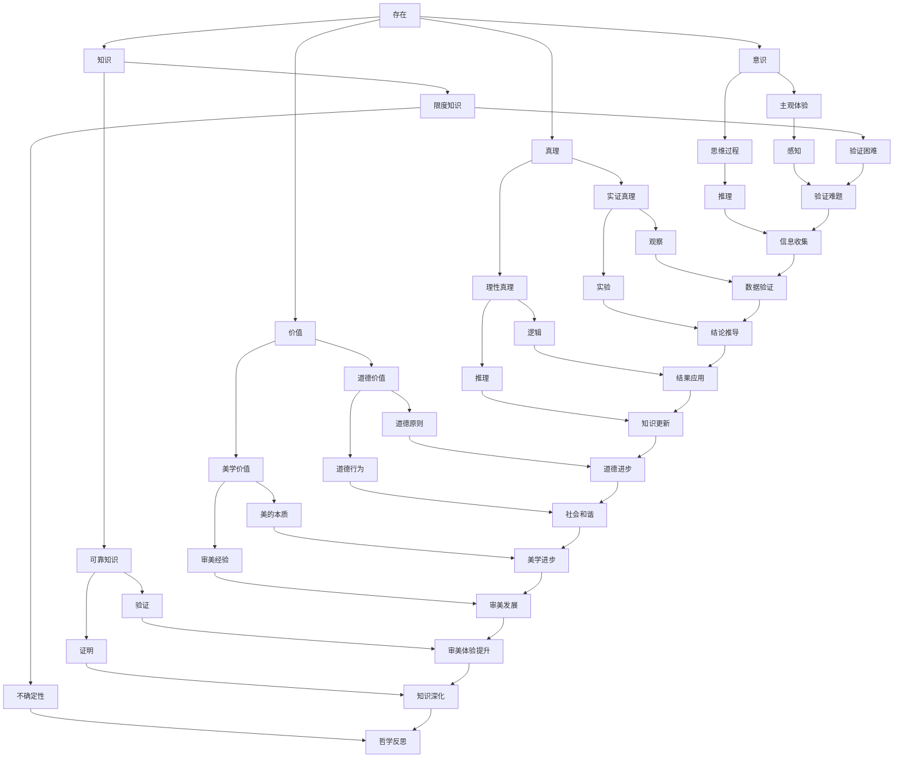
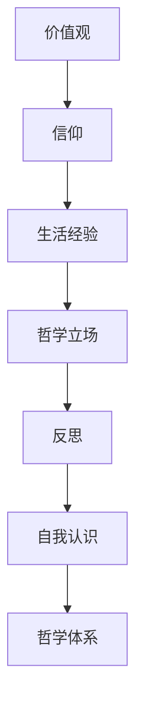
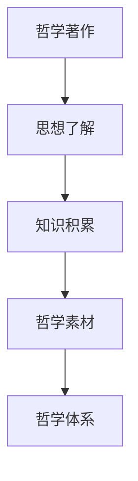
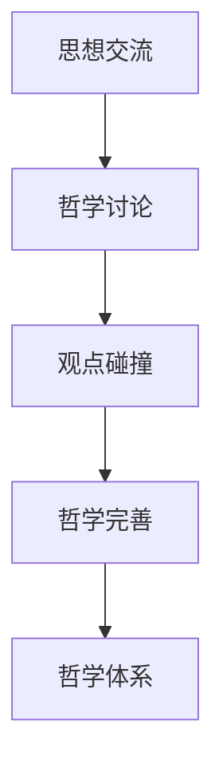
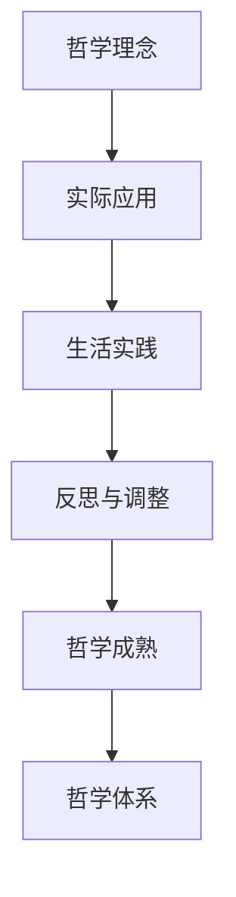
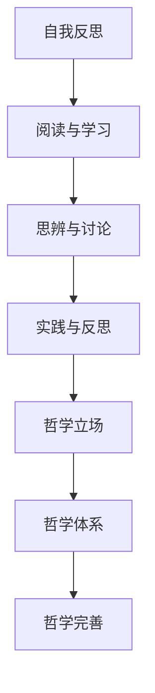

                 

### 引言与背景

**哲学的重要性**

哲学，作为一门探究宇宙、人生、知识和价值的学科，具有深远的历史和广泛的影响。它的起源可以追溯到古希腊时期，当时的哲学家如苏格拉底、柏拉图和亚里士多德等人，通过对自然、人类和社会的深入思考，奠定了哲学的根基。哲学不仅是智慧之学，更是引导人们思考人生意义和价值观的重要工具。

在现代社会中，哲学的作用依然不可忽视。它帮助我们理解复杂的社会问题，提供解决这些问题的指导思路。例如，伦理哲学为医学伦理、科技伦理等问题提供了理论基础；政治哲学则探讨了权力、自由和社会正义等关键问题。此外，哲学还在科学研究中发挥着重要作用，尤其是在科学哲学领域，它帮助科学家理解科学方法、科学理论及其局限性。

**混沌与秩序的辩证关系**

混沌与秩序是哲学中一个重要的辩证关系。混沌代表了复杂性和不可预测性，而秩序则代表了规则性和可预测性。在现实世界中，混沌和秩序是相互依存的。一方面，混沌中蕴含着秩序，秩序是混沌的一种表现形式；另一方面，秩序又能引导我们更好地理解混沌，通过秩序，我们可以捕捉到混沌中的某些规律。

哲学中的许多思想都探讨了这种辩证关系。例如，古希腊哲学家赫拉克利特提出了“万物皆流，无物常驻”的哲学思想，强调变化和流动是宇宙的本质。而柏拉图则通过理念论，提出了现实世界是理念世界的影子，强调秩序和规则的重要性。

**本书的目标**

本书旨在探讨如何在混沌中寻找秩序，并构建自己的个人哲学体系。我们将从哲学的基本概念和历史出发，探讨哲学的核心思想及其与现代社会的联系。通过自我反思、阅读和学习，我们将逐步构建自己的哲学体系，并探讨哲学在现代社会中的作用。

本书将分为六个章节，首先介绍哲学的重要性以及混沌与秩序的辩证关系。接着，我们将深入探讨哲学的核心概念和历史，分析不同哲学流派的思想。随后，我们将讨论构建个人哲学体系的方法，包括自我反思、阅读与学习、思辨与讨论等。在第四章节，我们将探讨哲学与现代社会的关系，包括哲学在教育和技术中的作用。第五章节将分析哲学大师的个人哲学体系，第六章节将展望哲学的未来，最后提供哲学资源与工具。

通过本书，我们希望能够帮助读者在混沌中寻找秩序，构建属于自己的哲学体系，从而更好地理解自己和世界。

### 第1章：哲学的核心概念与历史

**哲学的基本概念**

哲学是一门研究宇宙、人生、知识和价值的学科，其基本概念包括存在、意识、真理、价值和知识等。这些概念构成了哲学的基石，帮助我们从不同角度理解世界。

- **存在**：探讨什么是存在，存在有哪些形式，以及存在的本质是什么。古希腊哲学家赫拉克利特认为，万物皆流，无物常驻，强调变化的本质。而柏拉图则通过理念论，认为存在分为现实世界和理念世界，现实世界是理念世界的影子。

- **意识**：研究人的主观体验和思维过程。哲学家们探讨了意识的起源、意识的结构和意识与物质世界的关系。例如，笛卡尔的“我思故我在”强调了意识在哲学中的重要性。

- **真理**：探讨真理的本质和获取真理的方法。不同的哲学流派对真理有不同的理解。实证主义者认为，真理是通过观察和实验获得的，而理性主义者则认为真理是通过逻辑推理获得的。

- **价值**：研究价值的本质和价值的来源。伦理哲学探讨了道德原则和道德行为的合理性，而美学哲学则探讨了美的本质和审美经验。

- **知识**：探讨知识的本质和获取知识的方法。知识论关注的是知识的可靠性和限度，以及我们如何获得和验证知识。

**哲学的主要分支**

哲学可以根据研究内容的不同，分为基础哲学和应用哲学。

- **基础哲学**：包括存在论、知识论、伦理学和美学等。存在论研究存在的本质和形式，知识论探讨知识的本质和获取方式，伦理学研究道德原则和道德行为，美学则研究美的本质和审美经验。

- **应用哲学**：包括政治哲学、社会哲学、科学哲学等。政治哲学探讨政治权力、自由和社会正义等问题，社会哲学研究社会结构和社会关系，科学哲学则关注科学方法、科学理论和科学哲学问题。

**哲学史上的重要思想**

哲学史上有许多重要的思想，这些思想不仅影响了当时的哲学发展，也对后世产生了深远的影响。

- **古希腊哲学**

  - **柏拉图的理念论**：柏拉图认为，现实世界是理念世界的影子，理念世界是真实的存在。他提出了“智者论”和“辩证法”等思想，强调理性和智慧的重要性。

  - **亚里士多德的实证主义**：亚里士多德强调通过实证方法来研究自然界，他提出了形式逻辑和实质逻辑，奠定了现代逻辑学的基础。

- **近现代哲学**

  - **康德的批判哲学**：康德认为，人类知识是有限的，我们需要通过批判思维来认识世界。他提出了“三大批判”：《纯粹理性批判》、《实践理性批判》和《判断力批判》，为现代哲学奠定了基础。

  - **尼采的存在主义**：尼采主张个体要超越传统道德观念，追求自我价值的实现。他提出了“超人”和“权力意志”等思想，对后来的哲学和文学产生了深远的影响。

**哲学在中国的传统**

- **儒家思想**：儒家强调仁、义、礼、智、信等道德规范，追求社会和谐。孔子和孟子是儒家思想的代表人物，他们的思想对中国历史和文化产生了深远的影响。

- **道家思想**：道家主张顺应自然，追求内心的平静和自由。老子和庄子是道家思想的代表人物，他们的思想强调个体与自然的和谐。

**哲学的核心概念与联系**

为了更好地理解哲学的核心概念及其关系，我们可以使用 Mermaid 流程图来展示这些概念之间的联系。以下是哲学核心概念之间的 Mermaid 流程图：



通过这个 Mermaid 流程图，我们可以清晰地看到哲学核心概念之间的复杂联系，以及它们如何相互影响和相互作用。

**总结**

哲学的核心概念如存在、意识、真理、价值和知识，构成了哲学的基石。通过分析这些概念之间的关系，我们可以更好地理解哲学的本质及其在人类思维和社会发展中的作用。在接下来的章节中，我们将进一步探讨这些概念的具体应用，以及如何通过自我反思和批判性思维来构建个人哲学体系。

### 第2章：哲学的核心概念与历史

**古希腊哲学**

古希腊哲学是西方哲学的源头，其重要思想对后世哲学产生了深远的影响。以下是几位古希腊哲学家的主要思想：

- **柏拉图的理念论**：柏拉图认为，现实世界只是理念世界的影子。理念世界是真实的存在，而现实世界只是这些理念的不完美反映。柏拉图通过“洞喻”来阐述这一思想，认为人们就像被困在洞穴里的人，只能看到现实的影子，而无法看到真正的理念世界。

  **柏拉图的理念论流程图**：
  ```mermaid
  graph TD
      A[现实世界] --> B[理念世界]
      B --> C[真实存在]
      C --> D[影子反映]
  ```

- **亚里士多德的实证主义**：亚里士多德强调通过实证方法来研究自然界。他提出了形式逻辑和实质逻辑，奠定了现代逻辑学的基础。亚里士多德认为，只有通过观察和实验，我们才能获得真正的知识。

  **亚里士多德的实证主义流程图**：
  ```mermaid
  graph TD
      A[实证方法] --> B[观察]
      B --> C[实验]
      C --> D[知识获取]
  ```

**近现代哲学**

近现代哲学在古希腊哲学的基础上，进一步探讨了知识、真理和自由等问题。以下是几位近现代哲学家的主要思想：

- **康德的批判哲学**：康德认为，人类知识是有限的，我们需要通过批判思维来认识世界。他提出了“三大批判”：《纯粹理性批判》、《实践理性批判》和《判断力批判》，为现代哲学奠定了基础。

  **康德的批判哲学流程图**：
  ```mermaid
  graph TD
      A[纯粹理性] --> B[批判思维]
      B --> C[知识框架]
      C --> D[真理探讨]
  ```

- **尼采的存在主义**：尼采主张个体要超越传统道德观念，追求自我价值的实现。他提出了“超人”和“权力意志”等思想，对后来的哲学和文学产生了深远的影响。

  **尼采的存在主义流程图**：
  ```mermaid
  graph TD
      A[传统道德] --> B[个体价值]
      B --> C[自我实现]
      C --> D[超人理念]
  ```

**哲学在中国的传统**

中国的哲学传统源远流长，其中儒家和道家是最具代表性的两个流派：

- **儒家思想**：儒家强调仁、义、礼、智、信等道德规范，追求社会和谐。孔子和孟子是儒家思想的代表人物，他们的思想对中国历史和文化产生了深远的影响。

  **儒家思想的流程图**：
  ```mermaid
  graph TD
      A[仁] --> B[义]
      A --> C[礼]
      A --> D[智]
      A --> E[信]
      F[社会和谐] --> G[道德规范]
  ```

- **道家思想**：道家主张顺应自然，追求内心的平静和自由。老子和庄子是道家思想的代表人物，他们的思想强调个体与自然的和谐。

  **道家思想的流程图**：
  ```mermaid
  graph TD
      A[顺应自然] --> B[内心平静]
      A --> C[自由]
      D[个体与自然] --> E[和谐]
  ```

**总结**

古希腊哲学、近现代哲学和中国哲学传统构成了哲学发展的重要阶段。通过分析这些哲学流派的核心思想，我们可以更好地理解哲学的本质及其在人类思维和社会发展中的作用。在接下来的章节中，我们将探讨如何通过自我反思、阅读与学习和思辨与讨论等方法，构建个人哲学体系。

### 第3章：构建个人哲学体系的方法

**自我反思**

自我反思是构建个人哲学体系的第一步。通过深入反思自己的价值观、信仰和生活经验，我们可以找到自己的哲学立场。自我反思不仅可以帮助我们更好地了解自己，还可以帮助我们认识到自己的局限性，从而促使我们不断进步。

以下是一个简单的自我反思流程图，展示了如何通过反思来构建哲学体系：



**阅读与学习**

阅读和学习是构建个人哲学体系的重要途径。通过阅读哲学著作，我们可以了解不同哲学流派的思想，为自己的哲学体系积累素材。以下是一个简单的阅读和学习流程图，展示了如何通过阅读和学习来构建哲学体系：



**思辨与讨论**

思辨与讨论是哲学的重要特征。通过与他人的交流思想，参与哲学讨论，我们可以通过对话来完善自己的哲学体系。以下是一个简单的思辨与讨论流程图，展示了如何通过思辨与讨论来构建哲学体系：



**实践与反思**

将哲学理念应用于实际生活中，不断反思和调整，是构建成熟哲学体系的必经之路。以下是一个简单的实践与反思流程图，展示了如何通过实践与反思来构建哲学体系：



**构建个人哲学体系的方法总结**

通过自我反思、阅读与学习、思辨与讨论、实践与反思等方法，我们可以逐步构建自己的个人哲学体系。以下是一个综合的流程图，展示了这些方法如何相互配合，共同构建个人哲学体系：



通过以上方法，我们可以在混沌中寻找秩序，构建一个属于自己的、完整的个人哲学体系。在接下来的章节中，我们将进一步探讨哲学在现代社会中的作用，以及如何通过哲学来理解和解决现代社会中的复杂问题。

### 第4章：哲学与现代社会

**哲学在现代社会的作用**

哲学在现代社会中扮演着至关重要的角色，它不仅帮助我们理解复杂的现代社会问题，还为我们提供了价值判断和决策的指导。以下是哲学在现代社会中的一些具体作用：

- **解决社会问题**：哲学提供了分析社会问题的工具和方法。例如，伦理哲学可以帮助我们解决医疗伦理、科技伦理等问题；政治哲学可以探讨社会公正、民主制度等问题；社会哲学则关注社会不平等、文化多样性等问题。

- **提供价值判断**：哲学帮助我们建立和评估道德、伦理和价值观。通过哲学思考，我们可以更好地理解什么是善、什么是恶，从而为行为和决策提供指导。

- **指导科技发展**：科技的发展带来了新的哲学问题，如人工智能、虚拟现实等。哲学可以帮助我们理解这些新技术的本质和潜在影响，从而为科技发展提供道德和伦理指导。

**哲学教育的意义**

哲学教育在现代社会中具有重要意义，它不仅能够培养批判性思维和创造性思维，还能提升个人的综合素质。以下是哲学教育的一些具体意义：

- **培养批判性思维**：哲学教育教会我们如何批判性地思考问题，分析论证，识别逻辑谬误。这种能力在解决复杂问题时尤为重要。

- **提升创造性思维**：哲学鼓励我们探索不同的思想和方法，这种开放性思维有助于创新和创造。

- **提升综合素质**：哲学教育能够提升我们的道德素养、伦理观念和文化素养，使我们成为更有思想深度和人文关怀的人。

**哲学与科技的关系**

随着科技的快速发展，哲学与科技的关系变得越来越紧密。以下是哲学与科技关系的几个方面：

- **人工智能哲学**：人工智能的发展引发了关于智能本质、机器意识、道德责任等哲学问题。哲学家们通过探讨这些问题，为人工智能的发展提供了伦理和道德指导。

- **虚拟现实哲学**：虚拟现实技术带来了关于现实、感知、自我意识等哲学问题。哲学家们通过分析这些现象，探讨了虚拟现实对我们生活和社会的影响。

- **科技伦理**：科技的发展带来了许多伦理问题，如隐私权、信息安全、科技滥用等。哲学通过研究这些伦理问题，提出了相关的伦理原则和道德规范，为科技发展提供了指导。

**总结**

哲学在现代社会中具有不可替代的作用，它不仅帮助我们解决复杂的社会问题，提供价值判断和决策指导，还能通过教育提升我们的思维能力和综合素质。哲学与科技的关系日益紧密，哲学为科技发展提供了伦理和道德指导。在接下来的章节中，我们将继续探讨哲学大师的个人哲学体系和当代哲学家的思考与实践。

### 第5章：案例研究

**哲学大师的个人哲学体系**

在本章节中，我们将分析几位哲学大师的个人哲学体系，以了解他们是如何构建和表达自己哲学思想的。这些哲学大师包括康德、尼采和黑格尔，他们的思想对现代哲学产生了深远的影响。

**康德的批判哲学**

康德的批判哲学是西方哲学史上的重要里程碑。他通过“三大批判”：《纯粹理性批判》、《实践理性批判》和《判断力批判》，对知识、道德和审美进行了深刻探讨。

- **知识论**：康德认为，人类知识是有限的，我们只能通过感性和理性来获取知识。他提出了“先验范畴”的概念，认为这些范畴是知识的基础，但它们并不是从经验中得出的。

  **康德的先验范畴流程图**：
  ```mermaid
  graph TD
      A[先验范畴] --> B[感性]
      A --> C[理性]
      B --> D[经验知识]
      C --> D
  ```

- **道德哲学**：康德认为，道德是建立在“理性”基础上的，他提出了“道德法则”的概念，即“我们应该按照我们愿意它成为普遍法则的准则行事”。

  **康德的道德法则流程图**：
  ```mermaid
  graph TD
      A[道德法则] --> B[理性基础]
      A --> C[普遍性原则]
  ```

- **审美哲学**：康德提出了“审美无利害论”，认为审美体验是纯粹的、无利害的。他强调审美判断的主观性和普遍性。

  **康德的审美无利害论流程图**：
  ```mermaid
  graph TD
      A[审美体验] --> B[无利害]
      A --> C[主观性]
      A --> D[普遍性]
  ```

**尼采的存在主义**

尼采是现代哲学的重要代表人物，他的存在主义思想强调了个体价值、自我实现和超越传统道德观念。

- **个体价值**：尼采认为，个体是世界的中心，每个人都有自己的独特价值。他提出了“超人”的概念，认为超人将通过超越传统道德观念，实现自我价值。

  **尼采的个体价值流程图**：
  ```mermaid
  graph TD
      A[个体价值] --> B[自我实现]
      A --> C[超人概念]
  ```

- **权力意志**：尼采认为，生命是不断追求力量的表现，他提出了“权力意志”的概念，认为生命的本质就是追求力量和支配。

  **尼采的权力意志流程图**：
  ```mermaid
  graph TD
      A[生命] --> B[力量追求]
      A --> C[权力意志]
  ```

- **道德批判**：尼采批判了传统道德观念，认为这些观念限制了人的自由和创造力。他提出了“道德批判”的概念，认为个体应该超越这些传统道德观念，追求自我价值。

  **尼采的道德批判流程图**：
  ```mermaid
  graph TD
      A[传统道德] --> B[道德批判]
      A --> C[自由追求]
  ```

**黑格尔的辩证法**

黑格尔是德国古典哲学的代表人物，他的辩证法思想对哲学和科学产生了深远的影响。

- **辩证法**：黑格尔认为，世界是不断变化和发展的，矛盾是发展的动力。他提出了“辩证法”的概念，认为矛盾是事物发展的内在动力。

  **黑格尔的辩证法流程图**：
  ```mermaid
  graph TD
      A[矛盾] --> B[发展]
      A --> C[对立统一]
  ```

- **历史哲学**：黑格尔认为，历史是理性发展的过程，人类社会是不断进步的。他提出了“历史哲学”的概念，认为历史的发展是理性自我实现的过程。

  **黑格尔的历史哲学流程图**：
  ```mermaid
  graph TD
      A[历史] --> B[理性]
      A --> C[进步]
  ```

- **国家哲学**：黑格尔认为，国家是理性的最高表现形式，个体只有在国家中才能实现自己的价值。他提出了“国家哲学”的概念，认为国家是个人与理性世界的桥梁。

  **黑格尔的国家哲学流程图**：
  ```mermaid
  graph TD
      A[个人] --> B[国家]
      A --> C[理性世界]
  ```

**总结**

通过分析康德、尼采和黑格尔的个人哲学体系，我们可以看到他们如何通过独特的思想和方法，构建和表达自己的哲学观点。这些哲学大师的思想不仅对当时的哲学发展产生了深远的影响，也对现代哲学产生了重要的启示。在接下来的章节中，我们将继续探讨当代哲学家的思考与实践，以及哲学在现代社会中的应用。

### 第6章：未来哲学的展望

**新兴哲学领域的探索**

随着科技的不断进步和社会的快速发展，新兴哲学领域不断涌现，为哲学的研究提供了新的视角和挑战。以下是几个具有代表性的新兴哲学领域：

- **生态哲学**：生态哲学关注人类与自然的关系，探讨环境伦理、生态平衡和可持续发展等问题。它强调人类应该尊重自然，实现人与自然的和谐共生。

  **生态哲学的核心概念**：
  ```mermaid
  graph TD
      A[生态平衡] --> B[环境伦理]
      A --> C[可持续发展]
      B --> D[人类责任]
      C --> D
  ```

- **技术哲学**：技术哲学探讨技术与人类生活、社会发展的关系，关注人工智能、基因工程、网络隐私等科技带来的哲学问题。它旨在通过哲学思考，引导科技发展，确保其符合伦理和道德标准。

  **技术哲学的核心概念**：
  ```mermaid
  graph TD
      A[人工智能] --> B[伦理标准]
      A --> C[隐私保护]
      B --> D[社会影响]
      C --> D
  ```

- **认知科学哲学**：认知科学哲学探讨认知过程、意识本质和认知科学的方法论问题。它关注人类思维、学习和记忆等认知现象，试图通过哲学思考，深化对认知过程的理解。

  **认知科学哲学的核心概念**：
  ```mermaid
  graph TD
      A[认知过程] --> B[意识本质]
      A --> C[方法论]
      B --> D[思维机制]
      C --> D
  ```

**哲学的未来挑战**

面对全球性问题，如环境危机、社会不公和科技发展，哲学面临着新的挑战。以下是哲学在应对这些挑战时可能面临的问题和方向：

- **环境危机**：环境危机要求哲学思考如何实现人与自然的和谐发展，探讨环境伦理和生态平衡。哲学家们需要提出新的伦理原则和道德规范，引导人类行为，保护地球生态系统。

- **社会不公**：社会不公要求哲学反思社会制度和价值观，探讨如何实现社会公正和公平。哲学家们需要通过批判性思考，提出解决方案，推动社会改革。

- **科技发展**：科技发展要求哲学思考技术的伦理和道德影响，确保科技发展符合人类价值和利益。哲学家们需要通过哲学反思，制定相关的伦理规范和指导原则，引导科技发展。

**哲学与人类未来的关系**

哲学在人类未来发展中将继续发挥重要作用，它不仅帮助我们理解复杂的社会和科技问题，还为人类提供指导方向。以下是哲学与人类未来的几个关系方面：

- **价值观塑造**：哲学帮助我们建立和评估价值观，引导人类行为和决策。通过哲学思考，我们可以更好地理解什么是有意义的人生，从而为实现个人和社会目标提供指导。

- **知识探索**：哲学推动人类对知识的探索和追求，通过批判性思考和逻辑推理，深化对世界的认识。哲学为科学和人文研究提供基础，促进人类知识的积累和发展。

- **社会进步**：哲学通过反思社会问题和制度，推动社会进步和改革。哲学家们提出的理论和观点，可以为社会改革提供理论基础和实践指导，促进社会和谐与进步。

**总结**

未来哲学将在新兴领域中进行探索，应对全球性挑战，并继续在人类未来发展中发挥重要作用。通过哲学的思考和实践，我们可以更好地理解世界，塑造价值观，推动社会进步，实现人类的可持续发展。在接下来的章节中，我们将提供一些哲学资源与工具，以帮助读者进一步探索哲学的奥秘。

### 附录：哲学资源与工具

**哲学资源**

为了帮助读者进一步探索哲学的奥秘，我们推荐以下哲学资源：

- **经典哲学著作**：
  - 《论语》和《孟子》：儒家思想的代表著作，强调道德规范和社会和谐。
  - 《庄子》：道家思想的代表著作，强调顺应自然和内心平静。
  - 《纯粹理性批判》：康德的代表作，探讨知识、道德和审美问题。
  - 《悲剧的诞生》：尼采的代表作，探讨艺术和生命的意义。

- **在线课程和讲座**：
  - Coursera上的“哲学导论”课程：由多位知名哲学家讲授，涵盖哲学的基本概念和重要思想。
  - YouTube上的哲学讲座：如“Philosophy Bites”系列，短小精悍，内容丰富。

- **哲学期刊和学术会议**：
  - 《哲学研究》和《哲学与公共事务》：知名的哲学学术期刊，涵盖广泛的主题。
  - 国际哲学学会（FISP）组织的会议：汇集全球哲学家的最新研究成果和讨论。

**哲学工具**

在哲学研究中，使用一些工具可以帮助我们更好地理解和分析哲学问题。以下是几个常用的哲学工具：

- **逻辑思维工具**：
  - **思维导图**：通过图形化的方式展示概念之间的关系，有助于理解和记忆复杂的思想。
  - **逻辑树**：用于分析逻辑推理的过程，展示前提和结论之间的关系。

- **批判性思维工具**：
  - **五步批判性思维法**：包括识别问题、收集信息、评估信息、分析论证和做出决策，有助于系统地进行哲学思考。
  - **SWOT分析**：用于评估哲学观点的优势、劣势、机会和威胁，帮助全面分析问题。

- **文本分析工具**：
  - **自然语言处理（NLP）**：通过计算机技术分析文本，识别关键词、情感和语义关系，有助于深入理解哲学文本。
  - **概念图工具**：如CmapTools，用于创建和编辑概念图，展示哲学概念之间的关系。

**使用哲学资源与工具的建议**

- **系统学习**：通过阅读经典哲学著作，系统学习哲学的基本概念和历史，建立坚实的哲学基础。
- **实践应用**：使用批判性思维工具和逻辑思维工具，对现实问题进行分析和讨论，提高哲学思考的能力。
- **持续更新**：关注哲学期刊和学术会议的最新动态，不断学习新的哲学思想和研究成果，保持思维的前沿性。

通过合理利用哲学资源与工具，我们可以更深入地探索哲学的奥秘，构建自己的哲学体系，并在哲学的指导下更好地理解自己和世界。希望以上推荐和工具能够对您的哲学学习有所帮助。

