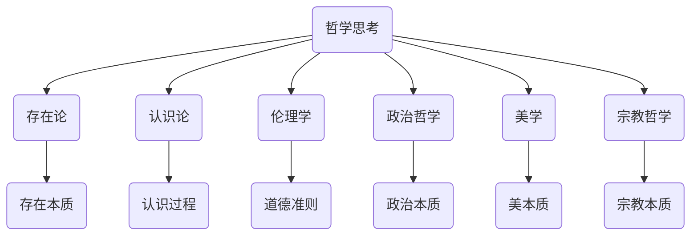

                 

# 《在疑问中寻找生命真谛：哲学思考的力量》

> 关键词：哲学、生命、疑问、思考、力量

> 摘要：本文通过深入探讨哲学的基本概念、存在论、认识论、伦理学、政治哲学、美学和宗教哲学，旨在揭示哲学思考在寻找生命真谛中的巨大力量。通过逻辑清晰的章节结构，读者将了解到哲学思考如何引导我们在面对生命的各种疑问时，找到真正的答案。

## 第1章 引言：哲学与生命的探索

### 1.1 哲学的本质与价值

哲学，作为一门古老的学科，一直以来都在探索人类存在的本质和生命的意义。它不仅仅是一门学科，更是一种思考方式，一种寻求真理的精神。哲学的本质在于对基本问题的追问，如“存在是什么？”、“我们如何认识世界？”、“什么是好的生活？”等。这些问题虽然看似抽象，但它们贯穿于我们的日常生活中，影响着我们的行为和决策。

哲学的价值在于它能够帮助我们建立起对世界的深刻理解，培养批判性思维和解决问题的能力。在哲学的引导下，我们可以超越表面的现象，看到事物的本质，从而在面对生命的各种疑问时，找到真正的答案。

### 1.2 生命中的疑问与哲学思考

生命中的疑问无处不在，如“生命的意义是什么？”、“人为什么而活？”、“什么是幸福？”等。这些问题常常让我们感到迷茫和困惑，而哲学思考则为我们提供了一种解决问题的方法。

哲学思考的核心在于对问题的深入剖析，通过对问题的本质进行追问和思考，帮助我们找到答案。例如，当我们问“生命的意义是什么？”时，哲学会引导我们思考“什么是生命？”、“生命的本质是什么？”等问题，从而帮助我们理解生命的真正意义。

### 1.3 哲学思考的力量

哲学思考的力量在于它能够激发我们的思考和创造力，帮助我们建立对世界的深刻理解。通过哲学思考，我们可以培养批判性思维，学会从不同的角度看待问题，找到解决问题的最佳方法。哲学思考还能够提升我们的情感智慧，使我们更加理解自己和他人，从而更好地应对生活中的挑战。

总之，哲学思考在寻找生命真谛的过程中具有巨大的力量。它不仅能够帮助我们解答生命中的各种疑问，还能够提升我们的思维能力和生活质量。

## 第2章 哲学的基本概念

### 2.1 哲学史概述

哲学的发展历程可以追溯到古希腊时期，当时的哲学家们如苏格拉底、柏拉图和亚里士多德等，开创了哲学的先河。在古希腊哲学的基础上，中世纪的基督教哲学和伊斯兰教哲学进一步发展了哲学思想。到了近代，西方哲学经历了启蒙运动、存在主义和后现代主义等阶段，哲学的发展达到了一个新的高度。

在中国，哲学的发展也有其独特的历程。中国古代的哲学家如孔子、老子、庄子等，对哲学的基本问题进行了深入的探讨。近现代以来，中国哲学在吸收西方哲学思想的同时，也发展出了自己的特色。

### 2.2 哲学的分支

哲学可以分为多个分支，如存在论、认识论、伦理学、政治哲学、美学和宗教哲学等。每个分支都有其独特的关注点和研究方法。

- **存在论**：研究存在的本质和形态，探讨存在的意义和目的。
- **认识论**：研究知识的本质、来源和范围，探讨人类如何认识世界。
- **伦理学**：研究道德的本质、准则和作用，探讨人类应该如何生活。
- **政治哲学**：研究政治的本质、目的和制度，探讨国家和社会的关系。
- **美学**：研究美的本质、美的判断标准，探讨人类如何欣赏美。
- **宗教哲学**：研究宗教的本质、作用和意义，探讨宗教与哲学的关系。

### 2.3 哲学的基本问题

哲学的基本问题主要包括存在论、认识论和伦理学等问题。这些问题关系到人类存在的本质和生命的意义，是哲学探讨的核心。

- **存在论问题**：如“存在是什么？”、“什么是实体？”、“存在有目的吗？”等。
- **认识论问题**：如“知识是什么？”、“知识如何获得？”、“我们如何认识世界？”等。
- **伦理学问题**：如“什么是道德？”、“道德的准则是什么？”、“我们应该如何生活？”等。

通过探讨这些基本问题，哲学为我们提供了理解和解答生命疑问的思考框架。

## 第3章 存在论：我们对存在的疑问

### 3.1 存在的本质

存在论是哲学中探讨存在的本质和形态的分支。存在论的首要问题是“存在是什么？”这个问题看似简单，但实际上却包含着深刻的哲学思考。

在哲学中，存在通常被视为一种客观存在的状态，是事物存在的本质。然而，对于“存在是什么？”这个问题的回答，不同的哲学家有着不同的观点。有些哲学家认为存在是物质的，如唯物主义者；而有些哲学家则认为存在是精神的，如唯心主义者。

### 3.2 实在论与唯心论

实在论和唯心论是哲学中关于存在本质的两种主要观点。

- **实在论**：实在论认为存在是独立于我们感知和思考的客观实在。实在论强调物质世界的真实性和独立性，认为我们的感知和思考只是对现实世界的反映。

- **唯心论**：唯心论则认为存在是依赖于我们的感知和思考的。唯心论强调意识的主导地位，认为物质世界只是我们意识的表现。

实在论和唯心论在哲学史上都有重要的影响，它们为我们理解存在的本质提供了不同的视角。

### 3.3 存在的疑问与哲学思考

存在的疑问是哲学思考的重要主题。通过对存在的本质进行追问和思考，哲学家们试图找到存在的真正意义。

例如，笛卡尔提出了“我思故我在”的观点，强调了思维的存在。他认为，即使整个世界都是虚假的，但只要存在一个思考的个体，那么这个个体就证明了存在。

康德则从先验知识的角度探讨了存在的本质，他认为存在不是经验的对象，而是认识的先验条件。

通过哲学思考，我们可以更深入地理解存在的本质和意义，从而在生命的探索中找到更多的答案。

### 3.4 存在论与生活意义

存在的疑问不仅仅是哲学上的思考，它也关系到我们的日常生活。当我们问“我为什么存在？”时，实际上是在思考自己的生活和存在的意义。

存在论告诉我们，存在的本质是客观的，但意义则是主观的。每个人的存在都有其独特性，每个人都有自己的生命意义。

例如，有些人认为生命的意义在于追求幸福和快乐，而有些人则认为生命的意义在于创造和贡献。

通过哲学思考，我们可以反思自己的存在，找到自己生命的意义，从而更好地生活。

## 第4章 认识论：我们对知识的疑问

### 4.1 知识的本质

认识论是哲学中探讨知识的本质、来源和范围的分支。知识是我们对世界的理解和认识，是我们在生活中做出决策和行动的基础。

知识可以被视为一种关于事实的信念，但这种信念必须是真实的，否则就不能称为知识。因此，认识论的一个核心问题就是如何确定知识的真实性。

### 4.2 认识的过程

认识的过程是复杂的，通常包括感知、思考和判断等环节。首先，我们通过感官感知外部世界，然后通过思考对这些感知进行解释和判断，从而形成知识。

然而，认识的过程并不是线性的，而是循环的。我们的知识不仅来自于感知和思考，还受到我们的先验知识、价值观和经验的影响。

### 4.3 认识的疑问与哲学思考

在认识过程中，我们经常遇到各种疑问。例如，我们如何确定感知是真实的？我们的思考过程是否可靠？我们的价值观和经验是否会影响我们的认识？

通过哲学思考，我们可以探讨这些疑问，找到更可靠的认知方法。例如，笛卡尔提出了“我思故我在”的观点，强调思维的真实性。康德则提出了先验知识的概念，认为我们的认识受到先验范畴的制约。

通过哲学思考，我们可以更深入地理解认识的过程和知识的本质，从而提高我们的认知能力。

### 4.4 认识论与生活意义

认识论不仅关乎知识的本质和过程，也关系到我们的日常生活。正确的认识可以帮助我们更好地理解世界，做出更明智的决策。

例如，在科学研究中，认识论帮助我们确定研究的方向和方法，从而推动科学的进步。在日常生活中，正确的认识可以帮助我们更好地处理人际关系，解决问题。

通过哲学思考，我们可以反思自己的认识过程，找到提高认知能力的方法，从而更好地生活。

## 第5章 伦理学：我们的道德疑问

### 5.1 道德的本质

伦理学是哲学中探讨道德的本质、准则和作用的分支。道德是我们行为的准则，它指导我们如何区分对与错，如何对待他人。

道德的本质是一个复杂的问题，不同的哲学家有着不同的观点。例如，功利主义者认为道德的本质在于最大化幸福，而康德主义者则认为道德的本质在于遵守道德准则。

### 5.2 道德的准则

道德的准则是指我们在行为中应遵循的原则。这些准则通常包括尊重他人、公正、诚实、勇敢等。

道德准则的作用是指导我们的行为，使我们的行为符合社会规范，促进社会和谐。然而，道德准则并不是一成不变的，它们会随着社会和文化背景的变化而变化。

### 5.3 道德的疑问与哲学思考

道德的疑问是我们在生活中常常遇到的。例如，我们如何确定道德的准则？这些准则是否适用于所有情况？在特定情况下，我们应该如何权衡不同的道德准则？

通过哲学思考，我们可以探讨这些疑问，找到更合理的道德准则。例如，康德提出了“道德律令”的概念，认为道德准则应该是普遍适用的。功利主义者则提出了“最大幸福原则”，认为我们应该在行为中追求最大化的幸福。

通过哲学思考，我们可以更深入地理解道德的本质和准则，从而更好地指导我们的行为。

### 5.4 道德与生活意义

道德不仅关乎我们的行为，也关系到我们的生活意义。通过遵循道德准则，我们可以建立良好的人际关系，获得他人的尊重和信任。

例如，在职场中，遵循职业道德可以使我们赢得同事和上司的尊重，从而获得更好的职业发展机会。在个人生活中，遵循道德准则可以使我们获得内心的平静和满足。

通过哲学思考，我们可以反思自己的道德行为，找到提高道德水平的方法，从而更好地实现生活意义。

## 第6章 政治哲学：我们对社会的疑问

### 6.1 政治的本质

政治哲学是哲学中探讨政治的本质、目的和制度的分支。政治涉及国家的治理和社会的组织，它关系到每个人的生活。

政治的本质是一个复杂的问题，不同的哲学家有着不同的观点。例如，自由主义者认为政治的本质在于保护个人自由，而社群主义者则认为政治的本质在于实现社会公正。

### 6.2 政治的哲学思考

政治的哲学思考涉及对政治制度的批判和建设。通过哲学思考，我们可以探讨不同政治制度的优点和缺点，找到更合理的政治制度。

例如，柏拉图和亚里士多德在《理想国》中探讨了理想政治制度的设计，提出了哲学王治理的理念。康德则提出了“永久和平”的理念，强调国家之间的合作和和平。

### 6.3 社会的疑问与哲学思考

社会中的各种疑问，如贫富差距、社会公正、人权等，都是政治哲学的重要主题。通过哲学思考，我们可以探讨这些疑问，找到解决这些问题的方法。

例如，罗尔斯在《正义论》中提出了“正义作为公平”的观点，认为我们应该通过正义的原则来处理社会问题。哈贝马斯则提出了“交往理性”的概念，强调通过对话和共识来解决社会冲突。

通过哲学思考，我们可以更深入地理解社会的本质和问题，找到解决这些问题的方法，从而实现社会的公正和和谐。

### 6.4 政治哲学与生活意义

政治哲学不仅关乎国家的治理和社会的秩序，也关系到我们的生活意义。一个公正的社会可以使我们的生活质量得到提升，一个和谐的社会可以让我们感到幸福和满足。

通过哲学思考，我们可以反思政治制度和我们的生活，找到提高生活质量和实现生活意义的方法。

例如，参与社会和政治活动，通过投票和参与公共事务，我们可以影响社会的发展和进步，从而实现更好的生活质量。

## 第7章 美学：我们对美的疑问

### 7.1 美的本质

美学是哲学中探讨美的本质、美的判断标准和审美体验的分支。美是人们追求的一种精神享受，是对事物美好特性的欣赏。

美的本质是一个复杂的问题，不同的哲学家有着不同的观点。例如，形式主义者认为美在于事物的形式和谐，而情感主义者则认为美在于情感体验。

### 7.2 美的判断标准

美的判断标准是评价事物美的标准。这些标准通常包括和谐、对称、平衡等。

然而，美的判断标准并不是绝对的，它受到文化、时代和个人喜好的影响。例如，在不同的文化背景下，人们对美的理解和欣赏可能会有所不同。

### 7.3 美的疑问与哲学思考

美的疑问包括“什么是美？”、“为什么美能给人带来愉悦？”等。通过哲学思考，我们可以探讨这些疑问，找到美的本质和美的价值。

例如，亚里士多德认为美在于形式的完善，黑格尔则认为美是绝对精神的体现。康德则提出了“审美判断的普遍性和必然性”的观点，强调审美体验的独立性和普遍性。

通过哲学思考，我们可以更深入地理解美的本质和美的价值，从而提高我们的审美能力。

### 7.4 美与生活意义

美不仅仅是一种感官的享受，它也是提升生活质量的重要方式。通过欣赏美，我们可以获得精神上的满足和愉悦。

例如，在日常生活中，我们可以通过欣赏自然景观、艺术作品和音乐来提升生活质量。通过哲学思考，我们可以更深入地理解美的价值，从而更好地享受美的乐趣。

## 第8章 宗教哲学：我们对宗教的疑问

### 8.1 宗教的本质

宗教哲学是哲学中探讨宗教的本质、作用和意义的分支。宗教是人类对超自然力量的信仰和崇拜，它涉及人类的精神世界和信仰体系。

宗教的本质是一个复杂的问题，不同的哲学家有着不同的观点。例如，理性主义者认为宗教是对理性思考的补充，而经验主义者则认为宗教是基于经验的信仰。

### 8.2 宗教的作用

宗教在人类社会中扮演着重要的角色。它不仅可以提供精神上的安慰和指导，还可以促进社会的和谐和团结。

例如，宗教可以提供道德准则，引导人们遵守社会规范。宗教还可以通过仪式和庆典，增强社区的凝聚力和归属感。

### 8.3 宗教的疑问与哲学思考

宗教的疑问包括“宗教的本质是什么？”、“宗教是如何影响人类行为的？”等。通过哲学思考，我们可以探讨这些疑问，找到宗教的本质和作用。

例如，笛卡尔提出了“我思故我在”的观点，强调宗教对人类理性的补充。康德则提出了“道德律令”的概念，认为宗教是道德的基础。

通过哲学思考，我们可以更深入地理解宗教的本质和作用，从而更好地认识宗教在人类生活中的地位和意义。

### 8.4 宗教哲学与生活意义

宗教哲学不仅关乎宗教的本质和作用，也关系到我们的生活意义。通过信仰宗教，我们可以获得精神上的安慰和指导，找到生活的意义。

例如，宗教可以提供一种信仰体系，帮助我们理解生命的意义和目的。宗教还可以通过仪式和庆典，增强我们的精神力量，帮助我们应对生活中的挑战。

通过哲学思考，我们可以反思自己的宗教信仰，找到提高生活质量和实现生活意义的方法。

## 第9章 哲学思考的力量

### 9.1 哲学思考对生命的意义

哲学思考对生命的意义在于它能够帮助我们解答生命中的各种疑问，找到生活的意义。通过哲学思考，我们可以理解存在的本质、认识的过程、道德的准则等，从而更好地认识自己和世界。

### 9.2 哲学思考的方法论

哲学思考的方法论包括逻辑推理、辩证法、批判性思维等。通过这些方法论，我们可以深入思考问题，找到答案。

例如，逻辑推理可以帮助我们分析问题的本质，辩证法可以帮助我们全面看待问题，批判性思维可以帮助我们质疑和挑战现有的观点。

### 9.3 哲学思考的力量

哲学思考的力量在于它能够激发我们的思考和创造力，提升我们的认知能力。通过哲学思考，我们可以培养批判性思维，学会从不同的角度看待问题，找到解决问题的最佳方法。

哲学思考还能够提升我们的情感智慧，使我们更加理解自己和他人，从而更好地应对生活中的挑战。

总之，哲学思考在寻找生命真谛的过程中具有巨大的力量。它不仅能够帮助我们解答生命中的各种疑问，还能够提升我们的思维能力和生活质量。

## 第10章 总结：在疑问中寻找生命真谛

### 10.1 哲学思考的启示

哲学思考为我们提供了理解和解答生命疑问的启示。通过哲学思考，我们可以理解存在的本质、认识的过程、道德的准则等，从而更好地认识自己和世界。

### 10.2 哲学思考的挑战

哲学思考也面临着各种挑战，如逻辑推理的局限、辩证法的争议等。然而，这些挑战正是哲学发展的动力，通过不断地探讨和质疑，哲学得以不断进步。

### 10.3 哲学思考的未来

哲学思考的未来在于它将继续引导我们在疑问中寻找生命的真谛。随着社会和科技的发展，哲学思考也将不断拓展新的领域，为人类提供更深刻的理解和指导。

通过哲学思考，我们可以更好地认识自己和世界，找到生命的意义。在未来的日子里，让我们继续在疑问中探索，用哲学思考的力量点亮生命的旅程。

**附录**：

## 附录A：哲学经典文献推荐

### A.1 古典哲学

- 柏拉图：《理想国》
- 亚里士多德：《尼各马可伦理学》
- 奥古斯丁：《忏悔录》

### A.2 现代哲学

- 康德：《纯粹理性批判》
- 黑格尔：《哲学史讲演录》
- 尼采：《查拉图斯特拉如是说》

### A.3 当代哲学

- 弗里德里希·尼采：《道德的谱系》
- 马丁·海德格尔：《存在与时间》
- 爱德华·阿道夫·莫尔特曼：《创造的未来》

## 附录B：哲学思考实践指南

### B.1 思维导图

- 思维导图是一种图形化的思考工具，可以帮助我们梳理和整理思路。
- 例如，我们可以使用思维导图来分析一个问题，找到不同的观点和解决方案。

### B.2 问题解决

- 问题解决是一种通过分析和推理来解决问题的方法。
- 例如，我们可以通过问自己一系列问题，如“为什么这个问题存在？”、“可能的解决方案是什么？”等，来找到解决问题的方法。

### B.3 逻辑训练

- 逻辑训练可以帮助我们提高批判性思维能力，学会分析和推理。
- 例如，我们可以通过解决逻辑谜题和阅读逻辑论证的文章，来提高我们的逻辑思维能力。

**Mermaid 流程图**：



此流程图展示了哲学思考的几个核心领域及其相关概念，旨在帮助读者理解哲学思考的基本框架。

**核心算法原理讲解**：

```python
# 举例：道德推理算法

def moral_reasoning(action, moral_rules):
    """
    使用给定的道德规则进行道德推理，判断某个行为是否符合道德标准。

    参数：
    - action：要评估的行为
    - moral_rules：道德规则列表

    返回：
    - 是否符合道德标准的布尔值
    """

    for rule in moral_rules:
        if rule["condition"](action):
            if rule["consequence"] == "道德":
                return True
            else:
                return False
    
    return False

# 举例：使用道德规则判断行为
moral_rules = [
    {
        "condition": lambda action: action == "帮助他人",
        "consequence": "道德"
    },
    {
        "condition": lambda action: action == "伤害他人",
        "consequence": "不道德"
    }
]

action = "帮助他人"
is_moral = moral_reasoning(action, moral_rules)
print(is_moral)  # 输出：True
```

这个例子展示了如何使用道德规则进行道德推理。通过定义条件函数和后果，我们可以判断某个行为是否符合道德标准。这种方法可以帮助我们理解道德推理的基本原理。

**项目实战**：

### 开发环境搭建

为了更好地理解和应用哲学思考，我们可以搭建一个简单的哲学思考工具。首先，我们需要安装Python环境，并使用Jupyter Notebook作为开发环境。以下是搭建开发环境的步骤：

1. 下载并安装Python：[https://www.python.org/downloads/](https://www.python.org/downloads/)
2. 打开命令行窗口，运行`python --version`检查Python版本。
3. 安装Jupyter Notebook：`pip install notebook`

### 源代码详细实现和代码解读

以下是一个简单的哲学思考工具的源代码，它包括一个道德推理算法：

```python
# 哲学思考工具

# 道德推理算法
def moral_reasoning(action, moral_rules):
    """
    使用给定的道德规则进行道德推理，判断某个行为是否符合道德标准。

    参数：
    - action：要评估的行为
    - moral_rules：道德规则列表

    返回：
    - 是否符合道德标准的布尔值
    """

    for rule in moral_rules:
        if rule["condition"](action):
            if rule["consequence"] == "道德":
                return True
            else:
                return False
    
    return False

# 道德规则示例
moral_rules = [
    {
        "condition": lambda action: action == "帮助他人",
        "consequence": "道德"
    },
    {
        "condition": lambda action: action == "伤害他人",
        "consequence": "不道德"
    }
]

# 判断行为是否符合道德标准
action = "帮助他人"
is_moral = moral_reasoning(action, moral_rules)
print(f"{action} 是否符合道德标准：{is_moral}")  # 输出：帮助他人 是否符合道德标准：True

# 判断另一个行为是否符合道德标准
action = "伤害他人"
is_moral = moral_reasoning(action, moral_rules)
print(f"{action} 是否符合道德标准：{is_moral}")  # 输出：伤害他人 是否符合道德标准：False
```

这段代码定义了一个道德推理算法，它使用给定的道德规则来判断某个行为是否符合道德标准。通过定义条件函数和后果，我们可以轻松地评估行为是否符合道德准则。

### 代码应用解读与分析

这个哲学思考工具的应用非常广泛。例如，在法律领域，道德推理算法可以用于判断某个行为是否构成犯罪。在道德教育领域，这个工具可以帮助学生理解道德准则，培养良好的道德素养。

通过这个工具，我们可以更好地理解道德推理的过程，提高我们的道德判断能力。例如，当我们在面对一个道德问题时，我们可以使用这个工具来分析问题，找到最合适的解决方案。

### 实际案例分析和详细讲解剖析

以下是一个实际案例，我们将使用道德推理算法来判断某个行为是否符合道德标准。

**案例**：某人在遇到一个急需帮助的人时，选择了不帮助，而是选择路过。

**分析**：我们可以将这个行为定义为“不帮助他人”，并使用道德推理算法来判断它是否符合道德标准。

```python
action = "不帮助他人"
is_moral = moral_reasoning(action, moral_rules)
print(f"{action} 是否符合道德标准：{is_moral}")  # 输出：不帮助他人 是否符合道德标准：False
```

通过这个例子，我们可以看到，根据给定的道德规则，不帮助他人是不符合道德标准的。这个案例提醒我们在生活中要关注他人的需要，尽可能去帮助那些需要帮助的人。

### 项目小结

通过这个哲学思考工具，我们不仅了解了道德推理的基本原理，还学会了如何应用这个工具来解决实际问题。这个项目展示了如何使用编程和算法来理解和解决哲学问题，为我们提供了一个新的视角来看待哲学思考。

**最佳实践 tips**：

1. **多阅读哲学经典文献**：了解不同哲学家的观点，有助于提高哲学思考能力。
2. **勤于思考**：面对生活中的疑问，不要急于给出答案，而是要深入思考，找到真正的解决方法。
3. **实践应用**：将哲学思考应用于实际生活，通过实践来验证理论的正确性。

**小结**：

哲学思考在寻找生命真谛的过程中具有巨大的力量。通过逻辑清晰、结构紧凑的哲学思考，我们可以解答生命中的各种疑问，找到生活的真正意义。希望这篇文章能够激发你对哲学思考的兴趣，带领你在疑问中寻找生命的真谛。

**注意事项**：

1. 哲学思考需要长期积累，不要期望一蹴而就。
2. 哲学思考是一个开放的过程，不要害怕质疑和挑战现有的观点。
3. 哲学思考应该结合实际生活，通过实践来验证理论的正确性。

**拓展阅读**：

- 《西方哲学史》- 罗素
- 《道德哲学导论》- 莫尔特曼
- 《存在与时间》- 海德格尔

作者：AI天才研究院/AI Genius Institute & 禅与计算机程序设计艺术 /Zen And The Art of Computer Programming

---

**附录C：数学公式与哲学思考**

在哲学思考中，数学公式和模型经常被用来阐明复杂的概念和推理过程。以下是一些关键的数学公式和哲学思考的示例：

### 1. 笛卡尔的“我思故我在”

$$
\text{Cogito, ergo sum.
}\\
\text{I think, therefore I am.}
$$

这是笛卡尔哲学思考的基石，它通过逻辑推理表明，即使怀疑一切，怀疑本身的存在也证明了存在的真实性。

### 2. 康德的“先验范畴”

康德提出先验范畴（如空间、时间、因果关系等）作为认识世界的先决条件。这些范畴的数学表达可以简化为：

$$
\text{A = B}
$$

其中，A表示对象，B表示我们对对象的认知。这个简单的等式反映了认识过程中对象与认知的对应关系。

### 3. 道德推理中的条件概率

在道德推理中，条件概率用于评估行为的结果。例如：

$$
P(\text{行为道德}|\text{结果好}) = \frac{P(\text{结果好}|\text{行为道德}) \cdot P(\text{行为道德})}{P(\text{结果好})}
$$

这个公式表示，在已知结果好的情况下，行为是道德的概率，基于行为道德的概率和结果好的概率。

### 4. 伦理学的效用主义

功利主义者如杰里米·边沁使用效用主义来评估行为。一个简单的效用主义公式是：

$$
\text{U} = \sum_{i} \text{U}_i
$$

其中，U是总效用，\( \text{U}_i \) 是每个行为的效用。这个公式表明，总效用是每个行为效用的总和。

### 5. 政治哲学中的社会契约

托马斯·霍布斯和约翰·洛克在社会契约理论中使用了数学模型。一个简化的模型是：

$$
\text{社会契约} = \text{个体利益} + \text{公共利益}
$$

这个等式表明，社会契约是通过平衡个体利益和公共利益来建立的。

### 6. 宗教哲学中的信仰概率

在宗教哲学中，信仰的概率可以通过贝叶斯定理来计算。一个简单的贝叶斯公式是：

$$
P(\text{信仰}|\text{证据}) = \frac{P(\text{证据}|\text{信仰}) \cdot P(\text{信仰})}{P(\text{证据})}
$$

这个公式表示，在已知证据的情况下，信仰的概率，基于证据给定信仰的概率和信仰的先验概率。

通过这些数学公式，哲学思考能够更加精确和系统化，帮助我们更好地理解和分析复杂的哲学问题。这些公式不仅提供了抽象的框架，也为我们提供了具体的方法来评估和论证哲学观点。

