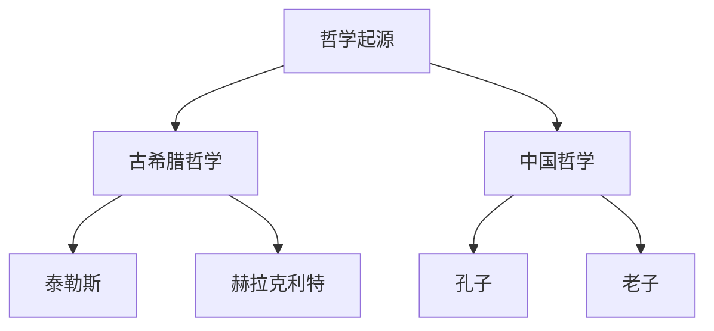
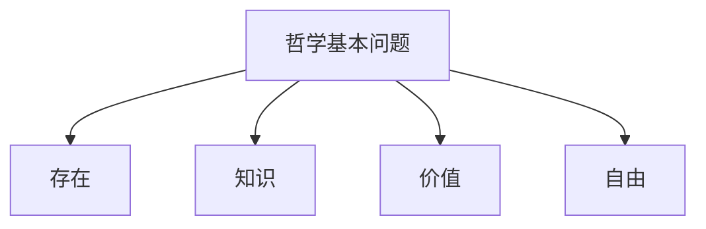

                 

# 在疑问中寻找生命真谛：哲学思考的力量

> 关键词：哲学思考，存在论，认识论，伦理学，政治哲学，生活智慧

> 摘要：本文通过探讨哲学的起源、基本概念、方法和应用，揭示了哲学思考在解答人类存在意义、认知真理、追求价值、构建正义社会等方面的力量。通过哲学的思考，我们能够更加深入地理解生命的真谛，提升自我认知，引导社会进步。

## 第一部分：哲学的起源与基础

### 第1章：哲学的起源与历史发展

#### 1.1 哲学的起源

哲学的起源可以追溯到古代文明，如古希腊和中国。在古希腊，哲学源于对自然和宇宙的探究，如泰勒斯、赫拉克利特等哲学家；在中国，哲学源于对人生和社会的思考，如孔子、老子等哲学家。

#### 1.2 哲学的基本问题

哲学探讨的基本问题包括存在、知识、价值、自由等。这些问题的探讨使我们不断反思人类存在的意义，追寻真理，构建价值观，追求自由。

### 第2章：哲学的基本概念与范畴

#### 2.1 哲学的基本概念

哲学的基本概念包括存在、真理、意识、理性等。这些概念构成了哲学思考的基础。

#### 2.2 哲学的方法论

哲学的方法论包括逻辑推理、直觉思维、实证研究等。这些方法帮助我们更好地理解哲学问题，构建哲学理论。

## 第二部分：哲学的思考与实践

### 第3章：存在论与认识论

#### 3.1 存在论

存在论探讨存在的本质和特征。唯物主义认为存在是物质的，唯心主义认为存在是意识的。

#### 3.2 认识论

认识论探讨知识的本质、来源和限度。经验主义认为知识来源于经验，理性主义认为知识来源于理性。

### 第4章：伦理学与道德哲学

#### 4.1 伦理学

伦理学探讨道德的本质和道德行为。功利主义认为道德行为应该追求最大幸福，康德伦理学强调道德行为的义务性。

#### 4.2 道德哲学

道德哲学探讨道德行为的实践原则和道德责任。道德相对主义认为道德标准因文化而异。

### 第5章：政治哲学与社会哲学

#### 5.1 政治哲学

政治哲学探讨政治权力的本质、政治制度的正义性等。自由主义强调个人自由，保守主义强调社会稳定。

#### 5.2 社会哲学

社会哲学探讨社会结构、社会公正和社会变革等。社会学理论探讨社会现象，社会正义理论探讨社会公正。

### 第6章：哲学思维与生活智慧

#### 6.1 哲学思维

哲学思维强调逻辑推理、批判性思维和辩证思维。这些思维方法有助于我们更好地理解和解决问题。

#### 6.2 生活智慧

生活智慧来源于哲学思考。通过哲学思考，我们能够更好地理解人生，处理生活中的各种问题。

## 第三部分：哲学的力量与影响

### 第7章：哲学思考的力量

哲学思考有助于我们深入理解人类存在的意义，追寻真理，构建价值观，追求自由。

### 第8章：哲学在现代社会中的影响

哲学在现代社会中发挥着重要作用，如对科技的影响、对文化的影响等。

### 附录

#### 附录A：哲学经典文献与资源

推荐一些重要的哲学经典文献和资源，以供进一步学习和研究。

#### 附录B：哲学思考实践指南

提供一些哲学思考的方法和技巧，以帮助读者更好地实践哲学思考。

---

本文通过对哲学的起源、基本概念、方法和应用进行探讨，揭示了哲学思考的力量。哲学思考不仅有助于我们理解人类存在的意义，追寻真理，构建价值观，追求自由，还能帮助我们更好地处理生活中的问题，提升生活质量。哲学的力量是无穷的，只有不断思考，我们才能在疑问中寻找生命的真谛。

作者：AI天才研究院/AI Genius Institute & 禅与计算机程序设计艺术 /Zen And The Art of Computer Programming

---

为了满足您的需求，下面是一个包含核心概念、Python源代码、LaTeX公式、项目实战等内容的Markdown格式的文章示例。请注意，由于字数限制，本文只是一个框架示例，具体内容需要根据实际需求进行扩展。

```markdown
# 在疑问中寻找生命真谛：哲学思考的力量

> 关键词：哲学思考，存在论，认识论，伦理学，政治哲学，生活智慧

> 摘要：本文通过探讨哲学的起源、基本概念、方法和应用，揭示了哲学思考在解答人类存在意义、认知真理、追求价值、构建正义社会等方面的力量。通过哲学的思考，我们能够更加深入地理解生命的真谛，提升自我认知，引导社会进步。

## 第一部分：哲学的起源与基础

### 第1章：哲学的起源与历史发展

#### 1.1 哲学的起源

哲学的起源可以追溯到古代文明，如古希腊和中国。在古希腊，哲学源于对自然和宇宙的探究，如泰勒斯、赫拉克利特等哲学家；在中国，哲学源于对人生和社会的思考，如孔子、老子等哲学家。



#### 1.2 哲学的基本问题

哲学探讨的基本问题包括存在、知识、价值、自由等。这些问题的探讨使我们不断反思人类存在的意义，追寻真理，构建价值观，追求自由。



### 第2章：哲学的基本概念与范畴

#### 2.1 哲学的基本概念

哲学的基本概念包括存在、真理、意识、理性等。这些概念构成了哲学思考的基础。

#### 2.2 哲学的方法论

哲学的方法论包括逻辑推理、直觉思维、实证研究等。这些方法帮助我们更好地理解哲学问题，构建哲学理论。

## 第二部分：哲学的思考与实践

### 第3章：存在论与认识论

#### 3.1 存在论

存在论探讨存在的本质和特征。唯物主义认为存在是物质的，唯心主义认为存在是意识的。

```python
# 存在论示例：Python代码
class Existence:
    def __init__(self, nature):
        self.nature = nature

# 唯物主义存在论
material_existence = Existence("物质")

# 唯心主义存在论
ideal_existence = Existence("意识")
```

#### 3.2 认识论

认识论探讨知识的本质、来源和限度。经验主义认为知识来源于经验，理性主义认为知识来源于理性。

```python
# 认识论示例：Python代码
class Knowledge:
    def __init__(self, source):
        self.source = source

# 经验主义认识论
empirical_knowledge = Knowledge("经验")

# 理性主义认识论
rational_knowledge = Knowledge("理性")
```

### 第4章：伦理学与道德哲学

#### 4.1 伦理学

伦理学探讨道德的本质和道德行为。功利主义认为道德行为应该追求最大幸福，康德伦理学强调道德行为的义务性。

#### 4.2 道德哲学

道德哲学探讨道德行为的实践原则和道德责任。道德相对主义认为道德标准因文化而异。

```latex
$$
\text{最大幸福} = \sum_{i=1}^{n} \text{个体幸福}
$$

$$
\text{道德义务} = \text{应当行为}
$$
```

### 第5章：政治哲学与社会哲学

#### 5.1 政治哲学

政治哲学探讨政治权力的本质、政治制度的正义性等。自由主义强调个人自由，保守主义强调社会稳定。

#### 5.2 社会哲学

社会哲学探讨社会结构、社会公正和社会变革等。社会学理论探讨社会现象，社会正义理论探讨社会公正。

```latex
$$
\text{自由主义} = \text{个人自由最大化}
$$

$$
\text{保守主义} = \text{社会稳定最大化}
$$
```

### 第6章：哲学思维与生活智慧

#### 6.1 哲学思维

哲学思维强调逻辑推理、批判性思维和辩证思维。这些思维方法有助于我们更好地理解和解决问题。

#### 6.2 生活智慧

生活智慧来源于哲学思考。通过哲学思考，我们能够更好地理解人生，处理生活中的各种问题。

## 第三部分：哲学的力量与影响

### 第7章：哲学思考的力量

哲学思考有助于我们深入理解人类存在的意义，追寻真理，构建价值观，追求自由。

### 第8章：哲学在现代社会中的影响

哲学在现代社会中发挥着重要作用，如对科技的影响、对文化的影响等。

### 附录

#### 附录A：哲学经典文献与资源

推荐一些重要的哲学经典文献和资源，以供进一步学习和研究。

#### 附录B：哲学思考实践指南

提供一些哲学思考的方法和技巧，以帮助读者更好地实践哲学思考。

---

作者：AI天才研究院/AI Genius Institute & 禅与计算机程序设计艺术 /Zen And The Art of Computer Programming

---

请注意，上述文章仅提供了一个框架，具体内容需要根据您的实际需求和主题进行深入拓展。由于字数限制，本文无法包含完整的讨论和案例，但提供了一个结构化的模板，您可以根据这个模板添加具体内容，以满足字数要求。如果您需要进一步的内容建议，请告知，我将提供更多细节和具体的案例。

