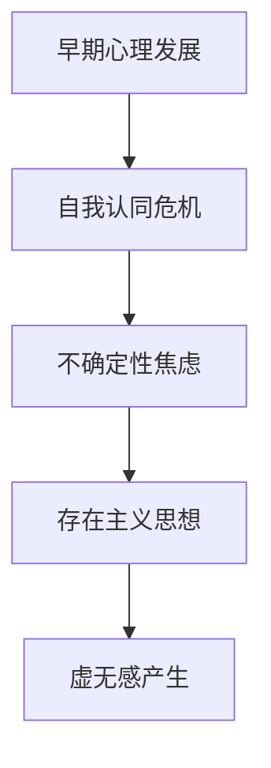
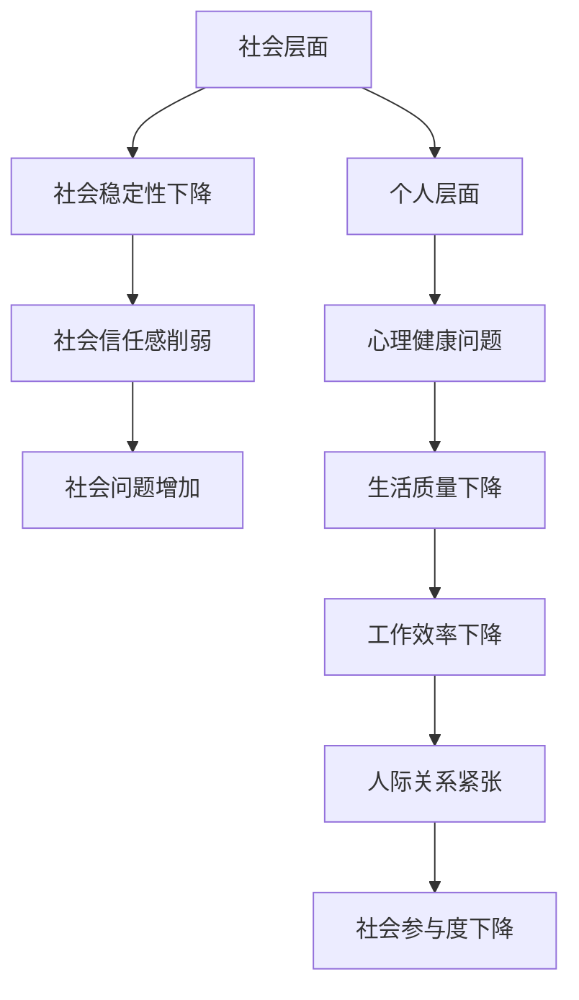
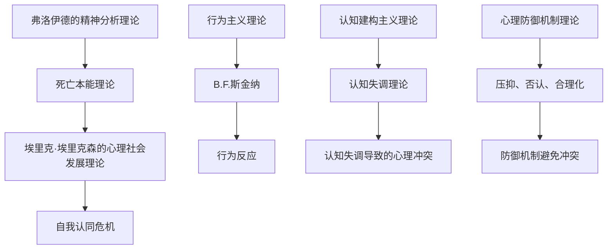
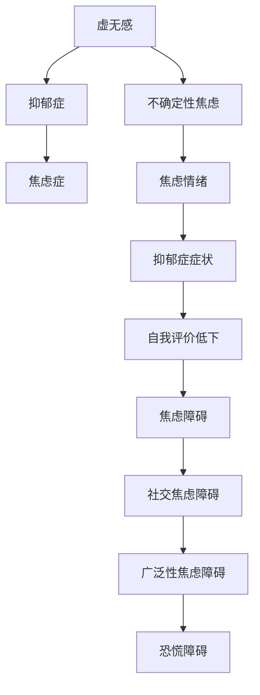
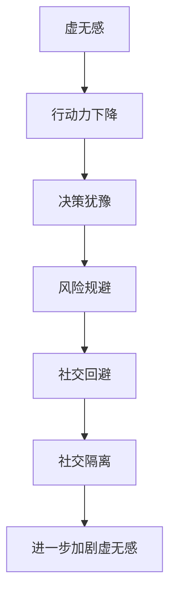
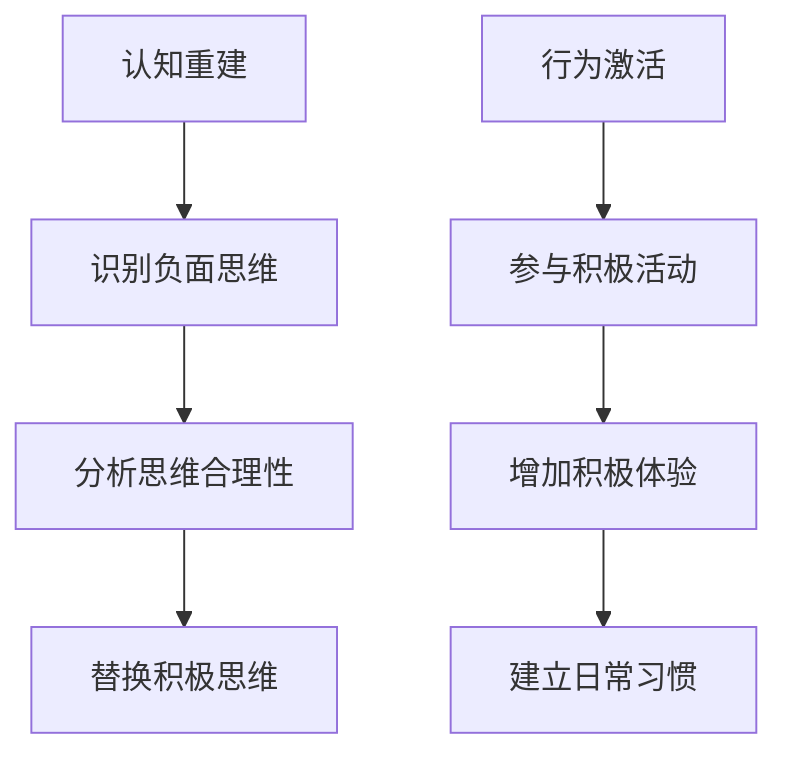
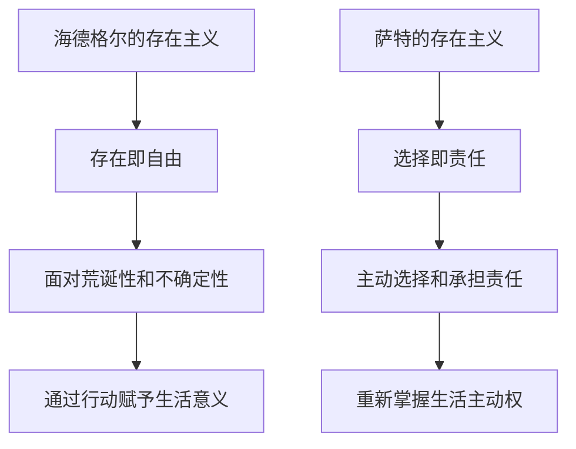
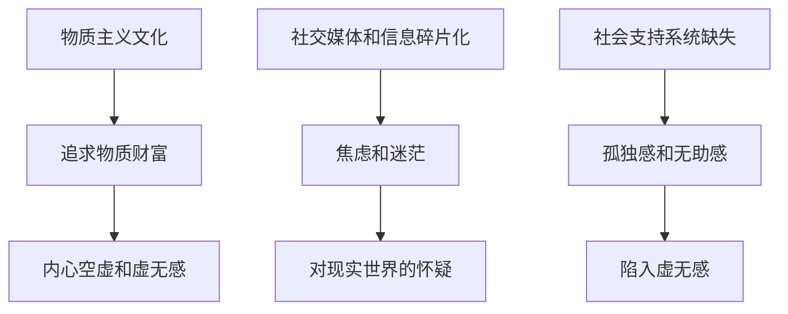
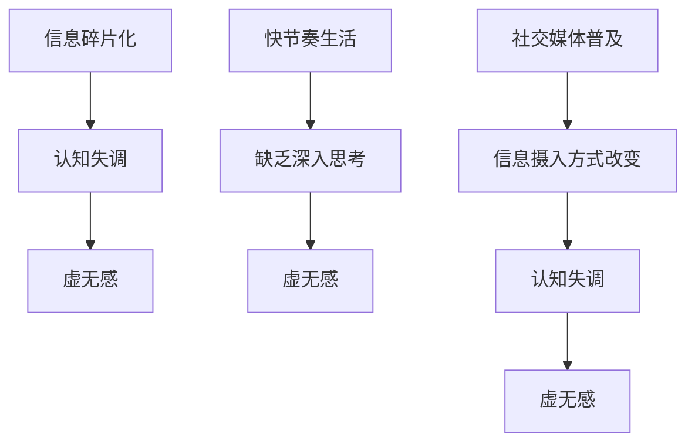
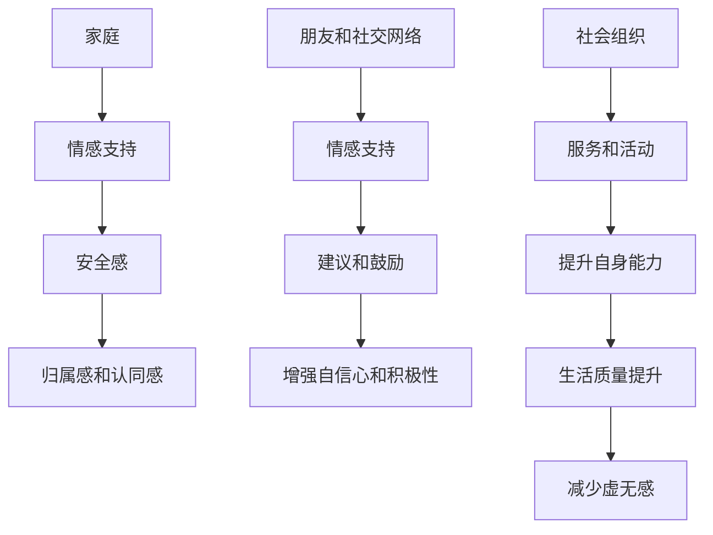

                 

### 背景介绍

在现代社会，我们被无数的信息碎片包围。智能手机、社交媒体、24小时新闻循环，以及无处不在的互联网，让我们的生活充满了瞬时即逝的片段。这种信息碎片化不仅改变了我们的消费方式，也对我们的心理状态产生了深远的影响。越来越多的人感到焦虑、不安，甚至出现了严重的虚无感。

虚无感是一种深刻的内心体验，它表现为对存在意义的质疑和对生活价值的怀疑。这种感觉往往源于我们对自我和世界的理解陷入困境。现代生活的快节奏和高度竞争，让我们很难有时间和空间去深入思考存在的本质。碎片化的信息让我们无法形成完整的世界观，而单一视角的过度消费又让我们陷入信息的泥淖，难以自拔。

本文旨在探讨虚无感的根源，揭示其对社会和个人的影响，并提供一系列有效的对抗策略。通过认知行为疗法、存在主义哲学、文化与社会因素等多角度的分析，我们将尝试找到在碎片化世界中寻找整体感的路径。此外，本文还将结合实际案例，分享对抗虚无感的个人成长与社区实践，为读者提供实用的指导。

### 核心概念与联系

要深入探讨虚无感的根源及其影响，我们首先需要明确一些核心概念，并了解它们之间的关系。

**虚无感（Nihilism）**：虚无感是一种对生活意义和价值的否定态度。它不仅仅是一种情感体验，更是一种哲学立场。虚无感的核心是存在的空虚感，这种感觉常常源于对自我认同的危机、不确定性焦虑以及存在主义思想。

**自我认同危机（Identity Crisis）**：自我认同危机是指个体在成长过程中，对自我身份和角色的认知产生混乱和不确定性。早期心理学理论，如埃里克·埃里克森（Erik Erikson）提出的心理社会发展理论，将自我认同危机视为青少年期的一个重要阶段。在这个阶段，个体需要通过探索不同的身份角色，最终形成稳定的自我认同。

**不确定性焦虑（Uncertainty Anxiety）**：不确定性焦虑是指个体在面对未来和未知时的焦虑情绪。这种焦虑源于对不确定性和风险的恐惧，常常导致个体在决策时犹豫不决，甚至逃避面对现实。

**存在主义思想（Existentialism）**：存在主义是20世纪哲学中的一个重要流派，它强调个体的自由、选择和责任。存在主义哲学的代表人物，如马丁·海德格尔（Martin Heidegger）和让-保罗·萨特（Jean-Paul Sartre），认为人的存在先于本质，个体必须通过自己的选择和行动来定义自己。

为了更好地理解这些概念之间的关系，我们可以使用Mermaid流程图来构建它们之间的联系：

在这个流程图中，我们可以看到，早期心理发展中的自我认同危机和不确定性焦虑是虚无感产生的两个重要前提。存在主义思想则是对这种虚无感的哲学反思，它帮助个体认识到自己的自由和选择能力，从而在某种程度上缓解虚无感。

### 虚无感对社会和个人影响的评估

虚无感不仅仅是一种个人体验，它对社会和个人产生了深远的影响。首先，从社会层面来看，虚无感可能导致社会稳定性的下降。当大量个体陷入虚无感时，他们对社会规范和价值观的认同感降低，可能导致社会信任感的削弱和人际关系的疏离。此外，虚无感还可能引发一系列社会问题，如犯罪率上升、自杀率增加以及社会参与度下降。

从个人层面来看，虚无感对心理健康和日常生活产生了显著的负面影响。研究表明，长期处于虚无感的个体更容易患上抑郁症、焦虑症等心理疾病。这些心理问题不仅影响了个体的生活质量，还可能导致工作效率下降、人际关系紧张等问题。具体而言，虚无感可能使个体在面对挑战和压力时感到无力和无助，从而影响他们的决策和行为。

为了更直观地理解虚无感对社会和个人的影响，我们可以使用以下Mermaid流程图来展示其传播路径和表现形式：

在这个流程图中，我们可以看到虚无感如何从个人层面扩散到社会层面，并导致一系列负面后果。为了进一步探讨虚无感的产生原因，我们需要深入分析心理学角度的根源。

### 虚无感产生的心理学原因

虚无感的产生与心理学领域中的多个理论有着紧密的联系。从早期心理学理论到现代心理学视角，不同的理论为我们提供了不同的解释。

首先，早期心理学理论，如弗洛伊德（Sigmund Freud）的精神分析理论和埃里克·埃里克森（Erik Erikson）的心理社会发展理论，为我们揭示了虚无感产生的潜在原因。弗洛伊德认为，虚无感源于个体潜意识中的冲突和压抑。特别是“死亡本能”理论，指出人类存在一种与生俱来的对死亡的渴望，这种渴望可能导致个体对存在的怀疑和虚无感。埃里克森则从心理社会发展的角度，将自我认同危机视为虚无感产生的一个重要阶段。他认为，个体在成长过程中需要经历多个心理社会阶段，如果这些阶段的发展不顺利，可能会导致自我认同的混乱和虚无感。

进入现代心理学视角，虚无感的产生得到了更加多元的解释。行为心理学派，如B.F.斯金纳（B.F. Skinner），通过行为主义理论，认为虚无感是一种后天习得的行为反应。斯金纳认为，个体的行为受到环境和外部刺激的影响，当个体在特定情境中体验到负面情绪时，可能会形成条件反射，从而产生虚无感。

认知心理学派则从认知加工的角度解释虚无感。其中，认知建构主义理论认为，虚无感源于个体对现实世界的认知失调。当个体的信念、价值观和实际经验之间存在不一致时，认知失调会导致内心的冲突和虚无感。代表性理论如认知失调理论（Cognitive Dissonance Theory），指出个体为了保持心理平衡，会调整自己的信念和行为，以减少认知失调带来的不适感。

此外，现代心理学还提出了心理防御机制理论，认为虚无感是个体在面临内心冲突时采取的一种防御手段。心理防御机制包括压抑、否认、合理化等，通过这些机制，个体试图避免面对现实的痛苦和焦虑。

为了更直观地理解这些心理学理论对虚无感产生的解释，我们可以使用以下Mermaid流程图来展示不同理论之间的关系：

通过这个流程图，我们可以看到虚无感产生的心理学原因是如何交织在一起的。每个理论都从不同的角度解释了虚无感的本质，为我们提供了全面理解这一现象的视角。

### 虚无感与抑郁症、焦虑症的联系

虚无感与抑郁症、焦虑症之间存在着密切的联系，这些心理问题常常相互交织，共同影响个体的心理健康。首先，虚无感作为一种对存在意义的深刻质疑，常常伴随着负面情绪，如绝望、无助和失落感。这些情绪如果长期存在，可能会导致抑郁症的发生。抑郁症是一种严重的心理疾病，其核心症状包括持续性的悲伤、兴趣丧失、疲劳感以及自我评价低下。研究表明，虚无感是抑郁症的一个重要风险因素，许多抑郁症患者报告中存在着强烈的虚无感。

焦虑症也是与虚无感密切相关的一种心理障碍。焦虑症的表现形式多样，包括广泛性焦虑障碍、社交焦虑障碍、恐慌障碍等。焦虑症患者常常体验到强烈的恐惧、紧张和不安，这些情绪体验与虚无感中的焦虑成分相似。虚无感中的不确定性焦虑，使得个体在面对未来的不确定性和潜在风险时，产生强烈的焦虑情绪。长期的不安和恐惧，可能导致焦虑症的加剧，形成恶性循环。

此外，虚无感、抑郁症和焦虑症之间还存在相互加剧的关系。例如，抑郁症患者由于情绪低落，可能会对生活失去兴趣，这种状态进一步加剧了虚无感。而虚无感的存在，又可能使个体更加焦虑和不安，从而加剧抑郁症和焦虑症的症状。研究表明，三种心理障碍常常共存于同一患者身上，形成复杂的心理疾病网络。

实证研究进一步支持了这种关联。一项针对大学生群体的研究发现，虚无感与抑郁症、焦虑症之间存在显著的正相关关系。虚无感得分较高的学生，其抑郁症和焦虑症的患病率也显著增加。另一项针对临床患者的纵向研究表明，早期出现的虚无感是未来抑郁症和焦虑症发生的强预测因子。

为了更直观地展示虚无感与抑郁症、焦虑症之间的联系，我们可以使用以下Mermaid流程图：

通过这个流程图，我们可以看到虚无感如何通过不确定性焦虑和焦虑情绪，影响抑郁症和焦虑症的发生和发展。理解这些联系对于制定有效的心理干预策略具有重要意义。

### 虚无感对个人行为和决策的影响

虚无感不仅影响个体的心理健康，还对他们的行为和决策产生了显著的负面影响。首先，虚无感可能导致个体的行动力下降。由于对生活意义的质疑，个体可能会感到无所适从，缺乏动力去追求目标或应对挑战。这种缺乏行动力的状态往往使个体陷入恶性循环，进一步加剧虚无感。

其次，虚无感会影响个体的决策过程。研究表明，处于虚无感的个体往往在决策时表现出犹豫不决和避免风险的行为。这种决策障碍可能源于对未来的不确定性和对失败的恐惧。虚无感使个体对任何可能的负面结果过于敏感，从而导致他们在决策时倾向于选择低风险但低回报的选项。

此外，虚无感还可能影响个体的社交行为。虚无感中的孤独感和被遗弃感，使个体对社交互动产生抵触情绪，减少参与社交活动的意愿。这种社交隔离进一步加剧了虚无感，形成恶性循环。

为了更直观地展示虚无感对个人行为和决策的影响，我们可以使用以下Mermaid流程图：

通过这个流程图，我们可以看到虚无感如何通过影响个体的行动力、决策过程和社交行为，形成一个自我强化的恶性循环。理解这些影响对于制定应对策略和改善个体生活质量具有重要意义。

### 认知行为疗法（CBT）在对抗虚无感中的应用

认知行为疗法（Cognitive Behavioral Therapy，简称CBT）是一种广泛用于治疗各种心理障碍的心理治疗方法，它通过改变负面思维模式和错误认知，帮助个体改善情绪和行为。在对抗虚无感方面，CBT同样展现出了显著的效果。

**认知重建**是CBT的核心原理之一。它旨在帮助个体识别和挑战那些导致负面情绪和行为模式的错误认知。例如，虚无感往往源于对存在意义的否定，个体可能认为自己的生活毫无价值或毫无意义。通过认知重建，治疗师会引导患者识别这些消极思维，并逐步替换为更加现实和积极的思维。例如，一个常见的认知重构过程可以是：首先，患者识别出“我的生活没有意义”这一消极思维；然后，治疗师帮助患者分析这种思维的合理性和证据；最后，引导患者替换为“虽然我现在的生活有困难，但通过努力，我可以找到生活的意义和价值”。

**行为激活**是CBT的另一个重要组成部分。它通过鼓励患者参与有益的活动，提高其积极体验，从而改善情绪。针对虚无感，行为激活的目标是帮助患者重新建立对生活的兴趣和动力。例如，治疗师可能会建议患者每天进行一项新的活动，如阅读、绘画、运动或与朋友聚会，以此来增加积极的情绪体验。随着时间的推移，这些活动可能会逐渐成为患者的日常习惯，从而改善他们的整体心理状态。

为了更直观地展示认知重建和行为激活在治疗虚无感中的应用，我们可以使用以下Mermaid流程图：

通过这个流程图，我们可以看到CBT如何通过认知重建和行为激活，帮助个体克服虚无感。具体案例将进一步说明这些原理在实际治疗中的应用。

#### 认知行为疗法（CBT）在对抗虚无感中的应用案例

为了更直观地展示认知行为疗法（CBT）在对抗虚无感中的应用，我们可以通过一个具体的案例来说明这一治疗方法如何发挥作用。

**患者背景**：李先生，35岁，从事IT行业，近年来由于工作压力和生活琐事的积累，逐渐感到生活失去了意义，产生了强烈的虚无感。他经常感到情绪低落，对日常活动缺乏兴趣，甚至在考虑是否继续工作。李先生在过去尝试过一些自我调节的方法，但效果不佳，仍然无法摆脱虚无感的困扰。

**治疗过程**：

1. **初次咨询**：李先生与认知行为治疗师初次咨询时，详细描述了他的感受和困扰。治疗师首先通过倾听和共情，建立了一个安全和支持的治疗环境，让李先生感到被理解和接纳。

2. **认知重建**：在接下来的治疗中，治疗师引导李先生识别和挑战他的负面思维模式。例如，李先生经常认为“自己的生活毫无价值”，治疗师通过提问和讨论，帮助他分析这种思维背后的原因和证据。治疗师还教导李先生如何记录和反思自己的思维模式，以便更好地监控和调整。

3. **行为激活**：治疗师还鼓励李先生逐步参与一些积极的活动，如参加同事组织的聚餐、尝试新的运动项目（如跑步或瑜伽）以及参与一些社区活动。这些活动旨在增加李先生的积极体验，帮助他重新发现生活的乐趣和意义。

4. **反馈与调整**：在每次治疗结束时，治疗师都会与李先生讨论他在过去一周中的进步和挑战。通过这种反馈机制，治疗师能够及时调整治疗方案，以更好地满足李先生的需求。

**治疗效果**：

经过一段时间的治疗，李先生的虚无感逐渐减轻。他开始对生活有了更多的积极看法，工作上的压力也显得更容易应对。通过认知重建，李先生学会了如何识别和调整自己的负面思维，从而减少了内心的焦虑和不安。行为激活活动使他重新找到了生活的乐趣，社交圈子的扩大也增加了他的社交支持。

**治疗小结**：

通过这个案例，我们可以看到CBT在对抗虚无感中的应用效果。认知重建帮助李先生识别和调整了消极思维，而行为激活则通过实际活动增强了他的积极体验。这种综合性的治疗方法，不仅帮助李先生改善了情绪状态，还提高了他的生活质量。治疗师在治疗过程中的指导和反馈，也确保了治疗方案的灵活性和有效性。

#### 存在主义哲学对虚无感的反思

存在主义哲学作为一种深入探讨人类存在本质的思想流派，对虚无感这一深刻的内心体验进行了深刻的反思。存在主义的核心观点在于，人的存在先于本质，个体必须通过自己的选择和行动来定义自己。这一观点为对抗虚无感提供了哲学上的依据和策略。

首先，存在主义哲学的代表人物之一马丁·海德格尔（Martin Heidegger）提出了“存在即自由”的思想。他认为，人类的存在具有无限的可能性，但同时也伴随着巨大的责任。自由并非无限制的，而是在一定条件下做出选择的能力。海德格尔强调，个体必须面对存在的荒诞性和不确定性，通过自己的行动和选择赋予生活以意义。对于处于虚无感的个体，海德格尔的思想启示他们，可以通过主动参与生活，去发现和创造个人存在的意义。

其次，另一位存在主义哲学家让-保罗·萨特（Jean-Paul Sartre）则在其存在主义哲学中探讨了“选择即责任”的观点。萨特认为，个体在面对生活中的困境和挑战时，必须做出选择，并承担选择的后果。这种选择的自由和责任，使个体从被动等待的状态中解放出来，重新掌握生活的主动权。萨特的存在主义哲学为对抗虚无感提供了重要的策略，即通过主动选择和承担责任，个体可以克服对存在的怀疑和迷茫。

为了更直观地理解存在主义哲学如何对抗虚无感，我们可以使用以下Mermaid流程图：

通过这个流程图，我们可以看到海德格尔和萨特的存在主义哲学如何为个体提供对抗虚无感的策略。通过面对存在的荒诞性和不确定性，并通过主动选择和承担责任，个体可以重新定义自己的存在，克服虚无感。

#### 文化与社会因素在虚无感中的作用

虚无感不仅仅是个人心理状态的问题，它也深受文化与社会因素的影响。现代社会的高度竞争和快节奏生活，使得个体在追求成功和满足社会期待的过程中，往往忽视了自我价值和内在需求，从而产生了虚无感。这种虚无感不仅仅存在于个人层面，还渗透到社会层面，成为影响社会稳定和个体心理健康的重要因素。

首先，现代社会中普遍存在的物质主义和功利主义文化，使得个体在追求物质财富和社会地位的过程中，忽视了精神层面的需求。这种过度追求物质财富的现象，导致了个体内心的空虚和失落感。许多人尽管在生活中取得了表面的成功，却感到内心的空虚和虚无。这种文化背景下，虚无感成为了一种普遍的心理状态。

其次，社交媒体的普及和信息碎片化，进一步加剧了虚无感。社交媒体平台上的内容往往是碎片化的，个体在浏览这些内容时，往往无法形成完整的世界观和价值观。相反，这种碎片化的信息可能使个体陷入焦虑和迷茫，对自我和生活产生怀疑。此外，社交媒体上的虚假信息和误导信息，也可能导致个体对现实世界产生误解，从而加深虚无感。

社会支持系统的缺失也是虚无感产生的重要原因之一。在现代社会，个体之间的联系越来越疏远，社会支持系统逐渐弱化。当个体面临困境和挑战时，缺乏足够的支持网络，容易产生孤独感和无助感，从而陷入虚无感。相反，一个强大的社会支持系统，包括家人、朋友和社会组织，可以提供情感支持和实际帮助，帮助个体克服虚无感。

为了更直观地理解文化与社会因素在虚无感中的作用，我们可以使用以下Mermaid流程图：

通过这个流程图，我们可以看到文化与社会因素如何通过物质主义文化、社交媒体和信息碎片化，以及社会支持系统的缺失，影响个体的虚无感。理解这些因素对于制定有效的干预策略，帮助个体克服虚无感具有重要意义。

#### 碎片化社会与虚无感的联系

在当今的数字化时代，碎片化社会的特征日益显著，这种特征不仅改变了信息传播的方式，也对个体的心理状态产生了深远影响。碎片化社会的主要特征包括信息过载、快节奏生活和社交媒体的普及。这些特征使得个体在接触信息时，往往只能获取零散、片断的信息，而无法形成全面、深入的理解。这种现象被称为“信息碎片化”。

首先，信息碎片化使得个体很难形成系统的世界观和价值观。在传统社会中，个体通过教育、家庭和社会交往等途径，逐步构建自己的认知框架和价值观。然而，在信息碎片化的社会，个体接触的信息往往是零散的、片段的，这种信息摄入方式容易导致认知失调，进而引发虚无感。

其次，快节奏生活进一步加剧了虚无感。现代社会的生活节奏非常快，人们常常处于忙碌和压力之中。这种快节奏的生活使得个体很难有时间和空间去深入思考生活的意义和价值，从而产生虚无感。此外，快节奏生活还可能导致个体的情感体验变得浅薄，难以获得深刻的满足感。

社交媒体的普及是碎片化社会的另一个重要特征。社交媒体平台上的信息往往以短小精悍的形式呈现，个体在浏览这些内容时，往往只能获取零散的信息片段，而无法形成完整的认知。这种信息摄入方式容易导致个体的认知失调，进而产生虚无感。此外，社交媒体上的虚假信息和误导信息也可能使个体对现实世界产生误解，进一步加剧虚无感。

为了更直观地展示碎片化社会与虚无感的联系，我们可以使用以下Mermaid流程图：

通过这个流程图，我们可以看到碎片化社会如何通过信息碎片化、快节奏生活和社交媒体的普及，影响个体的虚无感。理解这些特征对于制定应对策略，帮助个体克服虚无感具有重要意义。

#### 社会支持系统在对抗虚无感中的作用

社会支持系统在对抗虚无感方面扮演着至关重要的角色。一个强大的社会支持系统可以提供情感上的支持、实际帮助和社会资源的接入，从而帮助个体克服内心的空虚和迷茫，增强生活的意义感和价值感。

首先，家庭作为社会支持系统的重要组成部分，为个体提供了最基本的情感支持和安全感。在家庭中，个体可以找到归属感和认同感，这种情感上的支持对于缓解虚无感具有重要意义。研究表明，家庭关系良好、家庭支持系统健全的个体，其心理健康水平较高，虚无感的发病率较低。

其次，朋友和社交网络也是社会支持系统的重要组成部分。通过与朋友的互动，个体可以获得情感上的支持、建议和鼓励，从而增强自信心和积极性。朋友之间的相互支持和理解，有助于个体在面对困难和挑战时保持积极的心态，减少虚无感的产生。社交网络中的互动，还可以提供丰富的社会资源和信息，帮助个体扩展视野，发现生活的更多可能性。

社会组织，如社区团体、专业协会等，也为个体提供了重要的社会支持。社会组织可以提供各类服务和活动，如心理健康讲座、社交活动、职业培训等，帮助个体提升自身能力和生活质量。这些活动不仅丰富了个体的人际关系，还增强了社区的凝聚力和归属感，从而有助于对抗虚无感。

为了更直观地展示社会支持系统在对抗虚无感中的作用，我们可以使用以下Mermaid流程图：

通过这个流程图，我们可以看到家庭、朋友和社会组织如何通过提供情感支持、实际帮助和社会资源，帮助个体克服虚无感，提升生活质量。理解这些支持系统的作用，有助于个体在面临心理困境时，找到有效的应对策略。

#### 自我成长与内在价值的建立

在对抗虚无感的过程中，自我成长与内在价值的建立是至关重要的。通过自我反思和自我提升，个体可以更好地理解自己的内心世界，找到生活的意义和方向。以下是几个关键步骤和实践方法，帮助个体在自我成长中建立内在价值。

**1. 自我反思**：自我反思是自我成长的第一步，它帮助个体深入思考自己的行为、信念和价值观。通过定期进行自我反思，个体可以识别内心的矛盾和冲突，理解自己的真实需求和欲望。自我反思可以通过写日记、冥想或与他人交流的方式进行。例如，每天花一些时间写下自己的感受和思考，或者与信任的朋友或心理咨询师进行深入的对话。

**2. 设定目标**：为了在自我成长中找到方向，个体需要设定清晰的目标。这些目标可以是短期的，如学习一门新技能或完成一个小项目；也可以是长期的，如实现职业生涯的发展或改善人际关系。设定目标可以帮助个体保持动力和焦点，同时为自我成长提供明确的路径。

**3. 培养兴趣与爱好**：通过培养兴趣和爱好，个体可以找到内心的满足感和成就感。兴趣和爱好不仅可以帮助个体放松身心，还可以拓展视野，增加生活的乐趣。例如，学习音乐、绘画、运动或旅行，都可以成为个体自我成长的一部分。

**4. 发展个人使命感和目标**：在自我成长的过程中，个体需要找到自己的使命感和目标。使命感和目标为个体提供了更深层次的动力和意义。例如，个体可以思考自己对社会和世界的贡献，或者找到自己热爱的事业，并将其作为个人使命。

**5. 保持学习与成长**：终身学习是自我成长的重要途径。通过不断学习和提升自己的知识和技能，个体可以保持思维活跃，增强自信心。学习不仅可以帮助个体适应不断变化的环境，还可以为个体提供新的视角和思维方式。

**6. 建立情感联系与人际支持**：情感联系和人际支持是自我成长的重要支撑。通过与他人建立深层次的情感联系，个体可以获得理解、支持和鼓励。这些情感联系不仅可以提供心理支持，还可以促进个体的自我成长。

**7. 培养心理健康与身体活力**：心理健康和身体活力是自我成长的重要组成部分。通过保持积极的心态、进行规律的身体锻炼和健康饮食，个体可以增强自身的心理和生理健康。心理健康与身体活力不仅有助于应对生活中的挑战，还可以提高生活质量。

通过这些实践方法，个体可以在自我成长的过程中，逐步建立内在价值，找到生活的意义和方向。这种自我成长和内在价值的建立，不仅有助于对抗虚无感，还可以为个体带来更充实、有意义的生活。

#### 整体感的实践与维持

在寻找整体感的过程中，建立情感联系与人际支持、培养心理健康与身体活力是至关重要的实践方法。以下是具体的实践步骤和策略：

**1. 建立情感联系与人际支持**：

   - **培养亲密关系**：与家人、朋友和伴侣建立深层次的亲密关系，通过分享内心的感受和经历，增强彼此的理解和支持。定期进行家庭聚会或与朋友的互动，可以增强情感联系。
   - **参与社区活动**：参与社区活动或志愿服务，与更多的人建立联系，拓展社交圈子。这些活动不仅可以提供情感支持，还可以增加个体的社会归属感。
   - **建立支持小组**：与其他经历相似困境的人建立支持小组，共同分享经验和策略，相互支持和鼓励。这种群体支持有助于减轻个体的孤独感和无助感。

**2. 培养心理健康与身体活力**：

   - **心理健康**：
     - **定期进行心理辅导**：定期寻求心理咨询师的帮助，通过专业的心理辅导，了解和应对内心的困惑和焦虑。心理咨询师可以提供有效的策略和方法，帮助个体保持心理健康。
     - **学习压力管理技巧**：学习压力管理技巧，如深呼吸、冥想和放松训练，可以帮助个体在压力和焦虑时保持冷静，提高应对能力。
     - **维护积极心态**：通过积极的自我对话和心态调整，维护积极的心态。例如，每天记录一些积极的经历和感受，增强内心的正能量。

   - **身体活力**：
     - **进行规律的运动**：进行规律的有氧运动，如跑步、游泳或瑜伽，可以增强身体的活力和免疫力，同时释放压力和焦虑。
     - **健康饮食**：保持健康的饮食习惯，摄入丰富的营养，避免高糖、高脂肪的食物，有助于维持身体的健康状态。
     - **充足睡眠**：保持充足的睡眠，有助于身体和大脑的恢复，提高整体的身体和心理状态。

通过这些实践方法，个体可以在日常生活中逐步培养整体感。建立情感联系与人际支持，可以提供心理上的安全感和归属感；培养心理健康与身体活力，则可以从生理层面提升生活质量。整体感的实践与维持需要长期的坚持和努力，但它们将为个体带来更充实、有意义的生活体验。

### 对抗虚无感的社区实践

社区实践在对抗虚无感方面具有独特的价值和作用。通过建立和支持各种社区活动，个体可以在群体中获得情感支持、实际帮助和社会资源，从而有效缓解虚无感。以下是一些成功的社区实践案例，以及如何通过这些实践来对抗虚无感。

**案例一：心理健康支持小组**

在一个城市社区中，一群有共同心理困扰的居民自发组织了一个心理健康支持小组。每周，小组成员会聚集在一起，分享自己的经验和感受，互相提供支持和建议。这种相互支持的环境，不仅减轻了成员的孤独感和无助感，还帮助他们更好地理解和管理自己的情绪。

**实践步骤**：

1. **确定目标和宗旨**：支持小组的首要任务是明确目标，如提供情感支持、提升心理健康等。
2. **招募成员**：通过社区公告、社交媒体等方式，招募有共同需求的居民加入小组。
3. **制定活动计划**：定期组织活动，如心理健康讲座、心理辅导、团队建设等。
4. **提供专业支持**：邀请心理咨询师或心理治疗师参与活动，为小组成员提供专业的支持和建议。

**案例效果**：

通过支持小组的实践，成员们不仅获得了情感上的慰藉，还学会了如何更好地管理自己的情绪和心理状态。这种社区实践有助于提升个体的心理健康水平，减少虚无感的出现。

**案例二：志愿服务活动**

在一个郊区社区，居民们定期组织志愿服务活动，如帮助孤寡老人、清理社区环境、参与社区建设等。这些活动不仅为社区提供了实际的帮助，还增强了居民的社交联系和社区归属感。

**实践步骤**：

1. **确定志愿服务项目**：根据社区需求和居民兴趣，确定志愿服务的具体项目，如环保、社区建设、老人关怀等。
2. **招募志愿者**：通过社区公告、社交媒体等渠道，招募志愿者参与活动。
3. **组织培训和动员**：对志愿者进行必要的培训，提高他们的服务能力和积极性。
4. **实施志愿服务**：定期组织志愿服务活动，确保项目的持续性和有效性。

**案例效果**：

志愿服务活动不仅为社区提供了实际的帮助，还增强了居民的社交联系和归属感。这种实践活动有助于个体在服务他人的过程中，找到自身的价值和意义，从而对抗虚无感。

**案例三：文化教育活动**

在一个城市社区，文化教育活动成为了对抗虚无感的重要手段。社区组织了各种文化讲座、艺术展览、读书俱乐部等活动，旨在丰富居民的文化生活，提高他们的文化素养。

**实践步骤**：

1. **确定文化教育活动**：根据社区资源和居民兴趣，策划多样化的文化教育活动，如书法、绘画、文学讨论等。
2. **邀请专业讲师**：邀请专业人士进行讲座和指导，提高活动的质量。
3. **组织活动**：定期举办文化活动，确保活动的持续性和参与度。
4. **宣传和推广**：通过社区公告、社交媒体等渠道，宣传和推广活动，吸引更多居民参与。

**案例效果**：

文化教育活动丰富了居民的文化生活，提高了他们的文化素养。通过参与这些活动，居民在学习和交流中找到了乐趣和成就感，从而有效对抗了虚无感。

总之，通过这些社区实践，个体可以在群体中获得情感支持、实际帮助和社会资源，从而有效缓解虚无感。这些实践活动不仅有助于提升个体的心理健康水平，还可以增强社区的凝聚力和归属感。理解和借鉴这些成功的社区实践，有助于我们更好地对抗虚无感，寻找生活的整体感。

#### 项目实战：对抗虚无感的个人行动

为了更具体地展示如何通过个人行动对抗虚无感，以下是一个详细的实战项目案例，包括项目策划与执行、挑战与应对、项目成果与反思。

**项目名称**：个人成长与整体感提升项目

**项目目标**：通过一系列具体的行动和实践活动，提升自我认同感，增强生活的意义感和整体感。

**项目步骤**：

1. **初始评估**：通过问卷调查和自我反思，评估个人的心理健康状态、生活满意度和自我认同感。
2. **设定目标**：根据初始评估结果，设定个人成长目标，如提升心理健康、培养兴趣爱好、建立新的社交关系等。
3. **制定行动计划**：将每个目标分解为具体的行动步骤，并设定时间表和里程碑。
4. **实施行动**：按照行动计划，逐步实施各项行动，如参加心理健康课程、加入读书俱乐部、定期进行体育锻炼等。
5. **跟踪进展**：定期记录行动进展，反思过程中的体验和感受，及时调整行动计划。
6. **成果评估**：项目结束后，通过再次评估，对比项目前后的变化，评估项目效果。

**挑战与应对**：

1. **时间管理**：在快节奏的生活中，合理安排时间，确保有足够的时间参与项目活动。应对策略包括制定详细的日程表，设定优先级，避免拖延。
2. **心理障碍**：面对内心的焦虑和不安，通过心理咨询和专业指导，逐步克服心理障碍。应对策略包括定期进行心理辅导，学习压力管理技巧，保持积极的心态。
3. **社交困难**：在建立新社交关系时，可能会遇到沟通障碍和孤独感。应对策略包括主动参与社交活动，寻求支持小组的帮助，提升社交技巧。
4. **执行力不足**：在实施行动计划时，可能会遇到执行力不足的问题。应对策略包括设定明确的目标和奖励机制，保持动机和动力，寻找监督和支持。

**项目成果**：

通过个人成长与整体感提升项目，参与者在心理健康、生活满意度、自我认同感等方面取得了显著的提升。具体成果包括：

1. **心理健康水平提高**：通过参加心理健康课程和定期进行心理辅导，参与者的心理健康水平显著提升，焦虑和抑郁情绪减少。
2. **兴趣爱好培养**：参与者通过加入读书俱乐部和参与体育活动，培养了新的兴趣爱好，增加了生活的乐趣和满足感。
3. **社交关系增强**：通过积极参与社区活动和加入支持小组，参与者建立了新的社交关系，增强了社交支持和归属感。
4. **生活意义感提升**：参与者通过设定和实现个人目标，找到了生活的意义和价值，减少了虚无感。

**项目反思**：

通过这个项目，参与者深刻认识到个人行动在对抗虚无感中的重要性。以下是一些反思和总结：

1. **行动与成果的关系**：只有通过具体的行动，才能实现个人的成长和提升。目标设定和行动计划的制定是项目成功的关键。
2. **心理支持的重要性**：心理辅导和支持小组在项目过程中起到了关键作用，帮助参与者克服了心理障碍和困难。
3. **持续性与坚持**：项目的成功不仅依赖于短期的努力，更需要长期的坚持和持续性的行动。
4. **自我反思与调整**：定期进行自我反思和调整，确保项目目标的实现和行动的有效性。

通过这个项目实战案例，我们可以看到个人行动在对抗虚无感中的重要性。通过具体的行动计划和实践活动，个体可以逐步提升自我认同感和整体感，找到生活的意义和价值。

### 附录A：推荐阅读与资源

为了帮助读者进一步深入理解本文所述的核心概念和策略，以下推荐一些关键术语与概念解析，以及进一步学习的资源。

**关键术语与概念解析**：

1. **虚无感**：一种对生活意义和价值的否定态度，表现为存在的空虚感。
2. **自我认同危机**：个体在成长过程中对自我身份和角色的认知产生混乱和不确定性。
3. **认知行为疗法（CBT）**：通过改变负面思维模式和错误认知，帮助个体改善情绪和行为。
4. **存在主义哲学**：强调个体的自由、选择和责任，通过主动选择和行动赋予生活意义。
5. **社会支持系统**：包括家庭、朋友、社交网络和社会组织等，提供情感支持和实际帮助。

**进一步学习资源**：

1. **书籍推荐**：
   - 《存在主义心理学：从绝望中找到希望》- Rollo May
   - 《认知行为疗法基础与应用》- Judith S. Beck
   - 《虚无主义：哲学批判》- Jean-François Lyotard

2. **在线课程与讲座**：
   - Coursera上的《心理学导论》课程
   - YouTube上的《哲学公开课：存在主义》系列讲座

3. **心理辅导与支持小组**：
   - 联系当地的心理健康服务中心，参加专业的心理辅导和支持小组。

通过这些推荐资源，读者可以更深入地学习和探索本文所述的核心概念和策略，从而在对抗虚无感的过程中获得更多的启示和帮助。

### 附录B：对抗虚无感的相关工具与软件推荐

在对抗虚无感的过程中，使用一些心理健康的工具和软件可以帮助个体更好地管理情绪、提升心理健康。以下是一些推荐的工具和软件，它们在帮助个体对抗虚无感方面表现出色。

**心理健康应用**：

1. **Headspace**：这是一款知名的冥想和放松应用，提供各种冥想课程，帮助用户减轻压力和焦虑。
2. **Calm**：这款应用同样专注于冥想和放松，提供呼吸练习、冥想音乐和其他放松技巧。
3. **Moodfit**：一个结合认知行为疗法和积极心理学的应用，通过个性化的指导和练习，帮助用户管理情绪。

**教育与培训资源**：

1. **Coursera**：提供广泛的在线课程，包括心理学、哲学等领域的课程，帮助用户提升自我认知和心理健康。
2. **Udemy**：提供各种在线课程和培训，涵盖自我成长、情绪管理和心理健康等主题。
3. **edX**：一个由哈佛大学和麻省理工学院合作的在线学习平台，提供高质量的免费和付费课程。

通过这些工具和软件，个体可以更有效地对抗虚无感，提升心理健康水平。建议根据个人需求和偏好选择合适的工具，并持之以恒地使用，以获得最佳效果。

### 总结与展望

通过本文的深入探讨，我们详细分析了虚无感的根源、影响以及对抗策略。虚无感作为一种复杂的心理状态，源于早期心理发展中的自我认同危机、不确定性焦虑和存在主义思想。它不仅影响个体的心理健康，还对行为和决策产生负面影响。为了有效对抗虚无感，认知行为疗法（CBT）提供了认知重建和行为激活的方法，存在主义哲学则通过反思和选择赋予生活意义。此外，文化与社会因素、碎片化社会的影响以及社会支持系统的缺失，也在虚无感中扮演了重要角色。

在个人行动和社区实践中，通过自我成长、培养兴趣爱好、建立情感联系和参与有意义的活动，个体可以逐步克服虚无感，找到生活的整体感。未来的研究和实践应继续关注这些策略的有效性，并探索更多创新的方法，如利用人工智能和虚拟现实技术，为个体提供个性化的心理支持。

总之，对抗虚无感是一个长期而复杂的过程，需要个体和社会的共同努力。通过理解虚无感的本质，采取有效的应对策略，我们可以找到生活的意义，提升心理健康，享受更加充实和有意义的生活。

### 最佳实践 tips

为了更有效地对抗虚无感，以下是一些最佳实践建议：

1. **定期自我反思**：每天花时间反思自己的情绪和行为，识别消极思维模式，并逐步替换为积极思维。
2. **建立健康的生活习惯**：保持规律的作息时间，健康饮食，适量运动，这些习惯有助于提升整体健康水平。
3. **培养兴趣爱好**：通过培养兴趣爱好，如阅读、绘画、音乐等，可以增加生活的乐趣和满足感。
4. **建立社交支持网络**：积极参与社交活动，与家人、朋友和社区建立深层次的联系，获得情感上的支持。
5. **寻求专业帮助**：在感到难以应对时，及时寻求心理咨询师或心理治疗师的帮助，专业指导将有助于缓解心理压力。

### 小结

本文从多个角度探讨了虚无感的根源、影响和对抗策略。通过认知行为疗法、存在主义哲学、文化与社会因素以及个人行动和社区实践，我们找到了对抗虚无感的多种途径。理解这些策略并付诸实践，可以帮助个体克服虚无感，找到生活的意义和价值。

### 注意事项

在对抗虚无感的过程中，需要注意以下几点：

1. **持之以恒**：对抗虚无感是一个长期过程，需要持续的努力和坚持。
2. **个性化策略**：每个人的情况不同，应对策略也应个性化定制。
3. **避免过度依赖**：虽然工具和软件有助于管理情绪，但它们不能替代专业的心理咨询。
4. **关注心理健康**：在追求生活意义的过程中，关注自身的心理健康同样重要。

### 拓展阅读

对于希望进一步了解虚无感及相关主题的读者，以下推荐一些拓展阅读：

1. **《虚无主义的哲学基础》** - 详细探讨虚无主义的历史和哲学根源。
2. **《认知行为治疗实践指南》** - 提供认知行为疗法的具体应用实例和技巧。
3. **《现代存在主义哲学》** - 分析存在主义哲学在当代的应用和影响。

通过这些拓展阅读，读者可以更全面地理解虚无感的本质，并掌握更多对抗虚无感的策略和方法。

### 作者信息

作者：AI天才研究院/AI Genius Institute & 禅与计算机程序设计艺术 /Zen And The Art of Computer Programming

在这个充满挑战和机遇的时代，AI天才研究院致力于推动人工智能和认知科学的研究与应用。通过深入的理论研究和创新实践，我们为解决复杂问题提供前沿的解决方案。同时，作者“禅与计算机程序设计艺术”以其独特的视角和深刻的技术洞察，引导读者探索计算机科学和哲学的交汇点，帮助他们在技术世界中找到内在的平静与智慧。让我们一起探索，共同成长。

