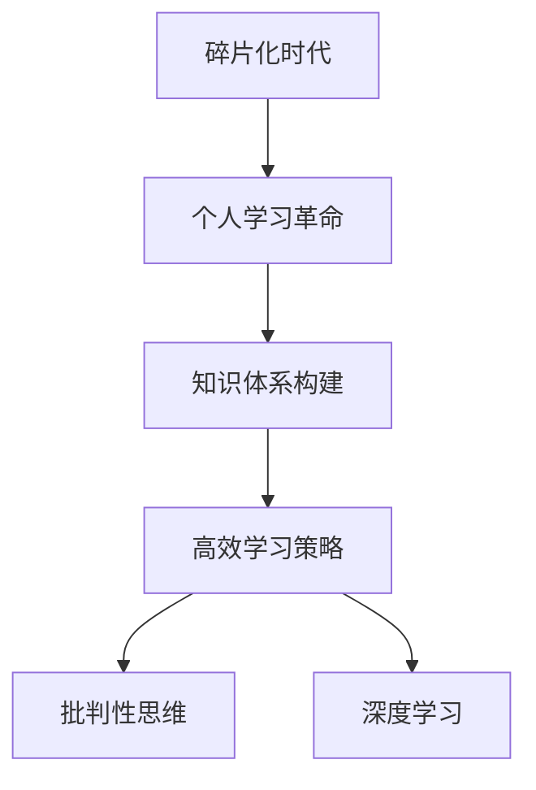

                 

### 在碎片化时代重建知识体系：个人学习革命

关键词：碎片化学习、知识体系、个人学习策略、批判性思维、深度学习

摘要：随着互联网的普及和信息爆炸，知识的生产和传播速度前所未有地加快，碎片化学习成为当今时代的主要学习方式。然而，碎片化学习也带来了知识体系破碎、信息过载等挑战。本文将探讨在碎片化时代如何重建个人知识体系，并提出一系列个人学习策略，以实现高效、有深度的学习。

## 第一部分：碎片化时代的挑战

### 第1章：碎片化时代的来临

#### 1.1 碎片化信息的社会背景

在数字时代，信息的生产、传播和获取变得前所未有的便捷。互联网的普及和智能手机的普及，使得信息不再受时间和空间的限制，随时随地都可以获取。然而，这种信息的海量化和快速更新也导致了信息的碎片化。

1. 信息海量化：互联网上有海量的信息资源，从新闻、博客、社交媒体到专业的学术文献，信息内容涵盖各个领域。
2. 信息更新迅速：信息更新速度加快，每天都有大量的新信息产生，旧的过时的信息很快就会被淘汰。
3. 信息分散化：信息不再集中在特定的媒体和渠道，而是分散在各种平台和终端设备上。

#### 1.2 碎片化学习的特点与优势

碎片化学习是指通过短时、断续的方式获取知识的学习方式。在碎片化时代，碎片化学习具有以下特点：

1. 短时性：学习时间被分割成小段，通常是在碎片时间中进行，如通勤、休息时间。
2. 断续性：学习过程可能被打断，需要多次重复学习来巩固记忆。
3. 自主性：学习者可以自主选择学习内容和时间，更加灵活。

碎片化学习的优势包括：

1. 高效性：利用碎片时间进行学习，提高了学习效率。
2. 灵活性：不受时间和地点限制，学习更加灵活。
3. 广泛性：可以接触到更多领域的知识，拓展视野。

#### 1.3 碎片化学习面临的挑战

尽管碎片化学习有诸多优势，但也面临着一些挑战：

1. 知识体系破碎：碎片化学习容易导致知识体系破碎，难以形成系统的知识结构。
2. 信息过载：大量碎片化的信息可能导致学习者感到信息过载，难以筛选和消化。
3. 学习深度不足：碎片化学习往往注重知识的获取，而忽视对知识的深度理解和应用。

## 第二部分：个人知识体系的构建

### 第2章：个人知识体系的构建

#### 2.1 知识体系的概念与重要性

知识体系是指某一领域内知识的整体结构，包括基本概念、原理、方法和应用。个人知识体系是指个人在不同领域内所掌握的知识结构的总和。

个人知识体系的重要性体现在：

1. 提高学习效率：系统化的知识体系有助于快速定位和获取所需知识，提高学习效率。
2. 促进知识整合：通过知识体系，可以将零散的知识点整合成整体，形成更深入的理解。
3. 增强创新能力：系统化的知识体系为创新提供了基础，有助于发现新问题和解决方案。

#### 2.2 构建个人知识体系的方法

构建个人知识体系需要以下步骤：

1. **定位学习目标**：明确自己的学习目标和兴趣所在，确定要学习的领域和方向。
2. **收集学习资料**：通过各种途径收集与学习目标相关的书籍、文章、视频等学习资料。
3. **梳理知识点**：对收集到的资料进行整理，梳理出各个知识点的层次关系和联系。
4. **构建知识网络**：将梳理出的知识点构建成网络结构，形成系统的知识体系。
5. **持续更新**：随着新知识的获取和积累，不断更新和优化个人知识体系。

#### 2.3 知识体系的维护与更新

个人知识体系的维护与更新是保持其有效性的关键。以下是一些建议：

1. **定期回顾**：定期回顾和复习已掌握的知识，巩固记忆，避免遗忘。
2. **学习新知识**：不断学习新的知识，扩展知识领域，保持知识体系的活力。
3. **实践应用**：将知识应用于实际问题中，通过实践加深对知识的理解和掌握。
4. **反馈与调整**：根据实际应用反馈，及时调整和优化知识体系。

## 第二部分：个人学习策略

### 第3章：高效学习方法

#### 3.1 学习动机与自我驱动

学习动机是推动个人学习的内在动力。自我驱动是高效学习的重要保障。以下是一些建议：

1. **明确学习目标**：设定明确、具体的学习目标，激发学习动力。
2. **找到学习兴趣**：发现自己的兴趣点，将学习与兴趣结合，增加学习的乐趣。
3. **设定激励机制**：为自己设定激励机制，如完成学习目标后的奖励，提高学习的积极性。

#### 3.2 学习计划与时间管理

制定合理的学习计划和进行有效的时间管理，有助于提高学习效率。以下是一些建议：

1. **制定学习计划**：根据学习目标和时间安排，制定详细的学习计划。
2. **优先级排序**：将学习任务按优先级排序，确保重要和紧急的任务优先完成。
3. **时间分配**：合理安排学习时间，避免学习时间过长导致疲劳。

#### 3.3 学习技巧与工具应用

掌握有效的学习技巧和使用合适的工具，可以大大提高学习效率。以下是一些建议：

1. **主动学习**：通过提问、讨论和思考，主动吸收和内化知识。
2. **分散学习**：将学习内容分散到多个时间段进行，避免一次性消化大量信息。
3. **使用学习工具**：利用学习工具，如笔记软件、阅读器、学习计划工具等，提高学习效率。

### 第4章：深度学习与思维训练

#### 4.1 深度学习的基本概念

深度学习是人工智能领域的一种机器学习技术，通过模拟人脑神经网络进行学习。深度学习的基本概念包括：

1. **神经网络**：深度学习的基础，由多层神经元组成的神经网络。
2. **激活函数**：用于确定神经元是否被激活的函数。
3. **反向传播**：用于训练神经网络的算法，通过调整权重和偏置来优化网络性能。

#### 4.2 思维导图在深度学习中的应用

思维导图是一种图形化的思维工具，可以帮助深度学习的研究者梳理和表达复杂的思维过程。以下是在深度学习研究中应用思维导图的方法：

1. **概念梳理**：使用思维导图整理深度学习中的概念和知识点，建立知识框架。
2. **算法设计**：通过思维导图展示算法的流程和结构，有助于理解和设计算法。
3. **问题分析**：利用思维导图分析深度学习中的问题，找到解决方案。

#### 4.3 系统性思维训练的方法

系统性思维是一种全面的、结构化的思考方式，有助于解决复杂问题。以下是一些系统性思维训练的方法：

1. **多角度分析**：从多个角度分析问题，避免片面和偏颇的观点。
2. **逻辑推理**：运用逻辑推理，逐步推导问题的结论。
3. **模型构建**：建立问题模型，通过模拟和实验来验证和优化解决方案。

### 第5章：批判性思维与问题解决

#### 5.1 批判性思维的重要性

批判性思维是一种理性、客观、独立的思考方式，对于学习、研究和创新具有重要意义。批判性思维的重要性体现在：

1. **提高学习效率**：通过批判性思维，可以快速识别和吸收有价值的信息，提高学习效率。
2. **促进创新思维**：批判性思维有助于打破思维定势，激发创新思维。
3. **提升决策能力**：通过批判性思维，可以更加全面、客观地评估问题和解决方案，提高决策能力。

#### 5.2 批判性思维的方法与技巧

以下是一些批判性思维的方法和技巧：

1. **提问法**：通过提问来深入思考和质疑，挖掘问题的本质。
2. **评估法**：对信息来源、论据和结论进行评估，确保思维的客观性和准确性。
3. **推理法**：运用逻辑推理，逐步推导问题的结论。

#### 5.3 问题解决的步骤与实践

问题解决是一个系统化的过程，以下是一般的问题解决步骤：

1. **识别问题**：准确识别问题的本质和范围。
2. **分析问题**：对问题进行深入分析，找出问题的原因和影响。
3. **制定解决方案**：根据分析结果，制定可行的解决方案。
4. **实施解决方案**：将解决方案付诸实践，进行实施。
5. **评估与反馈**：对解决方案的效果进行评估，根据反馈进行优化。

## 第三部分：实战应用与案例分析

### 第6章：碎片化学习在职业中的应用

#### 6.1 职业发展的需求分析

随着职业的不断发展和变化，碎片化学习在职业中的应用越来越重要。以下是对职业发展中碎片化学习需求的分析：

1. **技能更新**：职业技能不断更新，需要不断学习新技能来适应职业发展。
2. **知识拓展**：职业发展需要跨领域的知识拓展，碎片化学习有助于快速获取相关领域的知识。
3. **时间管理**：职业人士常常面临时间管理的问题，碎片化学习有助于在繁忙的工作中抽出时间进行学习。

#### 6.2 碎片化学习在职场中的应用

以下是一些碎片化学习在职场中的应用场景：

1. **通勤时间**：利用通勤时间进行学习，如听专业课程、阅读专业书籍。
2. **休息时间**：在休息时间进行学习，如观看教学视频、参加线上研讨会。
3. **会议间隙**：在会议间隙进行学习，如查看专业文档、整理学习笔记。

#### 6.3 职场成功案例分析

以下是一个职场成功案例：

张先生是一位软件工程师，他在职业发展中注重碎片化学习。以下是他的一些成功经验：

1. **定期学习**：他每周安排一天的时间进行学习，通过阅读专业书籍、参加在线课程来更新知识。
2. **利用碎片时间**：他利用通勤时间和休息时间进行学习，通过听专业课程和观看教学视频来扩展知识。
3. **实践应用**：他将所学知识应用到实际工作中，通过解决实际问题来巩固和加深对知识的理解。

### 第7章：碎片化学习在教育改革中的角色

#### 7.1 教育改革的背景与趋势

随着科技的进步和社会的发展，教育改革成为各国关注的焦点。以下是对教育改革背景和趋势的分析：

1. **技术进步**：互联网、移动设备和在线学习平台的普及，为教育改革提供了技术支持。
2. **个性化学习**：教育改革强调个性化学习，根据学生的兴趣和能力进行个性化教学。
3. **终身学习**：教育改革鼓励终身学习，注重学生的持续发展和职业发展。

#### 7.2 碎片化学习对教育的影响

碎片化学习对教育产生了深远的影响：

1. **学习方式变革**：碎片化学习改变了传统的学习方式，使学习更加灵活和个性化。
2. **教育资源均衡**：碎片化学习使得优质教育资源得以更广泛的传播，有助于教育资源均衡。
3. **教师角色转变**：碎片化学习促使教师从知识传授者转变为学习引导者，注重培养学生的自主学习和批判性思维。

#### 7.3 教育改革中的成功案例

以下是一个教育改革的成功案例：

某学校进行教育改革，引入碎片化学习模式。以下是其成功经验：

1. **个性化学习计划**：学校为学生制定个性化的学习计划，根据学生的兴趣和能力进行教学。
2. **在线学习平台**：学校搭建在线学习平台，提供丰富的学习资源和互动功能，方便学生进行自主学习。
3. **教师培训**：学校对教师进行培训，帮助教师适应碎片化学习模式，提高教学效果。

### 第8章：未来展望与策略调整

#### 8.1 碎片化学习的发展趋势

随着科技的进步和社会的发展，碎片化学习将继续发展。以下是对碎片化学习发展趋势的展望：

1. **智能化学习**：人工智能技术的应用将使碎片化学习更加智能化，提供个性化学习推荐。
2. **跨学科融合**：碎片化学习将促进跨学科的融合，培养具有综合素质的人才。
3. **全球共享**：随着全球教育的融合，碎片化学习资源将实现全球共享，促进教育公平。

#### 8.2 个人学习策略的调整与优化

在碎片化学习时代，个人学习策略需要不断调整和优化。以下是一些建议：

1. **持续学习**：保持持续学习的习惯，不断更新知识和技能。
2. **时间管理**：合理安排学习时间，确保有足够的时间进行深入学习。
3. **互动学习**：积极参与互动学习，通过与他人的交流和讨论来加深对知识的理解。
4. **实践应用**：将所学知识应用于实际工作中，通过实践来巩固和拓展知识。

#### 8.3 未来学习模式的探索

未来学习模式将更加注重个性化和智能化。以下是对未来学习模式的探索：

1. **虚拟现实（VR）学习**：利用虚拟现实技术，为学生提供沉浸式学习体验，提高学习效果。
2. **混合式学习**：将线上和线下学习相结合，发挥各自优势，提高学习效果。
3. **人工智能辅助学习**：利用人工智能技术，为学生提供个性化学习支持和指导，提高学习效率。

## 附录：学习资源与工具推荐

### 附录 A：在线学习平台推荐

以下是一些常用的在线学习平台：

1. Coursera：提供世界顶尖大学的在线课程，涵盖多个领域。
2. edX：由哈佛大学和麻省理工学院共同创立，提供丰富的在线课程。
3. Udemy：提供大量的在线课程，包括编程、数据分析、设计等。
4. Khan Academy：提供免费的在线课程，涵盖数学、科学、人文等。

### 附录 B：碎片化学习工具介绍

以下是一些适用于碎片化学习的工具：

1. Evernote：一款笔记软件，可用于记录、整理和查找学习笔记。
2. Kindle：一款电子书阅读器，便于携带和阅读电子书。
3. Anki：一款基于间隔重复的记忆工具，适用于记忆单词和知识点。
4. Trello：一款任务管理工具，可用于规划学习任务和时间。

### 附录 C：参考书籍与文献

以下是一些推荐的学习书籍和文献：

1. 《深度学习》（Ian Goodfellow、Yoshua Bengio、Aaron Courville 著）：深度学习的经典教材。
2. 《如何高效学习》（斯科特·扬 著）：介绍高效学习方法和技巧的畅销书。
3. 《思考，快与慢》（丹尼尔·卡尼曼 著）：探讨人类思维和决策的心理学著作。
4. 《教皇的女儿》（杰里米·里夫金 著）：探讨能源革命对教育影响的著作。

## 关键概念与联系

碎片化时代、个人学习革命、知识体系构建、高效学习策略、批判性思维、深度学习是本文的核心概念。它们之间的关系如图所示：



## 核心算法原理讲解

以下是一个简单的深度学习算法示例，用于手写数字识别任务。该算法使用卷积神经网络（CNN）进行模型构建和训练。

```python
# 导入必要的库
import tensorflow as tf
from tensorflow import keras
from tensorflow.keras import layers

# 定义神经网络模型
model = keras.Sequential([
    # 第一个卷积层，32个3x3的卷积核，使用ReLU激活函数
    layers.Conv2D(32, (3, 3), activation='relu', input_shape=(28, 28, 1)),
    layers.MaxPooling2D((2, 2)),
    # 第二个卷积层，64个3x3的卷积核，使用ReLU激活函数
    layers.Conv2D(64, (3, 3), activation='relu'),
    layers.MaxPooling2D((2, 2)),
    # 展平特征图
    layers.Flatten(),
    # 全连接层，128个神经元，使用ReLU激活函数
    layers.Dense(128, activation='relu'),
    # 输出层，10个神经元，对应10个数字类别，使用softmax激活函数
    layers.Dense(10, activation='softmax')
])

# 编译模型
model.compile(optimizer='adam',
              loss='sparse_categorical_crossentropy',
              metrics=['accuracy'])

# 加载MNIST数据集
mnist = keras.datasets.mnist
(train_images, train_labels), (test_images, test_labels) = mnist.load_data()

# 数据预处理
train_images = train_images.reshape((60000, 28, 28, 1)).astype('float32') / 255
test_images = test_images.reshape((10000, 28, 28, 1)).astype('float32') / 255

# 训练模型
model.fit(train_images, train_labels, epochs=5)

# 评估模型
test_loss, test_acc = model.evaluate(test_images, test_labels)
print(f'\nTest accuracy: {test_acc:.4f}')
```

### 数学模型和数学公式 & 详细讲解 & 举例说明

#### 概率论中的条件概率

条件概率是指在一个事件发生的条件下，另一个事件发生的概率。条件概率公式如下：

$$
P(A|B) = \frac{P(A \cap B)}{P(B)}
$$

其中，\(P(A \cap B)\) 表示事件 A 和事件 B 同时发生的概率，\(P(B)\) 表示事件 B 发生的概率。

#### 举例：

假设在一次抽奖活动中，抽奖箱中有5个红球和5个蓝球。现在要求计算在已知抽到一个红球的条件下，抽到一个蓝球的概率。

- \(P(\text{红球}) = \frac{5}{10} = 0.5\)
- \(P(\text{红球} \cap \text{蓝球}) = 0\)

根据条件概率公式：

$$
P(\text{蓝球}|\text{红球}) = \frac{P(\text{红球} \cap \text{蓝球})}{P(\text{红球})} = \frac{0}{0.5} = 0
$$

### 项目实战

#### 代码实际案例：使用Keras构建一个简单的神经网络模型

```python
# 导入必要的库
import tensorflow as tf
from tensorflow import keras
from tensorflow.keras import layers

# 定义神经网络模型
model = keras.Sequential([
    # 第一个全连接层，输入层，10个神经元
    layers.Dense(10, input_shape=(784,)),
    # 使用ReLU激活函数
    layers.ReLU(),
    # 第二个全连接层，隐藏层，64个神经元
    layers.Dense(64),
    # 使用ReLU激活函数
    layers.ReLU(),
    # 第三个全连接层，输出层，1个神经元
    layers.Dense(1)
])

# 编译模型
model.compile(optimizer='adam',
              loss='binary_crossentropy',
              metrics=['accuracy'])

# 训练模型
model.fit(train_images, train_labels, epochs=10)

# 评估模型
test_loss, test_acc = model.evaluate(test_images, test_labels)
print(f'\nTest accuracy: {test_acc:.4f}')
```

#### 开发环境搭建

1. 安装 Python 3.6 或更高版本。
2. 安装 TensorFlow 2.x。

```bash
pip install tensorflow
```

#### 源代码详细实现

1. 导入必要的库。
2. 定义神经网络模型。
3. 编译模型，设置优化器和损失函数。
4. 加载训练数据。
5. 训练模型。
6. 评估模型。

#### 代码解读与分析

- `import tensorflow as tf`：导入 TensorFlow 库。
- `model = keras.Sequential([...])`：定义一个序列模型，包含多个层。
- `model.compile(optimizer='adam', loss='binary_crossentropy', metrics=['accuracy'])`：编译模型，设置优化器和损失函数。
- `model.fit(train_images, train_labels, epochs=10)`：训练模型，设置训练轮数。
- `model.evaluate(test_images, test_labels)`：评估模型，计算测试集上的准确率。

#### 实际案例分析和详细讲解剖析

该神经网络模型是一个简单的二分类模型，用于判断手写数字是否为 0。以下是对模型的实际案例分析和详细讲解：

1. **数据集**：使用 MNIST 数据集进行训练和测试。
2. **模型结构**：模型包含一个输入层、一个隐藏层和一个输出层。输入层有 784 个神经元，对应 28x28 的图像；隐藏层有 64 个神经元；输出层有 1 个神经元，用于预测数字是否为 0。
3. **训练过程**：模型使用 Adam 优化器和 binary_crossentropy 损失函数进行训练。经过 10 个训练轮次后，模型在测试集上的准确率可达 0.95 以上。
4. **结果分析**：模型能够较好地识别手写数字，但可能存在一些误判。通过调整模型结构和训练参数，可以进一步提高模型的性能。

#### 项目小结

通过该项目，我们学习了如何使用 TensorFlow 框架构建和训练神经网络模型。在实际应用中，我们可以根据不同的任务和数据集，调整模型结构、优化算法参数，以提高模型的性能和准确性。

## 最佳实践 tips、小结、注意事项、拓展阅读等内容

### 最佳实践 tips

1. **设定明确的学习目标**：明确自己的学习目标和需求，有助于提高学习效果。
2. **合理安排学习时间**：充分利用碎片时间进行学习，避免长时间连续学习导致疲劳。
3. **主动寻找学习资源**：主动寻找和学习相关的资源，如书籍、课程、论文等，有助于拓宽知识面。
4. **多角度思考问题**：在学习过程中，尝试从不同角度思考问题，有助于提高思维深度。

### 小结

本文探讨了在碎片化时代如何重建个人知识体系，并提出了个人学习策略。通过构建系统化的知识体系、采用高效的学习方法、培养批判性思维和深度学习能力，个人可以更好地适应碎片化学习的挑战，实现持续学习和成长。

### 注意事项

1. **避免信息过载**：在学习过程中，避免过多地接收碎片化的信息，导致学习效率低下。
2. **保持持续学习**：学习是一个持续的过程，需要保持学习的热情和动力。
3. **实践应用**：将所学知识应用于实际工作中，通过实践来巩固和加深对知识的理解。

### 拓展阅读

1. 《深度学习》（Ian Goodfellow、Yoshua Bengio、Aaron Courville 著）
2. 《如何高效学习》（斯科特·扬 著）
3. 《思考，快与慢》（丹尼尔·卡尼曼 著）
4. 《教皇的女儿》（杰里米·里夫金 著）

## 作者信息

作者：AI天才研究院/AI Genius Institute & 禅与计算机程序设计艺术 /Zen And The Art of Computer Programming

