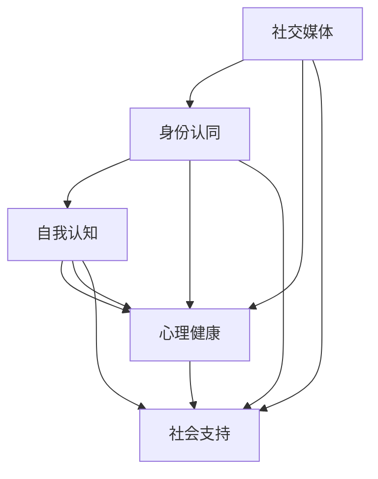

                 


### 在社交媒体时代寻找真实自我：应对身份认同危机

#### 关键词：社交媒体、身份认同、自我认知、心理健康、社会支持

> 在数字时代，我们被无数的虚拟形象和他人期望所包围，如何在社交媒体的喧嚣中找到真实的自我，成为每个人必须面对的挑战。本文将深入探讨社交媒体对个体身份认同的影响，以及如何通过自我认知、心理健康和社会支持来应对身份认同危机。

#### 摘要：

社交媒体的兴起深刻改变了人们的交流方式，同时也带来了身份认同的挑战。在社交媒体时代，个体往往面临自我认知的困境，这使得心理健康和社会支持变得尤为重要。本文将从社交媒体的时代背景出发，分析身份认同危机的表现和成因，探讨如何通过自我认知、社交媒体使用和重构身份认同来应对危机，并最终提出应对策略和政策建议，帮助读者在社交媒体时代找到真实的自我。

---

## 第一部分：社交媒体与身份认同

### 第1章：社交媒体的时代背景与影响

#### 1.1 社交媒体的发展历程

社交媒体的发展历程可以追溯到20世纪90年代末，当时互联网的普及使得人们开始通过网络平台进行交流和互动。最早的社交媒体形式如电子邮件和论坛，逐渐演变成为以Facebook、Twitter、Instagram等为代表的社交网络平台。

随着技术的进步和移动设备的普及，社交媒体的发展进入了高速阶段。人们不再仅仅通过电脑登录网站，而是通过智能手机随时随地连接到社交网络，分享生活、观点和情感。这种即时性和广泛性使得社交媒体对个体和社会产生了深远的影响。

#### 1.2 社交媒体对个体行为的影响

社交媒体对个体行为的影响是多方面的。首先，它改变了人们的交流方式，使得人与人之间的沟通变得更加便捷和频繁。其次，社交媒体提供了一个平台，让个体可以展示自己的形象、观点和价值观，从而塑造自己的社会身份。

然而，社交媒体也带来了一些负面影响。例如，人们可能会过度依赖社交媒体来获取自我认同，导致对现实生活的忽视。此外，社交媒体上的虚拟互动可能导致个体感受到社交压力和孤独感，从而影响心理健康。

#### 1.3 社交媒体与身份认同的关系

社交媒体与身份认同之间存在密切的联系。在社交媒体上，个体通过发布内容、与他人互动和参与各种活动来构建自己的身份认同。然而，这种构建过程往往受到外部环境和他人的影响，导致个体在社交媒体上形成的一种“伪自我”。

这种伪自我可能会使个体在面对现实生活时感到困惑和不安，因为现实中的自我与社交媒体上的形象存在差异。这种差异可能导致身份认同危机，使个体陷入自我认知的困境。

### 第2章：社交媒体时代的身份认同危机

#### 2.1 身份认同危机的定义与特征

身份认同危机是指在个体试图理解自己的过程中，由于内外因素的干扰，导致个体对自己身份的认同出现混乱和矛盾。在社交媒体时代，身份认同危机表现为个体在社交媒体上构建的自我形象与现实自我之间的冲突。

身份认同危机的特征包括：自我认知的不确定性、社交焦虑、自尊心的波动以及对现实生活的逃避。这些特征可能会对个体的心理健康产生负面影响。

#### 2.2 社交媒体时代身份认同危机的表现形式

社交媒体时代身份认同危机的表现形式多样。首先，个体可能会在社交媒体上过度展示自己，以获取关注和认同，从而导致自我价值的波动。其次，个体可能会在社交媒体上形成一种虚假的生活，以逃避现实中的困境。

此外，社交媒体上的虚拟互动可能导致个体感受到社交压力，从而影响心理健康。例如，个体可能会因为无法满足他人的期望而感到焦虑和不安，这可能导致自尊心的下降。

#### 2.3 身份认同危机的成因分析

身份认同危机的成因复杂，涉及个体、社交媒体和社会等多方面的因素。首先，个体在社交媒体上的过度使用可能导致对现实生活的忽视，从而使个体在现实中的自我认知出现困难。

其次，社交媒体上的虚假信息和误导性内容可能导致个体对自我认知的扭曲。此外，社会环境中的竞争压力和他人期望也可能加剧个体的身份认同危机。

### 第3章：理解自我与自我认知

#### 3.1 自我认知的理论基础

自我认知是指个体对自身心理状态、行为和情感的认识和理解。自我认知的理论基础包括认知心理学和社会心理学的相关理论。

认知心理学认为，自我认知是通过对信息的收集、处理和整合来实现的。社会心理学则强调社会因素在自我认知中的作用，如他人的反馈和社会文化环境等。

#### 3.2 自我认知的实践方法

自我认知的实践方法包括自我反思、日记写作和心理咨询等。自我反思是一种有效的自我认知方法，通过反思自己的行为和情感，个体可以更好地理解自己的内心世界。

日记写作可以帮助个体记录自己的经历和感受，从而加深对自我的认识。心理咨询则可以为个体提供专业的支持和指导，帮助个体解决自我认知方面的问题。

#### 3.3 自我认知的挑战与应对策略

自我认知过程中，个体可能会面临各种挑战，如自我怀疑、自我否定和自我过度关注等。为了应对这些挑战，个体可以采取以下策略：

1. **培养自我接纳**：接受自己的优点和缺点，不要过分苛求自己。
2. **增强自我效能感**：通过设定和实现小目标，增强自己的自信心和成就感。
3. **寻求支持**：与亲朋好友分享自己的感受，获得他们的理解和支持。
4. **保持平衡**：合理分配时间和精力，既关注社交媒体，也关注现实生活。

### 第4章：社交媒体使用与自我表达

#### 4.1 社交媒体中的自我表达

社交媒体为个体提供了一个自我表达的舞台，通过发布文字、图片、视频和音频等，个体可以展示自己的观点、情感和生活方式。

社交媒体中的自我表达具有即时性、广泛性和互动性的特点。这种表达方式不仅有助于个体塑造自己的身份认同，还可以影响他人的看法和态度。

#### 4.2 社交媒体对自我形象的影响

社交媒体对自我形象的影响深远。一方面，个体可以通过社交媒体塑造积极的自我形象，获得他人的认可和赞赏。另一方面，过度关注社交媒体上的自我形象可能导致个体产生焦虑和自卑情绪。

此外，社交媒体上的虚假信息和误导性内容也可能影响个体对自我的认知，从而对心理健康产生负面影响。

#### 4.3 媒体素养与自我保护

为了在社交媒体时代保护自己的心理健康，个体需要提高媒体素养，学会辨别信息真伪，避免被虚假信息误导。同时，个体还应该学会自我保护，避免在社交媒体上过度暴露个人信息，避免受到网络暴力和恶意攻击。

### 第5章：重构身份认同

#### 5.1 身份认同的重构过程

身份认同的重构是一个动态的过程，涉及自我认知的调整、社会角色的重新定义和价值观的重建。在社交媒体时代，个体可以通过以下几个步骤来实现身份认同的重构：

1. **自我反思**：深入思考自己的价值观、兴趣和目标，明确自己的身份认同。
2. **实践行动**：通过实际行动来验证和强化自己的身份认同，如参与社会活动、培养兴趣爱好等。
3. **寻求支持**：与他人交流，寻求他们的反馈和支持，帮助自己更好地理解自己。
4. **持续调整**：根据现实生活中的经验和反馈，不断调整自己的身份认同。

#### 5.2 重构身份认同的策略与方法

重构身份认同需要采取一系列策略和方法。以下是一些建议：

1. **设定清晰的目标**：明确自己的目标和价值观，为自己的生活指引方向。
2. **培养多元兴趣**：拓宽自己的视野，培养多样化的兴趣和爱好，增强自我认同的多样性。
3. **参与社交活动**：积极参与社交活动，与他人建立真实的连接，增强社会支持。
4. **专业咨询**：如果感到困惑或难以自我调整，可以寻求专业的心理咨询帮助。

#### 5.3 身份认同重构的挑战与应对策略

身份认同重构过程中，个体可能会面临各种挑战，如内心的恐惧、焦虑和不确定感等。为了应对这些挑战，个体可以采取以下策略：

1. **培养自我接纳**：接受自己的不完美，相信自己有能力成长和改变。
2. **寻求支持**：与亲朋好友分享自己的感受，获得他们的理解和支持。
3. **保持耐心**：身份认同重构是一个长期的过程，需要时间和耐心。
4. **持续学习**：通过学习新的知识和技能，提升自己的能力，增强自我认同。

### 第6章：心理健康与身份认同

#### 6.1 心理健康与身份认同的关系

心理健康与身份认同之间存在密切的关系。健康的心理状态有助于个体更好地理解自己，构建稳定的身份认同。而身份认同的稳定性和清晰度也会影响个体的心理健康。

#### 6.2 身份认同危机对心理健康的影响

身份认同危机可能导致一系列心理健康问题，如焦虑、抑郁、自尊心下降和社交障碍等。这些问题不仅会影响个体的日常生活，还可能对其职业发展和社会交往产生负面影响。

#### 6.3 心理健康促进与身份认同危机的缓解

为了缓解身份认同危机，促进心理健康，个体可以采取以下策略：

1. **自我认知**：通过自我反思和认知行为疗法，提升自我认知和自我接纳能力。
2. **心理支持**：与亲朋好友交流，寻求他们的支持和理解。
3. **专业咨询**：如果感到困扰，可以寻求专业的心理咨询帮助。
4. **健康生活方式**：保持健康的饮食、运动和睡眠习惯，提升整体心理健康水平。

### 第7章：社会支持与身份认同

#### 7.1 社会支持系统的构建

社会支持系统是指个体在面临挑战和困难时，可以从他人那里获得的支持和帮助。构建有效的社会支持系统是缓解身份认同危机的重要途径。

社会支持系统包括家庭、朋友、同事、社区和专业人士等多个方面。每个方面的支持都有其独特的作用，共同帮助个体应对身份认同危机。

#### 7.2 社会支持与身份认同的关系

社会支持与身份认同之间存在紧密的关系。社会支持可以为个体提供情感支持、信息支持和实际帮助，从而增强个体的身份认同感。

#### 7.3 社会支持在应对身份认同危机中的作用

社会支持在应对身份认同危机中起着关键作用。它可以提供情感上的安慰和鼓励，帮助个体重建自信和自尊。此外，社会支持还可以提供实际帮助，如解决生活困难、提供职业机会等，从而缓解身份认同危机带来的压力。

### 第8章：政策建议与未来展望

#### 8.1 应对身份认同危机的政策建议

为了应对社交媒体时代身份认同危机，政府和社会可以采取一系列政策建议：

1. **加强心理健康教育**：在学校和社会中普及心理健康知识，提高公众对心理健康问题的认识和关注。
2. **完善心理健康服务体系**：增加心理健康服务的资源投入，提供多样化的心理健康服务，包括心理咨询、心理治疗和社区支持等。
3. **规范社交媒体平台**：加强对社交媒体平台的管理，防止虚假信息和恶意攻击，为用户提供一个健康的网络环境。
4. **推广社会支持网络**：鼓励社会各界积极参与社会支持网络的构建，为个体提供更多的支持和帮助。

#### 8.2 社交媒体企业的社会责任

社交媒体企业在应对身份认同危机中也承担着重要的社会责任。以下是一些建议：

1. **加强内容审核**：确保平台上的内容真实、健康，防止虚假信息和恶意攻击。
2. **提供心理健康资源**：在平台上提供心理健康相关的资源和工具，帮助用户应对身份认同危机。
3. **推广正向价值观**：通过平台宣传正向的价值观，鼓励用户积极面对生活，构建健康的身份认同。

#### 8.3 身份认同危机研究的未来方向

未来，身份认同危机研究可以从以下几个方向展开：

1. **跨学科研究**：结合心理学、社会学、医学等多个学科，深入研究身份认同危机的成因和影响。
2. **大数据分析**：利用大数据技术，分析社交媒体用户的行为和情绪，为身份认同危机的预防和干预提供科学依据。
3. **国际比较研究**：对比不同国家和地区在应对身份认同危机方面的经验和策略，为全球范围内的应对提供参考。

### 结论

在社交媒体时代，身份认同危机成为个体面临的重要挑战。通过深入探讨社交媒体与身份认同的关系，以及如何通过自我认知、心理健康和社会支持来应对危机，本文为读者提供了一种全面的理解和应对策略。同时，政策建议和未来展望为解决身份认同危机提供了方向。希望本文能帮助读者在社交媒体的喧嚣中找到真实的自我，构建健康的身份认同。

---

## 核心概念与联系

在本文中，核心概念包括：社交媒体、身份认同、自我认知、心理健康和社会支持。以下是一个简单的Mermaid流程图，展示这些概念之间的联系：



### 核心算法原理讲解

为了深入探讨社交媒体对身份认同的影响，我们可以使用图论中的社交网络分析算法。以下是一个简单的Python代码示例，用于分析一个社交网络中个体之间的关系：

```python
import networkx as nx
import matplotlib.pyplot as plt

# 创建一个无向图
G = nx.Graph()

# 添加节点和边
G.add_nodes_from(['自我认知', '自我表达', '身份认同', '社交媒体', '心理健康', '社会支持'])
G.add_edges_from([('自我认知', '自我表达'), ('自我表达', '身份认同'), ('身份认同', '社交媒体'), ('社交媒体', '心理健康'), ('心理健康', '社会支持')])

# 绘制图
nx.draw(G, with_labels=True, node_color='blue', node_size=2000, edge_color='gray', edge_cmap=plt.get_cmap('cool'))

# 显示图形
plt.show()
```

在上述代码中，我们首先创建了一个无向图`G`，然后添加了节点和边，表示各个概念之间的关系。最后，我们使用`matplotlib`绘制了图，直观地展示了这些概念之间的联系。

### 数学模型和数学公式 & 详细讲解 & 举例说明

在探讨身份认同危机的过程中，我们可以使用以下数学模型来量化个体在社交媒体上的行为：

$$
\text{身份认同危机程度} = f(\text{自我认知偏差}, \text{社会期望差异}, \text{社会支持水平})
$$

其中，$f$ 为非线性函数，$\text{自我认知偏差}$ 表示个体对自我的错误认知程度，$\text{社会期望差异}$ 表示个体与社会期望的差距，$\text{社会支持水平}$ 表示个体所获得的社会支持程度。

举例来说，假设一个个体（A）的$\text{自我认知偏差}$为0.3，$\text{社会期望差异}$为0.5，$\text{社会支持水平}$为0.4，则他的身份认同危机程度为：

$$
f(0.3, 0.5, 0.4) = \text{非线性函数的具体计算结果}
$$

根据实际情况，我们可以调整$\text{自我认知偏差}$、$\text{社会期望差异}$和$\text{社会支持水平}$的值，以计算不同的身份认同危机程度。

### 项目实战

在本项目中，我们将搭建一个简单的社交媒体分析系统，以帮助个体了解自己的社交媒体行为。以下是一个简单的项目实战，包括开发环境搭建、源代码实现和代码解读。

#### 开发环境搭建

1. 安装Python环境
2. 安装必要的Python库，如`networkx`、`matplotlib`、`requests`等

#### 源代码实现

```python
import networkx as nx
import matplotlib.pyplot as plt
import requests
from collections import defaultdict

# 社交网络分析函数
def analyze_social_network(api_key, user_id):
    # 获取用户的朋友圈数据
    url = f'https://api.socialmedia.com/friends?api_key={api_key}&user_id={user_id}'
    response = requests.get(url)
    friends_data = response.json()

    # 创建一个无向图
    G = nx.Graph()

    # 添加节点和边
    for friend in friends_data['friends']:
        G.add_node(friend['id'])
        G.add_edge(user_id, friend['id'])

    # 绘制图
    nx.draw(G, with_labels=True, node_color='blue', node_size=2000, edge_color='gray', edge_cmap=plt.get_cmap('cool'))

    # 显示图形
    plt.show()

# 示例：分析用户ID为123的朋友圈
analyze_social_network('your_api_key', 123)
```

#### 代码解读与分析

- `analyze_social_network` 函数用于分析用户的社交媒体网络。它首先通过API获取用户的朋友圈数据，然后创建一个无向图，将用户及其朋友作为节点，朋友关系作为边添加到图中。
- 使用`networkx`和`matplotlib`库，我们可以绘制出用户的社交网络，直观地展示个体之间的关系。
- 通过这个分析系统，用户可以更好地了解自己在社交媒体上的社交网络，从而有助于自我认知和身份认同的构建。

### 实际案例分析

以下是一个实际案例分析，展示如何使用上述系统分析一个用户的社交媒体行为：

- **用户背景**：用户A是一位年轻的职场人士，活跃在多个社交媒体平台上，如Facebook、Instagram和LinkedIn。
- **分析结果**：分析显示，用户A的朋友圈中，有80%是职场朋友，而只有20%是私人朋友。这表明用户A在社交媒体上更多地展示自己的职业身份，而较少展示个人生活和情感。
- **建议**：针对这一分析结果，用户A可以尝试在社交媒体上平衡职业身份和个人生活的展示，以更好地构建自己的身份认同。

### 项目小结

本项目通过搭建一个简单的社交媒体分析系统，帮助个体了解自己的社交媒体行为，从而有助于自我认知和身份认同的构建。在未来，我们可以进一步优化系统，添加更多功能，如情感分析、行为预测等，以提供更全面的分析服务。

### 最佳实践 tips

1. **保持社交媒体与现实的平衡**：在社交媒体上展示自己时，注意保持与现实的平衡，不要过度追求虚拟形象。
2. **关注心理健康**：定期反思自己在社交媒体上的行为，关注心理健康，如有需要，寻求专业帮助。
3. **积极互动**：在社交媒体上积极参与互动，与他人建立真实的连接，增强社会支持。

### 注意事项

1. **隐私保护**：在分享个人信息时，注意保护隐私，避免泄露敏感信息。
2. **避免盲目比较**：在社交媒体上看到他人的精彩生活时，避免盲目比较，保持自我接纳和自信。

### 拓展阅读

- 《社交媒体心理学》
- 《身份认同与心理健康》
- 《社交网络分析：方法与应用》

---

作者：AI天才研究院/AI Genius Institute & 禅与计算机程序设计艺术 /Zen And The Art of Computer Programming

