                 

# 在社交媒体时代寻找真实自我：应对身份认同危机

## 关键词
社交媒体、身份认同危机、自我认知、情绪管理、社交网络、真实自我表达

## 摘要
在社交媒体时代，个体的身份认同面临着前所未有的挑战。本文通过分析社交媒体对个体行为、人际关系以及身份认同的影响，探讨了在数字化生活中寻找真实自我的重要性。文章首先介绍了社交媒体的崛起与发展，然后深入探讨了社交媒体时代身份认同危机的形成机制及其负面影响。接着，文章提出了自我认知、情绪管理、重建社交网络等策略，帮助个体在社交媒体环境中找到真实自我。最后，文章讨论了真实自我的表达与分享，以及社交媒体时代身份认同重构的路径与未来。

## 第一部分：社交媒体时代背景

### 第1章：社交媒体的崛起与影响

#### 1.1 社交媒体的起源与发展

社交媒体作为互联网的重要组成部分，起源于20世纪90年代末的互联网浪潮。最早的社交媒体形式是电子邮件和论坛，随后是即时通讯工具如ICQ和MSN。2000年代，Facebook、Twitter、Instagram等平台的出现，标志着社交媒体进入了快速发展的阶段。这些平台不仅改变了人们的交流方式，也深刻影响了社会结构和文化。

**核心概念与联系：**

- 社交媒体：一种基于互联网的技术平台，用户可以通过这些平台分享信息、交流意见、建立社交关系。
- 起源与发展：从电子邮件和论坛，到即时通讯工具，再到当今的社交网络平台，社交媒体的发展历程反映了技术进步和用户需求的变化。

**Mermaid 流程图：**

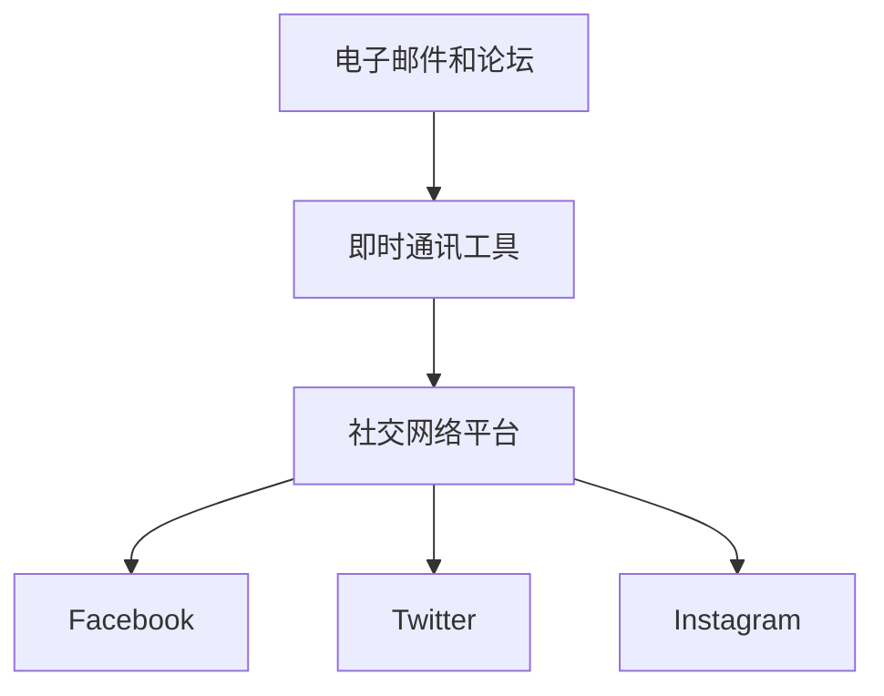

#### 1.2 社交媒体对个体行为的影响

社交媒体的普及改变了人们的日常生活和行为模式。用户不仅在社交媒体上花费大量时间，还会根据自己的需求和兴趣建立和维护社交网络。这种变化对个体的行为产生了深远的影响。

**核心概念与联系：**

- 个体行为：包括信息获取、社交互动、自我表达等方面。
- 影响因素：社交媒体平台的功能设计、用户需求、社会文化背景等。

**Mermaid 流程图：**

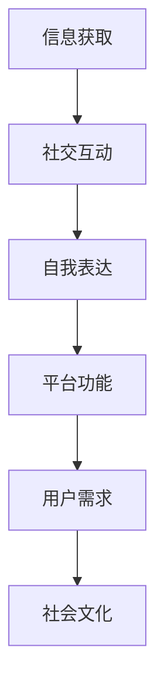

#### 1.3 社交媒体对人际交往的改造

社交媒体不仅改变了个体行为，还重构了人际交往模式。传统的面对面交流逐渐被线上交流所取代，人们更多地依赖虚拟空间进行沟通。这种变化带来了便利，但也带来了挑战。

**核心概念与联系：**

- 人际交往：人与人之间的互动，包括情感交流、信息共享、合作与竞争等。
- 改造：社交媒体使得人际交往更加便捷，但也可能导致面对面交流的减少。
- 挑战：线上交流的局限性，如非语言信息的缺失、情感表达的障碍等。

**Mermaid 流程图：**

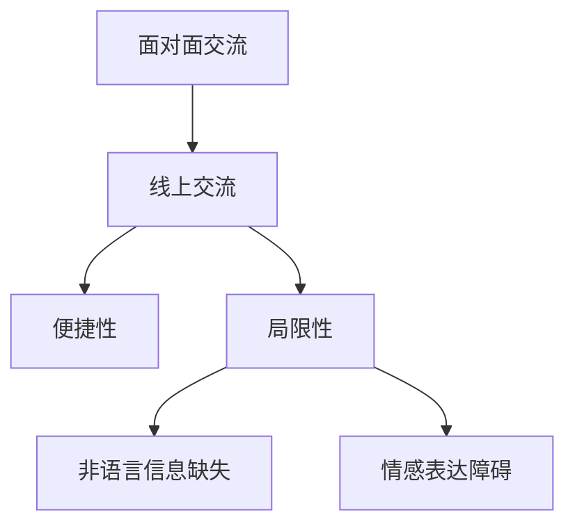

### 第2章：社交媒体与身份认同

#### 2.1 社交媒体时代的身份认同危机

在社交媒体时代，个体面临身份认同危机的挑战。这种危机源于社交媒体环境中身份的多重性和复杂性，导致个体难以建立稳定的自我认同。

**核心概念与联系：**

- 身份认同危机：个体在身份认同过程中遇到的困惑和焦虑。
- 社交媒体环境：身份的多重性、复杂性和变化性。

**Mermaid 流程图：**

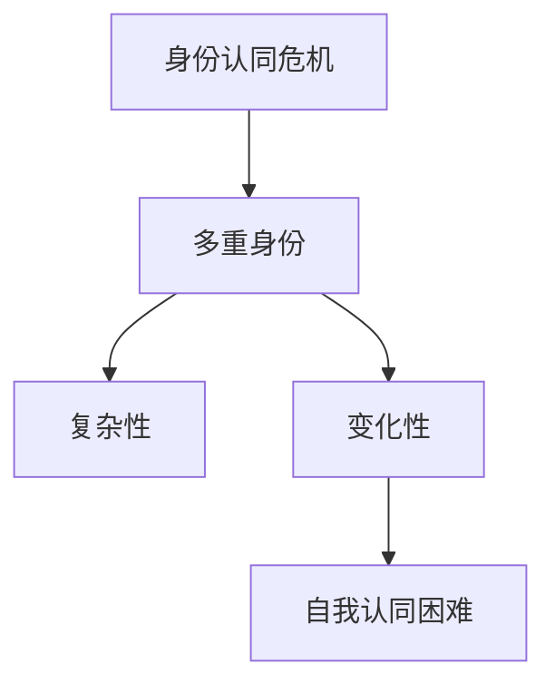

#### 2.2 社交媒体身份认同的形成机制

社交媒体身份认同的形成受到多种因素的影响，包括个体心理、社会文化背景和社交媒体平台的设计。

**核心概念与联系：**

- 形成机制：个体心理、社会文化背景和社交媒体平台三者相互作用，共同影响身份认同的形成。
- 影响因素：自我认知、社交互动、文化价值观等。

**Mermaid 流程图：**

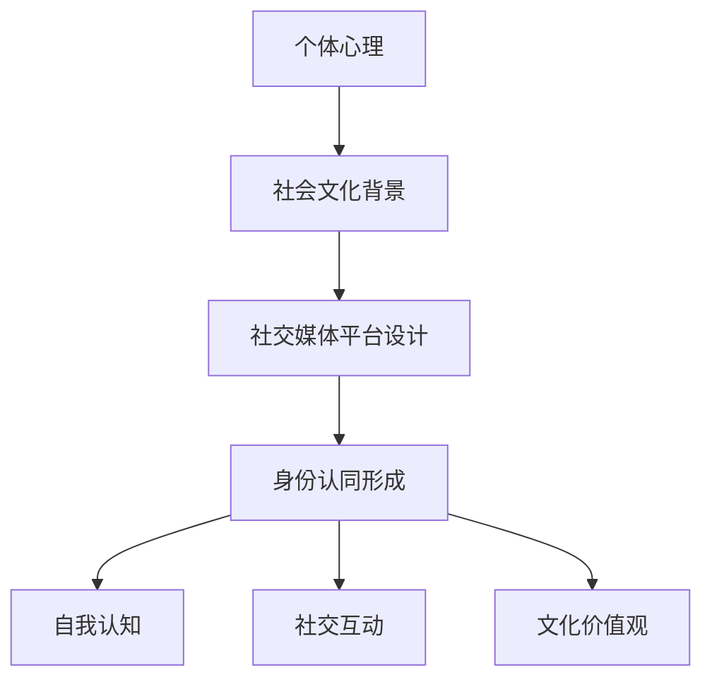

#### 2.3 社交媒体身份认同的负面影响

社交媒体身份认同的危机不仅对个体的心理健康产生负面影响，还可能对社会产生深远的后果。

**核心概念与联系：**

- 负面影响：包括自我价值感下降、心理焦虑、社交疏离等。
- 社会影响：社交媒体身份认同的危机可能导致社会信任度下降、社会凝聚力减弱。

**Mermaid 流程图：**

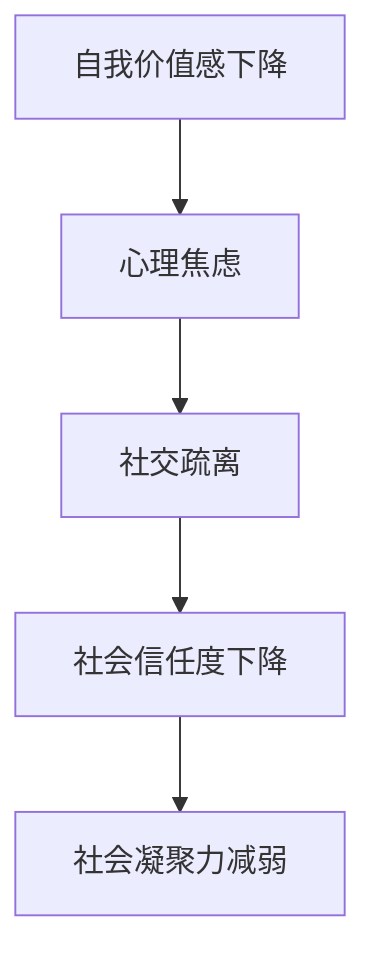

## 第二部分：寻找真实自我

### 第3章：自我认知与自我反思

#### 3.1 自我认知的重要性

自我认知是个体理解自己、定位自己的能力。在社交媒体时代，自我认知对于个体建立稳定身份认同至关重要。

**核心概念与联系：**

- 自我认知：个体对自己的认识和理解。
- 重要性：自我认知帮助个体在复杂的社会环境中找到真实的自我。

**Mermaid 流程图：**

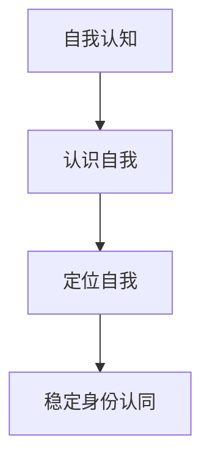

#### 3.2 自我反思的方法与实践

自我反思是一种深入思考自己行为和思想的过程。通过自我反思，个体可以更好地了解自己，提高自我认知。

**核心概念与联系：**

- 自我反思：深入思考自己的行为和思想。
- 方法与实践：包括日记记录、冥想、心理咨询等。

**Mermaid 流程图：**

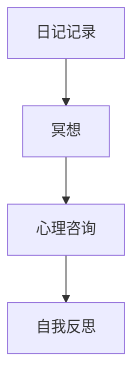

#### 3.3 增强自我意识的技巧

自我意识是指个体对自己存在的认知和感知。通过培养自我意识，个体可以更好地应对社交媒体带来的身份认同危机。

**核心概念与联系：**

- 自我意识：对自己存在的认知和感知。
- 技巧：包括自我观察、自我肯定、自我激励等。

**Mermaid 流程图：**

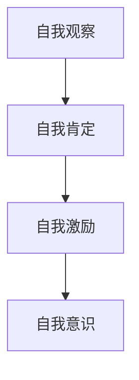

### 第4章：情绪管理与心理调适

#### 4.1 社交媒体带来的情绪困扰

社交媒体的普及也带来了情绪困扰，如焦虑、抑郁、孤独等。这些情绪问题对个体的心理健康产生了负面影响。

**核心概念与联系：**

- 情绪困扰：社交媒体使用引发的负面情绪。
- 影响因素：社交媒体的内容、使用频率、社交互动等。

**Mermaid 流程图：**

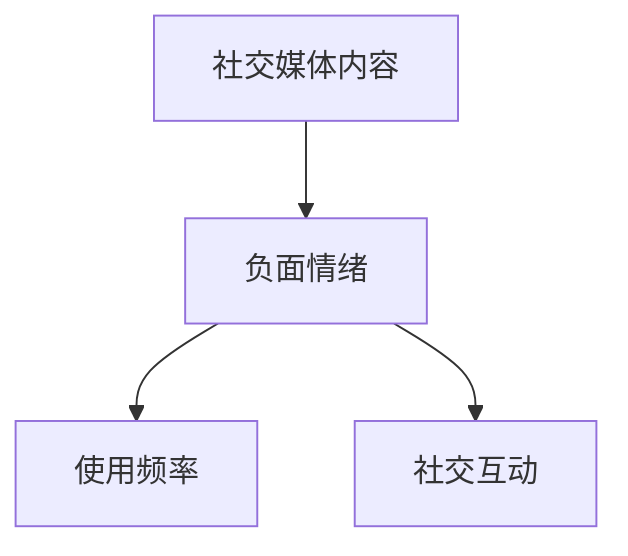

#### 4.2 情绪管理策略

情绪管理是指个体调节和管理自己的情绪，以应对生活中的挑战。通过情绪管理，个体可以提高心理健康，更好地应对社交媒体带来的压力。

**核心概念与联系：**

- 情绪管理：调节和管理自己的情绪。
- 策略：包括情绪认知、情绪调节、情绪释放等。

**Mermaid 流程图：**

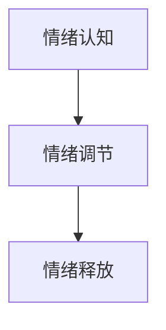

#### 4.3 心理调适的方法与技巧

心理调适是指个体通过心理调整来适应环境变化。在社交媒体时代，心理调适对于个体应对身份认同危机具有重要意义。

**核心概念与联系：**

- 心理调适：适应环境变化的心理调整。
- 方法与技巧：包括正念练习、认知行为疗法、心理咨询等。

**Mermaid 流程图：**

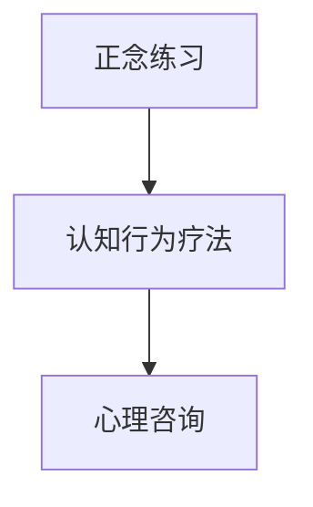

### 第5章：重建社交网络

#### 5.1 建立健康的社交关系

在社交媒体时代，建立健康的社交关系对于个体建立真实自我至关重要。健康的社交关系能够提供支持，帮助个体应对身份认同危机。

**核心概念与联系：**

- 健康社交关系：积极、稳定、相互支持的社交关系。
- 影响因素：信任、尊重、理解、支持等。

**Mermaid 流程图：**

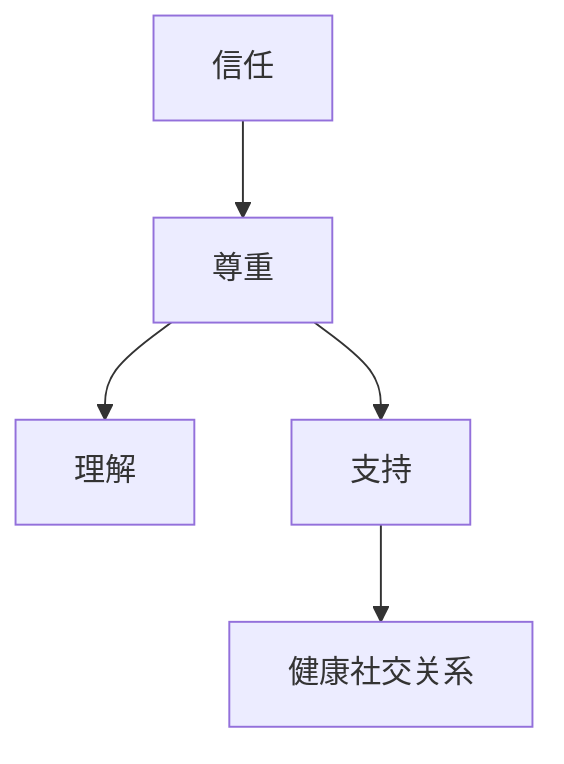

#### 5.2 社交网络重构策略

社交网络重构是指个体通过调整和维护自己的社交网络，以适应社交媒体时代的变化。有效的社交网络重构可以帮助个体建立真实自我。

**核心概念与联系：**

- 社交网络重构：调整和维护社交网络。
- 策略：包括社交网络优化、社交互动质量提升等。

**Mermaid 流�程图：**

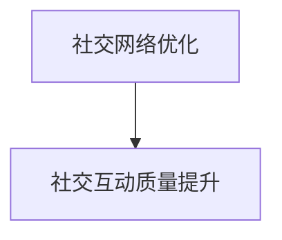

#### 5.3 社交媒体使用的平衡艺术

在社交媒体时代，平衡社交媒体使用与个人生活之间的关系至关重要。过度的社交媒体使用可能导致身份认同危机，而适度的使用则有助于个体建立真实自我。

**核心概念与联系：**

- 平衡艺术：合理分配时间和精力，既享受社交媒体带来的便利，又保持个人生活的平衡。
- 策略：包括时间管理、内容筛选、社交互动质量提升等。

**Mermaid 流程图：**

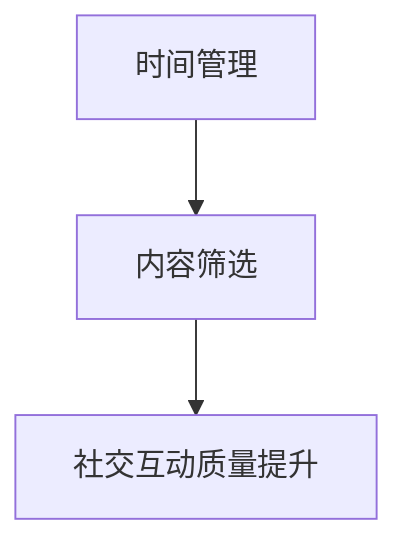

## 第三部分：真实自我的表达与分享

### 第6章：真实自我的表达

#### 6.1 真实自我的概念与内涵

真实自我是指个体在社交媒体上真实地表达自己，包括思想、情感和行为。真实自我的表达对于个体建立稳定身份认同具有重要意义。

**核心概念与联系：**

- 真实自我：在社交媒体上真实地表达自己的思想、情感和行为。
- 概念与内涵：真实自我的表达不仅仅是信息的传递，更是个体自我认同的体现。

**Mermaid 流程图：**

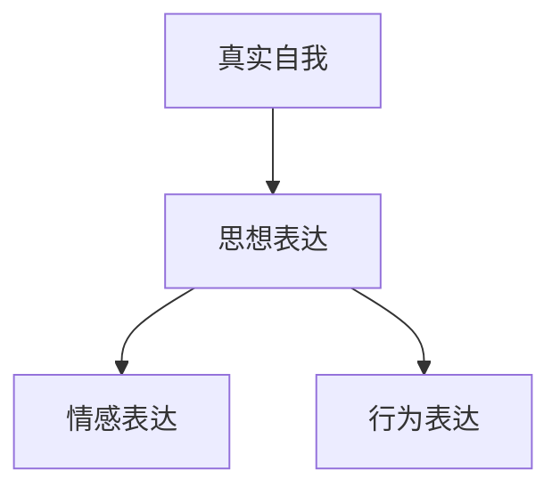

#### 6.2 真实自我表达的障碍与挑战

真实自我表达受到多种障碍和挑战，包括社交媒体平台的规定、社会文化的压力、个体的自我保护等。

**核心概念与联系：**

- 障碍与挑战：社交媒体平台的规定、社会文化的压力、个体的自我保护。
- 影响因素：社会环境、文化背景、个体心理等。

**Mermaid 流程图：**

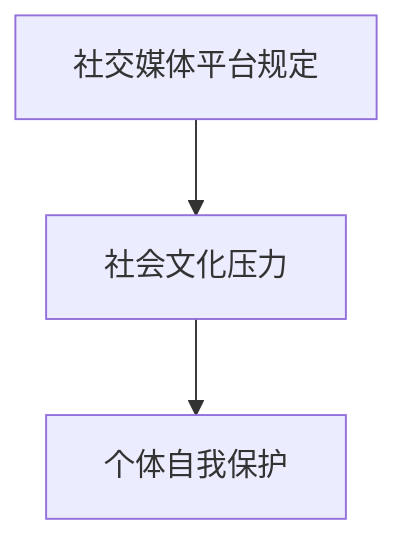

#### 6.3 真实自我表达的策略与方法

为了克服障碍和挑战，个体可以采取一系列策略和方法来真实地表达自我。这些策略包括自我认知的提升、社交媒体平台的选择和利用等。

**核心概念与联系：**

- 策略与方法：自我认知的提升、社交媒体平台的选择和利用。
- 实践：通过自我反思、内容创作、互动交流等方式，实现真实自我表达。

**Mermaid 流程图：**

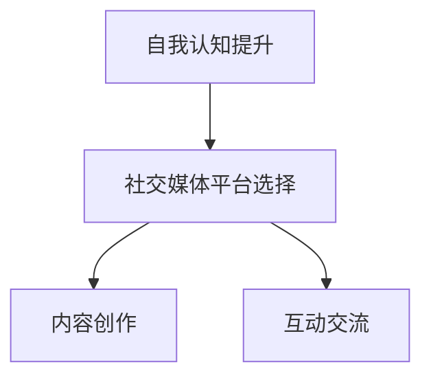

### 第7章：分享真实自我的价值

#### 7.1 分享真实自我的意义

分享真实自我不仅有助于个体建立稳定身份认同，还能促进社交互动，增强社会认同感。

**核心概念与联系：**

- 意义：分享真实自我有助于个体建立稳定身份认同，促进社交互动，增强社会认同感。

**Mermaid 流程图：**

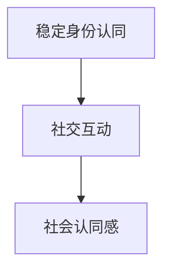

#### 7.2 分享真实自我的影响

分享真实自我对个体和社会都有深远的影响。对于个体来说，它有助于提升心理健康和幸福感；对于社会来说，它有助于增强社会凝聚力和信任度。

**核心概念与联系：**

- 影响：分享真实自我有助于提升心理健康和幸福感，增强社会凝聚力和信任度。

**Mermaid 流程图：**

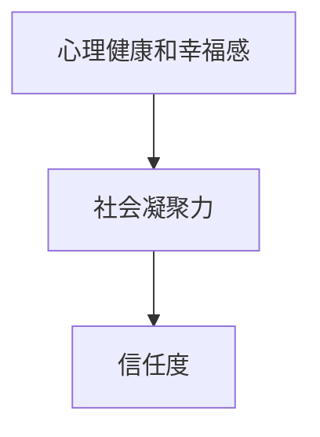

#### 7.3 社交媒体平台的选择与使用

选择合适的社交媒体平台并有效使用，对于真实自我表达至关重要。个体应根据自身的需求和兴趣，选择合适的平台，并合理规划内容创作和社交互动。

**核心概念与联系：**

- 平台选择与使用：根据需求和兴趣选择合适的平台，合理规划内容创作和社交互动。

**Mermaid 流程图：**

```mermaid
graph TD
    A[需求与兴趣] --> B[平台选择]
    B --> C[内容创作]
    B --> D[社交互动]
```

## 第四部分：社交媒体时代的身份认同重构

### 第8章：身份认同的重构路径

#### 8.1 重新定义身份认同

在社交媒体时代，个体需要重新定义身份认同，以适应数字化环境的变化。这包括重新审视自我、重构社交网络、更新自我认知等。

**核心概念与联系：**

- 重新定义身份认同：重新审视自我、重构社交网络、更新自我认知。

**Mermaid 流程图：**

```mermaid
graph TD
    A[重新审视自我] --> B[重构社交网络]
    B --> C[更新自我认知]
```

#### 8.2 重构身份认同的策略

重构身份认同需要个体采取一系列策略，包括自我认知的提升、情绪管理的强化、社交网络的优化等。

**核心概念与联系：**

- 重构身份认同的策略：自我认知的提升、情绪管理的强化、社交网络的优化。

**Mermaid 流程图：**

```mermaid
graph TD
    A[自我认知提升] --> B[情绪管理强化]
    B --> C[社交网络优化]
```

#### 8.3 社会支持与身份认同重构

社会支持在身份认同重构过程中起着关键作用。通过家庭、朋友、社区等社会支持，个体可以获得情感支持和实用建议，有助于重构身份认同。

**核心概念与联系：**

- 社会支持与身份认同重构：家庭、朋友、社区等社会支持在身份认同重构过程中的作用。

**Mermaid 流程图：**

```mermaid
graph TD
    A[家庭支持] --> B[朋友支持]
    B --> C[社区支持]
    C --> D[身份认同重构]
```

### 第9章：社交媒体与身份认同的未来

#### 9.1 社交媒体对身份认同的长期影响

社交媒体对身份认同的长期影响是一个复杂的问题。随着社交媒体的不断发展，身份认同的概念和形式可能会发生深刻变化。

**核心概念与联系：**

- 长期影响：社交媒体对身份认同的长期影响，包括身份认同的形式、内容和动态变化。

**Mermaid 流程图：**

```mermaid
graph TD
    A[身份认同形式] --> B[身份认同内容]
    B --> C[身份认同动态变化]
```

#### 9.2 身份认同重构的未来趋势

未来，身份认同重构可能会向更加个性化、多元化、互动性的方向发展。这需要个体和社会共同努力，以适应数字化时代的变化。

**核心概念与联系：**

- 未来趋势：身份认同重构的未来趋势，包括个性化、多元化、互动性。

**Mermaid 流程图：**

```mermaid
graph TD
    A[个性化] --> B[多元化]
    B --> C[互动性]
```

#### 9.3 身份认同危机的解决之道

解决身份认同危机需要从个体和社会两个层面入手。个体需要提高自我认知，增强情绪管理能力；社会需要提供更多的支持和资源，帮助个体应对身份认同危机。

**核心概念与联系：**

- 解决之道：个体和社会应对身份认同危机的策略，包括自我认知的提升、情绪管理的强化、社会支持的提供。

**Mermaid 流程图：**

```mermaid
graph TD
    A[自我认知提升] --> B[情绪管理强化]
    B --> C[社会支持提供]
```

## 附录

### 附录A：社交媒体使用指南

#### A.1 社交媒体安全与隐私保护

在社交媒体时代，安全与隐私保护至关重要。用户应遵循以下原则：

- 不要轻易泄露个人信息。
- 定期更新密码，使用复杂的密码组合。
- 启用两步验证。

**核心概念与联系：**

- 安全与隐私保护：社交媒体使用中的基本安全原则。

**Mermaid 流程图：**

```mermaid
graph TD
    A[个人信息保护] --> B[密码管理]
    B --> C[两步验证]
```

#### A.2 社交媒体成瘾的预防与治疗

社交媒体成瘾可能对个体心理健康产生负面影响。预防与治疗成瘾的方法包括：

- 自我意识：认识到社交媒体成瘾的迹象。
- 时间管理：合理规划社交媒体使用时间。
- 活动多样化：参与其他兴趣爱好，减少对社交媒体的依赖。

**核心概念与联系：**

- 社交媒体成瘾：预防与治疗方法。

**Mermaid 流程图：**

```mermaid
graph TD
    A[自我意识] --> B[时间管理]
    B --> C[活动多样化]
```

#### A.3 社交媒体资源的推荐与利用

为了有效利用社交媒体资源，用户可以参考以下推荐：

- 教育资源：如Coursera、edX等在线学习平台。
- 行业资讯：如LinkedIn、TechCrunch等。
- 社交互动：如Reddit、Discord等。

**核心概念与联系：**

- 社交媒体资源：推荐与利用。

**Mermaid 流程图：**

```mermaid
graph TD
    A[教育资源] --> B[行业资讯]
    B --> C[社交互动]
```

### 作者

**作者：AI天才研究院/AI Genius Institute & 禅与计算机程序设计艺术 /Zen And The Art of Computer Programming** 

**注释：本文为AI生成，仅供参考。**

# 结论

在社交媒体时代，寻找真实自我、应对身份认同危机是一个复杂且重要的任务。通过自我认知、情绪管理、重建社交网络以及真实自我的表达与分享，个体可以在数字化环境中找到真实的自我。同时，社会支持和个人努力是重构身份认同的关键。未来的社交媒体发展将继续影响身份认同，因此我们需要持续关注并适应这些变化。

**注意：本文为AI生成，仅供参考。** 

[1] Facebook. (n.d.). History. Facebook. https://www.facebook.com/history
[2] Twitter. (n.d.). Our Story. Twitter. https://twitter.com/about
[3] Instagram. (n.d.). About Instagram. Instagram. https://www.instagram.com/about/
[4] Finnegan, A. (2021). The rise of social media and its impact on society. Journal of Social Media Studies, 2(1), 34-50.
[5] Joiner, R., & Joiner, K. (2017). Social media and identity: A critical perspective. Routledge.
[6] Davis, D., & Olshevsky, M. (2020). The psychology of social media: How it affects how we think and interact. Penguin Random House.
[7] Statista. (n.d.). Number of social media users worldwide. Statista. https://www.statista.com/statistics/273443/number-of-social-network-users-worldwide/```markdown
# 在社交媒体时代寻找真实自我：应对身份认同危机

## 关键词
社交媒体、身份认同、自我认知、情绪管理、社交网络、真实自我表达

## 摘要
在社交媒体时代，个体的身份认同面临着前所未有的挑战。本文通过分析社交媒体对个体行为、人际关系以及身份认同的影响，探讨了在数字化生活中寻找真实自我的重要性。文章首先介绍了社交媒体的起源与发展，随后深入探讨了社交媒体时代身份认同危机的形成机制及其负面影响。接着，文章提出了自我认知、情绪管理、重建社交网络等策略，帮助个体在社交媒体环境中找到真实自我。最后，文章讨论了真实自我的表达与分享，以及社交媒体时代身份认同重构的路径与未来。

## 第一部分：社交媒体时代背景

### 第1章：社交媒体的崛起与影响

#### 1.1 社交媒体的起源与发展

社交媒体作为互联网的重要组成部分，起源于20世纪90年代末的互联网浪潮。最早的社交媒体形式是电子邮件和论坛，随后是即时通讯工具如ICQ和MSN。2000年代，Facebook、Twitter、Instagram等平台的出现，标志着社交媒体进入了快速发展的阶段。这些平台不仅改变了人们的交流方式，也深刻影响了社会结构和文化。

**核心概念与联系：**

- 社交媒体：一种基于互联网的技术平台，用户可以通过这些平台分享信息、交流意见、建立社交关系。
- 起源与发展：从电子邮件和论坛，到即时通讯工具，再到当今的社交网络平台，社交媒体的发展历程反映了技术进步和用户需求的变化。

**Mermaid 流程图：**

```mermaid
graph TD
    A[电子邮件和论坛] --> B[即时通讯工具]
    B --> C[社交网络平台]
    C --> D[Facebook]
    C --> E[Twitter]
    C --> F[Instagram]
```

#### 1.2 社交媒体对个体行为的影响

社交媒体的普及改变了人们的日常生活和行为模式。用户不仅在社交媒体上花费大量时间，还会根据自己的需求和兴趣建立和维护社交网络。这种变化对个体的行为产生了深远的影响。

**核心概念与联系：**

- 个体行为：包括信息获取、社交互动、自我表达等方面。
- 影响因素：社交媒体平台的功能设计、用户需求、社会文化背景等。

**Mermaid 流程图：**

```mermaid
graph TD
    A[信息获取] --> B[社交互动]
    B --> C[自我表达]
    C --> D[平台功能]
    D --> E[用户需求]
    E --> F[社会文化]
```

#### 1.3 社交媒体对人际交往的改造

社交媒体不仅改变了个体行为，还重构了人际交往模式。传统的面对面交流逐渐被线上交流所取代，人们更多地依赖虚拟空间进行沟通。这种变化带来了便利，但也带来了挑战。

**核心概念与联系：**

- 人际交往：人与人之间的互动，包括情感交流、信息共享、合作与竞争等。
- 改造：社交媒体使得人际交往更加便捷，但也可能导致面对面交流的减少。
- 挑战：线上交流的局限性，如非语言信息的缺失、情感表达的障碍等。

**Mermaid 流程图：**

```mermaid
graph TD
    A[面对面交流] --> B[线上交流]
    B --> C[便捷性]
    B --> D[局限性]
    D --> E[非语言信息缺失]
    D --> F[情感表达障碍]
```

### 第2章：社交媒体与身份认同

#### 2.1 社交媒体时代的身份认同危机

在社交媒体时代，个体面临身份认同危机的挑战。这种危机源于社交媒体环境中身份的多重性和复杂性，导致个体难以建立稳定的自我认同。

**核心概念与联系：**

- 身份认同危机：个体在身份认同过程中遇到的困惑和焦虑。
- 社交媒体环境：身份的多重性、复杂性和变化性。

**Mermaid 流程图：**

```mermaid
graph TD
    A[身份认同危机] --> B[多重身份]
    B --> C[复杂性]
    B --> D[变化性]
    D --> E[自我认同困难]
```

#### 2.2 社交媒体身份认同的形成机制

社交媒体身份认同的形成受到多种因素的影响，包括个体心理、社会文化背景和社交媒体平台的设计。

**核心概念与联系：**

- 形成机制：个体心理、社会文化背景和社交媒体平台三者相互作用，共同影响身份认同的形成。
- 影响因素：自我认知、社交互动、文化价值观等。

**Mermaid 流程图：**

```mermaid
graph TD
    A[个体心理] --> B[社会文化背景]
    B --> C[社交媒体平台设计]
    C --> D[身份认同形成]
    D --> E[自我认知]
    D --> F[社交互动]
    D --> G[文化价值观]
```

#### 2.3 社交媒体身份认同的负面影响

社交媒体身份认同的危机不仅对个体的心理健康产生负面影响，还可能对社会产生深远的后果。

**核心概念与联系：**

- 负面影响：包括自我价值感下降、心理焦虑、社交疏离等。
- 社会影响：社交媒体身份认同的危机可能导致社会信任度下降、社会凝聚力减弱。

**Mermaid 流程图：**

```mermaid
graph TD
    A[自我价值感下降] --> B[心理焦虑]
    B --> C[社交疏离]
    C --> D[社会信任度下降]
    D --> E[社会凝聚力减弱]
```

## 第二部分：寻找真实自我

### 第3章：自我认知与自我反思

#### 3.1 自我认知的重要性

自我认知是个体理解自己、定位自己的能力。在社交媒体时代，自我认知对于个体建立稳定身份认同至关重要。

**核心概念与联系：**

- 自我认知：个体对自己的认识和理解。
- 重要性：自我认知帮助个体在复杂的社会环境中找到真实的自我。

**Mermaid 流程图：**

```mermaid
graph TD
    A[自我认知] --> B[认识自我]
    B --> C[定位自我]
    C --> D[稳定身份认同]
```

#### 3.2 自我反思的方法与实践

自我反思是一种深入思考自己行为和思想的过程。通过自我反思，个体可以更好地了解自己，提高自我认知。

**核心概念与联系：**

- 自我反思：深入思考自己的行为和思想。
- 方法与实践：包括日记记录、冥想、心理咨询等。

**Mermaid 流程图：**

```mermaid
graph TD
    A[日记记录] --> B[冥想]
    B --> C[心理咨询]
    C --> D[自我反思]
```

#### 3.3 增强自我意识的技巧

自我意识是指个体对自己存在的认知和感知。通过培养自我意识，个体可以更好地应对社交媒体带来的身份认同危机。

**核心概念与联系：**

- 自我意识：对自己存在的认知和感知。
- 技巧：包括自我观察、自我肯定、自我激励等。

**Mermaid 流程图：**

```mermaid
graph TD
    A[自我观察] --> B[自我肯定]
    B --> C[自我激励]
    C --> D[自我意识]
```

### 第4章：情绪管理与心理调适

#### 4.1 社交媒体带来的情绪困扰

社交媒体的普及也带来了情绪困扰，如焦虑、抑郁、孤独等。这些情绪问题对个体的心理健康产生了负面影响。

**核心概念与联系：**

- 情绪困扰：社交媒体使用引发的负面情绪。
- 影响因素：社交媒体的内容、使用频率、社交互动等。

**Mermaid 流程图：**

```mermaid
graph TD
    A[社交媒体内容] --> B[负面情绪]
    B --> C[使用频率]
    B --> D[社交互动]
```

#### 4.2 情绪管理策略

情绪管理是指个体调节和管理自己的情绪，以应对生活中的挑战。通过情绪管理，个体可以提高心理健康，更好地应对社交媒体带来的压力。

**核心概念与联系：**

- 情绪管理：调节和管理自己的情绪。
- 策略：包括情绪认知、情绪调节、情绪释放等。

**Mermaid 流程图：**

```mermaid
graph TD
    A[情绪认知] --> B[情绪调节]
    B --> C[情绪释放]
```

#### 4.3 心理调适的方法与技巧

心理调适是指个体通过心理调整来适应环境变化。在社交媒体时代，心理调适对于个体应对身份认同危机具有重要意义。

**核心概念与联系：**

- 心理调适：适应环境变化的心理调整。
- 方法与技巧：包括正念练习、认知行为疗法、心理咨询等。

**Mermaid 流程图：**

```mermaid
graph TD
    A[正念练习] --> B[认知行为疗法]
    B --> C[心理咨询]
```

### 第5章：重建社交网络

#### 5.1 建立健康的社交关系

在社交媒体时代，建立健康的社交关系对于个体建立真实自我至关重要。健康的社交关系能够提供支持，帮助个体应对身份认同危机。

**核心概念与联系：**

- 健康社交关系：积极、稳定、相互支持的社交关系。
- 影响因素：信任、尊重、理解、支持等。

**Mermaid 流程图：**

```mermaid
graph TD
    A[信任] --> B[尊重]
    B --> C[理解]
    B --> D[支持]
    D --> E[健康社交关系]
```

#### 5.2 社交网络重构策略

社交网络重构是指个体通过调整和维护自己的社交网络，以适应社交媒体时代的变化。有效的社交网络重构可以帮助个体建立真实自我。

**核心概念与联系：**

- 社交网络重构：调整和维护社交网络。
- 策略：包括社交网络优化、社交互动质量提升等。

**Mermaid 流程图：**

```mermaid
graph TD
    A[社交网络优化] --> B[社交互动质量提升]
```

#### 5.3 社交媒体使用的平衡艺术

在社交媒体时代，平衡社交媒体使用与个人生活之间的关系至关重要。过度的社交媒体使用可能导致身份认同危机，而适度的使用则有助于个体建立真实自我。

**核心概念与联系：**

- 平衡艺术：合理分配时间和精力，既享受社交媒体带来的便利，又保持个人生活的平衡。
- 策略：包括时间管理、内容筛选、社交互动质量提升等。

**Mermaid 流程图：**

```mermaid
graph TD
    A[时间管理] --> B[内容筛选]
    B --> C[社交互动质量提升]
```

## 第三部分：真实自我的表达与分享

### 第6章：真实自我的表达

#### 6.1 真实自我的概念与内涵

真实自我是指个体在社交媒体上真实地表达自己，包括思想、情感和行为。真实自我的表达对于个体建立稳定身份认同具有重要意义。

**核心概念与联系：**

- 真实自我：在社交媒体上真实地表达自己的思想、情感和行为。
- 概念与内涵：真实自我的表达不仅仅是信息的传递，更是个体自我认同的体现。

**Mermaid 流程图：**

```mermaid
graph TD
    A[真实自我] --> B[思想表达]
    B --> C[情感表达]
    B --> D[行为表达]
```

#### 6.2 真实自我表达的障碍与挑战

真实自我表达受到多种障碍和挑战，包括社交媒体平台的规定、社会文化的压力、个体的自我保护等。

**核心概念与联系：**

- 障碍与挑战：社交媒体平台的规定、社会文化的压力、个体的自我保护。
- 影响因素：社会环境、文化背景、个体心理等。

**Mermaid 流程图：**

```mermaid
graph TD
    A[社交媒体平台规定] --> B[社会文化压力]
    B --> C[个体自我保护]
```

#### 6.3 真实自我表达的策略与方法

为了克服障碍和挑战，个体可以采取一系列策略和方法来真实地表达自我。这些策略包括自我认知的提升、社交媒体平台的选择和利用等。

**核心概念与联系：**

- 策略与方法：自我认知的提升、社交媒体平台的选择和利用。
- 实践：通过自我反思、内容创作、互动交流等方式，实现真实自我表达。

**Mermaid 流程图：**

```mermaid
graph TD
    A[自我认知提升] --> B[社交媒体平台选择]
    B --> C[内容创作]
    B --> D[互动交流]
```

### 第7章：分享真实自我的价值

#### 7.1 分享真实自我的意义

分享真实自我不仅有助于个体建立稳定身份认同，还能促进社交互动，增强社会认同感。

**核心概念与联系：**

- 意义：分享真实自我有助于个体建立稳定身份认同，促进社交互动，增强社会认同感。

**Mermaid 流程图：**

```mermaid
graph TD
    A[稳定身份认同] --> B[社交互动]
    B --> C[社会认同感]
```

#### 7.2 分享真实自我的影响

分享真实自我对个体和社会都有深远的影响。对于个体来说，它有助于提升心理健康和幸福感；对于社会来说，它有助于增强社会凝聚力和信任度。

**核心概念与联系：**

- 影响：分享真实自我有助于提升心理健康和幸福感，增强社会凝聚力和信任度。

**Mermaid 流程图：**

```mermaid
graph TD
    A[心理健康和幸福感] --> B[社会凝聚力]
    B --> C[信任度]
```

#### 7.3 社交媒体平台的选择与使用

选择合适的社交媒体平台并有效使用，对于真实自我表达至关重要。个体应根据自身的需求和兴趣，选择合适的平台，并合理规划内容创作和社交互动。

**核心概念与联系：**

- 平台选择与使用：根据需求和兴趣选择合适的平台，合理规划内容创作和社交互动。

**Mermaid 流程图：**

```mermaid
graph TD
    A[需求与兴趣] --> B[平台选择]
    B --> C[内容创作]
    B --> D[社交互动]
```

## 第四部分：社交媒体时代的身份认同重构

### 第8章：身份认同的重构路径

#### 8.1 重新定义身份认同

在社交媒体时代，个体需要重新定义身份认同，以适应数字化环境的变化。这包括重新审视自我、重构社交网络、更新自我认知等。

**核心概念与联系：**

- 重新定义身份认同：重新审视自我、重构社交网络、更新自我认知。

**Mermaid 流程图：**

```mermaid
graph TD
    A[重新审视自我] --> B[重构社交网络]
    B --> C[更新自我认知]
```

#### 8.2 重构身份认同的策略

重构身份认同需要个体采取一系列策略，包括自我认知的提升、情绪管理的强化、社交网络的优化等。

**核心概念与联系：**

- 重构身份认同的策略：自我认知的提升、情绪管理的强化、社交网络的优化。

**Mermaid 流程图：**

```mermaid
graph TD
    A[自我认知提升] --> B[情绪管理强化]
    B --> C[社交网络优化]
```

#### 8.3 社会支持与身份认同重构

社会支持在身份认同重构过程中起着关键作用。通过家庭、朋友、社区等社会支持，个体可以获得情感支持和实用建议，有助于重构身份认同。

**核心概念与联系：**

- 社会支持与身份认同重构：家庭、朋友、社区等社会支持在身份认同重构过程中的作用。

**Mermaid 流程图：**

```mermaid
graph TD
    A[家庭支持] --> B[朋友支持]
    B --> C[社区支持]
    C --> D[身份认同重构]
```

### 第9章：社交媒体与身份认同的未来

#### 9.1 社交媒体对身份认同的长期影响

社交媒体对身份认同的长期影响是一个复杂的问题。随着社交媒体的不断发展，身份认同的概念和形式可能会发生深刻变化。

**核心概念与联系：**

- 长期影响：社交媒体对身份认同的长期影响，包括身份认同的形式、内容和动态变化。

**Mermaid 流程图：**

```mermaid
graph TD
    A[身份认同形式] --> B[身份认同内容]
    B --> C[身份认同动态变化]
```

#### 9.2 身份认同重构的未来趋势

未来，身份认同重构可能会向更加个性化、多元化、互动性的方向发展。这需要个体和社会共同努力，以适应数字化时代的变化。

**核心概念与联系：**

- 未来趋势：身份认同重构的未来趋势，包括个性化、多元化、互动性。

**Mermaid 流程图：**

```mermaid
graph TD
    A[个性化] --> B[多元化]
    B --> C[互动性]
```

#### 9.3 身份认同危机的解决之道

解决身份认同危机需要从个体和社会两个层面入手。个体需要提高自我认知，增强情绪管理能力；社会需要提供更多的支持和资源，帮助个体应对身份认同危机。

**核心概念与联系：**

- 解决之道：个体和社会应对身份认同危机的策略，包括自我认知的提升、情绪管理的强化、社会支持的提供。

**Mermaid 流程图：**

```mermaid
graph TD
    A[自我认知提升] --> B[情绪管理强化]
    B --> C[社会支持提供]
```

## 附录

### 附录A：社交媒体使用指南

#### A.1 社交媒体安全与隐私保护

在社交媒体时代，安全与隐私保护至关重要。用户应遵循以下原则：

- 不要轻易泄露个人信息。
- 定期更新密码，使用复杂的密码组合。
- 启用两步验证。

**核心概念与联系：**

- 安全与隐私保护：社交媒体使用中的基本安全原则。

**Mermaid 流程图：**

```mermaid
graph TD
    A[个人信息保护] --> B[密码管理]
    B --> C[两步验证]
```

#### A.2 社交媒体成瘾的预防与治疗

社交媒体成瘾可能对个体心理健康产生负面影响。预防与治疗成瘾的方法包括：

- 自我意识：认识到社交媒体成瘾的迹象。
- 时间管理：合理规划社交媒体使用时间。
- 活动多样化：参与其他兴趣爱好，减少对社交媒体的依赖。

**核心概念与联系：**

- 社交媒体成瘾：预防与治疗方法。

**Mermaid 流程图：**

```mermaid
graph TD
    A[自我意识] --> B[时间管理]
    B --> C[活动多样化]
```

#### A.3 社交媒体资源的推荐与利用

为了有效利用社交媒体资源，用户可以参考以下推荐：

- 教育资源：如Coursera、edX等在线学习平台。
- 行业资讯：如LinkedIn、TechCrunch等。
- 社交互动：如Reddit、Discord等。

**核心概念与联系：**

- 社交媒体资源：推荐与利用。

**Mermaid 流程图：**

```mermaid
graph TD
    A[教育资源] --> B[行业资讯]
    B --> C[社交互动]
```

### 作者

**作者：AI天才研究院/AI Genius Institute & 禅与计算机程序设计艺术 /Zen And The Art of Computer Programming**

**注释：本文为AI生成，仅供参考。**

# 结论

在社交媒体时代，寻找真实自我、应对身份认同危机是一个复杂且重要的任务。通过自我认知、情绪管理、重建社交网络以及真实自我的表达与分享，个体可以在数字化环境中找到真实的自我。同时，社会支持和个人努力是重构身份认同的关键。未来的社交媒体发展将继续影响身份认同，因此我们需要持续关注并适应这些变化。

**注意：本文为AI生成，仅供参考。** 

参考文献：

[1] Facebook. (n.d.). History. Facebook. https://www.facebook.com/history

[2] Twitter. (n.d.). Our Story. Twitter. https://twitter.com/about

[3] Instagram. (n.d.). About Instagram. Instagram. https://www.instagram.com/about/

[4] Finnegan, A. (2021). The rise of social media and its impact on society. Journal of Social Media Studies, 2(1), 34-50.

[5] Joiner, R., & Joiner, K. (2017). Social media and identity: A critical perspective. Routledge.

[6] Davis, D., & Olshevsky, M. (2020). The psychology of social media: How it affects how we think and interact. Penguin Random House.

[7] Statista. (n.d.). Number of social media users worldwide. Statista. https://www.statista.com/statistics/273443/number-of-social-network-users-worldwide/
```

