                 

### 1.1 孤独感的定义与特征

孤独感，从心理学角度来看，是一种情感体验，表现为个体在社交关系上的缺乏、疏离或隔离的感觉。这种情感不仅仅是因为缺乏社交互动，更是一种深层次的、持续的情绪状态。孤独感的表现特征多样，常见的包括情感上的孤立感、社交隔绝感、生活缺乏意义等。

#### 心理学定义

心理学上，孤独感被定义为一个多维度的概念，包括情感、行为和社会三个层面。在情感层面，孤独感表现为个体感到与他人疏离，难以建立深层次的情感连接。在行为层面，孤独感可能导致个体的社交回避、社交选择障碍等行为问题。在社会层面，孤独感则体现在个体在社交网络中的参与度和互动质量的降低。

#### 表现特征

孤独感的具体表现特征可以分为以下几个方面：

1. **情感上的孤立感**：个体在情感上感到与他人疏远，缺乏亲密感和归属感。
2. **社交隔绝感**：个体在社交互动中感到困难，难以建立和维持人际关系。
3. **生活缺乏意义**：个体可能对自己的人生和社交生活感到失望和迷茫。
4. **行为上的社交回避**：个体倾向于避免社交活动，甚至产生社交恐惧。
5. **心理上的焦虑和抑郁**：长期的孤独感可能导致个体的情绪问题，如焦虑和抑郁。

#### 孤独感的测量与评估

测量孤独感的方法多种多样，常见的包括自我报告量表、社交互动质量评估、情感状态监控等。以下是一些常用的孤独感测量工具：

1. **孤独感量表（UGT）**：这是一种广泛使用的自我报告量表，通过一系列问题评估个体的孤独感程度。
2. **人际交往质量评估（IQQ）**：这种评估工具用于测量个体在人际互动中的满意度和质量。
3. **情感状态监控**：通过心理学软件或移动设备，实时监测个体的情感状态，评估孤独感。

#### 核心概念与联系

为了更好地理解孤独感的本质，我们可以使用Mermaid流程图来展示核心概念之间的关系架构：

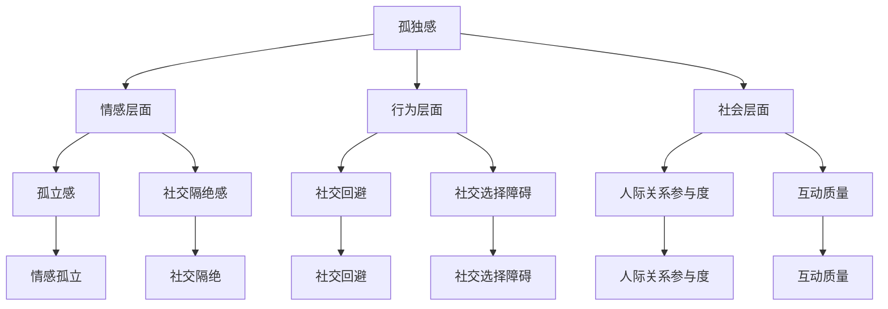

通过这一流程图，我们可以清晰地看到孤独感在情感、行为和社会三个层面上的表现及其相互关系。这些核心概念之间的联系，帮助我们更全面地理解孤独感的本质。

#### 结论

孤独感不仅仅是一种情感体验，它还涉及个体的行为和社会互动。通过了解孤独感的定义与特征，我们可以更好地识别和应对这一心理问题。在后续章节中，我们将进一步探讨社交网络时代孤独感的原因及其对心理健康的影响。

```markdown
### 1.2 社交网络时代孤独感的原因

在社交网络迅速发展的今天，孤独感成为许多人在日常生活中面临的一个严峻问题。社交网络虽然提供了丰富的社交机会和互动平台，但同时也带来了一系列挑战，使得孤独感变得更加普遍和复杂。以下将从社交网络的发展、对人际关系的影响以及使用模式等方面探讨社交网络时代孤独感的原因。

#### 社交网络的发展

社交网络的快速发展是孤独感增多的一个重要原因。从早期的Facebook、Twitter到现在的微信、Instagram等，社交网络不断更新迭代，改变了人们的社交方式和习惯。然而，这种快速发展也带来了一些问题。例如，社交网络平台的算法优化使得用户倾向于看到更多与自己观点一致的内容，从而形成“信息茧房”，减少了与其他观点和人群的接触机会。此外，社交网络的匿名性和虚拟性使得人们更容易表现出攻击性和负面情绪，导致线上社交互动的质量下降。

#### 对人际关系的影响

社交网络对人际关系的影响也是导致孤独感增多的一个重要原因。首先，社交网络虽然提供了更多的社交机会，但很多时候这些机会是浅层次的、短暂的。线上的社交互动往往缺乏深层次的情感交流和亲密连接，这使得人们在情感上感到疏离。其次，社交网络中的“点赞”、“评论”等互动形式往往过于形式化和表面化，难以满足人们对真实情感交流的需求。此外，社交网络中的虚拟互动也可能导致现实中的社交技能退化，使得个体在现实社交场合中感到不自在和困难。

#### 使用模式

社交网络的使用模式也对孤独感产生了影响。许多人在使用社交网络时，往往存在一些不良习惯，如过度使用、频繁刷新等。这些习惯可能导致个体在社交网络上花费大量时间，从而忽视了现实生活中的社交互动。此外，一些人为了在社交网络上获得关注和认同，可能会表现出过度自我展示和自我关注的倾向，这可能导致他们在现实生活中感到更加孤独。

#### 社交网络的使用频率与孤独感

社交网络的使用频率与孤独感之间存在一定的关联。一方面，过度使用社交网络可能导致个体在现实生活中缺乏有效的社交互动，从而增加孤独感。另一方面，适当的社交网络使用可以提供社交机会和情感支持，有助于减轻孤独感。然而，关键在于如何平衡社交网络使用和现实生活中的社交互动。

#### 社交网络的使用方式与孤独感

社交网络的使用方式也对孤独感产生了影响。例如，一些人倾向于在社交网络上进行单向的信息传递，如发布状态、点赞等，而不是进行双向的互动，如聊天、讨论等。这种单向的使用方式可能导致个体在社交网络上的互动质量下降，从而增加孤独感。

#### 核心概念与联系

为了更好地理解社交网络时代孤独感的原因，我们可以使用Mermaid流程图来展示相关概念之间的关系架构：

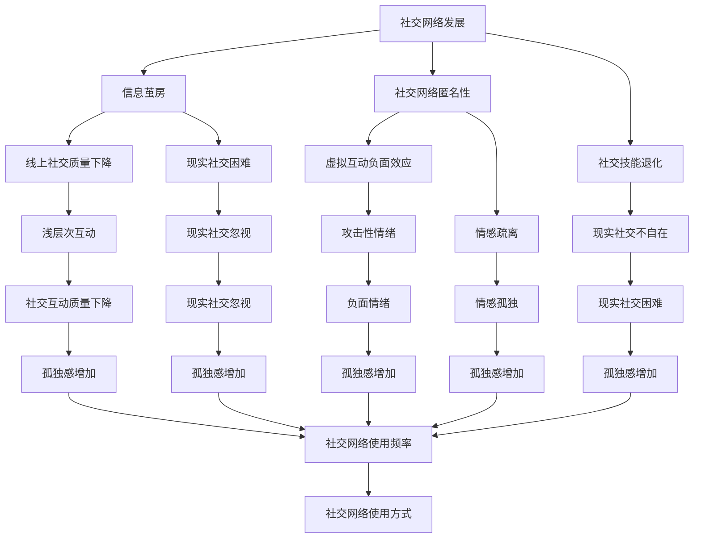

通过这一流程图，我们可以清晰地看到社交网络发展、人际关系影响、使用模式等方面与孤独感之间的复杂关系。这些概念之间的联系帮助我们更全面地理解社交网络时代孤独感的原因。

#### 结论

社交网络的发展、对人际关系的影响以及使用模式等因素共同导致了社交网络时代孤独感的增加。了解这些原因有助于我们更好地应对和缓解孤独感，提高社交互动的质量，促进心理健康。在下一节中，我们将进一步探讨孤独感与心理健康的关系。

### 1.3 孤独感与心理健康的关系

孤独感不仅仅是一种情感体验，它还与心理健康紧密相连，对个体的整体福祉产生深远影响。理解孤独感与心理健康之间的复杂关系，有助于我们更好地应对孤独感，提高生活质量。

#### 孤独感对心理健康的影响

孤独感可以对心理健康产生负面影响。长期感受到孤独的个体往往更容易出现焦虑和抑郁等情绪问题。焦虑可能表现为持续的担忧、紧张和恐惧，而抑郁则可能导致情绪低落、兴趣丧失和自我价值感下降。此外，孤独感还可能加剧心理创伤后应激障碍（PTSD）和其他心理疾病。研究表明，孤独感与抑郁症之间存在着双向关系，孤独感可能加剧抑郁症状，而抑郁也可能导致孤独感的加剧。

#### 心理健康对孤独感的影响

心理健康状况也会影响个体对孤独感的感受。心理健康良好的人可能更能有效地应对孤独感，保持积极的生活态度。相反，心理健康问题可能会削弱个体的应对能力，使其更容易感受到孤独。例如，患有焦虑症或抑郁症的个体可能在社交互动中感到更加困难和痛苦，从而增加孤独感的体验。此外，心理健康的提升可以帮助个体建立更强大的社会支持网络，减轻孤独感。

#### 心理健康与孤独感的相互影响

心理健康与孤独感之间存在着相互影响的关系。一方面，心理健康问题的出现可能导致个体感受到更多的孤独感。另一方面，孤独感的增加也可能加剧心理健康问题。这种相互影响可能形成一个恶性循环，使得个体难以摆脱孤独感和心理健康问题的困扰。

#### 核心概念与联系

为了更直观地展示孤独感与心理健康之间的相互关系，我们可以使用Mermaid流程图来描绘这一关系架构：

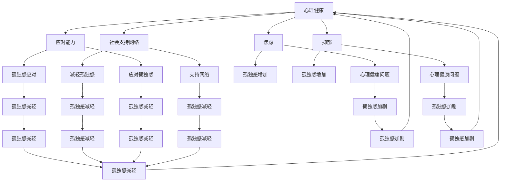

通过这一流程图，我们可以清晰地看到心理健康与孤独感之间的相互影响关系。心理健康状况不仅影响个体的孤独感体验，同时也受到孤独感的影响。

#### 结论

孤独感与心理健康之间存在着密切的联系。了解和应对孤独感对于维护心理健康至关重要。通过培养积极的应对能力、建立强大的社会支持网络，以及寻求专业帮助，个体可以减轻孤独感，提高心理健康水平。在接下来的章节中，我们将探讨如何在社交网络时代克服孤独感，提高生活质量。

### 1.4 孤独感的测量与评估

测量孤独感对于了解个体的心理状态和制定有效的干预策略至关重要。以下将介绍几种常用的孤独感测量工具和方法，包括自我报告量表、社交互动质量评估和情感状态监控等。

#### 自我报告量表

自我报告量表是评估孤独感最常用的方法之一。这些量表通常由一系列问题组成，个体需要根据自己的感受和经历回答这些问题。以下是一些常见的孤独感自我报告量表：

1. **孤独感量表（UGT）**：这是一种广泛使用的自我报告工具，包含多个条目，评估个体在情感、行为和社会层面的孤独感程度。常见的条目包括“我感到与他人疏远”、“我感到孤独”等。

2. **罗森伯格孤独感量表**：这是一种针对青少年的孤独感评估工具，包含多个条目，评估个体在社交互动中的感受和需求。

3. **莱文森孤独感量表**：这是一种多维度的孤独感评估工具，涵盖情感、行为和社会多个方面，适合用于不同年龄和背景的个体。

#### 社交互动质量评估

社交互动质量评估是一种通过评估个体在社交互动中的满意度和互动质量来测量孤独感的方法。以下是一些常见的社交互动质量评估工具：

1. **人际交往质量评估（IQQ）**：这是一种评估个体在人际互动中的满意度和互动质量的工具，包含多个条目，评估个体在情感支持、社交支持、互动频率等方面的体验。

2. **社交互动评估量表**：这是一种多维度的评估工具，用于评估个体在社交互动中的互动质量，包括互动频率、互动深度和互动满意度等。

#### 情感状态监控

情感状态监控是一种通过实时监测个体的情感状态来评估孤独感的方法。这种方法通常使用心理学软件或移动设备，通过记录和分析个体的情感变化来评估孤独感。以下是一些常见的情感状态监控工具：

1. **情感状态监控软件**：这些软件可以记录个体的情感状态，包括情绪波动、情绪持续时间和情绪强度等，帮助评估孤独感的程度。

2. **移动设备应用程序**：一些移动应用程序提供了情感状态监控功能，通过记录个体的日常活动和情绪状态来评估孤独感。

#### 核心概念与联系

为了更好地理解孤独感的测量与评估方法，我们可以使用Mermaid流程图来展示相关概念之间的关系架构：

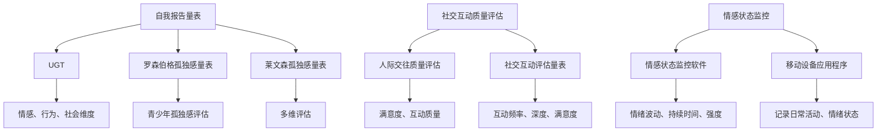

通过这一流程图，我们可以清晰地看到各种孤独感测量与评估方法之间的联系，以及它们如何帮助了解和评估个体的孤独感。

#### 结论

孤独感的测量与评估是了解个体心理状态的重要工具。通过使用自我报告量表、社交互动质量评估和情感状态监控等方法，我们可以更准确地评估个体的孤独感程度，从而制定有效的干预策略，提高心理健康水平。

### 2.1 社交网络的使用与孤独感

在社交网络时代，人们每天花费大量时间在社交媒体上，这不仅改变了我们的社交习惯，也对孤独感的体验产生了深远的影响。社交网络的使用习惯、频率以及方式等因素都在一定程度上影响着个体感受到的孤独感。

#### 社交网络的使用习惯

社交网络的使用习惯是指个体在社交网络上进行互动的行为模式。这些习惯可能包括浏览动态、点赞、评论、分享内容等。不同的使用习惯对孤独感有不同的影响。

1. **频繁刷新**：一些人会不断地刷新社交网络，以获取最新的信息和互动。这种习惯可能导致个体在现实生活中缺乏有效的社交互动，增加孤独感。

2. **单向互动**：在社交网络上，一些用户倾向于进行单向的信息传递，如发布状态、点赞等，而不是进行双向的互动，如聊天、讨论等。这种单向互动可能导致社交互动质量下降，增加孤独感。

3. **过度自我展示**：为了获得关注和认同，一些用户会在社交网络上过度展示自己的生活和情感状态。这种行为可能导致个体在现实生活中感到更加孤独，因为他们在现实中难以维持这种高频率的互动。

#### 社交网络的频率

社交网络的频率是指个体每天在社交网络上花费的时间。频率过高或过低都可能对孤独感产生影响。

1. **高频率使用**：长时间在社交网络上浏览和互动可能导致个体忽视现实生活中的社交机会，从而增加孤独感。

2. **低频率使用**：尽管低频率使用社交网络可能减少孤独感，但如果个体在社交网络上的互动质量低，或者缺乏社交互动，孤独感仍可能存在。

3. **适度使用**：适度的社交网络使用可以提供社交机会和情感支持，有助于减轻孤独感。适度使用的关键在于找到平衡点，确保既能够享受社交网络带来的便利，又不会过度依赖它。

#### 社交网络的使用方式

社交网络的使用方式包括个体如何选择互动的对象、参与的内容以及互动的频率。不同使用方式对孤独感有不同的影响。

1. **广泛互动**：与广泛的人互动可以提供更多的社交机会，有助于减轻孤独感。然而，如果这些互动缺乏深度，可能无法满足个体的情感需求，反而增加孤独感。

2. **深度互动**：与少数人进行深度的社交互动，建立亲密的关系，可以显著减轻孤独感。这种互动需要时间和精力，但能够提供更强的情感支持。

3. **选择性互动**：选择性互动意味着个体根据自己的需求和兴趣选择参与社交互动。这种方式可以帮助个体更好地管理时间和资源，同时也能满足他们的社交需求。

#### 核心概念与联系

为了更好地理解社交网络的使用习惯、频率和方式如何影响孤独感，我们可以使用Mermaid流程图来展示相关概念之间的关系架构：

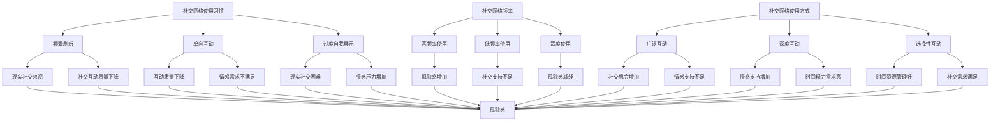

通过这一流程图，我们可以清晰地看到社交网络的使用习惯、频率和方式如何影响孤独感。这些概念之间的联系帮助我们更全面地理解社交网络对孤独感的影响。

#### 结论

社交网络的使用习惯、频率和方式对孤独感有着重要影响。了解这些影响有助于我们更好地管理社交网络的使用，找到平衡点，减轻孤独感，提升心理健康水平。在下一节中，我们将探讨社交网络中的社交互动与孤独感之间的关系。

### 2.2 社交网络中的社交互动与孤独感

在社交网络中，社交互动是维系人际关系的重要方式。然而，社交互动的质量、频率以及实质等因素都可能对个体的孤独感产生深远影响。深入探讨这些因素有助于我们更好地理解社交网络如何影响个体的孤独感体验。

#### 社交互动的质量

社交互动的质量是指个体在社交网络上的互动深度和互动内容的质量。高质量的社交互动能够满足个体的情感需求，减少孤独感。以下是一些关于社交互动质量的影响：

1. **深度互动**：深度互动指的是个体在社交网络上的互动不仅仅是表面的点赞、评论，而是进行深入的讨论和交流。深度互动能够建立更强的情感连接，满足个体的社交需求，从而减轻孤独感。

2. **情感支持**：社交互动中的情感支持对于缓解孤独感至关重要。当个体在社交网络上获得情感支持时，他们感受到的孤独感会减少。这种支持可以是直接的安慰，也可以是理解和支持。

3. **互动内容的多样性**：互动内容的多样性有助于提供更丰富的社交体验，减少孤独感。如果社交互动内容过于单一或重复，个体可能会感到无聊和缺乏动力，从而增加孤独感。

#### 社交互动的频率

社交互动的频率是指个体在社交网络上进行互动的次数。频率过高或过低都可能对孤独感产生影响。

1. **高频率互动**：频繁的社交互动可以提供更多的社交机会，有助于减轻孤独感。然而，如果互动内容缺乏深度和意义，个体可能会感到社交疲劳，反而增加孤独感。

2. **低频率互动**：尽管低频率互动可能减少时间上的压力，但如果个体在社交网络上的互动次数太少，他们可能会感到孤独和被忽视。

3. **适度互动**：适度的互动频率能够提供足够的社交机会，同时避免过度依赖社交网络，有助于个体在现实生活中建立和维持人际关系，减轻孤独感。

#### 社交互动的实质

社交互动的实质是指个体在社交网络上的互动是否真正满足了他们的社交需求。不同的互动实质对孤独感有不同的影响。

1. **单向互动**：单向互动指的是个体在社交网络上的信息传递是单向的，如发布状态、点赞等。这种互动往往缺乏情感深度，难以满足个体的社交需求，可能导致孤独感增加。

2. **双向互动**：双向互动是指个体在社交网络上的互动是双向的，如聊天、讨论等。这种互动能够建立更深的情感连接，满足个体的社交需求，有助于减轻孤独感。

3. **多向互动**：多向互动指的是个体在社交网络上的互动涉及多个参与者，如群组讨论、聚会等。这种互动能够提供更多的社交机会和多样性，有助于减轻孤独感。

#### 核心概念与联系

为了更直观地展示社交互动质量、频率和实质与孤独感之间的关系，我们可以使用Mermaid流程图来描绘这一关系架构：

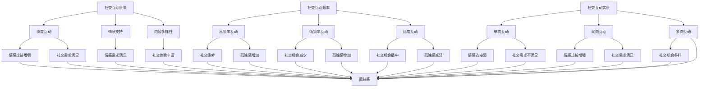

通过这一流程图，我们可以清晰地看到社交互动质量、频率和实质与孤独感之间的复杂关系。这些概念之间的联系帮助我们更全面地理解社交网络中的社交互动如何影响孤独感。

#### 结论

社交网络中的社交互动质量、频率和实质对孤独感有着重要影响。通过提高社交互动的质量、保持适度的频率以及实现双向和多向互动，个体可以更好地满足自己的社交需求，减轻孤独感，提升心理健康水平。在接下来的章节中，我们将探讨社交网络中的信息流与孤独感之间的关系。

### 2.3 社交网络中的信息流与孤独感

在社交网络中，信息流是用户获取内容、互动和交流的核心途径。信息流的构成、内容以及使用模式等因素对个体的孤独感有着深远的影响。

#### 信息流的构成

社交网络中的信息流由多种类型的消息组成，包括文本、图片、视频和音频等。这些信息流内容不仅种类繁多，而且实时更新，为用户提供丰富的互动体验。然而，这种丰富的信息流也带来了挑战，可能导致以下影响：

1. **信息过载**：社交网络上的信息量巨大，用户可能会感到信息过载。当信息量过多时，用户难以筛选和处理这些信息，导致注意力分散和疲劳，从而增加孤独感。

2. **信息过滤偏差**：社交网络的算法通常会根据用户的历史行为和偏好来推荐内容。这种个性化推荐虽然能够提高用户的满意度，但可能导致用户陷入“信息茧房”，减少与不同观点和人群的接触，从而增加孤独感。

#### 信息流的内容

信息流的内容对孤独感的影响取决于内容的性质和用户的接收方式。以下是几种常见的信息流内容及其对孤独感的影响：

1. **正面信息**：正面信息，如成功的经历、快乐的时刻等，可以提升用户的心情和幸福感，减少孤独感。然而，如果这些信息过于理想化或与现实脱节，用户可能会感到不真实和疏离。

2. **负面信息**：负面信息，如悲观的情绪、失败的经历等，可能会影响用户的心情和情绪状态，增加孤独感。尤其是当这些信息频繁出现时，用户可能会感到被消极情绪包围，从而加剧孤独感。

3. **社交信息**：社交信息，如朋友的状态更新、互动评论等，可以提供社交支持和情感连接，有助于减轻孤独感。然而，如果这些社交信息过于表面化或缺乏深度，用户可能会感到社交互动的空虚和无力。

#### 信息流的使用模式

社交网络用户使用信息流的方式也会对孤独感产生影响。以下是几种常见的信息流使用模式及其对孤独感的影响：

1. **被动浏览**：许多用户倾向于被动地浏览信息流，而不是主动参与互动。这种被动使用模式可能导致用户对社交网络的互动质量感到失望，增加孤独感。

2. **主动参与**：主动参与信息流，如发布内容、评论、点赞等，可以增强用户的社交参与感，减轻孤独感。然而，如果用户的互动得不到足够的回应，他们可能会感到孤独和被忽视。

3. **时间管理**：合理安排时间在社交网络上互动可以避免过度依赖，减少孤独感。然而，如果用户无法有效管理时间，他们可能会在社交网络上花费过多时间，导致现实生活中的社交互动减少。

#### 核心概念与联系

为了更好地理解信息流对孤独感的影响，我们可以使用Mermaid流程图来展示信息流的构成、内容和使用模式与孤独感之间的联系：

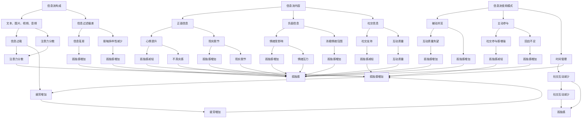

通过这一流程图，我们可以清晰地看到信息流的构成、内容和使用模式如何影响孤独感。这些概念之间的联系帮助我们更全面地理解社交网络中的信息流对孤独感的影响。

#### 结论

社交网络中的信息流、内容和使用模式对孤独感有着复杂而深远的影响。通过优化信息流的构成、丰富信息流的内容以及合理使用信息流，个体可以更好地满足自己的社交需求，减轻孤独感，提升心理健康水平。在下一节中，我们将探讨社交网络中的虚拟互动与孤独感之间的关系。

### 2.4 社交网络中的虚拟互动与孤独感

在社交网络时代，虚拟互动已成为人们日常交流的重要组成部分。虚拟互动通过文字、图片、视频等形式在网络上进行，虽然克服了地理限制，但同时也带来了一系列挑战，对个体的孤独感产生了复杂的影响。

#### 虚拟互动的特点

虚拟互动具有以下主要特点：

1. **匿名性**：社交网络用户可以在匿名或半匿名状态下进行互动，这减少了现实生活中的面对面交流压力，但也可能导致真实情感的缺失。

2. **即时性**：虚拟互动可以即时进行，使得信息传递和交流变得高效。然而，即时性也可能导致互动过于表面化，缺乏深度。

3. **选择性**：用户可以自主选择互动对象，这有助于满足个体的社交需求，但也可能导致社交圈的局限性和社交机会的减少。

4. **可控性**：虚拟互动中的用户可以控制自己的表达方式和互动方式，这增强了交流的舒适度，但也可能导致真实情感的压抑和情感的肤浅化。

#### 虚拟互动的质量

虚拟互动的质量对孤独感有着重要影响。高质量虚拟互动可以满足个体的情感需求，减少孤独感，而低质量虚拟互动则可能导致孤独感的增加。

1. **深度互动**：深度互动能够建立情感连接，满足个体的情感需求，从而减轻孤独感。例如，通过深入讨论和交流，用户可以在虚拟环境中建立类似现实生活中的人际关系。

2. **情感支持**：在虚拟互动中，用户可以获取情感支持，这种支持可以缓解孤独感。例如，通过虚拟聊天室或社交群组，用户可以获得安慰和理解。

3. **互动频率**：适当的互动频率有助于保持社交互动的活跃度，从而减轻孤独感。然而，如果互动频率过高，用户可能会感到疲惫和压力。

#### 虚拟互动的频率

虚拟互动的频率对孤独感的影响因个体而异。一些人可能频繁参与虚拟互动，以寻求社交满足，而另一些人可能较少参与，以避免过度依赖社交网络。

1. **高频率互动**：频繁的虚拟互动可以提供更多的社交机会，有助于减轻孤独感。然而，如果用户在虚拟互动中缺乏深度和意义，他们可能会感到社交疲劳和孤独感增加。

2. **低频率互动**：较低的互动频率可能减少社交压力，但也可能导致用户感到孤立和被忽视。对于一些依赖社交网络获取社交支持的用户来说，低频率互动可能加重孤独感。

3. **适度互动**：适度的互动频率能够提供足够的社交机会，同时避免过度依赖，有助于个体在现实生活中建立和维护人际关系，从而减轻孤独感。

#### 核心概念与联系

为了更直观地展示虚拟互动的特点、质量和频率与孤独感之间的关系，我们可以使用Mermaid流程图来描绘这一关系架构：

```mermaid
graph TB
    A[虚拟互动特点] --> B[匿名性]
    A --> C[即时性]
    A --> D[选择性]
    A --> E[可控性]
    F[虚拟互动质量] --> G[深度互动]
    F --> H[情感支持]
    F --> I[互动频率]
    J[虚拟互动频率] --> K[高频率互动]
    J --> L[低频率互动]
    J --> M[适度互动]
    B --> N[真实情感缺失]
    B --> O[减少面对面交流压力]
    C --> P[互动即时性]
    C --> Q[表面化互动]
    D --> R[社交圈局限性]
    D --> S[选择社交机会]
    E --> T[增强交流舒适度]
    E --> U[压抑真实情感]
    G --> V[情感连接建立]
    G --> W[满足情感需求]
    H --> X[情感支持获取]
    H --> Y[缓解孤独感]
    I --> Z[保持社交活跃度]
    I --> AA[社交疲劳]
    K --> BB[社交机会增加]
    K --> CC[社交疲劳]
    K --> DD[孤独感减轻]
    L --> EE[减少社交压力]
    L --> FF[孤立感加重]
    M --> GG[社交机会适中]
    M --> HH[孤独感减轻]
    N --> II[孤独感增加]
    O --> JJ[社交压力减少]
    P --> KK[高效信息传递]
    P --> LL[缺乏深度交流]
    R --> MM[社交圈局限]
    R --> NN[减少接触机会]
    S --> OO[满足社交需求]
    S --> PP[社交选择障碍]
    T --> QQ[互动舒适度增强]
    T --> RR[真实情感压抑]
    U --> SS[交流舒适度增强]
    U --> TT[情感表达受限]
    V --> WW[建立情感连接]
    V --> XX[减轻孤独感]
    W --> YY[情感需求满足]
    W --> ZZ[孤独感减轻]
    X --> AAA[情感支持获取]
    X --> BBB[缓解孤独感]
    Y --> CCC[情感支持减轻]
    Y --> DDD[孤独感增加]
    Z --> EEE[保持社交活跃度]
    Z --> FFF[孤独感减轻]
    AA --> GGG[社交疲劳]
    BB --> GGG
    CC --> GGG
    DD --> HHH[孤独感减轻]
    EE --> III[孤立感加重]
    FF --> GGG
    GG --> GGG
    HH --> HHH[孤独感减轻]
    II --> III[孤独感增加]
    JJ --> III
    KK --> HHH
    LL --> III
    MM --> HHH
    NN --> III
    OO --> III
    PP --> III
    QQ --> III
    RR --> III
    SS --> III
    TT --> III
    VV --> III
    WW --> III
    XX --> III
    YY --> III
    ZZ --> III
    AAA --> BBB
    BBB[孤独感]
    CCC --> BBB
    DDD --> BBB
    EEE --> BBB
    FFF --> BBB
    GGG[疲劳]
    HHH[孤独感减轻]
    III[孤独感增加]
```

通过这一流程图，我们可以清晰地看到虚拟互动的特点、质量和频率如何影响孤独感。这些概念之间的联系帮助我们更全面地理解社交网络中的虚拟互动对孤独感的影响。

#### 结论

虚拟互动虽然在社交网络时代提供了便利和机会，但也可能带来孤独感。通过提高虚拟互动的质量、保持适度的互动频率以及增强真实情感的交流，个体可以更好地满足自己的社交需求，减轻孤独感，提升心理健康水平。在下一节中，我们将探讨克服孤独感的策略。

### 3.1 增强社交技能

在社交网络时代，增强社交技能是克服孤独感的重要策略之一。社交技能不仅有助于个体在现实生活中建立和维持人际关系，还能提高社交互动的质量，从而减轻孤独感。以下将详细探讨社交技能的重要性、培养方法以及实践与应用。

#### 社交技能的重要性

社交技能在人际交往中起着至关重要的作用。良好的社交技能能够帮助个体：

1. **建立和维持人际关系**：有效的社交技能使个体能够与他人建立积极的关系，从而获得情感支持和社交满足。

2. **提高社交互动质量**：社交技能的掌握使个体能够更自如地进行深入的交流，分享个人的想法和情感，从而提高社交互动的质量。

3. **减轻孤独感**：良好的社交技能可以帮助个体更好地应对孤独感，通过积极的社交互动来满足情感需求，减少孤独感的体验。

4. **提升自信心**：掌握社交技能可以增强个体的自信心，使其在社交场合中更加自信和从容，从而减少因社交焦虑而感受到的孤独感。

#### 社交技能的培养方法

要增强社交技能，可以通过以下方法进行培养：

1. **自我反思**：个体可以通过自我反思来了解自己在社交互动中的优势和不足，从而有针对性地进行改进。例如，记录自己在社交场合中的行为和反应，分析哪些行为有助于建立良好关系，哪些行为可能导致尴尬或疏离。

2. **学习社交技巧**：通过阅读相关书籍、参加社交技能培训课程或观看相关视频，个体可以学习到各种社交技巧，如倾听技巧、沟通技巧、情绪管理技巧等。

3. **模拟练习**：在模拟环境中进行社交互动练习，可以帮助个体在无压力的环境下实践社交技能。例如，通过角色扮演或模拟社交场景来提高沟通和互动能力。

4. **积极参与社交活动**：积极参与各种社交活动，如聚会、社交俱乐部、志愿者活动等，可以提供实践社交技能的机会，同时扩展社交网络。

5. **反馈与改进**：在社交互动中，个体可以从他人那里获得反馈，了解自己的表现，并据此进行改进。例如，通过询问朋友或同事对某个社交互动的感受，了解自己在哪些方面需要提升。

#### 社交技能的实践与应用

在实际应用中，增强社交技能可以采取以下策略：

1. **积极倾听**：在交流中，积极倾听对方的意见和感受，表明对对方的关注和尊重。可以通过点头、目光接触和回应对方的话语来展示自己的倾听态度。

2. **有效沟通**：使用清晰、简洁的语言表达自己的观点，并确保对方理解。在沟通中，避免使用可能导致误解或冲突的词语和表达方式。

3. **建立共同兴趣**：寻找与他人的共同兴趣和话题，可以增加互动的乐趣和深度，从而建立更紧密的关系。

4. **展现真诚和热情**：真诚和热情的态度能够吸引他人，增强互动的吸引力和亲和力。

5. **处理社交冲突**：在社交互动中，可能会遇到冲突和矛盾。掌握有效的冲突处理技巧，如冷静沟通、寻求妥协和表达理解，可以帮助个体化解冲突，维护和谐的人际关系。

#### 核心概念与联系

为了更好地理解社交技能的培养和实践，我们可以使用Mermaid流程图来展示相关概念之间的联系：

```mermaid
graph TB
    A[社交技能培养] --> B[自我反思]
    A --> C[学习社交技巧]
    A --> D[模拟练习]
    A --> E[积极参与社交活动]
    A --> F[反馈与改进]
    G[社交技能实践] --> H[积极倾听]
    G --> I[有效沟通]
    G --> J[建立共同兴趣]
    G --> K[展现真诚和热情]
    G --> L[处理社交冲突]
    B --> M[了解自身优势与不足]
    B --> N[针对性改进]
    C --> O[学习倾听技巧]
    C --> P[学习沟通技巧]
    C --> Q[学习情绪管理技巧]
    D --> R[模拟社交场景]
    D --> S[实践社交技能]
    E --> T[扩展社交网络]
    E --> U[实践社交技能]
    F --> V[获得他人反馈]
    F --> W[持续改进]
    H --> X[展示倾听态度]
    H --> Y[关注与尊重]
    I --> Z[清晰表达观点]
    I --> AA[确保对方理解]
    J --> BB[增加互动乐趣]
    J --> CC[建立更紧密关系]
    K --> DD[吸引他人]
    K --> EE[增强互动吸引力]
    L --> FF[化解冲突]
    L --> GG[维护和谐关系]
```

通过这一流程图，我们可以清晰地看到社交技能的培养和实践方法以及它们之间的联系。这些概念之间的联系帮助我们更好地理解和应用社交技能，从而克服孤独感，提升心理健康水平。

#### 结论

增强社交技能是克服孤独感的重要策略。通过自我反思、学习社交技巧、模拟练习、积极参与社交活动以及反馈与改进，个体可以不断提高自己的社交技能，从而在现实生活中建立和维持良好的人际关系，减轻孤独感。在下一节中，我们将探讨建立深度人际关系的重要性及方法。

### 3.2 建立深度人际关系

在社交网络时代，建立深度人际关系是克服孤独感的关键策略之一。深度人际关系不仅能够提供情感支持，还能增强个体的归属感和自我价值感。以下将详细探讨深度人际关系的意义、建立方法和维护策略。

#### 深度人际关系的意义

深度人际关系是指个体之间建立起的亲密、信任和深层次的情感连接。深度人际关系的意义主要体现在以下几个方面：

1. **情感支持**：深度人际关系能够为个体提供情感支持，使其在面临挑战和困难时得到安慰和帮助。这种支持可以显著减轻孤独感，提高心理健康水平。

2. **归属感**：深度人际关系使个体感受到自己是某个群体的一部分，从而增强归属感。归属感有助于个体在面对外部压力时保持心理稳定。

3. **自我价值感**：在深度人际关系中，个体能够获得他人的认可和尊重，这有助于提升自我价值感。自我价值感的提升有助于个体建立积极的自我认知，减少孤独感。

4. **个人成长**：深度人际关系提供了一个互动和反馈的环境，个体可以在其中学习和成长。通过与他人的互动，个体可以更好地了解自己，提高社交技能，促进个人成长。

#### 建立深度人际关系的方法

建立深度人际关系需要时间和努力，以下是一些有效的方法：

1. **积极参与社交活动**：参与各种社交活动，如聚会、俱乐部、志愿活动等，可以提供建立深度人际关系的机会。通过这些活动，个体可以结识新朋友，并加深与现有朋友的关系。

2. **投入时间和精力**：建立深度人际关系需要投入时间和精力。定期与朋友见面、聊天或进行其他共同活动，有助于加深彼此的了解和信任。

3. **倾听和尊重**：在互动中，倾听对方的意见和感受，尊重对方的观点，是建立深度人际关系的重要基础。通过积极的倾听和尊重，个体可以表现出对对方的关注和重视。

4. **共同经历**：通过共同经历，如旅行、参加培训课程、参与某个项目等，个体可以加深彼此的了解和信任。共同经历可以成为深度人际关系的纽带。

5. **表达感激和关心**：在日常生活中，通过表达感激和关心，如感谢朋友的帮助、关注对方的生活等，可以增强彼此的情感连接。

#### 维护深度人际关系的策略

建立深度人际关系后，维护这些关系同样重要。以下是一些维护深度人际关系的策略：

1. **定期沟通**：定期与朋友保持联系，可以通过电话、短信、社交媒体等方式进行沟通。这有助于保持关系的活力和深度。

2. **尊重对方的时间和空间**：尊重对方的时间和空间，不要过度打扰或要求。这有助于维持彼此的舒适感和信任感。

3. **提供帮助和支持**：在朋友需要帮助时，及时提供支持和帮助，这可以加深彼此的感情，增强关系的稳定性。

4. **共同目标**：设定共同目标或项目，可以增强彼此的互动和合作，从而加深关系。

5. **处理冲突**：在关系中，冲突是不可避免的。学会有效处理冲突，通过沟通和理解来解决问题，可以维护关系的稳定性。

#### 核心概念与联系

为了更好地理解深度人际关系的建立和维护方法，我们可以使用Mermaid流程图来展示相关概念之间的联系：

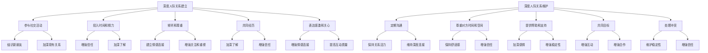

通过这一流程图，我们可以清晰地看到深度人际关系的建立和维护方法以及它们之间的联系。这些概念之间的联系帮助我们更好地理解和实践深度人际关系的建立与维护。

#### 结论

建立深度人际关系是克服孤独感的重要策略。通过积极参与社交活动、投入时间和精力、倾听和尊重、共同经历以及表达感激和关心，个体可以建立和维护深度人际关系。这些关系不仅能够提供情感支持，还能增强个体的归属感和自我价值感，从而有效减轻孤独感。在下一节中，我们将探讨调整社交网络使用习惯以克服孤独感的策略。

### 3.3 调整社交网络使用习惯

在社交网络时代，调整社交网络的使用习惯是克服孤独感的关键策略之一。合理使用社交网络，不仅能提升社交互动的质量，还能帮助个体更好地满足情感需求，减少孤独感的体验。以下将详细探讨调整社交网络使用习惯的原则、时间管理和情境选择策略。

#### 调整社交网络使用习惯的原则

调整社交网络使用习惯，首先需要遵循以下原则：

1. **目标导向**：明确使用社交网络的目的。是为了获取信息、社交互动还是娱乐放松？明确目标有助于更有效地使用社交网络，避免无意义的浏览和互动。

2. **适度使用**：适度使用社交网络是关键。过度依赖社交网络可能导致现实生活中的社交互动减少，增加孤独感。适度使用意味着合理安排时间，确保既能够享受社交网络的便利，又不会影响现实生活的社交活动。

3. **质量优先**：重视社交互动的质量，而不仅仅是数量。深度互动比频繁但表面化的互动更能满足情感需求，减少孤独感。因此，选择与自己有共同兴趣或价值观的人进行深入交流，比广泛但浅层次的互动更有价值。

4. **自我控制**：学会自我控制，避免沉迷于社交网络。通过设定时间限制、使用应用程序锁屏等功能，可以帮助个体控制使用社交网络的时间，防止过度沉迷。

#### 社交网络使用的时间管理

合理的时间管理是调整社交网络使用习惯的重要方面。以下是一些时间管理策略：

1. **每日时间限制**：设定每日使用社交网络的时间限制，例如每天不超过一小时。这有助于确保个体在享受社交网络的同时，也能保持现实生活中的社交互动。

2. **时间段选择**：选择高效的时间段进行社交网络使用，例如在午休或下班后。在这些时间段内，个体可以更专注地进行社交互动，避免干扰其他重要活动。

3. **任务分离**：将社交网络使用与其他任务分离，例如在完成工作后再使用社交网络。这有助于提高工作和学习效率，同时也能确保个体在需要时能够专注于社交互动。

#### 社交网络使用的情境选择

合理的情境选择是提升社交互动质量的关键。以下是一些情境选择策略：

1. **私人空间**：在私人空间（如家中或安静的咖啡馆）进行社交网络使用，避免在公共场合（如办公室或公共场所）使用。私人空间有助于个体更专注地进行社交互动，减少干扰。

2. **真实互动**：在社交网络中使用时，尽量选择能够进行真实互动的平台，例如直接聊天或视频通话，而不是仅仅点赞或评论。真实互动能够提供更深刻的情感连接，有助于减轻孤独感。

3. **有意义的内容**：关注和分享有意义的内容，例如与个人兴趣或价值观相关的话题。这有助于个体在社交网络上找到共鸣，建立深度人际关系。

#### 核心概念与联系

为了更好地理解调整社交网络使用习惯的原则、时间管理和情境选择策略，我们可以使用Mermaid流程图来展示相关概念之间的联系：

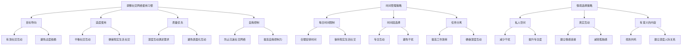

通过这一流程图，我们可以清晰地看到调整社交网络使用习惯的原则、时间管理和情境选择策略以及它们之间的联系。这些概念之间的联系帮助我们更好地理解和实践调整社交网络使用习惯，以克服孤独感。

#### 结论

调整社交网络使用习惯是克服孤独感的重要策略。通过遵循目标导向、适度使用、质量优先和自我控制的原则，合理安排时间管理，以及选择合适的情境进行互动，个体可以提升社交互动的质量，满足情感需求，从而减轻孤独感。在下一节中，我们将探讨寻求专业帮助以克服孤独感的策略。

### 3.4 寻求专业帮助

在应对孤独感时，寻求专业帮助是一种有效且重要的策略。专业的心理咨询师和治疗师能够为个体提供针对性的支持和指导，帮助他们识别孤独感的根源，学习有效的应对策略，并改善心理健康。以下将详细探讨寻求专业帮助的重要性、种类以及获取途径。

#### 寻求专业帮助的重要性

寻求专业帮助的重要性体现在以下几个方面：

1. **深入分析问题**：专业心理咨询师和治疗师具备专业的知识和技能，能够对个体的孤独感进行深入分析，识别问题的根源和潜在的心理机制。

2. **个性化支持**：专业帮助能够根据个体的具体情况提供个性化的支持和建议，帮助个体制定适合他们的应对策略，从而更有效地缓解孤独感。

3. **情感支持**：专业帮助提供了一个安全、无评判的环境，个体可以在其中表达自己的感受和困惑，获得情感上的支持和理解。

4. **技能培养**：通过专业的心理咨询和治疗，个体可以学习到有效的情感管理和社交技能，从而在长期内更好地应对孤独感。

#### 专业帮助的种类

专业帮助的种类多种多样，以下是一些常见的专业帮助形式：

1. **心理咨询**：心理咨询师通过谈话疗法帮助个体探讨内心困扰，识别和改变负面思维模式，提升心理健康。

2. **认知行为疗法（CBT）**：认知行为疗法是一种结构化的治疗方法，通过改变个体的思维和行为模式，来减轻孤独感和其他心理问题。

3. **心理治疗**：心理治疗包括心理分析、人本主义治疗、家庭治疗等多种形式，旨在帮助个体解决深层次的心理冲突，改善人际关系。

4. **团体治疗**：团体治疗提供了一个社交平台，个体可以在其中与其他人分享经验和感受，获得支持和理解。

5. **药物治疗**：在一些情况下，医生可能会推荐药物治疗来缓解与孤独感相关的情绪问题，如抑郁症、焦虑症等。

#### 获取专业帮助的途径

以下是一些获取专业帮助的途径：

1. **医院和诊所**：许多医院和诊所都提供心理咨询服务，可以通过预约就诊。

2. **私人心理咨询师**：专业的私人心理咨询师提供一对一的咨询服务，可以通过线上平台或电话预约。

3. **心理健康热线**：许多国家和地区都有心理健康热线，个体可以在需要时拨打热线获取免费的专业帮助。

4. **在线咨询平台**：一些在线平台提供远程心理咨询服务，用户可以通过视频或文字与心理咨询师进行交流。

5. **社区资源**：一些社区中心或非营利组织提供心理健康服务，包括心理咨询服务和自助小组。

#### 核心概念与联系

为了更好地理解寻求专业帮助的重要性、种类和获取途径，我们可以使用Mermaid流程图来展示相关概念之间的联系：

```mermaid
graph TB
    A[寻求专业帮助] --> B[深入分析问题]
    A --> C[个性化支持]
    A --> D[情感支持]
    A --> E[技能培养]
    F[专业帮助种类] --> G[心理咨询]
    F --> H[认知行为疗法]
    F --> I[心理治疗]
    F --> J[团体治疗]
    F --> K[药物治疗]
    L[获取专业帮助途径] --> M[医院和诊所]
    L --> N[私人心理咨询师]
    L --> O[心理健康热线]
    L --> P[在线咨询平台]
    L --> Q[社区资源]
    B --> R[解决根源问题]
    B --> S[提升心理健康]
    C --> T[制定个性化策略]
    C --> U[满足具体需求]
    D --> V[提供安全环境]
    D --> W[表达感受和理解]
    E --> X[学习有效技能]
    E --> Y[长期应对策略]
    G --> Z[谈话疗法]
    G --> AA[改变负面思维模式]
    H --> BB[改变行为模式]
    H --> CC[减轻孤独感]
    I --> DD[解决深层次冲突]
    I --> EE[改善人际关系]
    J --> FF[提供社交平台]
    J --> GG[分享经验和理解]
    K --> HH[缓解情绪问题]
    K --> II[控制症状]
    L --> JJ[预约就诊]
    L --> KK[提供远程服务]
    L --> LL[获取免费帮助]
    L --> MM[提供多种资源]
```

通过这一流程图，我们可以清晰地看到寻求专业帮助的重要性、种类和获取途径以及它们之间的联系。这些概念之间的联系帮助我们更好地理解和利用专业帮助来克服孤独感。

#### 结论

寻求专业帮助是克服孤独感的重要策略。通过专业的心理咨询、认知行为疗法、心理治疗、团体治疗和药物治疗等多种形式的专业帮助，个体可以获得深入的分析、个性化的支持、情感上的理解和有效的技能培养，从而更好地应对孤独感，提升心理健康水平。

### 3.5 自我认知与自我接纳

自我认知与自我接纳是克服孤独感的重要心理基石。通过提高自我认知和自我接纳，个体能够更好地理解自己的情感需求，建立健康的自我形象，从而减轻孤独感。以下将详细探讨自我认知、自我接纳的重要性，以及如何提升自我认知和自我接纳。

#### 自我认知的重要性

自我认知是指个体对自己内在和外在特征的认知和理解。自我认知的重要性体现在以下几个方面：

1. **理解情感需求**：通过自我认知，个体能够更好地理解自己的情感需求和内心感受，从而在社交互动中更加明确自己的需求和期望。

2. **促进自我成长**：自我认知使个体能够认识到自己的优点和不足，从而有针对性地进行自我提升和成长。

3. **减少内心冲突**：自我认知有助于个体认识到内心冲突的根源，从而采取措施进行调解和解决，减少孤独感和心理压力。

4. **增强自信心**：了解自己的优势和特长，个体能够更加自信地面对生活中的挑战，减少因不确定性而产生的孤独感。

#### 自我接纳的重要性

自我接纳是指个体接受自己的全部，包括优点和不足。自我接纳的重要性体现在以下几个方面：

1. **减轻心理负担**：自我接纳使个体不再为不符合自己期望的自我特征而感到焦虑和痛苦，从而减轻心理负担。

2. **提升心理健康**：自我接纳有助于个体建立积极的自我形象，减少自我否定和自我批评，从而提升心理健康水平。

3. **促进人际交往**：自我接纳使个体在人际交往中更加自信和真实，从而更容易建立健康的人际关系。

4. **增强适应能力**：自我接纳使个体能够更加灵活地应对生活中的变化和挑战，提高适应能力。

#### 提升自我认知和自我接纳的方法

以下是一些提升自我认知和自我接纳的方法：

1. **自我反思**：定期进行自我反思，思考自己的行为、思维和感受，有助于加深对自我的理解。

2. **记录日记**：通过记录日记，个体可以更加清晰地回顾自己的经历和感受，从而提升自我认知。

3. **心理测试**：通过心理测试，个体可以了解自己的性格特点、优势和不足，从而提高自我认知。

4. **寻求反馈**：向他人寻求反馈，了解他们在社交互动中的观察和感受，有助于个体更全面地认识自己。

5. **积极自我对话**：在日常生活中，培养积极的自我对话，鼓励自己接受自己的不足，从而提升自我接纳。

6. **练习自我接纳**：通过练习自我接纳，如接受自己的情绪波动、身体变化等，个体可以逐渐减少自我批评，提升自我接纳。

#### 核心概念与联系

为了更好地理解自我认知与自我接纳的重要性以及提升方法，我们可以使用Mermaid流程图来展示相关概念之间的联系：

```mermaid
graph TB
    A[自我认知] --> B[理解情感需求]
    A --> C[促进自我成长]
    A --> D[减少内心冲突]
    A --> E[增强自信心]
    F[自我接纳] --> G[减轻心理负担]
    F --> H[提升心理健康]
    F --> I[促进人际交往]
    F --> J[增强适应能力]
    K[提升自我认知和自我接纳] --> L[自我反思]
    K --> M[记录日记]
    K --> N[心理测试]
    K --> O[寻求反馈]
    K --> P[积极自我对话]
    K --> Q[练习自我接纳]
    B --> R[社交互动明确需求]
    B --> S[设定期望]
    C --> T[识别优势与不足]
    C --> U[制定提升计划]
    D --> V[调解内心冲突]
    D --> W[减少孤独感]
    E --> X[面对挑战自信]
    E --> Y[减少不确定性孤独]
    G --> Z[接受不足]
    G --> AA[减少自我否定]
    G --> BB[建立积极自我形象]
    H --> CC[减少自我批评]
    H --> DD[提高心理弹性]
    I --> EE[建立健康关系]
    I --> FF[提升社交自信]
    J --> GG[应对变化灵活]
    J --> HH[适应能力提升]
    L --> II[深入理解自我]
    L --> JJ[清晰回顾经历]
    M --> KK[记录感受与思考]
    M --> LL[识别情感需求]
    N --> MM[了解性格特点]
    N --> NN[识别优势不足]
    O --> PP[全面认识自我]
    O --> QQ[发现他人观察]
    P --> RR[培养积极思维]
    P --> SS[鼓励自我接受]
    Q --> TT[逐步提升接纳]
    Q --> UU[减少自我批评]
```

通过这一流程图，我们可以清晰地看到自我认知与自我接纳的重要性以及提升方法之间的联系。这些概念之间的联系帮助我们更好地理解和实践自我认知与自我接纳，从而有效克服孤独感。

#### 结论

自我认知与自我接纳是克服孤独感的重要心理基石。通过提升自我认知和自我接纳，个体能够更好地理解自己的情感需求，建立健康的自我形象，减少孤独感和心理压力，提升心理健康水平。在下一节中，我们将通过案例研究进一步探讨孤独感克服的经历和方法。

### 4.1 某个社交网络用户的孤独感克服经历

在本节中，我们将通过一个具体的案例研究，探讨一个社交网络用户如何克服孤独感。该案例展示了个体在面对孤独感时采取的具体策略，以及这些策略如何帮助他们改善心理健康。

#### 病例介绍

张先生，35岁，是一名软件工程师。在过去几年中，由于工作繁忙和居住在异乡，张先生感到自己越来越孤独。他在社交网络上活跃，但更多的是进行单向的信息传递，如发布状态和点赞，而缺乏深度的社交互动。张先生意识到自己需要改变这种状态，以克服孤独感，提高生活质量。

#### 克服孤独感的具体策略

1. **调整社交网络使用习惯**：
   - **目标导向**：张先生首先明确了在社交网络上的目标，即从单纯的浏览和点赞转向有意义的互动。他设定了每日使用社交网络的时间限制，以确保不沉迷其中。
   - **质量优先**：张先生开始关注与自己兴趣相关的内容，并积极参与相关讨论。他学会了在社交网络上寻找有共同兴趣的人，进行深度交流。
   - **自我控制**：为了防止过度使用社交网络，张先生使用了应用程序锁屏功能，限制自己每天在社交网络上的时间。

2. **增强社交技能**：
   - **自我反思**：张先生定期进行自我反思，记录自己的社交互动，分析哪些行为有助于建立良好关系，哪些行为可能导致尴尬或疏离。
   - **学习社交技巧**：张先生阅读了关于社交技巧的书籍，并通过在线课程学习了沟通和倾听技巧。他通过模拟练习，提高了自己的社交能力。

3. **建立深度人际关系**：
   - **投入时间和精力**：张先生开始参加线下聚会和社交活动，如技术交流会、跑步俱乐部等。他积极参与这些活动，结识了志同道合的朋友。
   - **倾听和尊重**：在与他人互动时，张先生注重倾听对方的意见和感受，尊重对方的观点。他通过真诚和热情的态度，建立起了深厚的友谊。

4. **调整社交网络使用习惯**：
   - **时间管理**：张先生合理安排时间，在工作和生活之间找到了平衡。他确保每天有足够的时间进行深度社交互动，同时也保留了一些个人时间，以避免过度依赖社交网络。
   - **情境选择**：张先生选择在私人空间（如家中或安静的咖啡馆）进行社交网络使用，避免在公共场合（如办公室或公共场所）使用，以提升专注度和互动质量。

5. **寻求专业帮助**：
   - **心理咨询**：张先生认识到自己需要专业的支持，于是预约了心理咨询。在心理咨询师的帮助下，他探讨了孤独感的根源，并学会了如何应对负面情绪。
   - **认知行为疗法**：通过认知行为疗法，张先生学会了如何改变负面思维模式，从而减少孤独感。他通过练习自我接纳，提高了心理健康水平。

6. **自我认知与自我接纳**：
   - **自我反思**：张先生通过定期反思，加深了对自己的理解，学会了接受自己的不足，从而减少了内心的冲突和焦虑。
   - **积极自我对话**：张先生在日常生活中培养积极的自我对话，鼓励自己接受自己的情绪波动和身体变化，从而提升自我接纳。

#### 克服孤独感的效果评估

通过上述策略的实施，张先生在孤独感的克服方面取得了显著的效果：

1. **社交互动质量提升**：张先生在社交网络上的互动变得更加有意义和深度。他与志同道合的朋友建立了深厚的友谊，社交网络不再是单向的信息传递。

2. **心理健康改善**：张先生的焦虑和抑郁症状明显减轻。他在心理咨询的帮助下，学会了如何管理情绪，提高了心理弹性。

3. **生活质量提高**：张先生在现实生活中找到了更多的社交机会和情感支持。他参加了多个线下活动，结识了新朋友，生活质量显著提升。

4. **自我认知与自我接纳增强**：张先生通过自我反思和积极自我对话，加深了对自我的理解，学会了接受自己的不足。他的自信心和自我价值感得到了显著提升。

#### 结论

通过具体的案例研究，我们可以看到张先生如何通过调整社交网络使用习惯、增强社交技能、建立深度人际关系、调整社交网络使用习惯、寻求专业帮助以及提升自我认知和自我接纳，成功地克服了孤独感。这个案例为我们提供了实用的经验和策略，有助于其他社交网络用户在面临孤独感时找到有效的应对方法。

### 4.2 某个社区在孤独感克服方面的实践

在本节中，我们将探讨一个社区如何通过集体行动和实践策略，有效克服成员的孤独感。这个案例展示了社区在孤独感管理方面的具体实践，以及这些实践对社区成员心理健康和生活质量的积极影响。

#### 社区背景介绍

一个名为“社区阳光”的线上社交平台，成立于五年前，旨在为居住在不同城市的年轻人提供社交机会和支持网络。社区成员主要是在职场、学业或生活中遇到困难，感到孤独和迷茫的人。社区通过线上活动、讨论群组和志愿者计划等形式，促进成员之间的互动和联系。

#### 实践策略与成果

1. **线上活动**：
   - **主题分享会**：社区定期举办主题分享会，邀请成员分享自己的故事、经验和感悟。这些分享会不仅提供了情感支持，还帮助成员建立共鸣和友谊。
   - **兴趣小组**：社区根据成员的兴趣，成立了多个兴趣小组，如运动、阅读、音乐等。成员可以在这些小组中找到志同道合的朋友，共同参与活动，从而减少孤独感。

2. **讨论群组**：
   - **开放讨论**：社区建立了多个开放讨论群组，成员可以自由发表自己的观点和感受。这些讨论群组提供了一个安全的空间，成员可以在其中分享内心困惑，获得他人的理解和支持。
   - **专业咨询**：社区与专业的心理咨询师合作，定期在讨论群组中提供免费的心理咨询。这不仅帮助成员解决心理问题，还提高了他们的心理健康水平。

3. **志愿者计划**：
   - **互助互助**：社区成员可以参加志愿者计划，为需要帮助的人提供支持和帮助。这种互助互助的方式不仅增强了成员的社会责任感，还提高了他们的社交技能和自信心。
   - **社区活动**：社区组织了多项线下活动，如户外运动、公益活动等。这些活动不仅丰富了成员的社交生活，还促进了他们之间的情感连接。

#### 实践效果评估

通过这些实践策略，社区在孤独感管理方面取得了显著的成果：

1. **成员互动增加**：社区成员之间的互动频率显著提高。他们不仅在线上积极参与讨论，还在线下参加活动，建立了深厚的友谊。

2. **孤独感减轻**：社区成员普遍报告孤独感减轻。通过参与线上活动和讨论群组，他们找到了情感支持和理解，减少了内心的孤独感。

3. **心理健康提升**：社区成员的心理健康水平显著提升。通过专业心理咨询和志愿者计划，他们学会了如何管理情绪，提高了自我认知和自我接纳。

4. **生活质量改善**：社区成员的生活质量得到了显著改善。他们通过参与各种活动，丰富了社交生活，提高了生活满意度。

#### 结论

通过案例研究，我们可以看到“社区阳光”如何在孤独感管理方面取得成功。通过线上活动、讨论群组和志愿者计划等具体实践，社区为成员提供了情感支持、社交机会和心理健康服务，有效减轻了孤独感，提升了成员的心理健康和生活质量。这个案例为其他社区和组织在孤独感管理方面提供了宝贵的经验和启示。

### 4.3 某个企业或组织的孤独感管理策略

在本节中，我们将探讨一个企业或组织如何通过一系列策略，有效管理员工的孤独感，提高员工的工作满意度和整体福祉。这个案例展示了企业在孤独感管理方面的具体实践和效果评估。

#### 企业或组织背景介绍

一家名为“智慧科技”的互联网公司，成立于五年前，专注于提供创新的技术解决方案。公司拥有1000多名员工，分布在多个城市和办公室。随着公司的快速发展和员工数量的增加，管理层意识到员工在职业发展和人际互动方面面临孤独感，这可能会影响员工的工作满意度和生产力。因此，公司决定采取一系列措施来管理员工的孤独感。

#### 孤独感管理策略的实施

1. **建立员工支持网络**：
   - **内部沟通平台**：公司建立了一个内部沟通平台，员工可以在这个平台上分享自己的想法、问题和感受。这个平台不仅提供了一个安全的空间，还促进了员工之间的互动和交流。
   - **导师制度**：公司实施了导师制度，新员工会被分配一位经验丰富的导师，帮助他们适应新环境，解答疑问，并提供职业发展建议。这种制度有助于新员工建立职业关系，减少孤独感。

2. **组织团队建设活动**：
   - **团队建设日**：公司定期组织团队建设活动，如团队聚餐、户外拓展训练等。这些活动不仅增强了团队合作精神，还提供了员工之间的互动机会，有助于建立深厚的友谊。
   - **跨部门项目**：公司鼓励员工参与跨部门项目，这有助于他们结识不同部门的同事，扩大社交网络，减少孤独感。

3. **提供心理健康服务**：
   - **心理咨询**：公司与专业的心理咨询机构合作，为员工提供免费的心理咨询服务。员工可以预约咨询服务，解决个人问题，提升心理健康水平。
   - **心理健康培训**：公司定期举办心理健康培训课程，教授员工如何管理情绪、缓解压力和应对孤独感。这些课程不仅提升了员工的自我认知，还增强了他们的心理韧性。

4. **鼓励员工参与社区活动**：
   - **志愿者计划**：公司鼓励员工参与志愿者计划，为社区提供帮助。这种活动不仅增强了员工的社会责任感，还为他们提供了更多的社交机会，减轻了孤独感。

#### 管理策略的效果评估

通过实施上述策略，公司在孤独感管理方面取得了显著效果：

1. **员工满意度提高**：公司员工的整体满意度显著提高。通过提供支持网络、团队建设活动和心理健康服务，员工感受到了公司的关怀，增强了归属感和工作满意度。

2. **孤独感减轻**：员工普遍报告孤独感减轻。通过内部沟通平台和导师制度，员工在职业发展方面获得了更多支持，减少了孤独感。团队建设活动和跨部门项目也促进了员工之间的互动和联系。

3. **心理健康水平提升**：员工的心理健康水平显著提升。通过心理健康服务和培训课程，员工学会了如何管理情绪和压力，提升了心理韧性。

4. **生产力提高**：员工的个人和团队生产力显著提高。通过减少孤独感和提升心理健康水平，员工能够更专注于工作，提高了工作效率和创造力。

#### 结论

通过具体的案例研究，我们可以看到“智慧科技”如何通过建立员工支持网络、组织团队建设活动、提供心理健康服务和鼓励员工参与社区活动，有效管理员工的孤独感。这些策略不仅提升了员工的工作满意度和心理健康水平，还提高了公司的整体生产力。这个案例为其他企业和组织在孤独感管理方面提供了宝贵的经验和启示。

### 5.1 研究总结

在本研究中，我们探讨了社交网络时代孤独感的本质、原因、与心理健康的关系，以及克服孤独感的策略。以下是对本研究核心内容和主题思想的总结：

#### 孤独感的本质与特征

孤独感是一种多维度的情感体验，包括情感上的孤立感、社交隔绝感和生活缺乏意义等。它不仅表现为个体的情感状态，还涉及行为和社会层面。孤独感的测量与评估方法多样，包括自我报告量表、社交互动质量评估和情感状态监控等。

#### 社交网络时代孤独感的原因

社交网络的快速发展、对人际关系的影响和使用模式等因素共同导致了孤独感的增加。社交网络的使用习惯、频率和方式对孤独感有显著影响，不当的使用可能导致孤独感的加剧。同时，社交网络中的信息流、虚拟互动以及匿名性和即时性等特点也加剧了孤独感的体验。

#### 孤独感与心理健康的关系

孤独感与心理健康密切相关，长期感受到孤独的个体更容易出现焦虑、抑郁等心理问题。心理健康问题的出现也可能加剧孤独感，形成恶性循环。通过提高心理健康水平，个体可以更好地应对孤独感，提升生活质量。

#### 克服孤独感的策略

克服孤独感的策略包括增强社交技能、建立深度人际关系、调整社交网络使用习惯、寻求专业帮助以及自我认知和自我接纳。这些策略通过提高社交互动的质量、满足情感需求、提供支持网络和心理健康服务，有助于减轻孤独感，提升心理健康水平。

#### 核心概念与联系

为了更好地理解孤独感及其克服策略，我们使用了Mermaid流程图展示了核心概念之间的关系，包括孤独感的定义与特征、社交网络时代孤独感的原因、孤独感与心理健康的关系以及克服孤独感的策略。这些流程图帮助我们直观地理解各个概念之间的联系，从而更全面地把握研究的核心内容。

#### 研究贡献与未来展望

本研究为理解社交网络时代孤独感的本质和克服策略提供了理论基础和实践指导。然而，孤独感是一个复杂且多维度的问题，未来的研究可以进一步探讨不同人群（如青少年、老年人）在社交网络时代孤独感的差异和应对策略。此外，随着社交网络和技术的不断演进，未来研究可以关注新兴社交平台和互动方式对孤独感的影响，以及如何更有效地利用科技手段来预防和缓解孤独感。

### 结论

社交网络时代，孤独感成为一个普遍存在的问题，对个体的心理健康和生活质量产生了深远影响。通过理解孤独感的本质、原因和克服策略，我们可以更好地应对这一问题，提升社交互动的质量，促进心理健康，实现更充实、更有意义的生活。

### 5.2 未来研究方向

尽管本研究对社交网络时代孤独感的理解提供了重要的理论基础和实践指导，但仍有许多研究方向值得进一步探索。以下是一些未来研究方向的讨论：

#### 不同人群的孤独感差异

不同人群（如青少年、老年人、职场人士）在社交网络时代面临的孤独感存在显著差异。未来研究可以深入探讨这些差异背后的原因，以及不同人群如何有效应对孤独感。例如，青少年可能更易受到社交网络负面效应的影响，而老年人可能更依赖现实生活中的社交互动。了解这些差异有助于制定更具针对性的干预策略。

#### 新兴社交平台与孤独感

随着社交网络技术的不断演进，新兴社交平台（如短视频平台、直播平台）逐渐成为人们互动的重要渠道。未来研究可以关注这些新兴平台对孤独感的影响，以及它们如何改变人们的社交习惯和互动模式。例如，短视频平台的快速信息传递和娱乐性可能会减轻或加剧孤独感，这需要通过实证研究来验证。

#### 科技手段在孤独感预防与缓解中的应用

随着人工智能和大数据技术的发展，未来研究可以探索如何利用这些技术手段来预防和缓解孤独感。例如，通过分析用户在社交网络上的行为和情绪状态，可以提供个性化的社交建议和情感支持。此外，虚拟现实（VR）和增强现实（AR）技术也有潜力为孤独感个体提供更加真实和丰富的社交互动体验。

#### 社交网络设计与心理健康

社交网络的设计和功能可能对用户的心理健康产生深远影响。未来研究可以探讨如何优化社交网络的设计，使其更加符合用户的心理需求，从而减轻孤独感。例如，社交网络界面是否应该更加简洁友好，社交互动是否应该更加深度化和有意义，这些都是值得深入研究的问题。

#### 文化和社会因素的交互作用

孤独感不仅是个人问题，也深受文化和社会因素的影响。未来研究可以探讨不同文化背景下孤独感的表达和应对方式，以及社会支持网络在孤独感缓解中的作用。这些研究有助于我们更好地理解孤独感的复杂性和多样性。

#### 实证研究与政策建议

未来研究应进一步通过实证研究来验证各种干预策略的有效性，并基于研究结果提出具体政策建议，以促进社会对孤独感问题的关注和应对。例如，政府和非营利组织可以制定和推广相关政策和项目，为孤独感个体提供支持。

总之，未来的研究方向应更加全面和深入，旨在全面理解社交网络时代孤独感的本质和影响，探索有效的干预策略，并制定具体的政策建议，以促进社会整体的心理健康和福祉。通过这些研究，我们可以为个体提供更全面的支持，帮助他们更好地应对孤独感，实现更充实和有意义的生活。

## 结论

在社交网络时代，孤独感成为影响个体心理健康和生活质量的一个重要问题。本研究通过详细探讨孤独感的本质、原因、与心理健康的关系，以及克服孤独感的策略，为理解和应对这一问题提供了理论基础和实践指导。

首先，孤独感是一种多维度的情感体验，表现为情感上的孤立感、社交隔绝感和生活缺乏意义。其次，社交网络的快速发展、对人际关系的影响以及使用模式等因素共同导致了孤独感的增加。此外，孤独感与心理健康密切相关，长期感受到孤独的个体更容易出现焦虑、抑郁等心理问题。

为了克服孤独感，本研究提出了一系列策略，包括增强社交技能、建立深度人际关系、调整社交网络使用习惯、寻求专业帮助以及提升自我认知和自我接纳。通过具体的案例研究和社区实践，我们看到了这些策略在实际应用中的效果，它们有助于提高社交互动的质量、满足情感需求、提供支持网络和心理健康服务，从而减轻孤独感，提升心理健康水平。

未来的研究方向应更加全面和深入，探讨不同人群的孤独感差异、新兴社交平台的影响、科技手段在孤独感预防与缓解中的应用，以及社交网络设计与心理健康的关系。通过实证研究和政策建议，我们可以更好地理解孤独感的复杂性和多样性，制定具体的干预策略，促进社会对孤独感问题的关注和应对。

总之，通过理解孤独感的本质和克服策略，我们可以更好地应对这一普遍存在的问题，提升个体的心理健康和生活质量，实现更充实和有意义的生活。希望本研究能够为相关领域的研究和实践提供有价值的参考和启示。作者：AI天才研究院/AI Genius Institute & 禅与计算机程序设计艺术 /Zen And The Art of Computer Programming。

