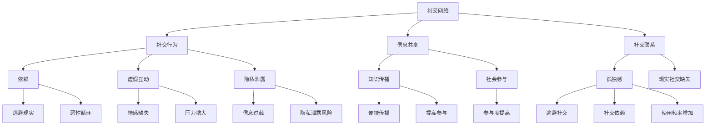

                 

### 《在社交网络时代寻找真实连接：克服数字时代的孤独感》

#### 文章关键词
- 社交网络
- 数字时代
- 孤独感
- 真实连接
- 心理健康

#### 文章摘要
本文旨在探讨社交网络时代下，如何克服数字时代的孤独感，寻找真实连接。通过分析社交网络的变迁、数字时代孤独感的定义和表现，以及克服孤独感的方法，本文提供了从个人到社会的多层次策略，以促进心理健康和人际关系。

## 第1章 引言

### 1.1 社交网络时代的变迁

随着互联网技术的飞速发展，社交网络已经成为现代人类生活中不可或缺的一部分。从早期的MySpace到如今的Facebook、Twitter、Instagram，社交网络不仅改变了我们的沟通方式，还深刻影响了我们的社会行为模式。社交网络的出现，使得人们能够跨越时空限制，快速分享信息和建立联系。然而，这种快速连接的同时，也带来了新的挑战，尤其是在孤独感方面。

在数字时代，孤独感呈现出新的特点。首先，社交媒体的广泛使用，虽然提供了更多的社交机会，但却往往缺乏深层次的互动。其次，人们沉迷于虚拟世界，忽视了现实生活中的情感交流。最后，社交媒体上的信息泛滥和同质化，使得个体感到信息过载，从而加剧了孤独感。

### 1.2 数字时代的孤独感

数字时代的孤独感，是指个体在社交网络使用过程中感受到的孤立和无助。这种孤独感不仅仅是心理上的，它还与个体的社会行为、认知模式和文化背景密切相关。具体来说，数字时代的孤独感具有以下特征：

1. **社交网络依赖**：个体对社交网络的过度依赖，导致其在现实生活中缺乏有效的社交互动。
2. **虚假互动**：社交媒体上的互动往往缺乏深层次的情感交流，容易让人感到孤独。
3. **信息过载**：大量的社交媒体信息让人应接不暇，导致个体感到压力和孤独。

### 1.3 本书的目的与结构

本书的目的在于深入探讨数字时代孤独感的原因及其应对策略，旨在为个人、家庭和社会提供多层次、多维度的解决方案。本书结构如下：

1. **第1章 引言**：介绍社交网络时代的变迁和数字时代孤独感的特点。
2. **第2章 社交网络与人类行为**：分析社交网络对人类行为的影响，以及社交网络与孤独感之间的关联。
3. **第3章 数字时代的孤独感**：定义孤独感，探讨其产生的原因和表现。
4. **第4章 克服数字时代孤独感的方法**：提出个人和社会层面的策略，以克服数字时代的孤独感。
5. **第5章 数字时代的自我提升**：讨论提升自我认知、自我调节能力和塑造积极心态的方法。
6. **第6章 社交网络时代的家庭教育**：探讨家庭教育在数字时代的角色和策略。
7. **第7章 社交网络时代的心理健康支持**：分析心理健康支持的重要性，并提出实施策略。
8. **第8章 结论**：总结全文，并提出未来展望。

通过以上章节的深入探讨，本书希望为读者提供一套全面的解决方案，帮助他们在数字时代中找到真实的连接，克服孤独感，提升生活质量。

## 第2章 社交网络与人类行为

### 2.1 社交网络的概念与发展

社交网络，是指由个体及其相互关系构成的在线平台。它不仅提供了一个信息共享和交流的场所，还扮演着人际互动和社交联结的角色。社交网络的发展经历了多个阶段：

1. **初始阶段**：最早的社交网络形式是电子邮件和论坛。这些平台提供了基本的沟通工具，但缺乏实时性和互动性。
2. **增长阶段**：随着宽带和移动互联网的发展，社交网络开始普及。Facebook、MySpace和Twitter等平台的出现，标志着社交网络进入了一个新的增长期。
3. **成熟阶段**：当前，社交网络已经发展成为一个成熟的生态系统。各种类型的社交网络平台，如专业社交平台LinkedIn、图片分享平台Instagram、短视频平台TikTok等，不断涌现，满足不同用户群体的需求。

### 2.2 社交网络对人类行为的影响

社交网络对人类行为产生了深远的影响。这些影响既有正面的，也有负面的。

#### 2.2.1 社交网络的正面影响

1. **增强社交联系**：社交网络使得人们能够轻松地与他人保持联系，特别是对于那些地理位置分散的人群。
2. **促进信息共享**：社交网络提供了一个快速、高效的信息共享平台，使得知识传播更加便捷。
3. **提高社会参与度**：社交网络鼓励用户参与社会事务，提高政治和社会活动的参与度。

#### 2.2.2 社交网络的负面影响

1. **社交网络依赖**：个体可能会过度依赖社交网络，忽视了现实生活中的社交互动。
2. **虚假互动**：社交媒体上的互动往往缺乏真实情感，容易导致个体感到孤独。
3. **隐私泄露**：社交网络平台可能会侵犯用户的隐私，导致个人信息泄露。

### 2.3 社交网络与孤独感的关系

社交网络与孤独感之间存在复杂的互动关系。一方面，社交网络提供了更多的社交机会，有助于缓解孤独感；另一方面，社交网络的过度使用和虚假互动可能会导致孤独感的加剧。

#### 2.3.1 社交网络如何导致孤独感

1. **社交网络依赖**：个体过度依赖社交网络，导致其在现实生活中缺乏有效的社交互动。
2. **虚假互动**：社交媒体上的互动往往缺乏深层次的情感交流，容易让人感到孤独。
3. **信息过载**：大量的社交媒体信息让人应接不暇，导致个体感到压力和孤独。

#### 2.3.2 孤独感对社交网络使用的影响

1. **社交网络逃避**：孤独感可能会促使个体逃避现实生活中的社交互动，更多时间花在社交网络上。
2. **社交网络依赖加剧**：孤独感加剧了个体对社交网络的依赖，形成恶性循环。
3. **社交网络使用频率增加**：为了寻找安慰和连接，孤独感个体可能会更频繁地使用社交网络。

### Mermaid 流程图

通过以上分析，我们可以看到社交网络对人类行为具有深远的影响，而孤独感与社交网络的使用也存在复杂的互动关系。在下一章中，我们将深入探讨数字时代的孤独感，包括其定义、特征以及与健康的关系。

