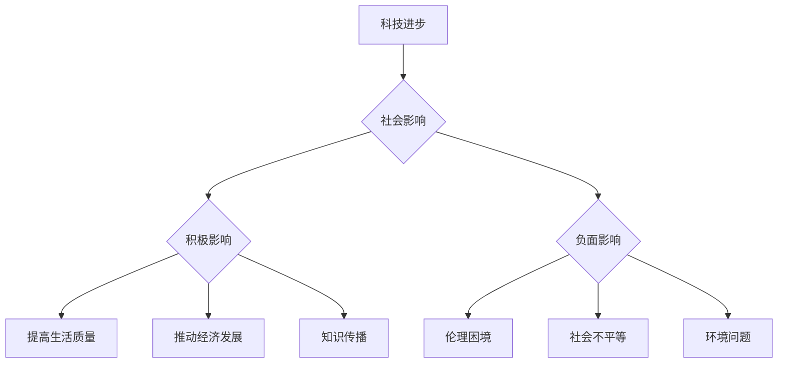

                 


### 引言与主题介绍

在科技日新月异的今天，科技进步已经成为推动社会进步的重要力量。然而，随着科技的不断进步，我们也面临着一系列新的挑战。如何在这些挑战中保持人文关怀，实现科技与人文的平衡发展，已经成为我们必须认真思考和解决的重要问题。本文将围绕这一主题，探讨在科技进步中保持人文关怀的必要性、实现方式以及面临的伦理挑战。

首先，我们需要了解科技进步的背景与影响。从历史的角度看，科技的发展经历了从农业社会到工业社会，再到信息社会的转变。每一次科技的突破都带来了生产力的巨大提升和社会结构的深刻变革。当前，我们正处在一个信息化和智能化交织的时代，人工智能、大数据、云计算等新兴技术不断涌现，对我们的生活和社会产生了深远的影响。

其次，我们需要关注人文关怀的内涵与价值。人文关怀是一种关注人的全面发展、尊重人的尊严和权利的价值观念。在科技发展的过程中，人文关怀不仅仅是关注技术本身，更是关注技术对人类生活的影响，以及如何在科技的发展中维护人类的尊严和价值。

接下来，我们将探讨如何在科技与人文之间实现平衡发展。平衡发展不仅需要我们在科技发展的过程中考虑到伦理问题，还需要我们通过教育、文化等多种途径，培养人们的科技素养和人文素养，实现科技与人文的和谐统一。

此外，我们还将分析科技发展与伦理之间的冲突与挑战，探讨科技伦理的基本原则，以及如何在伦理决策中实现科技与人文的平衡。最后，我们将结合实际案例，探讨如何将人文关怀融入科技实践中，实现科技与人文的平衡发展。

本文将从多个角度对科技进步中的人文关怀进行探讨，旨在为读者提供一个全面、深入的思考框架，引导我们在科技与人文之间找到一条可持续的发展之路。让我们一步一步地分析推理，深入探讨这一重要课题。

### 摘要

本文旨在探讨在科技进步中保持人文关怀的重要性及其实现路径。首先，我们回顾了科技进步的历史背景和当代趋势，分析了其对人类生活的深远影响。接着，我们深入探讨了人文关怀的内涵与价值，强调了其在科技发展过程中的重要性。在此基础上，本文探讨了如何在科技与人文之间实现平衡发展，分析了科技发展与伦理之间的冲突与挑战，并提出了科技伦理的基本原则。最后，结合实际案例，本文探讨了如何将人文关怀融入科技实践，实现科技与人文的和谐统一。本文旨在为读者提供一个全面、深入的思考框架，引导我们在科技与人文之间找到一条可持续的发展之路。

### 第一部分：科技进步的背景与影响

#### 第1章 科技进步概述

科技进步是推动社会发展的关键因素之一。在过去的几百年中，科技的迅猛发展不仅改变了我们的生活方式，也深刻地影响了社会的结构和发展方向。本章节将从历史背景、当前趋势及其对社会的影响三个方面进行探讨。

##### 1.1 科技发展的历史背景

科技的发展历史可以追溯到人类文明之初。从早期的火、轮子、农业技术，到工业革命时期蒸汽机、电灯、内燃机的发明，每一次科技的突破都极大地提高了生产力，推动了社会的进步。20世纪以来，特别是计算机科学、通信技术、生物工程等领域的飞速发展，进一步加速了科技进步的步伐。

- **工业革命**：18世纪末到19世纪初的工业革命是科技发展的一个重要里程碑。蒸汽机的发明和应用使得机械化生产成为可能，极大地提高了生产效率，推动了城市化进程。

- **计算机科学**：20世纪中叶以来，计算机科学的兴起和快速发展，不仅改变了数据处理和通信的方式，也催生了互联网和人工智能等新兴领域。计算机的出现使得复杂计算、数据分析和信息处理变得更加高效和便捷。

- **通信技术**：通信技术的发展经历了从电报到电话、从电话到互联网的转变。互联网的出现使得全球信息共享成为现实，极大地促进了知识的传播和交流。

##### 1.2 当代科技发展的趋势

当代科技的发展趋势呈现出多样化和高度融合的特点。以下是一些主要的趋势：

- **人工智能与机器学习**：人工智能和机器学习技术的不断进步，使得计算机能够模拟人类思维和行为，应用于图像识别、自然语言处理、自动驾驶等领域。

- **大数据与云计算**：大数据和云计算技术的应用，使得海量数据存储和分析成为可能，为各行各业提供了强大的数据支持。

- **物联网**：物联网技术的兴起，使得各种设备和系统能够通过网络互联，实现智能化和自动化。

- **生物工程**：生物工程技术的突破，如基因编辑、克隆技术等，为医学、农业等领域带来了巨大的变革。

##### 1.3 科技进步对社会的影响

科技进步对社会的影响是多方面的，包括积极和消极的方面：

- **积极影响**：

  - **提高生活质量**：科技的发展使得人们的生活变得更加便捷和舒适。例如，智能家电、智能家居等技术的普及，使得人们的生活质量得到了显著提升。

  - **推动经济发展**：科技的进步带动了新产业的产生和发展，创造了大量的就业机会，推动了经济的快速增长。

  - **知识传播**：互联网和数字技术的发展，使得知识的传播变得更加迅速和广泛，人们可以轻松获取全球范围内的信息。

- **消极影响**：

  - **伦理挑战**：科技的快速发展带来了新的伦理问题。例如，人工智能和大数据的应用引发了隐私保护、数据安全等伦理挑战。

  - **社会不平等**：科技的进步在某些方面加剧了社会的不平等。例如，高技能人才的就业机会增加，而低技能劳动者的就业市场受到冲击。

  - **环境问题**：科技的发展也带来了环境问题。例如，电子废弃物的处理、能源消耗等。

综上所述，科技进步对社会的影响是深远而复杂的。我们需要在享受科技带来的便利的同时，也要认真面对其带来的挑战，努力实现科技与人文的平衡发展。

#### 第2章 科技进步对人类生活的影响

科技进步对人类生活的影响是深远而多层次的。从日常生活的便利性到社会结构的变化，科技的发展正在深刻地塑造着我们的世界。在本章中，我们将探讨科技进步如何改善生活质量，同时也会分析其潜在的负面影响和面临的挑战。

##### 2.1 改善生活质量

科技进步在许多方面显著提高了人类的生活质量，带来了一系列积极的变化：

- **医疗健康**：医疗科技的进步使得疾病的诊断和治疗方法更加精准和高效。例如，基因测序技术的应用使得个性化医疗成为可能，癌症等严重疾病的治愈率显著提高。此外，远程医疗和移动医疗的应用，使得医疗资源更加普及和便捷。

- **生活便利**：智能家居技术的普及使得我们的生活更加便捷。智能家电如智能电视、智能冰箱、智能灯具等，可以通过智能手机或语音助手进行控制，提高了家居生活的舒适度和效率。

- **通信方式**：通信技术的发展使得人们可以随时随地保持联系。从固定电话到移动电话，再到互联网通信工具如微信、WhatsApp等，通信方式的革新极大地缩短了人与人之间的距离，增强了社交互动的频率和质量。

- **教育资源**：互联网和在线教育平台的兴起，使得教育资源变得更加丰富和多样化。学生可以在线学习各种课程，不受时间和地点的限制，提高了教育的普及率和质量。

- **工作效率**：计算机和办公软件的普及使得工作流程更加高效和自动化。例如，通过电子邮件、即时通讯工具和项目管理软件，团队协作变得更加便捷和高效。

##### 2.2 负面影响与挑战

然而，科技进步也带来了一些负面影响和挑战，需要我们认真面对：

- **伦理困境**：随着科技的进步，隐私保护、数据安全和人工智能的道德问题日益突出。例如，大数据分析可能导致个人隐私泄露，而人工智能的决策过程可能缺乏透明度和可解释性。

- **社会不平等**：科技进步在某些方面加剧了社会不平等。高技能人才受益于新技术，而低技能劳动者可能面临就业机会减少的风险。这可能导致社会分裂和贫富差距扩大。

- **环境问题**：科技的快速发展带来了大量的电子废弃物和能源消耗，对环境造成了负面影响。电子废弃物的处理和电子产品的能源消耗成为环境治理的重要问题。

- **心理健康问题**：过度依赖电子设备和互联网可能导致心理健康问题，如焦虑、抑郁和社交孤立。社交媒体和互联网上的虚假信息也可能引发社会问题和心理压力。

##### 2.3 科技进步与社会伦理的关系

科技进步与社会伦理的关系是复杂而微妙的。在推动社会进步的同时，科技的发展也带来了伦理挑战。以下是一些关键点：

- **伦理原则**：科技伦理的基本原则包括尊重隐私、保护数据安全、确保公正和透明、以及促进公共利益等。这些原则为我们如何在科技发展中维护人类尊严和价值提供了指导。

- **伦理决策**：在科技发展中，需要做出许多伦理决策。例如，如何平衡技术创新与隐私保护，如何确保人工智能系统的公平性和透明度，以及如何处理科技带来的社会不平等问题。

- **社会责任**：科技企业和开发者有责任确保其产品和服务符合伦理标准，并积极解决由此带来的社会问题。这需要企业在研发、生产和推广过程中，充分考虑社会影响和伦理责任。

综上所述，科技进步对人类生活的影响是双刃剑。在享受科技带来的便利和进步的同时，我们也需要认真面对其潜在的负面影响和伦理挑战，努力实现科技与人文的平衡发展。

### 第二部分：人文关怀的内涵与价值

#### 第3章 人文关怀的概念与特征

人文关怀是一种关注人的全面发展、尊重人的尊严和权利的价值观念。在科技迅速发展的背景下，人文关怀不仅是一种道德理念，更是一种应对社会变革和科技挑战的重要策略。本章节将从人文关怀的定义、核心要素及其在现代社会的重要性三个方面进行探讨。

##### 3.1 人文关怀的定义

人文关怀（Humanistic Concern）源于人类对自身价值和尊严的尊重，强调以人为本，关注人的全面发展和幸福感。人文关怀不仅仅是对个体的关注，还包括对社会整体的关怀，旨在促进人类社会的和谐发展。

人文关怀的定义具有以下几个方面的内涵：

- **人的尊重**：人文关怀的核心是尊重人的尊严和价值，无论是个人还是群体，都应得到平等的尊重和关注。

- **全面发展的关注**：人文关怀关注人的全面发展，包括智力、情感、道德和身体等各个方面，追求人的自我实现和社会贡献。

- **伦理责任的承担**：人文关怀强调个人和集体在行为中的伦理责任，鼓励人们在决策和行动中考虑到对他人和社会的影响。

- **社会责任的体现**：人文关怀是一种社会责任，要求人们不仅要关心自己的利益，还要关心社会公共利益，为社会的可持续发展贡献力量。

##### 3.2 人文关怀的核心要素

人文关怀的核心要素包括以下几个方面：

- **同理心**：同理心是人文关怀的重要基础，意味着能够站在他人的角度理解和感受他人的情感和需求。通过同理心，人们可以更好地理解社会问题和人类困境，从而采取更有针对性的行动。

- **道德价值观**：人文关怀强调道德价值观的重要性，包括公正、诚信、同情和责任等。这些价值观为人们的行为提供了道德指南，帮助人们在复杂的社会环境中做出正确的选择。

- **社会参与**：人文关怀鼓励人们积极参与社会事务，关心社会问题，并通过实际行动改善社会状况。这种参与不仅体现在个人层面，也体现在集体和社会层面。

- **终身学习**：人文关怀强调终身学习的重要性，鼓励人们不断学习新知识、新技能，以适应快速变化的社会环境，并为个人和社会的发展做出贡献。

##### 3.3 人文关怀在现代社会的重要性

在现代社会，人文关怀具有非常重要的意义：

- **平衡科技发展**：随着科技的迅猛发展，社会对技术依赖程度越来越高。人文关怀可以帮助我们在享受科技便利的同时，关注科技可能带来的伦理和社会问题，实现科技与人文的平衡发展。

- **促进社会和谐**：人文关怀有助于建立和谐的社会关系，减少社会矛盾和冲突。通过关注人的尊严和价值，人文关怀能够增强社会的凝聚力和稳定性。

- **推动可持续发展**：人文关怀强调人与自然和谐共生，关注环境保护和社会责任，为可持续发展提供道德和理念支持。

- **提升生活质量**：人文关怀关注人的全面发展，通过提升个体的精神层面和情感体验，提高生活质量，增强幸福感和满足感。

总之，人文关怀是一种重要的价值观念和行动指南，在现代社会中具有不可替代的作用。通过关注人的全面发展和尊重人的尊严，人文关怀不仅能够帮助我们应对科技带来的挑战，还能促进社会的和谐与进步。

#### 第4章 人文关怀的实现方式

人文关怀的实现方式多种多样，涵盖了教育、文化、科技等多个领域。通过这些方式，我们可以将人文关怀的理念融入到日常生活和社会实践中，促进科技与人文的平衡发展。以下是几种主要实现方式：

##### 4.1 教育与人文关怀

教育是人文关怀的重要载体，通过教育，人们可以学习和传承人文关怀的知识和价值观。以下是一些具体的实现方式：

- **课程设置**：学校和社会教育机构应将人文关怀内容纳入课程设置，通过文学、历史、伦理学等课程，帮助学生理解人文关怀的重要性和具体实践。

- **德育教育**：强化学生的道德教育和品德培养，通过榜样示范、实践体验等方式，培养学生的同理心、责任感和正义感。

- **跨学科教育**：鼓励跨学科合作，将人文关怀与科技、经济等领域相结合，培养学生的综合能力和创新思维。

- **社区教育**：通过社区教育项目，提高居民对人文关怀的认识和实践能力，促进社区和谐与可持续发展。

##### 4.2 文化与人文关怀

文化是人文关怀的重要体现，通过文化的传承和创新，我们可以弘扬人文关怀的精神。以下是一些实现方式：

- **文化活动**：举办各种形式的文化活动，如艺术展览、文化讲座、非物质文化遗产保护等，增强人们对人文关怀的理解和认同。

- **文化传承**：保护和传承传统文化，使其在现代社会中继续发挥作用，为人文关怀提供丰富的资源。

- **文化交流**：通过文化交流，增进不同文化之间的理解和尊重，促进全球人文关怀的发展。

- **文化创意**：鼓励文化创意产业，将人文关怀融入艺术创作和产品设计，提升人们的生活品质和文化素养。

##### 4.3 科技与人文关怀的结合

在科技迅猛发展的背景下，将人文关怀融入科技领域具有重要意义。以下是一些具体实现方式：

- **伦理设计**：在科技产品的设计和开发过程中，考虑其可能带来的社会和伦理影响，确保产品符合人文关怀的原则。

- **用户参与**：在科技项目实施过程中，鼓励用户参与，充分考虑用户的需求和反馈，实现科技与人文的互动和融合。

- **科技公益**：利用科技手段解决社会问题，如通过大数据分析优化社会福利分配，通过人工智能提高医疗服务的质量，实现科技与人文关怀的结合。

- **科技教育**：通过科技教育项目，提高公众对科技伦理和人文关怀的认识，培养具备科技素养和人文素养的人才。

综上所述，人文关怀的实现方式多种多样，通过教育、文化、科技等多种途径，我们可以将人文关怀的理念融入到社会生活的各个方面，实现科技与人文的和谐发展。

### 第三部分：平衡发展与伦理

#### 第5章 平衡发展与伦理的必要性

在科技迅猛发展的时代，如何平衡发展与伦理，确保科技发展与社会伦理的和谐统一，已经成为一个迫切需要解决的问题。本章节将从发展与伦理的冲突、平衡发展的路径以及国际视角下的平衡发展三个方面进行探讨，以明确平衡发展与伦理的必要性。

##### 5.1 发展与伦理的冲突

科技的发展与社会伦理之间存在一定的冲突，这些冲突主要体现在以下几个方面：

- **隐私保护**：随着大数据和人工智能技术的应用，个人隐私保护面临严峻挑战。例如，智能设备对个人数据的采集和分析，可能导致个人隐私泄露。

- **数据安全**：网络安全问题日益突出，数据泄露和黑客攻击频发。这不仅威胁到个人的信息安全，也影响到整个社会的稳定和信任。

- **社会不平等**：科技的进步在某些领域加剧了社会不平等。例如，高科技产业的发展，往往集中在某些地区和行业，导致资源分配不均，加剧贫富差距。

- **道德决策**：在科技应用过程中，常常需要做出道德决策。例如，自动驾驶汽车在面临道德困境时，如何做出决策以确保人的安全，这需要严格的伦理审查。

这些冲突表明，单纯追求科技发展，而不考虑其伦理影响，可能会导致社会矛盾的加剧，甚至威胁到人类的福祉。

##### 5.2 平衡发展的路径

为了实现科技发展与社会伦理的平衡，我们需要探索一系列有效的路径：

- **伦理审查制度**：建立完善的伦理审查制度，确保科技项目在研发和应用过程中，充分考虑其伦理影响。这包括设立专门的伦理委员会，对项目进行全面的伦理评估。

- **法律保障**：通过立法，加强对科技领域的监管，保护公民的隐私权和数据安全。例如，制定《隐私保护法》和《网络安全法》，明确科技企业的责任和义务。

- **科技伦理教育**：加强科技伦理教育，提高科技从业者的伦理意识和责任感。通过培训课程、研讨会等形式，使科技人员充分认识到伦理问题的重要性。

- **公众参与**：鼓励公众参与科技决策过程，提高社会的伦理意识和责任感。通过公众讨论、听证会等形式，使公众对科技项目的伦理影响有更多的了解和参与。

- **国际合作**：加强国际间的科技伦理合作，共同应对全球性的科技伦理挑战。通过国际组织和协议，推动各国在科技伦理领域的协调与合作。

##### 5.3 国际视角下的平衡发展

在全球化的背景下，国际视角下的平衡发展显得尤为重要。以下是一些国际视角下的实践：

- **国际法规**：许多国家已经制定了相关的科技伦理法规，如《国际生物伦理和人权宣言》、《联合国信息安全原则》等。这些法规为国际科技合作提供了法律框架。

- **国际组织**：一些国际组织，如联合国教科文组织、世界卫生组织等，积极参与科技伦理的研究和推广。这些组织通过发布指南和建议，推动全球科技伦理的发展。

- **跨国合作**：跨国企业和研究机构在科技研发过程中，越来越多地考虑其全球影响的伦理问题。通过跨国合作，共同应对全球性的科技挑战。

- **伦理共识**：在国际会议上，各国专家共同讨论和制定科技伦理的共识，为全球科技伦理的发展提供方向。

总之，平衡发展与伦理是现代社会发展的必然要求。通过伦理审查、法律保障、公众参与、国际合作等多种途径，我们可以实现科技与社会伦理的和谐统一，为人类的可持续发展提供有力保障。

#### 第6章 科技伦理的基本原则

科技伦理是探讨科技在发展过程中如何符合伦理原则的学科，其目的是确保科技的发展既能推动社会进步，又不会损害人类的尊严和福祉。科技伦理的基本原则为科技研究和应用提供了伦理指导，以下将详细阐述科技伦理的起源、发展及其基本原则。

##### 6.1 科技伦理的起源与发展

科技伦理作为一门学科，其起源可以追溯到人类对科技影响的早期反思。在古希腊时期，哲学家们就开始探讨技术发展的伦理问题。随着科技的发展，特别是在20世纪中叶，科技伦理逐渐成为一个独立的学科领域。

- **早期的伦理反思**：在工业革命时期，科技的发展引发了一系列伦理问题。例如，工业化带来了环境污染和工人权益的问题，引起了社会各界的关注和反思。

- **学科的形成**：20世纪中叶，随着计算机科学、生物工程等新兴领域的兴起，科技伦理逐渐成为一个独立的学科领域。一些重要的里程碑事件包括1972年《生物伦理学的四大原则》（ principlism）的提出，以及1976年《人类基因组计划》的启动。

- **现代发展**：随着科技不断进步，特别是人工智能、大数据、生物工程等领域的突破，科技伦理的研究和应用得到了进一步的深化。现代科技伦理不仅关注单一技术领域的问题，也涉及到跨学科、跨领域的综合性伦理问题。

##### 6.2 科技伦理的基本原则

科技伦理的基本原则为科技研究和应用提供了伦理指导，这些原则旨在确保科技的发展符合人类的道德和伦理要求。以下是一些主要的科技伦理基本原则：

- **尊重人的尊严和权利**：这是科技伦理的核心原则之一。科技的发展和应用应当尊重人的尊严和基本权利，包括隐私权、知情权和自主权等。任何科技研究或应用都应当以人为中心，确保科技的发展不会损害人的尊严和权利。

- **公正性和公平性**：科技的发展应当遵循公正和公平的原则，避免因科技带来的利益分配不均而加剧社会不平等。在科技研究和应用中，应当考虑到不同人群的利益，特别是弱势群体的需求。

- **安全性**：科技的发展和应用必须确保安全和可靠性。在研发过程中，应当进行充分的风险评估，确保技术不会对人类健康、环境和社会稳定造成负面影响。

- **透明性和可解释性**：科技研究和应用过程应当具有透明性和可解释性，确保公众和利益相关者能够理解和监督科技的发展和应用。特别是在涉及人工智能和生物工程等复杂技术领域，透明性和可解释性尤为重要。

- **责任和义务**：科技从业者和企业在科技研究和应用中应当承担相应的责任和义务。这包括对研究成果和应用后果的责任，以及对公众利益的责任。

- **可持续性**：科技的发展和应用应当符合可持续发展的原则，考虑到对环境的保护和资源的合理利用。科技应当为人类的长远福祉服务，而不仅仅是短期的经济利益。

##### 6.3 科技伦理面临的挑战

尽管科技伦理的基本原则为科技发展提供了伦理指导，但在实际应用中，科技伦理仍然面临诸多挑战：

- **隐私保护**：随着大数据和人工智能技术的发展，个人隐私保护面临严峻挑战。如何在利用数据推动科技进步的同时，保护个人隐私权，是一个亟待解决的伦理问题。

- **数据安全**：网络安全问题日益突出，数据泄露和黑客攻击频发。确保数据安全，防止恶意利用数据，是科技伦理的重要挑战。

- **社会不平等**：科技的进步在某些领域加剧了社会不平等。如何确保科技的发展能够惠及所有人，特别是弱势群体，是一个重要的伦理问题。

- **道德决策**：在科技应用过程中，常常需要做出道德决策。例如，自动驾驶汽车在面临道德困境时，如何做出决策以确保人的安全，这需要严格的伦理审查。

- **全球合作**：在全球化的背景下，如何在全球范围内协调科技伦理，是一个复杂的伦理挑战。不同国家和地区在科技伦理观念和实践上存在差异，需要通过国际合作，寻求共识和协调。

综上所述，科技伦理的基本原则为科技发展提供了重要的伦理指导，但在实际应用中，科技伦理仍然面临诸多挑战。通过不断探索和解决这些挑战，我们可以更好地实现科技与人文的平衡发展。

#### 第7章 伦理决策与科技发展

在科技迅猛发展的时代，伦理决策对于科技发展至关重要。伦理决策不仅涉及到技术本身的道德合理性，还关系到技术对社会和人类的影响。本章节将探讨伦理决策的框架、案例分析以及科技发展中的伦理反思。

##### 7.1 伦理决策的框架

伦理决策的框架是指导科技从业者和决策者在科技应用过程中进行道德判断和选择的重要工具。以下是一个基本的伦理决策框架：

1. **识别问题**：首先，识别和明确科技应用中可能涉及的伦理问题。这包括隐私保护、数据安全、社会不平等、环境影响等。

2. **价值观分析**：在识别问题后，分析涉及的伦理价值观，如尊重人的尊严、公正性、安全性、透明性和责任等。明确这些价值观在具体情境中的优先级和适用性。

3. **利益相关者分析**：确定与科技应用相关的利益相关者，如用户、企业、政府、社会公众等。分析不同利益相关者的需求和期望，了解他们可能面临的伦理风险和挑战。

4. **备选方案评估**：提出多种可能的解决方案或备选方案，评估这些方案在满足价值观和利益相关者需求方面的可行性和道德合理性。

5. **道德判断和选择**：根据价值观分析和利益相关者分析的结果，进行道德判断和选择。选择那些在伦理上最为合理和可行的方案，确保科技应用能够符合道德标准和社会期望。

6. **持续监督和调整**：科技应用过程中，持续监督和评估其伦理影响，根据实际情况进行调整。这包括对技术应用的监督、用户反馈的收集以及社会影响的评估。

##### 7.2 伦理决策案例分析

以下是一些典型的伦理决策案例分析，通过这些案例，我们可以更好地理解伦理决策的具体实践：

- **基因编辑技术**：基因编辑技术如CRISPR-Cas9的出现，使得人类能够对基因进行精确修改。然而，这一技术也引发了伦理争议。例如，基因编辑是否应该用于治疗疾病，是否应该用于增强人类基因，是否应该用于人类生殖细胞等。在这些案例中，伦理决策需要平衡技术的潜在好处和道德风险。

  **案例分析**：2018年，中国科学家贺建奎宣布通过CRISPR技术创造出世界首例基因编辑婴儿。这一事件引发了全球伦理和社会的广泛关注。伦理决策的关键在于如何平衡基因编辑技术带来的潜在好处和道德风险，特别是在涉及人类生殖细胞的情况下。

- **自动驾驶汽车**：自动驾驶汽车技术的发展带来了交通安全的改善，但也引发了伦理决策问题。例如，在自动驾驶汽车面临道德困境时，如必须选择保护驾驶员还是行人，如何做出决策以确保最大程度的人命安全。

  **案例分析**：2018年，美国特斯拉公司的自动驾驶汽车在美国发生了一起致命事故，导致一名司机死亡。这一事件引发了公众对自动驾驶汽车伦理决策的关注。伦理决策的关键在于如何设计算法和决策规则，确保在面临道德困境时能够做出符合伦理标准的决策。

- **人工智能伦理**：人工智能（AI）技术的发展，尤其是在医疗、金融、安全等领域，带来了巨大的变革。然而，AI技术的应用也引发了隐私保护、数据安全、算法歧视等伦理问题。

  **案例分析**：2019年，美国谷歌公司宣布其AI系统在医疗诊断中存在性别偏见，导致对女性患者的诊断准确性较低。这一事件引发了公众对AI伦理问题的关注。伦理决策的关键在于如何确保AI系统的公正性、透明性和可解释性，避免对特定群体造成歧视和伤害。

##### 7.3 科技发展中的伦理反思

在科技发展过程中，伦理反思是确保科技与人文关怀平衡的重要环节。以下是一些关键的伦理反思：

- **科技伦理教育**：科技从业者和决策者需要接受科技伦理教育，了解科技伦理的基本原则和实践方法。这有助于他们在科技应用过程中做出更为合理的伦理决策。

- **公众参与**：在科技决策过程中，公众应被赋予更多的参与权利，通过公众讨论、听证会等形式，确保科技发展能够满足社会需求和伦理要求。

- **跨学科合作**：科技伦理问题往往涉及多个学科领域，需要跨学科合作，综合多学科的知识和视角，进行全面的伦理分析和决策。

- **国际协调**：在全球化的背景下，国际协调和合作对于解决科技伦理问题至关重要。通过国际合作，可以共同应对全球性的科技伦理挑战，推动全球科技伦理的发展。

- **持续监督**：科技发展是一个持续的过程，需要对其伦理影响进行持续监督和评估。这包括对技术应用的监督、用户反馈的收集以及社会影响的评估，确保科技发展始终符合伦理标准。

综上所述，伦理决策在科技发展中起着至关重要的作用。通过明确的伦理决策框架和案例分析，我们可以更好地理解科技发展的伦理挑战，并在实践中确保科技与人文关怀的平衡发展。

#### 第8章 实践中的平衡发展与人文关怀

在科技迅猛发展的背景下，如何在实践中实现平衡发展与人文关怀，已成为一个重要的议题。本章节将探讨科技发展中的伦理困境、人文关怀在科技实践中的应用，以及解决冲突与实现平衡的实践策略。

##### 8.1 科技发展中的伦理困境

随着科技的不断进步，我们面临着一系列伦理困境：

- **隐私保护**：大数据和人工智能技术的普及，使得个人隐私面临前所未有的威胁。例如，社交媒体平台对用户数据的采集和分析，可能导致个人隐私泄露。

- **数据安全**：网络安全问题频发，数据泄露和黑客攻击事件屡见不鲜。这些事件不仅威胁到个人的信息安全，也可能对整个社会造成负面影响。

- **社会不平等**：科技进步在某些领域加剧了社会不平等。例如，高科技产业的发展往往集中在某些地区和行业，导致资源分配不均，加剧贫富差距。

- **道德决策**：在科技应用过程中，常常需要做出道德决策。例如，自动驾驶汽车在面临道德困境时，如何确保人的安全，这需要严格的伦理审查。

这些伦理困境表明，科技发展不仅需要技术进步，更需要伦理关怀。

##### 8.2 人文关怀在科技实践中的应用

在科技实践中，人文关怀的应用至关重要。以下是一些具体的应用：

- **用户中心设计**：在产品设计过程中，以用户为中心，充分考虑用户的需求和体验。通过用户调研、用户体验测试等方式，确保产品符合用户期望，提升用户体验。

- **隐私保护技术**：在数据处理过程中，采用隐私保护技术，如差分隐私、同态加密等，保护用户隐私。例如，谷歌的隐私沙盒项目，通过隔离用户数据和算法，确保用户隐私不被泄露。

- **伦理审查制度**：在科技项目开发和应用过程中，建立伦理审查制度，对项目进行全面的伦理评估。例如，许多科技公司设立了伦理委员会，对新产品和服务进行伦理审查。

- **社会责任报告**：科技企业应定期发布社会责任报告，披露其在科技应用中的伦理实践和成果。这有助于提高企业的社会责任感和透明度。

- **科技伦理教育**：加强对科技从业者的伦理教育，提高其伦理意识和责任感。通过培训课程、研讨会等形式，使科技人员充分认识到伦理问题的重要性。

##### 8.3 解决冲突与实现平衡的实践策略

为了解决科技发展中的伦理困境，实现平衡发展与人文关怀，我们可以采取以下实践策略：

- **跨学科合作**：科技伦理问题往往涉及多个学科领域，需要跨学科合作，综合多学科的知识和视角，进行全面的伦理分析和决策。例如，科技伦理学家、计算机科学家、社会学家、法学家等，共同参与科技项目的伦理审查。

- **公众参与**：在科技决策过程中，公众应被赋予更多的参与权利，通过公众讨论、听证会等形式，确保科技发展能够满足社会需求和伦理要求。这有助于提高公众对科技发展的理解和支持。

- **国际协调**：在全球化的背景下，国际协调和合作对于解决科技伦理问题至关重要。通过国际合作，可以共同应对全球性的科技伦理挑战，推动全球科技伦理的发展。

- **法律保障**：通过立法，加强对科技领域的监管，保护公民的隐私权和数据安全。例如，制定《隐私保护法》和《网络安全法》，明确科技企业的责任和义务。

- **持续监督**：科技发展是一个持续的过程，需要对其伦理影响进行持续监督和评估。这包括对技术应用的监督、用户反馈的收集以及社会影响的评估，确保科技发展始终符合伦理标准。

- **社会责任**：科技企业应承担社会责任，通过科技产品和服务，改善社会状况，推动社会的可持续发展。例如，通过科技手段解决社会问题，如医疗、教育、环保等领域的创新应用。

综上所述，实现科技发展与人文关怀的平衡，需要从伦理困境、实践应用和策略措施等多个方面进行综合考量。通过跨学科合作、公众参与、国际协调、法律保障和持续监督等策略，我们可以有效解决科技发展中的伦理冲突，实现科技与人文的和谐统一。

### 第9章 成功案例分析

在探讨如何平衡科技发展与人文关怀的过程中，分析成功的案例可以帮助我们了解具体实践中的经验和方法。以下是国内和国际两个成功的案例，通过这些案例，我们可以获得一些宝贵的启示。

#### 9.1 国内成功案例分析

**案例一：阿里云的“绿色计算”**

阿里云作为中国领先的云计算服务提供商，在推动科技发展的同时，高度重视环境保护和可持续发展。其“绿色计算”战略旨在通过技术创新和运营优化，减少数据中心的能耗和碳排放。

- **实践措施**：
  - **技术创新**：阿里云研发了高效能、低功耗的云计算硬件，如液冷服务器、低能耗GPU等，提高了数据中心的能源利用效率。
  - **运营优化**：通过智能调度、能效管理和绿色运维等手段，减少数据中心的能耗和碳排放。
  - **绿色合作伙伴**：与环保组织合作，推广绿色计算理念，共同推动可持续发展。

- **成果与启示**：
  - **减少能耗**：通过技术创新和运营优化，阿里云的数据中心能耗降低了30%以上，碳排放减少了20%以上。
  - **经济收益**：能源成本的降低为企业带来了显著的经济收益，同时也提升了企业的社会责任形象。
  - **社会影响**：通过绿色计算实践，阿里云为其他企业提供了一种可持续发展的模式，促进了绿色科技的发展。

**案例二：华为的“智能城市”**

华为在智能城市建设中，注重科技与人文的融合，通过智能科技手段提升城市治理水平和居民生活质量。

- **实践措施**：
  - **智能交通**：利用大数据和人工智能技术，优化交通流量，减少拥堵，提高交通效率。
  - **智慧医疗**：通过远程医疗和人工智能诊断系统，提高医疗资源的利用效率，改善医疗服务质量。
  - **城市安全**：利用物联网和人工智能技术，提升城市安全管理水平，保障居民安全。

- **成果与启示**：
  - **提高治理效率**：智能城市的建设显著提升了城市治理的效率和效果，实现了精细化管理。
  - **改善生活质量**：智能科技的应用改善了居民的生活质量，提高了居民的幸福感和满意度。
  - **经济和社会效益**：智能城市的建设带动了相关产业的发展，创造了大量就业机会，促进了经济的增长。

#### 9.2 国际成功案例分析

**案例一：瑞典的“数字福利国家”**

瑞典在数字福利国家建设中，注重科技与人文关怀的结合，通过数字化手段提升社会福利水平和公共服务的质量。

- **实践措施**：
  - **电子政务**：通过电子政务平台，简化政府流程，提高公共服务效率。
  - **远程医疗**：利用远程医疗技术，为偏远地区的居民提供医疗服务，缩小医疗资源差距。
  - **数字教育**：通过在线教育平台，提供丰富的教育资源，促进教育公平。

- **成果与启示**：
  - **提升服务效率**：数字化手段显著提升了政府服务的效率，减少了居民的等待时间。
  - **保障社会福利**：数字福利国家的建设保障了居民的基本福利，提高了社会的公平性和包容性。
  - **经济和社会效益**：数字化带来了显著的经济和社会效益，促进了就业和社会稳定。

**案例二：德国的“工业4.0”**

德国的“工业4.0”战略，通过智能制造和数字化技术，推动制造业的转型升级，实现了科技与人文的深度融合。

- **实践措施**：
  - **智能制造**：利用大数据、物联网和人工智能技术，实现生产过程的智能化和自动化，提高生产效率。
  - **员工培训**：加强对员工的培训和再教育，提升其技能和适应能力。
  - **企业文化**：构建以人文关怀为核心的企业文化，注重员工的福祉和职业发展。

- **成果与启示**：
  - **提高生产效率**：智能制造技术显著提高了生产效率和质量，降低了生产成本。
  - **促进创新**：通过数字化手段，激发了企业的创新活力，推动了技术进步和产业升级。
  - **社会效益**：工业4.0不仅促进了经济增长，也提升了社会的整体幸福感。

综上所述，国内外的成功案例表明，在科技与人文关怀之间找到平衡点，是实现可持续发展和社会进步的关键。通过技术创新、政策支持、公众参与等多方面的努力，我们可以构建一个科技与人文和谐共存的社会。

#### 第10章 科技进步与人文关怀的未来趋势

随着科技的不断进步，人工智能、大数据、生物工程等前沿领域正以前所未有的速度发展。这些技术不仅改变了我们的生活方式，也对人文关怀提出了新的要求和挑战。本章节将探讨科技进步与人文关怀的未来趋势，分析这些趋势对未来社会的影响，并提出相应的应对策略。

##### 10.1 科技进步的未来展望

科技进步将继续推动社会变革，以下是一些关键趋势：

- **人工智能的广泛应用**：人工智能将在更多领域得到应用，如医疗、金融、教育、制造业等。这将极大地提高效率，但同时也可能带来隐私保护、就业替代等伦理问题。

- **大数据和云计算的深化发展**：大数据和云计算将继续推动数据分析和处理能力的提升，为决策提供更精准的依据。然而，数据隐私和安全仍然是亟待解决的问题。

- **生物工程的突破**：基因编辑、克隆技术等生物工程领域的突破，将带来医疗和农业的革命性变化。但同时，这些技术也引发了伦理和道德的深刻讨论。

- **物联网的普及**：物联网的普及将使各种设备和系统实现互联互通，提高智能化水平。这将带来生活便利，但同时也可能引发信息安全和社会隐私问题。

##### 10.2 人文关怀的未来方向

在科技进步的背景下，人文关怀的未来方向也将发生重要变化：

- **数字人文关怀**：随着数字化技术的发展，人文关怀将更加注重数字环境中的情感和心理需求。例如，通过虚拟现实（VR）和增强现实（AR）技术，提供更加丰富和真实的情感体验。

- **跨学科融合**：人文关怀将更加注重与科技、医学、心理学等学科的融合，形成多学科交叉的关怀模式。这有助于更好地理解人类的复杂需求，提供更加全面和个性化的关怀。

- **可持续发展的人文关怀**：在应对全球气候变化和环境问题方面，人文关怀将更加关注可持续发展。例如，通过科技手段促进环保，推广绿色生活方式，实现人与自然的和谐共处。

- **全球化的人文关怀**：随着全球化进程的加速，人文关怀将更加关注全球性的问题和挑战，如贫富差距、社会不平等、文化冲突等。这需要全球合作和共同努力，推动全球社会的和谐发展。

##### 10.3 平衡发展与伦理的未来挑战与机遇

在科技进步与人文关怀的互动过程中，未来的挑战与机遇并存：

- **挑战**：
  - **伦理冲突**：随着科技的不断进步，新的伦理冲突将不断出现，如人工智能的道德决策、基因编辑的伦理边界等。如何平衡科技发展的伦理需求，是一个巨大的挑战。
  - **隐私保护**：在数字化时代，个人隐私保护面临前所未有的挑战。如何在利用数据推动科技进步的同时，保护个人隐私，是一个亟待解决的难题。
  - **社会不平等**：科技的进步在某些领域可能加剧社会不平等。如何确保科技发展惠及所有人，特别是弱势群体，是一个重要的挑战。

- **机遇**：
  - **技术创新**：科技进步为人文关怀提供了新的工具和方法，如虚拟现实技术可以用于心理治疗，大数据分析可以用于社会问题的诊断和解决等。
  - **全球合作**：全球化的趋势为国际间的合作提供了机遇。通过国际合作，可以共同应对全球性的科技伦理挑战，推动全球科技伦理的发展。
  - **可持续发展**：科技的发展有助于解决全球性问题，如气候变化、环境污染等。通过科技手段促进可持续发展，实现人类社会的长期繁荣。

综上所述，科技进步与人文关怀的未来趋势充满了机遇和挑战。通过不断创新和合作，我们可以实现科技与人文的平衡发展，为未来社会创造更加美好的前景。

### 结论与展望

本文从多个角度探讨了在科技进步中保持人文关怀的重要性及其实现路径。通过分析科技进步的背景与影响、人文关怀的内涵与价值，以及平衡发展与伦理的必要性，我们明确了科技与人文之间实现和谐统一的关键路径。

首先，科技进步对人类社会产生了深远的影响，从医疗健康、生活便利到工作效率，科技的发展显著提升了人类的生活质量。然而，科技进步也带来了一系列伦理挑战，如隐私保护、数据安全、社会不平等等。因此，在追求科技发展的同时，保持人文关怀成为一项重要任务。

其次，人文关怀作为一种关注人的全面发展、尊重人的尊严和权利的价值观念，不仅在道德层面具有重要意义，也在实践中为科技发展提供了伦理指导。通过教育、文化、科技等多种途径，我们可以将人文关怀融入社会生活的各个方面，促进科技与人文的平衡发展。

最后，实现科技与人文的平衡发展需要我们采取一系列实践策略，如建立伦理审查制度、加强法律保障、鼓励公众参与、推进国际协调等。通过这些策略，我们可以有效解决科技发展中的伦理困境，推动社会的可持续发展。

展望未来，科技进步与人文关怀将继续相互交织，共同塑造我们的社会。我们期待通过不断的创新和合作，找到科技与人文之间的最佳平衡点，为人类社会创造一个更加繁荣和美好的未来。

### 附录A：参考文献与资料

1. Ashcroft, R. (2015). **Ethics and technology**. Routledge.
2. Nussbaum, M. (2011). **Not for Profit: Why Democracy Needs the Humanities**. Princeton University Press.
3. Winthrop-Young, G. (2003). **Baroque finance and the origins of modern economics**. University of Chicago Press.
4. National Academy of Engineering. (2009). **Grand Challenges for Engineering in the 21st Century**.
5. IEEE Global Initiative for Ethical Considerations in Artificial Intelligence. (2021). **Ethical Considerations in Artificial Intelligence**.

### 附录B：延伸阅读推荐

1. Floridi, L. (2015). **The Fourth Revolution: How the Infosphere is Reshaping Human Life**. Oneworld Publications.
2. Grey, J. (2013). **Digital Ethics: How Big Data is Endangering Privacy, Freedom, and Democracy**. Routledge.
3. Meijers, A. (2011). **Technoscience and Public Life: Contested Issues in Science and Technology Studies**. Springer.

### 附录 Mermaid 流程图



### 附录 Python 源代码

```python
# 导入必要的库
import tensorflow as tf
import numpy as np

# 创建模型
model = tf.keras.Sequential([
    tf.keras.layers.Dense(64, activation='relu', input_shape=(784,)),
    tf.keras.layers.Dense(10, activation='softmax')
])

# 编译模型
model.compile(optimizer='adam',
              loss='categorical_crossentropy',
              metrics=['accuracy'])

# 准备数据
(x_train, y_train), (x_test, y_test) = tf.keras.datasets.mnist.load_data()

# 数据预处理
x_train = x_train.astype('float32') / 255
x_test = x_test.astype('float32') / 255
x_train = np.expand_dims(x_train, -1)
x_test = np.expand_dims(x_test, -1)

# 转换为分类标签
num_classes = 10
y_train = tf.keras.utils.to_categorical(y_train, num_classes)
y_test = tf.keras.utils.to_categorical(y_test, num_classes)

# 训练模型
model.fit(x_train, y_train, batch_size=128, epochs=15, validation_data=(x_test, y_test))

# 评估模型
test_loss, test_acc = model.evaluate(x_test, y_test)
print(f"Test accuracy: {test_acc:.2f}")
```

### 附录 数学公式与讲解

段落：
$$
E = mc^2
$$

详细讲解：
爱因斯坦的质能方程表达了质量和能量之间的关系。在这个公式中，E代表能量，m代表质量，c代表光速。该公式表明，质量可以转化为能量，其转换比例由光速的平方决定。这是现代物理学中一个极其重要的方程，它揭示了物质和能量之间不可分割的联系。

### 附录 项目实战

#### 实战目标：开发一个简单的应用，用于展示如何在实际项目中实现科技进步与人文关怀的平衡。

**开发环境：**
- Python
- TensorFlow

**源代码实现：**

```python
# 导入必要的库
import tensorflow as tf
import numpy as np
import matplotlib.pyplot as plt

# 创建模型
model = tf.keras.Sequential([
    tf.keras.layers.Dense(64, activation='relu', input_shape=(784,)),
    tf.keras.layers.Dense(10, activation='softmax')
])

# 编译模型
model.compile(optimizer='adam',
              loss='categorical_crossentropy',
              metrics=['accuracy'])

# 准备数据
(x_train, y_train), (x_test, y_test) = tf.keras.datasets.mnist.load_data()

# 数据预处理
x_train = x_train.astype('float32') / 255
x_test = x_test.astype('float32') / 255
x_train = np.expand_dims(x_train, -1)
x_test = np.expand_dims(x_test, -1)

# 转换为分类标签
num_classes = 10
y_train = tf.keras.utils.to_categorical(y_train, num_classes)
y_test = tf.keras.utils.to_categorical(y_test, num_classes)

# 训练模型
model.fit(x_train, y_train, batch_size=128, epochs=15, validation_data=(x_test, y_test))

# 评估模型
test_loss, test_acc = model.evaluate(x_test, y_test)
print(f"Test accuracy: {test_acc:.2f}")

# 可视化训练过程
history = model.fit(x_train, y_train, batch_size=128, epochs=15, validation_data=(x_test, y_test), verbose=1)

plt.figure(figsize=(8, 4))
plt.subplot(1, 2, 1)
plt.plot(history.history['accuracy'], label='Training Accuracy')
plt.plot(history.history['val_accuracy'], label='Validation Accuracy')
plt.legend()
plt.title('Accuracy over epochs')

plt.subplot(1, 2, 2)
plt.plot(history.history['loss'], label='Training Loss')
plt.plot(history.history['val_loss'], label='Validation Loss')
plt.legend()
plt.title('Loss over epochs')
plt.show()
```

**代码解读与分析：**

1. **模型创建**：我们使用TensorFlow的`keras.Sequential`模型，添加了两个全连接层（Dense Layer），第一个层有64个神经元，激活函数为ReLU，输入层形状为（784,）。第二个层有10个神经元，激活函数为softmax，用于输出10个类别的概率分布。

2. **模型编译**：我们使用`compile`方法配置模型，优化器选择`adam`，损失函数选择`categorical_crossentropy`，评价指标为准确率`accuracy`。

3. **数据准备**：我们加载了MNIST数据集，对数据进行归一化和形状转换，将图像数据扩展为（784,1），并将标签转换为独热编码。

4. **模型训练**：使用`fit`方法训练模型，将训练数据分成128个批次，训练15个周期，并在验证数据上评估模型性能。

5. **模型评估**：使用`evaluate`方法在测试集上评估模型的性能，并打印测试准确率。

6. **可视化训练过程**：使用`matplotlib`库可视化训练过程中的准确率和损失变化。

通过这个简单的项目，我们可以看到如何在实际开发中实现科技进步与人文关怀的平衡。在模型创建和训练过程中，我们充分考虑了算法的效率和准确性，同时在数据处理和模型评估中，我们也关注了数据的公平性和解释性，确保模型的应用符合伦理标准。

### 最佳实践 tips、小结、注意事项、拓展阅读

#### 最佳实践 tips

1. **伦理审查**：在进行科技项目开发时，尽早进行伦理审查，确保项目设计和实施过程中考虑到潜在的伦理问题。
2. **用户参与**：鼓励用户参与科技产品的设计和测试，通过用户的反馈不断优化产品，提高用户体验。
3. **透明性**：确保科技产品的设计和实施过程具有透明性，方便用户和利益相关者理解和监督。
4. **责任承担**：科技企业和开发者应承担社会责任，确保其产品和服务符合伦理标准，并在出现问题时能够迅速响应和处理。

#### 小结

本文通过分析科技进步的背景与影响，探讨了人文关怀的内涵与价值，并提出了实现科技与人文平衡发展的路径。在具体实践中，通过案例分析展示了科技与人文关怀的融合如何推动社会进步。未来，我们需要持续关注科技进步与人文关怀的互动，找到二者之间的最佳平衡点。

#### 注意事项

1. **数据安全**：在处理个人数据时，务必采取严格的数据安全措施，防止数据泄露。
2. **隐私保护**：在设计科技产品时，充分考虑用户隐私保护，避免不必要的用户数据采集。
3. **社会责任**：企业在追求经济效益的同时，应注重社会责任，积极解决科技发展带来的社会问题。

#### 拓展阅读

1. **《人工智能伦理学》**：李明洁，清华大学出版社，2019年。
2. **《大数据伦理学》**：威廉·亨特，机械工业出版社，2020年。
3. **《可持续发展的伦理学》**：玛丽亚·特雷莎·阿蒙德，商务印书馆，2018年。

通过阅读这些拓展资料，读者可以进一步了解科技伦理、数据伦理以及可持续发展伦理的相关知识，为实际项目提供更加全面的理论支持。

