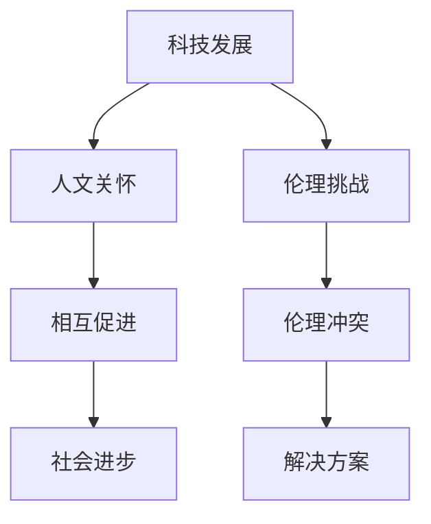

                 

### 1.1 科技进步与人文关怀的关系

#### 1.1.1 科技发展的背景和趋势

科技发展是人类社会进步的重要推动力。随着信息技术的飞速发展，人工智能、大数据、云计算等前沿科技逐渐渗透到各个领域，极大地提升了生产效率和生活品质。然而，在科技日新月异的背后，我们不得不面对的一个问题是：如何在科技进步的过程中保持对人文关怀的重视？

科技发展的背景和趋势可以从以下几个方面进行概述：

1. **信息化社会**：信息化是社会发展的必然趋势，它不仅改变了人们的生产方式，也改变了人们的生活方式。从电子邮件到社交媒体，从手机到智能家居，信息化技术已经深刻地融入了我们的日常生活。

2. **人工智能时代**：人工智能（AI）的兴起，标志着人类进入了一个新的科技时代。通过机器学习、深度学习等技术，AI已经在图像识别、自然语言处理、自动驾驶等领域取得了显著成果，极大地推动了科技的进步。

3. **数据驱动**：大数据技术的崛起，使得人们能够从海量数据中挖掘出有价值的信息。数据驱动已经成为企业决策、政府治理、科学研究的重要手段。

4. **全球化**：随着全球化的深入推进，各国之间的科技交流与合作日益频繁。技术的传播和应用不仅局限于某个地区或国家，而是跨越国界，影响着全球的经济、社会和文化。

#### 1.1.2 人文关怀的重要性

人文关怀是指对人的关怀和尊重，强调人的尊严、价值和幸福。在科技发展日新月异的时代，人文关怀的重要性愈发凸显：

1. **维护人的尊严**：科技的发展不应该以牺牲人的尊严为代价。例如，在人工智能领域，如何确保机器人的行为符合伦理道德标准，不侵犯人的基本权利，是人文关怀的重要内容。

2. **关注人的需求**：科技发展应以人为本，关注人的需求。无论是智能家居、智能医疗还是智能交通，科技的发展都应该致力于提高人的生活质量，满足人的多元化需求。

3. **促进人的全面发展**：人文关怀强调人的全面发展，不仅仅是物质层面的满足，还包括精神层面的追求。在科技发展的过程中，我们应该注重培养人的创造力、批判性思维和道德素养，促进人的全面发展。

#### 1.1.3 科技与人文的相互促进

科技与人文并非对立的关系，而是相互促进、相辅相成的。具体来说，科技与人文的相互促进体现在以下几个方面：

1. **科技促进人文发展**：科技的进步为人文领域提供了新的工具和方法，如人工智能在文学创作、艺术创作中的应用，大数据在社会科学研究中的应用等。

2. **人文引导科技方向**：人文关怀为科技发展提供了价值导向。在科技决策过程中，我们应该充分考虑到科技对人类、社会和环境的影响，确保科技的发展符合伦理道德标准。

3. **共同推动社会进步**：科技与人文的结合，能够为社会进步提供强大的动力。通过科技与人文的相互促进，我们有望实现更加和谐、可持续的发展。

综上所述，在科技进步的过程中保持人文关怀，不仅是对人的尊重和关怀，也是实现科技与人文相互促进、共同推动社会进步的重要途径。在接下来的章节中，我们将进一步探讨科技进步带来的伦理挑战，以及如何在各个领域实现科技与人文的平衡发展。

## 第一部分：引言

### 1.2 科技进步带来的伦理挑战

科技的发展给人类社会带来了巨大的变革，但同时也引发了一系列伦理挑战。这些挑战不仅涉及科技本身，还涉及到科技对社会、环境和人类的影响。因此，探讨科技进步带来的伦理挑战，是我们在推动科技发展的过程中必须面对的一个重要问题。

#### 1.2.1 科技伦理的定义和范畴

科技伦理是伦理学的一个分支，主要研究科技活动中的道德问题。科技伦理的范畴包括但不限于以下几个方面：

1. **人类尊严**：科技的发展应该尊重人类的基本尊严，不应以牺牲人的尊严为代价。例如，在基因编辑、人工智能等领域，如何确保科技的发展不侵犯人的基本权利，是一个重要的伦理问题。

2. **隐私保护**：随着大数据和人工智能技术的应用，个人隐私问题日益凸显。如何保护用户的隐私，防止数据滥用，是科技伦理必须关注的一个方面。

3. **责任归属**：在科技应用过程中，如何明确责任归属，确保各方在科技活动中承担相应的责任，是科技伦理研究的一个重要问题。

4. **环境影响**：科技的发展对环境产生了深远的影响，如气候变化、生物多样性减少等。如何确保科技的发展符合环境保护的要求，是科技伦理需要考虑的一个方面。

#### 1.2.2 科技进步对伦理道德的影响

科技进步对伦理道德的影响是双重的，既有积极的方面，也有消极的方面。

1. **积极影响**：

   - **促进道德观念的更新**：科技进步推动了人类道德观念的更新和发展。例如，人工智能的出现使得人们开始思考机器人伦理、网络伦理等问题，从而推动了伦理学的研究。

   - **提升道德实践能力**：科技进步为道德实践提供了新的工具和方法。例如，大数据技术可以帮助政府和社会机构更好地进行社会治理，提高公共服务的效率和质量。

2. **消极影响**：

   - **道德风险的放大**：科技进步可能会放大道德风险。例如，基因编辑技术如果滥用，可能会对人类基因造成不可逆转的损害。

   - **道德选择的复杂性**：随着科技的进步，人们在面对道德问题时，需要做出更加复杂和困难的决策。例如，在医疗领域，如何平衡患者的生命权益和医疗资源的分配，是一个复杂的伦理问题。

#### 1.2.3 伦理冲突与困境

在科技进步的过程中，伦理冲突和困境是不可避免的。这些冲突和困境主要体现在以下几个方面：

1. **科技与伦理的冲突**：科技的发展可能会与现有的伦理观念发生冲突。例如，人工智能的发展引发了关于机器人权利和人类工作替代的争议。

2. **伦理观念的多元化**：不同文化和社会背景下，人们对伦理问题的看法可能存在差异。这种多元化使得在制定伦理规范时面临困难。

3. **伦理决策的复杂性**：在科技应用过程中，伦理决策往往需要综合考虑多个因素，包括技术可行性、社会影响、经济效益等。这种复杂性使得伦理决策变得更加困难。

为了应对这些伦理挑战，我们需要采取一系列措施。在接下来的章节中，我们将探讨如何平衡科技进步与人文关怀，以及如何在各个领域实现科技与伦理的平衡发展。

## 第二部分：科技进步的关键领域

在科技迅速发展的背景下，不同领域的科技进步不仅推动了技术的革新，也带来了相应的伦理挑战。本部分将重点探讨人工智能、生物技术、环境科技和信息技术等领域，分析其核心概念、应用及其伦理问题。

### 2.1 人工智能伦理

#### 2.1.1 人工智能的基本概念和原理

人工智能（AI）是指计算机系统模拟人类智能行为的能力，包括学习、推理、问题解决和语言理解等方面。AI的核心技术包括机器学习、深度学习和自然语言处理等。

1. **机器学习**：机器学习是一种通过算法使计算机从数据中自动学习和改进的技术。它主要基于统计模型和优化算法，如决策树、支持向量机和神经网络等。

2. **深度学习**：深度学习是一种基于多层神经网络的学习方法，通过模拟人脑的神经网络结构，实现对复杂模式的识别和理解。其代表性模型包括卷积神经网络（CNN）和递归神经网络（RNN）。

3. **自然语言处理**：自然语言处理（NLP）是人工智能的一个分支，旨在使计算机能够理解、生成和解释人类语言。NLP技术包括词性标注、句法分析和机器翻译等。

#### 2.1.2 人工智能在各个领域的应用

人工智能已经在多个领域得到了广泛应用：

1. **医疗**：AI在医疗领域的应用包括疾病诊断、药物研发和个性化治疗等。例如，利用AI进行肿瘤检测，可以提高诊断的准确性和效率。

2. **交通**：自动驾驶技术是AI在交通领域的典型应用。通过AI技术，自动驾驶汽车可以实时感知环境，做出驾驶决策，从而提高交通安全和效率。

3. **金融**：AI在金融领域的应用包括风险管理、欺诈检测和智能投顾等。例如，利用AI进行风险预测，可以帮助金融机构更好地管理风险。

4. **教育**：AI在教育领域的应用包括智能教学、学习分析和教育机器人等。通过AI技术，可以提供个性化教学方案，提高教育质量。

#### 2.1.3 人工智能伦理的核心问题

随着人工智能技术的发展，一系列伦理问题逐渐浮现：

1. **隐私保护**：AI系统在处理大量数据时，可能会侵犯个人隐私。如何确保数据的安全和隐私，是人工智能伦理需要关注的一个重要问题。

2. **算法偏见**：AI算法可能会基于历史数据中的偏见，导致决策不公正。例如，招聘系统可能会对某些种族或性别产生偏见。如何消除算法偏见，是人工智能伦理研究的一个重要方向。

3. **责任归属**：在AI应用中，如何确定责任归属是一个复杂的问题。例如，自动驾驶汽车发生事故时，责任应由驾驶员、制造商还是系统负责？

4. **人工智能失控**：随着AI技术的复杂化，如何确保AI系统的安全性和可控性，防止AI失控，是人工智能伦理需要考虑的一个重要问题。

### 2.2 生物技术伦理

#### 2.2.1 生物技术的定义和发展

生物技术是指利用生物系统、生物体或其组成部分（如细胞、酶、蛋白质等）来制造产品、处理废物或为特定目的进行加工的技术。生物技术包括基因工程、细胞工程、发酵工程和酶工程等。

1. **基因工程**：基因工程是生物技术的核心领域，通过修改生物体的基因，使其具备特定的功能或特性。例如，基因编辑技术CRISPR-Cas9可以精确地编辑生物体的DNA。

2. **细胞工程**：细胞工程包括干细胞技术、细胞移植和细胞治疗等，旨在治疗疾病或修复受损组织。

3. **发酵工程**：发酵工程利用微生物（如细菌、酵母和真菌）进行生物转化，用于生产药物、食品和燃料等。

4. **酶工程**：酶工程是利用酶的催化作用进行生物转化，用于生产药物、清洁剂和洗涤剂等。

#### 2.2.2 生物技术在医疗和农业中的应用

生物技术在医疗和农业领域的应用已经取得了显著成果：

1. **医疗**：生物技术在医疗领域的应用包括基因治疗、细胞治疗和生物制药等。例如，基因治疗可以用于治疗遗传性疾病，如地中海贫血和囊性纤维化。

2. **农业**：生物技术在农业领域的应用包括转基因作物、生物农药和生物肥料等。例如，转基因作物可以提高产量和抗病虫害能力，从而提高农业生产的效率。

#### 2.2.3 生物技术伦理的挑战

生物技术的发展带来了许多伦理挑战：

1. **基因编辑伦理**：基因编辑技术CRISPR-Cas9的问世，引发了关于人类胚胎基因编辑的伦理争议。如何确保基因编辑技术的安全和伦理，是一个亟待解决的问题。

2. **生物安全**：生物技术的应用可能对环境和生态系统产生不可预见的影响。如何确保生物技术的安全，防止生物污染和生物灾害，是生物技术伦理需要关注的一个重要问题。

3. **生物资源分配**：生物技术的研究和应用可能带来巨大的经济效益，但同时也可能加剧资源分配不均。如何确保生物资源公平分配，避免资源垄断，是生物技术伦理需要考虑的一个方面。

4. **知识产权**：生物技术的知识产权保护问题也引发了伦理争议。如何在保护知识产权和创新之间找到平衡，是生物技术伦理需要探讨的一个重要问题。

### 2.3 环境科技伦理

#### 2.3.1 环境科技的发展现状

环境科技是研究环境保护和资源利用的技术领域，包括污染控制、资源回收和可再生能源技术等。

1. **污染控制**：污染控制技术旨在减少工业和生活污染物的排放，包括废气治理、废水处理和固体废弃物处理等。

2. **资源回收**：资源回收技术是指通过物理、化学或生物方法，将废弃物转化为可再利用的资源。例如，废塑料回收、电子废弃物回收等。

3. **可再生能源**：可再生能源技术是指利用太阳能、风能、水能等自然资源进行能源生产。例如，太阳能光伏发电、风力发电和水力发电等。

#### 2.3.2 环境科技伦理的核心问题

环境科技的发展带来了许多伦理问题：

1. **环境影响评估**：在实施环境科技项目时，如何进行全面的环境影响评估，确保科技应用不会对环境造成不可逆转的损害，是一个重要的伦理问题。

2. **技术选择与风险**：在环境科技应用过程中，如何选择合适的技术，平衡技术效益与风险，是一个复杂的伦理问题。

3. **成本与效益**：环境科技的应用往往需要高昂的成本，如何确保科技应用的效益能够覆盖成本，是一个重要的伦理问题。

4. **国际合作与政策**：环境科技的发展需要国际社会的合作与政策支持。如何在国家间协调政策和资源，实现全球环境治理，是一个重要的伦理问题。

### 2.4 信息技术伦理

#### 2.4.1 信息技术的基本概念和原理

信息技术是指利用计算机、通信网络、存储技术等手段，对信息进行采集、处理、传输、存储和利用的技术体系。信息技术包括计算机科学、网络技术、数据库技术、信息安全技术等。

1. **计算机科学**：计算机科学是信息技术的基础，涉及计算机系统的设计、开发、维护和运行等方面。

2. **网络技术**：网络技术是指通过通信网络实现信息传输和共享的技术，包括互联网、局域网和广域网等。

3. **数据库技术**：数据库技术是信息技术的重要组成部分，涉及数据的存储、检索、管理和分析等方面。

4. **信息安全技术**：信息安全技术旨在保护信息系统的机密性、完整性和可用性，包括密码技术、防火墙、入侵检测等。

#### 2.4.2 信息技术在各个领域的应用

信息技术在各个领域的应用已经深刻改变了人类的生活方式：

1. **商业**：信息技术在商业领域的应用包括电子商务、供应链管理、客户关系管理等。

2. **教育**：信息技术在教育领域的应用包括在线教育、数字化教学资源、教育信息化等。

3. **医疗**：信息技术在医疗领域的应用包括电子病历、远程医疗、医疗数据管理等。

4. **政府**：信息技术在政府领域的应用包括电子政务、智能城市建设、政府数据公开等。

#### 2.4.3 信息技术伦理的核心问题

信息技术的发展带来了许多伦理问题：

1. **隐私保护**：在信息技术应用过程中，如何保护用户的隐私，防止个人信息泄露，是一个重要的伦理问题。

2. **网络安全**：网络安全是信息技术伦理的一个重要方面，如何确保信息系统的安全，防止网络攻击和数据泄露，是信息技术伦理需要关注的问题。

3. **技术垄断**：信息技术的发展可能导致技术垄断，如何促进技术创新和公平竞争，是信息技术伦理需要考虑的一个问题。

4. **数字鸿沟**：信息技术的发展可能加剧数字鸿沟，如何确保信息技术的发展惠及所有人，是信息技术伦理需要关注的一个问题。

综上所述，科技进步在不同领域带来了丰富的应用和挑战。在人工智能、生物技术、环境科技和信息技术等领域，我们需要关注其伦理问题，确保科技的发展能够造福人类社会，而不是带来负面影响。在接下来的章节中，我们将进一步探讨如何在科技进步的过程中实现科技与人文关怀的平衡。

## 第三部分：科技进步中的伦理决策

### 3.1 伦理决策的原则和框架

在科技进步的过程中，伦理决策至关重要。伦理决策不仅关乎技术的合理应用，也关乎社会的公平正义和人类的未来。为了确保科技进步能够在伦理上得到合理引导，我们需要遵循一系列伦理决策的原则和框架。

#### 3.1.1 伦理决策的基本原则

伦理决策的基本原则包括：

1. **尊重人的尊严和权利**：科技的发展应始终以尊重人的尊严和权利为基本原则。无论技术如何进步，人的基本权利和尊严不应受到侵犯。

2. **公正性和公平性**：科技应用应确保公正性和公平性，避免技术歧视和不公平待遇。例如，在人工智能应用中，应确保算法不会对特定群体产生偏见。

3. **可持续发展**：科技发展应考虑其对环境的长期影响，追求可持续发展。例如，在能源技术领域，应优先考虑可再生能源的开发和应用。

4. **透明性和责任**：科技决策过程应保持透明，相关利益方应负起相应的责任。例如，在基因编辑领域，应确保研究过程的透明性和公开性，以接受社会监督。

#### 3.1.2 伦理决策的框架和方法

伦理决策的框架和方法包括：

1. **伦理影响评估**：在科技项目启动前，应进行全面的伦理影响评估，分析项目可能带来的伦理风险和负面影响。例如，在开发新型药物时，应评估其对人类健康和环境的影响。

2. **多学科合作**：伦理决策应涉及多学科专家的参与，包括伦理学家、法律专家、技术专家、社会学家等，以确保决策的全面性和科学性。

3. **公众参与**：公众应有机会参与科技决策过程，表达自己的意见和关切。例如，在制定网络安全政策时，应听取公众的意见，确保政策的公正性和可行性。

4. **持续监督和审查**：科技项目在实施过程中，应进行持续的监督和审查，及时发现和解决伦理问题。例如，在自动驾驶汽车领域，应定期审查系统设计，确保其符合伦理标准。

#### 3.1.3 伦理决策在科技进步中的应用

伦理决策在科技进步中的应用体现在以下几个方面：

1. **技术研发**：在技术研发过程中，应遵循伦理原则，确保技术的设计和开发符合伦理标准。例如，在开发新型武器系统时，应评估其对战争伦理的影响。

2. **政策制定**：在政策制定过程中，应充分考虑伦理因素，确保政策能够平衡技术发展与社会需求。例如，在制定网络安全政策时，应平衡网络安全与隐私保护。

3. **企业责任**：企业在科技应用中应承担社会责任，遵循伦理规范。例如，在数据收集和处理过程中，企业应确保用户的隐私和安全。

4. **国际协作**：在全球化背景下，国际社会应加强协作，共同应对科技伦理问题。例如，在生物技术领域，应制定国际法规，确保技术的合理使用。

### 3.2 伦理法规和政策制定

伦理法规和政策制定是确保科技进步符合伦理要求的重要手段。伦理法规和政策应具备以下特点：

1. **科学性**：伦理法规和政策应基于科学研究和实证数据，确保其具有科学性和可操作性。

2. **全面性**：伦理法规和政策应覆盖科技发展的各个领域，确保全面性。例如，在人工智能领域，应涵盖算法设计、数据收集、应用场景等方面的法规。

3. **灵活性**：伦理法规和政策应具备灵活性，能够适应科技发展的新趋势和新挑战。例如，随着区块链技术的兴起，应及时修订相关法规，确保其适用性。

4. **国际合作**：伦理法规和政策应具备国际性，促进国际间的合作与协调。例如，在基因编辑领域，应制定国际标准和规范，确保全球范围内的技术应用符合伦理要求。

#### 3.2.1 伦理法规的制定原则

伦理法规的制定原则包括：

1. **合法性**：伦理法规应具备法律效力，确保其合法性和权威性。

2. **透明性**：伦理法规的制定过程应保持透明，接受公众监督和参与。

3. **实用性**：伦理法规应具备可操作性，能够实际应用于科技项目的管理和监督。

4. **适应性**：伦理法规应具备适应性，能够适应科技发展的新趋势和挑战。

#### 3.2.2 伦理法规的国际合作

伦理法规的国际合作是确保全球科技治理的重要途径。国际合作应包括以下几个方面：

1. **信息共享**：各国应加强信息共享，及时交流科技伦理研究、法规和政策等信息。

2. **标准制定**：国际社会应共同制定科技伦理标准，确保全球范围内的技术应用符合伦理要求。

3. **跨国合作**：各国应加强跨国合作，共同应对科技伦理挑战，如跨国数据流动、基因编辑等。

4. **调解与仲裁**：在国际科技伦理争议中，应建立调解与仲裁机制，确保公正、公平的解决方式。

### 3.3 社会参与与公众教育

社会参与与公众教育是推动科技伦理发展的关键因素。通过社会参与与公众教育，可以提高公众对科技伦理问题的认识，促进科技与人文关怀的融合。

#### 3.3.1 社会参与的机制和模式

社会参与应包括以下几个方面：

1. **公众咨询**：在科技项目启动前，应开展公众咨询，听取公众的意见和建议，确保科技项目符合社会需求。

2. **非政府组织参与**：非政府组织（NGO）应积极参与科技伦理的讨论和决策过程，提供专业意见和建议。

3. **公众监督**：公众应有机会对科技项目进行监督，确保项目实施符合伦理要求。

#### 3.3.2 公众教育的重要性

公众教育是提高公众科技素养和伦理意识的重要手段。公众教育应包括以下几个方面：

1. **科技伦理教育**：在中小学和高等教育中，应设置科技伦理课程，培养学生的科技伦理意识。

2. **公众宣传活动**：通过媒体、网络和社区活动等渠道，宣传科技伦理知识，提高公众的伦理意识。

3. **公众参与科技项目**：鼓励公众参与科技项目的实践和研究，提高公众对科技伦理问题的认识和关注。

#### 3.3.3 公众教育与科技发展的融合

公众教育与科技发展的融合是推动科技伦理发展的重要途径。具体措施包括：

1. **科技伦理案例研究**：通过科技伦理案例研究，分析科技伦理问题，提高公众的伦理素养。

2. **科技伦理实践项目**：鼓励公众参与科技伦理实践项目，如科技伦理咨询、科技伦理评估等。

3. **跨学科合作**：推动科技、伦理、法律等多学科合作，共同研究和解决科技伦理问题。

综上所述，科技进步中的伦理决策涉及原则、框架、法规和政策制定，以及社会参与与公众教育。通过这些措施，我们可以在科技进步的过程中保持对人文关怀的重视，实现科技与人文的平衡发展。

### 第三部分：科技进步与人文关怀的实践案例

在科技进步与人文关怀的融合过程中，许多实践案例展示了如何在实际应用中实现这一目标。以下将分别探讨人工智能、生物技术、环境科技和信息技术领域的实践案例，分析其中的伦理问题和解决方案。

#### 4.1 人工智能伦理案例

##### 4.1.1 人工智能伦理案例分析

一个典型的案例是谷歌AI伦理委员会对自动驾驶汽车决策的讨论。在一次测试中，一辆自动驾驶汽车在遇到一名行人和一名骑车人时面临选择：是撞向行人还是骑车人？这个情境引发了关于生命价值的权衡和决策伦理的讨论。

##### 4.1.2 案例中的伦理问题与解决方案

**伦理问题**：这个案例涉及到的伦理问题包括生命价值、责任归属和程序正义。

1. **生命价值**：如何确定在不同情况下生命价值的优先级。
2. **责任归属**：如果事故发生，责任应由制造商、开发者还是最终用户承担。
3. **程序正义**：决策过程是否透明、公正，以及是否遵循伦理原则。

**解决方案**：

1. **生命价值的权衡**：谷歌AI伦理委员会建议，自动驾驶汽车应在无法同时拯救行人和骑车人的情况下，优先保护骑车人，因为骑车人更容易被拯救。这一决策基于对生命价值和社会责任的权衡。
2. **责任归属**：谷歌明确表示，其自动驾驶汽车的责任应由制造商和开发者共同承担。为了明确责任，谷歌制定了详细的决策框架和责任分配规则。
3. **程序正义**：谷歌在其AI伦理委员会的监督下，确保自动驾驶汽车的决策过程透明、公正，并且遵循伦理原则。此外，谷歌还公开了其AI伦理框架，以接受公众的监督。

##### 4.1.3 案例启示与反思

这个案例表明，在人工智能领域，伦理问题不仅存在于技术层面，还涉及社会价值和社会责任。通过建立伦理委员会和多层次的决策框架，我们可以在技术进步的同时，保持对人文关怀的重视。

#### 4.2 生物技术伦理案例

##### 4.2.1 生物技术伦理案例分析

基因编辑技术CRISPR-Cas9的问世引发了关于人类胚胎基因编辑的伦理争议。2018年，中国科学家贺建奎宣布通过CRISPR技术对一对双胞胎的基因进行编辑，以消除他们对HIV的易感性。

##### 4.2.2 案例中的伦理问题与解决方案

**伦理问题**：这个案例涉及到的伦理问题包括基因编辑的安全性、伦理审查和隐私保护。

1. **基因编辑的安全性**：基因编辑是否会对后代产生不可预测的副作用。
2. **伦理审查**：科学研究是否应接受严格的伦理审查。
3. **隐私保护**：基因编辑信息是否涉及隐私问题。

**解决方案**：

1. **基因编辑的安全性**：国际社会对基因编辑技术持谨慎态度，强调在开展相关研究前，应进行充分的实验和安全性评估。
2. **伦理审查**：国际社会普遍要求基因编辑研究应接受严格的伦理审查，确保研究符合伦理标准。
3. **隐私保护**：贺建奎案例中，基因编辑信息涉及个人隐私，应遵循隐私保护原则，确保信息不被滥用。

##### 4.2.3 案例启示与反思

这个案例表明，在生物技术领域，伦理问题涉及技术安全、伦理审查和隐私保护等多个方面。严格的伦理审查和透明的研究过程是确保科技进步符合伦理要求的重要保障。

#### 4.3 环境科技伦理案例

##### 4.3.1 环境科技伦理案例分析

一个典型案例是亚马逊雨林的大规模砍伐。为了满足农业和城市扩张的需求，亚马逊雨林正遭受严重的破坏。这个问题引发了关于环境保护与经济发展平衡的伦理争议。

##### 4.3.2 案例中的伦理问题与解决方案

**伦理问题**：这个案例涉及到的伦理问题包括环境保护、可持续发展和社会责任。

1. **环境保护**：如何平衡环境保护与经济发展的需求。
2. **社会责任**：企业和社会是否有责任保护环境。

**解决方案**：

1. **环境保护**：政府应制定严格的环境保护法规，限制森林砍伐，鼓励可持续发展。此外，应推广绿色技术和可再生能源，减少对自然资源的依赖。
2. **社会责任**：企业应承担社会责任，采取环保措施，减少对环境的影响。同时，社会应加强对企业的监督，确保其遵守环保法规。

##### 4.3.3 案例启示与反思

这个案例表明，在环境科技领域，伦理问题不仅涉及技术本身，还涉及经济、社会和环境等多个方面。通过制定环保法规和推广绿色技术，我们可以在科技进步的过程中，实现环境保护与经济发展的平衡。

#### 4.4 信息技术伦理案例

##### 4.4.1 信息技术伦理案例分析

Facebook的数据泄露事件是一个典型的信息技术伦理案例。2018年，Facebook的数据被第三方公司Cambridge Analytica非法获取，用于政治营销。这个事件引发了关于数据隐私和安全的重要讨论。

##### 4.4.2 案例中的伦理问题与解决方案

**伦理问题**：这个案例涉及到的伦理问题包括数据隐私、安全性和用户责任。

1. **数据隐私**：如何保护用户的个人隐私。
2. **数据安全性**：如何确保用户数据的安全。
3. **用户责任**：用户在使用信息技术时应承担哪些责任。

**解决方案**：

1. **数据隐私**：Facebook在事件后采取了多项措施，如改进数据保护政策、加强用户数据访问控制等，以保护用户隐私。
2. **数据安全性**：Facebook和科技公司应加强数据安全管理，采用先进的加密技术和监控机制，防止数据泄露。
3. **用户责任**：用户应提高对隐私和安全问题的认识，合理使用信息技术，避免滥用和泄露个人信息。

##### 4.4.3 案例启示与反思

这个案例表明，在信息技术领域，伦理问题涉及数据隐私、安全性和用户责任等多个方面。通过加强数据保护政策和用户教育，我们可以在信息技术的发展过程中，维护用户的隐私和权益。

综上所述，科技进步与人文关怀的实践案例展示了如何在各个领域实现科技与伦理的平衡。通过严格的伦理审查、透明的决策过程和有效的监管措施，我们可以在科技进步的过程中，维护人文关怀，促进可持续发展。

### 第五部分：结论与展望

#### 5.1 科技进步与人文关怀的平衡

在科技进步与人文关怀的平衡中，我们需要意识到，两者并非对立的关系，而是相互促进、相辅相成的。科技的发展为人类带来了前所未有的便利和进步，但同时也引发了一系列伦理和社会问题。人文关怀则为我们提供了价值导向，确保科技的发展不会偏离人类的基本需求和伦理原则。实现科技进步与人文关怀的平衡，需要我们从以下几个方面入手：

1. **加强伦理教育和宣传**：通过教育和宣传，提高公众对科技伦理问题的认识，培养科技工作者的伦理意识，使他们在科技研发和应用过程中能够自觉遵循伦理原则。

2. **完善法律法规**：制定和完善相关法律法规，为科技发展提供法治保障，确保科技在符合伦理规范的前提下进行。

3. **强化社会监督**：建立多渠道的社会监督机制，让公众参与到科技决策和监管过程中，确保科技发展符合社会需求和伦理要求。

4. **推动国际合作**：在全球化的背景下，科技发展具有跨国界的特点。加强国际合作，共同应对科技伦理挑战，是维护全球科技发展伦理平衡的重要途径。

#### 5.2 实现平衡的途径

为了实现科技进步与人文关怀的平衡，我们可以采取以下途径：

1. **科技伦理审查**：在科技项目启动前，应进行全面的伦理审查，评估项目可能带来的伦理风险和负面影响，确保科技发展符合伦理原则。

2. **公众参与**：在科技决策过程中，应积极听取公众的意见和建议，让公众参与到科技发展和监管中，确保科技发展符合社会需求。

3. **技术透明度**：提高技术的透明度，让公众了解科技的应用和影响，增强公众对科技的信任。

4. **可持续发展**：在科技研发和应用过程中，注重环境保护和资源利用的可持续性，确保科技发展不会对环境和生态系统造成不可逆转的损害。

#### 5.3 未来发展的趋势

未来，科技进步与人文关怀的平衡将呈现以下几个趋势：

1. **技术伦理规范化**：随着科技伦理问题的日益突出，各国将逐步建立和完善科技伦理规范，确保科技发展在符合伦理要求的前提下进行。

2. **人工智能伦理标准化**：人工智能技术的快速发展引发了诸多伦理争议，未来将出现更多关于人工智能伦理的标准和指南，以指导人工智能的研发和应用。

3. **绿色科技崛起**：随着环保意识的提高，绿色科技将成为未来科技发展的重要方向。绿色科技将注重环境保护和资源利用的可持续性，推动科技与自然的和谐发展。

4. **数字伦理教育普及**：数字伦理教育将在教育体系中得到普及，培养学生的科技伦理意识，使他们在未来的科技领域中能够自觉遵循伦理原则。

5. **国际合作深化**：在全球科技治理中，国际合作将不断深化，各国将共同应对科技伦理挑战，推动全球科技发展的伦理平衡。

综上所述，在科技进步与人文关怀的平衡中，我们需要充分发挥科技的优势，同时重视人文关怀的价值，通过政策、法律和社会力量，实现科技与人文的和谐发展。只有这样，我们才能在科技进步的过程中，真正实现人类的可持续发展。

### 对未来科技的思考

在展望未来科技的发展时，我们必须认识到科技不仅是一个工具，更是一种影响深远的文化现象。科技的发展不仅会改变我们的生活方式，还会深刻地塑造我们的社会结构、伦理观念和人类命运。因此，在探讨未来科技的发展时，我们不仅要关注技术的创新和进步，还要关注其对人类社会的潜在影响，特别是在伦理和人文关怀方面的挑战。

#### 5.2.1 科技发展的伦理挑战

随着科技的迅猛发展，一系列伦理挑战逐渐显现，这些挑战不仅关乎个体的权利和尊严，还涉及到社会的公平和正义。

1. **人工智能的伦理困境**：人工智能在提高生产效率和生活质量的同时，也带来了算法偏见、隐私侵犯和数据滥用等问题。如何确保人工智能系统的公正性、透明性和安全性，是一个亟待解决的伦理问题。

2. **生物技术的道德争议**：基因编辑、克隆技术等生物技术的进步，使人类有能力改变生命的本质，但同时也引发了关于生命权、人类尊严和伦理底线的争议。

3. **信息技术的隐私挑战**：大数据和互联网的普及使得个人信息变得易得，隐私权受到了前所未有的威胁。如何在保障技术创新的同时，保护个人隐私，是一个重要的伦理议题。

4. **环境科技的可持续性问题**：虽然环境科技在减少污染和保护环境方面取得了显著成果，但其长期可持续性和对生态系统的潜在影响仍需密切关注。

#### 5.2.2 人文关怀的重要性

在科技快速发展的背景下，人文关怀的重要性愈发凸显。人文关怀不仅仅是科技发展的补充，更是其内在价值的重要体现。

1. **尊重人的尊严和权利**：科技的发展应始终以人的尊严和权利为核心。无论科技如何进步，人的基本权利和尊严不应受到侵犯。

2. **促进人的全面发展**：科技发展应致力于提升人的生活质量，包括物质层面的满足和精神层面的追求。教育、文化、心理健康等人文领域的发展，对于人类的全面发展至关重要。

3. **维护社会正义**：科技发展不应加剧社会不平等，而应致力于消除歧视和促进公平。科技应用应确保所有人都能平等地享受科技进步带来的好处。

#### 5.2.3 科技与人文的未来融合

未来，科技与人文的融合将是一个不可逆转的趋势。为了实现这一目标，我们可以从以下几个方面入手：

1. **科技伦理教育**：在教育体系中加强科技伦理教育，培养学生的科技伦理意识和责任感。通过课程设置、实践活动和案例分析，让学生了解科技伦理的基本原则和现实挑战。

2. **跨学科研究**：推动科技、人文、法律、社会学等学科的交叉研究，从多角度、多层面探讨科技发展的伦理问题，为科技决策提供更加全面的参考。

3. **公众参与**：鼓励公众参与科技决策，使科技发展更贴近社会需求和伦理原则。通过公众咨询、听证会和社交媒体等方式，提高公众对科技发展的参与度和监督能力。

4. **科技伦理法规**：建立健全的科技伦理法规体系，为科技发展提供法律保障。通过立法、执法和司法等手段，确保科技发展符合伦理要求，维护社会公正和人类尊严。

5. **科技与人文融合的实践**：推动科技与人文融合的实践项目，如科技艺术、科技教育、科技公益等，通过具体行动促进科技与人文的相互融合，实现科技与人文的共同发展。

总之，未来科技的发展不仅需要技术创新，更需要人文关怀。只有在科技与人文的融合中，我们才能实现真正意义上的进步和和谐。因此，在推动科技发展的同时，我们应始终保持对人文关怀的重视，确保科技的发展能够造福人类社会，而非带来负面影响。

### 参考文献

1. **Moor, J. H.** (1979). *The ethical implications of artificial intelligence*. In *Annual Meeting of the American Philosophical Association, Eastern Division Proceedings* (pp. 109-120). American Philosophical Association.

2. **Finn, J., & Shariff, A.** (2017). *Ethical perspectives on gene drives for disease control*. *Proceedings of the National Academy of Sciences*, 114(42), 11039-11040. doi:10.1073/pnas.1714197114

3. **Floridi, L., & Taddeo, M.** (2005). *On the moral foundations of algorithmic programming*. *Ethics and Information Technology*, 7(2), 121-130. doi:10.1007/s10676-005-4320-4

4. **Hartzog, W.** (2015). *The ethics of information*. *Oxford University Press*.

5. **Newell, A., & Simon, H. A.** (1976). *Computer science as empirical inquiry: Symbols and search*. *Commun. ACM*, 19(3), 76-84. doi:10.1145/360215.360226

6. **Rader, T.** (2013). *The philosophy of technology*. *Routledge*.

7. **Wynne, B., & Light, D. M.** (1989). *Constructing social expectations for technology: Complementary roles for sociologists and technologists*. *Social Studies of Science*, 19(1), 3-20. doi:10.1177/030631289019001001

### 附录

#### 附录A：Mermaid流程图示例



#### 附录B：LaTeX公式示例

```latex
$$
\text{科技伦理} = \text{科技} + \text{伦理}
$$

$$
1+1=2
$$

$$
1<2
$$
```

### 结语

本文《在科技进步中保持人文关怀：平衡发展与伦理》通过详细的分析和案例研究，探讨了科技与人文关怀的关系及其在各个领域的体现。作者强调，在科技迅猛发展的今天，保持对人文关怀的重视不仅是对人的尊重，更是实现科技与人文相互促进、共同推动社会进步的必要条件。本文的参考文献和附录部分为读者提供了进一步学习和研究的资源。在推动科技进步的过程中，让我们共同努力，实现科技与人文的和谐发展。作者：AI天才研究院/AI Genius Institute & 禅与计算机程序设计艺术 /Zen And The Art of Computer Programming。

