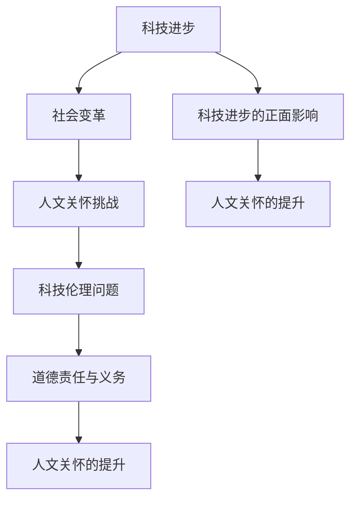

                 

### 引言

在当今社会，科技进步的速度正在以前所未有的速度加速，从人工智能、大数据到生物技术，这些领域的突破不仅改变了我们的生活方式，也深刻地影响了社会结构和人类伦理道德观念。然而，随着科技不断进步，一个关键问题逐渐浮现：如何在追求技术发展的同时，不忽视对人文关怀的坚守？

科技进步带来了许多便利和创新，但同时也带来了伦理和道德上的挑战。例如，数据隐私问题在社交媒体和电子商务中日益突出；算法偏见和人工智能系统的责任归属引发了广泛的讨论；生物技术的进展在带来医疗进步的同时，也引发了对生命伦理的思考。这些挑战要求我们在追求技术进步的同时，必须保持对伦理道德的关注。

本文将围绕“在科技进步中坚守人文关怀：平衡发展与伦理道德”这一主题，通过以下几个部分进行深入探讨：

- **第1章：引言**：介绍科技进步与人文关怀的概念及其相互关系，提出本文的核心论点，并通过Mermaid流程图展示科技进步与人文关怀之间的相互作用。

- **第2章：科技伦理问题分析**：详细分析数据隐私、算法公平性和人工智能等领域的伦理问题，讨论其对社会的潜在影响。

- **第3章：伦理道德教育与培养**：探讨科技伦理教育的重要性及方法，强调培养科技从业者的道德责任感。

- **第4章：科技发展与人文关怀实践**：分析如何在科技项目规划和实施过程中融入人文关怀，以及科技企业如何履行社会责任。

- **第5章：政策与法规在科技伦理中的角色**：讨论科技伦理法规的重要性及具体案例，分析其对科技行业和社会的影响。

- **第6章：国际视野下的科技伦理**：比较不同国家和地区在科技伦理标准上的差异，探讨文化差异对科技伦理的影响。

通过这一系列的讨论，我们希望能够引起读者对科技伦理和人文关怀的深刻思考，为科技进步提供一种更加全面和可持续的发展路径。

### 科技进步与人文关怀

科技进步与人文关怀的关系是一个复杂而深刻的主题。在过去的几百年里，科技的发展极大地改变了人类社会的面貌，从农业革命到工业革命，再到如今的数字革命，每一次技术进步都带来了生产力的飞跃和社会结构的变化。然而，这些变化不仅仅是经济和技术的进步，更涉及伦理道德和人文关怀的维度。

首先，**科技进步**通常指的是人类通过科学研究和工程实践，发明和改进技术的过程。这种进步涵盖了广泛的领域，包括信息技术、生物技术、能源技术等。科技进步的主要特征是创新性、快速性和深远性。创新性体现在不断推陈出新，快速性则体现在技术更替的速度加快，深远性则体现在其对社会的广泛影响。

**人文关怀**，则是指对人类价值和福祉的关注，包括对人的尊重、对环境的保护以及对社会责任的承担。人文关怀的核心在于寻求人类福祉的最大化，不仅关注物质生活的改善，也关注精神文化生活的提升。

在探讨科技进步与人文关怀的关系时，我们可以通过以下几个核心概念和联系来理解：

1. **社会变革**：科技进步往往引发深刻的社会变革。例如，互联网的普及改变了人们的沟通方式、信息获取方式，甚至社会结构。这些变革不仅带来了新的社会问题，如数据隐私和网络安全，也要求我们重新审视如何在技术进步的同时，维护社会的基本伦理规范。

2. **伦理道德挑战**：随着科技的进步，新的伦理问题不断涌现。例如，人工智能和自动化技术的应用带来了道德责任归属的问题。当机器人或算法在做出决策时，如何确保其决策符合伦理标准，成为了一个亟待解决的重要问题。

3. **科技伦理问题**：科技伦理问题包括数据隐私、算法公平性、基因编辑等。这些问题不仅涉及到技术本身，还涉及到社会、文化、法律等多个层面。例如，在数据隐私方面，如何确保个人数据的保护和不被滥用，是一个复杂而关键的伦理问题。

4. **道德责任与义务**：科技从业者在推动技术进步的同时，必须承担相应的道德责任和义务。这意味着，在研发和应用新技术时，需要考虑到其对人类和社会的潜在影响，并采取措施降低负面影响。

5. **科技进步的正面影响**：科技进步也为人文关怀提供了新的可能性。例如，通过大数据和人工智能，我们可以更好地理解和解决社会问题，如贫困、健康不平等和环境问题。这些技术进步不仅提升了生产力和生活质量，也促进了人文关怀的实现。

为了更直观地展示科技进步与人文关怀之间的关系，我们可以使用Mermaid流程图来描述它们之间的相互作用。

在这个流程图中，科技进步作为起点，通过社会变革、人文关怀挑战、科技伦理问题等环节，最终影响道德责任和义务，进而促进人文关怀的提升。这种互动关系表明，科技发展不仅是技术层面的进步，更是涉及到伦理、社会和文化等多个层面的复杂过程。

综上所述，科技进步与人文关怀之间既有相互促进的一面，也存在挑战和冲突。在推进技术进步的过程中，我们必须始终保持对人文关怀的关注，寻找平衡发展的路径，以确保科技进步不仅造福人类，同时也符合伦理和道德的要求。

### 科技发展中的伦理道德考量

在科技迅猛发展的今天，伦理道德考量变得尤为重要。科技不仅改变了我们的生活方式，也在社会、文化、经济等多个层面带来了深远的影响。因此，对科技发展中的伦理道德问题进行深入分析，不仅有助于我们更好地理解科技对社会的潜在影响，也有助于制定相应的道德规范，以指导科技的发展和应用。

#### 数据隐私与伦理

数据隐私是当今社会面临的一个重大伦理问题。随着互联网和大数据技术的普及，个人数据被大量收集、存储和使用。这些数据不仅包括用户的基本信息，还涉及行为数据、地理位置、社交关系等敏感信息。数据隐私问题主要体现在以下几个方面：

1. **数据泄露风险**：大量个人数据的收集和存储，使得数据泄露的风险大大增加。一旦发生数据泄露，用户的隐私权将受到严重侵害，可能导致身份盗窃、诈骗等严重后果。

2. **数据滥用**：在许多情况下，收集到的个人数据被用于商业目的，甚至被第三方公司滥用。例如，一些社交媒体平台利用用户数据投放精准广告，有时甚至会侵犯用户的隐私。

3. **透明度和控制权**：用户往往无法完全了解自己的数据是如何被收集和使用的，也无法有效控制这些数据。这种信息不对称性导致了用户对数据隐私的担忧。

为了解决数据隐私问题，我们需要从以下几个方面着手：

- **数据加密**：通过数据加密技术，确保数据在传输和存储过程中不会被非法访问。
- **隐私保护政策**：企业和服务提供商应制定明确的隐私保护政策，向用户披露数据收集、使用和共享的方式，并给予用户控制权。
- **法规监管**：制定和完善相关法律法规，对数据隐私保护进行严格监管，并对违规行为进行处罚。

#### 算法公平性与伦理

算法公平性是另一个备受关注的伦理问题。随着人工智能和机器学习技术的发展，越来越多的决策过程依赖于算法。然而，算法的决策过程往往是不透明的，这引发了公平性的质疑。

1. **算法偏见**：算法在训练过程中可能会吸收和放大现有的社会偏见，导致决策结果不公平。例如，某些招聘算法可能对特定性别或种族的求职者有歧视性偏见。

2. **数据偏误**：算法的性能依赖于训练数据的质量。如果训练数据存在偏误，算法的决策结果也可能会受到影响。例如，某些自动驾驶系统的训练数据中可能缺乏对特定路况的覆盖，导致在实际应用中出现偏差。

3. **透明度和责任归属**：算法的决策过程往往是不透明的，这使得我们难以理解其决策依据，也难以追究其责任。例如，当自动驾驶系统发生事故时，如何判断责任归属成为一个难题。

为了解决算法公平性问题，我们可以采取以下措施：

- **算法审计**：对算法进行定期的审计，确保其决策过程符合公平性和透明度要求。
- **数据多样化**：确保训练数据具有多样性和代表性，减少算法偏见。
- **责任归属机制**：建立明确的算法责任归属机制，确保在算法决策过程中，责任可以追溯。

#### 人工智能与伦理

人工智能的发展带来了许多新的伦理挑战。人工智能系统在医疗、交通、金融等多个领域都有广泛应用，但同时也引发了一系列伦理问题。

1. **医疗伦理问题**：人工智能在医疗领域的应用，如疾病诊断和治疗方案推荐，可能影响医生的判断。如何确保人工智能系统的决策符合医学伦理标准，是一个重要问题。

2. **责任归属问题**：当人工智能系统发生错误或导致事故时，如何确定责任归属？是人工智能的开发者、使用者还是系统本身应承担责任？

3. **隐私保护问题**：人工智能系统在医疗、金融等领域的应用，可能涉及大量个人隐私数据。如何确保这些数据的安全性和隐私保护，是一个关键问题。

为了解决人工智能中的伦理问题，我们可以采取以下措施：

- **伦理审查**：在人工智能系统开发和应用过程中，进行严格的伦理审查，确保其符合伦理标准。
- **责任明确**：建立明确的法律法规，明确人工智能系统的责任归属。
- **透明度和可解释性**：提高人工智能系统的透明度和可解释性，使其决策过程更容易被理解和监督。

总之，科技发展中的伦理道德考量是一个复杂而多维的问题。我们需要在推动科技进步的同时，不断审视其带来的伦理挑战，并采取相应的措施确保科技进步符合伦理和道德的要求。只有这样，我们才能实现科技与人文关怀的良性互动，为人类社会带来更加可持续和美好的未来。

### 平衡科技发展与伦理关怀

在科技迅速发展的今天，如何平衡科技进步与伦理关怀成为了一个至关重要的课题。平衡发展的核心在于找到一种方法，能够在推动技术进步的同时，不损害人文关怀和社会伦理。以下通过核心概念、具体联系及数学模型，详细探讨这一平衡过程。

#### 核心概念与联系

1. **平衡发展**：平衡发展指的是在推动科技进步的过程中，保持对伦理和人文关怀的关注，确保科技进步不会带来不可接受的社会负面影响。

2. **伦理关怀**：伦理关怀强调在技术决策和应用中，考虑对人类和社会的影响，确保技术发展符合道德规范和社会价值观。

3. **科技进步贡献**：科技进步贡献是指通过技术进步所带来的经济、社会和文化效益。

4. **伦理风险指数**：伦理风险指数是衡量技术进步过程中可能带来的伦理风险的程度。

5. **人文关怀贡献**：人文关怀贡献是指技术进步对提升人类生活质量、促进社会和谐发展的积极影响。

在探讨平衡发展的核心概念时，我们需要关注以下几个关键点：

- **科技进步贡献**与**伦理风险指数**的平衡：科技进步带来的效益和可能的风险之间需要进行权衡。如果伦理风险指数过高，即使科技进步贡献巨大，也需慎重推进。

- **人文关怀贡献**的重要性：科技进步不仅应追求经济和社会效益，还应关注其对人类福祉的长期影响，确保技术进步能够促进人文关怀的提升。

#### 数学模型

为了更好地理解平衡发展的过程，我们可以引入一个数学模型，用于表达平衡指数：

$$
\text{平衡指数} = \frac{\text{科技进步贡献}}{\text{伦理风险指数}} + \text{人文关怀贡献}
$$

这个模型中，**平衡指数**用于衡量科技发展的平衡程度。其计算方式包括两部分：

1. **科技进步贡献/伦理风险指数**：这一部分衡量科技进步带来的潜在风险和实际效益的平衡。如果这一比值较高，说明科技进步对伦理风险的贡献较小，反之则需注意风险。

2. **人文关怀贡献**：这一部分衡量科技进步对人文关怀的积极影响。人文关怀贡献越高，说明技术进步在促进人类福祉方面的效果越好。

#### 实例分析

为了更直观地理解这个模型，我们可以通过一个具体的实例来分析。

假设一个新兴的AI医疗系统，在开发过程中预期能够大幅度提高疾病诊断的准确性，从而提升医疗质量。然而，该系统需要大量收集患者数据，存在隐私泄露的风险。同时，它还可能因算法偏见而导致部分患者被忽视。

- **科技进步贡献**：该系统在提高诊断准确性方面的潜在效益是显著的，预期能够为患者带来更好的医疗服务。
- **伦理风险指数**：由于涉及大量患者数据，隐私保护是一个关键问题。同时，算法偏见可能导致部分患者得不到应有的关注。
- **人文关怀贡献**：如果系统能够公正地使用数据，避免偏见，它将显著提升医疗服务的公平性和患者的福祉。

根据上述模型，我们可以计算平衡指数：

$$
\text{平衡指数} = \frac{\text{科技进步贡献}}{\text{伦理风险指数}} + \text{人文关怀贡献}
$$

如果系统在开发和应用过程中，采取了严格的数据隐私保护措施，并且通过多轮测试和审计消除了算法偏见，那么这个平衡指数将会更高，说明该系统的科技发展是符合伦理和人文关怀的。

通过这个实例，我们可以看到，平衡科技发展与伦理关怀不仅需要技术上的创新，还需要在伦理和人文关怀上进行持续的关注和优化。数学模型提供了一个量化的工具，帮助我们在决策过程中考虑各种因素，实现科技与伦理的平衡。

综上所述，平衡科技发展与伦理关怀是一个复杂但至关重要的任务。通过核心概念的联系和数学模型的辅助，我们可以在推动科技进步的同时，确保其不会对人文关怀和社会伦理造成不可接受的影响。这不仅是科技从业者的责任，也是全社会的共同使命。

### 科技伦理问题分析

科技伦理问题在当今社会愈发显著，特别是随着人工智能、大数据和生物技术的迅猛发展，这些领域内的伦理问题成为公众关注的焦点。以下我们将详细分析数据隐私、算法公平性和人工智能等领域的伦理问题，并探讨其对社会的潜在影响。

#### 数据隐私与伦理

数据隐私问题在现代社会中愈发突出，尤其是在互联网和大数据技术的普及下，个人数据被大量收集和利用。以下是一些主要的数据隐私伦理问题：

1. **数据泄露风险**：随着数据量的增加，数据泄露的风险也随之上升。例如，2018年，Facebook的“剑桥分析”事件暴露了8700万用户的数据被不当使用，引发了全球对数据隐私的担忧。

2. **数据滥用**：个人数据被用于商业目的，有时甚至被第三方公司滥用。例如，一些公司可能会利用用户数据进行精准营销，甚至进行市场操纵。

3. **透明度和控制权缺失**：用户往往难以完全了解自己的数据是如何被收集、使用和共享的，也没有有效手段来控制这些数据。信息不对称性使得用户在面对数据隐私风险时显得被动和无助。

这些问题对社会的潜在影响是深远的：

- **信任危机**：频繁的数据泄露事件和滥用行为导致公众对企业和政府的数据处理能力失去信任，进一步影响社会稳定。
- **隐私权侵害**：个人隐私权的侵害可能导致身份盗窃、财产损失等严重后果，损害个体和社会的安全感。
- **社会公平性受损**：如果某些群体更容易成为数据滥用的目标，可能会导致社会不公和歧视的加剧。

为了解决数据隐私问题，我们需要从以下几个方面着手：

- **数据加密**：采用先进的加密技术，确保数据在传输和存储过程中的安全性。
- **隐私保护政策**：企业和服务提供商应制定明确的隐私保护政策，并向用户充分披露数据处理方式，以增强透明度和用户控制权。
- **法规监管**：制定和完善相关法律法规，加强对数据隐私保护的监管，并对违规行为进行严厉处罚。

#### 算法公平性与伦理

算法公平性是另一个备受关注的伦理问题。随着人工智能技术的发展，越来越多的决策过程依赖于算法。然而，算法的决策过程往往是不透明的，这引发了公平性的质疑。

1. **算法偏见**：算法在训练过程中可能会吸收和放大现有的社会偏见，导致决策结果不公平。例如，某些招聘算法可能对特定性别或种族的求职者有歧视性偏见。

2. **数据偏误**：算法的性能依赖于训练数据的质量。如果训练数据存在偏误，算法的决策结果也可能会受到影响。例如，某些自动驾驶系统的训练数据中可能缺乏对特定路况的覆盖，导致在实际应用中出现偏差。

3. **透明度和责任归属**：算法的决策过程往往是不透明的，这使得我们难以理解其决策依据，也难以追究其责任。例如，当自动驾驶系统发生事故时，如何判断责任归属成为一个难题。

算法公平性问题对社会的潜在影响是显著的：

- **社会歧视加剧**：算法偏见可能导致特定群体在社会生活中受到不公平对待，加剧社会不公和歧视。
- **决策透明度降低**：算法的不透明性使得公众难以监督和信任技术决策，进而影响社会稳定和信任。
- **责任归属不明**：算法决策的不透明性导致责任归属困难，可能阻碍技术创新和应用。

为了解决算法公平性问题，我们可以采取以下措施：

- **算法审计**：对算法进行定期的审计，确保其决策过程符合公平性和透明度要求。
- **数据多样化**：确保训练数据具有多样性和代表性，减少算法偏见。
- **责任归属机制**：建立明确的法律法规，明确算法责任归属，确保在算法决策过程中，责任可以追溯。

#### 人工智能与伦理

人工智能在医疗、交通、金融等多个领域的应用带来了许多新的伦理问题。以下是一些主要的人工智能伦理问题：

1. **医疗伦理问题**：人工智能在医疗领域的应用，如疾病诊断和治疗方案推荐，可能影响医生的判断。如何确保人工智能系统的决策符合医学伦理标准，是一个重要问题。

2. **责任归属问题**：当人工智能系统发生错误或导致事故时，如何确定责任归属？是人工智能的开发者、使用者还是系统本身应承担责任？

3. **隐私保护问题**：人工智能系统在医疗、金融等领域的应用，可能涉及大量个人隐私数据。如何确保这些数据的安全性和隐私保护，是一个关键问题。

人工智能伦理问题对社会的潜在影响是复杂的：

- **医疗决策信任问题**：如果人工智能系统的决策不被广泛信任，可能会影响医疗质量和患者安全。
- **责任归属不明确**：人工智能系统的复杂性和不透明性使得责任归属问题变得复杂，可能阻碍技术的进一步发展。
- **隐私风险增加**：人工智能系统在处理大量个人数据时，可能带来隐私泄露的风险。

为了解决人工智能中的伦理问题，我们可以采取以下措施：

- **伦理审查**：在人工智能系统开发和应用过程中，进行严格的伦理审查，确保其符合伦理标准。
- **责任明确**：建立明确的法律法规，明确人工智能系统的责任归属。
- **透明度和可解释性**：提高人工智能系统的透明度和可解释性，使其决策过程更容易被理解和监督。

综上所述，科技伦理问题在数据隐私、算法公平性和人工智能等领域具有显著的社会影响。通过深入分析这些问题，我们可以更好地理解其潜在风险和影响，并采取有效的措施解决这些伦理问题，为科技的健康发展提供保障。

### 伦理道德教育与培养

在科技日新月异的发展背景下，科技伦理教育和培养的重要性愈发凸显。科技从业者在推动技术进步的同时，必须具备强烈的道德责任感，以确保科技进步不会对人类社会造成不可接受的负面影响。因此，伦理道德教育不仅是个人职业发展的必要条件，也是构建健康科技生态系统的关键。

#### 科技伦理教育的重要性

科技伦理教育旨在培养科技从业者的道德意识和责任感，使其在研发和应用新技术时，能够自觉遵循伦理规范，考虑到技术可能带来的社会、文化和环境影响。以下是科技伦理教育的重要性：

1. **责任意识和道德判断**：科技伦理教育有助于提高科技从业者的责任意识，培养其在面对复杂道德困境时的判断能力。通过学习和实践，科技从业者可以更好地理解科技行为背后的伦理道德原则，从而在面对实际问题时能够做出正确的决策。

2. **预防技术滥用**：科技伦理教育有助于预防技术的滥用和不当应用。通过教育，科技从业者可以认识到技术可能带来的潜在风险和负面影响，从而在研发和应用过程中采取预防措施，避免技术对社会的负面影响。

3. **增强公众信任**：科技伦理教育有助于增强公众对科技的信任。当科技从业者具备强烈的道德责任感时，公众更愿意接受和应用新技术，从而推动科技的发展。

4. **促进可持续发展**：科技伦理教育有助于推动科技与社会的可持续发展。通过培养科技从业者的道德意识，可以确保科技进步不仅追求短期经济效益，还关注长期的生态平衡和社会福祉。

#### 科技伦理教育的方法

科技伦理教育的有效实施需要多种方法的综合运用，以下是一些常见的教育方法：

1. **案例分析**：通过分析真实的科技伦理案例，科技从业者可以深入了解实际中的伦理困境和解决方案。案例分析不仅有助于提高他们的道德判断力，还能让他们从实践中学习如何处理复杂的伦理问题。

2. **角色扮演**：角色扮演是一种互动性较强的教学方法，通过模拟不同的伦理情境，让科技从业者亲身体验并讨论可能的解决方案。这种方法有助于培养他们的实践能力和道德决策能力。

3. **跨学科合作**：科技伦理问题往往涉及多个学科领域，如法律、社会学、心理学等。通过跨学科合作，科技从业者可以从不同角度分析和解决伦理问题，提高其综合能力。

4. **伦理课程和研讨会**：开设专门的科技伦理课程和研讨会，邀请相关领域的专家学者进行讲解和讨论，可以帮助科技从业者系统地学习和掌握科技伦理知识。

5. **实践导向**：通过参与实际的科技项目，科技从业者可以将所学的伦理知识应用于实际工作中，从而在实践中不断深化和巩固自己的道德意识和责任感。

#### 培养科技从业者的道德责任感

培养科技从业者的道德责任感是科技伦理教育的核心目标。以下是一些具体的方法：

1. **道德规范教育**：通过系统性的道德规范教育，科技从业者可以了解并掌握一系列科技伦理准则和规范，从而在研发和应用新技术时，自觉遵循这些准则。

2. **职业道德培训**：职业道德培训可以帮助科技从业者认识到自身职业的责任和道德义务，培养其对工作的高标准和责任感。

3. **道德决策训练**：通过模拟不同的道德决策情境，科技从业者可以在实践中锻炼如何做出符合伦理的决策，提高其道德决策能力。

4. **建立伦理委员会**：在企业和学术机构中建立伦理委员会，负责监督和评估科技项目的道德合规性，确保项目在研发和应用过程中遵循伦理规范。

5. **持续教育**：科技伦理是一个不断发展的领域，通过持续教育和培训，科技从业者可以不断更新和提升自己的道德素养和伦理知识，以适应不断变化的技术环境和伦理挑战。

总之，科技伦理教育和培养是确保科技发展符合伦理和道德要求的重要环节。通过有效的教育和培训方法，我们可以培养出一批具备强烈道德责任感的科技从业者，为构建健康、可持续的科技生态系统贡献力量。

### 科技发展与人文关怀实践

在科技迅速发展的时代，如何在科技项目规划和实施过程中融入人文关怀，成为了一个重要且紧迫的议题。科技项目不仅追求技术上的创新和突破，还应关注其对人类福祉和社会影响的长远价值。以下从实际项目中的应用、企业社会责任及国际合作等方面，探讨如何在科技发展中实践人文关怀。

#### 人文关怀在科技项目中的应用

1. **用户中心设计**：在科技项目规划和实施过程中，应以用户为中心，关注用户需求和社会期望。通过用户调研、访谈和反馈，了解用户在技术应用中的实际体验和感受，确保项目设计符合用户的实际需求和期望。

2. **公平性考量**：在开发和应用科技项目时，应关注项目的公平性。例如，在人工智能系统的设计过程中，应确保算法的公平性，避免算法偏见和歧视。通过数据多样化、算法审计和用户反馈机制，确保系统在应用中公平、公正地处理数据。

3. **隐私保护**：在数据驱动的项目中，保护用户隐私是人文关怀的重要体现。应采用严格的数据保护措施，如数据加密、匿名化和隐私保护政策，确保用户数据的安全性和隐私性。

4. **可持续发展**：科技项目在追求经济效益的同时，还应考虑其对环境和社会的长期影响。例如，通过绿色能源和环保材料的应用，减少项目对环境的负面影响；通过社区参与和社会责任项目，促进项目与当地社区的可持续发展。

#### 科技企业社会责任

科技企业社会责任（CSR）是科技企业在追求商业利益的同时，履行对社会的责任和义务。以下是一些实践人文关怀的企业社会责任举措：

1. **社区参与**：科技企业可以通过参与社区项目、捐赠和志愿服务，支持当地社区的发展和改善。例如，一些科技公司通过设立教育基金、开展科技培训项目，帮助当地社区提升科技素养。

2. **环境保护**：科技企业应关注环境保护，采取绿色生产方式，减少碳排放和资源浪费。例如，一些企业通过使用可再生能源、优化供应链管理，降低对环境的负面影响。

3. **公平就业**：科技企业应推动公平就业，提供平等的就业机会，尤其是为女性、残障人士等弱势群体提供更多的就业机会。通过职业培训和晋升机制，帮助员工提升技能和职业发展。

4. **透明和诚信**：科技企业应保持透明和诚信的经营原则，公开项目进展和财务信息，接受公众监督。通过建立伦理委员会和内部审计机制，确保企业遵守伦理规范和法律法规。

#### 国际合作与人文关怀

国际合作在科技发展和人文关怀中发挥着重要作用。以下是一些国际合作实践：

1. **科技援助**：发达国家和发展中国家可以通过科技援助，共同推动科技发展和人文关怀。例如，通过技术转移、共同研发和技术培训，提高发展中国家的科技水平和创新能力。

2. **跨国合作项目**：跨国企业可以与国际组织和研究机构合作，开展跨学科、跨领域的项目，共同解决全球性科技和社会问题。例如，通过联合研发绿色能源技术和环保解决方案，推动全球可持续发展。

3. **文化交流**：文化交流有助于增进不同国家和地区人民之间的理解和信任。科技企业可以通过举办科技展览、文化交流活动，促进不同文化之间的互动和融合。

4. **全球伦理标准**：国际社会应共同制定和推广全球科技伦理标准，确保科技在全球范围内的发展和应用符合伦理和道德要求。例如，国际人工智能联合会（IJCAI）等组织可以通过发布伦理指南和建议，推动全球人工智能的健康发展。

总之，科技发展与人文关怀密不可分。在科技项目规划和实施过程中，融入人文关怀不仅有助于提升项目的长远价值和社会影响力，也为构建一个更加公正、包容和可持续的科技生态系统提供了重要保障。通过实际项目应用、企业社会责任和国际合作等多方面的努力，我们可以实现科技与人文关怀的有机融合，为人类的共同福祉贡献力量。

### 政策与法规在科技伦理中的角色

在科技不断进步的今天，政策与法规在维护社会公正和促进科技健康发展中扮演着至关重要的角色。科技伦理问题的复杂性和多样性，使得单靠市场力量或道德自律难以有效解决。因此，政府制定和实施相关的政策与法规，不仅有助于规范科技行为，还能提供道德和法律的框架，确保科技进步不会对人类社会造成不可接受的风险。

#### 科技伦理法规的重要性

1. **保障社会公正**：科技伦理法规通过明确科技行为的标准和规范，确保技术发展过程中不损害社会公正。例如，数据隐私法规定了个人数据的收集、使用和共享方式，保护用户的隐私权和数据安全。

2. **促进科技健康发展**：科技伦理法规为科技发展提供了法律保障和规范指导，有助于避免科技滥用和不当应用。通过法规的引导和约束，科技企业能够在追求商业利益的同时，关注社会和环境的长远影响。

3. **增强公众信任**：明确的科技伦理法规有助于增强公众对科技的信任。当公众看到政府在科技伦理问题上有明确的态度和措施时，会减少对科技发展的担忧，从而促进科技应用的广泛接受。

#### 科技伦理法规案例研究

以下是一些国家和地区的科技伦理法规案例，通过分析这些案例，我们可以看到政策与法规在科技伦理中的具体应用和影响。

1. **欧盟的《通用数据保护条例》（GDPR）**：欧盟的GDPR是国际上最具影响力的数据隐私保护法规之一。该条例规定了个人数据的处理原则、用户权利和保护措施，对企业在数据处理过程中的行为进行了严格规范。GDPR的实施，不仅提高了数据隐私保护水平，也推动了全球数据隐私法规的完善。

2. **美国的《人工智能法案》（AI Act）**：美国正在积极推动《人工智能法案》的制定，旨在规范人工智能的研究、开发和应用。该法案重点关注人工智能的透明度、安全性和责任归属等问题，旨在通过法律手段保障人工智能的健康发展。

3. **中国的《个人信息保护法》（PIPL）**：中国的PIPL于2021年正式实施，是继GDPR之后全球第二部全面规范个人信息保护的法律法规。PIPL明确了个人信息处理的原则、用户的权利和保护措施，为个人信息保护提供了法律保障。

4. **日本的人工智能伦理审查制度**：日本于2019年建立了人工智能伦理审查制度，对人工智能研究项目进行伦理评估。这一制度要求研究人员在项目申请阶段，进行伦理风险评估，确保人工智能应用符合伦理要求。

#### 科技伦理法规的影响分析

1. **推动技术创新**：科技伦理法规不仅规范了科技行为，也为技术创新提供了法律保障。通过明确责任归属和规范应用场景，科技企业可以在合规的框架内进行技术创新，从而推动科技健康发展。

2. **提升公众信任**：明确的科技伦理法规有助于提升公众对科技的信任。当公众看到政府和企业对科技伦理问题有明确的关注和措施时，会减少对科技发展的担忧，从而促进科技应用的广泛接受。

3. **促进国际合作**：科技伦理法规的制定和实施，有助于促进国际科技合作。通过建立共同的科技伦理标准，各国可以更有效地应对全球性科技挑战，共同推动科技发展。

4. **防范科技滥用**：科技伦理法规有助于防范科技滥用和不当应用。通过法律手段，政府可以及时纠正科技滥用行为，保护公众利益和社会公正。

总之，政策与法规在科技伦理中发挥着重要作用。通过制定和实施科技伦理法规，政府不仅能够规范科技行为，提升公众信任，还能促进科技健康发展，为构建一个公正、包容和可持续的科技生态系统提供有力保障。未来，随着科技的不断进步，科技伦理法规需要不断更新和完善，以适应新的技术挑战和社会需求。

### 国际视野下的科技伦理

在全球化的大背景下，科技伦理不再是一个孤立的问题，而是涉及到不同国家和地区、文化背景下的共同关注。各国在科技伦理标准上的差异，不仅反映了各自的价值观和法律体系，也影响了科技在全球范围内的应用和发展。以下将探讨国际视野下的科技伦理，包括不同国家的科技伦理标准、文化差异及其影响。

#### 不同国家的科技伦理标准

1. **美国**：美国在科技伦理方面注重个人自由和市场驱动的发展模式。美国的《人工智能法案》草案强调透明度、安全性和责任归属，旨在通过法律手段保障人工智能的健康发展。此外，美国还注重隐私保护，通过《加州消费者隐私法案》等法规，保护个人数据安全。

2. **欧盟**：欧盟在科技伦理方面强调数据保护和社会责任。欧盟的《通用数据保护条例》（GDPR）是全球最具影响力的数据隐私保护法规，对个人数据的收集、使用和共享进行了严格规范。此外，欧盟还推出了《人工智能伦理准则》，旨在确保人工智能的应用符合伦理要求。

3. **中国**：中国在科技伦理方面注重国家治理和公共安全。中国的《个人信息保护法》（PIPL）于2021年正式实施，对个人信息保护提出了严格的要求。此外，中国还在推进《人类基因编辑伦理指导原则》，以规范基因编辑技术的应用。

4. **日本**：日本在科技伦理方面注重文化传统和社会和谐。日本建立了人工智能伦理审查制度，对人工智能研究项目进行伦理评估。此外，日本还注重环境保护和可持续发展，通过《环保法》等法规，确保科技发展不会对环境造成不可逆的损害。

#### 文化差异及其影响

不同国家的科技伦理标准反映了其文化差异。例如，美国注重个人自由和市场驱动，因此在科技伦理方面更注重透明度、安全性和责任归属；欧盟则强调数据保护和社会责任，反映了其对个人权利和公共利益的重视；中国则注重国家治理和公共安全，通过法规和政策确保科技发展符合国家战略和社会需求；日本则注重文化传统和社会和谐，通过伦理审查和法规规范，确保科技发展不会破坏社会秩序和自然环境。

这些文化差异对科技伦理的影响体现在以下几个方面：

1. **法规和政策的差异**：不同国家的文化背景和价值观导致其科技伦理法规和政策存在显著差异。这些差异不仅影响了科技在全球范围内的应用，也影响了跨国科技合作。

2. **技术应用的不同**：不同国家的文化差异可能导致对同一技术的接受和应用程度不同。例如，一些国家可能更倾向于使用基因编辑技术，而另一些国家可能由于文化或伦理原因，对其应用持谨慎态度。

3. **国际合作和竞争**：文化差异不仅影响了国际科技合作，也影响了科技领域的国际竞争。在跨国合作中，理解并尊重不同文化背景下的科技伦理标准，有助于促进国际合作和解决全球性科技问题。

#### 案例分析

以下通过两个具体案例，分析不同国家的科技伦理标准和其影响：

1. **基因编辑技术的应用**：在中国，基因编辑技术被广泛应用于医学研究和治疗领域，如基因测序和遗传病治疗。中国的法规和政策支持基因编辑技术的发展，但同时也强调伦理审查和安全评估，以确保技术应用不违反伦理和道德原则。在美国，基因编辑技术受到严格的监管，特别是在人类胚胎编辑方面，存在激烈的文化和伦理争论。欧洲则对基因编辑技术持更为谨慎的态度，强调伦理和社会影响评估。

2. **人工智能的应用**：在美国，人工智能技术被广泛应用于金融、医疗和交通等领域。美国的法规和政策强调透明度、安全性和责任归属，以确保人工智能系统的公平性和可解释性。欧盟则通过《人工智能法案》草案，强调对人工智能的全面监管，包括伦理和社会影响评估。在日本，人工智能技术的应用受到伦理审查和文化背景的影响，日本政府强调在人工智能系统中融入道德和社会价值，以确保其应用符合文化传统和社会期望。

综上所述，国际视野下的科技伦理涉及到不同国家和地区、文化背景下的共同关注。不同国家的科技伦理标准反映了其文化差异，对科技的应用和发展产生了深远影响。通过理解并尊重不同文化背景下的科技伦理标准，我们可以促进国际科技合作，共同应对全球性科技挑战。

### 总结与展望

在科技进步的浪潮中，坚守人文关怀与伦理道德是确保科技发展健康、可持续的关键。本文通过详细探讨科技进步与人文关怀的关系，分析了科技发展中的伦理问题，提出了伦理道德教育与培养的重要性，并探讨了科技发展与人文关怀的实践途径。以下是本文的核心内容总结与未来展望：

**核心内容总结**：

1. **科技进步与人文关怀的关系**：科技发展不仅带来了生产力和生活方式的变革，也引发了深刻的伦理道德挑战。如何在追求技术进步的同时，保持对人文关怀的关注，是当前社会面临的重大课题。

2. **科技伦理问题分析**：本文详细分析了数据隐私、算法公平性和人工智能等领域的伦理问题，探讨了这些问题对社会的潜在影响，并提出了解决方案。

3. **伦理道德教育与培养**：通过科技伦理教育，培养科技从业者的道德责任感和判断力，是确保科技进步符合伦理要求的重要手段。

4. **科技发展与人文关怀实践**：通过实际项目应用、企业社会责任和国际合作，将人文关怀融入科技项目规划和实施中，有助于实现科技与人文关怀的有机结合。

**未来展望**：

1. **政策与法规的完善**：未来，应进一步完善科技伦理法规，制定更为严格和全面的科技伦理标准，为科技进步提供法律保障。

2. **跨学科合作**：加强科技、伦理、法律和社会学等学科的交叉研究，共同应对科技发展带来的复杂伦理问题。

3. **国际协同**：在全球化背景下，加强国际科技伦理标准的协同，推动各国在科技伦理问题上的合作，共同应对全球性科技挑战。

4. **公众参与**：鼓励公众参与科技伦理讨论，提高公众对科技伦理问题的认知和参与度，形成全社会共同关注和支持科技伦理发展的良好氛围。

总之，坚守人文关怀与伦理道德，是科技进步中不可或缺的要素。只有在科技进步与人文关怀的有机结合中，我们才能实现科技与社会的和谐发展，为人类创造更加美好的未来。

### 作者信息

**作者：** AI天才研究院/AI Genius Institute & 禅与计算机程序设计艺术 /Zen And The Art of Computer Programming。本文旨在深入探讨科技进步中的人文关怀与伦理道德问题，结合实际案例与理论分析，为科技发展提供全面而深刻的思考与建议。希望本文能引发读者对这一重要议题的深入思考，共同为构建一个更加公正、包容和可持续的科技社会贡献力量。

