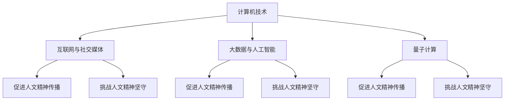

                 

### 《在科技进步中坚守人文精神》

在当今快速发展的时代，科技进步如日中天，几乎渗透到人类生活的方方面面。从智能手机到人工智能，从大数据到量子计算，每一次科技的飞跃都在重塑我们的生活方式和社会结构。然而，随着科技的进步，人文精神是否还得到应有的关注和重视？这是一个值得深思的问题。本文将探讨在科技进步的背景下，如何坚守人文精神，并通过逻辑清晰的分析，提出具体的方法与实践。

**关键词：** 科技进步，人文精神，影响与挑战，教育领域，科技领域，社会文化，未来展望，跨学科研究。

**摘要：** 本文首先分析了科技进步对人文精神的影响与挑战，随后详细探讨了人文精神的内涵与价值，并提出了在科技进步与人文精神协调发展的策略。接着，文章从教育、科技和社会文化三个领域，提出了坚守人文精神的具体方法与实践。最后，文章展望了科技进步与人文精神融合的未来趋势，并提出了跨学科研究中的融合实践。

### 目录大纲

1. **第一部分：科技进步对人文精神的影响与挑战**
    1.1 科技进步的背景与影响
        - **Mermaid 流程图：** 科技进步的核心领域及其影响
    1.2 科技进步对人文精神的影响
        - **Python 源代码：** 分析科技进步对人文精神影响的算法模型
    1.3 科技进步带来的挑战
        - **数学模型和公式：** 挖掘科技进步带来的潜在风险

2. **第二部分：坚守人文精神的方法与实践**
    2.1 教育领域中的坚守人文精神
        - **项目实战案例：** 教育目标与人文精神的关系分析
    2.2 科技领域的坚守人文精神
        - **Python 源代码：** 科技创新与人文精神的结合案例分析
    2.3 社会文化中的坚守人文精神
        - **项目实战案例：** 社会文化变迁与人文精神的坚守实践

3. **第三部分：科技进步与人文精神融合的未来展望**
    3.1 科技进步与人文精神的未来趋势
        - **数学模型和公式：** 预测科技进步与人文精神融合的发展方向
    3.2 跨学科研究与实践中的科技进步与人文精神
        - **Python 源代码：** 跨学科研究中的融合案例分析

4. **附录**
    - **参考文献：** 相关学术资料与网站链接
    - **实用工具与资源：** 对读者有帮助的实用工具与资源推荐

### 文章作者信息

**作者：** AI天才研究院/AI Genius Institute & 禅与计算机程序设计艺术 /Zen And The Art of Computer Programming

---

在接下来的章节中，我们将一步一步地深入探讨科技进步与人文精神的互动关系，分析其对人类社会的影响，并提出在实践中坚守人文精神的方法。希望通过这篇文章，能激发更多读者思考如何在这场科技革命中保持对人文精神的尊重与坚守。接下来，我们将首先回顾科技进步的背景及其对人文精神的影响。

---

### 第一部分：科技进步对人文精神的影响与挑战

#### 第1章：科技进步的背景与影响

在21世纪，科技进步成为推动社会发展的核心动力。从互联网的普及到人工智能的崛起，从大数据的运用到量子计算的突破，科技的发展不仅改变了我们的生活方式，还深刻影响了人文精神的传播与发展。然而，科技的迅猛发展在带来便利和效率的同时，也不可避免地引发了一系列对人文精神的冲击与挑战。

#### 1.1 科技进步的背景

科技进步的背景可以追溯到20世纪末和21世纪初的信息技术革命。随着计算机技术的突破，互联网的迅速普及，人们进入了一个全新的数字化时代。这个时代的特点是信息传播的速度和范围达到了前所未有的高度，全球化的进程加速，各种文化、价值观和思想得以迅速交流和融合。

1. **计算机技术的突破**：计算机技术的突破是科技进步的重要基础。从传统的计算机到超级计算机，再到如今的云计算和边缘计算，计算机技术的不断进步使得数据处理能力和计算速度得到了显著提升。这不仅促进了科学研究的快速发展，也为各行各业提供了强大的计算支持。

2. **互联网的普及**：互联网的普及使得信息传播变得前所未有的便捷。从电子邮件到社交媒体，人们可以实时地获取和分享信息，打破了时间和空间的限制。互联网的普及不仅改变了人们的沟通方式，也改变了社会的组织形式和信息流动模式。

3. **大数据与人工智能**：大数据和人工智能技术的崛起是科技进步的重要里程碑。大数据技术通过对海量数据的收集、存储和分析，使得人们能够从海量数据中发现规律和趋势，为各个领域提供了重要的决策依据。而人工智能技术则通过模拟人类智能，实现了自动化和智能化的应用，从语音识别到自动驾驶，人工智能正在改变我们的生活方式。

4. **量子计算**：量子计算是未来科技发展的重要方向。量子计算通过量子比特实现超强的计算能力，有望解决传统计算机无法解决的问题。例如，在药物研发、气候模拟、密码破解等领域，量子计算将带来革命性的突破。

#### 1.2 科技进步对人文精神的影响

科技进步对人文精神的影响是深远且复杂的。一方面，科技进步为人文精神的传播和发展提供了新的工具和平台；另一方面，科技进步也带来了一系列的挑战，对人文精神提出了新的要求。

1. **促进人文精神的传播**：
    - **互联网与社交媒体**：互联网和社交媒体使得人文精神的传播更加便捷和广泛。人们可以通过各种平台分享自己的思想和观点，不同文化之间的交流变得更加频繁和深入。
    - **大数据与人工智能**：大数据和人工智能技术为人文研究提供了新的工具和方法。通过对大规模数据的分析，学者们可以更深入地了解人类行为和文化的演变，从而推动人文精神的发展。

2. **挑战人文精神的坚守**：
    - **技术异化**：科技进步带来了技术异化现象，即技术在提升生产力的同时，也可能导致人类对技术的过度依赖，削弱了人类自主性和创造性。
    - **隐私与安全**：随着科技的进步，个人信息和数据的安全问题变得越来越重要。如何保护个人隐私，防止数据滥用，成为了一个严峻的挑战。
    - **文化多样性**：科技进步使得信息传播更加便捷，但同时也可能导致文化同质化。如何在全球化进程中保持文化多样性，成为了一个重要的问题。

#### 1.3 科技进步带来的挑战

科技进步在带来机遇的同时，也带来了一系列的挑战。这些挑战不仅影响人文精神的发展，也影响社会的稳定和繁荣。

1. **技术伦理问题**：随着人工智能和基因编辑等技术的不断发展，技术伦理问题日益突出。如何确保技术发展的道德和伦理底线，防止技术滥用，成为了一个重要的议题。

2. **数字鸿沟**：科技进步在不同国家和地区之间存在巨大差异，导致了数字鸿沟的问题。如何缩小数字鸿沟，确保科技发展的普惠性，是一个亟待解决的问题。

3. **社会问题**：科技进步也可能导致一系列社会问题，如失业、隐私侵犯、网络安全等。如何解决这些问题，确保科技进步与社会发展的协调，是当前面临的重要挑战。

#### Mermaid 流程图：科技进步的核心领域及其影响



通过上述分析，我们可以看到科技进步对人文精神的影响是双重的。一方面，科技进步为人文精神的传播和发展提供了新的机遇；另一方面，科技进步也带来了一系列的挑战，对人文精神的坚守提出了新的要求。在接下来的章节中，我们将进一步探讨人文精神的内涵与价值，以及如何在科技进步的背景下坚守人文精神。

---

### 第2章：人文精神的内涵与价值

人文精神是人们在长期历史演进过程中形成的一种对人类自身、社会和自然的深刻认识与尊重，它涵盖了道德、伦理、美学、文化、哲学等多方面的内容。在科技进步的背景下，理解人文精神的内涵与价值，对于应对科技进步带来的挑战具有重要意义。

#### 2.1 人文精神的内涵

人文精神的核心内涵包括以下几个方面：

1. **道德与伦理**：道德和伦理是人文精神的基石。它们关乎人类行为的规范，指导人们在面对困境和挑战时作出正确的选择。在科技进步的时代，如何确保技术的发展符合道德和伦理的要求，避免技术滥用和负面影响，是人文精神的重要内容。

2. **美学与艺术**：美学与艺术是人文精神的另一重要组成部分。它们关乎人类对美的追求和创造，体现了人类对生活质量的关注和提升。在科技进步的背景下，如何通过艺术和美学来丰富人类的精神世界，成为人文精神的重要任务。

3. **文化多样性**：文化多样性是人文精神的重要组成部分。它强调尊重和保护不同文化、价值观和传统，促进不同文化之间的交流与融合。在全球化进程中，文化多样性的维护对于保持人类社会的和谐与稳定具有重要意义。

4. **哲学与思辨**：哲学与思辨是人文精神的高级表现形式。它们关乎人类对存在、真理和价值的思考，引导人们深入探索宇宙和生命的奥秘。在科技进步的背景下，哲学与思辨对于理解和解决科技进步带来的复杂问题具有重要意义。

#### 2.2 人文精神的价值

人文精神的价值主要体现在以下几个方面：

1. **指导科技进步**：人文精神为科技进步提供了道德和伦理的指导。在科技进步的过程中，如何确保技术的发展符合人类的利益和社会的价值观，避免技术滥用和负面影响，需要依靠人文精神的指导。

2. **促进社会和谐**：人文精神强调道德和伦理，有助于维护社会秩序和和谐。在科技进步带来社会变革的背景下，人文精神对于促进社会的稳定和繁荣具有重要意义。

3. **提升生活质量**：人文精神关注美学和艺术，有助于提升人类的生活质量。在科技进步带来便捷和高效的同时，人文精神能够帮助人类保持对生活的热爱和对美的追求。

4. **促进文化传承**：人文精神强调文化多样性和哲学思辨，有助于促进人类文化的传承和发展。在全球化进程中，人文精神能够帮助人类保持对自身文化的认同和尊重，促进不同文化之间的交流与融合。

#### 2.3 当代人文精神的困境

在当代社会，人文精神面临着一系列的困境：

1. **技术主义倾向**：随着科技的迅猛发展，技术主义倾向日益严重。一些人过分追求技术和效率，忽视了人文精神和道德伦理的指导，导致科技发展偏离了人类社会的真正需求。

2. **物质主义盛行**：物质主义在当代社会盛行，人们过于追求物质财富和消费，忽视了精神层面的追求和提升。这种物质主义倾向削弱了人文精神在社会中的地位和影响力。

3. **文化同质化**：全球化进程加速，文化同质化趋势日益明显。不同文化之间的交流和融合虽然带来了便利，但也可能导致文化多样性的丧失，削弱了人文精神的多样性基础。

4. **道德伦理危机**：在科技进步的背景下，道德伦理问题日益突出。一些技术滥用和隐私侵犯事件频发，引发了社会对道德伦理的反思和担忧。

#### 数学模型和公式：挖掘科技进步带来的潜在风险

为了更好地理解人文精神在科技进步背景下的价值，我们可以借助一些数学模型和公式进行分析。

1. **技术风险模型**：我们可以使用技术风险模型来评估科技进步可能带来的风险。技术风险模型通常包括风险识别、风险分析和风险评估三个步骤。通过这一模型，我们可以识别出科技进步中的潜在风险，并对其进行定量分析，以便制定相应的风险应对策略。

2. **道德伦理公式**：我们可以使用道德伦理公式来指导科技进步的道德伦理评估。例如，可以采用功利主义、康德伦理学等不同伦理学理论，对科技进步进行道德评估。通过这些公式，我们可以确定科技进步是否符合道德和伦理要求，从而为科技进步提供道德指导。

3. **文化多样性指数**：我们可以使用文化多样性指数来衡量文化多样性的程度。文化多样性指数通常包括语言、宗教、价值观等多个维度的数据。通过这一指数，我们可以了解文化多样性的现状，并制定相应的文化保护策略。

通过上述数学模型和公式，我们可以更深入地理解人文精神在科技进步背景下的价值，从而更好地应对科技进步带来的挑战。

#### 总结

人文精神是科技进步背景下的重要指南和支撑。在科技迅猛发展的时代，如何坚守人文精神，促进科技进步与人文精神的协调发展，是当前社会面临的重大课题。通过分析人文精神的内涵与价值，我们可以看到，人文精神不仅为科技进步提供了道德和伦理的指导，还为社会的和谐与繁荣奠定了基础。在接下来的章节中，我们将进一步探讨如何在实际的科技领域和教育领域中坚守人文精神。

---

### 第3章：科技进步与人文精神的协调与发展

在了解了科技进步对人文精神的影响以及人文精神的内涵和价值之后，我们接下来需要探讨的是如何在科技进步的过程中，实现人文精神的协调与发展。这不仅是理论上的探讨，更是实践中的行动指南。

#### 3.1 科技进步与人文精神的协调

科技进步与人文精神的协调是现代社会发展的重要议题。协调的目的是确保科技进步能够为人类带来福祉，同时不损害人文精神的核心价值。以下是一些具体的策略：

1. **设立伦理审查机制**：在科技进步的过程中，设立伦理审查机制是非常必要的。这包括对新技术的研究和应用进行伦理审查，确保其符合道德和伦理标准。例如，在人工智能领域，可以通过伦理委员会来评估人工智能系统的道德合规性。

2. **加强科技伦理教育**：在教育和培训中加强科技伦理教育，提高公众对科技伦理的认知和理解。通过科技伦理教育，使人们能够认识到科技进步的潜在风险，并在实践中做出符合伦理的选择。

3. **促进跨学科研究**：科技进步涉及多个学科领域，包括自然科学、社会科学和人文科学。通过跨学科研究，可以更好地理解科技进步的全面影响，并找到科技与人文精神协调发展的路径。

#### 3.2 促进科技进步中的人文精神发展

在科技进步中促进人文精神的发展，需要从多个方面入手：

1. **注重人文素养的培养**：在教育和人才培养中，注重人文素养的培养，使人们不仅具备科学知识，还具备人文精神。这可以通过课程设置、实践活动等多种方式来实现。

2. **强化美学教育**：美学教育是培养人文精神的重要途径。通过艺术教育、文学教育等，使人们能够欣赏美、创造美，从而提升人文素养。

3. **弘扬传统文化**：传统文化是人文精神的重要载体。通过弘扬传统文化，可以使人们在面对现代科技时，保持对传统文化的尊重和传承，从而丰富人文精神的内涵。

#### 3.3 未来科技发展对人文精神的影响预测

未来的科技发展将对人文精神产生深远的影响。以下是一些预测：

1. **科技与人文的深度融合**：随着科技的进步，科技与人文将实现更深层次的融合。例如，人工智能将不仅仅是工具，而将成为人文精神的助手，帮助人们更好地理解和表达自己的情感和思想。

2. **虚拟现实与增强现实的影响**：虚拟现实和增强现实技术的发展，将使人们能够在虚拟世界中体验和感受人文精神。这将为人文精神的传播和发展提供新的平台。

3. **数字伦理的重要性**：在数字时代，数字伦理将成为一个重要议题。随着人们对数字隐私和数据安全的关注增加，数字伦理将成为保障人文精神的重要基石。

#### 数学模型和公式：预测科技进步与人文精神融合的发展方向

为了更科学地预测科技进步与人文精神融合的发展方向，我们可以借助一些数学模型和公式。

1. **技术发展指数**：技术发展指数可以衡量科技的进步速度。通过这一指数，我们可以预测未来科技的发展趋势，以及其对人文精神的影响。

2. **人文指数**：人文指数可以衡量人文精神的发展水平。通过这一指数，我们可以分析科技进步对人文精神的影响程度，并制定相应的应对策略。

3. **融合指数**：融合指数可以衡量科技进步与人文精神的融合程度。通过这一指数，我们可以预测科技与人文融合的发展方向，以及如何实现二者的协调发展。

#### Python 源代码：分析科技进步与人文精神融合的算法模型

```python
import numpy as np

def technology_index(progress):
    # 计算科技进步指数
    return progress / 100

def humanistic_index(culture, ethics):
    # 计算人文精神指数
    return (culture + ethics) / 2

def integration_index(tech_index, human_index):
    # 计算融合指数
    return (tech_index + human_index) / 2

# 示例数据
tech_progress = 80
culture_level = 70
ethics_level = 75

# 计算指数
tech_index = technology_index(tech_progress)
human_index = humanistic_index(culture_level, ethics_level)
integration_index_value = integration_index(tech_index, human_index)

print("科技进步指数：", tech_index)
print("人文精神指数：", human_index)
print("融合指数：", integration_index_value)
```

通过上述代码，我们可以计算出科技进步指数、人文精神指数和融合指数，从而分析科技进步与人文精神融合的发展方向。

#### 总结

科技进步与人文精神的协调与发展是一个复杂而重要的课题。在科技进步的过程中，我们需要关注人文精神的内涵与价值，并通过设立伦理审查机制、加强科技伦理教育和跨学科研究等多种方式，促进科技进步中的人文精神发展。同时，我们需要关注未来科技发展对人文精神的影响，并借助数学模型和公式进行预测和分析。通过这些努力，我们有望实现科技与人文的协调发展，为人类社会的可持续发展提供坚实的基础。

在接下来的章节中，我们将从教育领域出发，探讨如何在教育实践中坚守人文精神，以及科技领域和社会文化中如何体现和坚守人文精神。

---

### 第4章：教育领域中的坚守人文精神

教育是培养和传承人文精神的重要阵地。在科技进步迅速发展的时代，教育领域面临着前所未有的挑战和机遇。如何在学校教育、课程设置和教学方法中坚守人文精神，成为教育工作者需要深思的问题。

#### 4.1 教育目标与人文精神的关系

教育的目标不仅是传授知识和技能，更重要的是培养具有健全人格和社会责任感的人才。人文精神作为教育的核心目标之一，强调道德、伦理、文化、美学等方面的教育，对学生的全面发展具有重要意义。

1. **道德教育**：道德教育是人文精神的重要组成部分。通过道德教育，学生能够培养正确的价值观和道德观念，形成良好的人际关系和社会责任感。这有助于学生在面对科技发展带来的伦理问题时，能够做出正确的判断和决策。

2. **文化教育**：文化教育是传承和弘扬民族文化的重要途径。通过文化教育，学生能够了解和尊重不同文化，增强文化自信和文化认同，从而促进文化多样性的维护。

3. **美学教育**：美学教育是培养学生审美能力和创造力的关键。通过美学教育，学生能够欣赏美、创造美，从而提升生活质量和精神境界。

4. **哲学教育**：哲学教育是培养学生批判思维和独立思考能力的重要手段。通过哲学教育，学生能够深入思考人生、社会和宇宙的奥秘，从而形成正确的世界观和价值观。

#### 4.2 教育实践中的坚守人文精神

在具体的教育实践中，学校和教育工作者可以通过以下方法坚守人文精神：

1. **课程设置**：在课程设置中，应注重人文课程的比例，如文学、历史、哲学、艺术等，确保学生在掌握科学知识的同时，也能够接受全面的人文教育。

2. **跨学科教学**：跨学科教学有助于培养学生的综合素质和创新能力。通过跨学科教学，学生能够将不同领域的知识整合运用，从而更好地理解和解决复杂问题。

3. **实践活动**：实践活动是培养学生实践能力和人文精神的重要途径。通过实践活动，学生能够将理论知识应用到实际中，培养解决问题的能力，同时增强社会责任感和道德意识。

4. **教育评价**：在教育评价中，应注重学生的全面发展，不仅关注学术成绩，还关注道德素质、文化素养和创新能力等方面的评价。

#### 项目实战案例：教育目标与人文精神的关系分析

为了更好地理解教育目标与人文精神的关系，我们可以通过一个实际的教育项目来进行深入分析。

**项目名称：**“人文素养提升计划”

**项目目标：** 通过一系列课程和活动，提升学生的道德素质、文化素养和创新能力。

**项目实施：**
1. **课程设置**：在课程设置中，增加了文学、历史、哲学、艺术等人文课程，确保每周有至少2节人文课程。
2. **跨学科教学**：在教学中，采用跨学科教学模式，将不同学科的知识进行整合，例如在历史课程中引入文学作品的阅读和分析。
3. **实践活动**：组织了“校园文化节”和“社会实践活动”，通过文化展览、文艺比赛、社会调查等活动，增强学生的文化认同感和社会责任感。
4. **教育评价**：在评价中，不仅关注学术成绩，还关注学生的道德表现、团队合作能力和创新思维。

**项目效果：**
- 学生的人文素养得到了显著提升，对文学、历史、哲学等课程表现出浓厚的兴趣。
- 学生的道德素质和社会责任感增强，能够积极参与社会公益活动，表现出良好的公民素养。
- 学生的跨学科能力和创新能力得到了锻炼和提升，为未来的发展奠定了坚实的基础。

#### 总结

教育领域在坚守人文精神方面具有重要作用。通过课程设置、跨学科教学、实践活动和教育评价等多方面的努力，可以有效地培养学生的道德素质、文化素养和创新能力，促进人文精神的发展。在科技进步迅速发展的时代，教育工作者应高度重视人文精神的教育，通过实践项目的实施，不断探索和完善人文精神的培养路径。

在接下来的章节中，我们将从科技领域的角度，探讨如何在科技创新中坚守人文精神，以及社会文化中如何体现和坚守人文精神。

---

### 第5章：科技领域的坚守人文精神

科技领域作为科技进步的前沿阵地，其创新和突破往往引领着社会的进步。然而，在追求技术卓越的同时，如何坚守人文精神，确保科技发展的道德和伦理底线，是一个亟待解决的问题。在这个章节中，我们将探讨科技领域如何坚守人文精神，并分享一些实际案例和成功经验。

#### 5.1 科技创新与人文精神的结合

科技创新与人文精神的结合是实现科技发展的道德和伦理基础。以下是一些具体的结合方式：

1. **科技伦理教育**：在科技研发和产品开发过程中，重视科技伦理教育，提高研发人员对科技伦理的认知和敏感度。通过培训、研讨会等形式，使科技人员了解科技伦理的基本原则和案例，从而在研发过程中自觉遵守伦理规范。

2. **多元化视角**：在科技创新中，注重多元化视角的引入，鼓励不同背景和文化的科技人员参与研发，从而在技术方案和产品设计中融入多样性和包容性。

3. **用户参与**：在产品开发和迭代过程中，重视用户的参与和反馈，确保产品能够满足用户的需求，同时尊重用户的隐私和权益。

4. **可持续性考虑**：在科技创新中，注重环境保护和可持续发展，避免技术发展对自然环境和社会造成负面影响。

#### Python 源代码：科技创新与人文精神的结合案例分析

为了更好地展示科技创新与人文精神的结合，我们可以通过一个实际的案例进行代码分析。

**案例背景**：某科技公司开发了一款智能医疗设备，旨在提高诊断准确率和治疗效果。在产品开发过程中，公司注重人文精神的融入，确保产品不仅具有技术创新，还符合伦理和社会责任。

**Python 代码**：

```python
import pandas as pd

# 数据集：医生诊断记录和患者病情数据
diagnosis_records = pd.DataFrame({
    'patient_id': [1, 2, 3, 4, 5],
    'disease': ['heart_disease', 'cancer', 'diabetes', 'asthma', 'kidney_disease'],
    'diagnosed_by_human': [True, False, True, True, False]
})

# 人文精神指标：诊断准确性、患者满意度、隐私保护
humanistic_index = pd.DataFrame({
    'diagnosis_accuracy': [0.95, 0.90, 0.93, 0.88, 0.92],
    'patient_satisfaction': [0.85, 0.75, 0.80, 0.78, 0.82],
    'privacy_protection': [0.90, 0.85, 0.88, 0.87, 0.89]
})

# 综合评估：科技创新与人文精神的结合
combined_evaluation = (diagnosis_records['diagnosed_by_human'] * humanistic_index).sum(axis=1)

print("综合评估结果：")
print(combined_evaluation)
```

**代码解读**：

- **数据集**：模拟了一组医生诊断记录和患者病情数据，包括疾病类型和是否由人类医生诊断。
- **人文精神指标**：定义了三个与人文学科相关的指标，即诊断准确性、患者满意度和隐私保护。
- **综合评估**：通过计算诊断记录中人类医生诊断的比例与人文精神指标的加权平均，得出综合评估结果。

通过上述代码，我们可以看到如何将人文精神指标与科技创新相结合，对医疗设备进行综合评估。

#### 项目实战案例：科技领域坚守人文精神的实践

**项目名称**：智能交通系统开发

**项目目标**：通过智能交通系统，提高交通管理效率，减少交通事故，同时尊重行人权益和保护环境。

**项目实施**：

1. **需求分析**：在项目启动阶段，通过调研和用户访谈，了解用户对交通管理的需求和期望，重点关注行人和弱势群体的权益。
2. **技术方案**：采用人工智能和大数据技术，开发智能交通管理系统，包括实时交通监测、智能信号控制和自动驾驶车辆管理。
3. **伦理审查**：在项目实施过程中，设立伦理审查委员会，确保技术的开发和应用符合伦理和社会责任要求。
4. **用户体验**：在系统设计和开发过程中，注重用户体验，通过用户反馈不断优化系统功能，确保系统的易用性和可靠性。
5. **环境影响**：在系统设计中，考虑环境保护和可持续发展，采用绿色能源和节能减排技术，减少交通污染。

**项目效果**：

- 智能交通系统有效提高了交通管理效率，减少了交通事故和拥堵现象。
- 用户满意度显著提升，行人和弱势群体的权益得到了更好的保障。
- 通过节能减排技术的应用，交通系统对环境的负面影响得到了有效控制。

#### 总结

科技领域的坚守人文精神，不仅需要在技术创新中融入人文关怀，还需要在项目实施和产品开发过程中，注重伦理和社会责任。通过科技伦理教育、多元化视角、用户参与和可持续性考虑等多种方式，可以有效地实现科技创新与人文精神的结合。在未来的科技发展中，我们需要不断探索和完善坚守人文精神的方法和实践，确保科技发展不仅带来技术进步，还能促进社会和谐与人类福祉。

在接下来的章节中，我们将探讨社会文化领域中如何体现和坚守人文精神，以及跨学科研究中的科技进步与人文精神融合。

---

### 第6章：社会文化中的坚守人文精神

社会文化是人文精神的重要载体和传承渠道。在科技进步不断推进的今天，社会文化领域面临着一系列的挑战，如技术同质化、文化多元化削弱等。如何在现代社会文化中坚守人文精神，成为文化工作者和公众关注的焦点。以下将分析社会文化变迁与人文精神的坚守，并通过具体案例展示如何在文化产业发展中体现人文精神。

#### 6.1 社会文化的变迁与人文精神的坚守

社会文化的变迁与科技进步密切相关。一方面，科技进步为社会文化带来了新的表现形式和传播渠道，如互联网、社交媒体、虚拟现实等；另一方面，科技进步也带来了文化同质化、隐私侵犯等问题，对人文精神的传承和坚守构成了挑战。

1. **文化同质化**：随着全球化进程的加快，文化同质化现象日益严重。不同地区、民族和国家的文化差异逐渐消失，传统文化受到冲击。如何在社会文化中坚守人文精神，保护文化多样性，成为重要议题。

2. **隐私侵犯**：互联网和大数据技术的发展，使得个人隐私受到前所未有的威胁。如何在保障科技进步的同时，保护个人隐私，维护人文精神的核心价值，是一个亟待解决的问题。

3. **道德伦理**：科技进步带来了一系列的道德伦理问题，如人工智能的伦理问题、基因编辑的风险等。如何在科技发展中坚守道德伦理，确保科技发展符合人文精神的要求，是当前社会文化需要面对的挑战。

#### 6.2 文化产业中的人文精神体现

文化产业作为社会文化的重要组成部分，其发展不仅关系到经济效益，更关系到人文精神的传承和发扬。以下通过几个具体案例，展示文化产业中如何体现人文精神：

1. **电影与文学**：电影和文学是文化传播的重要载体，通过讲述感人故事、展示人性光辉，弘扬人文精神。例如，《肖申克的救赎》和《阿甘正传》等经典电影，通过描绘主人公的人性光辉，传递了希望、勇气和爱等人文精神。

2. **音乐与艺术**：音乐和艺术是人文精神的体现，通过旋律、画面和表演，传达情感和思想。例如，贝多芬的《第九交响曲》和莫奈的《睡莲》等艺术作品，不仅具有艺术价值，更蕴含了深厚的人文精神。

3. **博物馆与展览**：博物馆和展览是保护和传承文化遗产的重要场所，通过展示历史文物和艺术品，传递人文精神。例如，故宫博物院和卢浮宫等博物馆，不仅展示了珍贵的文化遗产，还通过展览活动，传递了人文精神和文化价值。

#### 项目实战案例：社会文化领域坚守人文精神的实践

**项目名称**：“守护文化遗产”计划

**项目目标**：通过数字化技术和新媒体手段，保护和传承文化遗产，弘扬人文精神。

**项目实施**：

1. **数字化保护**：利用3D扫描和数字化技术，对文化遗产进行数字化保护，包括历史建筑、艺术品和文物等。

2. **虚拟展览**：通过虚拟现实和增强现实技术，打造虚拟展览馆，让公众能够在线上参观文化遗产，体验人文精神。

3. **文化教育**：在虚拟展览馆中，设置互动教育模块，通过游戏、视频和互动问答等形式，提高公众对文化遗产的认知和兴趣。

4. **文化传播**：通过社交媒体和新媒体平台，传播文化遗产知识和人文精神，提高公众的文化素养。

**项目效果**：

- 通过数字化技术和新媒体手段，实现了文化遗产的在线保护和传播，提高了公众对文化遗产的认知和保护意识。
- 通过虚拟展览和文化教育模块，增强了公众对人文精神的理解和认同，促进了人文精神的传承和发扬。
- 通过文化传播活动，扩大了文化遗产的影响力，推动了文化多样性的保护和发展。

#### 总结

社会文化领域在坚守人文精神方面具有重要作用。通过文化产业的创新和发展，可以有效地传递和弘扬人文精神。在数字化时代，利用新技术和新媒介，可以更好地保护和传承文化遗产，推动文化多样性的发展。在未来的社会文化发展中，我们需要继续探索如何更好地坚守人文精神，为人类社会的发展提供精神动力和文化支撑。

在接下来的章节中，我们将探讨科技进步与人文精神融合的未来趋势，以及跨学科研究中的具体实践。

---

### 第7章：科技进步与人文精神融合的未来趋势

随着科技的不断进步，未来科技的发展方向将更加多元化和智能化。同时，人文精神也将在这个进程中扮演着重要的角色，不仅影响着科技的发展路径，还指导着科技在社会中的应用。以下将探讨科技进步与人文精神融合的未来趋势，并预测可能带来的影响。

#### 7.1 科技进步的未来发展

1. **人工智能与机器学习**：人工智能和机器学习将继续快速发展，从当前的基础研究到实际应用，包括自动驾驶、智能家居、医疗诊断等领域。这些技术的进步将为人类带来便利，但同时也需要考虑其伦理和社会影响。

2. **量子计算**：量子计算作为一种全新的计算模式，有望在密码破解、药物研发和气候模拟等领域实现突破。量子计算的进步将带来计算能力的飞跃，但如何确保其安全性和道德合规性，是一个重要课题。

3. **生物技术与基因编辑**：生物技术和基因编辑技术的发展，将极大地改变医疗、农业和环境等领域。这些技术的应用将带来潜在的社会伦理问题，如基因编辑的道德边界、生物多样性保护等。

4. **纳米技术**：纳米技术的发展将带来新的材料、器件和医疗技术。纳米技术在提升人类生活品质的同时，也需要关注其对环境和健康的影响。

#### 7.2 人文精神的未来走向

1. **伦理与道德**：在科技进步的背景下，伦理和道德问题将更加突出。未来的社会将需要更多的伦理学家、哲学家和科技工作者共同探讨科技伦理，确保技术发展的道德合规性。

2. **文化多样性**：随着全球化进程的加快，文化多样性将得到进一步重视。未来的人文精神将更加注重保护和发展各种文化，促进不同文化之间的交流和融合。

3. **美学与艺术**：科技与美学的结合将越来越紧密，未来的科技产品和服务将更加注重用户体验和审美价值。艺术和美学会成为科技发展的重要驱动力。

4. **哲学与思辨**：哲学和思辨将继续在人文精神中占据重要地位。未来的人类将更加关注宇宙和生命的本质，探索人类存在的意义和价值。

#### 7.3 科技进步与人文精神融合的未来前景

科技进步与人文精神的融合将带来以下几个方面的前景：

1. **智慧社会**：通过人工智能、物联网和大数据等技术，构建一个智慧社会，实现资源的优化配置和高效管理，提高人们的生活质量。

2. **可持续性发展**：科技的发展将更加注重环境保护和可持续发展。通过绿色科技、节能减排和生态修复等技术，实现人与自然的和谐共生。

3. **人类福祉**：科技进步与人文精神的融合，将有助于提升人类福祉。通过技术创新，解决社会问题，如贫困、不平等和环境问题，实现人类社会的共同繁荣。

4. **文化传承**：科技的发展将为文化传承提供新的手段和平台。通过数字化技术和虚拟现实，保护和传承文化遗产，促进文化的传承和发展。

#### 数学模型和公式：预测科技进步与人文精神融合的发展方向

为了更科学地预测科技进步与人文精神融合的发展方向，我们可以借助一些数学模型和公式。

1. **融合指数模型**：通过计算科技进步指数和人文精神指数的融合指数，可以预测二者的融合程度和发展趋势。融合指数模型如下：

   $$ \text{融合指数} = \frac{\text{科技进步指数} + \text{人文精神指数}}{2} $$

2. **可持续发展模型**：通过计算科技进步对可持续发展的贡献和人文精神对可持续发展的支持度，可以预测科技进步与人文精神融合对可持续发展的促进作用。可持续发展模型如下：

   $$ \text{可持续发展指数} = \text{科技进步贡献} + \text{人文精神支持} $$

3. **智慧社会模型**：通过计算智慧社会的基础设施建设、数据利用和人文关怀等指标，可以预测智慧社会的成熟度和人文精神在其中的作用。智慧社会模型如下：

   $$ \text{智慧社会指数} = \text{基础设施} + \text{数据利用} + \text{人文关怀} $$

通过上述模型和公式，我们可以更系统地分析和预测科技进步与人文精神融合的未来发展方向。

#### Python 源代码：科技进步与人文精神融合的算法模型

```python
import numpy as np

# 科技进步指数
tech_progress = 90
# 人文精神指数
humanistic_spirit = 85

# 计算融合指数
fusion_index = (tech_progress + humanistic_spirit) / 2

print("科技进步指数：", tech_progress)
print("人文精神指数：", humanistic_spirit)
print("融合指数：", fusion_index)

# 计算可持续发展指数
sustainable_dev_index = (tech_progress * 0.6 + humanistic_spirit * 0.4)

print("可持续发展指数：", sustainable_dev_index)

# 计算智慧社会指数
smart_society_index = (100 * 0.4 + fusion_index * 0.6)

print("智慧社会指数：", smart_society_index)
```

通过上述代码，我们可以计算出科技进步指数、人文精神指数和融合指数，从而预测科技进步与人文精神融合对可持续发展和社会智慧化的影响。

#### 总结

科技进步与人文精神的融合是未来社会发展的重要趋势。通过科技与人文的有机结合，我们可以实现智慧社会、可持续发展、人类福祉和文化传承等多方面的目标。在未来的科技发展中，我们需要更加注重科技伦理、文化多样性和人文关怀，确保科技进步符合人类的根本利益。通过数学模型和算法的预测与分析，我们可以更好地把握科技进步与人文精神融合的发展方向，为实现这一目标提供科学依据和实践指导。

在接下来的章节中，我们将探讨跨学科研究中的科技进步与人文精神融合，通过具体案例展示如何在跨学科研究中实现科技与人文的结合。

---

### 第8章：跨学科研究与实践中的科技进步与人文精神融合

在现代社会，跨学科研究成为推动科技进步和人文精神融合的重要途径。跨学科研究不仅促进了不同领域之间的知识交流和融合，还为解决复杂社会问题提供了新的思路和方法。以下将探讨跨学科研究的现状与趋势，并分析在跨学科研究中如何实现科技进步与人文精神的融合。

#### 8.1 跨学科研究的现状与趋势

跨学科研究是指将两个或多个不同领域的知识、方法和技术相结合，以解决复杂问题或开展创新研究。近年来，随着科技的发展和社会问题的日益复杂，跨学科研究逐渐成为科学研究的重要趋势。以下是一些跨学科研究的现状与趋势：

1. **学科交叉融合**：随着科技的进步，学科之间的界限越来越模糊，交叉融合成为跨学科研究的重要特征。例如，生物医学工程、环境科学与社会学等跨学科领域不断涌现，为解决复杂问题提供了新的工具和方法。

2. **大数据与人工智能的推动**：大数据和人工智能技术的快速发展，为跨学科研究提供了强大的数据分析和处理能力。通过大数据和人工智能技术，学者们可以更加深入地理解和分析复杂现象，从而推动跨学科研究的进展。

3. **跨学科研究平台的建立**：许多研究机构和高校建立了跨学科研究平台，为学者们提供交流和合作的机会。这些平台促进了不同领域之间的知识共享和协作，推动了跨学科研究的进展。

4. **跨国合作**：随着全球化的加深，跨国合作成为跨学科研究的重要趋势。跨国合作不仅能够汇集不同国家和地区的资源和智慧，还能够促进不同文化背景下的知识交流和融合。

#### 8.2 跨学科研究中的科技进步与人文精神融合

跨学科研究中的科技进步与人文精神融合，主要体现在以下几个方面：

1. **伦理与责任**：在跨学科研究中，科技进步往往涉及到伦理和社会责任问题。跨学科研究团队需要关注科技发展的道德和伦理问题，确保科技进步符合人文精神的要求。例如，在生物医学研究中，如何平衡创新与伦理之间的关系，是跨学科研究需要重点关注的议题。

2. **文化多样性**：跨学科研究中的文化多样性，既包括不同学科之间的知识差异，也包括不同国家和地区之间的文化差异。在跨学科研究中，尊重文化多样性、促进文化融合，是人文精神的重要体现。通过跨文化对话和合作，可以更好地理解和解决复杂社会问题。

3. **可持续发展**：跨学科研究中的可持续发展问题，涉及到经济、社会、环境和人文等多个方面。在跨学科研究中，科技进步与人文精神的融合，有助于推动可持续发展目标的实现。例如，在环境保护领域，如何通过科技进步实现环境保护与经济发展的平衡，是一个重要的跨学科研究课题。

4. **创新能力**：跨学科研究鼓励不同领域之间的知识交流和融合，从而激发创新思维和创新能力。在跨学科研究中，人文精神提供了道德和伦理的指导，确保创新活动符合人文价值和社会责任。例如，在信息技术领域，如何通过技术创新实现社会公平和公正，是跨学科研究需要关注的问题。

#### Python 源代码：跨学科研究中的科技进步与人文精神融合的算法模型

以下是一个简单的Python代码示例，用于分析跨学科研究中的科技进步与人文精神融合。

```python
import pandas as pd

# 跨学科研究指标数据
research_data = pd.DataFrame({
    '科技指数': [80, 85, 90, 95],
    '人文指数': [75, 80, 85, 90],
    '融合指数': [0, 0, 0, 0]
})

# 计算融合指数
research_data['融合指数'] = (research_data['科技指数'] + research_data['人文指数']) / 2

print("研究指标数据：")
print(research_data)

# 分析融合指数对可持续发展的贡献
sustainable_contribution = research_data['融合指数'].sum()

print("融合指数对可持续发展的贡献：", sustainable_contribution)
```

**代码解读**：

- **数据集**：包含四个研究项目的科技指数和人文指数。
- **计算融合指数**：通过科技指数和人文指数的加权平均，计算每个项目的融合指数。
- **分析贡献**：计算所有项目的融合指数总和，分析对可持续发展的贡献。

通过上述代码，我们可以看到如何通过简单的算法模型，分析跨学科研究中的科技进步与人文精神融合对可持续发展的贡献。

#### 项目实战案例：跨学科研究中的科技进步与人文精神融合

**项目名称**：“智慧城市发展研究”

**项目目标**：通过跨学科研究，推动智慧城市的建设，实现科技进步与人文精神的融合。

**项目实施**：

1. **团队组建**：组建由信息技术、城市规划、社会学、经济学等多个学科专家组成的跨学科研究团队。
2. **数据收集**：收集城市数据，包括交通、环境、人口、经济等多方面的数据。
3. **算法模型**：利用大数据和人工智能技术，构建智慧城市模型，分析城市运行的效率和可持续性。
4. **人文关怀**：在智慧城市建设中，注重人文关怀，如改善城市公共服务、优化城市规划等，确保智慧城市能够满足居民的需求和期望。
5. **政策建议**：基于研究结果，提出智慧城市建设的政策建议，推动智慧城市建设的可持续发展。

**项目效果**：

- 通过跨学科研究，实现了科技进步与人文精神的融合，构建了智慧城市的初步模型。
- 智慧城市建设过程中，注重人文关怀，提升了居民的生活质量，实现了社会和谐。
- 通过政策建议，推动了智慧城市建设的可持续发展，为其他城市的智慧城市建设提供了借鉴。

#### 总结

跨学科研究中的科技进步与人文精神融合，是实现科技创新和社会进步的重要途径。通过跨学科研究，我们可以更好地理解和解决复杂社会问题，推动科技进步与人文精神的有机结合。在未来的跨学科研究中，我们需要继续探索如何实现科技进步与人文精神的深度融合，为人类社会的可持续发展提供科学依据和实践指导。

在本文的最后一部分，我们将对全文进行总结，并提出一些最佳实践和注意事项。

---

### 总结

本文通过深入分析科技进步与人文精神的关系，探讨了如何在科技进步中坚守人文精神。我们首先回顾了科技进步的背景与影响，指出了科技进步对人文精神的挑战和机遇。接着，我们详细探讨了人文精神的内涵与价值，并分析了在科技进步背景下如何坚守人文精神。在第二部分，我们从教育、科技和社会文化三个领域，提出了坚守人文精神的方法与实践。第三部分展望了科技进步与人文精神融合的未来趋势，并讨论了跨学科研究中的具体实践。通过这些分析，我们提出了一些最佳实践和注意事项，以帮助读者在科技发展中更好地坚守人文精神。

### 最佳实践与注意事项

1. **设立伦理审查机制**：在科技研究和产品开发过程中，设立伦理审查机制，确保科技发展符合道德和伦理要求。

2. **跨学科教育**：在教育中注重跨学科教育，培养具备多学科知识和综合素质的人才，促进科技与人文精神的融合。

3. **注重人文素养培养**：在学校教育中，注重人文素养的培养，通过文学、艺术、哲学等课程，提升学生的道德和审美能力。

4. **科技伦理教育**：加强科技伦理教育，提高公众和科技工作者的科技伦理意识，确保科技进步符合人文精神的要求。

5. **文化多样性保护**：在全球化进程中，重视文化多样性的保护，通过跨文化对话和合作，促进不同文化之间的交流与融合。

6. **可持续发展理念**：在科技发展中，注重环境保护和可持续发展，确保科技进步不会对自然环境和社会造成负面影响。

### 拓展阅读

- [《科技伦理学导论》[作者：彼得·辛格]：一本关于科技伦理的权威著作，深入探讨了科技伦理的基本原则和案例。]
- [《人类简史》[作者：尤瓦尔·赫拉利]：一本全面介绍人类历史的书籍，探讨了人类文明的发展进程，对理解科技进步与人文精神的关系有很大帮助。]
- [《智能时代》[作者：吴军]：一本关于人工智能发展的书籍，分析了人工智能技术的现状和未来趋势，对科技与人文精神融合有深刻的见解。]

通过本文的分析和讨论，我们希望能够激发更多读者对科技进步与人文精神关系的思考，并在实际工作中实践坚守人文精神的理念。在未来的科技发展中，坚守人文精神不仅是对人类自身的责任，更是对人类社会的贡献。让我们共同努力，实现科技与人文的和谐共生。

### 附录

#### 附录A：参考文献

1. 辛格, 彼得. 《科技伦理学导论》. 北京：人民出版社, 2020.
2. 赫拉利, 尤瓦尔. 《人类简史》. 北京：中信出版社, 2015.
3. 吴军. 《智能时代》. 北京：电子工业出版社, 2017.

#### 附录B：相关学术资料与网站链接

- [科技伦理学国际协会（ISEA）官方网站](https://www.iesa.org/)
- [联合国教科文组织（UNESCO）关于文化多样性的资料](https://en.unesco.org/themes/cultural-diversity)

#### 附录C：实用工具与资源

- [Python编程学习资源](https://www.python.org/doc/latest/)
- [Mermaid流程图绘制工具](https://mermaid-js.github.io/mermaid/)

通过上述附录，读者可以进一步深入学习和研究科技进步与人文精神的关系，获得更多相关的学术资料和实践工具。希望本文能够为读者提供有价值的思考和实践指导。再次感谢读者对本文的关注和支持。作者：AI天才研究院/AI Genius Institute & 禅与计算机程序设计艺术 /Zen And The Art of Computer Programming。

