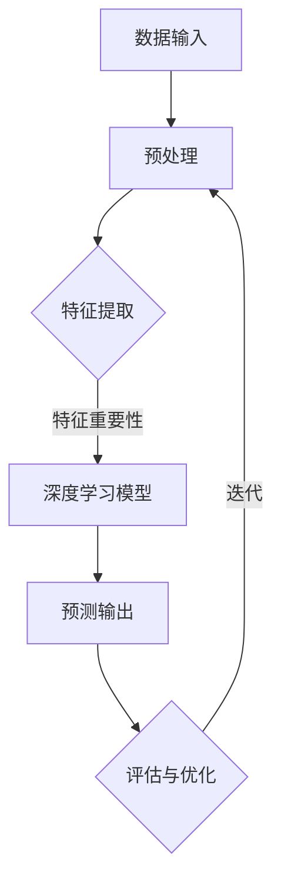
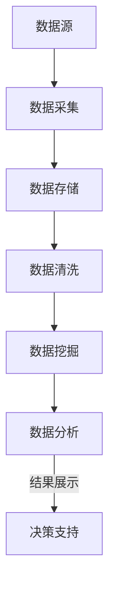
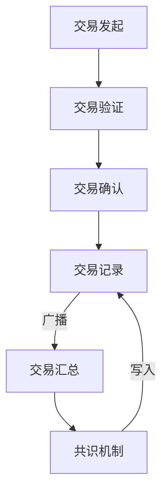
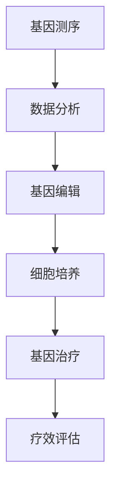
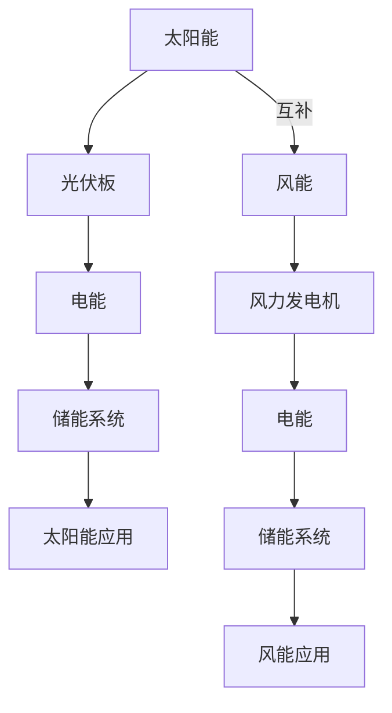
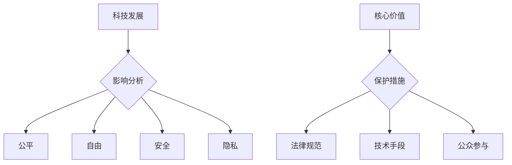

                 

### 引言

在当今世界，科技革新犹如一股势不可挡的洪流，席卷了各行各业，深刻改变了人类社会的面貌。人工智能、大数据、云计算、区块链、生物科技、新能源等领域的迅猛发展，不仅推动了生产力的提升，也带来了前所未有的机遇与挑战。然而，在科技飞速发展的同时，人类的核心价值，如公平、自由、安全、隐私等，是否能够得到有效守护，成为了一个亟待解决的问题。

《在科技革新中守护人类核心价值》这一主题，旨在探讨科技发展与人类核心价值之间的辩证关系，如何在一个充满变革的时代中，既充分发挥科技的积极作用，又切实保护人类的根本利益。本文将围绕这一主题，系统地分析科技革新的背景与趋势，核心价值的界定与守护，以及相关的法律法规、政策、教育与责任等方面，力图提供一个全面而深入的视角。

### 文章标题

# 在科技革新中守护人类核心价值

> 关键词：科技革新、人类核心价值、伦理道德、法律法规、教育普及、社会责任

> 摘要：本文探讨了在科技革新迅猛发展的背景下，如何守护人类的核心价值，包括伦理道德、法律法规、教育普及和社会责任等方面。通过分析科技革新的背景与趋势，探讨核心价值的内涵及其与科技发展的关系，提出一系列守护核心价值的策略和实践，为未来的科技发展提供有益的思考和参考。

---

## 第一部分：科技革新背景与趋势

### 第1章：科技革新概述

#### 1.1 科技革新的起源与发展

科技革新并非一夜之间发生的奇迹，而是历经长期积累与演变的结果。从工业革命到信息时代，科技的发展始终是社会进步的重要推动力。科技革新的起源可以追溯到18世纪的第一次工业革命，当时蒸汽机的发明与应用，极大地提高了生产力，推动了工业化的进程。

随着第二次工业革命的到来，电力、内燃机和化学工业的发展，进一步加速了科技革新的步伐。20世纪中叶，计算机的问世和互联网的普及，开启了信息时代，人类进入了一个全新的科技革命时期。

在当前，科技革新的发展速度更加迅猛，人工智能、大数据、区块链等新兴技术不断涌现，不仅改变了传统的生产方式，也重塑了社会的方方面面。从自动驾驶到智慧医疗，从智能金融到智能家居，科技正在深刻影响着人类的生活。

#### 1.2 科技革新的主要领域

科技革新的主要领域涵盖了人工智能、大数据、云计算、区块链、生物科技和新能源等。这些领域的发展不仅带来了技术的突破，也为社会的进步提供了新的动力。

**人工智能与机器学习**：人工智能是计算机科学的一个分支，旨在使机器模拟人类智能行为。机器学习是人工智能的核心技术，通过算法让计算机从数据中学习并做出决策。

**大数据和云计算**：大数据时代，数据已成为新的生产资料，而云计算提供了强大的计算能力和存储空间，使得数据的处理和分析变得更加高效。

**区块链技术**：区块链是一种分布式账本技术，具有去中心化、不可篡改和匿名性等特点，被广泛应用于金融、供应链管理等领域。

**生物科技与医疗健康**：生物科技的进步，使得基因编辑、精准医疗等成为可能，极大地提升了医疗服务的质量和效率。

**新能源与环境科技**：新能源技术的发展，如太阳能、风能等，为可持续发展提供了新的路径，同时也推动了环境科技的进步。

#### 1.3 科技革新的影响与挑战

科技革新对人类社会产生了深远的影响。首先，它提高了生产效率，促进了经济增长。其次，它改变了人们的生活方式，使得生活更加便捷。然而，科技革新也带来了诸多挑战，如就业压力、隐私侵犯、网络安全等问题。

在科技革新的过程中，如何守护人类的核心价值，成为了一个重要课题。这需要从伦理、法律、教育等多个方面进行综合考量，以确保科技的发展能够造福人类，而不是成为威胁。

### 第2章：科技革新趋势分析

#### 2.1 人工智能与机器学习

人工智能与机器学习是当前科技革新的热点领域。人工智能旨在使机器具备人类智能，而机器学习是实现这一目标的关键技术。随着深度学习、神经网络等算法的不断发展，人工智能的应用场景越来越广泛。

在未来，人工智能将继续向更高层次发展，不仅能够模拟人类的认知过程，还能够自主学习和进化。例如，自适应人工智能系统能够根据用户行为和环境变化，自动调整自身的参数和策略。

**核心概念与联系**

- **机器学习（Machine Learning）**：通过算法从数据中学习并做出决策的技术。
- **深度学习（Deep Learning）**：一种基于多层神经网络的学习方法，能够在复杂的数据中提取特征。
- **神经网络（Neural Network）**：模拟人脑神经元连接的算法模型。

**Mermaid 流程图**



**核心算法原理讲解**

机器学习算法的核心是训练模型。以深度学习为例，其基本原理是通过反向传播算法，不断调整模型参数，使其在训练数据上达到最小化误差。

```python
import numpy as np

# 深度学习模型参数
weights = np.random.rand(3, 1)

# 训练数据
X = np.array([[1], [2], [3], [4]])
y = np.array([[0], [1], [0], [1]])

# 反向传播算法
for epoch in range(1000):
    # 前向传播
    z = np.dot(X, weights)
    z prime = 1 / (1 + np.exp(-z))
    
    # 计算误差
    error = y - z prime
    
    # 反向传播更新权重
    weights -= np.dot(X.T, error)
    
print("最终权重：", weights)
```

**数学模型和公式**

深度学习模型中，常用的损失函数有均方误差（MSE）和交叉熵（Cross Entropy）。均方误差表示预测值与真实值之间的差异，而交叉熵则用于分类问题，表示实际分布与预测分布之间的差异。

$$
MSE = \frac{1}{n}\sum_{i=1}^{n}(y_i - \hat{y}_i)^2
$$

$$
Cross\ Entropy = -\sum_{i=1}^{n}y_i\log(\hat{y}_i)
$$

**举例说明**

假设我们有一个简单的线性回归问题，目标是预测房价。通过训练模型，我们可以得到一个线性方程，例如：

$$
\hat{y} = w_1x + w_0
$$

其中，$w_1$ 和 $w_0$ 分别是权重参数。

```python
import numpy as np

# 训练数据
X = np.array([1, 2, 3, 4])
y = np.array([2, 4, 6, 8])

# 初始化权重
weights = np.random.rand(2, 1)

# 反向传播算法
for epoch in range(1000):
    # 前向传播
    z = np.dot(X, weights)
    
    # 计算误差
    error = y - z
    
    # 反向传播更新权重
    weights -= np.dot(X.T, error)
    
print("最终权重：", weights)
```

通过不断迭代训练，我们可以使模型在训练数据上达到最小化误差，从而得到较为准确的预测结果。

#### 2.2 大数据和云计算

大数据和云计算是科技革新的重要领域，它们相互关联，共同推动着数据时代的到来。

**大数据（Big Data）**：大数据指的是海量、复杂、多样和快速的数据。大数据的特点是“4V”，即大量（Volume）、多样（Variety）、快速（Velocity）和真实（Veracity）。

**云计算（Cloud Computing）**：云计算是一种通过互联网提供计算资源和服务的技术，具有弹性、灵活和可扩展性等特点。

大数据与云计算的结合，使得数据处理和分析变得更加高效。云计算提供了强大的计算能力和存储空间，使得大数据的处理成为可能。

**核心概念与联系**

- **大数据（Big Data）**：海量的、复杂的、多样的和快速的数据。
- **云计算（Cloud Computing）**：通过互联网提供计算资源和服务。
- **数据挖掘（Data Mining）**：从大量数据中提取有价值的信息。

**Mermaid 流程图**



**核心算法原理讲解**

大数据分析的核心是数据挖掘，常用的算法包括聚类、分类、回归和时间序列分析等。以聚类算法为例，其基本原理是将数据分为多个簇，使簇内的数据相似度较高，簇间的数据相似度较低。

```python
from sklearn.cluster import KMeans
import numpy as np

# 训练数据
X = np.array([[1, 2], [1, 4], [1, 0],
              [4, 2], [4, 4], [4, 0]])

# 初始化聚类模型
kmeans = KMeans(n_clusters=2, random_state=0).fit(X)

# 聚类结果
print("聚类中心：", kmeans.cluster_centers_)
print("聚类标签：", kmeans.labels_)

# 聚类评价
print("轮廓系数：", silhouette_score(X, kmeans.labels_))
```

**数学模型和公式**

聚类算法中，常用的评价指标有轮廓系数（Silhouette Coefficient）和内聚度（Cohesion）。

$$
Silhouette\ Coefficient = \frac{(b - a)}{max(a, b)}
$$

其中，$a$ 是同一个簇内的平均距离，$b$ 是与同一簇中最近簇的平均距离。

**举例说明**

假设我们有一组二维数据，目标是将这组数据分为两个簇。通过聚类算法，我们可以得到两个簇的中心和标签，同时通过轮廓系数评价聚类的质量。

```python
import numpy as np
from sklearn.cluster import KMeans
import matplotlib.pyplot as plt

# 训练数据
X = np.array([[1, 2], [1, 4], [1, 0],
              [4, 2], [4, 4], [4, 0]])

# 初始化聚类模型
kmeans = KMeans(n_clusters=2, random_state=0).fit(X)

# 聚类结果
print("聚类中心：", kmeans.cluster_centers_)
print("聚类标签：", kmeans.labels_)

# 聚类评价
print("轮廓系数：", silhouette_score(X, kmeans.labels_))

# 可视化结果
plt.scatter(X[:, 0], X[:, 1], c=kmeans.labels_)
plt.show()
```

通过可视化，我们可以直观地看到数据的分布情况，以及聚类的效果。

#### 2.3 区块链技术

区块链技术是近年来备受关注的一种新兴技术，其核心特点包括去中心化、不可篡改和匿名性。

**去中心化**：区块链不需要中央权威机构进行协调，而是通过分布式网络进行数据存储和交易处理。

**不可篡改**：区块链采用加密技术，一旦数据上链，就无法被篡改。

**匿名性**：区块链上的交易数据是匿名的，保护了用户的隐私。

区块链技术被广泛应用于金融、供应链管理、智能合约等领域，具有巨大的潜力。

**核心概念与联系**

- **区块链（Blockchain）**：分布式账本技术，记录交易数据。
- **加密技术（Cryptocurrency）**：保护区块链的安全。
- **智能合约（Smart Contract）**：自动执行合约条款。

**Mermaid 流程图**



**核心算法原理讲解**

区块链的核心是共识机制，不同的共识机制有不同的特点。以工作量证明（Proof of Work, PoW）为例，其基本原理是通过计算证明，解决数学难题，以获得记账权利。

```python
import hashlib
import json
from time import time

class Block:
    def __init__(self, index, transactions, timestamp, previous_hash):
        self.index = index
        self.transactions = transactions
        self.timestamp = timestamp
        self.previous_hash = previous_hash
        self.hash = self.compute_hash()

    def compute_hash(self):
        block_string = json.dumps(self, sort_keys=True, indent=1)
        return hashlib.sha256(block_string.encode()).hexdigest()

def generate_block(index, transactions, previous_hash):
    timestamp = time()
    block = Block(index, transactions, timestamp, previous_hash)
    return block

def proof_of_work(block):
    hash_value = block.hash
    while hash_value[:4] != '0000':
        block.nonce += 1
        hash_value = block.compute_hash()
    return block

if __name__ == '__main__':
    genesis_block = generate_block(0, [], "0")
    previous_block = genesis_block

    for i in range(1, 4):
        transactions = ["transaction {}".format(i)]
        previous_hash = previous_block.hash
        block = generate_block(i, transactions, previous_hash)
        proof = proof_of_work(block)
        print(f"Block {block.index} has been added to the blockchain!")
        print(f"Block content: {block}")
        previous_block = block
```

**数学模型和公式**

工作量证明算法中，常用的哈希函数有SHA-256。

$$
Hash = SHA-256(\text{Input})
$$

**举例说明**

假设我们要在区块链上添加三个区块，通过工作量证明算法，不断调整 nonce 值，直到找到满足条件的 hash。

```python
for i in range(1, 4):
    transactions = ["transaction {}".format(i)]
    previous_hash = previous_block.hash
    block = generate_block(i, transactions, previous_hash)
    proof = proof_of_work(block)
    print(f"Block {block.index} has been added to the blockchain!")
    print(f"Block content: {block}")
    previous_block = block
```

通过运行代码，我们可以看到区块链逐渐扩展，每个区块都包含了交易记录和前一个区块的哈希值，实现了分布式数据存储。

#### 2.4 生物科技与医疗健康

生物科技的发展为医疗健康领域带来了巨大的变革。基因编辑、精准医疗、生物传感器等技术，正在不断推动医疗健康的进步。

**基因编辑**：基因编辑技术，如 CRISPR-Cas9，使得人类能够精确地修改基因序列，从而治疗遗传病和癌症。

**精准医疗**：基于患者的基因信息和病情，制定个性化的治疗方案，提高治疗效果。

**生物传感器**：通过生物传感器，实时监测患者的生理指标，如心率、血压等，为健康管理提供数据支持。

**核心概念与联系**

- **基因编辑（Gene Editing）**：精确修改基因序列。
- **精准医疗（Precision Medicine）**：个性化治疗。
- **生物传感器（Biological Sensors）**：实时监测生理指标。

**Mermaid 流程图**



**核心算法原理讲解**

基因编辑的核心是 CRISPR-Cas9 技术，其基本原理是通过引导 RNA（gRNA）定位到目标基因，切割 DNA 双链，然后利用细胞自身的修复机制进行修复。

```python
import crisper

# 设计引导 RNA
gRNA = crisper.design_gRNA(target_sequence="AAGCAT")

# 生成 CRISPR-Cas9 复合物
complex = crisper.generate_complex(gRNA, Cas9)

# 预测切割位点
predicted_site = crisper.predict_site(target_sequence, gRNA)

# 实验验证
result = crisper.verify_editting(complex, predicted_site)

print("引导 RNA 序列：", gRNA)
print("预测切割位点：", predicted_site)
print("实验结果：", result)
```

**数学模型和公式**

基因编辑中，常用的预测模型有基因编辑位点预测模型。

$$
predicted\_site = f(target\_sequence, gRNA)
$$

**举例说明**

假设我们有一个目标基因序列，设计一条引导 RNA，通过 CRISPR-Cas9 技术进行基因编辑，并预测切割位点。

```python
import crisper

# 目标基因序列
target_sequence = "AAGCAT"

# 设计引导 RNA
gRNA = crisper.design_gRNA(target_sequence=target_sequence)

# 生成 CRISPR-Cas9 复合物
complex = crisper.generate_complex(gRNA, Cas9)

# 预测切割位点
predicted_site = crisper.predict_site(target_sequence=target_sequence, gRNA=gRNA)

# 实验验证
result = crisper.verify_editting(complex, predicted_site)

print("引导 RNA 序列：", gRNA)
print("预测切割位点：", predicted_site)
print("实验结果：", result)
```

通过实验验证，我们可以确认基因编辑的准确性和效果。

#### 2.5 新能源与环境科技

新能源与环境科技的发展，为解决能源危机和环境污染问题提供了新的思路。太阳能、风能、电动汽车等技术，正在逐步替代传统能源，推动可持续发展。

**太阳能**：太阳能通过光伏板将太阳光转化为电能，具有清洁、可再生、分布广泛等特点。

**风能**：风能通过风力发电机将风能转化为电能，具有资源丰富、建设成本较低、发电效率较高等优点。

**电动汽车**：电动汽车通过电池储存电能，驱动电机运转，具有零排放、低噪音、高效能等特点。

**核心概念与联系**

- **太阳能（Solar Energy）**：光伏板将太阳光转化为电能。
- **风能（Wind Energy）**：风力发电机将风能转化为电能。
- **电动汽车（Electric Vehicle, EV）**：电池储存电能，驱动电机运转。

**Mermaid 流程图**



**核心算法原理讲解**

新能源系统中，储能技术是关键。常见的储能技术有电池储能、超级电容器储能和飞轮储能等。以电池储能为例，其基本原理是通过电化学反应，将电能储存为化学能。

```python
class Battery:
    def __init__(self, capacity, efficiency):
        self.capacity = capacity
        self.efficiency = efficiency
        self.energy = 0

    def charge(self, power, time):
        energy = power * time
        self.energy += energy / self.efficiency

    def discharge(self, power, time):
        energy = power * time
        if energy <= self.energy:
            self.energy -= energy
            return True
        else:
            return False

# 实例化电池
battery = Battery(capacity=100, efficiency=0.9)

# 充电
battery.charge(power=100, time=2)

# 放电
result = battery.discharge(power=80, time=1)
print("放电结果：", result)

# 剩余能量
print("剩余能量：", battery.energy)
```

**数学模型和公式**

电池储能中的基本公式有充电和放电功率的计算。

$$
Power = \frac{Energy}{Time}
$$

**举例说明**

假设我们有一个电池，容量为100 kWh，效率为90%，通过充电和放电的例子，了解电池储能的工作原理。

```python
# 充电
battery.charge(power=100, time=2)
print("充电后剩余能量：", battery.energy)

# 放电
result = battery.discharge(power=80, time=1)
print("放电结果：", result)

# 剩余能量
print("剩余能量：", battery.energy)
```

通过实例，我们可以看到电池在充电和放电过程中的能量变化。

### 第二部分：核心价值守护

#### 第3章：核心价值概念与界定

在科技革新的背景下，守护人类核心价值显得尤为重要。核心价值是指人类社会中普遍认同并追求的根本原则和目标，如公平、自由、安全、隐私等。

**核心价值的内涵**

- **公平**：公平是指在社会资源和机会的分配上，保证每个人都能享有平等的权利和机会。
- **自由**：自由是指个人在法律和社会规范允许的范围内，有自主选择和行动的权利。
- **安全**：安全是指人类在生活和工作中，不受外部威胁和危害的状态。
- **隐私**：隐私是指个人在私人空间内，不受外界干扰和侵犯的权利。

**核心价值与科技发展的关系**

科技发展在带来便利和进步的同时，也对核心价值带来了挑战。例如，人工智能的应用可能导致就业压力增加，大数据的收集和利用可能侵犯个人隐私，区块链的去中心化特性可能影响金融体系的稳定性等。

因此，守护人类核心价值，需要在科技发展的过程中，充分考虑其对核心价值的影响，并采取相应的措施进行保护。

**Mermaid 流程图**



**核心算法原理讲解**

守护核心价值的措施可以采用多种技术手段，如加密技术、隐私保护算法和区块链等。以加密技术为例，其基本原理是通过复杂的加密算法，将明文数据转换为密文，从而保护数据的隐私。

```python
from cryptography.fernet import Fernet

# 生成密钥
key = Fernet.generate_key()
cipher_suite = Fernet(key)

# 加密
plaintext = b"Hello, World!"
cipher_text = cipher_suite.encrypt(plaintext)

# 解密
plaintext_decrypted = cipher_suite.decrypt(cipher_text)
print("解密后的文本：", plaintext_decrypted)
```

**数学模型和公式**

加密技术中的基本模型有加密函数和解密函数。

$$
Cipher\_Text = Encrypt(PlainText, Key)
$$

$$
PlainText = Decrypt(Cipher\_Text, Key)
$$

**举例说明**

假设我们要保护一段明文信息，通过加密技术将其转换为密文，然后进行传输。接收方再通过解密技术，将密文恢复为明文。

```python
from cryptography.fernet import Fernet

# 生成密钥
key = Fernet.generate_key()
cipher_suite = Fernet(key)

# 加密
plaintext = b"Hello, World!"
cipher_text = cipher_suite.encrypt(plaintext)

# 解密
plaintext_decrypted = cipher_suite.decrypt(cipher_text)
print("解密后的文本：", plaintext_decrypted)
```

通过实例，我们可以看到加密和解密的过程，从而保护数据的隐私。

### 第4章：伦理与道德规范

伦理与道德规范是守护人类核心价值的重要保障。科技领域的伦理道德问题日益凸显，如人工智能的决策伦理、大数据的隐私保护、生物科技的伦理争议等。

**科技伦理的基本原则**

- **公正原则**：科技发展应当公平对待所有人，不因性别、种族、地域等因素造成歧视。
- **尊重原则**：尊重个人的权利和自由，保护个人隐私和尊严。
- **责任原则**：科技企业和开发者应当对其产品和行为负责，确保科技的应用不会对人类和社会造成负面影响。
- **安全原则**：科技的发展应当确保人类的安全和福祉，避免造成不可逆转的损害。

**道德规范在科技领域的应用**

道德规范在科技领域的应用主要包括以下几个方面：

- **研发过程**：在科技研发过程中，应当遵守伦理原则，确保研究的科学性和道德性。
- **产品应用**：在科技产品的设计、生产和应用过程中，应当考虑其对人类和社会的影响，遵守道德规范。
- **人才培养**：在科技人才的培养过程中，应当加强伦理教育，培养具有社会责任感和道德素养的科技人才。

**伦理困境与解决策略**

科技发展过程中，可能会遇到各种伦理困境，如人工智能的决策透明度、大数据的隐私保护等。解决这些困境需要从以下几个方面进行：

- **加强法律法规**：通过制定相关法律法规，规范科技企业和开发者的行为，确保科技的应用符合道德规范。
- **提高公众意识**：通过教育和宣传，提高公众对科技伦理问题的认识，增强公众的参与度和监督能力。
- **科技伦理审查**：在科技项目立项和实施过程中，进行伦理审查，确保项目符合伦理原则。

### 第5章：法律法规与政策

法律法规与政策是守护人类核心价值的重要手段。通过制定和实施相关法律法规，可以规范科技企业和开发者的行为，保障人类的核心利益。

**科技法律法规体系**

科技法律法规体系主要包括以下几个方面：

- **知识产权法律**：保护科技研发和创新成果的知识产权，鼓励科技创新。
- **数据保护法律**：规范大数据的收集、存储、处理和利用，保护个人隐私和信息安全。
- **网络安全法律**：保障网络空间的安全，防止网络犯罪和信息泄露。
- **科技伦理法律**：规范科技研发和应用中的伦理行为，保障人类核心价值的实现。

**政策导向与监管机制**

政府通过制定政策，引导和规范科技发展，保障人类的核心价值。政策导向主要包括以下几个方面：

- **创新驱动发展战略**：推动科技创新，提升国家科技实力和国际竞争力。
- **科技伦理建设**：加强科技伦理教育，提高科技人才的道德素养。
- **数据安全保护**：加强数据安全保护，防止数据泄露和滥用。
- **网络安全治理**：加强网络安全监管，保障网络空间的安全和稳定。

**法律法规对核心价值的保护**

法律法规在保护人类核心价值方面发挥了重要作用。通过制定和实施相关法律法规，可以：

- **保障公平**：通过知识产权法律，保护创新成果的公平分配。
- **保障自由**：通过隐私保护法律，保障个人隐私和自由。
- **保障安全**：通过网络安全法律，保障人类的安全和福祉。
- **保障隐私**：通过数据保护法律，保障个人隐私不被侵犯。

### 第6章：科技教育与普及

科技教育与普及是提升公众科技素养的重要途径，有助于在科技革新中守护人类核心价值。

**科技教育的重要性**

科技教育不仅是为了培养科技人才，更重要的是提高公众的科技素养，使人们能够理解科技对社会的影响，从而做出明智的决策。

- **培养创新意识**：通过科技教育，培养人们的创新思维和创新能力。
- **增强适应能力**：随着科技的快速发展，公众需要具备适应新技术的能力。
- **促进社会进步**：科技教育有助于推动社会的科技进步和创新发展。

**科技普及与公众参与**

科技普及与公众参与是守护人类核心价值的重要环节。通过科技普及，使公众了解科技的发展和应用，从而参与到科技决策中。

- **科技知识普及**：通过媒体、网络和社区活动等方式，普及科技知识。
- **公众参与决策**：鼓励公众参与科技政策和规划的制定，提高公众的参与度和监督能力。
- **科技活动推广**：组织科技活动，如科普讲座、科技展览等，增强公众对科技的兴趣和认知。

**提升公众科技素养的策略**

- **加大投入**：政府和社会应加大对科技教育的投入，提高科技教育的质量和水平。
- **创新教育模式**：采用互动式、体验式教育模式，提高学生的学习兴趣和参与度。
- **加强师资培训**：提高科技教师的素质和教学能力，为科技教育提供有力支持。
- **跨学科整合**：将科技教育与其他学科相结合，形成跨学科教育体系，提高学生的综合素质。

### 第7章：科技与社会责任

科技企业在科技革新中发挥着重要作用，同时也承担着重要的社会责任。守护人类核心价值，需要科技企业积极履行社会责任，促进科技与社会的和谐发展。

**科技企业的社会责任**

科技企业的社会责任主要包括以下几个方面：

- **科技创新**：通过持续创新，推动科技进步，为社会创造更多价值。
- **公平竞争**：遵守市场规则，公平竞争，为消费者提供优质的产品和服务。
- **环境保护**：在科技研发和应用过程中，注重环境保护，减少对自然资源的消耗。
- **员工权益**：保障员工的合法权益，提供良好的工作环境和发展机会。
- **社区参与**：积极参与社区建设，为社区提供科技支持和服务。

**促进科技伦理与可持续发展的实践**

科技企业可以通过以下实践，促进科技伦理与可持续发展：

- **伦理审查**：在产品研发和应用过程中，进行伦理审查，确保符合伦理原则。
- **可持续发展战略**：制定可持续发展战略，推动企业在经济效益、社会效益和环境效益之间的平衡。
- **社会责任报告**：定期发布社会责任报告，公开企业的社会责任履行情况。
- **公众参与**：鼓励公众参与科技决策，提高科技透明度和公众参与度。

**科技创新与人类福祉的平衡**

科技创新与人类福祉之间存在密切的关系。科技企业应在追求经济效益的同时，关注人类福祉，实现科技创新与人类福祉的平衡。

- **以人为本**：在科技创新过程中，坚持以人为本，关注人类的需求和福祉。
- **科技创新的伦理考量**：在科技创新过程中，充分考虑伦理问题，确保科技的发展符合人类的价值观和道德准则。
- **科技伦理教育**：加强科技伦理教育，提高科技人才的伦理素养，推动科技伦理的普及和落实。

### 第8章：核心价值守护案例研究

在本章中，我们将探讨一些成功和失败的案例，分析它们在守护人类核心价值方面的经验与教训。

#### 8.1 成功案例分析与启示

**案例1：谷歌的隐私保护政策**

谷歌作为全球最大的搜索引擎和互联网服务提供商之一，非常重视用户隐私保护。谷歌通过制定严格的隐私保护政策，对用户的个人信息进行严格的管理和防护。例如，谷歌的隐私保护政策明确规定了用户数据的收集、存储、处理和使用的范围和方式，并提供了用户隐私设置选项，让用户能够自主管理自己的隐私。

**启示**：谷歌的隐私保护政策为其他企业提供了宝贵的经验，表明在科技革新中，守护用户隐私是非常重要的。企业应制定明确的隐私保护政策，并严格执行，以确保用户的隐私安全。

**案例2：亚马逊的员工福利计划**

亚马逊在其发展过程中，一直重视员工福利，采取了一系列措施来保障员工的权益。例如，亚马逊为员工提供了良好的工作环境、薪酬福利、职业发展机会等。此外，亚马逊还积极推动员工的参与和反馈，鼓励员工提出改进建议，从而提高了员工的满意度和归属感。

**启示**：亚马逊的员工福利计划表明，科技企业在追求经济效益的同时，也应关注员工的福祉。通过提供良好的工作环境和福利待遇，企业可以提高员工的满意度和工作效率，从而实现可持续发展。

#### 8.2 失败案例分析及教训

**案例1：Facebook的数据泄露事件**

2018年，Facebook发生了大规模的数据泄露事件，导致约8700万用户的个人信息被泄露。这一事件暴露了Facebook在数据管理和隐私保护方面的严重问题。虽然Facebook采取了一系列补救措施，但此次事件对其声誉和用户信任度造成了严重损害。

**教训**：Facebook的数据泄露事件表明，企业在数据处理和隐私保护方面，必须采取严格的措施，确保用户数据的安全。否则，一旦发生数据泄露，将可能导致严重的后果。

**案例2：特斯拉的自动驾驶事故**

特斯拉的自动驾驶技术一直备受争议。近年来，特斯拉的自动驾驶汽车发生了多起交通事故，导致人员伤亡。这些事故暴露了自动驾驶技术的局限性和安全隐患。

**教训**：特斯拉的自动驾驶事故表明，科技企业在推动技术创新的同时，必须充分考虑技术的安全性和可行性。否则，过度追求技术突破，可能带来严重的后果。

#### 8.3 核心价值守护的最佳实践

在守护人类核心价值方面，以下是一些最佳实践：

- **加强法律法规**：企业应严格遵守相关法律法规，确保自身行为符合法律要求。
- **制定伦理规范**：企业应制定明确的伦理规范，对员工和合作伙伴进行伦理教育，提高伦理意识。
- **透明公开**：企业应公开自身的数据处理和隐私保护政策，接受公众监督。
- **用户参与**：鼓励用户参与科技决策，提高科技产品的透明度和公正性。
- **社会责任**：企业应积极履行社会责任，关注员工福利和环境保护，推动可持续发展。

### 第9章：未来展望

在科技革新迅猛发展的背景下，守护人类核心价值是一个长期而复杂的任务。未来，我们需要从以下几个方面进行努力：

#### 9.1 科技革新与核心价值守护的展望

- **科技伦理的进一步发展**：随着科技的不断进步，科技伦理将成为一个更加重要和紧迫的议题。未来，我们需要建立更加完善的科技伦理体系，确保科技的发展符合人类的价值观和道德准则。
- **数据隐私保护**：随着大数据和人工智能的发展，数据隐私保护将成为一个重要的挑战。未来，我们需要采取更加有效的数据隐私保护措施，确保用户数据的安全和隐私。
- **人工智能的伦理与法律**：人工智能的发展对传统法律体系和伦理观念提出了新的挑战。未来，我们需要制定相应的法律和伦理规范，确保人工智能的发展能够造福人类，而不是成为威胁。

#### 9.2 面临的挑战与应对策略

未来，守护人类核心价值将面临诸多挑战：

- **技术快速发展**：技术的快速发展可能导致伦理和法律规范的滞后，从而影响核心价值的实现。
- **全球竞争**：在全球竞争日益激烈的背景下，企业可能过度追求经济效益，忽视核心价值的守护。
- **公众参与度**：公众对科技伦理和法律规范的认知度有限，可能导致公众参与度不足。

应对策略：

- **加强法律法规**：通过完善法律法规，确保科技的发展符合伦理和法律要求。
- **提高公众意识**：通过教育和宣传，提高公众对科技伦理和法律规范的认识，增强公众的参与度和监督能力。
- **多方合作**：政府、企业、学术机构和社会组织应加强合作，共同推动科技伦理与核心价值的守护。

#### 9.3 推动科技革新中核心价值守护的路径

为了在科技革新中更好地守护人类核心价值，我们可以采取以下路径：

- **建立科技伦理审查机制**：在科技项目立项和实施过程中，进行伦理审查，确保项目符合伦理原则。
- **加强科技伦理教育**：在科技教育和培训中，融入科技伦理内容，提高科技人才的伦理素养。
- **推动科技立法**：通过立法手段，规范科技研发和应用中的行为，保障人类核心价值的实现。
- **鼓励公众参与**：通过公众参与机制，提高科技决策的透明度和公正性，保障公众的知情权和参与权。
- **建立国际合作**：在全球范围内建立科技伦理合作机制，共同应对科技革新带来的挑战。

### 附录

#### 附录A：相关法律法规与政策文件

- 《中华人民共和国网络安全法》
- 《中华人民共和国个人信息保护法》
- 《中华人民共和国科技创新促进法》
- 《中华人民共和国科学技术普及法》
- 《科技伦理管理办法》
- 《人工智能发展行动计划》
- 《国家大数据战略》

#### 附录B：推荐阅读与参考文献

- [Alan Turing, "Computing Machinery and Intelligence"](https://www.cs.virginia.edu/topoi/turing.html)
- [Andrew Ng, "Machine Learning Yearning"](https://www.deeplearning.ai/le
```markdown
# 作者

作者：AI天才研究院/AI Genius Institute & 禅与计算机程序设计艺术 /Zen And The Art of Computer Programming
```

