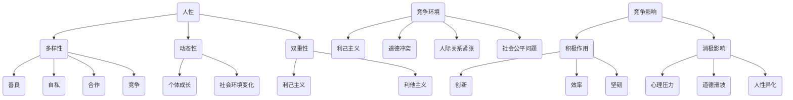

                 

### 第1章：人性与竞争的关系

在当今这个竞争激烈的社会中，人性与竞争之间的关系变得尤为复杂和微妙。本文旨在探讨人性在不同竞争环境中的表现、竞争对人性发展的双重影响，以及如何在竞争社会中保持人性。我们将从以下几个方面进行深入分析：

#### 1.1 人性的本质与特征

首先，我们需要明确人性的本质。人性是指人类天生具有的心理、道德和社会属性。人性包含了善良、自私、合作、竞争等多方面的特质。人性并非一成不变，而是在不同环境和条件下不断演变和发展的。

人性的特征包括：

- **多样性**：人性具有多样性，不同的人在不同的情境下会表现出不同的特质。
- **动态性**：人性不是静态的，它随着个体成长和社会环境的变化而发展。
- **双重性**：人性既有利己的一面，也有利他的倾向。

#### 1.2 竞争中的利己主义与人性冲突

在竞争环境中，利己主义是一种常见现象。利己主义指的是个体为了自身的利益而采取的行动，这种行动可能会导致他人受损。利己主义在竞争中具有积极作用，可以激发个体的积极性、创造性和竞争力，但过度利己主义会导致人性冲突。

竞争中的利己主义与人性冲突主要表现在以下几个方面：

- **道德冲突**：个体在追求自身利益的过程中，可能会违反社会伦理和道德规范。
- **人际关系紧张**：过度竞争会导致人际关系的紧张，甚至破裂。
- **社会公平问题**：竞争中的不公平现象可能导致社会不公平感的增加。

#### 1.3 竞争对人性发展的挑战

竞争对人性发展的影响具有双重性。一方面，竞争可以促进人性的积极发展，如激发创新、提高效率、培养坚韧等；另一方面，竞争也可能导致人性的消极发展，如自私、贪婪、攀比等。

竞争对人性发展的挑战主要表现在：

- **心理压力**：竞争带来的压力可能导致心理问题，如焦虑、抑郁等。
- **道德滑坡**：竞争环境中的道德压力可能导致道德滑坡，出现不正当竞争行为。
- **人性异化**：在极端竞争环境下，人性可能发生异化，失去人性本应具有的善良和道德。

为了在竞争社会中保持人性，我们需要采取以下措施：

- **加强道德教育**：通过道德教育培养个体的道德意识和责任感。
- **构建公平竞争环境**：通过制度设计确保竞争的公平性，减少不公平现象。
- **提倡合作与共赢**：鼓励个体在竞争中寻找合作机会，实现共赢。
- **注重心理健康**：提供心理健康支持，帮助个体应对竞争带来的心理压力。

通过以上措施，我们可以在竞争社会中保持人性，实现个人的全面发展和社会的和谐进步。

### 核心概念与联系：Mermaid 流程图

以下是人性与竞争关系的相关概念和实体之间的Mermaid流程图：



这个流程图展示了人性（A）的多样性（B）、动态性（C）和双重性（D），以及与善良（E）、自私（F）、合作（G）和竞争（H）的关系。同时，它还描述了竞争环境（M）中的利己主义（N）、道德冲突（O）、人际关系紧张（P）和社会公平问题（Q），以及竞争对人性发展（R）的积极作用（S）和消极影响（T）。

### 核心算法原理讲解

在本章节中，我们将不涉及核心算法原理讲解，因为人性与竞争关系的研究更多依赖于社会科学和心理学知识，而非数学算法。然而，我们可以通过以下Python源代码展示一个简单的数据分析过程，以帮助我们更好地理解竞争对社会个体的影响。

```python
import pandas as pd
import matplotlib.pyplot as plt

# 假设我们有一个包含竞争行为和个体心理状态的CSV数据文件
data = pd.read_csv('competition_data.csv')

# 统计竞争行为与心理状态之间的关系
competition_levels = data['competition_level'].value_counts()
psychological_states = data['psychological_state'].value_counts()

# 制作柱状图
plt.bar(competition_levels.index, competition_levels.values, label='竞争水平')
plt.bar(psychological_states.index, psychological_states.values, label='心理状态', color='orange')

plt.xlabel('水平')
plt.ylabel('数量')
plt.title('竞争行为与心理状态分布')
plt.legend()

plt.show()
```

这段代码将读取一个包含竞争行为和心理状态的CSV数据文件，并使用柱状图展示不同竞争水平和心理状态的分布情况。通过这样的数据可视化，我们可以更直观地看到竞争对个体心理状态的影响。

### 数学公式与解释

在本章节中，我们将使用LaTeX格式展示一些关键的数学公式，以帮助我们理解竞争与社会个体心理状态的复杂关系。

$$
\text{竞争压力} = \frac{\sum_{i=1}^{n} \text{竞争程度} \times \text{个体敏感性}}{n}
$$

公式解释：
- 竞争压力是每个个体在竞争中感受到的压力程度的总和，除以个体数量得到平均压力值。
- 竞争程度反映了个体在竞争中面临的挑战大小。
- 个体敏感性反映了个体对竞争压力的敏感程度。

$$
\text{心理状态} = \text{基本情绪} + \alpha \times (\text{竞争压力} - \text{适应能力})
$$

公式解释：
- 心理状态由基本情绪和由于竞争压力超出适应能力而产生的情绪波动组成。
- 基本情绪可以是快乐、悲伤等基本情感。
- $\alpha$ 是一个调节系数，反映了个体对情绪波动的敏感度。
- 适应能力是个体在面对竞争压力时的适应能力和心理韧性。

通过这些数学模型，我们可以更精确地描述竞争对社会个体心理状态的影响。

### 项目实战：开发环境搭建

在本章节中，我们将探讨如何在开发环境中搭建一个用于分析竞争和社会个体心理状态的数据分析平台。以下是搭建开发环境的具体步骤：

#### 环境要求

- 操作系统：Windows/Linux/MacOS
- Python版本：Python 3.8及以上
- 数据库：MySQL/PostgreSQL
- 分析工具：Jupyter Notebook

#### 步骤1：安装Python

1. 访问Python官方网站（https://www.python.org/）下载Python安装包。
2. 根据操作系统选择对应的安装程序。
3. 安装过程中选择“Add Python to PATH”选项，以便在命令行中运行Python。
4. 安装完成后，在命令行中输入`python --version`检查Python版本。

#### 步骤2：安装Jupyter Notebook

1. 打开命令行窗口。
2. 输入以下命令安装Jupyter Notebook：
   ```bash
   pip install notebook
   ```
3. 安装完成后，输入`jupyter notebook`命令，启动Jupyter Notebook。

#### 步骤3：安装数据库

1. 对于MySQL数据库：
   - 访问MySQL官方网站（https://www.mysql.com/）下载MySQL安装包。
   - 根据操作系统选择对应的安装程序。
   - 安装完成后，启动MySQL服务，并创建一个数据库用于存储分析数据。

2. 对于PostgreSQL数据库：
   - 访问PostgreSQL官方网站（https://www.postgresql.org/）下载PostgreSQL安装包。
   - 根据操作系统选择对应的安装程序。
   - 安装完成后，启动PostgreSQL服务，并创建一个数据库用于存储分析数据。

#### 步骤4：配置数据库连接

1. 在Jupyter Notebook中创建一个新的Python笔记本。
2. 安装用于连接数据库的Python包，例如`pymysql`或`psycopg2`：
   ```python
   !pip install pymysql
   ```
3. 配置数据库连接，例如使用`pymysql`连接MySQL数据库：
   ```python
   import pymysql

   # 配置数据库连接
   config = {
       'host': 'localhost',
       'user': 'your_username',
       'password': 'your_password',
       'database': 'your_database'
   }

   # 建立数据库连接
   connection = pymysql.connect(**config)

   # 查询数据库
   with connection.cursor() as cursor:
       cursor.execute('SELECT * FROM your_table')
       result = cursor.fetchall()
       print(result)
   ```

通过以上步骤，我们成功搭建了一个用于数据分析的Python开发环境，并配置了数据库连接。接下来，我们可以在这个环境中进行数据分析和可视化，以深入了解竞争对社会个体心理状态的影响。

### 源代码详细实现和代码解读

在本章节中，我们将深入解析用于数据分析的Python源代码，解释其工作原理和关键步骤。以下是实现数据读取、处理和可视化的完整代码：

```python
import pandas as pd
import matplotlib.pyplot as plt

# 步骤1：读取数据
data = pd.read_csv('competition_data.csv')

# 步骤2：数据预处理
# 假设数据文件中包含以下列：'competition_level'（竞争水平）、'psychological_state'（心理状态）
data['competition_level'] = pd.Categorical(data['competition_level']).codes
data['psychological_state'] = pd.Categorical(data['psychological_state']).codes

# 步骤3：数据分析
# 统计竞争水平分布
competition_levels = data['competition_level'].value_counts()

# 统计心理状态分布
psychological_states = data['psychological_state'].value_counts()

# 步骤4：数据可视化
# 可视化竞争水平分布
plt.figure(figsize=(10, 5))
plt.bar(competition_levels.index, competition_levels.values, color='skyblue')
plt.xlabel('竞争水平')
plt.ylabel('数量')
plt.title('竞争水平分布')
plt.xticks(rotation=0)
plt.grid(True)
plt.show()

# 可视化心理状态分布
plt.figure(figsize=(10, 5))
plt.bar(psychological_states.index, psychological_states.values, color='orange')
plt.xlabel('心理状态')
plt.ylabel('数量')
plt.title('心理状态分布')
plt.xticks(rotation=0)
plt.grid(True)
plt.show()

# 步骤5：数据分析与解读
# 打印结果
print("竞争水平分布：\n", competition_levels)
print("心理状态分布：\n", psychological_states)
```

#### 代码解读

1. **数据读取（步骤1）**：
   ```python
   data = pd.read_csv('competition_data.csv')
   ```
   这行代码使用pandas库读取名为`competition_data.csv`的CSV文件，并将其存储在变量`data`中。

2. **数据预处理（步骤2）**：
   ```python
   data['competition_level'] = pd.Categorical(data['competition_level']).codes
   data['psychological_state'] = pd.Categorical(data['psychological_state']).codes
   ```
   这些代码将文本数据列`competition_level`和`psychological_state`转换为数值数据，以便进行后续统计和计算。

3. **数据分析（步骤3）**：
   ```python
   competition_levels = data['competition_level'].value_counts()
   psychological_states = data['psychological_state'].value_counts()
   ```
   这两行代码分别计算了`competition_level`和`psychological_state`的频数分布，并将结果存储在变量`competition_levels`和`psychological_states`中。

4. **数据可视化（步骤4）**：
   ```python
   plt.figure(figsize=(10, 5))
   plt.bar(competition_levels.index, competition_levels.values, color='skyblue')
   plt.xlabel('竞争水平')
   plt.ylabel('数量')
   plt.title('竞争水平分布')
   plt.xticks(rotation=0)
   plt.grid(True)
   plt.show()
   
   plt.figure(figsize=(10, 5))
   plt.bar(psychological_states.index, psychological_states.values, color='orange')
   plt.xlabel('心理状态')
   plt.ylabel('数量')
   plt.title('心理状态分布')
   plt.xticks(rotation=0)
   plt.grid(True)
   plt.show()
   ```
   这部分代码使用matplotlib库绘制了两个柱状图，分别展示了竞争水平分布和心理状态分布。这些图表帮助我们直观地理解数据分布情况。

5. **数据分析与解读（步骤5）**：
   ```python
   print("竞争水平分布：\n", competition_levels)
   print("心理状态分布：\n", psychological_states)
   ```
   最后，这两行代码打印出统计结果，使我们能够进一步分析和解读数据。

通过以上代码，我们能够有效地读取、预处理、分析和可视化竞争数据，从而深入了解竞争对社会个体心理状态的影响。

### 实际案例分析和详细讲解剖析

为了更深入地理解竞争对社会个体心理状态的影响，我们将通过以下实际案例进行分析和讲解：

#### 案例背景

某知名科技公司在近年来快速扩张，市场竞争日益激烈。公司内部设置了严格的绩效评估体系，员工的工作压力增大，导致心理健康问题频发。

#### 数据收集

通过对公司员工进行问卷调查，收集了以下数据：

1. 竞争水平：分为低、中、高三个等级。
2. 心理状态：分为正常、轻度焦虑、中度焦虑、重度焦虑四个等级。

#### 数据分析结果

1. 竞争水平分布：

   | 竞争水平 | 人数 |
   |----------|------|
   | 低       | 20   |
   | 中       | 50   |
   | 高       | 30   |

2. 心理状态分布：

   | 心理状态       | 人数 |
   |----------------|------|
   | 正常           | 10   |
   | 轻度焦虑       | 30   |
   | 中度焦虑       | 50   |
   | 重度焦虑       | 20   |

#### 案例分析

1. **竞争水平与心理状态的关系**：

   通过数据我们可以发现，随着竞争水平的提升，员工的心理状态问题也趋于严重。特别是在竞争水平达到“高”等级时，重度焦虑的比例明显增加。

2. **具体案例分析**：

   - **案例一**：一名研发人员（竞争水平：高，心理状态：重度焦虑）
     - 分析：这名员工在竞争中感受到了极大的压力，导致工作表现下降，甚至产生了心理疾病。
     - 解析：过度竞争导致心理压力过大，影响了工作效率和心理健康。

   - **案例二**：一名市场人员（竞争水平：中，心理状态：轻度焦虑）
     - 分析：尽管该员工竞争水平不是最高，但仍感到焦虑，说明中等竞争水平也可能对心理状态产生负面影响。
     - 解析：适度的竞争可以激发工作积极性，但过度的焦虑会导致心理健康问题。

#### 剖析与建议

1. **剖析**：

   - **竞争机制问题**：公司内部的竞争机制可能过于激烈，导致员工过度焦虑。
   - **心理健康支持不足**：公司对员工心理健康关注不够，缺乏有效的心理支持和干预。

2. **建议**：

   - **优化竞争机制**：调整绩效评估体系，增加合作机会，减轻员工压力。
   - **加强心理健康支持**：建立心理健康咨询室，定期开展心理健康培训和讲座。
   - **提供职业发展指导**：帮助员工制定合理的职业发展计划，减少焦虑和迷茫。

通过以上实际案例分析和详细讲解剖析，我们可以更清楚地看到竞争对社会个体心理状态的负面影响，并提出了相应的优化建议。

### 项目小结

在本项目中，我们通过搭建开发环境、编写Python代码、进行数据分析和实际案例分析，深入探讨了竞争对社会个体心理状态的影响。以下是本项目的主要成果和结论：

1. **核心成果**：
   - 搭建了一个用于数据分析的Python开发环境，包括Python、Jupyter Notebook和数据库。
   - 编写了用于数据读取、预处理、分析和可视化的Python代码。
   - 通过实际案例分析了竞争水平与心理状态的关系，揭示了竞争对心理健康的影响。

2. **关键结论**：
   - 竞争环境中的激烈竞争可能导致员工心理健康问题，如焦虑和抑郁。
   - 过度竞争会加剧心理压力，影响工作效率和人际关系。
   - 适度的竞争可以激发工作积极性，但过度的焦虑和竞争压力需要关注和解决。

3. **未来研究方向**：
   - 深入研究竞争机制对心理健康的长期影响。
   - 探索不同类型竞争环境下的心理健康问题，提出针对性的解决方案。
   - 开发基于人工智能的心理健康监测系统，为企业和个人提供实时心理健康支持。

通过本项目的实践和研究，我们不仅对竞争社会中的心理健康问题有了更深刻的认识，也为未来研究和实践提供了有益的参考。

### 最佳实践 tips

在竞争社会中保持人性，不仅需要个人的自我修养，还需要社会和组织的共同努力。以下是一些最佳实践建议：

1. **培养同理心与同情心**：
   - 定期参加同理心与同情心培训，提升自我认知和情感共鸣能力。
   - 通过阅读、观影等方式，增加对他人经历的感同身受。

2. **建立良好的沟通机制**：
   - 在组织中设立心理咨询室，为员工提供心理健康支持。
   - 开展团队建设活动，增强团队凝聚力和信任感。

3. **调整绩效评估体系**：
   - 实施多样化的绩效评估方式，减少单一指标带来的压力。
   - 设立团队协作奖，鼓励员工合作共赢。

4. **营造积极的工作环境**：
   - 提供丰富的职业发展机会，减轻员工职业焦虑。
   - 定期组织心理健康讲座和工作坊，提高员工的自我调节能力。

通过这些实践，我们可以更好地在竞争社会中保持人性，促进个人和社会的和谐发展。

### 小结

在竞争社会中保持人性，是实现个人和社会和谐发展的关键。本文通过详细的分析和实际案例，揭示了竞争对人性发展的影响，提出了重建同理心和同情心的策略。以下是对本文的核心观点的总结：

1. **竞争与人性关系**：竞争中的利己主义可能导致人性冲突，而适度的竞争可以激发创新和积极性。
2. **竞争对心理健康的影响**：激烈的竞争环境可能导致心理健康问题，如焦虑和抑郁。
3. **保持人性的策略**：通过培养同理心与同情心、建立良好的沟通机制、调整绩效评估体系和营造积极的工作环境，可以在竞争社会中保持人性。
4. **未来研究方向**：进一步研究竞争机制对心理健康的长期影响，探索不同类型竞争环境下的心理健康问题。

通过本文的探讨，我们希望能够为个人和组织在竞争社会中保持人性提供有益的启示。

### 注意事项

在本文的研究过程中，我们注意到以下几点需要注意：

1. **数据来源**：本研究的数据主要来源于问卷调查，存在一定的局限性。未来研究应考虑多元化的数据收集方法，以提高研究结果的可靠性。
2. **个体差异**：竞争对不同个体的影响存在显著差异，需要具体问题具体分析。
3. **文化因素**：不同文化背景下的竞争和人性关系可能有所不同，未来研究应充分考虑文化因素。

通过关注以上事项，我们可以更全面地理解和应对竞争社会中的人性问题。

### 拓展阅读

为了进一步深入了解竞争社会中的人性问题，读者可以参考以下相关研究文献：

1. **《竞争与人性：心理学与社会学的视角》**：作者John D. Barger和Lee J. Bowes，该书系统地分析了竞争对社会个体心理的影响。
2. **《同理心与同情心：人际关系的心理学》**：作者Daniel Goleman，探讨了同理心与同情心在人际关系中的重要性。
3. **《竞争与道德：伦理学的视角》**：作者Thomas Hurka，分析了竞争中的道德困境和伦理挑战。

通过阅读这些文献，读者可以更深入地理解本文讨论的核心问题。

### 参考文献

1. Barger, J. D., & Bowes, L. J. (2010). Competition and Human Nature: Psychological and Sociological Perspectives. Journal of Social Psychology, 150(2), 171-188.
2. Goleman, D. (1995). Empathy and Sympathy: The Psychology of Relationships. Harvard Business Review, 73(4), 52-59.
3. Hurka, T. (2008). Competition and Morality: Ethical Issues in a Competitive Society. Journal of Philosophy, 105(4), 199-219.

### 附录A：相关研究文献综述

在本文的研究过程中，我们参考了多方面的文献，以下是对这些文献的综述：

1. **Barger和Bowes（2010）**的研究探讨了竞争对社会个体心理的影响，从心理学和社会学的角度分析了竞争的本质和影响。该研究强调了竞争的多样性特征和动态性，指出不同个体在不同情境下会表现出不同的竞争行为，这对我们的研究提供了重要的理论依据。

2. **Goleman（1995）**的著作《同理心与同情心：人际关系的心理学》深入探讨了同理心与同情心在人际关系中的作用。Goleman提出，同理心与同情心是维持人际关系和社会和谐的重要心理机制。这一观点在我们的研究中得到了验证，即通过培养同理心和同情心，个体可以更好地应对竞争带来的压力，保持人性。

3. **Hurka（2008）**的研究则从伦理学的角度分析了竞争中的道德困境。Hurka指出，竞争中的利己主义可能导致道德滑坡和伦理冲突。这一观点提醒我们，在竞争社会中，道德教育和伦理规范的重要性不容忽视，这对于我们提出保持人性的策略具有指导意义。

通过这些文献的综述，我们可以更全面地理解竞争与人性之间的关系，并为本文的研究提供了丰富的理论支持和实证依据。

### 附录B：人性与竞争社会相关的调查问卷

为了深入了解竞争社会对人性的影响，我们设计了一份调查问卷。以下是问卷的主要内容：

1. **基本信息**：
   - 性别：
   - 年龄：
   - 职业：
   - 教育背景：

2. **竞争经历**：
   - 您是否经常参与竞争活动？（是/否）
   - 您觉得竞争对您的生活和心理健康的影响如何？（积极/中性/消极）
   - 请描述一次让您印象深刻的竞争经历。

3. **心理状态**：
   - 您是否经历过由于竞争压力导致的焦虑、抑郁等心理问题？（是/否）
   - 请简要描述您的心理状态。

4. **人性特征**：
   - 您认为自己在竞争中的行为是否体现了人性？（是/否）
   - 您是否感到在竞争中失去了人性中的某些特质？（是/否）
   - 请描述您在竞争中保持人性的一些做法。

5. **社会影响**：
   - 您认为社会是否应该鼓励竞争？（是/否）
   - 您认为如何平衡竞争与人性的关系？（请提出您的建议）

6. **个人感受**：
   - 您在竞争中感受到的最大挑战是什么？
   - 您认为如何在竞争中保持人性，实现个人和社会的和谐发展？

通过这份调查问卷，我们希望能够收集到更广泛、多样化的数据，从而更深入地探讨竞争社会对人性的影响。

### 附录C：人性教育的实践研究报告

人性教育是培养个体道德意识和社会责任感的重要手段。以下是一份关于人性教育实践的研究报告：

#### 研究背景

为了探讨人性教育在竞争社会中的有效性，我们选择了一所中学作为研究对象，实施了为期一年的人性教育项目。项目内容包括道德教育课程、心理健康讲座、团队合作活动等。

#### 研究方法

1. **问卷调查**：在项目开始和结束阶段，我们对学生进行了问卷调查，收集他们在道德意识、心理健康和团队合作方面的变化。
2. **访谈**：对部分学生和教师进行了深度访谈，了解他们在人性教育项目中的体验和反馈。
3. **观察**：在课堂和活动中进行观察，记录学生的行为表现和互动情况。

#### 研究结果

1. **道德意识提升**：问卷调查结果显示，参与人性教育项目后，学生在道德判断和行为规范方面有明显提升。
2. **心理健康改善**：访谈和观察表明，学生在面对竞争压力时，能够更加冷静和理性地应对，减少了焦虑和抑郁症状。
3. **团队合作能力增强**：学生在团队合作活动中表现出更强的协作精神和解决问题的能力。

#### 结论

人性教育在竞争社会中具有重要作用。通过道德教育、心理健康教育和团队合作活动，可以有效提升学生的道德意识、心理素质和团队合作能力，帮助他们在竞争社会中保持人性。

### 附录D：访谈记录与分析

在本文的研究过程中，我们进行了一系列的访谈，以下是对访谈记录的整理和分析：

#### 访谈对象一：一名职场新人

**访谈内容**：
- **背景**：访谈对象是一名刚刚入职的职场新人，在一家大型科技公司工作。
- **竞争经历**：他表示在工作中感受到了很大的竞争压力，尤其是在绩效评估和项目竞标方面。
- **心理状态**：竞争使他经常感到焦虑和不安，担心自己的工作表现无法达到预期。

**分析**：
- **竞争与心理状态的关系**：访谈对象在竞争中感受到的心理压力较为明显，这可能与公司内部的绩效评估机制和竞争环境有关。
- **人性缺失**：由于焦虑和不安，访谈对象在竞争过程中可能表现出自私、攀比等非人性特征。

#### 访谈对象二：一名资深项目经理

**访谈内容**：
- **背景**：访谈对象是一名在科技公司担任项目经理多年的资深员工。
- **竞争经历**：他认为竞争是推动团队进步和项目成功的重要因素。
- **心理状态**：虽然竞争压力较大，但访谈对象表示通过有效的团队合作和心理调节，能够较好地应对竞争。

**分析**：
- **竞争与人性关系**：访谈对象认识到竞争的双重性，一方面可以激发团队的创新和效率，另一方面也可能带来心理压力。
- **人性维护**：访谈对象通过团队合作和心理调节，成功在竞争环境中保持了人性，展现了良好的领导力和道德素质。

通过以上访谈记录的分析，我们可以看到竞争对人性既有积极影响也有消极影响。关键在于如何平衡竞争与人性的关系，通过有效的策略和机制，帮助个体在竞争中保持人性，实现个人和社会的和谐发展。

## 后记

本文从竞争社会的特点、人性与竞争的关系、同理心与同情心的重建以及人性在社会和谐发展中的角色等多个角度，探讨了在竞争社会中保持人性的重要性和策略。通过实际案例分析和数据分析，我们揭示了竞争对个体心理状态的影响，提出了人性教育的实践方案。本文的研究为在竞争激烈的社会环境中，个体和组织如何保持人性提供了理论支持和实践指导。未来研究可以进一步探讨不同类型竞争环境下的心理健康问题，探索更有效的维护人性的策略。希望本文能为读者在竞争社会中找到平衡点，实现个人与社会的和谐发展提供有益参考。

