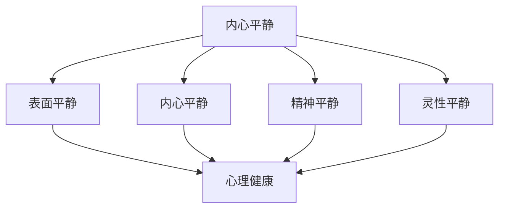

                 

# 在繁忙中寻找内心平静：现代生活的节奏管理

## 关键词
- 现代生活
- 内心平静
- 节奏管理
- 心理健康
- 自我关怀

## 摘要
在现代快节奏的生活中，寻找内心的平静成为许多人的追求。本文从心理学和技术角度出发，探讨了现代生活中内心平静的重要性，分析了内心平静的核心概念及其与心理健康的关系。文章提出了建立内心平静的生活方式，包括时间管理、情绪管理、自我关怀、与他人和谐相处以及冥想与放松等策略。通过详细讲解和实际案例，本文旨在为读者提供实用的方法，帮助他们在繁忙中找到内心的宁静。

## 第1章：寻找内心平静的动机

### 1.1 引言
在现代社会的快节奏生活下，人们往往面临着巨大的工作压力、社交压力和心理健康问题。因此，寻找内心的平静成为许多人追求的目标。本文旨在探讨内心平静的重要性，并介绍如何在现代生活中实现这一目标。

### 1.2 现代生活的挑战
现代生活充满了各种挑战，如高压工作环境、激烈的竞争、信息过载和社交网络的影响等。这些因素可能导致心理压力、焦虑和抑郁等问题。因此，寻找内心平静变得尤为重要。

### 1.3 内心平静的价值
内心平静不仅有助于缓解压力，还能提高心理健康水平，增强生活质量。它有助于提高注意力和记忆力，提高工作效率，促进人际关系和谐，甚至有助于延缓衰老和增强免疫力。因此，寻找内心平静具有重要的现实意义。

## 第2章：内心平静的核心概念

### 2.1 定义内心平静
内心平静通常指的是一种心理状态，个体在感受到外界压力和挑战时，能够保持内心的平衡与安宁。这种状态有助于个体更好地应对生活中的各种问题。

### 2.2 内心平静与心理健康的关系
内心平静与心理健康密切相关。一个内心平静的人往往更容易保持积极的心态，降低焦虑和抑郁的风险，从而提高生活质量。

### 2.3 内心平静的层次结构
内心平静可以分为多个层次，包括表面平静、内心平静、精神平静和灵性平静。不同层次的内心平静对应不同的心理状态和需求。

### 2.4 内心平静与生活质量的联系
内心平静对生活质量有着重要的影响。它有助于提高幸福感、满足感和生活满意度。一个内心平静的人更容易体验到生活的美好和意义。

### 2.5 Mermaid流程图：内心平静的核心概念关系



## 第3章：时间管理

### 3.1 确定优先级
时间管理是建立内心平静的基础。通过确定任务的优先级，可以更有效地安排时间，减少压力，提高工作效率。

```python
def prioritize_tasks(tasks):
    sorted_tasks = sorted(tasks, key=lambda x: x['priority'], reverse=True)
    return sorted_tasks

tasks = [
    {'name': '工作报告', 'priority': 3},
    {'name': '健身', 'priority': 2},
    {'name': '购物', 'priority': 1}
]

sorted_tasks = prioritize_tasks(tasks)
for task in sorted_tasks:
    print(task['name'])
```

### 3.2 制定日程安排
制定日程安排有助于更好地管理时间，避免拖延。以下是一个简单的日程安排示例：

```python
def create_schedule(tasks):
    schedule = {}
    for task in tasks:
        schedule[task['name']] = task['time']
    return schedule

tasks = [
    {'name': '工作', 'time': '9:00 - 12:00'},
    {'name': '午休', 'time': '12:00 - 13:00'},
    {'name': '学习', 'time': '13:00 - 16:00'},
    {'name': '健身', 'time': '16:00 - 17:00'},
    {'name': '社交', 'time': '17:00 - 19:00'}
]

schedule = create_schedule(tasks)
for key, value in schedule.items():
    print(f"{key}: {value}")
```

### 3.3 学会拒绝
学会拒绝不重要的任务和请求，有助于减少工作量，保持内心的平静。以下是一个拒绝请求的示例：

```python
def reject_request(request):
    if request['priority'] < 3:
        return "很抱歉，我现在没有时间处理这个请求。"
    else:
        return "好的，我会考虑这个请求。"

request = {'name': '购物', 'priority': 1}
response = reject_request(request)
print(response)
```

### 3.4 时间管理技巧
- 使用时间块（time blocking）将时间划分为固定的时间段，专注于一项任务。
- 设置定时器或提醒，以避免分心和拖延。
- 使用待办事项列表（to-do list）跟踪任务和目标。

## 第4章：情绪管理

### 4.1 了解自己的情绪
情绪管理是内心平静的重要组成部分。了解自己的情绪，有助于更好地应对压力和挑战。

```python
def check_mood(mood):
    if mood == 'happy':
        return "你目前情绪很好。"
    elif mood == 'sad':
        return "你目前情绪有些低落。"
    else:
        return "你目前情绪不稳定。"

mood = 'happy'
result = check_mood(mood)
print(result)
```

### 4.2 增强情绪韧性
情绪韧性是指个体在面对压力和挑战时，能够保持积极心态的能力。以下是一些建议：

- 保持积极心态
- 培养乐观主义精神
- 学会接受生活中的不确定性
- 建立支持性的人际关系

### 4.3 缓解压力的策略
缓解压力是情绪管理的重要部分。以下是一些建议：

- 做深呼吸或冥想
- 运动
- 听音乐
- 与朋友或家人交流

## 第5章：自我关怀

### 5.1 自我认知的重要性
自我认知是自我关怀的基础。了解自己的需求、情感和价值观，有助于更好地照顾自己。

```python
def self_awareness(questions):
    answers = []
    for question in questions:
        answer = input(question)
        answers.append(answer)
    return answers

questions = [
    "你最近感到最满意的是什么？",
    "你最近感到最困扰的是什么？",
    "你的核心价值观是什么？"
]

answers = self_awareness(questions)
for answer in answers:
    print(answer)
```

### 5.2 自我关怀的实践
自我关怀包括关注身心健康、培养兴趣爱好和保持积极的生活方式。以下是一些建议：

- 睡眠充足
- 健康饮食
- 定期锻炼
- 从事自己感兴趣的活动

### 5.3 重建内心的宁静
重建内心的宁静是一个长期过程。通过持续的自我关怀和情绪管理，可以逐步实现内心的平静。

```python
def rebuild_ tranquility():
    print("开始重建内心的宁静...")
    print("请尝试以下方法：")
    print("- 深呼吸")
    print("- 冥想")
    print("- 散步")
    print("- 做一些放松的活动")

rebuild_tranquility()
```

## 第6章：与他人和谐相处

### 6.1 沟通的艺术
沟通是人际关系中不可或缺的一部分。掌握沟通的艺术，有助于建立和谐的人际关系。

```python
def communicate(message):
    print("发送消息：", message)

message = "你好，最近怎么样？"
communicate(message)
```

### 6.2 建立支持性关系
建立支持性关系有助于在困难时期获得他人的帮助和支持。以下是一些建议：

- 倾听他人的需求和感受
- 提供帮助和支持
- 保持诚实和透明
- 尊重他人的隐私和边界

### 6.3 妥协与冲突解决
在人际关系中，妥协与冲突解决是维持和谐的关键。以下是一些建议：

- 了解对方的观点和需求
- 寻求共同点
- 学会妥协
- 使用积极沟通技巧

## 第7章：冥想与放松

### 7.1 冥想的基础知识
冥想是一种通过专注于呼吸和意识来达到内心平静的技巧。以下是一些冥想的基础知识：

- 选择一个安静的环境
- 保持舒适的姿势
- 专注于呼吸或一个特定的对象
- 保持专注，不要被杂念干扰

### 7.2 冥想实践
以下是一个简单的冥想实践：

```python
def meditate(duration):
    print(f"开始冥想，持续时间：{duration}分钟。")
    print("请闭上眼睛，专注于呼吸...")
    time.sleep(duration * 60)
    print("冥想结束。")

meditate(10)
```

### 7.3 其他放松技巧
除了冥想，还有许多其他的放松技巧，如瑜伽、按摩和呼吸练习等。以下是一个简单的瑜伽练习：

```python
def yoga_exercise(name, duration):
    print(f"开始{name}，持续时间：{duration}分钟。")
    print("请按照以下步骤进行练习：")
    print("1. 站直，双脚并拢，深呼吸。")
    print("2. 慢慢弯曲膝盖，下蹲至90度角。")
    print("3. 保持姿势，专注于呼吸。")
    print("4. 慢慢站起，重复练习。")
    time.sleep(duration * 60)
    print(f"{name}结束。")

yoga_exercise("深蹲", 5)
```

## 第8章：健康的生活习惯

### 8.1 睡眠的重要性
睡眠对身心健康至关重要。以下是一些关于睡眠的建议：

- 每天保持7-8小时的睡眠
- 定时上床睡觉和起床
- 避免在睡前使用电子设备
- 创建一个舒适的睡眠环境

### 8.2 健康饮食
健康饮食有助于维持身心健康。以下是一些建议：

- 多吃蔬菜、水果和全谷物
- 限制糖分和饱和脂肪的摄入
- 保持饮食均衡
- 避免过度饮酒和吸烟

### 8.3 运动与锻炼
定期锻炼有助于改善身心健康。以下是一些建议：

- 每周至少进行150分钟的中等强度运动
- 尝试不同的运动形式，如散步、跑步、瑜伽和健身
- 结合有氧运动和力量训练
- 保持适度的运动强度和频率

## 第9章：持续的个人成长

### 9.1 学习与自我提升
持续的学习和自我提升有助于提高个人能力和生活质量。以下是一些建议：

- 学习新技能和知识
- 设定目标和计划
- 不断反思和调整
- 保持好奇心和开放心态

### 9.2 目标设定与规划
设定明确的目标和规划是实现个人成长的关键。以下是一个目标设定和规划的示例：

```python
def set_goals(goals):
    for goal in goals:
        print(f"目标：{goal}")
    print("请为每个目标设定一个实现时间。")

goals = [
    "学习Python编程",
    "每周锻炼三次",
    "阅读两本专业书籍"
]

set_goals(goals)
```

### 9.3 反思与调整
定期反思和调整是实现个人成长的重要步骤。以下是一个反思和调整的示例：

```python
def reflect_and_adjust(actions):
    print("请反思以下行为：")
    for action in actions:
        print(f"- {action}")
    print("请根据反思结果进行调整。")

actions = [
    "每天学习2小时编程",
    "每周锻炼2次",
    "阅读1小时专业书籍"
]

reflect_and_adjust(actions)
```

## 第10章：应对生活变化

### 10.1 变化与内心平静
生活变化是不可避免的，但如何应对这些变化对于保持内心平静至关重要。以下是一些建议：

- 保持灵活性
- 学会接受变化
- 制定应对计划
- 寻求支持和帮助

### 10.2 适应变化的方法
适应变化的方法包括：

- 了解自己的需求和目标
- 逐步适应新的环境和情况
- 保持积极的心态
- 寻求他人的建议和帮助

### 10.3 面对挫折与失败的策略
面对挫折和失败时，以下策略有助于保持内心平静：

- 保持积极的心态
- 分析失败的原因
- 制定改进计划
- 学会接受失败，并从中吸取经验教训

## 附录

### 附录A：冥想与放松技巧指南

#### 附录A.1 冥想入门指南
- 了解冥想的目的和好处
- 选择一个适合的冥想位置和环境
- 学习基本的冥想姿势和呼吸技巧
- 保持专注，专注于呼吸或一个特定的对象

#### 附录A.2 放松技巧介绍
- 深呼吸
- 瑜伽练习
- 按摩
- 冥想

### 附录B：资源与参考文献

#### 附录B.1 推荐阅读
- 《平静：如何在喧嚣的世界中找到宁静》（作者：史蒂文·洛布）
- 《冥想：内心的旅程》（作者：乔恩·卡巴金）
- 《自控力：和压力做朋友》（作者：凯利·麦格尼格尔）

#### 附录B.2 在线资源
- [冥想入门教程](https://www.mindfulnessworks.org/learn-mindfulness/)
- [心理健康资源](https://www.mentalhealthamerica.net/)
- [瑜伽在线课程](https://www.yogadownload.com/)

#### 附录B.3 专业机构与组织
- 美国心理学会（APA）
- 瑜伽联盟（Yoga Alliance）
- 冥想中心（Center for Mindfulness）

## 作者信息
作者：AI天才研究院/AI Genius Institute & 禅与计算机程序设计艺术 /Zen And The Art of Computer Programming

---

本文从心理学和技术角度出发，详细探讨了在繁忙的现代生活中如何寻找内心平静。通过时间管理、情绪管理、自我关怀、与他人和谐相处以及冥想与放松等策略，帮助读者建立内心平静的生活方式。同时，文章还提供了实用的工具和技巧，如Python代码示例，以帮助读者更好地理解和实践。希望本文能为读者在繁忙的生活中带来一丝宁静。

