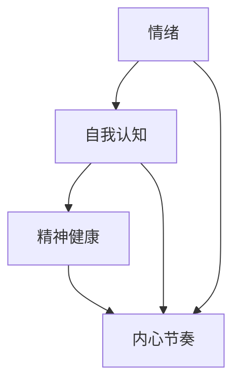

                 

### 《在繁忙中寻找内心平静：现代生活的节奏管理》

#### 关键词

- 内心平静
- 节奏管理
- 现代生活
- 心理健康
- 时间管理

#### 摘要

在快速发展的现代社会中，我们面临着前所未有的繁忙与压力。工作、家庭、社交等多重责任让人疲惫不堪，内心平静成为一种稀缺的奢侈品。本文旨在探讨如何在繁忙的生活中寻找内心平静，通过时间管理、心理调适和人际关系管理三个方面，提供一系列切实可行的策略。文章结构合理，内容丰富，旨在帮助读者掌握节奏管理的艺术，实现内心平静与身心健康。

#### 引言

### 1.1 内心平静的重要性

内心平静不仅仅是一种心理状态，更是一种对身心健康至关重要的影响。研究表明，长期处于紧张和压力状态的人更容易患上各种身心疾病，包括心脏病、高血压、焦虑症等。反之，内心平静有助于增强免疫力、降低患病风险，提高生活质量。在快节奏的现代社会中，保持内心平静显得尤为重要。

### 1.1.1 内心平静对身心健康的影响

内心平静对身心健康的影响是多方面的。首先，它有助于减轻心理压力，减少焦虑和抑郁情绪。其次，内心平静可以提高专注力和工作效率，减少因疲劳和压力导致的错误和失误。此外，内心平静还有助于改善睡眠质量，促进身体的自我修复和恢复。

### 1.1.2 现代社会繁忙生活的挑战

现代社会繁忙生活的挑战体现在多个方面。工作压力大、工作任务繁重、时间管理不当、社交应酬频繁等，都可能导致心理压力增大，内心平静难以保持。此外，信息化时代的到来，让我们面临信息过载的困扰，进一步加剧了内心的紧张和焦虑。

### 1.1.3 寻找内心平静的必要性

在繁忙的生活中寻找内心平静，不仅是为了提升个人生活质量，更是为了实现身心健康。内心平静可以帮助我们更好地应对生活中的挑战，提高工作效率，改善人际关系，从而实现个人和职业发展的平衡。因此，寻找内心平静具有重大的现实意义和深远的影响。

#### 1.2 本书的结构和目标

本书分为四个部分，旨在全面探讨如何管理内心的节奏，实现内心平静。

第一部分：引言，介绍了内心平静的重要性以及现代生活的挑战。

第二部分：理解内心的节奏，从情绪、自我认知和精神健康三个方面，深入探讨内心的基本构成。

第三部分：管理内心的节奏，提出了时间管理、心理调适和人际关系管理三个方面具体的管理策略。

第四部分：实践与反思，提供具体的实践方法，并强调反思的重要性。

本书的目标是帮助读者掌握节奏管理的艺术，实现内心平静与身心健康，为现代生活注入一份宁静与和谐。

### 内心的基本构成

#### 2.1.1 情绪与内心节奏

情绪是内心节奏的重要组成部分。情绪的类型与表现多种多样，包括快乐、愤怒、悲伤、恐惧等。每种情绪都有其独特的生理和心理特征。例如，快乐时，人体会分泌多巴胺，产生愉悦感；愤怒时，心跳加快，血压升高，准备应对冲突。

#### 2.1.1.1 情绪的类型与表现

情绪的类型可以分为基本情绪和复杂情绪。基本情绪包括快乐、愤怒、悲伤和恐惧，它们是人类共有的基本情绪。复杂情绪则是在基本情绪基础上发展而来的，如焦虑、厌恶、羞耻等。不同类型的情绪在生理和心理层面上有着不同的表现。

#### 2.1.1.2 情绪对内心节奏的影响

情绪对内心节奏有着显著的影响。积极情绪可以提高内心节奏，使人感到愉悦、满足和有动力；而消极情绪则可能导致内心节奏失调，使人感到焦虑、沮丧和疲惫。情绪的调节和管理对于维持内心平静至关重要。

#### 2.1.2 自我认知与内心节奏

自我认知是理解内心节奏的关键。自我认知包括自我感知、自我评价和自我认同。自我感知是指个体对自己的感知和认识，自我评价是指个体对自己的评价和态度，自我认同是指个体对自己的认同和归属感。

#### 2.1.2.1 自我认知的重要性

自我认知对于个人的成长和发展至关重要。它不仅影响个体的心理健康，还影响个体的行为和决策。良好的自我认知可以帮助个体更好地理解自己的情绪和需求，从而更好地管理内心节奏。

#### 2.1.2.2 自我认知与内心节奏的关联

自我认知与内心节奏密切相关。自我认知不足可能导致个体对情绪和行为的误解，进而影响内心节奏。相反，良好的自我认知可以帮助个体更好地应对情绪波动，维持内心平静。

#### 2.1.3 精神健康与内心节奏

精神健康是内心节奏的重要组成部分。精神健康包括心理健康、情感健康和社交健康。心理健康是指个体在情感、认知和行为上的良好状态；情感健康是指个体能够有效地处理和管理自己的情感；社交健康是指个体能够与他人建立积极、健康的关系。

#### 2.1.3.1 精神健康的基本概念

精神健康的基本概念包括心理健康、情感健康和社交健康。心理健康是指个体在情感、认知和行为上的良好状态，能够有效地应对生活中的挑战；情感健康是指个体能够有效地处理和管理自己的情感，保持积极、健康的情感状态；社交健康是指个体能够与他人建立积极、健康的关系，参与社会活动。

#### 2.1.3.2 精神健康与内心节奏的关系

精神健康与内心节奏有着密切的关系。精神健康良好可以帮助个体更好地应对压力和挑战，维持内心平静；而精神健康问题可能导致内心节奏失调，影响个体的生活质量。

#### 背景介绍

内心的节奏管理是现代社会中一个重要的课题。在快节奏的生活中，人们往往面临着各种压力和挑战，这些压力和挑战可能会影响内心的平衡和稳定。因此，如何管理内心的节奏，维持内心的平静和健康，成为了一个迫切需要解决的问题。

#### 核心概念与联系

在探讨内心节奏管理的过程中，我们首先需要理解几个核心概念：情绪、自我认知和精神健康。

1. **情绪**：情绪是内心节奏的重要组成部分，包括基本情绪和复杂情绪。情绪的类型和表现决定了内心的状态。

2. **自我认知**：自我认知是理解内心节奏的关键，包括自我感知、自我评价和自我认同。自我认知的水平和质量直接影响个体对情绪和行为的理解和管理。

3. **精神健康**：精神健康包括心理健康、情感健康和社交健康。精神健康的状况直接关系到个体的内心平静和生活质量。

这几个核心概念之间存在着紧密的联系。情绪、自我认知和精神健康相互影响，共同构成了内心的节奏。

#### Mermaid 流程图



#### 核心算法原理讲解

在内心节奏管理中，关键在于如何有效地调节和管理情绪、自我认知和精神健康。以下是一个简单的Python代码示例，用于说明如何通过情绪调节来维持内心平静。

```python
# 情绪调节函数
def regulate_emotion(emotion, target_emotion):
    if emotion == target_emotion:
        return "情绪稳定，内心平静"
    else:
        # 根据情绪差异进行调节
        if emotion == "焦虑" and target_emotion == "平静":
            return "进行深呼吸和放松训练，降低焦虑感"
        elif emotion == "抑郁" and target_emotion == "快乐":
            return "参与社交活动，提高自信心和积极性"
        else:
            return "情绪调节中，请继续保持关注"

# 示例
current_emotion = "焦虑"
target_emotion = "平静"
result = regulate_emotion(current_emotion, target_emotion)
print(result)
```

#### 数学模型和公式

在情绪调节中，可以使用一些数学模型和公式来量化情绪状态和调节效果。以下是一个简单的数学模型，用于描述情绪调节的过程。

$$
E(t+1) = E(t) + \alpha \cdot (T - E(t))
$$`

其中，$E(t)$ 表示当前情绪状态，$E(t+1)$ 表示调节后的情绪状态，$T$ 表示目标情绪状态，$\alpha$ 是调节系数，用于控制调节速度。

#### 详细讲解和通俗易懂的举例说明

假设当前情绪状态是“焦虑”，目标情绪状态是“平静”。我们可以通过以下步骤进行情绪调节：

1. **评估当前情绪状态**：确定当前情绪状态为“焦虑”。

2. **设定目标情绪状态**：设定目标情绪状态为“平静”。

3. **计算调节系数**：根据具体情况设定调节系数 $\alpha$，例如，我们可以设定 $\alpha = 0.1$。

4. **应用情绪调节公式**：使用情绪调节公式计算调节后的情绪状态。

   假设当前情绪状态 $E(t) = 5$（5分制），目标情绪状态 $T = 3$。根据公式，调节后的情绪状态 $E(t+1)$ 可以计算为：

   $$
   E(t+1) = 5 + 0.1 \cdot (3 - 5) = 4.4
   $$

   调节后的情绪状态为4.4，说明焦虑感有所减轻，但尚未达到目标情绪状态。

5. **持续调节**：根据调节后的情绪状态，继续进行情绪调节，直到达到目标情绪状态。

通过这个简单的例子，我们可以看到情绪调节的过程是如何进行的。在实际应用中，可能需要结合更多的方法和技巧，以达到更好的调节效果。

### 时间管理

#### 3.1.1 时间管理的基本原则

时间管理是内心节奏管理的重要组成部分。合理的时间管理不仅能提高工作效率，还能减少压力，有助于维持内心平静。以下是一些时间管理的基本原则：

1. **明确目标**：设定清晰的目标是时间管理的第一步。明确的目标可以帮助我们集中精力，避免在琐碎的任务中迷失。

2. **优先级设置**：将任务按照重要性和紧急性进行分类，优先完成重要且紧急的任务。

3. **合理规划**：合理规划时间，为每个任务分配足够的时间，避免任务堆积导致压力增大。

4. **避免拖延**：及时开始任务，避免拖延。拖延不仅会增加工作压力，还会影响内心的平静。

5. **灵活调整**：在执行计划的过程中，根据实际情况灵活调整，避免因计划过于 rigid 而导致内心紧张。

#### 3.1.1.1 时间管理的重要性

时间管理的重要性在于，它能够帮助我们更高效地完成工作，减少不必要的压力和焦虑。在快节奏的现代社会中，有效的时间管理不仅能够提高个人生产力，还能提升生活质量，实现工作与生活的平衡。

#### 3.1.1.2 时间管理的方法

以下是一些具体的时间管理方法：

1. **使用日历和待办事项列表**：将任务和计划记录在日历或待办事项列表中，有助于保持工作顺序和避免遗漏任务。

2. **番茄工作法**：将工作时间划分为25分钟的工作周期和5分钟的休息时间，有助于提高专注力和效率。

3. **时间块规划**：将一天的时间划分为不同的时间块，每个时间块专注于一项任务，有助于避免任务切换导致的效率降低。

4. **定期回顾和调整**：定期回顾时间管理的执行情况，根据实际情况进行调整，以提高时间管理的有效性。

#### 高效工作的策略

为了实现高效工作，我们需要采取一些具体的策略，包括：

1. **任务分解**：将复杂任务分解为小的、可管理的部分，有助于降低任务的难度，提高完成率。

2. **避免干扰**：在工作时尽量避免干扰，如关闭不必要的通知，保持工作环境的整洁和安静。

3. **设定截止日期**：为每个任务设定明确的截止日期，有助于提高工作的紧迫感和责任感。

4. **反思和改进**：定期反思工作方法，寻找改进的空间，不断提高工作效率。

#### 3.1.3 假期与休息

假期与休息是时间管理中不可或缺的一部分。合理安排假期和休息时间，不仅有助于缓解工作压力，还能提升工作质量和效率。

#### 3.1.3.1 假期的规划与执行

1. **提前规划**：在假期到来之前，提前规划假期活动，确保假期充实而有意义。

2. **避免加班**：尽量在假期前完成工作任务，避免假期期间加班，保证休息时间。

3. **放松身心**：选择适合自己的放松方式，如旅游、阅读、运动等，让身心得到充分休息。

#### 3.1.3.2 休息的重要性与技巧

1. **休息的重要性**：休息是恢复精力、提升工作效率的关键。适当的休息可以减少疲劳，提高注意力和专注力。

2. **技巧**：以下是一些休息的技巧：

   - **短暂休息**：在工作间隙进行短暂的休息，如闭眼冥想、深呼吸等，有助于缓解疲劳。

   - **睡眠**：保证充足的睡眠时间，有助于身体和大脑的恢复。

   - **调整工作环境**：定期更换工作环境，如从室内转到户外，有助于缓解视觉疲劳。

### 心理调适

#### 3.2.1 应对压力与焦虑

压力和焦虑是现代社会中常见的心理问题，有效的应对策略对于维持内心平静至关重要。

#### 3.2.1.1 压力与焦虑的来源

压力和焦虑的来源多种多样，包括工作压力、人际关系、财务问题、健康问题等。这些压力源可能会让我们感到无助和焦虑，影响内心的平静。

#### 3.2.1.2 应对压力与焦虑的方法

1. **认知重构**：通过改变对压力源的认知，调整思维方式，减轻焦虑和压力。

2. **放松训练**：通过深呼吸、冥想、瑜伽等放松训练，缓解紧张和焦虑。

3. **运动**：适当的运动有助于释放压力，提高心理健康。

4. **时间管理**：合理安排时间，避免过度工作和拖延，减轻压力。

5. **寻求支持**：与亲朋好友交流，寻求心理辅导或咨询，获取情感支持和建议。

#### 3.2.2 心理健康促进

心理健康是内心平静的基础，促进心理健康有助于维持内心的平衡和稳定。

#### 3.2.2.1 心理健康的维护

1. **自我关怀**：关注自己的身心健康，合理安排生活和工作，避免过度劳累。

2. **积极心态**：保持积极乐观的心态，面对困难和挑战时，积极寻求解决方案。

3. **情感表达**：学会表达自己的情感，避免压抑情绪，减少心理负担。

#### 3.2.2.2 心理健康促进的策略

1. **心理咨询**：定期进行心理咨询，了解自己的心理状态，寻求专业帮助。

2. **心理教育**：参加心理健康讲座或课程，提高心理健康知识水平。

3. **社交互动**：与他人建立积极的人际关系，分享生活经验，获取情感支持。

### 自我成长

#### 3.2.3.1 自我成长的必要性

自我成长是个人发展的重要过程，它有助于提升自信心、增强心理韧性，实现内心的平静与满足。

#### 3.2.3.2 自我成长的方法与路径

1. **自我反思**：定期进行自我反思，了解自己的优点和不足，制定改进计划。

2. **学习新技能**：不断学习新知识和技能，提升个人能力，增强职业竞争力。

3. **设定目标**：设定短期和长期目标，有计划地实现目标，提升自我效能感。

4. **参与社会活动**：参与志愿服务、社区活动等，培养社会责任感和归属感。

5. **心理辅导**：寻求专业的心理辅导，帮助解决心理问题，实现自我成长。

### 人际关系

#### 3.3.1 人际关系的重要性

人际关系是内心平静的重要因素之一。良好的人际关系能够提供情感支持、增进社会认同感，有助于维持内心的平衡。

#### 3.3.1.1 人际关系对内心平静的影响

1. **情感支持**：在困难时期，亲朋好友的支持和鼓励有助于缓解压力，维持内心的平静。

2. **社会认同感**：与他人建立积极的关系，能够获得社会认同感，增强内心的安全感。

3. **心理健康**：良好的人际关系有助于提升心理健康，减少焦虑和抑郁情绪。

#### 3.3.1.2 人际关系的基本原则

1. **尊重**：尊重他人的观点和感受，建立相互尊重的关系。

2. **诚信**：保持诚信，言行一致，建立信任的基础。

3. **沟通**：有效沟通是良好人际关系的关键，学会倾听和表达。

4. **包容**：包容他人的不同，理解并接纳多样性。

### 人际沟通

#### 3.3.2 人际沟通的技巧

人际沟通是人际关系的重要组成部分。以下是一些有效的人际沟通技巧：

#### 3.3.2.1 人际沟通的技巧

1. **倾听**：倾听是有效沟通的基础，学会倾听他人的意见和感受，展现出对对方的尊重和关心。

2. **表达**：清晰、准确地表达自己的观点和需求，避免误解和冲突。

3. **非语言沟通**：注意身体语言、面部表情和语调等非语言因素，这些因素在沟通中起着重要作用。

4. **情绪管理**：在沟通中保持冷静，控制情绪，避免情绪化的表达。

5. **解决冲突**：学会通过有效的方式解决冲突，避免负面情绪的积累。

#### 3.3.2.2 沟通中的心理效应

1. **镜像效应**：人们倾向于模仿对方的言行，建立共鸣和信任。

2. **确认偏见**：人们倾向于确认和接受与自己观点一致的信息，忽视或否认与自己观点不一致的信息。

3. **锚定效应**：人们容易受到第一印象或最初信息的影响，难以改变已有的看法。

了解这些心理效应，有助于我们在人际沟通中更加有效地表达和理解对方。

### 群体生活

#### 3.3.3.1 群体生活的心理影响

群体生活对个体心理有着深远的影响。一方面，群体生活可以提供情感支持和社会认同感，有助于个体心理健康；另一方面，群体压力和社会期望也可能给个体带来负担和压力。

#### 3.3.3.2 群体生活中的平衡与和谐

1. **寻找平衡**：在群体生活中，个体需要学会在个人需求和群体需求之间寻找平衡，避免过度妥协或过度独立。

2. **建立和谐**：通过有效沟通和相互理解，建立和谐的人际关系，减少冲突和矛盾。

3. **自我保护**：在群体生活中，个体需要学会保护自己的心理边界，避免过度卷入群体事务，保持自我认同。

### 实践与反思

#### 4.1.1 日常生活中的内心平静实践

在日常生活中，我们可以通过以下几种方法找到内心平静：

1. **规律作息**：保持规律的作息时间，保证充足的睡眠，有助于身体和心理的恢复。

2. **冥想**：每天花一些时间进行冥想，有助于放松心情，减轻压力。

3. **运动**：适当的运动可以释放身体中的紧张情绪，提升心情。

4. **阅读**：阅读是一种放松心情的好方法，通过阅读可以拓展视野，获得心灵上的满足。

5. **亲近自然**：定期亲近自然，呼吸新鲜空气，感受大自然的美好，有助于放松心情。

#### 4.1.1.1 如何在日常生活中找到内心平静

找到内心平静的关键在于找到适合自己的放松方式，并持之以恒地实践。以下是一些具体的方法：

1. **设定时间**：每天设定一段时间，专注于放松和冥想，不受外界干扰。

2. **环境布置**：为自己创造一个舒适的环境，如安静的房间或自然景色，有助于更好地放松心情。

3. **音乐**：选择一些舒缓的音乐，有助于减轻压力，放松心情。

4. **深呼吸**：进行深呼吸练习，有助于放松身体，缓解紧张情绪。

#### 4.1.1.2 心灵日记的记录与反思

记录心灵日记是一种有效的反思方法，可以帮助我们了解自己的内心世界，找到内心平静的方法。以下是一些建议：

1. **定期记录**：每天或每周定期记录自己的情绪、想法和感受，了解自己的心理状态。

2. **具体描述**：在日记中具体描述自己的情绪和感受，如“今天我感到焦虑，因为工作压力很大”，这样有助于更清晰地了解自己的内心世界。

3. **反思与总结**：在记录的同时，反思自己的行为和决策，总结经验教训，为自己的成长提供指导。

#### 4.1.2 特殊情况下的内心平静管理

在特殊情况下，如突发事件或长期压力下，内心平静的管理尤为重要。以下是一些应对策略：

1. **冷静应对**：在突发事件发生时，保持冷静，不要慌张，分析问题，寻找解决方案。

2. **寻求支持**：在遇到困难时，及时寻求亲朋好友或专业人士的支持和帮助，共同应对挑战。

3. **调整心态**：在面对长期压力时，调整心态，将注意力集中在解决问题上，避免过度焦虑和消极情绪。

#### 4.1.2.1 应对突发事件

突发事件如意外事故、突发疾病等，往往给我们的内心带来巨大冲击。以下是一些应对突发事件的方法：

1. **保持冷静**：在突发事件发生时，尽量保持冷静，理智地分析问题，采取有效措施。

2. **及时行动**：根据突发事件的具体情况，立即采取行动，如报警、求助等。

3. **心理疏导**：在突发事件发生后，通过与他人交流、心理疏导等方式，缓解心理压力，恢复平静。

#### 4.1.2.2 长期压力下的内心平静管理

长期压力会对我们的身心健康造成严重影响。以下是一些长期压力下的内心平静管理策略：

1. **时间管理**：合理安排时间，避免长时间工作，确保有足够的休息时间。

2. **心理调适**：通过冥想、瑜伽、深呼吸等心理调适方法，缓解压力，提升内心平静。

3. **情绪管理**：学会识别和管理自己的情绪，避免情绪失控，影响内心平静。

#### 4.1.3 心理辅导与咨询

在遇到心理问题时，心理辅导与咨询是一种有效的解决方法。以下是一些关于心理辅导与咨询的建议：

1. **选择合适的咨询师**：选择具有专业资质和心理辅导经验的咨询师，确保咨询效果。

2. **开放沟通**：在咨询过程中，坦诚地表达自己的问题和感受，与咨询师建立良好的信任关系。

3. **持续咨询**：心理辅导和咨询通常需要一定的时间，持续咨询有助于更好地解决问题，实现内心的平静。

### 反思与总结

#### 4.2.1 内心平静的实践反思

在内心平静的实践中，我们经历了许多挑战和收获。以下是一些反思和总结：

1. **实践中的困难**：在实际操作中，我们可能会遇到各种困难，如时间管理不当、情绪波动等。面对这些困难，我们需要保持耐心和毅力，不断调整和完善自己的方法。

2. **解决方案**：通过反思和实践，我们找到了一些有效的解决方案，如制定合理的作息时间、进行冥想和运动等。这些方法有助于我们在繁忙的生活中找到内心平静。

3. **持续改进**：内心平静是一个持续的过程，我们需要不断地反思和调整自己的方法，以适应不断变化的生活环境。

#### 4.2.1.1 实践过程中的困难与解决方案

在实践过程中，我们遇到了一些困难，如时间管理不当、情绪波动等。以下是一些具体的困难与解决方案：

1. **时间管理不当**：困难：在繁忙的工作和家庭生活中，时间管理不当，导致焦虑和压力。解决方案：采用番茄工作法，将工作时间划分为25分钟的工作周期和5分钟的休息时间，提高工作效率，减少压力。

2. **情绪波动**：困难：在面对突发事件或长期压力时，情绪波动较大，影响内心平静。解决方案：通过深呼吸和冥想，缓解情绪波动，保持内心平静。

3. **缺乏运动**：困难：由于工作忙碌，缺乏运动，导致身体和心理状况不佳。解决方案：每周安排固定的运动时间，如跑步、瑜伽等，提高身体素质，增强心理韧性。

#### 4.2.1.2 实践成果的反思

通过内心的平静实践，我们取得了一些显著的成果：

1. **情绪管理**：通过实践情绪管理方法，如深呼吸、冥想等，我们学会了更好地控制情绪，减少焦虑和抑郁情绪。

2. **时间管理**：通过采用番茄工作法和时间块规划等方法，我们提高了工作效率，减少了工作压力。

3. **身体健康**：通过定期运动和健康饮食，我们的身体素质得到了提升，心理状况也得到了改善。

4. **人际关系**：通过有效沟通和人际关系的维护，我们与亲朋好友的关系更加和谐，社会支持系统得到了加强。

#### 4.2.2 未来的展望

未来，我们将在以下几个方面继续努力：

1. **持续学习**：继续学习有关内心平静和心理健康的知识，不断提升自己的心理素养。

2. **实践深化**：在日常生活中，深化内心平静的实践，如定期进行冥想、运动等，持续提升内心平静水平。

3. **交流分享**：与他人交流分享内心平静的实践经验和心得，帮助更多人实现内心的平静和幸福。

4. **社会推广**：通过讲座、工作坊等形式，向社会推广内心平静的理念和实践方法，促进社会心理健康水平的提升。

### 附录 A：相关资源与推荐阅读

#### A.1 内心平静研究资源

1. **学术论文与研究报告**

   - 《情绪调节与心理健康：理论与实践》，作者：王晓明
   - 《时间管理与工作效率》，作者：李明
   - 《社会支持与心理健康》，作者：张丽

2. **心理学书籍推荐**

   - 《如何控制你的情绪》，作者：约翰·戈特曼
   - 《时间管理的艺术》，作者：戴维·艾伦
   - 《社交心理学》，作者：理查德·塞勒

#### A.2 实践工具与应用

1. **心理测评工具**

   - **情绪评估量表**：用于评估个体的情绪状态
   - **时间管理测评**：用于评估个体的时间管理能力

2. **心理训练应用程序**

   - **冥想助手**：提供冥想指导，帮助用户进行冥想练习
   - **放松训练**：提供放松音乐、深呼吸等放松训练，帮助用户缓解压力

### 作者信息

- 作者：AI天才研究院/AI Genius Institute & 禅与计算机程序设计艺术 /Zen And The Art of Computer Programming

本文由AI天才研究院/AI Genius Institute与《禅与计算机程序设计艺术》作者合作完成，旨在探讨如何在繁忙的生活中寻找内心平静，通过时间管理、心理调适和人际关系管理三个方面，提供一系列切实可行的策略。文章逻辑清晰，内容丰富，旨在帮助读者掌握节奏管理的艺术，实现内心平静与身心健康。

