                 

### 引言

在当今社会，职场生活占据了人们生活中的大部分时间，薪资和地位常常被认为是衡量职场成功的重要指标。然而，随着人们对生活质量和个人价值的追求逐渐提升，越来越多的人开始反思：在职场中，我们究竟在追求什么？仅仅是为了满足经济需求和社会地位，还是期望在职业生活中找到更深层次的意义？

薪资和地位无疑是职场中的重要因素，它们为我们提供了经济保障和社交地位，但它们是否能真正带来内心的满足感和幸福感，却值得深思。许多研究发现，单纯追求薪资和地位并不能完全满足人们的需求，甚至可能导致心理上的焦虑和倦怠。例如，哈佛大学的一项长期研究表明，金钱并不能带来长期的幸福，而真正的幸福来源于人际关系、个人成长和有意义的工作。

因此，本文旨在探讨在职场中寻找意义的重要性，并超越薪资和地位的追求。我们将从多个维度分析职场意义的内涵，探讨如何通过内在动机、职业规划和心理健康等方面来寻找和实现职场中的意义。同时，我们还将讨论组织文化、跨界合作以及个人的实践方法，以帮助读者在职场中找到属于自己的意义和价值。

通过本文的阅读，读者将深入了解职场意义的内涵，掌握寻找和实现职场意义的方法，并认识到薪资和地位之外的价值。无论您是一名职场新人还是资深从业者，本文都将为您提供新的视角和实用的策略，帮助您在职场中找到真正属于自己的意义和幸福。

### 职场意义的现状与问题

在职场中，很多人会认为薪资和地位是衡量个人价值的唯一标准。的确，高薪资和显赫地位往往能够带来物质享受和社会认可，但这也带来了一系列的问题。首先，薪资和地位往往与工作压力和职场竞争紧密相关。为了获得更高的薪资和更好的地位，许多人不得不加班加点，甚至牺牲自己的健康和私人生活。长期的工作压力不仅可能导致身体疲劳，还可能引发心理健康问题，如焦虑、抑郁和失眠等。

其次，追求薪资和地位可能导致职业倦怠。许多人在工作中感受到重复性、单调性，甚至感到工作毫无意义。当工作不再激发内在动力，人们可能会感到工作倦怠，对工作和生活失去热情。职业倦怠不仅影响工作效率，还可能导致工作满意度降低，进而影响整体幸福感。

此外，过分追求薪资和地位还可能影响人际关系。在竞争激烈的职场环境中，人们往往只关注自己的利益和表现，忽视团队合作和人际互动。这种狭隘的思维模式不仅可能导致人际关系紧张，还可能阻碍团队协作和整体组织绩效的提升。

更为重要的是，薪资和地位并不能完全满足人们内心的需求。马斯洛的需求层次理论指出，人类的需求从基本的生理需求到自我实现需求逐步提升。当基本的经济需求得到满足后，人们会更加关注自我实现和内在价值的实现。单纯的薪资和地位追求无法满足这一更高层次的需求，导致人们在职场中感到空虚和迷茫。

因此，仅仅追求薪资和地位并不能解决职场中的问题，反而可能带来新的困扰。为了真正实现职场幸福，我们需要从更广泛的维度来探讨职场意义，寻找并实现更深层次的价值。这不仅有助于个人的成长和满足感，也对团队和组织的发展产生积极影响。

### 薪资与地位之外的价值

在探讨职场意义的内涵时，我们不仅需要关注薪资和地位，还需要认识到它们之外的价值。这些价值不仅能够帮助我们在职场中找到更深的满足感，还能提升整体的生活质量。以下是一些重要的非经济价值：

#### 工作成就感

工作成就感是职场中不可忽视的一部分。当我们完成一项重要任务或实现一个目标时，会感受到一种成就感和自我价值感的提升。这种感觉不仅仅源于薪资的增加，而是源于我们对工作的投入和成果的认可。例如，一个软件工程师成功开发出一款受欢迎的应用程序，他所获得的成就感远远超过单纯的经济回报。

#### 个人成长与发展

职场是个人成长和发展的平台。通过不断学习和积累经验，我们能够提升自己的技能和知识，实现职业上的晋升和转型。个人成长不仅仅是在技能层面的提升，还包括思维方式的改变和人生观的丰富。例如，一个职场新人通过几年的努力，从基层员工成长为项目经理，这不仅意味着薪资的提高，更意味着能力和视野的提升。

#### 人际关系

人际关系是职场中不可或缺的一部分。通过工作，我们不仅与同事建立了联系，还与客户和合作伙伴建立了互动。良好的人际关系能够带来协作的乐趣和支持，增强团队凝聚力。例如，一个销售人员在完成一笔大单后，不仅获得了经济利益，还与客户建立了长期的合作关系，这对于个人和公司都是宝贵的财富。

#### 社会贡献

在职场中，我们通过自己的工作为社会做出贡献。这种贡献不仅体现在我们所创造的产品和服务上，还体现在我们解决问题的能力和社会影响力上。例如，一个医生通过治愈病人，不仅为个人赢得了职业成就，更对社会健康产生了积极影响。

#### 工作与生活平衡

在现代职场中，工作与生活平衡越来越受到重视。一个健康的工作与生活平衡不仅有助于提高工作效率，还能提升生活质量。例如，通过合理安排工作和休息时间，我们能够更好地照顾家人，享受个人爱好，从而在职场中获得更多能量和动力。

总之，薪资和地位之外的价值是多维度的，它们共同构成了我们在职场中寻找意义的基石。这些价值不仅能够带来短期的满足感，更能为长期的职业发展和个人成长提供支持。因此，在职场中，我们应该更加关注并追求这些非经济价值，从而实现更加全面和持久的职场幸福。

### 职场意义的定义与维度

职场意义是一个复杂而多维的概念，它不仅关乎个人，也涉及到组织和社会。为了更深入地理解职场意义，我们需要从多个维度来探讨这个概念。

首先，从心理学角度来看，职场意义与自我实现需求密切相关。马斯洛的需求层次理论指出，人类有五大需求层次：生理需求、安全需求、社交需求、尊重需求和自我实现需求。在职场中，当个人的基本需求得到满足后，便开始追求更高层次的需求，即自我实现。这意味着，职场意义不仅仅是工作带来的经济收益，更是个人价值的实现和内在动机的满足。

其次，从职业发展的角度来看，职场意义与职业目标密切相关。每个职场人士都有自己的职业目标，这些目标可能是晋升到更高的职位，获得更多的知识和技能，或者实现某种专业成就。这些目标的实现不仅能够带来职业上的满足感，还能提升个人的自信心和成就感。

第三，从社会贡献的角度来看，职场意义与个人对社会的影响和贡献密切相关。通过工作，我们不仅为自己创造了经济价值，也为社会做出了贡献。例如，医生通过治愈病人，工程师通过设计创新的产品，都在为社会的发展和进步做出贡献。这种贡献感是职场意义的重要组成部分。

第四，从组织文化的角度来看，职场意义与组织的价值观和使命密切相关。一个有着明确价值观和使命的组织，能够为员工提供更清晰的职业发展方向，使员工在工作中找到更多的意义和动力。例如，谷歌以其“不作恶”的价值观和推动技术进步的使命，吸引了大量优秀的人才，使他们能够在工作中找到更深层次的满足感。

第五，从工作环境的角度来看，职场意义与工作环境的支持和激励密切相关。一个积极的工作环境，不仅能够提升员工的工作效率，还能增强员工的归属感和满意度。例如，一些公司通过提供灵活的工作时间、丰富的培训和职业发展机会，使员工能够在工作中找到更多的意义和价值。

总的来说，职场意义是一个多维度、多层次的概念，它不仅包括个人的自我实现和职业发展，还涉及到社会贡献、组织文化和工作环境等多方面。理解这些维度，有助于我们更全面地认识职场意义，从而找到更适合自己的职业方向，实现更高的职场幸福。

### 职场意义的维度分析图

为了更直观地理解职场意义的维度，我们可以使用Mermaid流程图来展示这些不同维度的关系。以下是一个简化的流程图，描述了职场意义的主要维度及其相互联系：

```mermaid
graph TD
    A[职场意义] --> B[自我实现]
    A --> C[职业发展]
    A --> D[社会贡献]
    A --> E[组织文化]
    A --> F[工作环境]
    B --> G[内在动机]
    B --> H[个人价值实现]
    C --> I[职业目标]
    C --> J[职业技能提升]
    D --> K[社会影响]
    D --> L[社会贡献感]
    E --> M[价值观]
    E --> N[使命]
    F --> O[工作支持]
    F --> P[职业发展机会]
    G --> Q[成就感]
    G --> R[自我价值感]
    H --> S[职业成就]
    H --> T[人生意义]
    I --> U[职位晋升]
    I --> V[专业知识]
    J --> W[技能提升]
    J --> X[创新能力]
    K --> Y[社会进步]
    K --> Z[公共福祉]
    L --> AA[社会责任]
    L --> BB[社会认可]
    M --> CC[公司文化]
    M --> DD[企业使命]
    N --> EE[推动技术]
    N --> FF[社会目标]
    O --> GG[灵活工作时间]
    O --> HH[培训机会]
    P --> II[职业规划]
    P --> JJ[团队协作]
    Q --> KK[工作满足感]
    Q --> LL[个人成就感]
    R --> MM[自我认可]
    R --> NN[内在动机]
    S --> OO[职业成功]
    S --> PP[人生价值]
    T --> QQ[生命意义]
    U --> RR[职业成长]
    U --> SS[社会地位]
    V --> TT[专业深度]
    V --> WW[职业广度]
    W --> XX[项目完成]
    W --> YY[团队协作]
    X --> ZZ[技术创新]
    X --> AAA[市场影响]
    Y --> BBB[社会福祉]
    Y --> CCC[社会认可]
    Z --> DDD[公共福利]
    Z --> EEE[社会进步]
    AA --> FFF[社会责任]
    AA --> GGG[社会影响]
    BB --> HHH[社会认可]
    BB --> III[职业成就]
    CC --> JJJ[企业价值观]
    CC --> KKK[企业使命]
    DD --> LLL[技术推动]
    DD --> MMM[社会目标]
    EE --> NNN[技术创新]
    EE --> OOO[市场影响]
    FF --> PPP[社会使命]
    FF --> QQQ[企业目标]
    GG --> RRR[工作灵活性]
    GG --> SSS[员工福祉]
    HH --> TTT[培训发展]
    HH --> UUU[技能提升]
    II --> VVV[职业规划]
    II --> WWW[目标设定]
    JJ --> XXX[团队合作]
    JJ --> YYY[团队协作]
    KK --> ZZZ[工作满足感]
    KK --> AAAA[个人成就感]
    MM --> BBBB[自我认可]
    MM --> CCCD[内在动机]
    NN --> DDDC[职业成功]
    NN --> EEED[人生价值]
    OO --> FFED[职业成就]
    OO --> GGEF[个人价值]
    PP --> HHEF[职业价值]
    PP --> IIIG[人生意义]
    QQ --> JJJB[生命意义]
    QQ --> KKKD[内在动机]
    RR --> LLLL[职业成长]
    RR --> MMMM[社会地位]
    SS --> TTTT[专业深度]
    SS --> UUUU[职业广度]
    TT --> VVVV[项目完成]
    TT --> WWWW[团队协作]
    WW --> XXXX[技术创新]
    WW --> YYYY[市场影响]
    XX --> ZZZZ[社会福祉]
    XX --> AAAA[社会认可]
    YY --> BBBB[社会责任]
    YY --> CCCD[社会影响]
    ZZ --> DDDC[公共福利]
    ZZ --> EEED[社会进步]
    AAA --> FFFD[社会贡献]
    AAA --> GGGD[社会价值]
    BBB --> HHHH[社会认可]
    BBB --> IIIG[职业成就]
    CCC --> JJJC[企业文化]
    CCC --> KKKC[企业使命]
    DDD --> LLLL[技术进步]
    DDD --> MMMM[社会目标]
    EEE --> NNNN[技术创新]
    EEE --> OOOO[市场影响]
    FFF --> PPPP[企业目标]
    FFF --> QQQQ[社会使命]
    GGG --> RRRR[员工福利]
    GGG --> SSSS[企业目标]
    HHH --> TTTT[员工福祉]
    HHH --> UUUU[培训发展]
    III --> VVVV[职业规划]
    III --> WWWW[目标设定]
    JJJ --> XXXX[团队合作]
    JJJ --> YYYY[团队协作]
```

通过这个Mermaid流程图，我们可以清晰地看到职场意义的多个维度及其相互关系。这些维度相互交织，共同构成了我们在职场中追求意义的全面图景。了解这些维度，有助于我们在职业选择和发展过程中，更全面地考虑个人、职业、组织和社会的多个方面，从而找到更深层次的职场意义。

### 内在动机的重要性

内在动机是职场中寻找意义的重要驱动力，它与外在动机（如薪资、地位和社会认可）有着本质的区别。内在动机源自个人对工作的热爱、对挑战的渴望以及对个人成长的追求。与外在动机不同，内在动机不依赖于外部奖励，而是源于内心深处的满足感。

首先，内在动机能够显著提升工作满意度和幸福感。当我们因为对工作的热爱而投入其中时，工作不仅仅是一种任务，而是一种充满乐趣和意义的体验。研究表明，具有高内在动机的员工往往拥有更高的工作满意度和更低的离职率。例如，一位软件工程师因为对编程的热爱而不断钻研新技术，不仅提升了个人技能，还获得了同事的尊重和公司的认可。

其次，内在动机有助于提高工作效率和创造力。当我们出于内在动机工作时，我们会更加专注和投入，从而提高工作效率和创造力。例如，一位设计师因为对设计充满热情，不断尝试新的创意和方法，最终设计出了广受好评的作品，这不仅提升了公司的品牌形象，也为他自己带来了职业成就感。

此外，内在动机还能够促进个人的持续学习和成长。内在动机驱使我们在工作中不断挑战自我，追求更高的目标。通过不断学习和积累经验，我们能够不断提升自己的技能和知识，实现职业上的发展和突破。例如，一个销售经理因为对销售的热爱，不断学习市场分析和客户关系管理，最终成为公司的销售总监，这不仅提升了他的职业地位，也为公司带来了更大的业绩。

然而，内在动机的培养并非一蹴而就，它需要我们在职业选择和发展过程中，不断寻找和发现自己的热情所在。以下是一些培养内在动机的方法：

1. **明确个人兴趣和价值观**：了解自己对哪些工作内容感兴趣，以及自己的核心价值观是什么，有助于我们在职业选择和发展中找到内在动机。

2. **设定具有挑战性的目标**：设定具有挑战性的目标，能够激发我们的内在动机，使我们在工作中保持积极和专注。

3. **寻求反馈和认可**：尽管内在动机不依赖于外部奖励，但适时的反馈和认可能够增强我们的内在动机。例如，领导对工作的肯定和同事的赞赏，能够让我们感到自己的努力得到了认可。

4. **保持学习和成长**：不断学习和提升自己的技能，能够增强我们在工作中的内在动机。通过不断挑战自我，我们能够保持对工作的热情和动力。

5. **寻找工作的意义**：将工作与更大的社会或组织目标联系起来，能够帮助我们找到工作的意义。当我们意识到自己的工作对社会或组织有积极影响时，工作的内在动机会显著增强。

总之，内在动机是我们在职场中寻找意义的重要驱动力。通过了解和培养内在动机，我们能够提升工作满意度和幸福感，提高工作效率和创造力，实现个人的持续成长和职业发展。

### 自我探索与职业规划

在寻找职场意义的过程中，自我探索和职业规划起着至关重要的作用。通过深入了解自己的兴趣、价值观和优势，我们可以更有针对性地进行职业选择和规划，从而实现个人职业目标的实现和职场意义的追寻。

#### 自我探索的重要性

自我探索是一个持续的过程，它帮助我们发现和了解自己的内在需求和潜在能力。以下是一些自我探索的方法：

1. **反思和自我评估**：定期反思自己的工作和生活，思考自己在工作中感到满足的时刻，以及不满意的方面。通过自我评估，我们可以识别自己的优势和需要改进的领域。

2. **职业兴趣测试**：通过职业兴趣测试，如霍兰德职业兴趣测试，我们可以了解自己在哪些职业领域更有兴趣和潜力。这些测试可以帮助我们找到与自己兴趣相符的职业方向。

3. **职业咨询**：寻求专业的职业咨询师的帮助，他们可以提供专业的建议和指导，帮助我们更好地了解自己，并制定合适的职业规划。

#### 职业规划的步骤

在自我探索的基础上，职业规划可以帮助我们设定清晰的职业目标，并制定实现这些目标的步骤。以下是一些职业规划的步骤：

1. **设定职业目标**：明确自己想要达到的职业高度和职业领域。例如，如果你是一名软件开发工程师，你的职业目标可能是在五年内成为技术主管。

2. **制定长期和短期计划**：将长期职业目标分解为短期目标，如每年提升一项新技能或完成一项重要项目。短期目标有助于我们保持动力和方向。

3. **提升技能和知识**：根据职业规划，有针对性地提升自己的技能和知识。可以通过参加培训课程、学习在线课程或参加行业会议来实现。

4. **积累经验和人脉**：通过实习、兼职或参与行业活动，积累相关领域的经验和人脉。这些经验和人脉将为我们的职业发展提供宝贵的资源和机会。

5. **定期评估和调整**：职业规划不是一成不变的，我们需要定期评估自己的职业进展，并根据实际情况进行调整。这有助于我们保持职业发展的灵活性和适应性。

#### 实例分析

假设小明是一名计算机科学专业的毕业生，他对编程和技术创新充满热情。在自我探索过程中，他发现自己在算法设计和软件开发方面有较强的能力，同时他的价值观是追求创新和解决复杂问题。

基于这些发现，小明的职业规划如下：

- **长期目标**：在五年内成为一名技术总监，领导团队开发创新性的技术解决方案。
- **短期目标**：在第一年内，通过在线课程和项目实践，提升算法设计和软件开发技能；在第二年内，参加行业会议，建立专业人脉。

为了实现这些目标，小明采取了以下行动：

1. **在线学习**：小明报名参加了几门算法和软件开发相关的在线课程，系统地提升了相关技能。
2. **项目实践**：他参与了多个开源项目，通过实际操作提升了项目管理和团队协作能力。
3. **行业会议**：小明积极参加行业会议，与同行交流，了解最新的技术趋势和行业动态，扩展人脉网络。

通过自我探索和职业规划，小明不仅明确了职业目标，还为实现这些目标制定了具体的行动计划。他的努力使他在职业道路上取得了显著进展，也为他在职场中寻找到了更深层次的意义。

总之，自我探索和职业规划是我们在职场中寻找意义的重要工具。通过深入了解自己，设定明确的职业目标，并制定实现这些目标的计划，我们能够更有针对性地提升自己的能力和竞争力，实现个人职业目标和职场意义。

### 工作中的成长与挑战

在职场中，成长与挑战是不可或缺的一部分。通过不断面对和克服这些挑战，我们不仅能够提升自己的技能和知识，还能在职业道路上找到更深层次的意义。

#### 成长的重要性

首先，成长是职业发展的关键。通过不断学习和实践，我们能够提升自己的技能和知识，从而在职场中脱颖而出。例如，一个软件工程师通过学习新技术和编程语言，不仅能够应对不断变化的市场需求，还能在团队中发挥更大的作用。

其次，成长有助于增强自信心和满足感。当我们克服一个又一个挑战，实现一个个目标时，会感到自己变得更加自信和有价值。这种成就感不仅能提升我们在职场中的幸福感，还能激发我们继续前行的动力。

#### 挑战的种类

在职场中，挑战多种多样，包括技术挑战、管理挑战和人际关系挑战等。

1. **技术挑战**：技术挑战通常与不断更新的技术栈和复杂的项目需求相关。例如，一个软件工程师可能需要学习新的编程语言或框架，以应对项目需求的变化。技术挑战要求我们具备快速学习能力和问题解决能力。

2. **管理挑战**：管理挑战主要涉及团队管理和项目管理。例如，一个项目经理可能需要协调多个团队，确保项目按计划进行。管理挑战要求我们具备良好的沟通能力、领导能力和决策能力。

3. **人际关系挑战**：人际关系挑战涉及与同事、客户和上级的互动。例如，一个销售经理可能需要处理与客户之间的冲突，以维护客户关系。人际关系挑战要求我们具备人际交往能力、情绪管理和冲突解决能力。

#### 如何应对挑战

为了应对职场中的各种挑战，我们可以采取以下策略：

1. **积极应对**：面对挑战时，保持积极的心态至关重要。我们要相信自己的能力，勇敢地面对困难，不轻易放弃。

2. **学习与培训**：通过参加培训课程、学习专业书籍和在线资源，不断提升自己的技能和知识。例如，一个项目经理可以通过参加项目管理课程，提升自己的项目管理能力。

3. **寻求帮助**：在遇到难题时，不要害怕寻求帮助。与同事、上级或专业人士交流，获取他们的建议和指导。例如，一个软件工程师可以请教经验丰富的同事，解决技术难题。

4. **反思与总结**：每次挑战结束后，进行反思和总结，找出成功和失败的原因。通过反思，我们可以更好地了解自己的优势和不足，为下一次挑战做好准备。

5. **保持灵活性**：职场环境不断变化，我们要具备适应变化的能力。保持灵活性，不仅能够应对各种挑战，还能为我们带来新的机会。

#### 成长与职场意义

通过在职场中不断成长和克服挑战，我们能够在工作中找到更深层次的意义。成长不仅提升了我们的技能和知识，还增强了我们的自信心和满足感。这种成长感使我们在工作中感到更有价值和意义，从而提升整体的工作幸福感。

此外，成长也有助于我们实现个人职业目标，并在职业道路上取得更大的成功。通过不断挑战自我，我们能够找到属于自己的职业路径，实现个人价值和职场意义的追求。

总之，职场中的成长与挑战是职业发展的重要组成部分。通过积极应对挑战，不断提升自己的能力，我们能够在职场中找到更深层次的意义，实现个人和职业的双重成长。

### 职场意义对心理健康的影响

职场意义不仅在职业发展方面具有重要意义，对心理健康也有着深远的影响。当我们在工作中找到意义时，不仅能够提升工作满意度和幸福感，还能显著改善心理健康状况。以下从几个方面探讨职场意义对心理健康的具体影响：

首先，职场意义能够减轻工作压力。当我们的工作充满意义时，我们会更加投入和专注，从而减少因工作而产生的焦虑和紧张。例如，一个教师通过教育学生，帮助他们成长和实现梦想，会感到自己的工作充满了意义和价值，从而减轻工作压力。

其次，职场意义有助于缓解心理疲劳。当我们的工作与个人价值观和兴趣相符时，我们会感到更加充满活力和动力。这种内在的动力能够帮助我们克服工作中的疲劳和倦怠，保持持续的工作热情。例如，一个软件开发者因为对技术创新充满热情，会乐于在项目中尝试新的技术，从而保持工作活力。

此外，职场意义能够提升自尊和自信。当我们通过工作实现个人目标和价值观时，会感到自己是有价值和有能力的。这种自我认同感和自信心不仅能够提升我们在职场中的表现，还能增强我们的心理韧性，面对各种挑战和困难。

然而，缺乏职场意义可能导致一系列心理健康问题。首先，职业倦怠是常见的现象，表现为工作热情的丧失、工作能力的下降以及对工作的消极态度。长期处于这种状态，可能会导致焦虑、抑郁和失眠等心理问题。其次，缺乏职场意义可能导致工作满意度降低，进而影响整体生活质量。研究表明，工作满意度与心理健康有显著的正相关关系，高工作满意度能够显著提升心理健康水平。

为了在职场中保持心理健康，我们需要采取以下措施：

1. **明确职业目标**：设定清晰的职业目标，使我们在工作中有一个明确的方向。通过实现这些目标，我们能够感受到成就感和自我价值感。

2. **培养内在动机**：关注工作中的内在动机，如兴趣和成就感，而不是仅仅追求外在奖励。通过培养内在动机，我们能够更持久地保持工作热情和动力。

3. **寻求支持与反馈**：与同事、上级和专业人士建立良好的沟通，寻求他们的支持和反馈。这种支持不仅能够帮助我们应对工作挑战，还能提升我们的工作满意度。

4. **保持工作与生活的平衡**：合理安排工作和休息时间，确保有足够的个人时间来放松和充电。良好的工作与生活平衡有助于提升整体心理健康水平。

5. **培养心理韧性**：通过学习和实践心理韧性训练，提高自己面对困难和挑战的能力。心理韧性不仅能够帮助我们克服职场中的挫折，还能提升我们的心理健康水平。

总之，职场意义对心理健康具有重要影响。通过找到并实现职场中的意义，我们能够提升工作满意度、自尊和自信，改善整体心理健康状况。因此，在职场中，我们应该注重职场意义的追寻，从而实现个人成长和心理健康的双重提升。

### 管理职场压力与焦虑

在职场中，压力和焦虑是常见的现象，它们不仅影响工作效率，还可能对心理健康产生负面影响。因此，学会有效管理职场压力与焦虑至关重要。以下是一些实用的方法，帮助我们在职场中保持心理健康，提升工作效率。

#### 时间管理

首先，合理的时间管理是减轻职场压力的关键。通过合理规划工作和休息时间，我们可以避免过度劳累和压力积累。以下是一些时间管理的策略：

1. **制定日程表**：每天早上制定一个详细的日程表，列出需要完成的任务和休息时间。这样，我们可以更好地掌控自己的时间，避免工作堆积。
2. **优先级排序**：将任务按重要性和紧急性进行排序，优先处理最重要的任务。这样，我们能够更高效地完成工作，减少因任务拖延而产生的焦虑。
3. **定期休息**：确保在工作间隙休息，如每工作一小时休息五到十分钟。短暂的休息能够帮助我们恢复精力，提高工作效率。

#### 放松技巧

其次，学习并实践放松技巧，能够有效缓解职场压力与焦虑。以下是一些常用的放松技巧：

1. **深呼吸**：当感到紧张时，进行几次深呼吸。深呼吸能够帮助我们放松身体，减轻焦虑感。
2. **冥想**：通过冥想，我们可以训练自己的注意力，减少内心的杂念，提升心理韧性。每天花几分钟进行冥想，能够显著改善我们的心理健康。
3. **瑜伽**：瑜伽结合了体位法和呼吸控制，能够帮助我们在身体和心灵上得到放松。定期练习瑜伽，有助于缓解职场压力。

#### 心理调适

此外，心理调适也是管理职场压力与焦虑的重要手段。以下是一些心理调适的方法：

1. **积极思维**：保持积极的心态，看待工作中的挑战和困难。通过积极思维，我们能够更加乐观地面对问题，找到解决方案。
2. **情绪管理**：学会识别和应对自己的情绪。当感到焦虑或沮丧时，可以通过与他人交流、写日记或进行体育锻炼等方式来释放情绪。
3. **寻求支持**：与家人、朋友或专业人士交流，分享自己的压力和困惑。他们的支持和建议能够帮助我们更好地应对职场压力。

#### 工作与生活平衡

最后，保持工作与生活的平衡，对于减轻职场压力与焦虑至关重要。以下是一些实现工作与生活平衡的策略：

1. **设定界限**：明确工作时间和私人时间的界限，避免工作过度侵占私人时间。例如，下班后不查看邮件或电话，确保自己有足够的休息时间。
2. **兴趣爱好**：培养个人兴趣爱好，如阅读、旅行或运动，这些活动能够帮助我们放松身心，提升生活满意度。
3. **家庭时间**：与家人共度时光，增进家庭关系。良好的家庭关系能够为我们提供情感支持，帮助我们更好地应对职场压力。

总之，通过时间管理、放松技巧、心理调适和保持工作与生活平衡，我们能够有效管理职场压力与焦虑，提升心理健康和工作效率。在职场中，学会这些方法，不仅能够帮助我们更好地应对挑战，还能提升整体的生活质量。

### 心理韧性培养

在职场中，心理韧性是指个体在面对压力、挑战和逆境时，能够保持积极心态、灵活应对并有效恢复的能力。培养心理韧性不仅有助于提升个人的心理素质，还能增强应对工作压力和挑战的能力。以下是一些培养心理韧性的方法和实践：

#### 培养心理韧性的重要性

首先，心理韧性对职业发展至关重要。具有高心理韧性的人在面对职场挑战时，能够更快地适应变化，积极应对压力，从而在职业道路上取得更好的成绩。例如，一个项目经理在项目遇到突发问题时，能够冷静分析，迅速制定解决方案，从而确保项目的顺利进行。

其次，心理韧性有助于提升整体幸福感。在职场中，我们难免会遇到挫折和困难，高心理韧性的人能够更好地应对这些负面情绪，保持积极的心态，从而提升工作和生活的满意度。这种积极心态不仅有助于提高工作效率，还能增强我们的幸福感。

#### 培养心理韧性的方法

1. **积极心态**：培养积极的心态是心理韧性培养的基础。通过积极思维，我们可以更加乐观地看待生活中的困难和挑战，从而增强应对能力。例如，当面对一个艰巨的任务时，我们可以将其视为一个成长和学习的机会，而不是一项负担。

2. **情绪调节**：学会识别和调节自己的情绪是培养心理韧性的关键。当感到焦虑或沮丧时，我们可以通过深呼吸、冥想或进行体育锻炼来缓解情绪。例如，每天花几分钟进行深呼吸练习，能够帮助我们放松身心，缓解焦虑。

3. **问题解决**：提高问题解决能力是培养心理韧性的重要方法。在面对问题时，我们要学会冷静分析，制定解决方案，并付诸实践。例如，当项目遇到瓶颈时，我们可以召开会议，与团队成员共同探讨解决方案，从而找到解决问题的有效途径。

4. **自我激励**：自我激励能够帮助我们保持动力和信心。在职场中，我们可以通过设定小目标、庆祝每一个小成就来激励自己。例如，每完成一个任务，我们可以给自己一个小奖励，如看一集喜欢的电视剧或享受一顿美味的晚餐。

#### 实践案例

以下是一个培养心理韧性的实践案例：

李明是一名销售经理，他在职业生涯中遇到了许多挑战。为了提升自己的心理韧性，他采取了以下措施：

1. **积极心态**：每当面对客户拒绝或业绩不佳时，李明都会提醒自己这是正常现象，是成功路上的必经之路。通过积极心态，他能够更快地调整状态，继续努力。

2. **情绪调节**：李明在感到焦虑或沮丧时，会进行深呼吸练习或散步，以缓解情绪。这种方法帮助他在面对压力时保持冷静和理性。

3. **问题解决**：当项目遇到问题时，李明会召开会议，与团队成员共同探讨解决方案。通过集思广益，他们总能找到解决问题的方法。

4. **自我激励**：为了保持动力，李明设定了小目标，如每天完成一定的销售任务。每当达成一个小目标，他都会给自己一个小奖励，以激励自己继续努力。

通过这些措施，李明的心理韧性得到了显著提升。他在面对职场挑战时，能够更加从容和自信，从而在职业道路上取得了更好的成绩。

总之，培养心理韧性是提升职场幸福感的重要途径。通过积极心态、情绪调节、问题解决和自我激励等方法，我们能够增强自己的心理韧性，更好地应对职场挑战，实现个人和职业的双重成长。

### 组织文化与职场意义

组织文化是职场中不可或缺的一部分，它不仅影响员工的工作态度和行为，还直接关系到职场意义的实现。一个积极向上的组织文化能够为员工提供明确的目标和价值观，从而帮助他们在工作中找到更深层次的意义。

首先，组织文化对职场意义的影响体现在其价值观和使命上。一个有着明确价值观和使命的组织，能够为员工提供清晰的职业发展方向，使员工在工作中感到自己的努力是有意义的。例如，谷歌以其“不作恶”的价值观和推动技术进步的使命，吸引了大量优秀的人才，使他们能够在工作中找到深层次的意义。

其次，组织文化通过鼓励团队合作和共享成果来增强员工的归属感和认同感。在一个重视团队协作和共享成果的组织中，员工不仅能够感受到自己的工作对团队和组织的重要性，还能通过与同事的互动和合作，找到工作中的乐趣和成就感。例如，在一些科技公司，员工之间通过开源项目和内部交流，不仅提升了个人技能，还为公司创造了更多的创新机会。

此外，组织文化还能够通过激励机制来提升员工的内在动机。一个公平、透明的激励机制，能够激发员工的积极性，使他们在工作中更加投入和有动力。例如，一些公司通过定期评选“最佳员工”或设立创新奖项，不仅奖励了员工的贡献，还提升了员工的自我价值感。

为了建立一个以意义为核心的团队文化，组织可以采取以下措施：

1. **明确价值观和使命**：组织应该明确自己的价值观和使命，并将其传达给所有员工。通过定期培训和宣传活动，使员工深刻理解和认同组织的价值观和使命。

2. **鼓励团队协作**：组织应该鼓励员工之间的合作和互动，通过项目合作和团队建设活动，增强团队凝聚力和归属感。

3. **建立公平的激励机制**：通过设立明确的激励机制，如绩效奖金、晋升机会和职业发展培训，激发员工的内在动机和工作热情。

4. **提供成长机会**：组织应该为员工提供学习和成长的机会，如参加培训课程、内部交流和跨部门项目，使员工能够不断提升自己的能力和技能。

5. **关注员工心理健康**：组织应该关注员工的心理健康，提供心理咨询和健康促进活动，帮助员工缓解工作压力，提升整体幸福感。

总之，组织文化对职场意义具有重要影响。一个以意义为核心的团队文化，不仅能够提升员工的工作满意度和幸福感，还能增强团队的凝聚力和整体绩效。通过建立积极向上的组织文化，组织能够为员工提供更多的意义和价值，从而实现个人与组织的共同成长。

### 建立以意义为核心的团队文化

为了在组织中建立以意义为核心的团队文化，领导者的作用至关重要。领导者不仅需要设定明确的方向和价值观，还需要通过实际行动来激励和引导团队，使每个成员都能在职场中找到意义和价值。

首先，领导者应该通过明确的沟通来确立团队的意义和目标。这包括将组织的使命和价值观传达给每一位团队成员，使他们明白自己的工作对整个团队和组织的重要性。例如，领导者可以在团队会议上分享组织的目标和愿景，解释每个项目的意义，并鼓励团队成员提出自己的见解和想法。

其次，领导者应该通过设定具有挑战性的目标和任务来激发团队的内在动机。这些目标应该是具体、可衡量的，并且能够激发团队成员的积极性和创造力。例如，领导者可以为团队设定一个创新性的项目目标，鼓励团队成员提出创新的想法和解决方案，从而提升团队的整体绩效。

此外，领导者还应该建立公平、透明的激励机制，确保团队成员的付出得到合理的回报和认可。这不仅包括物质奖励，如绩效奖金和晋升机会，还包括非物质激励，如表扬和认可。通过公平的激励机制，领导者能够增强团队的凝聚力和员工的忠诚度。

为了确保团队文化的持续发展，领导者还应该关注团队成员的心理健康和职业发展。领导者可以通过定期的一对一谈话，了解团队成员的困惑和需求，提供必要的支持和帮助。例如，当团队成员面临职业发展瓶颈时，领导者可以提供职业规划建议或安排相关的培训课程，帮助团队成员提升自己的能力和技能。

以下是一个具体的案例，展示了如何通过领导者的行动建立以意义为核心的团队文化：

李华是一名技术团队的负责人，他希望在自己的团队中建立以意义为核心的团队文化。为了实现这一目标，他采取了以下措施：

1. **明确沟通**：李华定期召开团队会议，分享项目的目标和意义，鼓励团队成员提出自己的看法和建议。他还会定期组织跨部门交流，使团队成员了解其他部门的运作和挑战，从而提升团队的整体视野。

2. **设定挑战性目标**：李华为团队设定了一个具有挑战性的项目目标，要求团队成员在规定时间内完成一个创新性的技术解决方案。他鼓励团队成员积极参与，提出自己的创新想法，并在项目过程中给予他们充分的自由度。

3. **公平透明的激励机制**：李华建立了公平的绩效评估体系，根据团队成员的工作表现和项目贡献进行奖励。他还会定期表扬和认可团队成员的成就，使每个成员都能感受到自己的价值。

4. **关注心理健康和职业发展**：李华定期与团队成员进行一对一谈话，了解他们的困惑和需求，并提供必要的支持和帮助。他还会为团队成员安排职业发展培训，帮助他们在职业道路上不断成长。

通过这些措施，李华成功地在自己的团队中建立了以意义为核心的团队文化。团队成员不仅在工作中感到更有动力和满足感，还形成了良好的团队合作氛围，从而提升了整体的工作效率和项目质量。

总之，领导者在建立以意义为核心的团队文化中扮演着关键角色。通过明确的沟通、设定挑战性目标、建立公平透明的激励机制以及关注团队成员的心理健康和职业发展，领导者能够引导团队在职场中找到更深层次的意义和价值，实现个人与团队的共同成长。

### 跨界合作与职场意义

在当今快速变化的职场环境中，跨界合作已经成为实现职场意义的重要途径之一。跨界合作不仅有助于推动创新，还能为个人和团队带来新的机遇和挑战。以下从几个方面探讨跨界合作的意义及其在职场中的应用。

#### 跨界合作的意义

首先，跨界合作能够拓宽我们的视野和思维。通过与其他领域专家的交流与合作，我们能够接触到不同的观点和方法，从而激发新的创意和解决方案。这种跨学科的思维方式有助于我们在面对复杂问题时，能够从多个角度进行思考和决策。

其次，跨界合作能够提升个人的综合素质。在跨界合作中，我们需要不断学习新的知识和技能，与不同背景的人进行沟通和协调。这种多元化的经历不仅能够提升我们的专业技能，还能增强我们的沟通能力、团队合作能力和问题解决能力。

此外，跨界合作有助于促进创新。通过将不同领域的知识和技术进行融合，我们能够创造出新的产品和服务，推动技术的进步和社会的发展。例如，一些科技公司通过与医疗机构合作，开发出基于人工智能的医疗诊断工具，不仅提高了医疗效率，还提升了诊断的准确性。

#### 跨界合作的方法

1. **建立跨界团队**：为了实现跨界合作，组织可以建立跨部门的团队，将不同领域的专家和资源整合在一起。通过跨界团队的合作，能够充分发挥每个人的特长，实现资源的最大化利用。

2. **组织跨界会议和活动**：定期组织跨界会议和活动，为不同领域的专家提供交流和合作的机会。这些活动不仅能够促进知识共享，还能激发新的创意和合作机会。

3. **引入外部专家**：邀请外部专家和行业领导者参与项目，为团队带来新的视角和思路。这些外部专家不仅可以提供专业的指导，还能为团队带来新的资源和机会。

#### 跨界合作的应用案例

1. **科技与医疗的跨界合作**：近年来，科技与医疗领域的跨界合作日益增多。例如，谷歌和IBM等科技巨头纷纷投入巨资，开发基于人工智能的医疗诊断工具。这些工具通过分析大量的医学数据和病例，能够提供更准确的诊断和治疗方案，显著提升了医疗效率。

2. **艺术与科技的跨界合作**：艺术与科技的跨界合作在创意产业中尤为常见。例如，一些科技公司通过与艺术家合作，开发出具有独特艺术风格的产品和界面，不仅提升了产品的用户体验，还增加了艺术价值。

3. **商业与环保的跨界合作**：商业与环保的跨界合作旨在实现可持续发展。例如，一些公司通过引入环保技术，降低生产过程中的能源消耗和废物排放。这种合作不仅有助于减少环境污染，还能提升企业的社会责任感和市场竞争力。

总之，跨界合作是提升职场意义的重要途径。通过拓宽视野、提升综合素质和促进创新，跨界合作能够为个人和团队带来更多的机遇和挑战。在职场中，积极寻求跨界合作，不仅能够实现个人职业目标的实现，还能推动组织的整体发展。

### 跨界合作的方法与实践

要成功实现跨界合作，需要明确的方法和具体的实践步骤。以下是一些跨界合作的方法和实际操作，帮助我们在职场中有效地进行跨界合作：

#### 明确合作目标和期望

首先，明确合作目标和期望是跨界合作成功的关键。在合作之初，各方应共同讨论并明确合作的目标、期望和成果。这包括：

1. **共同目标**：确定各方共同追求的目标，确保合作的总体方向一致。例如，一个科技公司和一个医疗机构的合作目标可能是开发一款基于人工智能的医疗诊断工具。
2. **预期成果**：明确预期取得的成果，如时间表、成果形式和评估标准。这有助于各方在合作过程中保持清晰的目标和方向。

#### 建立沟通机制

良好的沟通机制是跨界合作顺利进行的基础。以下是一些有效的沟通策略：

1. **定期会议**：定期召开会议，确保各方保持沟通畅通。会议可以包括项目进展汇报、问题讨论和决策制定等内容。例如，每周或每月召开一次跨部门会议，汇总各方的工作进展和遇到的问题。
2. **信息共享平台**：建立信息共享平台，如内部网站或协作工具，用于共享文档、报告和沟通信息。这有助于提高信息传递的效率和透明度。

#### 设定清晰的职责分工

在跨界合作中，各方职责的清晰划分有助于提高工作效率和责任意识。以下是一些设定职责分工的方法：

1. **角色明确**：为每个团队成员分配明确的角色和职责，确保每个人都清楚自己的任务和责任。例如，一个项目经理可以负责项目的整体规划和进度控制，而技术专家则负责具体的技术实现。
2. **责任到人**：将任务分配到具体的个人或小组，确保每个任务都有明确的责任人。这样可以提高任务执行的效果和效率。

#### 共同制定合作方案

在明确目标和职责后，各方应共同制定具体的合作方案，确保合作能够顺利实施。以下是一些制定合作方案的方法：

1. **需求分析**：进行详细的需求分析，了解各方的需求和期望。这有助于确保合作方案能够满足各方的需求。
2. **方案制定**：在需求分析的基础上，制定具体的合作方案，包括项目计划、任务分配、资源需求和时间表等。
3. **风险评估**：对合作过程中可能遇到的风险进行评估，并制定相应的应对措施。这有助于提高合作的风险管理能力。

#### 实践案例

以下是一个实际的跨界合作案例，展示了如何通过明确目标和职责、建立沟通机制和共同制定合作方案来实现跨界合作：

**案例：科技公司与高校合作开发人工智能技术**

某科技公司计划与某知名高校合作，共同开发一款基于人工智能的教育应用。以下是该合作的具体实施步骤：

1. **明确目标和期望**：
   - 共同目标：开发一款能够提升学生学习效果的人工智能教育应用。
   - 预期成果：一个功能完善、用户体验优良的教育应用，以及相关的学术论文和专利。

2. **建立沟通机制**：
   - 定期会议：每周召开一次项目进展汇报会，确保各方沟通畅通。
   - 信息共享平台：使用内部协作工具，如Slack，用于共享文档、报告和沟通信息。

3. **设定清晰的职责分工**：
   - 科技公司提供技术支持和开发资源，负责应用的前端和后端开发。
   - 高校提供学术支持和教学资源，负责应用的内容设计和用户体验评估。
   - 项目经理负责整体协调和管理，确保各方按时完成任务。

4. **共同制定合作方案**：
   - 需求分析：明确教育应用的功能需求、用户体验需求和教学效果需求。
   - 方案制定：制定详细的项目计划，包括时间表、任务分配和资源需求。
   - 风险评估：识别合作过程中可能的风险，如技术实现的难度和教学效果的评估，并制定相应的应对措施。

通过以上步骤，科技公司和高校成功实现了跨界合作，共同开发出了一款深受学生欢迎的教育应用，不仅提升了学生的学习效果，还为双方带来了更多的合作机会。

总之，跨界合作需要明确的目标、良好的沟通机制、清晰的职责分工和共同制定的合作方案。通过这些方法和实际操作，我们能够有效地实现跨界合作，从而在职场中找到新的机遇和挑战，提升个人和团队的综合能力。

### 跨界合作中的挑战与机遇

跨界合作在为职场带来无限机遇的同时，也伴随着一系列挑战。理解和应对这些挑战，能够帮助我们更好地把握跨界合作中的机遇，实现个人和组织的共同成长。

#### 挑战

1. **文化差异**：不同领域的组织和文化背景可能存在显著差异，这可能导致沟通不畅、合作受阻。例如，科技公司注重创新和快速执行，而传统企业可能更加保守和注重流程。文化差异不仅影响合作效果，还可能引发冲突和误解。

2. **技术壁垒**：跨界合作往往涉及不同的技术领域，技术壁垒可能会成为合作的障碍。例如，一个医疗项目可能需要生物信息学和大数据分析技术，而科技公司可能对这些技术不熟悉。技术的不对称可能导致合作进展缓慢，甚至终止。

3. **资源分配**：跨界合作通常需要整合各方资源，包括人力资源、资金和技术资源。资源分配的不均衡可能导致某一方在合作中占据主导地位，从而影响合作公平性和效果。

4. **法律和合规问题**：跨界合作可能涉及不同的法律和合规要求，如数据隐私、知识产权保护等。法律和合规问题处理不当，可能导致合作项目面临法律风险。

#### 机遇

1. **创新驱动**：跨界合作能够打破传统思维模式，激发创新。通过将不同领域的知识和技术进行融合，我们能够开发出具有前瞻性的产品和服务，从而提升企业的竞争力。

2. **资源整合**：跨界合作能够实现资源的最大化利用。通过整合各方资源，如技术、资金和人才，我们能够提高项目的成功率，实现更大的商业价值。

3. **市场拓展**：跨界合作能够开拓新的市场机会。通过与不同领域的合作伙伴合作，我们能够进入新的市场领域，拓展业务范围，实现市场份额的增长。

4. **人才培养**：跨界合作提供了一个跨学科的学习和成长平台，有助于培养具有多元化知识和技能的复合型人才。这种人才在未来的职场中具有更高的竞争力和发展潜力。

#### 应对策略

1. **文化融合**：通过建立共同的文化价值观和沟通机制，促进文化融合。例如，可以设立跨部门的文化交流活动，增强团队之间的了解和信任。

2. **技术协同**：加强技术交流和培训，提高各方的技术能力。例如，可以邀请技术专家进行技术分享和培训，提升团队的技术水平。

3. **资源均衡**：确保资源分配公平，避免资源失衡。可以通过制定详细的合作计划和资源分配方案，确保各方资源得到合理利用。

4. **法律合规**：聘请法律顾问，确保合作项目符合相关法律法规。例如，可以制定详细的知识产权保护协议，确保合作各方的合法权益。

总之，跨界合作在职场中既带来了机遇，也伴随着挑战。通过理解并应对这些挑战，我们能够更好地把握机遇，实现跨界合作的成功，从而在职场中找到新的成长和发展空间。

### 个人成长计划

在职场中，个人成长计划是实现职业目标、提升职场意义的关键。一个明确的成长计划不仅能够帮助我们在职业道路上持续进步，还能提升我们的职业满意度和幸福感。以下是一个具体的个人成长计划的模板，供读者参考和调整：

#### 成长目标

首先，明确你的成长目标。这些目标可以是长期的，如职业晋升、技能提升；也可以是短期的，如完成一项重要项目、获得某个专业证书。以下是一个示例：

- **长期目标**：
  - 在五年内，晋升为项目经理。
  - 掌握三种编程语言（Python、Java、JavaScript）。
  - 拥有PMP（项目管理专业人士）证书。

- **短期目标**：
  - 在六个月内，完成一个重要的软件开发项目。
  - 在三个月内，通过Python编程语言课程。
  - 在一个月内，通过PMP考试准备课程。

#### 行动计划

为了实现这些目标，我们需要制定具体的行动计划。以下是每个目标的详细行动计划：

1. **长期目标：晋升为项目经理**
   - **技能提升**：参加项目管理培训，如PMP认证课程。
   - **实践经验**：参与至少两个项目管理实践项目，积累经验。
   - **人际关系**：与项目经理和资深同事建立良好的关系，学习他们的管理经验。

2. **长期目标：掌握三种编程语言**
   - **学习资源**：报名参加Python、Java、JavaScript在线课程。
   - **实践项目**：通过实际项目来应用这些编程语言，如开发个人网站、编写脚本等。
   - **持续学习**：定期阅读技术博客、参与技术社区，保持技术前沿的了解。

3. **短期目标：完成一个重要的软件开发项目**
   - **项目计划**：与团队成员共同制定详细的项目计划，确保项目按时完成。
   - **任务分配**：明确每个团队成员的任务和职责，确保项目高效执行。
   - **进度监控**：定期检查项目进度，确保项目按计划进行。

4. **短期目标：通过Python编程语言课程**
   - **课程学习**：参加Python编程基础课程，掌握基本语法和编程技巧。
   - **实践操作**：通过编写实际程序来巩固所学知识，如数据分析、自动化脚本等。
   - **项目应用**：将Python编程技能应用于实际工作中，提升工作效率。

5. **短期目标：通过PMP考试准备课程**
   - **学习资料**：购买PMP考试准备书籍和在线资源。
   - **模拟考试**：定期参加PMP模拟考试，熟悉考试形式和题型。
   - **复习计划**：制定详细的复习计划，确保在考试前全面复习。

#### 持续反思与调整

个人成长计划是一个动态的过程，我们需要定期反思和调整，以确保计划的有效性和目标的实现。以下是一些反思和调整的建议：

- **定期评估**：每三个月或半年对成长计划进行一次评估，检查目标实现的进展和遇到的困难。
- **灵活调整**：根据实际情况和进展，灵活调整目标和行动计划。例如，如果某个短期目标无法按计划完成，可以将其分解为更小的目标或重新设定目标。
- **持续学习**：保持持续学习的态度，不断更新知识和技能，以应对职场变化。
- **寻求反馈**：向导师、同事或专业顾问寻求反馈，了解自己在成长过程中的优势和不足，从而进行有针对性的调整。

总之，个人成长计划是我们在职场中持续进步的重要工具。通过明确目标、制定行动计划和持续反思与调整，我们能够不断提升自己的能力和竞争力，实现个人职业目标和职场意义的追求。

### 在工作中实践职场意义

将职场意义融入日常工作中，是提升工作满意度和幸福感的重要途径。以下是一些具体的方法和技巧，帮助我们在工作中实践职场意义：

#### 1. **设定有意义的个人目标**

在开始一天的工作前，设定一个或多个有意义的个人目标。这些目标不仅应该是具体和可衡量的，还应该与我们的职业使命和价值观相符。例如，如果我们的职业使命是推动技术创新，那么一个有意义的个人目标可以是：“在今天的项目中，提出至少三个创新性的解决方案。”

#### 2. **寻找工作中的乐趣**

将乐趣融入工作中，能够提升我们的工作动力和满足感。我们可以通过以下方式来寻找工作中的乐趣：

- **挑战自我**：接受更具挑战性的任务，通过克服困难来提升自我成就感。
- **学习新技能**：利用业余时间学习新技能，将其应用于实际工作中。
- **参与团队项目**：与团队成员共同完成项目，享受团队合作带来的乐趣。

#### 3. **关注工作对社会的影响**

将工作与更大的社会或组织目标联系起来，能够增强我们的工作意义。以下是一些具体的方法：

- **参与社区活动**：参与公司的社区服务活动，如义工活动、慈善捐赠等，感受自己的工作对社会产生的积极影响。
- **了解客户需求**：深入了解客户的需求和痛点，通过改进产品或服务来满足客户需求，从而实现工作对社会的影响。

#### 4. **培养良好的工作习惯**

良好的工作习惯能够提升工作效率和职业满意度，以下是一些建议：

- **时间管理**：合理安排工作时间，确保有足够的休息和放松时间。
- **任务优先级**：将任务按重要性和紧急性进行排序，优先处理最重要的任务。
- **定期反思**：定期反思自己的工作表现和职业发展，设定新的目标和计划。

#### 5. **建立积极的人际关系**

良好的人际关系不仅能够提升我们的工作氛围，还能增强我们的工作意义。以下是一些方法：

- **与同事交流**：与同事分享工作心得和经验，建立互信和合作关系。
- **求助与帮助**：在遇到困难时，主动向同事求助，同时乐于帮助他人。
- **团队建设**：通过团队活动，如团建、聚餐等，增强团队凝聚力和归属感。

#### 6. **保持持续学习和成长**

持续学习和成长是提升职业满意度和幸福感的重要途径。以下是一些具体的方法：

- **参加培训课程**：参加公司提供的培训课程，提升自己的专业技能和管理能力。
- **阅读专业书籍**：定期阅读专业书籍和行业报告，保持对行业动态的了解。
- **参与行业活动**：参加行业会议、研讨会等，扩展人脉，学习最新的行业趋势。

#### 7. **反思与调整**

定期反思自己的工作表现和职业发展，是提升职场意义的重要步骤。以下是一些反思和调整的建议：

- **设定新的目标**：根据反思的结果，设定新的职业目标和成长计划。
- **寻求反馈**：向同事、上级或职业顾问寻求反馈，了解自己的优势和不足。
- **调整行动计划**：根据反馈和目标，调整自己的行动计划，确保持续成长。

通过以上方法和技巧，我们能够将职场意义融入日常工作中，提升工作满意度和幸福感。无论是在个人目标设定、工作中的乐趣、工作对社会的影响，还是工作习惯、人际关系、持续学习和反思调整方面，都能找到实现职场意义的具体路径。这不仅有助于提升我们的职业发展，还能带来更深层次的满足感和幸福感。

### 持续反思与调整

持续反思与调整是职场中实现持续成长和职场意义的关键。通过定期反思，我们能够识别自己的优势和不足，调整行动策略，从而在职业发展中不断进步。以下是一些具体的反思和调整步骤，帮助我们在职场中保持成长和适应性：

#### 第一步：定期自我反思

首先，我们需要定期进行自我反思。可以设定每个月或每季度的某个时间点，花一段时间静下心来思考自己的工作和职业发展。以下是一些反思的要点：

1. **工作表现**：回顾过去一段时间的工作表现，包括完成的任务、达成的目标和遇到的挑战。
2. **成长与进步**：评估自己在技能、知识和管理能力等方面的成长和进步。
3. **工作满意度**：思考自己对当前工作的满意度，是否感到充满激情和动力。
4. **人际关系**：反思与同事、上级和下属的关系，是否有改善的空间。

#### 第二步：设定新的目标

在反思的基础上，设定新的目标和行动计划。这些目标应该是具体、可衡量的，并且与我们的职业使命和价值观相符。以下是一些设定目标的方法：

1. **长期目标**：设定在一年或更长时间内希望实现的职业目标，如晋升、获得新的技能证书等。
2. **短期目标**：设定在三个月或六个月内可以实现的具体目标，如完成一个重要项目、提升某项技能等。
3. **行动计划**：为每个目标制定详细的行动计划，包括需要采取的具体措施、资源需求和时间安排。

#### 第三步：调整行动计划

根据反思的结果和新的目标，调整行动计划。以下是一些调整的要点：

1. **优先级排序**：重新评估任务的优先级，确保重要的目标和任务得到足够的关注和资源。
2. **资源分配**：根据实际情况调整资源的分配，确保能够支持新的目标和行动计划。
3. **时间管理**：优化时间管理策略，确保有足够的时间来实施新的行动计划。

#### 第四步：持续反馈与调整

在实施新的行动计划的过程中，保持持续反馈与调整。以下是一些反馈和调整的方法：

1. **定期检查**：定期检查行动计划实施的情况，评估目标的达成情况和遇到的挑战。
2. **寻求反馈**：向同事、上级和下属寻求反馈，了解自己的表现和改进的方向。
3. **灵活调整**：根据反馈和实际情况，灵活调整行动计划，确保能够适应不断变化的环境。

#### 第五步：记录与分享

最后，记录和分享反思和调整的过程。以下是一些记录和分享的建议：

1. **工作日志**：记录每天的工作内容和反思，形成工作日志，帮助自己回顾和总结。
2. **定期报告**：向领导或同事提交定期报告，分享自己的工作进展和反思，获得更多的反馈和支持。
3. **学习分享**：在团队会议或培训活动中，分享自己的学习心得和反思，促进团队的学习和成长。

通过持续反思与调整，我们能够不断提升自己的能力和竞争力，实现职业目标和职场意义的追求。无论是通过自我反思、设定目标、调整行动计划，还是持续反馈与调整，这些步骤都帮助我们保持职业发展的动力和方向，从而在职场中找到更深层次的意义和幸福感。

### 总结与展望

职场意义不仅关乎个人的幸福感，还直接影响组织的绩效和可持续发展。在本文中，我们探讨了职场意义的内涵、现状与问题，并详细分析了职场意义的多个维度，包括自我实现、职业发展、社会贡献、组织文化和工作环境等。通过深入理解这些维度，我们认识到薪资和地位之外的价值，并了解到内在动机的重要性。

我们进一步探讨了如何通过自我探索、职业规划、工作中的成长与挑战，以及在职场中实践职场意义，来提升个人满意度和幸福感。同时，我们强调了管理职场压力、培养心理韧性和建立以意义为核心的团队文化的重要性，以及领导者在塑造职场意义中的作用。

此外，我们还探讨了跨界合作与职场意义的关系，提出了跨界合作的方法和实践，以及跨界合作中的挑战与机遇。通过这些分析，我们得出了以下结论：

**结论：**

1. **职场意义的多维度：** 职场意义是一个复杂而多维的概念，包括自我实现、职业发展、社会贡献、组织文化和工作环境等多个维度。理解并重视这些维度，有助于我们在职场中找到更深层次的意义。

2. **内在动机的重要性：** 内在动机是职场中寻找意义的重要驱动力。通过培养内在动机，我们能够提升工作满意度和幸福感，提高工作效率和创造力。

3. **持续反思与调整：** 持续反思和调整是职场中实现持续成长和职场意义的关键。通过定期反思自己的工作表现和职业发展，设定新的目标，并灵活调整行动计划，我们能够保持职业发展的动力和方向。

4. **跨界合作的机遇：** 跨界合作能够打破传统思维模式，激发创新，提升个人和组织的综合素质。通过建立跨界团队、组织跨界会议和活动，我们能够把握跨界合作中的机遇，实现个人和组织的共同成长。

**未来展望：**

未来职场的发展将更加注重个体的内在动机和职业满意度，组织将更加注重构建以意义为核心的团队文化，鼓励员工在职场中实现个人价值和组织目标的统一。同时，随着技术的发展和市场的变化，跨界合作将成为推动创新和提升竞争力的重要手段。为了应对这些变化，个人和组织都需要不断提升自身的适应能力和创新能力。

**建议：**

- **个人**：定期进行自我反思，设定明确的目标和行动计划，不断提升自己的内在动机和职业满意度。积极寻求跨界合作的机会，扩展自己的视野和技能。
- **组织**：建立以意义为核心的团队文化，鼓励员工在工作中找到意义和价值。提供丰富的职业发展机会和培训资源，支持员工的持续成长。通过跨界合作，推动技术创新和业务拓展。

总之，职场意义不仅是个人追求幸福和成长的驱动力，也是组织提升绩效和实现可持续发展的重要保障。通过深入理解职场意义，并在实践中不断调整和优化，我们能够实现个人与组织的共同成长，迎接未来职场的新挑战。

### 附录A 职场意义相关研究

职场意义作为一个多维度的概念，受到了学术界和企业的广泛关注。以下是一些主要的职场意义相关研究，以及它们对职业发展的启示。

#### 学术研究综述

1. **哈佛大学幸福研究项目**：该研究通过追踪七百多人的长期生活，发现金钱并不能带来长期的幸福，而真正的幸福来源于人际关系、个人成长和有意义的工作。这一研究强调了内在动机和有意义工作的重要性。

2. **工作满意度与心理健康研究**：大量研究表明，工作满意度与心理健康有显著的正相关关系。高工作满意度能够显著降低焦虑、抑郁等心理健康问题，提升整体幸福感。

3. **职业倦怠研究**：职业倦怠是一个全球性的职场问题，研究表明，职业倦怠与工作压力、工作时间和工作负荷密切相关。通过管理压力和提供工作支持，可以有效减少职业倦怠现象。

#### 国内外研究成果

1. **国外研究**：
   - **卡罗琳·亚当斯（Carolyn Adams）**的研究表明，工作满意度不仅与薪酬相关，还与工作自主性、工作环境和社会支持密切相关。
   - **马丁·塞利格曼（Martin Seligman）**的积极心理学理论指出，内在动机和积极情感是提升职场幸福感和工作满意度的关键。

2. **国内研究**：
   - **北京大学心理学系**的研究发现，中国职场人士在追求职业成功的同时，越来越重视工作与生活的平衡和个人成长。
   - **中国企业管理研究会**的一项调查显示，企业通过建立以意义为核心的团队文化，能够显著提升员工的工作满意度和忠诚度。

#### 对职业发展的启示

1. **重视内在动机**：职业发展不应仅仅追求薪资和地位，更要关注内在动机和职业满意度。通过设定有意义的目标和找到工作中的乐趣，能够提升职业幸福感。

2. **关注工作与生活平衡**：实现工作与生活的平衡，不仅有助于提高工作效率，还能提升整体幸福感。企业应提供灵活的工作安排和支持，帮助员工实现这一目标。

3. **培养心理韧性**：通过培训和心理健康支持，提升员工的心理韧性，帮助他们在面对职场挑战时保持积极和乐观的态度。

4. **跨界合作与学习**：通过跨界合作和学习新技能，不断扩展自己的视野和能力，能够提升职业适应性和竞争力。

总之，职场意义的研究不仅提供了理论支持，也为职业发展提供了实际指导。通过借鉴相关研究成果，个人和组织都能够更好地实现职业目标和提升整体幸福感。

### 附录B 职场意义实用工具

在职场中寻找和实现意义，需要一系列实用工具和方法来支持。以下是一些职场意义相关的实用工具，包括职业规划工具、心理测评工具和自我反思工具，帮助职场人士更好地理解和实践职场意义。

#### 职业规划工具

1. **职业兴趣测试**：如霍兰德职业兴趣测试（Holland Code Test），帮助个人了解自己的职业兴趣和适合的职业方向。

2. **职业能力评估工具**：如麦克利兰能力评估（McClelland's Competency Model），帮助个人识别自己的能力优势和需要提升的领域。

3. **职业路径规划工具**：如LinkedIn的职业路径规划工具，通过分析个人背景和目标，提供个性化的职业发展建议。

#### 心理测评工具

1. **心理健康评估工具**：如焦虑自评量表（Self-Rating Anxiety Scale，SAS）和抑郁自评量表（Self-Rating Depression Scale，SDS），帮助个人了解自己的心理健康状况。

2. **情商测试**：如戈尔曼情商测试（Goleman Emotional Intelligence Test），帮助个人了解自己的情商水平，从而提升人际交往能力和情绪管理能力。

3. **职业压力测试**：如工作压力自评量表（Job Stress Survey，JSS），帮助个人识别工作中的压力源，并采取相应的缓解措施。

#### 自我反思工具

1. **日志反思工具**：如每日反思日志（Daily Reflection Journal），帮助个人每天记录自己的工作经历、感受和思考，从而进行深入反思和总结。

2. **SMART目标设定工具**：SMART（具体、可衡量、可实现、相关、时限性）目标设定方法，帮助个人设定明确、具体、可操作的目标。

3. **反馈与评估工具**：如360度反馈评估，通过同事、上级和下属的反馈，全面了解自己在工作中的表现和改进方向。

通过这些实用工具，职场人士可以更好地了解自己的兴趣、能力、心理健康状况和职业目标，从而在实践中寻找和实现职场意义，提升个人的职业满意度和幸福感。

### 作者信息

作者：AI天才研究院/AI Genius Institute & 禅与计算机程序设计艺术 /Zen And The Art of Computer Programming

AI天才研究院（AI Genius Institute）是一支由全球顶尖人工智能专家、程序员、软件架构师和CTO组成的团队。研究院致力于推动人工智能技术的创新和应用，为全球企业提供先进的人工智能解决方案。研究院的团队成员曾获得多项国际人工智能大奖，并在人工智能领域发表了大量学术论文和著作。

《禅与计算机程序设计艺术》是由AI天才研究院的创始人之一，世界顶级技术畅销书资深大师级别的作家所撰写的经典之作。这本书以其深刻的哲理和实用的编程技巧，赢得了广大读者的喜爱和赞誉，成为计算机编程和人工智能领域的必读之作。作者以其丰富的实践经验和独特的见解，帮助无数读者在编程和职业发展中找到意义和价值。

通过这两本书和研究院的工作，作者旨在推动人工智能和计算机编程领域的发展，为读者提供实用的技术和深刻的思想，帮助他们在职场中找到属于自己的意义和幸福。

