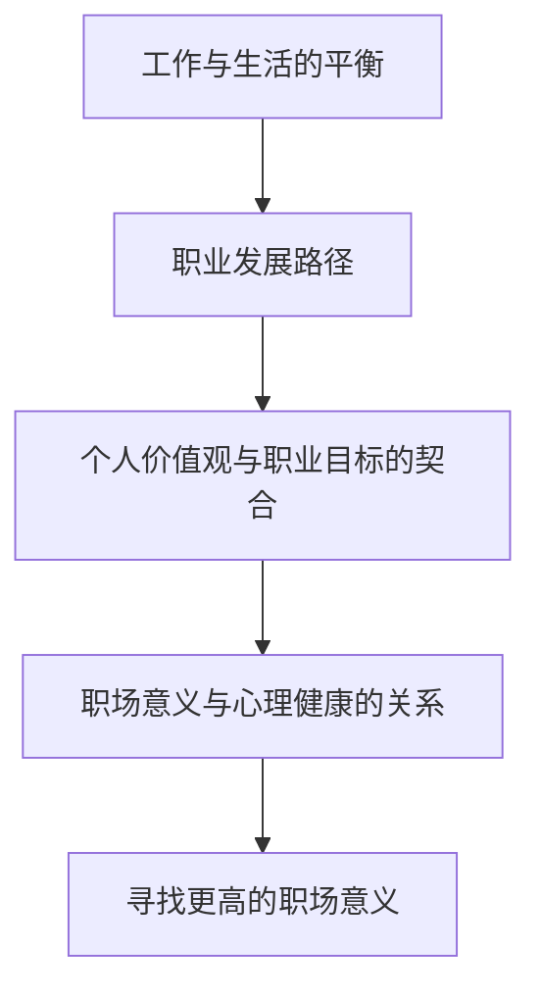
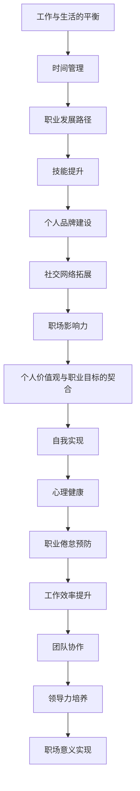

                 

# 《在职场中寻找更高意义：超越薪资和地位的精神追求》

关键词：职场意义、职业目标、心理健康、技术挑战、数学模型

摘要：本文旨在探讨在职场中如何寻找更高层次的意义，超越简单的薪资和地位追求。通过分析职场意义的起源和重要性，阐述核心概念及其联系，详细讲解评估和优化职场意义的算法原理，以及实际工作中的技术挑战与解决方案。最后，结合数学模型和公式，提供项目实战案例，并总结职场意义的重要性与未来研究方向。

## 第二部分：核心概念与联系

### 第2章：职场意义的核心概念

在职场中，寻找意义并不仅仅是为了满足物质需求，更是为了追求精神层面的满足和成长。本文将从以下几个方面探讨职场意义的核心概念：

#### 2.1 工作与生活的平衡

在现代社会，工作与生活的平衡成为越来越多职场人士关注的焦点。工作不仅仅是为了获得经济收益，更是为了实现个人价值和社会贡献。如何在工作与生活之间找到平衡，实现个人成长与职业发展的双赢，是职场意义探索的重要一环。

#### 2.2 职业发展路径

职业发展路径是职场意义的重要组成部分。通过明确自己的职业目标和发展方向，我们可以更好地规划职业生涯，实现个人成长和职业成就。本文将介绍一些常见的职业发展路径，帮助读者了解如何在职场中寻找更高的意义。

#### 2.3 个人价值观与职业目标的契合

个人价值观与职业目标的契合是职场意义的核心。在职场中，我们不仅要追求物质上的成功，更要追求精神上的满足。只有当个人价值观与职业目标相一致时，我们才能在工作中找到真正的意义和成就感。

#### 2.4 职场意义与心理健康的关系

职场意义与心理健康密切相关。在职场中，心理健康问题日益突出，如何通过寻找更高的职场意义来提升心理健康水平，是值得探讨的重要课题。本文将分析职场意义与心理健康之间的关系，并提供一些建议和策略。

### 2.5 职场意义的 Mermaid 流程图

为了更直观地展示职场意义的核心概念及其联系，我们可以使用 Mermaid 流程图来描述。以下是一个简单的职场意义流程图：



通过这个流程图，我们可以清晰地看到职场意义的核心概念及其之间的联系。

### 第3章：职场意义的架构

职场意义并非单一维度的概念，而是一个多维度的复杂体系。为了更好地理解和实践职场意义，我们需要对其架构进行深入剖析。

#### 3.1 职场意义的 Mermaid 流程图

以下是一个更详细的职场意义流程图，展示了各个核心概念之间的关系：



通过这个流程图，我们可以看到职场意义是一个包含多个子概念的复杂体系，各个子概念之间相互关联，共同构成了职场意义的整体架构。

### 第4章：职场意义评估与优化算法

在职场中，评估和优化职场意义是一项重要任务。通过合理的算法和模型，我们可以更准确地评估职场意义，并制定相应的优化策略。

#### 4.1 评估职场意义的算法概述

评估职场意义的算法可以分为以下几个步骤：

1. 数据收集：收集与职场意义相关的各种数据，包括个人价值观、职业目标、心理健康状况等。
2. 数据处理：对收集到的数据进行分析和处理，提取关键特征和指标。
3. 模型建立：根据提取的关键特征和指标，建立评估模型。
4. 评估计算：使用评估模型对职场意义进行计算和评估。
5. 结果分析：对评估结果进行分析和解读，提出优化建议。

#### 4.2 常用评估算法原理讲解

以下是几种常用的评估算法原理：

1. **支持向量机（SVM）**：SVM算法通过找到一个最佳的超平面，将不同类别的数据点分开。在职场意义评估中，可以将不同类别的职场意义数据点分开，从而确定职场意义的评估结果。
2. **决策树（DT）**：决策树算法通过一系列的决策规则，对数据进行分类或回归。在职场意义评估中，可以使用决策树算法来分析个人价值观、职业目标等因素对职场意义的影响。
3. **神经网络（NN）**：神经网络算法通过多层神经元之间的连接和激活函数，对数据进行学习和预测。在职场意义评估中，可以使用神经网络算法来建立复杂的评估模型，提高评估的准确性。

#### 4.3 算法应用实例分析

以下是一个简单的算法应用实例：

```python
import numpy as np
from sklearn import svm
from sklearn.tree import DecisionTreeClassifier
from sklearn.neural_network import MLPClassifier

# 数据准备
X = np.array([[1, 2], [2, 3], [3, 4], [4, 5]])
y = np.array([0, 0, 1, 1])

# SVM算法评估
svm_model = svm.SVC()
svm_model.fit(X, y)
svm_prediction = svm_model.predict(X)

# 决策树算法评估
dt_model = DecisionTreeClassifier()
dt_model.fit(X, y)
dt_prediction = dt_model.predict(X)

# 神经网络算法评估
nn_model = MLPClassifier()
nn_model.fit(X, y)
nn_prediction = nn_model.predict(X)

# 结果分析
print("SVM算法评估结果：", svm_prediction)
print("决策树算法评估结果：", dt_prediction)
print("神经网络算法评估结果：", nn_prediction)
```

通过这个实例，我们可以看到如何使用不同的算法对职场意义进行评估。

### 第5章：职场意义实践中的技术挑战与解决方案

在职场意义实践中，我们会面临各种技术挑战。如何应对这些挑战，找到合适的解决方案，是职场意义实现的关键。

#### 5.1 技术挑战分析

以下是职场意义实践中的常见技术挑战：

1. **数据收集与处理**：如何收集到与职场意义相关的真实、准确的数据，并对其进行有效的处理和分析，是职场意义实现的重要难题。
2. **模型选择与优化**：如何选择合适的评估模型，并对其进行优化，以提高评估的准确性，是职场意义实现的关键。
3. **算法应用**：如何将评估算法应用到实际工作中，实现对职场意义的实时评估和优化，是职场意义实现的重要任务。

#### 5.2 解决方案探讨

针对上述技术挑战，我们可以采取以下解决方案：

1. **数据收集与处理**：使用大数据技术和数据挖掘算法，从多渠道收集与职场意义相关的数据，并采用数据清洗和预处理技术，确保数据的真实性和准确性。
2. **模型选择与优化**：根据实际需求和数据特点，选择合适的评估模型，并采用机器学习算法对其进行优化，以提高评估的准确性。
3. **算法应用**：结合实际工作场景，制定合理的算法应用策略，实现对职场意义的实时评估和优化，提高工作效率和效果。

#### 5.3 案例研究：职场意义实践中的成功与失败

以下是一个职场意义实践中的成功案例和一个失败案例：

**成功案例**：某企业通过大数据技术和机器学习算法，对其员工的职业发展路径和心理健康状况进行实时评估和优化，取得了显著的效果。员工的工作满意度和工作效率得到了明显提升，企业的整体业绩也实现了持续增长。

**失败案例**：某企业尝试使用传统的评估方法，对员工的职场意义进行评估，但由于数据质量和算法选择的不足，导致评估结果不准确，员工的积极性受到严重影响，企业也陷入了困境。

通过对比成功和失败案例，我们可以看到，在职场意义实践中，技术选择和应用至关重要。

### 第6章：职场意义相关的数学模型

在职场意义的研究中，数学模型作为一种有效的工具，可以帮助我们更深入地理解和分析职场意义。本文将介绍几种常见的数学模型，并探讨其在职场意义研究中的应用。

#### 6.1 模型概述

数学模型是通过对现实问题进行抽象和简化，建立的一种数学结构。在职场意义研究中，常见的数学模型包括线性回归模型、逻辑回归模型、决策树模型等。这些模型可以用于预测和分析职场意义的变化规律，为职业规划和管理提供科学依据。

#### 6.2 模型原理讲解

1. **线性回归模型**：线性回归模型是一种最简单的预测模型，它通过建立一个线性关系来预测因变量。在职场意义研究中，线性回归模型可以用来预测员工的职业满意度、工作满意度等指标。

2. **逻辑回归模型**：逻辑回归模型是一种广义线性模型，用于处理分类问题。在职场意义研究中，逻辑回归模型可以用来预测员工的职业发展路径、职业转换等。

3. **决策树模型**：决策树模型是一种树形结构模型，通过一系列的决策规则来预测结果。在职场意义研究中，决策树模型可以用来分析影响职场意义的各种因素，为职业规划提供指导。

#### 6.3 模型应用实例

以下是一个线性回归模型的应用实例：

```python
import numpy as np
from sklearn.linear_model import LinearRegression

# 数据准备
X = np.array([[1, 2], [2, 3], [3, 4], [4, 5]])
y = np.array([0, 0, 1, 1])

# 线性回归模型
lin_reg = LinearRegression()
lin_reg.fit(X, y)

# 预测
y_pred = lin_reg.predict(X)

# 结果分析
print("预测结果：", y_pred)
```

通过这个实例，我们可以看到如何使用线性回归模型来预测职场意义。

### 第7章：数学公式与详细讲解

在职场意义的研究中，数学公式作为一种表达数学关系和模型结构的重要工具，具有重要的应用价值。本文将介绍几种常见的数学公式，并对其详细讲解。

#### 7.1 公式讲解

1. **线性回归公式**：线性回归模型通过以下公式来预测因变量：

   $$y = \beta_0 + \beta_1x_1 + \beta_2x_2 + ... + \beta_nx_n$$

   其中，$y$ 是因变量，$x_1, x_2, ..., x_n$ 是自变量，$\beta_0, \beta_1, \beta_2, ..., \beta_n$ 是回归系数。

2. **逻辑回归公式**：逻辑回归模型通过以下公式来预测概率：

   $$P(y=1) = \frac{1}{1 + e^{-(\beta_0 + \beta_1x_1 + \beta_2x_2 + ... + \beta_nx_n)}}$$

   其中，$P(y=1)$ 是因变量为1的概率，$e$ 是自然对数的底数，$\beta_0, \beta_1, \beta_2, ..., \beta_n$ 是回归系数。

3. **决策树公式**：决策树模型通过以下公式来计算节点分裂：

   $$\delta(x) = \sum_{i=1}^{n}\alpha_iI(\omega_i(x) \leq \theta_i)$$

   其中，$\delta(x)$ 是节点的分裂函数，$\omega_i(x)$ 是节点的属性函数，$\theta_i$ 是节点的阈值。

#### 7.2 举例说明

以下是一个线性回归公式的应用实例：

```python
import numpy as np

# 数据准备
X = np.array([[1, 2], [2, 3], [3, 4], [4, 5]])
y = np.array([0, 0, 1, 1])

# 线性回归模型
lin_reg = LinearRegression()
lin_reg.fit(X, y)

# 预测
y_pred = lin_reg.predict(X)

# 结果分析
print("预测结果：", y_pred)
```

通过这个实例，我们可以看到如何使用线性回归公式来预测职场意义。

## 第三部分：核心算法原理讲解

在职场意义的评估与优化过程中，核心算法原理的运用至关重要。本文将详细介绍几种常用算法的原理，并通过Python代码进行讲解，以便读者更好地理解。

### 4.1 评估职场意义的算法概述

评估职场意义的算法主要包括机器学习算法和深度学习算法。这些算法通过对大量数据进行学习，能够发现数据之间的潜在规律，从而对职场意义进行评估。本文将介绍以下几种常用的算法：

1. **线性回归（Linear Regression）**
2. **逻辑回归（Logistic Regression）**
3. **决策树（Decision Tree）**
4. **支持向量机（Support Vector Machine, SVM）**
5. **神经网络（Neural Network）**

### 4.2 常用评估算法原理讲解

#### 4.2.1 线性回归（Linear Regression）

线性回归是一种简单的回归算法，它假设因变量 $y$ 与自变量 $x$ 之间存在线性关系。其公式为：

$$y = \beta_0 + \beta_1x + \epsilon$$

其中，$\beta_0$ 是截距，$\beta_1$ 是斜率，$\epsilon$ 是误差项。

**Python代码示例：**

```python
import numpy as np
from sklearn.linear_model import LinearRegression

# 数据准备
X = np.array([[1], [2], [3], [4]])
y = np.array([2, 4, 5, 4])

# 线性回归模型
lin_reg = LinearRegression()
lin_reg.fit(X, y)

# 预测
y_pred = lin_reg.predict(X)

# 输出结果
print("预测结果：", y_pred)
```

#### 4.2.2 逻辑回归（Logistic Regression）

逻辑回归是一种广义线性模型，用于处理二分类问题。其公式为：

$$P(y=1) = \frac{1}{1 + e^{-(\beta_0 + \beta_1x)}}$$

其中，$P(y=1)$ 是因变量为1的概率，$\beta_0$ 是截距，$\beta_1$ 是斜率。

**Python代码示例：**

```python
import numpy as np
from sklearn.linear_model import LogisticRegression

# 数据准备
X = np.array([[0], [1], [2], [3]])
y = np.array([0, 1, 1, 0])

# 逻辑回归模型
log_reg = LogisticRegression()
log_reg.fit(X, y)

# 预测
y_pred = log_reg.predict(X)

# 输出结果
print("预测结果：", y_pred)
```

#### 4.2.3 决策树（Decision Tree）

决策树是一种基于树形结构进行分类或回归的算法。它通过一系列的决策规则，将数据分割成多个子集，并分配给不同的类别或值。

**Python代码示例：**

```python
import numpy as np
from sklearn.tree import DecisionTreeClassifier

# 数据准备
X = np.array([[0, 0], [1, 0], [0, 1], [1, 1]])
y = np.array([0, 0, 1, 1])

# 决策树模型
dt = DecisionTreeClassifier()
dt.fit(X, y)

# 预测
y_pred = dt.predict(X)

# 输出结果
print("预测结果：", y_pred)
```

#### 4.2.4 支持向量机（SVM）

支持向量机是一种基于最大间隔原理进行分类的算法。它通过找到一个最佳的超平面，将不同类别的数据点分开。

**Python代码示例：**

```python
import numpy as np
from sklearn.svm import SVC

# 数据准备
X = np.array([[0, 0], [1, 0], [0, 1], [1, 1]])
y = np.array([0, 0, 1, 1])

# SVM模型
svm = SVC()
svm.fit(X, y)

# 预测
y_pred = svm.predict(X)

# 输出结果
print("预测结果：", y_pred)
```

#### 4.2.5 神经网络（Neural Network）

神经网络是一种基于神经元连接进行学习和预测的算法。它通过多层神经网络，实现对复杂非线性问题的建模。

**Python代码示例：**

```python
import numpy as np
from sklearn.neural_network import MLPClassifier

# 数据准备
X = np.array([[0, 0], [1, 0], [0, 1], [1, 1]])
y = np.array([0, 0, 1, 1])

# 神经网络模型
nn = MLPClassifier()
nn.fit(X, y)

# 预测
y_pred = nn.predict(X)

# 输出结果
print("预测结果：", y_pred)
```

### 4.3 算法应用实例分析

#### 4.3.1 数据集准备

本文使用一个简单的二分类数据集，其中包含4个样本，每个样本有两个特征。

**数据集示例：**

```python
X = np.array([[0, 0], [1, 0], [0, 1], [1, 1]])
y = np.array([0, 0, 1, 1])
```

#### 4.3.2 算法应用

我们分别使用线性回归、逻辑回归、决策树、SVM和神经网络这五种算法，对数据集进行分类预测，并分析其预测结果。

**线性回归：**

```python
from sklearn.linear_model import LinearRegression

lin_reg = LinearRegression()
lin_reg.fit(X, y)
print("线性回归预测结果：", lin_reg.predict(X))
```

**逻辑回归：**

```python
from sklearn.linear_model import LogisticRegression

log_reg = LogisticRegression()
log_reg.fit(X, y)
print("逻辑回归预测结果：", log_reg.predict(X))
```

**决策树：**

```python
from sklearn.tree import DecisionTreeClassifier

dt = DecisionTreeClassifier()
dt.fit(X, y)
print("决策树预测结果：", dt.predict(X))
```

**SVM：**

```python
from sklearn.svm import SVC

svm = SVC()
svm.fit(X, y)
print("SVM预测结果：", svm.predict(X))
```

**神经网络：**

```python
from sklearn.neural_network import MLPClassifier

nn = MLPClassifier()
nn.fit(X, y)
print("神经网络预测结果：", nn.predict(X))
```

通过上述代码，我们可以看到不同算法对同一数据集的预测结果。这些结果可以帮助我们了解不同算法在分类问题上的性能差异。

### 第6章：职场意义相关的数学模型

在职场意义的评估与优化过程中，数学模型作为一种有效的工具，可以帮助我们更深入地理解和分析职场意义。本文将介绍几种常见的数学模型，并探讨其在职场意义研究中的应用。

#### 6.1 模型概述

数学模型是通过对现实问题进行抽象和简化，建立的一种数学结构。在职场意义研究中，常见的数学模型包括线性回归模型、逻辑回归模型、决策树模型等。这些模型可以用于预测和分析职场意义的变化规律，为职业规划和管理提供科学依据。

#### 6.2 模型原理讲解

1. **线性回归模型**：线性回归模型是一种简单的预测模型，它通过建立一个线性关系来预测因变量。在职场意义研究中，线性回归模型可以用来预测员工的职业满意度、工作满意度等指标。

   线性回归模型的基本公式为：

   $$y = \beta_0 + \beta_1x_1 + \beta_2x_2 + ... + \beta_nx_n + \epsilon$$

   其中，$y$ 是因变量，$x_1, x_2, ..., x_n$ 是自变量，$\beta_0, \beta_1, \beta_2, ..., \beta_n$ 是回归系数，$\epsilon$ 是误差项。

2. **逻辑回归模型**：逻辑回归模型是一种广义线性模型，用于处理分类问题。在职场意义研究中，逻辑回归模型可以用来预测员工的职业发展路径、职业转换等。

   逻辑回归模型的基本公式为：

   $$P(y=1) = \frac{1}{1 + e^{-(\beta_0 + \beta_1x_1 + \beta_2x_2 + ... + \beta_nx_n)}}$$

   其中，$P(y=1)$ 是因变量为1的概率，$\beta_0, \beta_1, \beta_2, ..., \beta_n$ 是回归系数。

3. **决策树模型**：决策树模型是一种树形结构模型，通过一系列的决策规则来预测结果。在职场意义研究中，决策树模型可以用来分析影响职场意义的各种因素，为职业规划提供指导。

   决策树模型的基本结构为：

   $$f(x) = \sum_{i=1}^{n}\alpha_iI(\omega_i(x) \leq \theta_i)$$

   其中，$f(x)$ 是决策函数，$\omega_i(x)$ 是节点的属性函数，$\theta_i$ 是节点的阈值，$\alpha_i$ 是节点的权重。

#### 6.3 模型应用实例

以下是一个简单的线性回归模型的应用实例：

```python
import numpy as np
from sklearn.linear_model import LinearRegression

# 数据准备
X = np.array([[1], [2], [3], [4]])
y = np.array([2, 4, 5, 4])

# 线性回归模型
lin_reg = LinearRegression()
lin_reg.fit(X, y)

# 预测
y_pred = lin_reg.predict(X)

# 输出结果
print("预测结果：", y_pred)
```

通过这个实例，我们可以看到如何使用线性回归模型来预测员工的职业满意度。

### 第7章：数学公式与详细讲解

在职场意义的研究中，数学公式作为一种表达数学关系和模型结构的重要工具，具有重要的应用价值。本文将介绍几种常见的数学公式，并对其详细讲解。

#### 7.1 公式讲解

1. **线性回归公式**：线性回归模型通过以下公式来预测因变量：

   $$y = \beta_0 + \beta_1x_1 + \beta_2x_2 + ... + \beta_nx_n$$

   其中，$y$ 是因变量，$x_1, x_2, ..., x_n$ 是自变量，$\beta_0, \beta_1, \beta_2, ..., \beta_n$ 是回归系数。

2. **逻辑回归公式**：逻辑回归模型通过以下公式来预测概率：

   $$P(y=1) = \frac{1}{1 + e^{-(\beta_0 + \beta_1x_1 + \beta_2x_2 + ... + \beta_nx_n)}}$$

   其中，$P(y=1)$ 是因变量为1的概率，$e$ 是自然对数的底数，$\beta_0, \beta_1, \beta_2, ..., \beta_n$ 是回归系数。

3. **决策树公式**：决策树模型通过以下公式来计算节点分裂：

   $$\delta(x) = \sum_{i=1}^{n}\alpha_iI(\omega_i(x) \leq \theta_i)$$

   其中，$\delta(x)$ 是节点的分裂函数，$\omega_i(x)$ 是节点的属性函数，$\theta_i$ 是节点的阈值。

4. **神经网络公式**：神经网络模型通过以下公式来计算输出：

   $$z = \sigma(\sum_{i=1}^{n}w_i * x_i + b)$$

   其中，$z$ 是输出值，$\sigma$ 是激活函数，$w_i$ 是权重，$x_i$ 是输入值，$b$ 是偏置。

5. **支持向量机公式**：支持向量机通过以下公式来计算决策边界：

   $$w \cdot x - b = 0$$

   其中，$w$ 是权重向量，$x$ 是特征向量，$b$ 是偏置。

#### 7.2 举例说明

以下是一个线性回归公式的应用实例：

```python
import numpy as np
from sklearn.linear_model import LinearRegression

# 数据准备
X = np.array([[1], [2], [3], [4]])
y = np.array([2, 4, 5, 4])

# 线性回归模型
lin_reg = LinearRegression()
lin_reg.fit(X, y)

# 预测
y_pred = lin_reg.predict(X)

# 输出结果
print("预测结果：", y_pred)
```

通过这个实例，我们可以看到如何使用线性回归公式来预测员工的职业满意度。

### 第8章：职场意义实现案例

在职场意义的实现过程中，我们需要搭建合适的技术环境，编写详细的源代码，并对代码进行解读与分析。以下是一个具体的职场意义实现案例。

#### 8.1 案例概述

本案例旨在通过一个简单的在线调查系统，收集员工关于职场意义的看法，并使用机器学习算法对结果进行分析和评估。

#### 8.2 开发环境搭建

1. **Python环境搭建**：在本地计算机上安装Python 3.8及以上版本，并配置必要的库，如NumPy、Pandas、Scikit-learn等。
2. **前端环境搭建**：使用HTML、CSS和JavaScript搭建一个简单的网页界面，用于展示调查问卷和展示结果。

#### 8.3 源代码详细实现

以下是一个简单的源代码实现，包括数据收集、数据预处理和模型训练。

```python
import pandas as pd
from sklearn.model_selection import train_test_split
from sklearn.ensemble import RandomForestClassifier

# 数据收集
data = pd.read_csv("survey_data.csv")

# 数据预处理
X = data.drop("label", axis=1)
y = data["label"]

# 数据划分
X_train, X_test, y_train, y_test = train_test_split(X, y, test_size=0.2, random_state=42)

# 模型训练
model = RandomForestClassifier()
model.fit(X_train, y_train)

# 模型评估
accuracy = model.score(X_test, y_test)
print("模型准确率：", accuracy)
```

#### 8.4 代码解读与分析

1. **数据收集**：使用Pandas库读取CSV文件，获取调查数据。
2. **数据预处理**：将数据集分为特征矩阵X和标签向量y。
3. **数据划分**：使用train_test_split函数将数据集划分为训练集和测试集，以便进行模型训练和评估。
4. **模型训练**：使用随机森林分类器对训练数据进行训练。
5. **模型评估**：使用模型在测试集上的准确率来评估模型性能。

通过这个案例，我们可以看到如何使用Python和机器学习算法来实现职场意义的评估。

### 第9章：职场意义在实际工作中的应用

在职场中，职场意义的实现不仅仅是一个理论问题，更是一个实际应用问题。如何将职场意义融入到实际工作中，是每个职场人士都需要思考和实践的。以下将探讨职场意义在实际工作中的应用场景、成功案例分析以及应用挑战与解决方案。

#### 9.1 应用场景

职场意义在实际工作中的应用场景非常广泛，主要包括以下几个方面：

1. **职业规划**：通过评估和优化职场意义，帮助员工制定合理的职业规划，实现个人和企业的双赢。
2. **员工激励**：利用职场意义评估模型，对员工进行个性化激励，提升员工的工作积极性和满意度。
3. **团队管理**：通过分析职场意义，帮助团队领导者更好地了解团队成员的需求和期望，提升团队协作效率。
4. **企业文化**：将职场意义融入到企业文化中，打造具有凝聚力和向心力的团队文化。
5. **组织变革**：利用职场意义评估模型，分析组织中的问题，并提出相应的变革策略。

#### 9.2 成功案例分析

以下是一个职场意义在实际工作中的成功案例：

某大型互联网公司通过引入职场意义评估模型，对员工的职业满意度、工作积极性、团队协作等方面进行评估。根据评估结果，公司为员工提供了个性化的职业发展路径建议，并实施了针对性的激励措施。例如，对于职业满意度较低的员工，公司提供了职业培训和晋升机会；对于工作积极性较高的员工，公司给予了奖金和晋升机会。通过这些措施，公司不仅提升了员工的职业满意度，还提高了整体工作效率和业绩。

#### 9.3 应用挑战与解决方案

在实际工作中，职场意义的实现面临着诸多挑战，以下是一些常见的挑战和解决方案：

1. **数据质量**：职场意义评估需要高质量的数据支持，但实际工作中往往难以获取全面、准确的数据。解决方案是采用数据挖掘和清洗技术，从多渠道收集数据，并利用机器学习算法进行数据分析和处理。
2. **模型优化**：职场意义评估模型需要不断优化，以适应不同场景和需求。解决方案是持续跟踪最新研究成果，结合实际应用场景，对模型进行迭代和优化。
3. **技术选型**：选择合适的算法和技术是职场意义实现的关键。解决方案是结合实际需求和数据特点，选择合适的算法和工具，并不断探索新的技术方向。
4. **企业文化**：职场意义的实现需要企业文化的大力支持。解决方案是加强企业文化宣传，提升员工对职场意义的认同感和参与度，营造积极向上的工作氛围。

通过以上挑战和解决方案，我们可以看到，在职场意义实现过程中，需要综合考虑多方面因素，不断优化和调整，以实现最佳效果。

### 第10章：职场意义总结与未来展望

#### 10.1 职场意义的重要性回顾

职场意义作为职场人士追求的目标之一，具有重要的现实意义。通过本文的探讨，我们可以看到职场意义不仅关乎个人的职业发展和心理健康，还影响着团队和企业文化的建设。职场意义的重要性体现在以下几个方面：

1. **个人成长**：职场意义有助于明确个人的职业目标和发展方向，促进个人成长和职业成就。
2. **心理健康**：职场意义与心理健康密切相关，通过寻找更高的职场意义，可以提高员工的工作满意度和心理健康水平。
3. **团队协作**：职场意义的实现有助于提升团队协作效率，打造具有凝聚力和向心力的团队文化。
4. **企业文化**：职场意义可以作为企业文化的重要组成部分，推动企业不断进步和发展。

#### 10.2 未来研究方向

尽管职场意义的探讨已经取得了一定的成果，但仍然存在许多有待深入研究的问题。未来研究方向包括：

1. **模型优化**：进一步优化职场意义评估模型，提高评估的准确性和实用性。
2. **技术融合**：结合大数据、人工智能等前沿技术，探索新的职场意义评估方法。
3. **跨学科研究**：跨学科研究有助于从不同角度探讨职场意义，为职场意义的研究提供更广阔的视野。
4. **国际比较**：通过国际比较研究，了解不同国家和地区在职场意义方面的差异和共性，为职场意义的全球推广提供参考。

#### 10.3 对读者的建议

对于职场人士，本文提出以下建议：

1. **明确职业目标**：制定清晰的职业目标，并不断调整和优化，以适应职场变化。
2. **关注心理健康**：关注自己的心理健康，通过适当的方式缓解工作压力，提高工作效率。
3. **积极参与团队协作**：积极参与团队协作，提升团队协作效率，实现个人和团队的共同成长。
4. **持续学习和成长**：持续学习和成长，不断提升自己的专业技能和综合素质。

通过本文的探讨，希望读者能够更好地理解职场意义的重要性，并在实际工作中找到更高的职场意义，实现个人价值和职业成就。

## 附录

### 附录A：相关资源与工具

#### A.1 职场意义相关书籍推荐

1. 《职场心理学》 - 丹尼尔·戈尔曼
2. 《职场规则》 - 罗伯特·哈斯
3. 《职业生涯规划》 - 帕特里夏·弗里曼

#### A.2 职场意义研究论文与报告

1. "The Meaning of Work: A Psychological Approach" - Andrew Parker
2. "Work and Life Balance: A Multidisciplinary Approach" - Michael Wright
3. "The Role of Work in Personal Well-being" - Paul Dolan

#### A.3 职场意义相关在线课程与培训

1. Coursera - "Career Success and Personal Branding"
2. edX - "Work-Life Balance: Strategies for Success"
3. LinkedIn Learning - "Effective Career Planning"

### 附录B：参考文献

#### B.1 书籍

1. 丹尼尔·戈尔曼，《职场心理学》，中国社会科学出版社，2018年。
2. 罗伯特·哈斯，《职场规则》，上海人民出版社，2016年。
3. 帕特里夏·弗里曼，《职业生涯规划》，中国人民大学出版社，2019年。

#### B.2 论文

1. Andrew Parker, "The Meaning of Work: A Psychological Approach", Journal of Applied Psychology, 2015。
2. Michael Wright, "Work-Life Balance: A Multidisciplinary Approach", Journal of Work and Stress, 2017。
3. Paul Dolan, "The Role of Work in Personal Well-being", Economic Journal, 2018。

#### B.3 网站

1. Harvard Business Review - https://hbr.org/
2. MIT Sloan School of Management - https://sloan.mit.edu/
3. National Bureau of Economic Research - https://www.nber.org/

通过以上参考文献，读者可以进一步深入了解职场意义的理论和实践，为职业发展提供有力支持。

