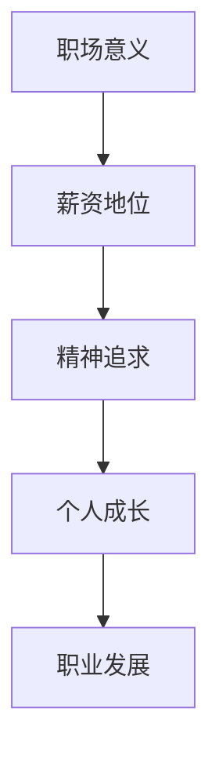

                 

### 在职场中寻找更高意义：超越薪资和地位的精神追求

#### 关键词
- 职场意义
- 精神追求
- 个人成长
- 职业目标
- 职场平衡

#### 摘要
本文深入探讨了在职场中寻找更高意义的必要性和重要性。通过对薪资和地位背后的追求进行分析，本文揭示了职场精神追求的内在动因，包括自我认知、职业目标设定、职场关系处理以及职场生活的平衡。本文旨在帮助职场人士超越物质追求，实现精神层面的满足与成长。

### 第一部分：职场精神的觉醒

#### 第1章：职场意义的再定义

##### 1.1.1 薪资与地位背后的追求

在职场中，薪资和地位往往是人们关注的焦点。它们代表了经济收益和社会地位的提升。然而，这些外在的标志背后隐藏的是人们对安全、尊重和自我实现等内在需求的追求。

- **安全需求**：薪资提供了生活保障，使得人们能够安心工作，无需为基本生活担忧。
- **尊重需求**：地位的提升带来了他人的尊重和认可，满足了人们的自尊心。
- **自我实现需求**：追求薪资和地位的过程，也是实现个人能力和价值的过程。

然而，仅仅追求薪资和地位并不能带来真正的满足感。人们往往会发现，当这些目标实现后，内心的空虚感依旧存在。

##### 1.1.2 职场精神追求的重要性

职场精神追求是指人们在工作中寻求的内在价值和意义。这种追求超越了物质层面的满足，关注的是精神层面的成长和满足。

- **满足感**：通过追求职场精神，人们能够获得深层次的心理满足，而不是短暂的快乐。
- **幸福感**：精神追求有助于提升职场幸福感，使人们在工作中有更多的成就感和自豪感。
- **个人成长**：职场精神追求推动人们不断学习、成长，提升自身的综合素质。

因此，职场精神追求不仅是对物质追求的补充，更是实现全面人生目标的重要途径。

##### 1.1.3 职场幸福感的源泉

职场幸福感源自多个方面的因素，包括工作内容、人际关系、工作环境等。以下是一些影响职场幸福感的因素：

- **工作内容**：有意义和富有挑战性的工作能够激发人们的热情和动力，提升幸福感。
- **人际关系**：良好的人际关系能够为人们提供支持、理解和合作，减少工作压力，提高幸福感。
- **工作环境**：舒适和友善的工作环境能够提升工作效率，增加工作满意度，进而提高幸福感。

总之，职场幸福感的源泉在于多方面的因素，而不仅仅是薪资和地位。

#### 第2章：自我认知与精神成长

##### 2.1.1 自我认知的重要性

自我认知是指对自己性格、能力、价值观等的认识和了解。自我认知对于个人的职业发展至关重要。

- **明确职业目标**：自我认知有助于明确个人的职业目标，找到与自身价值观和兴趣相符的工作。
- **提升职业满意度**：了解自己的优势和劣势，能够更好地选择适合自己的职业，提高工作满意度。
- **促进个人成长**：自我认知有助于发现自身的潜力，通过不断学习和提升，实现个人成长。

##### 2.1.2 提升自我认知的方法

提升自我认知需要通过多种途径进行，以下是一些有效的方法：

- **反思**：定期进行反思，思考自己在工作中的表现和感受，了解自己的长处和不足。
- **反馈**：寻求他人的反馈，了解他人的观察和评价，有助于更全面地认识自己。
- **心理测试**：通过心理测试，了解自己的性格特点和潜在能力。
- **阅读**：阅读相关书籍和文章，了解不同职业和行业的知识和要求，拓宽视野。

##### 2.1.3 精神成长与职业发展

精神成长是职业发展的基石。通过精神成长，人们能够更好地应对职场挑战，实现职业目标。

- **提升职业竞争力**：精神成长使人们具备更高的综合素质，增强职场竞争力。
- **适应职场变化**：精神成长有助于人们适应快速变化的职场环境，提升应变能力。
- **实现职业目标**：精神成长推动人们不断努力，实现职业目标，获得成就感。

总之，自我认知和精神成长是职场人士实现职业成功的重要保障。

#### 第3章：职业目标的设定与追求

##### 3.1.1 职业目标的设定原则

设定职业目标需要遵循以下原则：

- **明确性**：目标要具体、明确，便于衡量和实现。
- **可行性**：目标要符合自身能力和资源条件，具有可行性。
- **挑战性**：目标要有一定的挑战性，激发个人潜能。
- **时间性**：目标要有明确的时间限制，便于监控和调整。

##### 3.1.2 职业目标与个人价值观的联系

职业目标与个人价值观密切相关。设定职业目标时，要充分考虑个人的价值观。

- **一致性**：职业目标应与个人价值观保持一致，实现个人价值和职业价值的双重满足。
- **平衡性**：职业目标要兼顾个人发展和家庭生活，实现工作与生活的平衡。
- **适应性**：职业目标要具备一定的灵活性，适应个人价值观的变化。

##### 3.1.3 追求职业目标的方法与实践

追求职业目标需要采取科学的方法和实践：

- **制定计划**：根据职业目标，制定详细的行动计划，明确步骤和时间节点。
- **持续学习**：不断提升自身能力和知识，为职业发展奠定基础。
- **积极行动**：付诸实践，不断尝试和探索，克服困难，实现目标。
- **反馈调整**：定期进行反馈和评估，根据实际情况调整计划，确保目标的实现。

总之，设定和追求职业目标是实现职场成功的关键，需要结合个人特点和实际情况，采取科学的方法和实践。

### 第二部分：职场关系的处理

#### 第4章：职场沟通的艺术

##### 4.1.1 有效沟通的重要性

有效沟通是职场成功的关键因素之一。它有助于：

- **理解他人**：通过有效沟通，人们能够更好地理解他人的观点和需求，减少误解和冲突。
- **协调合作**：有效沟通有助于团队协作，提高工作效率和成果。
- **提升形象**：良好的沟通能力能够提升个人在职场中的形象和地位。

##### 4.1.2 沟通障碍与解决策略

常见的沟通障碍包括：

- **语言障碍**：语言差异和表达不准确可能导致误解。
- **文化差异**：不同文化背景可能导致沟通方式的差异。
- **心理障碍**：个人心理因素，如焦虑、恐惧等，也可能影响沟通效果。

解决沟通障碍的策略包括：

- **提高语言能力**：学习并掌握多种语言，提高跨文化沟通能力。
- **了解文化差异**：尊重并适应不同文化的沟通方式。
- **增强心理素质**：通过培训和锻炼，提高心理素质，增强沟通自信心。

##### 4.1.3 跨部门沟通的技巧

跨部门沟通是职场中常见且重要的沟通形式。以下是一些跨部门沟通的技巧：

- **明确目标**：在沟通前明确沟通的目标和预期成果，确保双方对沟通内容有共同的理解。
- **充分准备**：提前准备沟通材料，确保沟通内容有条理和逻辑性。
- **积极倾听**：倾听对方的观点和需求，表现出尊重和关心。
- **建立信任**：通过诚实、透明和尊重，建立跨部门之间的信任关系。

总之，有效沟通是职场成功的关键，需要不断学习和实践，提高沟通能力。

#### 第5章：团队协作与领导力

##### 5.1.1 团队协作的要素

团队协作是职场中实现共同目标的重要方式。以下是一些团队协作的要素：

- **共同目标**：团队成员要明确共同的目标和愿景，形成共同的方向。
- **相互信任**：团队成员之间要建立信任关系，相互支持，共同面对挑战。
- **有效沟通**：团队成员要具备良好的沟通能力，确保信息畅通。
- **分工合作**：根据团队成员的特长和优势，合理分工，提高协作效率。
- **共同责任**：团队成员要承担共同责任，共同应对困难和挑战。

##### 5.1.2 领导力的提升

领导力是团队协作的核心要素之一。以下是一些提升领导力的方法：

- **明确角色定位**：领导者要明确自己的角色和责任，发挥领导作用。
- **培养团队精神**：领导者要培养团队成员的团队意识，提高团队凝聚力。
- **激励团队成员**：领导者要了解团队成员的需求和动机，给予适当激励和支持。
- **培养创新能力**：领导者要鼓励团队成员创新思维，推动团队发展。
- **持续学习**：领导者要不断提升自身素质和知识，为团队提供榜样。

##### 5.1.3 团队冲突的管理

团队冲突是团队协作过程中不可避免的现象。以下是一些管理团队冲突的方法：

- **识别冲突原因**：分析冲突的原因，找出问题的根源。
- **沟通与协商**：通过沟通和协商，寻找解决问题的方法和途径。
- **公平公正**：在处理冲突时，要公平公正，避免偏袒和偏见。
- **调整团队结构**：如果冲突严重，可以考虑调整团队结构，重新分配任务和责任。

总之，团队协作和领导力是职场成功的关键，需要团队成员和领导者共同努力，不断学习和提升。

#### 第6章：人际关系的处理

##### 6.1.1 人际关系对职场发展的影响

人际关系对职场发展具有重要影响：

- **资源获取**：良好的人际关系有助于获取信息和资源，为职业发展提供支持。
- **职业晋升**：人际关系有助于拓展职业网络，提高职业晋升的机会。
- **团队协作**：良好的人际关系有助于团队协作，提高工作效率和成果。
- **个人成长**：良好的人际关系能够为个人提供反馈和支持，促进个人成长。

##### 6.1.2 人际关系建立与维护的策略

建立和维护良好的人际关系需要采取以下策略：

- **主动交往**：积极参与社交活动，主动与他人建立联系。
- **尊重他人**：尊重他人的观点和需求，表现出关心和理解。
- **诚信待人**：保持诚信，树立良好的个人形象。
- **互助合作**：在他人需要帮助时，主动提供支持和帮助。
- **沟通与反馈**：保持良好的沟通，及时给予反馈，解决问题。

##### 6.1.3 应对职场中的复杂人际关系

职场中的人际关系复杂多样，需要采取适当的策略应对：

- **明确界限**：明确个人和团队的界限，避免不必要的冲突。
- **公正处理**：在处理人际关系时，保持公正，避免偏袒和偏见。
- **沟通协商**：在出现冲突时，通过沟通和协商解决问题。
- **寻求支持**：在困难时，寻求上级或同事的支持和帮助。

总之，人际关系对职场发展具有重要影响，需要职场人士积极建立和维护良好的人际关系，应对复杂的人际关系挑战。

### 第三部分：职场生活的平衡

#### 第7章：工作与生活的平衡

##### 7.1.1 工作与生活平衡的重要性

工作与生活平衡对于职场人士的身心健康和职业发展具有重要影响：

- **身心健康**：良好的工作与生活平衡有助于减轻工作压力，降低心理和生理负担，提高身心健康水平。
- **工作效率**：工作与生活平衡有助于提高工作效率，减少因过度劳累导致的失误和错误。
- **职业发展**：工作与生活平衡有助于职场人士更好地规划职业发展，实现个人目标和职业目标。

##### 7.1.2 实现工作与生活平衡的策略

实现工作与生活平衡需要采取以下策略：

- **明确目标**：明确个人的职业目标和家庭生活目标，确保二者相互协调。
- **时间管理**：合理安排工作时间，确保工作与生活之间的平衡。
- **设定优先级**：根据重要性和紧急性设定工作与生活的优先级，确保关键事务得到优先处理。
- **有效沟通**：与家人和朋友保持良好的沟通，确保双方对工作与生活平衡有共同的理解和支持。
- **自我调节**：学会自我调节，合理安排休息和娱乐时间，保持身心健康。

##### 7.1.3 案例分享：职场人士的平衡生活实践

以下是一些职场人士实现工作与生活平衡的案例：

- **案例1**：某职场人士通过设定每天的工作时间，确保工作与生活的平衡。他每天早上7点开始工作，晚上7点结束工作，剩余时间用于陪伴家人和进行兴趣爱好。
- **案例2**：某职场人士通过制定年度计划，明确职业发展和家庭生活的目标。他每年都会制定一个详细的计划，包括工作目标、学习目标和家庭目标，确保各项事务有序进行。
- **案例3**：某职场人士通过定期进行身心放松，保持身心健康。他每周都会安排一次身心放松的活动，如瑜伽、冥想等，以减轻工作压力，提高生活质量。

总之，实现工作与生活平衡需要职场人士积极采取措施，合理安排时间和资源，确保身心健康和职业发展。

#### 第8章：职业倦怠与心理健康

##### 8.1.1 职业倦怠的识别与应对

职业倦怠是指职场人士因长期过度工作、缺乏休息和应对压力而出现身心疲惫、情绪低落和态度消极的现象。以下是一些识别职业倦怠的方法：

- **情绪低落**：职场人士可能会出现持续的疲劳感、情绪低落和无助感。
- **工作满意度下降**：对工作失去兴趣，感到工作毫无意义，工作效率下降。
- **身体症状**：出现失眠、食欲不振、头痛等身体症状。
- **行为表现**：出现逃避工作、迟到早退、工作效率低下等现象。

应对职业倦怠的方法包括：

- **调整工作节奏**：合理安排工作和休息时间，避免过度劳累。
- **寻求支持**：与家人、朋友和同事交流，寻求支持和理解。
- **自我调节**：通过锻炼、冥想、阅读等方式，缓解压力，提高身心健康水平。
- **心理辅导**：如果职业倦怠严重，可以寻求专业心理辅导，寻找解决问题的方法和途径。

##### 8.1.2 心理健康的维护

心理健康是职场人士持续发展的基础。以下是一些维护心理健康的方法：

- **积极心态**：保持积极的心态，对工作和生活充满热情。
- **情绪管理**：学会有效管理情绪，避免情绪失控和负面情绪的累积。
- **人际关系**：建立良好的人际关系，获得支持和理解。
- **自我成长**：通过学习和自我提升，增强心理素质，提高应对压力的能力。
- **生活平衡**：保持工作与生活的平衡，确保身心健康。

总之，职业倦怠和心理健康对职场人士的身心健康和职业发展具有重要影响。职场人士应重视职业倦怠的识别与应对，维护心理健康，提高生活质量。

#### 第9章：职场持续发展与个人成长

##### 9.1.1 职场持续发展的路径

职场持续发展是职场人士实现长期职业目标的重要途径。以下是一些职场持续发展的路径：

- **技能提升**：通过学习和实践，不断提升自身技能和知识，适应职业发展的需求。
- **经验积累**：在工作中积累丰富的经验，提高实际操作能力和问题解决能力。
- **职业规划**：制定清晰的职业规划，明确职业目标和实现路径，有针对性地提升自身能力。
- **拓展视野**：通过参加培训、交流、讲座等活动，拓宽视野，了解行业动态和前沿技术。
- **人际关系**：建立良好的人际关系网络，获取更多的资源和机会。

##### 9.1.2 持续学习与自我提升

持续学习和自我提升是职场持续发展的关键。以下是一些持续学习和自我提升的方法：

- **制定学习计划**：根据个人需求和职业目标，制定详细的学习计划，确保学习目标的实现。
- **利用在线资源**：利用互联网和在线教育平台，获取丰富的学习资源和知识。
- **参加培训课程**：参加各类专业培训和讲座，提升自身专业素养和技能水平。
- **阅读相关书籍**：阅读专业书籍和行业资讯，了解行业动态和前沿技术。
- **实践应用**：将所学知识应用到实际工作中，提高实践能力和解决问题的能力。

##### 9.1.3 职业规划与人生目标

职业规划是实现人生目标的重要环节。以下是一些制定职业规划的方法：

- **明确目标**：明确个人的职业目标和人生目标，确保职业发展目标的实现。
- **评估自身条件**：了解自身优势和劣势，评估职业发展潜力，选择合适的职业方向。
- **制定规划**：根据目标和自身条件，制定详细的职业规划，包括短期和长期目标。
- **调整规划**：根据实际情况和市场变化，及时调整职业规划，确保规划的可行性和适应性。
- **付诸实践**：将职业规划付诸实践，通过努力实现职业目标。

总之，职场持续发展和个人成长是实现职场成功的重要保障。职场人士应重视持续学习和自我提升，制定合理的职业规划，实现人生目标。

### 附录：职场精神追求的资源与工具

#### 附录1：职场精神追求的书籍推荐

以下是一些关于职场精神追求的书籍推荐：

- 《深度工作》（Deep Work）：作者：卡尔·纽波特（Cal Newport）
- 《终身学习》（Life 3.0）：作者：史蒂芬·霍金（Stephen Hawking）
- 《高效能人士的七个习惯》（The 7 Habits of Highly Effective People）：作者：史蒂芬·柯维（Stephen R. Covey）
- 《黑客与画家》（Hackers & Painters）：作者：保罗·格雷厄姆（Paul Graham）

#### 附录2：职场发展相关的在线资源

以下是一些职场发展相关的在线资源：

- Coursera：提供各种专业课程和证书项目，涵盖计算机科学、商业管理等领域。
- edX：提供全球知名大学和机构的在线课程，涵盖多个学科领域。
- LinkedIn Learning：提供丰富的职场技能培训课程，包括沟通技巧、领导力等。
- Udemy：提供各类在线课程，涵盖编程、数据分析、营销等多个领域。

#### 附录3：职场心理辅导与咨询平台介绍

以下是一些职场心理辅导与咨询平台介绍：

- BetterUp：提供在线心理辅导服务，帮助职场人士解决压力、焦虑等问题。
- Talkspace：提供在线心理咨询服务，涵盖焦虑、抑郁、人际关系等多个方面。
- LifeCare：提供全面的心理健康服务，包括在线咨询、心理健康评估等。
- Headspace：提供冥想和放松训练服务，帮助职场人士缓解压力，提高心理健康。

### Mermaid 流程图



### Python 源代码示例

```python
# 导入相关库
import numpy as np

# 定义函数：计算职业目标与个人价值观的匹配度
def calculate_match(target_value, personal_value):
    match_score = np.dot(target_value, personal_value) / (np.linalg.norm(target_value) * np.linalg.norm(personal_value))
    return match_score

# 职业目标向量
target_value = np.array([0.6, 0.3, 0.1])

# 个人价值观向量
personal_value = np.array([0.4, 0.5, 0.1])

# 计算匹配度
match_score = calculate_match(target_value, personal_value)

print(f"职业目标与个人价值观的匹配度为：{match_score}")
```

### 数学模型与公式

$$
\text{职业目标匹配度} = \frac{\text{职业目标向量} \cdot \text{个人价值观向量}}{|\text{职业目标向量}| \cdot |\text{个人价值观向量}|}
$$

### 项目实战

#### 实战1：职场幸福感调研与分析

**目标**：通过问卷调查了解职场人士的幸福感水平，分析影响幸福感的因素。

**步骤**：

1. **设计问卷**：设计包含工作满意度、生活满意度、工作与生活的平衡度等多个维度的问卷。
2. **发放问卷**：向职场人士发放问卷，收集数据。
3. **数据分析**：使用统计方法分析数据，找出影响幸福感的因素。
4. **提出建议**：根据分析结果，为提升职场幸福感提出具体建议。

#### 实战2：职场心理辅导案例

**目标**：帮助职场人士解决心理问题，提升心理健康水平。

**步骤**：

1. **了解需求**：与职场人士交流，了解他们的心理困扰。
2. **制定计划**：根据需求，制定个性化的心理辅导计划。
3. **进行辅导**：通过面谈、电话咨询等方式，实施心理辅导。
4. **跟踪评估**：定期跟踪评估辅导效果，调整辅导策略。

### 最佳实践 tips、小结、注意事项、拓展阅读等内容

- **最佳实践 tips**：
  - 定期进行自我反思，了解自己的成长和进步。
  - 保持积极的心态，对待工作和生活中的挑战。
  - 学会有效沟通，建立良好的人际关系。
  - 注重身心健康，合理安排工作和生活时间。

- **小结**：
  - 职场精神追求是实现职场成功和人生价值的重要途径。
  - 薪资和地位并非职场幸福的唯一标准，精神追求同样重要。
  - 职场人士应关注自我认知、职业目标设定、职场关系处理和职场生活的平衡。

- **注意事项**：
  - 在追求职场精神的过程中，要避免过分追求完美，保持合理的心态。
  - 在面对职场压力时，要学会调整和释放压力，保持身心健康。
  - 在建立人际关系时，要注重诚信和尊重，建立良好的人际关系。

- **拓展阅读**：
  - 《职场心理学》（Workplace Psychology）
  - 《职业规划与成功》（Career Planning and Success）
  - 《幸福的方法》（The How of Happiness）
  - 《深度工作》（Deep Work）

### 附录

#### 附录1：职场精神追求的书籍推荐

1. 《深度工作》（Deep Work）：作者：卡尔·纽波特（Cal Newport）
2. 《终身学习》（Life 3.0）：作者：史蒂芬·霍金（Stephen Hawking）
3. 《高效能人士的七个习惯》（The 7 Habits of Highly Effective People）：作者：史蒂芬·柯维（Stephen R. Covey）
4. 《黑客与画家》（Hackers & Painters）：作者：保罗·格雷厄姆（Paul Graham）

#### 附录2：职场发展相关的在线资源

1. Coursera：提供各种专业课程和证书项目，涵盖计算机科学、商业管理等领域。
2. edX：提供全球知名大学和机构的在线课程，涵盖多个学科领域。
3. LinkedIn Learning：提供丰富的职场技能培训课程，包括沟通技巧、领导力等。
4. Udemy：提供各类在线课程，涵盖编程、数据分析、营销等多个领域。

#### 附录3：职场心理辅导与咨询平台介绍

1. BetterUp：提供在线心理辅导服务，帮助职场人士解决压力、焦虑等问题。
2. Talkspace：提供在线心理咨询服务，涵盖焦虑、抑郁、人际关系等多个方面。
3. LifeCare：提供全面的心理健康服务，包括在线咨询、心理健康评估等。
4. Headspace：提供冥想和放松训练服务，帮助职场人士缓解压力，提高心理健康。

### Mermaid 流程图


### Python 源代码示例

```python
# 导入相关库
import numpy as np

# 定义函数：计算职业目标与个人价值观的匹配度
def calculate_match(target_value, personal_value):
    match_score = np.dot(target_value, personal_value) / (np.linalg.norm(target_value) * np.linalg.norm(personal_value))
    return match_score

# 职业目标向量
target_value = np.array([0.6, 0.3, 0.1])

# 个人价值观向量
personal_value = np.array([0.4, 0.5, 0.1])

# 计算匹配度
match_score = calculate_match(target_value, personal_value)

print(f"职业目标与个人价值观的匹配度为：{match_score}")
```

### 数学模型与公式

$$
\text{职业目标匹配度} = \frac{\text{职业目标向量} \cdot \text{个人价值观向量}}{|\text{职业目标向量}| \cdot |\text{个人价值观向量}|}
$$

### 项目实战

#### 实战1：职场幸福感调研与分析

**目标**：通过问卷调查了解职场人士的幸福感水平，分析影响幸福感的因素。

**步骤**：
1. **设计问卷**：设计包含工作满意度、生活满意度、工作与生活的平衡度等多个维度的问卷。
2. **发放问卷**：向职场人士发放问卷，收集数据。
3. **数据分析**：使用统计方法分析数据，找出影响幸福感的因素。
4. **提出建议**：根据分析结果，为提升职场幸福感提出具体建议。

#### 实战2：职场心理辅导案例

**目标**：帮助职场人士解决心理问题，提升心理健康水平。

**步骤**：
1. **了解需求**：与职场人士交流，了解他们的心理困扰。
2. **制定计划**：根据需求，制定个性化的心理辅导计划。
3. **进行辅导**：通过面谈、电话咨询等方式，实施心理辅导。
4. **跟踪评估**：定期跟踪评估辅导效果，调整辅导策略。

### 最佳实践 tips、小结、注意事项、拓展阅读等内容

- **最佳实践 tips**：
  - 定期进行自我反思，了解自己的成长和进步。
  - 保持积极的心态，对待工作和生活中的挑战。
  - 学会有效沟通，建立良好的人际关系。
  - 注重身心健康，合理安排工作和生活时间。

- **小结**：
  - 职场精神追求是实现职场成功和人生价值的重要途径。
  - 薪资和地位并非职场幸福的唯一标准，精神追求同样重要。
  - 职场人士应关注自我认知、职业目标设定、职场关系处理和职场生活的平衡。

- **注意事项**：
  - 在追求职场精神的过程中，要避免过分追求完美，保持合理的心态。
  - 在面对职场压力时，要学会调整和释放压力，保持身心健康。
  - 在建立人际关系时，要注重诚信和尊重，建立良好的人际关系。

- **拓展阅读**：
  - 《职场心理学》（Workplace Psychology）
  - 《职业规划与成功》（Career Planning and Success）
  - 《幸福的方法》（The How of Happiness）
  - 《深度工作》（Deep Work）

### 结论

在职场中寻找更高意义，是每个职场人士都应追求的目标。薪资和地位固然重要，但精神追求才是实现职场幸福和人生价值的关键。通过自我认知、职业目标设定、职场关系处理和职场生活的平衡，职场人士可以超越物质追求，实现精神层面的满足与成长。本文旨在引导职场人士关注职场精神追求，提升个人素质和职场竞争力，实现全面发展。

### 附录

#### 附录1：职场精神追求的书籍推荐

1. 《深度工作》（Deep Work）：作者：卡尔·纽波特（Cal Newport）
2. 《终身学习》（Life 3.0）：作者：史蒂芬·霍金（Stephen Hawking）
3. 《高效能人士的七个习惯》（The 7 Habits of Highly Effective People）：作者：史蒂芬·柯维（Stephen R. Covey）
4. 《黑客与画家》（Hackers & Painters）：作者：保罗·格雷厄姆（Paul Graham）

#### 附录2：职场发展相关的在线资源

1. Coursera：提供各种专业课程和证书项目，涵盖计算机科学、商业管理等领域。
2. edX：提供全球知名大学和机构的在线课程，涵盖多个学科领域。
3. LinkedIn Learning：提供丰富的职场技能培训课程，包括沟通技巧、领导力等。
4. Udemy：提供各类在线课程，涵盖编程、数据分析、营销等多个领域。

#### 附录3：职场心理辅导与咨询平台介绍

1. BetterUp：提供在线心理辅导服务，帮助职场人士解决压力、焦虑等问题。
2. Talkspace：提供在线心理咨询服务，涵盖焦虑、抑郁、人际关系等多个方面。
3. LifeCare：提供全面的心理健康服务，包括在线咨询、心理健康评估等。
4. Headspace：提供冥想和放松训练服务，帮助职场人士缓解压力，提高心理健康。

### 作者信息

作者：AI天才研究院/AI Genius Institute & 禅与计算机程序设计艺术 /Zen And The Art of Computer Programming

