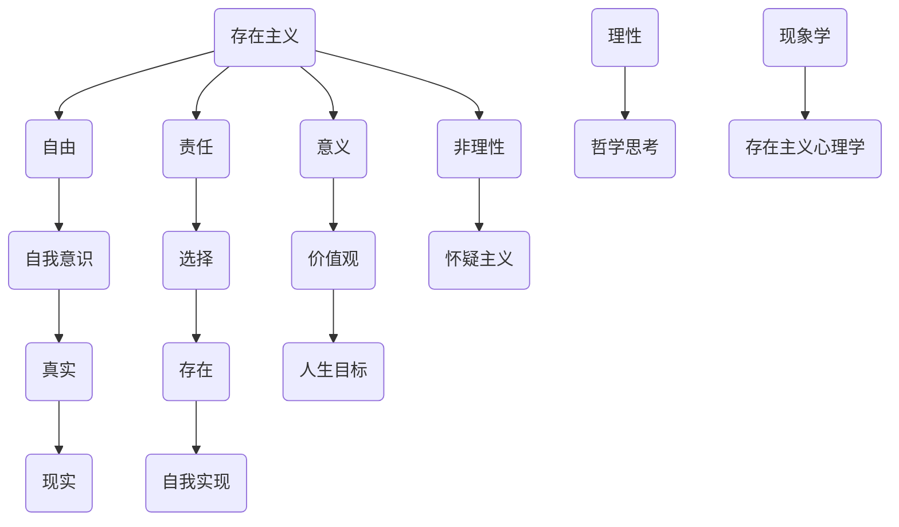

                 

### 在荒诞中创造意义：存在主义的现代实践

#### 关键词：
- 存在主义
- 荒诞
- 自由
- 责任
- 伦理观
- 心理学
- 艺术和政治哲学

#### 摘要：
本文旨在探讨存在主义在现代实践中的重要性，通过分析荒诞现象、核心概念、现代实践、延伸应用以及存在主义与现代社会的关系，揭示如何在荒诞中创造意义。本文结合存在主义哲学、心理学、艺术和政治哲学，提出了一种应对现代社会挑战的哲学方法论，旨在为读者提供深刻的思考和实用的建议。

---

# 《在荒诞中创造意义：存在主义的现代实践》目录大纲

## 第一部分：荒诞与存在主义

### 第1章：荒诞：存在的本质

#### 1.1 荒诞的起源与表现
- 荒诞文学与戏剧
- 荒诞在现实生活中的体现

#### 1.2 存在主义：对荒诞的回应
- 存在主义的基本理念
- 存在主义的历史背景

### 第2章：存在主义的核心概念

#### 2.1 自由
- 自由的定义与价值
- 自由的局限性与责任

#### 2.2 责任
- 责任的概念与意义
- 个人在社会中的责任

### 第3章：存在主义的现代实践

#### 3.1 现代社会的荒诞现象
- 工业化与消费主义
- 技术发展与人类存在的困境

#### 3.2 存在主义在个人生活中的应用
- 如何面对生活的不确定性与荒诞性
- 个人存在的意义与价值

## 第二部分：存在主义哲学的延伸

### 第4章：存在主义伦理观

#### 4.1 存在主义伦理观的基本原则
- 存在主义伦理学的特点
- 存在主义伦理学的应用

#### 4.2 存在主义伦理学的争议与挑战
- 存在主义伦理学在现代社会中的适用性
- 存在主义伦理学与其他伦理观的比较

### 第5章：存在主义心理学

#### 5.1 存在主义心理学的定义与原理
- 存在主义心理学的历史发展
- 存在主义心理学的基本理论

#### 5.2 存在主义心理学的应用
- 如何通过存在主义心理学改善心理健康
- 存在主义心理学的实际案例

### 第6章：存在主义艺术

#### 6.1 存在主义艺术的特点
- 存在主义艺术的历史背景
- 存在主义艺术的主要流派

#### 6.2 存在主义艺术的案例分析
- 存在主义文学作品的分析
- 存在主义戏剧与电影的解读

### 第7章：存在主义政治哲学

#### 7.1 存在主义政治哲学的基本观点
- 存在主义政治哲学的核心思想
- 存在主义政治哲学的应用

#### 7.2 存在主义政治哲学的争议与反思
- 存在主义政治哲学的局限性
- 存在主义政治哲学的未来发展方向

## 第三部分：存在主义与现代生活

### 第8章：存在主义与现代社会

#### 8.1 现代社会的挑战与机遇
- 现代化对人类存在的冲击
- 现代社会中的个人自由与责任

#### 8.2 存在主义对现代社会的启示
- 存在主义对个体生活的指导意义
- 存在主义对社会问题的反思与解决

### 第9章：存在主义与未来

#### 9.1 存在主义在未来社会中的应用
- 未来社会中的存在主义可能的发展方向
- 存在主义在人类未来生活中的作用

#### 9.2 存在主义的哲学意义
- 存在主义对人类存在的深刻影响
- 存在主义对哲学发展的贡献

## 附录

### 附录A：存在主义主要哲学家及其思想

#### A.1 尼采：存在的力量
- 尼采的存在主义思想
- 尼采对现代哲学的影响

#### A.2 萨特：自由与选择
- 萨特的存在主义哲学
- 萨特对现代社会的反思

#### A.3 海德格尔：存在与时间
- 海德格尔的存在主义理论
- 海德格尔对哲学的革新

### 附录B：存在主义经典著作推荐

#### B.1 《存在与虚无》
- 萨特的代表作
- 对存在主义思想的深入探讨

#### B.2 《论人类不平等的起源和基础》
- 卢梭的存在主义思想
- 对社会不平等问题的反思

#### B.3 《生命的谜语》
- 尼采的存在主义哲学
- 对人类存在的深刻思考

## Mermaid流程图：存在主义核心概念实体关系架构



## Python代码：存在主义算法原理讲解

```python
# 存在主义算法原理：存在主义决策树

class ExistentialDecisionTree:
    def __init__(self):
        self.tree = {}

    def fit(self, data):
        # 数据处理
        pass

    def predict(self, input_data):
        # 预测
        pass

    def show_tree(self):
        # 展示决策树
        pass

# 实例化决策树
tree = ExistentialDecisionTree()

# 添加训练数据
tree.fit(data)

# 预测
prediction = tree.predict(input_data)

# 打印决策树结构
tree.show_tree()
```

---

接下来，我们逐步进入存在主义的世界，探索荒诞的本质，理解核心概念，并探讨其在现代社会中的应用和延伸。希望通过这篇文章，您能对存在主义有更深刻的认识，学会在荒诞中寻找意义，为自己和世界创造更美好的未来。

