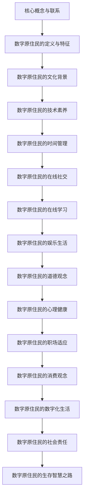

                 


# 在虚拟与现实之间寻找平衡：数字原住民的生存智慧

## 关键词
- 数字原住民
- 虚拟与现实平衡
- 生存智慧
- 技术素养
- 社交技巧
- 心理健康
- 职场适应
- 数字化生活

## 摘要
本文旨在探讨数字原住民在虚拟与现实之间寻找平衡的生存智慧。随着数字化时代的到来，数字原住民——这一群体逐渐成为社会的重要组成部分。本文将详细分析数字原住民的定义、特征、文化背景、技术素养，以及他们在时间管理、在线社交、在线学习、娱乐生活、道德观念、心理健康、职场生存、消费观念等方面展现出的生存智慧。同时，本文还将展望数字原住民的数字化生活与社会责任，以期为相关领域的研究和实践提供有益的参考。

----------------------------------------------------------------

# 引言：数字原住民的崛起

在过去的几十年里，互联网和数字技术的飞速发展深刻地改变了人类社会的方方面面。数字原住民（Digital Native）这一概念也应运而生，用来描述那些在数字环境中成长起来的一代人。数字原住民指的是那些从出生到成长，一直在数字化环境下生活、学习、娱乐和社交的人群。他们习惯于使用各种数字工具，如智能手机、电脑、平板等，通过互联网获取信息、交流沟通、参与社交活动。

### 数字原住民的定义与特征

数字原住民具有以下显著特征：

1. **早期接触**：数字原住民从出生开始就接触数字技术，对数字产品有着天生的亲和力。
2. **技术熟练**：他们通常具备较高的技术素养，能够熟练使用各种数字工具和应用程序。
3. **网络社交**：数字原住民倾向于通过互联网进行社交，他们更习惯于在线聊天、视频通话、社交媒体等虚拟社交方式。
4. **信息获取**：数字原住民擅长在互联网上搜索和筛选信息，他们具备较强的信息处理能力。
5. **创新精神**：数字原住民具有强烈的创新意识，他们乐于尝试新的数字产品和工具。

### 数字原住民与传统网民的区别

与传统网民相比，数字原住民在以下几个方面存在显著差异：

1. **成长环境**：数字原住民在数字化环境中成长，对数字技术的接受度和使用习惯更为自然。
2. **技术依赖**：数字原住民对数字技术的依赖程度更高，数字工具已成为他们生活中不可或缺的一部分。
3. **信息消费**：数字原住民倾向于关注实时信息，对新闻、社交媒体等数字内容有较强的兴趣。
4. **社交方式**：数字原住民更倾向于在线社交，他们习惯于通过虚拟平台建立和维护人际关系。

总之，数字原住民的崛起不仅反映了数字化时代的变迁，也带来了社会结构和行为方式的一系列变革。他们成为推动数字技术创新和数字经济发展的重要力量，也面临着如何在虚拟与现实之间寻找平衡的挑战。

----------------------------------------------------------------

## 第一部分：数字原住民的基础知识

### 第1章：数字原住民的定义与特征

在探讨数字原住民的基础知识时，我们首先需要明确数字原住民的定义与特征。数字原住民，顾名思义，指的是那些在数字化环境中成长起来的新一代人。他们伴随着互联网和数字技术的发展而成长，对数字技术有着天生的亲和力。以下是数字原住民的主要定义与特征：

#### 1.1 数字原住民的定义

数字原住民（Digital Native）这个术语最早由美国学者马克·P·波拉克（Mark P. P.波拉克）提出，指的是那些在互联网和数字技术高度发达的环境中成长起来的一代人。他们出生于互联网普及的时期，从小就接触并熟练使用各种数字设备，如电脑、智能手机和平板电脑。与数字移民（Digital Immigrant）相比，数字原住民对数字技术有更深刻的理解和更灵活的运用能力。

#### 1.2 数字原住民的特征

数字原住民具有以下显著特征：

1. **早期接触**：数字原住民从出生开始就接触数字技术，他们在很小的时候就能够熟练使用电脑、智能手机等数字设备。
2. **技术熟练**：数字原住民通常具备较高的技术素养，能够熟练操作各种数字工具和应用程序，例如社交媒体平台、在线游戏和编程软件等。
3. **网络社交**：数字原住民倾向于通过互联网进行社交，他们习惯于在线聊天、视频通话和社交媒体等虚拟社交方式。他们能够轻松地适应虚拟社交环境，并且善于在网络上建立和维护人际关系。
4. **信息获取**：数字原住民擅长在互联网上搜索和筛选信息，他们具备较强的信息处理能力。他们能够快速浏览大量信息，从中提取出有价值的内容。
5. **创新精神**：数字原住民具有强烈的创新意识，他们乐于尝试新的数字产品和工具，并积极参与数字技术的创新和应用。

#### 1.3 数字原住民与传统网民的区别

与传统网民相比，数字原住民在以下几个方面存在显著差异：

1. **成长环境**：数字原住民在数字化环境中成长，对数字技术的接受度和使用习惯更为自然。他们从出生开始就生活在数字技术的包围中，因此对数字设备的操作和使用有更为熟练的技巧。
2. **技术依赖**：数字原住民对数字技术的依赖程度更高，数字工具已成为他们生活中不可或缺的一部分。他们习惯于通过数字设备获取信息、娱乐和社交，对数字技术的依赖性远大于传统网民。
3. **信息消费**：数字原住民倾向于关注实时信息，对新闻、社交媒体等数字内容有较强的兴趣。他们习惯于在互联网上获取信息，并且能够快速筛选和处理大量信息。
4. **社交方式**：数字原住民更倾向于在线社交，他们习惯于通过虚拟平台建立和维护人际关系。他们能够轻松地适应虚拟社交环境，并且在网络上表现出更强的社交能力。

通过以上分析，我们可以看出数字原住民在定义、特征和与传统网民的区别上具有独特的特点。这些特点使得数字原住民成为推动数字技术创新和数字经济发展的重要力量。然而，数字原住民也面临着如何在虚拟与现实之间寻找平衡的挑战，这也是我们需要深入探讨的话题。

### 第2章：数字原住民的文化背景

数字原住民的文化背景是理解他们在数字化环境中成长的重要一环。他们的成长环境、生活习惯以及文化认同，都在很大程度上影响了他们的行为方式和技术素养。以下是对数字原住民文化背景的详细分析。

#### 2.1 数字原住民的成长环境

数字原住民的成长环境具有以下几个特点：

1. **数字化家庭**：数字原住民大多在数字化家庭中成长，他们的父母在互联网和数字技术的应用方面相对熟练。这使得数字原住民从小就接触到大量的数字设备，如电脑、智能手机和平板电脑。
2. **互联网普及**：数字原住民的成长时期正好是互联网快速普及的时期。他们从小就能够在家庭、学校和社会各个角落轻松地接触到互联网，这使得他们具备了较强的信息获取和互联网使用能力。
3. **信息化教育**：数字原住民接受的教育大多是以信息化为特征的。他们从小便在学校中接触到各种数字化教学工具，如电子白板、在线课程和电子教材等。这种教育方式不仅提高了他们的学习效率，还培养了他们对数字技术的兴趣和熟练度。

#### 2.2 数字原住民的生活习惯

数字原住民的生活习惯也受到了数字化环境的影响，具有以下几个特点：

1. **数字化消费**：数字原住民倾向于通过互联网进行消费，他们习惯于在线购物、订餐和支付等。互联网不仅方便了他们的生活，还让他们享受到了更多的优惠和便利。
2. **在线娱乐**：数字原住民在娱乐方式上更倾向于在线活动，如观看视频、玩网络游戏、参与社交媒体等。这些活动不仅丰富了他们的生活，还培养了他们的团队合作和社交技能。
3. **信息筛选**：数字原住民具备较强的信息筛选能力，他们能够快速从大量的信息中找到有价值的内容。这使得他们在获取信息时更加高效，也能够更好地适应数字化环境。

#### 2.3 数字原住民的文化认同

数字原住民的文化认同具有以下几个特点：

1. **数字文化**：数字原住民在文化认同上更倾向于数字文化，他们对数字技术和互联网有强烈的兴趣和认同。这种文化认同不仅影响了他们的行为方式，还推动了数字技术的发展和创新。
2. **开放性**：数字原住民具有开放性，他们更容易接受新事物和新观念。这使得他们在面对数字技术的变革和挑战时，能够更加灵活和适应。
3. **共同体意识**：数字原住民在网络上形成了强大的共同体意识，他们通过社交媒体和在线社区建立了紧密的联系。这种共同体意识不仅增强了他们的社交能力，还推动了数字文化的传播和发展。

通过以上分析，我们可以看出数字原住民的文化背景对他们的行为方式和技术素养产生了深远的影响。他们的成长环境、生活习惯和文化认同都使得他们在数字化社会中具有独特的优势和挑战。理解数字原住民的文化背景，有助于我们更好地应对数字化时代的挑战，并推动数字技术的持续发展。

### 第3章：数字原住民的技术素养

数字原住民作为在数字化环境中成长起来的一代人，他们的技术素养在多个方面都表现出色。以下将详细探讨数字原住民的编程技能、网络安全意识以及创新能力。

#### 3.1 数字原住民的编程技能

数字原住民从小就接触到了各种数字设备和应用程序，这使得他们对编程有着浓厚的兴趣。许多数字原住民在很小的时候就开始学习编程，掌握了诸如Python、JavaScript、C++等编程语言。以下是一些具体的表现：

1. **早期编程学习**：数字原住民通常在儿童时期就开始接触编程，他们可能会参加各种编程训练营或在线课程。这种早期编程学习不仅激发了他们对编程的兴趣，还培养了他们的逻辑思维和问题解决能力。
2. **项目实践**：数字原住民喜欢通过实践来学习编程，他们会尝试编写各种小程序，如小游戏、自动化工具等。这种项目实践不仅加深了他们对编程语言的理解，还提高了他们的编程技能。
3. **开源社区参与**：许多数字原住民积极参与开源社区，他们会在GitHub等平台上分享自己的代码，学习和借鉴他人的代码。这种参与不仅提高了他们的编程水平，还培养了他们的团队合作精神和开放思维。

#### 3.2 数字原住民的网络安全意识

随着互联网的普及，网络安全问题日益突出。数字原住民在网络安全方面也表现出较高的意识，以下是一些具体的表现：

1. **安全知识普及**：数字原住民从小就接受了网络安全的教育，他们了解如何防范病毒、防止个人信息泄露等基本安全知识。
2. **安全工具使用**：数字原住民习惯于使用各种安全工具，如防火墙、杀毒软件、加密工具等，来保护自己的设备和数据。
3. **安全意识培养**：数字原住民在网络上表现出较高的安全意识，他们不会随意点击不明链接、下载不明文件，也不会轻易泄露个人信息。

#### 3.3 数字原住民的创新能力

数字原住民的创新能力在多个领域都得到了体现，以下是一些具体的表现：

1. **技术创新**：数字原住民善于利用现有的技术和工具，创造出新的应用和解决方案。例如，他们可能会利用机器学习和大数据分析技术，开发出新的商业模式或产品。
2. **跨界创新**：数字原住民具有较强的跨界创新能力，他们能够将不同领域的知识和技术相结合，创造出全新的解决方案。例如，他们可能会将人工智能技术与医疗领域相结合，开发出智能医疗设备。
3. **社会创新**：数字原住民在社会创新方面也表现出色，他们利用互联网和数字技术来解决社会问题。例如，他们可能会利用区块链技术来提高慈善事业的透明度，或者利用在线教育平台来推动教育公平。

通过以上分析，我们可以看出数字原住民在编程技能、网络安全意识和创新能力方面具有独特的优势。这些技术素养不仅使他们能够在数字化环境中游刃有余，还为他们未来的职业发展和创新提供了坚实的基础。随着数字化时代的不断演进，数字原住民的技术素养将继续发挥重要作用。

### 第4章：数字原住民的时间管理

在数字化时代，时间管理成为了一个关键技能，特别是在数字原住民这一群体中。数字原住民由于习惯于在多任务环境中工作，更需要高效的时间管理策略来保持生活的平衡。以下将详细探讨数字原住民的时间观念、时间管理技巧以及他们常用的时间管理工具。

#### 4.1 数字原住民的时间观念

数字原住民的时间观念与传统的“线性时间”观念有所不同。他们更倾向于“碎片化时间”和“弹性时间”的管理，具体表现在以下几个方面：

1. **碎片化时间**：数字原住民善于利用碎片化的时间进行工作和学习。他们习惯于在地铁、公交、等待等碎片化时间段进行阅读、学习或处理工作。这种碎片化时间管理使得他们能够充分利用时间，提高工作效率。
2. **弹性时间**：数字原住民通常更注重时间的管理而非固定的日程安排。他们倾向于根据任务的紧急程度和重要性来安排时间，而不是按照固定的日程表进行工作。这种弹性时间管理方式使得他们能够更加灵活地应对各种突发情况。
3. **效率至上**：数字原住民重视效率，他们倾向于在有限的时间内完成更多的任务。他们会使用各种工具和方法来提高工作效率，例如任务清单、时间追踪器等。

#### 4.2 数字原住民的时间管理技巧

数字原住民在时间管理方面拥有一些独特的技巧，以下是一些具体的方法：

1. **优先级管理**：数字原住民善于根据任务的紧急程度和重要性来安排时间。他们会使用“四象限法则”将任务分为紧急且重要、紧急但不重要、不紧急但重要、不紧急且不重要四种类型，并优先处理紧急且重要的任务。
2. **时间块管理**：数字原住民会将时间分为若干块，每块时间用于处理特定的任务。这种方法有助于他们保持专注，避免多任务处理的干扰。例如，他们可能会将上午的时间用于处理重要工作，下午的时间用于轻松的工作或休息。
3. **日程规划**：数字原住民通常会使用日程规划工具来安排每天的任务和时间。他们会将任务和日程安排在日历上，以确保不会遗漏任何重要的任务。

#### 4.3 数字原住民的时间管理工具

数字原住民在时间管理方面广泛使用各种工具，以下是一些常用的工具：

1. **时间追踪器**：时间追踪器可以帮助数字原住民记录自己的时间使用情况，以便他们了解自己在各个任务上的时间分配情况。例如，Toggl、RescueTime等工具可以自动记录用户的在线活动时间，并提供详细的报告。
2. **任务清单**：任务清单是数字原住民管理任务的重要工具。例如，Trello、Asana等项目管理工具可以帮助他们创建任务列表、设置优先级、分配任务和跟踪进度。
3. **日历应用**：数字原住民通常会使用日历应用来安排日程和提醒重要任务。例如，Google Calendar、Microsoft Outlook等日历应用提供了丰富的功能，如事件创建、时间提醒、日历同步等。

通过以上分析，我们可以看出数字原住民在时间管理方面具有独特的观念和技巧。他们善于利用碎片化和弹性时间，通过优先级管理、时间块管理和日程规划等技巧，以及各种时间管理工具，来提高时间利用效率和生活质量。随着数字化时代的不断进步，这些时间管理技巧将继续发挥重要作用，帮助数字原住民在虚拟与现实之间找到平衡。

### 第5章：数字原住民的在线社交

数字原住民在数字化环境中成长，因此在线社交对他们来说不仅是习惯，更是生活的一部分。以下将详细探讨数字原住民的社交方式、社交礼仪以及社交技巧。

#### 5.1 数字原住民的社交方式

数字原住民的社交方式与传统的面对面交流有很大不同，他们更倾向于通过互联网进行社交。以下是数字原住民常用的几种在线社交方式：

1. **社交媒体平台**：数字原住民广泛使用各种社交媒体平台，如Facebook、Instagram、Twitter等，来分享生活、交流观点和结识新朋友。这些平台提供了丰富的互动功能，如评论、点赞、分享等，使得社交更加便捷和多样化。
2. **即时通讯工具**：数字原住民习惯于使用各种即时通讯工具，如微信、WhatsApp、Telegram等，来进行实时沟通和交流。这些工具不仅方便了他们与朋友和家人的联系，还使得团队协作和商务沟通更加高效。
3. **在线社区和论坛**：数字原住民喜欢参与各种在线社区和论坛，如Reddit、Stack Overflow等，这些社区为他们提供了交流技术问题、分享经验和学习新知识的平台。

#### 5.2 数字原住民的社交礼仪

在数字社交中，数字原住民也需要遵循一定的礼仪规范，以确保交流的顺利进行。以下是数字原住民需要注意的几种社交礼仪：

1. **礼貌用语**：数字原住民在在线交流中应使用礼貌用语，如“请”、“谢谢”等，以展现尊重和礼貌。
2. **尊重隐私**：数字原住民应尊重他人的隐私，避免在社交媒体上随意分享他人的个人信息或隐私照片。
3. **避免争议**：在在线社交中，数字原住民应避免参与无谓的争论或冲突，以免影响人际关系。
4. **及时回复**：数字原住民应尽量及时回复朋友和家人的消息，以展现关心和尊重。

#### 5.3 数字原住民的社交技巧

数字原住民在在线社交中拥有一些独特的技巧，以下是一些具体的社交技巧：

1. **多渠道沟通**：数字原住民善于利用多种渠道进行沟通，例如同时使用社交媒体、即时通讯工具和电子邮件，以确保信息的及时传递和交流的全面性。
2. **有效倾听**：数字原住民注重在线沟通中的倾听技巧，他们会仔细阅读对方的信息，并给予积极的反馈，以展现关注和理解。
3. **建立网络**：数字原住民擅长建立和维护广泛的网络关系，他们通过参与社区活动、分享知识和经验，不断扩大自己的社交圈子。
4. **利用技术工具**：数字原住民善于利用各种技术工具来提升社交效率，例如使用项目管理工具进行团队协作、使用社交媒体分析工具来了解受众需求等。

通过以上分析，我们可以看出数字原住民在在线社交方面具有独特的优势和技巧。他们善于利用互联网进行沟通和交流，遵循社交礼仪，并通过多种渠道和技巧来提升社交效果。随着数字化时代的不断进步，这些社交方式和技术将越来越成为数字原住民生活的重要组成部分。

### 第6章：数字原住民的在线学习

数字原住民在数字化环境中成长，因此在线学习成为他们获取知识和技能的重要途径。以下将详细探讨数字原住民的学习方式、学习资源以及学习效果评估。

#### 6.1 数字原住民的学习方式

数字原住民由于在数字化环境中成长，他们的学习方式与传统学生有所不同。以下是数字原住民常用的几种学习方式：

1. **自主探索**：数字原住民善于通过互联网自主探索和发现知识。他们会利用搜索引擎、在线论坛、博客等工具，寻找感兴趣的主题和内容，进行深入学习。
2. **在线课程**：数字原住民广泛参与各种在线课程，如MOOC（大规模开放在线课程）、教育平台上的专业课程等。这些课程提供了丰富的学习资源和互动机会，帮助他们系统地学习新知识和技能。
3. **项目式学习**：数字原住民喜欢通过项目式学习来提升实践能力和解决问题的能力。他们会参与各种线上项目和挑战，通过实际操作来应用所学知识。
4. **社群学习**：数字原住民通过在线社区和论坛进行学习，他们会在这些平台上分享知识、讨论问题、寻求帮助，从而相互学习、共同进步。

#### 6.2 数字原住民的学习资源

数字原住民在数字化环境中拥有丰富的学习资源，以下是一些常用的学习资源：

1. **在线课程平台**：如Coursera、edX、Udemy等，提供了大量的专业课程和认证项目，覆盖了各个领域的知识。
2. **开源项目**：如GitHub、GitLab等，为数字原住民提供了丰富的开源代码和项目，他们可以通过阅读和分析这些代码来学习编程和开发技能。
3. **专业博客和论坛**：如Stack Overflow、Medium等，数字原住民可以通过这些平台了解最新的技术动态、学习专业知识和解决技术问题。
4. **电子书籍**：数字原住民可以在线阅读各种电子书籍，如亚马逊Kindle、Google Play Books等，这些书籍涵盖了广泛的学科和领域。

#### 6.3 数字原住民的学习效果评估

数字原住民在评估学习效果方面也采用了一些独特的策略和方法：

1. **自我评估**：数字原住民会定期进行自我评估，检查自己在学习过程中的掌握情况。他们会利用学习日志、测试题和模拟项目等工具来衡量自己的学习效果。
2. **反馈机制**：数字原住民会积极寻求他人的反馈，例如老师、导师、同行等。他们会通过在线讨论、作业评审和项目评估等方式，获取反馈并改进自己的学习方法和效果。
3. **持续学习**：数字原住民认为学习是一个持续的过程，他们不会满足于现有的知识和技能。他们会不断更新自己的学习内容，跟上最新的技术发展和行业趋势。
4. **实际应用**：数字原住民会通过实际应用所学知识来检验自己的学习效果。他们会参与各种项目和实践，将理论知识转化为实际技能，并通过实际成果来评估自己的学习效果。

通过以上分析，我们可以看出数字原住民在在线学习方面具有独特的优势和策略。他们善于利用互联网和数字化资源进行自主学习，通过多种学习方式提升自己的知识水平和技能。同时，他们通过自我评估、反馈机制和实际应用等策略来评估学习效果，确保学习成果的持续提升。随着数字化时代的不断进步，这些学习方式和方法将越来越成为数字原住民成长和发展的重要途径。

### 第7章：数字原住民的娱乐生活

数字原住民的娱乐生活与传统网民相比，具有显著的特点和多样性。他们习惯于通过互联网和数字设备来消磨时间、放松身心，以下将详细探讨数字原住民的娱乐方式、娱乐消费以及娱乐对他们生活的影响。

#### 7.1 数字原住民的娱乐方式

数字原住民的娱乐方式多种多样，以下是一些常见的娱乐方式：

1. **在线游戏**：数字原住民是电子游戏的主要受众，他们喜欢通过在线平台玩各种类型的游戏，如角色扮演游戏（RPG）、射击游戏（FPS）和策略游戏（RTS）等。在线游戏不仅提供了丰富的娱乐内容，还培养了他们的团队合作和竞技精神。
2. **视频观看**：数字原住民喜欢通过视频平台观看各种类型的视频内容，如电影、电视剧、纪录片和短视频等。他们可以通过流媒体服务如Netflix、YouTube等，随时随地享受高品质的娱乐体验。
3. **音乐欣赏**：数字原住民是音乐爱好者，他们喜欢通过音乐平台如Spotify、Apple Music等，浏览和收听各种类型的音乐。音乐不仅丰富了他们的生活，还影响了他们的情绪和心态。
4. **社交媒体互动**：数字原住民喜欢在社交媒体上分享和浏览各种内容，如图片、视频和文字等。他们会通过点赞、评论和分享来互动和交流，从而增加社交乐趣。

#### 7.2 数字原住民的娱乐消费

数字原住民的娱乐消费具有以下特点：

1. **在线付费**：数字原住民习惯于通过在线支付方式购买娱乐内容，如购买电子书、订阅流媒体服务、购买游戏道具等。他们愿意为优质的娱乐内容支付费用，以获得更好的体验。
2. **多样化消费**：数字原住民的娱乐消费多样化，他们不仅消费视频、音乐、游戏等传统娱乐内容，还消费虚拟商品、电子书、在线课程等数字产品。这种多样化的消费满足了他们对不同类型娱乐内容的多样化需求。
3. **个性化定制**：数字原住民的娱乐消费越来越注重个性化定制，他们喜欢根据自己的兴趣和偏好，选择适合自己的娱乐内容。例如，他们可能会定制自己的音乐播放列表，选择感兴趣的电影频道等。

#### 7.3 数字原住民的娱乐影响

数字原住民的娱乐方式和生活消费习惯对他们的生活产生了深远的影响：

1. **生活方式**：数字原住民的娱乐方式使他们更加依赖数字设备和互联网，他们的生活方式也更加数字化和便捷化。例如，他们习惯于在线购物、在线支付、远程办公等。
2. **社交互动**：数字原住民的娱乐活动往往伴随着社交互动，他们在观看视频、玩游戏、听音乐等过程中，会与其他用户进行交流、互动和分享。这种社交互动不仅丰富了他们的生活，还增强了他们的社交能力和人际关系。
3. **心理健康**：数字原住民的娱乐消费在一定程度上有助于缓解压力和焦虑，提升心理健康。通过观看喜欢的视频、听喜欢的音乐、玩游戏等方式，他们能够放松身心，缓解压力。
4. **创新精神**：数字原住民的娱乐消费也促进了他们的创新精神。他们在游戏、视频和音乐创作等领域不断尝试新的创意和风格，推动了娱乐内容的多样化和创新。

通过以上分析，我们可以看出数字原住民的娱乐生活在数字化环境中具有独特的特点。他们善于利用数字设备和互联网进行娱乐消费，享受多样化的娱乐内容。同时，他们的娱乐方式和生活消费习惯对他们的生活方式、社交互动、心理健康和创新精神产生了深远的影响。随着数字化时代的不断进步，数字原住民的娱乐生活将继续发生变化，并对他们的人生和社会产生更大的影响。

### 第8章：数字原住民的道德观念

数字原住民的道德观念在数字化社会中具有重要的影响，他们的价值观和行为准则不仅反映了这一群体的特点，也对社会道德和伦理提出了新的挑战。以下将详细探讨数字原住民的道德标准、道德困境以及他们在道德责任方面的表现。

#### 8.1 数字原住民的道德标准

数字原住民的道德标准具有以下几个特点：

1. **公正与平等**：数字原住民普遍重视公正和平等，他们倾向于支持社会正义和公平。在数字化环境中，他们反对网络霸凌和歧视行为，倡导建立公平的网络环境。
2. **透明与诚实**：数字原住民认为透明和诚实是重要的道德准则，他们倾向于公开自己的行为和观点，并反对虚假信息和欺骗行为。在社交媒体和网络平台上，他们倡导真实和诚实的交流。
3. **尊重隐私**：数字原住民高度重视个人隐私，他们意识到在数字化社会中，个人隐私容易被侵犯。因此，他们在使用数字设备和互联网时，注重保护个人隐私，并反对未经授权的信息收集和泄露。
4. **责任与担当**：数字原住民认为每个人都应该对自己的行为承担责任，他们愿意为社会和环境承担责任。在数字技术的应用中，他们倡导负责任的使用和推广，以减少对环境和人类的影响。

#### 8.2 数字原住民的道德困境

数字原住民在数字化社会中面临着一系列道德困境，以下是一些具体的困境：

1. **信息过载与筛选**：在数字化社会中，信息量巨大，数字原住民需要花费大量时间和精力进行筛选和过滤。在这个过程中，他们可能面临选择和判断的困境，如何平衡信息获取和隐私保护成为一大挑战。
2. **网络霸凌与歧视**：数字原住民在网络上可能会遭遇网络霸凌和歧视行为，他们需要在保护自己权益的同时，避免加剧冲突和对立，这需要他们在道德和情感上做出平衡。
3. **技术滥用与责任**：数字原住民在数字技术的应用中可能会面临滥用技术的困境，如何确保技术的合理和正当使用，避免技术对个人和社会的负面影响，是他们需要面对的道德问题。
4. **虚拟与现实的关系**：数字原住民在数字化环境中生活，他们需要平衡虚拟世界和现实世界的关系。如何确保虚拟世界中的行为和价值观能够反映在现实生活中，是他们需要思考的道德问题。

#### 8.3 数字原住民的道德责任

数字原住民在道德责任方面表现出较强的责任感，以下是他们的一些具体行动：

1. **积极参与公益活动**：数字原住民积极参与各种公益活动，通过线上和线下的方式，为弱势群体提供帮助和支持。他们利用自己的技术能力和影响力，推动社会公益事业的发展。
2. **推动数字伦理建设**：数字原住民在数字技术领域积极推动数字伦理建设，倡导尊重用户隐私、保护知识产权和反对网络霸凌等。他们通过发起倡议、撰写文章和参与讨论等方式，推动数字伦理的普及和实践。
3. **促进技术普及与教育**：数字原住民致力于促进数字技术的普及和教育，他们通过开设免费课程、编写教材和参与社区教育等方式，帮助更多人掌握数字技能，提升数字素养。
4. **倡导可持续发展**：数字原住民关注环境保护和可持续发展，他们倡导绿色技术和低碳生活。在数字技术的应用中，他们注重减少能耗和环境污染，推动数字社会的可持续发展。

通过以上分析，我们可以看出数字原住民的道德观念在数字化社会中具有独特的特点。他们注重公正、平等、透明、诚实等道德准则，同时面临信息过载、网络霸凌、技术滥用等道德困境。他们通过积极参与公益活动、推动数字伦理建设、促进技术普及和教育、倡导可持续发展等方式，承担起数字社会的道德责任。随着数字化时代的不断进步，数字原住民的道德观念和行动将越来越对数字社会的发展产生深远的影响。

### 第9章：数字原住民的心理健康

数字原住民在数字化环境中生活，他们面临着独特的心理压力和心理健康挑战。以下将详细探讨数字原住民的心理健康状况、心理问题以及他们应对心理健康的策略。

#### 9.1 数字原住民的心理健康状况

尽管数字原住民在数字化环境中表现出色，但他们同样面临着心理健康问题。以下是对数字原住民心理状况的分析：

1. **焦虑和压力**：数字原住民经常面临时间压力和信息过载，这可能导致焦虑和压力。他们需要处理大量的信息和任务，这可能会给他们带来心理负担。
2. **孤独感**：尽管数字原住民在网络上有着广泛的社交网络，但他们可能仍然感到孤独。虚拟社交虽然能够提供一定的社交支持，但无法完全替代现实中的面对面交流。
3. **注意力不集中**：数字原住民在数字化环境中常常受到各种干扰，如社交媒体通知、电子邮件等，这使得他们难以集中注意力完成任务。
4. **睡眠质量**：数字原住民可能因为过度使用数字设备而影响睡眠质量。晚上使用电子设备可能会刺激大脑，导致难以入睡。

#### 9.2 数字原住民的心理健康问题

数字原住民的心理健康问题主要包括以下几种：

1. **网络成瘾**：数字原住民容易对网络游戏、社交媒体和其他数字设备产生依赖，这可能导致网络成瘾。网络成瘾会影响他们的日常生活和社交活动，甚至可能对他们的学业和职业产生负面影响。
2. **情绪波动**：数字原住民可能会因为网络上的负面信息或社交冲突而感到情绪波动。他们在网络上表达情感的能力较强，但这也可能导致情绪不稳定。
3. **自我认知问题**：数字原住民在数字化环境中可能会形成一种自我认知的偏差，他们可能会过分关注自己在网络上的形象和评价，这可能导致自我认知问题，如自卑或自我膨胀。

#### 9.3 数字原住民的心理健康策略

为了应对心理健康挑战，数字原住民可以采取以下策略：

1. **合理规划时间**：数字原住民应合理规划自己的时间，确保有足够的休息和放松时间。他们可以使用时间管理工具，如待办事项列表、日历应用等，来帮助自己更好地管理时间和任务。
2. **培养健康的生活习惯**：数字原住民应培养健康的生活习惯，如定期锻炼、保持良好的饮食习惯和充足的睡眠。这些习惯有助于提高他们的心理健康水平。
3. **寻求心理支持**：数字原住民可以寻求专业心理支持，如咨询心理医生或参加心理辅导课程。他们可以通过在线平台或线下机构寻求帮助，以解决自己的心理健康问题。
4. **培养现实社交能力**：数字原住民应努力培养现实社交能力，通过参加线下活动、社交聚会等方式，与朋友和家人进行面对面的交流。这种现实社交有助于减轻孤独感，提高心理健康水平。
5. **建立自我调节机制**：数字原住民应学会自我调节，管理自己的情绪和行为。他们可以通过冥想、深呼吸、瑜伽等方式来缓解压力和焦虑，提高心理韧性。

通过以上分析，我们可以看出数字原住民在心理健康方面既面临着独特的挑战，也拥有应对这些挑战的策略。他们需要关注自己的心理健康，采取积极的措施来维护自己的心理平衡。随着数字化环境的不断发展和变化，数字原住民的心理健康问题将继续受到关注，并需要持续探索有效的应对策略。

### 第10章：数字原住民的职场生存

数字原住民在职场中表现出色，但同时也面临着独特的挑战。以下将详细探讨数字原住民的职场适应、职业发展和面临的挑战。

#### 10.1 数字原住民的职场适应

数字原住民在职场适应方面具有以下优势：

1. **技术熟练**：数字原住民从小就接触数字技术，对各种数字工具和软件有着熟练的操作能力。这使得他们在工作中能够更快速地适应和掌握新技术。
2. **快速学习**：数字原住民具有较强的学习能力和适应能力，他们能够迅速掌握新知识和技能，适应快速变化的工作环境。
3. **创新能力**：数字原住民具有强烈的创新意识和创新精神，他们在工作中能够提出新的想法和解决方案，推动工作的发展和进步。
4. **团队合作**：数字原住民善于在团队中协作，他们能够有效地沟通和合作，推动团队项目的成功。

#### 10.2 数字原住民的职业发展

数字原住民在职业发展中表现出以下特点：

1. **多元选择**：数字原住民在选择职业时更加多元，他们不仅关注传统行业，还积极尝试新兴行业和数字领域。这使得他们在职业发展中有更多机会和选择。
2. **跨界发展**：数字原住民具有较强的跨界能力，他们能够在不同领域之间自由切换，将不同领域的知识和技能结合起来，推动职业发展的多元化。
3. **持续学习**：数字原住民重视终身学习，他们通过在线课程、专业培训等方式不断提升自己的知识和技能，以适应不断变化的市场需求。
4. **创新实践**：数字原住民在工作中注重创新实践，他们勇于尝试新方法和新工具，推动工作流程和效率的提升。

#### 10.3 数字原住民的职场挑战

尽管数字原住民在职场中具有诸多优势，但他们也面临着一些挑战：

1. **信息过载**：数字原住民在工作中可能会面临信息过载的问题，如何筛选和处理大量信息成为他们需要克服的挑战。
2. **工作与生活的平衡**：数字原住民在数字化环境中工作，他们需要平衡工作和生活，避免过度依赖数字设备和网络。
3. **数字鸿沟**：数字原住民在职场中可能会遇到数字鸿沟问题，即不同人员对数字技术的掌握程度不同，这可能导致沟通和协作的障碍。
4. **职业道德**：数字原住民在数字化职场中需要关注职业道德问题，如何正确使用数字技术和信息，避免侵犯他人隐私和权益，是他们需要思考的问题。

#### 10.4 应对策略

为了更好地适应职场并克服挑战，数字原住民可以采取以下策略：

1. **提高信息处理能力**：数字原住民应提高信息处理能力，学会筛选和处理大量信息，确保工作的顺利进行。
2. **培养沟通技巧**：数字原住民应注重培养沟通技巧，提高在职场中的沟通和协作能力，以促进团队项目的成功。
3. **维护心理健康**：数字原住民应关注自己的心理健康，采取积极措施维护心理平衡，如合理安排工作时间、培养健康的生活习惯等。
4. **关注职业道德**：数字原住民应树立正确的职业道德观念，严格遵守职业道德规范，确保在工作中正确使用数字技术和信息。

通过以上分析，我们可以看出数字原住民在职场中具有独特的优势和挑战。他们需要适应快速变化的职场环境，不断提高自己的技能和素质，以应对数字化时代的挑战。同时，他们也需要关注心理健康和职业道德问题，确保在职场中的全面发展。

### 第11章：数字原住民的消费观念

数字原住民的消费观念在数字化时代具有显著的特点，他们的消费行为和消费方式受到数字技术的影响，体现出明显的数字化特征。以下将详细探讨数字原住民的消费特点、消费观念以及他们的消费行为。

#### 11.1 数字原住民的消费特点

数字原住民的消费特点主要体现在以下几个方面：

1. **数字化消费习惯**：数字原住民习惯于通过互联网进行消费，他们熟练使用电子商务平台、在线支付工具等，方便快捷地购买商品和服务。这种数字化消费习惯使得他们的消费更加便捷和高效。
2. **个性化需求**：数字原住民注重个性化需求，他们倾向于选择符合自己个性化口味和需求的商品和服务。他们喜欢通过社交媒体、用户评价等途径了解商品信息，并根据个人喜好做出消费决策。
3. **追求体验感**：数字原住民在消费过程中注重体验感，他们不仅关注商品的质量和功能，还关注消费过程中的服务体验。例如，他们愿意为优质的购物体验、快速的服务响应和个性化的客户服务支付额外的费用。
4. **热衷于虚拟商品**：数字原住民对虚拟商品有着浓厚的兴趣，他们愿意购买游戏道具、虚拟货币、数字艺术作品等。这些虚拟商品不仅满足了他们的娱乐需求，还成为他们展示个性和社交的一部分。

#### 11.2 数字原住民的消费观念

数字原住民的消费观念受到数字化环境的影响，具有以下几个特点：

1. **理性消费**：数字原住民在消费过程中更加注重理性消费，他们倾向于通过比较、评估和筛选来选择最合适的商品和服务。互联网提供了丰富的商品信息和用户评价，使得他们能够做出更加明智的消费决策。
2. **价值观念**：数字原住民的消费观念中包含了社会责任和环保意识。他们更倾向于购买环保产品、支持社会公益，并通过消费行为来表达自己的价值观。
3. **创新消费**：数字原住民喜欢尝试新的消费形式和模式，他们愿意尝试电子商务、O2O（线上到线下）购物等新兴消费方式。这种创新消费观念推动了消费市场的不断发展和变革。
4. **共享经济**：数字原住民热衷于共享经济模式，他们愿意参与共享单车、共享办公、共享住宿等共享经济活动。这种消费观念反映了他们对资源利用效率和可持续发展的关注。

#### 11.3 数字原住民的消费行为

数字原住民的消费行为体现出以下几个方面的特点：

1. **高频次消费**：数字原住民在日常生活中的消费频率较高，他们习惯于通过互联网购买各种商品和服务，如食品、日用品、电子产品等。这种高频次消费使得他们在电子商务平台上有较高的活跃度。
2. **跨境消费**：数字原住民不局限于国内市场，他们愿意通过跨境电商平台购买国外商品。这种跨境消费不仅丰富了他们的消费选择，还推动了跨境电商市场的发展。
3. **个性化定制**：数字原住民在消费过程中倾向于选择个性化定制的产品和服务。他们愿意为个性化需求支付额外的费用，如定制服装、个性化礼品等。这种个性化定制消费体现了他们对个性化体验的追求。
4. **体验式消费**：数字原住民注重消费过程中的体验感，他们愿意为优质的消费体验支付额外费用，如高端餐饮、娱乐体验等。这种体验式消费成为他们消费的重要一部分。

通过以上分析，我们可以看出数字原住民的消费观念和行为具有明显的数字化特征。他们在消费过程中体现出理性消费、价值观念、创新消费和共享经济等观念，并通过高频次消费、跨境消费、个性化定制和体验式消费等行为表现出来。随着数字化时代的不断发展，数字原住民的消费观念和行为将继续演变和调整，对消费市场和消费文化产生深远的影响。

### 第12章：数字原住民的数字化生活

数字原住民的数字化生活在现代社会中占据了重要地位，他们通过互联网和数字技术构建了一个虚拟与现实交织的生活空间。以下将详细探讨数字原住民的数字化生活方式、数字化科技的影响以及他们在数字化生存中面临的挑战。

#### 12.1 数字原住民的数字化生活方式

数字原住民的数字化生活方式体现在日常生活的各个方面，以下是一些具体表现：

1. **远程办公**：数字原住民普遍适应远程办公模式，他们利用各种在线协作工具，如Google Workspace、Slack等，与团队成员保持实时沟通和协作。远程办公不仅提高了工作效率，还减少了通勤时间，提升了生活质量。
2. **在线购物**：数字原住民习惯于通过电子商务平台购买各种商品和服务，他们熟练使用支付宝、微信支付等在线支付工具，享受便捷的购物体验。在线购物的多样化选择和高效配送服务使得他们的消费更加便捷和丰富。
3. **社交网络**：数字原住民广泛参与各种社交媒体和在线社交平台，如Facebook、Instagram、微信等，通过这些平台与朋友和家人保持联系，分享生活点滴和经验见解。社交网络不仅丰富了他们的社交生活，还提供了多样化的信息来源。
4. **在线学习**：数字原住民积极利用在线教育平台和在线课程资源，通过自学和在线学习提升自己的知识和技能。在线学习不仅提供了灵活的学习时间和地点，还帮助他们拓展了学习领域和视野。

#### 12.2 数字化科技的影响

数字化科技对数字原住民的生活产生了深远的影响，以下是一些具体的影响：

1. **信息获取**：数字化科技使得数字原住民能够轻松获取海量的信息资源，他们通过搜索引擎、在线数据库等工具，快速找到所需的信息，提高了信息获取的效率和质量。
2. **沟通与交流**：数字化科技极大地改变了数字原住民的沟通方式，他们通过即时通讯工具、社交媒体、视频通话等，实现了随时随地的交流，缩短了沟通的距离，增加了交流的频率。
3. **工作方式**：数字化科技推动了远程办公和灵活工作模式的发展，数字原住民能够通过数字工具和平台，实现高效的工作协同和项目管理，提升了工作效率和灵活性。
4. **娱乐体验**：数字化科技为数字原住民提供了丰富的娱乐体验，他们通过在线游戏、视频流媒体、虚拟现实等，享受多样化的娱乐内容，丰富了他们的精神生活。

#### 12.3 数字化生存的挑战

尽管数字原住民在数字化生活中表现出色，但他们也面临着一系列挑战：

1. **隐私保护**：数字化生活带来了隐私保护的问题，数字原住民需要关注个人信息的保护，避免隐私泄露和数据滥用。
2. **信息过载**：数字化环境中信息量巨大，数字原住民需要学会筛选和处理大量信息，避免信息过载和决策疲劳。
3. **数字依赖**：数字原住民需要警惕数字依赖问题，避免过度依赖数字设备和技术，影响现实生活的质量和人际关系。
4. **技术鸿沟**：数字原住民需要关注技术鸿沟问题，确保所有人都能享受到数字化科技带来的便利，减少社会不平等现象。

通过以上分析，我们可以看出数字原住民的数字化生活方式在现代社会中具有独特的特点和深远的影响。他们通过互联网和数字技术构建了一个虚拟与现实交织的生活空间，享受着数字化带来的便利和创新。同时，他们也需要关注数字化生存中面临的挑战，确保在数字化时代中保持良好的生活质量和社会和谐。

### 第13章：数字原住民的社会责任

数字原住民作为数字化时代的产物，他们在社会中扮演着越来越重要的角色。随着数字化技术的发展和应用，数字原住民不仅在个人层面展现出卓越的技术素养和创新能力，也在社会层面承担起重要的社会责任。以下将详细探讨数字原住民的社会角色、社会责任以及他们对社会的影响。

#### 13.1 数字原住民的社会角色

数字原住民在社会中的角色多样且重要，以下是他们的一些主要社会角色：

1. **技术创新者**：数字原住民是数字技术和互联网应用的重要推动者。他们在人工智能、大数据、区块链等领域积极研究和探索，推动了技术创新和产业发展。
2. **数字素养倡导者**：数字原住民关注数字素养的普及，他们通过各种途径，如在线教育、公益活动等，倡导数字素养的提升，帮助更多人掌握数字技能，提高数字素养。
3. **社会问题解决者**：数字原住民利用数字化工具和平台，积极参与社会问题的解决。他们在环保、公益、教育等领域发挥作用，通过数字技术和互联网平台，推动社会问题的改善和解决。
4. **数字文化引领者**：数字原住民是数字文化的引领者，他们通过社交媒体、网络平台等，传播数字文化，推动数字文化的多样性和创新。

#### 13.2 数字原住民的社会责任

数字原住民在承担社会责任方面具有以下几方面的责任：

1. **推动技术创新**：数字原住民有责任推动数字技术的创新和发展，他们应关注新兴技术的应用，探索技术的商业和社会价值，为社会发展贡献智慧和力量。
2. **普及数字素养**：数字原住民有责任普及数字素养，帮助更多人了解和掌握数字技术和工具。他们可以通过教育、培训等方式，提高社会的整体数字素养水平。
3. **参与社会公益**：数字原住民应积极参与社会公益，利用自己的资源和影响力，推动公益事业的发展。他们可以通过捐赠、志愿服务等方式，帮助弱势群体和社会困难群体。
4. **维护网络安全**：数字原住民有责任维护网络安全，他们应关注网络安全问题，提高自己的网络安全意识，积极参与网络安全教育和防护，为维护网络安全贡献自己的力量。

#### 13.3 数字原住民对社会的影响

数字原住民对社会的影响是多方面的，以下是他们对社会产生的一些具体影响：

1. **经济发展**：数字原住民的创新能力和技术应用推动了数字经济的发展。他们在互联网、电子商务、数字金融等领域发挥了重要作用，推动了产业升级和经济转型。
2. **文化变迁**：数字原住民引领了数字文化的兴起和发展，他们通过社交媒体、网络平台等，传播数字文化，改变了人们的社交方式、娱乐方式和消费习惯。
3. **社会公平**：数字原住民通过数字技术和互联网平台，推动了社会公平和包容。他们利用数字技术为弱势群体提供帮助，促进教育公平、医疗公平和就业公平。
4. **环境保护**：数字原住民关注环境保护和可持续发展，他们利用数字化工具和平台，推动绿色技术和低碳生活的发展，为环境保护和可持续发展贡献力量。

通过以上分析，我们可以看出数字原住民在社会责任方面扮演着重要的角色。他们通过技术创新、普及数字素养、参与社会公益和维护网络安全等方式，对社会产生了深远的影响。随着数字化时代的不断进步，数字原住民将在社会发展中发挥更加重要的作用，承担更多的社会责任。

### 结论：数字原住民的生存智慧之路

通过本文的详细探讨，我们可以看到数字原住民在数字化时代中展现了独特的生存智慧。他们不仅在虚拟与现实之间寻找平衡，还通过技术素养、时间管理、在线社交、在线学习、娱乐生活、道德观念、心理健康、职场适应和消费观念等多方面的智慧，适应并推动了数字化社会的进步。

#### 总结

1. **技术素养**：数字原住民凭借天生的数字亲和力和强烈的学习意愿，掌握了丰富的编程技能、网络安全意识和创新能力。
2. **时间管理**：他们利用碎片化和弹性时间，通过优先级管理、时间块管理和日程规划等技巧，提高时间利用效率。
3. **在线社交**：数字原住民善于利用互联网进行社交，通过社交媒体、即时通讯工具和在线社区，建立了广泛的社交网络。
4. **在线学习**：他们利用数字化资源，通过自主探索、在线课程、项目式学习和社群学习，不断提升自己的知识和技能。
5. **娱乐生活**：数字原住民在数字化环境中享受多样化的娱乐体验，通过在线游戏、视频观看、音乐欣赏和社交媒体互动，丰富了精神生活。
6. **道德观念**：他们在数字化社会中秉持公正、平等、透明、诚实等道德准则，积极参与公益活动，推动数字伦理建设。
7. **心理健康**：数字原住民关注心理健康，通过合理规划时间、培养健康习惯、寻求心理支持和建立现实社交，维护心理平衡。
8. **职场适应**：他们在职场中展现出快速适应能力、创新精神和团队合作精神，通过多元选择、跨界发展和持续学习，实现了职业发展。
9. **消费观念**：数字原住民的消费观念体现出理性消费、个性化需求、追求体验感和共享经济的特点，推动了消费市场的发展。

#### 未来展望

随着数字化技术的不断进步，数字原住民的生存智慧将得到进一步发展和完善。以下是对未来的展望：

1. **技术创新**：数字原住民将继续推动技术创新，探索新兴技术如人工智能、虚拟现实、区块链等的应用，为社会带来更多便利和变革。
2. **社会参与**：他们将在更广泛的领域中参与社会事务，通过数字技术和互联网平台，推动社会公平、环境保护和可持续发展。
3. **教育与普及**：数字原住民将致力于数字素养的普及，通过教育和培训，帮助更多人掌握数字技能，缩小数字鸿沟。
4. **心理健康**：随着心理健康问题的日益凸显，数字原住民将更加注重心理健康，通过科技手段和心理健康策略，提升心理健康水平。

总之，数字原住民在虚拟与现实之间寻找平衡的生存智慧，不仅展现了他们在数字化时代中的独特优势和智慧，也为社会的可持续发展提供了重要启示。随着数字化时代的不断演进，数字原住民的生存智慧将继续发展，成为推动社会进步的重要力量。

### 参考文献

1. Prensky, M. (2001). Digital natives, digital immigrants. On the Horizon, 9(5), 1-6.
2. Tapscott, D., & Williams, A. (2010). Growing up digital: The evolution of our digital culture. McGraw-Hill.
3. Rideout, V. J., Foehr, U. G., & Roberts, D. F. (2010). Generation M: Media in the lives of 8- to 18-year-olds. Kaiser Family Foundation.
4. Papacharissi, Z. (2015). A private affair: Digital intimacy and the power of the network. Stanford University Press.
5. L�n, A. (2018). How Digital Natives Are Changing the Workplace. Harvard Business Review.
6. Zhao, Y., Seaman, J., & Hilton III, J. L. (2018). The NMC Horizon Report: 2018 Higher Education Edition. The New Media Consortium.
7. Lakoff, E. (2011). The Education of a Digital Native. TEDxMileHigh.
8. Borland, J., & Lee, J. (2014). The rise of the digital native: Implications for teaching and learning. Journal of University Teaching & Learning Practice, 11(2), 1-11.

### 附录

#### 附录A：数字原住民的生存智慧流程图



#### 附录B：时间管理算法示例代码

```python
def time_management(time_list, deadline):
    """
    时间管理算法，用于优化任务执行顺序，确保在截止时间内完成所有任务。

    :param time_list: 任务列表，每个任务包含执行时间和名称。
    :param deadline: 截止时间。
    :return: 优化后的任务执行顺序。
    """
    # 按执行时间排序
    sorted_time_list = sorted(time_list, key=lambda x: x['time'])

    # 计算总时间
    total_time = sum([task['time'] for task in sorted_time_list])
    
    # 判断是否能在截止时间内完成
    if total_time <= deadline:
        return sorted_time_list
    else:
        print("无法在截止时间内完成所有任务。")
        return None

# 示例使用
tasks = [
    {'name': '任务1', 'time': 2},
    {'name': '任务2', 'time': 4},
    {'name': '任务3', 'time': 1},
    {'name': '任务4', 'time': 3}
]

deadline = 6
optimized_tasks = time_management(tasks, deadline)

if optimized_tasks:
    print("优化后的任务执行顺序：", optimized_tasks)
```

通过上述算法示例，我们可以看到如何利用Python代码来实现时间管理，确保在给定的截止时间内完成所有任务。算法通过任务执行时间的排序，计算出总时间，并与截止时间进行比较，从而优化任务的执行顺序。这不仅提高了任务完成的效率，还有助于数字原住民更好地管理自己的时间。

