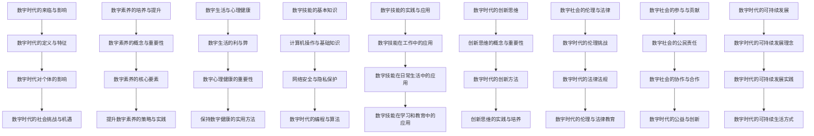

                 

## 在虚拟与现实之间寻找平衡：数字时代的生存之道

在当今社会，数字技术正以前所未有的速度和规模渗透到我们的生活中。无论是智能手机、互联网、社交媒体，还是智能家居、在线教育、远程工作，数字技术已经深刻地改变了我们的生活方式和思维方式。然而，数字技术的普及也带来了诸多挑战，如何在虚拟与现实之间寻找平衡，成为了我们这个时代的一个重要课题。

### 关键词

- 数字时代
- 虚拟现实
- 生存之道
- 数字素养
- 数字心理健康
- 数字技能
- 数字社会
- 伦理与法律
- 可持续发展

### 摘要

本文旨在探讨数字时代下如何在虚拟与现实之间寻找平衡，以实现健康、高效的生活。文章首先分析了数字时代的定义和特征，以及其对个体和社会的影响。接着，探讨了数字素养的培养与提升、数字生活与心理健康的关系。随后，文章重点介绍了数字技能的基本知识及其应用，以及如何在数字时代培养创新思维。此外，文章还讨论了数字社会的伦理与法律问题、数字社会的参与与建设，以及数字时代的可持续发展。最后，文章提供了数字时代的学习资源和实践建议，以帮助读者更好地应对数字时代带来的挑战。

### 目录大纲

## 第一部分：数字时代的认知与适应

### 第1章：数字时代的来临与影响

#### 1.1 数字时代的定义与特征

#### 1.2 数字时代对个体的影响

#### 1.3 数字时代的社会挑战与机遇

### 第2章：数字素养的培养与提升

#### 2.1 数字素养的概念与重要性

#### 2.2 数字素养的核心要素

#### 2.3 提升数字素养的策略与实践

### 第3章：数字生活与心理健康

#### 3.1 数字生活的利与弊

#### 3.2 数字心理健康的重要性

#### 3.3 保持数字健康的实用方法

## 第二部分：数字技能的培养与运用

### 第4章：数字技能的基本知识

#### 4.1 计算机操作与基础知识

#### 4.2 网络安全与隐私保护

#### 4.3 数字时代的编程与算法

### 第5章：数字技能的实践与应用

#### 5.1 数字技能在工作中的应用

#### 5.2 数字技能在日常生活中的应用

#### 5.3 数字技能在学习和教育中的应用

### 第6章：数字时代的创新思维

#### 6.1 创新思维的概念与重要性

#### 6.2 数字时代的创新方法

#### 6.3 创新思维的实践与培养

## 第三部分：数字社会的参与与建设

### 第7章：数字社会的伦理与法律

#### 7.1 数字时代的伦理挑战

#### 7.2 数字时代的法律法规

#### 7.3 数字时代的伦理与法律教育

### 第8章：数字社会的参与与贡献

#### 8.1 数字社会的公民责任

#### 8.2 数字社会的协作与合作

#### 8.3 数字时代的公益与创新

### 第9章：数字时代的可持续发展

#### 9.1 数字时代的可持续发展理念

#### 9.2 数字时代的可持续发展实践

#### 9.3 数字时代的可持续生活方式

## 附录：数字时代的学习与资源

### 附录 A：数字时代的学习资源推荐

### 附录 B：数字时代的学习方法与实践

### 附录 C：数字时代的学习社区与平台

### 图表和公式

#### 图1-1：数字时代的核心概念与联系图



#### 公式1-1：信息处理效率模型

$$
\text{信息处理效率} = \frac{\text{信息处理能力} \times \text{信息准确性}}{\text{信息处理时间}}
$$

#### 公式1-2：网络安全风险评估模型

$$
\text{风险水平} = \text{威胁可能性} \times \text{脆弱性} \times \text{潜在的损失}
$$

#### 公式1-3：数字素养评估模型

$$
\text{数字素养得分} = \frac{\text{数字技能得分} + \text{数字伦理得分} + \text{数字意识得分}}{3}
$$

## 本文结构解析

本文分为三个主要部分，每个部分都有其独特的主题和目标。

### 第一部分：数字时代的认知与适应

这一部分主要探讨数字时代的来临及其对个体和社会的影响。首先，我们将详细解释数字时代的定义和特征，帮助读者理解这一时代的本质。接着，我们会深入分析数字时代对个体带来的影响，包括生活、工作、学习和心理健康等方面。最后，我们将探讨数字时代所带来的社会挑战与机遇，帮助读者认识到这一时代的复杂性。

### 第二部分：数字技能的培养与运用

在这一部分，我们将重点关注数字技能的培养与运用。首先，我们会介绍数字技能的基本知识，包括计算机操作、网络安全和编程等方面。然后，我们会探讨如何将这些数字技能应用于工作、日常生活和学习中，以提升个人的效率和创造力。最后，我们将讨论数字时代的创新思维，帮助读者在快速变化的数字环境中保持竞争力。

### 第三部分：数字社会的参与与建设

第三部分主要讨论如何在数字社会中参与和建设。首先，我们会探讨数字社会的伦理与法律问题，帮助读者理解在数字时代中如何遵守道德规范和法律要求。接着，我们会探讨如何积极参与数字社会，包括承担责任、协作合作和参与公益活动。最后，我们将讨论数字时代的可持续发展问题，包括可持续发展理念、实践和生活方式，帮助读者在数字时代中实现可持续发展。

通过这三个部分，本文旨在帮助读者全面理解数字时代的特点和挑战，并提供实用的策略和方法，以实现虚拟与现实之间的平衡，健康、高效地生活。

### 第一部分：数字时代的认知与适应

#### 第1章：数字时代的来临与影响

随着科技的飞速发展，数字时代已经悄然而至。这一章将详细探讨数字时代的定义与特征，分析其对个体和社会的深远影响，并探讨其带来的社会挑战与机遇。

### 1.1 数字时代的定义与特征

数字时代，通常指的是以数字化信息为主要特征的社会发展阶段。在这个时代，信息技术和互联网的迅猛发展，使得信息传播、处理和利用达到了前所未有的速度和规模。数字时代的特征主要体现在以下几个方面：

1. **信息爆炸**：互联网的普及和移动设备的广泛应用，使得信息量呈指数级增长。人们可以随时随地获取到大量的信息，这既为个体提供了丰富的知识资源，也带来了信息过载的挑战。
2. **全球化**：数字技术打破了地域和时间的限制，使得全球各地的个体和组织能够实现即时沟通和协作。全球化趋势进一步加强，推动了全球经济的融合与发展。
3. **智能化**：随着人工智能、大数据和物联网等技术的发展，许多传统行业正在智能化转型。智能化技术不仅提高了生产效率，也改变了人们的生活和工作方式。
4. **虚拟化**：数字时代的另一个重要特征是虚拟化。虚拟现实（VR）和增强现实（AR）技术的应用，使得人们可以在虚拟世界中体验和互动，这为娱乐、教育、医疗等领域带来了新的可能性。

### 1.2 数字时代对个体的影响

数字时代对个体的影响是多方面的，既包括积极的方面，也有负面的影响。

#### 积极影响：

1. **信息获取**：数字时代使得个体能够更便捷地获取信息。无论是通过搜索引擎、社交媒体，还是在线课程和文献库，个体都可以快速地找到所需的知识和资源。
2. **效率提升**：数字工具和软件的应用，使得个体能够更高效地完成任务。例如，电子邮件和即时通讯工具缩短了沟通时间，云计算技术使得数据存储和处理更加便捷。
3. **技能培养**：数字时代要求个体具备一定的数字技能，这促使个体不断学习和提升自己。数字技能的培养不仅提高了个体的就业竞争力，也促进了个人成长。

#### 负面影响：

1. **信息过载**：尽管数字时代提供了丰富的信息资源，但这也带来了信息过载的问题。人们常常感到被信息淹没，难以有效管理和利用这些信息。
2. **隐私风险**：数字技术使得个人数据的收集和使用变得更加普遍。这增加了个人隐私泄露的风险，可能引发隐私纠纷和安全问题。
3. **心理健康问题**：过度依赖数字设备和社交媒体，可能导致个体出现心理问题，如焦虑、抑郁和孤独感。数字成瘾也成为了一个需要关注的社会问题。

### 1.3 数字时代的社会挑战与机遇

数字时代不仅对个体产生了深远影响，也带来了许多社会挑战和机遇。

#### 社会挑战：

1. **数字鸿沟**：数字技术的普及并没有使所有社会成员都能平等受益。数字鸿沟现象依然存在，这可能导致社会不平等加剧。
2. **就业转型**：随着自动化和智能化的推进，许多传统职业正面临被取代的风险。这要求社会和个体应对就业转型带来的挑战。
3. **网络安全**：数字技术的广泛应用，也使得网络安全成为一个重要问题。网络攻击和数据泄露事件频发，威胁到个人和社会的安全。

#### 社会机遇：

1. **创新驱动**：数字技术为创新提供了新的动力和机会。通过互联网和数字化工具，个体和企业可以更快速地实现创新，推动社会进步。
2. **经济转型**：数字时代带来了新的经济增长点，如电子商务、数字内容创作和人工智能应用。这为经济转型和升级提供了新的机遇。
3. **社会治理**：数字技术为改善社会治理提供了新的工具和方法。例如，通过大数据分析和人工智能技术，可以更高效地进行社会管理和公共服务。

### 总结

数字时代已经深刻地改变了我们的生活和社会。在享受数字技术带来便利和机遇的同时，我们也要认识到其带来的挑战和风险。通过提升数字素养、培养数字技能和积极参与数字社会，我们可以更好地适应数字时代，实现虚拟与现实之间的平衡。

#### 1.1 数字时代的定义与特征

数字时代，通常指的是以数字化信息为主要特征的社会发展阶段。在这个时代，信息技术和互联网的迅猛发展，使得信息传播、处理和利用达到了前所未有的速度和规模。数字时代的特征主要体现在以下几个方面：

1. **信息爆炸**：互联网的普及和移动设备的广泛应用，使得信息量呈指数级增长。人们可以随时随地获取到大量的信息，这既为个体提供了丰富的知识资源，也带来了信息过载的挑战。

   ```mermaid
   graph TD
   A[信息爆炸] --> B[知识资源丰富]
   B --> C[信息过载挑战]
   ```

2. **全球化**：数字技术打破了地域和时间的限制，使得全球各地的个体和组织能够实现即时沟通和协作。全球化趋势进一步加强，推动了全球经济的融合与发展。

   ```mermaid
   graph TD
   A[全球化] --> B[即时沟通]
   B --> C[经济融合]
   ```

3. **智能化**：随着人工智能、大数据和物联网等技术的发展，许多传统行业正在智能化转型。智能化技术不仅提高了生产效率，也改变了人们的生活和工作方式。

   ```mermaid
   graph TD
   A[智能化] --> B[生产效率提升]
   B --> C[生活方式改变]
   ```

4. **虚拟化**：数字时代的另一个重要特征是虚拟化。虚拟现实（VR）和增强现实（AR）技术的应用，使得人们可以在虚拟世界中体验和互动，这为娱乐、教育、医疗等领域带来了新的可能性。

   ```mermaid
   graph TD
   A[虚拟化] --> B[娱乐]
   B --> C[教育]
   C --> D[医疗]
   ```

### 1.2 数字时代对个体的影响

数字时代对个体的影响是多方面的，既包括积极的方面，也有负面的影响。

#### 积极影响：

1. **信息获取**：数字时代使得个体能够更便捷地获取信息。无论是通过搜索引擎、社交媒体，还是在线课程和文献库，个体都可以快速地找到所需的知识和资源。

   ```mermaid
   graph TD
   A[信息获取] --> B[搜索引擎]
   B --> C[社交媒体]
   C --> D[在线课程]
   D --> E[文献库]
   ```

2. **效率提升**：数字工具和软件的应用，使得个体能够更高效地完成任务。例如，电子邮件和即时通讯工具缩短了沟通时间，云计算技术使得数据存储和处理更加便捷。

   ```mermaid
   graph TD
   A[效率提升] --> B[电子邮件]
   B --> C[即时通讯]
   C --> D[云计算]
   ```

3. **技能培养**：数字时代要求个体具备一定的数字技能，这促使个体不断学习和提升自己。数字技能的培养不仅提高了个体的就业竞争力，也促进了个人成长。

   ```mermaid
   graph TD
   A[技能培养] --> B[就业竞争力]
   B --> C[个人成长]
   ```

#### 负面影响：

1. **信息过载**：尽管数字时代提供了丰富的信息资源，但这也带来了信息过载的问题。人们常常感到被信息淹没，难以有效管理和利用这些信息。

   ```mermaid
   graph TD
   A[信息过载] --> B[信息淹没]
   B --> C[管理难题]
   ```

2. **隐私风险**：数字技术使得个人数据的收集和使用变得更加普遍。这增加了个人隐私泄露的风险，可能引发隐私纠纷和安全问题。

   ```mermaid
   graph TD
   A[隐私风险] --> B[数据收集]
   B --> C[隐私泄露]
   C --> D[安全风险]
   ```

3. **心理健康问题**：过度依赖数字设备和社交媒体，可能导致个体出现心理问题，如焦虑、抑郁和孤独感。数字成瘾也成为了一个需要关注的社会问题。

   ```mermaid
   graph TD
   A[心理健康问题] --> B[焦虑]
   B --> C[抑郁]
   C --> D[孤独感]
   D --> E[数字成瘾]
   ```

### 1.3 数字时代的社会挑战与机遇

数字时代不仅对个体产生了深远影响，也带来了许多社会挑战和机遇。

#### 社会挑战：

1. **数字鸿沟**：数字技术的普及并没有使所有社会成员都能平等受益。数字鸿沟现象依然存在，这可能导致社会不平等加剧。

   ```mermaid
   graph TD
   A[数字鸿沟] --> B[社会不平等]
   ```

2. **就业转型**：随着自动化和智能化的推进，许多传统职业正面临被取代的风险。这要求社会和个体应对就业转型带来的挑战。

   ```mermaid
   graph TD
   A[就业转型] --> B[职业替代]
   ```

3. **网络安全**：数字技术的广泛应用，也使得网络安全成为一个重要问题。网络攻击和数据泄露事件频发，威胁到个人和社会的安全。

   ```mermaid
   graph TD
   A[网络安全] --> B[网络攻击]
   B --> C[数据泄露]
   ```

#### 社会机遇：

1. **创新驱动**：数字技术为创新提供了新的动力和机会。通过互联网和数字化工具，个体和企业可以更快速地实现创新，推动社会进步。

   ```mermaid
   graph TD
   A[创新驱动] --> B[创新机会]
   B --> C[社会进步]
   ```

2. **经济转型**：数字时代带来了新的经济增长点，如电子商务、数字内容创作和人工智能应用。这为经济转型和升级提供了新的机遇。

   ```mermaid
   graph TD
   A[经济转型] --> B[电子商务]
   B --> C[数字内容创作]
   C --> D[人工智能应用]
   ```

3. **社会治理**：数字技术为改善社会治理提供了新的工具和方法。例如，通过大数据分析和人工智能技术，可以更高效地进行社会管理和公共服务。

   ```mermaid
   graph TD
   A[社会治理] --> B[大数据分析]
   B --> C[人工智能技术]
   ```

### 总结

数字时代已经深刻地改变了我们的生活和社会。在享受数字技术带来便利和机遇的同时，我们也要认识到其带来的挑战和风险。通过提升数字素养、培养数字技能和积极参与数字社会，我们可以更好地适应数字时代，实现虚拟与现实之间的平衡。

### 第2章：数字素养的培养与提升

在数字时代，数字素养已经成为每个人必备的基本技能。数字素养不仅关乎个人在数字环境中的生存能力，更关系到社会整体的信息化水平和创新能力。这一章将详细探讨数字素养的概念与重要性，分析其核心要素，并提出提升数字素养的策略与实践。

#### 2.1 数字素养的概念与重要性

数字素养（Digital Literacy）是指个体在数字环境下，有效使用数字工具和资源，进行信息获取、处理和应用的能力。它不仅包括技术层面的知识，还涉及伦理、法律和社会等方面的素养。

1. **技术层面的素养**：这包括对计算机操作、互联网使用、软件应用等基本技能的掌握。例如，能够熟练使用电子邮件、社交媒体、搜索引擎等工具，以及具备基本的编程和网络安全知识。
2. **信息素养**：数字素养还包括信息素养，即个体在信息海洋中获取、评估和利用信息的能力。这涉及信息检索、信息筛选、信息分析和信息伦理等方面。
3. **社会和文化素养**：数字素养还涉及社会和文化层面的素养，包括网络礼仪、数字伦理、数字隐私保护以及跨文化交流等。

数字素养的重要性体现在以下几个方面：

1. **提升生活质量**：具备良好的数字素养，可以帮助个体更好地利用数字工具和资源，提高工作效率和生活质量。
2. **促进终身学习**：数字素养是终身学习的重要基础。在数字化时代，持续学习和更新知识技能变得尤为重要，而数字素养正是实现这一目标的关键。
3. **增强竞争力**：在职场和竞争中，数字素养是衡量个人能力的重要指标。具备良好的数字素养，可以提升个人的职业竞争力。
4. **参与社会建设**：数字素养不仅关乎个人发展，也关系到社会整体的信息化水平和创新能力。通过提高全民数字素养，可以推动社会的数字化进程，促进社会的和谐与进步。

#### 2.2 数字素养的核心要素

数字素养的核心要素包括以下几个方面：

1. **技术技能**：技术技能是数字素养的基础。这包括计算机操作、软件应用、编程基础等。例如，了解如何使用操作系统、掌握基本的编程语言，以及具备网络安全意识。

   ```mermaid
   graph TD
   A[技术技能] --> B[计算机操作]
   B --> C[软件应用]
   C --> D[编程基础]
   D --> E[网络安全]
   ```

2. **信息素养**：信息素养是数字素养的重要组成部分。这包括信息检索、信息筛选、信息分析和信息伦理等方面。例如，如何有效地在互联网上检索信息，评估信息的准确性和可靠性，以及遵守信息伦理规范。

   ```mermaid
   graph TD
   A[信息素养] --> B[信息检索]
   B --> C[信息筛选]
   C --> D[信息分析]
   D --> E[信息伦理]
   ```

3. **数字伦理**：数字伦理是指个体在数字环境中应遵守的道德规范。这包括尊重他人隐私、不侵犯知识产权、遵守网络安全法规等。数字伦理不仅关系到个人行为，也影响整个社会的数字环境。

   ```mermaid
   graph TD
   A[数字伦理] --> B[隐私尊重]
   B --> C[知识产权]
   C --> D[网络安全法]
   ```

4. **数字安全**：数字安全是指个体在数字环境中保护自己和他人的安全。这包括防范网络攻击、保护个人数据、避免数字诈骗等。数字安全是数字素养的重要组成部分，关系到个人的隐私和安全。

   ```mermaid
   graph TD
   A[数字安全] --> B[网络攻击防范]
   B --> C[个人数据保护]
   C --> D[数字诈骗预防]
   ```

5. **协作与沟通**：在数字时代，协作和沟通能力变得尤为重要。数字素养包括如何利用数字工具进行有效沟通和协作。例如，如何使用即时通讯工具、视频会议软件，以及如何在社交媒体上建立良好的沟通网络。

   ```mermaid
   graph TD
   A[协作与沟通] --> B[即时通讯]
   B --> C[视频会议]
   C --> D[社交媒体沟通]
   ```

#### 2.3 提升数字素养的策略与实践

提升数字素养需要从个人、教育机构和社会等多个层面进行。以下是一些具体的策略和实践：

1. **个人学习**：个人可以通过自学、参加在线课程和培训等方式，不断提升自己的数字技能。例如，可以通过在线学习平台（如Coursera、edX等）学习编程、数据分析和网络安全等课程。

   ```mermaid
   graph TD
   A[个人学习] --> B[在线课程]
   B --> C[编程学习]
   C --> D[数据分析]
   D --> E[网络安全]
   ```

2. **学校教育**：学校应将数字素养教育纳入课程体系，从基础教育到高等教育，逐步培养学生的数字技能。例如，可以在中小学开设信息技术课程，在大学设置数字素养相关的选修课或专业课程。

   ```mermaid
   graph TD
   A[学校教育] --> B[基础教育]
   B --> C[信息技术课程]
   C --> D[高等教育]
   D --> E[专业课程]
   ```

3. **社会培训**：社会可以组织各种形式的数字素养培训，面向不同群体提供针对性的培训服务。例如，可以为老年人提供数字技能培训，帮助他们更好地适应数字化生活；为失业者提供数字技能培训，提升他们的就业竞争力。

   ```mermaid
   graph TD
   A[社会培训] --> B[老年人培训]
   B --> C[失业者培训]
   C --> D[数字技能提升]
   ```

4. **政策支持**：政府可以通过制定相关政策，支持和推动数字素养的提升。例如，可以提供资金支持数字素养教育，建立数字素养评估体系，制定网络安全法规等。

   ```mermaid
   graph TD
   A[政策支持] --> B[资金支持]
   B --> C[数字素养评估]
   C --> D[网络安全法规]
   ```

5. **社会宣传**：社会可以通过各种渠道宣传数字素养的重要性，提高公众对数字素养的认知和重视。例如，可以通过媒体、社区活动等方式，开展数字素养宣传活动，提高公众的数字素养意识。

   ```mermaid
   graph TD
   A[社会宣传] --> B[媒体宣传]
   B --> C[社区活动]
   C --> D[数字素养意识]
   ```

通过以上策略和实践，我们可以逐步提升全民的数字素养，为数字时代的健康发展打下坚实的基础。

#### 2.1 数字素养的概念与重要性

数字素养（Digital Literacy）是指个体在数字环境下，有效使用数字工具和资源，进行信息获取、处理和应用的能力。它不仅包括技术层面的知识，还涉及伦理、法律和社会等方面的素养。

1. **技术层面的素养**：这包括对计算机操作、互联网使用、软件应用等基本技能的掌握。例如，能够熟练使用电子邮件、社交媒体、搜索引擎等工具，以及具备基本的编程和网络安全知识。

   ```mermaid
   graph TD
   A[技术技能] --> B[计算机操作]
   B --> C[软件应用]
   C --> D[编程基础]
   D --> E[网络安全]
   ```

2. **信息素养**：数字素养还包括信息素养，即个体在信息海洋中获取、评估和利用信息的能力。这涉及信息检索、信息筛选、信息分析和信息伦理等方面。

   ```mermaid
   graph TD
   A[信息素养] --> B[信息检索]
   B --> C[信息筛选]
   C --> D[信息分析]
   D --> E[信息伦理]
   ```

3. **数字伦理**：数字伦理是指个体在数字环境中应遵守的道德规范。这包括尊重他人隐私、不侵犯知识产权、遵守网络安全法规等。数字伦理不仅关系到个人行为，也影响整个社会的数字环境。

   ```mermaid
   graph TD
   A[数字伦理] --> B[隐私尊重]
   B --> C[知识产权]
   C --> D[网络安全法]
   ```

4. **数字安全**：数字安全是指个体在数字环境中保护自己和他人的安全。这包括防范网络攻击、保护个人数据、避免数字诈骗等。数字安全是数字素养的重要组成部分，关系到个人的隐私和安全。

   ```mermaid
   graph TD
   A[数字安全] --> B[网络攻击防范]
   B --> C[个人数据保护]
   C --> D[数字诈骗预防]
   ```

5. **协作与沟通**：在数字时代，协作和沟通能力变得尤为重要。数字素养包括如何利用数字工具进行有效沟通和协作。例如，如何使用即时通讯工具、视频会议软件，以及如何在社交媒体上建立良好的沟通网络。

   ```mermaid
   graph TD
   A[协作与沟通] --> B[即时通讯]
   B --> C[视频会议]
   C --> D[社交媒体沟通]
   ```

数字素养的重要性体现在以下几个方面：

1. **提升生活质量**：具备良好的数字素养，可以帮助个体更好地利用数字工具和资源，提高工作效率和生活质量。
2. **促进终身学习**：数字素养是终身学习的重要基础。在数字化时代，持续学习和更新知识技能变得尤为重要，而数字素养正是实现这一目标的关键。
3. **增强竞争力**：在职场和竞争中，数字素养是衡量个人能力的重要指标。具备良好的数字素养，可以提升个人的职业竞争力。
4. **参与社会建设**：数字素养不仅关乎个人发展，也关系到社会整体的信息化水平和创新能力。通过提高全民数字素养，可以推动社会的数字化进程，促进社会的和谐与进步。

#### 2.2 数字素养的核心要素

数字素养的核心要素包括以下几个方面：

1. **技术技能**：技术技能是数字素养的基础。这包括计算机操作、软件应用、编程基础等。例如，了解如何使用操作系统、掌握基本的编程语言，以及具备网络安全意识。

   ```mermaid
   graph TD
   A[技术技能] --> B[计算机操作]
   B --> C[软件应用]
   C --> D[编程基础]
   D --> E[网络安全]
   ```

2. **信息素养**：信息素养是数字素养的重要组成部分。这包括信息检索、信息筛选、信息分析和信息伦理等方面。例如，如何有效地在互联网上检索信息，评估信息的准确性和可靠性，以及遵守信息伦理规范。

   ```mermaid
   graph TD
   A[信息素养] --> B[信息检索]
   B --> C[信息筛选]
   C --> D[信息分析]
   D --> E[信息伦理]
   ```

3. **数字伦理**：数字伦理是指个体在数字环境中应遵守的道德规范。这包括尊重他人隐私、不侵犯知识产权、遵守网络安全法规等。数字伦理不仅关系到个人行为，也影响整个社会的数字环境。

   ```mermaid
   graph TD
   A[数字伦理] --> B[隐私尊重]
   B --> C[知识产权]
   C --> D[网络安全法]
   ```

4. **数字安全**：数字安全是指个体在数字环境中保护自己和他人的安全。这包括防范网络攻击、保护个人数据、避免数字诈骗等。数字安全是数字素养的重要组成部分，关系到个人的隐私和安全。

   ```mermaid
   graph TD
   A[数字安全] --> B[网络攻击防范]
   B --> C[个人数据保护]
   C --> D[数字诈骗预防]
   ```

5. **协作与沟通**：在数字时代，协作和沟通能力变得尤为重要。数字素养包括如何利用数字工具进行有效沟通和协作。例如，如何使用即时通讯工具、视频会议软件，以及如何在社交媒体上建立良好的沟通网络。

   ```mermaid
   graph TD
   A[协作与沟通] --> B[即时通讯]
   B --> C[视频会议]
   C --> D[社交媒体沟通]
   ```

#### 2.3 提升数字素养的策略与实践

提升数字素养需要从个人、教育机构和社会等多个层面进行。以下是一些具体的策略和实践：

1. **个人学习**：个人可以通过自学、参加在线课程和培训等方式，不断提升自己的数字技能。例如，可以通过在线学习平台（如Coursera、edX等）学习编程、数据分析和网络安全等课程。

   ```mermaid
   graph TD
   A[个人学习] --> B[在线课程]
   B --> C[编程学习]
   C --> D[数据分析]
   D --> E[网络安全]
   ```

2. **学校教育**：学校应将数字素养教育纳入课程体系，从基础教育到高等教育，逐步培养学生的数字技能。例如，可以在中小学开设信息技术课程，在大学设置数字素养相关的选修课或专业课程。

   ```mermaid
   graph TD
   A[学校教育] --> B[基础教育]
   B --> C[信息技术课程]
   C --> D[高等教育]
   D --> E[专业课程]
   ```

3. **社会培训**：社会可以组织各种形式的数字素养培训，面向不同群体提供针对性的培训服务。例如，可以为老年人提供数字技能培训，帮助他们更好地适应数字化生活；为失业者提供数字技能培训，提升他们的就业竞争力。

   ```mermaid
   graph TD
   A[社会培训] --> B[老年人培训]
   B --> C[失业者培训]
   C --> D[数字技能提升]
   ```

4. **政策支持**：政府可以通过制定相关政策，支持和推动数字素养的提升。例如，可以提供资金支持数字素养教育，建立数字素养评估体系，制定网络安全法规等。

   ```mermaid
   graph TD
   A[政策支持] --> B[资金支持]
   B --> C[数字素养评估]
   C --> D[网络安全法规]
   ```

5. **社会宣传**：社会可以通过各种渠道宣传数字素养的重要性，提高公众对数字素养的认知和重视。例如，可以通过媒体、社区活动等方式，开展数字素养宣传活动，提高公众的数字素养意识。

   ```mermaid
   graph TD
   A[社会宣传] --> B[媒体宣传]
   B --> C[社区活动]
   C --> D[数字素养意识]
   ```

通过以上策略和实践，我们可以逐步提升全民的数字素养，为数字时代的健康发展打下坚实的基础。

### 第3章：数字生活与心理健康

#### 3.1 数字生活的利与弊

随着数字技术的迅速发展，数字生活已成为我们日常不可或缺的一部分。数字生活在给我们带来诸多便利的同时，也带来了一些潜在的问题。

**优势：**

1. **便捷性**：数字技术使我们的生活变得更加便捷。例如，通过智能手机和互联网，我们可以随时随地完成购物、支付、点餐等日常活动。
2. **信息获取**：互联网为我们提供了丰富的信息资源。通过搜索引擎和在线数据库，我们可以快速获取所需的知识和资料。
3. **社交互动**：数字技术使得社交变得更加容易。通过社交媒体和即时通讯工具，我们可以与朋友和家人保持联系，甚至结识新朋友。

**劣势：**

1. **信息过载**：尽管互联网提供了大量的信息，但这也可能导致信息过载。人们可能会感到被信息淹没，难以有效管理和利用这些信息。
2. **隐私风险**：数字技术使得个人数据的收集和使用变得更加普遍。这增加了个人隐私泄露的风险，可能引发隐私纠纷和安全问题。
3. **心理健康问题**：过度依赖数字设备和社交媒体，可能导致个体出现心理问题，如焦虑、抑郁和孤独感。数字成瘾也成为了一个需要关注的社会问题。

#### 3.2 数字心理健康的重要性

数字心理健康是指个体在数字环境下保持良好的心理状态和适应能力。它不仅关系到个人的幸福感和生活质量，也影响到社会的稳定和发展。

**重要性：**

1. **心理健康水平**：良好的数字心理健康有助于提高个体的幸福感、生活满意度和心理健康水平。
2. **社会适应能力**：数字心理健康是个体适应数字时代的重要能力。它有助于个体在面对数字挑战时保持积极的态度，有效应对各种压力和困难。
3. **社会和谐**：数字心理健康对社会的和谐稳定具有重要意义。通过提高全民的数字心理健康水平，可以减少社会冲突，促进社会的和谐与发展。

#### 3.3 保持数字健康的实用方法

为了保持良好的数字心理健康，我们可以采取以下一些实用方法：

1. **合理安排时间**：在数字生活中，合理安排时间非常重要。我们应该避免长时间连续使用数字设备，尤其是避免在睡前使用手机和电脑等设备。这样可以减少对眼睛的伤害，也有助于提高睡眠质量。

2. **健康使用社交媒体**：社交媒体为我们提供了便利的社交途径，但过度使用也可能带来负面影响。我们应该有意识地控制使用社交媒体的时间，避免沉迷于虚拟社交，而忽略了现实生活中的亲情和友情。

3. **培养兴趣爱好**：培养兴趣爱好可以帮助我们缓解压力，提高心理健康。例如，可以学习绘画、音乐、运动等，这些活动不仅能够丰富我们的生活，也有助于提高我们的心理健康水平。

4. **保持良好的生活习惯**：良好的生活习惯对数字心理健康至关重要。我们应该保持规律的作息时间，保持良好的饮食习惯，适当进行体育锻炼，这些都有助于提高我们的身心健康。

5. **寻求专业帮助**：如果感到数字心理健康出现严重问题，如焦虑、抑郁等，应及时寻求专业心理咨询师的帮助。专业心理咨询师可以提供有效的心理支持和治疗，帮助我们走出心理困境。

通过以上方法，我们可以更好地保持数字心理健康，享受数字生活带来的便利，同时避免其带来的负面影响。

### 第4章：数字技能的基本知识

在数字时代，掌握基本的数字技能是每个人都需要具备的基本能力。这一章将详细介绍计算机操作与基础知识、网络安全与隐私保护，以及数字时代的编程与算法。

#### 4.1 计算机操作与基础知识

计算机操作与基础知识是数字技能的基础，包括操作系统、文件管理、网络设置和基本软件使用等方面。

**操作系统**：操作系统是计算机的核心软件，它管理计算机的硬件和软件资源，提供用户界面。常见的操作系统包括Windows、macOS和Linux。了解如何使用操作系统，能够帮助我们更高效地管理计算机资源，运行应用程序，进行文件管理。

**文件管理**：文件管理是计算机操作的重要组成部分。了解如何创建、复制、移动、删除和搜索文件，能够帮助我们更高效地管理计算机中的数据。此外，掌握文件压缩和解压缩的方法，可以帮助我们节省存储空间，便于数据传输。

**网络设置**：网络设置是连接计算机与互联网的关键。了解如何配置网络连接、设置无线网络和安全密码，能够帮助我们确保计算机的安全性和稳定性。此外，了解网络协议和网络安全知识，可以帮助我们更好地保护计算机不受网络攻击。

**基本软件使用**：计算机操作还涉及基本软件的使用，如文字处理软件、电子表格软件和演示软件等。熟练掌握这些软件的使用，能够帮助我们更高效地完成日常工作和学习任务。

#### 4.2 网络安全与隐私保护

在数字时代，网络安全与隐私保护变得尤为重要。了解网络安全的基本知识，掌握隐私保护的技巧，能够帮助我们更好地保护个人和企业的信息安全。

**网络安全风险**：网络安全风险主要包括病毒、木马、恶意软件、网络钓鱼等。了解这些风险的特点和危害，能够帮助我们更好地防范网络攻击。

**网络安全措施**：为了保护计算机和网络安全，我们可以采取以下措施：

- **安装杀毒软件**：定期更新杀毒软件，防止病毒和恶意软件入侵。
- **使用防火墙**：防火墙可以帮助我们阻止未授权的网络访问，保护计算机不受网络攻击。
- **加密数据**：对敏感数据进行加密，防止数据泄露。
- **使用复杂密码**：使用强密码，避免使用易被破解的简单密码。
- **定期更新系统和软件**：及时更新操作系统和软件，修复安全漏洞。

**隐私保护**：隐私保护包括保护个人数据和隐私信息。以下是一些隐私保护技巧：

- **谨慎使用社交媒体**：不要随意泄露个人信息，如姓名、住址、电话号码等。
- **使用隐私保护工具**：如VPN、广告拦截器等，保护个人数据不被跟踪和滥用。
- **定期检查账户权限**：确保只有授权的应用程序和人员有权访问我们的账户和信息。

#### 4.3 数字时代的编程与算法

编程与算法是数字技能的核心，掌握编程语言和算法原理，能够帮助我们开发软件、解决复杂问题和实现创新。

**编程语言**：常见的编程语言包括Python、Java、C++等。每种编程语言都有其特点和适用场景。选择合适的编程语言，能够帮助我们更高效地实现开发目标。

**算法原理**：算法是解决问题的步骤和规则。掌握算法原理，能够帮助我们解决复杂问题，提高计算效率。常见的算法包括排序算法、查找算法、图算法等。

**编程实践**：编程实践是掌握编程技能的关键。以下是一些编程实践建议：

- **学习编程基础**：从基础知识开始学习，如数据类型、控制结构、函数等。
- **编写小程序**：通过编写小程序，实践编程知识和技巧。
- **参与开源项目**：参与开源项目，与其他开发者合作，提高编程技能。
- **解决实际问题**：通过解决实际问题，将编程知识应用于实际场景。

通过以上学习与实践，我们可以逐步掌握数字技能，提升自己的竞争力，适应数字时代的发展。

### 第5章：数字技能的实践与应用

在掌握了数字技能的基本知识后，如何将所学应用于实际工作和生活中，是提高数字素养的关键。这一章将探讨数字技能在工作、日常生活和学习中的应用，以及如何利用这些技能提升效率和创造力。

#### 5.1 数字技能在工作中的应用

在职场中，数字技能的应用能够显著提高工作效率和职业竞争力。

**电子邮件与即时通讯**：电子邮件和即时通讯工具如Slack、Microsoft Teams等，是现代职场中不可或缺的沟通工具。熟练使用这些工具，可以帮助我们快速、高效地进行信息传递和团队合作。

**项目管理软件**：项目管理软件如Trello、Asana等，可以帮助团队进行任务分配、进度跟踪和协作管理，提高项目执行效率。

**数据分析和报告**：使用Excel、Google Sheets等电子表格软件，以及Power BI、Tableau等数据可视化工具，可以对大量数据进行分析和报告，为企业决策提供有力支持。

**自动化工具**：利用编程技能开发自动化脚本，可以减少重复性工作，提高工作效率。例如，使用Python脚本自动化数据采集、处理和报告生成。

**网络安全与数据保护**：在工作中，确保网络安全和数据保护至关重要。通过学习网络安全知识，可以更好地防范网络攻击，保护企业信息安全。

#### 5.2 数字技能在日常生活中的应用

数字技能不仅在工作中有用，在日常生活中也能带来诸多便利。

**智能家居**：通过学习物联网（IoT）技术，我们可以将家居设备连接到互联网，实现智能家居。例如，使用智能音箱控制灯光、空调等设备，提高生活舒适度。

**在线购物和支付**：数字技能使得在线购物和支付变得更加便捷。熟练使用电子商务平台和移动支付工具，可以节省购物时间，提高购物体验。

**健康与健身**：通过数字工具如健身追踪器、健康APP等，我们可以更好地管理自己的健康和健身。例如，记录运动数据、跟踪饮食摄入，实现健康目标。

**社交媒体与网络社区**：通过社交媒体和在线社区，我们可以与朋友和家人保持联系，发现新的兴趣和爱好，甚至拓展社交圈。

#### 5.3 数字技能在学习和教育中的应用

在学习和教育领域，数字技能同样具有重要应用价值。

**在线学习平台**：使用在线学习平台如Coursera、edX等，我们可以随时随地进行在线学习，获取各种专业知识和技能。

**电子学习资源**：通过搜索引擎和在线数据库，我们可以方便地获取学习资源，如电子书、学术论文、教学视频等。

**虚拟现实与增强现实**：虚拟现实（VR）和增强现实（AR）技术在教育中的应用，为学习提供了新的互动方式。通过VR/AR技术，学生可以身临其境地体验历史事件、科学实验等。

**教育技术工具**：教育技术工具如Quizlet、Schoology等，可以帮助教师和学生进行互动式学习和评估。

#### 如何提升数字技能

1. **持续学习**：数字技能不断更新和发展，我们需要持续学习以跟上技术进步的步伐。可以通过在线课程、专业书籍、技术论坛等多种途径进行学习。
2. **实践应用**：理论知识需要通过实践来巩固。可以通过实际项目、编程练习、日常生活中的应用等方式，将所学知识付诸实践。
3. **参与社区**：加入技术社区，与其他开发者、学习者交流，分享经验和见解，可以更快地提升技能。
4. **培养创新思维**：在数字技能的基础上，培养创新思维，探索新的应用场景和解决方案，可以让我们在竞争中保持领先。

通过以上方法，我们可以不断提升数字技能，将其应用于实际工作和生活中，提高效率、创造更多价值。

### 第6章：数字时代的创新思维

在数字时代，创新思维显得尤为重要。创新不仅是推动技术进步和社会发展的重要动力，也是个人在职场和生活中脱颖而出的关键。这一章将探讨创新思维的概念与重要性，介绍数字时代的创新方法，并提供实践与创新思维的培养策略。

#### 6.1 创新思维的概念与重要性

**创新思维**是指通过独特的视角、方法和工具，创造新想法、新产品或新服务的能力。它是一种创造性思维，能够帮助我们面对复杂问题和挑战时，找到独特和有效的解决方案。

**重要性：**

1. **推动技术进步**：创新思维是技术创新的重要驱动力。通过不断探索和尝试，我们可以开发出新技术、新产品，推动科技进步和社会发展。
2. **提高竞争力**：在激烈的市场竞争中，具备创新思维的企业和个人能够脱颖而出，抢占市场先机，提升竞争力。
3. **解决复杂问题**：创新思维能够帮助我们以更高效、更巧妙的方式解决复杂问题，提高工作和生活的质量。
4. **创造新价值**：创新思维可以发掘新的市场机会，创造新的商业价值和社会价值。

#### 6.2 数字时代的创新方法

**1. 需求驱动创新**：需求驱动创新是一种基于用户需求和市场趋势的创新方法。通过深入了解用户需求和市场动态，我们可以开发出符合用户期望的新产品或服务。

**2. 开放式创新**：开放式创新是一种借助外部资源和智慧的创新方法。通过建立合作伙伴关系、开展众包活动或开放创新平台，我们可以吸收外部智慧，加速创新过程。

**3. 跨界融合创新**：跨界融合创新是一种将不同领域、不同行业的知识和技术融合在一起的创新方法。通过跨界合作，我们可以创造出具有独特价值的新产品或服务。

**4. 颠覆性创新**：颠覆性创新是一种通过颠覆现有市场格局，创造新市场的创新方法。通过开发出与传统产品或服务截然不同的新产品或服务，我们可以打破市场格局，实现商业突破。

#### 6.3 创新思维的实践与培养

**1. 深入调研**：创新始于对问题的深刻理解。通过调研用户需求、市场趋势和技术动态，我们可以发现潜在的创新机会。
**2. 想象力**：想象力是创新思维的核心。通过大胆假设、自由发挥，我们可以产生新的想法和解决方案。
**3. 跨界思维**：跨界思维能够帮助我们打破领域界限，从不同领域汲取灵感。通过跨学科、跨行业的交流与合作，我们可以产生新的创意。
**4. 快速迭代**：创新过程是一个不断迭代和优化的过程。通过快速试错、快速迭代，我们可以不断改进创新成果，提高创新的成功率。
**5. 鼓励试错**：在创新过程中，试错是不可避免的。我们应该鼓励团队成员勇于尝试、勇于失败，从失败中学习，不断积累经验。

**培养策略：**

1. **持续学习**：通过阅读、参加培训和研讨会，不断更新知识，提升自己的专业素养。
2. **实践应用**：将所学知识应用于实际项目和问题解决中，通过实践培养创新思维。
3. **参与社区**：加入创新社区，与其他创新者交流，分享经验和见解，拓展视野。
4. **跨学科学习**：学习不同领域的知识和技能，培养跨学科思维，提高创新的综合能力。
5. **反思与总结**：在创新过程中，定期反思和总结，分析成功的经验和失败的教训，不断优化创新方法和策略。

通过以上实践与培养策略，我们可以逐步提升创新思维，成为数字时代的创新者，为社会创造更多的价值。

### 第7章：数字社会的伦理与法律

在数字时代，随着技术的飞速发展和信息的广泛传播，伦理和法律问题变得尤为重要。数字社会的伦理和法律不仅关乎个体和社会的公平、正义和安全，也直接影响着数字技术和数字经济的发展。这一章将探讨数字时代的伦理挑战、法律法规以及如何进行伦理与法律教育。

#### 7.1 数字时代的伦理挑战

数字时代带来了许多新的伦理挑战，这些挑战涉及隐私、数据安全、人工智能、网络行为等多个方面。

**隐私保护**：随着大数据和云计算的发展，个人数据被大量收集和使用。如何在保障个人隐私的同时，合理利用数据成为了一个重要的伦理问题。

**数据安全**：网络攻击和数据泄露事件频发，个人和企业数据的安全受到严重威胁。如何保护数据安全，防止信息泄露和滥用，是数字时代面临的重大伦理挑战。

**人工智能伦理**：人工智能技术的快速发展带来了许多新的伦理问题。例如，算法偏见、自动化决策的透明度和责任归属等，都需要我们深入思考和解决。

**网络行为规范**：互联网的匿名性和开放性，使得网络暴力和网络欺凌等问题日益严重。如何规范网络行为，维护网络环境的健康和秩序，是数字时代的一个重要伦理挑战。

#### 7.2 数字时代的法律法规

为了应对数字时代的伦理挑战，各国政府和企业纷纷制定了相关的法律法规，以规范数字行为和保护个人权益。

**隐私保护法律**：许多国家已经制定了隐私保护法律，如欧盟的《通用数据保护条例》（GDPR）和中国的《网络安全法》。这些法律对个人数据的收集、存储、使用和传输进行了严格的规定，以保护个人隐私。

**网络安全法律**：网络安全法律旨在保护网络系统免受攻击和数据泄露。例如，美国的《联邦信息安全管理法》（FISMA）和《加州消费者隐私法案》（CCPA）等，都对网络安全提出了明确的要求。

**人工智能法律**：随着人工智能技术的广泛应用，各国也在积极制定相关法律，以规范人工智能的发展。例如，欧盟的《人工智能法案》提出了对高风险人工智能系统的监管要求。

**网络行为法律**：许多国家制定了网络行为法律，以规范网络行为和维护网络秩序。例如，中国的《互联网信息服务管理办法》和《网络安全法》都对网络行为进行了详细规定。

#### 7.3 数字时代的伦理与法律教育

为了应对数字时代的伦理和法律挑战，加强伦理与法律教育显得尤为重要。

**教育目标**：数字时代的伦理与法律教育旨在培养个体的数字素养，使他们在使用数字技术和参与数字社会时，能够遵守道德规范、尊重他人隐私、保护数据安全、遵守法律法规。

**教育内容**：数字时代的伦理与法律教育应包括以下内容：

- **隐私保护**：教育个体如何保护自己的隐私，避免隐私泄露。
- **数据安全**：教育个体如何保护数据安全，防范网络攻击和数据泄露。
- **人工智能伦理**：教育个体如何理解和应对人工智能带来的伦理挑战。
- **网络行为规范**：教育个体如何遵守网络行为规范，维护网络环境的健康和秩序。
- **法律法规**：教育个体如何了解和遵守相关的法律法规，维护自身权益。

**教育方式**：数字时代的伦理与法律教育可以通过多种方式进行，包括课堂教学、在线课程、实践活动、案例分析等。通过多样化的教育方式，可以提高个体的数字素养和法治意识。

通过加强伦理与法律教育，我们可以培养更多具备良好数字素养和法律意识的个体，为数字社会的健康发展提供有力支持。

### 第8章：数字社会的参与与贡献

在数字时代，每一个个体都有机会参与到数字社会中，为社会的发展和进步做出贡献。这一章将探讨数字社会的公民责任、协作与合作以及公益与创新，帮助读者了解如何在数字时代中发挥积极作用。

#### 8.1 数字社会的公民责任

数字社会公民责任是指个体在数字环境中应承担的义务和责任，包括遵守法律法规、维护网络秩序、保护个人隐私和数据安全等方面。

**遵守法律法规**：在数字时代，个体应遵守相关的法律法规，如网络安全法、隐私保护法等。这不仅是法律的要求，也是维护社会秩序和自身权益的基础。

**维护网络秩序**：个体应积极参与到网络秩序的维护中，不传播虚假信息，不参与网络暴力，不滥用网络资源，共同营造一个健康、有序的网络环境。

**保护个人隐私和数据安全**：在数字社会中，个人隐私和数据安全面临巨大挑战。个体应提高自身安全意识，采取有效措施保护个人隐私和数据安全，防止信息泄露和滥用。

**参与公共事务**：个体应积极参与公共事务，如在线投票、网络调查、社区讨论等，为数字社会的发展建言献策，推动社会进步。

#### 8.2 数字社会的协作与合作

在数字时代，协作与合作是推动社会发展和创新的重要力量。通过有效的协作与合作，我们可以实现资源的共享、智慧的融合和成果的共赢。

**资源共享**：数字技术使得资源的共享变得更加便捷和高效。通过云计算、大数据等技术，我们可以实现数据的共享，提高资源利用效率，推动社会进步。

**智慧融合**：协作与合作能够汇聚不同领域的智慧和力量，通过跨学科、跨领域的合作，我们可以解决复杂问题，推动技术创新。

**成果共赢**：通过协作与合作，我们可以实现成果的共赢。无论是科研项目、商业项目还是公益活动，通过合作，我们可以取得更好的成果，为社会创造更多价值。

**协同工作**：在数字社会中，协同工作成为了一种重要的工作方式。通过即时通讯、视频会议、项目管理工具等数字工具，团队成员可以随时进行沟通和协作，提高工作效率。

**开放创新**：开放式创新是一种重要的协作与合作方式。通过开放创新平台，我们可以吸引更多的创新者和资源，共同推动创新，加速技术进步。

#### 8.3 数字时代的公益与创新

在数字时代，公益与创新是推动社会发展和进步的重要动力。通过数字技术，我们可以实现公益的数字化转型，推动公益事业的创新与发展。

**数字化转型**：通过数字技术，我们可以将传统的公益模式转化为数字公益。例如，通过在线捐赠、网络筹款、智能公益平台等方式，实现公益活动的数字化转型，提高公益效率和影响力。

**公益创新**：数字技术为公益创新提供了新的可能。通过大数据分析、人工智能技术等，我们可以更精准地识别公益需求，优化公益资源配置，提高公益活动的效果。

**社会企业**：社会企业是一种以解决社会问题为主要目标的商业实体。通过数字技术，社会企业可以实现商业模式创新，推动社会问题的解决。

**创新公益项目**：通过创新公益项目，我们可以探索新的公益模式，为社会创造更多价值。例如，通过互联网平台，我们可以开展在线教育、远程医疗等公益项目，帮助更多需要帮助的人群。

**数字化协作**：通过数字技术，我们可以实现公益项目的数字化协作。例如，通过在线协作平台，志愿者可以随时加入公益项目，共同为公益事业贡献力量。

通过积极参与数字社会的建设和贡献，我们可以共同推动社会的进步和发展，实现共享繁荣。

### 第9章：数字时代的可持续发展

在数字时代，可持续发展已成为全球关注的重要议题。随着数字技术的广泛应用，我们不仅要在经济上实现增长，还要在环境和社会方面实现可持续发展。这一章将探讨数字时代的可持续发展理念、实践以及可持续生活方式。

#### 9.1 数字时代的可持续发展理念

数字时代的可持续发展理念强调在数字技术推动下，实现经济增长、环境保护和社会公平的协调发展。以下是数字时代可持续发展的几个关键理念：

**1. 绿色技术**：绿色技术是指通过技术创新，减少资源消耗和环境污染的技术。在数字时代，绿色技术包括可再生能源利用、节能技术、清洁生产等，这些技术有助于减少碳排放，实现环境保护。

**2. 信息共享**：信息共享是可持续发展的重要手段。通过数字技术，我们可以实现信息的快速传播和共享，提高资源利用效率，促进知识传播和科技创新。

**3. 社会责任**：社会责任是企业和社会个体在数字时代应承担的责任。企业应通过数字技术实现可持续发展，如通过绿色供应链管理、社会责任报告等，推动企业社会责任的实现。

**4. 数据伦理**：数据伦理是指在使用数字技术时，遵守道德规范，保护个人隐私和数据安全。在数字时代，数据伦理尤为重要，只有遵守数据伦理，才能实现可持续发展。

**5. 跨界合作**：跨界合作是数字时代可持续发展的重要方式。通过跨学科、跨领域的合作，我们可以实现资源的共享和优势互补，推动可持续发展目标的实现。

#### 9.2 数字时代的可持续发展实践

在数字时代，许多实践已经展示了可持续发展的可能性。以下是一些具体的可持续发展实践：

**1. 可再生能源**：通过数字技术，我们可以实现可再生能源的智能管理和高效利用。例如，智能电网和能源管理系统可以提高可再生能源的利用效率，减少能源浪费。

**2. 绿色制造**：绿色制造是指通过技术创新，减少制造业对环境的影响。数字技术可以帮助企业实现生产过程的自动化、智能化和低碳化，减少资源消耗和污染物排放。

**3. 智慧城市**：智慧城市通过数字技术实现城市管理的智能化和精细化。智慧城市可以优化交通、能源、水资源等城市管理，提高城市可持续发展水平。

**4. 可持续农业**：通过数字技术，可以实现农业的智能化和可持续发展。例如，智能农业系统可以通过传感器、无人机等技术，实现精准农业管理，提高农业产量，减少资源消耗。

**5. 数据治理**：数据治理是数字时代可持续发展的重要保障。通过建立完善的数据治理体系，我们可以确保数据的真实性、完整性和安全性，为可持续发展提供可靠的数据支持。

#### 9.3 数字时代的可持续生活方式

在数字时代，每个人都可以通过改变生活方式，为可持续发展贡献自己的力量。以下是一些可持续生活方式的建议：

**1. 环保出行**：选择公共交通、骑行或步行等低碳出行方式，减少汽车尾气排放。

**2. 节能减排**：在家庭和工作场所，使用节能设备和高效照明，减少能源消耗。

**3. 垃圾分类**：积极参与垃圾分类，减少垃圾产生，提高资源回收利用率。

**4. 环保消费**：选择环保、低碳的产品和服务，减少对环境的负面影响。

**5. 数字素养**：提高数字素养，合理使用数字工具和资源，避免数字浪费。

**6. 绿色办公**：在办公场所，推行绿色办公理念，减少纸质文档使用，推广电子文档和远程办公。

通过以上实践和建议，我们可以共同推动数字时代的可持续发展，实现经济增长、环境保护和社会公平的协调发展。

### 附录：数字时代的学习与资源

在数字时代，学习资源和平台的发展为学习者提供了前所未有的便利。以下是一些推荐的学习资源和方法，以及数字时代的学习社区与平台。

#### 附录 A：数字时代的学习资源推荐

**在线课程平台**：
1. **Coursera**：提供来自全球顶尖大学的在线课程，涵盖计算机科学、数据科学、人工智能等多个领域。
2. **edX**：由哈佛大学和麻省理工学院共同创办，提供免费和付费的在线课程，内容涵盖科学、工程、人文等多个学科。
3. **Udacity**：专注于职业教育的在线学习平台，提供编程、数据科学、人工智能等实用技能的培训。
4. **Khan Academy**：提供免费的在线教育资源，适合各年龄段的用户，涵盖数学、科学、计算机科学等学科。

**技术博客和社区**：
1. **Medium**：一个内容平台，许多技术专家和公司在这里分享技术见解和经验。
2. **Stack Overflow**：一个面向开发者的问答社区，可以在这里解决编程问题，学习新技术。
3. **GitHub**：一个代码托管平台，通过GitHub，开发者可以查看、学习和贡献开源项目。

#### 附录 B：数字时代的学习方法与实践

**项目驱动学习**：通过实际项目来学习，将理论知识应用于实际问题中，提升解决实际问题的能力。

**实践与反思**：学习新技能后，通过实践来巩固知识，并在实践中反思和总结，不断优化学习方法和策略。

**协作学习**：与他人一起学习和讨论，通过合作解决复杂问题，提高学习效果。

**持续学习**：在数字时代，技术更新迅速，持续学习是保持竞争力的关键。定期更新知识，跟上技术发展的步伐。

#### 附录 C：数字时代的学习社区与平台

**技术论坛**：
1. **Reddit**：有许多技术相关的子论坛，可以在这里讨论技术问题，获取最新资讯。
2. **Dev.to**：一个面向开发者的社区，可以在这里分享代码、学习新技术。

**在线讨论组**：
1. **Slack**：许多技术社区和公司使用Slack进行实时讨论，可以加入感兴趣的技术讨论组。
2. **Discord**：适用于游戏和技术社区的实时交流平台。

**学术社区**：
1. **Academia.edu**：一个学术社交网络平台，可以在这里发布学术论文，与同行交流。
2. **ResearchGate**：一个科研人员社区，可以在这里分享研究进展，获取学术资源。

通过这些学习和资源推荐，我们可以更好地利用数字时代的优势，不断提升自己的知识水平和技能，为未来的发展打下坚实的基础。

### 图表和公式

在这一部分，我们将使用Mermaid和LaTeX来展示几个与文章内容相关的图表和公式，帮助读者更好地理解和吸收文章的核心概念。

#### 图1-1：数字时代的核心概念与联系图


#### 公式1-1：信息处理效率模型

$$
\text{信息处理效率} = \frac{\text{信息处理能力} \times \text{信息准确性}}{\text{信息处理时间}}
$$

#### 公式1-2：网络安全风险评估模型

$$
\text{风险水平} = \text{威胁可能性} \times \text{脆弱性} \times \text{潜在的损失}
$$

#### 公式1-3：数字素养评估模型

$$
\text{数字素养得分} = \frac{\text{数字技能得分} + \text{数字伦理得分} + \text{数字意识得分}}{3}
$$

通过这些图表和公式，我们可以更直观地理解数字时代的核心概念和联系，以及如何评估和提升数字素养。

### 全文总结

在本文中，我们探讨了数字时代下如何在虚拟与现实之间寻找平衡。我们从数字时代的定义与特征、个体和社会的影响，到数字素养的培养与提升、数字技能的培养与运用，再到数字社会的伦理与法律、参与与建设，以及数字时代的可持续发展，全面分析了数字时代的复杂性和挑战。

我们认识到，数字时代不仅带来了便利和机遇，也带来了信息过载、隐私风险、心理健康问题等挑战。因此，提升数字素养、培养数字技能、参与数字社会的建设，以及实现可持续发展，成为我们在这个时代中必须面对的重要课题。

通过本文的探讨，我们希望读者能够更加清晰地认识到数字时代的特点和挑战，掌握提升数字素养的方法和策略，积极参与数字社会的建设，为实现个人和社会的可持续发展贡献自己的力量。

让我们在数字时代中，不断学习、创新，寻找虚拟与现实之间的平衡，共同创造一个更加美好、和谐的未来。

